# Visual Roadmap

> **How to read this page:** every diagram is a mermaid flowchart that GitHub draws automatically. In the stage diagrams, read the numbered topics from top to bottom in study order; the lighter boxes to the right are the sub-topics of each topic. Under each diagram is a link list of the same topics, because GitHub does not make diagram nodes clickable.
>
> The graphs are generated from the actual headings of the 13 section files in this folder, so they always match the text. They are an original map of this guide and are not a copy of any other roadmap.

Contents: [The whole path](#the-whole-path) | [Prompt engineering path](#prompt-engineering-path) | [Stage-by-stage graphs](#stage-by-stage-graphs)

## The whole path

Five phases, twelve stages and one reference section. Dotted arrows are soft links: you can start the section 12 projects as soon as section 03 is done, and glossary 13 is meant to be opened at any time.

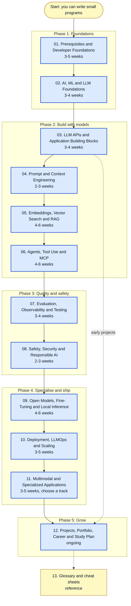

| Stage | Time | Open |
| --- | --- | --- |
| 01. Prerequisites and Developer Foundations | 3-5 weeks | [01-prerequisites-and-dev-foundations.md](01-prerequisites-and-dev-foundations.md) |
| 02. AI, ML and LLM Foundations | 3-4 weeks | [02-ai-ml-and-llm-foundations.md](02-ai-ml-and-llm-foundations.md) |
| 03. LLM APIs and Application Building Blocks | 3-4 weeks | [03-llm-apis-and-structured-outputs.md](03-llm-apis-and-structured-outputs.md) |
| 04. Prompt and Context Engineering | 2-3 weeks | [04-prompt-and-context-engineering.md](04-prompt-and-context-engineering.md) |
| 05. Embeddings, Vector Search and RAG | 4-6 weeks | [05-embeddings-vector-search-and-rag.md](05-embeddings-vector-search-and-rag.md) |
| 06. Agents, Tool Use and MCP | 4-6 weeks | [06-agents-tools-and-mcp.md](06-agents-tools-and-mcp.md) |
| 07. Evaluation, Observability and Testing | 3-4 weeks | [07-evaluation-observability-and-testing.md](07-evaluation-observability-and-testing.md) |
| 08. Safety, Security and Responsible AI | 2-3 weeks | [08-safety-security-and-responsible-ai.md](08-safety-security-and-responsible-ai.md) |
| 09. Open Models, Fine-Tuning and Local Inference | 4-6 weeks | [09-open-models-fine-tuning-and-local-inference.md](09-open-models-fine-tuning-and-local-inference.md) |
| 10. Deployment, LLMOps and Scaling | 3-5 weeks | [10-deployment-llmops-and-scaling.md](10-deployment-llmops-and-scaling.md) |
| 11. Multimodal and Specialized Applications | 3-5 weeks, choose a track | [11-multimodal-and-specialized-applications.md](11-multimodal-and-specialized-applications.md) |
| 12. Projects, Portfolio, Career and Study Plan | ongoing | [12-projects-portfolio-and-career.md](12-projects-portfolio-and-career.md) |
| 13. Glossary and Decision Cheat Sheets | reference | [13-glossary-and-cheat-sheets.md](13-glossary-and-cheat-sheets.md) |

## Prompt engineering path

Prompt engineering is taught mainly in [section 04](04-prompt-and-context-engineering.md), with supporting material in sections 02, 03, 07 and 08. This graph gives the learning order for the whole discipline, from first prompt to production practice.

```mermaid
%%{init: {"flowchart": {"nodeSpacing": 14, "rankSpacing": 45, "padding": 6}}}%%
flowchart LR
    classDef stage fill:#dbeafe,stroke:#1d4ed8,stroke-width:2px,color:#0f172a
    classDef topic fill:#e0f2fe,stroke:#0369a1,color:#0f172a
    classDef sub fill:#f8fafc,stroke:#94a3b8,color:#0f172a
    classDef practice fill:#dcfce7,stroke:#15803d,color:#0f172a
    classDef ref fill:#fef9c3,stroke:#a16207,color:#0f172a
    PE(["Prompt engineering"]):::stage
    PE(["Prompt engineering"]):::stage
    F["1. Foundations"]:::topic
    PE --> F
    F --> F1["What a prompt is: roles, tokens, context window"]:::sub
    F --> F2["How models work in one page: pretraining, instruction tuning, sampling"]:::sub
    F --> F3["Sampling controls: temperature, top-p, top-k"]:::sub
    F --> F4["Output limits: max tokens, stop sequences, repetition penalties"]:::sub
    F --> F5["Providers and model families"]:::sub
    C["2. Core techniques"]:::topic
    PE --> C
    C --> C1["Clear, specific instructions"]:::sub
    C --> C2["Zero-shot, one-shot and few-shot prompting"]:::sub
    C --> C3["System, role and contextual prompting"]:::sub
    C --> C4["Delimiters and structure (XML tags, markdown)"]:::sub
    C --> C5["Positive phrasing and format control"]:::sub
    C --> C6["Structured outputs and function calling"]:::sub
    R["3. Reasoning techniques"]:::topic
    PE --> R
    R --> R1["Chain of thought and zero-shot CoT"]:::sub
    R --> R2["Self-consistency"]:::sub
    R --> R3["Step-back prompting"]:::sub
    R --> R4["Tree of thoughts"]:::sub
    R --> R5["ReAct: reason and act with tools"]:::sub
    R --> R6["Prompting reasoning models"]:::sub
    D["4. Decomposition"]:::topic
    PE --> D
    D --> D1["Prompt chaining"]:::sub
    D --> D2["Routing"]:::sub
    D --> D3["Parallelization"]:::sub
    D --> D4["Plan then execute"]:::sub
    D --> D5["Reflection and critique-and-revise"]:::sub
    L["5. Reliability"]:::topic
    PE --> L
    L --> L1["Prompt debiasing"]:::sub
    L --> L2["Prompt ensembling"]:::sub
    L --> L3["LLM self-evaluation"]:::sub
    L --> L4["Calibration and abstention"]:::sub
    L --> L5["Validation, retries and fallbacks"]:::sub
    O["6. Prompt operations"]:::topic
    PE --> O
    O --> O1["Templates and variables"]:::sub
    O --> O2["Versioning and review"]:::sub
    O --> O3["Prompt tests and golden sets"]:::sub
    O --> O4["A/B comparisons and CI gates"]:::sub
    O --> O5["Automatic prompt optimization (DSPy and similar)"]:::sub
    O --> O6["Prompt tuning: manual iteration vs soft prompts"]:::sub
    X["7. Context engineering"]:::topic
    PE --> X
    X --> X1["What enters the context window"]:::sub
    X --> X2["Ordering, placement and the context budget"]:::sub
    X --> X3["Compaction and summarization"]:::sub
    X --> X4["Retrieval, memory and long context"]:::sub
    X --> X5["Prompt caching and cache-friendly layout"]:::sub
    X --> X6["Portability across models"]:::sub
    S["8. Safety"]:::topic
    PE --> S
    S --> S1["Prompt injection and trust boundaries"]:::sub
    S --> S2["Jailbreaks and data leakage"]:::sub
    S --> S3["Red-teaming your prompts"]:::sub
    S --> S4["Anti-patterns to avoid"]:::sub
    PRACTICE(["Practice: rewrite exercises, golden set, CI gate"]):::practice
    PE --> PRACTICE
```

| Topic | Where it is taught |
| --- | --- |
| Prompt anatomy, clarity, examples and structure | [04, topics 1 and 2](04-prompt-and-context-engineering.md#1-anatomy-of-a-strong-prompt) |
| Sampling parameters and tokens | [02](02-ai-ml-and-llm-foundations.md) and [03](03-llm-apis-and-structured-outputs.md) |
| Chain of thought, self-consistency, reasoning models | [04, topic 3](04-prompt-and-context-engineering.md#3-reasoning-prompts) |
| Step-back prompting and tree of thoughts | [04, topic 3](04-prompt-and-context-engineering.md#step-back-prompting-and-tree-of-thoughts) |
| Debiasing, ensembling, self-evaluation, calibration | [04, topic 3](04-prompt-and-context-engineering.md#improving-reliability-debiasing-ensembling-self-evaluation-and-calibration) |
| Chaining, routing, parallelization, ReAct, reflection | [04, topic 4](04-prompt-and-context-engineering.md#4-decomposition-chaining-routing-parallelization-planning-react-and-reflection) |
| Output control and repetition penalties | [04, topic 5](04-prompt-and-context-engineering.md#5-output-control) |
| System, role and contextual prompting | [04, topic 6](04-prompt-and-context-engineering.md#6-system-prompts-for-products) |
| Templates, versioning and prompt tests | [04, topics 7 and 8](04-prompt-and-context-engineering.md#7-prompt-templates-variables-and-version-control) |
| Automatic optimization and soft prompt tuning | [04, topic 9](04-prompt-and-context-engineering.md#9-automatic-prompt-optimization-and-programmatic-prompting) |
| Context engineering and portability | [04, topics 10 and 11](04-prompt-and-context-engineering.md#10-context-engineering) |
| Prompt injection and trust boundaries | [04, topic 12](04-prompt-and-context-engineering.md#12-prompt-injection-preview-and-trust-boundaries) and [08](08-safety-security-and-responsible-ai.md) |
| Evaluating prompts | [07](07-evaluation-observability-and-testing.md) |
| Worked example and rewrite exercises | [04, topics 14 and 15](04-prompt-and-context-engineering.md#14-worked-example-improving-a-bad-prompt-step-by-step) |

## Stage-by-stage graphs

Each graph shows the core topics of one section in study order, with the sub-topics hanging off them.

### 01. Prerequisites and Developer Foundations

File: [01-prerequisites-and-dev-foundations.md](01-prerequisites-and-dev-foundations.md) | Time: 3-5 weeks

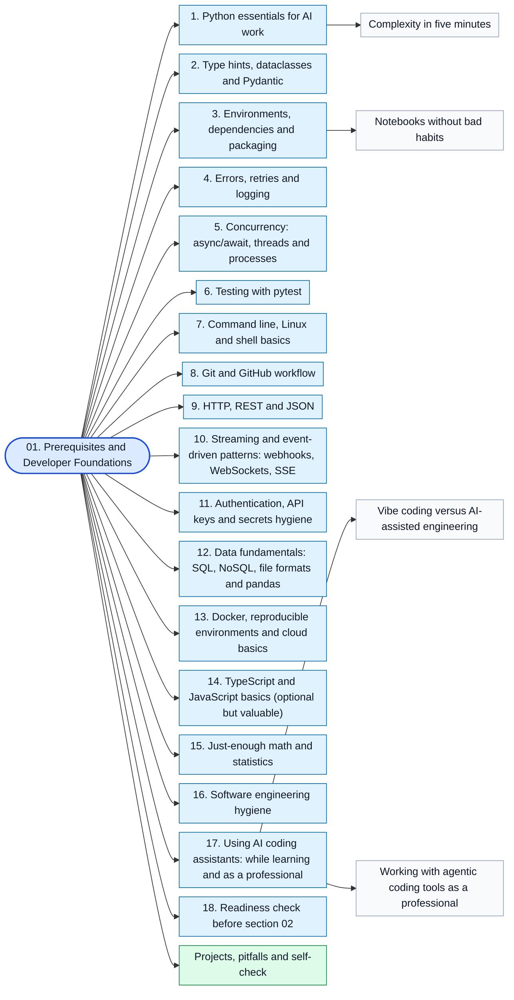

Topics in this stage:

- [1. Python essentials for AI work](01-prerequisites-and-dev-foundations.md#1-python-essentials-for-ai-work)
  - [Complexity in five minutes](01-prerequisites-and-dev-foundations.md#complexity-in-five-minutes)
- [2. Type hints, dataclasses and Pydantic](01-prerequisites-and-dev-foundations.md#2-type-hints-dataclasses-and-pydantic)
- [3. Environments, dependencies and packaging](01-prerequisites-and-dev-foundations.md#3-environments-dependencies-and-packaging)
  - [Notebooks without bad habits](01-prerequisites-and-dev-foundations.md#notebooks-without-bad-habits)
- [4. Errors, retries and logging](01-prerequisites-and-dev-foundations.md#4-errors-retries-and-logging)
- [5. Concurrency: async/await, threads and processes](01-prerequisites-and-dev-foundations.md#5-concurrency-asyncawait-threads-and-processes)
- [6. Testing with pytest](01-prerequisites-and-dev-foundations.md#6-testing-with-pytest)
- [7. Command line, Linux and shell basics](01-prerequisites-and-dev-foundations.md#7-command-line-linux-and-shell-basics)
- [8. Git and GitHub workflow](01-prerequisites-and-dev-foundations.md#8-git-and-github-workflow)
- [9. HTTP, REST and JSON](01-prerequisites-and-dev-foundations.md#9-http-rest-and-json)
- [10. Streaming and event-driven patterns: webhooks, WebSockets, SSE](01-prerequisites-and-dev-foundations.md#10-streaming-and-event-driven-patterns-webhooks-websockets-sse)
- [11. Authentication, API keys and secrets hygiene](01-prerequisites-and-dev-foundations.md#11-authentication-api-keys-and-secrets-hygiene)
- [12. Data fundamentals: SQL, NoSQL, file formats and pandas](01-prerequisites-and-dev-foundations.md#12-data-fundamentals-sql-nosql-file-formats-and-pandas)
- [13. Docker, reproducible environments and cloud basics](01-prerequisites-and-dev-foundations.md#13-docker-reproducible-environments-and-cloud-basics)
- [14. TypeScript and JavaScript basics (optional but valuable)](01-prerequisites-and-dev-foundations.md#14-typescript-and-javascript-basics-optional-but-valuable)
- [15. Just-enough math and statistics](01-prerequisites-and-dev-foundations.md#15-just-enough-math-and-statistics)
- [16. Software engineering hygiene](01-prerequisites-and-dev-foundations.md#16-software-engineering-hygiene)
- [17. Using AI coding assistants: while learning and as a professional](01-prerequisites-and-dev-foundations.md#17-using-ai-coding-assistants-while-learning-and-as-a-professional)
  - [Vibe coding versus AI-assisted engineering](01-prerequisites-and-dev-foundations.md#vibe-coding-versus-ai-assisted-engineering)
  - [Working with agentic coding tools as a professional](01-prerequisites-and-dev-foundations.md#working-with-agentic-coding-tools-as-a-professional)
- [18. Readiness check before section 02](01-prerequisites-and-dev-foundations.md#18-readiness-check-before-section-02)

### 02. AI, ML and LLM Foundations

File: [02-ai-ml-and-llm-foundations.md](02-ai-ml-and-llm-foundations.md) | Time: 3-4 weeks

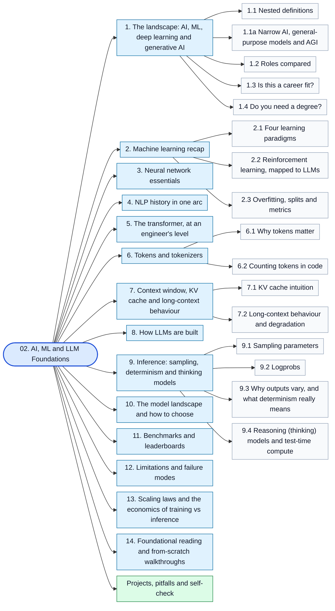

Topics in this stage:

- [1. The landscape: AI, ML, deep learning and generative AI](02-ai-ml-and-llm-foundations.md#1-the-landscape-ai-ml-deep-learning-and-generative-ai)
  - [1.1 Nested definitions](02-ai-ml-and-llm-foundations.md#11-nested-definitions)
  - [1.1a Narrow AI, general-purpose models and AGI](02-ai-ml-and-llm-foundations.md#11a-narrow-ai-general-purpose-models-and-agi)
  - [1.2 Roles compared](02-ai-ml-and-llm-foundations.md#12-roles-compared)
  - [1.3 Is this a career fit?](02-ai-ml-and-llm-foundations.md#13-is-this-a-career-fit)
  - [1.4 Do you need a degree?](02-ai-ml-and-llm-foundations.md#14-do-you-need-a-degree)
- [2. Machine learning recap](02-ai-ml-and-llm-foundations.md#2-machine-learning-recap)
  - [2.1 Four learning paradigms](02-ai-ml-and-llm-foundations.md#21-four-learning-paradigms)
  - [2.2 Reinforcement learning, mapped to LLMs](02-ai-ml-and-llm-foundations.md#22-reinforcement-learning-mapped-to-llms)
  - [2.3 Overfitting, splits and metrics](02-ai-ml-and-llm-foundations.md#23-overfitting-splits-and-metrics)
- [3. Neural network essentials](02-ai-ml-and-llm-foundations.md#3-neural-network-essentials)
- [4. NLP history in one arc](02-ai-ml-and-llm-foundations.md#4-nlp-history-in-one-arc)
- [5. The transformer, at an engineer's level](02-ai-ml-and-llm-foundations.md#5-the-transformer-at-an-engineers-level)
- [6. Tokens and tokenizers](02-ai-ml-and-llm-foundations.md#6-tokens-and-tokenizers)
  - [6.1 Why tokens matter](02-ai-ml-and-llm-foundations.md#61-why-tokens-matter)
  - [6.2 Counting tokens in code](02-ai-ml-and-llm-foundations.md#62-counting-tokens-in-code)
- [7. Context window, KV cache and long-context behaviour](02-ai-ml-and-llm-foundations.md#7-context-window-kv-cache-and-long-context-behaviour)
  - [7.1 KV cache intuition](02-ai-ml-and-llm-foundations.md#71-kv-cache-intuition)
  - [7.2 Long-context behaviour and degradation](02-ai-ml-and-llm-foundations.md#72-long-context-behaviour-and-degradation)
- [8. How LLMs are built](02-ai-ml-and-llm-foundations.md#8-how-llms-are-built)
- [9. Inference: sampling, determinism and thinking models](02-ai-ml-and-llm-foundations.md#9-inference-sampling-determinism-and-thinking-models)
  - [9.1 Sampling parameters](02-ai-ml-and-llm-foundations.md#91-sampling-parameters)
  - [9.2 Logprobs](02-ai-ml-and-llm-foundations.md#92-logprobs)
  - [9.3 Why outputs vary, and what determinism really means](02-ai-ml-and-llm-foundations.md#93-why-outputs-vary-and-what-determinism-really-means)
  - [9.4 Reasoning (thinking) models and test-time compute](02-ai-ml-and-llm-foundations.md#94-reasoning-thinking-models-and-test-time-compute)
- [10. The model landscape and how to choose](02-ai-ml-and-llm-foundations.md#10-the-model-landscape-and-how-to-choose)
- [11. Benchmarks and leaderboards](02-ai-ml-and-llm-foundations.md#11-benchmarks-and-leaderboards)
- [12. Limitations and failure modes](02-ai-ml-and-llm-foundations.md#12-limitations-and-failure-modes)
- [13. Scaling laws and the economics of training vs inference](02-ai-ml-and-llm-foundations.md#13-scaling-laws-and-the-economics-of-training-vs-inference)
- [14. Foundational reading and from-scratch walkthroughs](02-ai-ml-and-llm-foundations.md#14-foundational-reading-and-from-scratch-walkthroughs)

### 03. LLM APIs and Application Building Blocks

File: [03-llm-apis-and-structured-outputs.md](03-llm-apis-and-structured-outputs.md) | Time: 3-4 weeks

```mermaid
%%{init: {"flowchart": {"nodeSpacing": 14, "rankSpacing": 45, "padding": 6}}}%%
flowchart LR
    classDef stage fill:#dbeafe,stroke:#1d4ed8,stroke-width:2px,color:#0f172a
    classDef topic fill:#e0f2fe,stroke:#0369a1,color:#0f172a
    classDef sub fill:#f8fafc,stroke:#94a3b8,color:#0f172a
    classDef practice fill:#dcfce7,stroke:#15803d,color:#0f172a
    classDef ref fill:#fef9c3,stroke:#a16207,color:#0f172a
    ST03(["03. LLM APIs and Application Building Blocks"]):::stage
    T03_1["1. Choosing a provider and a hosting route"]:::topic
    ST03 --> T03_1
    T03_1 --> U03_1_1["1.1 Three ways to reach a model"]:::sub
    T03_1 --> U03_1_2["1.2 Compare criteria, not brands"]:::sub
    T03_1 --> U03_1_3["1.3 Provider families at a glance"]:::sub
    T03_1 --> U03_1_4["1.4 A practical selection process"]:::sub
    T03_2["2. Anatomy of an LLM API call"]:::topic
    ST03 --> T03_2
    T03_2 --> U03_2_1["2.1 Messages and roles"]:::sub
    T03_2 --> U03_2_2["2.2 Parameters that matter"]:::sub
    T03_2 --> U03_2_3["2.3 Reading the response"]:::sub
    T03_3["3. Reliability: errors, timeouts, retries, rate limits and idempotency"]:::topic
    ST03 --> T03_3
    T03_3 --> U03_3_1["3.1 Classify errors before you retry them"]:::sub
    T03_3 --> U03_3_2["3.2 Timeouts"]:::sub
    T03_3 --> U03_3_3["3.3 Retries with exponential backoff and jitter"]:::sub
    T03_3 --> U03_3_4["3.4 Rate limits and 429 handling"]:::sub
    T03_3 --> U03_3_5["3.5 Idempotency"]:::sub
    T03_4["4. Official SDKs, compatible endpoints and unified clients"]:::topic
    ST03 --> T03_4
    T03_4 --> U03_4_1["4.1 Use the official SDK first"]:::sub
    T03_4 --> U03_4_2["4.2 OpenAI-compatible endpoints and why they matter"]:::sub
    T03_4 --> U03_4_3["4.3 Unified clients and gateways"]:::sub
    T03_4 --> U03_4_4["4.4 TypeScript in one screen"]:::sub
    T03_5["5. Streaming responses"]:::topic
    ST03 --> T03_5
    T03_5 --> U03_5_1["5.1 Why stream"]:::sub
    T03_5 --> U03_5_2["5.2 How it works: server-sent events"]:::sub
    T03_5 --> U03_5_3["5.3 Example A: minimal streaming client in Python"]:::sub
    T03_5 --> U03_5_4["5.4 Building responsive UIs"]:::sub
    T03_5 --> U03_5_5["5.5 Partial JSON"]:::sub
    T03_5 --> U03_5_6["5.6 Cancellation"]:::sub
    T03_6["6. Structured outputs"]:::topic
    ST03 --> T03_6
    T03_6 --> U03_6_1["6.1 A spectrum of guarantees"]:::sub
    T03_6 --> U03_6_2["6.2 How constrained decoding works (conceptually)"]:::sub
    T03_6 --> U03_6_3["6.3 Example B: Pydantic schemas with both SDKs"]:::sub
    T03_6 --> U03_6_4["6.4 Validation layers and retry on failure"]:::sub
    T03_6 --> U03_6_5["6.5 Design tips and pitfalls"]:::sub
    T03_7["7. Function and tool calling"]:::topic
    ST03 --> T03_7
    T03_7 --> U03_7_1["7.1 The idea"]:::sub
    T03_7 --> U03_7_2["7.2 Defining tools well"]:::sub
    T03_7 --> U03_7_3["7.3 The loop, by hand"]:::sub
    T03_7 --> U03_7_4["7.4 Example C: a manual tool-calling loop"]:::sub
    T03_7 --> U03_7_5["7.5 Error handling and safety"]:::sub
    T03_7 --> U03_7_6["7.6 Provider-hosted tools"]:::sub
    T03_8["8. Multimodal inputs and file APIs"]:::topic
    ST03 --> T03_8
    T03_9["9. Conversation state and memory"]:::topic
    ST03 --> T03_9
    T03_9 --> U03_9_1["9.1 Stateless by default, stateful by choice"]:::sub
    T03_9 --> U03_9_2["9.2 Keeping history inside the window"]:::sub
    T03_9 --> U03_9_3["9.3 Token budgeting"]:::sub
    T03_9 --> U03_9_4["9.4 A trimming helper that respects tool calls"]:::sub
    T03_10["10. Cost, latency and throughput engineering"]:::topic
    ST03 --> T03_10
    T03_10 --> U03_10_1["10.1 Where the time and money go"]:::sub
    T03_10 --> U03_10_2["10.2 Prompt caching"]:::sub
    T03_10 --> U03_10_3["10.3 Batch APIs"]:::sub
    T03_10 --> U03_10_4["10.4 Model routing and cascades"]:::sub
    T03_10 --> U03_10_5["10.5 Smaller prompts, smaller outputs"]:::sub
    T03_10 --> U03_10_6["10.6 Parallelism, queueing and throughput"]:::sub
    T03_11["11. Reasoning models in the API"]:::topic
    ST03 --> T03_11
    T03_11 --> U03_11_1["11.1 What they are"]:::sub
    T03_11 --> U03_11_2["11.2 The controls (they differ by provider and change often)"]:::sub
    T03_11 --> U03_11_3["11.3 When to use them, and when not to"]:::sub
    T03_11 --> U03_11_4["11.4 How they change prompting and engineering"]:::sub
    T03_12["12. Secrets, key safety, budgets and per-user quotas"]:::topic
    ST03 --> T03_12
    T03_13["13. Testing LLM code"]:::topic
    ST03 --> T03_13
    T03_13 --> U03_13_1["13.1 What to test, and how"]:::sub
    T03_13 --> U03_13_2["13.2 Create deterministic seams"]:::sub
    T03_13 --> U03_13_3["13.3 Mocking, fixtures and recording"]:::sub
    T03_13 --> U03_13_4["13.4 Test the failure paths"]:::sub
    PR03["Projects, pitfalls and self-check"]:::practice
    ST03 --> PR03
```

Topics in this stage:

- [1. Choosing a provider and a hosting route](03-llm-apis-and-structured-outputs.md#1-choosing-a-provider-and-a-hosting-route)
  - [1.1 Three ways to reach a model](03-llm-apis-and-structured-outputs.md#11-three-ways-to-reach-a-model)
  - [1.2 Compare criteria, not brands](03-llm-apis-and-structured-outputs.md#12-compare-criteria-not-brands)
  - [1.3 Provider families at a glance](03-llm-apis-and-structured-outputs.md#13-provider-families-at-a-glance)
  - [1.4 A practical selection process](03-llm-apis-and-structured-outputs.md#14-a-practical-selection-process)
- [2. Anatomy of an LLM API call](03-llm-apis-and-structured-outputs.md#2-anatomy-of-an-llm-api-call)
  - [2.1 Messages and roles](03-llm-apis-and-structured-outputs.md#21-messages-and-roles)
  - [2.2 Parameters that matter](03-llm-apis-and-structured-outputs.md#22-parameters-that-matter)
  - [2.3 Reading the response](03-llm-apis-and-structured-outputs.md#23-reading-the-response)
- [3. Reliability: errors, timeouts, retries, rate limits and idempotency](03-llm-apis-and-structured-outputs.md#3-reliability-errors-timeouts-retries-rate-limits-and-idempotency)
  - [3.1 Classify errors before you retry them](03-llm-apis-and-structured-outputs.md#31-classify-errors-before-you-retry-them)
  - [3.2 Timeouts](03-llm-apis-and-structured-outputs.md#32-timeouts)
  - [3.3 Retries with exponential backoff and jitter](03-llm-apis-and-structured-outputs.md#33-retries-with-exponential-backoff-and-jitter)
  - [3.4 Rate limits and 429 handling](03-llm-apis-and-structured-outputs.md#34-rate-limits-and-429-handling)
  - [3.5 Idempotency](03-llm-apis-and-structured-outputs.md#35-idempotency)
- [4. Official SDKs, compatible endpoints and unified clients](03-llm-apis-and-structured-outputs.md#4-official-sdks-compatible-endpoints-and-unified-clients)
  - [4.1 Use the official SDK first](03-llm-apis-and-structured-outputs.md#41-use-the-official-sdk-first)
  - [4.2 OpenAI-compatible endpoints and why they matter](03-llm-apis-and-structured-outputs.md#42-openai-compatible-endpoints-and-why-they-matter)
  - [4.3 Unified clients and gateways](03-llm-apis-and-structured-outputs.md#43-unified-clients-and-gateways)
  - [4.4 TypeScript in one screen](03-llm-apis-and-structured-outputs.md#44-typescript-in-one-screen)
- [5. Streaming responses](03-llm-apis-and-structured-outputs.md#5-streaming-responses)
  - [5.1 Why stream](03-llm-apis-and-structured-outputs.md#51-why-stream)
  - [5.2 How it works: server-sent events](03-llm-apis-and-structured-outputs.md#52-how-it-works-server-sent-events)
  - [5.3 Example A: minimal streaming client in Python](03-llm-apis-and-structured-outputs.md#53-example-a-minimal-streaming-client-in-python)
  - [5.4 Building responsive UIs](03-llm-apis-and-structured-outputs.md#54-building-responsive-uis)
  - [5.5 Partial JSON](03-llm-apis-and-structured-outputs.md#55-partial-json)
  - [5.6 Cancellation](03-llm-apis-and-structured-outputs.md#56-cancellation)
- [6. Structured outputs](03-llm-apis-and-structured-outputs.md#6-structured-outputs)
  - [6.1 A spectrum of guarantees](03-llm-apis-and-structured-outputs.md#61-a-spectrum-of-guarantees)
  - [6.2 How constrained decoding works (conceptually)](03-llm-apis-and-structured-outputs.md#62-how-constrained-decoding-works-conceptually)
  - [6.3 Example B: Pydantic schemas with both SDKs](03-llm-apis-and-structured-outputs.md#63-example-b-pydantic-schemas-with-both-sdks)
  - [6.4 Validation layers and retry on failure](03-llm-apis-and-structured-outputs.md#64-validation-layers-and-retry-on-failure)
  - [6.5 Design tips and pitfalls](03-llm-apis-and-structured-outputs.md#65-design-tips-and-pitfalls)
- [7. Function and tool calling](03-llm-apis-and-structured-outputs.md#7-function-and-tool-calling)
  - [7.1 The idea](03-llm-apis-and-structured-outputs.md#71-the-idea)
  - [7.2 Defining tools well](03-llm-apis-and-structured-outputs.md#72-defining-tools-well)
  - [7.3 The loop, by hand](03-llm-apis-and-structured-outputs.md#73-the-loop-by-hand)
  - [7.4 Example C: a manual tool-calling loop](03-llm-apis-and-structured-outputs.md#74-example-c-a-manual-tool-calling-loop)
  - [7.5 Error handling and safety](03-llm-apis-and-structured-outputs.md#75-error-handling-and-safety)
  - [7.6 Provider-hosted tools](03-llm-apis-and-structured-outputs.md#76-provider-hosted-tools)
- [8. Multimodal inputs and file APIs](03-llm-apis-and-structured-outputs.md#8-multimodal-inputs-and-file-apis)
- [9. Conversation state and memory](03-llm-apis-and-structured-outputs.md#9-conversation-state-and-memory)
  - [9.1 Stateless by default, stateful by choice](03-llm-apis-and-structured-outputs.md#91-stateless-by-default-stateful-by-choice)
  - [9.2 Keeping history inside the window](03-llm-apis-and-structured-outputs.md#92-keeping-history-inside-the-window)
  - [9.3 Token budgeting](03-llm-apis-and-structured-outputs.md#93-token-budgeting)
  - [9.4 A trimming helper that respects tool calls](03-llm-apis-and-structured-outputs.md#94-a-trimming-helper-that-respects-tool-calls)
- [10. Cost, latency and throughput engineering](03-llm-apis-and-structured-outputs.md#10-cost-latency-and-throughput-engineering)
  - [10.1 Where the time and money go](03-llm-apis-and-structured-outputs.md#101-where-the-time-and-money-go)
  - [10.2 Prompt caching](03-llm-apis-and-structured-outputs.md#102-prompt-caching)
  - [10.3 Batch APIs](03-llm-apis-and-structured-outputs.md#103-batch-apis)
  - [10.4 Model routing and cascades](03-llm-apis-and-structured-outputs.md#104-model-routing-and-cascades)
  - [10.5 Smaller prompts, smaller outputs](03-llm-apis-and-structured-outputs.md#105-smaller-prompts-smaller-outputs)
  - [10.6 Parallelism, queueing and throughput](03-llm-apis-and-structured-outputs.md#106-parallelism-queueing-and-throughput)
- [11. Reasoning models in the API](03-llm-apis-and-structured-outputs.md#11-reasoning-models-in-the-api)
  - [11.1 What they are](03-llm-apis-and-structured-outputs.md#111-what-they-are)
  - [11.2 The controls (they differ by provider and change often)](03-llm-apis-and-structured-outputs.md#112-the-controls-they-differ-by-provider-and-change-often)
  - [11.3 When to use them, and when not to](03-llm-apis-and-structured-outputs.md#113-when-to-use-them-and-when-not-to)
  - [11.4 How they change prompting and engineering](03-llm-apis-and-structured-outputs.md#114-how-they-change-prompting-and-engineering)
- [12. Secrets, key safety, budgets and per-user quotas](03-llm-apis-and-structured-outputs.md#12-secrets-key-safety-budgets-and-per-user-quotas)
- [13. Testing LLM code](03-llm-apis-and-structured-outputs.md#13-testing-llm-code)
  - [13.1 What to test, and how](03-llm-apis-and-structured-outputs.md#131-what-to-test-and-how)
  - [13.2 Create deterministic seams](03-llm-apis-and-structured-outputs.md#132-create-deterministic-seams)
  - [13.3 Mocking, fixtures and recording](03-llm-apis-and-structured-outputs.md#133-mocking-fixtures-and-recording)
  - [13.4 Test the failure paths](03-llm-apis-and-structured-outputs.md#134-test-the-failure-paths)

### 04. Prompt and Context Engineering

File: [04-prompt-and-context-engineering.md](04-prompt-and-context-engineering.md) | Time: 2-3 weeks

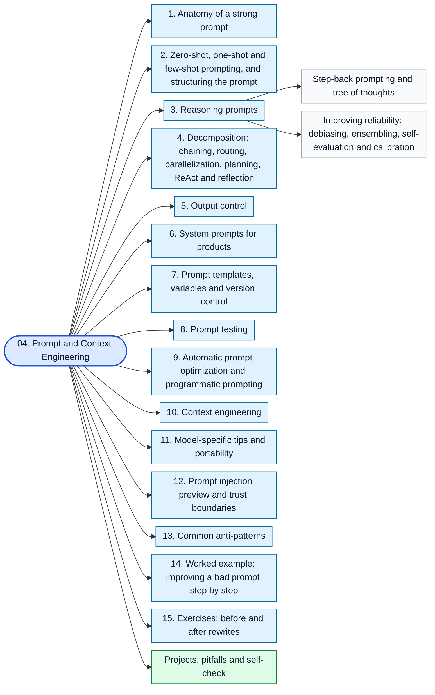

Topics in this stage:

- [1. Anatomy of a strong prompt](04-prompt-and-context-engineering.md#1-anatomy-of-a-strong-prompt)
- [2. Zero-shot, one-shot and few-shot prompting, and structuring the prompt](04-prompt-and-context-engineering.md#2-zero-shot-one-shot-and-few-shot-prompting-and-structuring-the-prompt)
- [3. Reasoning prompts](04-prompt-and-context-engineering.md#3-reasoning-prompts)
  - [Step-back prompting and tree of thoughts](04-prompt-and-context-engineering.md#step-back-prompting-and-tree-of-thoughts)
  - [Improving reliability: debiasing, ensembling, self-evaluation and calibration](04-prompt-and-context-engineering.md#improving-reliability-debiasing-ensembling-self-evaluation-and-calibration)
- [4. Decomposition: chaining, routing, parallelization, planning, ReAct and reflection](04-prompt-and-context-engineering.md#4-decomposition-chaining-routing-parallelization-planning-react-and-reflection)
- [5. Output control](04-prompt-and-context-engineering.md#5-output-control)
- [6. System prompts for products](04-prompt-and-context-engineering.md#6-system-prompts-for-products)
- [7. Prompt templates, variables and version control](04-prompt-and-context-engineering.md#7-prompt-templates-variables-and-version-control)
- [8. Prompt testing](04-prompt-and-context-engineering.md#8-prompt-testing)
- [9. Automatic prompt optimization and programmatic prompting](04-prompt-and-context-engineering.md#9-automatic-prompt-optimization-and-programmatic-prompting)
- [10. Context engineering](04-prompt-and-context-engineering.md#10-context-engineering)
- [11. Model-specific tips and portability](04-prompt-and-context-engineering.md#11-model-specific-tips-and-portability)
- [12. Prompt injection preview and trust boundaries](04-prompt-and-context-engineering.md#12-prompt-injection-preview-and-trust-boundaries)
- [13. Common anti-patterns](04-prompt-and-context-engineering.md#13-common-anti-patterns)
- [14. Worked example: improving a bad prompt step by step](04-prompt-and-context-engineering.md#14-worked-example-improving-a-bad-prompt-step-by-step)
- [15. Exercises: before and after rewrites](04-prompt-and-context-engineering.md#15-exercises-before-and-after-rewrites)

### 05. Embeddings, Vector Search and RAG

File: [05-embeddings-vector-search-and-rag.md](05-embeddings-vector-search-and-rag.md) | Time: 4-6 weeks

```mermaid
%%{init: {"flowchart": {"nodeSpacing": 14, "rankSpacing": 45, "padding": 6}}}%%
flowchart LR
    classDef stage fill:#dbeafe,stroke:#1d4ed8,stroke-width:2px,color:#0f172a
    classDef topic fill:#e0f2fe,stroke:#0369a1,color:#0f172a
    classDef sub fill:#f8fafc,stroke:#94a3b8,color:#0f172a
    classDef practice fill:#dcfce7,stroke:#15803d,color:#0f172a
    classDef ref fill:#fef9c3,stroke:#a16207,color:#0f172a
    ST05(["05. Embeddings, Vector Search and RAG"]):::stage
    T05_1["1. Embeddings: what they are, how they are trained, what 'similar' means"]:::topic
    ST05 --> T05_1
    T05_2["2. Choosing an embedding model"]:::topic
    ST05 --> T05_2
    T05_2 --> U05_2_1["2.1 Hosted (API) models"]:::sub
    T05_2 --> U05_2_2["2.2 Open models you can run yourself"]:::sub
    T05_2 --> U05_2_3["2.3 Reading the MTEB leaderboard critically"]:::sub
    T05_2 --> U05_2_4["2.4 Multilingual and multimodal embeddings"]:::sub
    T05_2 --> U05_2_5["2.5 Dimensionality, Matryoshka embeddings and quantization"]:::sub
    T05_2 --> U05_2_6["2.6 Asymmetric query vs document embeddings"]:::sub
    T05_2 --> U05_2_7["2.7 A practical selection procedure"]:::sub
    T05_2 --> U05_2_8["2.8 When and how to adapt an embedding model or reranker"]:::sub
    T05_3["3. Similarity metrics and normalization"]:::topic
    ST05 --> T05_3
    T05_4["4. Retrieval from scratch"]:::topic
    ST05 --> T05_4
    T05_5["5. Approximate nearest neighbour (ANN) search"]:::topic
    ST05 --> T05_5
    T05_6["6. Vector stores and how to choose"]:::topic
    ST05 --> T05_6
    T05_6 --> U05_6_1["6.1 Metadata filtering"]:::sub
    T05_7["7. Keyword and hybrid retrieval"]:::topic
    ST05 --> T05_7
    T05_8["8. The RAG pipeline end to end"]:::topic
    ST05 --> T05_8
    T05_8 --> U05_8_1["8.1 Ingestion: loading and parsing"]:::sub
    T05_8 --> U05_8_2["8.2 Cleaning"]:::sub
    T05_8 --> U05_8_3["8.3 Metadata enrichment"]:::sub
    T05_8 --> U05_8_4["8.4 Chunking strategies"]:::sub
    T05_8 --> U05_8_5["8.5 Indexing"]:::sub
    T05_8 --> U05_8_6["8.6 Retrieval"]:::sub
    T05_8 --> U05_8_7["8.7 Reranking"]:::sub
    T05_8 --> U05_8_8["8.8 Query transformation"]:::sub
    T05_8 --> U05_8_9["8.9 Context assembly"]:::sub
    T05_8 --> U05_8_10["8.10 Generation with citations and abstention"]:::sub
    T05_9["9. Advanced RAG patterns"]:::topic
    ST05 --> T05_9
    T05_9 --> U05_9_1["9.1 Contextual retrieval and late chunking"]:::sub
    T05_9 --> U05_9_2["9.2 Agentic RAG"]:::sub
    T05_9 --> U05_9_3["9.3 GraphRAG and knowledge graphs"]:::sub
    T05_9 --> U05_9_4["9.4 Late interaction (ColBERT-style)"]:::sub
    T05_9 --> U05_9_5["9.5 Multimodal RAG"]:::sub
    T05_9 --> U05_9_6["9.6 Semantic caching"]:::sub
    T05_9 --> U05_9_7["9.7 RAG over structured data and text-to-SQL"]:::sub
    T05_10["10. Evaluating RAG"]:::topic
    ST05 --> T05_10
    T05_10 --> U05_10_1["10.1 Build a labeled query set"]:::sub
    T05_10 --> U05_10_2["10.2 Retrieval metrics"]:::sub
    T05_10 --> U05_10_3["10.3 Generation metrics"]:::sub
    T05_10 --> U05_10_4["10.4 Separate retrieval failures from generation failures"]:::sub
    T05_11["11. Operating a RAG system"]:::topic
    ST05 --> T05_11
    T05_11 --> U05_11_1["11.1 Incremental updates and deletions"]:::sub
    T05_11 --> U05_11_2["11.2 Freshness"]:::sub
    T05_11 --> U05_11_3["11.3 Re-embedding when models change"]:::sub
    T05_11 --> U05_11_4["11.4 Document-level access control"]:::sub
    T05_11 --> U05_11_5["11.5 Multi-tenancy"]:::sub
    T05_11 --> U05_11_6["11.6 PII and sensitive data"]:::sub
    T05_12["12. RAG, long context, fine-tuning or tools?"]:::topic
    ST05 --> T05_12
    T05_13["13. Common failure modes and a debugging playbook"]:::topic
    ST05 --> T05_13
    T05_14["14. Frameworks: LlamaIndex, LangChain, Haystack or DIY"]:::topic
    ST05 --> T05_14
    PR05["Projects, pitfalls and self-check"]:::practice
    ST05 --> PR05
```

Topics in this stage:

- [1. Embeddings: what they are, how they are trained, what 'similar' means](05-embeddings-vector-search-and-rag.md#1-embeddings-what-they-are-how-they-are-trained-what-similar-means)
- [2. Choosing an embedding model](05-embeddings-vector-search-and-rag.md#2-choosing-an-embedding-model)
  - [2.1 Hosted (API) models](05-embeddings-vector-search-and-rag.md#21-hosted-api-models)
  - [2.2 Open models you can run yourself](05-embeddings-vector-search-and-rag.md#22-open-models-you-can-run-yourself)
  - [2.3 Reading the MTEB leaderboard critically](05-embeddings-vector-search-and-rag.md#23-reading-the-mteb-leaderboard-critically)
  - [2.4 Multilingual and multimodal embeddings](05-embeddings-vector-search-and-rag.md#24-multilingual-and-multimodal-embeddings)
  - [2.5 Dimensionality, Matryoshka embeddings and quantization](05-embeddings-vector-search-and-rag.md#25-dimensionality-matryoshka-embeddings-and-quantization)
  - [2.6 Asymmetric query vs document embeddings](05-embeddings-vector-search-and-rag.md#26-asymmetric-query-vs-document-embeddings)
  - [2.7 A practical selection procedure](05-embeddings-vector-search-and-rag.md#27-a-practical-selection-procedure)
  - [2.8 When and how to adapt an embedding model or reranker](05-embeddings-vector-search-and-rag.md#28-when-and-how-to-adapt-an-embedding-model-or-reranker)
- [3. Similarity metrics and normalization](05-embeddings-vector-search-and-rag.md#3-similarity-metrics-and-normalization)
- [4. Retrieval from scratch](05-embeddings-vector-search-and-rag.md#4-retrieval-from-scratch)
- [5. Approximate nearest neighbour (ANN) search](05-embeddings-vector-search-and-rag.md#5-approximate-nearest-neighbour-ann-search)
- [6. Vector stores and how to choose](05-embeddings-vector-search-and-rag.md#6-vector-stores-and-how-to-choose)
  - [6.1 Metadata filtering](05-embeddings-vector-search-and-rag.md#61-metadata-filtering)
- [7. Keyword and hybrid retrieval](05-embeddings-vector-search-and-rag.md#7-keyword-and-hybrid-retrieval)
- [8. The RAG pipeline end to end](05-embeddings-vector-search-and-rag.md#8-the-rag-pipeline-end-to-end)
  - [8.1 Ingestion: loading and parsing](05-embeddings-vector-search-and-rag.md#81-ingestion-loading-and-parsing)
  - [8.2 Cleaning](05-embeddings-vector-search-and-rag.md#82-cleaning)
  - [8.3 Metadata enrichment](05-embeddings-vector-search-and-rag.md#83-metadata-enrichment)
  - [8.4 Chunking strategies](05-embeddings-vector-search-and-rag.md#84-chunking-strategies)
  - [8.5 Indexing](05-embeddings-vector-search-and-rag.md#85-indexing)
  - [8.6 Retrieval](05-embeddings-vector-search-and-rag.md#86-retrieval)
  - [8.7 Reranking](05-embeddings-vector-search-and-rag.md#87-reranking)
  - [8.8 Query transformation](05-embeddings-vector-search-and-rag.md#88-query-transformation)
  - [8.9 Context assembly](05-embeddings-vector-search-and-rag.md#89-context-assembly)
  - [8.10 Generation with citations and abstention](05-embeddings-vector-search-and-rag.md#810-generation-with-citations-and-abstention)
- [9. Advanced RAG patterns](05-embeddings-vector-search-and-rag.md#9-advanced-rag-patterns)
  - [9.1 Contextual retrieval and late chunking](05-embeddings-vector-search-and-rag.md#91-contextual-retrieval-and-late-chunking)
  - [9.2 Agentic RAG](05-embeddings-vector-search-and-rag.md#92-agentic-rag)
  - [9.3 GraphRAG and knowledge graphs](05-embeddings-vector-search-and-rag.md#93-graphrag-and-knowledge-graphs)
  - [9.4 Late interaction (ColBERT-style)](05-embeddings-vector-search-and-rag.md#94-late-interaction-colbert-style)
  - [9.5 Multimodal RAG](05-embeddings-vector-search-and-rag.md#95-multimodal-rag)
  - [9.6 Semantic caching](05-embeddings-vector-search-and-rag.md#96-semantic-caching)
  - [9.7 RAG over structured data and text-to-SQL](05-embeddings-vector-search-and-rag.md#97-rag-over-structured-data-and-text-to-sql)
- [10. Evaluating RAG](05-embeddings-vector-search-and-rag.md#10-evaluating-rag)
  - [10.1 Build a labeled query set](05-embeddings-vector-search-and-rag.md#101-build-a-labeled-query-set)
  - [10.2 Retrieval metrics](05-embeddings-vector-search-and-rag.md#102-retrieval-metrics)
  - [10.3 Generation metrics](05-embeddings-vector-search-and-rag.md#103-generation-metrics)
  - [10.4 Separate retrieval failures from generation failures](05-embeddings-vector-search-and-rag.md#104-separate-retrieval-failures-from-generation-failures)
- [11. Operating a RAG system](05-embeddings-vector-search-and-rag.md#11-operating-a-rag-system)
  - [11.1 Incremental updates and deletions](05-embeddings-vector-search-and-rag.md#111-incremental-updates-and-deletions)
  - [11.2 Freshness](05-embeddings-vector-search-and-rag.md#112-freshness)
  - [11.3 Re-embedding when models change](05-embeddings-vector-search-and-rag.md#113-re-embedding-when-models-change)
  - [11.4 Document-level access control](05-embeddings-vector-search-and-rag.md#114-document-level-access-control)
  - [11.5 Multi-tenancy](05-embeddings-vector-search-and-rag.md#115-multi-tenancy)
  - [11.6 PII and sensitive data](05-embeddings-vector-search-and-rag.md#116-pii-and-sensitive-data)
- [12. RAG, long context, fine-tuning or tools?](05-embeddings-vector-search-and-rag.md#12-rag-long-context-fine-tuning-or-tools)
- [13. Common failure modes and a debugging playbook](05-embeddings-vector-search-and-rag.md#13-common-failure-modes-and-a-debugging-playbook)
- [14. Frameworks: LlamaIndex, LangChain, Haystack or DIY](05-embeddings-vector-search-and-rag.md#14-frameworks-llamaindex-langchain-haystack-or-diy)

### 06. Agents, Tool Use and MCP

File: [06-agents-tools-and-mcp.md](06-agents-tools-and-mcp.md) | Time: 4-6 weeks

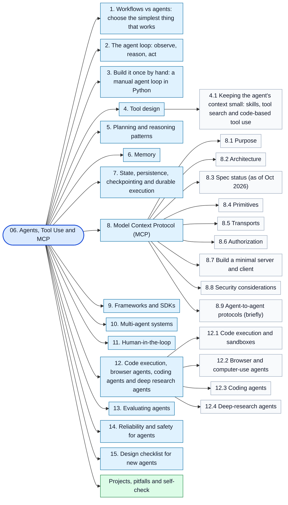

Topics in this stage:

- [1. Workflows vs agents: choose the simplest thing that works](06-agents-tools-and-mcp.md#1-workflows-vs-agents-choose-the-simplest-thing-that-works)
- [2. The agent loop: observe, reason, act](06-agents-tools-and-mcp.md#2-the-agent-loop-observe-reason-act)
- [3. Build it once by hand: a manual agent loop in Python](06-agents-tools-and-mcp.md#3-build-it-once-by-hand-a-manual-agent-loop-in-python)
- [4. Tool design](06-agents-tools-and-mcp.md#4-tool-design)
  - [4.1 Keeping the agent's context small: skills, tool search and code-based tool use](06-agents-tools-and-mcp.md#41-keeping-the-agents-context-small-skills-tool-search-and-code-based-tool-use)
- [5. Planning and reasoning patterns](06-agents-tools-and-mcp.md#5-planning-and-reasoning-patterns)
- [6. Memory](06-agents-tools-and-mcp.md#6-memory)
- [7. State, persistence, checkpointing and durable execution](06-agents-tools-and-mcp.md#7-state-persistence-checkpointing-and-durable-execution)
- [8. Model Context Protocol (MCP)](06-agents-tools-and-mcp.md#8-model-context-protocol-mcp)
  - [8.1 Purpose](06-agents-tools-and-mcp.md#81-purpose)
  - [8.2 Architecture](06-agents-tools-and-mcp.md#82-architecture)
  - [8.3 Spec status (as of Oct 2026)](06-agents-tools-and-mcp.md#83-spec-status-as-of-oct-2026)
  - [8.4 Primitives](06-agents-tools-and-mcp.md#84-primitives)
  - [8.5 Transports](06-agents-tools-and-mcp.md#85-transports)
  - [8.6 Authorization](06-agents-tools-and-mcp.md#86-authorization)
  - [8.7 Build a minimal server and client](06-agents-tools-and-mcp.md#87-build-a-minimal-server-and-client)
  - [8.8 Security considerations](06-agents-tools-and-mcp.md#88-security-considerations)
  - [8.9 Agent-to-agent protocols (briefly)](06-agents-tools-and-mcp.md#89-agent-to-agent-protocols-briefly)
- [9. Frameworks and SDKs](06-agents-tools-and-mcp.md#9-frameworks-and-sdks)
- [10. Multi-agent systems](06-agents-tools-and-mcp.md#10-multi-agent-systems)
- [11. Human-in-the-loop](06-agents-tools-and-mcp.md#11-human-in-the-loop)
- [12. Code execution, browser agents, coding agents and deep research agents](06-agents-tools-and-mcp.md#12-code-execution-browser-agents-coding-agents-and-deep-research-agents)
  - [12.1 Code execution and sandboxes](06-agents-tools-and-mcp.md#121-code-execution-and-sandboxes)
  - [12.2 Browser and computer-use agents](06-agents-tools-and-mcp.md#122-browser-and-computer-use-agents)
  - [12.3 Coding agents](06-agents-tools-and-mcp.md#123-coding-agents)
  - [12.4 Deep-research agents](06-agents-tools-and-mcp.md#124-deep-research-agents)
- [13. Evaluating agents](06-agents-tools-and-mcp.md#13-evaluating-agents)
- [14. Reliability and safety for agents](06-agents-tools-and-mcp.md#14-reliability-and-safety-for-agents)
- [15. Design checklist for new agents](06-agents-tools-and-mcp.md#15-design-checklist-for-new-agents)

### 07. Evaluation, Observability and Testing

File: [07-evaluation-observability-and-testing.md](07-evaluation-observability-and-testing.md) | Time: 3-4 weeks

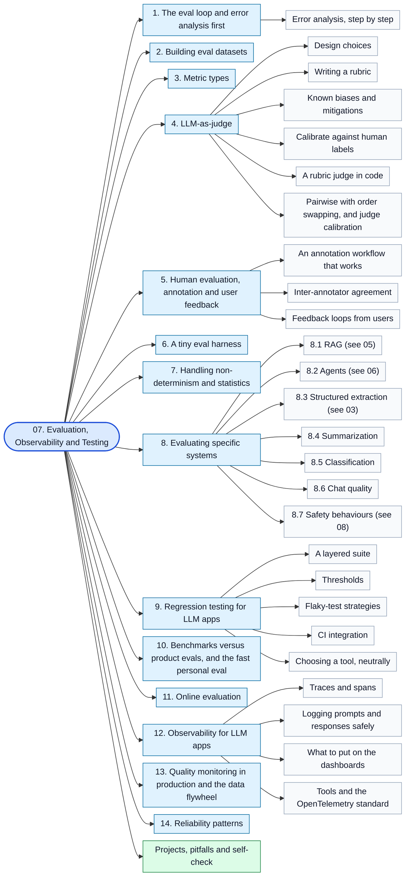

Topics in this stage:

- [1. The eval loop and error analysis first](07-evaluation-observability-and-testing.md#1-the-eval-loop-and-error-analysis-first)
  - [Error analysis, step by step](07-evaluation-observability-and-testing.md#error-analysis-step-by-step)
- [2. Building eval datasets](07-evaluation-observability-and-testing.md#2-building-eval-datasets)
- [3. Metric types](07-evaluation-observability-and-testing.md#3-metric-types)
- [4. LLM-as-judge](07-evaluation-observability-and-testing.md#4-llm-as-judge)
  - [Design choices](07-evaluation-observability-and-testing.md#design-choices)
  - [Writing a rubric](07-evaluation-observability-and-testing.md#writing-a-rubric)
  - [Known biases and mitigations](07-evaluation-observability-and-testing.md#known-biases-and-mitigations)
  - [Calibrate against human labels](07-evaluation-observability-and-testing.md#calibrate-against-human-labels)
  - [A rubric judge in code](07-evaluation-observability-and-testing.md#a-rubric-judge-in-code)
  - [Pairwise with order swapping, and judge calibration](07-evaluation-observability-and-testing.md#pairwise-with-order-swapping-and-judge-calibration)
- [5. Human evaluation, annotation and user feedback](07-evaluation-observability-and-testing.md#5-human-evaluation-annotation-and-user-feedback)
  - [An annotation workflow that works](07-evaluation-observability-and-testing.md#an-annotation-workflow-that-works)
  - [Inter-annotator agreement](07-evaluation-observability-and-testing.md#inter-annotator-agreement)
  - [Feedback loops from users](07-evaluation-observability-and-testing.md#feedback-loops-from-users)
- [6. A tiny eval harness](07-evaluation-observability-and-testing.md#6-a-tiny-eval-harness)
- [7. Handling non-determinism and statistics](07-evaluation-observability-and-testing.md#7-handling-non-determinism-and-statistics)
- [8. Evaluating specific systems](07-evaluation-observability-and-testing.md#8-evaluating-specific-systems)
  - [8.1 RAG (see 05)](07-evaluation-observability-and-testing.md#81-rag-see-05)
  - [8.2 Agents (see 06)](07-evaluation-observability-and-testing.md#82-agents-see-06)
  - [8.3 Structured extraction (see 03)](07-evaluation-observability-and-testing.md#83-structured-extraction-see-03)
  - [8.4 Summarization](07-evaluation-observability-and-testing.md#84-summarization)
  - [8.5 Classification](07-evaluation-observability-and-testing.md#85-classification)
  - [8.6 Chat quality](07-evaluation-observability-and-testing.md#86-chat-quality)
  - [8.7 Safety behaviours (see 08)](07-evaluation-observability-and-testing.md#87-safety-behaviours-see-08)
- [9. Regression testing for LLM apps](07-evaluation-observability-and-testing.md#9-regression-testing-for-llm-apps)
  - [A layered suite](07-evaluation-observability-and-testing.md#a-layered-suite)
  - [Thresholds](07-evaluation-observability-and-testing.md#thresholds)
  - [Flaky-test strategies](07-evaluation-observability-and-testing.md#flaky-test-strategies)
  - [CI integration](07-evaluation-observability-and-testing.md#ci-integration)
  - [Choosing a tool, neutrally](07-evaluation-observability-and-testing.md#choosing-a-tool-neutrally)
- [10. Benchmarks versus product evals, and the fast personal eval](07-evaluation-observability-and-testing.md#10-benchmarks-versus-product-evals-and-the-fast-personal-eval)
- [11. Online evaluation](07-evaluation-observability-and-testing.md#11-online-evaluation)
- [12. Observability for LLM apps](07-evaluation-observability-and-testing.md#12-observability-for-llm-apps)
  - [Traces and spans](07-evaluation-observability-and-testing.md#traces-and-spans)
  - [Logging prompts and responses safely](07-evaluation-observability-and-testing.md#logging-prompts-and-responses-safely)
  - [What to put on the dashboards](07-evaluation-observability-and-testing.md#what-to-put-on-the-dashboards)
  - [Tools and the OpenTelemetry standard](07-evaluation-observability-and-testing.md#tools-and-the-opentelemetry-standard)
- [13. Quality monitoring in production and the data flywheel](07-evaluation-observability-and-testing.md#13-quality-monitoring-in-production-and-the-data-flywheel)
- [14. Reliability patterns](07-evaluation-observability-and-testing.md#14-reliability-patterns)

### 08. Safety, Security and Responsible AI

File: [08-safety-security-and-responsible-ai.md](08-safety-security-and-responsible-ai.md) | Time: 2-3 weeks

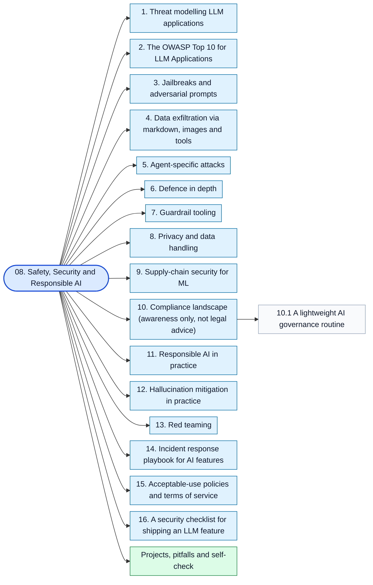

Topics in this stage:

- [1. Threat modelling LLM applications](08-safety-security-and-responsible-ai.md#1-threat-modelling-llm-applications)
- [2. The OWASP Top 10 for LLM Applications](08-safety-security-and-responsible-ai.md#2-the-owasp-top-10-for-llm-applications)
- [3. Jailbreaks and adversarial prompts](08-safety-security-and-responsible-ai.md#3-jailbreaks-and-adversarial-prompts)
- [4. Data exfiltration via markdown, images and tools](08-safety-security-and-responsible-ai.md#4-data-exfiltration-via-markdown-images-and-tools)
- [5. Agent-specific attacks](08-safety-security-and-responsible-ai.md#5-agent-specific-attacks)
- [6. Defence in depth](08-safety-security-and-responsible-ai.md#6-defence-in-depth)
- [7. Guardrail tooling](08-safety-security-and-responsible-ai.md#7-guardrail-tooling)
- [8. Privacy and data handling](08-safety-security-and-responsible-ai.md#8-privacy-and-data-handling)
- [9. Supply-chain security for ML](08-safety-security-and-responsible-ai.md#9-supply-chain-security-for-ml)
- [10. Compliance landscape (awareness only, not legal advice)](08-safety-security-and-responsible-ai.md#10-compliance-landscape-awareness-only-not-legal-advice)
  - [10.1 A lightweight AI governance routine](08-safety-security-and-responsible-ai.md#101-a-lightweight-ai-governance-routine)
- [11. Responsible AI in practice](08-safety-security-and-responsible-ai.md#11-responsible-ai-in-practice)
- [12. Hallucination mitigation in practice](08-safety-security-and-responsible-ai.md#12-hallucination-mitigation-in-practice)
- [13. Red teaming](08-safety-security-and-responsible-ai.md#13-red-teaming)
- [14. Incident response playbook for AI features](08-safety-security-and-responsible-ai.md#14-incident-response-playbook-for-ai-features)
- [15. Acceptable-use policies and terms of service](08-safety-security-and-responsible-ai.md#15-acceptable-use-policies-and-terms-of-service)
- [16. A security checklist for shipping an LLM feature](08-safety-security-and-responsible-ai.md#16-a-security-checklist-for-shipping-an-llm-feature)

### 09. Open Models, Fine-Tuning and Local Inference

File: [09-open-models-fine-tuning-and-local-inference.md](09-open-models-fine-tuning-and-local-inference.md) | Time: 4-6 weeks

```mermaid
%%{init: {"flowchart": {"nodeSpacing": 14, "rankSpacing": 45, "padding": 6}}}%%
flowchart LR
    classDef stage fill:#dbeafe,stroke:#1d4ed8,stroke-width:2px,color:#0f172a
    classDef topic fill:#e0f2fe,stroke:#0369a1,color:#0f172a
    classDef sub fill:#f8fafc,stroke:#94a3b8,color:#0f172a
    classDef practice fill:#dcfce7,stroke:#15803d,color:#0f172a
    classDef ref fill:#fef9c3,stroke:#a16207,color:#0f172a
    ST09(["09. Open Models, Fine-Tuning and Local Inference"]):::stage
    T09_1["1. Open weights, licences and model families"]:::topic
    ST09 --> T09_1
    T09_1 --> U09_1_1["1.1 Three meanings of 'open'"]:::sub
    T09_1 --> U09_1_2["1.2 Licences you will meet"]:::sub
    T09_1 --> U09_1_3["1.3 What you may and may not do (awareness checklist)"]:::sub
    T09_1 --> U09_1_4["1.4 Model families to know"]:::sub
    T09_1 --> U09_1_5["1.5 Choosing a model"]:::sub
    T09_2["2. The Hugging Face ecosystem"]:::topic
    ST09 --> T09_2
    T09_2 --> U09_2_1["2.1 The Hub, model cards and gated models"]:::sub
    T09_2 --> U09_2_2["2.2 The libraries"]:::sub
    T09_2 --> U09_2_3["2.3 Hosted options on the Hub"]:::sub
    T09_2 --> U09_2_4["2.4 Running a model with transformers"]:::sub
    T09_3["3. Running models locally and serving them"]:::topic
    ST09 --> T09_3
    T09_3 --> U09_3_1["3.1 Local runners"]:::sub
    T09_3 --> U09_3_2["3.2 Serving engines"]:::sub
    T09_3 --> U09_3_3["3.3 Everything speaks the OpenAI protocol"]:::sub
    T09_3 --> U09_3_4["3.4 Structured output and tool calling on open models"]:::sub
    T09_3 --> U09_3_5["3.5 Pitfalls when running locally"]:::sub
    T09_4["4. Quantization and the memory math"]:::topic
    ST09 --> T09_4
    T09_4 --> U09_4_1["4.1 What quantization does"]:::sub
    T09_4 --> U09_4_2["4.2 The formats"]:::sub
    T09_4 --> U09_4_3["4.3 Quality versus size"]:::sub
    T09_4 --> U09_4_4["4.4 Memory math you can do on a napkin"]:::sub
    T09_4 --> U09_4_5["4.5 Hardware guidance"]:::sub
    T09_5["5. Decision framework: prompt, RAG, fine-tune, distil or scale up"]:::topic
    ST09 --> T09_5
    T09_6["6. Fine-tuning methods"]:::topic
    ST09 --> T09_6
    T09_6 --> U09_6_1["6.1 Continued pretraining"]:::sub
    T09_6 --> U09_6_2["6.2 Supervised fine-tuning (SFT) and instruction tuning"]:::sub
    T09_6 --> U09_6_3["6.3 Parameter-efficient fine-tuning: LoRA, QLoRA, DoRA"]:::sub
    T09_6 --> U09_6_4["6.4 Preference optimization: DPO, ORPO, KTO"]:::sub
    T09_6 --> U09_6_5["6.5 Reinforcement learning with verifiable rewards (GRPO), conceptually"]:::sub
    T09_6 --> U09_6_6["6.6 Hosted fine-tuning APIs"]:::sub
    T09_6 --> U09_6_7["6.7 A conceptual SFT script with TRL and LoRA"]:::sub
    T09_7["7. Data is the product"]:::topic
    ST09 --> T09_7
    T09_7 --> U09_7_1["7.1 Formats and chat templates"]:::sub
    T09_7 --> U09_7_2["7.2 Curation: quality beats quantity"]:::sub
    T09_7 --> U09_7_3["7.3 Cleaning, deduplication and quality filtering"]:::sub
    T09_7 --> U09_7_4["7.4 Synthetic data and distillation"]:::sub
    T09_7 --> U09_7_5["7.5 Licensing and provenance"]:::sub
    T09_7 --> U09_7_6["7.6 Train/eval split and contamination"]:::sub
    T09_8["8. Training tooling and hyperparameters"]:::topic
    ST09 --> T09_8
    T09_8 --> U09_8_1["8.1 Tooling landscape"]:::sub
    T09_8 --> U09_8_2["8.2 Experiment tracking"]:::sub
    T09_8 --> U09_8_3["8.3 The hyperparameters that matter"]:::sub
    T09_8 --> U09_8_4["8.4 No GPU? A budget path"]:::sub
    T09_9["9. Evaluating a fine-tuned model"]:::topic
    ST09 --> T09_9
    T09_9 --> U09_9_1["9.1 The baseline ladder"]:::sub
    T09_9 --> U09_9_2["9.2 Forgetting, regressions and overfitting"]:::sub
    T09_10["10. Adapters, merging, small models and the edge"]:::topic
    ST09 --> T09_10
    T09_10 --> U09_10_1["10.1 Adapter lifecycle and serving many LoRAs"]:::sub
    T09_10 --> U09_10_2["10.2 Model merging"]:::sub
    T09_10 --> U09_10_3["10.3 Small language models and on-device deployment"]:::sub
    T09_11["11. Classical ML still matters"]:::topic
    ST09 --> T09_11
    PR09["Projects, pitfalls and self-check"]:::practice
    ST09 --> PR09
```

Topics in this stage:

- [1. Open weights, licences and model families](09-open-models-fine-tuning-and-local-inference.md#1-open-weights-licences-and-model-families)
  - [1.1 Three meanings of 'open'](09-open-models-fine-tuning-and-local-inference.md#11-three-meanings-of-open)
  - [1.2 Licences you will meet](09-open-models-fine-tuning-and-local-inference.md#12-licences-you-will-meet)
  - [1.3 What you may and may not do (awareness checklist)](09-open-models-fine-tuning-and-local-inference.md#13-what-you-may-and-may-not-do-awareness-checklist)
  - [1.4 Model families to know](09-open-models-fine-tuning-and-local-inference.md#14-model-families-to-know)
  - [1.5 Choosing a model](09-open-models-fine-tuning-and-local-inference.md#15-choosing-a-model)
- [2. The Hugging Face ecosystem](09-open-models-fine-tuning-and-local-inference.md#2-the-hugging-face-ecosystem)
  - [2.1 The Hub, model cards and gated models](09-open-models-fine-tuning-and-local-inference.md#21-the-hub-model-cards-and-gated-models)
  - [2.2 The libraries](09-open-models-fine-tuning-and-local-inference.md#22-the-libraries)
  - [2.3 Hosted options on the Hub](09-open-models-fine-tuning-and-local-inference.md#23-hosted-options-on-the-hub)
  - [2.4 Running a model with transformers](09-open-models-fine-tuning-and-local-inference.md#24-running-a-model-with-transformers)
- [3. Running models locally and serving them](09-open-models-fine-tuning-and-local-inference.md#3-running-models-locally-and-serving-them)
  - [3.1 Local runners](09-open-models-fine-tuning-and-local-inference.md#31-local-runners)
  - [3.2 Serving engines](09-open-models-fine-tuning-and-local-inference.md#32-serving-engines)
  - [3.3 Everything speaks the OpenAI protocol](09-open-models-fine-tuning-and-local-inference.md#33-everything-speaks-the-openai-protocol)
  - [3.4 Structured output and tool calling on open models](09-open-models-fine-tuning-and-local-inference.md#34-structured-output-and-tool-calling-on-open-models)
  - [3.5 Pitfalls when running locally](09-open-models-fine-tuning-and-local-inference.md#35-pitfalls-when-running-locally)
- [4. Quantization and the memory math](09-open-models-fine-tuning-and-local-inference.md#4-quantization-and-the-memory-math)
  - [4.1 What quantization does](09-open-models-fine-tuning-and-local-inference.md#41-what-quantization-does)
  - [4.2 The formats](09-open-models-fine-tuning-and-local-inference.md#42-the-formats)
  - [4.3 Quality versus size](09-open-models-fine-tuning-and-local-inference.md#43-quality-versus-size)
  - [4.4 Memory math you can do on a napkin](09-open-models-fine-tuning-and-local-inference.md#44-memory-math-you-can-do-on-a-napkin)
  - [4.5 Hardware guidance](09-open-models-fine-tuning-and-local-inference.md#45-hardware-guidance)
- [5. Decision framework: prompt, RAG, fine-tune, distil or scale up](09-open-models-fine-tuning-and-local-inference.md#5-decision-framework-prompt-rag-fine-tune-distil-or-scale-up)
- [6. Fine-tuning methods](09-open-models-fine-tuning-and-local-inference.md#6-fine-tuning-methods)
  - [6.1 Continued pretraining](09-open-models-fine-tuning-and-local-inference.md#61-continued-pretraining)
  - [6.2 Supervised fine-tuning (SFT) and instruction tuning](09-open-models-fine-tuning-and-local-inference.md#62-supervised-fine-tuning-sft-and-instruction-tuning)
  - [6.3 Parameter-efficient fine-tuning: LoRA, QLoRA, DoRA](09-open-models-fine-tuning-and-local-inference.md#63-parameter-efficient-fine-tuning-lora-qlora-dora)
  - [6.4 Preference optimization: DPO, ORPO, KTO](09-open-models-fine-tuning-and-local-inference.md#64-preference-optimization-dpo-orpo-kto)
  - [6.5 Reinforcement learning with verifiable rewards (GRPO), conceptually](09-open-models-fine-tuning-and-local-inference.md#65-reinforcement-learning-with-verifiable-rewards-grpo-conceptually)
  - [6.6 Hosted fine-tuning APIs](09-open-models-fine-tuning-and-local-inference.md#66-hosted-fine-tuning-apis)
  - [6.7 A conceptual SFT script with TRL and LoRA](09-open-models-fine-tuning-and-local-inference.md#67-a-conceptual-sft-script-with-trl-and-lora)
- [7. Data is the product](09-open-models-fine-tuning-and-local-inference.md#7-data-is-the-product)
  - [7.1 Formats and chat templates](09-open-models-fine-tuning-and-local-inference.md#71-formats-and-chat-templates)
  - [7.2 Curation: quality beats quantity](09-open-models-fine-tuning-and-local-inference.md#72-curation-quality-beats-quantity)
  - [7.3 Cleaning, deduplication and quality filtering](09-open-models-fine-tuning-and-local-inference.md#73-cleaning-deduplication-and-quality-filtering)
  - [7.4 Synthetic data and distillation](09-open-models-fine-tuning-and-local-inference.md#74-synthetic-data-and-distillation)
  - [7.5 Licensing and provenance](09-open-models-fine-tuning-and-local-inference.md#75-licensing-and-provenance)
  - [7.6 Train/eval split and contamination](09-open-models-fine-tuning-and-local-inference.md#76-traineval-split-and-contamination)
- [8. Training tooling and hyperparameters](09-open-models-fine-tuning-and-local-inference.md#8-training-tooling-and-hyperparameters)
  - [8.1 Tooling landscape](09-open-models-fine-tuning-and-local-inference.md#81-tooling-landscape)
  - [8.2 Experiment tracking](09-open-models-fine-tuning-and-local-inference.md#82-experiment-tracking)
  - [8.3 The hyperparameters that matter](09-open-models-fine-tuning-and-local-inference.md#83-the-hyperparameters-that-matter)
  - [8.4 No GPU? A budget path](09-open-models-fine-tuning-and-local-inference.md#84-no-gpu-a-budget-path)
- [9. Evaluating a fine-tuned model](09-open-models-fine-tuning-and-local-inference.md#9-evaluating-a-fine-tuned-model)
  - [9.1 The baseline ladder](09-open-models-fine-tuning-and-local-inference.md#91-the-baseline-ladder)
  - [9.2 Forgetting, regressions and overfitting](09-open-models-fine-tuning-and-local-inference.md#92-forgetting-regressions-and-overfitting)
- [10. Adapters, merging, small models and the edge](09-open-models-fine-tuning-and-local-inference.md#10-adapters-merging-small-models-and-the-edge)
  - [10.1 Adapter lifecycle and serving many LoRAs](09-open-models-fine-tuning-and-local-inference.md#101-adapter-lifecycle-and-serving-many-loras)
  - [10.2 Model merging](09-open-models-fine-tuning-and-local-inference.md#102-model-merging)
  - [10.3 Small language models and on-device deployment](09-open-models-fine-tuning-and-local-inference.md#103-small-language-models-and-on-device-deployment)
- [11. Classical ML still matters](09-open-models-fine-tuning-and-local-inference.md#11-classical-ml-still-matters)

### 10. Deployment, LLMOps and Scaling

File: [10-deployment-llmops-and-scaling.md](10-deployment-llmops-and-scaling.md) | Time: 3-5 weeks

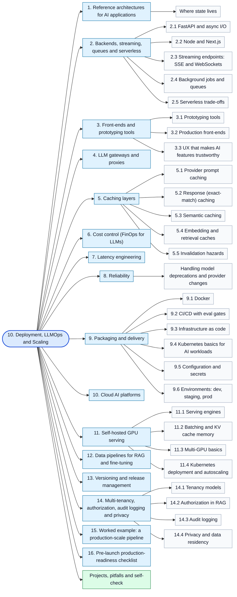

Topics in this stage:

- [1. Reference architectures for AI applications](10-deployment-llmops-and-scaling.md#1-reference-architectures-for-ai-applications)
  - [Where state lives](10-deployment-llmops-and-scaling.md#where-state-lives)
- [2. Backends, streaming, queues and serverless](10-deployment-llmops-and-scaling.md#2-backends-streaming-queues-and-serverless)
  - [2.1 FastAPI and async I/O](10-deployment-llmops-and-scaling.md#21-fastapi-and-async-io)
  - [2.2 Node and Next.js](10-deployment-llmops-and-scaling.md#22-node-and-nextjs)
  - [2.3 Streaming endpoints: SSE and WebSockets](10-deployment-llmops-and-scaling.md#23-streaming-endpoints-sse-and-websockets)
  - [2.4 Background jobs and queues](10-deployment-llmops-and-scaling.md#24-background-jobs-and-queues)
  - [2.5 Serverless trade-offs](10-deployment-llmops-and-scaling.md#25-serverless-trade-offs)
- [3. Front-ends and prototyping tools](10-deployment-llmops-and-scaling.md#3-front-ends-and-prototyping-tools)
  - [3.1 Prototyping tools](10-deployment-llmops-and-scaling.md#31-prototyping-tools)
  - [3.2 Production front-ends](10-deployment-llmops-and-scaling.md#32-production-front-ends)
  - [3.3 UX that makes AI features trustworthy](10-deployment-llmops-and-scaling.md#33-ux-that-makes-ai-features-trustworthy)
- [4. LLM gateways and proxies](10-deployment-llmops-and-scaling.md#4-llm-gateways-and-proxies)
- [5. Caching layers](10-deployment-llmops-and-scaling.md#5-caching-layers)
  - [5.1 Provider prompt caching](10-deployment-llmops-and-scaling.md#51-provider-prompt-caching)
  - [5.2 Response (exact-match) caching](10-deployment-llmops-and-scaling.md#52-response-exact-match-caching)
  - [5.3 Semantic caching](10-deployment-llmops-and-scaling.md#53-semantic-caching)
  - [5.4 Embedding and retrieval caches](10-deployment-llmops-and-scaling.md#54-embedding-and-retrieval-caches)
  - [5.5 Invalidation hazards](10-deployment-llmops-and-scaling.md#55-invalidation-hazards)
- [6. Cost control (FinOps for LLMs)](10-deployment-llmops-and-scaling.md#6-cost-control-finops-for-llms)
- [7. Latency engineering](10-deployment-llmops-and-scaling.md#7-latency-engineering)
- [8. Reliability](10-deployment-llmops-and-scaling.md#8-reliability)
  - [Handling model deprecations and provider changes](10-deployment-llmops-and-scaling.md#handling-model-deprecations-and-provider-changes)
- [9. Packaging and delivery](10-deployment-llmops-and-scaling.md#9-packaging-and-delivery)
  - [9.1 Docker](10-deployment-llmops-and-scaling.md#91-docker)
  - [9.2 CI/CD with eval gates](10-deployment-llmops-and-scaling.md#92-cicd-with-eval-gates)
  - [9.3 Infrastructure as code](10-deployment-llmops-and-scaling.md#93-infrastructure-as-code)
  - [9.4 Kubernetes basics for AI workloads](10-deployment-llmops-and-scaling.md#94-kubernetes-basics-for-ai-workloads)
  - [9.5 Configuration and secrets](10-deployment-llmops-and-scaling.md#95-configuration-and-secrets)
  - [9.6 Environments: dev, staging, prod](10-deployment-llmops-and-scaling.md#96-environments-dev-staging-prod)
- [10. Cloud AI platforms](10-deployment-llmops-and-scaling.md#10-cloud-ai-platforms)
- [11. Self-hosted GPU serving](10-deployment-llmops-and-scaling.md#11-self-hosted-gpu-serving)
  - [11.1 Serving engines](10-deployment-llmops-and-scaling.md#111-serving-engines)
  - [11.2 Batching and KV cache memory](10-deployment-llmops-and-scaling.md#112-batching-and-kv-cache-memory)
  - [11.3 Multi-GPU basics](10-deployment-llmops-and-scaling.md#113-multi-gpu-basics)
  - [11.4 Kubernetes deployment and autoscaling](10-deployment-llmops-and-scaling.md#114-kubernetes-deployment-and-autoscaling)
- [12. Data pipelines for RAG and fine-tuning](10-deployment-llmops-and-scaling.md#12-data-pipelines-for-rag-and-fine-tuning)
- [13. Versioning and release management](10-deployment-llmops-and-scaling.md#13-versioning-and-release-management)
- [14. Multi-tenancy, authorization, audit logging and privacy](10-deployment-llmops-and-scaling.md#14-multi-tenancy-authorization-audit-logging-and-privacy)
  - [14.1 Tenancy models](10-deployment-llmops-and-scaling.md#141-tenancy-models)
  - [14.2 Authorization in RAG](10-deployment-llmops-and-scaling.md#142-authorization-in-rag)
  - [14.3 Audit logging](10-deployment-llmops-and-scaling.md#143-audit-logging)
  - [14.4 Privacy and data residency](10-deployment-llmops-and-scaling.md#144-privacy-and-data-residency)
- [15. Worked example: a production-scale pipeline](10-deployment-llmops-and-scaling.md#15-worked-example-a-production-scale-pipeline)
- [16. Pre-launch production-readiness checklist](10-deployment-llmops-and-scaling.md#16-pre-launch-production-readiness-checklist)

### 11. Multimodal and Specialized Applications

File: [11-multimodal-and-specialized-applications.md](11-multimodal-and-specialized-applications.md) | Time: 3-5 weeks, choose a track

```mermaid
%%{init: {"flowchart": {"nodeSpacing": 14, "rankSpacing": 45, "padding": 6}}}%%
flowchart LR
    classDef stage fill:#dbeafe,stroke:#1d4ed8,stroke-width:2px,color:#0f172a
    classDef topic fill:#e0f2fe,stroke:#0369a1,color:#0f172a
    classDef sub fill:#f8fafc,stroke:#94a3b8,color:#0f172a
    classDef practice fill:#dcfce7,stroke:#15803d,color:#0f172a
    classDef ref fill:#fef9c3,stroke:#a16207,color:#0f172a
    ST11(["11. Multimodal and Specialized Applications"]):::stage
    T11_1["1. Multimodal foundations and a working method"]:::topic
    ST11 --> T11_1
    T11_2["2. Vision-language models"]:::topic
    ST11 --> T11_2
    T11_2 --> U11_2_1["2.1 Image understanding through APIs"]:::sub
    T11_2 --> U11_2_2["2.2 Prompting for images"]:::sub
    T11_2 --> U11_2_3["2.3 OCR-style reading, charts and screenshots"]:::sub
    T11_2 --> U11_2_4["2.4 Known limits"]:::sub
    T11_2 --> U11_2_5["2.5 Classical OpenCV and CNN approaches: when they still win"]:::sub
    T11_3["3. Document intelligence and structured extraction at scale"]:::topic
    ST11 --> T11_3
    T11_3 --> U11_3_1["3.1 Choosing a parsing approach"]:::sub
    T11_3 --> U11_3_2["3.2 The pipeline"]:::sub
    T11_3 --> U11_3_3["3.3 Extraction with schemas and evidence"]:::sub
    T11_3 --> U11_3_4["3.4 Validation"]:::sub
    T11_3 --> U11_3_5["3.5 Human review queues"]:::sub
    T11_3 --> U11_3_6["3.6 Scale, cost and multilingual documents"]:::sub
    T11_4["4. Speech: ASR, TTS, diarization and voice cloning"]:::topic
    ST11 --> T11_4
    T11_4 --> U11_4_1["4.1 Speech recognition (ASR)"]:::sub
    T11_4 --> U11_4_2["4.2 Evaluating ASR"]:::sub
    T11_4 --> U11_4_3["4.3 Speaker diarization"]:::sub
    T11_4 --> U11_4_4["4.4 Text-to-speech (TTS)"]:::sub
    T11_4 --> U11_4_5["4.5 Voice cloning, ethics and consent"]:::sub
    T11_5["5. Realtime voice agents"]:::topic
    ST11 --> T11_5
    T11_5 --> U11_5_1["5.1 Two architectures"]:::sub
    T11_5 --> U11_5_2["5.2 Latency budgets"]:::sub
    T11_5 --> U11_5_3["5.3 Voice activity detection and turn-taking"]:::sub
    T11_5 --> U11_5_4["5.4 Transport, telephony and frameworks"]:::sub
    T11_5 --> U11_5_5["5.5 Production concerns"]:::sub
    T11_6["6. Image generation and editing"]:::topic
    ST11 --> T11_6
    T11_6 --> U11_6_1["6.1 Diffusion basics"]:::sub
    T11_6 --> U11_6_2["6.2 Hosted APIs versus self-hosting"]:::sub
    T11_6 --> U11_6_3["6.3 Diffusers and ComfyUI"]:::sub
    T11_6 --> U11_6_4["6.4 ControlNet and LoRA concepts"]:::sub
    T11_6 --> U11_6_5["6.5 Evaluation"]:::sub
    T11_6 --> U11_6_6["6.6 Content safety and provenance"]:::sub
    T11_7["7. Video and audio generation and understanding"]:::topic
    ST11 --> T11_7
    T11_8["8. Code generation and developer tooling"]:::topic
    ST11 --> T11_8
    T11_8 --> U11_8_1["8.1 Product shapes"]:::sub
    T11_8 --> U11_8_2["8.2 Repo-level context"]:::sub
    T11_8 --> U11_8_3["8.3 Sandboxed execution"]:::sub
    T11_8 --> U11_8_4["8.4 Test-driven agent loops"]:::sub
    T11_8 --> U11_8_5["8.5 Evaluating code models"]:::sub
    T11_8 --> U11_8_6["8.6 Security of generated code"]:::sub
    T11_9["9. Data and analytics assistants"]:::topic
    ST11 --> T11_9
    T11_9 --> U11_9_1["9.1 Architecture and schema grounding"]:::sub
    T11_9 --> U11_9_2["9.2 Validation and read-only safeguards"]:::sub
    T11_9 --> U11_9_3["9.3 Evaluation"]:::sub
    T11_9 --> U11_9_4["9.4 Spreadsheet and BI agents"]:::sub
    T11_10["10. Search, recommendations, personalization, classification and moderation"]:::topic
    ST11 --> T11_10
    T11_11["11. Translation and multilingual products"]:::topic
    ST11 --> T11_11
    T11_11 --> U11_11_1["11.1 Translation approaches"]:::sub
    T11_11 --> U11_11_2["11.2 Evaluation across languages"]:::sub
    T11_11 --> U11_11_3["11.3 Tokenization costs for non-English text"]:::sub
    T11_11 --> U11_11_4["11.4 Locale handling"]:::sub
    T11_12["12. Computer-use and browser automation agents"]:::topic
    ST11 --> T11_12
    T11_12 --> U11_12_1["12.1 How they work and when to use them"]:::sub
    T11_12 --> U11_12_2["12.2 RPA replacement and brittleness"]:::sub
    T11_12 --> U11_12_3["12.3 Safety"]:::sub
    T11_13["13. Domain tracks with compliance caveats"]:::topic
    ST11 --> T11_13
    T11_14["14. On-device and edge AI, robotics and embodied AI (awareness)"]:::topic
    ST11 --> T11_14
    T11_15["15. Choosing a specialization"]:::topic
    ST11 --> T11_15
    PR11["Projects, pitfalls and self-check"]:::practice
    ST11 --> PR11
```

Topics in this stage:

- [1. Multimodal foundations and a working method](11-multimodal-and-specialized-applications.md#1-multimodal-foundations-and-a-working-method)
- [2. Vision-language models](11-multimodal-and-specialized-applications.md#2-vision-language-models)
  - [2.1 Image understanding through APIs](11-multimodal-and-specialized-applications.md#21-image-understanding-through-apis)
  - [2.2 Prompting for images](11-multimodal-and-specialized-applications.md#22-prompting-for-images)
  - [2.3 OCR-style reading, charts and screenshots](11-multimodal-and-specialized-applications.md#23-ocr-style-reading-charts-and-screenshots)
  - [2.4 Known limits](11-multimodal-and-specialized-applications.md#24-known-limits)
  - [2.5 Classical OpenCV and CNN approaches: when they still win](11-multimodal-and-specialized-applications.md#25-classical-opencv-and-cnn-approaches-when-they-still-win)
- [3. Document intelligence and structured extraction at scale](11-multimodal-and-specialized-applications.md#3-document-intelligence-and-structured-extraction-at-scale)
  - [3.1 Choosing a parsing approach](11-multimodal-and-specialized-applications.md#31-choosing-a-parsing-approach)
  - [3.2 The pipeline](11-multimodal-and-specialized-applications.md#32-the-pipeline)
  - [3.3 Extraction with schemas and evidence](11-multimodal-and-specialized-applications.md#33-extraction-with-schemas-and-evidence)
  - [3.4 Validation](11-multimodal-and-specialized-applications.md#34-validation)
  - [3.5 Human review queues](11-multimodal-and-specialized-applications.md#35-human-review-queues)
  - [3.6 Scale, cost and multilingual documents](11-multimodal-and-specialized-applications.md#36-scale-cost-and-multilingual-documents)
- [4. Speech: ASR, TTS, diarization and voice cloning](11-multimodal-and-specialized-applications.md#4-speech-asr-tts-diarization-and-voice-cloning)
  - [4.1 Speech recognition (ASR)](11-multimodal-and-specialized-applications.md#41-speech-recognition-asr)
  - [4.2 Evaluating ASR](11-multimodal-and-specialized-applications.md#42-evaluating-asr)
  - [4.3 Speaker diarization](11-multimodal-and-specialized-applications.md#43-speaker-diarization)
  - [4.4 Text-to-speech (TTS)](11-multimodal-and-specialized-applications.md#44-text-to-speech-tts)
  - [4.5 Voice cloning, ethics and consent](11-multimodal-and-specialized-applications.md#45-voice-cloning-ethics-and-consent)
- [5. Realtime voice agents](11-multimodal-and-specialized-applications.md#5-realtime-voice-agents)
  - [5.1 Two architectures](11-multimodal-and-specialized-applications.md#51-two-architectures)
  - [5.2 Latency budgets](11-multimodal-and-specialized-applications.md#52-latency-budgets)
  - [5.3 Voice activity detection and turn-taking](11-multimodal-and-specialized-applications.md#53-voice-activity-detection-and-turn-taking)
  - [5.4 Transport, telephony and frameworks](11-multimodal-and-specialized-applications.md#54-transport-telephony-and-frameworks)
  - [5.5 Production concerns](11-multimodal-and-specialized-applications.md#55-production-concerns)
- [6. Image generation and editing](11-multimodal-and-specialized-applications.md#6-image-generation-and-editing)
  - [6.1 Diffusion basics](11-multimodal-and-specialized-applications.md#61-diffusion-basics)
  - [6.2 Hosted APIs versus self-hosting](11-multimodal-and-specialized-applications.md#62-hosted-apis-versus-self-hosting)
  - [6.3 Diffusers and ComfyUI](11-multimodal-and-specialized-applications.md#63-diffusers-and-comfyui)
  - [6.4 ControlNet and LoRA concepts](11-multimodal-and-specialized-applications.md#64-controlnet-and-lora-concepts)
  - [6.5 Evaluation](11-multimodal-and-specialized-applications.md#65-evaluation)
  - [6.6 Content safety and provenance](11-multimodal-and-specialized-applications.md#66-content-safety-and-provenance)
- [7. Video and audio generation and understanding](11-multimodal-and-specialized-applications.md#7-video-and-audio-generation-and-understanding)
- [8. Code generation and developer tooling](11-multimodal-and-specialized-applications.md#8-code-generation-and-developer-tooling)
  - [8.1 Product shapes](11-multimodal-and-specialized-applications.md#81-product-shapes)
  - [8.2 Repo-level context](11-multimodal-and-specialized-applications.md#82-repo-level-context)
  - [8.3 Sandboxed execution](11-multimodal-and-specialized-applications.md#83-sandboxed-execution)
  - [8.4 Test-driven agent loops](11-multimodal-and-specialized-applications.md#84-test-driven-agent-loops)
  - [8.5 Evaluating code models](11-multimodal-and-specialized-applications.md#85-evaluating-code-models)
  - [8.6 Security of generated code](11-multimodal-and-specialized-applications.md#86-security-of-generated-code)
- [9. Data and analytics assistants](11-multimodal-and-specialized-applications.md#9-data-and-analytics-assistants)
  - [9.1 Architecture and schema grounding](11-multimodal-and-specialized-applications.md#91-architecture-and-schema-grounding)
  - [9.2 Validation and read-only safeguards](11-multimodal-and-specialized-applications.md#92-validation-and-read-only-safeguards)
  - [9.3 Evaluation](11-multimodal-and-specialized-applications.md#93-evaluation)
  - [9.4 Spreadsheet and BI agents](11-multimodal-and-specialized-applications.md#94-spreadsheet-and-bi-agents)
- [10. Search, recommendations, personalization, classification and moderation](11-multimodal-and-specialized-applications.md#10-search-recommendations-personalization-classification-and-moderation)
- [11. Translation and multilingual products](11-multimodal-and-specialized-applications.md#11-translation-and-multilingual-products)
  - [11.1 Translation approaches](11-multimodal-and-specialized-applications.md#111-translation-approaches)
  - [11.2 Evaluation across languages](11-multimodal-and-specialized-applications.md#112-evaluation-across-languages)
  - [11.3 Tokenization costs for non-English text](11-multimodal-and-specialized-applications.md#113-tokenization-costs-for-non-english-text)
  - [11.4 Locale handling](11-multimodal-and-specialized-applications.md#114-locale-handling)
- [12. Computer-use and browser automation agents](11-multimodal-and-specialized-applications.md#12-computer-use-and-browser-automation-agents)
  - [12.1 How they work and when to use them](11-multimodal-and-specialized-applications.md#121-how-they-work-and-when-to-use-them)
  - [12.2 RPA replacement and brittleness](11-multimodal-and-specialized-applications.md#122-rpa-replacement-and-brittleness)
  - [12.3 Safety](11-multimodal-and-specialized-applications.md#123-safety)
- [13. Domain tracks with compliance caveats](11-multimodal-and-specialized-applications.md#13-domain-tracks-with-compliance-caveats)
- [14. On-device and edge AI, robotics and embodied AI (awareness)](11-multimodal-and-specialized-applications.md#14-on-device-and-edge-ai-robotics-and-embodied-ai-awareness)
- [15. Choosing a specialization](11-multimodal-and-specialized-applications.md#15-choosing-a-specialization)

### 12. Projects, Portfolio, Career and Study Plan

File: [12-projects-portfolio-and-career.md](12-projects-portfolio-and-career.md) | Time: ongoing

```mermaid
%%{init: {"flowchart": {"nodeSpacing": 14, "rankSpacing": 45, "padding": 6}}}%%
flowchart LR
    classDef stage fill:#dbeafe,stroke:#1d4ed8,stroke-width:2px,color:#0f172a
    classDef topic fill:#e0f2fe,stroke:#0369a1,color:#0f172a
    classDef sub fill:#f8fafc,stroke:#94a3b8,color:#0f172a
    classDef practice fill:#dcfce7,stroke:#15803d,color:#0f172a
    classDef ref fill:#fef9c3,stroke:#a16207,color:#0f172a
    ST12(["12. Projects, Portfolio, Career and Study Plan"]):::stage
    T12_1["1. Study plans"]:::topic
    ST12 --> T12_1
    T12_1 --> U12_1_1["1.1 Principles that make any plan work"]:::sub
    T12_1 --> U12_1_2["1.2 The 6-month plan (about 10 to 12 hours per week)"]:::sub
    T12_1 --> U12_1_3["1.3 The 3-month fast track for working developers (10 to 15 hours per week)"]:::sub
    T12_1 --> U12_1_4["1.4 The part-time variant (about 5 hours per week over 12 months)"]:::sub
    T12_1 --> U12_1_5["1.5 Milestones and checkpoints"]:::sub
    T12_2["2. Graded projects"]:::topic
    ST12 --> T12_2
    T12_2 --> U12_2_1["2.1 The shared definition of done"]:::sub
    T12_2 --> U12_2_2["2.2 Beginner projects"]:::sub
    T12_2 --> U12_2_3["2.3 Intermediate projects"]:::sub
    T12_2 --> U12_2_4["2.4 Advanced projects"]:::sub
    T12_3["3. Portfolio craft"]:::topic
    ST12 --> T12_3
    T12_3 --> U12_3_1["3.1 What reviewers really do"]:::sub
    T12_3 --> U12_3_2["3.2 Repository checklist"]:::sub
    T12_3 --> U12_3_3["3.3 README standard"]:::sub
    T12_3 --> U12_3_4["3.4 Architecture diagrams"]:::sub
    T12_3 --> U12_3_5["3.5 Demos"]:::sub
    T12_3 --> U12_3_6["3.6 Evidence: evals, cost and latency"]:::sub
    T12_3 --> U12_3_7["3.7 Honest limitations"]:::sub
    T12_3 --> U12_3_8["3.8 Write-ups"]:::sub
    T12_3 --> U12_3_9["3.9 Deployment links and protecting your wallet"]:::sub
    T12_3 --> U12_3_10["3.10 Avoiding tutorial-clone syndrome"]:::sub
    T12_3 --> U12_3_11["3.11 Portfolio shape"]:::sub
    T12_4["4. Learning resources by type"]:::topic
    ST12 --> T12_4
    T12_4 --> U12_4_1["4.1 Official provider documentation and cookbooks"]:::sub
    T12_4 --> U12_4_2["4.2 Free courses"]:::sub
    T12_4 --> U12_4_3["4.3 Books"]:::sub
    T12_4 --> U12_4_4["4.4 Newsletters, blogs and podcasts"]:::sub
    T12_4 --> U12_4_5["4.5 Communities"]:::sub
    T12_4 --> U12_4_6["4.6 A durable starter paper pack"]:::sub
    T12_5["5. Staying current without burning out"]:::topic
    ST12 --> T12_5
    T12_5 --> U12_5_1["5.1 A weekly routine of 3 to 4 hours"]:::sub
    T12_5 --> U12_5_2["5.2 Evaluating a new model or framework in an afternoon"]:::sub
    T12_5 --> U12_5_3["5.3 Reading papers efficiently"]:::sub
    T12_5 --> U12_5_4["5.4 Learning in public"]:::sub
    T12_5 --> U12_5_5["5.5 Avoiding burnout"]:::sub
    T12_6["6. Interview preparation"]:::topic
    ST12 --> T12_6
    T12_6 --> U12_6_1["6.1 What the loop usually looks like"]:::sub
    T12_6 --> U12_6_2["6.2 Question areas with outlines of strong answers"]:::sub
    T12_6 --> U12_6_3["6.3 Take-home assignments"]:::sub
    T12_6 --> U12_6_4["6.4 Live coding"]:::sub
    T12_6 --> U12_6_5["6.5 System-design walkthrough template"]:::sub
    T12_6 --> U12_6_6["6.6 Behavioural preparation"]:::sub
    T12_7["7. Career paths and role comparison"]:::topic
    ST12 --> T12_7
    T12_7 --> U12_7_1["7.1 Roles at a glance"]:::sub
    T12_7 --> U12_7_2["7.2 Skills matrix"]:::sub
    T12_7 --> U12_7_3["7.3 What hiring managers look for"]:::sub
    T12_7 --> U12_7_4["7.4 Progression and specialisations"]:::sub
    T12_7 --> U12_7_5["7.5 Practical job-search tactics"]:::sub
    T12_7 --> U12_7_6["7.6 Product sense for AI engineers"]:::sub
    T12_8["8. Beginner FAQs"]:::topic
    ST12 --> T12_8
    T12_9["9. Open-source contributions, hackathons and competitions"]:::topic
    ST12 --> T12_9
    T12_9 --> U12_9_1["9.1 Why contribute"]:::sub
    T12_9 --> U12_9_2["9.2 How to start"]:::sub
    T12_9 --> U12_9_3["9.3 Project ideas by effort"]:::sub
    T12_9 --> U12_9_4["9.4 Hackathons and competitions"]:::sub
    PR12["Projects, pitfalls and self-check"]:::practice
    ST12 --> PR12
```

Topics in this stage:

- [1. Study plans](12-projects-portfolio-and-career.md#1-study-plans)
  - [1.1 Principles that make any plan work](12-projects-portfolio-and-career.md#11-principles-that-make-any-plan-work)
  - [1.2 The 6-month plan (about 10 to 12 hours per week)](12-projects-portfolio-and-career.md#12-the-6-month-plan-about-10-to-12-hours-per-week)
  - [1.3 The 3-month fast track for working developers (10 to 15 hours per week)](12-projects-portfolio-and-career.md#13-the-3-month-fast-track-for-working-developers-10-to-15-hours-per-week)
  - [1.4 The part-time variant (about 5 hours per week over 12 months)](12-projects-portfolio-and-career.md#14-the-part-time-variant-about-5-hours-per-week-over-12-months)
  - [1.5 Milestones and checkpoints](12-projects-portfolio-and-career.md#15-milestones-and-checkpoints)
- [2. Graded projects](12-projects-portfolio-and-career.md#2-graded-projects)
  - [2.1 The shared definition of done](12-projects-portfolio-and-career.md#21-the-shared-definition-of-done)
  - [2.2 Beginner projects](12-projects-portfolio-and-career.md#22-beginner-projects)
  - [2.3 Intermediate projects](12-projects-portfolio-and-career.md#23-intermediate-projects)
  - [2.4 Advanced projects](12-projects-portfolio-and-career.md#24-advanced-projects)
- [3. Portfolio craft](12-projects-portfolio-and-career.md#3-portfolio-craft)
  - [3.1 What reviewers really do](12-projects-portfolio-and-career.md#31-what-reviewers-really-do)
  - [3.2 Repository checklist](12-projects-portfolio-and-career.md#32-repository-checklist)
  - [3.3 README standard](12-projects-portfolio-and-career.md#33-readme-standard)
  - [3.4 Architecture diagrams](12-projects-portfolio-and-career.md#34-architecture-diagrams)
  - [3.5 Demos](12-projects-portfolio-and-career.md#35-demos)
  - [3.6 Evidence: evals, cost and latency](12-projects-portfolio-and-career.md#36-evidence-evals-cost-and-latency)
  - [3.7 Honest limitations](12-projects-portfolio-and-career.md#37-honest-limitations)
  - [3.8 Write-ups](12-projects-portfolio-and-career.md#38-write-ups)
  - [3.9 Deployment links and protecting your wallet](12-projects-portfolio-and-career.md#39-deployment-links-and-protecting-your-wallet)
  - [3.10 Avoiding tutorial-clone syndrome](12-projects-portfolio-and-career.md#310-avoiding-tutorial-clone-syndrome)
  - [3.11 Portfolio shape](12-projects-portfolio-and-career.md#311-portfolio-shape)
- [4. Learning resources by type](12-projects-portfolio-and-career.md#4-learning-resources-by-type)
  - [4.1 Official provider documentation and cookbooks](12-projects-portfolio-and-career.md#41-official-provider-documentation-and-cookbooks)
  - [4.2 Free courses](12-projects-portfolio-and-career.md#42-free-courses)
  - [4.3 Books](12-projects-portfolio-and-career.md#43-books)
  - [4.4 Newsletters, blogs and podcasts](12-projects-portfolio-and-career.md#44-newsletters-blogs-and-podcasts)
  - [4.5 Communities](12-projects-portfolio-and-career.md#45-communities)
  - [4.6 A durable starter paper pack](12-projects-portfolio-and-career.md#46-a-durable-starter-paper-pack)
- [5. Staying current without burning out](12-projects-portfolio-and-career.md#5-staying-current-without-burning-out)
  - [5.1 A weekly routine of 3 to 4 hours](12-projects-portfolio-and-career.md#51-a-weekly-routine-of-3-to-4-hours)
  - [5.2 Evaluating a new model or framework in an afternoon](12-projects-portfolio-and-career.md#52-evaluating-a-new-model-or-framework-in-an-afternoon)
  - [5.3 Reading papers efficiently](12-projects-portfolio-and-career.md#53-reading-papers-efficiently)
  - [5.4 Learning in public](12-projects-portfolio-and-career.md#54-learning-in-public)
  - [5.5 Avoiding burnout](12-projects-portfolio-and-career.md#55-avoiding-burnout)
- [6. Interview preparation](12-projects-portfolio-and-career.md#6-interview-preparation)
  - [6.1 What the loop usually looks like](12-projects-portfolio-and-career.md#61-what-the-loop-usually-looks-like)
  - [6.2 Question areas with outlines of strong answers](12-projects-portfolio-and-career.md#62-question-areas-with-outlines-of-strong-answers)
  - [6.3 Take-home assignments](12-projects-portfolio-and-career.md#63-take-home-assignments)
  - [6.4 Live coding](12-projects-portfolio-and-career.md#64-live-coding)
  - [6.5 System-design walkthrough template](12-projects-portfolio-and-career.md#65-system-design-walkthrough-template)
  - [6.6 Behavioural preparation](12-projects-portfolio-and-career.md#66-behavioural-preparation)
- [7. Career paths and role comparison](12-projects-portfolio-and-career.md#7-career-paths-and-role-comparison)
  - [7.1 Roles at a glance](12-projects-portfolio-and-career.md#71-roles-at-a-glance)
  - [7.2 Skills matrix](12-projects-portfolio-and-career.md#72-skills-matrix)
  - [7.3 What hiring managers look for](12-projects-portfolio-and-career.md#73-what-hiring-managers-look-for)
  - [7.4 Progression and specialisations](12-projects-portfolio-and-career.md#74-progression-and-specialisations)
  - [7.5 Practical job-search tactics](12-projects-portfolio-and-career.md#75-practical-job-search-tactics)
  - [7.6 Product sense for AI engineers](12-projects-portfolio-and-career.md#76-product-sense-for-ai-engineers)
- [8. Beginner FAQs](12-projects-portfolio-and-career.md#8-beginner-faqs)
- [9. Open-source contributions, hackathons and competitions](12-projects-portfolio-and-career.md#9-open-source-contributions-hackathons-and-competitions)
  - [9.1 Why contribute](12-projects-portfolio-and-career.md#91-why-contribute)
  - [9.2 How to start](12-projects-portfolio-and-career.md#92-how-to-start)
  - [9.3 Project ideas by effort](12-projects-portfolio-and-career.md#93-project-ideas-by-effort)
  - [9.4 Hackathons and competitions](12-projects-portfolio-and-career.md#94-hackathons-and-competitions)

### 13. Glossary and Decision Cheat Sheets

File: [13-glossary-and-cheat-sheets.md](13-glossary-and-cheat-sheets.md) | Time: reference

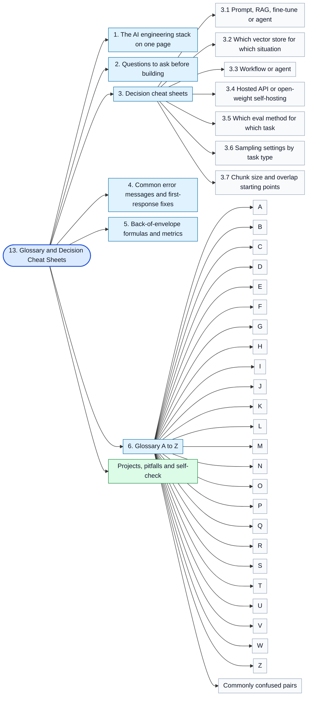

Topics in this stage:

- [1. The AI engineering stack on one page](13-glossary-and-cheat-sheets.md#1-the-ai-engineering-stack-on-one-page)
- [2. Questions to ask before building](13-glossary-and-cheat-sheets.md#2-questions-to-ask-before-building)
- [3. Decision cheat sheets](13-glossary-and-cheat-sheets.md#3-decision-cheat-sheets)
  - [3.1 Prompt, RAG, fine-tune or agent](13-glossary-and-cheat-sheets.md#31-prompt-rag-fine-tune-or-agent)
  - [3.2 Which vector store for which situation](13-glossary-and-cheat-sheets.md#32-which-vector-store-for-which-situation)
  - [3.3 Workflow or agent](13-glossary-and-cheat-sheets.md#33-workflow-or-agent)
  - [3.4 Hosted API or open-weight self-hosting](13-glossary-and-cheat-sheets.md#34-hosted-api-or-open-weight-self-hosting)
  - [3.5 Which eval method for which task](13-glossary-and-cheat-sheets.md#35-which-eval-method-for-which-task)
  - [3.6 Sampling settings by task type](13-glossary-and-cheat-sheets.md#36-sampling-settings-by-task-type)
  - [3.7 Chunk size and overlap starting points](13-glossary-and-cheat-sheets.md#37-chunk-size-and-overlap-starting-points)
- [4. Common error messages and first-response fixes](13-glossary-and-cheat-sheets.md#4-common-error-messages-and-first-response-fixes)
- [5. Back-of-envelope formulas and metrics](13-glossary-and-cheat-sheets.md#5-back-of-envelope-formulas-and-metrics)
- [6. Glossary A to Z](13-glossary-and-cheat-sheets.md#6-glossary-a-to-z)
  - [A](13-glossary-and-cheat-sheets.md#a)
  - [B](13-glossary-and-cheat-sheets.md#b)
  - [C](13-glossary-and-cheat-sheets.md#c)
  - [D](13-glossary-and-cheat-sheets.md#d)
  - [E](13-glossary-and-cheat-sheets.md#e)
  - [F](13-glossary-and-cheat-sheets.md#f)
  - [G](13-glossary-and-cheat-sheets.md#g)
  - [H](13-glossary-and-cheat-sheets.md#h)
  - [I](13-glossary-and-cheat-sheets.md#i)
  - [J](13-glossary-and-cheat-sheets.md#j)
  - [K](13-glossary-and-cheat-sheets.md#k)
  - [L](13-glossary-and-cheat-sheets.md#l)
  - [M](13-glossary-and-cheat-sheets.md#m)
  - [N](13-glossary-and-cheat-sheets.md#n)
  - [O](13-glossary-and-cheat-sheets.md#o)
  - [P](13-glossary-and-cheat-sheets.md#p)
  - [Q](13-glossary-and-cheat-sheets.md#q)
  - [R](13-glossary-and-cheat-sheets.md#r)
  - [S](13-glossary-and-cheat-sheets.md#s)
  - [T](13-glossary-and-cheat-sheets.md#t)
  - [U](13-glossary-and-cheat-sheets.md#u)
  - [V](13-glossary-and-cheat-sheets.md#v)
  - [W](13-glossary-and-cheat-sheets.md#w)
  - [Z](13-glossary-and-cheat-sheets.md#z)
  - [Commonly confused pairs](13-glossary-and-cheat-sheets.md#commonly-confused-pairs)

---

Index: [AI Engineer Roadmap](README.md) | Start learning: [01. Prerequisites and Developer Foundations](01-prerequisites-and-dev-foundations.md)
