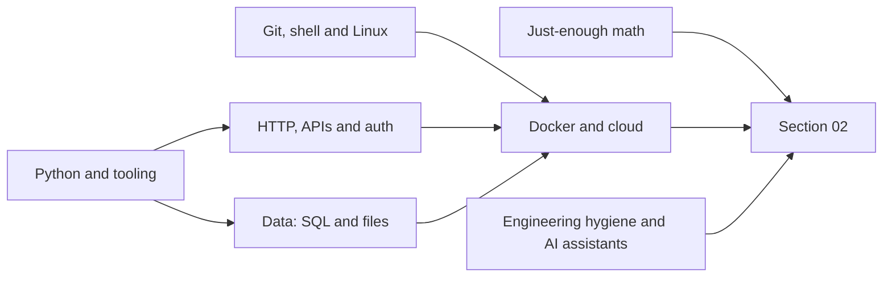

# 01. Prerequisites and Developer Foundations

> **Estimated time:** 3-5 weeks (roughly 8-10 hours per week; less if you already write code every day)
>
> **Prerequisites:** None formally. You should be comfortable installing software, using a text editor or IDE, and have seen at least one programming language. If you have never programmed, spend two to three extra weeks on a beginner Python course first (see [Resources](#resources)). Readers coming from the [ML guide in this repo](../Machine%20Learning%20Beginner%20Roadmap_.md) can skim the Python and math parts. The whole path is laid out in the [roadmap index](README.md).
>
> **Outcome:** You can build, test, containerise and version-control a small Python service that calls web APIs securely and stores data in SQL, and you know enough vectors and probability to follow how embeddings and LLM sampling behave in the next sections.

## Why this stage matters

An AI engineer's day job is ordinary software engineering wrapped around a component that is slow, metered, probabilistic and occasionally wrong. Most failures in LLM products are not "the model got it wrong"; they are plumbing failures: a leaked API key, an unhandled rate-limit response, a blocking call that freezes an async server, a JSON parse that crashes on unexpected output, an environment that only works on one laptop. This section builds that plumbing skill. You do not need to master every topic here; you need working fluency, the habit of reading documentation, and the discipline of testing code and keeping secrets out of Git. Model names and SDK signatures change every few months, while the fundamentals below stay put, so time spent here pays off for years.

## Topic map



| Area | Core sections | Priority |
| --- | --- | --- |
| Python, data-structure complexity, types, environments, errors, async, tests | 1-6 | Must have |
| Command line, Linux, Git and GitHub | 7-8 | Must have |
| HTTP, streaming, authentication, secrets | 9-11 | Must have |
| SQL, NoSQL, file formats, pandas | 12 | Must have (SQL), recommended (rest) |
| Docker and cloud basics | 13 | Recommended now, required by section 10 |
| TypeScript and JavaScript | 14 | Optional but valuable |
| Math and statistics intuition | 15 | Must have (intuition level) |
| Hygiene, AI assistants (learning and professional workflow), readiness gate | 16-18 | Must have |

A realistic pacing for 4 weeks: week 1 covers sections 1-3 and 7-8; week 2 covers 4-6 and 9; week 3 covers 10-12; week 4 covers 13, 15-18 (and 14 if you want it). Stretch to 5 weeks if you are new to Python or the terminal.

## 1. Python essentials for AI work

Python is the working language of AI tooling: provider SDKs, data libraries, evaluation frameworks and orchestration frameworks all ship Python first. Use a currently supported release. As of Oct 2026, Python 3.14 is the current stable line, 3.15 is in its release-candidate stage with the final release scheduled for this month, 3.11-3.13 receive security fixes only, and 3.10 has reached end of life ([status page](https://devguide.python.org/versions/)). The examples here assume 3.12 or newer. Pick the newest version your key libraries publish wheels for, because heavy ML packages sometimes lag a new Python release by months. If you want a guided refresher, the official [Python tutorial](https://docs.python.org/3/tutorial/) is excellent.

What to be fluent in before moving on:

- **Syntax and control flow:** f-strings, `for`/`while`, comprehensions, unpacking, `enumerate`, `zip(..., strict=True)`, `match` statements.
- **Functions:** keyword-only arguments, defaults, `*args`/`**kwargs`, closures, decorators, and **generators** (functions that `yield`). Generators matter because streaming LLM responses arrive as iterators you consume lazily.
- **Classes:** `__init__`, methods, `@property`, `__repr__`, and preferring composition over deep inheritance.
- **Files and paths:** `pathlib.Path`, context managers (`with`), and always passing `encoding="utf-8"` when reading or writing text.
- **Modules:** imports, packages, and the `if __name__ == "__main__":` guard.

| Structure | Mutable | Typical use in AI work |
| --- | --- | --- |
| `list` | yes | Message histories, batches of documents, results |
| `dict` | yes | JSON objects, request payloads, config |
| `set` | yes | De-duplicating IDs, membership tests |
| `tuple` | no | Fixed records, dictionary keys, return of multiple values |
| `collections.Counter` | yes | Word and token counts, label frequencies |
| `collections.deque` | yes | Sliding window of recent chat turns |

```python
from collections import Counter
from collections.abc import Iterator
from pathlib import Path


def read_lines(path: Path) -> Iterator[str]:
    """Yield non-empty lines lazily, so a huge file never sits in memory."""
    with path.open(encoding="utf-8") as f:  # the context manager closes the file for us
        for line in f:
            if line.strip():
                yield line.rstrip("\n")


path = Path("notes.txt")
path.write_text("Tokens are not words\nwords are not tokens\n", encoding="utf-8")
counts = Counter(w.lower() for line in read_lines(path) for w in line.split())
top = {word: n for word, n in counts.most_common(3)}  # dict comprehension
first, *rest = top.items()  # unpacking
print(f"{first=} {len(rest)=}")  # f-string with = for quick debugging
```

Functions and classes are where beginners most often stall, so here is a compact tour of keyword-only arguments, `*args`, a decorator (which is also a closure) and a small class with a property and a readable `repr`:

```python
import time
from functools import wraps


def timed(fn):
    """Decorator: print how long each call to `fn` takes."""

    @wraps(fn)  # keeps fn.__name__ and the docstring intact
    def wrapper(*args, **kwargs):  # a closure: it remembers `fn` from the enclosing scope
        start = time.perf_counter()
        try:
            return fn(*args, **kwargs)
        finally:
            print(f"{fn.__name__} took {time.perf_counter() - start:.3f}s")

    return wrapper


class TokenBudget:
    """Tracks how many tokens a request may still use."""

    def __init__(self, limit: int) -> None:
        self.limit = limit
        self.used = 0

    @property
    def remaining(self) -> int:  # read it as budget.remaining, without parentheses
        return self.limit - self.used

    def spend(self, tokens: int, *, strict: bool = True) -> None:  # `*` makes `strict` keyword-only
        if strict and tokens > self.remaining:
            raise ValueError(f"need {tokens} tokens, only {self.remaining} left")
        self.used += tokens

    def __repr__(self) -> str:
        return f"TokenBudget(limit={self.limit}, used={self.used})"


@timed
def plan(budget: TokenBudget, *chunks: int) -> int:  # *chunks collects extra positional arguments
    for n in chunks:
        budget.spend(n)
    return budget.remaining


budget = TokenBudget(1000)
print(plan(budget, 200, 300), budget)  # 500 TokenBudget(limit=1000, used=500)
```

Classic traps worth memorising now: a mutable default argument (`def add(msg, history=[])`) is shared across calls, so use `history=None` and create the list inside; `==` compares values while `is` compares identity; copies of nested lists are shallow unless you use `copy.deepcopy`; and floats should be compared with `math.isclose`.

**Try it:** write a script that reads a JSONL file of chat messages (one JSON object per line), prints the five most common words, and never loads the whole file into memory.

### Complexity in five minutes

Choosing between the structures in the table above is mostly a question of how cost grows with size. **Big-O notation** describes that growth for n items while ignoring constant factors: O(1) means the cost does not depend on n, O(log n) grows very slowly, O(n) grows in step with n, O(n log n) is the price of sorting, and O(n^2) (a loop inside a loop) is the shape that works on 100 items and falls over on 1,000,000. You do not need proofs, only the habit of asking "what happens when this is 1,000 times bigger?". The retrieval, chunking and concurrency exercises later in the roadmap all depend on that question.

| Operation | Cost | Why, and what to do instead |
| --- | --- | --- |
| `d[key]`, `key in d`, `x in s`, `s.add(x)` | O(1) on average | Hash tables jump straight to a slot; keys must be hashable (a tuple can be a key, a list cannot) |
| `x in lst`, `lst.index(x)`, `lst.remove(x)` | O(n) | A list scan checks items one by one; inside a loop it becomes O(n^2), so build a `set` first |
| `lst[i]`, `lst.append(x)`, `lst.pop()` | O(1) (append amortised) | Python over-allocates, so appends are cheap at the end |
| `lst.pop(0)`, `lst.insert(0, x)` | O(n) | Every other element shifts; use `collections.deque` for O(1) at both ends |
| `sorted(xs)`, `xs.sort()` | O(n log n) | Fast in practice, but wasteful when you only need the best few |
| `heapq.nlargest(k, xs)` | O(n log k) | One pass that keeps k candidates; when k is close to n use `sorted`, and for k = 1 use `max` |
| `heapq.heappush`, `heapq.heappop` | O(log n) | A priority queue, for example the next-best candidate from several ranked lists |
| `bisect.bisect_left(sorted_list, x)` | O(log n) | Binary search, but only on an already sorted list |

The [Python wiki's time-complexity page](https://wiki.python.org/moin/TimeComplexity) lists the rest, and the [heapq](https://docs.python.org/3/library/heapq.html) documentation explains when `nlargest` beats `sorted`. Here is the top-k idea that retrieval relies on: score every candidate, keep only the best few.

```python
import heapq
import random

random.seed(0)
scores = [(random.random(), f"doc-{i}") for i in range(100_000)]

best = heapq.nlargest(5, scores)  # O(n log k): one pass that keeps only 5 candidates
slow = sorted(scores, reverse=True)[:5]  # O(n log n): sorts everything to keep 5
assert best == slow
print([doc for _, doc in best])
```

**Memory grows too, and often decides the design.** One million embedding vectors with 1,536 dimensions stored as `float32` is 1,000,000 x 1,536 x 4 bytes, about 6.1 GB; the same array in NumPy's default `float64` is about 12 GB; and as a plain Python list of lists of floats it is far worse, because each float is a 24-byte object plus an 8-byte pointer, roughly 49 GB. Choose compact types (NumPy arrays with an explicit `dtype`), stream with generators instead of building lists, and bound every cache (`functools.lru_cache(maxsize=...)` or a `deque(maxlen=...)`), because an unbounded dict that only ever grows is a memory leak. An exact search must also read all of those bytes for every query, which is why [05 sections 4-5](05-embeddings-vector-search-and-rag.md) move from brute force to approximate indexes and quantization.

**Try it:** build `items = list(range(1_000_000))` and `as_set = set(items)`, then time `target in items` against `target in as_set` with `timeit`, taking the last element as the target so the list scan is at its worst. Repeat with 2,000,000 items and confirm that the list time roughly doubles while the set time hardly moves. A starting point:

```python
import timeit

n = 1_000_000
items = list(range(n))
as_set = set(items)
target = n - 1  # the worst case for the list: the last element

t_list = timeit.timeit(lambda: target in items, number=20) / 20
t_set = timeit.timeit(lambda: target in as_set, number=20) / 20
print(f"list scan: {t_list * 1e3:.2f} ms   set lookup: {t_set * 1e6:.2f} us")
```

## 2. Type hints, dataclasses and Pydantic

**Type hints** (`def f(x: int) -> str`) document intent and let tools catch bugs before runtime. Python does not enforce them when the program runs; a checker such as [mypy](https://mypy.readthedocs.io/en/stable/) or [Pyright](https://microsoft.github.io/pyright/) reads them, and your editor uses them for autocomplete. Faster Rust-based checkers such as Astral's [ty](https://docs.astral.sh/ty/) are emerging; ty is still labelled beta as of Oct 2026, so check the maturity of any newer checker before adopting it. The [typing documentation](https://docs.python.org/3/library/typing.html) covers the details. The features you will use daily are `list[str]`, `dict[str, int]`, `X | None`, `Literal`, `TypedDict`, `Protocol` (structural "duck" typing, ideal for swapping a fake LLM client into tests) and, from Python 3.12, the `type` alias statement. Since Python 3.14 annotations are evaluated lazily, so forward references rarely need quotes (as of Oct 2026).

A **dataclass** generates `__init__`, `__repr__` and `__eq__` for plain data holders (see the [dataclasses docs](https://docs.python.org/3/library/dataclasses.html)). **Pydantic** goes further: it parses and validates untrusted data at runtime and reports precisely what is wrong. That is exactly what you need when data arrives from users, HTTP responses, config files or a language model.

| Use a dataclass when | Use Pydantic when |
| --- | --- |
| Data is created by your own trusted code | Data crosses a boundary: user input, API response, model output, config |
| You want lightweight, fast, dependency-free objects | You need validation, coercion, constraints and clear error messages |
| Shape is internal and rarely serialised | You need JSON in/out or a JSON Schema (for structured outputs, see [03](03-llm-apis-and-structured-outputs.md)) |

```python
from dataclasses import dataclass, field
from typing import Literal

type Role = Literal["system", "user", "assistant"]  # the `type` statement needs Python 3.12+


@dataclass(frozen=True, slots=True)
class Message:
    role: Role
    content: str


@dataclass
class Conversation:
    messages: list[Message] = field(default_factory=list)  # never `= []`

    def add(self, role: Role, content: str) -> None:
        self.messages.append(Message(role, content))

    def as_payload(self) -> list[dict[str, str]]:
        return [{"role": m.role, "content": m.content} for m in self.messages]


chat = Conversation()
chat.add("user", "Hello")
print(chat.as_payload())
```

```python
from pydantic import BaseModel, Field, ValidationError


class Ticket(BaseModel):
    title: str = Field(min_length=3, max_length=120)
    priority: int = Field(ge=1, le=5)
    tags: list[str] = Field(default_factory=list)


raw = '{"title": "Login fails", "priority": "2", "tags": ["auth"]}'
ticket = Ticket.model_validate_json(raw)  # the string "2" is coerced to the int 2
print(ticket.priority, ticket.model_dump())

try:
    Ticket.model_validate_json('{"title": "x", "priority": 9}')
except ValidationError as err:
    print(err.error_count(), "problems")
    for e in err.errors():
        print(e["loc"], e["msg"])

print(Ticket.model_json_schema()["required"])  # a JSON Schema you can hand to an LLM API later
```

Pitfall: Pydantic's default "lax" mode coerces compatible values (the string `"2"` became `2` above), which is friendly for JSON but can hide upstream bugs. Use strict mode where exact types matter. The [Pydantic models documentation](https://pydantic.dev/docs/validation/latest/concepts/models/) explains validation modes, custom validators and serialisation. Settings management with `pydantic-settings` appears in section 11.

**Try it:** model a chat-completion request (model name, list of messages, optional temperature between 0 and 2), then feed it three malformed JSON payloads and read each `ValidationError` aloud.

## 3. Environments, dependencies and packaging

Every project needs its own isolated set of dependencies, otherwise upgrading a library for one project silently breaks another. The vocabulary: the **interpreter** runs your code, a **virtual environment** is a project-local folder holding a private copy of installed packages, **PyPI** is the public package index, and a **lockfile** records the exact versions that resolved so every machine installs the same thing.

The classic tools ship with Python ([venv docs](https://docs.python.org/3/library/venv.html)):

```bash
python -m venv .venv
source .venv/bin/activate          # Windows PowerShell: .venv\Scripts\Activate.ps1
python -m pip install httpx pydantic
python -m pip freeze > requirements.txt
```

[uv](https://docs.astral.sh/uv/) is a fast modern alternative that replaces `pip`, `venv`, `pyenv`, `pipx` and lockfile tooling with one program, and it is a sensible default for new projects (as of Oct 2026). Poetry, PDM, Hatch and conda are also widely used, and the concepts below transfer to all of them, so follow your team's choice if it already has one. uv records dependencies in `pyproject.toml` and exact versions in `uv.lock`, which you commit.

```bash
uv python install 3.13                      # download a managed interpreter (optional)
uv init ai-playground                       # scaffold pyproject.toml, .python-version, README, source folder
cd ai-playground
uv add httpx pydantic pydantic-settings     # runtime dependencies, updates pyproject.toml and uv.lock
uv add --dev pytest pytest-asyncio ruff     # development-only dependency group
uv run pytest                               # runs inside the project environment, creating .venv if needed
uv sync --locked                            # on a new machine or in CI: recreate the exact locked environment
uvx ruff --version                          # run a tool once in a throwaway environment
```

What `uv init` generates has changed between uv releases (current versions create a `src/` package layout with a build system and a console-script entry), so read what it produced rather than assuming. `pyproject.toml` is the single configuration file for your project, tools and dependencies; a realistic one looks like this ([writing guide](https://packaging.python.org/en/latest/guides/writing-pyproject-toml/)):

```toml
[project]
name = "ai-playground"
version = "0.1.0"
requires-python = ">=3.12"
dependencies = ["httpx", "pydantic>=2", "pydantic-settings"]

[project.scripts]
ai-playground = "ai_playground:main"  # the `ai-playground` command calls main() in src/ai_playground/__init__.py

[build-system]  # uv init writes this block for you; keep the version range it generated
requires = ["uv_build>=0.12,<0.13"]
build-backend = "uv_build"

[dependency-groups]
dev = ["pytest", "pytest-asyncio", "ruff"]

[tool.pytest.ini_options]
testpaths = ["tests"]  # no pythonpath hack needed: `uv sync` installs your package into the environment

[tool.ruff]
line-length = 100

[tool.ruff.lint]
select = ["E", "F", "I", "B", "UP"]
```

**Packaging basics.** Most AI projects are applications, not libraries, but packaging them properly pays off: put code in a package folder (ideally under `src/`), add `__init__.py`, declare console scripts under `[project.scripts]`, and your tests, Docker image and teammates all import the code the same way. `uv build` produces a wheel if you ever publish; the [Python Packaging User Guide](https://packaging.python.org/en/latest/) is the reference. For one-off scripts, inline metadata ([PEP 723](https://peps.python.org/pep-0723/)) lets a single file declare its own dependencies: `uv add --script tool.py httpx` writes the header and `uv run tool.py` honours it.

Use [Ruff](https://docs.astral.sh/ruff/) for linting and formatting (`uv run ruff check .` and `uv run ruff format .`); it replaces several older tools with one fast binary. Notebooks are fine for exploration; the subsection [Notebooks without bad habits](#notebooks-without-bad-habits) at the end of this section shows how to keep them reproducible and safe to commit.

Pitfalls: installing packages globally, committing `.venv/`, leaving dependencies unpinned with no lockfile, and mixing conda and pip in one environment without understanding which owns what. Heavy ML packages (PyTorch and friends) have platform-specific wheels; section [09](09-open-models-fine-tuning-and-local-inference.md) deals with them.

**Try it:** create a uv project, add `httpx`, write a script that prints the HTTP status of a public URL, delete `.venv`, and recreate the environment with `uv sync --locked`.

### Notebooks without bad habits

A notebook (Jupyter or a similar tool) mixes code cells, their output and notes in one file, which makes it the fastest way to poke at an API, a tokenizer or a dataset; many of the tutorials you will follow online are notebooks. Its weaknesses are hidden state (cells run out of order), outputs saved into the file, and code that never leaves it. Five habits fix most of that:

```bash
uv add --dev ipykernel                                                           # kernel support, in the dev group
uv run ipython kernel install --user --env VIRTUAL_ENV "$PWD/.venv" --name=ai-playground
uv run --with jupyter jupyter lab                                                # then pick the ai-playground kernel
```

- **Run it on your project environment.** The commands above, from uv's [Jupyter guide](https://docs.astral.sh/uv/guides/integration/jupyter/), register a kernel that points at the project's `.venv`, so the notebook sees the same locked packages as your tests. VS Code can instead select the `.venv` interpreter as its notebook kernel, provided `ipykernel` is installed in it.
- **Keep secrets out of cells.** Read keys with `os.environ[...]` or the `Settings` class from section 11, and never paste one into a cell, print a client's headers or leave a key in a pasted error trace.
- **Do not commit outputs.** A saved notebook stores every printed response, table and image, which may include customer data. Run `uv add --dev nbstripout`, then `uv run nbstripout --install` once per clone to register a Git filter that strips outputs on commit ([nbstripout](https://github.com/kynan/nbstripout)), or clear outputs by hand before every commit.
- **Restart and run all as a gate.** Before you share a notebook or trust a result, restart the kernel and run every cell top to bottom. A failure means hidden state was masking a bug.
- **Promote reusable code.** When a function is used twice or deserves a test, move it into your package under `src/` and import it back; `%load_ext autoreload` followed by `%autoreload 2` picks up edits without a restart. The notebook keeps the story (question, call, result), and the module gets the tests.

**Hosted notebooks** such as [Google Colab](https://research.google.com/colaboratory/faq.html) need no setup, can offer free or low-cost GPUs where available, and share easily, which suits a GPU tutorial from [09](09-open-models-fine-tuning-and-local-inference.md#84-no-gpu-a-budget-path) (that budget path covers hosted-notebook limits and renting a GPU; sizing is in [4.5](09-open-models-fine-tuning-and-local-inference.md#45-hardware-guidance)). They are risky for secrets and for anything you cannot afford to lose: sessions are ephemeral (idle machines are reclaimed and runtimes have a maximum lifetime, so save checkpoints and results to durable storage), GPU availability and limits vary and are not guaranteed (as of Oct 2026), and a shared notebook can expose its outputs. Use the platform's secrets feature instead of pasting keys, give a hosted notebook its own low-limit key, and revoke it when you are done.

**Try it:** on the uv project from above, create a notebook on the project kernel that imports a function from your package, print a fake value so it lands in an output, install the nbstripout filter, commit, and check with `git show HEAD:<notebook path>` that the committed copy has no outputs.

## 4. Errors, retries and logging

Code that calls networks and models fails in ordinary ways: timeouts, rate limits, malformed responses, missing configuration. Good error handling means catching specific exceptions you can act on, letting everything else crash loudly, and keeping the original cause. Distinguish **transient** failures (timeouts, HTTP 429, HTTP 5xx; retrying may succeed) from **permanent** ones (bad request, invalid key, your own bug; retrying only wastes money). Never use a bare `except:`, never swallow an exception silently, define small custom exception classes for your own failure categories, and re-raise with `raise ConfigError("MAX_RETRIES must be an integer") from err` so the original cause stays in the traceback.

A retry helper with **exponential backoff** (waiting longer after each failure) and **jitter** (randomness so many clients do not retry in lockstep) is a building block you will reuse for LLM calls in [03](03-llm-apis-and-structured-outputs.md). Always cap the attempts, and only retry operations that are safe to repeat, because a repeated LLM call costs money and a repeated "send email" call sends two emails.

```python
import logging
import random
import time
from collections.abc import Callable
from typing import TypeVar

logger = logging.getLogger(__name__)
T = TypeVar("T")


class TransientError(Exception):
    """A failure worth retrying: timeout, HTTP 429, HTTP 5xx."""


def retry(fn: Callable[[], T], *, attempts: int = 4, base_delay: float = 0.5) -> T:
    for attempt in range(1, attempts + 1):
        try:
            return fn()
        except TransientError as err:
            if attempt == attempts:
                raise  # out of attempts: let the caller decide
            delay = base_delay * 2 ** (attempt - 1) * random.uniform(0.5, 1.5)  # backoff + jitter
            logger.warning("attempt %d failed (%s); retrying in %.1fs", attempt, err, delay)
            time.sleep(delay)
    raise AssertionError("unreachable")
```

**Logging** (see the [logging docs](https://docs.python.org/3/library/logging.html)) replaces `print` once code runs unattended. Call `logging.basicConfig(level=logging.INFO, format=...)` once at program start, create a module-level `logger = logging.getLogger(__name__)`, use levels deliberately (`DEBUG` for detail, `INFO` for milestones, `WARNING` for recoverable trouble, `ERROR` for failures), pass arguments lazily (`logger.info("doc=%s", doc_id)`), and call `logger.exception(...)` inside an `except` block to capture the traceback. For machine-readable JSON logs, a library such as [structlog](https://www.structlog.org/en/stable/) helps; tracing and monitoring of whole LLM requests come in [07](07-evaluation-observability-and-testing.md).

What to log is a security decision: log request IDs, model names, token counts, latency and outcome, but not API keys, full prompts or personal data unless you have deliberately redacted or consented to them.

**Try it:** wrap the retry helper around a function that fails twice and then succeeds, and confirm from the log lines that the delays grow.

## 5. Concurrency: async/await, threads and processes

LLM and API calls spend nearly all their time waiting for the network, so a program that makes them one by one is slow for no reason. Python offers three tools. **asyncio** runs many I/O waits on one thread cooperatively and is the best fit for network-bound work. **Threads** (`concurrent.futures.ThreadPoolExecutor`) suit blocking libraries that have no async version. **Processes** (`ProcessPoolExecutor`) suit CPU-bound work such as parsing or number crunching, because each process has its own interpreter. Free-threaded Python builds are officially supported from 3.14 but remain a separate opt-in build, and many extension libraries are still catching up (as of Oct 2026), so do not design around them yet.

The model in one paragraph: `async def` defines a coroutine, `await` hands control back to the event loop while waiting, and `asyncio.run()` starts the loop. Async only helps if the whole call chain is non-blocking; a single `time.sleep()` or synchronous HTTP call inside a coroutine freezes every other task. Use `asyncio.TaskGroup` (3.11+) to run tasks together with clean failure handling, `asyncio.timeout()` to bound waiting, and a `Semaphore` to respect provider rate limits. The [asyncio task docs](https://docs.python.org/3/library/asyncio-task.html) are the reference.

```python
import asyncio
import random


async def fetch_answer(i: int, limiter: asyncio.Semaphore) -> str:
    async with limiter:  # at most 5 calls in flight at once
        await asyncio.sleep(random.uniform(0.05, 0.2))  # stands in for an HTTP request
        return f"answer-{i}"


async def fetch_all(n: int = 20, concurrency: int = 5) -> list[str]:
    limiter = asyncio.Semaphore(concurrency)
    async with asyncio.timeout(10):  # Python 3.11+: cancel everything after 10 s
        async with asyncio.TaskGroup() as tg:  # if one task fails, the rest are cancelled
            tasks = [tg.create_task(fetch_answer(i, limiter)) for i in range(n)]
    return [t.result() for t in tasks]


if __name__ == "__main__":
    print(len(asyncio.run(fetch_all())))
```

When you must call blocking code from async code, push it to a worker thread with `await asyncio.to_thread(blocking_function, arg)` instead of freezing the loop.

Pitfalls: forgetting `await` (Python warns "coroutine was never awaited"), starting unbounded numbers of tasks (which trips rate limits), calling `asyncio.run()` inside a notebook that already has a running loop (just `await` directly there), and sharing mutable state between tasks without thinking about ordering.

**Try it:** make one of the 20 tasks raise an error and watch `TaskGroup` cancel the others and raise an `ExceptionGroup` (handled with `except*`).

## 6. Testing with pytest

Tests matter more, not less, when a component is nondeterministic: you need solid, deterministic scaffolding around the unpredictable part so you can tell which side broke. [pytest](https://docs.pytest.org/en/stable/) is the standard tool. The core ideas are small: tests are plain functions named `test_*`; plain `assert` statements are enough; **fixtures** supply reusable setup; `@pytest.mark.parametrize` runs one test over many inputs; `monkeypatch` temporarily changes environment variables or attributes and undoes the change afterwards; `tmp_path` gives each test a private temporary folder; and `pytest.raises` checks that an error happens. Structure each test as arrange, act, assert.

```python
import pytest
from pydantic import ValidationError

from ai_playground.fanout import fetch_all  # the async fan-out from section 5
from ai_playground.models import Ticket  # the Pydantic model from section 2
from ai_playground.settings import Settings  # the settings class from section 11


@pytest.mark.parametrize("priority", [0, 6])
def test_ticket_rejects_out_of_range_priority(priority):
    with pytest.raises(ValidationError):
        Ticket(title="Login fails", priority=priority)


@pytest.fixture
def fake_env(monkeypatch):  # a fixture: reusable setup, injected by naming it as a test argument
    monkeypatch.setenv("LLM_API_KEY", "test-not-a-real-key")  # undone automatically after the test
    monkeypatch.setenv("LLM_MODEL", "some-model")


def test_settings_come_from_the_environment(fake_env):
    settings = Settings(_env_file=None)  # ignore any real .env during tests
    assert settings.llm_model == "some-model"
    assert "test-not-a-real-key" not in repr(settings)  # the secret stays masked


@pytest.mark.asyncio
async def test_fetch_all_returns_every_answer():
    answers = await fetch_all(12, concurrency=3)
    assert answers == [f"answer-{i}" for i in range(12)]
```

Async tests need the [pytest-asyncio](https://pytest-asyncio.readthedocs.io/en/stable/) plugin; its default "strict" mode requires the `@pytest.mark.asyncio` marker shown above, and an `auto` mode removes the need. Run tests with `uv run pytest -q`, narrow with `-k name`, stop at the first failure with `-x`, and re-run only failures with `--lf`.

Practical rules for AI projects: never call a paid live API from unit tests, because it is slow, flaky and costly. Hide the model client behind a small function or `Protocol` so tests can inject a fake that returns canned text, and for HTTP code use a mock transport or a local test server. Keep a handful of clearly marked integration tests (register the marker in `pyproject.toml`) that you run on demand. Testing the quality of model output is a different discipline, covered by evals in [07](07-evaluation-observability-and-testing.md).

**Try it:** write a failing test first for a function that extracts the JSON object from a model reply wrapped in prose, then make it pass.

## 7. Command line, Linux and shell basics

Servers, containers, CI systems and cloud machines are almost always Linux, and you will spend real time in a terminal. If you are on Windows, install WSL2 ([Microsoft's guide](https://learn.microsoft.com/en-us/windows/wsl/install)) so you get a real Linux shell and the same behaviour as production; Git Bash or PowerShell also work for much of this section. The [MIT Missing Semester](https://missing.csail.mit.edu/) is the best free course for this material.

| Task | Commands |
| --- | --- |
| Navigate and inspect | `pwd`, `ls -la`, `cd`, `cat`, `less`, `head`, `tail -f` |
| Search | `grep -rn "text" .`, `find . -name "*.py"` (or `rg` if installed) |
| Compose with pipes | `cmd1 \| cmd2`, `>` overwrite, `>>` append, `2>&1` merge stderr |
| Process and machine | `ps aux`, `top`, `kill`, `df -h`, `free -h` |
| Network | `curl -v URL`, `ss -tlnp` (listening ports), `ping` |
| Permissions | `ls -l`, `chmod +x script.sh`, `sudo` (use sparingly) |
| Remote | `ssh user@host`, `scp file host:path` |
| Packages (Debian/Ubuntu) | `apt update`, `apt install pkg` |

Core ideas: Linux has one filesystem tree rooted at `/` (`/home` for users, `/etc` for configuration, `/var/log` for logs, `/tmp` for scratch space); everything is a file or stream; programs are chained with pipes; **environment variables** (`export NAME=value` in Bash, `$env:NAME = "value"` in PowerShell) configure programs; the `PATH` variable decides which executable runs; logs usually live under `/var/log` or in `journalctl` for systemd services. Pipes shine for quick log analysis, for example this finds the slowest calls in a JSONL log (requires `jq`):

```bash
jq -r '[.model, .latency_ms] | @tsv' runs.jsonl | sort -k2 -n -r | head -5
```

Keep shell scripts short and add `set -euo pipefail` at the top so they stop on errors; once a script needs real logic, rewrite it in Python. Pitfalls: `rm -rf` with an unset variable, secrets typed inline (they land in shell history), and editing files on a server by hand instead of redeploying from version control.

**Try it:** use `grep`, `sort` and `uniq -c` on any log file to count the most frequent error messages.

## 8. Git and GitHub workflow

**Git** records snapshots of your project so you can see history, undo mistakes and collaborate. The mental model: your **working tree** holds files you edit, the **staging area** holds what the next commit will contain, a **commit** is a snapshot with a message, a **branch** is a movable pointer to a line of commits, and a **remote** (such as GitHub) is a shared copy. The free [Pro Git book](https://git-scm.com/book/en/v2) is the reference and [Learn Git Branching](https://learngitbranching.js.org/) teaches branching interactively.

```bash
git switch -c feat/retry-logic          # create and move to a new branch
git status                              # what changed?
git add -p                              # stage chosen hunks, reviewing as you go
git commit -m "Add exponential backoff to API client"
git push -u origin feat/retry-logic     # publish, then open a pull request on GitHub
git switch main && git pull --ff-only   # later: sync main
git log --oneline --graph --decorate    # read history
git restore --staged file.py            # unstage; use git restore file.py to discard edits
git revert <commit>                     # safely undo a commit on shared history
```

Use **GitHub flow** ([guide](https://docs.github.com/en/get-started/using-github/github-flow)): `main` is always deployable, every change lives on a short-lived branch, and merges go through a **pull request** (PR), a proposal that teammates review and that automated checks (CI) must pass. Good PRs are small, have a description explaining why, include tests, and link the issue. Write commit messages in the imperative mood; the [Conventional Commits](https://www.conventionalcommits.org/en/v1.0.0/) format is a popular convention if your team wants one. [GitHub Actions](https://docs.github.com/en/actions) can run your linter and tests on every push; set that up early.

**Reading code** is a skill in its own right. Start from the entry point or the tests, follow one request through the code, use `grep` to find definitions and call sites, and use `git log -p path/to/file` and `git blame` to learn why something exists. Cloning and reading well-known open-source SDKs is some of the best practice you can get.

Pitfalls and fixes: commit a `.gitignore` before your first commit (include `.env`, `.venv/`, `__pycache__/`, data folders and model weights; large binaries do not belong in Git); resolve merge conflicts calmly by reading both sides; avoid `git reset --hard` and force-pushes on shared branches (prefer `git revert`, or `git push --force-with-lease` on your own branch only); and if you ever commit a secret, **revoke and rotate it first**, because deleting it in a later commit leaves it in history. Only then consider rewriting history. GitHub's [push protection](https://docs.github.com/en/code-security/concepts/secret-security/push-protection) can block pushes that contain recognised secrets, so enable it where you can.

**Try it:** fork a small repository, fix a typo on a branch, open a PR against your own fork, and merge it after a self-review. [GitHub Skills](https://learn.github.com/skills) has guided versions.

## 9. HTTP, REST and JSON

Almost every model provider, vector database and tool you will use is reached over **HTTP**: a client sends a request, a server sends a response. The [MDN HTTP guide](https://developer.mozilla.org/en-US/docs/Web/HTTP) is the friendliest reference, and [RFC 9110](https://www.rfc-editor.org/rfc/rfc9110) is the authoritative one. A request has a method, a URL, headers and an optional body; a response has a status code, headers and a body.

```text
POST /v1/example HTTP/1.1
Host: api.example.com
Authorization: Bearer <your-key-from-an-environment-variable>
Content-Type: application/json

{"input": "hello"}
```

Methods express intent: `GET` reads, `POST` creates or triggers, `PUT`/`PATCH` replace or modify, `DELETE` removes. `GET`, `PUT` and `DELETE` are **idempotent** (repeating them has the same effect as doing them once), `POST` generally is not, which is why blind retries of a `POST` can duplicate work; many APIs accept an idempotency key header to make retries safe. Status codes tell your client what to do next ([reference](https://developer.mozilla.org/en-US/docs/Web/HTTP/Reference/Status)):

| Status | Meaning | Client reaction |
| --- | --- | --- |
| 200, 201, 202, 204 | Success, created, accepted for later processing, no content | Proceed; for 202 poll or await a webhook |
| 400, 422 | Malformed request or failed validation | Fix the request; do not retry unchanged |
| 401, 403 | Missing or invalid credentials; authenticated but not allowed | Check the key and permissions; do not retry |
| 404, 409 | Not found; conflict with current state | Handle explicitly |
| 429 | Too many requests (rate limited) | Wait for the `Retry-After` header if present, then retry with backoff |
| 500, 502, 503, 504 | Server or gateway trouble, overload, upstream timeout | Retry with backoff and a cap |

Headers you will meet constantly: `Content-Type` and `Accept` (formats), `Authorization` (credentials), `Retry-After` (how long to wait), `Cache-Control`, and provider-specific request-ID and rate-limit headers, which are worth logging for support tickets. **REST** is a style, not a protocol: resources have URLs (`/v1/files/123`), methods act on them, servers are stateless, and bodies are usually JSON. Large result lists are **paginated** (follow the cursor or next-page value until it is empty). Learn to read **OpenAPI** descriptions ([specification](https://spec.openapis.org/oas/latest.html)), because many providers publish their API in that format.

**JSON** has objects, arrays, strings, numbers, booleans and `null`; it has no comments and no trailing commas, and strings must use double quotes. Numbers have no int/float distinction, so very large integer IDs can lose precision in JavaScript. **JSON Lines** (`.jsonl`, [spec](https://jsonlines.org/)) stores one JSON object per line, which is appendable and streamable and is the usual format for datasets and batch jobs. Python's `json` module covers the basics; Pydantic's `model_validate_json` validates while parsing.

A robust client reuses one connection pool, sets explicit timeouts (some popular libraries wait forever by default, and even a sensible default is rarely right for LLM calls), raises on errors, and retries only what is retryable. The example uses [httpx](https://www.python-httpx.org/):

```python
import os
import time

import httpx


def retry_after_seconds(resp: httpx.Response, fallback: float) -> float:
    try:
        return float(resp.headers["Retry-After"])  # the delta-seconds form
    except (KeyError, ValueError):
        return fallback  # header missing, or it uses the HTTP-date form


def get_json(client: httpx.Client, path: str, *, max_attempts: int = 4) -> dict:
    for attempt in range(1, max_attempts + 1):
        resp = client.get(path)
        if resp.status_code == 429 or resp.status_code >= 500:  # retryable
            time.sleep(retry_after_seconds(resp, fallback=2**attempt))
            continue
        resp.raise_for_status()  # any other 4xx is our bug: raise, do not retry
        return resp.json()
    raise RuntimeError(f"gave up on {path} after {max_attempts} attempts")


client = httpx.Client(  # create one client and reuse it: it pools connections
    base_url="https://api.example.com/v1",
    headers={"Authorization": f"Bearer {os.environ['EXAMPLE_API_KEY']}"},  # see section 11
    timeout=httpx.Timeout(30.0, connect=5.0),
)
```

Browsers enforce **CORS** rules about which sites may call which APIs ([MDN](https://developer.mozilla.org/en-US/docs/Web/HTTP/Guides/CORS)); the practical lesson is that a key used from browser JavaScript is visible to every visitor, so your front end should call your own backend, which calls the model provider.

**Try it:** use `curl -i` against any public JSON API, identify the status line, three response headers and the body shape, then reproduce the call with httpx.

## 10. Streaming and event-driven patterns: webhooks, WebSockets, SSE

LLMs can take many seconds to finish an answer, so modern APIs stream partial output and notify you when slow jobs finish. Four patterns cover almost everything:

| Pattern | Direction | Connection | Typical use | Watch out for |
| --- | --- | --- | --- | --- |
| Polling | Client asks repeatedly | Many short requests | Simple job status checks | Wasted calls, delay |
| **Webhook** | Server calls your URL | One HTTP POST per event | Batch job finished, payment or repository events | Verify signatures, handle duplicates |
| **Server-Sent Events (SSE)** | Server to client only | One long HTTP response | Streaming LLM tokens to a UI | Proxy buffering, GET-only browser API |
| **WebSocket** | Both ways | One persistent socket | Voice agents, live collaboration, live audio | Stateful scaling, reconnection logic |

**Webhooks** invert the usual flow: you expose a public URL and a service POSTs an event to it. Three rules keep them safe. Verify the signature, usually an HMAC of the raw body with a shared secret (GitHub documents [this exact scheme](https://docs.github.com/en/webhooks/using-webhooks/validating-webhook-deliveries); every provider names its header and format differently, so read theirs), and compare in constant time. Respond with a 2xx quickly and do the real work in a background queue. Make handlers **idempotent** (store event IDs), because providers retry and deliver duplicates.

```python
import hashlib
import hmac


def verify_signature(secret: str, body: bytes, header_value: str) -> bool:
    """Check a GitHub-style 'sha256=<hex>' signature computed over the raw request body."""
    expected = "sha256=" + hmac.new(secret.encode(), body, hashlib.sha256).hexdigest()
    return hmac.compare_digest(expected, header_value)  # constant-time comparison
```

**SSE** ([MDN guide](https://developer.mozilla.org/en-US/docs/Web/API/Server-sent_events/Using_server-sent_events)) is the pattern behind most streamed chat responses. The server keeps one HTTP response open with `Content-Type: text/event-stream` and writes messages made of `field: value` lines, each message ended by a blank line; lines starting with a colon are comments, often used as keep-alives. Providers layer their own JSON payloads inside the `data:` field, and some end with a sentinel such as `[DONE]`. Section [03](03-llm-apis-and-structured-outputs.md) covers each provider's event shapes.

```text
: keep-alive

data: {"text": "Hel"}

data: {"text": "lo"}

data: [DONE]
```

```python
import json

import httpx


def stream_events(client: httpx.Client, path: str, payload: dict):
    """Yield the decoded JSON of each `data:` line in a text/event-stream response."""
    with client.stream("POST", path, json=payload) as resp:
        resp.raise_for_status()
        for line in resp.iter_lines():
            if not line or line.startswith(":"):  # blank separator or keep-alive comment
                continue
            field, _, value = line.partition(":")
            if field == "data":
                data = value.removeprefix(" ")
                if data == "[DONE]":  # some providers end the stream with a sentinel
                    return
                yield json.loads(data)
```

This simplified parser assumes each event carries one `data:` line; the full format allows several `data:` lines to be joined with newlines, plus `event:`, `id:` and `retry:` fields. The browser's `EventSource` only issues GET requests and cannot set custom headers, so chat front ends usually `fetch` a POST and read the body stream themselves (see section 14). The usual production gotcha is a reverse proxy that buffers the response so tokens arrive in one lump; disable buffering for streaming routes (for nginx, the `X-Accel-Buffering: no` response header does this).

**WebSockets** ([RFC 6455](https://www.rfc-editor.org/rfc/rfc6455), [MDN overview](https://developer.mozilla.org/en-US/docs/Web/API/WebSockets_API)) start as an HTTP request that upgrades to a persistent, two-way channel (`ws://` or `wss://`). Choose them when the client must also send data mid-stream, as in real-time voice, and accept the cost: connections are stateful, need heartbeats and reconnection, and are harder to scale and load-balance than plain HTTP. If you only need server-to-client streaming, SSE is simpler.

**Try it:** run any local server that streams SSE (or a provider's streaming quickstart later), print each event as it arrives, and measure time to first event versus total time.

## 11. Authentication, API keys and secrets hygiene

**API keys.** Most AI providers authenticate with a secret key sent as a bearer token. Treat it like a password that also spends money: keep it server-side, use separate keys per environment and per project, give each the narrowest permissions the provider offers, set spending limits and alerts in the provider dashboard, and rotate keys on a schedule and immediately on any suspicion. Never put a key in source code, a URL, a front-end bundle, a notebook output, a screenshot, a chat message or a Docker image layer.

**OAuth 2.0** lets a user grant your app limited access to their data in another service without sharing a password ([overview](https://oauth.net/2/)). The two flows you will meet: the **authorization code flow with PKCE** ([PKCE explained](https://oauth.net/2/pkce/)) for apps acting on behalf of a signed-in user, and the **client credentials flow** for machine-to-machine calls. Access tokens are short-lived and scoped; refresh tokens obtain new ones. The security best-practice document [RFC 9700](https://www.rfc-editor.org/rfc/rfc9700) advises against the implicit and password grants, and the consolidating OAuth 2.1 specification is still an Internet-Draft at the time of writing ([draft](https://datatracker.ietf.org/doc/draft-ietf-oauth-v2-1/), as of Oct 2026). **OpenID Connect** ([how it works](https://openid.net/developers/how-connect-works/)) adds a standard identity layer on top. You will meet OAuth again when agents connect to third-party tools in [06](06-agents-tools-and-mcp.md).

**JWT** (JSON Web Token, [RFC 7519](https://www.rfc-editor.org/rfc/rfc7519)) is a compact token of three base64url parts: header, payload (claims such as `iss`, `sub`, `aud`, `exp`) and signature. The key fact beginners miss: a normal JWT is **signed, not encrypted**, so anyone can read the payload. Validate the signature with a maintained library (for example [PyJWT](https://pyjwt.readthedocs.io/en/stable/)), restrict the accepted algorithms, check `exp`, `aud` and `iss`, and keep tokens short-lived ([RFC 8725](https://www.rfc-editor.org/rfc/rfc8725) lists the best practices).

Decoding the first two parts takes only `base64.urlsafe_b64decode` and `json.loads`, which is a good exercise to prove to yourself that the payload is readable; never base a decision on a token you decoded but did not verify.

**Environment variables and `.env` files.** Follow the [twelve-factor](https://12factor.net/config) rule: configuration that varies between environments, especially secrets, comes from the environment, not from code. Locally, keep a git-ignored `.env`; commit a `.env.example` with placeholders so others know what to set; in production, use your platform's secret manager (cloud secrets service, CI secrets, container orchestrator secrets). Load and validate settings once at startup with `pydantic-settings` ([docs](https://pydantic.dev/docs/validation/latest/concepts/pydantic_settings/)) so a missing key fails immediately with a clear message, and wrap keys in `SecretStr` so they print masked. Real environment variables take priority over values from the `.env` file.

```text
# .gitignore (must exist before the first commit)
.env
.env.*
!.env.example
.venv/

# .env.example (committed, placeholders only)
LLM_API_KEY=replace-me
LLM_MODEL=replace-with-a-current-model-name
```

```python
from pydantic import SecretStr
from pydantic_settings import BaseSettings, SettingsConfigDict


class Settings(BaseSettings):
    model_config = SettingsConfigDict(env_file=".env", extra="ignore")

    llm_api_key: SecretStr
    llm_model: str  # pick a current model name from your provider's docs
    request_timeout_s: float = 30.0


settings = Settings()  # raises ValidationError at startup if something is missing
key = settings.llm_api_key.get_secret_value()  # unwrap only where the key is actually used
```

Environment variable names map to field names case-insensitively (`LLM_API_KEY` fills `llm_api_key`), and `extra="ignore"` stops unrelated lines in `.env` from raising errors. Official provider SDKs usually read a provider-specific variable by default; section [03](03-llm-apis-and-structured-outputs.md) lists them.

Checklist for a leaked key: revoke or rotate it immediately at the provider, check usage logs for abuse, remove it from the code and history, and add a scanner or push protection to prevent a repeat. Framework pitfall: in Next.js, variables prefixed `NEXT_PUBLIC_` are inlined into browser JavaScript at build time ([docs](https://nextjs.org/docs/app/guides/environment-variables)), so never use that prefix for a secret. The [OWASP API Security Top 10](https://api-security.owasp.org/) and the [OWASP secrets management cheat sheet](https://cheatsheetseries.owasp.org/cheatsheets/Secrets_Management_Cheat_Sheet.html) are good next reads; deeper AI-specific security is the subject of [08](08-safety-security-and-responsible-ai.md).

**Try it:** create a project with `Settings`, run it with and without the variables set, and use `git check-ignore -v .env` to prove the file is ignored.

## 12. Data fundamentals: SQL, NoSQL, file formats and pandas

**Relational databases and SQL.** AI products store users, conversations, documents, prompt versions, evaluation results and cost logs, and that data is relational. A **table** has typed columns; rows are identified by a **primary key**; a **foreign key** links to another table; **joins** combine tables; `GROUP BY` aggregates; an **index** speeds lookups at the cost of writes; and a **transaction** makes a group of changes all-or-nothing. Learn `SELECT`, `WHERE`, `JOIN`, `GROUP BY`, `ORDER BY`, `INSERT`, `UPDATE`, `DELETE` and `CREATE INDEX` well. [SQLite](https://www.sqlite.org/docs.html) (in Python's standard library as [`sqlite3`](https://docs.python.org/3/library/sqlite3.html)) is perfect for learning and prototypes; [PostgreSQL](https://www.postgresql.org/docs/current/tutorial.html) is the default production choice and also underpins vector search extensions you will meet in [05](05-embeddings-vector-search-and-rag.md). Always pass values as query **parameters**, never format them into the SQL string, or you invite SQL injection.

```python
import sqlite3

con = sqlite3.connect(":memory:")
con.execute("PRAGMA foreign_keys = ON")  # SQLite parses REFERENCES but only enforces it when asked
con.executescript("""
CREATE TABLE users (id INTEGER PRIMARY KEY, email TEXT UNIQUE NOT NULL);
CREATE TABLE runs (
    id INTEGER PRIMARY KEY,
    user_id INTEGER NOT NULL REFERENCES users(id),
    model TEXT NOT NULL,
    tokens INTEGER NOT NULL
);
CREATE INDEX idx_runs_user ON runs(user_id);
""")
con.execute("INSERT INTO users (email) VALUES (?)", ("ada@example.com",))  # placeholders, never f-strings
con.executemany(
    "INSERT INTO runs (user_id, model, tokens) VALUES (1, ?, ?)",
    [("small-model", 200), ("small-model", 450), ("large-model", 1300)],
)
rows = con.execute("""
    SELECT u.email, r.model, COUNT(*) AS calls, SUM(r.tokens) AS tokens
    FROM runs AS r JOIN users AS u ON u.id = r.user_id
    GROUP BY u.email, r.model
    ORDER BY tokens DESC
""").fetchall()
print(rows)
```

Once you outgrow raw SQL strings, an ORM such as [SQLAlchemy](https://docs.sqlalchemy.org/en/20/) with [Alembic](https://alembic.sqlalchemy.org/en/latest/) migrations is the common Python choice. Practice SQL with [SQLBolt](https://sqlbolt.com/); the book site [Use The Index, Luke](https://use-the-index-luke.com/) explains indexing well.

**A first look at NoSQL.** "NoSQL" covers several designs. **Document stores** such as [MongoDB](https://www.mongodb.com/docs/manual/) keep flexible JSON-like documents; **key-value stores** such as [Redis](https://redis.io/docs/latest/) give very fast lookups and are used for caching, rate limiting and queues. PostgreSQL also stores and queries JSON in `jsonb` columns ([docs](https://www.postgresql.org/docs/current/datatype-json.html)). A sound default: start with PostgreSQL, and add a specialised store only when you can name the problem it solves. Vector databases get their own treatment in section 05.

**File formats.** Picking the right one saves time and money:

| Format | Typed | Human-readable | Best for |
| --- | --- | --- | --- |
| CSV | No (everything is text) | Yes | Small tables and spreadsheet exchange; beware encodings, delimiters and quoting |
| JSON | Basic types | Yes | API payloads and configuration |
| JSONL | Basic types | Yes | Datasets, logs, batch inputs and outputs, eval sets |
| [Parquet](https://parquet.apache.org/) | Yes (columnar, compressed) | No | Large analytical tables, fast column reads |

**pandas** is the standard library for tabular data in Python ([10-minute tour](https://pandas.pydata.org/docs/user_guide/10min.html)). pandas 3.0 (released January 2026) made two changes you must know: text columns now use a dedicated `str` dtype by default, and **Copy-on-Write** is the only mode, so chained assignment such as `df[df.x > 1]["y"] = 0` no longer modifies the original (as of Oct 2026; see the [release post](https://pandas.pydata.org/community/blog/pandas-3.0.html)). Assign through `.loc` or create new columns directly. [Polars](https://pola.rs/) and [DuckDB](https://duckdb.org/docs/) are strong alternatives for larger data.

```python
import io

import pandas as pd

jsonl = io.StringIO(
    '{"model": "small-model", "latency_ms": 420, "ok": true}\n'
    '{"model": "small-model", "latency_ms": 510, "ok": false}\n'
    '{"model": "large-model", "latency_ms": 1300, "ok": true}\n'
)
df = pd.read_json(jsonl, lines=True)  # JSON Lines: one JSON object per line
slow = df[df["latency_ms"] > 500]  # boolean filter
print(df.groupby("model")["latency_ms"].agg(["count", "mean", "median"]))
print(df["latency_ms"].quantile(0.95))  # percentiles matter more than means for latency
df["note"] = ""
df.loc[~df["ok"], "note"] = "failed"  # in-place edits go through .loc, not chained indexing
df.to_parquet("runs.parquet")  # requires pyarrow (or fastparquet)
print(pd.read_parquet("runs.parquet").dtypes)
```

For the data-preparation side of classic machine learning (cleaning, encoding, splitting), see the data chapter of the [Machine Learning Beginner Roadmap](../Machine%20Learning%20Beginner%20Roadmap_.md) and the [repository README](../README.md).

**Try it:** load a CSV of your choice into SQLite with pandas (`to_sql`), then answer three questions about it with SQL only.

## 13. Docker, reproducible environments and cloud basics

"It works on my machine" is the oldest bug in software. Reproducibility comes from two things together: a lockfile for your Python dependencies and a container for everything else (OS libraries, interpreter version, system tools). A **container** is an isolated process that shares the host's operating-system kernel (on Windows and macOS, Docker Desktop runs a small Linux virtual machine for this), which makes it lighter than a full virtual machine. An **image** is the read-only template; a container is a running instance of it; a **Dockerfile** is the recipe; a **registry** stores images; a **volume** persists data; port mapping exposes a container port. Start with the official [Docker get-started guide](https://docs.docker.com/get-started/).

```dockerfile
# Pin the base images: replace the placeholder with an exact uv release tag (a sha256 digest is
# stricter still), never use `latest`, and keep the Python tag in step with `.python-version` and CI.
FROM python:3.13-slim
COPY --from=ghcr.io/astral-sh/uv:<pinned-version> /uv /uvx /bin/
WORKDIR /app

# 1) Dependencies first, so Docker can cache this layer until they change
COPY pyproject.toml uv.lock ./
RUN uv sync --locked --no-install-project

# 2) Then the source code, which changes much more often
COPY . .
RUN uv sync --locked

ENV PATH="/app/.venv/bin:$PATH"

# 3) Run as an unprivileged user instead of root
RUN useradd --create-home app
USER app
CMD ["ai-playground"]
```

Add a `.dockerignore` next to it (one pattern per line), so `COPY . .` cannot drag your Git history, a host-built `.venv` or your real secrets into the image:

```text
.git
.venv
.env
data/
```

```bash
docker build -t ai-playground .
docker run --rm --env-file .env -p 8000:8000 ai-playground
docker compose up            # run several services (app + database) from one compose.yaml
docker ps && docker logs <container>
```

This follows the pattern in uv's [Docker guide](https://docs.astral.sh/uv/guides/integration/docker/), which also lists the available image tags; the sketch pins its base images because `latest` drifts, so fill in the placeholder before you build. Good habits, all visible above: pin base images, keep a `.dockerignore`, keep images small and run as a non-root user ([Docker build best practices](https://docs.docker.com/build/building/best-practices/)); order instructions from least to most frequently changed ([cache optimisation](https://docs.docker.com/build/cache/optimize/)); and never bake secrets into an image with `ENV`, `ARG` or `COPY`, because they remain visible in image history (use runtime environment variables or [build secret mounts](https://docs.docker.com/build/building/secrets/)). [Docker Compose](https://docs.docker.com/compose/) describes multi-service setups, and [dev containers](https://containers.dev/) reuse the same idea for your editor environment. GPU containers and production serving are covered in [09](09-open-models-fine-tuning-and-local-inference.md) and [10](10-deployment-llmops-and-scaling.md). To see what a complete production design looks like, skim the [multilingual PDF pipeline blueprint](../multilingual-pdf-processor-blueprint.md) in this repository; you are not expected to follow all of it yet.

**Cloud basics.** The big providers (AWS, Google Cloud, Microsoft Azure) all offer the same building blocks under different names:

| Concept | What it is | Examples | Pick it when |
| --- | --- | --- | --- |
| Virtual machine | A rented virtual computer you administer | EC2, Compute Engine, Azure VM | You need full control, GPUs, or long-running custom software |
| Container service | You supply an image; the platform runs and scales it | ECS/Fargate, [Cloud Run](https://docs.cloud.google.com/run/docs/overview/what-is-cloud-run), Azure Container Apps | Typical web or API service; the usual starting point |
| Serverless function | You supply a function; it runs per event and you pay per use | [AWS Lambda](https://docs.aws.amazon.com/lambda/latest/dg/welcome.html), [Azure Functions](https://learn.microsoft.com/en-us/azure/azure-functions/functions-overview) | Short, bursty, event-driven tasks |
| Object storage | Files stored as objects under keys | [S3](https://docs.aws.amazon.com/AmazonS3/latest/userguide/Welcome.html), Cloud Storage, [Azure Blob](https://learn.microsoft.com/en-us/azure/storage/blobs/storage-blobs-introduction) | Documents, datasets, model files, uploads |
| Managed database | Provider operates PostgreSQL, Redis and similar | RDS, Cloud SQL, Azure Database | You do not want to run backups and patches yourself |
| Secrets manager and IAM | Central secret storage; identity and permissions | Secrets Manager, Secret Manager, Key Vault | Always: give each service the least privilege it needs |

Cloud pitfalls: serverless functions have execution-time limits and cold starts, which matter for long streamed LLM responses; stateless services lose local files on restart, so persist data in managed storage; and unattended resources and data egress create surprise bills, so set budgets and alerts on day one.

**Try it:** containerise the uv project from section 3 (fill in the pinned uv tag first), run it with `docker run --env-file .env`, and confirm that `docker history` does not reveal any secret.

## 14. TypeScript and JavaScript basics (optional but valuable)

Many AI product front ends and SDKs are TypeScript: chat UIs, streaming interfaces and server routes are commonly built with Node.js and Next.js, and the major providers publish TypeScript SDKs beside the Python ones. You can build backends without it, but a few days of TypeScript lets you ship a full product and read more example code. Skip it for now if you are short on time, and come back before section 10.

What to learn: JavaScript basics ([MDN guide](https://developer.mozilla.org/en-US/docs/Web/JavaScript/Guide)): `const`/`let`, arrow functions, destructuring, spread, template literals, ES modules, array methods (`map`, `filter`, `reduce`), optional chaining (`?.`) and nullish coalescing (`??`); **Promises and `async`/`await`**, which mirror Python's coroutines; the `fetch` API and streams ([Fetch](https://developer.mozilla.org/en-US/docs/Web/API/Fetch_API), [ReadableStream](https://developer.mozilla.org/en-US/docs/Web/API/ReadableStream)); then TypeScript's [everyday types](https://www.typescriptlang.org/docs/handbook/2/everyday-types.html): unions, `interface` versus `type`, generics, narrowing, and `unknown` instead of `any`.

| Python habit | TypeScript equivalent |
| --- | --- |
| `uv` / `pip`, `pyproject.toml` | `npm` or `pnpm`, `package.json` |
| `dict`, `list` | object, array (`Map` for non-string keys) |
| `asyncio`, `await` | Promises, `async`/`await` |
| Pydantic | [Zod](https://zod.dev/) (runtime validation that also infers static types) |
| pytest | [Vitest](https://vitest.dev/) or Jest |
| mypy / Pyright | `tsc` |

Runtime and tooling status (as of Oct 2026): use a Node.js LTS line; v24 is Active LTS, v22 is in Maintenance, and v26, released in May, is the Current line expected to enter LTS this month ([release table](https://nodejs.org/en/about/previous-releases), [learning hub](https://nodejs.org/learn)). Node can run `.ts` files directly by stripping erasable type syntax (no flag needed on v22.18 or later), but it does not type-check, so keep running `tsc --noEmit` ([guide](https://nodejs.org/learn/typescript/run-natively)). TypeScript 7, the native compiler rewrite, shipped in July 2026 with the same `tsc` command ([official blog](https://devblogs.microsoft.com/typescript/), [docs](https://www.typescriptlang.org/docs/)). In the Next.js 16 line, the [App Router](https://nextjs.org/docs) separates server code from client code, which is exactly where your secret-versus-public decision from section 11 lives; [Next.js Learn](https://nextjs.org/learn) is a good guided start.

A reusable skill is consuming a streamed POST response, the pattern behind chat UIs (it parses the SSE format from section 10):

```ts
type Chunk = { text: string };

export async function* streamChunks(url: string, body: unknown): AsyncGenerator<Chunk> {
  const res = await fetch(url, {
    method: "POST",
    headers: { "Content-Type": "application/json" },
    body: JSON.stringify(body),
  });
  if (!res.ok || !res.body) throw new Error(`HTTP ${res.status}`);

  const reader = res.body.getReader();
  const decoder = new TextDecoder(); // { stream: true } below handles characters split across chunks
  let buffer = "";
  while (true) {
    const { value, done } = await reader.read();
    if (done) break;
    buffer += decoder.decode(value, { stream: true });
    const events = buffer.split("\n\n");
    buffer = events.pop() ?? ""; // keep the incomplete tail for the next read
    for (const event of events) {
      for (const line of event.split("\n")) {
        if (!line.startsWith("data: ")) continue;
        const data = line.slice(6);
        if (data === "[DONE]") return;
        yield JSON.parse(data) as Chunk;
      }
    }
  }
}
```

Like the Python parser, this is a teaching sketch: it assumes `\n` line endings, one `data:` line per event and a JSON payload, and it does not validate the parsed shape (a Zod schema would). Real clients should use the provider's SDK or a maintained SSE parser.

**Try it:** point this function at a local SSE endpoint and print each chunk as it arrives. Then port the Pydantic `Ticket` model to a Zod schema.

## 15. Just-enough math and statistics

This is intuition-level math: enough to read documentation, reason about embeddings and understand why model output varies. It is awareness material, not a replacement for a math course. The deeper treatment (linear algebra, calculus, probability, optimisation) lives in the first chapter of the [Machine Learning Beginner Roadmap](../Machine%20Learning%20Beginner%20Roadmap_.md), "Thinking in Numbers"; use it when you want more.

| Concept | Where it shows up in AI engineering |
| --- | --- |
| Vector, dot product, cosine similarity | Embeddings and semantic search ([05](05-embeddings-vector-search-and-rag.md)) |
| Matrix, shapes | How model layers transform data; debugging shape errors ([02](02-ai-ml-and-llm-foundations.md)) |
| Probability, softmax, expectation | Next-token sampling, temperature, why outputs vary |
| Mean, variance, percentiles, sample size | Latency reporting, eval results ([07](07-evaluation-observability-and-testing.md)) |
| Derivative, gradient, learning rate | Reading fine-tuning logs and settings ([09](09-open-models-fine-tuning-and-local-inference.md)) |

**Vectors and similarity.** A **vector** is an ordered list of numbers; geometrically it is an arrow or a point. An **embedding** is a vector (hundreds to thousands of numbers) that a model produces so that similar meanings land close together. The **dot product** multiplies matching entries and sums them; it is large when two vectors point the same way. **Cosine similarity** divides the dot product by both vector lengths, so it measures only direction, ranges from -1 to 1, and ignores magnitude. For vectors normalised to length 1, cosine similarity equals the dot product, which is why vector databases often store normalised vectors.

```python
import math


def dot(a: list[float], b: list[float]) -> float:
    return sum(x * y for x, y in zip(a, b, strict=True))


def cosine_similarity(a: list[float], b: list[float]) -> float:
    return dot(a, b) / (math.sqrt(dot(a, a)) * math.sqrt(dot(b, b)))


cat, kitten, car = [0.9, 0.8, 0.1], [0.85, 0.75, 0.2], [0.1, 0.2, 0.95]
print(round(cosine_similarity(cat, kitten), 3), round(cosine_similarity(cat, car), 3))  # high, then low
```

**Matrices.** A **matrix** is a grid of numbers; multiplying a matrix by a vector applies a linear transformation (rotate, stretch, project). A neural-network layer is essentially a matrix multiplication followed by a nonlinear function, and processing a **batch** just stacks many vectors into a matrix. The skill to build is tracking **shapes**: `(batch, features)` times `(features, outputs)` gives `(batch, outputs)`. Most beginner errors are shape mismatches. See the [NumPy beginner guide](https://numpy.org/doc/stable/user/absolute_beginners.html) for practice.

```python
import numpy as np

W = np.array([[1.0, 0.0, 2.0], [0.0, 1.0, -1.0]])  # shape (2, 3): maps 3 numbers to 2
x = np.array([3.0, 4.0, 5.0])  # shape (3,)
print(W @ x)  # [13. -1.]
print((np.ones((4, 3)) @ W.T).shape)  # a batch of 4 inputs at once: (4, 3) @ (3, 2) -> (4, 2)
```

**Probability, distributions and expectation.** Probability measures how likely an event is, from 0 to 1; **conditional probability** `P(A | B)` is the chance of A given that B happened. A **random variable** takes values with some probability, and a **distribution** lists those probabilities (uniform, Bernoulli for yes/no, categorical for choosing among options, normal for bell-shaped noise). **Expectation** is the probability-weighted average: a fair die has expectation 3.5 even though it never shows 3.5. Language models are distribution machines: at each step they score every possible next token, **softmax** turns those scores (**logits**) into a probability distribution, and a sampler picks from it. **Temperature** divides the logits before softmax: low values sharpen the distribution (more deterministic), high values flatten it (more varied). That is why the same prompt can give different answers.

```python
import math


def softmax(logits: list[float], temperature: float = 1.0) -> list[float]:
    scaled = [z / temperature for z in logits]
    peak = max(scaled)  # subtract the max for numerical stability
    exps = [math.exp(z - peak) for z in scaled]
    total = sum(exps)
    return [e / total for e in exps]


logits = [2.0, 1.0, 0.1]
for t in (0.5, 1.0, 2.0):
    print(t, [round(p, 2) for p in softmax(logits, t)])  # low T: peaked, high T: flatter
```

**Statistics you will actually use.** Prefer the median and percentiles over the mean for skewed data such as latency: report p50 and p95 (95% of requests were at least this fast). Variance and **standard deviation** describe spread. Averages from small samples are noisy: the standard error of a mean shrinks roughly with the square root of the sample size, so a 3-point quality difference measured on 20 examples may be pure noise. Correlation is not causation, and a metric can look good simply because of the **base rate** (a classifier that says "not spam" is 95% accurate if 95% of mail is not spam). The interactive [Seeing Theory](https://seeing-theory.brown.edu/) is a friendly starting point, and MIT OpenCourseWare's [Probabilistic Systems Analysis and Applied Probability](https://ocw.mit.edu/courses/6-041sc-probabilistic-systems-analysis-and-applied-probability-fall-2013/) is a more rigorous free course for later.

**Derivatives and gradients.** A **derivative** is the slope of a function at a point; the **gradient** is the vector of slopes with respect to every parameter, pointing uphill. Training a model means defining a **loss** (how wrong the model is) and repeatedly nudging parameters against the gradient by a step controlled by the **learning rate**. You will rarely compute gradients by hand, but fine-tuning in [09](09-open-models-fine-tuning-and-local-inference.md) will ask you to choose learning rates and read loss curves, so the idea should feel familiar.

```python
def grad(w: float) -> float:
    return 2 * (w - 3)  # derivative of loss(w) = (w - 3) ** 2


w, lr = 0.0, 0.1  # start far from the minimum; lr is the learning rate (step size)
for _ in range(50):
    w -= lr * grad(w)  # step downhill, against the gradient
print(round(w, 3))  # ~3.0
```

For visual intuition, [3Blue1Brown's linear algebra series](https://www.3blue1brown.com/topics/linear-algebra) is outstanding, and the free book [Mathematics for Machine Learning](https://mml-book.github.io/) is the next step when you want rigour.

**Try it:** embed three short sentences using any embedding model later (or invent 3-number vectors now), compute all pairwise cosine similarities by hand and with NumPy, and confirm they agree.

## 16. Software engineering hygiene

**Code review.** As an author: keep changes small, review your own diff first, explain why in the description, and include tests. As a reviewer: check correctness first, then readability, tests, error handling, security and operational impact; ask questions instead of issuing orders; separate must-fix from nitpicks. Google's public [code review guide](https://google.github.io/eng-practices/review/) is a thoughtful reference. Review AI-generated code with extra suspicion (section 17).

**Configuration management.** Separate **code**, **configuration** and **secrets**. Anything that differs per environment (database URL, model name, timeouts, feature flags) is configuration, loaded from the environment into a typed settings object. Treat model names and prompts as configuration or versioned assets, not as strings scattered through the code, because you will change them often ([04](04-prompt-and-context-engineering.md) covers prompt versioning).

**Documentation.** Every repository needs a README that answers: what is this, how do I run it, how do I configure it, how do I test it. Add docstrings for public functions, comments that explain why rather than what, a `.env.example`, and short written decision records for non-obvious choices ("we chose X over Y because Z"). Future you is the main reader.

**Reading API documentation.** Work in this order: authentication and base URL, then the quickstart (run it with `curl` before touching an SDK), then the request and response schema, then errors, rate limits and pagination, then the changelog and deprecation notices. Check which version of the docs and SDK you are reading, prefer official docs over blog posts, and confirm unfamiliar parameters by running a small experiment instead of assuming.

**Reading academic papers.** You will meet papers when evaluating techniques. Use the three-pass method from S. Keshav's [How to Read a Paper](https://web.stanford.edu/class/ee384m/Handouts/HowtoReadPaper.pdf): first skim title, abstract, headings, figures and conclusion; then read carefully but skip proofs; only then examine details if you need to reproduce it. Extract five things: the problem, the core idea, the experimental setup, the results and the stated limitations. Be sceptical of benchmark claims, check whether the code is available, and note who ran the evaluation. Practise on [Attention Is All You Need](https://arxiv.org/abs/1706.03762) (you will return to it in [02](02-ai-ml-and-llm-foundations.md)); a first pass should take about 15 minutes.

## 17. Using AI coding assistants: while learning and as a professional

AI assistants (IDE completion, chat assistants, terminal and agentic tools) are now part of normal engineering, and you should learn to use them. This section has two halves: how to use them without short-circuiting your learning, and how to direct them as a professional once you can judge their output. The danger during a learning phase is outsourcing the understanding that the exercise exists to build. The test to apply: if you cannot explain, debug and rewrite the code without the assistant, you do not own it yet.

| Good uses | Risky uses |
| --- | --- |
| Explaining unfamiliar code or an error message | Pasting the whole exercise and submitting the answer |
| Quizzing you, or reviewing your solution after you wrote it | Accepting large diffs you have not read |
| Generating boilerplate you already understand | Using it for security-sensitive code (auth, crypto) without review |
| Drafting tests, regexes and SQL that you then verify | Trusting a library, function or flag it names without checking the docs |
| Translating between languages or frameworks | Pasting secrets, customer data or proprietary code into a tool your organisation has not approved |

Known failure modes: plausible-looking code that is subtly wrong; invented functions, parameters and even package names (installing a package that the model hallucinated can pull in a malicious look-alike, so verify every dependency exists and is the one you intended); outdated API usage, which matters in a field that changes this quickly; and insecure defaults such as string-built SQL or hard-coded keys.

A learning-friendly workflow: attempt the problem yourself first for a fixed time; ask for hints and explanations, not full solutions; write the tests yourself so you define "correct"; read every line before you commit it and be able to explain it back; run it, then deliberately break it to see what happens; verify any API usage against official docs; and keep a short log of things you did not understand. Turn assistant autocomplete off for the fundamentals exercises in this section. With agentic tools that edit files and run commands, work on a branch, review every diff, keep them away from production credentials, and grant the narrowest permissions available. Follow your employer's or school's policy on which tools and data are allowed.

**Try it:** solve a small problem alone, then ask an assistant to review it and to propose an alternative. List what you learned that you would not have found yourself, and one thing the assistant got wrong.

### Vibe coding versus AI-assisted engineering

**Vibe coding** is the name for building software by describing what you want to an AI, running the result and steering by feel, often without reading the generated code closely (see the [overview on Wikipedia](https://en.wikipedia.org/wiki/Vibe_coding) for the term's origin). It is a legitimate way to explore an idea, build a throwaway prototype or automate a personal chore. It is a poor fit for anything that has real users, money, personal data or a future maintainer, because nobody can vouch for code that nobody read. **AI-assisted engineering** uses the same tools but keeps you accountable: you write the spec, review the diff, run the tests and own the result.

A workable rule: the more the code can hurt someone or cost something, the less "vibe" and the more verification. The usual failure points of unreviewed, generated apps are the same every time: secrets committed to the repository, missing input validation or authorization, no tests, dependencies nobody checked (including packages the model invented), and a codebase that neither you nor the model can debug once it grows.

The tool landscape falls into a few categories. Names and capabilities change quickly (as of Oct 2026), so choose by how well a tool handles your repository, its permission controls, its data policy and its cost, not by popularity.

| Category | Examples | Typical use |
| --- | --- | --- |
| Terminal and CLI agents | [Claude Code](https://code.claude.com/docs), [Codex](https://developers.openai.com/codex) (CLI, IDE and cloud forms), [Gemini CLI](https://github.com/google-gemini/gemini-cli) | Multi-file changes in an existing repository, driven from the command line, with permissions and hooks |
| AI-native editors | [Cursor](https://cursor.com/docs), plus assistants built into mainstream editors | Inline edits, chat about your code, agent mode inside the editor |
| Autonomous cloud engineers | [Devin](https://docs.devin.ai) | Handing a well-specified ticket to a sandboxed agent and reviewing the resulting pull request |
| Prompt-to-app builders | [Replit](https://docs.replit.com) and similar browser-based environments | Prototypes with hosting and a database included |

**Try it:** vibe-code a small throwaway tool (a bookmark manager or a unit converter) in about an hour without reading the code. Then do a review pass as if a stranger had written it: list at least five issues (secrets, validation, authorization, tests, dependencies, error handling), fix them, and note which ones you would have shipped if you had not looked.

### Working with agentic coding tools as a professional

An **agentic coding tool** reads your repository, edits files, runs commands and iterates on the results; whether it lives in a terminal, an IDE or a cloud service, the working method is the same. Your job shifts from typing code to specifying, constraining and verifying it. [06 section 12.3](06-agents-tools-and-mcp.md) explains how these harnesses are built; this subsection is about working with one, and [08](08-safety-security-and-responsible-ai.md) covers the security side.

**The loop.** Repeat these steps per task, not per project:

1. Write a short spec or plan: the goal, the constraints, the files likely involved and an acceptance check. For anything non-trivial, ask the tool for a plan only (many offer a read-only planning mode) and edit that plan before any code changes.
2. Cut a small task: one behaviour, ideally a diff you can review in a few minutes.
3. Make "done" executable first: a failing test, type check or script that states the requirement.
4. Let the agent implement and run that check itself, then run it again yourself.
5. Review the diff as you would a pull request from a stranger, and run the program.
6. Commit with a clear message, then move to the next task. If a session wanders, revert and restart with a sharper spec instead of patching a muddle.

**Write a project instruction file.** Most tools read a markdown file at the repository root: [AGENTS.md](https://agents.md) is an open convention that many tools understand, some tools use their own name (Claude Code reads `CLAUDE.md`), and editors have equivalents such as rules files, so check your tool's docs. Treat it as a short onboarding note for a new teammate who never gets tired and never remembers yesterday. Put in the exact setup, test, lint and single-test commands, the repository layout, your conventions, and boundaries; leave out secrets and long prose. Commit it, review changes to it like code, and add a line whenever the agent makes the same mistake twice.

```markdown
# AGENTS.md
## Commands
- Setup: `uv sync --locked`
- Test: `uv run pytest -q` (one test: `uv run pytest -q -k name`)
- Lint and format check: `uv run ruff check . && uv run ruff format --check .`
## Conventions
- Python 3.12+, type hints on public functions, Pydantic models for external data.
- Configuration and keys come from environment variables; never hard-code them or model names.
- New behaviour needs a test; tests never call live paid APIs (inject a fake client).
## Boundaries
- Do not edit `migrations/` by hand or read `.env`; ask before adding a dependency.
```

**Use tests and linters as the feedback loop.** Agents are strongest when a fast, trustworthy check tells them whether the last edit worked. Give the exact commands, ask for them to be run before the agent claims success, keep fast checks (unit tests, linter, type checker) in the loop and slow integration tests on demand. The weak point is the check itself: an agent can "pass" by editing the test, so write or approve the tests first, review test changes separately from code changes, and let CI run the full suite on a clean checkout.

**Permission modes and isolation.** Tools range from "ask before every edit or command" to "run anything". Start at the strict end, then allow narrowly: pre-approve read-only commands and the test and lint commands you trust, and keep a prompt in front of installs, network access, deletions and `git push`. Work on a feature branch or a separate `git worktree` so a bad run is discarded rather than cleaned up. For long unattended runs use a container or VM with no mounted home directory, limited network egress and throwaway credentials. Never hand an agent production credentials or customer data: use a test database and scoped, short-lived test keys. Repository content is untrusted input too, since a README, issue or dependency can contain text that tries to steer the agent (see [08 section 5](08-safety-security-and-responsible-ai.md)).

**Review checklist for generated code.**

- **Invented things:** packages, functions, parameters and flags that do not exist. Confirm each new dependency is real, is the one you meant and lands in the lockfile ([08 section 9](08-safety-security-and-responsible-ai.md)), and check SDK calls against current docs, because a model's knowledge lags the field.
- **Weakened tests:** deleted or skipped assertions, loosened expected values, broad `except` blocks, and mocks that simply return what the code expects.
- **Secrets and data:** hard-coded keys, logged prompts, real customer data in fixtures, a committed `.env`.
- **Unrequested changes:** drive-by refactors, renamed files, formatting churn, new dependencies or changed configuration. Ask for them to be split out or reverted.
- **Risky defaults:** string-built SQL, disabled TLS verification, `shell=True`, `eval`, wide-open CORS, missing timeouts, unbounded retries or loops.
- **Fit:** would you approve this pull request from a colleague? If the diff is bigger than you can review, the task was too big.

**When not to delegate.** Do not hand over the final say on authentication, cryptography or payment code (drafting and review help are fine); problems you cannot yet specify or verify, especially while you are learning; changes to live production systems during an incident; design decisions with real trade-offs (ask for options, then decide yourself); work on data you are not permitted to share with the tool; and anything where checking the result costs more than doing it.

**Context hygiene in long sessions.** Quality drops as the context fills with stale file dumps, failed attempts and noisy tool output. Keep one task per session, start fresh after each commit or when the agent starts repeating itself, and keep durable knowledge in files (the instruction file, a plan or notes file, short decision records) rather than in the chat. Point at specific files instead of pasting whole repositories, let search or a sub-agent do exploration, and ask for a handoff note before you restart. [04](04-prompt-and-context-engineering.md) explains why this works.

**Track cost and usage.** Agentic sessions are expensive because each step re-reads a growing context. Watch the tool's usage view or your provider dashboard, set budgets or spend limits where they exist, use a smaller model for mechanical edits, and treat a runaway session as a signal to shrink the task ([03](03-llm-apis-and-structured-outputs.md) covers cost and latency for your own applications). Follow your team's rules on disclosing AI-assisted changes and on which tools may see which code.

**Try it:** build `chunk_text(text, size, overlap)` (split text into overlapping windows, as RAG ingestion does) with an agentic tool, on a new branch. Write a five-line spec with edge cases (empty text, `overlap >= size`, text shorter than one window); ask for a plan only and edit it; write the failing tests yourself; let the tool implement with permissions at the strict end; read the full diff against the checklist and note at least one thing you would change; commit; then add one rule that session taught you to your instruction file.

## 18. Readiness check before section 02

You are ready for [02. AI, ML and LLM Foundations](02-ai-ml-and-llm-foundations.md) when you can produce evidence, not just recognise terms. Treat these as gates:

| Gate | Evidence you can show |
| --- | --- |
| Python | A typed module with a Pydantic model, a retry helper and logging, formatted and linted with Ruff |
| Environments | A fresh clone runs with `uv sync --locked && uv run pytest` and nothing else |
| Testing | At least a handful of pytest tests including a parametrized one, a monkeypatched one and an async one |
| HTTP and security | A client that sets timeouts, handles 429 and 5xx correctly, reads its key from the environment, and a repo with no secrets in its history |
| Streaming | You can explain SSE versus WebSockets versus webhooks and have consumed an event stream in code |
| Data | You can write a JOIN with GROUP BY in SQL and move data between JSONL, pandas and Parquet |
| Git and Docker | A GitHub repo with at least one reviewed PR, and a Dockerfile whose image runs your app |
| Math intuition | You can explain cosine similarity, softmax with temperature and a gradient step in plain words |

What you can postpone: advanced TypeScript, Kubernetes, deep calculus, and mastery of any particular web framework. If one gate is red, spend a few more days on that section rather than the whole stage; if several are red, repeat the project that exercises them. Do not wait for perfection: sections 02 and 03 will reinforce these skills in context.

## Tools and libraries at a glance

| Tool | What it is for | Pick it when |
| --- | --- | --- |
| Python 3.12+ | Main language for AI tooling | Always; use the newest version your libraries support |
| uv (or venv + pip) | Python versions, environments, dependencies, lockfile | uv for new projects; venv + pip when an existing workflow requires it |
| Ruff, mypy / Pyright | Linting and formatting; static type checking | Every project, locally and in CI |
| Pydantic | Validation of untrusted data, typed models | API payloads, model output, configuration |
| pydantic-settings | Typed settings from environment and `.env` | Loading keys and options with fail-fast behaviour |
| pytest + pytest-asyncio | Unit tests, async tests | Any code you intend to keep |
| httpx | Sync and async HTTP client | Calling APIs with timeouts, streaming and connection pooling |
| asyncio | Concurrency for network-bound work | Many parallel API or model calls |
| Git + GitHub | Version control, PRs, CI | Everything, from day one |
| curl + jq | Quick API calls and JSON slicing in the terminal | Debugging APIs and logs |
| SQLite / PostgreSQL | Relational storage | SQLite to learn and prototype; PostgreSQL for production |
| Redis / MongoDB | Key-value cache; document store | Caching and rate limits; flexible documents with a clear reason |
| pandas / Polars / DuckDB | Tabular data analysis | pandas by default; Polars or DuckDB for larger data |
| Parquet / JSONL | Columnar files; line-delimited JSON | Analytics tables; datasets, logs and batch jobs |
| Docker + Compose | Reproducible containers, multi-service local setups | Packaging for deployment and sharing a dev environment |
| Node.js, TypeScript, Next.js, Zod | JS runtime, typed JS, React framework, runtime validation | AI chat front ends, server routes and TypeScript SDK integrations |
| NumPy | Arrays and linear algebra | Vector math, similarity, anything numeric |
| heapq, bisect, `collections.deque` | Top-k selection, binary search, fast queues | Keeping the best few of many items, or avoiding O(n) list operations |
| Agentic coding tool + AGENTS.md (or equivalent) | Plans, edits, runs tests and proposes diffs in your repository | After you can review a diff critically; always on a branch, with tests as the check |

## Common pitfalls

- **Committing keys or `.env`.** Add `.env` to `.gitignore` before the first commit, commit `.env.example`, enable push protection, and rotate any key that ever touched a repo.
- **No timeouts on network calls.** Set explicit connect and read timeouts on every client; a hung call otherwise hangs your whole request.
- **Blocking calls inside async code.** Use async clients or `asyncio.to_thread`; one `time.sleep` stalls every task.
- **Retrying everything.** Retry only transient errors and idempotent operations, use backoff with jitter, honour `Retry-After`, and cap attempts.
- **Mutable default arguments.** Use `None` defaults and `field(default_factory=...)`.
- **Trusting the shape of external data (type hints are not runtime checks).** Parse and validate JSON from APIs and models with Pydantic; expect missing fields and wrong types.
- **Unpinned, global dependencies.** One virtual environment per project and a committed lockfile.
- **Live paid APIs in unit tests.** Inject fakes, mock the transport, and isolate real calls in marked integration tests.
- **SQL built with f-strings.** Always use parameters.
- **Logging sensitive data.** Log IDs, sizes and outcomes; redact prompts and personal data.
- **Using a `NEXT_PUBLIC_` variable (or any front-end variable) for a secret.** Keep keys on the server and call the provider from there.
- **Tutorial hell.** Time-box study, then build; each section ends with a project for a reason.
- **Shipping AI-generated code you cannot explain.** Apply the explain-it-back rule and read the docs for every API it uses.
- **Giving an agent a big task, broad permissions and no check.** Write the spec and a failing test first, keep tasks small, work on a branch with strict permissions, and review the whole diff (section 17).
- **Membership tests on lists inside loops, and unbounded caches.** `x in some_list` per item makes O(n^2) code and a growing dict is a slow memory leak; use a `set` or `dict`, and bound every cache (section 1).

## Hands-on projects

**Starter: JSONL run-statistics CLI**

- **Goal:** a command-line tool that reads a JSONL file of model-call records, validates every line, prints per-model count, mean, median and p95 latency plus error counts, and writes the result to Parquet.
- **Suggested stack:** uv, Python's `argparse`, Pydantic, pandas, pytest, Ruff, Git/GitHub.
- **Acceptance criteria:**
  - A fresh clone passes `uv sync --locked && uv run pytest` on another machine.
  - Invalid lines are reported with line numbers instead of crashing the run.
  - At least five tests exist, including one parametrized and one using `tmp_path`.
  - The README explains install, usage and tests, and the repository contains no secrets.
  - Work arrived through at least two small PRs with descriptive messages.

**Intermediate: resilient API client and event explorer**

- **Goal:** an async client that fetches many pages from a public REST API of your choice, with bounded concurrency, timeouts, retries and caching in SQLite, plus a small local mock server that streams SSE and sends signed webhooks which your receiver verifies.
- **Suggested stack:** httpx, asyncio, sqlite3, pytest-asyncio, `httpx.MockTransport` or a local test server, the standard library or a web framework for the mock.
- **Acceptance criteria:**
  - Tests simulate 429 (with `Retry-After`) and 5xx responses and prove the retry logic without touching the internet.
  - A test shows concurrency never exceeds the configured limit.
  - A tampered webhook body is rejected; a duplicate event ID is processed only once.
  - Settings come from environment variables via `pydantic-settings`; the key is never logged.
  - Logs include a request ID, status and latency for each call.

**Advanced: containerised ingestion service with CI**

- **Goal:** a service that accepts CSV or JSONL uploads, validates and stores them in PostgreSQL (SQLite as a fallback), exposes `/stats` and `/healthz`, runs locally with `docker compose up`, and deploys to one managed container or serverless platform. Optional: a small Next.js page that shows progress through SSE.
- **Suggested stack:** Python with any web framework you like (section [10](10-deployment-llmops-and-scaling.md) covers backends), PostgreSQL, Docker and Compose, GitHub Actions, a cloud container service, optionally TypeScript and Next.js.
- **Acceptance criteria:**
  - CI runs Ruff and pytest on every PR and builds the Docker image.
  - The image runs as a non-root user and contains no secrets; production secrets come from the platform's secret manager.
  - Database schema changes are handled by migrations, and all queries use parameters.
  - A short architecture decision record and a README with a diagram explain the design.
  - A budget alert or equivalent cost guard is configured, and the service shuts down cleanly on request.

## Self-check

- [ ] I can create a Python project with uv or venv, add dependencies, and recreate it on a clean machine from the lockfile.
- [ ] I can write typed functions, dataclasses and Pydantic models, explain when to use each, and pick a data structure by its Big-O cost.
- [ ] I can handle errors precisely, chain exceptions with `from`, and write a bounded retry with backoff and jitter.
- [ ] I can configure logging, and I know what must never be logged.
- [ ] I can run many network calls concurrently with `asyncio`, limit concurrency, and avoid blocking the event loop.
- [ ] I can write pytest tests with fixtures, parametrization, `monkeypatch` and an async test.
- [ ] I can work comfortably in a Linux-style shell using pipes, `grep`, `curl` and environment variables.
- [ ] I can branch, commit, open a pull request, resolve a conflict and recover from a mistake without force-pushing shared history.
- [ ] I can read an HTTP exchange and explain methods, status codes (especially 401, 429 and 5xx), headers and idempotency.
- [ ] I can explain webhooks, SSE and WebSockets and choose between them, and verify a webhook signature.
- [ ] I can explain API keys, OAuth with PKCE and JWTs, and I keep secrets out of code, history, images and front-end bundles.
- [ ] I can write SQL with joins and aggregation using parameters, and move data between CSV, JSONL, pandas and Parquet.
- [ ] I can build and run a Docker image and describe what a VM, container, serverless function and object storage are.
- [ ] I can explain cosine similarity, softmax with temperature, expectation and a gradient step in plain language.
- [ ] I can review AI-generated code critically, explain every line I commit, and run an agentic tool through a plan, test and reviewed-diff loop on a branch.

## Resources

**Official docs**

- [Python tutorial](https://docs.python.org/3/tutorial/): the canonical language walk-through, with the standard library reference alongside.
- [uv documentation](https://docs.astral.sh/uv/): projects, lockfiles, Python installs, scripts and Docker integration.
- [pytest documentation](https://docs.pytest.org/en/stable/): fixtures, parametrization and plugins.
- [Pydantic documentation](https://pydantic.dev/docs/validation/latest/concepts/models/): models, validation modes and settings.
- [MDN HTTP guide](https://developer.mozilla.org/en-US/docs/Web/HTTP): methods, status codes, headers, CORS and streaming basics.
- [Docker get started](https://docs.docker.com/get-started/): images, containers, Compose and best practices.
- [PostgreSQL tutorial](https://www.postgresql.org/docs/current/tutorial.html): the official introduction to SQL on the production-grade database.

**Free courses**

- [CS50's Introduction to Programming with Python](https://cs50.harvard.edu/python/): the gentlest full course if you are new to Python.
- [MIT Missing Semester](https://missing.csail.mit.edu/): shell, editors, Git, debugging and the tooling nobody teaches.
- [GitHub Skills](https://learn.github.com/skills): hands-on guided exercises for GitHub workflow and Actions.
- [3Blue1Brown linear algebra](https://www.3blue1brown.com/topics/linear-algebra): the best visual intuition for vectors and matrices.

**Reading and papers**

- [Pro Git](https://git-scm.com/book/en/v2): the free book on Git, from basics to internals.
- [How to Read a Paper](https://web.stanford.edu/class/ee384m/Handouts/HowtoReadPaper.pdf): Keshav's three-pass method for reading research.
- [The Twelve-Factor App: Config](https://12factor.net/config): why configuration and secrets belong in the environment.
- [OWASP API Security Top 10](https://api-security.owasp.org/): the most common API vulnerabilities and how to avoid them.

---

Index: [AI Engineer Roadmap](README.md) | Next: [02. AI, ML and LLM Foundations](02-ai-ml-and-llm-foundations.md)
