# 02. AI, ML and LLM Foundations

> - **Estimated time:** 3-4 weeks (roughly 8-10 hours per week, including the code exercises)
> - **Prerequisites:** [01. Prerequisites and Developer Foundations](01-prerequisites-and-dev-foundations.md) (comfortable Python, HTTP and API basics, just-enough math)
> - **Outcome:** You can explain, at an engineer's level, how a modern LLM is built, how it turns text into tokens and tokens into predictions, why its behaviour varies and fails the way it does, and how to choose and judge a model for a product.

## Why this stage matters

An AI Engineer builds products on top of pre-trained models, so you rarely train a foundation model yourself. You still debug it, budget for it and decide where it can be trusted, and you cannot do that if the model is a magic box. Almost every practical question in later sections has its answer here: why a prompt that worked yesterday fails today, why a Hindi document costs more than an English one, why a long context makes answers worse, why temperature 0 is not a guarantee, why a model that tops a leaderboard may still fail on your data. This stage gives you a working mental model of the machinery. It is not a research course: you learn the concepts that change engineering decisions and skip the proofs.

## Topic map

| # | Topic | The question it answers |
|---|-------|-------------------------|
| 1 | Landscape and roles | What is AI vs ML vs deep learning vs generative AI, and where does an AI Engineer fit? |
| 2 | Machine learning recap | Which learning paradigms exist, and how do I tell whether a model really works? |
| 3 | Neural network essentials | What are layers, loss, gradients and embeddings, in plain terms? |
| 4 | NLP history in one arc | Why did transformers replace everything before them? |
| 5 | The transformer | What happens inside a model between my prompt and its answer? |
| 6 | Tokens and tokenizers | Why do tokens drive cost, limits and odd behaviour? |
| 7 | Context windows and KV cache | What does the context window really limit, and why does long context degrade? |
| 8 | How LLMs are built | What are pretraining, SFT, RLHF, DPO, RL on verifiable rewards and distillation? |
| 9 | Inference | What do temperature, top-p, logprobs and thinking budgets actually do? |
| 10 | Model landscape | Proprietary or open-weight, small or large: how do I choose? |
| 11 | Benchmarks | How do I read a leaderboard without being fooled? |
| 12 | Failure modes | How do models fail, and what is the standard mitigation? |
| 13 | Scaling and economics | Why is training so expensive, and what does inference cost scale with? |
| 14 | Reading list | Which papers and from-scratch walkthroughs are worth the time? |

Suggested pacing for the 3-4 weeks:

| Week | Focus | Sections |
|------|-------|----------|
| 1 | Landscape, ML and neural network recap, NLP arc. Start Karpathy's micrograd lecture. | 1-4 |
| 2 | Transformer and tokenizers. Watch "Let's build GPT" and the tokenizer lecture, run the code samples. | 5-7 |
| 3 | Training stages, inference, thinking models. Watch the "Deep Dive into LLMs" video. | 8-9 |
| 4 | Model choice, benchmarks, failure modes, economics, reading list, one hands-on project. | 10-14 |

## 1. The landscape: AI, ML, deep learning and generative AI

### 1.1 Nested definitions

These terms are nested like Russian dolls. **Artificial intelligence (AI)** is the broad goal of software that does tasks we associate with intelligence, including rule-based systems and search. **Machine learning (ML)** is the subset where behaviour is learned from data instead of hand-coded. **Deep learning** is the subset of ML that uses neural networks with many layers, and it is what made vision, speech and language work well. **Generative AI** is the part of deep learning that produces new content (text, code, images, audio, video) instead of only labelling or scoring inputs. A **large language model (LLM)** is a generative model trained on huge amounts of text (and often code and other modalities) to predict what comes next. When one model handles text, images and audio together we call it **multimodal**. A **foundation model** is a large pre-trained model that can be adapted to many tasks, which is the thing AI Engineers build on.

The important consequence: classical ML (predict churn from a table) and generative AI (draft a reply to a ticket) are different engineering jobs. Classical ML needs labelled data and training pipelines. Generative AI starts from a capable model and puts the effort into context, tools, evaluation and cost. Many real products need both.

### 1.1a Narrow AI, general-purpose models and AGI

A term you will meet in headlines is **artificial general intelligence (AGI)**: a hypothetical system that matches or exceeds human ability across most intellectual tasks (see the [overview on Wikipedia](https://en.wikipedia.org/wiki/Artificial_general_intelligence)). There is no single agreed definition or test, organisations define it differently, and claims about how close we are vary widely, so treat it as a debate rather than a specification. **Narrow AI** is the older sense of a system built for one task, such as a spam filter or a chess engine. Today's LLMs sit in between: they are *general-purpose* (one model can summarise, translate, write code and answer questions) but remain unreliable in specific, testable ways (see [section 12 below](#12-limitations-and-failure-modes)). The engineering stance that follows is simple: do not design a product around a claim that a model is "basically AGI", measure it on your own tasks with evals ([section 07](07-evaluation-observability-and-testing.md)), and design for the failures you observe.

### 1.2 Roles compared

Titles are used loosely and vary by company, so read the job description instead of the title. The table shows typical centres of gravity.

| Role | Main output | Typical daily work | Overlap with an AI Engineer |
|------|-------------|--------------------|-----------------------------|
| **AI Engineer** | Shipped AI features and products | Calling model APIs, structured outputs, RAG, agents, evals, cost and latency tuning, deployment | The subject of this roadmap |
| **ML Engineer** | Trained, served and monitored custom models | Feature pipelines, training jobs, model serving, MLOps | Shares serving, evaluation and fine-tuning work |
| **Data Scientist** | Insights, experiments, predictive models | Analysis, statistics, A/B tests, notebooks, modelling | Shares evaluation thinking and data skills |
| **AI / ML Researcher** | New methods, papers, new model capabilities | Experiments on architectures, training and data at scale | You consume their output |
| **Prompt Engineer** | Prompts and prompt libraries | Designing and testing instructions | A skill inside AI engineering; the standalone title is often folded into broader roles, so check current postings (as of Oct 2026) |
| **Software Engineer** | Reliable software of any kind | Backends, frontends, infrastructure | You are one first; AI adds probabilistic components to test and monitor |

The term "AI Engineer" was popularised by [The Rise of the AI Engineer](https://www.latent.space/p/ai-engineer) (Latent Space, June 2023), which argued that building on foundation models is a distinct engineering discipline from training them.

### 1.3 Is this a career fit?

You will probably enjoy AI engineering if you like shipping products, integrating services, debugging messy behaviour and measuring quality with data. You need comfort with uncertainty, because the same input can produce different outputs and there is rarely a single correct answer to test against. If you mainly want to invent new architectures or prove theorems, a research path fits better. If you mainly love statistics and experiment design, data science fits better. If you love training and operating custom models, look at ML engineering. These roles overlap, and moving between them is common, so treat this as a starting direction and not a life decision.

### 1.4 Do you need a degree?

Often not for AI Engineer roles. What employers can verify is whether you can build something that works, measure it and explain trade-offs, so a portfolio of deployed projects with honest evaluations carries weight (see [12. Projects, Portfolio, Career and Study Plan](12-projects-portfolio-and-career.md)). A degree helps more for research roles, some regulated industries and some visa or hiring pipelines, and hiring practices differ by country and company, so check the postings you actually want. The maths you need is modest: vectors and matrices, probability, and the idea of a gradient. If a step feels shaky, the repo's [Machine Learning Beginner Roadmap](../Machine%20Learning%20Beginner%20Roadmap_.md) covers it in Chapter 1.

**Try it:** Collect three postings titled "AI Engineer". Highlight each responsibility and file it under one row of the table above. Note which skills show up in all three; those are your priorities.

## 2. Machine learning recap

This is a recap, not a re-teach. For hands-on scikit-learn, data preparation and metrics, work through the repo's [Machine Learning Beginner Roadmap](../Machine%20Learning%20Beginner%20Roadmap_.md) (Chapter 3.4 on splits, Chapter 4 on models and evaluation) and the [README](../README.md). Here we pull out only what matters for LLM work.

### 2.1 Four learning paradigms

- **Supervised learning** learns a mapping from inputs to labelled outputs: classification (spam or not) and regression (predict a price). It needs labelled data, which is expensive.
- **Unsupervised learning** finds structure without labels: clustering, dimensionality reduction, anomaly detection.
- **Self-supervised learning** creates labels from the data itself. For a language model, the text supplies its own answer key: hide the next token and predict it. This removes the labelling bottleneck and is why LLMs can learn from trillions of tokens of raw text. Masked-token prediction (BERT) and next-token prediction (GPT) are both self-supervised.
- **Reinforcement learning (RL)** learns by trial and reward. An **agent** takes **actions** in an **environment**, receives a scalar **reward**, and adjusts its **policy** (its way of choosing actions) to maximise expected cumulative reward. Game-playing is the classic example. There is no answer key, only a score after the fact, which makes it suited to goals that are easy to judge but hard to demonstrate.

### 2.2 Reinforcement learning, mapped to LLMs

RL matters for LLMs because supervised data can only teach a model to imitate, while a reward can teach it to be better than the examples. Here is how the vocabulary maps:

| RL term | In LLM training |
|---------|-----------------|
| Policy | The language model itself |
| State | The prompt plus the tokens generated so far |
| Action | The next token (or, loosely, the whole response) |
| Reward | A score for the response: a reward model trained on human preferences, or an automatic check such as "the maths answer is correct" or "the unit tests pass" |
| Update | Raise the probability of high-reward responses, lower the rest |

**RLHF (reinforcement learning from human feedback)** is the best-known recipe: people rank pairs of model responses, a **reward model** is trained to predict those preferences, and the LLM is then optimised with an RL algorithm (classically PPO) to score highly. A penalty keeps the tuned model close to its starting point so it does not drift into reward-gaming nonsense. Section 8 covers the variants (RLAIF, DPO) and RL on verifiable rewards, which produced today's reasoning models. The pitfall to remember is **reward hacking**: a model optimises the reward you wrote, not the goal you meant, so a weak reward signal teaches weak habits such as flattery or padding.

### 2.3 Overfitting, splits and metrics

**Overfitting** means a model memorises its training data and fails on new data; the tell is training performance far above validation performance. The defence is the three-way split: **train** to fit, **validation** to tune choices (settings, prompts, model selection), **test** to report final performance once. Reusing the test set for tuning quietly leaks it, and the same rule applies to LLM apps: tune your prompts on one set of examples and report quality on a held-out set (Section 11 and [07. Evaluation, Observability and Testing](07-evaluation-observability-and-testing.md)). For LLMs, memorisation also appears as **benchmark contamination**, when test questions were in the training data.

| Task | Common metrics | Watch out for |
|------|----------------|---------------|
| Classification | Accuracy, precision, recall, F1, ROC-AUC | Accuracy lies on imbalanced classes; look at precision and recall per class |
| Regression | MAE, RMSE, R-squared | Outliers dominate RMSE |
| Language modelling | Cross-entropy loss, **perplexity** (the exponential of average loss per token) | Only comparable across models that share a tokenizer |
| Extractive or short QA | Exact match, token-level F1 | Penalises correct answers phrased differently |
| Code generation | pass@k (fraction of problems solved within k attempts) | Tests may be weak or leaked |
| Open-ended generation | Human or LLM-judge preference, win rate | Judge bias toward longer, friendlier answers |

**Try it:** In the repo guide's scikit-learn chapter, train a decision tree with unlimited depth and compare train and test accuracy, then limit the depth and watch the gap close. That gap is overfitting.

## 3. Neural network essentials

A **neural network** is a stack of simple differentiable functions. Four ideas cover most of what you need.

**Layers and activations.** A layer computes `output = activation(W x + b)`, where `W` and `b` are learned numbers (the **parameters** or weights). The **activation** is a non-linear function applied afterwards: ReLU, GELU and SiLU are common, and modern LLM feed-forward blocks often use a gated variant called SwiGLU. Non-linearity is essential, because without it a stack of layers collapses into one big linear map and cannot learn complicated patterns. The final layer of a classifier usually applies **softmax**, which turns raw scores (**logits**) into probabilities that sum to 1; the same trick turns a language model's scores into next-token probabilities.

**Loss.** The **loss** is a single number saying how wrong the model is. For next-token prediction it is **cross-entropy**: the negative log of the probability the model gave to the correct token. Confident and right gives a small loss, confident and wrong gives a large one. Training means making this number small over a huge dataset.

**Backpropagation and gradient descent.** The **gradient** tells you, for every parameter, which direction increases the loss. **Backpropagation** is the chain rule applied efficiently, producing all those gradients in one backward pass. **Gradient descent** nudges each parameter a small step in the opposite direction: `w = w - learning_rate * gradient`. Real training uses mini-batches (many examples at a time, not the whole dataset), the **Adam/AdamW** optimiser, and a learning-rate schedule with warm-up and decay. Too large a learning rate overshoots and diverges; too small crawls. The loop below fits a line with plain gradient descent, which is the same loop that trains a 100-billion-parameter model, just far smaller:

```python
import numpy as np

rng = np.random.default_rng(0)
x = rng.uniform(-1, 1, size=100)
y = 3.0 * x + 0.5 + rng.normal(0, 0.1, size=100)   # hidden rule: y = 3x + 0.5, plus noise

w, b, lr = 0.0, 0.0, 0.1
for step in range(200):
    pred = w * x + b
    loss = np.mean((pred - y) ** 2)                # mean squared error
    grad_w = np.mean(2 * (pred - y) * x)           # d loss / d w, from the chain rule
    grad_b = np.mean(2 * (pred - y))               # d loss / d b
    w -= lr * grad_w                               # step downhill
    b -= lr * grad_b
    if step % 50 == 0:
        print(f"step {step:3d}  loss {loss:.4f}  w {w:.2f}  b {b:.2f}")
```

**Embeddings as learned vectors.** A neural network works on numbers, not words. An **embedding** is a learned vector (a list of numbers, typically hundreds to thousands long) assigned to each discrete item such as a token. It is stored in a lookup table that is trained along with the rest of the network, so items used in similar ways end up with similar vectors. Similarity is usually measured with **cosine similarity**, the cosine of the angle between two vectors. The idea scales from tokens to whole sentences and documents, and it is the foundation of semantic search and RAG ([05. Embeddings, Vector Search and RAG](05-embeddings-vector-search-and-rag.md)).

```python
import numpy as np

# Toy 4-dimensional "embeddings". Real models learn hundreds to thousands of dimensions.
emb = {
    "cat": np.array([0.9, 0.8, 0.1, 0.0]),
    "dog": np.array([0.8, 0.9, 0.2, 0.1]),
    "car": np.array([0.1, 0.0, 0.9, 0.8]),
}

def cosine(a, b):
    return float(a @ b / (np.linalg.norm(a) * np.linalg.norm(b)))

print("cat vs dog:", round(cosine(emb["cat"], emb["dog"]), 3))
print("cat vs car:", round(cosine(emb["cat"], emb["car"]), 3))
```

**Try it:** Run the gradient descent loop with `lr = 1.5` and then `lr = 0.001`. Explain both outcomes in one sentence each. For the full intuition, watch 3Blue1Brown's [neural network series](https://www.3blue1brown.com/topics/neural-networks), then Karpathy's micrograd lecture in [Zero to Hero](https://karpathy.ai/zero-to-hero.html), where you build backpropagation by hand.

## 4. NLP history in one arc

Each step below fixed a specific limit of the previous one. If you remember the limit, you remember why the next idea exists.

| Era | Idea | What it fixed | What was still broken |
|-----|------|---------------|-----------------------|
| Bag-of-words, TF-IDF | Represent text as word counts weighted by rarity | Simple, strong baseline for search and classification | Ignores order; "good" and "great" share nothing; huge sparse vectors |
| word2vec (2013), [paper](https://arxiv.org/abs/1301.3781) | Train small dense vectors so words in similar contexts get similar vectors | Captured similarity and analogies cheaply | One fixed vector per word, so "bank" (river) and "bank" (money) are identical |
| RNN, LSTM, GRU | Read tokens one at a time, carrying a hidden state; LSTM gates reduce vanishing gradients ([explainer](https://colah.github.io/posts/2015-08-Understanding-LSTMs/)) | Handles order and variable length | Strictly sequential so slow to train; long-range memory fades; seq2seq squeezes a sentence into one vector |
| Attention (2014), [paper](https://arxiv.org/abs/1409.0473) | Let the decoder look back at all encoder states with learned weights | Removed the fixed-size bottleneck, big gains in translation | Still built on slow recurrent layers |
| Transformer (2017), [paper](https://arxiv.org/abs/1706.03762) | Drop recurrence; use attention everywhere, compute all positions in parallel | Trains fast on GPUs, scales smoothly with data and compute | Attention cost grows with sequence length |
| Pretrain then adapt (2018 onward) | BERT and GPT: pretrain on raw text, then fine-tune or prompt | One model, many tasks, little labelled data | Pre-trained models needed task-specific tuning |
| Scale and in-context learning (2020), [GPT-3](https://arxiv.org/abs/2005.14165) | Very large decoder models learn tasks from examples placed in the prompt | Few-shot prompting without any training | Often ignores instructions; unhelpful or unsafe |
| Instruction tuning and RLHF (2022), [InstructGPT](https://arxiv.org/abs/2203.02155) | Train the model to follow instructions and match human preferences | The chat assistant experience | Hallucination, sycophancy, limited reasoning |
| Reasoning models (2024 onward) | Reinforcement learning on checkable problems, with long "thinking" before answering | Much stronger maths, code and multi-step tasks | Costly, slower, only reliable where answers can be verified |

Read the repo guide's [Chapter 7 on NLP](../Machine%20Learning%20Beginner%20Roadmap_.md) for the classical pipeline (cleaning, TF-IDF, classic tasks); it is still the right tool for some jobs, such as a cheap keyword classifier running at huge scale.

**Try it:** Without looking, write one sentence per row stating the problem that row solved. Then check yourself against the table.

## 5. The transformer, at an engineer's level

You will not implement a transformer in your job, but its shape explains cost, context limits and behaviour. The data flow for a modern decoder-only LLM is:

```text
text -> tokens -> token ids -> embeddings (+ position information)
     -> N identical blocks, each:   [norm -> self-attention -> add residual]
                                    [norm -> feed-forward   -> add residual]
     -> final norm -> linear layer to vocabulary logits -> softmax
     -> pick the next token (Section 9) -> append it -> repeat
```

**Tokenization and embeddings.** Text is split into **tokens** (Section 6), each mapped to an integer id and then to its embedding vector. From here on the model sees only vectors.

**Positional information.** Self-attention by itself treats its inputs as an unordered set, so the model needs to be told where each token sits. The original paper added fixed sinusoidal signals. Most current open models use **rotary position embeddings (RoPE, [paper](https://arxiv.org/abs/2104.09864))**, which encode relative distance by rotating the query and key vectors. Positions beyond the lengths seen in training behave badly, so long-context models use extra training and scaling tricks to extend their range. That is one reason an advertised window and a reliable window differ (Section 7).

**Self-attention.** Every token produces three vectors: a **query** (what am I looking for), a **key** (what do I contain) and a **value** (what I contribute). A token's output is a weighted average of all value vectors, with weights from a softmax over query-key similarity. **Multi-head** attention runs several of these in parallel so different heads can track different relationships (syntax, coreference, position). In a decoder, a **causal mask** blocks each token from seeing later ones, which is what makes next-token training and generation consistent. The naive cost grows with the square of sequence length, which is why long inputs are expensive; **FlashAttention** ([paper](https://arxiv.org/abs/2205.14135)) computes the same result with far less memory traffic, and **grouped-query attention** ([paper](https://arxiv.org/abs/2305.13245)) shares key and value vectors across heads to shrink the KV cache (Section 7).

```python
import numpy as np

def softmax(x, axis=-1):
    x = x - x.max(axis=axis, keepdims=True)        # numerical stability
    e = np.exp(x)
    return e / e.sum(axis=axis, keepdims=True)

def causal_self_attention(x, Wq, Wk, Wv):
    """x has shape (seq_len, d_model). Returns the outputs and the attention weights."""
    q, k, v = x @ Wq, x @ Wk, x @ Wv
    scores = q @ k.T / np.sqrt(k.shape[-1])        # how well each query matches each key
    future = np.triu(np.ones_like(scores, dtype=bool), k=1)
    scores = np.where(future, -1e9, scores)        # causal mask: no peeking at later tokens
    weights = softmax(scores)                      # every row sums to 1
    return weights @ v, weights

rng = np.random.default_rng(0)
seq_len, d_model, d_head = 5, 16, 8
x = rng.normal(size=(seq_len, d_model))
Wq, Wk, Wv = (rng.normal(size=(d_model, d_head)) / np.sqrt(d_model) for _ in range(3))
out, weights = causal_self_attention(x, Wq, Wk, Wv)
print(out.shape)                                   # (5, 8)
print(np.round(weights, 2))                        # lower-triangular: row i only sees tokens 0..i
```

**Feed-forward blocks, residuals and normalisation.** After attention, each token passes independently through a small two-layer network (the **feed-forward** or MLP block) that expands and then contracts the vector; this is where much of the model's parameter count sits. **Residual connections** (adding a block's input to its output) and **normalisation layers** keep training stable across dozens of stacked blocks. Repeat the block many times and the stack becomes the "N layers" you see on model cards.

**Three architecture families.**

| Family | How it reads | Typical use | Examples |
|--------|--------------|-------------|----------|
| Encoder-only | Bidirectional: every token sees the whole input | Embeddings, classification, reranking, search | BERT-style models ([paper](https://arxiv.org/abs/1810.04805)) |
| Decoder-only | Causal: each token sees only earlier ones, generates left to right | Chat, code, general text generation; the dominant design for LLMs | The GPT line and open families such as Llama, Qwen, Mistral and DeepSeek; most hosted chat models are understood to be decoder-only, though not every vendor publishes details |
| Encoder-decoder | Encoder reads the input, decoder generates while attending to it | Translation, summarisation, speech recognition | T5 ([paper](https://arxiv.org/abs/1910.10683)), the original transformer |

The engineering takeaway: use decoder-only models for generation, and encoder-style models when you need fast, cheap embeddings or classifiers.

**Mixture of experts (MoE), at a high level.** A **dense** model uses every parameter for every token. An MoE model replaces the single feed-forward block in each layer with many parallel "expert" blocks plus a small **router** that sends each token to only a few of them (see [Mixtral of Experts](https://arxiv.org/abs/2401.04088) and [Switch Transformers](https://arxiv.org/abs/2101.03961)). The result is a model with a very large **total** parameter count but a much smaller **active** parameter count per token, so it generates faster than a dense model of the same total size and can approach the quality of a larger dense one. The trade-offs: all experts must still sit in memory, serving is more complex, and fine-tuning is trickier. When a model card lists a total parameter count several times larger than its "active" count (for example, a made-up "400B total, 17B active"), that is MoE, and memory planning uses the first number while per-token speed tracks the second. The Hugging Face post [Mixture of Experts Explained](https://huggingface.co/blog/moe) is a good walkthrough. Alternatives to attention, such as state-space models like [Mamba](https://arxiv.org/abs/2312.00752) and hybrids that mix both, exist for very long sequences; treat them as something to watch, not something to design around today.

**Try it:** In the attention code, remove the mask line and print the weights. Explain why a model trained that way could not generate text. Then explore the interactive [Transformer Explainer](https://poloclub.github.io/transformer-explainer/).

## 6. Tokens and tokenizers

An LLM never sees characters or words. A **tokenizer** converts text into a sequence of integer ids from a fixed **vocabulary** (commonly tens of thousands to a few hundred thousand entries) and converts ids back into text. Tokens are **subwords**: common words are often one token and rarer words split into pieces. Byte-level tokenizers can represent any text at all, because their base units are bytes and nothing is ever "unknown".

**Byte-pair encoding (BPE)** is the most widely used way to build the vocabulary ([original NLP paper](https://arxiv.org/abs/1508.07909)). Start with single bytes or characters, repeatedly merge the most frequent adjacent pair in a training corpus into a new symbol, and stop when the vocabulary reaches the target size. Relatives include **WordPiece** (BERT), and the **Unigram** language-model tokenizer ([subword regularization paper](https://arxiv.org/abs/1804.10959)). The **SentencePiece** library ([paper](https://arxiv.org/abs/1808.06226)) implements BPE and Unigram on raw text without assuming spaces separate words, which is why it is common for multilingual models. The toy below shows the merge loop; real tokenizers add a pre-splitting step (regex rules for spaces, digits and punctuation) and work on bytes. Karpathy's [minbpe](https://github.com/karpathy/minbpe) and tokenizer lecture build a production-style one from scratch.

```python
from collections import Counter

# A toy corpus as word frequencies; "</w>" marks the end of a word.
vocab = {
    ("l", "o", "w", "</w>"): 5,
    ("l", "o", "w", "e", "r", "</w>"): 2,
    ("n", "e", "w", "e", "s", "t", "</w>"): 6,
    ("w", "i", "d", "e", "s", "t", "</w>"): 3,
}

def pair_counts(vocab):
    pairs = Counter()
    for word, freq in vocab.items():
        for a, b in zip(word, word[1:]):
            pairs[(a, b)] += freq
    return pairs

def merge_pair(vocab, pair):
    merged = {}
    for word, freq in vocab.items():
        out, i = [], 0
        while i < len(word):
            if i < len(word) - 1 and (word[i], word[i + 1]) == pair:
                out.append(word[i] + word[i + 1])
                i += 2
            else:
                out.append(word[i])
                i += 1
        merged[tuple(out)] = freq
    return merged

for step in range(8):
    pair, count = pair_counts(vocab).most_common(1)[0]
    vocab = merge_pair(vocab, pair)
    print(f"merge {step + 1}: {pair} (seen {count}x)")
print(list(vocab))
```

### 6.1 Why tokens matter

- **Cost.** APIs bill per token, usually at a higher rate for output than input. Reasoning or thinking tokens bill as output even when you never see them (Section 9).
- **Context limits.** The window is measured in tokens, not words or characters, and it must hold the system prompt, tool definitions, history, retrieved documents and the reply.
- **Latency.** Output tokens are generated one after another, so longer answers are slower.
- **Multilingual text.** Vocabularies are learned mostly from English-heavy data, so many other languages and scripts need noticeably more tokens for the same meaning, and for some scripts several times more. Research quantified this ([Petrov et al.](https://arxiv.org/abs/2305.15425), [Ahia et al.](https://arxiv.org/abs/2305.13707)). The same Hindi, Arabic or Thai content costs more, leaves less room in the window and can be slower. If your product handles non-English documents (the repo's [multilingual PDF processor blueprint](../multilingual-pdf-processor-blueprint.md) is a production example), measure token counts per language early and budget for it.
- **Odd behaviours.** Counting letters in a word, reversing strings and long arithmetic are hard because the model sees token chunks, not characters (Section 12). Odd whitespace, capitalisation or rare strings can also change tokenisation and therefore output.
- **Tokenizers are not interchangeable.** Different model families, and sometimes different generations of the same family, use different tokenizers. For example, Anthropic documents that its newer tokenizer produces roughly 30 percent more tokens for the same text than earlier models (as of Oct 2026). Always count with the tokenizer of the model you will call, and never reuse counts measured on another one.

Chat models also wrap your messages in special tokens that mark roles (a **chat template**). With open models, using the wrong template silently degrades quality; Hugging Face exposes the right one through `apply_chat_template` ([docs](https://huggingface.co/docs/transformers/chat_templating)).

### 6.2 Counting tokens in code

```python
import os

import tiktoken                           # pip install tiktoken
from transformers import AutoTokenizer    # pip install transformers

samples = {
    "English": "Machine learning helps computers learn patterns from data.",
    "Hindi": "मशीन लर्निंग कंप्यूटर को डेटा से पैटर्न सीखने में मदद करती है।",
    "Python": "def add(a, b):\n    return a + b\n",
}

enc = tiktoken.get_encoding("o200k_base")                    # an encoding used by OpenAI-family models
hf = AutoTokenizer.from_pretrained(os.environ["HF_TOKENIZER_ID"])  # any open model's tokenizer from the Hub

for name, text in samples.items():
    n_tik = len(enc.encode(text))
    n_hf = len(hf.encode(text, add_special_tokens=False))
    print(f"{name:8s} chars={len(text):3d}  tiktoken={n_tik:3d}  hf={n_hf:3d}")
```

For a hosted model whose tokenizer is not public, ask the provider. Anthropic offers a free [token counting endpoint](https://platform.claude.com/docs/en/build-with-claude/token-counting), and Gemini documents [token counting](https://ai.google.dev/gemini-api/docs/tokens) as well:

```python
import os

import anthropic

client = anthropic.Anthropic()            # reads ANTHROPIC_API_KEY from the environment
MODEL = os.environ["LLM_MODEL"]           # pick a current model id from the provider docs

count = client.messages.count_tokens(
    model=MODEL,
    system="You are a concise assistant.",
    messages=[{"role": "user", "content": "Explain KV caching in two sentences."}],
)
print(count.input_tokens)
```

Token counts become money with a tiny function. Keep real prices in configuration read from the provider's pricing page, since they change often; the numbers below are deliberate placeholders:

```python
import os

# Placeholders only: read real prices from your provider's pricing page and keep them in config.
PRICE_IN_PER_MTOK = float(os.environ.get("PRICE_IN_PER_MTOK", "1.0"))    # USD per 1M input tokens
PRICE_OUT_PER_MTOK = float(os.environ.get("PRICE_OUT_PER_MTOK", "5.0"))  # USD per 1M output tokens

def cost_usd(input_tokens, output_tokens, calls=1):
    per_call = input_tokens / 1e6 * PRICE_IN_PER_MTOK + output_tokens / 1e6 * PRICE_OUT_PER_MTOK
    return per_call * calls

# A support bot: 3,000 tokens in, 400 out, 3 model calls per ticket, 10,000 tickets a month.
print(f"${cost_usd(3000, 400, calls=3) * 10_000:,.2f} per month at the placeholder prices")
```

The OpenAI Cookbook has a longer [tiktoken guide](https://developers.openai.com/cookbook/examples/how_to_count_tokens_with_tiktoken). Provider SDK details, streaming and usage fields are in [03. LLM APIs and Application Building Blocks](03-llm-apis-and-structured-outputs.md).

**Try it:** Run the three counts above. Compute the ratio of tokens to characters for each sample and note which language costs the most. Then estimate the monthly cost of your own imagined feature with `cost_usd`.

## 7. Context window, KV cache and long-context behaviour

The **context window** is the maximum number of tokens a model can handle in one request, covering everything it reads and writes: system prompt, conversation so far, tool definitions and results, attached documents or images, and the response including any thinking tokens. Provider docs state this explicitly (see Anthropic's [context windows](https://platform.claude.com/docs/en/build-with-claude/context-windows) page). Windows on current frontier models range from a few hundred thousand tokens to a million or more (as of Oct 2026), and the figure is on each provider's model page. Chat APIs are typically **stateless**: you resend the whole history every turn, so cost and latency grow with conversation length unless you trim or summarise. Some APIs can store conversation state for you, but the full history still counts toward the window and the bill.

### 7.1 KV cache intuition

When a decoder generates a token, attention needs the key and value vectors of every earlier token at every layer. Recomputing them for each new token would be wasteful, so the server stores them, which is the **KV cache** (Hugging Face documents it under [cache strategies](https://huggingface.co/docs/transformers/kv_cache)). This explains several things you can observe:

- **Prefill vs decode.** The server first processes your whole prompt in parallel (**prefill**, compute-heavy, determines time to first token), then produces output one token at a time (**decode**, limited by memory bandwidth, determines tokens per second).
- **Memory grows linearly with context length** and with the number of concurrent requests. Serving long contexts for many users is a memory problem before it is a compute problem, which is why long contexts cost more and why techniques such as grouped-query attention, KV-cache quantisation and paged memory ([PagedAttention](https://arxiv.org/abs/2309.06180), the idea behind vLLM) exist.
- **Prompt caching.** If the beginning of two requests is identical, a provider can reuse the stored cache and charge less and respond sooner. Put stable content (instructions, tool definitions, reference documents) first and variable content last. See [Anthropic](https://platform.claude.com/docs/en/build-with-claude/prompt-caching) and [OpenAI](https://developers.openai.com/api/docs/guides/prompt-caching) docs, and [10. Deployment, LLMOps and Scaling](10-deployment-llmops-and-scaling.md).

```python
def kv_cache_gib(layers, kv_heads, head_dim, seq_len, batch=1, bytes_per_value=2):
    # The leading 2 is one tensor for keys plus one for values.
    total = 2 * layers * kv_heads * head_dim * seq_len * batch * bytes_per_value
    return total / 1024**3

# A made-up mid-sized configuration (not any specific model): 32 layers, 8 KV heads, head dim 128, 16-bit values.
for tokens in (8_000, 128_000, 1_000_000):
    print(f"{tokens:>9,} tokens -> {kv_cache_gib(32, 8, 128, tokens):6.1f} GiB per sequence")
```

### 7.2 Long-context behaviour and degradation

A bigger window does not mean uniformly good use of it. Several lines of evidence agree:

- **Lost in the middle.** Accuracy often drops when the relevant fact sits in the middle of a long input rather than at the start or end ([paper](https://arxiv.org/abs/2307.03172)).
- **Effective length is shorter than advertised.** The RULER benchmark found that models with perfect scores on simple "needle in a haystack" retrieval degraded sharply on harder long-context tasks ([paper](https://arxiv.org/abs/2404.06654)).
- **Context rot.** Chroma's study of many frontier models found performance falling as input length grows, even on simple tasks and well before the window is full ([report](https://www.trychroma.com/research/context-rot)). Anthropic's own docs describe the same effect and say that curating what is in the context matters as much as how much space exists.

Practical consequences: do not fill the window just because you can; retrieve only relevant passages ([05](05-embeddings-vector-search-and-rag.md)); put key instructions at the start and repeat critical ones near the end; summarise or compact long histories ([04. Prompt and Context Engineering](04-prompt-and-context-engineering.md)); and test your own task at realistic lengths. Anthropic's guide to [effective context engineering](https://www.anthropic.com/engineering/effective-context-engineering-for-ai-agents) is a good next read.

**Try it:** Compute KV cache sizes for your own hypothetical configuration. Then take a long document you know well, ask the same question with the answer placed at the start, middle and end, and note how often each succeeds.

## 8. How LLMs are built

A frontier model is built in stages. Knowing the stages tells you what each behaviour is rooted in, and which problems prompting can fix and which need a different model or training.

```mermaid
flowchart LR
    A["Raw text, code and other data"] --> B["Pretraining: predict the next token"]
    B --> C["Base model"]
    C --> D["Supervised fine-tuning on instruction data"]
    D --> E["Preference optimization: RLHF, RLAIF or DPO"]
    E --> F["Reinforcement learning on verifiable rewards"]
    F --> G["Post-trained model served by API or as weights"]
    G -.-> H["Distillation into smaller models"]
```



**Stage 1: pretraining.** The model reads trillions of tokens of web pages, books, code and other sources and learns to predict the next token, minimising cross-entropy (self-supervised, Section 2). This stage consumes most of the compute and money, and it is where world knowledge, language ability and the **knowledge cutoff** come from. The result is a **base model**: a fluent text continuer that does not reliably follow instructions (ask it a question and it may continue with more questions). Data quality, filtering, deduplication and mixture matter enormously, and some labs add a short "mid-training" phase on curated data before post-training. Open reports such as [The Llama 3 Herd of Models](https://arxiv.org/abs/2407.21783) describe real pipelines in detail.

**Stage 2: supervised fine-tuning (SFT) or instruction tuning.** The base model is trained on curated pairs of (instruction, ideal response) written by people or generated and filtered by models. It teaches format, the chat template, tone, tool-call syntax and basic refusal behaviour, using orders of magnitude less data than pretraining. SFT shapes style and behaviour much more than it adds knowledge.

**Stage 3: preference optimisation.** Demonstrations cannot capture "better", so models are trained on comparisons between responses.
- **RLHF** trains a reward model on human rankings and optimises the LLM against it with RL, as in Section 2 ([InstructGPT](https://arxiv.org/abs/2203.02155); [Hugging Face explainer](https://huggingface.co/blog/rlhf); the idea originates in [Christiano et al.](https://arxiv.org/abs/1706.03741)).
- **RLAIF** replaces some or all human labels with an AI model's judgments, often guided by written principles, as in [Constitutional AI](https://arxiv.org/abs/2212.08073) and the comparison in [RLAIF vs. RLHF](https://arxiv.org/abs/2309.00267). It scales labelling and makes the principles explicit.
- **DPO (direct preference optimisation)** skips the separate reward model and RL loop. It trains directly on preference pairs with a classification-style loss ([paper](https://arxiv.org/abs/2305.18290)), which is simpler and more stable, so it is popular in open recipes.
- Side effects to know: optimising for human approval can produce **sycophancy**, verbosity and confident-sounding mistakes (Section 12).

**Stage 4: reinforcement learning on verifiable rewards (RLVR).** For tasks with an automatic checker (maths answers, code with unit tests, strict format rules), you need no human labels or reward model: the model generates several attempts, a program marks each right or wrong, and RL strengthens the successful ones. The Tulu 3 paper names this recipe ([RLVR](https://arxiv.org/abs/2411.15124)), and [DeepSeek-R1](https://arxiv.org/abs/2501.12948) showed (in its pure-RL "R1-Zero" experiment) that RL of this kind lets long chains of reasoning, self-checking and backtracking emerge without human-written reasoning traces. It typically uses algorithms such as **GRPO** (introduced in [DeepSeekMath](https://arxiv.org/abs/2402.03300)), which scores each sampled answer relative to the others in its group instead of training a separate value model. These **reasoning models** spend extra tokens "thinking" before answering (Section 9). Limits: it works best where answers are checkable, a weak verifier can be gamed, and the visible reasoning is a useful trace but not a guaranteed faithful account of the computation. The Hugging Face LLM course has a chapter on [RL's role in LLMs](https://huggingface.co/learn/llm-course/chapter12/2).

**Distillation.** A smaller **student** model is trained to imitate a larger **teacher**, either on its probability outputs (the classic method, [Hinton et al.](https://arxiv.org/abs/1503.02531)) or, in practice for LLMs, on the teacher's generated answers and reasoning traces. This is how many small, fast models get surprisingly strong. Check licences and provider terms before training a model on another vendor's outputs.

For a gentle end-to-end tour of all these stages, watch Karpathy's [Deep Dive into LLMs like ChatGPT](https://www.youtube.com/watch?v=7xTGNNLPyMI). To see them in a small codebase, read his [nanochat](https://github.com/karpathy/nanochat), a minimal full-stack pipeline from tokenizer to chat UI.

**Try it:** Open the Hugging Face model pages for a "base" and an "instruct" version of the same open model family. Give both the same question and compare. Which stage explains the difference?

## 9. Inference: sampling, determinism and thinking models

At inference time the model produces a vector of **logits** (one score per vocabulary entry) for the next position. Softmax turns it into a probability distribution, a **sampler** chooses one token, the token is appended and the loop repeats. Everything in this section is about how that choice is made and why it varies.

### 9.1 Sampling parameters

- **Temperature** divides the logits before softmax. At 0 (or near it) decoding becomes **greedy**: always the most likely token. At 1 you sample from the model's raw distribution. Above 1 the distribution flattens and output becomes more random.
- **Top-k** keeps only the k most likely tokens. **Top-p (nucleus sampling)** keeps the smallest set of tokens whose probabilities add up to p, so the cutoff adapts to how confident the model is ([Holtzman et al.](https://arxiv.org/abs/1904.09751)). Some open engines add other filters such as min-p. Providers generally advise changing temperature or top-p, not both.
- **Penalties** (presence, frequency, repetition) discourage repeated tokens.
- **Max tokens** caps output length. Always check the **stop or finish reason**: if it says "length", your answer was cut off, which is how truncated JSON happens.
- **Stop sequences** are strings that end generation when produced, useful for delimiting output. The stop string itself is usually not returned.

```python
import numpy as np

def sample_next(logits, temperature=1.0, top_k=None, top_p=None, rng=None):
    rng = rng or np.random.default_rng()
    logits = np.asarray(logits, dtype=float)
    if temperature == 0:
        return int(np.argmax(logits))              # greedy decoding
    logits = logits / temperature                  # below 1 sharpens, above 1 flattens
    probs = np.exp(logits - logits.max())
    probs /= probs.sum()
    order = np.argsort(probs)[::-1]                # token ids, most likely first
    keep = np.ones(len(probs), dtype=bool)
    if top_k is not None:
        keep[order[top_k:]] = False                # drop everything outside the k best
    if top_p is not None:
        cum = np.cumsum(probs[order])
        cutoff = np.searchsorted(cum, top_p) + 1   # smallest prefix whose mass reaches top_p
        keep[order[cutoff:]] = False
    probs = np.where(keep, probs, 0.0)
    probs /= probs.sum()                           # renormalise over the survivors
    return int(rng.choice(len(probs), p=probs))

vocab = ["Paris", "Lyon", "France", "banana", "the"]
logits = [2.5, 2.0, 1.2, -1.0, 0.0]
rng = np.random.default_rng(42)
for t, k, p in [(0, None, None), (0.7, None, None), (1.5, None, None), (1.5, None, 0.9), (1.5, 2, None)]:
    picks = [vocab[sample_next(logits, temperature=t, top_k=k, top_p=p, rng=rng)] for _ in range(1000)]
    print(f"T={t} top_k={k} top_p={p}", {w: picks.count(w) for w in vocab})
```

Rules of thumb: low temperature for extraction, classification and code; moderate for chat; higher for brainstorming. With open-weight models you control all of these. A caution about **hosted APIs (as of Oct 2026)**: they increasingly restrict sampling controls. Some current Claude models return a 400 error for non-default `temperature`, `top_p` or `top_k`, and OpenAI's reasoning models do not support `temperature`, `top_p` or logprobs unless reasoning effort is set to none (on models that offer that setting); the exact rules differ per model, so read the docs for the model you use. Design for this: get reliability from structured outputs, validation and retries ([03](03-llm-apis-and-structured-outputs.md)), not from a temperature setting. The Hugging Face [generation strategies](https://huggingface.co/docs/transformers/generation_strategies) page documents every knob for local models:

```python
import os

from transformers import AutoModelForCausalLM, AutoTokenizer

MODEL_ID = os.environ["HF_MODEL_ID"]       # any small instruct model from the Hugging Face Hub
tok = AutoTokenizer.from_pretrained(MODEL_ID)
model = AutoModelForCausalLM.from_pretrained(MODEL_ID)

messages = [{"role": "user", "content": "Give me one sentence about attention in transformers."}]
inputs = tok.apply_chat_template(messages, add_generation_prompt=True, return_tensors="pt", return_dict=True)
out = model.generate(**inputs, max_new_tokens=60, do_sample=True, temperature=0.7, top_p=0.9, top_k=50)
print(tok.decode(out[0][inputs["input_ids"].shape[-1]:], skip_special_tokens=True))
```

### 9.2 Logprobs

**Logprobs** are the log-probabilities of the tokens the model generated, optionally with the top alternatives at each position. They let you read the model's confidence: for a yes/no classifier, the probability mass on "Yes" versus "No" is a usable score you can threshold; they also help debug why a token was chosen. Caveats: they reflect the model's token probabilities, not calibrated truth, and not every provider or mode exposes them. The OpenAI cookbook has a worked [logprobs example](https://developers.openai.com/cookbook/examples/using_logprobs):

```python
import math
import os

from openai import OpenAI

client = OpenAI()                          # reads OPENAI_API_KEY from the environment
MODEL = os.environ["LLM_MODEL"]            # a model that supports logprobs; see the provider docs

resp = client.chat.completions.create(
    model=MODEL,
    messages=[{"role": "user", "content": "Is Python dynamically typed? Answer Yes or No."}],
    max_completion_tokens=3,
    logprobs=True,
    top_logprobs=3,
)
first = resp.choices[0].logprobs.content[0]
for alt in first.top_logprobs:
    print(f"{alt.token!r:8} p={math.exp(alt.logprob):.3f}")
```

### 9.3 Why outputs vary, and what determinism really means

Even at temperature 0 you may see different outputs. The causes stack up:

1. **Sampling randomness**, when temperature is above 0.
2. **Numerical non-determinism.** Servers batch many users' requests together, and results can differ slightly depending on batch size, because floating-point maths is not associative and many kernels are not "batch invariant". Thinking Machines Lab explains and fixes this in [Defeating Nondeterminism in LLM Inference](https://thinkingmachines.ai/blog/defeating-nondeterminism-in-llm-inference/). A tiny difference early in a response can snowball into a different answer.
3. **Silent model changes.** An alias such as "latest" can point to a new model version. Pin dated or versioned model ids where the provider offers them, and re-run your evals when you change.
4. **Different context.** Retrieved documents, tool results or timestamps change between runs.

Engineer accordingly: treat each call as a draw from a distribution, run an eval case several times to see the spread, use structured output and validation, and never write a test that asserts an exact string from a model. A `seed` parameter, where offered, is best-effort at most.

### 9.4 Reasoning (thinking) models and test-time compute

A **reasoning model** is trained, largely with RL on verifiable rewards (Section 8), to produce a long internal chain of reasoning before its final answer. This makes **test-time compute** (compute spent at inference, not training) a second quality dial: more thinking tokens usually means better results on hard multi-step problems, with diminishing returns ([Snell et al.](https://arxiv.org/abs/2408.03314); a readable overview is Lilian Weng's [Why We Think](https://lilianweng.github.io/posts/2025-05-01-thinking/)). A related older trick is to sample several answers and take the majority or the best-scored one.

What differs by provider (as of Oct 2026), and why you should read docs rather than rely on this table:

| Provider | Control | Visibility of reasoning |
|----------|---------|-------------------------|
| Anthropic | Adaptive thinking plus an `effort` setting; the older fixed `budget_tokens` mode is deprecated or rejected on newer models ([thinking](https://platform.claude.com/docs/en/build-with-claude/thinking), [effort](https://platform.claude.com/docs/en/build-with-claude/effort)) | Thinking blocks hold a summary, never the raw chain of thought, and a `display` setting decides whether the text is returned at all (omitted by default on many newer models); the full thinking tokens bill as output |
| OpenAI | `reasoning.effort` with model-dependent levels ([guide](https://developers.openai.com/api/docs/guides/reasoning)) | Raw reasoning not exposed (summaries are opt-in); reasoning tokens bill as output and consume context |
| Google Gemini | Thinking level on current models; a token budget on the previous generation ([docs](https://ai.google.dev/gemini-api/docs/generate-content/thinking)) | Optional thought summaries; thinking tokens are billed |

```python
import os

MODEL = os.environ["LLM_MODEL"]            # pick a current model id from the provider docs


def ask_anthropic(prompt):
    import anthropic
    client = anthropic.Anthropic()
    response = client.messages.create(
        model=MODEL,
        max_tokens=16000,                      # thinking tokens count toward this limit
        thinking={"type": "adaptive"},         # the model decides whether and how much to think (model must support it)
        output_config={"effort": "medium"},    # depth and cost dial; allowed levels vary by model
        messages=[{"role": "user", "content": prompt}],
    )
    text = "".join(b.text for b in response.content if b.type == "text")
    return text, response.usage.output_tokens


def ask_openai(prompt):
    from openai import OpenAI
    client = OpenAI()
    response = client.responses.create(
        model=MODEL,
        reasoning={"effort": "low"},           # allowed levels depend on the model
        input=[{"role": "user", "content": prompt}],
    )
    return response.output_text, response.usage.output_tokens_details.reasoning_tokens


def ask_gemini(prompt):
    from google import genai
    from google.genai import types
    client = genai.Client()
    response = client.models.generate_content(
        model=MODEL,
        contents=prompt,
        config=types.GenerateContentConfig(
            # thinking_level is for current-generation models; older ones take thinking_budget instead
            thinking_config=types.ThinkingConfig(thinking_level="low")
        ),
    )
    return response.text, response.usage_metadata.thoughts_token_count
```

Practical guidance: use reasoning for multi-step maths, code, planning and agent loops; skip it, or use the lowest setting, for extraction, classification, routing and latency-sensitive chat, where it adds cost with no gain. Reserve generous output limits (OpenAI suggests leaving at least 25,000 tokens of room when starting out, as of Oct 2026), measure tokens and latency per task, and choose the effort level with your own evals instead of defaults. Do not parse or rely on the visible reasoning text as a contract; it is a trace, not an API.

**Try it:** Call one model 10 times with the same prompt and count distinct outputs. Repeat with a lower temperature, or a different effort level if the API does not allow temperature. Record the spread; that is your baseline for the evals in Section 11.

## 10. The model landscape and how to choose

Do not choose a model by brand. Choose by axes, then by measurement. The axes:

- **Openness.** **Proprietary** models are reached only through an API (for example the Claude, GPT and Gemini families). **Open-weight** models release their weights so you can run them yourself (for example the Llama, Qwen, DeepSeek, Mistral, Gemma, GLM, Kimi and gpt-oss families; this list changes quickly, as of Oct 2026). "Open-weight" is not the same as "open source": training data and code are often not released, and licences range from permissive to custom community licences with usage conditions, so read them. The Hugging Face [Hub](https://huggingface.co/models) hosts model cards with sizes, licences and benchmarks.
- **Size.** Small models (roughly a few billion parameters) are cheap, fast and can run on a laptop or phone. Large models are more capable on hard, open-ended tasks and much more expensive. Many large open models are MoE (Section 5), so check active versus total parameters. A rough fit check: weights need about parameters times bytes per weight of memory (about 2 bytes at 16-bit, about 0.5 at 4-bit), plus KV cache and overhead ([09. Open Models, Fine-Tuning and Local Inference](09-open-models-fine-tuning-and-local-inference.md)).
- **Specialist vs generalist.** Frontier generalists handle nearly anything. Specialists (code models, embedding models, rerankers, speech, vision, domain-tuned models) can beat generalists on a narrow task at lower cost.
- **Modality.** Text only, vision-language, audio in and out, native multimodal, or image and video generation ([11. Multimodal and Specialized Applications](11-multimodal-and-specialized-applications.md)).
- **Reasoning vs non-reasoning.** Many families ship both a fast "instant" mode and a thinking mode, sometimes in one model.
- **Operational facts.** Context length, supported features (tool calling, structured output, caching, batch), latency, rate limits, data-retention and residency terms, availability on your cloud, and price.

A decision process that survives the model churn:

1. Write down the task, the quality bar, the languages, latency and cost limits, and privacy constraints.
2. Shortlist three to five models across tiers (one frontier, one mid-tier, one small or open).
3. Build 30-100 realistic test cases from your own data (Section 11).
4. Run them all, and record quality, latency and **cost per successful task**, not price per token.
5. Pick the cheapest model that clears the bar, and consider **routing**: a small model for easy requests, a larger one for hard ones.
6. Keep prompts, tests and provider access behind a thin abstraction so you can switch, and re-evaluate on a schedule, because models and prices change frequently.

| If you need | Lean toward |
|-------------|-------------|
| Highest quality on hard, open-ended work and the fastest start | A proprietary frontier model via API |
| Data that must not leave your infrastructure, or full control over the stack | An open-weight model you host |
| High volume of simple tasks at low cost | A small or mid-tier model, possibly fine-tuned |
| Multi-step maths, code or agent loops | A reasoning-capable model at a tuned effort level |
| Semantic search or classification at scale | An embedding or encoder model, not a chat LLM |
| Unclear needs | Start with a strong model to prove value, then optimise down |

Avoid hard-coding model names in code. Read them from configuration, as in the snippets above.

**Try it:** Pick one real task and build the comparison table from steps 1-5 for three models, with columns for quality (your test cases), latency and cost per success.

## 11. Benchmarks and leaderboards

A **benchmark** is a fixed set of tasks with a scoring rule. Common families: knowledge and reasoning (MMLU, [paper](https://arxiv.org/abs/2009.03300)), graduate-level science questions (GPQA, [paper](https://arxiv.org/abs/2311.12022)), code (HumanEval, [paper](https://arxiv.org/abs/2107.03374); SWE-bench for real GitHub issues, [paper](https://arxiv.org/abs/2310.06770)), long context (RULER), agentic tool use, and human preference voting such as [LMArena](https://arena.ai) (the site has moved to arena.ai; [Chatbot Arena paper](https://arxiv.org/abs/2403.04132)). Aggregators such as [Artificial Analysis](https://artificialanalysis.ai/methodology/intelligence-benchmarking) run many evaluations independently and publish composite indexes, which is useful because vendor-reported numbers use vendor-chosen settings.

**How to read a score:**
- **What exactly is measured?** A single number hides the task mix. Read the benchmark's description, and prefer the sub-scores closest to your task.
- **Under what setup?** Prompt format, number of examples, tools allowed, thinking effort, retries or best-of-n, and temperature all move scores. Numbers from different setups are not comparable.
- **Who ran it?** Independent runs are more trustworthy than a vendor's launch table.
- **Is it saturated?** When top models cluster near the ceiling, differences are noise. Hugging Face launched a harder second version of its Open LLM Leaderboard in mid-2024 because scores on the original tests had plateaued, and that leaderboard has since been archived ([archive](https://huggingface.co/collections/OpenEvals/archived-open-llm-leaderboard-2024-2025)).
- **What is missing?** Cost, latency, reliability, refusal behaviour and your language or domain rarely appear.
- **Is the voting biased?** Arena-style leaderboards reward answers humans like, which skews toward longer, nicely formatted replies. Arena's maintainers publish a "style control" adjustment to reduce this ([explainer](https://lmsys.org/blog/2024-08-28-style-control/)), but the bias in human preference data remains a caution (as of Oct 2026).

**Contamination.** If benchmark questions leak into training data, a model can score well by memorisation, and with web-scale scraping leakage is hard to rule out ([survey](https://arxiv.org/abs/2406.04244)). Mitigations include private test sets and benchmarks refreshed continually, such as [LiveBench](https://github.com/livebench/livebench) and [LiveCodeBench](https://livecodebench.github.io/). Models can also be tuned toward benchmark-shaped tasks without being broadly better. Treat leaderboards as a way to build a shortlist, never as a verdict.

**Why you still need your own evals.** Your users, prompts, languages, documents and cost of mistakes are not the benchmark's. A model that ranks first overall can lose on your data, and a provider update can silently change behaviour next month. Start small: 30 to 100 real cases with expected outcomes, a scoring method (exact match, rubric, or LLM judge checked by humans), and a script you can rerun on every change. Building that discipline is the job of [07. Evaluation, Observability and Testing](07-evaluation-observability-and-testing.md). The paper [Judging LLM-as-a-Judge with MT-Bench and Chatbot Arena](https://arxiv.org/abs/2306.05685) is a good first read on model-graded evaluation and its biases.

**Try it:** Pick a leaderboard score you have seen quoted. Find its paper or methodology page and write down three settings that were used and one limitation the authors admit.

## 12. Limitations and failure modes

Every failure below has a root cause in how the model is built (Sections 5-9) and a standard mitigation. Knowing the cause tells you whether to fix it with a prompt, retrieval, a tool, a different model, or a human in the loop.

| Failure | Why it happens | Standard mitigation | Covered in |
|---------|----------------|---------------------|------------|
| **Hallucination**: fluent, confident, wrong statements or invented citations | The model predicts plausible text, and training and grading often reward guessing over admitting uncertainty ([Kalai et al.](https://arxiv.org/abs/2509.04664)) | Ground answers in retrieved sources, require citations and verify them, allow "I do not know", validate structured fields, review high-stakes outputs | [05](05-embeddings-vector-search-and-rag.md), [07](07-evaluation-observability-and-testing.md) |
| **Knowledge cutoff**: no knowledge of recent events, and weak knowledge of rare topics and new library versions | Training data ends at some date; niche facts are rare in it | Provide the current date, use search or retrieval tools, supply current docs in context | [06](06-agents-tools-and-mcp.md) |
| **Sycophancy**: agrees with the user's claims or pushes back too little | Preference training rewards answers people like, and people like agreement ([Sharma et al.](https://arxiv.org/abs/2310.13548)) | Ask neutral questions, request critique or counter-arguments, add pushback cases to your evals | [04](04-prompt-and-context-engineering.md) |
| **Bias and unfair outputs** | Training data and labelling reflect human and societal biases | Test across groups and languages, add guardrails and human oversight, document limits | [08](08-safety-security-and-responsible-ai.md) |
| **Prompt sensitivity**: small wording or format changes shift results ([Sclar et al.](https://arxiv.org/abs/2310.11324)) | The model is a statistical function of exact tokens | Version prompts, test several variants, use structured output and examples | [04](04-prompt-and-context-engineering.md) |
| **Long-context problems**: missed or misused information in long inputs | Attention dilution and position effects (Section 7) | Retrieve less but better, put key facts at the edges, summarise, test at real length | [05](05-embeddings-vector-search-and-rag.md) |
| **Arithmetic, counting and character-level errors** | Tokenisation hides letters and digits; no built-in exact algorithm | Give the model a calculator or code tool, use a reasoning model, validate numerically | [06](06-agents-tools-and-mcp.md) |
| **Variable outputs** | Sampling and numerical non-determinism (Section 9) | Validate outputs, retry, evaluate over several runs | [03](03-llm-apis-and-structured-outputs.md) |
| **Outdated or invented API usage in generated code** | Cutoff plus pattern completion | Check the official docs, run the code, add tests | [07](07-evaluation-observability-and-testing.md) |
| **Prompt injection and data leakage** | The model cannot reliably separate instructions from data | Treat all retrieved or user text as untrusted, limit tool permissions | [08](08-safety-security-and-responsible-ai.md) |

A useful habit: whenever a model output looks wrong, ask which row you are in before changing anything.

**Try it:** Write ten short prompts, at least one per failure mode (a question about last month's news, a leading question with a wrong premise, "how many r letters in strawberry", and so on). Run them on two models and mark which rows each model fails.

## 13. Scaling laws and the economics of training vs inference

**Scaling laws.** Researchers found that a language model's loss falls smoothly and predictably, as a power law, as you increase parameters, training data and compute ([Kaplan et al.](https://arxiv.org/abs/2001.08361)). That predictability is why labs can plan an expensive training run from small experiments. A follow-up showed that for a fixed compute budget, parameters and training tokens should grow together, roughly in the ballpark of 20 tokens per parameter as a rule of thumb ([Chinchilla](https://arxiv.org/abs/2203.15556)). Later work argued that if you expect heavy inference use, it pays to train a smaller model on more data than "compute-optimal" because every request is cheaper ([Sardana et al.](https://arxiv.org/abs/2401.00448)); this is one reason modern small and mid-sized models are trained on far more tokens than the older rule suggests. Two cautions: scaling laws predict loss, not which specific skills appear or when, and the picture has widened. Today quality is bought with three kinds of compute: pretraining, post-training (RL), and test-time thinking (Section 9).

**Training vs inference economics.**
- **Training** is a huge, front-loaded cost (thousands of accelerators for weeks or months, plus data and people). Epoch AI tracks how fast frontier training compute and cost have been growing ([Trends](https://epoch.ai/trends)); the direction has been steeply upward.
- **Inference** is an ongoing cost that scales with usage. Per-token prices for a given level of capability have fallen rapidly, because of better hardware, algorithms (MoE, quantisation, caching) and competition, and Epoch's analyses document this (as of Oct 2026).
- **Bills can still rise** even as prices fall, because applications use more tokens: longer contexts, reasoning tokens, and agents that make many calls per task.
- **Where your cost comes from:** cost per task is roughly (input tokens times input price plus output tokens times output price) times model calls per task times retries, minus discounts from caching and batch modes. The levers are a smaller model where it passes your evals, shorter prompts, caching stable prefixes, constrained output length, routing, and fewer agent steps.
- **API vs self-hosting.** An API converts fixed cost to variable cost and removes operations. Self-hosting pays off when utilisation is high and steady, privacy demands it, or you need customisation, but you take on GPUs, serving and monitoring ([09](09-open-models-fine-tuning-and-local-inference.md), [10](10-deployment-llmops-and-scaling.md)).

**Try it:** Take a feature idea, estimate input tokens, output tokens, calls per task and monthly volume, and compute cost with `cost_usd` at three model tiers. Identify the single biggest lever for reducing it.

## 14. Foundational reading and from-scratch walkthroughs

Read papers in three passes: abstract and figures first, then introduction and conclusion, then the method, skipping proofs on the first read. The goal is to know what each paper changed, not to master every detail.

| Paper | Why it matters | What to take away |
|-------|----------------|-------------------|
| [Attention Is All You Need](https://arxiv.org/abs/1706.03762) | Introduced the transformer | Attention-only architecture, parallel training, the base of every LLM |
| GPT-2: [Language Models are Unsupervised Multitask Learners](https://cdn.openai.com/better-language-models/language_models_are_unsupervised_multitask_learners.pdf) | Showed that a large language model can do tasks it was not explicitly trained for | Next-token pretraining at scale as a general-purpose recipe |
| [Language Models are Few-Shot Learners](https://arxiv.org/abs/2005.14165) (GPT-3) | In-context learning at scale | Prompts with examples can replace fine-tuning for many tasks |
| [BERT](https://arxiv.org/abs/1810.04805) | The encoder-only line | Bidirectional pretraining, embeddings and classifiers |
| [Scaling Laws for Neural Language Models](https://arxiv.org/abs/2001.08361) and [Chinchilla](https://arxiv.org/abs/2203.15556) | Why bigger and longer training works, and how to balance them | Compute budgets, data versus parameters |
| [Training language models to follow instructions with human feedback](https://arxiv.org/abs/2203.02155) (InstructGPT) | The recipe behind chat assistants | SFT plus RLHF, and why small aligned models beat large raw ones for users |
| [Direct Preference Optimization](https://arxiv.org/abs/2305.18290) | Simpler preference tuning | Why many open models use it |
| [Constitutional AI](https://arxiv.org/abs/2212.08073) | Feedback from AI guided by written principles | The RLAIF idea |
| [Chain-of-Thought Prompting](https://arxiv.org/abs/2201.11903) | Step-by-step prompting improves reasoning | The seed of reasoning models |
| [DeepSeek-R1](https://arxiv.org/abs/2501.12948) | RL on verifiable rewards as an open recipe | How reasoning models are trained |
| [The Llama 3 Herd of Models](https://arxiv.org/abs/2407.21783) | A detailed open account of a frontier-scale training pipeline | Data, scaling, post-training in practice |
| [Lost in the Middle](https://arxiv.org/abs/2307.03172) | Position effects in long context | Why placement and curation matter |
| [Why Language Models Hallucinate](https://arxiv.org/abs/2509.04664) | A clear account of hallucination causes | Why evaluation incentives matter |

**Explainers and from-scratch walkthroughs** (build, do not just watch):
- Jay Alammar's [The Illustrated Transformer](https://jalammar.github.io/illustrated-transformer/) and Harvard NLP's [Annotated Transformer](https://nlp.seas.harvard.edu/annotated-transformer/) (the paper as runnable code).
- Karpathy's [Neural Networks: Zero to Hero](https://karpathy.ai/zero-to-hero.html) ([repo](https://github.com/karpathy/nn-zero-to-hero)): micrograd for backpropagation, then ["Let's build GPT"](https://www.youtube.com/watch?v=kCc8FmEb1nY) and ["Let's build the GPT Tokenizer"](https://www.youtube.com/watch?v=zduSFxRajkE), with the companion [nanoGPT](https://github.com/karpathy/nanoGPT) and [minbpe](https://github.com/karpathy/minbpe) code, and [nanochat](https://github.com/karpathy/nanochat) for the full pipeline.
- Sebastian Raschka's [LLMs-from-scratch](https://github.com/rasbt/LLMs-from-scratch) code for a book-length build of a GPT-style model.
- Karpathy's classic post on [recurrent networks](https://karpathy.github.io/2015/05/21/rnn-effectiveness/) for the pre-transformer intuition.

## Tools and libraries at a glance

| Tool | What it is for | Pick it when |
|------|----------------|--------------|
| NumPy | Array maths for small from-scratch demos | You want to understand an algorithm before using a framework |
| [PyTorch](https://pytorch.org) | Deep-learning framework used by most open models and tutorials | You follow nanoGPT, fine-tune or read research code |
| [Hugging Face Transformers](https://huggingface.co/docs/transformers/index) | Load, run and train open models; chat templates; generation controls | You run an open-weight model locally or study how generation works |
| [Hugging Face tokenizers](https://huggingface.co/docs/tokenizers/index) | Fast tokenizer training and use | You need a model's exact tokenizer or want to train your own |
| [tiktoken](https://github.com/openai/tiktoken) | Fast BPE tokenizer for OpenAI-family encodings | You need quick token counts for OpenAI-style models |
| Provider token-count endpoints | Exact counts for a hosted model | Counts must match billing for that provider and model |
| [minbpe](https://github.com/karpathy/minbpe) and [nanoGPT](https://github.com/karpathy/nanoGPT) | Minimal, readable implementations | You want to see tokenization or a GPT in a few hundred lines |
| [Transformer Explainer](https://poloclub.github.io/transformer-explainer/) | Interactive visualisation of a transformer | You learn best by poking at a running model |
| [LMArena](https://arena.ai), [Artificial Analysis](https://artificialanalysis.ai/methodology/intelligence-benchmarking), [LiveBench](https://github.com/livebench/livebench) | Public comparisons of models | You are building a shortlist, not making a final choice |
| [Epoch AI trends](https://epoch.ai/trends) | Data on training compute, cost and model trends | You need evidence on scaling and cost trends |
| Ollama or LM Studio | Run open models on your own machine | You want to experiment with sampling and models offline (details in [09](09-open-models-fine-tuning-and-local-inference.md)) |

## Common pitfalls

- **Treating a model as a database.** It generates plausible text, it does not look facts up. Fix: ground answers in retrieval or tools and verify claims you care about.
- **Assuming temperature 0 means identical outputs.** Numerical non-determinism and silent model updates still vary results, and many APIs now restrict the knob. Fix: validate outputs, pin versions and evaluate over multiple runs.
- **Counting tokens with the wrong tokenizer.** Costs and limits differ per model family and generation. Fix: use the target model's tokenizer or the provider's counting endpoint.
- **Ignoring non-English token cost.** Multilingual content can need noticeably more tokens, sometimes several times more. Fix: measure per language before estimating cost or choosing chunk sizes.
- **Filling the context window because you can.** Quality degrades with length. Fix: retrieve selectively, summarise history, and test at realistic lengths.
- **Picking a model from a leaderboard alone.** Contamination, saturation and setup differences mislead. Fix: shortlist from leaderboards, decide with your own evals.
- **Using reasoning models for everything.** They cost more and are slower with no gain on simple tasks. Fix: route by difficulty and tune effort per task.
- **Hard-coding model names, prices and limits.** They change often. Fix: read them from config and recheck provider docs.
- **Not checking the finish reason.** Outputs cut off at the token limit look like valid text or broken JSON. Fix: inspect the stop reason and raise limits or retry.
- **Skipping the from-scratch exercises.** Reading about attention is not the same as running it. Fix: do at least micrograd and one transformer implementation.
- **Believing visible reasoning is a faithful explanation.** It is a useful trace but not a guarantee of how the answer was produced. Fix: verify outputs independently.

## Hands-on projects

### Starter: Token and cost explorer

- **Goal:** Build a small command-line tool that makes tokens and cost tangible.
- **Suggested stack:** Python, `tiktoken`, a Hugging Face tokenizer, optionally a provider token-count endpoint, `argparse`.
- **Acceptance criteria:**
  - Accepts text from a file or stdin and prints token counts for at least two different tokenizers.
  - Compares the same content in English plus at least two other languages or scripts, and prints tokens per character for each.
  - Estimates monthly cost for a given volume using prices read from a config file (no prices hard-coded in code).
  - Includes a short README explaining which differences you observed and why (reference Section 6).

### Intermediate: Sampling and reasoning lab

- **Goal:** Understand sampling and test-time compute by implementing and measuring them.
- **Suggested stack:** Python, NumPy, Hugging Face Transformers with a small open model, one hosted provider SDK, pandas, matplotlib.
- **Acceptance criteria:**
  - Implements temperature, top-k and top-p from scratch on toy logits and shows with a plot that the output distribution matches expectations.
  - Verifies your implementation behaves like the library's `generate` settings on a small local model for a fixed prompt (a statistical check, not exact match).
  - Runs a set of at least 20 questions with at least two settings (for example, non-reasoning vs reasoning, or low vs high effort), five runs each, logging accuracy, tokens, latency and answer variance.
  - Produces a one-page write-up recommending a setting for the task, with cost per correct answer.
  - Reads all model names and keys from environment variables.

### Advanced: Mini-GPT with a KV cache

- **Goal:** Build and train a small decoder-only transformer, then make generation fast with a KV cache.
- **Suggested stack:** PyTorch, nanoGPT or minGPT as a reference, minbpe or a character tokenizer, a small public-domain text corpus, a free GPU notebook or a local GPU.
- **Acceptance criteria:**
  - Trains from scratch until validation loss clearly drops, and reports train and validation loss curves plus perplexity.
  - Includes a unit test proving that the causal mask prevents any token from using future tokens.
  - Implements autoregressive generation with and without a KV cache; with greedy decoding the two produce identical text, and the cached version is measurably faster for long outputs (report timings).
  - Adds temperature, top-k and top-p sampling.
  - Includes a short write-up linking each part of your code to the concept in Sections 5-9, and lists what you would need for SFT.

## Self-check

- [ ] I can explain the difference between AI, ML, deep learning, generative AI and an LLM, and where an AI Engineer sits among related roles.
- [ ] I can describe supervised, unsupervised, self-supervised and reinforcement learning, say which one pretraining uses, and explain RLHF in terms of policy, reward and preference data, including why reward hacking happens.
- [ ] I can explain overfitting and why the test set must stay untouched, including for prompt tuning.
- [ ] I can describe what a loss, a gradient and an embedding are, and run a gradient descent loop.
- [ ] I can narrate the NLP arc from bag-of-words to transformers, stating the problem each step fixed.
- [ ] I can trace a prompt through a decoder-only transformer, naming tokenization, embeddings, positions, attention, feed-forward blocks and the output softmax.
- [ ] I can say when to use an encoder-only, decoder-only or encoder-decoder model, and what MoE's active versus total parameters mean.
- [ ] I can count tokens for a model in code and explain why non-English text and different tokenizers change cost and limits.
- [ ] I can explain the context window, the KV cache and prompt caching, and why long contexts degrade.
- [ ] I can list the stages of building an LLM (pretraining, SFT, preference optimisation, RLVR, distillation) and what each contributes.
- [ ] I can explain temperature, top-k, top-p, logprobs and stop sequences, and why outputs vary even at temperature 0.
- [ ] I can explain what reasoning models and test-time compute are, and when to use or avoid them.
- [ ] I can choose between proprietary and open-weight, small and large, specialist and generalist models using a measured process.
- [ ] I can read a benchmark critically (setup, contamination, saturation) and explain why I still need my own evals.
- [ ] I can match common failure modes (hallucination, cutoff, sycophancy, bias, prompt sensitivity, arithmetic) to their causes and standard mitigations.

## Resources

### Official docs

- [Claude: context windows](https://platform.claude.com/docs/en/build-with-claude/context-windows) - how the window counts input, output and thinking tokens, and what context rot means.
- [Claude: thinking](https://platform.claude.com/docs/en/build-with-claude/thinking) - adaptive thinking, thinking blocks and effort, with billing details.
- [OpenAI: reasoning models](https://developers.openai.com/api/docs/guides/reasoning) - reasoning effort, reasoning tokens and context budgeting.
- [Gemini API: thinking](https://ai.google.dev/gemini-api/docs/generate-content/thinking) - thinking levels, budgets, summaries and billing.
- [Hugging Face Transformers: generation strategies](https://huggingface.co/docs/transformers/generation_strategies) - every sampling knob for local models, explained.
- [tiktoken](https://github.com/openai/tiktoken) - the fast BPE tokenizer library for counting tokens.

### Free courses

- [Neural Networks: Zero to Hero](https://karpathy.ai/zero-to-hero.html) - Karpathy builds backpropagation, a GPT and a tokenizer from scratch.
- [Deep Dive into LLMs like ChatGPT](https://www.youtube.com/watch?v=7xTGNNLPyMI) - a general-audience tour of the whole training stack.
- [3Blue1Brown: neural networks](https://www.3blue1brown.com/topics/neural-networks) - animated lessons on networks, gradient descent, backpropagation, attention and transformers.
- [Hugging Face LLM Course](https://huggingface.co/learn/llm-course/chapter1/1) - hands-on transformers, tokenizers, fine-tuning and RL for LLMs.
- [Stanford CS336: Language Modeling from Scratch](https://cs336.stanford.edu/) - a full university course on building LLMs with public lecture materials; the page shows the latest term.

### Reading and papers

- [Attention Is All You Need](https://arxiv.org/abs/1706.03762) - the paper that introduced the transformer.
- [The Illustrated Transformer](https://jalammar.github.io/illustrated-transformer/) - a picture-driven walkthrough of the architecture, step by step.
- [InstructGPT](https://arxiv.org/abs/2203.02155) - the instruction tuning and RLHF recipe behind chat assistants.
- [DeepSeek-R1](https://arxiv.org/abs/2501.12948) - RL on verifiable rewards and how reasoning emerges.

---

Previous: [01. Prerequisites and Developer Foundations](01-prerequisites-and-dev-foundations.md) | Index: [AI Engineer Roadmap](README.md) | Next: [03. LLM APIs and Application Building Blocks](03-llm-apis-and-structured-outputs.md)
