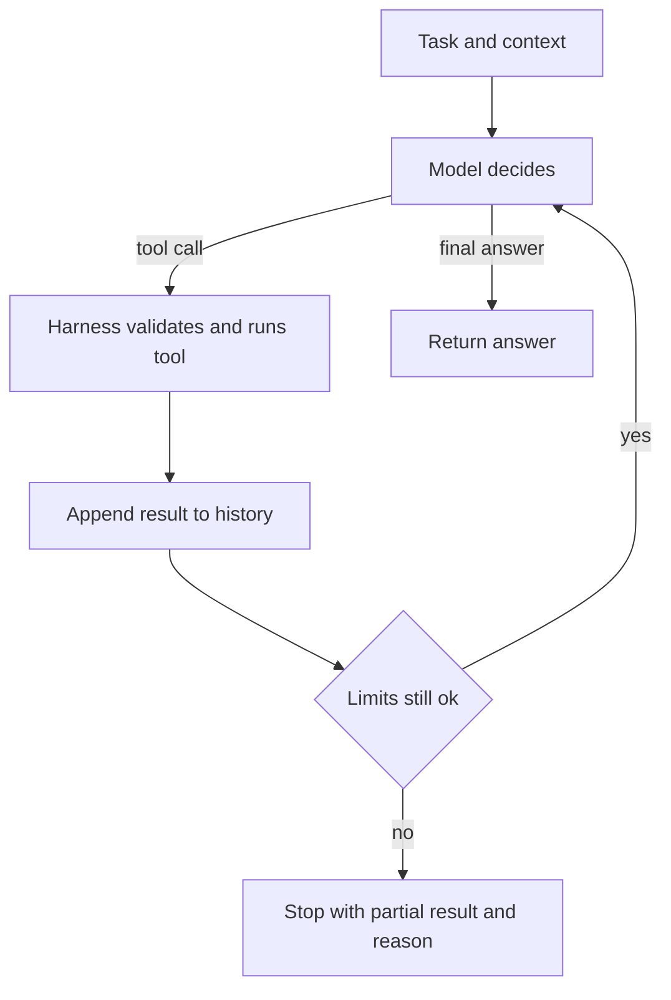
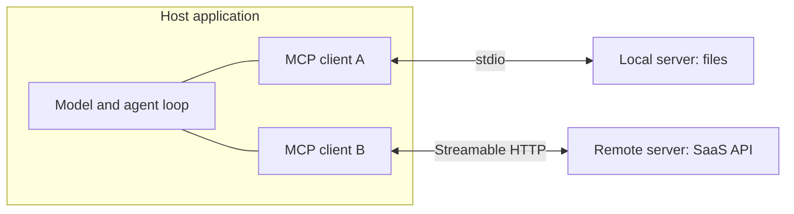

# 06. Agents, Tool Use and MCP

> **Estimated time:** 4-6 weeks
>
> **Prerequisites:** [01 Prerequisites and Developer Foundations](01-prerequisites-and-dev-foundations.md), [03 LLM APIs and Application Building Blocks](03-llm-apis-and-structured-outputs.md) (tool calling and structured outputs), [04 Prompt and Context Engineering](04-prompt-and-context-engineering.md), [05 Embeddings, Vector Search and RAG](05-embeddings-vector-search-and-rag.md)
>
> **Outcome:** You can design, build, secure and evaluate a tool-using agent, from a plain Python loop to an MCP-connected, durable, human-supervised system, and you can tell when a simpler workflow is the better engineering choice.

## Why this stage matters

Sections 03 to 05 gave you single model calls that can use tools and retrieve knowledge. An **agent** is what you get when the model chooses the next step inside a loop, and that freedom is both the power and the risk: the loop that resolves a support ticket can also burn your budget, leak data, or repeat one failing call two hundred times. This section teaches you to earn autonomy gradually. You start from workflows, add a loop only where the task needs it, design tools as carefully as a public API, give the agent memory and durable state, connect it to the outside world with the Model Context Protocol, and then wrap it in approvals, limits and evaluations. Agent tooling changes monthly, so the emphasis is on durable concepts, and volatile details are marked "(as of Oct 2026)".

## Topic map

| # | Topic | The question it answers |
|---|-------|-------------------------|
| 1 | Workflows vs agents | Do I need an agent at all, and how much autonomy is enough? |
| 2 | The agent loop | What exactly runs, and how does it stop? |
| 3 | A manual agent loop | What does an agent look like in about 80 lines of Python? |
| 4 | Tool design, and keeping context small | How do I write tools a model uses correctly and safely, and keep tool catalogues, instructions and results from bloating the window (skills, tool search, code-based tool use)? |
| 5 | Planning and reasoning patterns | ReAct, plan-and-execute, reflection, search: which, when? |
| 6 | Memory | What should an agent remember, for how long, and who may see it? |
| 7 | State, persistence and durable execution | How does a run survive crashes, deploys and week-long waits? |
| 8 | Model Context Protocol (MCP) | How do I plug agents into tools and data through one standard? |
| 9 | Frameworks and SDKs | Which library, if any, should sit under my loop? |
| 10 | Multi-agent systems | When do several agents beat one, and what does it cost? |
| 11 | Human-in-the-loop | Where must a person approve, review or take over? |
| 12 | Code execution, browser, coding and research agents | Where do the popular agent types work, and where do they break? |
| 13 | Evaluating agents | How do I measure success, trajectory, cost and flakiness? |
| 14 | Reliability and safety | Guardrails, permissions, spend limits, injection, audit trails |
| 15 | Design checklist | What do I check before shipping a new agent? |

---

## 1. Workflows vs agents: choose the simplest thing that works

A widely used distinction, popularised by Anthropic's [Building Effective AI Agents](https://www.anthropic.com/engineering/building-effective-agents), separates two shapes. In a **workflow**, your code defines the path and the model fills in steps. In an **agent**, the model decides the path at run time: which tool to call, in what order, and when to stop. Workflows are more predictable, cheaper and easier to test. Agents handle open-ended problems where you cannot list the steps in advance. Many things sold as "agents" are better built as workflows, and many production systems mix both.

Everything starts from the **augmented LLM**: a model call that can use retrieval ([section 05](05-embeddings-vector-search-and-rag.md)), tools ([section 03](03-llm-apis-and-structured-outputs.md)) and some memory. The five workflow patterns below are compositions of that block.

| Pattern | What it does | Use it when | Watch out for |
|---------|--------------|-------------|---------------|
| **Prompt chaining** | Fixed sequence; each call consumes the previous output, with programmatic **gates** between steps | The task splits cleanly into stages (draft, check, translate) | Errors propagate; add cheap deterministic checks at each gate |
| **Routing** | Classify the input, then send it to a specialised prompt, model or tool | Inputs fall into distinct categories, or you want cheap models for easy cases | Misclassification; always include a fallback route |
| **Parallelization** | Run independent subtasks at once (**sectioning**), or the same task several times and compare (**voting**) | Subtasks are independent, or you need several perspectives or a confidence signal | Cost multiplies; merging results needs a rule |
| **Orchestrator-workers** | A model decides the subtasks at run time, delegates them to workers, then synthesises | You cannot predict the subtasks (multi-file changes, research across sources) | Orchestrator quality is the bottleneck; see [section 10](#10-multi-agent-systems) |
| **Evaluator-optimizer** | One call produces, another critiques against a criterion, loop until good enough | A clear, checkable quality bar exists (tests pass, rubric met) | Needs a hard iteration cap; vague criteria loop forever |

```python
import asyncio


def llm(prompt: str) -> str:
    """Placeholder: call your provider SDK here (see section 03)."""
    raise NotImplementedError


# Prompt chaining with a cheap deterministic gate between steps
def release_note(diff: str) -> str:
    draft = llm(f"Write a short release note for this diff:\n{diff}")
    if len(draft) > 600 or "TODO" in draft:
        draft = llm(f"Shorten to under 600 characters and remove TODOs:\n{draft}")
    return llm(f"Translate to Spanish, keep product names unchanged:\n{draft}")


# Routing with a safe fallback
PROMPTS = {
    "billing": "You are a billing specialist. Reply to this ticket:\n",
    "bug": "You are a support engineer. Triage this bug report:\n",
    "other": "You are a helpful support agent. Reply to this ticket:\n",
}


def answer(ticket: str) -> str:
    label = llm(f"Classify as billing, bug or other. One word only.\n{ticket}").strip().lower()
    return llm(PROMPTS.get(label, PROMPTS["other"]) + ticket)


# Parallelization (sectioning): independent reviews run concurrently
async def review(code: str) -> list[str]:
    topics = ["security issues", "missing tests", "unclear naming"]
    return await asyncio.gather(*(asyncio.to_thread(llm, f"Review for {t}:\n{code}") for t in topics))
```

**The autonomy ladder.** Think of autonomy as rungs, and climb one only when evaluations show the rung below fails.

| Rung | Shape | Who picks the next step | Typical controls |
|------|-------|-------------------------|------------------|
| 0 | Single model call | You | Prompt tests |
| 1 | Augmented call (retrieval, structured output, one forced tool call) | You | Retrieval and format evals |
| 2 | Workflow: chain, route, parallelize | Your code | Step-level tests |
| 3 | Workflow with a bounded loop (evaluator-optimizer) | Code plus model | Iteration cap, quality metric |
| 4 | Agent loop inside a fence (budgets, allowlisted tools, approvals) | The model, within limits | Everything in sections 11 to 14 |
| 5 | Long-running or multi-agent autonomy | Model(s) | Durable execution, audit log, kill switch |

A good rule of thumb: if you can write a deterministic function for the task, write it. The [multilingual PDF blueprint](../multilingual-pdf-processor-blueprint.md) in this repository is a fine example of a workflow: staged, mostly deterministic, with models used at specific steps. An agent would only be justified inside one stage that genuinely needs open-ended investigation.

**Try it:** pick a task such as "summarise a support ticket and draft a reply". Implement it as one call, then as a two-step chain with a gate, and score both on 10 real examples before you even consider an agent.

---

## 2. The agent loop: observe, reason, act

An agent harness repeats one cycle. The model sees the goal, the tool definitions and the history so far. It either returns a final answer or asks for one or more **tool calls**. Your code (never the model) validates and executes them, appends the results to the history, and calls the model again. The cycle is often summarised as **observe, reason, act**.



**Stop conditions.** An agent without explicit stops is a bug waiting for a bill. Use several, because each catches a different failure:

- **Natural stop:** the model returns no tool calls. Some designs add an explicit `finish` tool whose arguments are a typed result, useful when downstream code needs a schema.
- **Step limit:** a hard cap on model calls, often single digits to a few dozen for a bounded task; tune it with your evals. Hitting it is a result you report, not a silent truncation.
- **Budget limits:** tokens, dollars and tool-call counts per run. A dollar cap is the guard that actually protects you when tools or sub-agents are expensive.
- **Time limit:** wall-clock timeout for the whole run and for each tool call.
- **Error budget:** stop or escalate after N consecutive tool errors.
- **Loop detection:** the same call with the same arguments repeated, two calls alternating forever, or observations that stop changing. First feed a corrective message back to the model, then stop if it persists.
- **External stops:** a human cancel, a guardrail tripwire, or an approval that is denied (see [section 11](#11-human-in-the-loop)).

**Why history growth matters.** Each step re-sends the whole history, so cost and latency grow faster than the step count. Control it by truncating large tool outputs, compacting old steps into summaries, moving bulky data into files or stores and passing references, and using prompt caching for the stable prefix. [Section 04](04-prompt-and-context-engineering.md) covers the techniques; Anthropic's [Effective context engineering for AI agents](https://www.anthropic.com/engineering/effective-context-engineering-for-ai-agents) is a good companion.

**Parallel tool calls.** Models may request several calls in one turn. Run independent read-only calls concurrently and mutating calls one at a time; return results in a way your provider's API can match to requests (by call id).

**Pitfall:** relying on `max_steps` alone. Ten cheap steps are fine; ten steps that each launch a sub-agent are not. Count money and time as well.

**Try it:** write down, for a task you care about, the five numbers you would cap (steps, tokens, dollars, seconds, consecutive errors) and what the user sees when each is hit.

---

## 3. Build it once by hand: a manual agent loop in Python

Before using any framework, write the loop yourself once. It is short, it shows what every framework wraps, and it makes later debugging far easier. This version uses the OpenAI Responses API; section 03 covers other providers, and the bullets after the code show the Anthropic equivalent.

```python
import json
import os
import time

from openai import OpenAI

client = OpenAI()  # reads OPENAI_API_KEY from the environment
MODEL = os.environ["LLM_MODEL"]  # pick a current tool-calling model from your provider's docs

MAX_STEPS = 8  # hard cap on model calls
MAX_SECONDS = 60  # wall-clock budget for the whole run
MAX_TOKENS = 50_000  # rough token budget across the run
SYSTEM = "You are a support agent. Look facts up with tools; never guess an order status."

ORDERS = {"A-1001": "shipped", "A-1002": "processing"}


def get_order_status(order_id: str) -> str:
    if order_id not in ORDERS:
        return f"ERROR: no order {order_id!r}. Order ids look like 'A-1001'."
    return f"Order {order_id} is {ORDERS[order_id]}."


TOOLS = [{
    "type": "function",
    "name": "get_order_status",
    "description": (
        "Look up the shipping status of ONE order by id. Read-only. "
        "Use when the user asks where an order is. Returns one sentence."
    ),
    "parameters": {
        "type": "object",
        "properties": {"order_id": {"type": "string", "description": "Order id such as 'A-1001'."}},
        "required": ["order_id"],
        "additionalProperties": False,
    },
    "strict": True,
}]
REGISTRY = {"get_order_status": get_order_status}


def run_tool(name: str, raw_args: str) -> str:
    fn = REGISTRY.get(name)
    if fn is None:
        return f"ERROR: unknown tool {name!r}. Available tools: {sorted(REGISTRY)}."
    try:
        return str(fn(**json.loads(raw_args)))[:4000]  # cap output size
    except Exception as exc:  # report it so the model can correct itself
        return f"ERROR: {type(exc).__name__}: {exc}"


def run_agent(task: str) -> str:
    items = [{"role": "user", "content": task}]  # the running history
    started, tokens, seen = time.monotonic(), 0, {}
    for _ in range(MAX_STEPS):
        if time.monotonic() - started > MAX_SECONDS or tokens > MAX_TOKENS:
            return "STOPPED: time or token budget exhausted."
        response = client.responses.create(model=MODEL, instructions=SYSTEM, tools=TOOLS, input=items)
        tokens += response.usage.total_tokens if response.usage else 0
        items += response.output  # keep the model's own turn in the history
        calls = [it for it in response.output if it.type == "function_call"]
        if not calls:  # stop condition: the model answered
            return response.output_text
        for call in calls:
            key = (call.name, call.arguments)
            seen[key] = seen.get(key, 0) + 1
            if seen[key] > 2:  # loop detection
                result = "ERROR: identical call repeated 3 times. Change approach or finish with what you know."
            else:
                result = run_tool(call.name, call.arguments)
            items.append({"type": "function_call_output", "call_id": call.call_id, "output": result})
    return "STOPPED: step limit reached."  # max-steps guard: report it, never hide it


if __name__ == "__main__":
    print(run_agent("Where is order A-1001, and what about A-9999?"))
```

What to notice:

- The model never runs anything. It emits a request; `run_tool` decides whether and how to execute it.
- Every failure becomes text the model can read (`ERROR: ...`), so it can fix a bad argument instead of crashing the run.
- Four independent guards (steps, time, tokens, repeated calls) exist before any "smart" behaviour.
- `items += response.output` matters: reasoning-capable models need their own earlier output items passed back.
- Production code also handles refusals, incomplete responses, retries with backoff for transient API errors, and logging of every step.

**If you use the Anthropic Messages API instead,** the loop has the same skeleton with different names: tools are declared with `name`, `description` and `input_schema`; a turn that wants a tool ends with `stop_reason == "tool_use"` and `tool_use` content blocks (each with an `id`, `name` and `input`); you reply with one user message whose content starts with `tool_result` blocks (each carrying the matching `tool_use_id`, and `is_error: true` for failures), with any text placed after them. Details: [handle tool calls](https://platform.claude.com/docs/en/agents-and-tools/tool-use/handle-tool-calls). Both vendors also ship helpers that run this loop for you (Anthropic's beta [tool runner](https://platform.claude.com/docs/en/agents-and-tools/tool-use/tool-runner); the OpenAI [Agents SDK](https://openai.github.io/openai-agents-python/)), which are worth using once you understand what they hide. Anthropic's tool runner page itself points you back to the manual loop when you need per-call human approval, custom logging or conditional execution, which is a good reason to know how to write it.

**Try it:** add a second tool and a question that needs both. Then add a tool that always raises an exception and confirm that the guards end the run with a clear message instead of spinning.

---

## 4. Tool design

Tool quality is one of the biggest levers on agent reliability. A tool is an API whose caller is a probabilistic reader, so design it for being misread. See Anthropic's [Writing effective tools for AI agents](https://www.anthropic.com/engineering/writing-tools-for-agents) and the [tool definition guide](https://platform.claude.com/docs/en/agents-and-tools/tool-use/define-tools).

**Naming.** Use specific verb-noun names (`search_invoices`, not `search`), and namespace when several systems overlap (`github_list_prs`, `slack_send_message`). Stick to letters, digits, underscores and hyphens; providers and MCP restrict allowed characters and cap the length (check your provider's limit). Keep names stable: renaming a tool is a breaking change for prompts and evals.

**Descriptions.** Write them as you would brief a new colleague: what the tool does, when to use it and when not to, what it returns, and any limits. Anthropic's docs call the description the most important factor in tool performance and suggest several sentences for non-trivial tools. Put units, formats and examples here.

**Input schemas.**
- Keep them small and flat; use enums, bounds and formats instead of free text.
- Use unambiguous parameter names (`customer_email`, not `user`).
- Never require values the model cannot know (internal ids); give it a search tool that returns them.
- Enable strict schema mode where available so arguments always parse (see section 03), and still validate server-side.
- Make illegal states unrepresentable: two mutually exclusive options become one enum.

**Output shaping.**
- Return only fields that help the next decision. Prefer readable names next to ids; raw database rows waste context.
- Offer a `detail` or `response_format` option ("concise" or "full") when needs vary.
- Truncate with a hint: "showing 10 of 143; pass `cursor` for more".
- Be consistent: the same field names and error shapes across tools.

**Errors the model can act on.** A good error says what failed, what valid input looks like, and what to try next.

| Weak | Strong |
|------|--------|
| `Error 422` | `amount_cents must be between 1 and 4000 for INV-2024-0042. Amounts are in cents, not euros.` |
| `Not found` | `No invoice 'INV-42'. Ids look like 'INV-2024-0042'. Call search_invoices with the customer email to find one.` |
| `Rate limited` | `Rate limit hit. Wait 30 seconds, or batch the lookups into one call using ids=[...].` |

MCP draws the same line: malformed or unknown requests are protocol errors, while failures the model can fix (bad date, out-of-range value, business-rule violation) are returned as ordinary tool results flagged `isError`, so the model can read them and retry.

**Idempotency.** Agents retry, and frameworks replay. Any tool with side effects should accept an **idempotency key** (or be naturally idempotent, like "set status to X") and return the original result on a duplicate. Offer a dry-run option for risky writes.

```python
INVOICES = {"INV-2024-0042": {"paid_cents": 12000, "refunded_cents": 0}}
SEEN: dict[str, dict] = {}  # idempotency_key -> first result (use a database table in real code)


def refund_invoice(invoice_id: str, amount_cents: int, idempotency_key: str) -> dict:
    """Refund part or all of one paid invoice. Moves money: a human must approve first.
    Returns status, refunded_cents and remaining_cents. Safe to retry with the same idempotency_key."""
    if idempotency_key in SEEN:  # a retry returns the first result, never a second refund
        return SEEN[idempotency_key]
    invoice = INVOICES.get(invoice_id)
    if invoice is None:
        return {"error": f"No invoice {invoice_id!r}. Ids look like 'INV-2024-0042'. Use search_invoices to find one."}
    remaining = invoice["paid_cents"] - invoice["refunded_cents"]
    if not 0 < amount_cents <= remaining:
        return {"error": f"amount_cents must be between 1 and {remaining} for {invoice_id}. Amounts are in cents."}
    invoice["refunded_cents"] += amount_cents
    result = {"status": "refunded", "refunded_cents": amount_cents, "remaining_cents": remaining - amount_cents}
    SEEN[idempotency_key] = result
    return result
```

**Pagination.** Read tools that can return many rows need a `limit` with a small default, a cursor, and a total count, so the agent can decide whether to continue instead of flooding its context.

**Least privilege.** Give each agent only the tools it needs; split read and write into separate tools so they can be permissioned separately; run tools with credentials scoped to the task, ideally acting on behalf of the end user so the agent can never exceed that user's rights; and enforce authorisation inside the tool, never by trusting identifiers the model supplies. Statefulness belongs in explicit handles (`create_basket` returns a `basket_id` the model passes back), which also fits the current MCP design (see section 8).

**Tool count versus accuracy.** Every tool definition consumes context and adds a chance of picking wrongly, so more tools usually means worse selection. Consolidate related operations behind one tool with an `action` parameter where that keeps schemas clear, namespace the rest, and, for large catalogues, load tool definitions on demand (provider "tool search" features, or a routing step that selects a toolset per sub-task; see [4.1](#41-keeping-the-agents-context-small-skills-tool-search-and-code-based-tool-use)). There is no universal magic number; the right ceiling is where your own tool-selection eval starts to drop.

**Try it:** take one tool, write 20 realistic user requests, log which tool and arguments the model picks, then rewrite only the description and error messages and re-measure.

### 4.1 Keeping the agent's context small: skills, tool search and code-based tool use

Tool definitions, long instructions and bulky intermediate results all compete for one window, and the budgeting, truncation and compaction techniques in [04 section 10](04-prompt-and-context-engineering.md#10-context-engineering) apply here too. Three mechanisms attack the problem at its source, and they share one idea, **progressive disclosure**: the agent always sees a cheap index (a name and a one-line description) and loads the full content only when the task needs it. They matter most with MCP ([section 8](#8-model-context-protocol-mcp)), because every connected server adds all of its tool definitions up front, so a few servers can fill a large part of the window before the user has typed a word.

**Agent Skills.** A **skill** is a folder containing a `SKILL.md` file (YAML frontmatter with a required `name` and `description`, then instructions) plus optional scripts, reference files and assets. The `name` uses lowercase letters, digits and hyphens and matches the folder name. The format began at Anthropic, is published as an open specification and is supported by agent products from several vendors (as of Oct 2026); see the [specification](https://agentskills.io/specification) and Anthropic's [Agent Skills overview](https://platform.claude.com/docs/en/agents-and-tools/agent-skills/overview). Loading happens in stages: the `name` and `description` of every installed skill are in context from the start (on the order of a hundred tokens each, per the spec), the `SKILL.md` body is read when the task matches a description, and bundled files are read, or scripts run, only when the instructions point to them. A script's code never enters context, only its output. The description is the trigger, so it must say what the skill does and when to use it; "helps with invoices" never fires reliably, while "triage refund and invoice disputes; use when a ticket mentions a refund, duplicate charge or invoice error" does.

```text
invoice-triage/
  SKILL.md               # frontmatter (name, description) plus a short workflow; keep the body focused
  references/POLICY.md   # read only when an edge case needs it
  scripts/validate.py    # executed, not read: only its output enters context
```

**Skill, system prompt or tool?** Put a rule in the system prompt when it matters on every request and is short (tone, hard limits, output format). Write a skill when the knowledge is a procedure or reference that only some tasks need (a refund policy, a report template, a migration checklist), especially with deterministic helper scripts: it costs one index line until used and can grow without taxing unrelated requests. Build a tool or MCP server when the agent must act on an external system or fetch live data, because a skill can describe how to do something but cannot hold credentials, enforce authorisation or return fresh records. A common split is a skill that teaches *when and how* to use a set of tools. In the memory taxonomy of [section 6](#6-memory), skills are procedural memory, and as plain files they can be reviewed and evaluated like prompts ([section 07](07-evaluation-observability-and-testing.md)).

**Skills and plugins are a supply-chain risk.** A skill is third-party text that the model treats as instructions, bundled with scripts that run with the agent's privileges, so it carries the same risks as an MCP server: [08 section 5](08-safety-security-and-responsible-ai.md#5-agent-specific-attacks) covers tool poisoning, rug pulls (content that changes after you approved it) and malicious servers. Anthropic's skills documentation likewise says to use skills only from trusted sources, to read every bundled file and to treat a skill like installed software. Prefer skills you wrote, pin a version or commit and re-review the diff on update, run bundled scripts only inside the sandbox of [12.1](#121-code-execution-and-sandboxes), and be wary of skills whose instructions fetch remote content at run time.

**Tool search and deferred loading.** Instead of sending every definition on every turn, you mark most tools as deferred and give the model a search tool plus a few always-loaded tools. When it needs a capability it searches, and only the matching definitions are loaded into context. Providers offer this natively (as of Oct 2026, check supported models): Anthropic's `defer_loading` flag with regex and BM25 search variants and per-server deferral for MCP toolsets ([docs](https://platform.claude.com/docs/en/agents-and-tools/tool-use/tool-search-tool)), and tool search with namespaces of deferred functions in OpenAI's Responses API ([docs](https://developers.openai.com/api/docs/guides/tools-tool-search)). You can also build it: embed the tool descriptions ([section 05](05-embeddings-vector-search-and-rag.md)), expose a `find_tools(query)` tool and add the top matches to the next call. Habits that carry over: keep the three to five most-used tools always loaded, prefix names by system (`github_`, `slack_`) so one search finds a group, write descriptions in the words users actually use, list the available tool categories in the system prompt, and check how changing the loaded set interacts with prompt caching, which differs by provider.

**When to turn it on.** Do not take a number from a blog post; use the tool-selection eval from above at several catalogue sizes. Enable search when accuracy with the full catalogue falls more than your tolerance (say 3 to 5 points) below accuracy with only the relevant tools, or when definitions take a large share of input tokens on every request, and keep it only if end-to-end success holds. For orientation, Anthropic's docs suggest considering it from roughly ten tools or ten thousand tokens of definitions, and skipping it when the catalogue is small and most tools are used in most runs (as of Oct 2026). Search adds a step and a new failure mode: a tool that never surfaces might as well not exist, so measure **search recall** (did the needed tool appear in the top k?) separately from selection accuracy.

**Code-based tool orchestration.** With ordinary tool calling every call is a model round trip and every result lands in context, even when the next step needs only a filtered count. Here the model writes a short script that calls your tools as functions, with loops, conditionals and aggregation done in code, and only the script's final output returns to the model. It fits fan-out over many items (fifty order lookups), large results that can be filtered before the model sees them, and chains of three or more dependent calls. It fits poorly when there are only a few small calls, or when the model must reason over each result before choosing the next step. Examples include Anthropic's programmatic tool calling (tools opt in with an `allowed_callers` field and run inside its code-execution container, as of Oct 2026; [docs](https://platform.claude.com/docs/en/agents-and-tools/tool-use/programmatic-tool-calling)), the approach of presenting MCP tools as a code API that the agent browses and loads on demand ([Code execution with MCP](https://www.anthropic.com/engineering/code-execution-with-mcp)), and the `CodeAgent` in smolagents ([section 9](#9-frameworks-and-sdks)).

**Sandbox requirements.** The script is model-written code that injected tool output can steer, so all of [12.1](#121-code-execution-and-sandboxes) applies: isolation, no network or an egress allowlist, no secrets, and CPU, memory, time and output limits. Three more rules follow from the tool calls the script makes. First, each call must still pass through your harness (argument validation, server-side authorisation, idempotency keys, audit logging), with the script talking to a narrow bridge instead of holding credentials; a provider flag such as `allowed_callers` shapes what the model is offered and is not a security boundary, as Anthropic's docs say explicitly. Second, a loop over fifty refunds skips per-call human review unless the bridge applies it, so route risky tools through the approval gate of [section 11](#11-human-in-the-loop) or approve the batch as a whole. Third, log the script itself next to every bridged call, and document each tool's output format, because the model now parses results in code. Anthropic's own write-up of the pattern notes that running agent-generated code needs sandboxing, resource limits and monitoring, an operational cost that direct calls avoid.

**Try it:** build a 20-request tool-selection eval and run it in three configurations: (A) 5 tools, (B) 30 tools (the same 5 plus 25 realistic distractors with overlapping descriptions), and (C) the same 30 tools behind a search step with the 5 most-used tools always loaded. For each, record selection accuracy (right tool, valid arguments), input tokens per run, model calls and latency, and for C also search recall. Then write two sentences on whether C earned its extra step on your workload. Results vary by model and by how well the descriptions are written, so report your own numbers rather than anyone else's.

---

## 5. Planning and reasoning patterns

| Pattern | Idea | Use it when | Watch out for |
|---------|------|-------------|---------------|
| **ReAct** | Interleave short reasoning with tool actions and observations | General tool-using tasks; this is what the loop in section 3 does | Reasoning text can be wrong while sounding confident |
| **Plan-and-execute** | Plan the steps first, execute them (possibly with cheaper models), re-plan on surprises | Long tasks with predictable structure; you want an inspectable or human-approvable plan | Brittle if the plan is never revised |
| **Reflection** | Critique the attempt and retry, optionally storing the lesson | You have external feedback: tests, validators, tool errors | Self-critique without grounding often misses real errors |
| **Tree or graph search** | Explore several candidate paths, score them, backtrack | Puzzle-like problems with a cheap way to verify a branch | Token cost explodes; rarely worth it for product agents |

- **ReAct** ([Yao et al., 2022](https://arxiv.org/abs/2210.03629)) showed that mixing reasoning traces with actions beats either alone. Modern models with native "thinking" and native tool calling do much of this internally, so you rarely need to prompt for "Thought/Action/Observation" text yourself. Ask tools for a short rationale or evidence field if you want auditability.
- **Plan-and-execute** gives you a plan object you can log, show to a user, or constrain. Many coding agents keep a to-do list tool as a lightweight version. Always include a re-plan step when a step fails.
- **Reflection** ([Reflexion, Shinn et al., 2023](https://arxiv.org/abs/2303.11366)) turns failures into written lessons for the next attempt. It works best when the feedback is objective, which is why it fits coding with a test suite and fits poorly when the only judge is the same model. The workflow version is evaluator-optimizer from section 1.
- **Search** ([Tree of Thoughts, Yao et al., 2023](https://arxiv.org/abs/2305.10601)) generalises chain-of-thought into branching exploration with evaluation and backtracking. In practice, best-of-n sampling plus a verifier, or simple retries on failed checks, covers most product needs at a fraction of the cost.

Two practical rules. First, a strong reasoning model with a simple loop frequently beats an elaborate scaffold, and scaffolds built for older models can become dead weight, so re-test them when you upgrade. Second, scaffolding should be justified by an eval, not by taste.

**Try it:** implement plan-and-execute (a planner returns a JSON list of steps; an executor loop handles each) and compare cost and success against the plain loop on 10 tasks.

---

## 6. Memory

**Short-term memory** is the context window: the messages, tool results and instructions the model sees right now. Manage it with truncation, compaction (summarising old turns), and offloading bulky data into files or stores with a reference left in context.

**Long-term memory** lives outside the model and is retrieved into context on demand. Pick the store to fit the access pattern:

| Store | Good for | Example content |
|-------|----------|-----------------|
| Key-value or relational | Exact lookups, structured profiles | `preferred_language = "es"`, plan tier |
| Vector store ([section 05](05-embeddings-vector-search-and-rag.md)) | Fuzzy recall of past episodes or documents | "We solved a similar billing dispute in March" |
| Graph or temporal knowledge graph | Entities and relationships that change over time | Who reports to whom; which contract superseded which |
| Plain files (notes, markdown) | Simple, inspectable, human-editable memory | Project conventions an agent should follow |

**Kinds of memory.** The Cognitive Architectures for Language Agents paper ([CoALA](https://arxiv.org/abs/2309.02427)) popularised a useful split that maps neatly to engineering decisions:

| Kind | What it holds | Typical form | Typical write trigger |
|------|---------------|--------------|-----------------------|
| **Episodic** | What happened: past runs, trajectories, outcomes | Event logs, summaries, embedded transcripts | End of a run or session |
| **Semantic** | Facts about the user, domain or world | Profile fields, extracted facts | User states a fact; background extraction |
| **Procedural** | How to do things: rules, playbooks, learned instructions | Prompt files, [skills](#41-keeping-the-agents-context-small-skills-tool-search-and-code-based-tool-use), few-shot examples | Review of repeated successes or corrections |

**Writing and consolidating.** Decide when to write: in the hot path (the agent calls a `remember` tool, which is visible but costs latency and tokens) or in the background (a separate job extracts memories after the session, which is cheaper and more consistent). A sound write policy stores a candidate memory with its source, a timestamp and a confidence; checks it against existing memories to update or merge instead of duplicating; resolves conflicts (newer statements usually win, but ask when stakes are high); and periodically consolidates many episodes into a few durable facts. The **Generative Agents** paper ([Park et al., 2023](https://arxiv.org/abs/2304.03442)) scores retrieved memories by recency, importance and relevance, a pattern that is still a solid default. The **MemGPT** line of work ([paper](https://arxiv.org/abs/2310.08560)) treats context as a managed cache over external memory, and continues in the [Letta](https://docs.letta.com/) project. Other libraries to evaluate: [Mem0](https://docs.mem0.ai/), [LangMem](https://langchain-ai.github.io/langmem/), and [Graphiti](https://github.com/getzep/graphiti) for temporal graphs.

**Retrieval.** Inject only the top few memories, labelled as background notes rather than instructions, and let the current user message override them.

**Forgetting.** Memory without deletion becomes stale and risky. Use expiry times, supersession (a new fact replaces an old one), size caps, and explicit user-triggered deletion. Tag every memory with its owner so deletion requests can be honoured completely.

**Privacy and safety.**
- Namespace by user or tenant and never search across namespaces; a cross-tenant memory leak is a serious incident.
- Do not store secrets or unnecessary personal data; apply retention limits and encryption like any other user data.
- Treat memory writes from untrusted content as an attack surface: a web page that talks the agent into "remembering" a malicious instruction poisons future runs (the OWASP agentic list names memory and context poisoning explicitly; see [section 14](#14-reliability-and-safety-for-agents) and [section 08](08-safety-security-and-responsible-ai.md)).
- Be transparent: users should be able to see and delete what is remembered about them. This is awareness-level guidance, not legal advice; check the rules that apply to you.

**Pitfalls:** storing everything, retrieving too much, letting an old memory contradict a new message, and having no way to inspect what the agent believes.

**Try it:** build a memory with add, search and delete operations on SQLite (or a vector store), a per-user namespace, and an expiry field; then write three test scenarios (preference changes, a deletion request, a prompt-injected "remember this").

---

## 7. State, persistence, checkpointing and durable execution

Agent runs are long, fallible and sometimes wait for people. Servers restart, rate limits hit, and an approval may arrive tomorrow. Separate three kinds of state: the **conversation** (messages), the **run state** (step counter, plan, scratch values, pending approvals) and **external state** (databases, files, tickets). Persist the first two deliberately; treat the third as the source of truth for side effects.

**Checkpointing** saves the run state after each step so the run can resume, pause, fork or be inspected later. In LangGraph, a **checkpointer** saves snapshots per **thread** (`thread_id`); in-memory savers are for development and SQLite or Postgres savers are for production, while a separate **store** holds long-term data shared across threads ([persistence docs](https://docs.langchain.com/oss/python/langgraph/persistence)). Other stacks offer comparable features: the Claude Agent SDK can resume or fork sessions, and the OpenAI Agents SDK has sessions and a serialisable run state for pause and resume.

**Durable execution engines** go further. Systems such as [Temporal](https://docs.temporal.io/), [Inngest](https://www.inngest.com/), [DBOS](https://docs.dbos.dev/) and [Restate](https://restate.dev/) record every completed step in an event history; after a crash they replay the workflow code deterministically, skip steps that already finished (their recorded results are reused) and continue. Non-deterministic work such as model calls and tool calls runs as recorded activities or steps. Temporal documents an [OpenAI Agents SDK integration](https://docs.temporal.io/develop/python/integrations/openai-agents) that runs the agent loop inside a workflow with model calls as activities, and Pydantic AI lists integrations with Temporal, DBOS, Prefect and Restate (as of Oct 2026). Choose simple checkpointing first; reach for a durable engine when runs last hours or days, need guaranteed retries, timers, or signals such as "approval arrived", or when losing a half-finished run costs real money.

**Rules that keep durable agents correct:**
- Assume **at-least-once** execution: make tools idempotent (section 4).
- Put side effects after an approval or interrupt, never before it. LangGraph restarts the interrupted node from its beginning on resume, so code before the pause runs again.
- Keep state small, JSON-serialisable and versioned; store large artifacts outside it and keep secrets out of checkpoints.
- Give checkpoints a retention policy; they contain user data.
- For tasks that outlive a context window, leave a progress file and commit work incrementally so a fresh session can pick up cleanly (Anthropic describes this in [effective harnesses for long-running agents](https://www.anthropic.com/engineering/effective-harnesses-for-long-running-agents)).

```python
from typing import TypedDict

from langgraph.checkpoint.memory import InMemorySaver
from langgraph.graph import END, START, StateGraph
from langgraph.types import Command, interrupt


class State(TypedDict):
    draft: str
    approved: bool
    executed: bool


def write_draft(state: State) -> dict:
    return {"draft": "Refund 40 EUR to customer 17"}


def approval_gate(state: State) -> dict:
    decision = interrupt({"proposed_action": state["draft"]})  # pauses the run here
    return {"approved": bool(decision)}


def execute(state: State) -> dict:
    if state["approved"]:
        print("executing:", state["draft"])  # the real side effect belongs here, after approval
    return {"executed": state["approved"]}


builder = StateGraph(State)
builder.add_node("write_draft", write_draft)
builder.add_node("approval_gate", approval_gate)
builder.add_node("execute", execute)
builder.add_edge(START, "write_draft")
builder.add_edge("write_draft", "approval_gate")
builder.add_edge("approval_gate", "execute")
builder.add_edge("execute", END)

graph = builder.compile(checkpointer=InMemorySaver())  # use a SQLite or Postgres saver in production
config = {"configurable": {"thread_id": "refund-42"}}

graph.invoke({"draft": "", "approved": False, "executed": False}, config)  # runs until interrupt() and pauses
graph.invoke(Command(resume=True), config)  # a human said yes; continues from the checkpoint
```

The same shape works in every framework: pause, persist, wait for an external answer, resume. See the LangGraph [interrupts guide](https://docs.langchain.com/oss/python/langgraph/interrupts) for the exact result shape in your installed version.

**Try it:** swap `InMemorySaver` for a SQLite checkpointer, run the first `invoke`, stop the process, restart it, and resume with the same `thread_id`.

---

## 8. Model Context Protocol (MCP)

### 8.1 Purpose

Without a standard, every AI application needs custom glue for every tool or data source. The **Model Context Protocol** is an open standard that lets an AI application connect to any compliant server that exposes tools, data and prompts, much as the Language Server Protocol let editors share language support. The specification is built on JSON-RPC 2.0. MCP is a plug standard, not an agent framework: it says how capabilities are described and called, and leaves the reasoning to your loop. A tool exposed through MCP reaches the model like any other tool definition.

### 8.2 Architecture

- **Host:** the LLM application that starts connections (a chat app, an IDE, your own agent).
- **Client:** a connector inside the host that maintains one connection to one server.
- **Server:** a program that exposes capabilities, either a local subprocess or a remote HTTP service.



### 8.3 Spec status (as of Oct 2026)

The latest revision is **2026-07-28**, released in July 2026. Specification versions are date strings, and the [changelog](https://modelcontextprotocol.io/specification/2026-07-28/changelog) is the authority. The headline changes from the previous revision (2025-11-25):

- **Stateless core.** The `initialize` handshake and protocol-level sessions (`Mcp-Session-Id`) are gone. Every request carries its protocol version and client capabilities in `_meta`, and a `server/discover` call advertises what a server supports. A server that needs state across calls hands out explicit handles (a cart id, a workflow id) that the model passes back as ordinary tool arguments.
- **Multi round-trip requests.** Server-initiated requests (asking the user for input, for example) are replaced by results marked `input_required`; the client gathers the answer and retries the original request with it.
- **Streamable HTTP is simpler.** One POST endpoint, replies as JSON or a request-scoped event stream, standard `Mcp-Method` and `Mcp-Name` headers so gateways can route without parsing bodies, `subscriptions/listen` for change notifications, and cacheable list results (`ttlMs`, `cacheScope`).
- **Tasks became an official extension** for long-running operations: the server returns a durable task id and the client polls, with an `input_required` state for human approvals ([tasks overview](https://modelcontextprotocol.io/extensions/tasks/overview)).
- **Deprecations** (still working for at least twelve months): Roots, Sampling and Logging; the old HTTP+SSE transport; and Dynamic Client Registration in favour of Client ID Metadata Documents.
- **SDKs.** The release announcement lists TypeScript, Python, Go and C# as Tier 1 SDKs ([announcement](https://blog.modelcontextprotocol.io/posts/2026-07-28/)).

Older tutorials describe earlier revisions (the `initialize` handshake, `Mcp-Session-Id`, SSE transport, the Python class `FastMCP`). SDKs and hosts negotiate backward compatibility, but always check which revision your SDK and host implement.

### 8.4 Primitives

| Primitive | Who controls it | What it is | Use it for |
|-----------|-----------------|------------|-----------|
| **Tools** | The model | Functions with a JSON Schema for input and optional output, plus behaviour annotations | Actions and computations: search, create, update |
| **Resources** | The application | Read-only context identified by a URI, with templates such as `notes://{title}` | Files, records, schemas the host may attach as context |
| **Prompts** | The user | Reusable, parameterised message templates | Slash-command style workflows |
| **Elicitation** (client feature) | The server asks, the user answers | A structured request for missing input, carried inside an `input_required` result since 2026-07-28 | Confirmations, missing parameters |

Extensions add Tasks, MCP Apps (interactive UI) and Skills over MCP. A practical test: if the model should decide to do it, make it a tool; if a human or the host chooses what to load, make it a resource or prompt. Tool annotations such as read-only or destructive hints are advisory, and the spec says clients must treat them as untrusted unless the server is trusted.

### 8.5 Transports

- **stdio:** the client launches the server as a subprocess and exchanges newline-delimited JSON-RPC over stdin and stdout. Simple and local. Never print to stdout from a stdio server (it corrupts the protocol); log to stderr.
- **Streamable HTTP:** the server exposes one HTTP endpoint for POST. It must validate the `Origin` header to prevent DNS-rebinding attacks, should bind to localhost when running locally, and should authenticate connections ([transport spec](https://modelcontextprotocol.io/specification/2026-07-28/basic/transports/streamable-http)).
- Custom transports are allowed if they preserve the message format.

Choose stdio for single-user local tools and Streamable HTTP for shared, remote or multi-user servers.

### 8.6 Authorization

Authorization is optional and applies to HTTP transports; stdio servers should read credentials from the environment instead. When used, the model is standard OAuth 2.1 plumbing ([authorization spec](https://modelcontextprotocol.io/specification/2026-07-28/basic/authorization)):

- The MCP server is an OAuth **resource server**. It must publish Protected Resource Metadata (RFC 9728) so clients can discover the authorization server.
- Clients use PKCE and send the `resource` parameter (RFC 8707), and the server must accept only tokens issued for it (audience validation).
- Tokens travel in the `Authorization: Bearer` header, never in the query string.
- Client registration prefers Client ID Metadata Documents; pre-registration works; Dynamic Client Registration is deprecated.
- Mix-up defence: authorization servers should return an `iss` parameter (RFC 9207), and a client must compare a present `iss` with the issuer it recorded before redeeming the authorization code.
- Scopes should be minimal. A server answers insufficient permissions with HTTP 403 and a challenge naming the needed scope, and the client re-authorizes with the union of old and new scopes (step-up).
- A server must not accept tokens meant for another service and must not forward the client's token to downstream APIs ("token passthrough"); it obtains its own downstream credentials instead.

### 8.7 Build a minimal server and client

This uses the Python SDK 2.x API (as of Oct 2026; v1 named the server class `FastMCP`). Install with `pip install "mcp[cli]"`.

```python
# server.py
from mcp.server import MCPServer
from mcp.server.mcpserver.exceptions import ResourceNotFoundError, ToolError

mcp = MCPServer("notes", instructions="Save and search short plain-text notes.")
NOTES: dict[str, str] = {}


@mcp.tool()
def add_note(title: str, body: str) -> str:
    """Save a note under a unique title. Fails if the title already exists."""
    if title in NOTES:
        raise ToolError(f"A note titled {title!r} already exists. Choose a different title.")
    NOTES[title] = body
    return f"Saved note {title!r}."


@mcp.tool()
def search_notes(query: str, limit: int = 5) -> list[str]:
    """Return titles of notes whose title or body contains the query (case-insensitive). Read-only."""
    q = query.lower()
    return [t for t, b in NOTES.items() if q in t.lower() or q in b.lower()][:limit]


@mcp.resource("notes://{title}")
def read_note(title: str) -> str:
    """The full text of one note."""
    if title not in NOTES:
        raise ResourceNotFoundError(f"No note titled {title!r}.")
    return NOTES[title]


@mcp.prompt(title="Summarize a note")
def summarize(title: str) -> str:
    """Ask the model to summarize one note."""
    return f"Read notes://{title} and summarize it in three bullet points."


if __name__ == "__main__":
    mcp.run(transport="stdio")  # log with the logging module (stderr), never print()
```

```python
# client.py
import anyio
from mcp import Client, StdioServerParameters


async def main() -> None:
    params = StdioServerParameters(command="python", args=["server.py"])
    async with Client(params) as client:  # launches server.py as a subprocess
        listed = await client.list_tools()
        for tool in listed.tools:
            print(tool.name, "-", tool.description)

        saved = await client.call_tool("add_note", {"title": "mcp", "body": "stateless since 2026-07-28"})
        print(saved.is_error, saved.content)

        found = await client.call_tool("search_notes", {"query": "stateless"})
        print(found.structured_content)

        duplicate = await client.call_tool("add_note", {"title": "mcp", "body": "again"})
        print(duplicate.is_error, duplicate.content)  # the error is data the model can read and act on


if __name__ == "__main__":
    anyio.run(main)
```

Test interactively with the MCP Inspector (`uv run mcp dev server.py`), and in automated tests connect in-process with `Client(mcp)`. To use the server from your own agent, convert each listed tool's `name`, `description` and `input_schema` into your provider's tool format and route calls to `client.call_tool`; most frameworks in section 9 can also consume MCP servers directly. For Streamable HTTP, point `Client` at the server URL and add authentication. See the [Python SDK docs](https://py.sdk.modelcontextprotocol.io/), the [build-a-server tutorial](https://modelcontextprotocol.io/docs/develop/build-server) and the [reference servers](https://github.com/modelcontextprotocol/servers).

### 8.8 Security considerations

Connecting an MCP server is like adding a dependency plus a plugin that can steer your model and touch your data. The spec's own [security best practices](https://modelcontextprotocol.io/docs/2026-07-28/tutorials/security/security_best_practices) cover the OAuth, SSRF, state-handle, local-server and scope items below in depth. Tool poisoning and prompt injection are model-side risks that the spec leaves mostly to hosts; its tools page asks clients to show tool inputs to users and to keep a human able to deny calls.

- **Tool poisoning.** A malicious or compromised server hides instructions in tool descriptions, schemas or annotations; the model reads them with the same trust as its own instructions and may read files or leak secrets. Review full tool definitions (not just names), pin server versions, diff definitions when they change (a server can alter them after you approved it), namespace tools so one server cannot redefine another's, and only connect servers you trust.
- **Indirect prompt injection** through tool results from any server (see section 14).
- **Confused deputy.** An MCP proxy that fronts a third-party API with one shared OAuth client id, while allowing dynamic registration and relying on the provider's consent cookie, can let an attacker obtain tokens without the user's consent. Mitigate with per-client consent stored server-side, exact redirect-URI matching and `state` validation.
- **Token passthrough** and missing audience checks (section 8.6).
- **Server-side request forgery.** A client that follows server-supplied OAuth discovery URLs can be pointed at internal addresses or cloud metadata endpoints. Require HTTPS, block private and link-local ranges with a vetted library, and use an egress proxy.
- **Local server compromise.** One-click installs run arbitrary commands. Show the exact command, sandbox the process, grant the minimum filesystem and network access, and prefer stdio or authenticated local HTTP.
- **State-handle hijacking.** Possessing a handle must never equal authority; bind handles to the authenticated user and make them unguessable.
- **Over-permissioned scopes.** Request minimal scopes, add more by step-up, and keep separate credentials per server.
- **Supply chain.** Pin and review packages that servers run (`npx` or `uvx` of the latest release is a moving target).

The recurring defence is to keep a human able to see and deny consequential tool calls, as the spec itself recommends.

### 8.9 Agent-to-agent protocols (briefly)

MCP connects an agent to tools and data. The **Agent2Agent (A2A)** protocol addresses a different link: independent agents, possibly built on different frameworks or by different organisations, discovering each other (via "agent cards"), delegating tasks and exchanging results without exposing internals. A2A was started by Google and is now under the Linux Foundation, and it is positioned as complementary to MCP ([A2A site](https://a2a-protocol.org/latest/); status as of Oct 2026). Several frameworks list support, including Google ADK and Pydantic AI. Most single-company systems do not need it; consider it when agents cross vendor or organisational boundaries.

**Try it:** run the server above, call each tool from the Inspector, then break it on purpose (duplicate title) and read the error the model would receive. Finally, change `add_note` to require a `confirm` argument and see how the schema changes.

---

## 9. Frameworks and SDKs

**When plain code wins.** One agent, a handful of tools, no long waits: the loop in section 3 plus a provider tool-runner is easy to read, debug and own. **When a framework earns its place:** you need checkpointing and human approval, tracing, handoffs between agents, guardrail hooks, MCP wiring, evaluation hooks, or a team convention. **The costs:** abstractions that leak, fast-moving APIs, prompts you did not write, and a state model you may be stuck with. Mitigate by keeping tools, prompts and business logic in plain functions behind a thin adapter, pinning versions, and reading the traces to see exactly what is sent to the model.

The landscape (as of Oct 2026), listed without ranking:

- **LangGraph** (Python, JavaScript): a low-level runtime for stateful, long-running agents built as graphs, with persistence, durable execution, human-in-the-loop and memory. LangChain's higher-level `create_agent` is built on top of it ([docs](https://docs.langchain.com/oss/python/langgraph/overview)).
- **OpenAI Agents SDK:** a small set of primitives: agents, handoffs, guardrails, sessions, tracing, function tools and MCP, with sandbox agents, realtime and voice agents, and human approval support ([docs](https://openai.github.io/openai-agents-python/)).
- **Claude Agent SDK** (Python, TypeScript): Claude Code's agent loop as a library, with built-in file, shell and web tools, hooks, subagents, MCP, permissions and sessions. It runs the Claude Code binary under the hood, is built around Claude models, and is governed by Anthropic's commercial terms ([docs](https://code.claude.com/docs/en/agent-sdk/overview)). Anthropic also offers a hosted agent runtime called Managed Agents.
- **Google Agent Development Kit (ADK)** (Python, TypeScript, Go, Java, Kotlin): agents and tools (including MCP and OpenAPI), sequential, parallel and loop workflow agents, graph-based workflows (the ADK 2.0 line; check each language's status), sessions, memory, A2A and evaluation tooling ([docs](https://adk.dev/)).
- **Pydantic AI** (Python): type-safe agents with validated structured outputs, dependency injection through `RunContext`, MCP, a companion evals package, and durable execution integrations ([docs](https://pydantic.dev/docs/ai/overview/)).
- **CrewAI** (Python): role-based "crews" of agents with tasks, plus event-driven "Flows"; open-source core with a commercial platform ([docs](https://docs.crewai.com/)).
- **AutoGen and AG2:** Microsoft's AutoGen repository states it is in maintenance mode, community managed, and points new users to Microsoft Agent Framework ([repo](https://github.com/microsoft/autogen)). **AG2** is a separate community-maintained project that grew out of AutoGen and is actively developed ([repo](https://github.com/ag2ai/ag2)).
- **Microsoft Agent Framework** (.NET and Python, plus a Go public preview): described by Microsoft as the direct successor to both Semantic Kernel and AutoGen, combining agents, graph workflows, sessions, middleware and MCP; migration guides exist for both ([overview](https://learn.microsoft.com/en-us/agent-framework/overview/)).
- **Semantic Kernel** (.NET, Python, Java): Microsoft's earlier SDK for wiring models, plugins and agents into applications. Its repository README now announces that Agent Framework is its successor and points to a migration guide, so treat new projects as Agent Framework candidates and existing Semantic Kernel code as a keep-or-migrate decision ([repo](https://github.com/microsoft/semantic-kernel)).
- **LlamaIndex agents** (Python): agents and event-driven Workflows built on LlamaIndex's data and retrieval tooling, a natural fit for agentic RAG ([docs](https://developers.llamaindex.ai/python/framework/use_cases/agents/)).
- **smolagents** (Python, Hugging Face): a minimal library whose `CodeAgent` writes its actions as Python code, with sandbox options (Docker, E2B, Modal and others) and MCP tool support ([docs](https://huggingface.co/docs/smolagents/index)).
- **Vercel AI SDK** (TypeScript): a provider-agnostic toolkit with a `ToolLoopAgent` abstraction and loop control (`stopWhen`, `prepareStep`) plus UI hooks for web frameworks ([docs](https://ai-sdk.dev/docs/introduction)).
- **Mastra** (TypeScript): agents, tools defined with Zod schemas, workflows, memory and a local studio UI, deployable inside common Node web frameworks ([docs](https://mastra.ai/docs)).

The same intent in three SDKs shows how similar they are underneath (model names come from an environment variable; pick a current one from each provider's docs):

```python
# OpenAI Agents SDK:  pip install openai-agents
import os
from agents import Agent, Runner, function_tool


@function_tool
def get_order_status(order_id: str) -> str:
    """Look up the shipping status of one order."""
    return f"Order {order_id} is shipped."


agent = Agent(name="Support", instructions="Answer order questions.",
              tools=[get_order_status], model=os.environ["LLM_MODEL"])
print(Runner.run_sync(agent, "Where is order A-1001?").final_output)
```

```python
# Pydantic AI:  pip install pydantic-ai   (LLM_MODEL looks like "<provider>:<model-name>")
import os
from pydantic_ai import Agent

agent = Agent(os.environ["LLM_MODEL"], instructions="Answer order questions.")


@agent.tool_plain
def get_order_status(order_id: str) -> str:
    """Look up the shipping status of one order."""
    return f"Order {order_id} is shipped."


print(agent.run_sync("Where is order A-1001?").output)
```

```python
# Google ADK:  pip install google-adk   (its CLI looks for a variable named root_agent)
import os
from google.adk import Agent


def get_order_status(order_id: str) -> str:
    """Look up the shipping status of one order."""
    return f"Order {order_id} is shipped."


root_agent = Agent(name="support", model=os.environ["LLM_MODEL"],
                   instruction="Answer order questions.", tools=[get_order_status])
```

Choose by constraints rather than fashion: language and cloud, how much state and approval you need, how well the library exposes traces, licence and terms, and how fast you can swap models.

**Visual builders and managed agent platforms.** Cloud vendors and no-code tools also offer drag-and-drop workflow canvases and hosted agent runtimes. They can be fast for prototypes and for teams without many engineers, but this layer moves faster than libraries do. Google renamed Vertex AI to the [Gemini Enterprise Agent Platform](https://cloud.google.com/products/gemini-enterprise-agent-platform) in 2026 (existing API endpoints kept working), and OpenAI has announced that its Agent Builder canvas will shut down on 30 November 2026, recommending ChatKit, the Agents SDK or exporting the workflow as code (see the [official notice](https://developers.openai.com/api/docs/guides/agent-builder)). Lessons that outlive any one product: prefer builders that export plain code; keep prompts, tool definitions and eval sets in your own repository; put the platform behind a thin interface of your own so a vendor change is a configuration change; and read the deprecation policy before you build on a managed canvas (as of Oct 2026).

---

## 10. Multi-agent systems

Common shapes:

- **Supervisor (orchestrator-workers):** one lead agent plans, delegates to specialists and merges their results.
- **Handoffs:** control transfers from one agent to another (triage to billing). Sequential, with one agent active at a time.
- **Agents as tools:** the lead calls a sub-agent like a function; the sub-agent works in its own clean context and returns only a summary.
- **Swarm or peer-to-peer:** agents decide among themselves who acts next. Flexible, but hard to bound and debug.
- **Shared state or blackboard:** agents read and write one workspace (files, a database, a state object) instead of passing chat histories around.

**Real benefits:** parallel work on breadth-first tasks, **context isolation** (each worker starts with a clean window and returns a distilled result), smaller toolsets per specialist, independent verification, and cheaper models for routine workers.

**Real costs:**
- **Tokens.** Anthropic reported that its multi-agent research system used roughly 15 times the tokens of an ordinary chat, against about 4 times for a single agent ([write-up](https://www.anthropic.com/engineering/multi-agent-research-system); figures from 2025 and workload-specific). Expect an order-of-magnitude penalty, not a rounding error.
- **Coordination errors.** Workers duplicate effort, make conflicting assumptions, or lose context at handoffs. Cognition's essay [Don't Build Multi-Agents](https://cognition.com/blog/dont-build-multi-agents) argues that parallel sub-agents without shared context make inconsistent implicit decisions, and favours a single-threaded agent with good context management for tightly coupled work.
- **Harder debugging and evaluation,** more latency, and failures that cascade between agents.

**Fit:** multi-agent shines on broad, parallelisable, high-value, mostly read-only tasks such as research, and struggles where steps depend tightly on each other, as in most code changes.

**Guidance:** start with one agent and good tools. Split only when evals show a context overflow, tool overload or clear parallelism. Brief workers with an objective, the output format, tool guidance and boundaries. Return condensed results rather than transcripts. Cap fan-out and depth, and budget the whole tree (the Claude Agent SDK, for example, counts sub-agent spend toward one cap).

**Try it:** answer one research question with a single agent, then with a supervisor and two workers. Compare answer quality, total tokens and wall-clock time, and note where the workers disagreed.

---

## 11. Human-in-the-loop

People appear in an agent system in five roles: **approve** (before a consequential action), **review** (edit a draft before it ships), **clarify** (the agent asks when something is ambiguous), **escalate** (the agent hands over when it is stuck, uncertain or out of policy) and **supervise** (monitoring, with a kill switch).

**Which actions need approval.** Classify tools yourself into read-only, reversible write, and irreversible or external (money, messages to customers, permissions, deletion). Use allow, ask and deny lists. Do not delegate this classification to the model, and do not trust a third-party server's annotations (such as destructive or read-only hints) as the sole input.

**Mechanics.** Pause the run with persisted state (section 7), show the reviewer the exact tool name and arguments rather than the model's paraphrase, accept approve, reject or edit, then resume. Give pending approvals an expiry, define what happens when nobody answers, record who approved what, and keep the action idempotent. Framework hooks: LangGraph `interrupt` and `Command(resume=...)`; OpenAI Agents SDK tools with `needs_approval` and a resumable run state ([guide](https://openai.github.io/openai-agents-python/human_in_the_loop/)); Claude Agent SDK permission modes with a `canUseTool` callback and hooks ([permissions](https://code.claude.com/docs/en/agent-sdk/permissions)); MCP elicitation and the Tasks extension's `input_required` state for server-side questions.

```python
RISKY = {"refund_invoice", "send_email"}  # decided by you, not by the model or a third-party server


def execute(name: str, raw_args: str, ask_human) -> str:
    if name in RISKY and not ask_human(name, raw_args):  # shows the exact arguments
        return "DENIED by reviewer. Do not retry this action. Explain what you wanted to do and suggest an alternative."
    return run_tool(name, raw_args)  # run_tool from section 3
```

**Approval fatigue is a vulnerability.** If people click approve a hundred times a day they stop reading. Reduce prompts with narrowly scoped standing permissions, risk tiers, and batching, and reserve interruptions for what is actually risky.

**Escalation design.** Hand over a package: a short summary, the steps taken, what was tried, the relevant ids, and the question for the human. Route it to the right queue, and let the human's decision flow back into the run.

**Try it:** add the gate above to your section 3 agent with a console prompt, then redo it with a persisted interrupt so the approval can arrive after a restart.

---

## 12. Code execution, browser agents, coding agents and deep research agents

### 12.1 Code execution and sandboxes

Letting a model write and run code is powerful for calculation, data analysis, file conversion and checking its own work, and it can cut round trips by letting one script do what ten tool calls would (smolagents' `CodeAgent` is built around this; [4.1](#41-keeping-the-agents-context-small-skills-tool-search-and-code-based-tool-use) covers when that trade is worth it). It also means running untrusted, model-written code, possibly steered by injected text. Treat it as hostile by default:

- Run in an isolated environment: a container at minimum; stronger isolation from [gVisor](https://gvisor.dev/) or [Firecracker](https://firecracker-microvm.github.io/) microVMs; or a hosted sandbox service such as [E2B](https://e2b.dev/) or [Modal](https://modal.com/docs).
- No network, or an egress allowlist; no secrets in the environment; read-only mounts except a scratch directory; CPU, memory, time and output-size limits; one sandbox per user or session; destroy it afterwards.

**Works for:** data analysis, running tests, format conversion, simple automation. **Breaks on:** long-lived state, heavy dependency installs, tasks needing broad network access, large data transfers, and flaky environments.

### 12.2 Browser and computer-use agents

These agents observe a web page or desktop (accessibility-tree snapshots, DOM, or screenshots) and issue clicks, typing and scrolling. Options include screenshot-driven [computer use](https://platform.claude.com/docs/en/agents-and-tools/tool-use/computer-use-tool) tools from model providers, browser automation exposed over MCP such as [Playwright MCP](https://github.com/microsoft/playwright-mcp), and open libraries such as [browser-use](https://github.com/browser-use/browser-use). Benchmarks such as [WebArena](https://webarena.dev/) and [OSWorld](https://os-world.github.io/) exist; scores change quickly, so measure on your own tasks.

**Works for:** repetitive workflows in systems that have no API, UI testing, and form filling in low-risk settings. **Breaks on:** per-step latency and cost, brittle UIs (dropdowns, scrolling, small text), logins and two-factor prompts, dynamic content, and above all prompt injection from the pages themselves. Do not attempt to bypass CAPTCHAs. Anthropic's computer-use documentation recommends a dedicated virtual machine or container with minimal privileges, keeping sensitive data and credentials out of reach, limiting internet access to an allowlist, and requiring human confirmation for consequential actions such as payments or accepting terms. If an API or MCP tool exists, prefer it over clicking.

### 12.3 Coding agents

A coding agent loops through read, plan, edit, run tests, and iterate, using file search, editing, shell and git tools. They work well because tests give grounded feedback. Good harnesses search rather than load whole repositories, keep a to-do list, use sub-agents for exploration so the main context stays small, enforce permissions and hooks, and leave progress notes for later sessions. **Works for:** well-specified bugs and refactors with decent tests, boilerplate, migrations. **Breaks on:** vague requirements, large cross-cutting changes, weak test coverage (an agent can "pass" by weakening tests), environment setup, very long sessions, and executing untrusted code from a repository. Review every diff, run CI, and never give the agent production credentials. [SWE-bench](https://arxiv.org/abs/2310.06770) is a widely used benchmark built from real GitHub issues.

### 12.4 Deep-research agents

The pattern: plan the question, fan out search and reading workers, collect evidence, synthesise with citations, then verify. Anthropic's [multi-agent research system](https://www.anthropic.com/engineering/multi-agent-research-system) is a detailed case study. **Works for:** broad scans of public sources where breadth matters more than depth. **Breaks on:** paywalled or blocked pages, SEO spam and low-quality sources, fabricated or mis-attributed citations, conflicting sources resolved by guesswork, over-confident synthesis, and injected instructions inside fetched pages. Mitigate by requiring a quote and URL per claim, adding a verifier that reopens the cited source, ranking source quality, capping depth, and keeping a human on decisions that matter. Citation and grounding checks are covered in [section 05](05-embeddings-vector-search-and-rag.md).

---

## 13. Evaluating agents

Agents are harder to evaluate than single calls: runs are multi-step, non-deterministic and state-changing, many different paths succeed, and errors compound (a step that is right 95% of the time gives a ten-step run that succeeds only about 60% of the time). This section covers the agent-specific parts; [section 07](07-evaluation-observability-and-testing.md) covers general eval infrastructure, LLM judges and tracing.

**What to measure**

| Dimension | Question | How |
|-----------|----------|-----|
| **Task success** | Did the end state match the goal? | Check outcomes directly (database row, files, tests pass); use rubric-based LLM judges only when no hard check exists |
| **Trajectory** | Was the path sound? | Review traces for wrong tool choices, redundant calls, ignored errors, policy violations; grade steps with rules or judges |
| **Tool-call accuracy** | Right tool, valid arguments? | Compare against reference calls only when one correct call exists; otherwise grade the result |
| **Cost per task** | Tokens, dollars, tool calls | Aggregate per run; track mean and tail |
| **Latency per task** | Wall-clock, steps | p50 and p95 |
| **Safety and escalation** | Forbidden attempts, data leaks, correct hand-offs | Dedicated negative test cases |

Anthropic's [Demystifying evals for AI agents](https://www.anthropic.com/engineering/demystifying-evals-for-ai-agents) gives a useful vocabulary: a **task** is one test, a **trial** is one attempt, a **transcript** is the full record, and the **outcome** is the final state. Its advice is to grade results rather than paths, because agents often find valid routes you did not anticipate.

**Flaky runs.** Run each task several times. Report **pass@k** (at least one of k attempts succeeds, relevant when one success is enough) and **pass^k** (all k attempts succeed, relevant for user-facing reliability). The pass^k idea comes from the tau-bench benchmark ([paper](https://arxiv.org/abs/2406.12045)), which also simulates users to test tool-agent-user interaction. Pin model versions, store full transcripts, report confidence intervals for small samples, and separate infrastructure failures (timeouts, rate limits) from agent failures by labelling and retrying them.

**Environments.** Use sandboxes with resettable state: seeded databases, fake third-party APIs, simulated users, and recorded tool outputs for replay. Start with 20 to 50 real tasks drawn from actual failures, add production traces over time, and include cases where the right behaviour is to refuse or escalate.

**Public benchmarks** such as [SWE-bench](https://arxiv.org/abs/2310.06770), [GAIA](https://arxiv.org/abs/2311.12983), tau-bench, WebArena and OSWorld show what the field measures, but they are not substitutes for your own tasks, and leaderboards move fast and can be contaminated. Open-source harnesses such as [Inspect](https://inspect.aisi.org.uk/) help you run agent evals reproducibly.

**Try it:** build 20 tasks for your section 3 agent, run each 5 times, and report pass@1, pass^5, mean cost and p95 latency; then change one prompt and see whether the numbers move beyond the noise.

---

## 14. Reliability and safety for agents

Safety for agents is mostly systems engineering: assume the model will sometimes be wrong or manipulated, and limit what that can cost. [Section 08](08-safety-security-and-responsible-ai.md) gives the full treatment; the agent-specific essentials are below.

**Guardrails in layers.** Input checks (scope, policy, PII), tool-level checks (argument validation, allowlists, rate limits), output checks (policy, groundedness), and system-level limits. Prefer deterministic checks first, add model-based classifiers as an extra layer, and fail closed for high-risk actions. Frameworks help: the OpenAI Agents SDK has [input, output and tool guardrails](https://openai.github.io/openai-agents-python/guardrails/) with tripwires, the Claude Agent SDK has [hooks](https://code.claude.com/docs/en/agent-sdk/hooks) that can block a tool call before it runs, and LangChain agents accept middleware.

**Permissioning.** Deny by default; short-lived, narrowly scoped credentials; act on behalf of the user so the agent can never exceed their rights; separate read and write tools; inject secrets at the tool layer, never into prompts or context.

**Spend and rate limits.** Per-run, per-user and per-day budgets for tokens, dollars, tool calls and external API calls; caps on sub-agent fan-out; circuit breakers; alerts; and a kill switch someone can actually reach.

**Prompt injection from tool outputs.** Any tool result that contains third-party text (web pages, emails, tickets, documents, other MCP servers) can carry instructions, and a model cannot reliably tell data from commands, so keep untrusted content in labelled tool-result channels and never rely on a single defence. Test every design against the **lethal trifecta** (private data, untrusted content and an outbound channel in one run: remove a leg or put a human gate on the outbound step); section 08 owns the details, including [exfiltration channels and egress allow-lists](08-safety-security-and-responsible-ai.md#4-data-exfiltration-via-markdown-images-and-tools), [the trifecta and the Agents Rule of Two](08-safety-security-and-responsible-ai.md#5-agent-specific-attacks) and [design patterns that limit what injected text can cause](08-safety-security-and-responsible-ai.md#6-defence-in-depth). Inside the agent loop, the controls that matter most are the budgets above, approvals that show exact arguments, per-tool permissions, and postcondition checks after every state-changing call.

**Audit logs.** Record, append-only: user id, run id, step index, model and prompt version, tool name, arguments (with sensitive fields redacted), result summary or hash, approval decisions, policy decisions, cost and latency. This lets you reconstruct incidents and answer "who allowed this". Align retention with your privacy obligations. Traces ([section 07](07-evaluation-observability-and-testing.md)) and audit logs overlap, but audit logs need stricter integrity and access control.

**Other reliability habits.** Per-tool timeouts; retries with backoff only for transient errors on idempotent calls; fallback models; postcondition checks (verify that the ticket really changed instead of trusting "done"); versioned prompts and tool schemas with canary releases; and a regression eval run for every change.

**A checklist for threats.** The OWASP GenAI Security Project's Top 10 for Agentic Applications (published late 2025; as of Oct 2026 start at [genai.owasp.org](https://genai.owasp.org/)) names agent-specific risks such as goal hijack, tool misuse, privilege abuse and memory and context poisoning. [Section 08](08-safety-security-and-responsible-ai.md#5-agent-specific-attacks) lists all ten; use the list to review your design. This is awareness-level material, not legal or compliance advice.

---

## 15. Design checklist for new agents

Use this before building and again before launch.

**Fit**
- [ ] I tried a single call and a workflow first, and have eval evidence that they fall short.
- [ ] The task has a checkable success condition and a defined "cannot do this" outcome.

**Loop and limits**
- [ ] Step, token or dollar, wall-clock and consecutive-error limits exist, with a user-visible result for each.
- [ ] Loop detection exists, and the final answer states clearly when the run stopped early.

**Tools**
- [ ] Each tool has a specific name, a rich description, a small schema and shaped output.
- [ ] Errors tell the model what to try next; mutating tools are idempotent; list tools paginate.
- [ ] Tools are split into read and write, scoped to least privilege, and authorised server-side.
- [ ] The tool count is justified by a tool-selection eval; large catalogues use tool search or deferred loading, with search recall measured.

**State and memory**
- [ ] Run state is persisted and a crashed run can resume.
- [ ] Memory has a write policy, namespaces per user, expiry and deletion.

**Safety**
- [ ] Risky actions need approval with exact arguments shown; pending approvals expire.
- [ ] Untrusted content cannot combine private data access with an outbound channel without a gate.
- [ ] Code execution and browsing run in a sandbox with limited network and no secrets.
- [ ] MCP servers are reviewed, pinned and given minimal scopes; no token passthrough.
- [ ] Third-party skills are reviewed and pinned; tool calls made from scripts go through the same authorisation and approvals as direct calls.

**Evaluation and operations**
- [ ] A task suite runs multiple trials and reports success, pass^k, cost and latency.
- [ ] Traces and an audit log exist; there is a kill switch and a spend alert.
- [ ] Prompts, tool schemas and model versions are versioned, with regression evals on every change.

---

## Tools and libraries at a glance

| Tool | What it is for | Pick it when |
|------|----------------|--------------|
| Plain Python plus provider SDK | A hand-written loop (section 3) | One agent, few tools, you want full control and easy debugging |
| [LangGraph](https://docs.langchain.com/oss/python/langgraph/overview) | Stateful graph runtime with persistence and interrupts | Long-running flows, human approvals, explicit control of the flow |
| [OpenAI Agents SDK](https://openai.github.io/openai-agents-python/) | Lightweight agents, handoffs, guardrails, tracing | You want few abstractions and built-in tracing and approvals |
| [Claude Agent SDK](https://code.claude.com/docs/en/agent-sdk/overview) | Claude Code's loop and tools as a library | File, shell and coding-style agents with a ready harness |
| [Google ADK](https://adk.dev/) | Multi-language agents, workflow agents, A2A, evals | Google Cloud shops, polyglot teams, agent-to-agent interop |
| [Pydantic AI](https://pydantic.dev/docs/ai/overview/) | Typed agents with validated outputs and dependency injection | Python teams that value types, testability and durable-execution options |
| [Microsoft Agent Framework](https://learn.microsoft.com/en-us/agent-framework/overview/) | Agents and graph workflows for .NET and Python (Go in preview) | .NET or Azure environments; migrating from Semantic Kernel or AutoGen |
| [CrewAI](https://docs.crewai.com/) | Role-based multi-agent crews and flows | Role and task oriented prototypes; compare against a simple supervisor |
| [AG2](https://github.com/ag2ai/ag2) | Community continuation of AutoGen-style multi-agent conversation | Existing AutoGen-style code, research on conversational agents |
| [LlamaIndex agents](https://developers.llamaindex.ai/python/framework/use_cases/agents/) | Agents and workflows over your data | Agentic RAG and document-heavy applications |
| [smolagents](https://huggingface.co/docs/smolagents/index) | Minimal code-writing agents | Learning, open models, code-as-action with a sandbox |
| [Vercel AI SDK](https://ai-sdk.dev/docs/introduction) and [Mastra](https://mastra.ai/docs) | TypeScript agents with streaming UI and workflows | JavaScript or TypeScript web products |
| [MCP SDKs and Inspector](https://modelcontextprotocol.io/docs/develop/build-server) | Build and debug MCP servers and clients | You want tools reusable across hosts and frameworks |
| [Agent Skills](https://agentskills.io/specification) | Open folder format (`SKILL.md` plus scripts and references) that agents load on demand | Reusable procedures or reference material that only some tasks need, without lengthening the system prompt |
| Tool search ([Anthropic](https://platform.claude.com/docs/en/agents-and-tools/tool-use/tool-search-tool), [OpenAI](https://developers.openai.com/api/docs/guides/tools-tool-search)) | Provider-hosted discovery and deferred loading of tool definitions | Large or growing catalogues, especially several MCP servers, when your eval shows selection accuracy or token cost suffering |
| [Temporal](https://docs.temporal.io/), [Inngest](https://www.inngest.com/), [DBOS](https://docs.dbos.dev/), [Restate](https://restate.dev/) | Durable execution engines | Hours-long runs, guaranteed retries, timers, external signals |
| [Mem0](https://docs.mem0.ai/), [Letta](https://docs.letta.com/), [LangMem](https://langchain-ai.github.io/langmem/), [Graphiti](https://github.com/getzep/graphiti) | Long-term agent memory | You need managed extraction, consolidation or temporal graphs |
| [E2B](https://e2b.dev/), [Modal](https://modal.com/docs), [gVisor](https://gvisor.dev/), [Firecracker](https://firecracker-microvm.github.io/) | Sandboxes and isolation for generated code | Any agent that executes code or runs untrusted tools |
| [Inspect](https://inspect.aisi.org.uk/) | Open-source evaluation framework | Reproducible agent evals alongside section 07 tooling |

---

## Common pitfalls

- **Building an agent when a workflow would do.** Fix: climb the autonomy ladder only when evals justify the next rung.
- **No stop conditions.** Fix: step, token or dollar, time and repeated-call guards, with an explicit stopped-early message.
- **Too many or vague tools.** Fix: consolidate, namespace, rewrite descriptions, load tools on demand, and measure tool-selection accuracy.
- **Enabling tool search or code-based tool use on faith.** Fix: compare against the plain setup on your own eval, and track search recall, tokens and end-to-end success (section 4.1).
- **Installing skills without review, or letting scripts bypass the harness.** Fix: treat skills like dependencies (review every file, pin, diff on update), and route each script-initiated tool call through the same validation, authorisation and approval path as a direct call.
- **Opaque tool errors.** Fix: return what failed, what valid input looks like and the next step to try.
- **Broad credentials.** Fix: per-task, per-user scoped credentials and server-side authorisation.
- **Trusting tool output and MCP metadata.** Fix: treat descriptions, annotations and results from third parties as untrusted; review and pin servers.
- **Unbounded context growth.** Fix: truncate outputs, compact history, offload bulky data, cache the stable prefix.
- **Non-idempotent writes plus retries.** Fix: idempotency keys, and side effects only after approval.
- **Evaluating one run of the final answer.** Fix: multiple trials, outcome checks, trajectory review, and pass^k.
- **Memory that stores everything.** Fix: a write policy, namespaces, expiry, deletion, and a way to inspect memory.
- **Multi-agent by default.** Fix: start with one agent; split on evidence; budget the whole tree.
- **Framework lock-in and API churn.** Fix: keep logic in plain functions, pin versions, add a thin adapter, read traces.
- **Following outdated MCP tutorials.** Fix: check the spec revision and SDK version (stateless protocol since 2026-07-28; Python class `MCPServer` in SDK 2.x).
- **Printing to stdout in a stdio MCP server.** Fix: log to stderr.
- **Approval fatigue.** Fix: risk tiers and scoped standing permissions so humans only see what matters.
- **Believing "done".** Fix: verify postconditions in the real system before reporting success.

---

## Hands-on projects

### Starter: support-desk lookup agent with a hand-written loop

**Goal:** an agent that answers order and invoice questions using tools, with every guard from sections 2 and 3.
**Suggested stack:** Python, your provider's SDK, SQLite, plain functions as tools.
**Acceptance criteria:**
- [ ] At least two read tools and one write tool with an idempotency key; error messages tell the model what to try next.
- [ ] Step, time and token limits plus loop detection, each tested by a deliberate failure.
- [ ] Every step is logged as one JSON line (tool, arguments, result summary, tokens).
- [ ] A 15-case test set where the agent passes at least 12, with failures analysed in a short note.

### Intermediate: an MCP server and a client agent

**Goal:** expose a real data source (SQLite or a public API) as an MCP server and consume it from your own agent.
**Suggested stack:** Python MCP SDK, MCP Inspector, Streamable HTTP and stdio, your section 3 loop or a framework.
**Acceptance criteria:**
- [ ] The server offers at least two tools, one resource template and one prompt, with validated inputs and read-only tools separated from writes.
- [ ] It runs on stdio and on Streamable HTTP; the HTTP version requires a bearer token and checks the `Origin` header.
- [ ] Automated tests call the server in-process with `Client(server)`, including one error case.
- [ ] A written security review covers tool descriptions, scopes, token handling (no passthrough) and what happens if a tool result contains an injected instruction.

### Advanced: a durable, supervised research-and-action agent

**Goal:** a supervisor with two or three workers that researches, runs sandboxed analysis, and performs one approved write action, surviving a crash mid-run.
**Suggested stack:** LangGraph with SQLite or Postgres checkpoints (or Temporal), a sandbox such as E2B or Docker, an eval harness, tracing of your choice.
**Acceptance criteria:**
- [ ] Killing the process mid-run and restarting resumes from the last checkpoint without repeating the write action.
- [ ] A human approval gate shows exact arguments and expires after a set time.
- [ ] Memory is namespaced per user, supports deletion, and refuses to write from untrusted content without review.
- [ ] A total budget (tokens and dollars) covers the whole tree, and fan-out is capped.
- [ ] An audit log records every tool call, approval and cost.
- [ ] An eval of 30 tasks with 5 trials each reports pass@1, pass^5, mean tokens and p95 latency, compared against a single-agent baseline.

---

## Self-check

- [ ] I can explain the difference between a workflow and an agent and place a task on the autonomy ladder.
- [ ] I can implement the five workflow patterns and say when each is the right one.
- [ ] I can write an agent loop from scratch with a tool schema, a stop condition, a max-steps guard and loop detection.
- [ ] I can name at least six distinct stop or limit conditions and what the user sees for each.
- [ ] I can design a tool with a clear name, description, small schema, shaped output and actionable errors, and choose between a skill, tool search and code-based tool use to keep context small.
- [ ] I can make a mutating tool idempotent and explain why agents need that.
- [ ] I can choose between ReAct, plan-and-execute, reflection and search for a given task and justify it.
- [ ] I can explain episodic, semantic and procedural memory and design a write, retrieval and forgetting policy.
- [ ] I can explain checkpointing and durable execution and why side effects belong after an approval point.
- [ ] I can describe MCP hosts, clients, servers, tools, resources, prompts and the two standard transports.
- [ ] I can describe how MCP authorization works at a high level and why token passthrough is forbidden.
- [ ] I can build and test a minimal MCP server and client in Python.
- [ ] I can explain tool poisoning, confused deputy and prompt injection through tool output, and name mitigations.
- [ ] I can say when a framework beats plain code and when it does not.
- [ ] I can evaluate an agent with outcome checks, trajectory review, cost, latency and pass^k.

---

## Resources

### Official docs

- [MCP specification (latest)](https://modelcontextprotocol.io/specification/latest): the authoritative protocol text; check the revision date first.
- [MCP 2026-07-28 changelog](https://modelcontextprotocol.io/specification/2026-07-28/changelog): what changed from the previous revision and what is deprecated.
- [MCP security best practices](https://modelcontextprotocol.io/docs/2026-07-28/tutorials/security/security_best_practices): confused deputy, token passthrough, SSRF and local-server risks.
- [MCP Python SDK docs](https://py.sdk.modelcontextprotocol.io/): server and client guides, testing and the v2 migration notes.
- [OpenAI Agents SDK](https://openai.github.io/openai-agents-python/): agents, handoffs, guardrails, sessions and tracing.
- [Claude Agent SDK overview](https://code.claude.com/docs/en/agent-sdk/overview): the agent loop, permissions, hooks, subagents and MCP.
- [LangGraph overview](https://docs.langchain.com/oss/python/langgraph/overview): graphs, persistence, interrupts and memory.

### Free courses

- [Hugging Face AI Agents Course](https://huggingface.co/learn/agents-course): free, covers agent fundamentals with smolagents, LangGraph and LlamaIndex.
- [Hugging Face MCP Course](https://huggingface.co/learn/mcp-course): free MCP course; check material against the current spec revision.
- [LangChain Academy](https://academy.langchain.com/): free self-paced courses on LangGraph and agent tooling.

### Reading and papers

- [Building Effective AI Agents](https://www.anthropic.com/engineering/building-effective-agents): the workflow and agent patterns used in section 1.
- [Writing effective tools for AI agents](https://www.anthropic.com/engineering/writing-tools-for-agents): practical tool design and evaluation advice.
- [ReAct (Yao et al., 2022)](https://arxiv.org/abs/2210.03629): the reasoning-and-acting paper behind most agent loops.
- [tau-bench](https://arxiv.org/abs/2406.12045): tool-agent-user benchmark and the pass^k reliability metric.
- [The lethal trifecta for AI agents](https://simonwillison.net/2025/Jun/16/the-lethal-trifecta/): a short, readable explanation of how agents leak private data.

---

Previous: [05. Embeddings, Vector Search and RAG](05-embeddings-vector-search-and-rag.md) | Index: [AI Engineer Roadmap](README.md) | Next: [07. Evaluation, Observability and Testing](07-evaluation-observability-and-testing.md)
