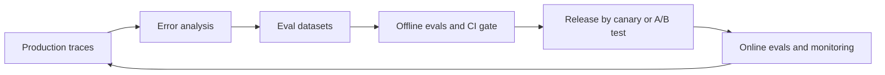

# 07. Evaluation, Observability and Testing

> **Estimated time:** 3-4 weeks (roughly 8-10 hours per week)
>
> **Prerequisites:** [03 LLM APIs and Application Building Blocks](03-llm-apis-and-structured-outputs.md), [04 Prompt and Context Engineering](04-prompt-and-context-engineering.md), [05 Embeddings, Vector Search and RAG](05-embeddings-vector-search-and-rag.md) and [06 Agents, Tool Use and MCP](06-agents-tools-and-mcp.md). You should be comfortable reading JSON and writing small Python scripts.
>
> **Outcome:** You can build a measurable evaluation loop for an LLM product, gate releases on it in CI, watch the live system with traces and dashboards, and feed production failures back into your test sets.

## Why this stage matters

LLM applications fail quietly. A request can return `200 OK` and still contain a wrong, unsafe or off-brand answer, and a prompt tweak that fixes one case can silently break ten others. Classic unit tests assume deterministic output and a crisp expected value, and neither assumption holds here. What separates a demo from a product is a measurement loop: look at real behaviour, turn failures into tests, score them cheaply and repeatably, gate releases on the scores, and keep watching in production. Every other stage of this roadmap (prompts, RAG, agents, fine-tuning) can only be changed safely if you can measure the effect of the change.

## Topic map



- [ ] **Build the evals:** 1 error analysis and the eval loop, 2 datasets, 3 metric types, 4 LLM-as-judge, 5 human evaluation and user feedback
- [ ] **Run the evals:** 6 a tiny harness, 7 non-determinism and statistics, 8 evaluating specific systems, 9 regression testing and CI, 10 benchmarks and the personal eval
- [ ] **Watch production:** 11 online evaluation, 12 observability, 13 quality monitoring and the data flywheel
- [ ] **Keep it up:** 14 reliability patterns seen through evals and traces (testing fallbacks, recording provider and retries, deprecation replacement evals)

---

## 1. The eval loop and error analysis first

An **eval** is a repeatable test that runs your application (or one part of it) on a set of inputs and scores the outputs. It differs from a unit test in three ways: scores are often graded rather than pass/fail, the system under test is stochastic, and the "expected" value is frequently a property ("every claim is supported by the context") rather than a string.

The loop you will repeat for the rest of your career is: **look at data, name the failures, write a test for the important ones, fix, re-run, ship, watch, repeat.** Teams that skip the first two steps tend to build dashboards of generic scores that never point to a fix.

### Error analysis, step by step

1. **Collect 50-100 traces.** Use real logs if you have them, otherwise dogfooding sessions or realistic synthetic inputs. Each trace should show everything: user input, system prompt version, retrieved context, tool calls and results, and the final output. A plain spreadsheet or a small viewer script is enough; reducing the friction of reading traces matters more than tooling.
2. **Write one free-text note per trace** about the first thing that went wrong ("quoted a refund window that is not in the context"). Stop at the first failure, because later errors are often consequences of it. Mark the trace pass or fail. This is called **open coding** in qualitative research.
3. **Group the notes into 5-10 failure categories** (**axial coding**), count them, and rank by frequency times severity.
4. **Pick the remedy per category**: a prompt change, better retrieval or context, a redesigned tool, a guardrail, a different model, or a product decision. Some "failures" are really gaps in the requirements.
5. **Only then decide what to automate.** Use a code check when one exists, an LLM judge when it does not, and leave rare or subtle categories to periodic human review.
6. **Repeat on fresh samples** after every significant fix, because the categories change.

| Example category (support bot) | Cheapest reliable check |
|---|---|
| Quotes policy that is not in the retrieved context | Judge for groundedness, or check that cited passage IDs exist |
| Calls the refund tool with the wrong order ID | Programmatic check on tool arguments |
| Answers when it should escalate to a human | Label per case: expected action = escalate |
| Reply too long for the chat widget | Length assertion |
| Dismissive tone | Judge with a tone rubric, spot-checked by humans |

**Why not start with metrics?** Generic scores such as "helpfulness 4.2 out of 5" look scientific but do not say what to change, and they drift away from what users actually care about. The categories you discover are your metrics. Also expect **criteria drift**: people often only learn what they want by seeing outputs, so treat your rubric as a living document and revisit it (see the Shankar et al. paper in Resources).

**Try it:** Take the best prototype you built in sections 03-06, run it on 30 varied inputs, write one note per trace, and produce a count table of failure categories. Do this before reading further.

---

## 2. Building eval datasets

Start small. Twenty to fifty well-chosen cases beat zero cases by a wide margin, and you can grow to a few hundred as the product matures. Where the cases come from matters more than how many there are.

| Source | How to build it | Strength | Watch out for |
|---|---|---|---|
| **Golden set** | Cases with reference answers or checklists written or approved by a domain expert | High trust, acts like your unit tests | Expensive; keep it small and curated |
| **Hand-written edge cases** | Empty input, very long input, another language, typos, ambiguous requests, conflicting instructions, out-of-scope questions, prompt-injection attempts, "the right answer is to refuse or escalate" | Targets known risks | Easy to forget negative cases |
| **Synthetic data** | Define dimensions (persona, intent, difficulty, channel, language), then ask a model to generate one case per combination; seed with real examples | Fast coverage of rare combinations | Homogeneous and too clean if you just ask for "100 questions"; always hand-review a sample and de-duplicate by embedding similarity |
| **Production samples** | Stratified sample of real traffic by intent, plus every thumbs-down, escalation, error and low-scoring trace | Real distribution and real failures | Remove personal data first, and check consent and retention rules (see [08](08-safety-security-and-responsible-ai.md)) |
| **Existing artifacts** | Support tickets, FAQs, bug reports, QA transcripts | Cheap and domain-realistic | Labels may be noisy |

A practical record format is one JSON object per line (JSONL), which diffs well in Git:

```json
{"id": "refund-007", "input": "Can I return a laptop after 45 days?", "expected": "policy_refund_window", "tags": ["refunds", "edge-case"], "source": "prod-sample", "split": "dev"}
```

**Splits.** You will overfit to any cases you tune against, exactly as in classic ML. Keep three groups:

- **Dev set:** the cases you look at while iterating on prompts and retrieval.
- **Held-out test set:** touched rarely, used to confirm a change really generalises before release. Refresh it from fresh production samples now and then.
- **Regression set:** every real bug becomes a permanent case here and is never removed.

Never put eval cases into your few-shot examples, and keep eval data separate from any fine-tuning data (see [09](09-open-models-fine-tuning-and-local-inference.md)).

**Versioning.** Store datasets in Git or in your eval platform's dataset feature, and never edit cases silently, because changing the denominator breaks every trend line. Record the dataset version, prompt version, model identifier and judge version with every run; without them two scores are not comparable. For open-ended tasks, prefer a checklist of criteria over a single reference answer.

**Try it:** Write a 40-case JSONL for your app: about 20 typical, 10 edge, 5 should-refuse or should-escalate, and 5 that resemble real traffic. Tag each with a slice.

---

## 3. Metric types

Use the cheapest check that is reliable for the property you care about, and move up this ladder only when you must: **deterministic checks, then programmatic checks, then an LLM judge, then humans.**

| Metric | What it checks | Strength | Limits |
|---|---|---|---|
| **Exact / normalised match** | Output equals expected after lower-casing and trimming | Cheap, deterministic | Only for closed answers such as labels, IDs, numbers |
| **Regex / contains / forbidden text** | Pattern present or absent | Catches formats, required citations, banned phrases | Brittle against paraphrase |
| **Schema validity** | Parses as JSON and validates against a JSON Schema or Pydantic model, enums are legal (see [03](03-llm-apis-and-structured-outputs.md)) | First gate for extraction and tool calls | Valid does not mean correct |
| **Task-specific programmatic checks** | Run generated code against tests, execute SQL and compare result sets, verify tool arguments, check that cited URLs or passage IDs exist, check totals add up | Closest to ground truth | Needs custom work per task |
| **Embedding similarity** | Cosine similarity between output and reference embeddings | Tolerates paraphrase | Measures topic, not truth: "refunds are allowed" and "refunds are not allowed" score high; thresholds are arbitrary |
| **BLEU / ROUGE / chrF** | N-gram overlap with reference text | Cheap and stable; still reasonable for translation-style tasks | Measures surface overlap, penalises valid paraphrase, rewards copying, correlates weakly with quality for open-ended generation |
| **Rubric score** | Weighted checklist of criteria, scored by code, a judge or a human | Explainable | Only as good as the rubric |
| **LLM judge** | A model grades against a rubric (next section) | Flexible, scales | Must be calibrated against humans |

**Pass/fail versus graded.** Prefer binary decisions per criterion: break "quality" into three to six yes/no checks such as grounded, complete, right tone. Binary labels are easier to calibrate, easier for humans to agree on, and easier to debug than a 1-5 scale where the difference between a 3 and a 4 is a mood. Keep graded numbers for things that are naturally continuous (latency, edit distance, retrieval rank, similarity) and for ranking pairs. Report pass rates per slice, avoid one blended "quality score" that hides regressions, and keep a short list of must-pass cases.

---

## 4. LLM-as-judge

An **LLM judge** is a model prompted to grade another model's output. It is the main way to evaluate properties that code cannot check (tone, completeness, faithfulness to a context) at a scale humans cannot match. It is also a measurement instrument with its own error rate, so treat it like any other classifier: validate it.

### Design choices

- **Pointwise** grading scores one output against a rubric. It scales to regression suites and production monitoring, but absolute scores drift and judges tend to be lenient; use binary criteria.
- **Pairwise** grading picks the better of two outputs. Relative judgments are easier and usually more consistent, which makes pairwise the better tool for comparing two prompts or models. It needs a baseline, two calls (to swap order), and reports a win rate rather than absolute quality.
- **Reference-based** judges compare against a gold answer and give the strongest signal for correctness. **Reference-free** judges see only the input and context (groundedness, tone, safety) and are the only option for live traffic, where no gold answer exists.

### Writing a rubric

- Judge **one criterion per decision** (separate fields or separate calls) instead of a vague overall score.
- Define pass and fail concretely and include borderline examples.
- Give the judge the evidence it needs (the retrieved context, the tool results). A judge cannot verify facts it cannot see.
- Ask for brief evidence first and the verdict last, then force a machine-readable final line or use structured output (see [03](03-llm-apis-and-structured-outputs.md)).
- Tell it what to do when unsure (for example, fail and flag), and tell it to ignore length and formatting.
- Get repeatable verdicts from a fixed rubric, structured output, a pinned judge model snapshot and repeated trials. Where the judge model allows it, add a low temperature as an optional extra (several hosted models restrict sampling parameters; see [02, section 9.1](02-ai-ml-and-llm-foundations.md#91-sampling-parameters)).
- Do not show the judge which model wrote the answer.

### Known biases and mitigations

| Bias | Symptom | Mitigation |
|---|---|---|
| **Position bias** | Prefers the first (or second) answer regardless of content | Run pairwise twice with the order swapped and count disagreement as a tie |
| **Verbosity bias** | Longer answers win | Instruct to ignore length, compare length-matched pairs, track answer length as a separate metric |
| **Self-preference** | A model rates outputs from its own family higher | Use a judge from a different family than the generator |
| Leniency and format bias | Everything scores 4 of 5; markdown or confident tone is rewarded | Binary criteria with concrete failure examples; normalise formatting |
| Weak on facts it cannot verify | Fluent but false answers pass | Provide context or tool evidence; use reference-based grading |

These effects are documented in [Zheng et al. (MT-Bench and Chatbot Arena)](https://arxiv.org/abs/2306.05685), in [Wang et al. on position bias](https://arxiv.org/abs/2305.17926) and in [Panickssery et al. on self-preference](https://arxiv.org/abs/2404.13076); [G-Eval (Liu et al.)](https://arxiv.org/abs/2303.16634) popularised rubric-plus-reasoning judging.

### Calibrate against human labels

1. Collect 50-100 human labels on varied outputs from your own app, including hard and bad ones, not only easy passes. Split them into a development part (to tune the rubric) and a held-out part (to report accuracy).
2. Run the judge and compute agreement, **true positive rate** (judge passes what humans pass), **true negative rate** (judge fails what humans fail) and **Cohen's kappa**. Report TNR separately: judges are lenient, and leniency hides in bad outputs.
3. Read every disagreement. Most are rubric ambiguities; fix the rubric, not just the wording of the prompt.
4. Freeze the judge (model snapshot, prompt hash) and re-check agreement whenever the judge model, rubric or your app's output style changes.

**Stronger or different judge.** Use a judge at least as capable as the generator when the task needs verification, and from a different family to avoid self-preference. Once a cheaper judge agrees with humans as well as the expensive one, use it for volume. For high-stakes checks, a panel of two or three judges with majority vote costs more but is steadier.

### A rubric judge in code

```python
import json
import os
from typing import Callable

RUBRIC_PROMPT = """You are grading one answer from a customer-support assistant.
Judge ONLY against the CONTEXT and QUESTION below. Do not use outside knowledge.

Criteria (decide each one independently):
- grounded: every factual claim in ANSWER is supported by CONTEXT. Any unsupported claim means false.
- complete: ANSWER addresses every part of QUESTION. A missing part means false.
- tone: ANSWER is polite and professional, without blame or sarcasm.
Ignore length and formatting. If you are unsure about a criterion, answer false.

QUESTION:
{question}

CONTEXT:
{context}

ANSWER:
{answer}

For each criterion write one sentence of evidence, then finish with a single line of JSON and nothing after it:
{{"grounded": true, "complete": true, "tone": true}}"""

CRITERIA = ("grounded", "complete", "tone")


def judge_answer(complete: Callable[[str], str], question: str, context: str, answer: str) -> dict[str, bool]:
    """`complete` sends a prompt to the judge model and returns its text (wiring below)."""
    text = complete(RUBRIC_PROMPT.format(question=question, context=context, answer=answer))
    verdict = json.loads(text.strip().splitlines()[-1])  # malformed output raises: count it as a judge error
    return {name: bool(verdict[name]) for name in CRITERIA}


# --- Wiring: pick ONE. Choose a current, capable judge model from the provider docs. ---
JUDGE_MODEL = os.environ["JUDGE_MODEL"]  # ideally a different family than the app's model


def complete_openai(prompt: str) -> str:
    from openai import OpenAI

    client = OpenAI()  # reads OPENAI_API_KEY from the environment
    return client.responses.create(model=JUDGE_MODEL, input=prompt).output_text


def complete_anthropic(prompt: str) -> str:
    import anthropic

    client = anthropic.Anthropic()  # reads ANTHROPIC_API_KEY from the environment
    reply = client.messages.create(
        model=JUDGE_MODEL, max_tokens=1024, messages=[{"role": "user", "content": prompt}]
    )
    return "".join(block.text for block in reply.content if block.type == "text")
```

Some reasoning-style models restrict sampling parameters such as temperature, so the snippet leaves them at provider defaults; check the docs for your judge model.

### Pairwise with order swapping, and judge calibration

```python
PAIRWISE_PROMPT = """Two assistants answered the same QUESTION. Pick the answer that is more accurate and more helpful.
Ignore length, order and formatting.

QUESTION:
{question}

FIRST:
{first}

SECOND:
{second}

Reply with one sentence of justification, then a final line containing only FIRST or SECOND."""


def pairwise_winner(complete, question: str, answer_1: str, answer_2: str) -> str:
    """Ask twice with the order swapped; if the judge contradicts itself, report a tie."""

    def ask(first: str, second: str) -> str:
        prompt = PAIRWISE_PROMPT.format(question=question, first=first, second=second)
        return complete(prompt).strip().splitlines()[-1].strip().upper()

    run1 = ask(answer_1, answer_2)  # FIRST means answer_1 won
    run2 = ask(answer_2, answer_1)  # FIRST means answer_2 won
    if run1 == "FIRST" and run2 == "SECOND":
        return "answer_1"
    if run1 == "SECOND" and run2 == "FIRST":
        return "answer_2"
    return "tie"


def judge_vs_human(human: list[bool], judge: list[bool]) -> dict:
    """True means 'pass'. Compare judge labels with human labels on the same items."""
    tp = sum(h and j for h, j in zip(human, judge))
    tn = sum((not h) and (not j) for h, j in zip(human, judge))
    fp = sum((not h) and j for h, j in zip(human, judge))
    fn = sum(h and (not j) for h, j in zip(human, judge))
    n = len(human)
    observed = (tp + tn) / n
    p_h, p_j = (tp + fn) / n, (tp + fp) / n
    expected = p_h * p_j + (1 - p_h) * (1 - p_j)  # chance agreement
    return {
        "agreement": observed,
        "tpr": tp / (tp + fn) if tp + fn else None,  # judge passes what humans pass
        "tnr": tn / (tn + fp) if tn + fp else None,  # judge fails what humans fail
        "kappa": (observed - expected) / (1 - expected) if expected < 1 else 1.0,
    }
```

**Try it:** Hand-label 40 outputs from your app as pass or fail on one criterion, write a judge prompt for it, and use `judge_vs_human` to see where the judge is lenient. Rewrite the rubric twice and watch the TNR move.

---

## 5. Human evaluation, annotation and user feedback

Humans are needed for three jobs: producing the labels that calibrate your judges, grading subjective or high-stakes properties that no automated check can settle, and discovering failure modes nobody thought to test. Everything automated in this section is anchored to human judgment.

### An annotation workflow that works

1. **Write guidelines**: the rubric, two or three examples per label, and a "cannot tell" option.
2. **Pilot** on about 20 items with two or three annotators, discuss every disagreement, and revise the guidelines.
3. **Label at scale** with 10-20% of items double-labelled, outputs shuffled, and model identity hidden.
4. **Adjudicate** conflicts with a domain lead and record the decision.
5. **Store** the label, annotator, guideline version and date, and re-measure agreement periodically.

Start with a spreadsheet. When volume grows, use the annotation features of your observability platform (Langfuse and LangSmith, for example, provide annotation queues) or an open-source labelling tool such as [Label Studio](https://labelstud.io/) or [Argilla](https://docs.argilla.io/latest/). Domain experts beat crowd workers when correctness depends on specialised knowledge, but they are scarce, so spend their time on the hard, ambiguous cases.

### Inter-annotator agreement

Raw percent agreement misleads when one label dominates (if 95% of items pass, two annotators who always say "pass" agree 100% of the time). Use chance-corrected measures:

- **Cohen's kappa** for two annotators ([scikit-learn's `cohen_kappa_score`](https://scikit-learn.org/stable/modules/generated/sklearn.metrics.cohen_kappa_score.html) computes it).
- **Krippendorff's alpha** for several annotators, missing labels or ordinal scales.

As a rough rule of thumb (the commonly quoted Landis and Koch bands, which are conventions rather than laws), below 0.4 is weak, 0.4-0.6 moderate, 0.6-0.8 substantial and above 0.8 strong. Low agreement almost always means an ambiguous rubric, or a genuinely subjective criterion that you should not pretend to measure with a single number. If trained humans disagree, a judge cannot be "right" either.

### Feedback loops from users

| Signal type | Examples | Caveats |
|---|---|---|
| Explicit | Thumbs up/down, report buttons, "this is wrong" with a reason chip, star ratings | Only a small share of users respond, mostly at the extremes, and a thumbs-down may be about speed rather than quality |
| Implicit | Copy or accept actions, edits to a drafted reply (and edit distance), regenerate or rephrase, abandonment, escalation to a human, task completion, follow-up complaints | Confounded by UI changes; interpret as trends, not individual verdicts |

Route negative and heavily edited interactions to a review queue, add the confirmed failures to your regression set (section 13), and tell users how their feedback is used. Get consent for storing conversations used this way.

---

## 6. A tiny eval harness

You do not need a framework to start. The harness below has the four parts every eval system has: a **dataset** loader, a **runner** that calls your app, a **scorer**, and a **summary** with per-slice results and an exit code for CI. It uses only the standard library, and an app crash counts as a failed case instead of aborting the run.

```python
"""eval_harness.py - dataset -> runner -> scorer -> summary (standard library only)."""
import json
import re
import sys
from collections import defaultdict
from dataclasses import dataclass, field
from statistics import fmean
from typing import Callable


@dataclass
class Case:
    id: str
    input: str
    expected: str
    tags: list[str] = field(default_factory=list)


def load_cases(path: str) -> list[Case]:
    """JSONL: one {"id", "input", "expected", "tags"} object per line; extra keys are ignored."""
    with open(path, encoding="utf-8") as f:
        rows = [json.loads(line) for line in f if line.strip()]
    return [Case(r["id"], r["input"], r["expected"], r.get("tags", [])) for r in rows]


Scorer = Callable[[str, Case], float]  # returns 0.0-1.0, where 1.0 means pass


def exact_match(output: str, case: Case) -> float:
    return float(output.strip().lower() == case.expected.strip().lower())


def regex_match(output: str, case: Case) -> float:
    return float(re.search(case.expected, output, flags=re.IGNORECASE) is not None)


def run_eval(app: Callable[[str], str], cases: list[Case], scorer: Scorer, trials: int = 1) -> list[dict]:
    rows = []
    for case in cases:
        for trial in range(trials):
            output, error = "", None
            try:
                output = app(case.input)
                score = scorer(output, case)
            except Exception as exc:  # a crash is a failed case, not a crashed eval run
                score, error = 0.0, repr(exc)
            rows.append({"id": case.id, "trial": trial, "tags": case.tags,
                         "output": output, "score": score, "error": error})
    return rows


def summarize(rows: list[dict], pass_threshold: float = 1.0) -> dict:
    by_tag = defaultdict(list)
    for r in rows:
        for tag in r["tags"] or ["untagged"]:
            by_tag[tag].append(r["score"])
    return {
        "n": len(rows),
        "mean_score": fmean(r["score"] for r in rows),
        "pass_rate": fmean(float(r["score"] >= pass_threshold) for r in rows),
        "errors": sum(r["error"] is not None for r in rows),
        "by_tag": {tag: round(fmean(v), 3) for tag, v in sorted(by_tag.items())},
        "failing_ids": sorted({r["id"] for r in rows if r["score"] < pass_threshold})[:10],
    }


if __name__ == "__main__":
    def toy_app(text: str) -> str:  # replace with a call into your real application
        return "policy_refund_window" if "return" in text.lower() else "other"

    cases = [
        Case("c1", "Can I return a laptop after 45 days?", "policy_refund_window", ["refunds"]),
        Case("c2", "Where is my parcel?", "shipping_status", ["shipping"]),  # fails on purpose
    ]
    summary = summarize(run_eval(toy_app, cases, exact_match))
    print(json.dumps(summary, indent=2))
    sys.exit(0 if summary["pass_rate"] >= 0.9 else 1)  # a non-zero exit fails the CI job
```

Habits to add once this works: save each run as JSON with the dataset, prompt, model and judge versions plus the git commit; cache model responses by a hash of (model, prompt, parameters) so re-scoring is free; run cases concurrently with a small worker pool that respects rate limits; and choose the scorer per case (exact match for labels, a judge for free text).

---

## 7. Handling non-determinism and statistics

**Why outputs vary.** Sampling settings such as temperature and top-p add randomness on purpose. But even at temperature 0, outputs may still differ between calls because of batching effects, floating-point non-associativity on GPUs, routing inside mixture-of-experts models, and silent provider-side model updates behind an alias (see [02](02-ai-ml-and-llm-foundations.md)). Some APIs offer a best-effort `seed` parameter and some do not, and some reasoning-style models fix or ignore sampling parameters (as of Oct 2026, check your provider's docs). Treat seeds as a convenience, never a guarantee.

**Practical settings.**

- Run evals with the settings you ship, because that is what users get.
- For judges, classification and extraction, get stability mainly from a fixed rubric, structured output, a pinned model snapshot and repeated trials; use a low temperature as well where the model allows it (see [02, section 9.1](02-ai-ml-and-llm-foundations.md#91-sampling-parameters)).
- When a task is genuinely creative, accept the variance and measure it instead of hiding it.

**Repeated trials.** Run each case several times (three to five for regression suites, more for critical flows) and average the trials within each case first. For agents, distinguish two questions: **pass@k** is the chance that at least one of k attempts succeeds (fine when a single good result is enough), and **pass^k** is the chance that all k attempts succeed (what a customer-facing workflow needs). The first rises with k, the second falls.

**Confidence intervals.** A pass rate from a small set is noisy. Twenty-seven passes out of 30 is 90%, but its 95% Wilson interval runs from about 74% to 97%; 270 out of 300 narrows that to about 86% to 93%. When comparing two versions, run both on the same cases and bootstrap the per-case differences: if the interval excludes zero, the change is probably real. Do not celebrate a two-point gain on 50 cases. Evan Miller's "Adding Error Bars to Evals" (Resources) is a readable statistics guide for exactly this.

```python
import math
import random


def wilson_interval(passes: int, n: int, z: float = 1.96) -> tuple[float, float]:
    """95% interval for a pass rate; behaves sensibly for small n and rates near 0 or 1."""
    if n == 0:
        return (0.0, 1.0)
    p = passes / n
    denom = 1 + z**2 / n
    centre = (p + z**2 / (2 * n)) / denom
    half = z * math.sqrt(p * (1 - p) / n + z**2 / (4 * n**2)) / denom
    return (max(0.0, centre - half), min(1.0, centre + half))


def bootstrap_ci(values: list[float], n_boot: int = 2000, seed: int = 0) -> tuple[float, float]:
    """95% bootstrap interval for the mean of per-case scores, or of per-case score differences.
    Resample CASES (average trials within a case first), not individual trials."""
    rng = random.Random(seed)
    n = len(values)
    means = sorted(sum(rng.choices(values, k=n)) / n for _ in range(n_boot))
    return (means[int(0.025 * n_boot)], means[int(0.975 * n_boot) - 1])


def pass_at_k(n: int, c: int, k: int) -> float:
    """Chance that at least one of k sampled trials passes, given c passes in n trials."""
    return 1.0 if n - c < k else 1.0 - math.comb(n - c, k) / math.comb(n, k)


def pass_all_k(n: int, c: int, k: int) -> float:
    """Chance that all k sampled trials pass (pass^k), given c passes in n trials."""
    return math.comb(c, k) / math.comb(n, k)


# Paired comparison of two versions on the same cases:
# diffs = [new - old for old, new in zip(old_scores, new_scores)]
# low, high = bootstrap_ci(diffs)   # if low > 0, the improvement is probably real
```

---

## 8. Evaluating specific systems

Each system type has its own failure modes, so build the eval around them.

### 8.1 RAG (see [05](05-embeddings-vector-search-and-rag.md))

Evaluate **retrieval and generation separately**, then end to end; otherwise you cannot tell which half failed.

- **Retrieval** needs labelled queries mapped to the passages that answer them. Measure recall@k (was a relevant passage in the top k), precision@k, hit rate, MRR and nDCG. These are cheap, deterministic and independent of any judge.
- **Generation** needs judges or checks for **faithfulness/groundedness** (claims supported by the retrieved context), answer relevance, completeness, and citation correctness (cited IDs exist and actually support the claim).
- Include **unanswerable questions**: the right behaviour is to say the context does not contain the answer.
- Libraries such as Ragas ship ready-made metrics for context precision, context recall, faithfulness and response relevancy; the [Ragas paper](https://arxiv.org/abs/2309.15217) and docs explain what each measures.

### 8.2 Agents (see [06](06-agents-tools-and-mcp.md))

- Grade the **outcome** in the environment (the ticket was actually closed, the file really changed), not only the agent's final message, since an agent can claim success it did not achieve.
- Add **trajectory checks** where they matter: valid tool names and arguments, no forbidden tools, step and cost budgets, no loops. Avoid demanding one exact path when several are acceptable.
- Run multiple trials and report pass@k and pass^k (section 7). Use sandboxes so evals cannot cause real side effects.
- For multi-turn agents, use a scripted or model-simulated user, and **read transcripts** regularly: this is how you find out whether a failure is an agent mistake or a broken grader. Anthropic's engineering post on agent evals (Resources) is a good practical guide.

### 8.3 Structured extraction (see [03](03-llm-apis-and-structured-outputs.md))

- Gate on **schema validity** first, then score **field by field**: exact or normalised match for IDs, dates and amounts; precision, recall and F1 for list fields; null handling (a missing field versus a wrong value).
- Report per-field accuracy, because a 95% overall score can hide a field that is always wrong.
- The [multilingual PDF pipeline blueprint](../multilingual-pdf-processor-blueprint.md) in this repository is a good real-world extraction system to practise on.

### 8.4 Summarization

ROUGE correlates poorly with usefulness here. Decompose instead:

- **Faithfulness:** a judge or entailment check that every statement is supported by the source.
- **Coverage:** a checklist of key points that must appear.
- **Conciseness and format:** length and structure assertions.

### 8.5 Classification

This is the easy case, because it is ordinary ML evaluation: accuracy, per-class precision, recall and F1, a confusion matrix, and attention to class imbalance. Add an "abstain/unknown" option and measure how often the model abstains correctly. For a refresher on these metrics, see the [Machine Learning Beginner Roadmap](../Machine%20Learning%20Beginner%20Roadmap_.md).

### 8.6 Chat quality

Evaluate conversations as well as single turns: instruction following, consistency across turns, persona and tone adherence, and sensible refusals. Side-by-side pairwise comparisons against your current production prompt are the most sensitive way to detect improvement, and simulated users let you test long dialogues cheaply.

### 8.7 Safety behaviours (see [08](08-safety-security-and-responsible-ai.md))

Measure both directions: how often the system complies with requests it should refuse or resist (jailbreaks, prompt injection, data exfiltration), and how often it **over-refuses** harmless requests. Keep a living adversarial set, and run automated red-team scans (promptfoo includes one) alongside human red teaming. This material is awareness-level here; section 08 covers it in depth.

---

## 9. Regression testing for LLM apps

**Regression testing** means re-running a fixed suite on every change that could alter behaviour (prompt, model, retrieval settings, tool schemas, code) and blocking changes that make things worse. It differs from classic regression testing because outputs vary, so a failing test might be noise rather than a bug, and many assertions are statistical.

### A layered suite

| Layer | What runs | When | Cost |
|---|---|---|---|
| 1. Deterministic unit tests | Prompt rendering, parsers, tool routing, schema checks, with the model mocked or replaying recorded responses | Every commit | Free |
| 2. Smoke evals | 20-50 key cases with programmatic scorers against the real model | Every pull request | Low |
| 3. Full evals | Whole dev set with judges and repeated trials | Nightly, and on prompt or model changes | Medium |
| 4. Release evals | Held-out test set, regression set, safety set, plus latency and cost | Before release | Higher |

### Thresholds

- Combine an **absolute floor** (for example, at least 90% pass on the smoke suite) with a **relative check** against the last accepted baseline using the interval from section 7, so you block real drops but not noise.
- Require 100% on a short list of must-not-regress cases (safety, legal, billing).
- Gate per slice as well as overall, so a strong average cannot hide a broken intent.
- Move the baseline only on purpose, in a reviewed commit that records why.

### Flaky-test strategies

- Run each case several times and gate on the pass rate (for example, at least 2 of 3) instead of a single sample.
- Make judges as repeatable as you can with a fixed rubric, structured output, a pinned model snapshot and repeated trials, and lower the temperature where the judge model allows it (see [02, section 9.1](02-ai-ml-and-llm-foundations.md#91-sampling-parameters)).
- Record and replay model responses in layer 1 so that unit tests never touch the network.
- Increase the number of cases, not just trials, when variance comes from the dataset.
- Quarantine a flaky test with an owner and an expiry date, and keep reporting it; a silenced test is a hole.
- Separate the sources of failure: a provider outage, a judge parse error and a real regression are different problems and should be reported differently.

### CI integration

A minimal GitHub Actions job (check each action's current major version, which was `v7` for both of these as of Oct 2026):

```yaml
name: llm-evals
on:
  pull_request:
    paths: ["prompts/**", "src/**", "evals/**"]
jobs:
  smoke-evals:
    runs-on: ubuntu-latest
    steps:
      - uses: actions/checkout@v7
      - uses: actions/setup-python@v7
        with:
          python-version: "3.12"
      - run: pip install -r requirements.txt
      - run: python evals/run.py --suite smoke --min-pass 0.90   # your script; non-zero exit fails the job
        env:
          LLM_MODEL: ${{ vars.LLM_MODEL }}
          OPENAI_API_KEY: ${{ secrets.OPENAI_API_KEY }}   # or the key for your provider
```

Pull requests from forks do not receive repository secrets, so run the real-model suite on branches in the main repository or on a trusted schedule. Control cost by running the smoke suite on pull requests, the full suite nightly, caching responses, and using provider batch APIs for large offline runs. More on pipelines in [10](10-deployment-llmops-and-scaling.md).

### Choosing a tool, neutrally

Start with the harness in section 6, then adopt a framework when you need its features. The main options are promptfoo (declarative `promptfooconfig.yaml` plus `promptfoo eval`, with a CI guide and red-team scans), DeepEval (pytest-style tests run with `deepeval test run`), Ragas (RAG-centred metrics), Inspect (datasets, solvers and scorers, strong for agents and sandboxes), and the hosted platforms Braintrust and LangSmith (datasets, experiments, scorers and tracing); the [tools table](#tools-and-libraries-at-a-glance) compares them. They overlap heavily, and the ideas in this section matter more than any single product.

**OpenAI Evals is being retired.** OpenAI's hosted Evals platform and API are deprecated: existing evals become read-only on 31 October 2026 and the dashboard and API shut down on 30 November 2026, and OpenAI's [deprecations page](https://developers.openai.com/api/docs/deprecations) points to Promptfoo as the migration path (as of Oct 2026). In March 2026 the Promptfoo team [announced that it is joining OpenAI](https://www.promptfoo.dev/blog/promptfoo-joining-openai/) and said the open-source project will keep being maintained; weigh that ownership when you choose a tool, since a harness is only a neutral referee if it stays provider-agnostic. Do not start new work on the hosted platform, and export your datasets and graders if you used it.

---

## 10. Benchmarks versus product evals, and the fast personal eval

**Public benchmarks** (academic suites, coding benchmarks, human-preference arenas such as [LMArena (now Arena)](https://arena.ai)) are useful for shortlisting models. They are poor evidence for your decision, for four reasons: they measure a general distribution rather than yours, popular ones are saturated or contaminated by training data, scores depend heavily on prompt and harness details, and human-preference leaderboards partly reward style. **Product evals** built from your own traffic and failure categories are the ground truth for "should we switch?".

**The 45-minute personal eval when a new model ships.** Keep a small "model change pack" of 30-100 cases from your own work, including past failures, and then:

1. Run the current and candidate models on identical inputs, with three trials each, and your production settings.
2. Score with your programmatic checks and your calibrated judge (from a different family than either model, if you can).
3. Compare cost, latency (p50 and p95), output length and refusal rate, not only quality.
4. Read 10-20 side-by-side outputs, shuffled and blinded, especially the cases where the models disagree.
5. Check format-sensitive behaviours: structured outputs, tool-call arguments, long-context recall, refusals.
6. Re-test your prompts. Old workarounds may no longer be needed (or may now hurt), so also try a trimmed prompt.
7. Write down the decision (adopt, shadow, canary, skip), the numbers, and the date. If you adopt it, roll out through section 11, not a config flip.

---

## 11. Online evaluation

Offline evals tell you whether a change is plausibly better; **online evaluation** tells you whether it is better for real users on real traffic.

- **A/B tests.** Randomise by user or session (not by request, or users will see inconsistent behaviour), pick one primary metric (task success, resolution rate, retention) plus guardrails, and run long enough to cover weekly cycles and reach the sample size you planned. Do not stop early on a good-looking number, and check that the traffic split is what you configured.
- **Shadow traffic.** Send a copy of live requests to the candidate system without showing its answers to users, then compare offline with judges and diffs. It is safe for quality and cost estimation, but it doubles the model spend and any tools must be read-only or stubbed so a shadow agent cannot take real actions.
- **Canary releases.** Move 1-5% of traffic to the new version behind a feature flag, ramp up in steps, and roll back automatically if a guardrail metric crosses its limit.
- **Feedback signals.** Thumbs and implicit signals (section 5) work as trends. Pair them with an automated judge that scores a sample of live traces without reference answers, using reference-free criteria.
- **Guardrail metrics.** Metrics that must not get worse while you chase the primary one: error rate, p95 latency, cost per request, refusal and escalation rates, safety-filter hits, answer length, and user-reported problems.

---

## 12. Observability for LLM apps

**Observability** is the ability to understand what your system did and why, from the data it emits. Classic application performance monitoring (APM) watches request rates, latency and exceptions. LLM apps need that and more, because:

- Failures are semantic: a wrong answer returns `200 OK`, so you must store and inspect the content, not just the status.
- A request is a tree of steps (retrieval, rerank, several model calls, tool calls, guardrails) and you need to see which step misbehaved.
- Cost scales with tokens, not requests, and latency is dominated by generation length, so you track tokens and time-to-first-token as well as duration.
- Inputs are unbounded text, so aggregate dashboards cannot replace reading individual traces.

### Traces and spans

A **trace** is one user request; a **span** is one timed step inside it (a model call, a retrieval, a tool execution). Spans nest, so an agent run appears as a tree you can expand. Attach to each trace: the prompt version, model identifier, key parameters, a session or conversation ID, a hashed user ID, feature flags, and later the eval scores. Group multi-turn conversations by session so you can read a whole dialogue.

### Logging prompts and responses safely

- Treat prompts and outputs as sensitive: they contain personal data, secrets pasted by users, and business information.
- Redact or tokenise personal data and secrets before export, and make content capture an explicit opt-in per environment. The OpenTelemetry conventions mark message content attributes as opt-in for this reason.
- Apply access controls, retention limits and deletion on request; consider keeping metadata (tokens, latency, IDs) for long periods and content for short ones.
- Sample content in high-volume systems, but keep all error traces. See [08](08-safety-security-and-responsible-ai.md).

### What to put on the dashboards

| Panel | Why |
|---|---|
| Tokens in and out, by model, feature and prompt version | Spots prompt bloat and runaway outputs |
| Cost per request, per feature and per user segment | Cost is a product metric, not an afterthought |
| Latency p50, p95, p99, and time to first token for streaming | Averages hide the slow tail that users actually feel; the tail is often retries or very long outputs |
| Error rate by type | See the taxonomy below |
| Retry, fallback and cache-hit rates | Early warning of provider trouble or cache regressions |
| Eval scores over time (sampled online judge, user feedback) | Quality is a time series too |

**Error taxonomy.** Label errors consistently so you can count them:

- **Provider:** rate limit, timeout, overloaded or 5xx, context-length exceeded, content filter or refusal.
- **Application:** schema parse failure, invalid tool arguments, tool error, empty retrieval, guardrail block, agent loop or step-limit exceeded.
- **Quality:** hallucination, wrong tool choice, off-topic answer, tone problem (found by judges and humans, not by exceptions).

### Tools and the OpenTelemetry standard

Dedicated platforms include [Langfuse](https://langfuse.com/docs/observability/overview), [LangSmith](https://docs.langchain.com/langsmith/observability), [Arize Phoenix](https://arize.com/docs/phoenix), [Helicone](https://docs.helicone.ai/), [W&B Weave](https://docs.wandb.ai/weave) and [MLflow tracing](https://mlflow.org/docs/latest/genai/). They differ in hosting model (self-hosted or managed), how they capture traces (SDK decorators, auto-instrumentation, a proxy), and how tightly they couple tracing to evaluation. Ownership is changing quickly (as of Oct 2026): [ClickHouse announced](https://clickhouse.com/blog/clickhouse-acquires-langfuse-open-source-llm-observability) in January 2026 that it had acquired Langfuse and that the core stays open source; Helicone [announced in March 2026](https://www.helicone.ai/blog/joining-mintlify) that it is joining Mintlify and that its services continue in maintenance mode (security updates, new models and bug fixes), so weigh that before adopting it for new work.

**OpenTelemetry** (OTel) is the vendor-neutral standard for traces and metrics, and its **GenAI semantic conventions** define shared attribute names such as `gen_ai.operation.name`, `gen_ai.provider.name`, `gen_ai.request.model`, `gen_ai.usage.input_tokens` and `gen_ai.usage.output_tokens`, span types for inference, embeddings, retrieval, tool execution and agent invocation, and metrics such as `gen_ai.client.operation.duration`. They are still in **Development** status and now live in their own repository (as of Oct 2026), so names can change. The OpenTelemetry Python GenAI instrumentation packages, for example, need the `OTEL_SEMCONV_STABILITY_OPT_IN=gen_ai_latest_experimental` environment variable to emit the newest names, and they gate content capture behind `OTEL_INSTRUMENTATION_GENAI_CAPTURE_MESSAGE_CONTENT`; check what your own instrumentation package supports. Instrumenting with OTel keeps you portable: many observability backends accept OTLP, but confirm this for yours.

```python
import os

from opentelemetry import trace
from opentelemetry.sdk.trace import TracerProvider
from opentelemetry.sdk.trace.export import BatchSpanProcessor, ConsoleSpanExporter

provider = TracerProvider()
provider.add_span_processor(BatchSpanProcessor(ConsoleSpanExporter()))  # use an OTLP exporter in production
trace.set_tracer_provider(provider)
tracer = trace.get_tracer("support-bot")

MODEL = os.environ["LLM_MODEL"]  # pick a current model from your provider's docs


def traced_chat(complete, prompt: str, provider_name: str, prompt_version: str) -> str:
    """`complete(prompt)` must return (text, input_tokens, output_tokens)."""
    with tracer.start_as_current_span(f"chat {MODEL}", kind=trace.SpanKind.CLIENT) as span:
        span.set_attribute("gen_ai.operation.name", "chat")
        span.set_attribute("gen_ai.provider.name", provider_name)
        span.set_attribute("gen_ai.request.model", MODEL)
        span.set_attribute("app.prompt_version", prompt_version)  # custom attribute; the draft conventions also define gen_ai.prompt.version
        try:
            text, input_tokens, output_tokens = complete(prompt)
        except Exception as exc:
            # start_as_current_span already records the exception and sets ERROR status
            span.set_attribute("error.type", type(exc).__name__)  # low-cardinality error label
            raise
        span.set_attribute("gen_ai.usage.input_tokens", input_tokens)
        span.set_attribute("gen_ai.usage.output_tokens", output_tokens)
        return text  # message content is deliberately NOT recorded here (opt-in, redact first)
```

**Try it:** Install the OpenTelemetry SDK, wrap one model call as above, and print the span to the console. Then add a nested span for retrieval and one for a tool call, and confirm the tree is readable.

---

## 13. Quality monitoring in production and the data flywheel

Quality can decay without any code change. Monitor for these kinds of **drift**:

- **Input (data) drift:** users start asking about new topics, languages or lengths. Track the intent mix and, for text, the distribution of query embeddings compared with a baseline period.
- **Corpus and tool drift:** documents in the index change, an upstream API alters its response format.
- **Prompt drift:** a template, a shared system prompt or a dependency changes. Version prompts and log the version on every trace.
- **Model-version drift:** the provider updates the model behind an alias, or deprecates the one you pinned. Pin dated snapshots where available, and run a small canary eval (your smoke suite) on a schedule so a silent change shows up as a score change.

**Alerting.** Alert on guardrail metrics (error rate, p95 latency, cost per request, refusal rate) and on the sampled online-judge score, using rolling baselines and minimum sample sizes so a quiet hour does not page anyone. Tie alerts to a runbook, and tune thresholds so that alerts stay rare enough to be believed.

**Sampling traces for review.** Schedule a weekly 30-60 minute review. Sample at random for an unbiased view, plus targeted samples: low judge scores, thumbs-down, long or expensive traces, errors, new intents, and fallback activations. The review is the same error analysis as in section 1, kept running.

**The data flywheel.** Sample production traces, triage and label them, add the confirmed failures to the eval and regression sets, fix the prompt, retrieval, tools or model, pass the offline CI gate, canary the release, and watch production again (the loop in the topic map). Each turn converts an incident into a permanent test. Keep the loop safe: scrub personal data before cases enter datasets, de-duplicate, give new cases stable IDs and tags, and keep a held-out slice you never tune on. The same labelled traces can later become fine-tuning or preference data (see [09](09-open-models-fine-tuning-and-local-inference.md)).

---

## 14. Reliability patterns

Providers throttle, time out, return errors and retire models. The mechanics of surviving that (classifying errors, timeouts, retries with backoff and jitter, fallback chains, circuit breakers, load shedding and degraded modes) are explained once, with code, in [10 Deployment, LLMOps and Scaling, section 8](10-deployment-llmops-and-scaling.md#8-reliability) and, at the level of a single API client, in [03 LLM APIs and Application Building Blocks, section 3](03-llm-apis-and-structured-outputs.md#3-reliability-errors-timeouts-retries-rate-limits-and-idempotency). Read those first. This section covers only what evaluation and observability add: a fallback is a different system that needs the same evidence as your primary path, and reliability behaviour can only be trusted if you can see it in traces.

- **Run the eval suite against every fallback.** A fallback model, provider, region or templated answer can differ in instruction following, structured-output support, tool calling and context length. Run your smoke suite (section 9) against each link in the chain and report scores per target, so you know the quality you ship when the primary is down instead of learning it during an incident. Set a minimum bar below which a fallback may not serve a route; a clear error or a degraded mode beats a confidently worse answer.
- **Test the failure paths on purpose.** Inject faults (a fake provider that returns 429 or 5xx, or sleeps past the timeout) and assert on outcomes: the request succeeded through the fallback, the user got a clean message when everything failed, and nothing was retried that should not be (bad requests, authentication errors).
- **Record the provider and retry count on every trace.** Add span attributes for the target that finally answered, the number of attempts and whether a fallback or breaker was involved, and show retry, fallback and cache-hit rates on the dashboards from section 12. A rising fallback rate is an early warning, and the trace record lets you check whether fallback traffic scores lower on your sampled online judge (section 11).
- **Run replacement evals before a deprecation.** Treat a model retirement notice as a model change: run the personal eval (section 10) and the regression suite on the suggested replacement well before the cutoff, then shadow and canary it. The registry and step-by-step process are in [10, "Handling model deprecations and provider changes"](10-deployment-llmops-and-scaling.md#handling-model-deprecations-and-provider-changes), and the scheduled canary eval from section 13 catches silent changes behind a moving alias.

**Try it:** Take the harness from section 6 and make your app accept a target (primary or fallback). Run the same dataset against each target and compare pass rates and per-tag scores, using the intervals from section 7, then decide the minimum score a fallback must reach before it may serve. Next, make the primary always raise a retryable error and rerun the suite through your real fallback path. Check that no case crashes, that the pass rate matches the fallback's own score, and that every result row records which provider answered and how many attempts it took (extend the row dictionary in `run_eval`, or return the provider name alongside the text).

---

## Tools and libraries at a glance

| Tool | What it is for | Pick it when |
|---|---|---|
| [promptfoo](https://www.promptfoo.dev/docs/intro/) | Open-source CLI/library for declarative prompt, model and RAG test matrices and red-team scans; CI guide included | You want provider-agnostic comparisons and a CI gate with little code |
| [DeepEval](https://deepeval.com/docs/getting-started) | Python test cases and metrics (G-Eval, RAG, agent, safety) run in a pytest-like flow | Your team already works in pytest |
| [Ragas](https://docs.ragas.io/) | Library of RAG metrics (faithfulness, context precision and recall, response relevancy) plus agent and general metrics | You need ready-made RAG measurements |
| [Inspect](https://inspect.aisi.org.uk/) | Python framework of datasets, solvers and scorers, with sandboxes and many pre-built evals | You evaluate agents or want rigorous, reproducible runs |
| [Braintrust](https://www.braintrust.dev/docs/evaluation) | Hosted evals and logging: `Eval()` with data, task and scorers, plus the autoevals scorer library | You want a managed UI for experiments |
| [LangSmith](https://docs.langchain.com/langsmith/evaluation) | Hosted tracing, datasets, experiments, offline and online evaluators | You use LangChain or LangGraph, or want tracing and evals together |
| [Langfuse](https://langfuse.com/docs) | Open-source, self-hostable tracing, prompt management, datasets and evals | You want open source with optional managed hosting |
| [Arize Phoenix](https://arize.com/docs/phoenix) | Open-source tracing and evals built on OpenTelemetry and OpenInference | You want OTel-native, self-hosted tracing |
| [Helicone](https://docs.helicone.ai/) | Proxy/gateway-style request logging, cost tracking and routing | You want logging without SDK changes, after reading its maintenance-mode notice (section 12) |
| [W&B Weave](https://docs.wandb.ai/weave) | Decorator-based tracing and evaluations from Weights & Biases | You already use W&B |
| [MLflow tracing and GenAI evaluation](https://mlflow.org/docs/latest/genai/) | Open-source tracing, autologging for common SDKs and evaluation with scorers | You already run MLflow for classic ML |
| [OpenTelemetry GenAI conventions](https://github.com/open-telemetry/semantic-conventions-genai) | Vendor-neutral attribute and metric names for model calls, tools and agents | You want portable traces across backends |
| OpenAI Evals platform | Hosted graders and datasets, being retired (see section 9) | Only to export existing work |
| [tenacity](https://tenacity.readthedocs.io/en/latest/) and [LiteLLM Router](https://docs.litellm.ai/docs/routing) | Retry policies in code; a router with fallbacks, retries and cooldowns | You need resilience without writing it yourself |
| [scikit-learn metrics](https://scikit-learn.org/stable/modules/model_evaluation.html) and [pytest](https://pytest.org/) | Classification metrics and kappa; the Python test runner | You are building or extending your own harness |

---

## Common pitfalls

- **Building metrics before reading traces.** Fix: do error analysis first (section 1) and let failure categories define the metrics.
- **Generic scores such as "helpfulness".** Fix: use binary, application-specific criteria derived from real failures.
- **An uncalibrated judge.** Fix: label 50-100 items by hand, report TPR, TNR and kappa, and re-check after any change.
- **Same model generates and judges.** Fix: use a judge from a different family and swap pairwise order.
- **Overfitting to the dev set.** Fix: keep a held-out set and a regression set, and refresh from production.
- **Eval sets too small to detect change.** Fix: add intervals, use paired comparisons, and grow the set where decisions are close.
- **Unversioned runs.** Fix: record dataset, prompt, model, judge and commit with every result.
- **Flaky CI that people learn to ignore.** Fix: repeat trials, gate on rates with intervals, and quarantine with an owner and expiry.
- **Logging raw personal data and secrets.** Fix: redact before export, opt in to content capture, and set retention.
- **Average-latency dashboards.** Fix: chart p50, p95, p99 and time to first token.
- **Stacked retries.** Fix: pick one retry layer, add jitter and a cap, and honour `Retry-After`.
- **Untested fallbacks.** Fix: run the eval suite on every model in the chain.
- **Floating model aliases.** Fix: pin dated snapshots for evaluated paths and run scheduled canary evals.
- **Shadow traffic with side effects.** Fix: make tools read-only or stubbed in shadow mode.
- **Treating a leaderboard rank as proof.** Fix: run your own 45-minute eval before switching models.
- **Optimising the judge score itself.** Fix: spot-check with humans regularly and rotate or refresh the judge and cases.

---

## Hands-on projects

### Starter: Eval harness for a classifier or extractor prompt

- **Goal:** Measure a ticket-classification or field-extraction prompt reliably enough to make a prompt change with confidence.
- **Suggested stack:** Python, the harness from section 6 (or promptfoo), any LLM API, JSONL datasets, Git.
- **Acceptance criteria:**
  - A dataset of at least 40 tagged cases with a dev and a held-out split, plus a short written failure-category table from your own error analysis (at least five categories).
  - At least two programmatic scorers (for example exact match and schema validity), and a per-tag report.
  - Three trials per case with a Wilson interval on the pass rate.
  - The script exits non-zero below a threshold, and every run records dataset, prompt and model versions.

### Intermediate: A RAG or support assistant with a calibrated judge and a CI gate

- **Goal:** Evaluate retrieval and generation separately and block regressions automatically.
- **Suggested stack:** Your pipeline from [05](05-embeddings-vector-search-and-rag.md), your own harness or promptfoo or DeepEval, an LLM judge from a different family than the generator, GitHub Actions.
- **Acceptance criteria:**
  - Labelled queries give recall@k and MRR for retrieval; a groundedness judge scores generation; unanswerable questions are included.
  - At least 60 human labels, with the judge's TPR, TNR and kappa reported and a rubric revised at least once after reading disagreements.
  - A pull-request smoke suite running in under five minutes, a nightly full suite, and thresholds that use intervals.
  - You deliberately introduce a prompt regression and show that the pipeline blocks it.

### Advanced: An observable, self-improving agent service

- **Goal:** Run an agent with full tracing, online quality checks, safe model rollouts and graceful failure handling.
- **Suggested stack:** An agent from [06](06-agents-tools-and-mcp.md), OpenTelemetry with a backend such as Langfuse, Phoenix or MLflow, a dashboard, a sampled online judge, a provider fallback chain with a circuit breaker (build it as in [10](10-deployment-llmops-and-scaling.md#8-reliability), then test it with your evals).
- **Acceptance criteria:**
  - Every model call, retrieval and tool call is a span with model, token counts, latency and error type; personal data is redacted, and a test proves it.
  - Dashboards show p50, p95 and p99 latency, cost per request, error taxonomy and the online judge score.
  - An alert fires when you inject drift (swap the model or corrupt the index) and the runbook explains the response.
  - A fault-injection test shows requests succeeding through fallback within your latency budget, and the trace shows which provider answered.
  - You convert at least 20 reviewed production-like failures into regression cases and show the measured improvement, then run a shadow comparison of a candidate model and write the decision.

---

## Self-check

- [ ] I can run an error analysis on 50 traces and turn the result into a ranked list of failure categories.
- [ ] I can build a tagged eval dataset from golden cases, edge cases, synthetic data and production samples, and explain my dev, held-out and regression splits.
- [ ] I can choose between exact match, schema validity, programmatic checks, embedding similarity and judges for a given property, and explain why BLEU and ROUGE are weak for open-ended output.
- [ ] I can write a rubric-based LLM judge, and name and mitigate position, verbosity and self-preference bias.
- [ ] I can calibrate a judge against human labels using TPR, TNR and Cohen's kappa.
- [ ] I can run an annotation workflow with double labelling and adjudication, and interpret inter-annotator agreement.
- [ ] I can evaluate a RAG system's retrieval and generation separately, and an agent by outcome and trajectory.
- [ ] I can explain why temperature 0 is not fully deterministic and report an eval score with a confidence interval over repeated trials.
- [ ] I can set up a layered regression suite with thresholds and a CI job, and handle flaky tests without ignoring them.
- [ ] I can explain why a public benchmark is not a product eval, and run a fast personal eval when a new model ships.
- [ ] I can design an A/B test, shadow run and canary release, and name suitable guardrail metrics.
- [ ] I can instrument an LLM app with traces and spans, log content safely, and read p95 latency, token and cost dashboards.
- [ ] I can describe how drift is detected and how production failures flow back into the eval set.
- [ ] I can test a fallback chain with my eval harness and fault injection, record the answering provider and retry count on traces, and run replacement evals before a provider model deprecation.

---

## Resources

### Official docs

- [OpenAI: Evaluation best practices](https://developers.openai.com/api/docs/guides/evaluation-best-practices) - practical guidance on datasets, metrics and judge pitfalls from a model provider.
- [Anthropic: Define success criteria and build evaluations](https://platform.claude.com/docs/en/test-and-evaluate/develop-tests) - eval design principles plus worked examples of exact-match, similarity and LLM-graded checks.
- [OpenTelemetry GenAI semantic conventions](https://github.com/open-telemetry/semantic-conventions-genai) - the evolving standard for tracing model calls, tools and agents.
- [Inspect AI documentation](https://inspect.aisi.org.uk/) - a Python framework for rigorous model and agent evals.
- [promptfoo documentation](https://www.promptfoo.dev/docs/intro/) - declarative evals, red teaming and CI integration.
- [Langfuse documentation](https://langfuse.com/docs) - open-source tracing, datasets, evals and prompt management.

### Free courses and guides

The two short courses below were free during the DeepLearning.AI platform beta when checked (Oct 2026); access terms can change.

- [DeepLearning.AI: Evaluating AI Agents](https://www.deeplearning.ai/courses/evaluating-ai-agents) - short course (with Arize) on observability and evaluating agent components.
- [DeepLearning.AI: Automated Testing for LLMOps](https://www.deeplearning.ai/courses/automated-testing-llmops) - short course (with CircleCI) on rule-based and model-graded evals in a CI pipeline.
- [Hugging Face evaluation guidebook](https://huggingface.co/spaces/OpenEvals/evaluation-guidebook) - practical notes on benchmarks, human evaluation and model-as-a-judge.

### Reading and papers

- [Hamel Husain: Your AI Product Needs Evals](https://hamel.dev/blog/posts/evals/index.html) - a practitioner essay on levels of evals and looking at your data.
- [Hamel Husain: Using LLM-as-a-Judge For Evaluation](https://hamel.dev/blog/posts/llm-judge/index.html) - a step-by-step guide to building and validating a judge.
- [Anthropic Engineering: Demystifying evals for AI agents](https://www.anthropic.com/engineering/demystifying-evals-for-ai-agents) - tasks, trials, graders, transcripts, pass@k and pass^k.
- [Zheng et al.: Judging LLM-as-a-Judge with MT-Bench and Chatbot Arena](https://arxiv.org/abs/2306.05685) - the foundational study of judge agreement and biases.
- [Miller: Adding Error Bars to Evals](https://arxiv.org/abs/2411.00640) - statistics for eval scores, comparisons and sample sizes.
- [Shankar et al.: Who Validates the Validators?](https://arxiv.org/abs/2404.12272) - aligning LLM-assisted evaluation with human preferences, and criteria drift.

---

Previous: [06. Agents, Tool Use and MCP](06-agents-tools-and-mcp.md) | Index: [AI Engineer Roadmap](README.md) | Next: [08. Safety, Security and Responsible AI](08-safety-security-and-responsible-ai.md)
