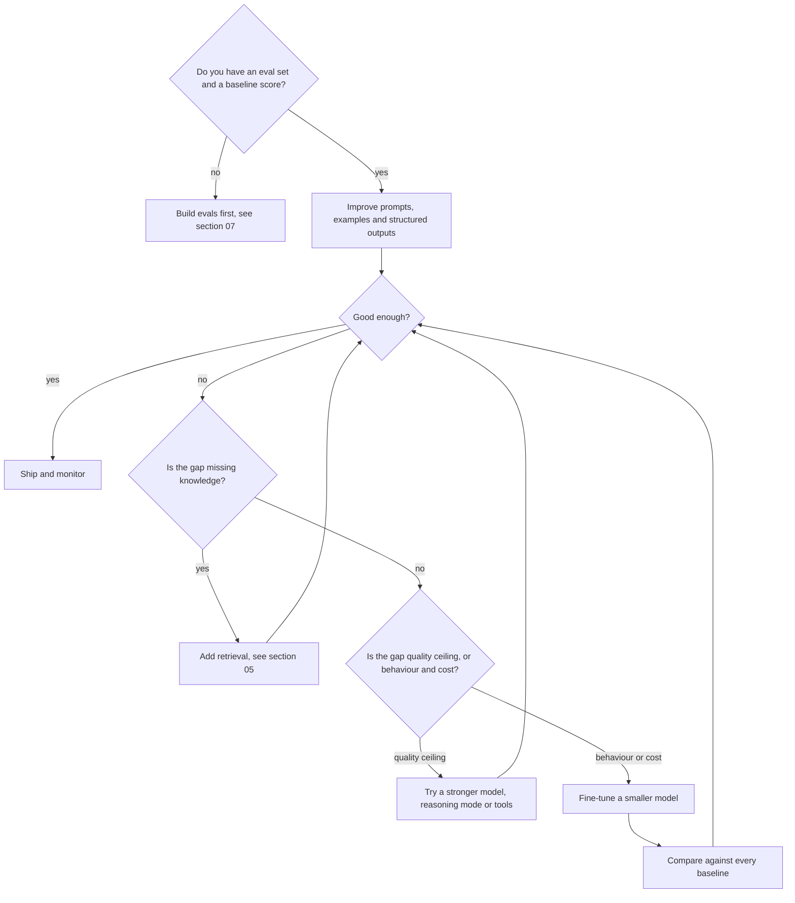

# 09. Open Models, Fine-Tuning and Local Inference

> **Estimated time:** 4-6 weeks (about 6-8 hours per week)
>
> **Prerequisites:** [01 Prerequisites and Developer Foundations](01-prerequisites-and-dev-foundations.md), [02 AI, ML and LLM Foundations](02-ai-ml-and-llm-foundations.md), [03 LLM APIs and Application Building Blocks](03-llm-apis-and-structured-outputs.md), [04 Prompt and Context Engineering](04-prompt-and-context-engineering.md), [05 Embeddings, Vector Search and RAG](05-embeddings-vector-search-and-rag.md) and, above all, [07 Evaluation, Observability and Testing](07-evaluation-observability-and-testing.md). A GPU helps but is not required: most exercises run on a laptop or on a cheap rented GPU.
>
> **Outcome:** You can pick an open-weight model with a clear view of its licence, run and serve it locally or on rented GPUs, size hardware with simple memory math, decide with evidence whether fine-tuning is worth it, and (when it is) train, evaluate and ship a LoRA-tuned model without losing track of cost or regressions.

## Why this stage matters

Hosted APIs (sections 03-06) are the right default, but they are not the only tool. Open-weight models let you keep data inside your own network, control latency and cost at high predictable volume, run offline or on a device, and specialise a small model so it does one narrow job better and cheaper than a general giant. Working with them also teaches how LLMs actually consume memory and compute, which makes you better at reading provider pricing and debugging slow or failing systems. The most valuable skill here is judgement: most teams should not fine-tune first, and this section teaches you to decide with evidence rather than enthusiasm.

## Topic map

| Part | Topic | The question it answers |
|------|-------|-------------------------|
| 1 | Open weights, licences, model families | May I use this model in my product, and which families exist? |
| 2 | Hugging Face ecosystem | Where do models, datasets and training tools live? |
| 3 | Running and serving models | How do I run one model for me, or for many users, and still get reliable JSON and tool calls? |
| 4 | Quantization and memory math | Will it fit, and how fast will it be? |
| 5 | Decision framework | Prompting, RAG, fine-tuning, distillation or a bigger model? |
| 6 | Fine-tuning methods | Which technique fits which goal (SFT, LoRA, DPO, GRPO, hosted)? |
| 7 | Data is the product | What do I train on, and how do I keep it clean and legal? |
| 8 | Training tooling and hyperparameters | What do I run, which knobs matter, and how do I train on a small budget? |
| 9 | Evaluating fine-tuned models | Did it really get better, and what did it break? |
| 10 | Adapters, merging, small and edge models | How do I ship and operate many variants? |
| 11 | Classical ML still matters | When is an LLM the wrong tool? |

Cross-references: "section 07" means the roadmap file with that number; "part 7" means the numbered part of this file. Details that change quickly are marked "(as of Oct 2026)"; confirm them in the linked official docs before relying on them.

## 1. Open weights, licences and model families

### 1.1 Three meanings of "open"

- **Open weights**: you can download the trained parameters and run them yourself. This is what most "open models" are.
- **Open source AI** in the strict sense: the [Open Source AI Definition 1.0](https://opensource.org/ai/open-source-ai-definition) from the Open Source Initiative asks for four freedoms (use, study, modify, share) and expects the weights, the code to train and run the system, and detailed information about the training data, all under OSI-approved terms. Few frontier-scale models meet this bar; Ai2's OLMo family is a well-known example of a fully open effort.
- **Source-available or custom licence**: weights are downloadable but come with conditions (usage thresholds, acceptable-use policies, naming and attribution rules).

The practical lesson is that "open" is a spectrum, and the licence belongs to a specific release. A base model, its fine-tunes and its quantized copies can all carry different terms, and fine-tunes inherit the constraints of what they were built from. Always read the licence field and licence file on the exact checkpoint you use.

### 1.2 Licences you will meet

This table is a reading aid, not legal advice. Licence fields were spot-checked on Hub model metadata in Oct 2026, but vendors change licences between releases and even within one family, so always re-check the checkpoint you actually deploy.

| Licence | Example families (verify per model) | What it generally allows | Watch out for |
|---------|--------------------------------------|--------------------------|----------------|
| [Apache-2.0](https://www.apache.org/licenses/LICENSE-2.0) | Many Qwen checkpoints, gpt-oss, OLMo, SmolLM, many Mistral releases, newest Gemma generation (as of Oct 2026) | Commercial use, modification, redistribution, explicit patent grant | Keep licence and notices, mark changes |
| MIT | DeepSeek reasoning models, Phi family | Almost anything, very short licence | Keep the copyright notice |
| Llama community licence | Llama family | Commercial use, fine-tuning, redistribution | Include the agreement and the "Built with Llama" notice; distributed models trained or improved with Llama materials or outputs must start their name with "Llama"; a separate licence from Meta is needed if your products had more than 700 million monthly active users when that Llama version was released; an Acceptable Use Policy applies |
| [Gemma Terms of Use](https://ai.google.dev/gemma/terms) | Earlier Gemma generations | Use, modify, distribute | Prohibited Use Policy must be passed to recipients; derivatives (including distilled models) stay under the terms |
| Non-commercial or research-only (for example CC-BY-NC) | Some research releases | Experiments, papers | No commercial product use |
| "other" / OpenRAIL-style | Various | Depends on the text | Behaviour-based restrictions; read the file |

The Llama points above come from the licence texts of recent Llama releases published in Meta's [llama-models repository](https://github.com/meta-llama/llama-models); each Llama version has its own text, so read the one that ships with your weights. Check the version's Acceptable Use Policy as well: for some Llama versions it says that the rights to that version's multimodal models are not granted to individuals or companies domiciled in the European Union, while end users of products built on them are not affected. The Gemma line changed in 2026: Google's terms page now notes that the newest generation uses Apache-2.0 instead of the Gemma Terms (as of Oct 2026).

### 1.3 What you may and may not do (awareness checklist)

- **Commercial use**: fine under Apache-2.0 and MIT; custom licences may add thresholds or naming rules; non-commercial licences forbid it.
- **Fine-tune and redistribute**: usually allowed with notices. If you ship weights (including inside a mobile app), the licence's redistribution duties apply to you, such as attaching the licence text or passing on use restrictions.
- **Distillation (training on another model's outputs)**: governed by the teacher's licence or API terms. Some open licences allow it with naming rules; many hosted-API terms restrict using outputs to build competing models. Read them before generating a synthetic dataset.
- **Training data** has its own licensing, separate from the model's (see part 7 below).
- **Acceptable-use policies** bind your product too: end users must not be allowed to do what the policy prohibits.
- **Regulation** (for example transparency duties for general-purpose models) is covered at awareness level in [08 Safety, Security and Responsible AI](08-safety-security-and-responsible-ai.md).
- Keep a **model bill of materials**: model id, exact revision (commit hash), licence, source URL, date reviewed, who approved.

### 1.4 Model families to know

Names change every few months, so learn the families, not the version numbers. This list is non-exhaustive.

| Family | Maker | Why you will meet it |
|--------|-------|----------------------|
| Llama | Meta | A very large ecosystem of tooling and community fine-tunes; custom licence |
| Qwen | Alibaba | Wide size range, multilingual and coding variants; most open checkpoints are Apache-2.0, but some (often the largest or non-text releases) use a custom licence |
| Gemma | Google | Efficient small and mid-size models, multimodal variants |
| Mistral / Ministral | Mistral AI | European lab, licence varies by model, strong small models |
| DeepSeek | DeepSeek | Large mixture-of-experts and reasoning models, permissive licences |
| gpt-oss | OpenAI | Open-weight reasoning models under Apache-2.0 |
| Phi | Microsoft | Small models trained with heavy data curation, MIT |
| OLMo, SmolLM | Ai2, Hugging Face | Fully open recipes and tiny models good for learning and edge |
| Granite, Nemotron, GLM | IBM, NVIDIA, Z.ai | Enterprise-oriented and research-heavy alternatives |

Vocabulary that decides how a model behaves in your stack:

- **Base** versus **instruct/chat** versus **reasoning ("thinking")** checkpoints. Fine-tune from a base or instruct model deliberately; reasoning models emit extra thinking tokens and have special chat-template fields.
- **Dense** versus **mixture-of-experts (MoE)**: an MoE has many parameters in total but activates only a few per token. Memory scales with total parameters, speed with active parameters.
- Modality (text, vision-language, audio), context length, tool-calling support and the chat template they expect.

### 1.5 Choosing a model

Shortlist two or three models by task fit, size and licence, run your own eval set from section 07 on each, then compare quality, latency and cost on the hardware you will really use. Public leaderboards are a way to build the shortlist, not to make the decision: benchmarks can be contaminated and rarely resemble your data.

**Try it:** Pick three families from the table. Open each model card on the Hub and fill in a row: licence, base model, context length, languages, chat template style, gated or not, and the date you checked.

## 2. The Hugging Face ecosystem

### 2.1 The Hub, model cards and gated models

The [Hugging Face Hub](https://huggingface.co/docs/hub/index) is a git-based home for models, datasets and demo apps ("Spaces"). Every repository has versioned history, so you can pin an exact **revision** (commit hash) for reproducibility. The **model card** is the repository's README with YAML metadata at the top: `license`, `base_model` (with the relationship: finetune, adapter, quantized or merge), `datasets`, `library_name`, `pipeline_tag` and optional evaluation results. See the [model card docs](https://huggingface.co/docs/hub/model-cards). Some repositories are **gated**: you accept the terms on the model page and authenticate with a token (`hf auth login`, or an `HF_TOKEN` environment variable). Never commit tokens.

Two security habits matter. Prefer weights stored as `safetensors`, which cannot execute code on load, over pickle-based files (see the Hub's [pickle security notes](https://huggingface.co/docs/hub/security-pickle)). And treat `trust_remote_code=True` as "run unreviewed Python from this repository": use it only for repositories you trust, pinned to a revision.

### 2.2 The libraries

| Library | Role |
|---------|------|
| [`huggingface_hub`](https://huggingface.co/docs/huggingface_hub/index) | Download, upload, authenticate, call hosted inference |
| [`transformers`](https://huggingface.co/docs/transformers/index) | Model definitions, tokenizers integration, `generate`, `Trainer`, quantization integrations |
| [`datasets`](https://huggingface.co/docs/datasets/index) | Load, map, filter, stream and share datasets (JSONL, Parquet, Hub) |
| [`tokenizers`](https://huggingface.co/docs/tokenizers/index) | Fast tokenization used by `transformers` |
| [`accelerate`](https://huggingface.co/docs/accelerate/index) | Device placement and multi-GPU/mixed-precision plumbing behind `device_map="auto"` and trainers |
| [`peft`](https://huggingface.co/docs/peft/index) | LoRA, QLoRA-style and other parameter-efficient adapters |
| [`trl`](https://huggingface.co/docs/trl/index) | Post-training trainers: SFT, DPO, KTO, GRPO, reward modelling and more |

As of Oct 2026 the documentation shows `transformers` in its 5.x series and `trl` in its 1.x series. Releases rename arguments (for example `torch_dtype` is now `dtype`), so pin versions in `requirements.txt` and read the docs for the version you install.

### 2.3 Hosted options on the Hub

- [Inference Providers](https://huggingface.co/docs/inference-providers/index): serverless access to many open models through partner providers with one Hugging Face token. It can be called through the `huggingface_hub` client or through an OpenAI-compatible chat endpoint (use the `openai` client with the router base URL given in the docs); a suffix on the model id such as `:fastest` or `:cheapest` selects the routing policy there, and the [router's model list](https://router.huggingface.co/v1/models) shows what is currently served. Good for trying open models before you host anything.
- [Inference Endpoints](https://huggingface.co/docs/inference-endpoints/index): a managed, dedicated deployment of a Hub model on hardware you pick, with autoscaling and logs, using engines such as vLLM or a custom container. Good when you need a private, always-on endpoint without operating GPUs yourself.
- [Spaces](https://huggingface.co/docs/hub/spaces-overview): host small apps and demos (Gradio, Docker). A convenient place to publish a demo of a fine-tuned model for your portfolio.

```python
import os

from huggingface_hub import InferenceClient

client = InferenceClient(api_key=os.environ["HF_TOKEN"])  # provider selection defaults to "auto"

completion = client.chat.completions.create(
    model=os.environ["HF_MODEL_ID"],  # a chat model id that at least one provider serves
    messages=[{"role": "user", "content": "Name three uses of a KV cache."}],
)
print(completion.choices[0].message.content)
```

### 2.4 Running a model with `transformers`

Chat models are still next-token predictors. The **chat template** shipped with the tokenizer turns a list of role/content messages into the exact token sequence the model was trained on; the [chat templating guide](https://huggingface.co/docs/transformers/chat_templating) explains why using the wrong template silently degrades quality. `add_generation_prompt=True` appends the assistant-turn header so the model replies instead of continuing your message.

```python
import os

import torch
from transformers import AutoModelForCausalLM, AutoTokenizer

# Choose a small instruct model from the Hub that fits your hardware and licence needs.
MODEL_ID = os.environ["HF_MODEL_ID"]

tokenizer = AutoTokenizer.from_pretrained(MODEL_ID)
model = AutoModelForCausalLM.from_pretrained(
    MODEL_ID,
    dtype="auto",       # keep the dtype stored in the checkpoint (older releases: torch_dtype)
    device_map="auto",  # needs `accelerate`; places weights on GPU or CPU
)

messages = [
    {"role": "system", "content": "You are a concise assistant."},
    {"role": "user", "content": "Explain a KV cache in two sentences."},
]

inputs = tokenizer.apply_chat_template(
    messages,
    add_generation_prompt=True,
    tokenize=True,
    return_dict=True,
    return_tensors="pt",
).to(model.device)

with torch.inference_mode():
    output_ids = model.generate(**inputs, max_new_tokens=128, do_sample=False)

new_tokens = output_ids[0, inputs["input_ids"].shape[1]:]
print(tokenizer.decode(new_tokens, skip_special_tokens=True))
```

For quick experiments, `pipeline("text-generation", model=MODEL_ID, dtype="auto", device_map="auto")` accepts the same message list directly. Remember that a raw `transformers` loop is for learning, notebooks and training; it is not a high-throughput server (see part 3).

**Try it:** Run the script with a small model, then change the system message, set `do_sample=True` with a temperature, and print `model.get_memory_footprint()`. Compare the footprint with the size of the model's files on the Hub.

## 3. Running models locally and serving them

Two different jobs hide behind "run a model". **Local use** serves one person or one developer machine and values convenience. **Serving** handles many concurrent users and values throughput, latency under load, observability and stable APIs. Tools are strong at one job and merely adequate at the other.

### 3.1 Local runners

| Tool | What it is | Notes |
|------|-----------|-------|
| [Ollama](https://docs.ollama.com/) | Command-line app and local server with a model library | `ollama pull`, `ollama run`, `ollama serve`; REST and OpenAI-compatible API on port 11434; import your own GGUF or safetensors via a Modelfile ([import docs](https://docs.ollama.com/import)); GGUF files are not quantized during import, so quantize them first (for example with `llama-quantize`) |
| [llama.cpp](https://github.com/ggml-org/llama.cpp) | C/C++ inference engine using the GGUF format | Runs on CPU, Apple Metal, CUDA, HIP, Vulkan, SYCL and more; CPU+GPU hybrid offload for models bigger than VRAM; ships `llama-server` (OpenAI-compatible, default `127.0.0.1:8080`), `llama-quantize`, a perplexity tool and LoRA export |
| [LM Studio](https://lmstudio.ai) | Desktop app with model browser, chat UI and a local server | OpenAI-compatible server at `http://localhost:1234/v1` ([docs](https://lmstudio.ai/docs/developer/openai-compat)); good for non-terminal teammates |
| [MLX and `mlx-lm`](https://github.com/ml-explore/mlx-lm) | Apple's array framework and its LLM toolkit for Apple silicon | `mlx_lm.generate`, `mlx_lm.chat`, `mlx_lm.server`, `mlx_lm.convert -q` for quantizing, and LoRA fine-tuning on a Mac |

```bash
# llama.cpp: download a GGUF from the Hub and serve it (OpenAI-compatible, port 8080).
llama-server -hf <user>/<repo-GGUF> -c 8192
# Newer builds also ship a unified launcher: `llama serve -hf <user>/<repo-GGUF>` (as of Oct 2026).

# Ollama: pull a model from its library, chat, and call the API on port 11434.
ollama pull <model-name>
ollama run <model-name>
```

### 3.2 Serving engines

Serving engines add **continuous batching** (new requests join a running batch), efficient **KV-cache management** (the vLLM paper on [PagedAttention](https://arxiv.org/abs/2309.06180) is the classic reference), tensor parallelism across GPUs, quantization kernels, structured output and metrics.

| Engine | Strengths | Notes |
|--------|-----------|-------|
| [vLLM](https://docs.vllm.ai/en/stable/) | Broad model and hardware coverage, high throughput, multi-LoRA serving, OpenAI-compatible server | `vllm serve <model>` listens on port 8000; common flags include `--max-model-len`, `--gpu-memory-utilization`, `--api-key`, `--quantization`, `--tensor-parallel-size` |
| [SGLang](https://docs.sglang.io/) | RadixAttention prefix caching, strong for multi-turn chat and agent workloads, broad accelerator support | `sglang serve <model> --port 30000` per its install guide |
| [Text Generation Inference (TGI)](https://huggingface.co/docs/text-generation-inference/index) | Hugging Face's earlier serving toolkit | In maintenance mode; its docs recommend vLLM, SGLang, llama.cpp or MLX for new work (as of Oct 2026) |
| [TensorRT-LLM](https://nvidia.github.io/TensorRT-LLM/) | NVIDIA-optimised inference with FP8/INT4 quantization, in-flight batching and `trtllm-serve` | Tuned for NVIDIA GPUs, including recent data-center parts, at the price of more setup and vendor lock-in |

Rules of thumb: Ollama, LM Studio or llama.cpp for a laptop, a demo, or a single-tenant private box; vLLM or SGLang when several users share a GPU; TensorRT-LLM when you are deep into NVIDIA hardware and squeezing the last bit of cost. The production side (gateways, autoscaling, queues) continues in [10 Deployment, LLMOps and Scaling](10-deployment-llmops-and-scaling.md).

### 3.3 Everything speaks the OpenAI protocol

Because all of these expose an OpenAI-compatible endpoint, application code stays the same and only the base URL changes. This is the cleanest way to keep a hosted model and a self-hosted model interchangeable behind your own abstraction from section 03.

```python
import os

from openai import OpenAI

# Typical local ports: Ollama 11434, LM Studio 1234, llama-server 8080, vLLM 8000.
client = OpenAI(
    base_url=os.environ.get("LLM_BASE_URL", "http://localhost:11434/v1"),
    api_key=os.environ.get("LLM_API_KEY", "not-needed-locally"),  # local servers ignore it unless configured
)

resp = client.chat.completions.create(
    model=os.environ["LLM_MODEL"],  # the name your server exposes; check its /v1/models endpoint
    messages=[{"role": "user", "content": "Summarise what a chat template does."}],
    temperature=0,
)
print(resp.choices[0].message.content)
```

"Compatible" is not "identical": tool calling, structured output, reasoning fields, streaming details and usage statistics differ by engine and version. Test the exact features you rely on, and read each server's compatibility notes (for example [Ollama's](https://docs.ollama.com/api/openai-compatibility)). The two features that break most often, structured output and tool calling, get their own subsection next.

### 3.4 Structured output and tool calling on open models

A hosted API hides two pieces of machinery that you now run yourself: the grammar engine behind schema-constrained output ([03 section 6.2](03-llm-apis-and-structured-outputs.md#62-how-constrained-decoding-works-conceptually)) and the **tool parser** behind function calling ([03 section 7](03-llm-apis-and-structured-outputs.md#7-function-and-tool-calling)). In **guided** (constrained) decoding the server compiles your JSON Schema into a grammar and masks every token that would break it, using a library such as [XGrammar](https://github.com/mlc-ai/xgrammar) ([paper](https://arxiv.org/abs/2411.15100)), [Outlines](https://github.com/dottxt-ai/outlines) or [llguidance](https://github.com/guidance-ai/llguidance). Flag and field names below were checked against each project's docs and are current as of Oct 2026, but they do change between releases, so confirm them with `--help` and the linked pages.

| Engine | Schema-constrained output | Notes |
|--------|---------------------------|-------|
| [vLLM](https://docs.vllm.ai/en/stable/features/structured_outputs/) | `response_format` with `"type": "json_schema"`, or `extra_body={"structured_outputs": {"json": schema}}`; `choice`, `regex` and `grammar` variants also exist | Backend (XGrammar, guidance or Outlines) is chosen with `--structured-outputs-config.backend`, default `auto`; the older `guided_json` field family was removed in v0.12.0 |
| [SGLang](https://docs.sglang.io/advanced_features/structured_outputs.html) | `response_format` with `json_schema`; `extra_body={"regex": ...}` or `{"ebnf": ...}` | `--grammar-backend` selects XGrammar (the default), `outlines` or `llguidance` |
| [llama.cpp](https://github.com/ggml-org/llama.cpp/blob/master/grammars/README.md) | `llama-server` accepts `response_format` on chat completions, a `json_schema` field on completion endpoints, or raw GBNF in `grammar` | Converts a subset of JSON Schema to GBNF; the CLI tools take `--grammar-file` and `--json` / `-j` |
| [Ollama](https://docs.ollama.com/capabilities/structured-outputs) | The native `format` field accepts `"json"` or a JSON Schema; its OpenAI-compatible endpoint lists `response_format` | Docs advise temperature 0 and also describing the schema in the prompt |

Libraries such as Outlines apply the same idea in-process around a `transformers` model when you are not running a server.

**Tool calling is a three-way dependency.** An open model writes a tool call as text in a model-specific format. The server needs the matching **tool parser** to turn that text into the OpenAI-style `tool_calls` array, and the **chat template** must render tool definitions, earlier calls and tool results the way the model was trained. If any link is missing you get calls pasted into `content`, malformed arguments or no calls at all, so treat support as per model and per engine version:

- **vLLM**: start the server with `--enable-auto-tool-choice` and `--tool-call-parser <name>` (the [docs](https://docs.vllm.ai/en/stable/features/tool_calling/) list parsers by model family, for example `hermes`, `mistral` and `llama3_json`), plus `--chat-template` if the model's own template lacks tool support. Named-function and `tool_choice="required"` calls are decoded under a schema constraint; with `"auto"` the parser reads free text, so arguments can occasionally be malformed unless tools set `strict: true` and the parser supports constraining them.
- **SGLang**: `--tool-call-parser` with a parser name per family; some models, such as DeepSeek, want a custom chat template ([docs](https://docs.sglang.io/advanced_features/tool_parser.html)).
- **llama.cpp**: `llama-server` handles tools through its Jinja chat-template path (`--jinja`, which current builds enable by default). It has native handlers for known formats and a generic fallback for unrecognised templates that uses more tokens and is less efficient; a `--chat-template-file` override may be needed ([function calling notes](https://github.com/ggml-org/llama.cpp/blob/master/docs/function-calling.md)).
- **Ollama**: pass `tools` to `/api/chat` or its OpenAI-compatible endpoint ([docs](https://docs.ollama.com/capabilities/tool-calling)), pick a model whose capabilities include tools, and note that its compatibility page does not list `tool_choice` as supported.

Verify per model with a small tool-call eval from [section 07](07-evaluation-observability-and-testing.md): right tool chosen, arguments valid against the schema, no call when none is needed, and a sensible reply after the tool result.

```python
import json
import os
from typing import Literal

from openai import OpenAI
from pydantic import BaseModel, Field

client = OpenAI(
    base_url=os.environ.get("LLM_BASE_URL", "http://localhost:8000/v1"),  # vLLM's default port
    api_key=os.environ.get("LLM_API_KEY", "not-needed-locally"),
)
MODEL = os.environ["LLM_MODEL"]  # the name your server exposes; check GET /v1/models


class Ticket(BaseModel):
    summary: str = Field(description="One sentence, at most 25 words")
    category: Literal["billing", "bug", "feature_request", "other"]
    urgency: Literal["low", "medium", "high"]
    needs_human: bool


def classify(text: str) -> Ticket:
    schema = Ticket.model_json_schema()
    # The engine forces the shape; the prompt tells the model what each field should contain.
    system = f"Classify the support message. Reply with JSON matching this schema: {json.dumps(schema)}"
    response = client.chat.completions.create(
        model=MODEL,
        messages=[{"role": "system", "content": system}, {"role": "user", "content": text}],
        response_format={"type": "json_schema", "json_schema": {"name": "ticket", "schema": schema}},
        temperature=0,
        max_tokens=300,
    )
    choice = response.choices[0]
    if choice.finish_reason != "stop":  # "length" means the JSON was cut off
        raise RuntimeError(f"incomplete output: finish_reason={choice.finish_reason}")
    # Constrained decoding guarantees shape; Pydantic still checks types and your own rules.
    return Ticket.model_validate_json(choice.message.content or "")
```

Caveats to plan for:

- **Reasoning quality can drop.** Forcing JSON from the first token leaves the model no room to think. One study, [Let Me Speak Freely?](https://arxiv.org/abs/2408.02442), reported weaker reasoning under strict format restrictions; how large the effect is on current models is debated, so measure it on your task. Mitigations: put a short `rationale` string before the answer fields, or let the model reason freely and extract the answer in a second constrained call. Heavy quantization compounds the risk (see part 4.3).
- **First-request latency.** A new schema must be compiled into a grammar before use; vLLM's docs warn of several seconds the first time a named function is used, before the compiled form is cached. Reuse a small set of fixed schemas, warm them at startup and never build schemas per request.
- **Schema subsets.** Backends support different parts of JSON Schema and different regex dialects. llama.cpp documents unsupported keywords (such as `uniqueItems`, `contains`, `not` and `if`/`then`/`else`) and defaults `additionalProperties` to false. Keep schemas flat and re-check the full rules in Pydantic afterwards.
- **Shape is not truth.** Truncation still yields invalid JSON, and valid JSON can be wrong, exactly as in hosted APIs.

**Fallback.** When a model, engine or schema cannot be constrained, ask for JSON in the prompt, validate with Pydantic and feed the errors back using the `parse_with_retry` helper from [03 section 6.4](03-llm-apis-and-structured-outputs.md#64-validation-layers-and-retry-on-failure), then escalate to a stronger model or a human after the attempt limit. Keep that validate-and-retry layer even when constraints are on: it also catches business-rule failures.

**Try it:** Run twenty messy support messages through `classify` against a local server, once with `response_format` and once without it plus the retry helper. Count valid, correct, truncated and retried outputs, and note the extra latency of the first request.

### 3.5 Pitfalls when running locally

- **Silent context truncation.** Local runners ship small default context windows that have changed between versions (Ollama's `num_ctx`, llama.cpp's `-c`). A long prompt may be cut without an error, which looks exactly like "the model ignored my document". Set the context explicitly and test with a long input.
- **Template mismatch.** A GGUF converted with the wrong chat template produces odd, rambling or repetitive output. Compare against the reference `transformers` output.
- **Exposing a dev server.** Local servers have no authentication by default. Bind to localhost, or add an API key and a reverse proxy before anyone else can reach them.

**Try it:** Serve the same small model with Ollama (or llama.cpp) and call it with the client above. Then send a prompt longer than the default context and observe what happens before and after you raise the context setting.

## 4. Quantization and the memory math

### 4.1 What quantization does

**Quantization** stores weights (and sometimes activations or the KV cache) in fewer bits, for example 8 or 4 instead of 16. The model shrinks, fits on smaller hardware and often generates faster because token generation is limited by how quickly weights stream from memory. The price is some accuracy loss, which depends on the method, the bit-width and the model.

Two families matter in practice: **post-training quantization (PTQ)** converts an existing model (almost everything below), while **quantization-aware training** bakes quantization into training and is less common for app developers.

### 4.2 The formats

| Format / tool | Typical use | Notes |
|---------------|-------------|-------|
| **GGUF** (llama.cpp family) | Local runners: llama.cpp, Ollama, LM Studio; CPU, Apple silicon and consumer GPUs | One file with weights, tokenizer and metadata. Named levels such as Q8_0, Q6_K, Q5_K_M and Q4_K_M trade size for quality; in llama.cpp's own tables for an 8B model Q4_K_M is about 4.9 bits per weight, Q6_K about 6.6 and Q8_0 about 8.5. Very-low-bit "IQ" types work best with an importance matrix. Created with `llama-quantize` ([docs](https://github.com/ggml-org/llama.cpp/blob/master/tools/quantize/README.md)) |
| **AWQ** ([paper](https://arxiv.org/abs/2306.00978)) | 4-bit weight-only for GPU servers (vLLM, SGLang) | Protects the weights that matter most based on activation statistics. The popular AutoAWQ repository was archived in 2025; vLLM's docs point to the [LLM Compressor](https://github.com/vllm-project/llm-compressor) project for producing quantized checkpoints (as of Oct 2026) |
| **GPTQ** ([paper](https://arxiv.org/abs/2210.17323)) | 4-bit (and 3/8-bit) weight-only PTQ using approximate second-order information | Mature and widely supported; AutoGPTQ is archived, GPTQModel and LLM Compressor are active (as of Oct 2026) |
| **bitsandbytes** ([docs](https://huggingface.co/docs/bitsandbytes/main/en/index)) | 8-bit (LLM.int8) and 4-bit (NF4/FP4) loading inside `transformers`; the engine behind QLoRA | Convenient for fine-tuning and quick experiments; not the fastest serving path |
| **FP8** ([paper](https://arxiv.org/abs/2209.05433)) | 8-bit floating point weights and activations on recent NVIDIA GPUs | Often close to lossless and roughly halves memory versus 16-bit. In vLLM, full FP8 needs Ada, Hopper or Blackwell-class GPUs; older GPUs can use weight-only modes |

The Hugging Face docs have an [overview of quantization methods](https://huggingface.co/docs/transformers/quantization/overview) and vLLM lists its supported schemes in [its quantization docs](https://docs.vllm.ai/en/stable/features/quantization/).

### 4.3 Quality versus size

- 8-bit is usually indistinguishable from 16-bit in practice. 4-bit is the popular sweet spot. Below about 3 bits quality drops quickly, and small models suffer more than large ones.
- As a rule of thumb, a **larger model at 4-bit** often beats a **smaller model at 16-bit** at equal memory. Verify on your own eval set.
- Quantization is task-dependent. Code, maths, long reasoning, non-English text and strict JSON output tend to degrade first. Measure on your own eval set.
- For a quick signal, compare perplexity or KL divergence against the 16-bit model (llama.cpp ships a perplexity tool for this), but do not stop there: perplexity can look fine while a specific skill breaks.
- The KV cache can be quantized too (llama.cpp cache-type options, vLLM quantized KV cache), trading a little quality for much more context or concurrency.

### 4.4 Memory math you can do on a napkin

For inference, memory is roughly:

```text
total = weights + KV cache + activations/runtime buffers
weights  = parameters x bytes_per_parameter
KV cache = 2 x layers x kv_heads x head_dim x tokens x sequences x bytes_per_value
```

Bytes per parameter: 4 for FP32, 2 for BF16/FP16, 1 for FP8/INT8, about 0.5-0.6 for 4-bit formats once scales are included. The leading 2 in the KV formula is one tensor for keys and one for values. Read `num_hidden_layers`, `num_key_value_heads` and the head size from the model's `config.json`. Grouped-query attention (few KV heads) is why modern models have a far smaller cache than older ones.

```python
def estimate_inference_gib(
    params_billion: float,
    bits_per_weight: float,
    n_layers: int,
    n_kv_heads: int,
    head_dim: int,
    context_tokens: int,
    concurrent_sequences: int = 1,
    kv_bytes_per_value: int = 2,    # 2 for a 16-bit KV cache, 1 for FP8
    overhead_fraction: float = 0.10,  # runtime buffers, fragmentation, activations
) -> dict:
    gib = 2**30
    weights = params_billion * 1e9 * bits_per_weight / 8
    kv_cache = (
        2 * n_layers * n_kv_heads * head_dim
        * context_tokens * concurrent_sequences * kv_bytes_per_value
    )
    total = (weights + kv_cache) * (1 + overhead_fraction)
    return {
        "weights_gib": round(weights / gib, 2),
        "kv_cache_gib": round(kv_cache / gib, 2),
        "total_gib": round(total / gib, 2),
    }


# 8B-class model at ~4.9 bits/weight, 32 layers, 8 KV heads, head_dim 128, 8k context.
print(estimate_inference_gib(8, 4.9, 32, 8, 128, 8192))
# Same model serving 16 concurrent users at 8k each: the KV cache dominates.
print(estimate_inference_gib(8, 4.9, 32, 8, 128, 8192, concurrent_sequences=16))
```

Run it and notice the lesson: for one user the weights dominate, but with 16 concurrent 8k-token conversations the KV cache is several times larger than the weights. That is why serving engines manage the cache so carefully and why "it fits" on your laptop does not mean "it scales". MoE models need all experts resident in memory, so size them by total parameters. The Hugging Face `accelerate estimate-memory <model-id>` command reports the cost of loading a model without downloading the weights ([guide](https://huggingface.co/docs/accelerate/usage_guides/model_size_estimator)), and the EleutherAI [transformer math](https://blog.eleuther.ai/transformer-math/) post derives the formulas in depth.

**Training needs far more memory than inference.** A common rule of thumb for full fine-tuning with AdamW in mixed precision is about 16 bytes per parameter (weights, gradients and optimizer states), so an 8B model needs on the order of 128 GB before activations. **LoRA** keeps the frozen base at 2 bytes per parameter and trains tiny adapters, so about 16 GB of weights for 8B plus activations. **QLoRA** keeps the frozen base at roughly 0.5-0.6 bytes per parameter, so about 5 GB for 8B plus adapters and activations. Gradient checkpointing, shorter sequences and smaller micro-batches trade speed for memory.

### 4.5 Hardware guidance

Treat these as rough tiers (as of Oct 2026) and verify with the estimator above.

| Memory | Comfortable inference (4-bit) | Feasible QLoRA fine-tuning |
|--------|-------------------------------|----------------------------|
| 8 GB VRAM | Up to about 8B with short context | 1-3B (larger only with aggressive settings) |
| 12-16 GB | 7-14B models with moderate context | up to about 8B |
| 24 GB | Up to roughly 30B-class models with modest context | 8-14B, small sequences |
| 32 GB | 30B-class models with room for context | up to roughly 30B with care |
| 48 GB (one card or two 24 GB) | 70B-class only with short context | mid-size models comfortably |
| 80 GB data-center GPU | 70B-class with real context and batching | 70B-class with QLoRA, mid-size with 16-bit LoRA |

- **Consumer NVIDIA GPUs** typically have the broadest software support (CUDA, bitsandbytes, FlashAttention, vLLM). VRAM, not raw speed, is usually what limits you.
- **Apple silicon** uses unified memory shared by CPU and GPU, so a Mac can load models that no consumer GPU could, but memory bandwidth limits tokens per second and macOS reserves part of the memory for the system. Use MLX or llama.cpp's Metal backend.
- **CPU-only** works with small quantized models in llama.cpp and is fine for batch jobs and experiments.
- **Rented GPUs**: hyperscalers (AWS, Google Cloud, Azure), GPU specialists and marketplaces (for example Lambda, CoreWeave, RunPod, Modal, Vast.ai) and Hugging Face's own endpoints. Prices and availability change often, so compare per-hour cost, per-second billing, spot or preemptible discounts, storage and egress. Always shut instances down after a run and keep checkpoints on durable storage. Without a GPU of your own, see [8.4](#84-no-gpu-a-budget-path) for a budget path.

**Try it:** Use the estimator for a 70B-class and an 8B-class model at 4-bit and 16-bit with 4k and 32k context. Mark which rows fit on your machine and which need a rented GPU. Then check one result against `accelerate estimate-memory`.

## 5. Decision framework: prompt, RAG, fine-tune, distil or scale up

Fine-tuning feels like the serious engineering move, so teams reach for it early. Resist that. Every option below is cheaper to try than the one after it, and you need an eval set (section 07) to know whether anything helped. Providers that offer fine-tuning give the same order of work: build evals, improve prompts, then fine-tune only if that is not enough (see [OpenAI's optimization guide](https://developers.openai.com/api/docs/guides/model-optimization)).



| Symptom | Reach for | Why |
|---------|-----------|-----|
| Ignores instructions, wrong format | Better prompt, examples, structured outputs ([03](03-llm-apis-and-structured-outputs.md), [04](04-prompt-and-context-engineering.md)) | Cheapest, instantly reversible |
| Lacks private or fresh facts | RAG ([05](05-embeddings-vector-search-and-rag.md)) | Facts change and need citations; fine-tuning stores facts unreliably and cannot be updated per document |
| Needs consistent style, tone, schema or niche skill across many calls | SFT with LoRA | Bakes behaviour into weights and shortens prompts |
| Large model works but is too slow or costly at volume | Distillation: fine-tune a small model on the large model's verified outputs | Moves quality into a cheaper model |
| Quality ceiling too low | Stronger model, reasoning mode, tools or better retrieval | Fine-tuning a small model rarely beats a much stronger one on hard reasoning |
| Data cannot leave your environment | Open-weight model, possibly fine-tuned | Control and compliance |
| Preferences (tone, verbosity, refusal style) | Preference optimization after SFT | Learns "better than" signals |
| Verifiable tasks (maths, code, schema validity) | Reinforcement learning with verifiable rewards | The checker is the teacher |
| Plain classification or extraction on structured text | Classical ML or a small encoder (part 11) | Cheaper, faster, deterministic |

**Cost and benefit.** Fine-tuning moves cost from every request to a one-time investment, but it adds recurring burdens:

- **Data work** dominates: collecting, labelling, reviewing and cleaning examples takes far more time than the training run.
- **A fine-tune is tied to a base model.** When the base is deprecated or a better one appears, you re-run the pipeline. Keep data, configs and scripts, not just weights.
- **Evaluation and safety re-testing** are required for each new version (part 9).
- **Serving** a custom model means GPUs, scaling, monitoring and on-call, or a hosted fine-tuning bill.
- **Drift**: when your product changes, the tuned behaviour can go stale.

A simple break-even estimate keeps the discussion honest:

```text
break-even requests = (data + training + eval + ops cost over the period)
                      / (API cost per request - self-hosted cost per request)
```

If you never reach that volume, or the saving per request is tiny, prompting and RAG win. If prompts are huge because you paste many examples every time, fine-tuning a small model can pay off quickly.

**Try it:** Take a real task. Write the baseline score from your eval set, list the cheapest three things you would try before fine-tuning, and compute the break-even request count for one fine-tuning scenario using your own cost estimates.

## 6. Fine-tuning methods

### 6.1 Continued pretraining

**Continued pretraining** keeps training a base model on raw domain text with the next-token objective. It teaches vocabulary, style and domain structure, but it needs a large number of tokens, serious compute, careful mixing with general data to avoid forgetting, and usually an instruction-tuning step afterwards. App developers rarely need it. Consider it for low-resource languages, unusual scripts, or specialised corpora (for example proprietary code or legal text in a niche jurisdiction) after RAG has been tried.

### 6.2 Supervised fine-tuning (SFT) and instruction tuning

**SFT** trains on pairs of prompt and ideal response. It is the workhorse: it teaches format, tone, tool-call style and task skills much more reliably than it injects new facts. Details that decide quality:

- Compute the loss on the **assistant tokens only**, not on the prompt. TRL exposes this through `assistant_only_loss` for conversational data (the chat template must mark assistant spans with generation markers, which TRL patches in for some known model families) and defaults to completion-only loss for prompt-completion data.
- Use the model's **chat template** and end-of-sequence token consistently in training and at inference.
- A few hundred to a few thousand clean, diverse examples are often enough for a narrow behaviour. The [LIMA paper](https://arxiv.org/abs/2305.11206) showed how far a small, carefully curated set can go for style and alignment.

### 6.3 Parameter-efficient fine-tuning: LoRA, QLoRA, DoRA

Full fine-tuning updates every weight. **LoRA** ([paper](https://arxiv.org/abs/2106.09685)) freezes the pretrained weights and learns a low-rank update for selected matrices: instead of changing a large matrix `W`, it learns two thin matrices whose product (scaled by `alpha / r`) is added to it. Only those small matrices are trained and saved, so an adapter is typically megabytes, training memory drops sharply, and you can keep one base model with many adapters.

- **QLoRA** ([paper](https://arxiv.org/abs/2305.14314)) loads the frozen base in 4-bit NF4 (with double quantization) and trains LoRA adapters on top in higher precision, which lets mid-size models fine-tune on a single 16-24 GB GPU. It is slower than 16-bit LoRA because of dequantization.
- **DoRA** ([paper](https://arxiv.org/abs/2402.09353)) splits each weight update into a magnitude and a direction component. In PEFT it is a flag (`use_dora=True`); it can help at low ranks at some extra cost, so test it rather than assuming.
- Practical findings: applying LoRA to all linear layers beats attention-only; LoRA matches full fine-tuning on small-to-medium datasets but can fall behind when the data is large relative to adapter capacity; and its best learning rate is much higher than for full fine-tuning. The [LoRA Without Regret](https://thinkingmachines.ai/blog/lora/) write-up reports these patterns, and [LoRA Learns Less and Forgets Less](https://arxiv.org/abs/2405.09673) compares LoRA with full fine-tuning on code and maths.
- Choose **full fine-tuning** only when you have the GPUs, a large high-quality dataset and a measured reason LoRA is not enough.

### 6.4 Preference optimization: DPO, ORPO, KTO

SFT teaches "what a good answer looks like". **Preference optimization** teaches "this answer is better than that one" and is usually applied after SFT. It helps with tone, verbosity, refusal style and choosing between plausible answers; it does not add knowledge.

- **DPO** ([paper](https://arxiv.org/abs/2305.18290)) trains directly on `(prompt, chosen, rejected)` triples with a classification-style loss against a frozen reference model, with no separate reward model and no sampling during training. The `beta` setting controls how far the model may drift from the reference.
- **ORPO** ([paper](https://arxiv.org/abs/2403.07691)) folds a preference penalty into SFT so no reference model is needed and one training stage can do both jobs.
- **KTO** ([paper](https://arxiv.org/abs/2402.01306)) learns from unpaired good/bad labels (think thumbs up and thumbs down from production), which is much easier to collect than paired comparisons.

Pitfalls: noisy labels, length bias (the model learns that longer is better), and mismatched data (preference pairs written for a different model than the one you tune). As of Oct 2026, TRL lists `DPOTrainer` and `KTOTrainer` as maintained trainers and `ORPOTrainer` in its experimental namespace; see the [DPO](https://huggingface.co/docs/trl/dpo_trainer) and [KTO](https://huggingface.co/docs/trl/kto_trainer) pages.

### 6.5 Reinforcement learning with verifiable rewards (GRPO), conceptually

In **reinforcement learning with verifiable rewards (RLVR)** the reward is computed by a program: unit tests pass, a maths answer matches, JSON validates against a schema. **GRPO** (Group Relative Policy Optimization, introduced in the [DeepSeekMath paper](https://arxiv.org/abs/2402.03300) and used for reasoning training in [DeepSeek-R1](https://arxiv.org/abs/2501.12948)) samples a group of completions for each prompt, scores them, and treats each completion's score relative to the group average as its advantage. This removes the separate value (critic) network that older methods needed. TRL's [GRPO trainer](https://huggingface.co/docs/trl/grpo_trainer) takes reward functions that receive the completions plus any extra dataset columns and return a list of floats.

```python
import json


def _text(completion):
    # Standard datasets give strings; conversational datasets give lists of messages.
    return completion if isinstance(completion, str) else completion[-1]["content"]


def valid_json_reward(completions, **kwargs):
    """1.0 if the completion is a JSON object with the required keys, else 0.0."""
    required = {"name", "date"}
    rewards = []
    for completion in completions:
        try:
            obj = json.loads(_text(completion))
            rewards.append(1.0 if required <= obj.keys() else 0.0)
        except (json.JSONDecodeError, AttributeError, TypeError):
            rewards.append(0.0)
    return rewards

# trainer = GRPOTrainer(model=BASE_MODEL, reward_funcs=valid_json_reward,
#                       args=GRPOConfig(num_generations=8, ...), train_dataset=prompt_only_dataset)
```

When it fits: tasks with cheap, trustworthy checkers, and a starting model that already succeeds some of the time. Costs and risks: many samples per step (hence vLLM integration in TRL), and **reward hacking**, where the model exploits gaps in your checker. Always evaluate on held-out prompts with an independent check. Most app engineers will use RLVR rarely and for narrow, verifiable skills; know the idea so you can read papers and vendor claims.

### 6.6 Hosted fine-tuning APIs

Providers let you upload a JSONL file and get a tuned model back without touching GPUs. [OpenAI's guide](https://developers.openai.com/api/docs/guides/model-optimization) describes supervised, vision, preference (DPO) and reinforcement fine-tuning; other platforms offer similar services, for example [Together AI](https://docs.together.ai/docs/fine-tuning-overview), [Fireworks AI](https://docs.fireworks.ai/fine-tuning/fine-tuning-models), [Google Vertex AI](https://cloud.google.com/vertex-ai/generative-ai/docs/models/tune-models), [Amazon Bedrock](https://docs.aws.amazon.com/bedrock/latest/userguide/custom-models.html) and [Azure](https://learn.microsoft.com/azure/ai-foundry/openai/how-to/fine-tuning). Trade-offs: you usually cannot export the weights, you get fewer knobs, the tuned model may cost more per token, availability depends on which base models the provider still supports, and your data is governed by their terms. Choose hosted tuning when the provider's model is clearly better than open options for your task and you do not want to run GPUs.

### 6.7 A conceptual SFT script with TRL and LoRA

This is an outline of the shape of a run. **Exact arguments change between library versions**, so treat it as a map and check the current [TRL SFT docs](https://huggingface.co/docs/trl/sft_trainer) and [PEFT docs](https://huggingface.co/docs/peft/index). A note from those docs worth remembering: when you pass the model as a string, TRL loads it in float32 unless you set a dtype, which doubles memory by surprise.

```python
import os

import torch
from datasets import load_dataset
from peft import LoraConfig
from trl import SFTConfig, SFTTrainer

BASE_MODEL = os.environ["BASE_MODEL"]  # a small base or instruct model whose licence you have checked

# JSONL files where each line looks like {"messages": [{"role": ..., "content": ...}, ...]}
train_ds = load_dataset("json", data_files="data/train.jsonl", split="train")
eval_ds = load_dataset("json", data_files="data/eval.jsonl", split="train")

peft_config = LoraConfig(
    r=16,
    lora_alpha=32,
    lora_dropout=0.05,
    target_modules="all-linear",  # adapt every linear layer, not just attention
    task_type="CAUSAL_LM",
)

args = SFTConfig(
    output_dir="outputs/sft-lora",
    model_init_kwargs={"dtype": torch.bfloat16},  # otherwise a string model id loads in float32
    num_train_epochs=2,
    per_device_train_batch_size=4,
    gradient_accumulation_steps=4,      # effective batch of 16 per device
    learning_rate=1e-4,                 # adapters tolerate a higher rate than full fine-tuning
    lr_scheduler_type="cosine",
    warmup_steps=20,
    max_length=2048,
    assistant_only_loss=True,           # needs  markers in the chat template (TRL patches some known families)
    eval_strategy="steps",
    eval_steps=50,
    save_steps=50,
    logging_steps=10,
    report_to="none",                   # or "wandb", "mlflow", "tensorboard", "trackio"
)

# QLoRA variant: also load the frozen base in 4-bit (needs bitsandbytes and a supported GPU).
# from transformers import BitsAndBytesConfig
# bnb = BitsAndBytesConfig(load_in_4bit=True, bnb_4bit_quant_type="nf4",
#                          bnb_4bit_use_double_quant=True, bnb_4bit_compute_dtype=torch.bfloat16)
# Recent TRL takes it as SFTTrainer(..., quantization_config=bnb, peft_config=peft_config);
# older releases passed it through model_init_kwargs={"quantization_config": bnb}.

trainer = SFTTrainer(
    model=BASE_MODEL,
    args=args,
    train_dataset=train_ds,
    eval_dataset=eval_ds,
    peft_config=peft_config,
)
trainer.train()
trainer.save_model()  # saves the adapter (and tokenizer) into output_dir
```

To use the result, load the base model and attach the adapter, or merge it into a standalone model. Merge into a 16-bit base, then quantize the merged model for deployment; merging into an already-quantized base loses precision.

```python
import os

import torch
from peft import PeftModel
from transformers import AutoModelForCausalLM, AutoTokenizer

BASE_MODEL = os.environ["BASE_MODEL"]
ADAPTER_DIR = "outputs/sft-lora"

base = AutoModelForCausalLM.from_pretrained(BASE_MODEL, dtype=torch.bfloat16)
model = PeftModel.from_pretrained(base, ADAPTER_DIR)
merged = model.merge_and_unload()  # folds the adapter into the base weights and returns the plain base model
merged.save_pretrained("outputs/merged")
AutoTokenizer.from_pretrained(ADAPTER_DIR).save_pretrained("outputs/merged")
```

**Try it:** Fine-tune a tiny model (well under 1B parameters) on a few hundred examples of a toy task such as rewriting text in a fixed style. Watch training and evaluation loss, then compare five generations before and after tuning.

## 7. Data is the product

Models change every few months, but your dataset is the durable asset. Spend the effort there.

### 7.1 Formats and chat templates

Training data for chat models is usually **JSONL** (one JSON object per line) with a `messages` list of `role` and `content`. Each trainer expects a particular shape, documented on TRL's [dataset formats](https://huggingface.co/docs/trl/dataset_formats) page:

| Goal | Typical columns |
|------|-----------------|
| SFT (conversational) | `messages` |
| SFT (prompt and completion) | `prompt`, `completion` |
| DPO, ORPO | `prompt`, `chosen`, `rejected` |
| KTO | `prompt`, `completion`, `label` (true or false) |
| GRPO / RLVR | `prompt` plus any columns your reward function needs (for example the expected answer) |

```json
{"messages": [{"role": "system", "content": "Extract invoice fields as JSON."}, {"role": "user", "content": "Invoice 1042 from Acme, due 2026-11-01, total 1250.00 EUR"}, {"role": "assistant", "content": "{\"invoice_id\": \"1042\", \"vendor\": \"Acme\", \"due_date\": \"2026-11-01\", \"total\": 1250.0, \"currency\": \"EUR\"}"}]}
```

The chat template is part of the model. Train with the template the model will use at inference, keep special tokens and end-of-sequence markers consistent, and print a few fully rendered training examples before you start. A mismatch is one of the most common silent failures.

### 7.2 Curation: quality beats quantity

- Write a short **style guide** for what a good answer is, then label or review against it. Disagreement between reviewers tells you the task is under-specified.
- Cover the distribution you will see in production, including hard cases, edge formats, and examples where the right answer is to refuse or to say "not found".
- Start from real inputs (with personal data removed, see [08](08-safety-security-and-responsible-ai.md)), and use humans or strong models to produce the outputs.
- Review a random sample by eye. Reading even a few dozen examples often turns up problems that no metric reveals.

### 7.3 Cleaning, deduplication and quality filtering

Duplicates waste compute and, worse, leak between training and evaluation sets. Research on [deduplicating training data](https://arxiv.org/abs/2107.06499) found that removing repeated text improves language models. Combine exact deduplication on normalised text with near-duplicate detection (for example MinHash or embedding similarity), then filter length outliers, truncated outputs, wrong-language samples, refusals you did not intend, and leftover personal data. You can add a model-based quality score, but sample its decisions by hand.

### 7.4 Synthetic data and distillation

A stronger model can generate or improve training examples: the [Self-Instruct](https://arxiv.org/abs/2212.10560) approach bootstraps instructions from a model, and **distillation** (the idea goes back to [Distilling the Knowledge in a Neural Network](https://arxiv.org/abs/1503.02531)) trains a small model to imitate a larger one. Good practice: feed the teacher your real prompts, generate answers, then keep only those that pass programmatic checks (valid JSON, tests pass, citations resolve) and a judge model calibrated against human labels ([07](07-evaluation-observability-and-testing.md)). Risks: the teacher's mistakes and style get baked in, diversity collapses if you generate from a narrow set of seeds, and the teacher's licence or API terms may restrict the use (part 1.3). Keep real data in the mix.

### 7.5 Licensing and provenance

Datasets have licences too, and "it was on the internet" is not one. Record where each source came from, its licence, whether it contains personal or customer data, and whether your contracts allow training on it. Publish a dataset card if you share it. This is awareness-level guidance: ask your legal and privacy teams for anything that ships to customers.

### 7.6 Train/eval split and contamination

Split by **group**, not by row: all examples from the same customer, document or conversation belong on one side, otherwise near-duplicates leak and your scores are inflated. Or split by time to mimic the future. Never tune hyperparameters on the final test set. **Contamination** means evaluation items appear in training data, including indirectly through a teacher model or a public benchmark that your base model already saw. Check it explicitly.

```python
import hashlib
import json
import random
from collections import defaultdict


def normalize(text: str) -> str:
    return " ".join(text.lower().split())


def first_user_message(example: dict) -> str:
    return next(m["content"] for m in example["messages"] if m["role"] == "user")


def load_jsonl(path: str) -> list[dict]:
    with open(path, "r", encoding="utf-8") as f:
        return [json.loads(line) for line in f if line.strip()]


def dedupe_and_split(rows: list[dict], eval_fraction: float = 0.1, seed: int = 7):
    # 1) drop exact duplicates of the normalised first user message
    unique = {}
    for row in rows:
        key = hashlib.sha256(normalize(first_user_message(row)).encode("utf-8")).hexdigest()
        unique.setdefault(key, row)
    # 2) split by group (for example a customer or document id) so related rows stay together
    groups = defaultdict(list)
    for key, row in unique.items():
        groups[row.get("group_id", key)].append(row)
    group_ids = sorted(groups)
    random.Random(seed).shuffle(group_ids)
    n_eval = max(1, int(len(group_ids) * eval_fraction))
    eval_rows = [r for g in group_ids[:n_eval] for r in groups[g]]
    train_rows = [r for g in group_ids[n_eval:] for r in groups[g]]
    return train_rows, eval_rows


def ngrams(text: str, n: int = 8) -> set:
    tokens = text.lower().split()
    if len(tokens) <= n:  # short texts: compare the whole text as one unit
        return {" ".join(tokens)} if tokens else set()
    return {" ".join(tokens[i:i + n]) for i in range(len(tokens) - n + 1)}


def contaminated_indices(train_texts: list[str], eval_texts: list[str], n: int = 8) -> list[int]:
    train_grams = set().union(*(ngrams(t, n) for t in train_texts))
    return [i for i, t in enumerate(eval_texts) if ngrams(t, n) & train_grams]
```

**Try it:** Take 200 raw examples from any task, run the split above, then deliberately copy 10 eval prompts into the training set and confirm that `contaminated_indices` finds them.

## 8. Training tooling and hyperparameters

### 8.1 Tooling landscape

| Tool | Style | Notes |
|------|-------|-------|
| [TRL](https://huggingface.co/docs/trl/index) | Python library of trainers | The building block under many tools; stays close to `transformers` and PEFT |
| [Unsloth](https://unsloth.ai/docs) | Optimised kernels and notebooks; desktop app | Aims at fast, memory-efficient LoRA/QLoRA and RL on a single GPU; exports to GGUF and other formats |
| [Axolotl](https://docs.axolotl.ai/) | YAML-config CLI | One config for preprocessing, training, evaluation and inference; SFT, DPO, KTO, ORPO, GRPO; multi-GPU with FSDP and DeepSpeed |
| [LLaMA-Factory](https://github.com/hiyouga/LlamaFactory) | CLI and Gradio web UI (LLaMA Board) | Many models and methods behind a no-code interface; Apache-2.0 code, models keep their own licences |
| [torchtune](https://github.com/meta-pytorch/torchtune) | PyTorch-native recipes | Its README says development wound down in 2025; avoid it for new projects (as of Oct 2026) |
| [`mlx_lm.lora`](https://github.com/ml-explore/mlx-lm) | MLX fine-tuning on Apple silicon | Fine for learning and small models on a Mac |

Whichever you pick, the concepts above (data format, LoRA, loss masking, evaluation) are identical. Start with TRL or Unsloth notebooks to learn, move to Axolotl or LLaMA-Factory when you want configuration-driven repeatability and multi-GPU runs.

### 8.2 Experiment tracking

Log every run so you can answer "which run was best, and why?" Track the config, git commit, dataset hash, base model revision, seed, loss curves, evaluation metrics, sample generations at each checkpoint, and GPU memory and time. Good options: [Weights & Biases](https://docs.wandb.ai/), [MLflow](https://mlflow.org/docs/latest/index.html), [TensorBoard](https://www.tensorflow.org/tensorboard) and Hugging Face's open-source [Trackio](https://huggingface.co/docs/trackio/index). In `transformers`-based trainers you switch backend with the `report_to` argument. Pair this with the tracing and evaluation practices from [07](07-evaluation-observability-and-testing.md).

### 8.3 The hyperparameters that matter

These are starting points to adjust one at a time, not laws.

| Knob | Starting point (LoRA SFT) | What it does and what goes wrong |
|------|---------------------------|----------------------------------|
| Learning rate | About 1e-4 to 2e-4 for adapters; about 1e-5 to 2e-5 for full fine-tuning | Too high: loss spikes, NaNs, forgetting. Too low: nothing changes. TRL's docs suggest roughly 1e-4 for SFT adapters and 1e-5 for DPO adapters (its DPO default is 1e-6) |
| LoRA rank `r` | 8-32 (start at 16) | Capacity of the update. Low ranks are enough for many tasks; raise it only when training loss plateaus on large, varied data |
| `lora_alpha` | `r` to `2r` | Scales the update (`alpha / r`). Change rank and alpha deliberately, not together |
| Target modules | All linear layers | Attention-only is usually weaker at equal size |
| Epochs | 1-3 | More epochs on a small dataset means memorisation; watch evaluation loss |
| Effective batch size | 16-64 sequences (micro-batch times accumulation times GPUs) | Very large batches hurt LoRA more than full fine-tuning |
| Max sequence length | Cover about the 95th percentile of your examples | Truncation can cut off the answers you are trying to teach; enable packing for efficiency |
| Warmup and schedule | Short warmup, cosine or linear decay | Stabilises early training |
| Precision | bf16 where supported | fp16 is more fragile; fp32 wastes memory |
| DPO `beta` | About 0.1 | Higher keeps the model closer to the reference |

Debugging by curves: a flat loss from step one often means the learning rate is too low or the labels are masked incorrectly; a loss that drops to near zero in the first epoch usually means duplicated or leaked data; a spike followed by garbage means the learning rate is too high or a bad batch got through. Always generate sample outputs from checkpoints, not just numbers.

**Try it:** Train three short runs that differ only in learning rate (for example 2e-5, 1e-4, 5e-4) on the same data and seed. Log all three, plot the curves, and write two sentences about what you see.

### 8.4 No GPU? A budget path

You can finish the fine-tuning exercises, including the Intermediate project below, without owning a GPU, but free and cheap compute is ephemeral, so plan for that. Availability, card types, quotas and time limits below are perishable (as of Oct 2026); check each provider's own docs and never assume a particular card.

- **Rehearse small, then scale once.** Debug the whole pipeline on a model well under 1B parameters (the 6.7 Try it), and spend your scarce GPU time on a single final run. A 16 GB card can hold a 7-8B-class model in 4-bit for QLoRA (see 4.5) if you use short sequences, a micro-batch of one or two with gradient accumulation, and gradient checkpointing. If it still runs out of memory, drop to a 3-4B-class model instead of fighting it.
- **Start with hosted notebooks.** Free tiers such as [Google Colab](https://research.google.com/colaboratory/faq.html) and [Kaggle Notebooks](https://www.kaggle.com/docs/efficient-gpu-usage) have offered GPUs with roughly 16 GB of memory, with no guarantee: GPU type, usage quota, idle timeout and maximum session length vary and can change with demand. Run `nvidia-smi` to see what you actually got. Older cards may lack fast bf16 support; if so, use fp16 (the precision row in 8.3) and expect it to be more fragile. In TRL, set `fp16=True` in `SFTConfig` (its `bf16` default is on unless `fp16` is set) and swap the `torch.bfloat16` dtypes in the 6.7 sketch for `torch.float16`.
- **Assume the session will die.** Local disk disappears on disconnect, so push the adapter and checkpoints to the Hub or a storage bucket as you go. With the Hugging Face `Trainer` family (TRL's `SFTConfig` builds on it), `push_to_hub=True` with `hub_strategy="checkpoint"` pushes on every save and also copies the newest checkpoint into a `last-checkpoint` folder of the repository ([Trainer docs](https://huggingface.co/docs/transformers/main_classes/trainer)). Resuming is a manual step: `resume_from_checkpoint` takes `True` (the latest checkpoint in `output_dir`) or a local path, not a Hub reference, so in the new session download that folder first (for example `hf download <user>/<repo> --include "last-checkpoint/*" --local-dir outputs/sft-lora`) and pass its local path to `trainer.train(resume_from_checkpoint=...)`. Rehearse this once in the dry run below. Set `hub_private_repo=True`, because the default is a public repository (unless your organisation's default is private) and an adapter can reflect private training data. Keep your write token in the platform's secrets feature, never in a notebook cell you might share, and choose a `save_steps` small enough that a disconnect costs minutes, not hours.
- **Rent by the hour when free tiers are not enough.** Use the providers listed in 4.5. Before you start, set a spend alert or hard budget in the billing console, enable auto-shutdown or idle-stop where it exists, and afterwards confirm in the console that the instance is deleted, since a merely stopped one may still bill for storage. Use spot or preemptible capacity only with frequent checkpoints.
- **Dry-run before paying for the real run.** Train 10-20 steps on 20-50 examples and check the rendered chat template, assistant-only loss, peak memory, checkpoint saving and resuming (set `save_steps` low enough that a save happens), and reloading the adapter to generate a reply. Time one step and extrapolate the hours the full run needs before you start it.
- **Keep a cost log.** One line per run: date, provider, card, hours, run id, what you learned and a running total. It feeds the break-even estimate in part 5 and the cost table in the Intermediate project.
- **No GPU at all?** On a Mac, `mlx_lm.lora` (8.1) can train small models. On any machine, a very small model and a few dozen examples will run slowly on CPU, which is enough to rehearse your data pipeline and loss masking.

## 9. Evaluating a fine-tuned model

A fine-tune is a claim that "this model is better for my task". Prove it against the alternatives, using the eval discipline from [07 Evaluation, Observability and Testing](07-evaluation-observability-and-testing.md).

### 9.1 The baseline ladder

Run every candidate on the same held-out set, with the same scoring:

| Rung | What it tells you |
|------|-------------------|
| Base model, zero-shot | How much room there is |
| Base model with your best prompt and few-shot examples | The real baseline you must beat |
| Larger model with the same prompt | The quality ceiling (and your distillation teacher) |
| Classical or encoder baseline for classification/extraction | Whether an LLM is needed at all (part 11) |
| Fine-tuned model | The claim |

Report quality with a confidence interval, plus cost per 1,000 requests, p50 and p95 latency, memory, the rate of format failures, and a few worst cases. Compare on the product metric, not only loss.

```python
import random
import statistics
from typing import Callable


def evaluate(generate: Callable[[str], str], cases: list[dict], score: Callable[[str, dict], float]) -> list[float]:
    """Return one score per case; `generate` wraps whichever model or prompt you are testing."""
    return [score(generate(case["prompt"]), case) for case in cases]


def paired_bootstrap_ci(baseline: list[float], candidate: list[float], iters: int = 2000, seed: int = 0):
    """95% interval for the mean improvement of `candidate` over `baseline` on the same cases."""
    rng = random.Random(seed)
    n = len(baseline)
    diffs = []
    for _ in range(iters):
        idx = [rng.randrange(n) for _ in range(n)]
        diffs.append(statistics.mean(candidate[i] - baseline[i] for i in idx))
    diffs.sort()
    return diffs[int(0.025 * iters)], diffs[int(0.975 * iters) - 1]
```

If the interval for "fine-tuned minus best prompt baseline" includes zero, you have not shown an improvement. Your held-out set needs enough cases for that interval to be narrow; tens of cases are rarely enough.

### 9.2 Forgetting, regressions and overfitting

- **Catastrophic forgetting**: narrow tuning can degrade general skills, instruction following, multilingual ability and safety behaviour. LoRA tends to forget less than full fine-tuning (the "LoRA Learns Less and Forgets Less" paper in part 6.3), but not zero. Reduce the risk with a lower learning rate, fewer epochs, a lower rank, mixing in some general instruction data, or merging the adapter with a weight below 1.
- **Overfitting signals**: training loss keeps falling while evaluation loss rises; large gains on in-distribution cases but none on fresh ones; outputs that copy training examples; brittle behaviour under paraphrase. For DPO, watch the logged reward margins and the log-probability of the chosen answers, and check whether outputs just got longer.
- **Regression suite**: keep a golden set of general prompts, format checks, safety refusals, and your product's critical cases. Run it on every candidate in CI and fail the build on regressions ([07](07-evaluation-observability-and-testing.md), [10](10-deployment-llmops-and-scaling.md)). Standard benchmark harnesses such as [lm-evaluation-harness](https://github.com/EleutherAI/lm-evaluation-harness) can run general tasks against a Hub model, a PEFT adapter (`peft=` in `--model_args`) or any OpenAI-compatible server, while [LightEval](https://github.com/huggingface/lighteval) and [Inspect](https://inspect.aisi.org.uk/) cover other workflows. Benchmarks guard against general damage; your own task set decides whether to ship.

```bash
# General-capability check of a tuned adapter against its base (install the `hf` extra first).
lm_eval --model hf \
    --model_args pretrained=<base-model-id>,peft=outputs/sft-lora \
    --tasks hellaswag \
    --batch_size auto
```

**Try it:** Build a 30-case general regression set (instruction following, a refusal, a JSON format check, a non-English prompt). Run it on the base model and on your tuned adapter and diff the results by hand.

## 10. Adapters, merging, small models and the edge

### 10.1 Adapter lifecycle and serving many LoRAs

You have three ways to deploy a LoRA: keep it as a separate **adapter** on top of the base, **merge** it into a standalone model, or load many adapters on one running base. Merged models are simplest and fastest for a single use case. Separate adapters let one GPU hold one copy of the base while serving per-task or per-customer variants; the idea is described in the [S-LoRA paper](https://arxiv.org/abs/2311.03285).

```bash
# vLLM serving one base model with two adapters; clients select an adapter via the model name.
vllm serve <base-model-id> \
    --enable-lora \
    --lora-modules support-triage=/adapters/support-triage billing-tone=/adapters/billing-tone \
    --max-loras 4 \
    --max-lora-rank 64
```

Notes: adapters must match the exact base weights they were trained on; very high concurrency across many adapters has memory and latency costs; and vLLM's runtime adapter-loading API comes with a security warning in its [LoRA docs](https://docs.vllm.ai/en/stable/features/lora/) (use it only in isolated, trusted environments). llama.cpp can load GGUF adapters with `--lora` and has a tool to export a merged model. PEFT supports loading several adapters, switching between them and combining them with weights ([developer guide](https://huggingface.co/docs/peft/main/en/developer_guides/lora)).

### 10.2 Model merging

**Model merging** combines the weights of models that share an ancestor, with no training. Averaging fine-tuned weights ([model soups](https://arxiv.org/abs/2203.05482)) can improve accuracy; methods such as [TIES-merging](https://arxiv.org/abs/2306.01708) and [DARE](https://arxiv.org/abs/2311.03099) reduce interference between task-specific changes, and [mergekit](https://arxiv.org/abs/2403.13257) ([code](https://github.com/arcee-ai/mergekit)) packages many recipes. Merging is cheap to try and hard to trust: you must evaluate every merge like any other model, and the licences of all parents apply to the result.

### 10.3 Small language models and on-device deployment

**Small language models** (roughly a few hundred million to a few billion parameters) are strong when the task is narrow: they are fast, cheap, private and can run offline. They are weaker at broad knowledge and long, multi-step reasoning, so pair them with retrieval for facts and fine-tuning for behaviour. For edge deployment:

- Quantize to 4-bit, and test quality on the real device. Memory is shared with the operating system and other apps, so leave generous headroom.
- Common stacks: llama.cpp (GGUF) on desktop, mobile and small boards; MLX on Apple silicon; the `transformers.js` library for in-browser inference ([docs](https://huggingface.co/docs/transformers.js)).
- Plan for model download size, update channels, thermal throttling, battery use and graceful fallback to a server.
- If you ship weights inside an app, the licence's redistribution duties (attribution, passing on use policies) apply to you.

**Try it:** Take one model, make a 4-bit GGUF and an 8-bit GGUF with `llama-quantize` (or download both), and run your 30-case regression set on each. Record size, speed and score.

## 11. Classical ML still matters

An AI engineer's job is to solve the problem, and sometimes the best model is not an LLM. If you need a refresher on scikit-learn, PyTorch or TensorFlow, use this repository's beginner guides: [the main README](../README.md) (core machine learning and deep learning libraries) and [the Machine Learning Beginner Roadmap](../Machine%20Learning%20Beginner%20Roadmap_.md) (scikit-learn in Chapter 4, ensembles in Chapter 5, NLP in Chapter 7).

| Task | Strong first choice | Why it can beat an LLM |
|------|---------------------|------------------------|
| Tabular prediction (churn, pricing, fraud) | Gradient-boosted trees ([XGBoost](https://xgboost.readthedocs.io/), LightGBM) or scikit-learn models | LLMs are poor at numeric tabular patterns; trees train in seconds |
| Text classification with labelled data | TF-IDF plus logistic regression, then a fine-tuned small encoder; [SetFit](https://github.com/huggingface/setfit) for very few labels | Milliseconds of latency, near-zero cost, deterministic output |
| Named-entity recognition on stable entity types | Token-classification fine-tune of a small encoder | Cheaper and more predictable than prompting |
| Reranking search results | Fine-tuned cross-encoder ([Sentence Transformers](https://www.sbert.net/)) | Trained on your relevance data; see [05](05-embeddings-vector-search-and-rag.md) |
| Intent routing in front of an LLM | Small classifier | A cheap gate before an expensive call |
| Open-ended generation, complex or unseen schemas, long documents, zero labels | LLM | This is where LLMs earn their cost |

A powerful hybrid pattern: use a strong LLM to **label** a few thousand examples (with human review of a sample), then train a small classifier on those labels and serve only the small model. You get LLM-quality labelling at classical-model cost. Always build the cheapest baseline first; it is also your sanity check against fooling yourself.

```python
from sklearn.feature_extraction.text import TfidfVectorizer
from sklearn.linear_model import LogisticRegression
from sklearn.metrics import classification_report
from sklearn.pipeline import make_pipeline


def tfidf_baseline(X_train, y_train, X_test, y_test):
    """X_* are lists of strings, y_* are labels."""
    clf = make_pipeline(
        TfidfVectorizer(ngram_range=(1, 2), min_df=2),
        LogisticRegression(max_iter=1000),
    )
    clf.fit(X_train, y_train)
    print(classification_report(y_test, clf.predict(X_test)))
    return clf
```

**Try it:** Take a classification task you would have given to an LLM. Fit the baseline above, then score an LLM prompt on the same test set. Compare accuracy, latency and cost per 1,000 items in one table.

## Tools and libraries at a glance

| Tool | What it is for | Pick it when |
|------|----------------|--------------|
| Hugging Face Hub | Hosting and discovering models, datasets, Spaces | You need open weights, datasets or a place to publish a demo; it is the default source for most open models |
| `transformers` | Loading, running and training models | You need full control, notebooks or training |
| `datasets` | Data loading and processing | You prepare JSONL/Parquet or stream large corpora |
| `peft` | LoRA and other adapters | You fine-tune on limited GPU memory |
| `trl` | SFT, DPO, KTO, GRPO trainers | You want a widely used, scriptable post-training stack |
| bitsandbytes | 8-bit/4-bit loading, QLoRA | You need quick 4-bit fine-tuning on NVIDIA GPUs |
| Unsloth | Fast, memory-lean fine-tuning and export | One GPU and you want speed and easy GGUF export |
| Axolotl | Config-driven training | You want repeatable multi-GPU runs |
| LLaMA-Factory | Web UI and CLI for many methods | You prefer a no-code interface |
| Ollama | Quick-start local runner and API | Developer laptops and quick demos |
| llama.cpp | Portable GGUF engine and server | CPU, Apple silicon, mixed CPU/GPU or edge |
| LM Studio | Desktop GUI and local server | Non-terminal users who still want local models |
| MLX / `mlx-lm` | Apple silicon inference and LoRA | You work on a Mac |
| vLLM | High-throughput GPU serving | Many users share a GPU; multi-LoRA serving |
| SGLang | Serving with prefix caching | Chat and agent workloads with shared prefixes |
| TensorRT-LLM | NVIDIA-optimised serving | You run NVIDIA data-center GPUs at scale |
| LLM Compressor / GPTQModel | Producing AWQ, GPTQ and FP8 checkpoints | You quantize for GPU serving |
| lm-evaluation-harness / LightEval | General benchmark runs | You check regressions and compare checkpoints |
| W&B / MLflow / TensorBoard / Trackio | Experiment tracking | Always, once you run more than two experiments |
| scikit-learn / XGBoost / Sentence Transformers | Classical and small-encoder models | The task is classification, tabular or reranking |

## Common pitfalls

- **Fine-tuning to add facts.** Models memorise facts poorly and cannot update them per document. Fix: use RAG for knowledge, fine-tune for behaviour.
- **No eval before tuning.** Without a baseline you cannot tell whether anything improved. Fix: build the eval set and baseline ladder first.
- **Wrong or inconsistent chat template.** Training and serving formats differ, so quality quietly drops. Fix: print rendered examples, reuse the tokenizer's template, test the served model against the `transformers` reference.
- **Loss on prompt tokens.** The model learns to imitate users. Fix: assistant-only or completion-only loss.
- **Leaky splits and contamination.** Near-duplicates across train and eval inflate scores. Fix: group-aware splits and n-gram overlap checks.
- **Ignoring regressions.** The model got better at the task and worse everywhere else. Fix: a general regression suite on every candidate.
- **Surprise float32.** Loading by string id in a trainer can default to 32-bit and double memory. Fix: set the dtype explicitly.
- **Weights fit, KV cache does not.** An out-of-memory error appears at high context or concurrency. Fix: do the memory math with realistic context and concurrency, cap `--max-model-len`, consider a quantized KV cache.
- **Silent context truncation in local runners.** Fix: set the context window explicitly and test with a long input.
- **Assuming JSON and tool calls "just work" on a self-hosted server.** A missing tool parser or chat template, or an unconstrained request, gives malformed output. Fix: enable the parser flags for your model, use schema-constrained decoding, validate with Pydantic, retry on failure and test per model ([3.4](#34-structured-output-and-tool-calling-on-open-models)).
- **Merging into quantized weights.** It loses precision. Fix: merge into a 16-bit base, then quantize.
- **Untrusted weights and code.** Pickle files or `trust_remote_code=True` can run arbitrary code. Fix: prefer safetensors, review code, pin revisions.
- **Licence blind spots.** You ship weights without attribution or pass-through terms, or distil from a teacher whose terms forbid it. Fix: keep a model bill of materials and review before release.
- **Leaderboard chasing.** Public scores rarely match your task. Fix: use them for shortlisting only.
- **Library version drift.** Argument names change between releases. Fix: pin versions, record them with each run, and read the docs for the installed version.
- **Dev tools in production.** A laptop runner is not a multi-user server. Fix: use vLLM or SGLang behind a gateway ([10](10-deployment-llmops-and-scaling.md)).

## Hands-on projects

### Starter: one client, several backends

- **Goal:** Serve one small open model through at least three runtimes and compare them honestly.
- **Suggested stack:** `transformers`, Ollama or llama.cpp, LM Studio or `mlx-lm` (on a Mac), the `openai` Python client; optionally vLLM on a rented GPU.
- **Acceptance criteria:**
  - A single script calls every backend through the same OpenAI-compatible client, switching only the base URL and model name.
  - A table reports time to first token, tokens per second and peak memory at two context lengths.
  - A one-page model note records licence, revision, quantization level and the context-window setting used.
  - You demonstrate and fix silent context truncation.

### Intermediate: fine-tune a narrow specialist

- **Goal:** Fine-tune a small model for one narrow task (for example ticket triage to JSON, or rewriting text in a house style) and prove or disprove that it beats prompting.
- **Suggested stack:** TRL and PEFT (or Unsloth/Axolotl), a tracker (W&B, MLflow or Trackio), your eval harness from section 07; optionally a scikit-learn baseline for classification.
- **Acceptance criteria:**
  - 500-3,000 reviewed examples with a documented source, licence and group-aware train/eval split.
  - Results for base zero-shot, base with the best prompt, and the tuned model, with confidence intervals.
  - A 30-case or larger regression set shows no unacceptable general damage.
  - A cost table (per 1,000 requests, including serving) and a written ship or do-not-ship recommendation.
  - Adapter pushed to a private Hub repository with a model card that lists base model, data and licence.

### Advanced: specialise, compress, serve and gate

- **Goal:** Build a pipeline that produces a specialised model, quantizes it, serves it, and refuses to ship regressions.
- **Suggested stack:** A stronger teacher for synthetic data with judge and programmatic filtering, TRL for SFT then DPO or GRPO with a verifiable reward, LLM Compressor or `llama-quantize`, vLLM (merged model or multi-LoRA), CI practices from [section 10](10-deployment-llmops-and-scaling.md), lm-evaluation-harness plus your task evals.
- **Acceptance criteria:**
  - Synthetic data passes automatic validity checks and a human spot-check; contamination test shows no eval leakage.
  - Each stage (SFT, then preference or RL) is evaluated against the previous stage and the baseline ladder.
  - The quantized model is within an agreed quality margin of the 16-bit model on your task set.
  - A CI job fails when the task score or the general regression suite drops below thresholds.
  - A decision memo compares hosted API, hosted fine-tune and self-hosting with a break-even calculation, and lists the maintenance plan for the next base-model upgrade.

## Self-check

- [ ] I can explain the difference between open weights and open source, and read a model's licence for redistribution, naming and acceptable-use duties.
- [ ] I can load a Hub model with `transformers`, apply its chat template and generate a reply.
- [ ] I can run a model locally with Ollama or llama.cpp and call it through an OpenAI-compatible client.
- [ ] I can say when to use a local runner and when to use vLLM or SGLang.
- [ ] I can get schema-valid JSON and working tool calls from a self-hosted model, name the engine settings involved, and add a validate-and-retry fallback.
- [ ] I can estimate weight and KV-cache memory for a model, context length and concurrency.
- [ ] I can explain GGUF, AWQ, GPTQ, bitsandbytes and FP8, and pick one for a given hardware target.
- [ ] I can walk through the decision between prompting, RAG, fine-tuning, distillation and a bigger model, and compute a break-even point.
- [ ] I can explain what LoRA, QLoRA and DoRA change and why adapters are small.
- [ ] I can describe what SFT, DPO, ORPO, KTO and GRPO each optimise and which data each needs.
- [ ] I can prepare a clean JSONL chat dataset with a group-aware split and a contamination check.
- [ ] I can set sensible starting values for learning rate, rank, epochs and batch size and diagnose a bad loss curve.
- [ ] I can plan a low-cost fine-tuning run: dry run first, regular checkpoints to durable storage, a spend cap and a cost log.
- [ ] I can compare a fine-tuned model with base and prompt baselines using a confidence interval and a regression suite.
- [ ] I can merge, quantize and serve an adapter, and explain how to serve many adapters on one base.
- [ ] I can say when scikit-learn, XGBoost or a small encoder beats an LLM and show a baseline that proves it.

## Resources

### Official docs

- [Hugging Face Transformers](https://huggingface.co/docs/transformers/index): model loading, chat templates, generation, quantization integrations.
- [Hugging Face TRL](https://huggingface.co/docs/trl/index): SFT, DPO, KTO, GRPO trainers and dataset formats.
- [Hugging Face PEFT](https://huggingface.co/docs/peft/index): LoRA, DoRA and adapter management.
- [vLLM documentation](https://docs.vllm.ai/en/stable/): serving, quantization and multi-LoRA.
- [llama.cpp](https://github.com/ggml-org/llama.cpp): GGUF engine, server, quantization and tools.
- [Ollama documentation](https://docs.ollama.com/): local runner, API and model import.

### Free courses

- [Hugging Face LLM Course](https://huggingface.co/learn/llm-course/chapter1/1): transformers, datasets, fine-tuning and reasoning models, with runnable notebooks.
- [Hugging Face smol course](https://github.com/huggingface/smol-course): hands-on post-training with SFT and preference alignment.
- [Stanford CS336, Language Modeling from Scratch](https://stanford-cs336.github.io/spring2025/): deeper look at how models are built, trained and served.

### Reading and papers

- [LoRA](https://arxiv.org/abs/2106.09685): the low-rank adaptation paper.
- [QLoRA](https://arxiv.org/abs/2305.14314): 4-bit NF4 fine-tuning with adapters.
- [Direct Preference Optimization](https://arxiv.org/abs/2305.18290): preference tuning without a reward model.
- [DeepSeekMath](https://arxiv.org/abs/2402.03300): where GRPO was introduced.
- [LoRA Without Regret](https://thinkingmachines.ai/blog/lora/): practical findings on LoRA rank, layers and learning rate.
- [LoRA Learns Less and Forgets Less](https://arxiv.org/abs/2405.09673): LoRA versus full fine-tuning and forgetting.

---

Previous: [08. Safety, Security and Responsible AI](08-safety-security-and-responsible-ai.md) | Index: [AI Engineer Roadmap](README.md) | Next: [10. Deployment, LLMOps and Scaling](10-deployment-llmops-and-scaling.md)
