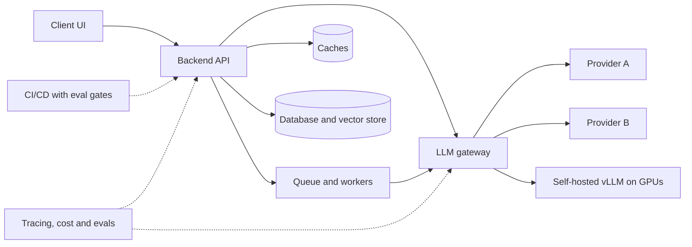

# 10. Deployment, LLMOps and Scaling

> **Estimated time:** 3-5 weeks
>
> **Prerequisites:** [03 LLM APIs and Application Building Blocks](03-llm-apis-and-structured-outputs.md), [05 Embeddings, Vector Search and RAG](05-embeddings-vector-search-and-rag.md), [06 Agents, Tool Use and MCP](06-agents-tools-and-mcp.md), [07 Evaluation, Observability and Testing](07-evaluation-observability-and-testing.md) and [08 Safety, Security and Responsible AI](08-safety-security-and-responsible-ai.md). [09 Open Models, Fine-Tuning and Local Inference](09-open-models-fine-tuning-and-local-inference.md) helps for the GPU-serving part.
>
> **Outcome:** You can take an LLM feature from a notebook to a production service that streams, survives provider failures, controls its own cost and latency, isolates tenants, ships through a gated pipeline and can be rolled back in minutes.

## Why this stage matters

A demo calls a model once on a good day. A product calls it thousands of times a day on a bad day: the provider rate-limits you, a user pastes a 200-page document, a retry loop quietly triples your bill, and a model you depend on gets retired. Much of an AI Engineer's work in a real company is not prompt wording; it is making the surrounding system fast, cheap, reliable, observable and safe to change. This section collects the operational craft usually called **LLMOps**: the same ideas as DevOps and MLOps, adapted to systems where the "model" is an external API or a GPU server you run, outputs are non-deterministic, and cost is metered per token. Nothing here is exotic, but every item is something teams learn painfully in production if nobody teaches it first.

## Topic map



| # | Topic | Core question it answers |
|---|-------|--------------------------|
| 1 | Reference architectures | What shape should this system have and where does state live? |
| 2 | Backends, streaming, queues, serverless | How do requests, streams and long jobs flow? |
| 3 | Front-ends and prototyping tools | How does the user see tokens, errors, citations and give feedback? |
| 4 | LLM gateways and proxies | How do I centralise keys, routing, budgets and fallbacks? |
| 5 | Caching layers | What can I reuse safely instead of recomputing? |
| 6 | Cost control (FinOps) | Where does the money go and how do I cap it? |
| 7 | Latency engineering | Why is it slow and what are the levers? |
| 8 | Reliability | What happens when things fail or models disappear? |
| 9 | Packaging and delivery | How do I build, test, configure and ship it? |
| 10 | Cloud AI platforms | When do Bedrock, Google's platform or Microsoft Foundry make sense? |
| 11 | Self-hosted GPU serving | How do I run open models at scale on Kubernetes? |
| 12 | Data pipelines | How do RAG indexes and fine-tuning datasets stay fresh and reproducible? |
| 13 | Versioning and releases | How do I change prompts, models and indexes safely? |
| 14 | Multi-tenancy, authorization, audit, privacy | How do I keep tenants and permissions separate? |
| 15 | Worked example | What does a production-scale pipeline look like end to end? |
| 16 | Production-readiness checklist | Am I actually ready to launch? |

---

## 1. Reference architectures for AI applications

Five shapes cover most products. Pick the simplest one that works and add complexity only when a measured problem demands it.

| Pattern | Shape | Typical use | Where the hard part is |
|---------|-------|-------------|------------------------|
| **Thin wrapper** | Client, your API, model API | Summarise, classify, rewrite, extract | Prompt quality, streaming, cost, abuse limits |
| **RAG service** | API, retriever (vector and keyword), reranker, model | Q&A over private documents | Index freshness, access control, citations, evals |
| **Agent service** | API, loop of model calls and tool calls, memory | Multi-step tasks with tools | Long runs, retries, side effects, runaway cost, safety |
| **Batch pipeline** | Scheduler, workers, object store or warehouse | Nightly classification, backfills, re-embedding | Throughput, checkpoints, batch endpoints, idempotency |
| **Event-driven processing** | Event (upload, webhook, message), queue, workers, result store, notification | Document intake, email triage, moderation | Ordering, duplicates, dead letters, backpressure |

Rules of thumb: start as a thin wrapper; add retrieval when the model needs private or fresh knowledge ([05](05-embeddings-vector-search-and-rag.md)); add an agent loop only when a fixed workflow cannot do the job ([06](06-agents-tools-and-mcp.md)); move work off the request path when it can take more than a few seconds or must survive restarts.

### Where state lives

Keep API processes **stateless** so you can add or kill instances freely. State then has explicit homes:

| State | Home | Notes |
|-------|------|-------|
| Users, tenants, conversations, job status, prompt and release versions | Relational database | The system of record; back it up |
| Uploaded files, raw and parsed documents, batch inputs and outputs | Object storage | Cheap, replayable, lets you re-process later |
| Embeddings and chunks | Vector store or Postgres with a vector extension | A **derived** asset: you must be able to rebuild it |
| Caches, rate-limit counters, short-lived sessions | Redis or similar | Assume it can vanish; never the only copy |
| In-flight work and retries | Queue or workflow engine | Gives durability and visibility |
| Provider-side conversation or file state | The provider | Treat as a convenience cache; keep your own copy so you can switch providers |

Chat APIs are stateless by default: every turn resends history, so long conversations cost more each turn. Plan for trimming, summarising or caching history from the start ([03](03-llm-apis-and-structured-outputs.md), [04](04-prompt-and-context-engineering.md)).

**Try it:** draw your current project as one of the five patterns and label every box "stateless" or name its state store. Any box you cannot label is a future outage.

---

## 2. Backends, streaming, queues and serverless

### 2.1 FastAPI and async I/O

LLM calls are I/O-bound and slow: a request spends seconds waiting on the network. **Async I/O** lets one worker process hold hundreds of in-flight requests because it switches to another request while one waits. That is why FastAPI (async-first) and Node/Next.js (event-loop based) are both natural fits.

- Create the provider client **once** (module level or application lifespan) and reuse its connection pool. Creating a client per request wastes TLS handshakes.
- Set explicit **timeouts** on every outbound call. The default of waiting a long time turns a provider hiccup into exhausted worker capacity.
- Never block the event loop. A synchronous SDK call, PDF parsing or local embedding inside an `async def` freezes every other request on that worker. Use the async client, `asyncio.to_thread`, a process pool or a separate worker.
- Run several worker processes (for example `uvicorn --workers N` or a process manager) and remember each has its own memory. Anything that must be global, like rate limits and caches, belongs in a shared store.

### 2.2 Node and Next.js

Choose Next.js (App Router route handlers) when your team is TypeScript-first and the UI is React: you get one codebase, easy streaming to the browser and first-class tooling such as the Vercel AI SDK (section 3). Choose Python when you need the ML ecosystem (rerankers, evaluation libraries, data tooling). A common production split is a Next.js front end plus a Python service for retrieval and heavy processing, joined by a typed API.

### 2.3 Streaming endpoints: SSE and WebSockets

Users judge latency by **time to first token**, so stream whenever the answer is longer than a sentence.

| | Server-Sent Events (SSE) | WebSockets |
|--|--------------------------|------------|
| Direction | Server to client over plain HTTP | Both directions |
| Strengths | Simple, proxy and CDN friendly, built-in reconnect and resume by event id | Low-latency two-way messages, binary frames |
| Weaknesses | One-way; browser `EventSource` is GET-only and cannot set headers (use `fetch` streaming for POST) | Sticky connections, harder to load-balance, authenticate and observe |
| Pick it for | Text chat, progress updates, most LLM UIs | Realtime voice, collaborative editing, interruptible live sessions ([11](11-multimodal-and-specialized-applications.md)) |

FastAPI has built-in SSE support through `EventSourceResponse` and `ServerSentEvent` (added in version 0.135.0, as of Oct 2026; it also sends keep-alive pings and the headers that stop proxy buffering). On older versions, return a `StreamingResponse` with media type `text/event-stream` and write the `data: ...` framing yourself.

```python
import os
from collections.abc import AsyncIterable

from fastapi import FastAPI
from fastapi.sse import EventSourceResponse, ServerSentEvent
from openai import AsyncOpenAI
from pydantic import BaseModel

# Any OpenAI-compatible endpoint works: a gateway, vLLM, or a provider.
client = AsyncOpenAI(
    base_url=os.environ["LLM_BASE_URL"],
    api_key=os.environ["LLM_API_KEY"],
    timeout=30.0,      # network timeout per request
    max_retries=2,     # SDK retries for connection errors, 429 and 5xx
)
MODEL = os.environ["LLM_MODEL"]  # pick a current model from your provider's docs

app = FastAPI()


class Prompt(BaseModel):
    text: str


@app.post("/chat/stream", response_class=EventSourceResponse)
async def stream_chat(prompt: Prompt) -> AsyncIterable[ServerSentEvent]:
    stream = await client.chat.completions.create(
        model=MODEL,
        messages=[{"role": "user", "content": prompt.text}],
        max_tokens=600,                      # always cap output length (see note below)
        stream=True,
        stream_options={"include_usage": True},
    )
    try:
        async for chunk in stream:
            if chunk.choices and chunk.choices[0].delta.content:
                # `data` is JSON-encoded on the wire, so clients JSON.parse each event.
                yield ServerSentEvent(data=chunk.choices[0].delta.content, event="token")
            if chunk.usage:                  # final chunk carries token counts
                yield ServerSentEvent(
                    data={"in": chunk.usage.prompt_tokens, "out": chunk.usage.completion_tokens},
                    event="usage",
                )
        yield ServerSentEvent(raw_data="[DONE]", event="done")
    finally:
        await stream.close()                 # also runs on client disconnect: stops upstream generation
```

OpenAI-compatible servers such as vLLM and most gateways accept `max_tokens`. OpenAI's own API deprecates it in favour of `max_completion_tokens` (and rejects `max_tokens` for its reasoning models), so check which parameter your endpoint expects.

Streaming pitfalls to design for:

- **Proxy buffering**: nginx, CDNs and some platforms buffer responses and ruin streaming. Disable buffering for the route and test through the real production path, not just localhost.
- **Idle timeouts**: load balancers close quiet connections. Send periodic pings or comments.
- **Client disconnects**: when the user closes the tab, cancel the upstream generation so you stop paying for tokens nobody reads. Persist whatever partial output you need.
- **Authentication**: browser `EventSource` cannot attach custom headers, so use cookies or short-lived tokens there; a `fetch` stream (needed for the POST endpoint above) can send an `Authorization` header.
- **Errors mid-stream**: the HTTP status is already 200 once bytes flow. Send an explicit `error` event and let the UI handle it.

**WebSockets in practice.** FastAPI exposes them through `@app.websocket(...)` handlers that `await websocket.accept()`, loop over received messages and catch `WebSocketDisconnect` ([FastAPI WebSockets guide](https://fastapi.tiangolo.com/advanced/websockets/)). Each connection lives on one instance, so a message that must reach a user connected elsewhere has to travel through a shared channel such as Redis pub/sub. Authenticate during the handshake or in the first message rather than putting long-lived tokens in the URL, because URLs end up in logs. Prefer SSE unless you truly need the client to send messages while the model is still talking.

### 2.4 Background jobs and queues

Move work off the request path when it takes longer than the user will wait, needs durable retries, or fans out into many calls. The usual shape is: `POST /jobs` returns `202` with a job id, a worker does the work, and the client polls `GET /jobs/{id}` or receives a push (SSE or webhook).

| Tool | Model | Pick it when |
|------|-------|--------------|
| [Celery](https://docs.celeryq.dev/en/stable/userguide/tasks.html) | Task queue with a broker (Redis or RabbitMQ) | You are in Python and need mature, flexible background tasks |
| [RQ](https://python-rq.org/) | Minimal Redis-backed Python queue | Small apps that want the simplest possible queue |
| [Temporal](https://docs.temporal.io/develop/python) | **Durable execution**: workflow code is replayed after crashes | Long-running, multi-step or human-in-the-loop agents that must not lose progress |
| [Inngest](https://www.inngest.com/docs) | Event-driven durable functions with steps | Serverless-friendly workflows triggered by events |
| Cloud queues (SQS, Pub/Sub, Service Bus) plus functions or containers | Managed queue, you write the consumer | You want managed infrastructure inside one cloud |

Delivery is almost always **at-least-once**, so a task can run twice. Design every task to be **idempotent**: derive a key from the input (for example document id plus content hash), check for an existing result first and write results atomically.

```python
import os

import redis
from celery import Celery

app = Celery(
    "worker",
    broker=os.environ["CELERY_BROKER_URL"],
    backend=os.environ["CELERY_RESULT_URL"],
)
app.conf.task_acks_late = True            # ack after the task finishes, not when it starts
app.conf.task_reject_on_worker_lost = True  # also redeliver if the worker process is killed (for example OOM)
app.conf.worker_prefetch_multiplier = 1   # long tasks: do not hoard messages

r = redis.Redis.from_url(os.environ["REDIS_URL"])


class TransientLLMError(Exception):
    """Raise for 429, 5xx and timeouts so Celery retries."""


def call_llm_summary(doc_id: str) -> str:
    raise NotImplementedError  # your gateway call goes here


@app.task(
    bind=True,
    autoretry_for=(TransientLLMError,),
    retry_backoff=True,        # exponential: 1s, 2s, 4s ... as the upper bound of each delay
    retry_backoff_max=300,
    retry_jitter=True,         # randomises each delay so retries do not arrive in lockstep
    max_retries=5,
    soft_time_limit=240,
    time_limit=300,
)
def summarize_document(self, doc_id: str, content_hash: str) -> str:
    key = f"summary:{doc_id}:{content_hash}"
    cached = r.get(key)
    if cached is not None:                 # redelivered task becomes a cheap no-op
        return cached.decode()
    result = call_llm_summary(doc_id)
    r.set(key, result, ex=7 * 24 * 3600)
    return result
```

With Temporal the retry and timeout policy moves into the workflow definition (Python: `@workflow.defn` classes call `workflow.execute_activity(..., start_to_close_timeout=..., retry_policy=RetryPolicy(initial_interval=..., backoff_coefficient=..., maximum_interval=..., maximum_attempts=...))`), and the engine persists progress between steps. A crash in step four of a ten-step agent run resumes at step four instead of restarting, which is exactly what multi-minute agent runs and human approval steps need ([Python guide](https://docs.temporal.io/develop/python)). Keep workflow code deterministic and put every LLM or network call inside an activity.

Also plan for **poison messages** (a job that always fails): cap retries, move it to a dead-letter queue and alert a human. A task that keeps killing its own worker (for example by running out of memory) is redelivered again and again when `task_reject_on_worker_lost` is enabled, which is why that setting must be paired with idempotent tasks and alerts. Make sure a queue's visibility timeout is longer than your slowest task, or the broker will hand the same job to a second worker.

### 2.5 Serverless trade-offs

Serverless functions (Vercel Functions, AWS Lambda, Cloud Functions) are attractive for the API layer: no servers to patch, scale to zero, pay per use. The trade-offs matter more for AI than for typical CRUD apps:

- **Timeouts**. Long generations and agent loops hit the cap. As an example of the order of magnitude (as of Oct 2026), Vercel's default maximum with Fluid compute is 300 seconds, up to 800 seconds on Pro and Enterprise, with an extended 30-minute beta; check the [Vercel duration docs](https://vercel.com/docs/functions/configuring-functions/duration) and your own platform's current limits before designing around a number.
- **Cold starts** add latency to the first request, which hurts the metric users feel most.
- **Connections**: persistent WebSockets and long idle streams are awkward or limited; confirm platform support.
- **Concurrency and cost**: you pay for time spent waiting on a slow model. Billing models that charge only for active CPU (offered by some platforms) help; verify yours.
- **Bundle size and native dependencies**: heavy ML libraries often do not fit.

A solid pattern: serverless for the thin, streaming front door; queues or a workflow engine (Temporal, Inngest, a platform workflow product) for anything long; container platforms (Cloud Run, Fargate, Azure Container Apps) when you need longer requests, real per-instance concurrency or WebSockets without the function limits.

**Try it:** add a `POST /jobs` endpoint to your FastAPI app that enqueues the Celery task above and returns a job id; kill the worker mid-task and prove the job completes after restart without duplicating its output.

---

## 3. Front-ends and prototyping tools

### 3.1 Prototyping tools

| Tool | Model | Good for | Limits |
|------|-------|----------|--------|
| [Streamlit](https://docs.streamlit.io/develop/api-reference/write-magic/st.write_stream) | Python script reruns on each interaction; chat elements and `st.write_stream` | Internal demos, data apps, stakeholder prototypes | Rerun model complicates state; limited customisation and auth |
| [Gradio](https://www.gradio.app/docs/gradio/chatinterface) | `ChatInterface(fn)` where `fn` yields partial text | Fast model demos, easy sharing, evaluation UIs | Same: prototype-grade UI |
| [Chainlit](https://docs.chainlit.io/) | Chat-first Python framework with steps and elements | Chat apps with visible reasoning/tool steps | The original team stepped back in May 2025 and it is community-maintained (as of Oct 2026); check activity before betting a product on it |

```python
import os

import streamlit as st
from openai import OpenAI

client = OpenAI(base_url=os.environ["LLM_BASE_URL"], api_key=os.environ["LLM_API_KEY"])
MODEL = os.environ["LLM_MODEL"]


def tokens(stream):
    for chunk in stream:
        if chunk.choices and chunk.choices[0].delta.content:
            yield chunk.choices[0].delta.content


st.title("Docs assistant")
if "messages" not in st.session_state:
    st.session_state.messages = []

for m in st.session_state.messages:
    with st.chat_message(m["role"]):
        st.markdown(m["content"])

if prompt := st.chat_input("Ask a question"):
    st.session_state.messages.append({"role": "user", "content": prompt})
    with st.chat_message("user"):
        st.markdown(prompt)
    with st.chat_message("assistant"):
        stream = client.chat.completions.create(
            model=MODEL, messages=st.session_state.messages, stream=True
        )
        reply = st.write_stream(tokens(stream))   # renders live, returns full text
    st.session_state.messages.append({"role": "assistant", "content": reply})
```

Prototyping tools are for learning what users want. Graduate to a real front end when you need authentication, multi-user state, custom design or scale.

### 3.2 Production front-ends

A React or Next.js client with the [Vercel AI SDK](https://ai-sdk.dev/docs/getting-started/nextjs-app-router) gives you streaming chat state (`useChat`), message "parts" (text, tool calls, sources) and a streaming protocol between route handler and browser. A minimal route handler following the current getting-started guide looks like this (AI SDK helper names have changed between major versions, so copy from the current guide rather than from older blog posts):

```ts
// app/api/chat/route.ts
import {
  streamText,
  UIMessage,
  convertToModelMessages,
  createUIMessageStreamResponse,
  toUIMessageStream,
} from 'ai';

export const maxDuration = 60; // seconds; must fit your platform's limits

export async function POST(req: Request) {
  const { messages }: { messages: UIMessage[] } = await req.json();

  const result = streamText({
    // A "provider/model" string resolved by the SDK's default gateway or your own;
    // read it from config and choose a current model from the provider docs.
    model: process.env.LLM_MODEL!,
    messages: await convertToModelMessages(messages),
  });

  return createUIMessageStreamResponse({
    stream: toUIMessageStream({ stream: result.stream }),
  });
}
```

You can also skip SDKs and read a `fetch` response body stream directly; the protocol is just SSE or newline-delimited JSON. Use the SDK when you want tool-call rendering and chat state for free, and plain `fetch` when you want fewer dependencies.

### 3.3 UX that makes AI features trustworthy

- **Streaming UX**: render incrementally, handle half-finished Markdown and code fences, keep the view pinned to the bottom only while the user has not scrolled up, and provide a **Stop** button. Show progress for slow steps ("Searching 3 sources...").
- **Loading, empty and error states**: distinguish a network failure, a rate limit ("try again in a few seconds"), a timeout, a refusal and a partial answer. Offer **Retry** that preserves the user's input. Never show raw stack traces or provider error text.
- **Citations**: show numbered markers that open the exact source passage (title, page, anchor) and verify in code that every cited id was actually retrieved ([05](05-embeddings-vector-search-and-rag.md)). Citations are only trustworthy if the link goes to the supporting text.
- **Feedback buttons**: thumbs up or down plus an optional reason, stored with the trace id and release bundle id (section 13) so each rating can be traced to the exact prompt, model and retrieved documents. Feed negative cases into your eval set ([07](07-evaluation-observability-and-testing.md)).
- **Honesty and control**: label AI output, allow copy and regenerate, and make streaming text accessible (for example an `aria-live="polite"` region).

**Try it:** put the Streamlit script above in front of your FastAPI stream (call your endpoint instead of the provider), then add a thumbs-down button that writes `{trace_id, rating, reason}` to a table.

---

## 4. LLM gateways and proxies

An **LLM gateway** is a service or library between your application and model providers that exposes one API (usually OpenAI-compatible) and adds cross-cutting features. Reasons to use one: switch models by editing config, keep provider keys out of application code, enforce budgets and rate limits centrally, get uniform logging and cost data, and apply fallbacks and caching everywhere. Costs: one more network hop, one more component to run highly available, a place where all prompts and PII flow (security review it), and possible lag in supporting brand-new provider features.

| Gateway | What it is | Notes |
|---------|-----------|-------|
| [LiteLLM](https://docs.litellm.ai/docs/) | Open-source Python SDK and self-hosted proxy | Virtual keys, budgets, routing and fallbacks, spend tracking |
| [Portkey](https://portkey.ai/docs) | Gateway plus observability and guardrail features | Open-source gateway plus a managed product; its docs now show Palo Alto Networks branding (Prisma AIRS AI Gateway), so confirm current packaging and terms (as of Oct 2026) |
| [Cloudflare AI Gateway](https://developers.cloudflare.com/ai-gateway/) | Managed proxy | Caching, rate limiting, retries and fallback, analytics, logging |
| [OpenRouter](https://openrouter.ai/docs/guides/routing/model-fallbacks) | Hosted router with one key for many models | `models` array for fallback; billed at the model actually used |
| [Helicone](https://www.helicone.ai/) | Observability and gateway | Announced it joined Mintlify; verify product status before adopting (as of Oct 2026) |

Cloud platforms and SDKs also ship gateway-like features (section 10; the Vercel AI SDK can resolve `provider/model` strings through a hosted gateway). Start with a small internal `llm_client.py` module that wraps retries, timeouts and logging behind an OpenAI-compatible interface; adopt a gateway when several apps, providers or budget owners appear.

A minimal LiteLLM proxy config: apps call the **alias** (`chat-default`), so swapping the model behind it is a config change, not a deploy.

```yaml
model_list:
  - model_name: chat-default
    litellm_params:
      model: anthropic/<current-model-id>        # choose from the provider's docs
      api_key: os.environ/ANTHROPIC_API_KEY
  - model_name: chat-backup
    litellm_params:
      model: openai/<current-model-id>
      api_key: os.environ/OPENAI_API_KEY

litellm_settings:
  num_retries: 2
  request_timeout: 60
  fallbacks: [{"chat-default": ["chat-backup"]}]   # tried in order after retries fail

general_settings:
  master_key: os.environ/LITELLM_MASTER_KEY
# Virtual keys and spend tracking need a Postgres database: provide its connection string
# through the DATABASE_URL environment variable (from your secret manager), not in this file.
```

Issue each app, team or tenant its own **virtual key** with limits, so a leaked or runaway key can be capped or revoked without touching real provider credentials:

```bash
curl 'http://localhost:4000/key/generate' \
  --header "Authorization: Bearer $LITELLM_MASTER_KEY" \
  --header 'Content-Type: application/json' \
  --data-raw '{"models": ["chat-default"], "max_budget": 50, "budget_duration": "30d", "rpm_limit": 600, "metadata": {"team": "support-bot"}}'
```

Gateway design guidance:

- **Routing**: simple fallback lists first; add latency- or cost-aware routing only when you can measure it. Keep prompt behaviour in mind: a fallback model needs to be evaluated on your test set, not assumed equivalent ([07](07-evaluation-observability-and-testing.md)).
- **Budgets**: use soft alerts before hard cut-offs, and decide what happens at the limit (error, or route to a cheaper model).
- **Key management**: one virtual key per app and environment, short rotation cycles, real provider keys only in the gateway's secret store.
- **Caching at the gateway** is exact-match only; scope it per tenant (section 5).
- **Test pass-through**: new provider parameters, caching controls and structured-output options may not pass through every gateway the day they ship.

---

## 5. Caching layers

Caching is often the cheapest optimisation available and an easy one to get dangerously wrong. There are four layers, with different safety profiles.

### 5.1 Provider prompt caching

Providers can reuse the processed **prefix** of a prompt across calls, cutting input cost and time to first token for repeated content such as long system prompts, tool definitions, documents and conversation history. The prefix must match exactly, so order content from most stable to least stable: tools, system instructions, examples and reference documents, conversation history, then the new user message.

- Anthropic: automatic or explicit `cache_control` breakpoints, a short default lifetime with an optional longer one, model-dependent minimum lengths, and usage fields `cache_creation_input_tokens` and `cache_read_input_tokens` ([docs](https://platform.claude.com/docs/en/build-with-claude/prompt-caching)).
- OpenAI: automatic prefix caching with no opt-in, an optional `prompt_cache_key` to improve routing, and `cached_tokens` in the usage details ([docs](https://developers.openai.com/api/docs/guides/prompt-caching)).
- Google Gemini: implicit caching on by default for newer models, plus an explicit caching API ([docs](https://ai.google.dev/gemini-api/docs/caching)).

Details such as minimum lengths, lifetimes and discounts differ by provider and change often (as of Oct 2026); read the current docs and **verify hits from the usage fields**, because a prompt that is too short or has a changing prefix silently does not cache.

```python
import os

import anthropic

client = anthropic.Anthropic()  # reads ANTHROPIC_API_KEY from the environment
MODEL = os.environ["LLM_MODEL"]  # choose a current model from the provider docs

with open("system_prompt.md", encoding="utf-8") as f:
    STATIC_INSTRUCTIONS = f.read()   # long, identical on every request

def ask(question: str):
    resp = client.messages.create(
        model=MODEL,
        max_tokens=500,
        system=[{
            "type": "text",
            "text": STATIC_INSTRUCTIONS,
            "cache_control": {"type": "ephemeral"},   # breakpoint after the stable part
        }],
        messages=[{"role": "user", "content": question}],
    )
    u = resp.usage
    print("written:", u.cache_creation_input_tokens, "read:", u.cache_read_input_tokens, "uncached:", u.input_tokens)
    return resp
```

Anything volatile in the prefix (a timestamp, a user id, a randomly ordered list of tools) breaks the match. Put volatile data at the end.

### 5.2 Response (exact-match) caching

Store the final answer keyed by a hash of everything that influenced it. Good for repeated, non-personalised requests (FAQ answers, classifications, translations of the same text).

```python
import hashlib
import json
import os

import redis.asyncio as redis

r = redis.from_url(os.environ["REDIS_URL"])


def cache_key(*, tenant: str, model: str, prompt_version: str,
              index_version: str, messages: list[dict], params: dict) -> str:
    payload = json.dumps(
        {"t": tenant, "m": model, "p": prompt_version, "i": index_version,
         "msgs": messages, "params": params},
        sort_keys=True, separators=(",", ":"),
    )
    return "llm:" + hashlib.sha256(payload.encode("utf-8")).hexdigest()


async def cached_call(call, *, ttl: int = 3600, **key_parts):
    key = cache_key(**key_parts)
    hit = await r.get(key)
    if hit is not None:
        return json.loads(hit)
    result = await call()           # must return JSON-serialisable data
    await r.set(key, json.dumps(result), ex=ttl)
    return result
```

### 5.3 Semantic caching

A **semantic cache** embeds the incoming question and returns a stored answer when a previous question is close enough in vector space. It saves more calls than exact matching, but "similar" is not "same": "refund for order 123" and "refund for order 124" embed almost identically yet need different answers. Reduce risk by using a high similarity threshold, scoping entries by tenant, permissions, prompt version and corpus version, caching only questions without user-specific data, optionally verifying a hit with a cheap check, and sampling hits to measure how often they were wrong. Some gateways and Redis tooling offer semantic caching ([Redis AI docs](https://redis.io/docs/latest/develop/ai/)); evaluate false-hit rate before turning it on.

### 5.4 Embedding and retrieval caches

Embedding the same text twice is pure waste. Key an **embedding cache** by `hash(text) + embedding model + dimensions`; it makes re-ingestion and re-embedding jobs much cheaper (section 12). Retrieval results and tool outputs can be cached briefly too, if staleness is acceptable.

### 5.5 Invalidation hazards

- **Version everything in the key**: model, prompt version, retrieval index version, tool and schema versions, locale. Changing any of them must miss the cache.
- **Stale knowledge**: when a document changes, answers derived from it must expire. Use short TTLs for knowledge answers or purge by document id on update.
- **Permission leaks**: a cached answer generated from documents User A may read must never serve User B. Include the ACL scope in the key or do not cache personalised answers (section 14).
- **Stampedes**: a popular key expiring causes many identical expensive calls; coalesce concurrent misses so only one request recomputes.
- **Do not cache failures**, refusals or truncated outputs (`finish_reason` of `length`).
- **Privacy**: caches contain prompts and answers. Apply retention limits, encryption and access control like any data store.

**Try it:** run the Anthropic or OpenAI snippet twice with a static prefix of several thousand tokens (minimum cacheable lengths vary by model), confirm the second call reports cache reads, then add a timestamp to the start of the prefix and watch the hit disappear.

---

## 6. Cost control (FinOps for LLMs)

Spend per request is roughly: `(fresh input tokens x input price + cached input tokens x cache price + output tokens x output price)`, multiplied by the number of calls, retries and loop iterations behind one user action. Agents and multi-step chains multiply the base cost, which is why cost needs the same engineering attention as latency. Do not hard-code prices in code; keep them in a config you update from provider pricing pages.

1. **Measure first.** Emit one structured cost record per model call with tenant, feature, model, prompt version, tokens (including cached) and trace id.
2. **Token budgeting.** Give each prompt component a budget: system prompt, retrieved context, history and output. Retrieve fewer, better chunks (reranking), trim or summarise history, compress verbose tool results and avoid resending content the model does not need.
3. **Output length control.** Output tokens are typically priced higher than input tokens (check your provider) and dominate decoding latency. Set `max_tokens` per endpoint, ask for concise or structured formats, use stop sequences and cap reasoning effort or thinking budgets on models that bill reasoning tokens.
4. **Model cascades and routing.** Send easy requests to a small model and escalate on low confidence or validation failure, or route by task type. The research on this idea is worth reading: [FrugalGPT](https://arxiv.org/abs/2305.05176) and [RouteLLM](https://arxiv.org/abs/2406.18665). Always measure with your evals ([07](07-evaluation-observability-and-testing.md)), and track the escalation rate: escalations cost more than going straight to the large model.
5. **Batch endpoints.** For work no human is waiting on (evals, backfills, nightly classification, re-embedding), asynchronous batch APIs are cheaper. As of Oct 2026, OpenAI's [Batch API](https://developers.openai.com/api/docs/guides/batch) takes JSONL files, completes within 24 hours and is documented at a 50% discount; Anthropic's [Message Batches API](https://platform.claude.com/docs/en/build-with-claude/batch-processing) is also discounted by 50%, most batches finish within an hour and unfinished requests expire after 24 hours. Results are matched by `custom_id`.
6. **Caching** from section 5, especially prompt caching for long shared prefixes.
7. **Per-tenant quotas and caps.** Enforce daily or monthly token or dollar limits per tenant and plan, rate limits per user, a per-run budget and iteration cap for agents, and a global kill switch. Runaway loops and retry storms are a classic cause of a surprise invoice.
8. **Cost attribution and dashboards.** Tag every call; build dashboards for cost per request and per successful task, p95 tokens per request, cache hit rate, cascade escalation rate, top tenants and daily burn with alerts.
9. **Forecasting.** Unit cost x expected volume x growth, then scenario-test: a feature that adds agent steps, a model switch, a price change. Compare API cost with self-hosting only after estimating realistic GPU utilisation (section 11).

```python
import json
import os
import time
from dataclasses import dataclass

# Price table you maintain, USD per million tokens, e.g.
# {"<model-id>": {"in": 0.0, "cached_in": 0.0, "out": 0.0}}
PRICES = json.loads(os.environ["LLM_PRICE_TABLE_JSON"])


@dataclass
class Usage:
    input_tokens: int            # normalised: ALL input tokens including cached ones
    output_tokens: int
    cached_input_tokens: int = 0 # subset of input_tokens served from a prompt cache


# Normalise provider differences before this point: OpenAI-style usage reports cached tokens
# as a subset of input tokens, while Anthropic reports cache reads and writes separately.


def cost_usd(model: str, u: Usage) -> float:
    p = PRICES[model]
    fresh = u.input_tokens - u.cached_input_tokens
    return (fresh * p["in"] + u.cached_input_tokens * p["cached_in"] + u.output_tokens * p["out"]) / 1_000_000


def log_cost(*, tenant: str, feature: str, model: str, prompt_version: str, trace_id: str, u: Usage) -> float:
    cost = cost_usd(model, u)
    print(json.dumps({                       # ship to your log pipeline
        "ts": time.time(), "tenant": tenant, "feature": feature, "model": model,
        "prompt_version": prompt_version, "trace_id": trace_id,
        "in": u.input_tokens, "cached": u.cached_input_tokens, "out": u.output_tokens,
        "usd": round(cost, 6),
    }))
    return cost


async def within_daily_quota(redis_client, tenant: str, cost: float, limit_usd: float) -> bool:
    key = f"spend:{tenant}:{time.strftime('%Y%m%d', time.gmtime())}"
    total = float(await redis_client.incrbyfloat(key, cost))
    await redis_client.expire(key, 2 * 24 * 3600)
    return total <= limit_usd
```

Charging after the call lets one request overshoot. For hard caps, **reserve** an estimated maximum cost before the call (input tokens plus `max_tokens`), then refund the difference afterwards.

**Try it:** wrap your gateway call with `log_cost`, run 100 requests, and answer: which feature, tenant and prompt version costs the most per successful task?

---

## 7. Latency engineering

Total latency is the sum of network, queueing, **time to first token** (prefill, which grows with input length), decoding (inter-token time multiplied by output tokens), plus retrieval, tool calls and post-processing. Instrument each stage and watch p50, p95 and p99; averages hide the pain.

| Lever | Why it works | Watch out for |
|-------|--------------|---------------|
| **Streaming** | Cuts perceived latency to time-to-first-token | Proxy buffering (section 2.3) |
| **Parallelism** | Run independent retrievals, tool calls and guardrail checks concurrently (`asyncio.gather`) | Cancel work when one branch fails; rate limits |
| **Fewer sequential LLM calls** | Each hop adds full latency | Merging steps may reduce quality; test it |
| **Smaller or faster models** for simple steps | Faster decoding, lower cost | Needs routing and evals |
| **Shorter prompts** | Less prefill; prompt caching reduces it further | Do not cut needed context |
| **Shorter outputs** | Decoding dominates long answers | Quality of terse answers |
| **Speculative decoding** | A small draft model proposes tokens that the large model verifies in one pass, cutting decode time without changing the target model's output distribution | Mostly an engine or provider feature; you choose it when self-hosting ([paper](https://arxiv.org/abs/2211.17192)) |
| **Regional endpoints** | Put compute near users and near your data | Capacity and residency differ by region (sections 10 and 14) |
| **Avoiding cold starts** | Minimum warm instances, pre-pulled images, weights on fast volumes, pre-warming prompt caches | Warm capacity costs money |
| **Connection reuse** | HTTP keep-alive and a shared client avoid handshakes | One client per process, not per request |

Define latency budgets per feature (for example "first token within X seconds at p95") and allocate them across stages. Where a tail matters, **hedging** (sending a duplicate request after the p95 delay and using whichever finishes first) trades extra cost for a lower p99; use it sparingly. Some providers offer faster or priority service tiers for a premium; check availability rather than assuming.

**Try it:** record time-to-first-token and total time for 50 requests at three prompt lengths. Plot both against input tokens; you will see which part is prefill-bound and which is decode-bound.

---

## 8. Reliability

Classify failures first, because each class needs a different response:

| Failure | Examples | Response |
|---------|----------|----------|
| Transient | 429, 5xx, connection reset, timeout | Retry with backoff and jitter |
| Capacity or overload | Provider overloaded, quota exhausted | Fall back, queue, shed load |
| Caller error | 400 invalid request, context too long | Do **not** retry; fix or truncate |
| Quality failure | Invalid JSON, truncated output, refusal | Validate and re-ask once or fall back; log |
| Outage | Whole provider or region down | Provider fallback, degraded mode, kill switch |
| Change | Model retired, parameter rejected | Deprecation process (below) |

Core practices:

- **Timeouts at two levels**: per request and an overall deadline for the user action.
- **Retries with exponential backoff and jitter**, honouring `Retry-After`, with a small attempt cap. Prefer a **retry budget** (for example retries may be only a fraction of traffic) so a provider incident does not become a retry storm that makes it worse.
- **Circuit breakers**: after repeated failures, stop calling a target for a cooldown and use the fallback directly.
- **Fallbacks across providers or regions**: the same model family on another platform is the safest; a different model needs its own eval pass. Keep prompts that are tuned for one model from silently degrading on another.
- **Degraded modes**: serve cached answers, return retrieval results without generation, use a smaller model, or accept the request and finish asynchronously.
- **Rate limits**: know your tier's requests-per-minute and tokens-per-minute, keep client-side token buckets, give interactive traffic priority over batch, and send background work through batch endpoints to preserve interactive capacity. Add per-tenant fairness so one noisy customer cannot starve others.
- **Idempotent jobs and tools**: use idempotency keys for anything with side effects (sending email, creating tickets) because retries and replays will happen.
- **Synthetic probes**: run a few canary prompts continuously against production to detect outages and quality regressions before users do.

```python
import asyncio
import random

import openai

RETRYABLE = (
    openai.RateLimitError,
    openai.APIConnectionError,
    openai.APITimeoutError,
    openai.InternalServerError,
    asyncio.TimeoutError,
)


async def call_with_fallback(targets, messages, *, attempts_per_target=2, deadline_s=45.0):
    """targets: list of (async_client, model_alias). Tries each in order within one deadline.

    Build these clients with max_retries=0 so the SDK's built-in retries do not multiply
    with the loop below (SDK retries x attempts x targets adds up quickly).
    """
    loop = asyncio.get_running_loop()
    deadline = loop.time() + deadline_s
    last_exc = None
    for client, model in targets:
        for attempt in range(attempts_per_target):
            remaining = deadline - loop.time()
            if remaining <= 0:
                raise TimeoutError("overall deadline exceeded") from last_exc
            try:
                return await asyncio.wait_for(
                    client.chat.completions.create(model=model, messages=messages, max_tokens=500),
                    timeout=remaining,
                )
            except openai.BadRequestError:
                raise                                   # our fault: never retry or fall back
            except RETRYABLE as exc:
                last_exc = exc
                resp = getattr(exc, "response", None)
                retry_after = resp.headers.get("retry-after") if resp is not None else None
                # Assumes Retry-After in seconds; the header may also be an HTTP date.
                delay = float(retry_after) if retry_after else min(8.0, 0.5 * 2 ** attempt)
                delay *= random.uniform(0.5, 1.5)       # jitter
                await asyncio.sleep(min(delay, max(0.0, deadline - loop.time())))
    raise RuntimeError("all targets failed") from last_exc
```

**Load shedding** protects the system when demand exceeds capacity: cap in-flight requests, wait briefly, then fail fast with `503` and a `Retry-After` header instead of letting queues grow until everything times out. The [Google SRE book](https://sre.google/sre-book/table-of-contents/) has chapters on handling overload and cascading failures that apply directly.

```python
import asyncio
import os
from contextlib import asynccontextmanager

from fastapi import HTTPException

LIMIT = asyncio.Semaphore(int(os.environ.get("MAX_INFLIGHT", "32")))


@asynccontextmanager
async def admission():
    try:
        await asyncio.wait_for(LIMIT.acquire(), timeout=0.5)
    except asyncio.TimeoutError:
        raise HTTPException(status_code=503, detail="busy", headers={"Retry-After": "5"})
    try:
        yield
    finally:
        LIMIT.release()

# Usage inside a route handler:
#   async with admission():
#       ...call the model...
```

### Handling model deprecations and provider changes

Models are retired on a schedule, and platforms differ. Anthropic, for example, describes lifecycle states of active, legacy, deprecated and retired, promises at least 60 days' notice before retiring publicly released models (as of Oct 2026) and notes that Bedrock and Google Cloud keep their own retirement dates ([deprecations page](https://platform.claude.com/docs/en/about-claude/model-deprecations)). Parameters change too: some newer models reject sampling parameters that older ones accepted. A sound process:

1. Keep a **model registry** in config: alias, provider model id, owner, retirement date, evaluated-on date.
2. Prefer explicit pinned model versions for behaviour you depend on, and calendar their retirement dates; floating aliases move under you.
3. Subscribe to provider deprecation notices and audit usage by model.
4. When a retirement is announced: run your eval suite against the replacement, shadow it, canary it, switch the alias, remove the old entry (section 13).

**Try it:** point your client at a fake provider that returns 429 half the time and a 500 for 30 seconds. Verify retries, fallback and the circuit breaker, and that the user sees a clean message instead of an error dump.

---

## 9. Packaging and delivery

### 9.1 Docker

Containers give reproducible deployments from laptop to cluster. Good defaults for AI services ([Docker best practices](https://docs.docker.com/build/building/best-practices/)): small pinned base image, pinned dependencies from a lock file, non-root user, multi-stage builds to keep images small (smaller images start and autoscale faster), no secrets baked into layers, a health endpoint, and handling `SIGTERM` so in-flight streams finish before shutdown.

```dockerfile
# In real projects pin the base image more tightly than a minor tag (patch version or digest).
# Keep the Python tag in step with your .python-version and uv.lock.
FROM python:3.13-slim
# Replace <pinned-version> with a released uv version (or an image digest); "latest" drifts.
COPY --from=ghcr.io/astral-sh/uv:<pinned-version> /uv /uvx /bin/
ENV PYTHONUNBUFFERED=1 PYTHONDONTWRITEBYTECODE=1 UV_NO_DEV=1
WORKDIR /app
RUN useradd --create-home appuser

# 1) Dependencies first, so Docker can cache this layer until the lock file changes
COPY pyproject.toml uv.lock ./
RUN uv sync --locked --no-install-project

# 2) Then the source code, which changes much more often
COPY src ./src

ENV PATH="/app/.venv/bin:$PATH"
USER appuser
EXPOSE 8000
CMD ["uvicorn", "src.main:app", "--host", "0.0.0.0", "--port", "8000"]
```

This is the uv pattern from section 13 of [01](01-prerequisites-and-dev-foundations.md), including its pinned images and non-root user, adapted to serve an app. The service runs straight from `src/`, so the project itself is not installed as a package (`--no-install-project`); if yours is packaged, add a second `uv sync --locked` after copying the source, as in 01. Add a `.dockerignore` (`.git`, `.venv`, `.env`, data) so the build context stays small and free of secrets. If your project still uses `requirements.txt`, replace the uv image line and the `uv sync` step with `COPY requirements.txt ./` and `RUN pip install --no-cache-dir -r requirements.txt`, and keep the Python tag matched to the version you test with.

### 9.2 CI/CD with eval gates

A normal pipeline checks that code works. An LLM pipeline must also check that **behaviour** did not regress, because a prompt, model or retrieval change can break quality without touching a line of code. Typical stages:

1. Lint, type-check and unit tests with the model mocked.
2. **Offline evals** on a golden dataset ([07](07-evaluation-observability-and-testing.md)): a small sample on every pull request, the full set nightly.
3. **Gate**: fail the build if quality metrics drop below baseline by more than a tolerance, or if cost or latency exceed ceilings.
4. Build and scan the image, deploy to staging, run smoke tests with canary prompts.
5. Promote to production gradually (section 13).

Trigger evals on changes to prompts, model aliases, retrieval settings and tool schemas, not only on source code (use path filters). Account for non-determinism with tolerances, repeated runs or confidence margins, and use dedicated keys with spend caps for CI. Repository secrets are not passed to workflows triggered by pull requests from forks, so decide up front how outside contributors get their changes evaluated (for example a maintainer-triggered run) instead of loosening the workflow trigger.

```yaml
name: ci
on:
  pull_request:
jobs:
  test-and-eval:
    runs-on: ubuntu-latest
    steps:
      - uses: actions/checkout@v7          # use current major versions (or pin to a commit SHA)
      - uses: astral-sh/setup-uv@v9.0.0    # full version tag as of Oct 2026; pin to a commit SHA in real projects
      - run: uv python install             # installs the version in .python-version (keep the Dockerfile tag in step)
      - run: uv sync --locked              # recreate the exact locked environment (section 13 of 01)
      - run: uv run pytest -q tests/unit
      - name: Offline evals on the golden set
        run: uv run python evals/run_evals.py --out evals/results.json
        env:
          LLM_BASE_URL: ${{ secrets.EVAL_LLM_BASE_URL }}
          LLM_API_KEY: ${{ secrets.EVAL_LLM_API_KEY }}
          LLM_MODEL: ${{ vars.EVAL_LLM_MODEL }}
      - name: Eval gate
        run: uv run python evals/gate.py evals/results.json evals/baseline.json
```

```python
# evals/gate.py: exit non-zero when the candidate is worse than the baseline.
import json
import sys


def load(path: str) -> dict:
    with open(path, encoding="utf-8") as f:
        return json.load(f)


def main(results_path: str, baseline_path: str, max_drop: float = 0.02) -> int:
    new, base = load(results_path)["metrics"], load(baseline_path)
    failures = []
    for name, ref in base["metrics"].items():                # higher is better
        if new.get(name) is None or new[name] < ref - max_drop:
            failures.append(f"{name}: {new.get(name)} vs baseline {ref}")
    for name, ceiling in base.get("ceilings", {}).items():   # lower is better: cost, p95 latency
        if new.get(name) is None or new[name] > ceiling:
            failures.append(f"{name}: {new.get(name)} exceeds ceiling {ceiling}")
    for line in ["EVAL GATE FAILED", *failures] if failures else ["eval gate passed"]:
        print(line)
    return 1 if failures else 0


if __name__ == "__main__":
    sys.exit(main(sys.argv[1], sys.argv[2]))
```

### 9.3 Infrastructure as code

Define queues, buckets, databases, GPU node pools, IAM roles and secrets in code ([Terraform docs](https://developer.hashicorp.com/terraform/docs); OpenTofu, Pulumi and cloud-native CDKs fill the same role). Review infrastructure changes in pull requests, keep separate state per environment, detect drift, and avoid hand-edited production. IaC is also how you reproduce a GPU cluster when someone asks "can we rebuild this in another region?"

### 9.4 Kubernetes basics for AI workloads

If you use Kubernetes (managed container services are simpler and often enough), the [Kubernetes basics tutorial](https://kubernetes.io/docs/tutorials/kubernetes-basics/) covers the core vocabulary (clusters, Pods, Deployments, Services, scaling and rolling updates); learn Ingress, ConfigMaps and Secrets from the wider Kubernetes docs next. AI-specific points:

- **Stateless API pods** scale on CPU or requests. **GPU pods** are different: they are expensive, slow to start (large images and model weights) and need custom scaling signals (section 11).
- Request GPUs with `nvidia.com/gpu` limits, isolate GPU node pools with taints and tolerations, and install the GPU driver stack (the [NVIDIA GPU Operator](https://docs.nvidia.com/datacenter/cloud-native/gpu-operator/latest/index.html) automates it).
- Readiness probes should pass only after the model is loaded, which can take minutes. Use PodDisruptionBudgets and generous termination grace periods.
- Cache weights on a persistent volume rather than downloading them at every start.
- Package manifests with Helm or Kustomize ([Helm docs](https://helm.sh/docs/)) and use one namespace or cluster per environment.

### 9.5 Configuration and secrets

Follow [twelve-factor](https://12factor.net/) principles: configuration lives in the environment, not in code. Separate **config** (model alias, prompt version, thresholds, flags) from **secrets** (API keys, database passwords). Store secrets in a secret manager (cloud services or Vault) and sync them into Kubernetes with an operator such as [External Secrets](https://external-secrets.io/). Prefer short-lived credentials via workload identity or IAM roles over static keys, rotate keys, never log secrets, keep `.env` files for local development only and scan commits for leaked keys. Give each environment its own provider keys with spend caps.

### 9.6 Environments: dev, staging, prod

- **Dev**: mocked or small models, a local server such as vLLM or Ollama ([09](09-open-models-fine-tuning-and-local-inference.md)), synthetic data.
- **Staging**: production-equivalent configuration and models, eval gate, anonymised or synthetic data, load tests and canary prompts.
- **Prod**: separate provider projects, budgets and alerts. Do not copy production personal data into lower environments.
- Promote the same artifact (image plus release bundle, section 13) through environments instead of rebuilding.

**Try it:** break a prompt on purpose (remove the instruction that makes the model cite sources) and confirm your CI eval gate fails the pull request.

---

## 10. Cloud AI platforms

The three big clouds each sell managed access to models plus surrounding infrastructure. Product names move quickly, so check the current documentation.

| Platform | What it offers | Naming notes (as of Oct 2026) |
|----------|----------------|-------------------------------|
| **AWS**: [Amazon Bedrock](https://docs.aws.amazon.com/bedrock/) and [Amazon SageMaker AI](https://docs.aws.amazon.com/sagemaker/) | Bedrock: managed access to many model families through one runtime endpoint (including the Converse API), cross-Region inference profiles, plus features such as guardrails, knowledge bases and batch inference. SageMaker AI: build, train and host your own models on managed endpoints | Bedrock offers geographic and global [cross-Region inference profiles](https://docs.aws.amazon.com/bedrock/latest/userguide/cross-region-inference.html), which affects where requests are processed and therefore data residency |
| **Google Cloud**: [Gemini Enterprise Agent Platform](https://docs.cloud.google.com/gemini-enterprise-agent-platform/overview) | Access to Google and third-party models, endpoints for serving custom models, training and pipeline tooling, and tools for building and deploying agents | The platform formerly known as Vertex AI; API paths, SDK packages and `gcloud` commands still use `aiplatform`/Vertex names ([name changes](https://docs.cloud.google.com/gemini-enterprise-agent-platform/vertex-ai-name-changes)) |
| **Microsoft**: [Microsoft Foundry](https://learn.microsoft.com/en-us/azure/foundry/how-to/develop/sdk-overview) | Model catalog including OpenAI models, project endpoints and SDKs, agents, enterprise identity and networking | Formerly branded Azure AI Foundry; older tutorials and SDK names may still use the earlier branding |

**They make sense when** you already run on that cloud and want one identity system, private networking, existing compliance attestations, regional controls and consolidated billing; when procurement prefers an existing contract; or when you need committed throughput for steady, high volume. **They make less sense when** you want the newest model features the day they ship (platform releases can lag), want maximum portability, or are a small team for whom the direct provider API is the simplest path.

Practical guidance:

- Keep prompts, evals and the model **alias** layer portable so moving between direct API, gateway and cloud platform is a config change. Behaviour, quotas, model ids and retirement dates can differ between the direct API and the same model on a cloud platform; re-run evals on the exact deployment you use.
- Request quota increases early and understand cross-Region inference trade-offs: more capacity and throughput versus where your data is processed (section 14).
- For self-hosted weights you can use SageMaker or equivalent managed endpoints instead of running Kubernetes yourself; you trade flexibility for less operational work.

---

## 11. Self-hosted GPU serving

Self-hosting open-weight models ([09](09-open-models-fine-tuning-and-local-inference.md)) makes sense for data that cannot leave your environment, high and steady volume that keeps GPUs busy, custom or fine-tuned models, or strict latency and locality needs. It does not make sense by default: idle GPUs cost money, and you take on scaling, upgrades and on-call. Compare costs only with realistic **utilisation**, which is the dominant variable.

### 11.1 Serving engines

- [vLLM](https://docs.vllm.ai/en/latest/): high-throughput engine with **PagedAttention** ([paper](https://arxiv.org/abs/2309.06180)), continuous batching, prefix caching, an OpenAI-compatible server and tensor parallelism. `vllm serve <model>` starts a server on port 8000 ([quickstart](https://docs.vllm.ai/en/latest/getting_started/quickstart/)); point the OpenAI SDK at `http://<host>:8000/v1`.
- [SGLang](https://docs.sglang.io/) is another popular engine with similar goals.
- [Text Generation Inference (TGI)](https://huggingface.co/docs/text-generation-inference/index) is in maintenance mode, and Hugging Face recommends vLLM and SGLang for new deployments (as of Oct 2026).

### 11.2 Batching and KV cache memory

**Continuous batching** lets new requests join a running batch at token granularity, keeping the GPU busy; larger batches raise throughput but also per-request latency, so tune against your latency target (`--max-num-seqs`, `--max-num-batched-tokens` and chunked prefill are the usual knobs; see the [engine arguments](https://docs.vllm.ai/en/latest/configuration/engine_args/)).

Memory is the real constraint. GPU memory holds the model weights plus the **KV cache**, the stored attention keys and values for every token of every active request. Concurrency is roughly the KV cache capacity divided by tokens per request, which is why long contexts reduce how many users one GPU can serve. Quantisation shrinks weights and frees space for cache ([09](09-open-models-fine-tuning-and-local-inference.md)); prefix caching reuses shared prompts.

```python
def kv_bytes_per_token(layers: int, kv_heads: int, head_dim: int, dtype_bytes: int = 2) -> int:
    return 2 * layers * kv_heads * head_dim * dtype_bytes   # 2 = keys and values


def kv_capacity_tokens(gpu_gb: float, util: float, weights_gb: float, overhead_gb: float, per_token: int) -> int:
    free_gb = gpu_gb * util - weights_gb - overhead_gb
    return int(free_gb * 1e9 // per_token)


# Hypothetical 8B-parameter model with grouped-query attention, 16-bit KV cache, 80 GB GPU.
per_token = kv_bytes_per_token(layers=32, kv_heads=8, head_dim=128)       # 131072 bytes = 128 KiB
capacity = kv_capacity_tokens(80, 0.90, weights_gb=16, overhead_gb=4, per_token=per_token)
print(per_token, capacity, capacity // 8192)   # about 396,728 tokens, roughly 48 conversations of 8k tokens
```

The numbers are illustrative; read the real layer, KV-head and head-size values from your model's config. Cap `--max-model-len` to what your product really needs, because the engine must be able to hold at least one sequence of that length.

### 11.3 Multi-GPU basics

- **Tensor parallelism** splits each layer across GPUs (`--tensor-parallel-size`); best within one node with fast interconnect.
- **Pipeline parallelism** splits layers into stages (`--pipeline-parallel-size`), useful across nodes.
- **Data parallelism** is simply more replicas; this is how you scale throughput.
- Use the smallest parallelism that fits the model plus a healthy KV cache, then scale out with replicas.

### 11.4 Kubernetes deployment and autoscaling

```yaml
apiVersion: apps/v1
kind: Deployment
metadata:
  name: vllm-chat
spec:
  replicas: 1
  selector:
    matchLabels: {app: vllm-chat}
  template:
    metadata:
      labels: {app: vllm-chat}
    spec:
      terminationGracePeriodSeconds: 120
      containers:
        - name: vllm
          image: vllm/vllm-openai:<pinned-tag>          # pin; do not use latest
          command: ["/bin/sh", "-c"]
          args:
            - vllm serve <org/model-name> --max-model-len 16384 --gpu-memory-utilization 0.90 --tensor-parallel-size 1
          env:
            - name: HF_TOKEN
              valueFrom:
                secretKeyRef: {name: hf-token-secret, key: token}
          ports:
            - containerPort: 8000
          resources:
            limits:
              nvidia.com/gpu: "1"
          startupProbe:                                  # loading weights can take minutes
            httpGet: {path: /health, port: 8000}
            periodSeconds: 10
            failureThreshold: 60
          readinessProbe:
            httpGet: {path: /health, port: 8000}
            periodSeconds: 10
          volumeMounts:
            - {name: shm, mountPath: /dev/shm}
            - {name: hf-cache, mountPath: /root/.cache/huggingface}
      volumes:
        - name: shm
          emptyDir: {medium: Memory, sizeLimit: 2Gi}
        - name: hf-cache
          persistentVolumeClaim: {claimName: hf-cache}
---
apiVersion: keda.sh/v1alpha1
kind: ScaledObject
metadata:
  name: vllm-chat
spec:
  scaleTargetRef:
    name: vllm-chat
  minReplicaCount: 1
  maxReplicaCount: 4
  pollingInterval: 15
  cooldownPeriod: 300                 # scale down slowly: cold starts are expensive
  triggers:
    - type: prometheus
      metadata:
        serverAddress: http://prometheus.monitoring.svc:9090
        query: sum(vllm:num_requests_waiting)
        threshold: "5"
```

(The Deployment mirrors the shape in the [vLLM Kubernetes guide](https://docs.vllm.ai/en/latest/deployment/k8s/); adjust shared-memory size, probes and flags to your model and version.)

**Autoscaling signals.** CPU usage is the wrong signal for GPU inference. Scale on **queue depth** (requests waiting), concurrency (requests running), KV cache usage or a time-to-first-token SLO breach. GPU utilisation alone is weak because a GPU can look "busy" long before it is saturated. vLLM exposes these as Prometheus metrics at `/metrics`, for example `vllm:num_requests_waiting`, `vllm:num_requests_running`, `vllm:kv_cache_usage_perc` and latency histograms ([metrics docs](https://docs.vllm.ai/en/latest/usage/metrics/)); metric names have changed between versions, so check the docs for the version you pin. The [vLLM production-stack](https://github.com/vllm-project/production-stack) project integrates KEDA autoscaling through its Helm chart ([guide](https://docs.vllm.ai/projects/production-stack/en/latest/use_cases/autoscaling-keda.html)). Remember that new replicas need minutes to pull the image and load weights, so keep headroom, scale down gradually and rarely scale large models to zero.

**Routing and platforms.** Plain round-robin ignores that requests differ wildly in length and that replicas hold different prefix caches. Newer tooling is model-aware:

- [Gateway API Inference Extension](https://gateway-api-inference-extension.sigs.k8s.io/): a Kubernetes project with an `InferencePool` and an endpoint picker that routes by model server metrics.
- [llm-d](https://llm-d.ai/): a Kubernetes-native distributed inference stack (a CNCF sandbox project as of Oct 2026) that runs engines such as vLLM and SGLang, with prefix-cache-aware routing and prefill/decode disaggregation.
- [KServe](https://kserve.github.io/website/docs/model-serving/generative-inference/autoscaling): a Kubernetes model-serving platform with generative inference support and autoscaling options, including KEDA.
- [Ray Serve](https://docs.ray.io/en/latest/serve/llm/index.html): Python-first serving with an OpenAI-compatible LLM API (`ray.serve.llm`) on vLLM and other engine backends; attractive if you already use Ray for data or training.

**Capacity planning.** Load test with realistic distributions of prompt and output lengths (tools such as k6 or Locust), find the throughput one replica sustains at your latency SLO, then size replicas as peak load divided by that figure plus headroom. Watch time to first token, inter-token latency, queue depth, KV cache usage and GPU memory (the NVIDIA DCGM exporter provides GPU metrics).

**Try it:** serve a small model with `vllm serve`, call it with the OpenAI SDK, then run a load test and plot `vllm:num_requests_waiting` as you increase concurrency. Find the knee where queueing starts.

---

## 12. Data pipelines for RAG and fine-tuning

RAG quality is bounded by what is in the index and how fresh it is, so ingestion is data engineering, not a one-off script. Typical stages: **extract** from sources (drives, wikis, databases, web) then **parse and clean** (OCR for scans, see [11](11-multimodal-and-specialized-applications.md)), **chunk**, **enrich** with metadata (tenant, ACLs, source URL, version, timestamps), **embed**, **upsert**, **verify** (counts, sample retrieval tests) and **publish**.

**ETL versus ELT.** ETL transforms before loading; ELT lands raw data first and transforms later. For AI pipelines prefer ELT-style layers: keep raw files, parsed text and chunks as separate stored layers so you can re-chunk or re-embed without re-fetching sources.

**Incremental ingestion.** Re-processing everything on every run is slow and expensive. Detect changes with content hashes, ETags, modified-since filters or change-data-capture; use stable ids so upserts are idempotent; and handle **deletions**, including documents whose permissions were removed, because an answer citing a deleted or restricted document is a bug. Rate-limit calls to source systems and embedding APIs, send bad documents to a dead-letter store, and use batch embedding for large backfills (section 6).

```python
import hashlib


def content_hash(text: str) -> str:
    return hashlib.sha256(text.encode("utf-8")).hexdigest()


def plan_sync(source_docs: dict[str, str], indexed: dict[str, str]) -> dict[str, list[str]]:
    """source_docs: doc_id -> text. indexed: doc_id -> content hash stored in the index."""
    to_upsert = [d for d, text in source_docs.items() if indexed.get(d) != content_hash(text)]
    to_delete = [d for d in indexed if d not in source_docs]
    return {"upsert": to_upsert, "delete": to_delete}


def index_name(embed_model: str, dims: int, chunker_version: str, build_date: str) -> str:
    """Versioned index names make re-embedding a blue/green switch, not an in-place edit."""
    safe = embed_model.replace("/", "_")
    return f"docs__{safe}__{dims}d__chunk-{chunker_version}__{build_date}"
```

**Orchestrators.** Use one when pipelines have dependencies, schedules, backfills and monitoring needs. [Airflow](https://airflow.apache.org/docs/) is a long-established, widely used task scheduler; [Dagster](https://dagster.io/docs) models pipelines as data assets with lineage and partitions, which maps naturally to "the index is a derived asset"; [Prefect](https://docs.prefect.io/) is Python-native with flexible, dynamic flows. For event-driven, long-running or per-document workflows, a durable-execution engine such as Temporal (section 2.4) fits better. Cron plus a queue is fine early; pick whatever your team already operates.

**Re-embedding jobs.** Embeddings from different models are not comparable, so never mix them in one index. Triggers for a rebuild: a new embedding model, a new chunking strategy, a dimension change, or a metadata schema change. Process: build a new index alongside the old one, backfill (cheaply, with batch endpoints and the embedding cache), evaluate retrieval on your golden queries ([05](05-embeddings-vector-search-and-rag.md), [07](07-evaluation-observability-and-testing.md)), switch an alias, keep the old index through a rollback window, then delete it. Estimate cost beforehand: total tokens times embedding price.

**Vector index lifecycle.** Create (metric, index type and parameters), populate, warm up, serve, monitor (recall on test queries, latency, size, staleness), compact or rebuild (heavy deletion fragments indexes), snapshot and **test restores**, upgrade, retire. Store `embedding_model`, `chunker_version` and `source_version` with each record so mismatches are detectable.

**Fine-tuning data pipelines.** Collect examples from reviewed production traces (with consent and privacy handling, [08](08-safety-security-and-responsible-ai.md)), filter and deduplicate, scrub personal data, split train and eval without leakage, and version datasets with content hashes and lineage (which source and prompt produced each row). Tools such as [DVC](https://doc.dvc.org/) or dataset repositories with revisions help; freeze evaluation sets so runs stay comparable ([09](09-open-models-fine-tuning-and-local-inference.md)).

**Try it:** change one document, delete another and run `plan_sync`; then implement the upsert and delete against your vector store and prove a deleted document can no longer be retrieved.

---

## 13. Versioning and release management

An LLM application's behaviour is determined by more than code. Version each moving part:

| Artifact | How to version | Notes |
|----------|----------------|-------|
| Prompts and templates | Git or a prompt registry; semantic versions ([04](04-prompt-and-context-engineering.md)) | Include model parameters with the prompt |
| Models | Pinned provider model id; fine-tune checkpoint or adapter id | Record retirement dates (section 8) |
| Datasets | Content hash plus revision | Both eval and training sets |
| Indexes | Embedding model plus chunker plus corpus snapshot | Versioned names and aliases (section 12) |
| Tools and schemas | Version tool definitions and output schemas | They are API contracts |
| Config | Thresholds, routing rules | Same review process as code |

Combine them into a **release bundle**: one manifest that is the unit you evaluate, deploy, canary and roll back. Stamp every trace and cost record with its bundle id.

```yaml
bundle: support-bot-2026-10-06.3
prompt: support_answer@v12
model_alias: chat-default          # resolved by the gateway to a pinned model
index: docs__<embed-model>__1024d__chunk-v4__20261001
tools_schema: v3
guardrails: v2
eval_run: evals/2026-10-06/run-8841
```

Delivery tactics:

- **Feature flags** decouple deploy from release and provide kill switches ([OpenFeature](https://openfeature.dev/) is a vendor-neutral standard API for flags).
- **Canary releases** send a small, deterministic share of users or tenants to the candidate and watch errors, latency, cost, thumbs-down rate and sampled quality scores before widening ([Argo Rollouts](https://argoproj.github.io/rollouts/) does progressive traffic shifting on Kubernetes).
- **Shadow deploys** send a copy of real traffic to the candidate without returning its output, so you can compare offline. Make tools read-only or no-op in shadow mode, expect extra cost and handle personal data carefully.
- **A/B tests** need enough traffic and a metric you trust; beware novelty effects.
- **Rollbacks** should be a flag or alias flip, not a rebuild. Keep the previous bundle warm and keep data formats backward compatible (index schema, conversation state; use expand-then-contract database migrations).

```python
import asyncio
import hashlib

_BACKGROUND: set[asyncio.Task] = set()


def bucket(subject_id: str, flag: str) -> float:
    """Stable value in [0, 1): the same user always lands in the same group."""
    digest = hashlib.sha256(f"{flag}:{subject_id}".encode("utf-8")).digest()
    return int.from_bytes(digest[:8], "big") / 2**64


async def _shadow(run_candidate, question: str) -> None:
    try:
        await run_candidate(question)       # log the output for offline comparison; never return it
    except Exception as exc:                # shadow failures must not affect users
        print("shadow failed:", exc)


async def answer(user_id: str, question: str, run_stable, run_candidate,
                 canary_pct: float = 5.0, shadow: bool = True):
    use_candidate = bucket(user_id, "rag-v2") < canary_pct / 100
    if use_candidate:
        return await run_candidate(question)
    if shadow:
        task = asyncio.create_task(_shadow(run_candidate, question))
        _BACKGROUND.add(task)               # keep a reference so the task is not garbage collected
        task.add_done_callback(_BACKGROUND.discard)
    return await run_stable(question)
```

**Try it:** write a bundle manifest for your project, store its id in every log line, then roll forward to a new prompt version via flag and roll back with one change.

---

## 14. Multi-tenancy, authorization, audit logging and privacy

*Awareness-level guidance; this is not legal advice. Involve security and legal professionals for regulated data.* See [08](08-safety-security-and-responsible-ai.md) for threats such as prompt injection and for compliance background.

### 14.1 Tenancy models

| Model | Isolation | Cost and ops | Use when |
|-------|-----------|--------------|----------|
| **Pooled** (shared tables, `tenant_id` column) | Logical | Cheapest, simplest to run | Many small tenants; strong enforcement in code and database |
| **Bridge** (schema or collection per tenant) | Stronger | Moderate | Mid-size tenants with different needs |
| **Silo** (database, index or cluster per tenant) | Strongest | Most expensive | Regulated or very large customers, data residency promises |

### 14.2 Authorization in RAG

The core rule: **retrieval must be restricted to what the requesting user may see, enforced before text reaches the model.** The model cannot be trusted to withhold information it has been given.

- Ingest ACL metadata (owner, groups, roles) with every chunk and keep it in sync with the source system; a permission change that never reaches the index is a leak.
- **Filter inside the query** (pre-filtering), not after fetching the top-k results. Post-filtering is risky (one bug leaks content) and wasteful (it can leave you with few or no results). Check how your vector store behaves with filters: for example, pgvector's approximate indexes apply a `WHERE` condition after the index scan, so a restrictive filter can return fewer than `k` rows unless you use its iterative index scans, an exact scan, or partitioning ([pgvector filtering notes](https://github.com/pgvector/pgvector#filtering)).
- Use the end user's identity, not a broad service account. For agents, run tools with delegated, least-privilege credentials ([06](06-agents-tools-and-mcp.md)).
- Add a database-level safety net such as **row-level security**. In PostgreSQL ([docs](https://www.postgresql.org/docs/current/ddl-rowsecurity.html)), several permissive policies combine with OR, so put tenant and ACL checks in one policy, and note table owners bypass policies unless forced.

```sql
ALTER TABLE chunks ENABLE ROW LEVEL SECURITY;
ALTER TABLE chunks FORCE ROW LEVEL SECURITY;   -- apply to the owner too; superusers and BYPASSRLS roles still bypass

CREATE POLICY chunk_access ON chunks FOR SELECT
USING (
  tenant_id = current_setting('app.tenant_id')::uuid
  AND acl_groups && string_to_array(current_setting('app.groups'), ',')
);
```

```python
async def retrieve(conn, tenant_id: str, groups: list[str], query_vec: list[float], k: int = 8):
    """psycopg 3 async connection; the app role must not own the table or bypass RLS."""
    async with conn.transaction():
        await conn.execute(
            "SELECT set_config('app.tenant_id', %s, true), set_config('app.groups', %s, true)",
            (tenant_id, ",".join(groups)),
        )
        cur = await conn.execute(
            "SELECT id, text FROM chunks ORDER BY embedding <=> %s::vector LIMIT %s",
            (str(query_vec), k),
        )
        return await cur.fetchall()
```

Add **cross-tenant leak tests** to CI: seed two tenants with distinctive documents, query as each, and assert zero overlap in retrieved ids, cached answers and logs.

### 14.3 Audit logging

Record who did what, with enough detail to investigate and prove it, without creating a new privacy problem. Log: actor (user, tenant, service), request id and trace id, release bundle id, model and provider, tools called and their arguments' identifiers, ids of documents retrieved (not their content), guardrail decisions and outcome, timestamp and source. Store audit logs separately from application logs, append-only or write-once where possible, with retention rules and access controls, and audit access to the logs themselves. Redact or avoid raw prompts unless you have a reason and a retention limit.

### 14.4 Privacy and data residency

- **Minimise**: send the model only the fields it needs; redact personal data before the call when practical.
- **Provider terms**: understand retention, training-use policy and available zero-data-retention options in your contract and settings; keep a record of sub-processors.
- **Deletion**: erasure requests must reach vector stores, caches, logs, derived indexes and fine-tuning datasets. Keep the mapping document to chunks to vectors so deletion is possible.
- **Residency**: map where inference runs, where prompts and responses are logged, where indexes live and where observability vendors store traces. Region-pinned endpoints, geographic (rather than global) cross-Region inference profiles, and self-hosting are the usual tools; verify each provider's current options.
- **Encrypt** in transit and at rest and restrict who can read production prompts.

---

## 15. Worked example: a production-scale pipeline

The repository's [multilingual PDF processing blueprint](../multilingual-pdf-processor-blueprint.md) is a long design for an event-driven, queue-backed document pipeline with OCR services and autoscaling. Rather than repeating it, use it as a case study and read it with this section's lenses:

| Concept in this section | Where to look in the blueprint |
|-------------------------|--------------------------------|
| Choosing an architecture pattern (event-driven, microservices, serverless hybrid) | [2.2 Architectural Pattern Selection](../multilingual-pdf-processor-blueprint.md#22-architectural-pattern-selection) and [2.3 Proposed Architecture](../multilingual-pdf-processor-blueprint.md#23-proposed-architecture) |
| OCR and parsing services as separate workers | [3.2 Processing Engine](../multilingual-pdf-processor-blueprint.md#32-processing-engine) |
| Self-hosted versus API models | [3.3.2 Self-Hosted vs. API-Based Deployment](../multilingual-pdf-processor-blueprint.md#332-self-hosted-vs-api-based-deployment) |
| Bottlenecks and rate limits | [4.1 Bottleneck Analysis](../multilingual-pdf-processor-blueprint.md#41-bottleneck-analysis) |
| Horizontal scaling and autoscaling | [4.2 Scaling Strategies](../multilingual-pdf-processor-blueprint.md#42-scaling-strategies) |
| Queues and asynchronous processing | [4.2.2 Asynchronous Processing Strategy](../multilingual-pdf-processor-blueprint.md#422-asynchronous-processing-strategy) |
| Capacity, cost and economics | [4.3 Resource Planning](../multilingual-pdf-processor-blueprint.md#43-resource-planning) |

Its technology choices are one possible stack; treat them as options to evaluate. Exercise: annotate the blueprint's workflow with answers to the questions from this section. Where does state live at each step? Which steps are idempotent, and what is the idempotency key? What are the timeouts, retry policy and dead-letter path? Which calls go through a gateway, and which are cacheable? What cost record would each step emit? How would you version and canary a new OCR or translation model? How are tenants and document permissions enforced?

---

## 16. Pre-launch production-readiness checklist

**Architecture and state**
- [ ] API processes are stateless; every piece of state has a named home and backup plan
- [ ] Long work runs through a queue or workflow engine with idempotent tasks and a dead-letter path
- [ ] Streaming works through the real production proxy, CDN and load balancer, including client disconnects

**Reliability**
- [ ] Timeouts, bounded retries with jitter, circuit breakers and a tested provider fallback
- [ ] Load shedding and concurrency limits protect the service and any GPU servers
- [ ] A degraded mode and a user-friendly error experience exist and were tried
- [ ] Model registry with retirement dates; replacement eval and migration plan ready

**Cost and latency**
- [ ] `max_tokens`, per-tenant quotas, per-run agent budgets and a global kill switch are in place
- [ ] Cost is recorded per request and attributed by tenant, feature and release bundle; alerts on daily burn
- [ ] Latency SLOs (time to first token and total) are defined, measured and load-tested
- [ ] Prompt caching hit rate verified; cache keys include model, prompt, index and permission scope

**Quality and change management**
- [ ] CI eval gate blocks regressions; golden set covers known failure cases
- [ ] Release bundle manifest, feature flag, canary plan and a rehearsed rollback
- [ ] Production sampling or online evals and user feedback are wired to traces ([07](07-evaluation-observability-and-testing.md))

**Security, privacy and compliance awareness**
- [ ] Secrets in a secret manager; no keys in code, images or logs; per-environment keys with spend caps
- [ ] Authorization enforced at retrieval and in tools; cross-tenant leak tests pass
- [ ] Prompt-injection and guardrail review completed ([08](08-safety-security-and-responsible-ai.md))
- [ ] Audit logging, retention policy, deletion path and data-residency decisions documented
- [ ] Provider data terms and sub-processors reviewed with the appropriate people

**Operations**
- [ ] Dashboards and alerts for errors, latency, queue depth, cost and cache hit rate
- [ ] Runbooks for provider outage, quota exhaustion, runaway cost and bad release; on-call owner named
- [ ] Backups and a tested restore for databases and vector indexes
- [ ] Staged rollout plan (internal, small percentage, full) with explicit go and no-go criteria

---

## Tools and libraries at a glance

| Tool | What it is for | Pick it when |
|------|----------------|--------------|
| FastAPI | Async Python API with built-in SSE support | Python backend with streaming endpoints |
| Next.js with Vercel AI SDK | TypeScript full-stack app, streaming chat UI | React front end, TypeScript team |
| Streamlit, Gradio | Quick Python UIs for demos | Prototypes and internal tools |
| Chainlit | Chat-first Python UI framework | Chat prototypes; check maintenance status first |
| Celery, RQ | Python background task queues | Simple async jobs with Redis or RabbitMQ |
| Temporal, Inngest | Durable workflow execution | Long-running agents and multi-step pipelines |
| LiteLLM | Open-source gateway and SDK | Self-hosted routing, virtual keys, budgets |
| Portkey, Cloudflare AI Gateway, OpenRouter, Helicone | Hosted or managed gateways and observability | You prefer managed routing, caching and analytics (verify current status) |
| Redis | Caches, counters, queues | Response caches, rate limits, quotas |
| Docker, GitHub Actions | Packaging and CI/CD | Every project; add eval gates |
| Terraform (or OpenTofu, Pulumi) | Infrastructure as code | Reproducible cloud environments |
| Kubernetes, Helm, KEDA | Orchestration, packaging, event-driven autoscaling | Self-hosted GPU serving, multi-service platforms |
| Amazon Bedrock/SageMaker, Gemini Enterprise Agent Platform, Microsoft Foundry | Managed model access and hosting | You are committed to that cloud's identity, network and compliance stack |
| vLLM, SGLang | High-throughput open-model engines | Self-hosting open-weight models |
| TGI | Hugging Face serving toolkit | Existing deployments only (maintenance mode) |
| KServe, Ray Serve, llm-d | Kubernetes or Ray serving platforms | Multi-model serving, model-aware routing |
| Airflow, Dagster, Prefect | Data pipeline orchestration | Scheduled ingestion, re-embedding, dataset builds |
| OpenFeature, Argo Rollouts | Feature flags, progressive delivery | Canaries, kill switches, safe rollouts |
| PostgreSQL row-level security | Database-enforced tenant isolation | Pooled multi-tenant data |
| OpenTelemetry and tracing platforms (see [07](07-evaluation-observability-and-testing.md)) | Traces, cost and latency telemetry | Always; link spans to release bundles |

## Common pitfalls

- **Blocking the event loop** with synchronous SDK calls or CPU work. Fix: async clients, `asyncio.to_thread` or worker processes.
- **No timeouts or unbounded retries**, causing pile-ups and retry storms. Fix: per-call and overall deadlines, capped retries with jitter, a retry budget and circuit breakers.
- **Streaming that works locally but not in production** because a proxy buffers or an idle timeout closes the stream. Fix: test through the real path, disable buffering, send keep-alive pings.
- **Non-idempotent tasks** that duplicate emails, tickets or charges on redelivery. Fix: idempotency keys and check-then-write results.
- **Cache keys missing a version or a permission scope**, serving stale or leaked answers. Fix: include model, prompt, index and ACL scope; purge on document change.
- **Assuming prompt caching works** without checking. Fix: put stable content first and verify cache-read fields in usage.
- **No per-request cost data**, so the first signal is the invoice. Fix: cost records, tenant quotas, agent iteration caps and burn alerts.
- **Untested fallbacks**: the backup model behaves differently or has a different limit. Fix: eval it, game-day the failover, record the results.
- **Pinned models with no retirement tracking.** Fix: a registry with dates, alerts and a standing migration playbook.
- **Autoscaling GPU pods on CPU or raw GPU utilisation.** Fix: scale on queue depth, concurrency or KV cache usage with slow scale-down.
- **Post-filtering retrieval for permissions.** Fix: filter inside the query, add row-level security and run leak tests.
- **Mixing embedding models in one index** or editing an index in place. Fix: versioned indexes, alias switch, rollback window.
- **Shipping prompt changes outside the pipeline.** Fix: treat prompts, models and indexes as versioned release artifacts behind eval gates.
- **Copying production data into dev and staging.** Fix: synthetic or anonymised data and separate keys per environment.

## Hands-on projects

### Starter: Streaming chat service with a gateway and cost log

- **Goal:** a small streaming chat API you can operate, observe and cost-account.
- **Suggested stack:** FastAPI (SSE), Streamlit or a minimal web page, LiteLLM proxy with two models, Redis, Docker Compose.
- **Acceptance criteria:**
  - Tokens stream to the UI and the Stop button cancels upstream generation.
  - Apps use a gateway alias; disabling the primary model makes requests succeed via the fallback.
  - Every request writes a cost record with tenant, model, tokens and trace id.
  - An exact-match cache serves repeated requests and shows its hit rate.
  - `docker compose up` starts everything; secrets come from environment variables only.

### Intermediate: Async document service with tenant isolation and a CI eval gate

- **Goal:** upload documents, ingest them incrementally and answer questions with citations, safely for several tenants.
- **Suggested stack:** FastAPI, Celery or Temporal, object storage, Postgres with pgvector and row-level security, an orchestrator or cron job, GitHub Actions.
- **Acceptance criteria:**
  - Re-delivering the same ingestion task produces no duplicate chunks (idempotency test).
  - Changed documents are re-embedded; deleted documents disappear from retrieval within one sync.
  - Cross-tenant and cross-group leak tests pass in CI.
  - A pull request that degrades a golden-set metric fails the eval gate.
  - A feature flag canaries a new prompt version to a small share of users, with a one-step rollback.
  - Dashboards show p95 time to first token, cost per answered question and queue depth.

### Advanced: Self-hosted vLLM on Kubernetes with autoscaling, routing and re-embedding

- **Goal:** a hybrid system serving an open model on GPUs with a hosted-API fallback, scaled by queue depth.
- **Suggested stack:** vLLM on a managed Kubernetes cluster with a GPU node pool (budget cloud costs and tear down after testing), Prometheus, KEDA, a gateway in front, k6 or Locust, an orchestrator for a blue/green re-embedding job.
- **Acceptance criteria:**
  - A load test shows the sustained requests per replica at your latency target, and replicas scale out and in on `vllm:num_requests_waiting` without failed requests during a rolling update.
  - Killing the GPU backend makes the gateway fail over to the hosted API within your timeout.
  - A written cost comparison of self-hosting versus API at three utilisation levels, with assumptions stated.
  - A blue/green re-embedding finishes, passes retrieval evals, switches by alias and can be rolled back.
  - A runbook covers provider outage, GPU node loss and a model retirement.

## Self-check

- [ ] I can choose between a thin wrapper, RAG service, agent service, batch pipeline and event-driven design, and say where state lives in each
- [ ] I can build an async streaming endpoint with SSE and handle proxy buffering, errors mid-stream and client disconnects
- [ ] I can move long work to a queue or workflow engine and make tasks idempotent
- [ ] I can explain when serverless limits (timeouts, cold starts, connections) rule it out
- [ ] I can configure a gateway with aliases, fallbacks, per-key budgets and virtual keys
- [ ] I can structure prompts for provider prompt caching, verify hits from usage fields and name the invalidation hazards of response and semantic caches
- [ ] I can instrument per-request cost, apply per-tenant quotas and apply at least four cost levers
- [ ] I can break latency into prefill, decode and tool time and apply the matching fix
- [ ] I can implement retries with jitter, deadlines, fallbacks and load shedding, and explain why each exists
- [ ] I can write a Dockerfile and a CI pipeline with an eval gate that blocks a regression
- [ ] I can explain when Bedrock, Google's platform or Microsoft Foundry is a good fit and how to limit lock-in
- [ ] I can estimate KV cache capacity and choose autoscaling signals for a vLLM deployment
- [ ] I can design an incremental ingestion and blue/green re-embedding pipeline
- [ ] I can bundle prompt, model, index and tools into a release, canary it, shadow it and roll it back
- [ ] I can enforce document-level access control inside retrieval and test for cross-tenant leaks

## Resources

### Official docs
- [FastAPI: Server-Sent Events](https://fastapi.tiangolo.com/tutorial/server-sent-events/): built-in SSE support, event fields and resume behaviour.
- [Vercel AI SDK: Next.js App Router guide](https://ai-sdk.dev/docs/getting-started/nextjs-app-router): streaming route handler and `useChat` client.
- [LiteLLM virtual keys and budgets](https://docs.litellm.ai/docs/proxy/virtual_keys): per-key limits, models and budget windows on the proxy.
- [Anthropic prompt caching](https://platform.claude.com/docs/en/build-with-claude/prompt-caching): breakpoints, lifetimes, usage fields, invalidation rules.
- [OpenAI prompt caching](https://developers.openai.com/api/docs/guides/prompt-caching): automatic prefix caching, cache keys and cached-token usage.
- [vLLM documentation](https://docs.vllm.ai/en/latest/): engine features, server arguments, metrics and deployment guides.
- [vLLM production-stack autoscaling with KEDA](https://docs.vllm.ai/projects/production-stack/en/latest/use_cases/autoscaling-keda.html): Kubernetes autoscaling on vLLM metrics.
- [Temporal Python guide](https://docs.temporal.io/develop/python): workflows, activities, retries and timeouts.

### Free courses
- [Docker: Get started](https://docs.docker.com/get-started/): images, containers and Compose from scratch.
- [Kubernetes Basics tutorial](https://kubernetes.io/docs/tutorials/kubernetes-basics/): interactive introduction to deploying and scaling apps.
- [Made With ML](https://madewithml.com/): free course on taking ML applications from development to production.
- [DeepLearning.AI courses](https://www.deeplearning.ai/courses/): catalogue to browse for LLMOps, caching and serving topics; availability and pricing change.

### Reading and papers
- [Efficient Memory Management for Large Language Model Serving with PagedAttention](https://arxiv.org/abs/2309.06180): the idea behind vLLM's KV cache management.
- [Fast Inference from Transformers via Speculative Decoding](https://arxiv.org/abs/2211.17192): how draft-and-verify decoding cuts latency.
- [FrugalGPT](https://arxiv.org/abs/2305.05176): cascades and routing for cost reduction.

---

Previous: [09. Open Models, Fine-Tuning and Local Inference](09-open-models-fine-tuning-and-local-inference.md) | Index: [AI Engineer Roadmap](README.md) | Next: [11. Multimodal and Specialized Applications](11-multimodal-and-specialized-applications.md)
