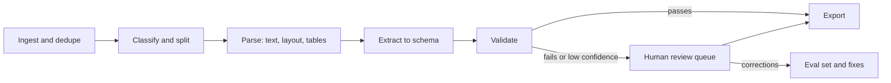

# 11. Multimodal and Specialized Applications

> - **Estimated time:** 3-5 weeks (choose your track; see [section 15](#15-choosing-a-specialization))
> - **Prerequisites:** [03 LLM APIs and Application Building Blocks](03-llm-apis-and-structured-outputs.md), [05 Embeddings, Vector Search and RAG](05-embeddings-vector-search-and-rag.md), [06 Agents, Tool Use and MCP](06-agents-tools-and-mcp.md), [07 Evaluation, Observability and Testing](07-evaluation-observability-and-testing.md), [08 Safety, Security and Responsible AI](08-safety-security-and-responsible-ai.md), [10 Deployment, LLMOps and Scaling](10-deployment-llmops-and-scaling.md)
> - **Outcome:** You can pick a modality or domain, choose between a general multimodal model, a specialised model or classical code, and ship a measured, safeguarded application in that area.

## Why this stage matters

Sections 01-10 gave you a complete toolkit for text-based AI products. Real products rarely stay in text: customers send photos, PDFs and voice notes, and the highest-value automation sits in documents, calls, code and databases. Each modality brings its own failure modes (blurry scans, accents, latency, consent), and each regulated industry adds duties that a generic chatbot never faces. This section teaches the common patterns, the honest limits and the extra rigour each area needs, then helps you choose where to go deep. You are not expected to master everything here; you are expected to know what exists, how to evaluate it and which area to specialise in.

## Topic map

| Cluster | Sections | What you can build |
|---|---|---|
| Foundations | 1 | A method for choosing model vs specialised tool vs classical code |
| Perception | 2, 3, 4 | Image Q&A, invoice extraction, meeting transcription |
| Realtime and action | 5, 12 | Phone agents, browser automation, RPA replacement |
| Generation | 6, 7 | Marketing visuals, product imagery, short video, voice-overs |
| Work tools | 8, 9, 10, 11 | Coding assistants, analytics assistants, search, moderation, localisation |
| Context | 13, 14, 15 | Healthcare, legal, finance, education, support, e-commerce, on-device, choosing a specialization |

## 1. Multimodal foundations and a working method

A **multimodal model** converts non-text inputs (pixels, audio, video frames) into embeddings that the language model reads alongside text. Everything from sections 02 and 03 still applies: context limits, per-token cost, latency and hallucination. The difference is that media often costs far more tokens than the text it replaces, and the provider decides how an image is resized or audio is sampled before the model sees it.

Ask four questions before building any multimodal feature:

1. **Do you need a model at all?** A barcode reader, a PDF text layer or a regular expression is cheaper and more reliable whenever it works.
2. **General or specialised?** A general multimodal LLM is flexible; a dedicated OCR engine, speech recogniser or detector is usually faster, cheaper and easier to audit for one narrow job.
3. **What does an error cost, and how will you measure it?** Collect 50-200 real labelled examples before comparing options, and slice by what hurts: scan quality, lighting, accents, noise, language.
4. **What privacy duties apply?** Faces, voices, ID documents and medical images are often personal or biometric data. Apply the minimisation and retention rules from [section 08](08-safety-security-and-responsible-ai.md).

A reliable general pattern is the **cascade**: run the cheapest dependable method first, escalate uncertain cases to a stronger model, and send the remainder to a human.

| Task | Start with | Escalate to |
|---|---|---|
| Text from a clean digital PDF | Native text extraction | Layout-aware parser |
| Text from scans or photos | OCR engine or document service | Vision-language model (VLM) |
| Count or measure objects in controlled images | Classical vision or a trained detector | VLM for odd cases |
| Transcribe speech | Dedicated ASR | Human review of low-confidence spans |
| Understand an arbitrary screenshot or chart | VLM | Verify numbers against source data |

Media handling basics: fix orientation (EXIF), avoid repeated lossy compression because it destroys small text, strip metadata you do not need, store originals by content hash, and use the provider's file-upload API when the same media is referenced repeatedly. Heavy jobs belong on queues ([section 10](10-deployment-llmops-and-scaling.md)).

## 2. Vision-language models

### 2.1 Image understanding through APIs

Major providers accept images in the same request as text, as a URL, a base64 data URL or an uploaded file id. Request shapes differ (for example, OpenAI uses `input_image` items and Anthropic uses `image` blocks with a `source` object), so read each provider's page: [OpenAI](https://developers.openai.com/api/docs/guides/images-vision), [Anthropic](https://platform.claude.com/docs/en/build-with-claude/vision), [Gemini](https://ai.google.dev/gemini-api/docs/image-understanding).

```python
import base64
import os
import pathlib

from openai import OpenAI

client = OpenAI()  # reads OPENAI_API_KEY from the environment
MODEL = os.environ["LLM_MODEL"]  # pick a current vision-capable model from the provider docs


def to_data_url(path: str) -> str:
    mime = "image/png" if path.lower().endswith(".png") else "image/jpeg"
    return f"data:{mime};base64,{base64.b64encode(pathlib.Path(path).read_bytes()).decode()}"


response = client.responses.create(
    model=MODEL,
    input=[{"role": "user", "content": [
        {"type": "input_text",
         "text": "List each line item as 'name - price'. Write 'unreadable' instead of guessing."},
        {"type": "input_image", "image_url": to_data_url("receipt.jpg"), "detail": "high"},
    ]}],
)
print(response.output_text)
```

Limits on image count, dimensions and file size differ and change, so check them. Cost grows with resolution; downscale images that do not need fine detail.

### 2.2 Prompting for images

- **Observe, then conclude.** "Describe what you see, then answer" reduces confident misreads.
- **Allow abstention.** Tell the model to answer "unreadable" or null instead of guessing, then test that it does.
- **Structure inputs.** Label multiple images ("Image 1:", "Image 2:"), and put images before the question: Anthropic's docs recommend this order, and it is a cheap habit to test with any provider.
- **Control resolution.** Use the higher detail setting for dense documents; crop and zoom into small regions (a "find region, then read region" two-step) instead of sending one huge image.
- **Ask for structure.** Combine images with structured outputs ([section 03](03-llm-apis-and-structured-outputs.md)) so results are machine-checkable.

### 2.3 OCR-style reading, charts and screenshots

**Reading text with a VLM.** A VLM can act as a flexible OCR engine: it copes with handwriting, mixed layouts and stamps, and it can use context to expand an abbreviation or pick the right field. The price is that it returns no per-character confidence, can produce plausible text for a smudged digit instead of failing, and costs more per page than a dedicated engine. Use it for the hard residue after a classical OCR engine or document service (section 3), or when you need meaning rather than raw text, and always validate what it returns.

**Charts and screenshots.** VLMs read charts and screenshots well enough for UI-test triage, dashboard Q&A and quick data capture. Treat every number read from a chart as an estimate: models misread ticks, merge series or invent values when a label is missing. If the underlying data exists, use that instead of the picture. For screenshots, request visible text verbatim plus element roles, and keep the image legible.

### 2.4 Known limits

Vendor documentation is candid about these (as of Oct 2026); design around them:

- **Counting** is approximate, and worse with many small objects.
- **Localisation** is imprecise, and formats differ: Gemini's docs describe boxes as `[ymin, xmin, ymax, xmax]` normalised to 0-1000, while Anthropic's [coordinates guide](https://platform.claude.com/docs/en/build-with-claude/vision-coordinates) describes pixel coordinates in the image after the provider's own resizing and advises asking for pixels rather than normalised values. Rescale, draw the boxes on the image and verify by eye before trusting them.
- **Small, rotated or low-quality text**, and some non-Latin scripts, are error-prone.
- **Medical scans** such as CT or MRI are not a supported diagnostic use for general models.
- **Identity and authenticity:** providers typically refuse to name real people, and models cannot reliably tell whether an image is AI-generated.
- **Prompt injection:** text hidden inside an image can act as instructions ([section 08](08-safety-security-and-responsible-ai.md)).

### 2.5 Classical OpenCV and CNN approaches: when they still win

Before the LLM era, vision meant filters, geometry and convolutional neural networks (CNNs), and these methods are far from obsolete. Review the fundamentals in the [CNN section of the repository README](../README.md#understanding-cnns-and-nlp) and [Chapter 6 of the Machine Learning Beginner Roadmap](../Machine%20Learning%20Beginner%20Roadmap_.md), then use this comparison:

| Situation | Better choice | Why |
|---|---|---|
| Fixed camera, controlled lighting, exact counting or measuring | OpenCV or a trained detector | Deterministic, millisecond latency, auditable |
| High volume, tight latency, or on-device | Small CNN or detector | Tiny cost per image, no network |
| Narrow task with plenty of labelled data (defects, plates) | Fine-tuned CNN or detector | Higher accuracy than prompting at far lower cost |
| Open-ended questions, varied inputs, little data | VLM | No training, handles the long tail |
| Messy real-world mix | Hybrid | Classical or CNN stage finds regions, VLM reads or explains them |

```python
import cv2

img = cv2.imread("parts.png", cv2.IMREAD_GRAYSCALE)
blur = cv2.GaussianBlur(img, (5, 5), 0)
_, mask = cv2.threshold(blur, 0, 255, cv2.THRESH_BINARY_INV + cv2.THRESH_OTSU)
contours, _ = cv2.findContours(mask, cv2.RETR_EXTERNAL, cv2.CHAIN_APPROX_SIMPLE)
objects = [c for c in contours if cv2.contourArea(c) > 200]
print(f"{len(objects)} objects found")  # exact and repeatable, unlike a VLM estimate
```

The [OpenCV project](https://github.com/opencv/opencv) is the place to start; its documentation site has Python tutorials on thresholding, contours and filtering.

**Try it.** Photograph 20 coins on a plain sheet. Count them with the snippet above and with a VLM, compare with the true count, and note which fails first when you add shadows and overlaps.

## 3. Document intelligence and structured extraction at scale

### 3.1 Choosing a parsing approach

Documents (invoices, forms, contracts, statements, IDs) are among the most common business uses of multimodal AI. First classify the input: **born-digital** PDFs carry a text layer, **scans** are only pixels, and many files mix both. The repository's [multilingual PDF blueprint](../multilingual-pdf-processor-blueprint.md) works through this decision in depth (see [OCR vs. native PDF parsing](../multilingual-pdf-processor-blueprint.md#321-ocr-vs-native-pdf-parsing-decision-logic)); treat its numeric targets as planning goals to measure, not promises.

| Option | Strength | Watch out for |
|---|---|---|
| Native text extraction | Exact and free | Reading order, tables, scans |
| OCR engines ([Tesseract](https://tesseract-ocr.github.io/tessdoc/), [PaddleOCR](https://github.com/PaddlePaddle/PaddleOCR)) | Open source, self-hosted | Layout and tables need extra models |
| Layout-aware parsers ([Docling](https://github.com/docling-project/docling), [PP-StructureV3](https://paddlepaddle.github.io/PaddleOCR/main/en/version3.x/pipeline_usage/PP-StructureV3.html)) | Reading order, tables, formulas to Markdown or JSON | Heavy models, tune per document type |
| Cloud services ([Azure Document Intelligence](https://learn.microsoft.com/en-us/azure/ai-services/document-intelligence/overview?view=doc-intel-4.0.0), [Google Document AI](https://docs.cloud.google.com/document-ai/docs/overview), [AWS Textract](https://docs.aws.amazon.com/textract/latest/dg/what-is.html) and its [expense analysis](https://docs.aws.amazon.com/textract/latest/dg/analyzing-document-expense.html)) | Prebuilt invoice, receipt and form models (key-value pairs, checkboxes) | Per-page cost, data residency, lock-in, processor versions that get retired |
| VLM or LLM extraction | Flexible, no templates | Variable accuracy, cost per page, silent invention of fields |

A strong default for new document types: a layout-aware parser or OCR first, then an LLM that fills a schema from the parsed text (adding page images for hard pages), with a cloud service or VLM as the fallback.

### 3.2 The pipeline



Layout matters: multi-column pages, headers and footers, tables that span pages and stamps all break naive extraction. Layout-aware tools return reading order, table cells and element types (for Docling, `DocumentConverter().convert(path).document.export_to_markdown()` is the minimal call). Chunk contracts by section headings, not fixed character counts, so clauses stay intact ([section 05](05-embeddings-vector-search-and-rag.md)).

### 3.3 Extraction with schemas and evidence

Define the target schema once, use structured outputs so the model must return it, and ask for evidence so a reviewer can verify quickly. Extract money and dates as text and normalise them with deterministic code, which avoids float and locale mistakes.

```python
from decimal import Decimal, InvalidOperation

from pydantic import BaseModel, Field


class LineItem(BaseModel):
    description: str
    amount: str


class Invoice(BaseModel):
    vendor_name: str | None
    invoice_number: str | None
    currency: str | None = Field(description="ISO 4217 code, for example EUR")
    line_items: list[LineItem]
    tax: str | None
    total: str | None
    evidence_page: int | None = Field(description="1-based page where the total appears")


def extract_invoice(page_urls: list[str]) -> Invoice:
    content = [{"type": "input_text", "text": "Extract the invoice. Use null if not visible. Do not infer."}]
    content += [{"type": "input_image", "image_url": u} for u in page_urls]
    response = client.responses.parse(  # `client` and MODEL as defined in section 2.1
        model=MODEL, input=[{"role": "user", "content": content}], text_format=Invoice
    )
    return response.output_parsed


def check_invoice(inv: Invoice) -> list[str]:
    problems = []
    try:
        lines = sum(Decimal(i.amount) for i in inv.line_items)
        if inv.total is None or abs(lines + Decimal(inv.tax or "0") - Decimal(inv.total)) > Decimal("0.01"):
            problems.append("line items plus tax do not equal total")
    except InvalidOperation:
        problems.append("an amount is not a valid number")
    if not inv.vendor_name or not inv.invoice_number:
        problems.append("missing vendor or invoice number")
    return problems
```

### 3.4 Validation

Validation is where extraction becomes trustworthy. Layer cheap deterministic checks:

- **Arithmetic:** line items sum to the subtotal; tax and total reconcile.
- **Format and range:** dates parse and are plausible, currency codes are valid, IBAN or tax-id checksums pass.
- **Master data:** the vendor exists, the purchase order is open, the amount is plausible.
- **Cross-source agreement:** extract with two independent methods (OCR plus VLM) and flag disagreements.
- **Recall for contracts:** for "find all termination clauses", measure recall, because the dangerous error is the clause that is silently missing.

### 3.5 Human review queues

Plan the queue from day one.

- **Route by risk:** validation failures, low confidence, new vendors, high-value documents, plus a random sample of auto-approved items to estimate the true error rate.
- **Show the source:** the reviewer sees each field beside the highlighted page region and fixes it in one click.
- **Learn from corrections:** store each correction with the model output and prompt version, and grow your evaluation set from them ([section 07](07-evaluation-observability-and-testing.md)).
- **Own the tooling:** managed review features come and go (Google's [deprecations page](https://docs.cloud.google.com/document-ai/docs/deprecation), for example, lists Document AI's human-in-the-loop feature as deprecated since January 2024, as of Oct 2026), so keep the queue in your own system.

### 3.6 Scale, cost and multilingual documents

Parallelise at page level, make every step idempotent, cache by file hash, and use batch interfaces for non-urgent volume ([section 10](10-deployment-llmops-and-scaling.md); the blueprint's [scalability chapter](../multilingual-pdf-processor-blueprint.md#4-scalability--performance) shows a full design). Track cost per document and accuracy per field, document type and language, never one global average. For multilingual files, see the blueprint's [translation services](../multilingual-pdf-processor-blueprint.md#34-translation-services) and [output structuring](../multilingual-pdf-processor-blueprint.md#35-output-structuring) chapters and [section 11 of this page](#11-translation-and-multilingual-products).

**Try it.** Collect 30 invoices in at least two layouts, run the schema above, and report field-level accuracy and how many documents the validator would send to review.

## 4. Speech: ASR, TTS, diarization and voice cloning

### 4.1 Speech recognition (ASR)

**Automatic speech recognition** turns audio into text. Options fall into three groups:

- **Open models you run yourself:** OpenAI's [Whisper](https://github.com/openai/whisper) family, faster reimplementations such as [faster-whisper](https://github.com/SYSTRAN/faster-whisper) and whisper.cpp, and other open families such as NVIDIA NeMo. Good for privacy and cost at volume; you own the GPUs and updates ([section 09](09-open-models-fine-tuning-and-local-inference.md)).
- **Hosted speech APIs:** OpenAI's transcription models, Google, Azure and AWS speech services, and specialists such as Deepgram and AssemblyAI. Good for streaming, telephony and built-in diarization.
- **Multimodal LLMs that accept audio**, such as Gemini's [audio understanding](https://ai.google.dev/gemini-api/docs/audio): handy when you also want summaries or Q&A, but benchmark them against a dedicated ASR.

Compare on streaming, language coverage, word timestamps, custom vocabulary, diarization, 8 kHz phone-audio quality, price and where audio is processed. Lineups change: OpenAI's [migration guide](https://developers.openai.com/cookbook/examples/migrating_from_whisper_to_gpt_transcribe) presents newer transcription models as the successors to Whisper in its API, yet it tells you to keep Whisper (or another supported model) when you need translation to English, native word timestamps or subtitle formats, and to use a separate model for speaker labels (as of Oct 2026). The lesson is to check feature coverage per model, not per vendor. See also the [speech-to-text guide](https://developers.openai.com/api/docs/guides/speech-to-text).

```python
import os

from faster_whisper import WhisperModel

# int8 on CPU is a good laptop default; use compute_type="float16" on a GPU.
model = WhisperModel(os.environ.get("WHISPER_SIZE", "small"), device="cpu", compute_type="int8")
segments, info = model.transcribe("meeting.mp3", beam_size=5, vad_filter=True)
print("detected language:", info.language)
for seg in segments:  # a generator: transcription runs as you iterate
    print(f"[{seg.start:7.2f} -> {seg.end:7.2f}] {seg.text}")
```

Whisper-style models can invent text on silence or music, which is why `vad_filter` (drop non-speech first) matters, and they work in short windows, so long recordings need chunking that libraries mostly handle for you.

### 4.2 Evaluating ASR

Measure **word error rate (WER)**: substitutions, deletions and insertions divided by the reference word count. Use your own audio (accents, noise, phone quality, jargon, names, numbers), normalise punctuation and case before scoring, and use character error rate for languages written without spaces.

```python
def wer(reference: str, hypothesis: str) -> float:
    ref, hyp = reference.lower().split(), hypothesis.lower().split()
    prev = list(range(len(hyp) + 1))  # word-level Levenshtein distance
    for i, r in enumerate(ref, 1):
        cur = [i]
        for j, h in enumerate(hyp, 1):
            cur.append(min(prev[j] + 1, cur[j - 1] + 1, prev[j - 1] + (r != h)))
        prev = cur
    return prev[-1] / max(len(ref), 1)
```

A low WER can hide costly errors: a wrong digit in a phone number matters more than a dropped "um". Track entity accuracy (names, amounts, dates) separately.

### 4.3 Speaker diarization

**Diarization** answers "who spoke when". Open toolkits such as [pyannote.audio](https://github.com/pyannote/pyannote-audio) output speaker-labelled time segments that you align with ASR word timestamps (check each pretrained pipeline's access terms, since some are gated behind a Hugging Face login and licence acceptance); some hosted APIs return diarized transcripts directly. Expect trouble with overlapping speech, very short turns, unknown speaker counts and similar voices. Labels like "Speaker 1" are anonymous; linking them to real people requires enrolment and consent, which is biometric processing in many jurisdictions.

### 4.4 Text-to-speech (TTS)

Neural TTS is good enough for assistants, narration and accessibility. Choose on naturalness, **time to first audio** when streaming (critical for voice agents), language and accent coverage, controllability (pronunciation lexicons, markup, speaking rate), voice licence terms and price. Hosted options include the major clouds, OpenAI's [text-to-speech guide](https://developers.openai.com/api/docs/guides/text-to-speech) and specialist vendors; open-weight models on the Hugging Face Hub suit self-hosting, but check each model's licence and voice-data provenance. Test with your hard strings (names, addresses, currencies, acronyms, mixed languages), and disclose synthetic voices where law, provider policy or good practice requires (OpenAI's guide above, for example, states that its usage policies call for clear disclosure to end users that the voice is AI-generated).

### 4.5 Voice cloning, ethics and consent

**Voice cloning** creates a synthetic voice from a recording. It enables legitimate uses (accessibility for people losing their voice, dubbing with the speaker's agreement) and serious abuse (fraud, impersonation, fake endorsements). Treat it as a high-risk feature:

- **Explicit, recorded, scoped consent** from the voice owner, stored with the voice. For example, OpenAI's [custom voices guide](https://developers.openai.com/api/docs/guides/custom-voices) requires a spoken consent recording plus a reference sample from the same person, and limits the feature to eligible customers (as of Oct 2026); build equivalent checks if you self-host.
- **No cloning of third parties or public figures** without documented permission; honour revocation and deletion.
- **Disclosure and provenance:** label synthetic audio and use watermarks or content credentials where available. In the EU, [Article 50 of the AI Act](https://ai-act-service-desk.ec.europa.eu/en/ai-act/article-50) requires machine-readable marking of synthetic content by providers and disclosure of deepfakes by deployers, with exemptions for artistic and editorial cases. The Act's general application date is 2 August 2026, and 2026 amendments moved other parts of the timetable, so check the consolidated text and any transitional periods for systems already on the market (as of Oct 2026).
- **Telephony law:** in the US, the FCC ruled in 2024 that AI-generated voices in robocalls are "artificial" under the TCPA, so prior-consent rules apply ([FCC announcement](https://docs.fcc.gov/public/attachments/DOC-400393A1.pdf)).
- **Security:** voice alone is no longer a safe authentication factor; add a second factor for sensitive actions.
- **Abuse controls:** rate limits, logging, blocked-voice lists and a reporting channel.

This is awareness, not legal advice; involve counsel before launching cloning or outbound AI calling.

**Try it.** Transcribe a 5-minute recording with faster-whisper and a hosted API. Hand-correct 200 words as the reference, compute WER for both, and list the three worst error types.

## 5. Realtime voice agents

### 5.1 Two architectures

A **voice agent** listens, thinks and speaks in a live conversation. There are two ways to build one:

| | Cascaded (STT, LLM, TTS) | Speech-to-speech (realtime) model |
|---|---|---|
| How it works | Separate ASR, text LLM and TTS stages | One model consumes and produces audio |
| Control | High: swap each part, inspect text between stages | Lower: fewer seams to tune |
| Latency | Sum of stages, each optimisable | Often lower, with natural prosody and barge-in |
| Tools and logic | Reuse your text agent and its tests | Provider-specific tool events |
| Debugging | Transcript at every step | Needs transcripts beside the audio |
| Cost and lock-in | Mix vendors freely | Usually one vendor's models and voices |

Vendor guidance frames it the same way: use the [Realtime API](https://developers.openai.com/api/docs/guides/realtime) when the interaction should feel immediate, with barge-in and natural turn-taking, and a chained pipeline when you add a voice interface to an existing text agent. Google offers a comparable [Live API](https://ai.google.dev/gemini-api/docs/live-api/capabilities). Event formats differ between providers and even between model lines of one provider, so hide the provider behind your own interface.

### 5.2 Latency budgets

Conversation feels natural when the agent answers within roughly a second of the user finishing; much slower feels broken. Treat that as a starting target and measure it. Voice-to-voice delay is the sum of stages:

```python
import statistics

STAGES = ["endpointing", "stt_final", "llm_first_token", "tts_first_audio", "network"]


def summarize(turns: list[dict[str, float]]) -> None:
    """turns: milliseconds per stage for each conversation turn, from your own traces."""
    totals = [sum(t[s] for s in STAGES) for t in turns]
    print(f"voice-to-voice p50={statistics.median(totals):.0f} ms  "
          f"p95={statistics.quantiles(totals, n=20)[-1]:.0f} ms")
    for s in STAGES:
        print(f"{s:>16}: median {statistics.median(t[s] for t in turns):.0f} ms")
```

Tactics that usually pay off: stream every stage (never wait for the full LLM answer before synthesising), flush TTS at sentence boundaries, use a fast model for the first response, cache the system prompt ([section 10](10-deployment-llmops-and-scaling.md)), co-locate services in one region, tune the end-of-speech threshold, and mask slow tool calls with a short spoken acknowledgement. Track p95, not just the average; users remember the slow turns.

### 5.3 Voice activity detection and turn-taking

**Voice activity detection (VAD)** decides whether audio contains speech; open models such as [Silero VAD](https://github.com/snakers4/silero-vad) are common. **Endpointing** decides the user has finished: a short silence threshold cuts people off, a long one feels sluggish. Modern frameworks add a learned end-of-turn model, either a small language model reading the transcript so far or a model listening to the audio, depending on framework and version, with plain VAD or STT-based endpointing as simpler alternatives (see LiveKit's [turn handling docs](https://docs.livekit.io/agents/logic/turns/)).

**Interruptions (barge-in)** need four things: stop playback immediately, cancel in-flight LLM and TTS work, truncate the conversation history to what the user actually heard (otherwise the model believes it said more than it did), and ignore noise or backchannels like "mm-hm". Use echo cancellation so the agent does not interrupt itself, and test with speakerphone audio, background TV and several accents.

### 5.4 Transport, telephony and frameworks

- **WebRTC** is the default for browsers and mobile apps, built for realtime media with echo cancellation, jitter buffering and NAT traversal ([MDN overview](https://developer.mozilla.org/en-US/docs/Web/API/WebRTC_API)).
- **WebSocket** suits server-to-server audio and carrier media streams, but runs over TCP and can add delay under packet loss.
- **Telephony** connects through SIP trunks or a carrier's media-stream API. Phone audio is narrowband (for example 8 kHz mu-law), so test ASR on it and resample correctly. Plan for call transfer, DTMF keypad input, voicemail detection and recording-consent laws.
- **Frameworks:** [LiveKit Agents](https://docs.livekit.io/agents/) (with [telephony](https://docs.livekit.io/telephony/)) and [Pipecat](https://docs.pipecat.ai/) (see [transports](https://docs.pipecat.ai/pipecat/learn/transports) and [telephony](https://docs.pipecat.ai/pipecat/telephony/overview)) are open-source options that handle streaming, turn detection and interruptions; provider SDKs and managed voice-agent platforms also exist. Choose on language support, hosting model and how easily you can swap vendors.

A trimmed LiveKit Agents session based on the official quickstart and turn-handling docs (model names come from your environment; provider plugins are an alternative to the `inference` classes shown here, so check the docs for what each option implies for hosting and billing). API names change quickly, so compare with the current docs before copying (as of Oct 2026):

```python
import os

from livekit import agents
from livekit.agents import Agent, AgentServer, AgentSession, TurnHandlingOptions, inference


class Assistant(Agent):
    def __init__(self) -> None:
        super().__init__(instructions="You are a concise, polite voice assistant. "
                                      "Read back any number the caller gives you.")


server = AgentServer()


@server.rtc_session(agent_name="demo-agent")
async def entrypoint(ctx: agents.JobContext):
    session = AgentSession(
        stt=inference.STT(model=os.environ["STT_MODEL"], language="en"),
        llm=inference.LLM(model=os.environ["LLM_MODEL"]),
        tts=inference.TTS(model=os.environ["TTS_MODEL"], voice=os.environ["TTS_VOICE"]),
        turn_handling=TurnHandlingOptions(turn_detection=inference.TurnDetector()),
    )
    await session.start(room=ctx.room, agent=Assistant())
    await session.generate_reply(instructions="Greet the caller and ask how you can help.")


if __name__ == "__main__":
    agents.cli.run_app(server)
```

### 5.5 Production concerns

- **Tools by voice:** confirm irreversible actions ("Shall I cancel order 4821?") and read back numbers, because recognition errors become wrong actions.
- **Disclosure and consent:** tell callers they are speaking to an AI (EU Article 50 requires it unless obvious; other jurisdictions have similar rules), follow call-recording laws, and get consent for outbound AI-voiced calls.
- **Safety:** redact PII in transcripts and logs, offer a human handoff at any time, and apply [section 08](08-safety-security-and-responsible-ai.md) guardrails.
- **Evaluation:** script simulated callers, replay recorded calls, and track task success, interruption handling, p95 latency, talk-over rate, ASR WER on calls and cost per minute ([section 07](07-evaluation-observability-and-testing.md)).

**Try it.** Run a framework quickstart, timestamp each stage and produce a p50/p95 breakdown for 20 turns. Change one thing (endpointing threshold or TTS voice) and re-measure.

## 6. Image generation and editing

### 6.1 Diffusion basics

A **diffusion model** learns to remove noise. Training adds Gaussian noise to images in steps and teaches a network to predict and subtract it ([DDPM paper](https://arxiv.org/abs/2006.11239)); generation starts from pure noise and denoises repeatedly, guided by a text embedding. **Latent diffusion** ([paper](https://arxiv.org/abs/2112.10752)) does this in the compressed latent space of an autoencoder, which is why consumer GPUs can generate images. The knobs you meet in practice are the **seed** (reproducibility), **steps** (quality versus speed), **guidance scale** (how strongly to follow the prompt; too high causes artefacts) and the **scheduler** (the sampling algorithm). Newer model families use transformer backbones and different training objectives, but these user-facing ideas remain. Defaults differ per model, so read the model card.

### 6.2 Hosted APIs versus self-hosting

| Choice | Pick it when | Trade-offs |
|---|---|---|
| Hosted API ([OpenAI image generation](https://developers.openai.com/api/docs/guides/image-generation), [Gemini image generation](https://ai.google.dev/gemini-api/docs/image-generation), others) | You need quality fast, have low volume, and want built-in editing and safety filters | Per-image cost, content policies, less control, data leaves your network |
| Self-hosted open weights (Diffusers, ComfyUI) | You need fine control, custom styles, privacy or high volume | You manage GPUs, safety filters and model licences |

Editing (inpainting with masks, outpainting, reference-image or instruction-based edits) exists in both worlds. Not every provider's models generate images; some only understand them.

### 6.3 Diffusers and ComfyUI

[Hugging Face Diffusers](https://huggingface.co/docs/diffusers/en/index) is the Python library for running and composing diffusion pipelines:

```python
import os

import torch
from diffusers import AutoPipelineForText2Image

pipe = AutoPipelineForText2Image.from_pretrained(
    os.environ["DIFFUSION_MODEL_ID"],  # a Hub model whose licence you have checked
    torch_dtype=torch.float16,
).to("cuda")
generator = torch.Generator("cuda").manual_seed(1234)  # fixed seed for regression tests
image = pipe(
    "product photo of a ceramic mug on a wooden table, soft daylight",
    num_inference_steps=30, guidance_scale=6.0, generator=generator,
).images[0]
image.save("mug.png")
```

[ComfyUI](https://docs.comfy.org/) is a node-graph application for building image, video and audio workflows visually and exposing them through an API, excellent for repeatable pipelines (generate, upscale, restore, apply control). Custom nodes run arbitrary code, so install only from sources you trust and run ComfyUI in an isolated environment.

### 6.4 ControlNet and LoRA concepts

- **ControlNet** ([paper](https://arxiv.org/abs/2302.05543)) adds spatial control to a frozen diffusion model through a trainable side network, conditioning on edges, depth maps or human pose. Use it when layout must be exact (product placement, architectural sketches).
- **LoRA** ([paper](https://arxiv.org/abs/2106.09685)) trains small low-rank adapter weights instead of the whole model. In image work it captures a style, product or character in a file of a few megabytes loaded on top of a base model ([section 09](09-open-models-fine-tuning-and-local-inference.md) covers the mechanics).
- **Reference-image adapters** steer style or subject without training.

Check the licences of the base model, the LoRA and the training images, and get consent before training on a real person's photos.

### 6.5 Evaluation

Image quality is partly subjective, so combine signals: a fixed prompt set with fixed seeds for regression comparison, a human checklist (prompt adherence, anatomy, text legibility, brand rules), and cautious use of automatic metrics or a VLM judge, which correlate imperfectly with human taste. Track cost and latency per accepted image, not per attempt, and keep a rejected-image log to see where the model fails for your use case.

### 6.6 Content safety and provenance

- **Moderation:** screen prompts and outputs with a moderation service (for example OpenAI's free [moderation endpoint](https://developers.openai.com/api/docs/guides/moderation), which accepts text and images) or a self-hosted classifier.
- **Likeness and brands:** block real-person deepfakes and protected characters or trademarks unless you hold the rights.
- **Illegal content:** sexual content involving minors is illegal almost everywhere; treat any risk as a legal and reporting matter and consult counsel and your provider's policies.
- **Provenance:** attach [C2PA content credentials](https://c2pa.org/) or watermarks where supported and label synthetic media; EU Article 50 adds marking duties for providers (see 4.5).
- **Untrusted input:** reference images and edit requests can carry injection or abuse ([section 08](08-safety-security-and-responsible-ai.md)).

**Try it.** Generate one prompt with 8 seeds and 3 guidance values, build a contact sheet, rate adherence 1-5, and pick the setting with the best average and lowest variance.

## 7. Video and audio generation and understanding

**Video understanding** samples frames and audio and sends them to a multimodal model. Gemini's [video understanding docs](https://ai.google.dev/gemini-api/docs/generate-content/video-understanding) describe about one frame per second plus an audio track by default (as of Oct 2026), so cost and context scale with duration. A practical pattern for long video: transcribe the audio, detect scene changes, caption key frames, embed the pieces with timestamps and run RAG over them ([section 05](05-embeddings-vector-search-and-rag.md)). Realistic uses: meeting and lecture search, training-video Q&A, content moderation, product-video tagging. Treat surveillance-style footage carefully: faces and behaviour are sensitive personal data.

**Video generation** (text-to-video, image-to-video, extension) produces short, impressive clips, for example via Gemini's [video generation docs](https://ai.google.dev/gemini-api/docs/video) and other vendors. Expect asynchronous jobs, high cost per second, short clip lengths, and inconsistency in characters, text, physics and long-range story. Realistic uses today are storyboards and previsualisation, social clips, b-roll, product visualisation and explainers, always with human editing. It is not yet dependable for long coherent narratives, exact brand or legal compliance, or precise text and small details. Label outputs as synthetic and apply the provenance practices above.

**Audio generation** covers speech (section 4), sound effects and music; the practical concerns are training-data and output licensing, voice and artist likeness, and disclosure. **Audio understanding** goes beyond speech: some multimodal APIs describe sounds or detect emotion, so verify against specialised classifiers before trusting it. Because these capabilities change fast, build behind an interface, log prompts and seeds, and re-run your evaluation set whenever you switch models.

**Try it.** Take a 10-minute lecture or meeting recording. Transcribe it with timestamps, split it into segments, embed them, and answer five questions with a timestamp citation each. Count how many answers point at the right moment, and note which failures came from transcription, retrieval or generation.

## 8. Code generation and developer tooling

### 8.1 Product shapes

Developer products range from autocomplete and chat, through inline edits and code-review bots, to **agentic coding** where the model plans, edits files, runs commands and iterates. Open-source frameworks such as [OpenHands](https://docs.openhands.dev/sdk) show the architecture, and the patterns in [section 06](06-agents-tools-and-mcp.md) apply directly: tools to read, search, edit and run code, plus a loop and a stop condition.

### 8.2 Repo-level context

You cannot (and should not) paste a whole repository into the prompt. Give the model the right slice:

- **Code-aware chunking:** split by function or class using a parser such as tree-sitter, and keep file path and symbol names as metadata.
- **Hybrid retrieval:** lexical search (BM25, grep) is excellent for identifiers; embeddings help with intent ("where do we retry payments?"); combine them ([section 05](05-embeddings-vector-search-and-rag.md)).
- **Agentic search:** let the model call search, list and read tools and follow imports and call sites itself, which avoids stale indexes at the cost of more turns.
- **A compact repo map** and a project-instructions file orient the model without flooding context.
- **Budget the context:** failing test, relevant functions and recent diffs come first.

### 8.3 Sandboxed execution

Model-written code is untrusted, and repositories and issues can carry prompt injection ([section 08](08-safety-security-and-responsible-ai.md)). Run it in a disposable, isolated environment: no secrets, no network or an allowlist, CPU, memory, process and time limits, read-only mounts and output caps. Isolation strength rises from containers, through user-space kernels such as [gVisor](https://gvisor.dev/docs/), to microVMs; hosted sandboxes such as [E2B](https://github.com/e2b-dev/E2B) and provider code-execution tools handle this for you.

```python
import pathlib
import subprocess
import tempfile


def run_untrusted(code: str, timeout_s: int = 10) -> subprocess.CompletedProcess:
    with tempfile.TemporaryDirectory() as d:
        pathlib.Path(d, "main.py").write_text(code, encoding="utf-8")
        cmd = [
            "docker", "run", "--rm", "--network", "none",
            "--memory", "256m", "--cpus", "1", "--pids-limit", "64",
            "--read-only", "--tmpfs", "/tmp",
            "--cap-drop", "ALL", "--security-opt", "no-new-privileges",
            "-v", f"{d}:/work:ro", "-w", "/work", "python:3-slim", "python", "main.py",
        ]
        # A timeout kills the docker CLI, not necessarily the container: add --name and `docker kill`.
        return subprocess.run(cmd, capture_output=True, text=True, timeout=timeout_s)
```

The flags are in the [`docker run` reference](https://docs.docker.com/reference/cli/docker/container/run/). Containers share the host kernel, so use stronger isolation for hostile code.

### 8.4 Test-driven agent loops

The most reliable coding-agent pattern uses tests as the judge: reproduce the problem with a failing test, edit code, run the tests, feed failures back, repeat within a budget. Guard the loop:

- Protect tests and CI configuration, or the agent will "fix" failures by weakening them; also validate paths so edits cannot escape the repository. Test-runner config files such as `conftest.py`, `pytest.ini`, `pyproject.toml`, `tox.ini` and `setup.cfg` can change what a test run does (skipping tests, deselecting directories, adding fixtures that always pass), so they belong on the protected list next to `tests/` and `.github/`.
- Cap iterations, wall-clock time, tokens and diff size.
- Run the full suite plus lint and type checks before declaring success.
- Work on a dedicated branch or worktree, refuse to start anywhere else, and keep a human reviewing the pull request. When the loop gives up, undo only what the agent wrote, never a blanket `git checkout -- .`, which would also discard your own uncommitted work.

```python
import pathlib
import subprocess

ROOT = pathlib.Path.cwd().resolve()  # run inside a throwaway branch or git worktree
PROTECTED_DIRS = [ROOT / "tests", ROOT / ".github"]
# Config that changes what a test run does; matched by file name so nested copies are covered too.
PROTECTED_NAMES = {"conftest.py", "pytest.ini", "pyproject.toml", "tox.ini", "setup.cfg"}
MAX_ITERATIONS = 8


def git(*args: str) -> str:
    out = subprocess.run(["git", *args], capture_output=True, text=True, check=True)
    return out.stdout.strip()


def require_safe_workspace() -> None:
    """Refuse to run on main/master or on a tree that already holds uncommitted work."""
    if git("rev-parse", "--abbrev-ref", "HEAD") in {"main", "master"}:
        raise SystemExit("Start the agent on a dedicated branch or git worktree, not main/master.")
    if git("status", "--porcelain"):
        raise SystemExit("Working tree is not clean; commit or stash your own changes first.")


def is_blocked(path: str) -> bool:
    target = (ROOT / path).resolve()  # resolves "..", so "src/../tests/x.py" cannot sneak through
    return (
        not target.is_relative_to(ROOT)
        or target.name in PROTECTED_NAMES
        or any(target.is_relative_to(p) for p in PROTECTED_DIRS)
    )


def run_tests() -> tuple[bool, str]:
    p = subprocess.run(["pytest", "-x", "-q"], capture_output=True, text=True, timeout=600)
    return p.returncode == 0, (p.stdout + p.stderr)[-4000:]


def agent_loop(task: str, propose_edit) -> bool:
    """propose_edit(task, feedback) -> {path: new_file_content}; implement it with your LLM call."""
    require_safe_workspace()
    originals: dict[pathlib.Path, str | None] = {}  # content before the agent first touched a file
    feedback = "No test run yet."
    for _ in range(MAX_ITERATIONS):
        edit = propose_edit(task, feedback)
        blocked = [p for p in edit if is_blocked(p)]
        if blocked:
            feedback = f"You may not modify {blocked}. Change the source code instead."
            continue
        for path, content in edit.items():
            target = ROOT / path
            if target not in originals:
                originals[target] = target.read_text(encoding="utf-8") if target.exists() else None
            target.parent.mkdir(parents=True, exist_ok=True)
            target.write_text(content, encoding="utf-8")
        ok, output = run_tests()
        if ok:
            return True
        feedback = output
    # Give up: restore only the files the agent wrote and delete the ones it created.
    for target, original in originals.items():
        if original is None:
            target.unlink(missing_ok=True)
        else:
            target.write_text(original, encoding="utf-8")
    return False
```

### 8.5 Evaluating code models

- **Functional correctness with pass@k.** Sample n solutions per problem, run unit tests, and estimate the probability that at least one of k samples passes. This metric comes from the [Codex paper](https://arxiv.org/abs/2107.03374), which introduced HumanEval:

```python
import numpy as np


def pass_at_k(n: int, c: int, k: int) -> float:
    """Unbiased estimator: n samples drawn per problem, c of them passed the tests."""
    if n - c < k:
        return 1.0
    return 1.0 - float(np.prod(1.0 - k / np.arange(n - c + 1, n + 1)))
```

- **Repository-level tasks.** [SWE-bench](https://arxiv.org/abs/2310.06770) asks a system to resolve real GitHub issues and checks the result with the project's tests. Curated and refreshed variants exist, so note which variant and agent scaffold a reported score used.
- **Limits of public benchmarks:** small function-level sets saturate, training-data contamination is hard to rule out, and leaderboards move monthly (perishable).
- **Your own eval set matters most:** historical issues from your repository with their fix tests. Track tests passed, review acceptance, revert rate, and cost and time per resolved task.

### 8.6 Security of generated code

Models can introduce vulnerabilities, copy licensed snippets and suggest packages that do not exist, and attackers register such names. Verify that every dependency exists and is reputable, run scanners and secret detection in CI, and review agent diffs like those of an unknown contributor.

**Try it.** Take 10 small bugs from an open-source project, write the failing test for each, run your agent loop with n=3 samples per bug, and report pass@1, pass@3 and cost per fix.

## 9. Data and analytics assistants

### 9.1 Architecture and schema grounding

A text-to-SQL assistant is a pipeline, not a prompt: question, retrieve relevant schema, generate SQL for a named dialect, validate, execute read-only with limits, then explain the result and show the query. If the question is ambiguous ("revenue last quarter", by which definition?), ask a clarifying question instead of guessing.

Most failures come from the model not knowing your data, so give it what an analyst would need:

- DDL with column descriptions, keys, units and enumerations.
- Sample values and a way to look up real ones ("NY" versus "New York").
- A business glossary and metric definitions, ideally from a **semantic layer** so "active customer" has one meaning.
- Worked example queries for common questions, and for large schemas, retrieval of only the relevant tables ([section 05](05-embeddings-vector-search-and-rag.md)).

### 9.2 Validation and read-only safeguards

Never rely on the prompt alone to protect data. Enforce safety in code and in the database:

- **In code:** parse the SQL, accept exactly one SELECT, reject `SELECT INTO`, check allowlists, enforce a row limit.
- **In the database:** use a dedicated role with `SELECT` on approved views only, preferably on a read replica, with a statement timeout and read-only transactions (see PostgreSQL's [`SET TRANSACTION`](https://www.postgresql.org/docs/current/sql-set-transaction.html)).
- **Row and column security:** pass the end user's identity through so row-level policies and masked columns still apply, and keep PII out of LLM-visible results where possible.

```python
import sqlglot
from sqlglot import exp

ALLOWED_TABLES = {"orders", "customers", "products"}


def validate_sql(sql: str, dialect: str = "postgres", max_rows: int = 1000) -> str:
    statements = sqlglot.parse(sql, read=dialect)
    if len(statements) != 1 or statements[0] is None:
        raise ValueError("exactly one statement is allowed")
    tree = statements[0]
    if not isinstance(tree, (exp.Select, exp.Union)):
        raise ValueError("only SELECT queries are allowed")
    if tree.find(exp.Into):
        raise ValueError("SELECT INTO is not allowed")
    if tree.find(exp.Insert, exp.Update, exp.Delete, exp.Merge):  # data-modifying CTEs
        raise ValueError("data-modifying statements are not allowed")
    cte_names = {c.alias_or_name.lower() for c in tree.find_all(exp.CTE)}
    tables = {t.name.lower() for t in tree.find_all(exp.Table)} - cte_names
    if tables - ALLOWED_TABLES:
        raise ValueError(f"tables not allowed: {sorted(tables - ALLOWED_TABLES)}")
    if not tree.args.get("limit"):
        tree = tree.limit(max_rows)
    return tree.sql(dialect=dialect)
```

[sqlglot](https://github.com/tobymao/sqlglot) parses many dialects. The check above compares bare table names, so if you expose several schemas also compare each table's schema qualifier, and keep system catalogs off the allowlist. Also deny dangerous functions, estimate cost with `EXPLAIN` before expensive queries, and log every generated query. Treat this validator as one layer: the database role and read-only transaction remain the real barrier.

### 9.3 Evaluation

Compare **execution results**, not SQL text; two different queries can both be right. Benchmarks such as [Spider](https://yale-lily.github.io/spider) and [BIRD](https://bird-bench.github.io/) (which adds large, messy databases, external knowledge and query efficiency) are useful for learning and comparing approaches but are easier than most real warehouses. Build a golden set from real questions with verified answers, bucket by difficulty, and re-run it on every prompt, schema or model change ([section 07](07-evaluation-observability-and-testing.md)).

### 9.4 Spreadsheet and BI agents

These assistants usually let the model write code (pandas or SQL) that runs in a sandbox (8.3) and then chart the result. Rules that prevent embarrassing errors: never let the LLM do arithmetic on pasted numbers, show the query or code and data lineage with every answer, parse messy sheets (merged cells, several tables per sheet) before analysis, use a catalogue of approved metrics, and cache results. A confidently wrong figure in a board report is worse than "I could not determine that".

**Try it.** Load a public sales dataset into SQLite or Postgres, expose three views and build the validator above. Write 25 questions with known answers, including 5 ambiguous ones and 5 that try to break the safeguards.

## 10. Search, recommendations, personalization, classification and moderation

**Search.** Modern search combines lexical and semantic retrieval, then reranks ([section 05](05-embeddings-vector-search-and-rag.md)). LLMs add query understanding (rewriting, expansion, extracting filters such as "red shoes under 50 euros"), reranking of a small candidate set and generated answers with citations. Evaluate with relevance judgements, recall@k and nDCG, plus click data once live. For multilingual catalogues choose embedding models with strong coverage of your languages (the [MTEB leaderboard](https://huggingface.co/spaces/mteb/leaderboard) includes multilingual tasks) and test with real queries.

**Recommendations.** Embeddings give a fast **content-based** recommender ("more like this") that handles cold start well. When you have behaviour data, classical collaborative filtering and two-tower retrieval usually beat LLMs on relevance and cost. Use LLMs where they are strong: turning a free-text request into structured preferences, reranking a short list, writing explanations and generating synthetic test queries. Do not call an LLM per item per user at scale. Apply business rules (stock, region, age limits), watch popularity bias and filter bubbles, and judge success with online experiments, not only offline metrics.

**Personalization.** Store user preferences and history and inject the relevant slice into prompts or retrieval. Keep profiles small and inspectable, give users control and deletion, isolate tenants so one user's data can never surface for another ([section 10](10-deployment-llmops-and-scaling.md)), avoid inferring sensitive attributes (health, religion, orientation) and be transparent when behaviour changes because of past activity.

**Classification, tagging and moderation at scale.** LLMs make flexible classifiers, but running one on every item is slow and costly. A **cascade** keeps cost down:

1. Rules and regular expressions for obvious cases.
2. A small classifier (embeddings plus logistic regression, or a fine-tuned small model) for the bulk.
3. An LLM with enumerated labels (structured outputs) for ambiguous or novel items.
4. Human review for high-stakes cases, plus a random audit sample.

Measure precision and recall per class on a labelled set with agreed definitions, tune thresholds to the cost of each error, use batch interfaces for backlogs, version the taxonomy and prompts, and **distil** (use LLM labels to train a small model once quality is proven). For moderation, combine a provider endpoint or classifier with policy-specific LLM checks, keep an appeals path and audit logs, regionalise rules, and protect human moderators with exposure limits and support. Moderation is a safety control: test it as in [section 08](08-safety-security-and-responsible-ai.md).

**Try it.** Collect 300 short items (support tickets, product reviews or comments) and label 100 of them by hand with an agreed taxonomy. Build the cascade above with a rule layer, an embeddings classifier and an LLM fallback, then report precision and recall per class, the share of items each layer handled and the cost per 1,000 items.

## 11. Translation and multilingual products

### 11.1 Translation approaches

| Approach | Strength | Weakness |
|---|---|---|
| Dedicated machine translation (MT) services | Fast, cheap, stable, glossary support | Less context awareness and style control |
| LLM translation | Context, tone, formatting, instructions | Slower, costlier, can add or omit content |
| Hybrid | MT first, LLM post-edit or quality check, humans for critical text | More moving parts |

Give the model what a human translator gets: audience, register and formality, a glossary, translation-memory examples, and placeholders and markup that must survive unchanged (HTML tags, `{name}` variables, ICU messages). Validate output in code: placeholders preserved, length within UI limits, no untranslated fragments. The repository blueprint compares services and integration patterns in its [translation chapter](../multilingual-pdf-processor-blueprint.md#34-translation-services).

### 11.2 Evaluation across languages

Never report one average across languages. Build a native-speaker-validated set per language and domain, and slice by script and content type. Lexical metrics (BLEU, chrF) are crude; neural metrics such as [COMET](https://github.com/Unbabel/COMET) correlate better, and LLM judges are useful screens but weaker for low-resource languages, so reserve human error annotation for launch decisions. Benchmarks such as [FLORES](https://github.com/facebookresearch/flores) support language-pair comparison. Also test refusals, safety behaviour and tone per language, since guardrails are often weaker outside English.

### 11.3 Tokenization costs for non-English text

Tokenizers trained mostly on English split many other languages into more tokens. A [NeurIPS 2023 study](https://arxiv.org/abs/2305.15425) reported premiums of several times for some languages, which means higher cost, higher latency and less usable context for the same content. Measure with your provider's token counter on real text in every target language, budget per language, size chunks in tokens not characters, prefer models and embeddings with good coverage, and cache aggressively.

### 11.4 Locale handling

Language, locale and script are different things: `pt-BR` and `pt-PT` differ, and Chinese is written in `zh-Hans` or `zh-Hant` ([W3C language tag guide](https://www.w3.org/International/articles/language-tags/)). Detect language per document or segment (code-switching is common), normalise Unicode, support right-to-left text and fonts, and use [CLDR](https://cldr.unicode.org/)-based libraries for dates, numbers, currencies and plurals. Do not let an LLM format a currency; let code do it.

```python
import unicodedata
from datetime import date

from babel.dates import format_date
from babel.numbers import format_currency

clean = unicodedata.normalize("NFC", "cafe" + chr(0x301))  # combining accent becomes one character
print(clean == "café")  # True
print(format_currency(1234567.5, "INR", locale="en_IN"))
print(format_date(date(2026, 10, 6), format="long", locale="de_DE"))
```

[Babel](https://babel.pocoo.org/en/latest/) is a Python library for this. For documents and voice, remember that OCR needs the right language models and ASR needs the right language and accent hints.

**Try it.** Translate 20 support articles into three languages with both an MT service and an LLM, compare token counts per language, and have a native speaker flag errors in a sample.

## 12. Computer-use and browser automation agents

### 12.1 How they work and when to use them

A **computer-use agent** loops: observe the screen (a screenshot) or a page representation, decide an action (click, type, scroll), execute it, observe again. Providers document tool interfaces for this ([Anthropic computer use](https://platform.claude.com/docs/en/agents-and-tools/tool-use/computer-use-tool), [OpenAI computer use](https://developers.openai.com/api/docs/guides/tools-computer-use)). Use a ladder of preference and climb only when needed:

1. An official API or MCP tool ([section 06](06-agents-tools-and-mcp.md)): fast, stable, auditable.
2. Scripted browser automation with [Playwright](https://playwright.dev/python/docs/intro): deterministic, cheap, testable.
3. A model choosing Playwright actions from a text view of the page: more resilient to layout drift.
4. Pixel-level computer use: the universal fallback for legacy desktop apps and sites with no API.

```python
from playwright.sync_api import sync_playwright

with sync_playwright() as p:
    browser = p.chromium.launch(headless=True)
    page = browser.new_page()
    page.goto("https://example.com")
    print(page.locator("body").aria_snapshot())  # compact text view of the page for an LLM
    page.get_by_role("link").first.click()  # in a real agent the action comes from your code or the model
    browser.close()
```

### 12.2 RPA replacement and brittleness

These agents are attractive for **robotic process automation (RPA)**: copying data between systems with no integration, QA walkthroughs, back-office portals. They tolerate minor UI changes better than selector scripts, but they are slower, costlier per step (each step carries a screenshot) and prone to compounding errors where one misclick derails the run. Benchmarks such as [OSWorld](https://os-world.github.io/) compare agents with people on open-ended desktop tasks. The gap reported when the benchmark launched was very large and has narrowed quickly since, and the project's page now points to a newer 2.0 version (as of Oct 2026), so check current results and test on your own workflows before promising reliability. Design for it:

- Start deterministic and use the model only for steps that vary; record a successful run and compile it into a script.
- Verify state after each action (expected text appears, row count changed) and stop after a step budget.
- Make actions idempotent, use checkpoints, and keep traces and recordings for debugging.
- Do not try to bypass CAPTCHAs or bot detection; escalate to a human or use an official integration.

### 12.3 Safety

Pages and documents the agent sees are untrusted and can contain instructions that hijack it. Anthropic's docs recommend a dedicated VM or container with minimal privileges, no access to sensitive credentials, a domain allowlist and human confirmation for consequential actions such as purchases, sending messages or accepting terms. Use separate least-privilege accounts, review logs, follow [section 08](08-safety-security-and-responsible-ai.md) and respect website terms and applicable law.

**Try it.** Automate the same three-step task on a demo site twice, once with a Playwright script and once with a model driving the browser. Run each 20 times and compare success rate, time and cost.

## 13. Domain tracks with compliance caveats

The technology is the same across industries; the **rigour** differs. Regulated domains need documented intended use, expert-labelled evaluation, human oversight, audit trails, data minimisation, vendor agreements, incident response and monitoring. The table is an awareness map, not legal, medical or financial advice; involve compliance specialists before launch.

| Domain | Typical products | Extra rigour required | Frameworks to know (not exhaustive) |
|---|---|---|---|
| Healthcare | Ambient note-taking, coding help, patient messaging, triage support | Clinician evaluation, no autonomous diagnosis, PHI minimisation, emergency escalation | HIPAA Privacy and Security Rules ([45 CFR Part 164](https://www.ecfr.gov/current/title-45/subtitle-A/subchapter-C/part-164)) with business associate agreements; GDPR health data; FDA and EU medical-device rules for software with a medical purpose |
| Legal | Research, drafting, contract review, e-discovery | Citations verified against primary sources, privilege and confidentiality, lawyer supervision | Professional-conduct duties (for example ABA Formal Opinion 512 on generative AI, July 2024), court rules on AI use, unauthorized-practice limits |
| Finance | KYC and AML triage, research summaries, support, underwriting aids | Deterministic calculations, explainability, model validation, record keeping, no personalised advice from an unlicensed tool | Model-risk guidance ([US Federal Reserve SR 26-2](https://www.federalreserve.gov/supervisionreg/srletters/SR2602.htm), which superseded SR 11-7 in April 2026), PCI DSS, fair-lending rules, EU high-risk categories such as credit scoring |
| Education | Tutors, feedback, content generation | Pedagogy over answer-giving, human decisions on grading, accessibility, child safety | FERPA ([overview](https://studentprivacy.ed.gov/faq/what-ferpa)), COPPA ([FTC guidance](https://www.ftc.gov/business-guidance/privacy-security/childrens-privacy)), EU AI Act high-risk education uses |
| Customer support | Help-centre answers, account actions, call deflection | Grounded answers, authentication before actions, handoff, authority limits, AI disclosure | Consumer-protection law, call-recording and TCPA rules, EU Article 50 |
| E-commerce | Search, catalogue enrichment, product copy, shopping assistants | Prices and stock from systems of record, truthful claims, disclosure of synthetic or edited images | Consumer-protection and advertising rules (including those on fake or AI-generated reviews), PCI DSS, accessibility law |

Domain notes beyond the table:

- **Healthcare:** documentation support carries lower risk than diagnosis or treatment advice, but both need clinician review. Detect emergencies and self-harm and route to humans immediately, and confirm that a business associate agreement is available before any PHI reaches a model vendor.
- **Legal:** courts have sanctioned lawyers for filing fabricated citations. Retrieve from authoritative sources, show each quote with its source, and keep a lawyer in the loop.
- **Finance:** numbers come from systems of record or deterministic code, never model memory; keep audit trails; never send raw card numbers to a model.
- **Customer support:** a Canadian tribunal in 2024 held an airline responsible for incorrect information its chatbot gave, so treat bot statements as company statements. Verify identity before account actions and set refund limits in the tools, not the prompt.
- **E-commerce:** never let a model invent prices, stock or delivery dates; fetch them with tools. For shopping agents that pay on a user's behalf, require explicit confirmation and keep payment data out of the model.

For a cross-domain risk vocabulary see the [NIST AI Risk Management Framework](https://www.nist.gov/itl/ai-risk-management-framework) and its generative AI profile. EU AI Act timetables were amended in 2026 by the Digital Omnibus on AI: the consolidated text on the EU's AI Act Service Desk (see [Article 113](https://ai-act-service-desk.ec.europa.eu/en/ai-act/article-113)) now lists 2 December 2027 for Annex III high-risk systems and 2 August 2028 for those embedded in regulated products, while the general application date, which covers Article 50, is 2 August 2026 (as of Oct 2026; confirm on official EU pages before relying on any date).

## 14. On-device and edge AI, robotics and embodied AI (awareness)

**On-device AI** runs models on phones, laptops, browsers or embedded boards. Reasons: low latency, offline use, privacy (data never leaves the device) and no per-call cloud cost. Constraints: limited memory, battery and heat, and a wide range of hardware. Techniques from [section 09](09-open-models-fine-tuning-and-local-inference.md) (quantization, distillation, small models) become mandatory.

| Runtime | Use it for |
|---|---|
| [ExecuTorch](https://docs.pytorch.org/executorch/stable/index.html) | Exporting PyTorch models to mobile and embedded devices |
| [LiteRT](https://ai.google.dev/edge/litert) (successor to TensorFlow Lite) | Android and cross-platform on-device inference |
| [Core ML](https://developer.apple.com/machine-learning/core-ml/) | Apple devices, using the Neural Engine |
| [ONNX Runtime](https://onnxruntime.ai/inference) | One model format across servers, mobile and browsers |
| llama.cpp, MLC, Transformers.js | Small LLMs on laptops, phones and in the browser |

A typical architecture is **hybrid**: a small local model handles private or latency-critical work and the cloud handles hard cases, with explicit routing and user consent. Evaluate on target hardware, not only a development GPU, and plan model updates and rollback.

**Robotics and embodied AI** combine perception, planning and control with hard realtime and physical-safety constraints. Current research uses **vision-language-action** models and learning from demonstrations; open resources include Hugging Face [LeRobot](https://huggingface.co/docs/lerobot/en/index), and Gemini's [robotics docs](https://ai.google.dev/gemini-api/docs/robotics-overview) show a model used for spatial reasoning. This is awareness only: it needs hardware, simulation and safety engineering beyond a typical AI-engineer role, so follow it as a field unless you choose it deliberately.

## 15. Choosing a specialization

You cannot go deep everywhere, and employers value evidence of depth. Choose with three lenses:

- **Market signals:** read 20 current job posts for AI engineers and tally recurring themes (documents, voice, coding tools, data assistants, support automation); notice what small businesses and agencies pay for. Regulated domains reward rigour but demand trust and compliance knowledge. Signals shift within a year, so recheck them.
- **Personal interest:** you will build better after the tenth failed demo if you like the problem.
- **Portfolio fit:** pick a primary specialization that lets you show an end-to-end project with evaluation, safeguards and a deployed demo, plus one secondary area for breadth.

| If you enjoy | Consider | Why |
|---|---|---|
| Data wrangling, forms, back-office processes | Documents and vision (Track A) | Clear ROI, measurable accuracy |
| Realtime systems, audio, user experience | Voice and realtime (Track B) | Hard engineering, steady demand (recheck the signals) |
| Visual design, creative tooling | Generative media (Track C) | Strong demos, fast model churn |
| Developer experience, systems, testing | Dev and data tooling (Track D) | Natural eval loops, high leverage |
| A specific industry you know | Domain specialist (Track E) | Domain knowledge is the moat |

**A 3-5 week plan (choose your track).**

| Track | Weeks | Core sections | Capstone |
|---|---|---|---|
| A. Documents and vision | 3-4 | 1, 2, 3, 10, 11 | Extraction pipeline with validators, review queue and per-field metrics |
| B. Voice and realtime | 4-5 | 1, 4, 5, 11 | Telephony-ready voice agent with a latency and eval dashboard |
| C. Generative media | 3 | 1, 6, 7 | Controlled image or video workflow with seeds, evals and provenance labels |
| D. Dev and data tooling | 4 | 1, 8, 9, 12 | Sandboxed coding agent or safeguarded analytics assistant with a golden set |
| E. Domain specialist | 3-5 | 1, 3, 10, 13 plus your vertical | Domain assistant with expert-labelled evals and a compliance notes document |

Everyone spends week 1 on sections 1-2 and a one-day spike in each candidate area, weeks 2-3 on depth, and the final week on evaluation, a short write-up and a demo; Tracks B and E may extend to week 5. [Section 12](12-projects-portfolio-and-career.md) shows how to present the result.

## Tools and libraries at a glance

| Tool | What it is for | Pick it when |
|---|---|---|
| OpenCV, torchvision | Classical vision and CNN building blocks | Controlled images, tight latency, on-device |
| Tesseract, PaddleOCR | Open-source OCR | You self-host and need text from scans |
| Docling, PP-StructureV3 | Layout-aware document parsing | Tables, reading order and Markdown or JSON output matter |
| Azure Document Intelligence, Google Document AI, AWS Textract | Managed document extraction | You want prebuilt invoice or form models and accept per-page cost |
| Provider vision APIs (OpenAI, Anthropic, Gemini) | General image and document understanding | Varied inputs, little labelled data |
| Whisper, faster-whisper | Open speech recognition | Privacy or volume justify self-hosting |
| Hosted ASR and TTS APIs | Streaming transcription and synthesis | You want low ops burden or telephony features |
| pyannote.audio | Speaker diarization | You need "who spoke when" locally |
| LiveKit Agents, Pipecat | Realtime voice-agent frameworks | You want open-source orchestration with WebRTC or telephony |
| Realtime and Live APIs | Speech-to-speech models | Natural interaction and barge-in matter more than stage-level control |
| Diffusers, ComfyUI | Scripted and node-based image generation | Fine control, repeatable media pipelines |
| gVisor, Docker, E2B | Sandboxed code execution | Running model-written code safely |
| sqlglot | SQL parsing and validation | Guarding text-to-SQL output |
| Babel, CLDR | Locale-aware formatting | Dates, numbers and currencies in many languages |
| COMET, FLORES | Translation evaluation | Comparing MT and LLM translation quality |
| Playwright | Scripted browser automation | Deterministic web tasks, and the base for browser agents |
| ExecuTorch, LiteRT, Core ML, ONNX Runtime | On-device inference | Offline, private or latency-critical features |
| Moderation endpoints | Harmful-content classification | Screening text and images at scale |

## Common pitfalls

- **Trusting a VLM's numbers or counts.** Verify against source data or use deterministic code for counting and measuring.
- **Skipping the labelled set.** Collect 50-200 real examples per modality before choosing tools, and slice results by condition.
- **Sending huge or over-compressed images.** Resize sensibly, keep text legible, use detail settings and crop regions of interest.
- **Letting extraction guess.** Require null or "unreadable", add validators and route low-confidence items to review.
- **One global accuracy number.** Report per field, document type, language and accent.
- **Ignoring phone audio quality.** Test ASR on 8 kHz telephony samples and noisy rooms, not only clean recordings.
- **Measuring only average latency.** Track p95 per stage and fix the slowest stage first.
- **Not truncating history on barge-in.** Keep only the audio the user heard.
- **Cloning a voice without recorded consent.** Store consent, disclose synthetic audio and get legal review.
- **Running generated code on the host.** Use sandboxes with no secrets and restricted network.
- **Letting agents edit their own tests.** Protect test and CI paths and keep human review.
- **Trusting the prompt to make SQL safe.** Enforce read-only roles, parsing, allowlists, limits and timeouts.
- **Averaging translation quality across languages.** Evaluate each language with native reviewers and measure token cost per language.
- **Treating computer-use agents as reliable.** Prefer APIs, verify after each action and require confirmation for consequential steps.
- **Assuming regulations are static.** Re-check dates and guidance (EU AI Act, FDA, banking rules) before launch and record what you relied on.

## Hands-on projects

### Starter: Receipt and invoice extractor with validation

- **Goal:** Turn a folder of receipts and invoices (PDFs and photos) into validated structured data plus a review list.
- **Suggested stack:** Python, Docling or an OCR engine, a vision-capable LLM with structured outputs, Pydantic, SQLite or CSV.
- **Acceptance criteria:**
  - Schema with at least vendor, date, currency, line items, tax, total and a page reference as evidence.
  - Deterministic validators (arithmetic, formats) flag at least five seeded bad documents.
  - Field-level accuracy reported on 40+ hand-labelled documents, split by document type.
  - A review CSV or simple UI lists flagged items with reasons.

### Intermediate: Safeguarded analytics assistant

- **Goal:** A natural-language assistant that answers questions over a relational dataset with transparent, safe SQL.
- **Suggested stack:** Postgres or SQLite, an LLM API, sqlglot, a read-only role, a small web UI (for example Streamlit or FastAPI), the eval harness from [section 07](07-evaluation-observability-and-testing.md).
- **Acceptance criteria:**
  - Retrieves relevant schema and glossary entries and shows the generated SQL with every answer.
  - The validator blocks multi-statements, writes, disallowed tables and missing limits, proven by adversarial tests.
  - Golden set of 40+ questions scored by result match, with failure analysis by category.
  - Asks a clarifying question for ambiguous prompts and logs all queries.

### Advanced: Telephony-ready voice agent with evals

- **Goal:** A voice agent that handles a defined phone task (appointment booking or support triage) with measured latency and quality.
- **Suggested stack:** LiveKit Agents or Pipecat, streaming ASR, a fast LLM with tools, streaming TTS, optional SIP trunk, tracing from [section 07](07-evaluation-observability-and-testing.md), safety checks from [section 08](08-safety-security-and-responsible-ai.md).
- **Acceptance criteria:**
  - Voice-to-voice p50 and p95 reported from 50+ test turns with a per-stage breakdown.
  - Barge-in works: playback stops, work is cancelled, history is truncated to what was heard.
  - Reads back and confirms critical details before any tool action, discloses that it is an AI and offers human handoff.
  - Scripted test-caller suite (accents, noise, interruptions, adversarial prompts) with task success rate and a written limitations note.

## Self-check

- [ ] I can decide whether a task needs a model, a specialised service or classical code, and justify the choice.
- [ ] I can send images to at least two providers' APIs and explain how request and coordinate formats differ.
- [ ] I can list the known limits of vision-language models and design around them.
- [ ] I can explain when OpenCV or a CNN beats a VLM and build a hybrid pipeline.
- [ ] I can build a document pipeline with layout-aware parsing, schema extraction, validators and a review queue.
- [ ] I can evaluate ASR with WER on my own audio and explain what WER hides.
- [ ] I can state consent, disclosure and legal considerations for voice cloning and AI phone calls.
- [ ] I can compare cascaded and speech-to-speech voice agents and produce a latency budget.
- [ ] I can explain VAD, endpointing, barge-in and history truncation.
- [ ] I can explain diffusion, guidance, ControlNet and LoRA in plain language and evaluate image outputs.
- [ ] I can run model-written code in a sandbox and compute pass@k.
- [ ] I can build a text-to-SQL assistant with schema grounding, validation and read-only protection.
- [ ] I can evaluate translation per language, measure tokenization cost and handle locale correctly.
- [ ] I can name the extra rigour and key frameworks for at least two regulated domains and choose a specialization with evidence.

## Resources

### Official docs

- [OpenAI: Images and vision](https://developers.openai.com/api/docs/guides/images-vision) - request formats, detail settings and stated limits for image input.
- [Anthropic: Vision](https://platform.claude.com/docs/en/build-with-claude/vision) - image content blocks, size limits, token cost and limitations.
- [Gemini API: Image understanding](https://ai.google.dev/gemini-api/docs/image-understanding) - detection, segmentation and normalised bounding boxes.
- [OpenAI: Realtime API](https://developers.openai.com/api/docs/guides/realtime) - speech-to-speech agents with barge-in and tools.
- [LiveKit Agents](https://docs.livekit.io/agents/) - open-source realtime voice-agent framework with turn detection and telephony.
- [Pipecat](https://docs.pipecat.ai/) - open-source framework for voice and multimodal agents with many service integrations.
- [Hugging Face Diffusers](https://huggingface.co/docs/diffusers/en/index) - pipelines, schedulers, ControlNet and LoRA loading.
- [Anthropic: Computer use tool](https://platform.claude.com/docs/en/agents-and-tools/tool-use/computer-use-tool) - tool loop, coordinates and security recommendations.

### Free courses

- [Hugging Face Audio Course](https://huggingface.co/learn/audio-course/en/chapter0/introduction) - ASR, TTS and audio classification with Transformers.
- [Hugging Face Diffusion Models Course](https://huggingface.co/learn/diffusion-course/en/unit0/1) - theory and hands-on Diffusers work, including fine-tuning.
- [Hugging Face Computer Vision Course](https://huggingface.co/learn/computer-vision-course) - vision fundamentals and modern multimodal models.

### Reading and papers

- [Robust Speech Recognition via Large-Scale Weak Supervision](https://arxiv.org/abs/2212.04356) - the Whisper paper.
- [High-Resolution Image Synthesis with Latent Diffusion Models](https://arxiv.org/abs/2112.10752) - why diffusion in latent space is practical.
- [SWE-bench: Can Language Models Resolve Real-World GitHub Issues?](https://arxiv.org/abs/2310.06770) - the repository-level coding benchmark.
- [Language Model Tokenizers Introduce Unfairness Between Languages](https://arxiv.org/abs/2305.15425) - evidence for tokenization cost gaps across languages.

---

Previous: [10. Deployment, LLMOps and Scaling](10-deployment-llmops-and-scaling.md) | Index: [AI Engineer Roadmap](README.md) | Next: [12. Projects, Portfolio, Career and Study Plan](12-projects-portfolio-and-career.md)
