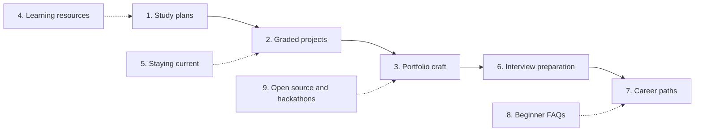
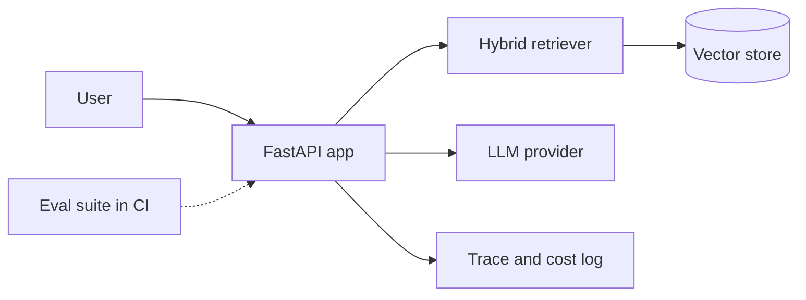

# 12. Projects, Portfolio, Career and Study Plan

> **Estimated time:** ongoing (a 6-month plan, a 3-month fast track and a part-time variant are in section 1)
>
> **Prerequisites:** [01](01-prerequisites-and-dev-foundations.md), [02](02-ai-ml-and-llm-foundations.md), [03](03-llm-apis-and-structured-outputs.md), [04](04-prompt-and-context-engineering.md), [05](05-embeddings-vector-search-and-rag.md), [06](06-agents-tools-and-mcp.md), [07](07-evaluation-observability-and-testing.md), [08](08-safety-security-and-responsible-ai.md), [09](09-open-models-fine-tuning-and-local-inference.md), [10](10-deployment-llmops-and-scaling.md), [11](11-multimodal-and-specialized-applications.md). You can start the early projects as soon as you finish section 03 and read this section alongside the others.
>
> **Outcome:** you leave with a week-by-week plan, a ladder of 15 graded projects, a portfolio that shows evidence instead of claims, a sustainable way to keep learning, and a clear picture of how to prepare for interviews and choose a career path.

## Why this stage matters

Sections 01 to 11 gave you the knowledge; this section turns it into proof. AI engineering is a craft discipline: people hire you because you have shipped systems that behave well under messy input, not because you can recite definitions. A project forces you to meet the problems no tutorial shows you, such as flaky outputs, runaway cost, unclear requirements and silent regressions. A portfolio, a habit of staying current and some interview practice then make that experience visible and repeatable. Treat this section as the one you keep open while you work through all the others.

## Topic map



- [ ] 1. Study plans: how they relate to the section estimates, 6-month week-by-week, 3-month fast track, part-time variant, checkpoints
- [ ] 2. Fifteen graded projects (beginner, intermediate, advanced) with acceptance criteria
- [ ] 3. Portfolio craft: README standard, diagrams, demos, evals, limitations, write-ups, deployment
- [ ] 4. Learning resources by type, and how to use each
- [ ] 5. Staying current: weekly routine, evaluating a model in an afternoon, reading papers, learning in public
- [ ] 6. Interview preparation: question areas (including open models, operations and tools), sample answers, take-homes, live coding, system-design template
- [ ] 7. Career paths: role comparison, skills matrix, what hiring managers look for, product sense for AI engineers
- [ ] 8. Beginner FAQs
- [ ] 9. Open-source contributions, hackathons and competitions

---

## 1. Study plans

### 1.1 Principles that make any plan work

- **Build every week.** Reading without shipping something small decays within days. Each week below ends with a deliverable, even if it is only a 50-line script.
- **Keep one running log.** A plain `LEARNING_LOG.md` with date, what you tried, result and next step takes five minutes and doubles as raw material for write-ups (section 3) and interview stories (section 6).
- **Start evals early.** From your first structured-output project (week 5) onward, every project gets a small labelled test set, and the sets grow as the projects get harder. This single habit separates AI engineers from people who only call APIs (see [section 07](07-evaluation-observability-and-testing.md)).
- **Cut scope, not time.** If a project overruns, remove features and still finish the README, tests and numbers. A finished small project beats an unfinished large one.
- **Budget real money, small amounts.** Set a spending cap in your provider dashboard before you start and log cost per run from day one (helper in section 2.1).

### 1.2 The 6-month plan (about 10 to 12 hours per week)

**How these plans relate to the section estimates.** The *Estimated time* line at the top of sections 01 to 11 describes full coverage: every subsection read and every exercise done, at roughly 8 to 10 hours per week (09 assumes 6 to 8). Added together, those estimates come to about 34 to 51 weeks, or roughly 270 to 510 hours. The 6-month plan has about 240 to 290 hours (24 weeks at 10 to 12 hours) and the 3-month fast track about 120 to 180 hours, so both are **core paths**: project-driven routes that read the essential subsections of each section, treat the graded projects in section 2 as your practice, and leave the rest as reference for when a project or a job needs it. Compare plans and estimates in hours rather than weeks, because they assume different weekly hours. The table lists what each section's core path skims or defers.

| Section | Full-depth estimate (weeks) | Plan weeks | Skim or defer, and read later as reference |
|---------|-----------------------------|------------|---------------------------------------------|
| 01 | 3 to 5 | 1 to 2 (Docker in 7, statistics in 15) | Sections 14 (TypeScript), 16 and 17; the NoSQL and pandas parts of 12 |
| 02 | 3 to 4 | 3 to 4 | Sections 2 to 4 (ML recap, neural-network essentials, NLP history), 11, 13 and 14 |
| 03 | 3 to 4 | 4 to 6 and 8 | Sections 4.3 and 4.4, 8 (until you reach 11) and 11 (reasoning models) |
| 04 | 2 to 3 | 7 to 8 | Sections 9, 11 and 15 |
| 05 | 4 to 6 | 9 to 12 | Sections 2.4 and 2.5, 9.1 to 9.6 (advanced patterns; read 9.7 before P6) and 14 |
| 06 | 4 to 6 | 13 to 14 | Durable execution in 7 beyond basic checkpoints, 8.9 (agent-to-agent protocols), 9 to 10 (frameworks, multi-agent) and 12 |
| 07 | 3 to 4 | 11 to 12 and 15 to 16 | Section 8 beyond the systems you build, plus 11 and 13 until you have real traffic |
| 08 | 2 to 3 | 17 to 18 | Sections 9, 10 (compliance: skim for awareness) and 15 |
| 09 | 4 to 6 | 19 to 20 | Sections 6.1 and 6.4 to 6.5 (continued pretraining, preference tuning, reinforcement learning), 10 and 11; read 7 and 8 only as far as P13 needs |
| 10 | 3 to 5 | 21 to 22 | Sections 9.3 and 9.4 (infrastructure as code, Kubernetes) and 10 to 12 (cloud platforms, GPU serving, data pipelines) unless a project needs them |
| 11 | 3 to 5 | 23 | Everything except section 1, section 15 and the section for your chosen track (2 vision, 3 documents, 4 and 5 voice, 8 code); read section 9 in week 17 for P6 |

**Who this plan is for.** It assumes you can already write small programs in some language, so Python's syntax takes days rather than weeks. If you already code professionally, use the fast track in 1.3. Complete beginners should not use the table below as written, because [01](01-prerequisites-and-dev-foundations.md) itself suggests two to three extra weeks of Python for someone who has never programmed. Use the part-time variant in 1.4 or a **9-month variant**: spend three to four weeks on a beginner Python course before week 1, then follow the same table at about 1.5 weeks per row (roughly 36 weeks at 8 to 10 hours per week). Weeks 1 and 2 are the tightest, so use the readiness check at the end of [01](01-prerequisites-and-dev-foundations.md#18-readiness-check-before-section-02) as the gate: if you cannot pass it after week 2, repeat the weakest topic for another week instead of moving on.

The Section column below maps to the numbered files in this folder; P-numbers refer to the projects in section 2.

| Week | Section(s) | Focus | Build and deliverable |
|------|-----------|-------|-----------------------|
| 1 | 01 | Python environments with uv, Git workflow, reading API docs, HTTP and JSON | Repo `ai-lab` with a script that calls a public JSON API and has two tests |
| 2 | 01 | Python practice (type hints, errors and retries, pytest), SQL basics, readiness check | Script that stores API results in SQLite, with tests; pass the section 01 readiness check |
| 3 | 02 | Just-enough math (vectors, dot product), tokens, embeddings intuition, transformer big picture, training stages, limits | Notebook: tokenise texts in 3 languages, compare counts, run a sampling experiment (temperature or top-p, on a model that exposes them; some hosted models fix these settings) |
| 4 | 02, 03 | First provider API calls, messages, streaming, usage and cost | **P1** streaming CLI chatbot. **Checkpoint 1** |
| 5 | 03 | Structured outputs and schema validation | **P3** extraction service, first version |
| 6 | 03 | Tool calling, timeouts, retries, cost and latency budgets | Add one tool to P1; add the cost log helper |
| 7 | 01, 04 | Prompting techniques, context design, few-shot, prompt versioning; Docker basics ([01 section 13](01-prerequisites-and-dev-foundations.md#13-docker-reproducible-environments-and-cloud-basics)) | **P2** prompt lab; a Dockerfile for P1 or P2 that builds and runs |
| 8 | 03, 04 | Harden, containerise and deploy the extraction service. "Deployed" means private or password-protected, or public only with a required API key, a per-key rate limit and a hard provider spend cap (see [03 section 12](03-llm-apis-and-structured-outputs.md#12-secrets-key-safety-budgets-and-per-user-quotas) and 10 sections [2](10-deployment-llmops-and-scaling.md#2-backends-streaming-queues-and-serverless) and [14](10-deployment-llmops-and-scaling.md#14-multi-tenancy-authorization-audit-logging-and-privacy)) | P3 finished. **Checkpoint 2** |
| 9 | 05 | Embeddings, similarity search, chunking basics | **P4** semantic search over your notes |
| 10 | 05 | Vector stores, hybrid search, reranking | Swap P4 to a real vector store |
| 11 | 05, 07 | RAG pipeline end to end; build a 40-question eval set | **P5** chat-with-docs, version 1 |
| 12 | 05, 07 | Iterate with evals, add citations, write the README | P5 finished. **Checkpoint 3** (midpoint review) |
| 13 | 06 | Agent loop, tool design, state and memory | **P8** research agent, version 1 |
| 14 | 06 | Model Context Protocol: write a server, connect a client | **P9** MCP server |
| 15 | 07 | Eval design, graders, LLM-as-judge calibration; the statistics part of [01 section 15](01-prerequisites-and-dev-foundations.md#15-just-enough-math-and-statistics) (variance, confidence intervals) | **P10** eval harness, local version |
| 16 | 07 | Regression gates, tracing, reading traces | P10 wired into CI; trace P5 and P8. **Checkpoint 4** |
| 17 | 08, 05, 11 | Prompt injection, tool permissions, data leakage; read [05 section 9.7](05-embeddings-vector-search-and-rag.md#97-rag-over-structured-data-and-text-to-sql) and [11 section 9](11-multimodal-and-specialized-applications.md#9-data-and-analytics-assistants) only, for the text-to-SQL design | **P6** text-to-SQL with safety rails |
| 18 | 08 | Guardrails, privacy and compliance awareness, threat modelling | **P11** red-team harness and mitigations |
| 19 | 09 | Hugging Face basics, quantization, local inference | Run a local model behind the same adapter as P1 |
| 20 | 09 | LoRA and QLoRA, preference tuning awareness, when not to fine-tune | **P13** LoRA vs prompt baseline. **Checkpoint 5** |
| 21 | 10 | Architecture, backends, queues, UIs | **P12** gateway, version 1 |
| 22 | 10 | Gateways, caching, budgets, CI/CD, deployment | P12 finished; deploy P5 or P8 with a cost cap |
| 23 | 11 | Pick one track: documents, voice, vision or code | **P7** or **P14** (choose one) |
| 24 | all | Capstone polish, portfolio pass, mock interviews | **P15** capstone shipped. **Checkpoint 6** |

Overlays that run in parallel:

- **Capstone (P15):** choose the problem at week 16 and give it 2 to 3 hours per week from week 17.
- **Portfolio:** after each project, spend 30 minutes on the README standard in section 3 while details are fresh.
- **Interview preparation:** one hour per week from week 16, starting with a first mock interview that week (Checkpoint 4), then two more mock interviews in weeks 23 and 24.
- **Job search:** start applying after Checkpoint 4, when you have three polished projects. Do not wait for the plan to finish.

### 1.3 The 3-month fast track for working developers (10 to 15 hours per week)

For people who already ship backend or full-stack code. You skip section 01 (take a one-evening self-test on SQL, Docker and HTTP) and skim section 02. Use your day job as a source of real problems.

| Weeks | Section(s) | Build |
|-------|-----------|-------|
| 1 | 02 (skim), 03 | P1 and P3 in one sprint; add token and cost logging |
| 2 | 03, 04 | Finish P3 with tests and Docker; build P2 prompt lab |
| 3 | 05 | P4 semantic search; learn chunking and hybrid search |
| 4 | 05, 07 | P5 RAG with a 40-question eval set. **Checkpoint A** |
| 5 | 07 | P10 eval harness; add a CI gate to P5 |
| 6 | 06 | P8 research agent with hard step and cost limits |
| 7 | 06 | P9 MCP server for an API you already use at work |
| 8 | 08 | P11 red-team harness against P5 or P8. **Checkpoint B** |
| 9 | 10 | Deploy with budgets, rate limits and tracing; P12 lite (cache plus budget) |
| 10 | 09 | Local model behind your adapter; decide with data whether to fine-tune (P13 optional) |
| 11 | 11 | One specialised track (P7 or P14); start the capstone (P15) from a real workplace problem |
| 12 | all | Capstone polish, write-up, mock interviews. **Checkpoint C** |

The skim-or-defer list in 1.2 applies to this track too. If you put P3 online before the week 9 deployment sprint, follow the rule in the week-8 row of 1.2: private, or public only with an API key, a per-key rate limit and a hard spend cap.

Tips for this track: pick the capstone from your own team's backlog (with permission and without confidential data in public repos), and prefer depth in P5, P8, P10 and P15 over finishing all 15 projects.

### 1.4 The part-time variant (about 5 hours per week over 12 months)

Consistency matters more than speed. Use two 2-hour blocks and one 1-hour review each week.

Five hours a week over 48 weeks is about 240 hours, the same as the low end of the 6-month plan. This variant therefore covers the same **core path** as 1.2 at roughly half the speed; it does not add depth. Each quarter holds 60 hours, about six weeks of the 6-month plan at 10 hours a week. Q1 and Q3 are the tightest: full coverage of 01 to 03 or of 06 to 08 would need roughly 72 to 130 hours each, so skim the parts listed in the 1.2 table and use the next quarter's first week as overrun buffer.

| Quarter | Weeks | Same as 6-month weeks | Sections (core path only) | Projects |
|---------|-------|-----------------------|---------------------------|----------|
| Q1 | 1 to 12 | 1 to 6 | 01, 02, 03 up to tool calling | P1, P3 (first version) |
| Q2 | 13 to 24 | 7 to 12 | 04, 05 and the basics of 07 | P3 (harden and deploy), P2, P4, P5 |
| Q3 | 25 to 36 | 13 to 18 | 06, 07, 08 | P8, P9, P10; P6 and P11 only if you are on schedule |
| Q4 | 37 to 48 | 19 to 24 | 09, 10, 11 (selectively) | P12 or P13 (not both), P15 |

- Choose the P15 problem at the end of Q3 and give it an hour a week in Q4, which is the fullest quarter. "Deployed" in this variant follows the rule in the week-8 row of 1.2.
- Never skip two weeks in a row. On a busy week, do a 15-minute minimum: run one experiment and add one line to the log.
- Hold one project at a time; part-time learners lose the most to context switching.
- Hold a review at the end of each quarter using the evidence table below: Q1 covers Checkpoint 1, Q2 covers Checkpoints 2 and 3, Q3 covers Checkpoint 4 and the threat-model part of Checkpoint 5, and Q4 covers the rest of Checkpoints 5 and 6.

### 1.5 Milestones and checkpoints

A checkpoint is a short review where you show evidence, not a quiz. If you cannot show it, spend the next week closing the gap before moving on.

| Checkpoint | 6-month week | Evidence you should be able to show |
|-----------|--------------|--------------------------------------|
| 1 | 4 | P1 runs and streams; you can explain tokens, the context window and why cost grows with history |
| 2 | 8 | P3 deployed with tests (private or password-protected, or public only with an API key, a per-key rate limit and a hard provider spend cap; see the week-8 row in 1.2, [03 section 12](03-llm-apis-and-structured-outputs.md#12-secrets-key-safety-budgets-and-per-user-quotas) and [10 section 14](10-deployment-llmops-and-scaling.md#14-multi-tenancy-authorization-audit-logging-and-privacy)); schema-validity rate measured; prompts versioned in files |
| 3 | 12 | P5 with at least 40 labelled questions, retrieval and answer metrics, and a README meeting section 3; one public learning-log post |
| 4 | 16 | Agent, MCP server and a CI eval gate working; you can read a trace and explain a failure; first mock interview done |
| 5 | 20 | Threat model for your agent; local model running; a documented fine-tune go or no-go decision backed by numbers; portfolio site or profile live |
| 6 | 24 | Capstone deployed with write-up and demo; two further mock interviews (system design and project deep dive); a plan for the next 90 days |

**Try it:** copy the table from 1.2 into your own repo, replace the dates, and mark the three weeks where you realistically expect to fall behind. Plan a catch-up buffer for those weeks now.

---

## 2. Graded projects

Fifteen projects in three grades. You do not need all of them: do P1, P3, P5, P8, P9, P10 and P15 as a core path, then choose from the rest based on the career track you want (section 7).

| # | Project | Grade | Main sections | Roughly |
|---|---------|-------|---------------|---------|
| P1 | Streaming CLI chatbot | Beginner | 03 | 1 weekend |
| P2 | Prompt lab with versioned prompts | Beginner | 04 | 1 weekend |
| P3 | Structured-extraction service | Beginner | 03, 04 | 1 to 2 weeks |
| P4 | Semantic search over your notes | Beginner | 05 | 1 weekend |
| P5 | Chat-with-your-docs RAG with an eval suite | Intermediate | 05, 07 | 2 weeks |
| P6 | Text-to-SQL assistant with safety rails | Intermediate | 03, 05 (9.7), 07, 08, 11 (9) | 1 to 2 weeks |
| P7 | Document-to-data pipeline | Intermediate | 05, 10, 11 | 2 weeks |
| P8 | Research or web agent with tool use | Intermediate | 06, 07 | 2 weeks |
| P9 | MCP server for a real API | Intermediate | 06 | 1 week |
| P10 | Eval harness with a CI regression gate | Intermediate | 07 | 1 to 2 weeks |
| P11 | Prompt-injection red-team harness and guardrails | Intermediate | 08 | 1 to 2 weeks |
| P12 | LLM gateway with caching and budgets | Advanced | 10 | 2 to 3 weeks |
| P13 | LoRA fine-tune of a small model vs a prompt baseline | Advanced | 09, 07 | 2 to 3 weeks |
| P14 | Voice assistant | Advanced | 11, 10 | 2 to 3 weeks |
| P15 | End-to-end capstone | Advanced | all | 4 or more weeks |

### 2.1 The shared definition of done

Every project, however small, is finished only when it has all of these. They are the difference between a tutorial result and engineering work.

- A README that follows section 3.3, including a results table and a limitations list.
- Setup in under five minutes from a clean clone: a lockfile, a `.env.example`, no secrets in history.
- A test suite that runs without network access (stub the model call) plus an eval set that runs against a real model.
- A cost and latency log. The helper below records one line per call and summarises percentiles; fill `prices.json` from your provider's pricing page rather than hard-coding prices.

```python
import json
import time
from pathlib import Path

# prices.json: {"<model>": {"input_per_mtok": 0.0, "output_per_mtok": 0.0}}
# Fill it in from your provider's pricing page; prices change often.
PRICES = json.loads(Path("prices.json").read_text(encoding="utf-8"))


def record_call(model: str, started: float, input_tokens: int, output_tokens: int,
                log: str = "calls.jsonl") -> dict:
    """Append one JSON line per LLM call. `started` comes from time.perf_counter()."""
    price = PRICES[model]
    row = {
        "model": model,
        "latency_s": round(time.perf_counter() - started, 3),
        "input_tokens": input_tokens,
        "output_tokens": output_tokens,
        "cost_usd": (input_tokens * price["input_per_mtok"]
                     + output_tokens * price["output_per_mtok"]) / 1_000_000,
    }
    with open(log, "a", encoding="utf-8") as f:
        f.write(json.dumps(row) + "\n")
    return row


def summarize(log: str = "calls.jsonl") -> dict:
    rows = [json.loads(line) for line in Path(log).read_text(encoding="utf-8").splitlines() if line]
    latencies = sorted(r["latency_s"] for r in rows)

    def pct(p: float) -> float:
        return latencies[min(len(latencies) - 1, int(p * len(latencies)))]

    return {
        "calls": len(rows),
        "p50_s": pct(0.50),
        "p95_s": pct(0.95),
        "avg_cost_usd": sum(r["cost_usd"] for r in rows) / len(rows),
    }
```

For streaming apps also record **time to first token** (TTFT), because users feel it more than total duration. Read token counts from the provider's usage fields rather than estimating them.

### 2.2 Beginner projects

#### P1. Streaming CLI chatbot

- **Goal:** a terminal chat that streams tokens as they arrive, remembers the conversation, and shows token usage per turn.
- **Suggested stack:** Python 3.12 or newer, one provider SDK behind a small adapter, uv for the environment.
- **Acceptance criteria:**
  - Text appears incrementally, not after the full reply.
  - History is trimmed or summarised once it exceeds a configurable token budget.
  - Ctrl-C cancels the current generation without crashing and Ctrl-D exits cleanly.
  - Switching provider means changing one environment variable, not editing the chat loop.
- **Stretch goals:** slash commands (`/model`, `/system`, `/save`), transcript export, a local model through an OpenAI-compatible local server.

The adapter pattern below is worth keeping for every later project, since it is also the seed of the gateway in P12. Pick a current model from your provider's documentation and set it in the environment. The sketch deliberately leaves out Ctrl-C and Ctrl-D handling, history trimming and usage reporting; adding them is the exercise.

```python
import os
from typing import Iterator

MODEL = os.environ["LLM_MODEL"]  # choose a current model from your provider's docs


def stream_openai(history: list[dict]) -> Iterator[str]:
    from openai import OpenAI  # Responses API; see the provider docs for current usage

    client = OpenAI()
    stream = client.responses.create(model=MODEL, input=history, stream=True)
    for event in stream:
        if event.type == "response.output_text.delta":
            yield event.delta


def stream_anthropic(history: list[dict]) -> Iterator[str]:
    from anthropic import Anthropic

    client = Anthropic()
    with client.messages.stream(model=MODEL, max_tokens=1024, messages=history) as stream:
        yield from stream.text_stream


STREAMERS = {"openai": stream_openai, "anthropic": stream_anthropic}


def chat() -> None:
    stream_reply = STREAMERS[os.environ.get("LLM_PROVIDER", "openai")]
    history: list[dict] = []
    while (user := input("you> ").strip()) not in {"", "/quit"}:
        history.append({"role": "user", "content": user})
        parts: list[str] = []
        for chunk in stream_reply(history):
            print(chunk, end="", flush=True)
            parts.append(chunk)
        print()
        history.append({"role": "assistant", "content": "".join(parts)})


if __name__ == "__main__":
    chat()
```

#### P2. Prompt lab with versioned prompts

- **Goal:** run several versions of a prompt over a golden set of 20 to 30 cases and compare them side by side.
- **Suggested stack:** Python, prompts stored as files (one per version) in Git, JSON or YAML case files, pytest.
- **Acceptance criteria:**
  - Prompts live in files, not inside code, and each run records prompt version, model and timestamp.
  - A report shows the pass-rate difference between versions on the same cases.
  - You document at least one case where a prompt that looked better lost.
- **Stretch goals:** an LLM-as-judge grader checked against 20 human labels, a Markdown report committed with each change.

#### P3. Structured-extraction service

- **Goal:** an HTTP service that turns messy text (invoices, job posts, support emails) into validated JSON.
- **Suggested stack:** FastAPI, Pydantic v2, the provider's structured-output feature where available plus your own validation, pytest, Docker.
- **Acceptance criteria:**
  - Invalid model output never reaches the caller: it is retried a bounded number of times and then returns a clear error.
  - Field-level accuracy on at least 30 hand-labelled documents is reported against a target you set before measuring.
  - Timeouts, retries and a `/health` endpoint exist, and it runs with one `docker compose up`.
  - Tokens and latency per request are logged.
  - If the service is reachable from the public internet, it requires an API key, enforces a per-key rate limit and runs under a hard spend cap set at the provider; otherwise keep it private or password-protected.
- **Stretch goals:** nullable fields with an explicit "not found" instead of guessing, a bounded-concurrency batch endpoint, schema versioning.

The validate-and-retry core is small. Native structured outputs (section 03) reduce failures, but validation is still your last line of defence.

```python
import json

from pydantic import BaseModel, Field, ValidationError


class Invoice(BaseModel):
    vendor: str
    invoice_number: str
    total: float = Field(ge=0)
    currency: str = Field(min_length=3, max_length=3)


def extract(text: str, call_llm, max_attempts: int = 3) -> Invoice:
    """call_llm(prompt) -> str must return raw JSON text."""
    prompt = (
        f"Extract the invoice as JSON matching this schema:\n{json.dumps(Invoice.model_json_schema())}\n\n"
        f"TEXT:\n{text}"
    )
    for _ in range(max_attempts):
        raw = call_llm(prompt)
        try:
            return Invoice.model_validate_json(raw)
        except ValidationError as err:
            prompt += f"\n\nYour previous answer was invalid:\n{err}\nReturn corrected JSON only."
    raise ValueError("extraction failed after retries")
```

#### P4. Semantic search over your notes

- **Goal:** index your Markdown notes, query by meaning and show the best passages with scores.
- **Suggested stack:** an embedding model (API or open-source), NumPy cosine similarity first, then a vector store such as Chroma, Qdrant or pgvector.
- **Acceptance criteria:**
  - Indexing is incremental: unchanged files are not re-embedded.
  - Results show file path and snippet.
  - At least 15 test queries with expected files give a reported hit rate at top 3, and you explain one failure.
- **Stretch goals:** hybrid keyword plus vector search, a reranking step, a small web UI.

**Try it:** before writing P1, write its acceptance criteria as a checklist in `README.md`. Tick them off as you go; this is the habit you want in every later project.

### 2.3 Intermediate projects

#### P5. Chat-with-your-docs RAG with an eval suite

- **Goal:** question answering over a document set (for example the public docs of a tool you like) with citations and measured quality.
- **Suggested stack:** a document parser, a chunker, a vector store (pgvector, Chroma or Qdrant), an optional reranker, FastAPI plus Gradio or Streamlit, your own eval script or an open-source harness such as Ragas or promptfoo.
- **Acceptance criteria:**
  - Every answer shows citations that point to source passages.
  - The eval set has at least 40 questions with gold sources, including unanswerable ones, and the system must decline those.
  - Retrieval metrics (such as recall at k) and an answer-faithfulness score are reported separately.
  - The README compares at least two chunking or retrieval settings with numbers; ingestion is re-runnable.
- **Stretch goals:** hybrid retrieval with reranking, permission filtering through metadata, query rewriting, cost per question.

#### P6. Text-to-SQL assistant with safety rails

- **Goal:** answer natural-language questions about a sample database, read-only, showing the SQL it ran.
- **Read first:** [05 section 9.7](05-embeddings-vector-search-and-rag.md#97-rag-over-structured-data-and-text-to-sql) and [11 section 9](11-multimodal-and-specialized-applications.md#9-data-and-analytics-assistants) for schema grounding, validation, evaluation by result sets and spreadsheet agents.
- **Suggested stack:** SQLite or Postgres with a read-only role, schema introspection, FastAPI or Streamlit.
- **Acceptance criteria:**
  - Read-only is enforced at the database level, not only in the prompt.
  - Only single `SELECT` statements run, with a row limit and a statement timeout.
  - Only the relevant part of the schema is given to the model; blocked queries are logged.
  - An eval set of at least 30 questions compares result sets (not SQL text) and includes adversarial requests such as "delete the table".
- **Stretch goals:** a bounded repair loop that feeds database errors back (two tries at most), column allowlists and PII masking, clarifying questions for ambiguous requests.

A minimal guard using the standard library shows the idea of defence in depth: a read-only connection, an authorizer that allows only reads, a row cap and a time limit. See the [Python sqlite3 documentation](https://docs.python.org/3/library/sqlite3.html) for the authorizer and progress-handler APIs.

```python
import sqlite3
import time

ALLOWED_ACTIONS = {sqlite3.SQLITE_SELECT, sqlite3.SQLITE_READ, sqlite3.SQLITE_FUNCTION}


def authorizer(action, arg1, arg2, db_name, source):
    return sqlite3.SQLITE_OK if action in ALLOWED_ACTIONS else sqlite3.SQLITE_DENY


def run_readonly(db_path: str, sql: str, max_rows: int = 200, timeout_s: float = 2.0):
    if ";" in sql.strip().rstrip(";"):
        raise ValueError("only a single statement is allowed")
    deadline = time.monotonic() + timeout_s
    conn = sqlite3.connect(f"file:{db_path}?mode=ro", uri=True)
    try:
        conn.set_authorizer(authorizer)
        conn.set_progress_handler(lambda: 1 if time.monotonic() > deadline else 0, 10_000)
        return conn.execute(sql).fetchmany(max_rows)
    finally:
        conn.close()
```

The semicolon check is deliberately crude (it also rejects a semicolon inside a string literal), and the authorizer denies everything not on the allowlist, including recursive queries. In a real project, parse the SQL with a proper parser, keep the allowlist small, and test it with the adversarial questions in your eval set. For Postgres or MySQL the same ideas apply through a read-only database role, statement timeouts and a row limit.

#### P7. Document-to-data pipeline

- **Goal:** turn PDFs and scans (invoices, forms, reports) into validated records with evidence, sending uncertain fields to a human reviewer.
- **Suggested stack:** PDF text extraction plus OCR or a vision-language model (section 11), Pydantic, a database, a minimal review UI. For a production-grade design to compare against, study [multilingual-pdf-processor-blueprint.md](../multilingual-pdf-processor-blueprint.md).
- **Acceptance criteria:**
  - Digital and scanned PDFs are both handled.
  - Every extracted field links to a page or text span as evidence.
  - A rule routes low-confidence fields to a review queue.
  - One failing document never stops a batch; accuracy on at least 20 labelled documents is reported.
- **Stretch goals:** multilingual documents, table extraction, idempotent reprocessing, cost per page.

#### P8. Research or web agent with tool use

- **Goal:** an agent that answers a research question by searching and reading pages, then writes a cited answer.
- **Suggested stack:** Python, provider tool calling used directly (write the loop yourself first), a search API or a local corpus, httpx plus HTML-to-text. Rewrite it in a framework such as LangGraph only after the plain version works.
- **Acceptance criteria:**
  - The loop has hard limits for steps, tokens, wall-clock time and cost.
  - Every claim in the final answer cites a URL that appears in the saved trace as actually fetched.
  - Tool errors return to the model as structured messages; each run saves a readable trace.
  - It is evaluated on at least 15 tasks, including an unanswerable one and a page that contains hostile instructions.
- **Stretch goals:** planner and executor split, parallel tool calls, resumable runs, human approval for any action with side effects.

#### P9. MCP server for a real API

- **Goal:** expose a real API (GitHub, a transit or weather service, your own app) as tools that any MCP client can use.
- **Suggested stack:** the official MCP SDK for Python or TypeScript, httpx, the MCP Inspector, pytest.
- **Acceptance criteria:**
  - Three to six tools with precise names, descriptions and typed parameters.
  - Read-only by default; anything that writes is a separate tool that requires confirmation.
  - Inputs are validated, outputs trimmed to be token-friendly, errors are actionable.
  - Tested with the Inspector and one real client; the README states the auth method and what the server can and cannot do.
- **Stretch goals:** Streamable HTTP deployment with authentication, resources and prompts, listing in the public registry, contract tests that call tools without any model.

The MCP Python SDK changed its API in version 2 (as of Oct 2026): older tutorials show a `FastMCP` class, while the current README uses `MCPServer`. Check the [SDK documentation](https://py.sdk.modelcontextprotocol.io/) and its migration guide if a tutorial and your installed version disagree. Install with `uv add "mcp[cli]"`, then run `uv run mcp dev server.py` to open the Inspector (it needs Node.js, because the Inspector is started through `npx`).

```python
import re

import httpx
from mcp.server import MCPServer

mcp = MCPServer("repo-issues")
NAME = re.compile(r"[A-Za-z0-9_.-]+")


@mcp.tool()
def list_open_issues(owner: str, repo: str, limit: int = 5) -> list[dict]:
    """Return the newest open issues of a public GitHub repository (pull requests excluded)."""
    if not (NAME.fullmatch(owner) and NAME.fullmatch(repo)):
        raise ValueError("owner and repo may only contain letters, digits, '_', '.' and '-'")
    limit = max(1, min(limit, 20))
    resp = httpx.get(
        f"https://api.github.com/repos/{owner}/{repo}/issues",
        params={"state": "open", "per_page": 50},
        headers={"Accept": "application/vnd.github+json"},
        timeout=10,
    )
    resp.raise_for_status()
    issues = [i for i in resp.json() if "pull_request" not in i]
    return [{"number": i["number"], "title": i["title"], "url": i["html_url"]} for i in issues[:limit]]
```

#### P10. Eval harness with a CI regression gate

- **Goal:** a reusable harness that runs a dataset through your app, scores it, compares to a stored baseline and fails the build when quality drops.
- **Suggested stack:** Python, pytest or a small runner, JSONL datasets, GitHub Actions; optionally promptfoo, Inspect or Ragas for graders and reports.
- **Acceptance criteria:**
  - The dataset is versioned in the repo with ids and tags.
  - Graders include code-based checks and at least one LLM judge calibrated against about 20 human labels.
  - Per-case results are saved as build artifacts so a failure can be diffed.
  - CI blocks the merge on a regression beyond a tolerance, deals with flakiness (repeat runs or a tolerance band) and runs under a cost cap.
- **Stretch goals:** slice metrics by tag, a PR comment with the diff, a small per-PR subset plus a full nightly run, a loop that turns failing production traces into new cases.

```python
import json
import sys
from pathlib import Path


def check(output: str, expected: str) -> bool:
    # Replace with a rubric or calibrated judge for open-ended tasks.
    return expected.lower() in output.lower()


def run_suite(answer_fn, cases_path: str = "evals/cases.jsonl"):
    lines = Path(cases_path).read_text(encoding="utf-8").splitlines()
    cases = [json.loads(line) for line in lines if line.strip()]
    failures = [c["id"] for c in cases if not check(answer_fn(c["input"]), c["expected"])]
    return {"pass_rate": 1 - len(failures) / len(cases)}, failures


def gate(metrics: dict, baseline_path: str = "evals/baseline.json", tolerance: float = 0.02) -> None:
    """Fail the build on a regression. Baseline shape: {"metrics": {...}, "ceilings": {...}}."""
    baseline = json.loads(Path(baseline_path).read_text(encoding="utf-8"))
    problems = []
    for name, ref in baseline["metrics"].items():  # higher is better, with a tolerance band
        if metrics.get(name) is None or metrics[name] < ref - tolerance:
            problems.append(f"{name}: {metrics.get(name)} is below baseline {ref} (tolerance {tolerance})")
    for name, ceiling in baseline.get("ceilings", {}).items():  # lower is better: cost, latency
        if metrics.get(name) is None or metrics[name] > ceiling:
            problems.append(f"{name}: {metrics.get(name)} exceeds ceiling {ceiling}")
    if problems:
        sys.exit("Eval regression:\n" + "\n".join(problems))
    print("OK: all metrics are within the baseline and ceilings")
```

The baseline file uses the same shape as the `evals/gate.py` in [10 section 9.2](10-deployment-llmops-and-scaling.md#92-cicd-with-eval-gates), so the two are interchangeable: that version splits the work into a runner that writes `results.json` and a separate gate script, while this sketch keeps both in one file. A starting point is below; the numbers are placeholders, so measure your own first run and commit the result as the baseline. The ceiling names match the keys returned by the `summarize()` helper in section 2.1, so merge its output into `metrics` before you call `gate`.

```json
{
  "metrics": { "pass_rate": 0.90 },
  "ceilings": { "p95_s": 8.0, "avg_cost_usd": 0.02 }
}
```

This relative check against a baseline is one half of a regression gate; [07 Thresholds](07-evaluation-observability-and-testing.md#thresholds) pairs it with an absolute floor (the `--min-pass` flag in its CI example), so use both. For the workflow file, current action versions and what to do about repository secrets on pull requests from forks, follow [07 CI integration](07-evaluation-observability-and-testing.md#ci-integration) and [10 section 9.2](10-deployment-llmops-and-scaling.md#92-cicd-with-eval-gates) rather than copying an old tutorial. The [GitHub Actions documentation](https://docs.github.com/en/actions) covers secrets, variables and permissions.

#### P11. Prompt-injection red-team harness and guardrails

- **Goal:** attack your own P5 or P8 app with a library of hostile inputs, add defences and measure the difference.
- **Suggested stack:** Python, a JSONL attack set, your P10 harness, least-privilege tool wrappers and output checks.
- **Acceptance criteria:**
  - At least 25 attacks across direct injection, indirect injection through documents or web pages, tool-argument abuse and data exfiltration through links or images.
  - A baseline attack-success rate is recorded before any fix.
  - At least three layered mitigations (for example reduced tool privileges, output validation, confirmation for side effects) with after-numbers and a list of holes that remain.
  - No real secrets or personal data appear in the test set.
- **Stretch goals:** canary strings to detect leakage, the suite running in CI, a one-page threat model with assets and trust boundaries.

**Try it:** write a threat model for P5 on one page: who can put text in front of the model, what tools or data can it reach, and what is the worst thing an attacker could make it do.

### 2.4 Advanced projects

#### P12. LLM gateway with caching and budgets

- **Goal:** a small proxy that your apps call instead of calling providers directly, with caching, per-key budgets, rate limits, fallbacks and logs.
- **Suggested stack:** FastAPI, httpx, Redis or SQLite for cache and counters, one adapter per provider. Compare your result with an existing open-source gateway such as LiteLLM before deciding what to build or buy.
- **Acceptance criteria:**
  - One provider-neutral endpoint with streaming passthrough.
  - An exact-match cache keyed on model, parameters and messages, with a TTL and a reported hit rate.
  - Per-key daily budgets enforced before the call (using an estimate) and reconciled after it (using actual usage), with clear error responses.
  - Fallback to a second provider on timeouts or server errors, with a circuit breaker.
  - Every request logs model, tokens, latency, cost and cache status; a load test reports the extra p95 latency the gateway adds.
- **Stretch goals:** a semantic cache with a safe similarity threshold that never caches personalised or sensitive requests, routing by task difficulty, a small admin dashboard.

#### P13. LoRA fine-tune of a small model vs a prompt baseline

- **Goal:** decide with data whether fine-tuning a small open model beats a well-engineered prompt on one narrow task.
- **Suggested stack:** Hugging Face Transformers with PEFT and TRL (or Unsloth or Axolotl), a small instruction-tuned open model, a GPU notebook or rented GPU, your P10 harness for scoring, a quantized serving path.
- **Acceptance criteria:**
  - At least 500 clean examples split into train, validation and a test set that you do not touch until the end; check licences and privacy of the data.
  - Prompt-only baselines (small model and a larger hosted model) are scored first.
  - Training config, seeds and logs are saved so the run can be reproduced.
  - The final table compares quality, latency, cost per 1,000 requests and memory for every variant, with a written conclusion that includes when fine-tuning is not worth it.
- **Stretch goals:** LoRA vs QLoRA, a dataset-size ablation (for example 100, 300 and 1,000 examples), merged adapters served with vLLM or llama.cpp.

#### P14. Voice assistant

- **Goal:** a voice assistant with natural turn-taking that completes one real task through a tool call (timers, a calendar read, an FAQ).
- **Suggested stack:** a speech-to-text, LLM and text-to-speech pipeline through a framework such as Pipecat or LiveKit Agents, or a provider's speech-to-speech realtime API; voice activity detection; WebRTC or WebSocket transport.
- **Acceptance criteria:**
  - Latency from end of user speech to first audio is measured per stage, with median and p95.
  - The user can interrupt and the assistant stops speaking.
  - The tool call asks for confirmation before any side effect, and unclear audio makes the assistant ask for a repeat.
  - Audio and transcripts are stored only with a visible consent notice (recording and consent rules vary by country and region, so check them; this is awareness, not legal advice); at least 20 recorded utterances are scored for intent and tool correctness.
- **Stretch goals:** compare the pipeline against speech-to-speech on latency, quality and cost; a second language; noisy-audio tests.

#### P15. End-to-end capstone

- **Goal:** a real product slice for a real user, combining retrieval or tools, structured outputs, evals, safety and deployment. Seeds: a support copilot for a small business, an internal knowledge assistant, a style-guide code reviewer, a study assistant for one exam, or a document pipeline in your own language market.
- **Suggested stack:** your choice, but it must include a backend API, a minimal UI, tracing, an eval gate in CI, deployment, and cost controls.
- **Acceptance criteria:**
  - A written problem statement and success metrics exist before coding starts.
  - At least one person who is not you has used it and you recorded their feedback.
  - An eval suite of at least 50 cases runs in CI with a threshold.
  - It is deployed with authentication or a rate limit, a budget cap and a safe demo mode.
  - The repo meets section 3, plus a write-up of 800 to 1,500 words, a 90-second demo and a threat model with known limitations.
- **Stretch goals:** analytics and a feedback loop, gradual prompt rollout, an A/B test, a load test, a second-provider fallback, an accessibility pass.

---

## 3. Portfolio craft

### 3.1 What reviewers really do

A recruiter or engineer often spends only a few minutes on a profile: pinned repositories, then the top of one README, then maybe the commit history and the tests. Make that path rewarding. Pin three to five projects (not twelve), put the strongest first, and make the first screen of each README answer what it does, why it exists and what the evidence is.

### 3.2 Repository checklist

- Clear name and one-sentence description; topics set on the repository.
- A licence ([choosealicense.com](https://choosealicense.com/) helps you pick one) and a CI status badge.
- Lockfile, `.env.example`, one-command setup, and a secret scanner or pre-commit hook so a key never lands in history.
- Tests that run offline, plus the eval suite as a separate command.
- Small, meaningful commits that tell the story of how the project evolved.

### 3.3 README standard

Use this skeleton for every project. Order matters: the reader should reach the results before the setup instructions.

```text
# Project name
One sentence: what it does and for whom.

   <- 20 to 60 seconds, shows a failure case too

## Why this exists
The problem, who has it, and why existing tools were not enough (3 to 5 sentences).

## Results
| Metric | Value | How measured |
|--------|-------|--------------|
| Answer faithfulness on 50 cases | ... | rubric + judge, calibrated on 20 human labels |
| Retrieval recall@5 | ... | gold passages |
| Latency p50 / p95 | ... | 200 requests, region, model |
| Cost per 100 requests | ... | usage logs |

## Architecture
Diagram plus 5 to 8 sentences on the main design decisions and trade-offs.

## Quickstart
Prerequisites, install, env vars, run, run the tests, run the evals.

## Evaluation
Dataset origin, size, labelling method, metrics, known blind spots.

## Limitations and risks
What fails, what you did not test, what a user must not rely on.

## What I would do next
Three concrete improvements, ordered by expected value.
```

### 3.4 Architecture diagrams

Draw one diagram that shows the data flow and the trust boundaries: where untrusted text enters, which components call the model, and where state is stored. GitHub renders [Mermaid](https://mermaid.js.org/) in Markdown (see [GitHub's diagram documentation](https://docs.github.com/en/get-started/writing-on-github/working-with-advanced-formatting/creating-diagrams)), so the diagram lives in the README as text and stays in sync with the code.



Keep it to 6 to 10 boxes. A diagram with 25 boxes hides the design instead of explaining it.

### 3.5 Demos

- Record 45 to 90 seconds: the problem, one successful run, one honest failure and how the system handles it. Any screen recorder works; [OBS Studio](https://obsproject.com/) is free.
- Keep GIFs small enough to load quickly in a README, and link to a longer video for the walkthrough.
- Show the trace or the eval report at least once. It signals engineering maturity faster than a polished UI.

### 3.6 Evidence: evals, cost and latency

Numbers are what separate your project from the hundred similar ones. Report at least quality on a labelled set, p50 and p95 latency, cost per 100 requests, and how you measured each. Say how many cases, which model family, which date. Never present a single lucky run: run the eval several times when outputs vary, and show the spread. Use the cost helper from section 2.1 so the figures come from logs, not memory.

### 3.7 Honest limitations

A limitations section earns trust. Good examples: "Fails on scanned tables with merged cells", "Eval set was written by me, so it may over-represent my phrasing", "Not tested above 10 concurrent users", "Costs rise sharply with documents above 200 pages". Weak examples: "Could be faster" or no limitations at all. Reviewers know that every LLM system fails somewhere; they want to see that you know where.

### 3.8 Write-ups

One strong write-up per major project is enough. A reliable structure: the problem, the first naive approach and why it failed, what you changed (with before-and-after numbers), what surprised you, what you would do differently. Publish on a personal site, a blog platform or in the repository itself. Link the write-up from the README and the README from your profile.

### 3.9 Deployment links and protecting your wallet

A live demo is valuable and also a risk if it uses your API key. Before you share a link, add all of these:

- A hard spending cap at the provider and a per-IP or per-session rate limit in the app.
- A demo mode that uses cached or canned responses when the budget is exhausted.
- Input length limits, no storage of user input by default, and a visible notice about it.
- A kill switch (an environment variable that disables model calls).

Hosting options change often, and free tiers come and go, so check current limits. Hugging Face [Spaces](https://huggingface.co/docs/hub/spaces) with [Gradio](https://www.gradio.app/) is a common choice for demos, and [Streamlit](https://streamlit.io/) apps can run there through the Docker SDK (the built-in Streamlit SDK is deprecated). As of Oct 2026 the Hub documentation says static Spaces are free while creating Gradio and Docker Spaces needs a paid plan, with a small free allowance for GPU-backed Gradio Spaces, so read the current Spaces documentation before you plan around it. Section 10 covers real deployments.

### 3.10 Avoiding tutorial-clone syndrome

A portfolio full of lightly modified tutorials tells a hiring manager nothing about you. Use tutorials to learn, then change enough that the result is yours.

| Tutorial habit | What to do instead |
|----------------|--------------------|
| Same dataset as the course | Use data from a domain you know (your language, your hobby, a public dataset nobody demos) |
| It works on the happy path | Write 10 hostile or messy inputs and show how it fails |
| No measurement | Add an eval set and report numbers before and after each change |
| Copy the framework's default setup | Replace one component and explain why |
| Ship and forget | Add a "Delta from the tutorial" section listing what you changed and learned |
| Everything in one notebook | Split into a package with tests and a CLI or API |

### 3.11 Portfolio shape

Aim for three to five finished projects plus one deep capstone. A balanced set might be a RAG project with evals (P5), an agent or MCP project (P8 or P9), a quality-and-safety project (P10 or P11) and a systems project (P12 or P13). Add a profile README on GitHub with a short bio, your pinned projects and a link to your learning log.

**Try it:** take your first finished project and spend one hour bringing it up to the README standard above. Ask a friend to look at only the first screen and tell you what the project does and whether they would trust it.

---

## 4. Learning resources by type

The goal is not to consume everything. Choose one course at a time, finish it by building something, and use the rest as reference. As a rule of thumb, spend about 70 percent of learning time building and 30 percent consuming. Everything below was checked as reachable in Oct 2026; catalogues and course lists change, so treat names as starting points.

### 4.1 Official provider documentation and cookbooks

Primary sources are usually the most accurate and the most current. Read the quickstart, the guides on streaming, tool calling and structured outputs, and the changelog. Documentation and SDK method names change faster than any blog post, so always prefer the docs of the version you have installed.

- [OpenAI API docs](https://developers.openai.com/api/docs) and the [OpenAI Cookbook](https://developers.openai.com/cookbook)
- [Claude documentation](https://platform.claude.com/docs) and the [Claude Cookbooks repository](https://github.com/anthropics/claude-cookbooks)
- [Gemini API docs](https://ai.google.dev/gemini-api/docs)
- [Model Context Protocol](https://modelcontextprotocol.io/) and the [MCP Python SDK docs](https://py.sdk.modelcontextprotocol.io/)
- [Hugging Face Transformers docs](https://huggingface.co/docs/transformers), [PEFT](https://huggingface.co/docs/peft) and [TRL](https://huggingface.co/docs/trl)

How to use them: keep the cookbook open next to your editor and treat each recipe as a starting point to adapt, not a finished solution. Cross-check at least two providers when you compare features, because each vendor describes its own strengths.

### 4.2 Free courses

| Course | Best for | How to use it |
|--------|----------|---------------|
| [DeepLearning.AI courses](https://www.deeplearning.ai/courses/) (the catalogue includes the short courses) | Fast, tool-focused introductions on agents, RAG, evals, MCP, voice and post-training, as listed in Oct 2026 | Filter for the short courses, pick one per topic, code along, then rebuild the example with your own data. Check each course page for its current access terms, since not every course is free |
| [Hugging Face LLM course](https://huggingface.co/learn/llm-course), [Agents course](https://huggingface.co/learn/agents-course), [MCP course](https://huggingface.co/learn/mcp-course) | Open-model tooling, agents and MCP with runnable notebooks | Follow in order; the [Learn hub](https://huggingface.co/learn) lists current courses |
| [fast.ai Practical Deep Learning](https://course.fast.ai/) | A top-down, code-first path into deep learning | Do it if you want depth beyond APIs; skip if you only need application skills |
| [Karpathy, Neural Networks: Zero to Hero](https://karpathy.ai/zero-to-hero.html) | Understanding backpropagation, language models and tokenizers by building them | Code every lecture yourself; it pays off in intuition for sections 02 and 09 |
| Stanford lectures: [CS224N](https://web.stanford.edu/class/cs224n/), [CS336](https://cs336.stanford.edu/), [CS229](https://cs229.stanford.edu/), [CS25](https://web.stanford.edu/class/cs25/) | University-level NLP, building language models, ML theory and transformer talks | Use as a deep dive on demand, not a prerequisite; check each page for the current term and available videos |
| [Google Machine Learning Crash Course](https://developers.google.com/machine-learning/crash-course) and [Kaggle Learn](https://www.kaggle.com/learn) | Classical ML refreshers | Pair with [the repository's ML roadmap](../Machine%20Learning%20Beginner%20Roadmap_.md) if the fundamentals feel shaky |
| [3Blue1Brown neural networks](https://www.3blue1brown.com/topics/neural-networks) and [The Illustrated Transformer](https://jalammar.github.io/illustrated-transformer/) | Visual intuition | Watch or read before the heavier material |

### 4.3 Books

Books age more slowly than blogs, which suits the durable parts of this field.

- **AI Engineering** by Chip Huyen (O'Reilly, 2025): a close match to the scope of this roadmap, covering application building, evaluation and systems. Resources are in the author's [aie-book repository](https://github.com/chiphuyen/aie-book) and the [author's book page](https://huyenchip.com/books/).
- **Designing Machine Learning Systems** by Chip Huyen (O'Reilly, 2022): production ML thinking that still applies to LLM systems.
- **Hands-On Large Language Models** by Jay Alammar and Maarten Grootendorst (O'Reilly): visual and practical; code is in the [companion repository](https://github.com/HandsOnLLM/Hands-On-Large-Language-Models).
- **Build a Large Language Model (From Scratch)** by Sebastian Raschka (Manning, 2024): implement a GPT-style model; code in the [companion repository](https://github.com/rasbt/LLMs-from-scratch).
- **Designing Data-Intensive Applications** by Martin Kleppmann (O'Reilly): a widely recommended general backend and systems book to pair with section 10.

How to use them: read one book slowly alongside building, not several books superficially. Do the exercises that apply to your project.

### 4.4 Newsletters, blogs and podcasts

Pick two or three sources you enjoy and ignore the rest. Prefer authors who show code, data and failures.

- Newsletters and blogs: [The Batch](https://www.deeplearning.ai/the-batch/), [Import AI](https://importai.substack.com/), [Ahead of AI](https://magazine.sebastianraschka.com/), [Interconnects](https://www.interconnects.ai/), [Simon Willison's weblog](https://simonwillison.net/), [Latent Space](https://www.latent.space/), [Eugene Yan](https://eugeneyan.com/), [Hamel Husain](https://hamel.dev/), [Chip Huyen's blog](https://huyenchip.com/blog/), [Lilian Weng](https://lilianweng.github.io/).
- Podcasts: [Latent Space](https://www.latent.space/), [Practical AI](https://practicalai.show/), [The Cognitive Revolution](https://www.cognitiverevolution.ai/), [TWIML AI Podcast](https://twimlai.com/), [Dwarkesh Podcast](https://www.dwarkesh.com/). Use them for context and trends while commuting; do not count them as study time unless you take notes.

### 4.5 Communities

- [Hugging Face forums](https://discuss.huggingface.co/) for open-model and library questions.
- [MLOps Community](https://mlops.community/) for production and operations discussions.
- [AI Engineer](https://www.ai.engineer/) conferences and recordings for what practitioners are building (the term itself was popularised by the [Latent Space essay on the AI Engineer](https://www.latent.space/p/ai-engineer)).
- Project Discussions and Discords for the libraries you use, and the LocalLLaMA subreddit for local-model practice.

Etiquette: search first, include a minimal reproducible example, say what you already tried, and post the solution when you find it.

### 4.6 A durable starter paper pack

You do not need papers to build applications, but these explain ideas that appear in every section. Read the abstract and method, then the limitations.

| Paper | Why read it |
|-------|-------------|
| [Attention Is All You Need](https://arxiv.org/abs/1706.03762) | The transformer architecture behind modern LLMs |
| [Chain-of-Thought Prompting Elicits Reasoning in Large Language Models](https://arxiv.org/abs/2201.11903) | The origin of step-by-step prompting |
| [Retrieval-Augmented Generation for Knowledge-Intensive NLP Tasks](https://arxiv.org/abs/2005.11401) | The original RAG formulation |
| [ReAct: Synergizing Reasoning and Acting in Language Models](https://arxiv.org/abs/2210.03629) | The reason-then-act loop that agents build on |
| [Toolformer: Language Models Can Teach Themselves to Use Tools](https://arxiv.org/abs/2302.04761) | An early look at model-driven tool use |
| [Judging LLM-as-a-Judge with MT-Bench and Chatbot Arena](https://arxiv.org/abs/2306.05685) | Strengths and biases of LLM judges |
| [LoRA: Low-Rank Adaptation of Large Language Models](https://arxiv.org/abs/2106.09685) | The idea behind parameter-efficient fine-tuning |
| [QLoRA: Efficient Finetuning of Quantized LLMs](https://arxiv.org/abs/2305.14314) | Fine-tuning on modest hardware |

Also read Anthropic's engineering post [Building Effective AI Agents](https://www.anthropic.com/engineering/building-effective-agents) for a practitioner's view of agent patterns, Hamel Husain's [Your AI Product Needs Evals](https://hamel.dev/blog/posts/evals/) and [A Field Guide to Rapidly Improving AI Products](https://hamel.dev/blog/posts/field-guide/), and Eugene Yan's [Patterns for Building LLM-based Systems and Products](https://eugeneyan.com/writing/llm-patterns/).

---

## 5. Staying current without burning out

The field moves fast, but the fundamentals of building reliable systems move slowly. Your goal is to track changes that affect your decisions, not every announcement.

### 5.1 A weekly routine of 3 to 4 hours

| When | Time | What to do |
|------|------|------------|
| Early week | 30 min | Scan two or three curated sources and the changelogs of the providers you use. Write down at most three items worth testing |
| Midweek | 60 to 90 min | Try one item against your own test set or a sandbox repo. Skip anything you cannot test |
| Weekend | 30 min | Add a five-line entry to your log: what I tried, what happened, what I decided |
| Monthly | 2 to 3 hours | One deep read (a paper or long post), refresh your personal eval set, check the deprecation pages below |
| Quarterly | Half a day | Review dependencies and model versions, run one "replace X with Y" experiment, refresh your portfolio READMEs |

Model retirement is a real operational risk, so check the deprecation notices for the providers you depend on: [OpenAI deprecations](https://developers.openai.com/api/docs/deprecations), [Claude model deprecations](https://platform.claude.com/docs/en/about-claude/model-deprecations), [Gemini deprecations](https://ai.google.dev/gemini-api/docs/deprecations). Subscribe to or schedule a reminder for them.

Signal filters that save hours:

- Ask "would this change a decision I must make in the next three months?" If not, bookmark it and move on.
- Wait two weeks after a hyped release; the corrections and independent evaluations arrive in that window.
- Prefer primary sources (docs, changelogs, papers, maintainers) over summaries of summaries.
- Distrust benchmark screenshots without methodology, and remember public benchmarks may be part of a model's training data.
- Keep a "parking lot" list. Writing an idea down is enough to stop it from nagging you.

### 5.2 Evaluating a new model or framework in an afternoon

The most valuable asset here is a **personal eval set**: 30 to 100 real cases from your own projects with a clear way to score each. With it, a new model becomes a four-hour experiment instead of a debate.

| Time | Step |
|------|------|
| 0:00 to 0:20 | Write down the decision: "replace model A with B for task T if quality is not worse and cost or latency is better." Pick your thresholds now, before you see results |
| 0:20 to 1:00 | Run the identical prompts and settings through the candidate using your harness (P10). Then adapt the prompt to the candidate's strengths and run again so you compare tuned against tuned |
| 1:00 to 2:30 | Compare quality (pass rate, with the spread over repeats), schema-validity rate, tool-call correctness, p50 and p95 latency, time to first token, cost per task, refusals and over-refusals, long-input behaviour |
| 2:30 to 3:15 | Read at least ten failures by hand. Aggregates hide patterns |
| 3:15 to 4:00 | Write a one-page decision memo (template below) with a rollout and rollback plan |

```text
Decision memo
Question:       Should we switch task T from model A to model B?
Method:         N cases, R repeats, same harness, date, settings
Results:        quality / validity / latency p50,p95 / cost per 100 tasks (A vs B)
Failure notes:  3 to 5 patterns seen in manual review
Risks:          deprecation timeline, data-handling terms, rate limits
Decision:       switch / do not switch / switch for subset
Rollback plan:  how to revert in under an hour
```

For a **framework or library**, timebox a thin slice: reimplement one small feature of an existing project with it, then answer these questions.

| Criterion | Question to ask |
|-----------|-----------------|
| Fit | Does it solve a problem I actually have, or only a demo problem? |
| Transparency | Can I see the exact prompts and HTTP calls it makes? |
| Escape hatch | If it breaks, can I drop down to the raw SDK for one step? |
| Observability | Does it integrate with my tracing and eval tools? |
| Stability | How often do its APIs change; how many breaking releases in the last year? |
| Maintenance | Release cadence, open issue age, number of active maintainers |
| Cost of leaving | How tangled would my code become? |
| Security | What does it execute or install by default, and with what permissions? |

### 5.3 Reading papers efficiently

1. **Pass one (10 minutes).** Read the title, abstract, figures and conclusion. Decide whether it affects something you build. Most papers stop here.
2. **Pass two (30 to 45 minutes).** Read the method and experiments. Look at the baselines, ablations, datasets and stated limitations. Skip proofs unless you need them.
3. **Pass three (only for papers that matter).** Find the official code or reproduce the main claim on a small scale. Write five lines: claim, evidence, caveat, cost to try, what changes in my system.

Questions to keep in mind: Is the baseline strong or a straw man? Does the evaluation resemble my task? Could the benchmark data have leaked into training? Did they test on enough cases to rule out noise? Are the gains still there after tuned prompting? Find papers through the [Hugging Face papers page](https://huggingface.co/papers), the [arXiv cs.CL listing](https://arxiv.org/list/cs.CL/recent) and the reference lists of posts you already trust. Read a survey or blog explainer first, then the original.

### 5.4 Learning in public

Publishing what you learn accelerates it: you have to understand something properly to explain it, and others correct your mistakes. It also builds the track record that hiring managers read.

- **Cadence:** one small public artifact every one or two weeks, such as a log entry, a short post with a chart, a repository, or an eval you ran.
- **Quality bar:** include the code or the numbers, and say what you are unsure about. A reproducible small result beats a confident opinion.
- **Never share:** secrets, customer or employer data, or anything under confidentiality. Ask permission before posting about work projects.
- **Handle errors gracefully:** correct posts openly when you find mistakes; it builds credibility.
- **Engage:** answer questions in communities for tools you know; teaching others is practice for interviews.

### 5.5 Avoiding burnout

- Choose a lane for each quarter (for example evals and agents) and treat the rest as awareness-level.
- Schedule at least one no-news day every week.
- Compare yourself with last month's version of you, not with social-media feeds.
- Remember that the durable skills are testing, debugging, system design and communication. You do not lose them when a framework changes.

**Try it:** create `EVAL_SET.jsonl` with 30 cases from your best project this week. The next time a new model is announced, run it in an afternoon and write the memo.

---

## 6. Interview preparation

### 6.1 What the loop usually looks like

Processes differ, but a typical AI Engineer loop includes a recruiter screen, a coding round, a system-design or applied-design round, a deep dive into your past project, a behavioural round, and sometimes a take-home. Companies increasingly ask candidates to reason about quality and cost, not only to build a demo. Prepare one project that you can discuss in depth for 30 minutes, including what failed.

Expect at least one **production-incident deep dive** ("tell me about a time a model feature failed in production"), usually in the project or behavioural round. Prepare an outline you can deliver in five minutes: what users saw and how you found out (alert, complaint or trace), the impact and how you sized it, the root cause shown with evidence rather than a guess, the immediate mitigation and rollback, the permanent fix, and the test, eval case or monitor you added so it cannot silently return. Interviewers listen for blameless language, a clear separation of facts from hypotheses, and a case added to your eval set. If you have no real incident, use a failure from a portfolio project and say so.

### 6.2 Question areas with outlines of strong answers

#### LLM fundamentals

- **What is a token and why does it matter to an engineer?** Subword units produced by a model-specific tokenizer; they drive cost, latency and context limits; different languages and code tokenise differently; the context window must hold input plus output; count with the provider's usage fields.
- **Why can the same prompt produce different outputs?** Sampling (temperature, top-p), plus non-determinism in serving even at zero temperature, plus silent model updates. Want diversity for brainstorming, determinism for extraction. Mitigate with schemas, validation, repeated eval runs and pinned model versions.
- **Why do models hallucinate and what reduces it?** They produce plausible continuations, with no built-in truth check. Ground answers with retrieval and citations, constrain outputs, allow "I don't know", add verification steps, measure faithfulness, and design the interface to expose uncertainty. It cannot be eliminated.
- **Prompt, RAG or fine-tune?** Start with a prompt and an eval baseline. RAG for fresh or private knowledge. Fine-tune for style, format, latency or cost at scale when you have enough clean data. Decide using failure analysis, not preference.

#### RAG system design

- **Design question answering over 50,000 internal documents with access control.** Ingestion (parse, chunk, attach metadata including permissions), hybrid retrieval with metadata filtering applied before generation, reranking, a prompt that requires citations, an eval set with unanswerable questions, re-indexing for freshness, tracing, cost estimate, and failure modes.
- **Retrieval looks right but answers are wrong. How do you debug?** Separate retrieval from generation. Measure recall on labelled queries, read the retrieved chunks, check ordering and truncation, check parsing artefacts, inspect whether the prompt instructs the model to rely on the context only, and test with the gold passage injected by hand.
- **How do you choose chunk size?** There is no universal value. Start from document structure, test several sizes against a retrieval eval, consider overlap and parent-child retrieval, and remember that question type matters.

#### Agent design and failure modes

- **When would you not build an agent?** When the steps are known; use a fixed pipeline. Agents add latency, cost and variance. Use them when the path cannot be known in advance, and begin with the simplest pattern that works.
- **List failure modes of a tool-using agent and how to mitigate them.** Loops (step and cost budgets); wrong tool or arguments (typed schemas, validation); tool errors (structured error messages); context bloat (summarise and trim); injection through tool results (least privilege, confirmation for side effects); lack of visibility (tracing).
- **How would you add memory?** Separate short-term conversation state from long-term facts; decide what to store, how to retrieve it, how to correct or forget it and how to keep it private.

#### Evaluation

- **How do you know a change made the feature better?** A representative dataset from real traffic, per-case success criteria, code-based graders first, a judge calibrated against human labels, repeated runs to measure noise, slice analysis, a CI gate, and online feedback that feeds back into the dataset.
- **What are the limits of LLM-as-judge?** Position, verbosity and self-preference biases; sensitivity to rubric wording; drift when the judge model changes. Use pairwise comparisons or clear rubrics, calibrate on human labels, spot-check regularly, and avoid grading a model with itself without checks.

#### Cost and latency

- **A feature is too slow and too expensive. What do you do?** Measure first (tokens per step, time to first token, p95). Then trim context, use prompt caching where the provider supports it, route easy cases to smaller models, parallelise independent calls, stream, cap output length, and re-run evals to confirm quality held.
- **Estimate the monthly cost of a feature.** Requests multiplied by input and output tokens multiplied by price, plus embeddings, retrieval and infrastructure. Give a range, name the sensitivities (context length, retries, traffic spikes) and mention budgets and alerts.

#### Security and safety

- **What is prompt injection and how do you defend against it?** Untrusted text interpreted as instructions, directly or through retrieved content. No filter is complete, so layer defences: least privilege for tools, separating data from instructions, validating outputs, confirmation for risky actions, sandboxing, monitoring, and attention to exfiltration channels such as rendered links or images.
- **How do you handle personal data?** Minimise what you send, redact where possible, check retention and region terms with providers, restrict logging, and involve privacy and legal specialists. This is awareness-level guidance, not legal advice.

#### Open models and fine-tuning

- **When would you fine-tune instead of prompting a hosted model?** Climb the ladder in order: prompt plus an eval baseline, then retrieval for missing knowledge, then fine-tuning for style, format, latency or unit cost when failure analysis shows prompts cannot close the gap and you hold enough clean, licensed data. Mention distilling a large model's good outputs into a small one as a cost play. See [09 section 5](09-open-models-fine-tuning-and-local-inference.md#5-decision-framework-prompt-rag-fine-tune-distil-or-scale-up).
- **How do you size a GPU, and how does LoRA differ from full fine-tuning?** Weights need roughly parameters times bytes per parameter at the chosen precision; add the KV cache (it grows with context length and concurrent requests) and, for training, gradients, optimizer state and activations; quantization shrinks the weights; confirm with a real load test. LoRA trains small adapter matrices on a frozen, optionally quantized, base model, so it fits modest hardware and gives swappable adapters; full tuning updates every weight, needs far more memory and risks more forgetting. See [09 section 4.4](09-open-models-fine-tuning-and-local-inference.md#44-memory-math-you-can-do-on-a-napkin) and [09 section 6.3](09-open-models-fine-tuning-and-local-inference.md#63-parameter-efficient-fine-tuning-lora-qlora-dora).
- **How do you evaluate a tuned model before shipping it, and what do you check besides quality?** A test split untouched until the end, prompt-only baselines (small and large models) scored first, regression checks on general tasks to catch forgetting, latency and cost per 1,000 requests, and the licence terms of both the base model and the training data (commercial use, attribution, output and derivative restrictions). See [09 section 9](09-open-models-fine-tuning-and-local-inference.md#9-evaluating-a-fine-tuned-model) and [09 section 1.3](09-open-models-fine-tuning-and-local-inference.md#13-what-you-may-and-may-not-do-awareness-checklist). Licence reading is awareness, not legal advice.

#### Deployment and operations

- **How do you roll out a prompt or model change safely?** Version prompt, model and parameters together; run the regression suite as a CI gate; replay recorded traffic or run in shadow mode; send a small canary share of real traffic while watching quality, latency and cost; keep a one-switch rollback; write down the stop conditions before you start. See [10 section 9.2](10-deployment-llmops-and-scaling.md#92-cicd-with-eval-gates) and [10 section 13](10-deployment-llmops-and-scaling.md#13-versioning-and-release-management).
- **The provider has an outage, or announces it will retire your model. What happens?** Calls go through a provider-neutral adapter or gateway with timeouts and a circuit breaker; a fallback model or second provider is chosen only after it passed your evals; the product degrades gracefully (cached answers, queued work, read-only mode); and a deprecation calendar plus a migration eval means retirement is a planned change, not an incident. See [10 section 4](10-deployment-llmops-and-scaling.md#4-llm-gateways-and-proxies), [10 section 8](10-deployment-llmops-and-scaling.md#8-reliability) and section 5.1 of this file.
- **How do you keep tenants isolated in a multi-tenant RAG product?** Derive the tenant from the authenticated identity on the server, never from the request body; apply access filters or per-tenant indexes before retrieval; key every cache by tenant and never share a semantic cache across tenants for personalised content; enforce per-tenant budgets and rate limits; keep audit logs; and test cross-tenant retrieval explicitly. See [10 section 14](10-deployment-llmops-and-scaling.md#14-multi-tenancy-authorization-audit-logging-and-privacy), [10 section 5](10-deployment-llmops-and-scaling.md#5-caching-layers) and [05 section 11.5](05-embeddings-vector-search-and-rag.md#115-multi-tenancy).

#### Tools, MCP and multimodal

- **How do you design a tool that an agent can use reliably, and what changes for an MCP server?** One narrow purpose, a precise name and description, typed and validated parameters, small token-friendly outputs, actionable error messages, read-only by default with writes in a separate tool that asks for confirmation, and idempotency keys so a retry cannot repeat a side effect. Test tools without a model. For MCP add authorization, a trust decision for every third-party server and attention to tool descriptions as an injection channel. See [06 section 4](06-agents-tools-and-mcp.md#4-tool-design) and [06 section 8](06-agents-tools-and-mcp.md#8-model-context-protocol-mcp).
- **The model returns malformed or schema-violating output. What do you do?** Use native structured outputs where available and still validate; retry a bounded number of times with the validation error fed back; treat truncation and refusals as separate cases from invalid JSON; fall back to a stronger model or a human queue; track the failure rate as a metric; and never pass unvalidated output to a tool. See [03 section 6.4](03-llm-apis-and-structured-outputs.md#64-validation-layers-and-retry-on-failure).
- **Design a voice agent, or a document-extraction pipeline: where do latency and accuracy go?** Voice: budget each stage (speech recognition, first model token, speech synthesis, network), stream every stage, handle interruptions, report median and p95 from end of speech to first audio, and obtain consent for recording. Documents: separate digital from scanned input, extract against a schema with evidence spans, validate fields, route low-confidence fields to human review, isolate failures per document, and report per-field accuracy. See [11 section 5.2](11-multimodal-and-specialized-applications.md#52-latency-budgets) and [11 section 3](11-multimodal-and-specialized-applications.md#3-document-intelligence-and-structured-extraction-at-scale).

### 6.3 Take-home assignments

- Read the brief twice and write down your assumptions. If a question is ambiguous, ask or state the assumption in the README.
- Timebox honestly. Deliver a smaller solution with tests, a README and numbers rather than an ambitious one that is half done.
- Include a small eval set and report results, even if it is only 20 cases. Many candidates skip this, so including it can set your submission apart.
- Set a cost cap and make the project runnable with one command. Never commit keys.
- Add a "what I would do with another week" section and a short limitations list.

### 6.4 Live coding

Interviewers often stub out the model call, so practise problems that test engineering judgement.

- Typical tasks: parse and validate JSON from a model reply, implement top-k cosine retrieval, write a chunker, build a minimal tool-dispatching agent loop, or run many calls with bounded concurrency.
- Think out loud, ask clarifying questions, and write a test early. Handle empty input, timeouts and malformed output before polishing.
- One pattern that appears often is bounded concurrency with retry and backoff. Retry only transient errors, as in [03 section 3.3](03-llm-apis-and-structured-outputs.md#33-retries-with-exponential-backoff-and-jitter).

```python
import asyncio
import random

# Transient failures only. In a real client, add your SDK's rate-limit, connection and 5xx
# exception classes; never retry bad requests, auth errors or quota and spend-cap errors.
RETRYABLE = (asyncio.TimeoutError, ConnectionError)


async def with_retry(fn, *args, attempts: int = 4, base: float = 0.5):
    for i in range(attempts):
        try:
            return await fn(*args)
        except RETRYABLE:
            if i == attempts - 1:
                raise
            await asyncio.sleep(random.uniform(0, base * 2**i))  # full jitter


async def run_batch(fn, items, concurrency: int = 5):
    sem = asyncio.Semaphore(concurrency)

    async def one(item):
        async with sem:
            return await with_retry(fn, item)

    return await asyncio.gather(*(one(x) for x in items))
```

Be ready to explain why the retry is limited and applies only to the `RETRYABLE` errors (the rules, including honouring `retry-after` and not stacking retry layers, are in [03 section 3.3](03-llm-apis-and-structured-outputs.md#33-retries-with-exponential-backoff-and-jitter); the error classes are in [03 section 3.1](03-llm-apis-and-structured-outputs.md#31-classify-errors-before-you-retry-them)), why the delay grows, why full jitter stops clients from retrying in lockstep, what `asyncio.gather` does when one item still fails after its retries (consider `return_exceptions=True` so one bad item does not discard the rest), and what you would change for rate-limit headers or streaming.

**Do not skip the non-LLM coding round.** Many loops still include a general Python or data-structures round and sometimes one SQL question, and candidates who only practised LLM tasks stumble on them. Rehearse these skills:

- Hash maps for counting, grouping and de-duplication (token counts per document, documents grouped by source).
- Sorting and top-k selection with `heapq.nlargest` rather than sorting everything, and why that is cheaper when `k` is small.
- String and JSON handling: parse messy input, cope with missing keys, and mind Unicode and escaping.
- Complexity reasoning: state the time and space cost of your solution aloud and name where it breaks at 100 times the input. Revisit the data-structure table and the [Complexity in five minutes](01-prerequisites-and-dev-foundations.md#complexity-in-five-minutes) subsection in section 01.
- One SQL join with `GROUP BY` and `HAVING` (for example, customers with at least two open tickets); see [01 section 12](01-prerequisites-and-dev-foundations.md#12-data-fundamentals-sql-nosql-file-formats-and-pandas).

**AI-assisted interview rounds.** Some companies now run a round in which you are allowed, or expected, to use an AI coding assistant, and they judge specification, verification and review rather than typing speed. Ask what is permitted (which tools, whether you may search). State your plan and the function signatures before you prompt. Write the test or acceptance check first, so you can tell whether the generated code is right. Read every generated line aloud and delete or fix what you cannot justify. Say what you would not trust without extra checking (concurrency, security-sensitive code, money, dates and Unicode) and how you would check it. Narrate your verification, not only your prompts; see [01 section 17](01-prerequisites-and-dev-foundations.md#17-using-ai-coding-assistants-while-learning-and-as-a-professional) for the habits behind this.

**Try it:** with no assistant and a 25-minute timer, write top-k cosine retrieval over 1,000 small vectors (use `heapq`) and a chunker with overlap, each with two tests and a stated complexity. Repeat a week later with an assistant, and compare which bugs you caught by reading and which by tests.

### 6.5 System-design walkthrough template

Use the same eight steps for any "design an AI feature" question and say them aloud as headings.

1. **Clarify.** Users, the task, volume, data sources, languages, latency expectations, what happens when the model is wrong.
2. **Define success.** Quality metrics, a failure budget, latency and cost targets.
3. **Data and knowledge.** Where facts come from, how fresh, who may see what.
4. **Architecture.** Request path, components, sync versus async, trust boundaries. Start simple, then add parts only when you can name the problem they solve.
5. **Model and context strategy.** Which model class, prompt and context design, tools, structured outputs, caching, fallbacks.
6. **Evaluation.** Offline dataset, graders, regression gate, online monitoring, human review loop.
7. **Safety and security.** Injection, privacy, permissions, abuse, compliance awareness.
8. **Operations.** Observability, rate limits and budgets, rollout, incident response, estimated cost, what you would build next.

A worked outline for "design a customer-support copilot": agents see drafted replies with citations from the help centre and past tickets; retrieval is filtered by product and language; an eval set is built from historical tickets with human-approved answers; the draft is never sent automatically; low-confidence cases go to a human; metrics cover acceptance rate of drafts, edit distance, handle time and escalations; the main risks are wrong policy claims and leaking one customer's data into another's reply.

### 6.6 Behavioural preparation

Prepare five stories using a situation, action, result format, each with a number or a concrete outcome: a project that failed and what you learned, a trade-off you made under ambiguity, a time you changed your mind after seeing data, an incident you debugged, a time you explained a technical limit to a non-technical person. Practise saying what you would do differently.

**Try it:** run a 45-minute mock interview with a friend. Give them the system-design template and a prompt such as "design a document question-answering feature for a law-firm intranet". Record yourself and note the three places where you hand-waved.

---

## 7. Career paths and role comparison

Titles are inconsistent across companies, so read job descriptions rather than titles. The table is a map, not a rule.

### 7.1 Roles at a glance

| Role | Core question | Typical work | Usually not the focus |
|------|---------------|--------------|------------------------|
| **AI Engineer** | How do we build a reliable feature on top of existing models? | LLM apps, RAG, agents, evals, deployment, cost control | Training new foundation models |
| **ML Engineer** | How do we train, ship and operate models at scale? | Training pipelines, feature stores, serving, monitoring, optimisation | Product prompting and UX details |
| **Data Scientist** | What do the data say and which decision should we take? | Analysis, experiments and A/B tests, forecasting, modelling, communication | Production serving |
| **Research Engineer or Scientist** | How do we advance model capability or methods? | Implement and scale experiments, training runs, papers | Customer-specific product delivery |
| **Applied or product-facing roles** (applied scientist, AI product engineer, solutions or forward-deployed engineer) | How do we make this work for a specific customer or domain? | Integration, domain adaptation, demos, requirements, delivery | Deep research |
| **Adjacent platform roles** (LLMOps or MLOps, data engineer, security or red team) | How do we keep the system reliable, fast and safe? | Pipelines, infrastructure, observability, testing, threat analysis | Feature design |

### 7.2 Skills matrix

| Skill | AI Engineer | ML Engineer | Data Scientist | Research Engineer | Applied or product |
|-------|-------------|-------------|----------------|-------------------|--------------------|
| Software engineering and APIs | Core | Core | Some | Strong | Strong |
| Prompt and context engineering | Core | Some | Some | Some | Strong |
| Retrieval, embeddings, RAG | Core | Strong | Some | Some | Strong |
| Agents, tools, MCP | Core | Some | Light | Some | Strong |
| Evals and observability | Core | Strong | Strong | Strong | Strong |
| Training and fine-tuning (PyTorch) | Some | Core | Some | Core | Light |
| Classical ML and statistics | Some | Strong | Core | Strong | Some |
| MLOps, GPU serving, infrastructure | Strong | Core | Light | Strong | Light |
| Math depth (linear algebra, optimisation) | Light | Strong | Strong | Core | Light |
| Product sense and communication | Strong | Some | Core | Some | Core |
| Security and safety awareness | Strong | Some | Some | Strong | Strong |

### 7.3 What hiring managers look for

- **Shipped systems**, not just notebooks: something deployed with real constraints and at least one real user.
- **Evaluation literacy:** you start with a test set, you can describe your metrics and their blind spots, and you do not trust a demo.
- **Judgement about when not to use a model:** a regex, a rule or a database query is often right.
- **Cost and latency awareness:** you can estimate and reduce both.
- **Security awareness:** you can describe injection risks and how you limited blast radius.
- **Debugging non-deterministic systems:** you read traces, form hypotheses and change one thing at a time.
- **Communication and product sense:** you explain trade-offs to non-specialists, write clear docs, and can frame a use case, its value and its risks (see 7.6).
- **Learning speed with humility:** you can show how you evaluated a new tool and what you decided.

Resume and profile tips: write one line per project with the outcome and a number, link the repository and the demo, and avoid keyword lists without evidence. Red flags include a framework-only portfolio, no tests or evals, committed API keys, and claims that cannot be demonstrated.

### 7.4 Progression and specialisations

Early on, a generalist who can ship end to end is valuable. Over time, many engineers deepen in one area: evaluation and quality, agents and tooling, search and RAG, voice and multimodal, safety and security, fine-tuning and inference, or platform and cost. Moving into staff-level or management roles tends to depend on how well you frame ambiguous problems and raise the standard of your team. Freelancers and consultants often start by adding AI features to existing business software and then specialise by industry.

Salary figures vary widely by region, company and year, and published numbers go stale quickly. This guide deliberately does not quote any; compare several current, local sources before negotiating.

### 7.5 Practical job-search tactics

- Apply with a link to your strongest project, not just a resume.
- Use contributions, write-ups and demos to open conversations; referrals work better than cold applications.
- Target teams where your existing domain (finance operations, healthcare administration, e-commerce, logistics) is an advantage.
- Treat early rejections as data; ask for feedback when it is appropriate and update your portfolio.

### 7.6 Product sense for AI engineers

The skills matrix in 7.2 rates product sense and communication as a strength for AI Engineers, because the hardest early decisions are often not technical: whether to build at all, how far to trust the model, and how to show the value. The six habits below make that judgement concrete. Pair them with the pre-build checklist in [13 section 2](13-glossary-and-cheat-sheets.md#2-questions-to-ask-before-building).

**(a) Turn a vague request into a scoped use case.** "Add AI to support" is not a use case. Write one sentence naming the user, the task, the success metric and the non-AI baseline: "Support agents get a drafted reply for password-reset tickets; success is a lower median handle time than the current canned-reply flow, measured on the same ticket type." Then ask what a wrong answer costs, who notices, and how often the model may be wrong before the feature is worse than the baseline. If a rule, a search box or a template already does the job, say so; that is a good outcome.

**(b) Sketch the unit economics.** Compare cost per task with value per task, and find the break-even volume.

- Cost per task: model calls (input and output tokens, retries), retrieval and infrastructure, and the human review time when a person checks the output. Review often costs more than the model.
- Value per task: minutes saved times the loaded cost of those minutes, or revenue protected, multiplied by the share of outputs that are actually used.
- Break-even volume: fixed monthly cost (build amortisation, hosting, eval and on-call upkeep) divided by value minus cost per task. Vary acceptance rate and retries to see what the answer is sensitive to.

```python
def break_even_tasks_per_month(fixed_monthly: float, value_per_task: float,
                               model_cost_per_task: float, review_cost_per_task: float) -> float:
    margin = value_per_task - model_cost_per_task - review_cost_per_task
    return float("inf") if margin <= 0 else fixed_monthly / margin
```

With invented numbers (not real prices): a task saves 4 minutes worth 0.50 currency units a minute, so value is 2.00 (already allowing for unused outputs); model cost is 0.03; review adds 0.40; the fixed cost is 3,000 a month. The margin is 1.57 and break-even is about 1,900 tasks a month. If your traffic is far below that, the feature is a cost, not a saving. Take cost per task from the log in section 2.1, not from memory.

**(c) Build, buy or configure.** Decide layer by layer. Models: a hosted API is the default; self-hosting needs a volume, privacy or latency reason (see [13 section 3.4](13-glossary-and-cheat-sheets.md#34-hosted-api-or-open-weight-self-hosting)). Vector stores: a managed service or the database you already run usually beats a new system ([13 section 3.2](13-glossary-and-cheat-sheets.md#32-which-vector-store-for-which-situation)). Eval tooling: adopt an open-source harness for graders and reports, but build your own datasets, because they encode your domain. Configure or buy anything that is not your differentiator and that you can swap behind an adapter; build what carries your data and judgement. Weigh lock-in, data-handling terms, the cost of leaving and the time your team would spend operating it.

**(d) Choose the autonomy level and design for trust.** Climb one rung at a time: suggest (the user reads), draft (the user edits and sends), act with approval, act with undo, then act alone. Pick the rung from how costly, reversible and detectable a wrong action is. At every rung show sources, say when the system is unsure, make correction one click, log the corrections as future eval cases, and give an escape to a human. See [10 section 3.3](10-deployment-llmops-and-scaling.md#33-ux-that-makes-ai-features-trustworthy) and [06 section 11](06-agents-tools-and-mcp.md#11-human-in-the-loop).

**(e) Measure adoption and run a pilot.** Useful metrics are acceptance rate (drafts used as is or lightly edited), edit distance (how much users change), deflection (issues resolved without a human, checked for repeat contacts) and time saved against a control group. Add guardrail metrics: escalations, complaints, policy errors and cost per task. A pilot has a small group of real users, a baseline measured before launch, a shadow-mode phase where outputs are logged but not shown, stop conditions written in advance, and a weekly manual review of a sample, including accepted outputs, because a high acceptance rate can mean users are rubber-stamping.

**(f) Write a one-page decision memo** for readers who are not engineers. Lead with the decision you need, use plain words and one chart, and keep technical detail in an appendix.

```text
Decision memo: <feature> for <audience>
Problem:         who has it, how often, what it costs today (the baseline)
Proposal:        what the feature does and its autonomy level (suggest, draft, act)
Success metric:  primary metric and target, how and when measured; guardrail metrics
Economics:       cost per task, value per task, break-even volume, review cost
Options:         build, buy or configure, and the non-AI alternative; why this one
Risks:           cost of a wrong answer, security and privacy, vendor dependency, adoption
Pilot plan:      users, duration, shadow mode first, stop conditions
Ask:             the decision you need, from whom, by when
```

**Try it:** write the business case for a P5 or P8 idea you could pitch to a real team: a scoped use-case sentence, cost per task taken from your `calls.jsonl`, a break-even estimate with your assumptions listed, an autonomy level with a reason, and the memo above. Ask a non-engineer to read the first half page and tell you what decision you want from them.

---

## 8. Beginner FAQs

**Is AI engineering a good career?**
The honest answer is "good, with caveats". Employers have been asking for LLM application skills, retrieval, agents and evaluation in recent years, and teams value people who can ship reliable features; check current job postings in your region rather than trusting any single claim about demand. Caveats: titles and tools churn quickly, there is hype and uneven quality in the market, and entry-level competition can be strong. The durable assets are software engineering, evaluation, security awareness and domain knowledge, which transfer if the tooling changes. This is general awareness, not personal career advice.

**Do I need a degree?**
For most AI Engineer roles a degree is not a strict requirement; a record of shipped, measured projects carries a lot of weight. Some employers still filter on degrees, and research-oriented roles typically expect advanced study. A degree helps with the maths and with some visa and hiring pipelines, but you can build credible proof without one.

**How much math do I need?**
For application work: vectors and dot products (cosine similarity), basic probability, and enough statistics to read evals (sampling, variance, confidence intervals, precision and recall). Training and research roles need more linear algebra, calculus and optimisation. Start with [section 01](01-prerequisites-and-dev-foundations.md); if you want more depth later, use [the repository's ML roadmap](../Machine%20Learning%20Beginner%20Roadmap_.md).

**Python or TypeScript?**
Learn Python first: it dominates evals, data work, fine-tuning and serving, and the main provider SDKs support it. Add TypeScript if you build web products, streaming UIs or edge functions, since provider SDKs and MCP SDKs exist for both. Pick based on the team you want to join. The concepts transfer.

**How do I transition from web or backend development?**
You already own much of the stack: APIs, queues, caching, observability, testing and deployment all apply. What is new is non-determinism, evaluation, prompt and context design, embeddings and cost-per-request thinking. A practical 90-day path: add one LLM feature to a project you already maintain (summaries, classification, search), put an eval set around it, add tracing and budgets, then write about it. Study real designs such as [the multilingual PDF processor blueprint](../multilingual-pdf-processor-blueprint.md) to see how an AI component fits into a production pipeline.

**How do I avoid being replaced by the tools I use?**
No one can guarantee anything, but you can position yourself well. Use assistants heavily and read everything they produce. Invest in what tools do poorly: framing the right problem, designing systems, building evals and tests that tell you whether the output is right, understanding security and the domain, and taking accountability for outcomes. Keep writing some code by hand so your skills do not atrophy, and be the person who can say how reliable a system is. Roles shift towards verification and design rather than disappearing overnight.

**Do I need a GPU?**
Not to start. Hosted APIs cover most of the roadmap; small open models run on a laptop for experiments, and you can rent a GPU for a few hours for fine-tuning in section 09.

**How long until I am job-ready?**
It depends on your starting point and consistency. Developers who build steadily often have a credible portfolio in a few months; career changers need longer. Use the checkpoints in section 1.5 rather than the calendar. The per-section time estimates in files 01 to 11 describe full coverage (roughly 34 to 51 weeks in total), while the plans in section 1 follow a shorter core path; the reconciliation is at the start of 1.2, and complete beginners should use the part-time or 9-month variant.

**Should I learn a framework first?**
Learn the raw SDK and the concepts first. Frameworks come and go; once you understand what they do for you, picking one is easy.

---

## 9. Open-source contributions, hackathons and competitions

### 9.1 Why contribute

Open source gives you public proof of collaboration, exposure to production-quality code, and relationships with maintainers. You do not need to write core features: documentation, tests, examples and bug reports are valued.

### 9.2 How to start

1. **Use the project** until you hit a real problem or confusing doc.
2. **Read the contribution guide** and code of conduct. The [Open Source Guides](https://opensource.guide/how-to-contribute/) and [GitHub's own guide](https://docs.github.com/en/get-started/exploring-projects-on-github/finding-ways-to-contribute-to-open-source-on-github) explain the workflow.
3. **Find a first task.** Browse issues labelled "good first issue" through [GitHub topics](https://github.com/topics/good-first-issue) or [goodfirstissue.dev](https://goodfirstissue.dev/), or fix a documentation problem you personally hit.
4. **Comment before you start** on larger changes, and keep the pull request small and focused, with tests and a clear description.
5. **Be patient and responsive.** Maintainers are often volunteers; respond to review comments and accept that some PRs will not be merged.

Many projects have adopted policies about AI-assisted contributions (as of Oct 2026). Read the policy, disclose assistance where it is required, and never submit generated code you do not understand and have not tested; low-effort submissions waste maintainers' time and damage your reputation.

### 9.3 Project ideas by effort

| Effort | Idea |
|--------|------|
| Small | Fix an outdated example in the docs; improve an error message; add a missing type hint; translate a page |
| Medium | Add a regression test for a reported bug; contribute an eval case or dataset; write a cookbook-style notebook; add a provider adapter |
| Larger | Build and publish an MCP server for a niche API and add it to the [MCP registry](https://registry.modelcontextprotocol.io/); implement a missing feature behind an issue; contribute benchmarks and profiling scripts |

Projects whose repositories suit AI engineers to explore: [Transformers](https://github.com/huggingface/transformers), [PEFT](https://github.com/huggingface/peft), [TRL](https://github.com/huggingface/trl), [smolagents](https://github.com/huggingface/smolagents), [LangChain](https://github.com/langchain-ai/langchain), [LangGraph](https://github.com/langchain-ai/langgraph), [LlamaIndex](https://github.com/run-llama/llama_index), [vLLM](https://github.com/vllm-project/vllm), [llama.cpp](https://github.com/ggml-org/llama.cpp), [Ollama](https://github.com/ollama/ollama), [promptfoo](https://github.com/promptfoo/promptfoo), [Langfuse](https://github.com/langfuse/langfuse), [Open WebUI](https://github.com/open-webui/open-webui), the [MCP servers repository](https://github.com/modelcontextprotocol/servers) and the [MCP Inspector](https://github.com/modelcontextprotocol/inspector). Larger projects have stricter standards; smaller ones often welcome help more quickly.

### 9.4 Hackathons and competitions

Hackathons are a fast, low-risk way to practise shipping under constraints, meet collaborators and build a story. Find them through [MLH](https://www.mlh.com/), [Devpost](https://devpost.com/hackathons), [lablab.ai](https://lablab.ai/), company-sponsored events and the [AI Engineer](https://www.ai.engineer/) community. For competitions, [Kaggle](https://www.kaggle.com/competitions) hosts data science and machine learning contests, and [ARC Prize](https://arcprize.org/) runs a benchmark competition about abstract reasoning (check each site for current rules and dates).

How to get value from a hackathon:

- Read the rules on pre-existing code, team size, IP ownership and judging criteria before you start.
- Choose a narrow problem you can finish. A working slice with a clear demo beats a broad idea.
- Divide roles early (backend, retrieval or model, UI, pitch), and keep a rough eval set even at a hackathon.
- Prepare a three-minute pitch: the problem, the live demo, the evidence, and what comes next.
- Afterwards, clean up the repository, write the README and publish a short write-up; the project becomes portfolio material.

Competitions reward a different skill (careful iteration against a fixed metric). They are good for learning evaluation discipline but do not replace shipping a real application.

---

## Tools and libraries at a glance

| Tool | What it is for | Pick it when |
|------|----------------|--------------|
| [GitHub](https://github.com/) with [GitHub Actions](https://docs.github.com/en/actions) | Hosting repositories, running tests and eval gates | You need a public portfolio and a CI regression gate |
| [uv](https://docs.astral.sh/uv/) | Fast Python project and environment management | You want reproducible, one-command setups |
| [pytest](https://docs.pytest.org/) | Unit tests and simple eval runners | You are writing offline tests with stubbed model calls |
| [Pydantic](https://pydantic.dev/docs/) | Schema definition and output validation | You need to trust structured model output |
| [FastAPI](https://fastapi.tiangolo.com/) | Python web APIs with typed schemas | You are serving an extraction, RAG or gateway project |
| [Mermaid](https://mermaid.js.org/) | Text-based diagrams that render on GitHub | You want an architecture diagram that stays in sync with the repo |
| [Hugging Face Spaces](https://huggingface.co/docs/hub/spaces) with [Gradio](https://www.gradio.app/) (Streamlit via the Docker SDK) | Quick public demos; [Streamlit](https://streamlit.io/) is also fine for local UIs | You need a shareable demo quickly (check current plan requirements and add spending limits first) |
| [promptfoo](https://github.com/promptfoo/promptfoo), [Ragas](https://docs.ragas.io/), [Inspect](https://inspect.aisi.org.uk/) | Open-source eval frameworks | You want ready-made graders and reports rather than hand-rolling everything |
| [Langfuse](https://github.com/langfuse/langfuse) | Open-source tracing and LLM observability | You want to inspect traces, costs and datasets in one place |
| [LiteLLM](https://docs.litellm.ai/) | A unified interface and proxy for many providers | You want to compare against your own gateway (P12) or avoid writing adapters |
| [MCP SDKs](https://modelcontextprotocol.io/) and [Inspector](https://github.com/modelcontextprotocol/inspector) | Building and testing MCP servers | You are doing P9 |
| [PEFT](https://huggingface.co/docs/peft) and [TRL](https://huggingface.co/docs/trl) (plus [Unsloth](https://github.com/unslothai/unsloth) or [Axolotl](https://github.com/axolotl-ai-cloud/axolotl)) | Parameter-efficient fine-tuning | You are doing P13 and need a standard stack |
| [Ollama](https://ollama.com/), [llama.cpp](https://github.com/ggml-org/llama.cpp), [vLLM](https://docs.vllm.ai/) | Local and self-hosted inference | You want a local model behind your adapter or high-throughput serving |
| [Pipecat](https://github.com/pipecat-ai/pipecat) and [LiveKit Agents](https://github.com/livekit/agents) | Real-time voice pipelines | You are doing P14 |
| [OBS Studio](https://obsproject.com/) | Screen recording | You need a demo video or GIF source |

## Common pitfalls

- **Tutorial hell.** You keep starting courses and never ship. Fix: set a rule that every course ends with a project of your own and a README before you start the next one.
- **No evals.** Quality claims rest on a few lucky runs. Fix: build the test set early (section 07) and report numbers with the spread over repeats.
- **Leaked keys.** An API key ends up in a commit, notebook output or demo. Fix: environment variables, `.env` in `.gitignore`, a secret scanner and an immediate key rotation if it ever leaks.
- **A public demo without cost guards.** A shared link burns your budget overnight. Fix: spending caps, rate limits, a demo mode and a kill switch (section 3.9).
- **Framework-first learning.** You can use a library but cannot explain what happens inside. Fix: build the plain-SDK version first, then adopt a framework deliberately.
- **Too many shallow repositories.** Twelve tiny projects look like twelve tutorials. Fix: curate three to five, and go deep on one.
- **Hiding failures.** The README shows only the happy path. Fix: include a limitations section and one real failure case in the demo.
- **Out-of-date code from old tutorials.** SDK methods and model names change. Fix: verify against the current official docs and pin versions (for example, MCP SDK examples differ between v1 and v2 as of Oct 2026).
- **Treating public benchmarks as truth.** A leaderboard score does not predict your task. Fix: use your own eval set for decisions.
- **Pasting generated code you do not understand.** It fails in interviews and in production. Fix: read it, test it, and be ready to explain every line.
- **Starting the job search too late.** Perfectionism delays feedback. Fix: begin applying after Checkpoint 4 and improve while you apply.
- **Plan guilt.** You fall behind the schedule and quit. Fix: skip scope, not weeks; use the 15-minute minimum day from section 1.4.
- **Cramming interview trivia.** Memorised definitions break under follow-up questions. Fix: rehearse with your own projects and the system-design template.

## Hands-on projects

These three meta-projects turn the whole roadmap into career assets. They are separate from the technical ladder in section 2.

### Starter: portfolio foundation

- **Goal:** bring one existing project to publishable quality and make it the first thing a visitor sees on your profile.
- **Suggested stack:** GitHub, Mermaid, a screen recorder such as OBS Studio, a profile README.
- **Acceptance criteria:**
  - The README follows section 3.3 and has a results table with at least three real numbers (quality, latency, cost).
  - A diagram, a 45 to 90 second demo that includes one failure, and a limitations section are present.
  - A clean clone runs with one command in under five minutes, verified by a friend, and no secrets appear in history.

### Intermediate: the afternoon model-evaluation report

- **Goal:** compare two models (or one model before and after a prompt change) on your own task and publish the findings.
- **Suggested stack:** your P10 harness or a hand-rolled script, your personal eval set of at least 30 cases, the cost helper from section 2.1.
- **Acceptance criteria:**
  - Thresholds and method are written before running; results include quality with repeat spread, p50 and p95 latency, and cost per 100 tasks.
  - At least ten failures are read manually and summarised as patterns.
  - A decision memo and a public post (blog or repository) follow the template in section 5.2, with no confidential data.

### Advanced: capstone launch and interview loop

- **Goal:** publicly launch your capstone (P15) and prove you can discuss it under pressure.
- **Suggested stack:** your capstone stack, plus a shared document for the system-design write-up.
- **Acceptance criteria:**
  - The capstone is deployed with limits and a demo mode, with an eval gate in CI and a threat model.
  - You complete two recorded mock interviews, one system-design walkthrough using section 6.5 and one project deep dive, and write down the five weakest answers with improved versions.
  - You give a ten-minute talk (meetup, community call or recorded video) covering the problem, the evidence and what you would change.

## Self-check

- [ ] I can follow a week-by-week plan, adjust it to my available hours, and name the evidence I need at each checkpoint.
- [ ] I have shipped at least five of the 15 projects, including one with a CI eval gate.
- [ ] I can write a README that shows results, limitations and a diagram, and a clean clone runs in under five minutes.
- [ ] I can report quality, p50 and p95 latency, and cost per 100 requests for my projects, with the method used.
- [ ] I know how to protect a public demo from abuse and runaway cost.
- [ ] I can tell the difference between a tutorial clone and my own project, and I can list what I changed.
- [ ] I can run an afternoon evaluation of a new model using my own eval set and write a decision memo.
- [ ] I can read a paper in three passes and summarise its claim, evidence and caveats in five lines.
- [ ] I have a weekly routine for staying current that takes 3 to 4 hours and includes checking model deprecation notices.
- [ ] I can answer common questions on LLM fundamentals, RAG design, agent failure modes, evals, cost, security, open models and fine-tuning, deployment and operations, and tools and multimodal systems with structured outlines, and I can tell a production-incident story in five minutes.
- [ ] I can solve a small Python, data-structures or SQL problem without an assistant, and in an AI-assisted round I can state a plan, write the check first and review generated code line by line.
- [ ] I can walk through the eight-step system-design template for an AI feature in 30 minutes.
- [ ] I can explain how an AI Engineer differs from an ML Engineer, Data Scientist and Research Engineer, and which path suits me.
- [ ] I can turn a vague AI request into a scoped use case with a success metric and a non-AI baseline, estimate cost per task against value and break-even volume, choose an autonomy level, and write a one-page decision memo for non-engineers.
- [ ] I know how to make a first open-source contribution and which hackathon or contribution I will attempt next.

## Resources

### Official docs

- [OpenAI API docs](https://developers.openai.com/api/docs): provider reference, guides and changelog for the Responses API and related features.
- [OpenAI Cookbook](https://developers.openai.com/cookbook): worked examples for common application patterns.
- [Claude documentation](https://platform.claude.com/docs): API reference, guides and SDK pages.
- [Claude Cookbooks](https://github.com/anthropics/claude-cookbooks): notebooks and recipes for building with Claude.
- [Gemini API docs](https://ai.google.dev/gemini-api/docs): Google's developer documentation for Gemini models.
- [Model Context Protocol](https://modelcontextprotocol.io/): the protocol overview, specification and SDK links.

### Free courses

- [DeepLearning.AI courses](https://www.deeplearning.ai/courses/): the catalogue that includes the concise, tool-focused short courses; check each course page for current titles and access terms.
- [Hugging Face Learn](https://huggingface.co/learn): the LLM, Agents and MCP courses with runnable notebooks.
- [fast.ai Practical Deep Learning](https://course.fast.ai/): a free, code-first deep learning course.
- [Neural Networks: Zero to Hero](https://karpathy.ai/zero-to-hero.html): build backpropagation, language models and a tokenizer by hand.
- [Stanford CS336: Language Modeling from Scratch](https://cs336.stanford.edu/): lecture materials on how language models are built and evaluated.

### Reading and papers

- [aie-book repository](https://github.com/chiphuyen/aie-book): resources that accompany Chip Huyen's AI Engineering book.
- [Your AI Product Needs Evals](https://hamel.dev/blog/posts/evals/): a practical argument for evaluation-driven development.
- [Building Effective AI Agents](https://www.anthropic.com/engineering/building-effective-agents): a practitioner's guide to agent and workflow patterns.
- [The Rise of the AI Engineer](https://www.latent.space/p/ai-engineer): the essay that popularised the role, useful for context.

---

Previous: [11. Multimodal and Specialized Applications](11-multimodal-and-specialized-applications.md) | Index: [AI Engineer Roadmap](README.md) | Next: [13. Glossary and Decision Cheat Sheets](13-glossary-and-cheat-sheets.md)
