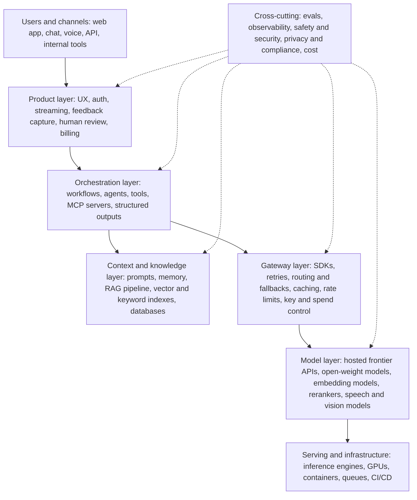
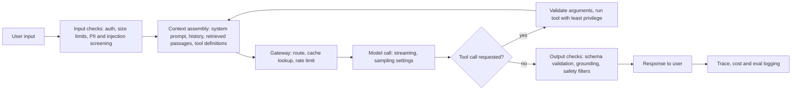

# 13. Glossary and Decision Cheat Sheets

> **Estimated time:** Reference. Skim it once (about an hour), then keep it open while you build.
>
> **Prerequisites:** Best used after the earlier sections, because every entry points back to the section that teaches it: [01](01-prerequisites-and-dev-foundations.md), [02](02-ai-ml-and-llm-foundations.md), [03](03-llm-apis-and-structured-outputs.md), [04](04-prompt-and-context-engineering.md), [05](05-embeddings-vector-search-and-rag.md), [06](06-agents-tools-and-mcp.md), [07](07-evaluation-observability-and-testing.md), [08](08-safety-security-and-responsible-ai.md), [09](09-open-models-fine-tuning-and-local-inference.md), [10](10-deployment-llmops-and-scaling.md), [11](11-multimodal-and-specialized-applications.md), [12](12-projects-portfolio-and-career.md).
>
> **Outcome:** You can look up any term from the roadmap in seconds, and use the decision tables to choose an approach, pick a tool and diagnose a common failure before you write code.

## Why this stage matters

AI engineering has a large, fast-moving vocabulary, and many expensive mistakes start with one misunderstood word: assuming "function calling" means the model runs your code, treating "temperature 0" as "deterministic", or reading "open" as "open source". This file is the quick-reference layer on top of the whole roadmap. It deliberately never re-teaches an idea; it gives a short definition or a rule of thumb and points at the section that explains it properly. Treat every number here as a starting point to be validated with your own evals ([section 07](07-evaluation-observability-and-testing.md)), because the field changes quickly and your data is not average data. Anything that is likely to go stale is marked "(as of Oct 2026)" so you know to re-check the provider's docs.

## Topic map

| Part | What you get | Use it when |
| --- | --- | --- |
| [1. The stack on one page](#1-the-ai-engineering-stack-on-one-page) | Layer map from model to product, plus the life of one request | You need to place a tool or a bug in the right layer |
| [2. Questions before building](#2-questions-to-ask-before-building) | A checklist and a one-paragraph brief | You are about to start (or approve) a project |
| [3. Decision cheat sheets](#3-decision-cheat-sheets) | Seven compact cheat sheets ([3.1](#31-prompt-rag-fine-tune-or-agent) to [3.7](#37-chunk-size-and-overlap-starting-points)) | You are choosing an approach, a store, a model source, an eval or a setting |
| [4. Common errors](#4-common-error-messages-and-first-response-fixes) | Message, usual meaning, first fix | A request just failed |
| [5. Formulas and metrics](#5-back-of-envelope-formulas-and-metrics) | Memory, cost, retrieval math and metric definitions | You need a quick estimate |
| [6. Glossary A to Z](#6-glossary-a-to-z) | More than 130 terms with section pointers, plus a table of commonly confused pairs | You met a word you cannot place |

How to use it: search the page (Ctrl+F) for the term or the error text, read the one-line answer, then follow the section link if you need the reasoning. General machine-learning vocabulary that is not specific to building with pre-trained models (overfitting, gradient descent, CNNs and similar) lives in the repo's [ML roadmap](../Machine%20Learning%20Beginner%20Roadmap_.md) and [README](../README.md).

Section key used throughout (each label links to the section that teaches the idea): [§01] Prerequisites and Developer Foundations; [§02] AI, ML and LLM Foundations; [§03] LLM APIs and Application Building Blocks; [§04] Prompt and Context Engineering; [§05] Embeddings, Vector Search and RAG; [§06] Agents, Tool Use and MCP; [§07] Evaluation, Observability and Testing; [§08] Safety, Security and Responsible AI; [§09] Open Models, Fine-Tuning and Local Inference; [§10] Deployment, LLMOps and Scaling; [§11] Multimodal and Specialized Applications; [§12] Projects, Portfolio, Career and Study Plan.

[§01]: 01-prerequisites-and-dev-foundations.md
[§02]: 02-ai-ml-and-llm-foundations.md
[§03]: 03-llm-apis-and-structured-outputs.md
[§04]: 04-prompt-and-context-engineering.md
[§05]: 05-embeddings-vector-search-and-rag.md
[§06]: 06-agents-tools-and-mcp.md
[§07]: 07-evaluation-observability-and-testing.md
[§08]: 08-safety-security-and-responsible-ai.md
[§09]: 09-open-models-fine-tuning-and-local-inference.md
[§10]: 10-deployment-llmops-and-scaling.md
[§11]: 11-multimodal-and-specialized-applications.md
[§12]: 12-projects-portfolio-and-career.md

## 1. The AI engineering stack on one page

An AI product is a stack of layers, and most bugs live in exactly one of them. Knowing which layer you are in tells you which section to open. The diagram reads top to bottom, following a request from the user down to the hardware: the product layer faces people, the orchestration layer sequences the steps, the context layer decides what the model sees, a gateway makes model access dependable, and serving infrastructure runs the models. Evals, observability, safety and cost control cut across every layer (the dotted lines). The table below lists the same layers from the bottom up.



| Layer | Question it answers | Typical parts | Taught in |
| --- | --- | --- | --- |
| Serving and infrastructure | Where does the computation run? | Inference engines, GPUs, containers, queues | [§09], [§10] |
| Model | Which model does the thinking? | Hosted APIs, open-weight models, embedding models, rerankers | [§02], [§09], [§11] |
| Gateway | How do we call models reliably and cheaply? | SDKs, retries, routing, caching, rate limits | [§03], [§10] |
| Context and knowledge | What does the model see on this call? | System prompt, history, retrieved passages, memory, tool results | [§04], [§05] |
| Orchestration | Who decides the next step? | Workflows, agents, tools, MCP | [§03], [§06] |
| Product | How do people use it safely? | UI, auth, streaming, feedback, human approval | [§10], [§12] |
| Cross-cutting | How do we know it works and stays safe? | Evals, traces, guardrails, privacy controls, budgets | [§07], [§08] |

The life of one request shows where the layers meet. Reading it left to right is also a good debugging order, with one tip: when the answer is bad, first inspect what the model actually saw (the assembled context) before you blame the model.



**Try it:** Draw your own project on these layers and write the name of the real component in each box. An empty box (no eval, no tracing, no gateway) is your next task.

## 2. Questions to ask before building

Ten minutes of honest answers here prevents weeks of rework. Several of these (eval, failure cost, data) are hard stops: if you cannot answer them in writing, you are not ready to build.

**Problem and value**

- [ ] Who is the user, and what are they doing today without this? If you cannot name them, you are building a demo, not a product.
- [ ] What number says it worked (minutes saved, tickets deflected, accuracy)? Without a target you cannot tell success from a good-looking demo.
- [ ] What is the non-AI baseline (manual process, rules, plain search)? The AI version has to beat it on quality, cost or speed.

**Is an LLM needed?**

- [ ] Could rules, regular expressions, SQL, keyword search or a classic ML classifier do the job? If the output is a deterministic function of structured input, skip the LLM ([§02]).
- [ ] Is the task language-heavy, fuzzy or open-ended enough to justify a probabilistic component?
- [ ] Is a wrong answer tolerable, detectable or reversible? If none of those, add verification or a human step.
- [ ] Would a smaller, cheaper model be enough? Try the cheap model first and move up only when the eval says so.

**Evaluation**

- [ ] What is the eval: which dataset, which metric, which threshold means "ship"? ([§07])
- [ ] Do I have 30 to 100 real examples with expected outputs (a rule-of-thumb starting size), and who labels more?
- [ ] How will I detect a regression when the model, prompt or data changes?
- [ ] How will I measure quality in production (user feedback, sampled review, automated checks)?

**Failure cost and risk**

- [ ] What is the worst realistic failure, and who pays for it (wrong refund, leaked record, harmful advice)? ([§08])
- [ ] Is a human in the loop before any irreversible action?
- [ ] What does the product do when the model is slow, down or refuses?
- [ ] Is this a regulated or high-stakes domain (health, legal, finance, employment, education, children)? If yes, involve qualified experts early. This roadmap's coverage is awareness-level, not legal or compliance advice.

**Data and privacy**

- [ ] What data may leave the building: which fields go to a third-party provider, in which region, under which retention terms? ([§08])
- [ ] Is there personal data, credentials or trade-secret material that must be redacted or must stay on infrastructure you control?
- [ ] Do I have the right (licence or consent) to use this data for retrieval, fine-tuning and evals?
- [ ] Does retrieval respect per-user permissions, so one user cannot read another's documents?
- [ ] How long are prompts and traces retained, and who can read them?

**Architecture and cost**

- [ ] What is the simplest design that could work: prompt, RAG, workflow, fine-tune or agent? ([§3.1](#31-prompt-rag-fine-tune-or-agent), [§3.3](#33-workflow-or-agent))
- [ ] What is the latency budget, and does streaming meet it? ([§03])
- [ ] What is the cost per request and per user at expected volume, and at ten times that volume? ([§10])
- [ ] Can I swap the model behind a thin interface if a provider changes or retires it?

**Operations**

- [ ] Who owns the system after launch (prompt changes, model deprecations, eval upkeep)?
- [ ] How do I roll back a prompt or model change in minutes?
- [ ] Which alerts tell me that quality, cost or abuse is drifting? ([§07], [§10])
- [ ] Are there per-user rate limits and spend caps to stop runaway usage?

A one-paragraph pre-build brief forces the answers into writing. Keep it in the repo next to the code:

```text
Problem and user:
Non-AI baseline:
Why an LLM (and why not rules):
Eval: dataset size, metric, ship threshold:
Worst realistic failure and mitigation:
Data that leaves the building (fields, region, retention):
Simplest architecture that could work:
Latency and cost budget:
Owner after launch:
```

**Try it:** Fill the brief for a real idea. If a line is blank, that is the work to do before opening an editor.

## 3. Decision cheat sheets

These tables compress the trade-offs into a first guess. They are rules of thumb, not laws: each recommendation is something to try first and then confirm with an eval. Product names are examples, not endorsements, and features change; check current docs.

### 3.1 Prompt, RAG, fine-tune or agent

The cheapest fix that works is the right one, so climb the ladder in order: clearer prompt, then examples, then structured outputs, then retrieval or tools, then a workflow, and only then fine-tuning or an agent. Start from the symptom.

| Symptom | Likely remedy | Taught in |
| --- | --- | --- |
| Wrong format, tone or structure | Better instructions, few-shot examples, structured outputs | [§03], [§04] |
| Does not know my private or fresh facts | RAG, or a tool that queries the system of record | [§05], [§06] |
| Must show sources or be auditable | RAG with citations and a faithfulness check | [§05], [§07] |
| Answer needs an action (send, update, book) | Tool use inside a workflow, with human approval for risky actions | [§06], [§08] |
| Steps are unknown in advance and depend on intermediate results | Agent with a small, well-described toolset and hard limits | [§06] |
| Reasoning or maths quality is poor | Stronger or reasoning-capable model, task decomposition; retrieval will not fix this | [§02], [§04] |
| Narrow, high-volume task and you have hundreds to thousands of labelled examples | Fine-tune a smaller model (or distil) for cost, latency and consistency | [§09] |
| Behaviour is right on average but unreliable | Evals first, then prompt changes, then fine-tuning if prompts plateau | [§07], [§09] |
| Whole corpus is small enough to fit in the window | Try long-context prompting (maybe with prompt caching) before building retrieval | [§05], [§10] |

| Approach | Needs | Knowledge updates | Main cost | Main risk |
| --- | --- | --- | --- | --- |
| Prompting | Instructions, a few examples | Edit the prompt | Tokens per call | Brittleness across inputs |
| RAG | Clean documents, index, retrieval eval | Re-index changed documents | Pipeline plus longer prompts | Wrong or missing passages; hallucination despite context |
| Fine-tuning | Labelled examples, training run, eval | Retrain | Data work and training | Forgetting, stale behaviour, hard to debug |
| Agent | Tools, guardrails, tracing | Change tools or prompts | Many model calls per task | Compounding errors, runaway cost, unsafe actions |

### 3.2 Which vector store for which situation

Under about a million vectors, almost any store works, so choose on operations and filtering rather than benchmark charts (this is a rule of thumb; test with your own data and filters).

| Situation | Good starting point | Why | Watch out for |
| --- | --- | --- | --- |
| Learning, notebook, small prototype | In-process library or embedded store (FAISS, Chroma, LanceDB) | Zero infrastructure | Persistence, concurrency and filtering limits |
| Already on Postgres, up to low millions of vectors, need joins and row-level permissions | [pgvector](https://github.com/pgvector/pgvector) | One datastore, transactions, same backups and access control | Index memory and build time at scale; hybrid search needs extra setup |
| Want managed, little ops, elastic scale | A managed vector service (for example Pinecone, or a hosted Qdrant, Weaviate or Milvus) | Fast to production | Cost model, lock-in, data residency, export path |
| Self-hosted, rich metadata filters, hybrid search, high query rate | A dedicated engine such as [Qdrant](https://qdrant.tech/documentation/), Weaviate or Milvus | Built for filtered ANN and scaling | Operating a stateful cluster and upgrades |
| Already on Elasticsearch or OpenSearch with strong keyword needs | Add vectors to the cluster you already run | Built-in BM25 plus vector hybrid | Memory tuning; vector features vary by version |
| Desktop, edge or single-user app | File-based store (a SQLite vector extension, LanceDB, a FAISS index file) | Ships inside the app | Single-writer limits |
| Locked to one cloud's managed services | That cloud's native vector or search service, or managed Postgres with pgvector | Fits existing security and billing | Portability and feature parity |
| Many tenants, per-user isolation | Any store with namespaces or partitions, plus an enforced permission filter at query time | Prevents cross-tenant leakage | Test explicitly for leakage ([§08]) |
| Hundreds of millions of vectors or more | Engines with sharding, disk-based ANN and compression | Memory cost dominates | Capacity-plan early; recall versus cost trade-offs |
| Data changes constantly (many updates and deletes) | Check index update behaviour before choosing | Some indexes degrade or need compaction | Load-test with realistic churn |

Rules that hold across all rows: start with what you already operate; store the source document ID and the raw text next to every vector so you can re-embed later (changing the embedding model means re-indexing everything); keep a thin interface so the store is swappable; and compare stores on your filtered-search recall and latency, not on someone else's benchmark ([§05], [§10]).

### 3.3 Workflow or agent

In a **workflow** your code fixes the path and the model fills in steps; in an **agent** the model chooses the path. Anthropic's [Building effective agents](https://www.anthropic.com/engineering/building-effective-agents) lists the common workflow patterns: prompt chaining, routing, parallelization, orchestrator-workers and evaluator-optimizer. Its advice is to start simple and add complexity only when it earns its keep.

| Question | Workflow | Agent |
| --- | --- | --- |
| Are the steps known up front? | Yes | No, they depend on what the model finds |
| Predictability and testing | High; each step is testable | Lower; test whole trajectories |
| Cost and latency | Bounded and usually lower | Variable; many calls per task |
| Typical failure | A step returns a bad value | Wrong tool, loops, compounding errors |
| Permissions | Fixed per step | Needs strict least privilege and approval gates |
| Debugging | Read the step traces | Replay and inspect the full trajectory |
| Examples | Extract fields then validate; classify then route; draft then critique | Research with open-ended browsing; coding across many files |

Decision rules: if you can draw the flowchart, build a workflow. Use an agent only for open-ended tasks with unpredictable steps, give it few tools with precise descriptions, and always set limits (maximum steps, spend, time) and approval gates for irreversible actions. A single well-prompted call with retrieval beats an agent for most problems ([§06], [§07], [§08]).

### 3.4 Hosted API or open-weight self-hosting

| Factor | Hosted API | Open-weight, self-hosted |
| --- | --- | --- |
| Time to first prototype | Minutes | Hours to days |
| Peak capability | Usually the strongest models | Strong, but often a step behind the frontier |
| Data control | Data goes to the provider (check retention, region, contracts) | Stays on your infrastructure |
| Cost shape | Pay per token; scales to zero | Fixed GPU cost; cheap only at steady high utilisation |
| Latency control | Limited to provider tiers | Full control (batching, quantization, placement) |
| Operations | Provider's problem | Yours: GPUs, upgrades, scaling, monitoring |
| Customisation | Fine-tuning where offered, prompting | Full fine-tuning, LoRA adapters, custom decoding |
| Vendor risk | Models get retired; terms and prices change | Weights stay available; licence terms still apply |
| Offline or edge use | Not possible | Possible with small, quantized models |

Middle paths exist: managed open-weight endpoints from inference providers, and private deployments of hosted models inside a cloud account. Rules of thumb: start hosted; move to self-hosting when privacy or regulation demands it, when volume is high and steady enough that a GPU stays busy, or when you need control a provider will not give. Compare total cost (GPU hours, utilisation, engineer time, evals) rather than list prices, and check the model licence, because open-weight is not the same as open source ([§09], [§10]). For serving engines, note that Hugging Face's Text Generation Inference is in maintenance mode, and its README names vLLM, SGLang, llama.cpp and MLX as the engines it now works alongside (as of Oct 2026; see the [TGI repository](https://github.com/huggingface/text-generation-inference)), so check an engine's maintenance status before you standardise on it.

### 3.5 Which eval method for which task

Prefer checks you can compute exactly, then model-graded checks, then humans for calibration ([§07]).

| Task | Start with | Typical metrics | Watch out for |
| --- | --- | --- | --- |
| Classification, routing | Labelled set, exact label match | Accuracy, per-class precision and recall, F1 | Class imbalance; confusion between near classes |
| Extraction into a schema | Field-by-field comparison plus schema validation | Per-field accuracy, validity rate | Normalisation (dates, whitespace, case) |
| Short factual QA with known answers | Normalised exact match, or a judge with the reference answer | Exact match, judged correctness | Valid paraphrases marked wrong |
| Summarisation | Rubric-based LLM judge plus human spot checks; check claims against the source | Faithfulness, coverage, length | Overlap metrics such as ROUGE correlate weakly with quality |
| Open-ended chat or writing | Pairwise comparison of two versions; judge calibrated on human labels | Win rate, rubric scores, user feedback | Position and length bias in judges |
| RAG retrieval | Labelled query to relevant-passage pairs | Recall@k, MRR, nDCG | Labels go stale as documents change |
| RAG answers | Judge or claim-check against the retrieved context | Faithfulness, answer relevance, citation correctness | Right answer from memory, not from context |
| Code generation | Run unit tests in a sandbox | pass@k, test pass rate | Weak tests; unsafe execution |
| Text-to-SQL | Execute on a test database and compare results | Execution accuracy | Queries that are right by luck on tiny data |
| Agents and tool use | End-state verification plus trajectory checks | Task success, correct tool and arguments, steps, cost | Non-determinism: run several trials |
| Safety and injection resistance | Red-team suites, adversarial test cases | Attack success rate, refusal and over-refusal rates | Tests that attackers have long outgrown |
| Speech to text | Reference transcripts | Word error rate (WER) | Accents, noise and domain vocabulary |
| Document and OCR extraction | Ground-truth fields from real scans | Field accuracy, character error rate | Scan quality and layout variety |
| Latency and cost | Production-like load | p50 and p95 latency, tokens and cost per task | Averages hide tail latency |

### 3.6 Sampling settings by task type

Rules of thumb for providers that expose the knobs. Change **temperature or top-p, not both**, and change one thing at a time while you watch an eval. Lower values favour consistency; higher values favour variety ([§02], [§03], [§04]).

| Task | Temperature | Top-p | Notes |
| --- | --- | --- | --- |
| Classification, extraction, tool arguments | 0 to 0.2 | Leave at default | Pair with structured outputs; validate anyway |
| Code generation and edits | 0 to 0.3 | Default | Tests decide quality, not vibes |
| Factual QA and RAG answers | 0 to 0.3 | Default | Instruct "answer only from the context" |
| LLM-as-judge | 0 | Default | Also run repeated trials and calibrate on human labels |
| Summarisation and rewriting | 0.2 to 0.5 | Default | Raise slightly if output feels stilted |
| General assistant chat | Provider default | Provider default | Defaults are usually well tuned |
| Brainstorming and creative writing | 0.8 to 1.2 | 0.9 to 0.95 if you tune it | Ranges differ by provider; some cap at 1.0 |
| Synthetic data with diversity | 0.9 to 1.2 | 0.9 to 0.95 | Deduplicate and filter afterwards |

Further reminders: temperature 0 reduces variation but does not guarantee identical outputs; a `seed` parameter, where offered, is best-effort; `max_tokens` and stop sequences control length and cost; and repetition penalties (where available) address loops. Reasoning models and some newer models restrict, ignore or reject non-default sampling parameters, and instead expose an effort or thinking setting: for example, the Claude Messages API reference marks `temperature` as deprecated and says that on its newer models only the value 1.0 is accepted and any other value is rejected (as of Oct 2026; see the [Messages API reference](https://platform.claude.com/docs/en/api/messages)). Read the model's page before tuning.

### 3.7 Chunk size and overlap starting points

Sizes are in tokens and are starting points only. The right size depends on your embedding model's input limit, the shape of your questions, and how much context the generator needs, so validate with recall@k and answer evals ([§05], [§07]).

| Content | Start with | Overlap | Splitting strategy | Note |
| --- | --- | --- | --- | --- |
| Prose docs, wikis, articles | 200 to 500 tokens | 10 to 15 percent | Paragraph or heading boundaries first, size second | Try 256 and 512 as the first sweep |
| FAQ or Q&A pairs | One pair per chunk | None | Natural unit | Embed the question; return the pair |
| Legal, policy, contracts | 400 to 800 tokens | Small | By clause or section, keep the heading path in metadata | Never split mid-clause |
| Source code | One function or class | None or small | Syntax-aware splitting | Prepend file path and signature |
| Tables and spreadsheets | Table or row group | None | Repeat the header row in every chunk | Consider SQL instead of retrieval for exact lookups |
| Transcripts and chat logs | 200 to 400 tokens | One or two turns | Speaker turns and time windows | Keep speaker and timestamp metadata |
| Scanned or layout-heavy PDFs | Section-level after layout parsing | Small | Parse layout first, then chunk by section | See the [multilingual PDF blueprint](../multilingual-pdf-processor-blueprint.md) |
| Long reports needing precision and context | Small child chunks (128 to 256) with larger parents (800 to 1,500) | None | Retrieve the child, return the parent | Often called parent-document retrieval |

Companion defaults: retrieve a wide candidate set (for example 20 to 100), rerank, and pass only the best 3 to 8 passages to the model; add a short document-level context line to each chunk before embedding if chunks lose meaning in isolation; and make sure each chunk fits within the embedding model's maximum input length.

**Try it:** Take at least 30 questions about your own documents (50 or more gives steadier results), mark the passage that answers each, then sweep chunk sizes 128, 256, 512 and 1,024 with overlap 0, 10 and 20 percent. Record recall@5 for each cell and keep the table in your repo.

## 4. Common error messages and first-response fixes

Exact wording and status codes differ by provider and change over time (as of Oct 2026), so read your provider's error page: [Claude API errors](https://platform.claude.com/docs/en/api/errors), [OpenAI error codes](https://developers.openai.com/api/docs/guides/error-codes) and [Gemini API errors](https://ai.google.dev/gemini-api/docs/api-errors). Official SDKs already retry transient failures, so use their typed exceptions before writing your own loop. Always log the request ID the provider returns; support will ask for it.

| What you see | What it usually means | First-response fix |
| --- | --- | --- |
| 429, "rate limit", `rate_limit_error` (Claude), `rate_limit_exceeded` (Gemini) | You exceeded requests-per-minute or tokens-per-minute | Back off with jitter and honour `Retry-After`; cut concurrency; smaller prompts; queue or batch non-urgent work ([§03], [§10]) |
| 429, 400 or 402 mentioning quota, credits, billing or spend limit (for example `quota_exceeded`, `payment_required`, `billing_error`) | You ran out of budget or hit a cap; retrying will not help. Providers differ: a spend limit can come back as a 400, a 402 or a 429, and one provider documents that a spend-cap 429 carries no `Retry-After` header | Alert a human; add credits or raise the limit; add per-user spend caps ([§10]) |
| 500, 502, 503, 529, "overloaded", "capacity" | Provider-side or transient overload | Retry a few times with backoff; then fall back to another model or provider; check the status page |
| Timeout, 504, dropped connection, error event after a 200 stream | Long generation, network idle limits, or a mid-stream failure | Stream long outputs; keep partial output; make the call idempotent so a retry is safe; set sensible client timeouts |
| "Prompt is too long", `context_length_exceeded`, "maximum context length" | Input (and on some APIs input plus requested output) exceeds the window | Count tokens before sending; trim or summarise history; retrieve fewer or smaller chunks; lower `max_tokens` ([§04]); see [Claude context windows](https://platform.claude.com/docs/en/build-with-claude/context-windows) |
| Output cut off mid-sentence; stop reason `length`, `max_tokens` or (Claude) `model_context_window_exceeded`; status `incomplete` | The output budget or the context window ran out before the model finished | Check the stop reason before using the text; raise the limit or trim the input; ask for shorter output; continue in a second call |
| "Invalid JSON", `JSONDecodeError`, schema validation failure | Truncated output, markdown fences around JSON, trailing commas, or a refusal instead of an object | Use structured outputs or strict mode ([§03]); check the stop reason first; validate with Pydantic and retry once with the validation error in the prompt; use a repair step only as a last resort |
| 400 invalid tool or schema (for example missing `additionalProperties: false` or an unsupported keyword in strict mode) | The tool schema breaks the provider's rules | Simplify the schema; mark all fields required and set `additionalProperties` to false where strict mode demands it; see [OpenAI structured outputs](https://developers.openai.com/api/docs/guides/structured-outputs) |
| An error saying a tool call has no matching tool result (or the reverse), an unknown tool name, a mismatched call ID, wrong arguments, or (Gemini) a `malformed_function_call` code | Message history is malformed, or the model invented a tool or argument | Return exactly one result for every tool call ID, directly after the message that requested the calls; validate arguments before running; return errors to the model as tool results so it can correct itself ([§06]) |
| Empty answer, `finish_reason` of `content_filter`, a Gemini `safety` or `content_blocked` code, a Claude `stop_reason` of `refusal` (returned with HTTP 200), or a polite refusal in the text | A safety classifier or the model's own policy blocked the input or output | Read the category and severity; do not blindly retry the same request; show a graceful message; review false positives; adjust prompts or configurable filters where the provider allows; keep a human escalation path ([§08]) |
| 400 "unsupported parameter" (for example temperature, a forced `tool_choice` or a thinking setting) | Newer models reject parameters older ones accepted (as of Oct 2026) | Read the error text, which names the parameter; remove it and use the model's own controls |
| 401 or 403 | Bad, revoked or wrongly scoped key; region or organisation restriction | Check the environment variable, key scope and project; rotate leaked keys; never commit keys ([§01], [§08]) |
| 404 "model not found" | Typo, retired model name, or no access | Read the provider's model list; pin names in config, not scattered in code; subscribe to deprecation notices |
| 413 "request too large" | Body exceeds the byte limit (large images, PDFs, base64) | Resize or compress images; split documents; upload files through the files endpoint where offered |
| Endless tool calls, repeated text | Agent loop without a stop condition, or sampling that loops | Set a maximum step count; give the model a recap of progress; adjust temperature or repetition settings; add loop detection to traces ([§06], [§07]) |

Self-hosting and retrieval have their own classics:

| What you see | What it usually means | First-response fix |
| --- | --- | --- |
| CUDA out of memory | Weights plus KV cache exceed GPU memory | Estimate with [section 5](#5-back-of-envelope-formulas-and-metrics); quantize; shorten the maximum context; lower batch or concurrency; add GPUs ([§09], [§10]) |
| Garbled, rambling or role-confused output from a local model | Wrong chat template or wrong stop tokens | Use the template that ships with the model's tokenizer; compare with the model card ([§09]) |
| "Dimension mismatch" when inserting vectors | The index was built for a different embedding model or size | Re-embed with one model per index; store the model name and dimension in index metadata ([§05]) |
| Retrieval returns plausible but wrong passages | Poor chunking, wrong embedding model, no hybrid or rerank step | Inspect the retrieved text before the answer; run a recall@k eval; try hybrid search and a reranker ([§05]) |
| Slow first token under load | Queueing, long prompts, no prefix caching | Check time-to-first-token; enable prompt or prefix caching; add capacity or autoscale ([§10]) |

A tiny helper that classifies retryable failures and computes a polite delay. It is only a sketch for custom HTTP clients; prefer the SDK's built-in retry settings when you use an official SDK.

```python
import random
from typing import Optional

# Transient statuses worth retrying. 429 needs a second look: a rate limit is
# transient, but a quota or spend-cap 429 keeps failing until a human acts.
RETRYABLE_STATUS = {408, 429, 500, 502, 503, 504, 529}


def should_retry(status: int, attempt: int, max_attempts: int = 5) -> bool:
    """Retry only transient failures, and never forever."""
    return status in RETRYABLE_STATUS and attempt < max_attempts


def delay_seconds(attempt: int, retry_after: Optional[str] = None,
                  base: float = 1.0, cap: float = 30.0) -> float:
    """Exponential backoff with full jitter; obey Retry-After when the server sends it."""
    if retry_after:
        try:
            return float(retry_after)
        except ValueError:
            pass  # Retry-After can also be an HTTP date; fall back to backoff
    return random.uniform(0, min(cap, base * 2 ** attempt))


# Example: the third attempt after a 429 where the server asked us to wait 7 seconds.
print(should_retry(429, attempt=2), delay_seconds(2, "7"))
```

Triage order for any failure: read the status code and the error body, note the request ID, decide retryable versus fix-the-request, reproduce with the smallest possible request, and only then change code.

**Try it:** In a sandbox project with a throwaway key, trigger four failures on purpose (a wrong key, an enormous prompt, a tiny `max_tokens`, a malformed tool schema) and save the exact error JSON from each in your repo as test fixtures.

## 5. Back-of-envelope formulas and metrics

Quick estimates catch bad ideas early. These are approximations: real systems add overhead, and prices and limits must always come from the provider's current pricing and limits pages (never hard-code them).

- **Tokens:** about four characters or three-quarters of a word per token in English. Code and many non-English scripts take more. Use the provider's tokenizer or token-counting endpoint for real numbers ([§02], [§03]).
- **Weights memory (GB):** parameters in billions times bits per weight divided by 8. An 8-billion-parameter model is about 16 GB at 16 bits and about 4 GB at 4 bits, plus runtime overhead ([§09]).
- **KV cache memory:** 2 (keys and values) times layers times KV heads times head dimension times tokens times concurrent requests times bytes per value. It grows with context length and concurrency, which is why long contexts limit how many users a GPU serves ([§10]).
- **Request cost:** input tokens times the input price plus output tokens times the output price. Multiply by requests per day, then by ten for your growth scenario.
- **Latency:** total time is roughly time-to-first-token plus output tokens times the time per output token; streaming improves perceived latency, not total time.

```python
import math


def weight_memory_gb(params_billion: float, bits_per_weight: float) -> float:
    """Memory for the weights alone; add headroom for KV cache, activations and runtime."""
    return params_billion * bits_per_weight / 8


def kv_cache_gb(layers: int, kv_heads: int, head_dim: int, tokens: int,
                batch: int = 1, bytes_per_value: int = 2) -> float:
    """Keys and values (the 2) for every layer, head, token and concurrent request."""
    return 2 * layers * kv_heads * head_dim * tokens * batch * bytes_per_value / 1e9


def request_cost(input_tokens: int, output_tokens: int,
                 price_in_per_mtok: float, price_out_per_mtok: float) -> float:
    """Take prices from the provider's pricing page; never hard-code them."""
    return (input_tokens * price_in_per_mtok + output_tokens * price_out_per_mtok) / 1_000_000


def cosine_similarity(a: list[float], b: list[float]) -> float:
    """1 means the same direction, 0 unrelated, -1 opposite; zero vectors score 0."""
    norm_a = math.sqrt(sum(x * x for x in a))
    norm_b = math.sqrt(sum(y * y for y in b))
    if norm_a == 0 or norm_b == 0:
        return 0.0
    return sum(x * y for x, y in zip(a, b)) / (norm_a * norm_b)


def reciprocal_rank_fusion(rankings: list[list[str]], k: int = 60) -> list[str]:
    """Merge ranked ID lists (for example BM25 and vector search) without comparing raw scores."""
    scores: dict[str, float] = {}
    for ranking in rankings:
        for rank, doc_id in enumerate(ranking, start=1):
            scores[doc_id] = scores.get(doc_id, 0.0) + 1.0 / (k + rank)
    return sorted(scores, key=scores.get, reverse=True)


# An 8B-parameter model at 4-bit versus 16-bit weights (weights only), a fusion example,
# and a cosine check (orthogonal vectors score 0, identical directions score 1).
print(weight_memory_gb(8, 4), weight_memory_gb(8, 16))
print(reciprocal_rank_fusion([["a", "b", "c"], ["c", "a", "d"]]))
print(cosine_similarity([1.0, 0.0], [0.0, 1.0]), cosine_similarity([1.0, 0.0], [3.0, 0.0]))
```

Metrics at a glance:

| Metric | Plain meaning | Used for |
| --- | --- | --- |
| Precision@k | Of the k items returned, the fraction that are relevant | Retrieval, ranking |
| Recall@k | Of all relevant items, the fraction found in the top k | Retrieval |
| MRR | Average of 1 divided by the rank of the first relevant result | Retrieval, QA |
| nDCG@k | Rank-aware score that rewards putting highly relevant items first | Ranking with graded relevance |
| F1 | Harmonic mean of precision and recall | Classification, extraction |
| Exact match | Output equals the reference after normalisation | Short answers, labels |
| pass@k | Chance that at least one of k samples passes the tests | Code generation |
| WER | (Substitutions + deletions + insertions) divided by reference words | Speech recognition |
| Faithfulness | Share of the answer's claims supported by the supplied context | RAG, summarisation |
| p50 and p95 latency | Median and 95th-percentile response time | Performance |
| Attack success rate | Share of adversarial attempts that worked | Safety, injection testing |

**Try it:** Pick a model you would like to run locally. Estimate its weight memory at 16, 8 and 4 bits, add 20 to 30 percent headroom as a rough rule, and check whether it fits your GPU or laptop.

## 6. Glossary A to Z

Each entry gives a plain-English definition and the section that teaches the idea. Jump to a letter: [A](#a) [B](#b) [C](#c) [D](#d) [E](#e) [F](#f) [G](#g) [H](#h) [I](#i) [J](#j) [K](#k) [L](#l) [M](#m) [N](#n) [O](#o) [P](#p) [Q](#q) [R](#r) [S](#s) [T](#t) [U](#u) [V](#v) [W](#w) [Z](#z)

### A

- **Adapter**: A small set of extra trainable weights attached to a frozen base model, as used by LoRA. Adapters can be swapped per task or merged into the base weights ([§09]).
- **Agent**: A system in which an LLM decides, step by step, which tools to call and when to stop, feeding each result back into its context until the goal is met or a limit is hit. Contrast with workflow ([§06]).
- **Alignment**: Training and techniques that make a model follow human intent and policy, such as instruction tuning, RLHF and preference tuning ([§02], [§09]).
- **ANN (approximate nearest neighbour)**: Search that trades a little recall for a large speed-up when finding the closest vectors, using indexes such as HNSW or IVF ([§05]).
- **ASR (automatic speech recognition)**: Converting speech audio to text, also called speech-to-text. Quality is measured with word error rate ([§11]).
- **Attention**: The mechanism that lets each token weigh every other token when building its representation; the core operation of the transformer ([§02]).
- **AWQ and GPTQ**: Popular post-training methods that quantize model weights (commonly to 4 bits) with limited quality loss ([§09]).

### B

- **Base model**: A model that has only been pre-trained to predict the next token. It continues text rather than following instructions; instruct or chat models are tuned from it ([§02], [§09]).
- **Batch API**: A provider feature that accepts many requests to be processed asynchronously, typically at a lower price and with slower turnaround. Good for non-urgent bulk work ([§03], [§10]).
- **Benchmark**: A public, standardised test used to compare models. Useful for shortlisting, a poor substitute for an eval built from your own data ([§07]).
- **Bi-encoder**: An embedding setup that encodes the query and each document separately into vectors, so documents can be indexed ahead of time and compared with cosine similarity. Fast but less precise than a cross-encoder, which reads the pair together ([§05]).
- **BM25**: A classic keyword ranking function that scores documents by term frequency, term rarity and document length. Strong for exact names, codes and identifiers ([§05]).
- **BPE (byte-pair encoding)**: A common algorithm for building a subword tokenizer vocabulary by repeatedly merging frequent pairs ([§02]).

### C

- **Chain-of-thought (CoT)**: Getting a model to write intermediate reasoning steps before the final answer, by prompting or built into reasoning models; it often helps on multi-step problems ([§04]; [paper](https://arxiv.org/abs/2201.11903)).
- **Chat template**: The model-specific format that turns a list of messages (system, user, assistant, tool) into the exact token sequence the model was trained on. Using the wrong template degrades local models ([§09]).
- **Chunking**: Splitting documents into pieces to embed and retrieve. Chunk size and overlap are the main knobs ([§05]; see [3.7](#37-chunk-size-and-overlap-starting-points)).
- **Compaction**: Summarising older conversation or tool history to free space in the context window while keeping the important facts ([§04], [§06]).
- **Constrained decoding**: Restricting which tokens the model may emit at each step, using a grammar or JSON Schema, so output always parses. Provider structured-output features and libraries such as Outlines and xgrammar work this way ([§03]).
- **Content moderation**: Classifiers or APIs that flag disallowed content in inputs or outputs. One component of guardrails ([§08]).
- **Context engineering**: Deciding what goes into the context window on each call: instructions, retrieved documents, tool results, memory and history, and how to select, order and compress them. Broader than writing a prompt ([§04]; see [Anthropic's overview](https://www.anthropic.com/engineering/effective-context-engineering-for-ai-agents)).
- **Context rot**: The tendency of recall and reasoning to degrade as the context grows, even inside the advertised window. A reason to curate context rather than fill it ([§04]).
- **Context window**: The maximum number of tokens a model handles in one request, covering the system prompt, history, retrieved text, tool definitions and results, and the output. Providers often cap output length separately ([§02]).
- **Continuous batching**: A serving technique that adds and removes requests from the running batch at every generation step, which keeps GPUs busy ([§10]).
- **Cosine similarity**: A score for how closely two vectors point in the same direction: 1 means the same direction, 0 unrelated, negative values opposite. The usual way to compare embeddings ([§05]).
- **Cross-encoder**: A model that reads the query and a document together and outputs a relevance score. More accurate but slower than a bi-encoder (which embeds each separately), so it is used for reranking ([§05]).

### D

- **Data contamination**: Eval examples that leaked into a model's training data, which inflates scores. A reason to keep a private eval set and to split train and eval data carefully ([§02], [§09]).
- **Dense retrieval**: Retrieval using embedding vectors that capture meaning, as opposed to sparse keyword matching ([§05]).
- **Diffusion model**: A generative model that creates images (and increasingly video and audio) by gradually removing noise, guided by a text prompt ([§11]).
- **Distillation**: Training a smaller model to imitate the outputs of a larger one, to cut cost and latency on a narrow task ([§09]).
- **DPO (Direct Preference Optimization)**: A preference-tuning method that trains directly on pairs of chosen and rejected responses, avoiding a separate reward model and reinforcement-learning loop ([§09]; [paper](https://arxiv.org/abs/2305.18290)).
- **Drift**: Gradual change in inputs, data or provider model behaviour that quietly lowers quality. Caught by monitoring and scheduled evals ([§07]).

### E

- **Embedding**: A vector of numbers representing the meaning of a piece of text, an image or other data, so that similar items land close together. Produced by an embedding model ([§05]).
- **Eval**: A repeatable test made of a dataset, a way to run your system on it, and a scoring method, used to measure quality and catch regressions ([§07]).
- **Excessive agency**: Giving a model more tools, permissions or autonomy than the task needs. It appears in the OWASP list of LLM risks (LLM03 in the 2026 edition, LLM06 in 2025); the fix is least privilege and approval gates ([§08]).

### F

- **Faithfulness (groundedness)**: Whether every claim in an answer is supported by the supplied context. A core RAG quality metric ([§05], [§07]).
- **Few-shot prompting**: Putting a handful of worked input and output examples in the prompt to show the desired format and behaviour ([§04]).
- **Fine-tuning**: Continuing to train a pre-trained model on your own examples to change its behaviour, style or format adherence, or to specialise a smaller model. It teaches patterns more than facts ([§09]).
- **Foundation model**: A large pre-trained model that can be adapted to many tasks, which AI engineers use rather than train from scratch ([§02]).
- **Function calling**: Another name for tool use, as named by some providers: the model returns a function name and JSON arguments, and your code runs it ([§03], [§06]).

### G

- **Gateway (LLM gateway)**: A proxy between your app and model providers that handles routing, fallbacks, caching, rate limits, keys, logging and spend tracking ([§10]).
- **GGUF**: A single-file format from the llama.cpp ecosystem that stores model tensors plus metadata, usually quantized, for local inference ([§09]; format notes in the [Hugging Face Hub docs](https://huggingface.co/docs/hub/gguf)).
- **Golden dataset**: A curated set of inputs with trusted expected outputs or labels, used as the backbone of regression tests ([§07]).
- **Greedy decoding**: Always picking the single most likely next token. Deterministic in principle, but often repetitive ([§02]).
- **Grounding**: Tying an answer to supplied sources, usually with citations, so it can be checked ([§05]).
- **Guardrails**: Checks and constraints around a model: input screening, output validation, topic limits, tool permission limits and human approval steps. They reduce risk but are not a guarantee ([§08]).

### H

- **Hallucination**: Fluent output that is false or unsupported by the provided sources. A property of how models generate text, so mitigate it with grounding, citations, verification and evals rather than hoping to switch it off ([§02], [§05], [§07]).
- **HNSW (Hierarchical Navigable Small World)**: A graph-based ANN index that is fast and high-recall but memory-hungry. Its build and search parameters trade recall against speed and memory ([§05]; [paper](https://arxiv.org/abs/1603.09320)).
- **Human-in-the-loop**: A design where a person approves or corrects the system's output or actions, especially before anything irreversible ([§06], [§08]).
- **Hybrid search**: Running keyword search (such as BM25) and vector search together and merging the results, often with reciprocal rank fusion ([§05]).

### I

- **Idempotency**: A request that can be repeated without changing the outcome beyond the first time. Essential for safe retries of tool calls such as "create order" ([§06], [§10]).
- **In-context learning**: A model adapting to a task from instructions and examples in the prompt, with no weight updates ([§04]).
- **Inference**: Running a trained model to produce outputs, as opposed to training it ([§02]).
- **Instruction tuning**: Supervised training on instruction and response pairs so a base model follows directions ([§02], [§09]).
- **IVF (inverted file index)**: An ANN index that clusters vectors and searches only the nearest clusters, often combined with compression ([§05]).

### J

- **Jailbreak**: A prompt technique that gets a model to bypass its safety training or policy ([§08]).
- **JSON mode**: A provider setting that guarantees syntactically valid JSON but not that it matches your schema. Structured outputs are the stronger option ([§03]).
- **JSON Schema**: A standard vocabulary for describing the shape of JSON, used for tool parameters and structured outputs ([§03]).

### K

- **Knowledge cutoff**: The point after which a model's training data has little or no coverage, so it cannot know later events unless you supply them through retrieval or tools ([§02]).
- **KV cache**: Stored attention keys and values for tokens already processed, so each new token does not recompute them. Its memory grows with context length and concurrent requests, often limiting how many users a GPU can serve ([§02], [§10]).

### L

- **Late interaction (ColBERT-style)**: Retrieval that keeps one vector per token and scores query-document pairs by token-level matches. More accurate than single-vector search but costs more storage ([§05]).
- **Least privilege**: Giving a tool, agent or service only the permissions the current task needs, so a mistake or an injected instruction can do limited damage ([§06], [§08]).
- **LLM (large language model)**: A neural network, typically a transformer, trained on large text corpora to predict tokens, which enables text generation and understanding ([§02]).
- **LLM-as-judge**: Using a model to grade outputs against a rubric or compare two answers. Scalable but biased in known ways (position, length, self-preference), so calibrate it against human labels ([§07]; [paper](https://arxiv.org/abs/2306.05685)).
- **LLMOps**: The practices for running LLM applications in production: versioning prompts and models, evals in CI, monitoring, cost control and incident response ([§10]).
- **Logprobs**: The log-probabilities a model assigns to tokens, where an API exposes them. Handy for classification confidence and debugging ([§02]).
- **LoRA (Low-Rank Adaptation)**: A parameter-efficient fine-tuning method that freezes the base weights and trains small low-rank update matrices, cutting memory and producing small adapters ([§09]; [paper](https://arxiv.org/abs/2106.09685)).

### M

- **Matryoshka embeddings**: Embeddings trained so the first N dimensions are still useful on their own, letting you truncate vectors to save storage and speed ([§05]).
- **Max output tokens (`max_tokens`)**: The request parameter that caps how many tokens the model may generate. Hitting the cap truncates the answer, so check the stop reason before using the text ([§03], [§10]).
- **MCP (Model Context Protocol)**: An open protocol for connecting AI applications to tools, resources and prompts exposed by servers. It uses JSON-RPC 2.0 over stdio or Streamable HTTP; the latest specification revision is dated 2026-07-28 (as of Oct 2026). Treat third-party servers and their tool descriptions as untrusted input ([§06]; [specification](https://modelcontextprotocol.io/specification/latest)).
- **Memory (agent)**: Information kept across turns or sessions. Short-term memory is the context itself; long-term memory is an external store the agent reads and writes ([§06]).
- **Model card**: The documentation page that ships with a model, describing intended use, licence, limitations, prompt or chat format and sometimes training-data notes. Read it before adopting an open-weight model ([§09]).
- **Model routing**: Sending each request to a different model depending on difficulty, cost, latency or capability, usually inside a gateway and often with fallbacks ([§10]).
- **MoE (mixture of experts)**: A model with many expert sub-networks of which only a few activate per token, so compute per token is lower than the total parameter count suggests, while memory must still hold every expert ([§02], [§09]).
- **MRR (mean reciprocal rank)**: Average of 1 divided by the rank of the first relevant result ([§05], [§07]).
- **MTEB (Massive Text Embedding Benchmark)**: A public suite of tasks with a leaderboard for comparing embedding models. Use it to shortlist, then test on your own data ([§05]; [paper](https://arxiv.org/abs/2210.07316), [leaderboard](https://huggingface.co/spaces/mteb/leaderboard)).
- **Multi-agent**: Several agents with different roles or separate contexts that coordinate on a task. Adds capability and also cost and failure modes ([§06]).
- **Multimodal**: Handling more than text, such as images, audio, video or documents, as input or output ([§11]).

### N

- **nDCG (normalised discounted cumulative gain)**: A ranking metric that rewards placing highly relevant results near the top ([§05], [§07]).

### O

- **Observability**: Being able to understand what a system did from its traces, logs and metrics, including prompts, retrieved context, tool calls, latency, tokens and cost ([§07]).
- **OCR (optical character recognition)**: Extracting text from images or scans, often combined with layout analysis for documents ([§11]).
- **OpenTelemetry (OTel)**: A vendor-neutral standard for traces, metrics and logs, with GenAI conventions that name LLM spans and attributes consistently. Those conventions are still evolving, so pin the version you use ([§07]; [conventions repository](https://github.com/open-telemetry/semantic-conventions-genai)).
- **Open-weight model**: A model whose weights you can download and run, under a licence that may restrict use. Not the same as open source ([§09]).
- **OWASP Top 10 for LLM Applications**: A community list of the main LLM application risks, from prompt injection to unbounded consumption. A 2026 edition, published in August 2026 with some IDs renumbered (for example Excessive Agency became LLM03), is the current one (as of Oct 2026). Many pages and tools still use the 2025 numbering, so always quote an ID together with its year ([§08]; [2026 edition](https://genai.owasp.org/resource/owasp-genai-llm-top-10-2026/)).

### P

- **PagedAttention**: A memory-management technique, used by vLLM, that stores the KV cache in small blocks to cut waste and fit more requests per GPU ([§10]; [paper](https://arxiv.org/abs/2309.06180)).
- **Parent-document retrieval**: Indexing small chunks for precise matching but returning the larger parent section to the model for context ([§05]).
- **PEFT (parameter-efficient fine-tuning)**: A family of methods, including LoRA, that train a small fraction of parameters ([§09]).
- **PII (personally identifiable information)**: Data that identifies a person. Minimise, redact or keep it on your own infrastructure ([§08]).
- **Prefill and decode**: The two phases of inference. Prefill processes the whole prompt in parallel and drives time to first token; decode then generates output tokens one at a time and drives the time per token. Not the same as prefilling the start of the assistant's reply inside a prompt ([§02], [§10]).
- **Pretraining**: The first, very large training stage, in which a model learns to predict the next token over massive corpora ([§02]).
- **Prompt caching**: A provider or engine feature that reuses the processed prefix of a prompt across requests, lowering cost and latency. It needs an identical prefix, so put stable content first and changing content last ([§03], [§10]; see [Claude prompt caching](https://platform.claude.com/docs/en/build-with-claude/prompt-caching)).
- **Prompt chaining**: A workflow pattern that splits a task into a fixed sequence of model calls, each consuming the previous output, with optional checks between steps ([§04], [§06]).
- **Prompt injection**: An attack in which text the model reads contains instructions that override your intent. Direct injection comes from the user; indirect injection hides in web pages, documents, emails or tool results. Risk peaks when a system combines private data, untrusted content and the ability to act or send data outward ([§08]).
- **Prompt template**: A prompt with named placeholders for variables, stored and versioned like code so that changes can be reviewed, tested and rolled back ([§04]).

### Q

- **QLoRA**: LoRA training on top of a frozen 4-bit quantized base model, so large models can be fine-tuned on modest GPUs ([§09]; [paper](https://arxiv.org/abs/2305.14314)).
- **Quantization**: Storing weights (and sometimes activations or the KV cache) in fewer bits, such as 8 or 4 instead of 16, to cut memory and often speed up inference at a quality cost that varies by method. Always evaluate the quantized model on your task ([§09]).
- **Query rewriting**: Using an LLM to rewrite or expand a user query before retrieval, for example resolving pronouns, adding synonyms or splitting a multi-part question ([§05]).

### R

- **RAG (retrieval-augmented generation)**: Fetching relevant passages from your own data at query time and placing them in the prompt, so the model answers from evidence rather than memory ([§05]; [original paper](https://arxiv.org/abs/2005.11401)).
- **Rate limit**: A provider cap on requests or tokens per time window (often written RPM and TPM). Handle with backoff, queues and budgets ([§03], [§10]).
- **ReAct**: An agent pattern that interleaves reasoning steps with tool actions and observations ([§04], [§06]; [paper](https://arxiv.org/abs/2210.03629)).
- **Reasoning model**: A model trained to spend extra "thinking" tokens before answering, trading latency and cost for accuracy on hard problems. Usually exposes an effort or budget setting ([§02], [§04]).
- **Recall@k**: Of all relevant items, the fraction that appear in the top k results. Not the same as ANN recall, which measures overlap with the exact nearest neighbours ([§05], [§07]).
- **Red teaming**: Deliberately attacking your own system, with adversarial prompts and scenarios, to find weaknesses before others do ([§08]).
- **Refusal**: A model declining to answer, either through its own training or a safety layer. Handle it explicitly in code rather than parsing it as data ([§03], [§08]).
- **Regression testing**: Re-running your eval set after every change to prompts, models or data to catch quality drops ([§07]).
- **Reranker**: A second-stage model, usually a cross-encoder, that rescores the top candidates from fast retrieval to improve precision before the LLM sees them ([§05]).
- **RLHF (reinforcement learning from human feedback)**: Training a reward model from human preference comparisons and then optimising the LLM against it, as in InstructGPT ([§02]; [paper](https://arxiv.org/abs/2203.02155)). Section 09 covers the lighter-weight preference-tuning alternatives such as DPO.
- **RRF (reciprocal rank fusion)**: A way to merge ranked lists by summing 1 divided by (k plus rank) per list, with k commonly set to 60. Needs no score normalisation ([§05]).

### S

- **Safetensors**: A weights file format that stores tensors safely, without the arbitrary-code-execution risk of Python pickle files ([§09]).
- **Sampling**: Choosing the next token from the model's probability distribution, shaped by temperature, top-p and top-k ([§02], [§03]).
- **Sandbox**: An isolated environment (container, VM or restricted process) in which model-generated code or tool actions run with limited files, network access and permissions ([§06], [§08]).
- **Semantic caching**: Reusing a stored answer when a new query is semantically close to an earlier one. Saves cost but can serve a wrong answer for a near-duplicate question, so use a strict threshold and scope it per tenant ([§10]).
- **SFT (supervised fine-tuning)**: Fine-tuning on input and desired-output pairs ([§09]).
- **Sparse retrieval**: Keyword-style retrieval over term-weight vectors, such as BM25 ([§05]).
- **Speculative decoding**: Speeding up generation by letting a small draft model propose several tokens that the large model verifies in one pass ([§10]).
- **Stop sequence**: A string that ends generation as soon as the model emits it. Useful for delimiting output and controlling length ([§03], [§04]).
- **Streaming**: Returning tokens as they are generated, usually over server-sent events, which makes responses feel faster ([§03]).
- **Structured output**: Output constrained to match a schema, usually via constrained decoding. It guarantees shape and syntax, not truth ([§03]).
- **Synthetic data**: Training or eval examples generated by a model. Useful for coverage, risky if unfiltered ([§07], [§09]).
- **System prompt**: Developer-written instructions placed ahead of the conversation to set role, rules and format. Never put secrets in it ([§04], [§08]).

### T

- **Temperature**: A sampling setting that scales how sharp or flat the next-token distribution is. Lower is more consistent, higher is more varied; 0 is not a guarantee of identical outputs ([§02], [§03]; see [3.6](#36-sampling-settings-by-task-type)).
- **Tensor parallelism**: Splitting a model's matrix operations across several GPUs so a model too large for one GPU can be served ([§10]).
- **Token**: The unit a model reads and writes: a word, part of a word, punctuation or a few bytes. About four characters of English on average, more for code and many other languages ([§02]).
- **Tokenizer**: The component that converts text to token IDs and back. Each model family has its own, so token counts and chat templates are model-specific ([§02]).
- **Tool use (tool calling)**: The model returns a structured request (tool name and JSON arguments); your code validates and runs it and returns the result. The model never executes anything itself ([§03], [§06]).
- **Top-k**: Sampling only from the k most likely tokens. Do not confuse it with retrieval top-k, which is how many chunks you fetch ([§02], [§05]).
- **Top-p (nucleus sampling)**: Sampling only from the smallest set of tokens whose cumulative probability reaches p ([§02]).
- **Trace**: The recorded path of one request through your system, made of spans for each step such as a model call, a retrieval or a tool run ([§07]).
- **Transformer**: The neural-network architecture, built around attention and introduced in 2017, behind nearly all current LLMs ([§02]; [paper](https://arxiv.org/abs/1706.03762)).
- **Trust boundary**: The line between content you control (your system prompt, vetted tools) and content you do not (user input, web pages, documents, tool results). Treat anything that crosses it as data, never as instructions ([§04], [§08]).
- **TTFT (time to first token)**: Delay before the first output token arrives; the main driver of perceived responsiveness in streaming apps ([§03], [§10]).
- **TTS (text-to-speech)**: Generating spoken audio from text ([§11]).

### U

- **Unbounded consumption**: The OWASP-listed risk (LLM06 in the 2026 edition, LLM10 in 2025) of uncontrolled resource use (runaway agent loops, giant prompts, abusive traffic) that drives up cost or causes outages. Mitigate with limits, quotas and budgets ([§08], [§10]).

### V

- **Vector database**: A datastore that indexes embeddings for fast similarity search, typically with metadata filtering and an ANN index ([§05]; see [3.2](#32-which-vector-store-for-which-situation)).
- **VLM (vision-language model)**: A model that accepts images (and sometimes video) together with text ([§11]).

### W

- **Weights**: The learned numeric parameters of a model. "Open-weight" means you can download them ([§02], [§09]).
- **WER (word error rate)**: Speech-recognition error measure: substitutions, deletions and insertions divided by the number of reference words ([§11]).
- **Workflow**: A predefined code path that orchestrates model calls and tools. Contrast with an agent, where the model chooses the path ([§06]; see [3.3](#33-workflow-or-agent)).

### Z

- **Zero data retention (ZDR)**: A provider arrangement under which prompts and outputs are not stored beyond what is needed to serve the request. Availability and exact terms vary, so read the contract ([§08]).
- **Zero-shot prompting**: Giving instructions with no examples ([§04]).

### Commonly confused pairs

| Pair | The difference |
| --- | --- |
| Open-weight vs open source | Open-weight means downloadable weights under a licence; open source requires meeting an open-source licence definition. Always read the model licence ([§09]) |
| Fine-tuning vs RAG | Fine-tuning changes behaviour and style; RAG supplies knowledge at query time ([§05], [§09]) |
| Embedding model vs LLM | An embedding model outputs a vector for search; an LLM generates text ([§05]) |
| Reranker vs embedding retrieval | Embeddings search the whole corpus quickly; a reranker rescores a short candidate list accurately ([§05]) |
| Context window vs max output tokens | The window covers input plus output; the output cap limits only what is generated ([§02]) |
| JSON mode vs structured outputs | JSON mode guarantees valid JSON; structured outputs also guarantee your schema ([§03]) |
| Function calling vs agent | Function calling is one capability; an agent is a looping system that uses it ([§03], [§06]) |
| Guardrails vs moderation | Moderation classifies content; guardrails also limit tools, topics and actions ([§08]) |
| Prompt caching vs semantic caching | Prompt caching reuses an identical prefix and the model still answers; semantic caching reuses a stored answer for similar queries ([§10]) |
| Logging vs tracing vs evals | Logs record events, traces show the path of a request, evals judge quality ([§07]) |
| Temperature 0 vs deterministic | Temperature 0 lowers variation; it does not promise identical outputs ([§02], [§03]) |

**Try it:** Pick ten terms you were unsure about, write each definition in your own words without looking, then compare. Add the terms your project uses that are missing here to a glossary file in your own repo.

## Tools and libraries at a glance

| Tool | What it is for | Pick it when |
| --- | --- | --- |
| Provider SDK exceptions and retry settings | Typed errors and built-in backoff | Always, before writing your own retry loop |
| [tenacity](https://tenacity.readthedocs.io/) | General Python retry and backoff decorators | You call HTTP APIs without an official SDK |
| Provider token counters and [tiktoken](https://github.com/openai/tiktoken) | Counting tokens before you send | Budgeting context and cost (use the provider's own counter for its models) |
| [Pydantic](https://pydantic.dev/docs/validation/latest/) | Validating model JSON and tool arguments against types | Parsing structured outputs and checking tool inputs |
| [LiteLLM](https://github.com/BerriAI/litellm) | One interface and proxy over many providers | You need fallbacks, routing and spend tracking behind a gateway |
| [Ragas](https://github.com/vibrantlabsai/ragas) and [promptfoo](https://github.com/promptfoo/promptfoo) | RAG metrics; config-driven prompt and regression tests | You want quick evals without building a harness first |
| [Langfuse](https://langfuse.com/docs) and OpenTelemetry | Tracing, cost tracking and eval datasets | You need to see prompts, retrievals and tool calls in production |
| `mteb` Python package and the [MTEB leaderboard](https://huggingface.co/spaces/mteb/leaderboard) | Comparing embedding models on standard tasks | Shortlisting embedding models before testing on your data |
| [vLLM](https://docs.vllm.ai/en/latest/), SGLang, [llama.cpp](https://github.com/ggml-org/llama.cpp) | Inference engines for open-weight models | Self-hosting; vLLM for GPU servers, llama.cpp for local and CPU use ([§09], [§10]) |
| [PEFT](https://huggingface.co/docs/peft) | LoRA and other parameter-efficient fine-tuning | Adapting an open model on limited hardware |
| [Mermaid](https://mermaid.js.org/) | Diagrams written as text in Markdown | Architecture diagrams that live and diff with your code |

## Common pitfalls

- **Treating rules of thumb as laws.** Chunk sizes, temperatures and sample sizes here are first guesses. Fix: run the sweep, record the result table in the repo, and revisit when the model or data changes.
- **Trusting a definition from one provider as universal.** "Agent", "function calling" and "thinking" mean slightly different things across vendors. Fix: read the provider's docs for the exact behaviour and write your own project glossary.
- **Retrying everything.** Retrying a context-length, content-filter, auth or quota error only wastes money. Fix: classify errors first; retry only transient ones with backoff, jitter and a cap ([section 4](#4-common-error-messages-and-first-response-fixes)).
- **Parsing before checking why generation stopped.** A truncated answer looks like broken JSON. Fix: inspect the stop reason or status before parsing, and use structured outputs where available.
- **Choosing a vector database or embedding model by leaderboard rank alone.** Benchmarks do not reflect your queries, filters or languages. Fix: shortlist, then measure recall@k and latency on your own data.
- **Comparing hosted and self-hosted by list price.** GPU idle time and engineer time dominate. Fix: model total cost at realistic utilisation, and include evals and on-call effort ([§3.4](#34-hosted-api-or-open-weight-self-hosting)).
- **Assuming temperature 0 is deterministic, or that every model accepts every sampling parameter.** Fix: evaluate with repeated runs, and read the error text when a parameter is rejected.
- **Skipping the pre-build questions because it is "just a prototype".** Prototypes become products. Fix: fill the one-paragraph brief before the first commit.
- **Letting glossary knowledge replace practice.** Knowing "HNSW" is not the same as tuning it. Fix: pair each term you learn with a tiny experiment in your own notebook.

## Hands-on projects

**Starter: provider error triage module.** Goal: turn raw API failures into clear decisions. Stack: Python, pytest, saved JSON error fixtures (no live calls needed). Acceptance criteria:
- A `classify_error(status, body, headers)` function returns a category (rate limit, quota, overloaded, timeout, context length, content filter, auth, bad request) and whether to retry.
- At least 12 fixture cases from the provider docs or your own sandbox calls, all passing.
- Retry honours `Retry-After`, caps attempts, and never retries context-length, content-filter, auth or quota errors.
- A short README table maps each category to the first-response fix.

**Intermediate: chunking and retrieval sweep on your own documents.** Goal: replace the rule of thumb in [3.7](#37-chunk-size-and-overlap-starting-points) with evidence. Stack: Python, an embedding model, any local vector store, optional BM25 and reranker. Acceptance criteria:
- A corpus of 20 to 50 pages and a minimum of 30 questions (50 to 200 recommended; see [§05](05-embeddings-vector-search-and-rag.md#101-build-a-labeled-query-set)), each tied to the passage that answers it.
- A reproducible script (fixed seed, config file) that sweeps chunk size and overlap and reports recall@5 and MRR.
- A results table committed to the repo, plus a paragraph stating the chosen default and where it differed from the rule of thumb.
- Optional: a second table comparing dense-only, BM25-only and hybrid retrieval.

**Advanced: hosted versus open-weight decision memo with evidence.** Goal: make a real build-or-buy call using the checklist in [section 2](#2-questions-to-ask-before-building) and the table in [3.4](#34-hosted-api-or-open-weight-self-hosting). Stack: Python, one hosted API model, one open-weight model served with vLLM or llama.cpp, a gateway or thin adapter, tracing, pytest. Acceptance criteria:
- An eval set of at least 100 items with a documented metric, run on both options.
- Measured quality, p50 and p95 latency, and cost per 1,000 requests at three utilisation levels (using prices read from current pricing pages, noted with the date).
- A computed break-even utilisation, a list of operational costs for self-hosting, and the data and privacy considerations.
- A two-page memo with a recommendation and the specific conditions that would reverse it.

## Self-check

- [ ] I can place any component of my project on the stack map and say which section covers it.
- [ ] I can write the one-paragraph pre-build brief, including the eval and the worst realistic failure.
- [ ] I can choose between prompting, RAG, fine-tuning, a workflow and an agent from a symptom description.
- [ ] I can pick a vector store for a given situation and explain what I would test before committing.
- [ ] I can explain the difference between a workflow and an agent, and say when I would refuse to build an agent.
- [ ] I can compare hosted and self-hosted options using total cost, data control and operations rather than list price.
- [ ] I can match a task to an eval method and a metric, and explain the main bias of each.
- [ ] I can set sensible starting sampling parameters for extraction, chat and creative tasks, and explain why temperature 0 is not a guarantee.
- [ ] I can propose chunk size and overlap for a new content type, and design the sweep that validates it.
- [ ] I can tell a rate-limit error from a quota error, and a context-length error from a truncated output, and respond correctly to each.
- [ ] I can estimate the memory needed for a model's weights and the order of magnitude of its KV cache.
- [ ] I can explain at least ten glossary terms to a colleague in my own words, without notes, and add the terms my project needs that are missing.

## Resources

**Official docs**

- [Claude API errors](https://platform.claude.com/docs/en/api/errors): status codes, error shapes, request IDs and request-size limits.
- [OpenAI API error codes](https://developers.openai.com/api/docs/guides/error-codes): what 401, 403, 429, 500 and 503 mean and how to respond.
- [Gemini API errors](https://ai.google.dev/gemini-api/docs/api-errors): error codes, causes and fixes, including safety blocks.
- [OpenAI structured outputs](https://developers.openai.com/api/docs/guides/structured-outputs): strict schemas, refusals and edge cases when output is incomplete.
- [Model Context Protocol specification](https://modelcontextprotocol.io/specification/latest): the authoritative protocol definition, transports and security principles.
- [OWASP Top 10 for LLM Applications 2026](https://genai.owasp.org/resource/owasp-genai-llm-top-10-2026/): the current edition of the standard checklist of LLM application risks (as of Oct 2026); many pages still show the 2025 numbering, so quote the year with each ID.
- [OpenTelemetry GenAI semantic conventions](https://github.com/open-telemetry/semantic-conventions-genai): vendor-neutral names for LLM spans and attributes; the old opentelemetry.io page now points to this repository.

**Free courses**

- [Hugging Face LLM course](https://huggingface.co/learn/llm-course): hands-on introduction to transformers and working with open models.
- [Hugging Face Agents course](https://huggingface.co/learn/agents-course): builds agents step by step with several frameworks.
- [DeepLearning.AI courses](https://www.deeplearning.ai/courses/): catalogue of short courses and longer programmes, many on LLM application building; availability and pricing change and some courses may need a paid plan, so check each course page.

**Reading and papers**

- [Building effective agents](https://www.anthropic.com/engineering/building-effective-agents): workflows versus agents and the common patterns.
- [Effective context engineering for AI agents](https://www.anthropic.com/engineering/effective-context-engineering-for-ai-agents): context rot, compaction and just-in-time retrieval.
- [Attention Is All You Need](https://arxiv.org/abs/1706.03762): the transformer paper.
- [Retrieval-Augmented Generation for Knowledge-Intensive NLP Tasks](https://arxiv.org/abs/2005.11401): where the RAG term comes from.
- [MTEB: Massive Text Embedding Benchmark](https://arxiv.org/abs/2210.07316): how embedding models are compared across tasks.

---

Previous: [12. Projects, Portfolio, Career and Study Plan](12-projects-portfolio-and-career.md) | Index: [AI Engineer Roadmap](README.md)
