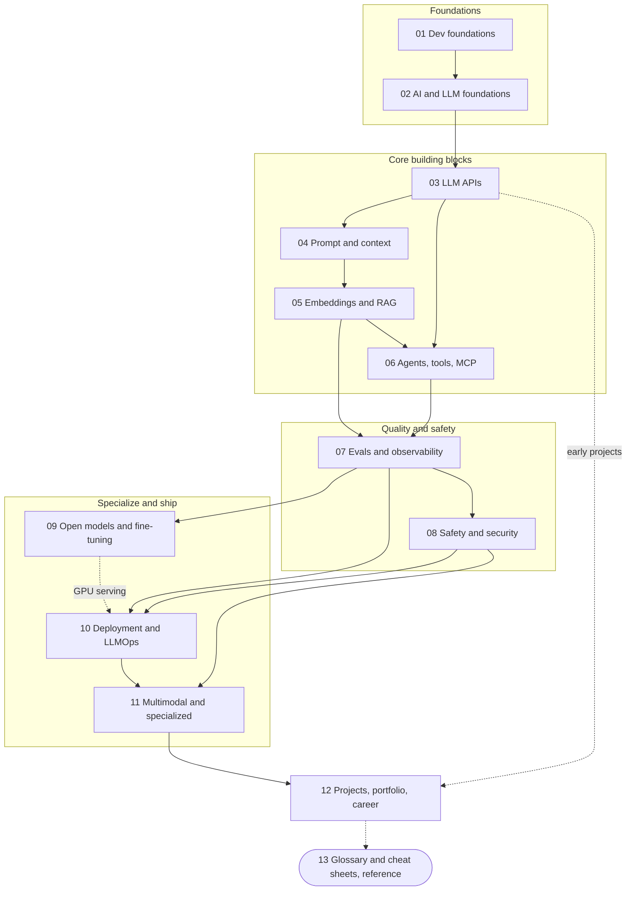

# AI Engineer Roadmap: A Step-by-Step Guide to Becoming an AI Engineer in 2026

A free, project-driven learning path for developers who want to build, evaluate, secure and ship products on top of pre-trained AI models. It has twelve stages that build on each other plus one reference section. Every stage ends with hands-on projects and a self-check list that works as an exit test.

**Who it is for.** Beginner-to-intermediate developers: backend and full-stack engineers adding AI to their skill set, analysts who already write Python, students, and career changers who have written some code. If you have never programmed, spend two to three weeks on a beginner Python course first; [section 01](01-prerequisites-and-dev-foundations.md) explains what to cover. You do not need a machine learning degree, a GPU or paid tooling to start, although a small API budget (with a spending cap) helps.

**What an AI Engineer builds.** An AI Engineer builds products and features on top of pre-trained models, mainly large language models (LLMs) and multimodal models, used through provider APIs or run as open-weight models. Typical work includes assistants that answer from private documents (retrieval-augmented generation, or RAG), data extraction pipelines, tool-using agents, and voice and vision features, plus the evaluation, security, cost control and operations that keep them dependable. This is different from training foundation models from scratch, which needs enormous data, large GPU clusters and research depth, and is done by a small number of labs and large companies. You will learn how those models work well enough to use them wisely, and how to adapt open models with fine-tuning when it pays off, but you will not pretrain one.

**What you will be able to do at the end.**

- Call model providers reliably: streaming, structured outputs, tool calling, retries, and cost and latency budgets.
- Design prompts and context, and test and version them like code.
- Build and evaluate RAG systems and tool-using agents, including Model Context Protocol (MCP) servers.
- Measure quality with evals, gate releases on them in CI, and watch production with traces.
- Threat-model an LLM feature and layer defenses against prompt injection, data leakage and misuse.
- Run open models locally or on rented GPUs, and decide with evidence whether fine-tuning is worth it.
- Deploy with budgets, caching, gateways, tenant isolation and fast rollbacks.
- Present a portfolio of measured, honestly described projects, and prepare for interviews.

Already a working developer? Jump to [Suggested routes](#suggested-routes). Want to see how this role differs from its neighbours first? Read the [role comparison](#role-comparison).

## Originality and review status

This is an independently written, original learning guide. The text, examples, diagrams and structure were written for this repository from the author's own knowledge, official documentation and primary sources.

For the official interactive community roadmap, see [https://roadmap.sh/ai-engineer](https://roadmap.sh/ai-engineer). That site is linked for reference only: none of its content is copied or adapted here, and this guide is not affiliated with or endorsed by it.

**Last reviewed: October 2026.**

Tools, models and APIs change quickly. Model families, SDK method names, framework status, protocol versions, regulation timelines and prices can shift within months. This guide prefers durable concepts, uses placeholders instead of hard-coded model names, and marks perishable statements with "(as of Oct 2026)". Always confirm details in the official documentation of the provider or library before you depend on them. Nothing here is legal, medical or financial advice; the safety, privacy and compliance material is for awareness only.

## Role comparison

Titles are inconsistent across companies and the roles overlap, so read job descriptions rather than titles. This table is a map, not a rule. The full skills matrix is in [section 12, career paths and role comparison](12-projects-portfolio-and-career.md#7-career-paths-and-role-comparison).

| Role | Focus | Typical outputs | Core skills | Math depth |
|------|-------|-----------------|-------------|------------|
| **AI Engineer** | Reliable products and features built on pre-trained models | LLM apps, RAG systems, agents, eval suites, deployed services with cost and safety controls | Software engineering and APIs, prompt and context engineering, retrieval, tool use, evals, security, deployment | Light: vectors, basic probability, enough statistics to read eval results |
| **ML Engineer** | Training, packaging, serving and operating models at scale | Training and feature pipelines, model-serving infrastructure, monitoring, optimized models | Software engineering, PyTorch or similar, data pipelines, MLOps, GPU and infrastructure performance | Moderate to strong: linear algebra, optimization, statistics |
| **Data Scientist** | Turning data into decisions | Analyses, experiments and A/B tests, forecasts, predictive models, stakeholder recommendations | Statistics, SQL, Python or R, experiment design, visualization, communication | Strong in statistics and probability; moderate linear algebra |
| **AI/ML Researcher** | Advancing model capability and methods | Papers, new architectures and training methods, benchmarks, large-scale experiments | Deep learning theory, experiment design, scaling training, reading and writing papers | Deep: linear algebra, calculus, optimization, probability |

In practice an AI Engineer works closest to product teams and ships features; an ML Engineer works closest to training and serving infrastructure. Many people move between the two, and the evaluation and software engineering habits in this roadmap carry over to every column.

## The path at a glance

Stages 01 to 12 are a learning path; section 13 is reference material you open at any point. Solid arrows are hard dependencies (the later stage assumes the earlier one). Dotted arrows are soft links: you can start section 12 projects as soon as you finish 03, and 09 helps with the GPU-serving part of 10. For a bigger picture with one diagram per stage, a prompt-engineering path and a clickable topic list for every section, open the **[Visual Roadmap](00-visual-roadmap.md)**.



Time estimates below describe full-depth coverage: every subsection read and every exercise done, at roughly 8 to 10 hours per week (section 09 assumes 6 to 8). Added together, stages 01 to 11 come to about 34 to 51 weeks. The [suggested routes](#suggested-routes) are shorter core paths that read the essential subsections and treat the graded projects as practice.

| Stage | File | What you learn | Time | Key outcome |
|-------|------|----------------|------|-------------|
| 01. Prerequisites and Developer Foundations | [01-prerequisites-and-dev-foundations.md](01-prerequisites-and-dev-foundations.md) | Python for AI work, type hints and Pydantic, environments, retries and logging, async, pytest, Git, HTTP and JSON, streaming (SSE, WebSockets), secrets hygiene, SQL and data basics, Docker, optional TypeScript, just-enough math | 3-5 weeks | A small tested, containerized Python service that calls web APIs securely and stores data in SQL |
| 02. AI, ML and LLM Foundations | [02-ai-ml-and-llm-foundations.md](02-ai-ml-and-llm-foundations.md) | ML and neural network recap, transformers, tokens and tokenizers, context window and KV cache, how LLMs are trained, sampling and reasoning models, the model landscape, benchmarks, limits and failure modes | 3-4 weeks | Explain at an engineer's level how an LLM turns text into predictions, why it fails the way it does, and how to choose and judge a model |
| 03. LLM APIs and Application Building Blocks | [03-llm-apis-and-structured-outputs.md](03-llm-apis-and-structured-outputs.md) | Provider choice, anatomy of an API call, timeouts, retries and rate limits, SDKs, streaming, structured outputs, tool calling, multimodal inputs, conversation state, cost and latency, key safety, testing LLM code | 3-4 weeks | A dependable call path to any major provider: streaming, validated output, a tool-calling loop, cost and latency control, all tested offline |
| 04. Prompt and Context Engineering | [04-prompt-and-context-engineering.md](04-prompt-and-context-engineering.md) | Prompt anatomy, few-shot, reasoning prompts, decomposition (chaining, routing, ReAct), system prompts, templates and versioning, prompt testing, automatic prompt optimization, context design, trust boundaries | 2-3 weeks | Design, test, version and improve everything a model sees, from one prompt to a managed context window |
| 05. Embeddings, Vector Search and RAG | [05-embeddings-vector-search-and-rag.md](05-embeddings-vector-search-and-rag.md) | Embeddings and similarity, embedding model choice, ANN indexes and vector stores, keyword and hybrid search, chunking, the RAG pipeline, reranking and advanced patterns, RAG evaluation, operations, frameworks | 4-6 weeks | Build, evaluate and debug a RAG system that answers from your documents with citations, backed by measurements |
| 06. Agents, Tool Use and MCP | [06-agents-tools-and-mcp.md](06-agents-tools-and-mcp.md) | Workflows versus agents, the agent loop, tool design, planning, memory, durable execution, Model Context Protocol, frameworks, multi-agent systems, human-in-the-loop, evaluating and securing agents | 4-6 weeks | Design, build, secure and evaluate a tool-using agent, and know when a simpler workflow is the better choice |
| 07. Evaluation, Observability and Testing | [07-evaluation-observability-and-testing.md](07-evaluation-observability-and-testing.md) | Error analysis, eval datasets, metrics, LLM-as-judge, human review, a small eval harness, statistics for non-determinism, regression testing in CI, online evals, tracing and monitoring | 3-4 weeks | A measurable eval loop that gates releases in CI, plus live traces and dashboards that feed failures back into test sets |
| 08. Safety, Security and Responsible AI | [08-safety-security-and-responsible-ai.md](08-safety-security-and-responsible-ai.md) | Threat modeling, OWASP Top 10 for LLM Applications, prompt injection, exfiltration, agent attacks, defense in depth, guardrails, privacy, supply chain, compliance awareness, red teaming, incident response | 2-3 weeks | Threat-model an LLM feature, layer defenses that assume the model will be fooled, and ship with a tested checklist and incident plan |
| 09. Open Models, Fine-Tuning and Local Inference | [09-open-models-fine-tuning-and-local-inference.md](09-open-models-fine-tuning-and-local-inference.md) | Open-weight licenses, Hugging Face, local inference and serving engines, quantization and memory math, prompt versus RAG versus fine-tune, LoRA and QLoRA, preference tuning awareness, data curation, evaluating tuned models, classical ML | 4-6 weeks | Run and serve open models, decide with evidence whether to fine-tune, and when it pays, train, evaluate and ship a LoRA-tuned model |
| 10. Deployment, LLMOps and Scaling | [10-deployment-llmops-and-scaling.md](10-deployment-llmops-and-scaling.md) | Reference architectures, backends, streaming and queues, front-ends, gateways, caching, cost control, latency, reliability, CI/CD and releases, cloud AI platforms, GPU serving, data pipelines, multi-tenancy | 3-5 weeks | Take a feature from notebook to a production service that streams, survives provider failures, controls cost, isolates tenants and rolls back in minutes |
| 11. Multimodal and Specialized Applications | [11-multimodal-and-specialized-applications.md](11-multimodal-and-specialized-applications.md) | Vision-language models, document intelligence, speech and realtime voice, image and video generation, code and data assistants, translation, computer-use agents, domain tracks, on-device AI | 3-5 weeks | Pick a modality or domain and ship a measured, safeguarded application in it |
| 12. Projects, Portfolio, Career and Study Plan | [12-projects-portfolio-and-career.md](12-projects-portfolio-and-career.md) | Study plans, 15 graded projects, portfolio craft, staying current, interview preparation, career paths, beginner FAQs, open source and hackathons | Ongoing | A week-by-week plan, a portfolio that shows evidence instead of claims, and interview readiness |
| 13. Glossary and Decision Cheat Sheets | [13-glossary-and-cheat-sheets.md](13-glossary-and-cheat-sheets.md) | One-page stack map, pre-build questions, decision tables, common errors and first fixes, back-of-envelope formulas, A-to-Z glossary | Reference (about an hour to skim) | Look up any term and choose an approach, tool or fix in seconds |

## Suggested routes

Pick the route that matches your starting point and weekly hours, then add a specialization branch. All three pacing options follow the same order of stages and the same project ladder (P1 to P15) described in [section 12](12-projects-portfolio-and-career.md). If you only have time for a core project path, build P1, P3, P5, P8, P9, P10 and P15.

### Six-month full route (about 10 to 12 hours per week)

This is the default for developers who can already write small programs. It is about 240 to 290 hours across 24 weeks. The week-by-week table, the list of subsections to skim or defer, and the checkpoint evidence are in [section 12, the 6-month plan](12-projects-portfolio-and-career.md#12-the-6-month-plan-about-10-to-12-hours-per-week).

| Month | Weeks | Sections | What you build | Checkpoint |
|-------|-------|----------|----------------|------------|
| 1 | 1-4 | 01, 02, start of 03 | Tested Python service with SQLite storage; token and sampling experiments; **P1** streaming CLI chatbot | 1: it streams and you can explain tokens and context cost |
| 2 | 5-8 | 03, 04 (Docker from 01) | **P3** structured-extraction service, hardened and deployed with a spend cap; **P2** prompt lab | 2: deployed with tests, measured schema-validity rate, prompts versioned |
| 3 | 9-12 | 05, basics of 07 | **P4** semantic search; **P5** chat-with-your-docs RAG with a 40-question eval set | 3: retrieval and answer metrics, README to portfolio standard |
| 4 | 13-16 | 06, 07 | **P8** research agent; **P9** MCP server; **P10** eval harness with a CI gate | 4: you can read a trace and explain a failure; first mock interview |
| 5 | 17-20 | 08, 09 | **P6** text-to-SQL with safety rails; **P11** red-team harness; **P13** LoRA fine-tune versus a prompt baseline | 5: threat model, local model running, documented fine-tune go or no-go |
| 6 | 21-24 | 10, 11, 12 | **P12** gateway; one track project (**P7** or **P14**); **P15** capstone | 6: capstone deployed with write-up and demo; mock interviews done |

If you are a complete beginner, use the 9-month variant in the same section: add three to four weeks of beginner Python first and take roughly 1.5 weeks per row of the weekly table. If you can only give about 5 hours per week, use the [12-month part-time variant](12-projects-portfolio-and-career.md#14-the-part-time-variant-about-5-hours-per-week-over-12-months), which covers the same core path at half the speed.

### Three-month fast track for working developers (10 to 15 hours per week)

For people who already ship backend or full-stack code. It is about 120 to 180 hours across 12 weeks. You skip section 01 after a one-evening self-test on SQL, Docker and HTTP, skim section 02, and use a real problem from your own work as the capstone (with permission, and without confidential data in public repositories). Details are in [section 12, the 3-month fast track](12-projects-portfolio-and-career.md#13-the-3-month-fast-track-for-working-developers-10-to-15-hours-per-week).

| Month | Weeks | Sections | What you build | Checkpoint |
|-------|-------|----------|----------------|------------|
| 1 | 1-4 | 02 (skim), 03, 04, 05, start of 07 | **P1** and **P3** in one sprint, then **P2**; **P4**; **P5** RAG with a 40-question eval set | A: working RAG with measured quality |
| 2 | 5-8 | 07, 06, 08 | **P10** eval harness with a CI gate; **P8** agent with hard step and cost limits; **P9** MCP server for an API you use at work; **P11** red-team harness | B: evals gating CI and an attack report on your own system |
| 3 | 9-12 | 10, 09, 11, 12 | Deployment with budgets, rate limits and tracing; local model behind your adapter and a data-backed fine-tune decision; one specialized track; **P15** capstone | C: capstone shipped with write-up and mock interviews |

Prefer depth in P5, P8, P10 and P15 over finishing every project.

### Specialization branches

A specialization is depth added on top of the core path (sections 01 to 08 and 10), not a replacement for it. Choose one primary branch and one secondary branch, then use your capstone to show end-to-end evidence in the primary one. Section 11 also offers a track chooser in [choosing a specialization](11-multimodal-and-specialized-applications.md#15-choosing-a-specialization).

| Branch | Choose it when | Deepen these sections | Projects | Evidence to show |
|--------|----------------|-----------------------|----------|------------------|
| RAG and search | You like information retrieval, data plumbing and relevance tuning | [05](05-embeddings-vector-search-and-rag.md) in full (hybrid search, reranking, RAG evaluation, operations); RAG evals in [07](07-evaluation-observability-and-testing.md); data pipelines in [10](10-deployment-llmops-and-scaling.md); documents in [11](11-multimodal-and-specialized-applications.md) | P4, P5, P7, P10 | Labeled question set, retrieval and answer metrics, citation checks, cost per query |
| Agents and tool use | You enjoy systems design, protocols and control flow | [06](06-agents-tools-and-mcp.md) in full (tool design, MCP, durable execution, agent evals); decomposition patterns in [04](04-prompt-and-context-engineering.md); agent attacks in [08](08-safety-security-and-responsible-ai.md) | P8, P9, P11 | Run traces, hard step and cost limits, a tested permission model, an MCP server others can use |
| Evals and LLMOps | You like quality, reliability and platform work | [07](07-evaluation-observability-and-testing.md) in full; gateways, caching, cost control and release management in [10](10-deployment-llmops-and-scaling.md); red teaming in [08](08-safety-security-and-responsible-ai.md) | P10, P11, P12 | CI regression gate, trace-based dashboards, a demonstrated rollback, cost-per-task trend |
| Open models and fine-tuning | You like training loops, GPUs and careful measurement | [09](09-open-models-fine-tuning-and-local-inference.md) in full; how LLMs are built in [02](02-ai-ml-and-llm-foundations.md); GPU serving in [10](10-deployment-llmops-and-scaling.md); eval design in [07](07-evaluation-observability-and-testing.md) | P13, plus P12 for routing across backends | Baseline versus tuned comparison with a go or no-go decision, memory math, serving benchmark |
| Voice and multimodal | You like realtime systems, audio and visual products | Vision, speech, realtime voice and generation in [11](11-multimodal-and-specialized-applications.md); multimodal inputs in [03](03-llm-apis-and-structured-outputs.md); streaming in [10](10-deployment-llmops-and-scaling.md) | P7, P14 | Latency and accuracy numbers per modality, consent and misuse safeguards, a short demo |

## How to use this roadmap

- **Read each stage with its topic map first.** Every section file uses the same layout: a metadata block (time, prerequisites, outcome), why the stage matters, a topic map, numbered core sections with "Try it" exercises, a tools table, common pitfalls, three hands-on projects, a self-check list and verified resources. Skim the topic map, read the core sections in order, and keep the tools table for later lookups.
- **Treat the self-check lists as exit criteria.** Each file ends with 10 to 15 "I can ..." items. Copy them into your own notes or repository and tick an item only when you can show evidence: working code, a passing test, or a measured number. If you cannot, spend a few more days on that topic before moving on.
- **Build every week.** Reading without shipping decays within days. Each section has a starter, intermediate and advanced project with acceptance criteria; the 15 graded projects in [section 12](12-projects-portfolio-and-career.md#2-graded-projects) tie them into one ladder. Write the acceptance criteria before you write code.
- **Evals from your first structured-output project.** Give every project a small labeled test set and grow it as projects get harder. This is the habit that separates AI engineers from people who only call APIs; [section 07](07-evaluation-observability-and-testing.md) shows how.
- **Learn the raw SDK and the concepts before a framework.** Frameworks come and go; once you know what they do for you, choosing one is easy.
- **Build a portfolio that shows evidence.** After each project, spend 30 minutes on a README that meets the standard in [section 12, portfolio craft](12-projects-portfolio-and-career.md#3-portfolio-craft): problem, architecture, quickstart, evaluation results, cost and latency numbers, honest limitations and next steps. Protect your wallet on public demos with API keys, rate limits and hard spend caps.
- **Use AI coding assistants as a tutor, not a crutch.** Read everything they generate and write some code by hand; see [01 section 17](01-prerequisites-and-dev-foundations.md#17-using-ai-coding-assistants-while-learning-and-as-a-professional).
- **Track progress in a file you own.** Keep a plain `LEARNING_LOG.md` (date, what you tried, result, next step) and a tracker like the one below. Review it weekly, and hold a checkpoint review whenever a plan row says so. Checkpoint evidence is listed in [section 12, milestones](12-projects-portfolio-and-career.md#15-milestones-and-checkpoints).
- **Use section 13 as your desk reference.** Search the glossary for terms and error messages, and use the decision tables before you choose a vector store, an eval method or a hosting route.

A tracker you can copy into your own repository:

```markdown
## Progress tracker

| Section | Started | Self-check items done | Project shipped (link) | Notes and gaps |
|---------|---------|-----------------------|------------------------|----------------|
| 01 | YYYY-MM-DD | 0 of 14 | | |
| 02 | | | | |
| 03 | | | | |
```

## Relationship to the rest of this repository

This repository has three other documents, and each plays a different role relative to this roadmap.

| File | What it covers | How it relates |
|------|----------------|----------------|
| [README.md](../README.md) | A short guide to the core machine learning and deep learning libraries (NumPy, pandas, scikit-learn, TensorFlow, PyTorch, Keras), training file formats, data preparation, ensembles, CNN and NLP primers, and a beginner-to-expert plan | Classical ML and deep learning refresher behind [02](02-ai-ml-and-llm-foundations.md), [09](09-open-models-fine-tuning-and-local-inference.md) and [11](11-multimodal-and-specialized-applications.md) |
| [Machine Learning Beginner Roadmap](../Machine%20Learning%20Beginner%20Roadmap_.md) | Long chapters on math for ML, the Python toolkit, data preparation, scikit-learn, ensembles, CNNs, NLP, and a project-based learning path | The deeper foundation: math, classical ML, neural networks and NLP, from which this roadmap picks only what LLM work needs |
| [Multilingual PDF Processor Blueprint](../multilingual-pdf-processor-blueprint.md) | A long production design for an event-driven, queue-backed system that extracts, translates and structures data from multilingual PDFs | A worked, production-scale example for sections [05](05-embeddings-vector-search-and-rag.md), [10](10-deployment-llmops-and-scaling.md) and [11](11-multimodal-and-specialized-applications.md) |

**The ML guide supplies the foundations.** You do not have to finish it before you start here: the AI engineering path needs only the just-enough math in section 01 and the recap in section 02. Go back to it when you want more depth, for example to train a classical model as a baseline, read a loss curve with confidence, or understand CNNs behind vision models.

| If you want more depth on | Read in the ML guide | Then continue here |
|---------------------------|----------------------|--------------------|
| Vectors, probability and statistics | [Chapter 1, the essential mathematics of ML](../Machine%20Learning%20Beginner%20Roadmap_.md) | [01 section 15](01-prerequisites-and-dev-foundations.md#15-just-enough-math-and-statistics) |
| Python environment and core libraries | Chapter 2 (same file) | [01 sections 1 to 3](01-prerequisites-and-dev-foundations.md#1-python-essentials-for-ai-work) |
| Data splits, cleaning and metrics | Chapters 3 and 4 (same file), and the data preparation part of the [main README](../README.md) | [02 section 2](02-ai-ml-and-llm-foundations.md#2-machine-learning-recap) and [07](07-evaluation-observability-and-testing.md) |
| scikit-learn and ensembles as baselines | Chapters 4 and 5 (same file) | [09 section 11, classical ML still matters](09-open-models-fine-tuning-and-local-inference.md#11-classical-ml-still-matters) |
| CNNs and computer vision | Chapter 6 (same file) and the [CNN primer](../README.md#understanding-cnns-and-nlp) | [02 section 3](02-ai-ml-and-llm-foundations.md#3-neural-network-essentials) and [11 section 2](11-multimodal-and-specialized-applications.md#2-vision-language-models) |
| NLP before transformers | Chapter 7 (same file) | [02 section 4](02-ai-ml-and-llm-foundations.md#4-nlp-history-in-one-arc) and [05 section 1](05-embeddings-vector-search-and-rag.md#1-embeddings-what-they-are-how-they-are-trained-what-similar-means) |

**The multilingual PDF blueprint is a worked example.** It shows how an AI component sits inside a larger production pipeline, which is exactly the gap between a notebook and a service:

- For [section 05](05-embeddings-vector-search-and-rag.md): turning messy documents into clean, chunkable text and structured fields before retrieval.
- For [section 10](10-deployment-llmops-and-scaling.md): event-driven design, queues and asynchronous processing, autoscaling and capacity planning. Section 10 has a [worked-example table](10-deployment-llmops-and-scaling.md#15-worked-example-a-production-scale-pipeline) that maps topics to the blueprint's sections.
- For [section 11](11-multimodal-and-specialized-applications.md): OCR versus vision-language models, document intelligence and translation.

Read it as a design document, not a tutorial: treat its numerical targets (accuracy, throughput, savings) as design goals rather than measured results, and check the services it names against current official docs. A good exercise after sections 05, 10 and 11 is to mark where you would add evals ([07](07-evaluation-observability-and-testing.md)), guardrails ([08](08-safety-security-and-responsible-ai.md)) and cost caps ([10](10-deployment-llmops-and-scaling.md)), then build a small slice of it as project P7 in [section 12](12-projects-portfolio-and-career.md).

## Short FAQ

**Is AI engineering a good career?**
It can be, with caveats. Demand for people who ship reliable LLM features is real in many markets, but titles, tools and hype change quickly and entry-level competition can be strong. The durable assets are software engineering, evaluation, security awareness and domain knowledge. Check current job posts in your region rather than trusting a single claim; see the [career paths](12-projects-portfolio-and-career.md#7-career-paths-and-role-comparison) and [beginner FAQs](12-projects-portfolio-and-career.md#8-beginner-faqs) in section 12. This is general awareness, not personal career advice.

**Do I need a degree?**
Usually not for application-focused AI Engineer roles; shipped, measured projects carry a lot of weight (see [portfolio craft](12-projects-portfolio-and-career.md#3-portfolio-craft)). Some employers still filter on degrees, and research roles typically expect advanced study.

**How much math do I need?**
Light but real: vectors and dot products (cosine similarity), basic probability, and enough statistics to read eval results (variance, confidence intervals, precision and recall). [01 section 15](01-prerequisites-and-dev-foundations.md#15-just-enough-math-and-statistics) covers it, and Chapter 1 of the [ML roadmap](../Machine%20Learning%20Beginner%20Roadmap_.md) goes deeper. Training and research roles need more.

**Python or TypeScript?**
Learn Python first: it dominates evals, data work, fine-tuning and serving, and the main provider SDKs support it. Add TypeScript if you build web products or streaming UIs; see [01 section 14](01-prerequisites-and-dev-foundations.md#14-typescript-and-javascript-basics-optional-but-valuable) and the [SDKs section in 03](03-llm-apis-and-structured-outputs.md#4-official-sdks-compatible-endpoints-and-unified-clients). The concepts transfer.

**Do I need GPUs?**
Not to start. Hosted APIs cover most of the roadmap, small quantized open models run on a laptop, and a rented GPU for a few hours is enough for the fine-tuning exercises. [09 section 4](09-open-models-fine-tuning-and-local-inference.md#4-quantization-and-the-memory-math) teaches the memory math, and [10 section 11](10-deployment-llmops-and-scaling.md#11-self-hosted-gpu-serving) covers self-hosted GPU serving when you need it.

**How do I stay current without burning out?**
Use a small routine instead of chasing every release: a few hours a week, official changelogs, and an afternoon-sized evaluation of any new model on your own eval set. See [staying current](12-projects-portfolio-and-career.md#5-staying-current-without-burning-out), and use [section 13](13-glossary-and-cheat-sheets.md) for vocabulary.

**What is regression testing for LLM apps?**
A fixed set of representative and previously failing inputs, scored by graders, re-run on every change to a prompt, model, retrieval setting or code, with thresholds that fail CI when quality drops. Because outputs vary between runs, you compare scores statistically rather than by exact string match. See [07 section 9](07-evaluation-observability-and-testing.md#9-regression-testing-for-llm-apps), [07 section 7](07-evaluation-observability-and-testing.md#7-handling-non-determinism-and-statistics) and project P10.

**What is observability for LLM apps?**
The ability to see what happened inside a live system: a trace per request with prompts, retrieved context, tool calls, latency, token counts, cost, errors and user feedback, plus dashboards and alerts. Its real value is the loop it closes, where production failures become new test cases. See [07 section 12](07-evaluation-observability-and-testing.md#12-observability-for-llm-apps) and [07 section 13](07-evaluation-observability-and-testing.md#13-quality-monitoring-in-production-and-the-data-flywheel).

## Contributing and updates

Corrections and improvements are welcome. To propose a change:

1. Open an issue on the repository (if Issues are enabled) or a pull request with the fix. For an issue, include the file and heading, what is wrong or outdated, the evidence (a link to the official documentation and the date you checked it), and your suggested wording.
2. Keep each pull request small and focused on one topic.
3. Follow the conventions used throughout the guide: GitHub-flavored Markdown only, no emojis and no raw HTML; relative links that resolve (encode spaces as `%20`); short code samples that parse and read secrets from environment variables; model names as placeholders such as `LLM_MODEL`; and perishable claims marked with "(as of Month Year)".
4. Write in your own words. Do not paste text from other roadmaps, courses or books, including [https://roadmap.sh/ai-engineer](https://roadmap.sh/ai-engineer) and any other source whose license forbids republishing.
5. Prefer official documentation and primary sources for links, and open each link before you submit it.

Whatever you read here, verify it against the official documentation of the tool, provider or regulator before you rely on it. This matters most for pricing, limits, model availability, security guidance and anything compliance-related, because those change fastest.

---

Start here: [01. Prerequisites and Developer Foundations](01-prerequisites-and-dev-foundations.md) | Planning your time: [12. Projects, Portfolio, Career and Study Plan](12-projects-portfolio-and-career.md) | Reference: [13. Glossary and Decision Cheat Sheets](13-glossary-and-cheat-sheets.md)
