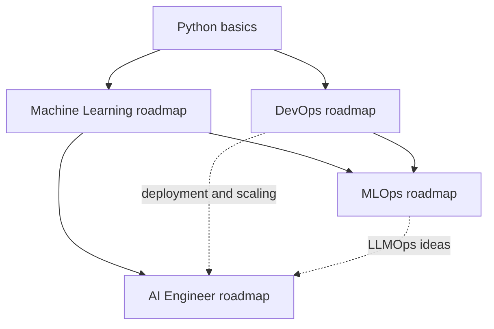

# Roadmaps: Machine Learning, MLOps and DevOps

Three step-by-step learning guides that sit next to the [AI Engineer Roadmap](../AI-Engineer-Roadmap/README.md). Each one covers every topic of its field in a fixed order, explains it in plain language with small examples, and ends with projects, a study plan and a coverage checklist you can tick off.

| Roadmap | File | Read it when you want to | Prerequisites |
|---------|------|--------------------------|---------------|
| Machine Learning | [machine-learning-roadmap.md](machine-learning-roadmap.md) | Understand and build models: math foundations, Python and data work, classical ML, evaluation, deep learning (CNNs, RNNs, attention, autoencoders, GANs), explainable AI and NLP | Basic Python |
| DevOps | [devops-roadmap.md](devops-roadmap.md) | Ship and run software reliably: Linux and the terminal, Git, containers, networking, cloud, infrastructure as code, CI/CD, monitoring, orchestration, GitOps, service mesh and cloud design patterns | Comfort with one programming language |
| MLOps | [mlops-roadmap.md](mlops-roadmap.md) | Put machine learning into production and keep it healthy: versioning of code, data and models, pipelines, experiment tracking, serving, monitoring, edge AI and explainability | DevOps basics, Python, some ML |

## How the roadmaps fit together

MLOps is the meeting point of the other two: it takes models from machine learning and runs them with the practices and tools of DevOps. The AI Engineer roadmap is the product-side route for people who build on pre-trained models instead of training their own.

Solid arrows are hard dependencies; dotted arrows are soft links that help but are not required.

## Which route should I take?

| Your goal | Suggested order |
|-----------|-----------------|
| Become a machine learning engineer | Machine Learning, then DevOps (at least Linux, Git, Docker, CI/CD and cloud basics), then MLOps |
| Move from DevOps or backend work into ML platforms | DevOps (skim what you know), Machine Learning stages on data, evaluation and scikit-learn, then MLOps |
| Build products on top of LLMs | [AI Engineer Roadmap](../AI-Engineer-Roadmap/README.md), plus the DevOps stages on containers, CI/CD and observability when you reach its deployment section |
| Learn the theory first | Machine Learning, using the long chapters in the [Machine Learning Beginner Roadmap](../Machine%20Learning%20Beginner%20Roadmap_.md) as your deep reference |

## Related material in this repository

| File | How it relates |
|------|----------------|
| [Main README](../README.md) | Short guide to the core Python ML libraries, training data formats, data preparation, ensembles and CNN and NLP primers |
| [Machine Learning Beginner Roadmap](../Machine%20Learning%20Beginner%20Roadmap_.md) | Long chapters on the mathematics, the Python toolkit, scikit-learn, ensembles, CNNs and NLP; the Machine Learning roadmap here links into it |
| [AI Engineer Roadmap](../AI-Engineer-Roadmap/README.md) | Twelve stages on LLM APIs, RAG, agents, evals, security, fine-tuning and deployment |
| [Multilingual PDF Processor Blueprint](../multilingual-pdf-processor-blueprint.md) | A production-scale pipeline design that illustrates many MLOps and DevOps ideas |

## Originality and review status

These guides are independently written for this repository. Their topic coverage follows the community diagrams at [https://roadmap.sh/machine-learning](https://roadmap.sh/machine-learning), [https://roadmap.sh/mlops](https://roadmap.sh/mlops) and [https://roadmap.sh/devops](https://roadmap.sh/devops), which are linked for reference only: none of their text is copied, and this repository is not affiliated with or endorsed by that site. The explanations, examples and exercises are original.

**Last reviewed: October 2026.** Tools, cloud services and versions change quickly. Perishable statements are marked "(as of Oct 2026)"; confirm details in each tool's official documentation before relying on them.

## How to use these guides

- **Hinglish boxes for beginners.** Under every stage and every topic heading there is a quoted box titled "Hinglish me samjho (simple language)". It explains the idea in simple Roman Hindi with an everyday comparison, then gives a small step-by-step example (what to type and what you will see) and the most common mistake. The detailed English text stays right below the box, so you can read the simple version first and then the technical one. Commands in the boxes are meant for a practice folder or sandbox; read any "Safai" (clean-up) step and the warnings before you run it.
- Follow the stages in order the first time through, then use the table of contents to revisit single topics.
- Where a stage lists several tools, treat them as alternatives: pick one, learn it well, and understand the concept it implements, because the concept outlives the tool.
- Do the "Try it" exercise and the "Self-check" list at the end of every stage before moving on; tick an item only when you can show working code, a passing run or a measured result.
- Use the coverage checklist at the end of each file to track which topics you have completed.
