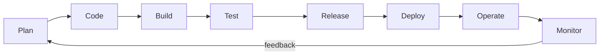
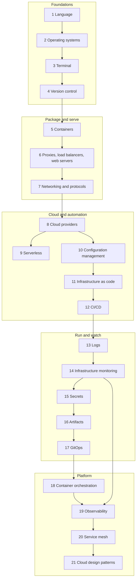
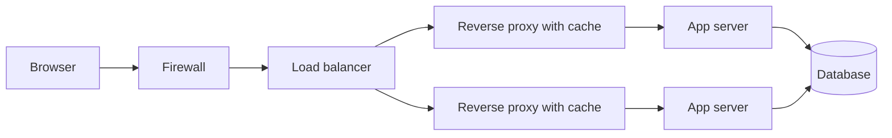

# DevOps Roadmap: A Step-by-Step Guide to Building, Shipping and Running Software in 2026

A free, hands-on learning path for people who want to take software from a laptop to production and keep it healthy once it is there. It has twenty-one stages that follow the topic tree of the community DevOps roadmap, three capstone projects, a weekly study plan and a coverage checklist you can tick off. Every stage ends with a "Try it" exercise and a self-check list that works as an exit test.

**What DevOps is.** DevOps is three things working together. It is a culture in which the people who write software and the people who run it share responsibility for how it behaves in production. It is a set of practices: everything lives in version control, changes are tested automatically, releases are small and frequent, infrastructure is described as code, and failures are studied without blame. And it is a toolbox that makes those practices cheap enough to follow every day. The point is a short, safe, repeatable loop between an idea and running software that people depend on, and back again with feedback.



Every tool in this roadmap sits somewhere on that loop. Git and CI tools cover code, build and test; registries and GitOps cover release and deploy; Kubernetes, cloud platforms and configuration management cover operate; logs, metrics and traces cover monitor. Learn the loop first and the tools become easy to place.

**Who it is for.** Developers who want to understand how their code runs in production, system administrators moving toward automation, support and QA engineers growing into platform work, students, and career changers who have written some code. You do not need a computer science degree or paid tooling to start.

**Prerequisites.** Basic computer literacy, comfort installing software and typing commands, and the ability to read a short program in any language. If you have never programmed, do a small beginner course in Python first; [stage 1](#1-learn-a-programming-language) says what to cover. You need a computer that can run Linux in a virtual machine or WSL2 and run containers, a free account on a Git hosting site, and later a cloud account protected by a billing alert (set it up in [stage 8](#8-cloud-providers) before you create anything).

**What you will be able to do at the end.**

- Work confidently in a Linux terminal: scripts, processes, networking tools and text processing.
- Use Git in a team, with branches, reviews and a clean history.
- Package applications as container images and serve them behind a reverse proxy with TLS.
- Explain what happens between typing a URL and seeing a page: DNS, TCP, TLS, HTTP, proxies and load balancers.
- Provision cloud infrastructure with code, configure servers repeatably, and ship through a CI/CD pipeline.
- Run workloads on Kubernetes and deploy them with a GitOps workflow.
- Manage secrets safely and keep build artifacts trustworthy.
- Collect logs, metrics and traces, write alerts that matter, and apply well-known cloud design patterns to make systems resilient.

**Time estimate.** The 21 stages add up to about 29 to 36 weeks at 8 to 10 hours per week when you read everything and do every "Try it" exercise. The [weekly plan](#23-suggested-weekly-study-plan) is a 34-week schedule (roughly 270 to 340 hours) that fits in the three capstone projects by skimming the lighter stages. If you already know Linux, Git and one language, expect to finish nearer 28 weeks.

**Reading the roadmap legend.** Community roadmaps such as the one this guide follows use a visual legend, and this guide carries the same ideas over in plain words:

- **The order is not strict.** The stages are arranged so each one builds on the last, but you can reorder them, and many learners do Docker before networking or Git before the terminal. Skim a stage you already know and use its self-check as a test.
- **Tools in a category are alternatives.** When a stage lists Chef, Ansible, Salt and Puppet, or eight CI/CD tools, do not learn all of them. Pick one, learn it well, and use the comparison tables to understand what the others do differently. The concepts transfer; the syntax does not matter much.
- **Personal preference and context decide.** Your employer's stack, your cloud account, your team's skills and your own taste are all legitimate reasons to choose a tool. Be able to explain why you chose it and what you gave up.

**Lab safety.** Practice on disposable virtual machines, containers and throwaway cloud accounts. Never commit secrets to Git, never run port scans or load tests against systems you do not own, set a billing alert and a budget before using any paid cloud service, and delete resources when you finish an exercise.

## Originality and review status

This is an independently written, original learning guide. The text, examples, diagrams and structure were written for this repository from the author's own knowledge, official documentation and primary sources.

Its topic coverage follows the community DevOps roadmap at [https://roadmap.sh/devops](https://roadmap.sh/devops). That site is linked for reference only: none of its content is copied or adapted here, and this guide is not affiliated with or endorsed by it.

**Last reviewed: October 2026.**

Tools, cloud services and file formats change quickly. Versions, product names, licenses, free tiers, limits and prices can shift within months. This guide prefers durable concepts, uses placeholder domains such as `example.com`, never hard-codes prices, and marks perishable statements with "(as of Oct 2026)". Confirm details in the official documentation before you depend on them. Nothing here is legal, security or financial advice; the security material is for awareness only.

## Table of contents

- **Start here:** [The path at a glance](#the-path-at-a-glance)
- **Foundations:** [1. Learn a Programming Language](#1-learn-a-programming-language) | [2. Operating System](#2-operating-system) | [3. Terminal Knowledge](#3-terminal-knowledge) | [4. Version Control Systems](#4-version-control-systems) | [5. Containers](#5-containers) | [6. What is and how to setup X?](#6-what-is-and-how-to-setup-x) | [7. Networking and Protocols](#7-networking-and-protocols)
- **Cloud and automation:** [8. Cloud Providers](#8-cloud-providers) | [9. Serverless](#9-serverless) | [10. Configuration Management](#10-configuration-management) | [11. Provisioning (Infrastructure as Code)](#11-provisioning-infrastructure-as-code) | [12. CI/CD Tools](#12-cicd-tools)
- **Run and watch:** [13. Logs Management](#13-logs-management) | [14. Infrastructure Monitoring](#14-infrastructure-monitoring) | [15. Secret Management](#15-secret-management) | [16. Artifact Management](#16-artifact-management) | [17. GitOps](#17-gitops)
- **Platform:** [18. Container Orchestration](#18-container-orchestration) | [19. Observability](#19-observability) | [20. Service Mesh](#20-service-mesh) | [21. Cloud Design Patterns](#21-cloud-design-patterns)
- **Wrap-up:** [22. Capstone projects](#22-capstone-projects) | [23. Suggested weekly study plan](#23-suggested-weekly-study-plan) | [24. Related guides in this repository](#24-related-guides-in-this-repository) | [25. Coverage checklist](#25-coverage-checklist)

## The path at a glance

Solid arrows show the suggested order. Stages 1 to 7 are the foundation that everything else assumes, stages 8 to 12 teach you to create and automate infrastructure, stages 13 to 17 teach you to run and watch it, and stages 18 to 21 move you to platform-level work. Secrets and artifacts (15 and 16) are small topics you can pull forward as soon as your first pipeline needs them.



Time estimates are for full-depth coverage at 8 to 10 hours per week, with every "Try it" exercise done. Skim the stages you already know.

| Stage | What you learn | Time | Key outcome |
|-------|----------------|------|-------------|
| 1. Programming language | Choosing one language; Python, Ruby, Go, Rust and JavaScript compared; writing small automation tools | 2-3 weeks | A tested command-line tool you wrote yourself |
| 2. Operating system | Windows basics; the Unix and Linux family; packages, services, permissions | 1 week | A Linux server you can install, update and troubleshoot |
| 3. Terminal knowledge | Bash and PowerShell scripting, editors, process and performance monitoring, networking tools, text manipulation | 2 weeks | A safe, reusable shell script and fast log-digging skills |
| 4. Version control systems | Git internals and workflows; GitHub, GitLab and Bitbucket | 1-2 weeks | A pull-request workflow with branch protection |
| 5. Containers | Docker images, Dockerfiles, Compose, LXC | 2 weeks | An app in a small, non-root, multi-stage image |
| 6. What is and how to setup X? | Forward and reverse proxies, caches, firewalls, load balancers, web servers | 1 week | Nginx in front of two app instances with caching and a firewall |
| 7. Networking and protocols | FTP and SFTP, DNS, HTTP, HTTPS, TLS, SSH, the OSI model, email protocols | 2-3 weeks | You can debug a connectivity problem layer by layer |
| 8. Cloud providers | Shared cloud concepts; eight providers compared | 1-2 weeks | A VM running a service with a budget alert, then torn down |
| 9. Serverless | Functions and platforms; limits and trade-offs | 1 week | A function behind HTTPS with its cold-start behavior measured |
| 10. Configuration management | Chef, Ansible, Salt, Puppet; idempotency | 1 week | A playbook that configures a fresh server in one run |
| 11. Provisioning (IaC) | Terraform, CloudFormation, AWS CDK, Pulumi; state | 2 weeks | Cloud infrastructure created, changed and destroyed from code |
| 12. CI/CD tools | Pipelines and eight tools; deployment strategies | 2 weeks | A pipeline that tests, builds and deploys on merge |
| 13. Logs management | Structured logging; Papertrail, Splunk, Loki, Elastic Stack, Graylog | 1 week | Central, searchable logs with a retention policy |
| 14. Infrastructure monitoring | Metrics, alerts, SLOs; Prometheus, Grafana, Zabbix, Datadog | 1-2 weeks | A dashboard and an alert that wakes you for the right reason |
| 15. Secret management | Sealed Secrets, ESO, Vault, SOPS, cloud tools | 1 week | No secret in Git, in an image or in a log |
| 16. Artifact management | Registries and repository managers; Artifactory, Nexus, Cloudsmith | 1 week | Immutable, versioned artifacts promoted across environments |
| 17. GitOps | Pull-based delivery; Argo CD and Flux CD | 1 week | A cluster that syncs itself from a Git repository |
| 18. Container orchestration | Kubernetes core; managed Kubernetes, ECS and Fargate, Swarm, OpenShift | 3-4 weeks | A resilient app on Kubernetes with probes, limits and rollouts |
| 19. Observability | Traces, metrics and logs together; OpenTelemetry, Jaeger and platforms | 1-2 weeks | One request followed across services by trace id |
| 20. Service mesh | Istio, Consul, Linkerd, Envoy; mTLS and traffic shifting | 1 week | A canary release and mutual TLS with no application changes |
| 21. Cloud design patterns | Availability, data management, design and implementation, management and monitoring patterns | 1 week | You can name and apply the right pattern to a given failure |
| 22 to 25. Capstones, plan, guides, checklist | Three projects, a 34-week schedule, related reading, a tick-off list | Built into the plan | Portfolio evidence that you can ship and operate software |

## 1. Learn a Programming Language

<!-- hinglish:start s01 -->
> **Hinglish me samjho (simple language)**
>
> **Is stage me kya seekhoge:** DevOps ka bahut sara kaam automation hota hai, aur automation ka matlab hai code. Chhote scripts, pipelines aur tools ko aapas me jodna, sab kuch programming se hota hai. Aapko bada software architect banne ki zaroorat nahi. Bas itna aana chahiye ki aap code padh sako, ek chhota bharosemand tool likh sako, aur kisi API (dusre program se baat karne ka darwaza) ko call kar sako. Yahan paanch languages di hain, lekin ye options hain, checklist nahi. Ek language chuno aur usse achhe se seekho.
>
> **Seekhne ka order:** Python (sabse aasaan, har tool ki library), Ruby (Chef aur Vagrant ki files isi me), Go (Docker aur Kubernetes isi me bane hain), Rust (bahut tez aur safe, par seekhna mushkil), JavaScript aur Node.js (build tools aur serverless functions).
>
> **Is stage ke baad aap kar paoge:** ek language me alag environment banakar packages install karna, ek chhota command-line tool likhna jo websites check kare, aur uska automatic test chalana.

<!-- hinglish:end s01 -->

**Why it matters.** DevOps work is automation, and automation is code: scripts that glue tools together, small services, pipeline logic, infrastructure definitions, and the occasional bug hunt inside an application you did not write. You do not need to become a software architect, but you must be able to read application code, write a reliable tool of a few hundred lines, and call an API or SDK. Pick one language, get past the basics (variables, functions, data structures, files, errors, HTTP calls, tests, packages) and go deep enough to build something real. The five languages below are alternatives, not a checklist.

| Language | Strengths for DevOps | Typical use | Watch out for |
|----------|----------------------|-------------|---------------|
| Python | Readable, large standard library, mature cloud SDKs | Automation scripts, cloud SDK glue, Ansible extensions, data pipelines | Environment and dependency drift |
| Ruby | Expressive, friendly to internal DSLs | Chef recipes, Vagrant files, older tooling, Rails apps | A smaller share of new infrastructure tools |
| Go | Static binaries, fast, simple concurrency | CLIs, Kubernetes operators, exporters, many cloud-native tools | Verbose error handling, fewer scripting conveniences |
| Rust | Memory safety with high performance | Fast CLIs, agents and proxies | Steep learning curve, slower to write |
| JavaScript / Node.js | One language front to back, event-driven I/O | Serverless functions, build tooling, CDK and Pulumi programs | Dependency sprawl and supply-chain risk |

### 1.1 Python

<!-- hinglish:start t-11-python -->
> **Hinglish me samjho (simple language)**
>
> **Simple words me:** Python ek aisi programming language hai jo almost angrezi jaisi padhi jaati hai. DevOps me ye isliye pasand ki jaati hai kyunki cloud aur tools ki libraries (ready-made code ke packets) lagbhag sab Python me milti hain. Virtual environment ek alag "dabba" hai jisme sirf aapke project ke packages rehte hain, taaki computer ka baaki Python kharab na ho.
>
> **Kyun zaroori hai:** Agar aap packages seedhe system Python me install karoge, to kabhi na kabhi koi tool toot jayega. Virtual environment se har project ki cheezein alag rehti hain aur dobara wahi setup banana aasaan hota hai.
>
> **Example, step by step:**
>
> 1. Pehle check karo Python laga hai ya nahi (Windows par `python --version` likho):
>
> ```bash
> python3 --version
> ```
>
> 2. Ek naya folder banao, uske andar virtual environment banao aur use "on" karo, phir `pytest` (test chalane wala tool) install karo:
>
> ```bash
> mkdir py-demo && cd py-demo
> python3 -m venv .venv
> source .venv/bin/activate
> pip install pytest
> ```
>
> Windows PowerShell me activate karne ki line ye hai: `.venv\Scripts\Activate.ps1`. Activate hone par prompt ke aage `(.venv)` dikhega.
>
> 3. Ek chhota function aur uska test banao, phir test chalao:
>
> ```bash
> cat > greet.py <<'EOF'
> def greet(name):
>     return f"Namaste, {name}!"
> EOF
> cat > test_greet.py <<'EOF'
> from greet import greet
>
> def test_greet():
>     assert greet("Ravi") == "Namaste, Ravi!"
> EOF
> pytest
> ```
>
> Output me aakhri line kuch aisi dikhegi (time alag hoga): `1 passed in 0.01s`.
>
> 4. Kaam khatam hone par environment band karo:
>
> ```bash
> deactivate
> ```
>
> **Dhyan rakho:**
>
> - Hamesha `pip install` se pehle check karo ki `(.venv)` dikh raha hai. Warna package system Python me chala jayega.
> - `.venv` folder ko Git me commit mat karo. Packages ki list `requirements.txt` me rakho (`pip freeze > requirements.txt`).
> - Script me command chalani ho to `subprocess.run(..., check=True)` use karo, taaki fail hone par error chhup na jaye.

<!-- hinglish:end t-11-python -->

The usual first choice for operations work, because it reads clearly and almost every cloud, API and tool has a Python library or SDK. Learn virtual environments (`python -m venv`), `pip`, type hints, `argparse`, `pathlib`, `subprocess` with `check=True`, `logging` and `pytest`; you will meet Ansible and many cloud utilities that are written in Python. The common pitfall is installing packages globally and breaking the system Python, so always work inside a virtual environment.

### 1.2 Ruby

<!-- hinglish:start t-12-ruby -->
> **Hinglish me samjho (simple language)**
>
> **Simple words me:** Ruby ek aisi language hai jo likhne me bahut khuli aur aasaan lagti hai. DevOps me aap ise zyada tar tab dekhoge jab Chef ki recipes ya Vagrant ki file padhni ho, kyunki ye files asal me Ruby code hi hoti hain. Puppet tool bhi Ruby me bana hai.
>
> **Kyun zaroori hai:** Purani aur badi companies ki configuration management files Ruby me hoti hain. Thoda Ruby aata ho to aap unhe bina dare padh aur badal sakte ho.
>
> **Example, step by step:**
>
> 1. Check karo Ruby laga hai ya nahi. Na ho to `rbenv` jaise version manager se install karo (ye alag-alag Ruby versions switch karne ka tool hai):
>
> ```bash
> ruby --version
> ```
>
> 2. Ek chhoti script banao jo list ke har server ka naam print kare, aur chalao:
>
> ```bash
> cat > hello.rb <<'EOF'
> servers = ["web1", "web2", "db1"]
> servers.each do |name|
>   puts "Checking #{name}"
> end
> EOF
> ruby hello.rb
> ```
>
> Output ye dikhega:
>
> ```text
> Checking web1
> Checking web2
> Checking db1
> ```
>
> 3. Ruby ke packages ko "gems" kehte hain, aur Bundler unki list sambhalta hai. Ek `Gemfile` banao:
>
> ```bash
> bundle init
> ```
>
> Isse naya `Gemfile` ban jayega. Usme aap gems ki list likhte ho, aur `bundle install` se wo install ho jaate hain.
>
> 4. Ab dekho Chef ki recipe kaisi dikhti hai. Ye sirf padhne ke liye hai, ise abhi chalana nahi hai:
>
> ```ruby
> package 'nginx' do
>   action :install
> end
> ```
>
> Ye Ruby hi hai. Matlab: "nginx package install karo". Chef is tarah ki chhoti lines se poora server set karta hai.
>
> **Dhyan rakho:**
>
> - Naye infrastructure tools zyada tar Go ya Python me aate hain. Ruby ko gehra tab seekho jab aapki team already Chef ya Rails use karti ho.
> - Ruby ko system ke saath aayi copy par mat chalao aur gems globally mat daalo. `rbenv` aur Bundler se project ka alag version rakho.

<!-- hinglish:end t-12-ruby -->

Ruby matters mostly because parts of the configuration-management world grew up around it: Chef recipes are Ruby, Puppet itself is written in Ruby, and Vagrant files are Ruby. Learn enough syntax to read those files and write small scripts, plus Bundler for gems and a version manager such as rbenv. The trade-off is that fewer new infrastructure tools choose Ruby, so learn it deeply only if your team already uses it.

### 1.3 Go

<!-- hinglish:start t-13-go -->
> **Hinglish me samjho (simple language)**
>
> **Simple words me:** Go ek tez aur seedhi language hai jo aapka program ek hi file (static binary) me badal deti hai. Us file ko kisi bhi server par copy karke seedhe chala sakte ho, wahan Go install karne ki zaroorat nahi. Docker, Kubernetes, Terraform aur Prometheus sab Go me bane hain.
>
> **Kyun zaroori hai:** Jin tools ko aap roz chalate ho, Go aati ho to unka code padhkar bug samajh sakte ho. Aur apne chhote CLI tools ek file me bhej sakte ho.
>
> **Example, step by step:**
>
> 1. Go install karke check karo (Go ki official site se download hota hai):
>
> ```bash
> go version
> ```
>
> 2. Ek folder banao aur project shuru karo. `go mod init` ek `go.mod` file banata hai, jo project ka naam aur dependencies yaad rakhti hai. Phir ek chhota program likho jo ek file padhne ki koshish kare:
>
> ```bash
> mkdir go-demo && cd go-demo
> go mod init example.com/go-demo
> cat > main.go <<'EOF'
> package main
>
> import (
>     "fmt"
>     "os"
> )
>
> func main() {
>     data, err := os.ReadFile("missing.txt")
>     if err != nil {
>         fmt.Println("error:", err)
>         os.Exit(1)
>     }
>     fmt.Println(string(data))
> }
> EOF
> ```
>
> 3. Chalao:
>
> ```bash
> go run .
> ```
>
> Linux ya macOS par output aisa dikhega: `error: open missing.txt: no such file or directory`, aur uske neeche `exit status 1` (kyunki program ne error code 1 ke saath band hone ko kaha). Go me function error alag se wapas deta hai, aur aapko `if err != nil` se use khud check karna padta hai.
>
> 4. Ek chalne wali file banao, aur dusre system ke liye bhi (cross-compile):
>
> ```bash
> go build -o hello .
> GOOS=linux GOARCH=arm64 go build -o hello-linux-arm64 .
> go vet ./...
> ```
>
> `go vet` galtiyan dhundta hai. Agar kuch galat nahi hai to wo kuch print nahi karta.
>
> **Dhyan rakho:**
>
> - Sabse badi galti: `err` ko ignore kar dena. Hamesha check karo.
> - `go vet` aur `go test -race` shuru se hi chalate raho, taaki goroutines (Go ke halke parallel kaam) ki dikkat jaldi pakdi jaye.

<!-- hinglish:end t-13-go -->

Docker, Kubernetes, Terraform and Prometheus are all written in Go, so reading Go helps you debug and extend the tools you operate. It compiles to a single static binary that you can cross-compile (`GOOS` and `GOARCH`) and copy to any server, has goroutines and channels for concurrency, and ships an excellent standard library including `net/http`. The usual pitfalls are ignoring returned errors and leaking goroutines; run `go vet` and `go test -race` early.

### 1.4 Rust

<!-- hinglish:start t-14-rust -->
> **Hinglish me samjho (simple language)**
>
> **Simple words me:** Rust ek language hai jo C jaisi tez chalti hai, par memory ki galtiyan program chalne se pehle hi pakad leti hai. Iske liye wo "ownership" ka rule lagati hai: ek cheez ka ek hi malik hota hai. Ye rule shuru me ajeeb lagta hai, isliye Rust seekhna is list ki baaki languages se mushkil hai.
>
> **Kyun zaroori hai:** Kuch tez command-line tools aur infrastructure ke hisse Rust me ban rahe hain. Zyada tar DevOps kaam ke liye Rust optional hai, lekin systems programming pasand ho to bahut kaam aati hai.
>
> **Example, step by step:**
>
> 1. `rustup` (Rust installer, official site rust-lang.org par milta hai) se install karke check karo:
>
> ```bash
> rustc --version
> cargo --version
> ```
>
> 2. Cargo Rust ka build tool hai. Naya project banao aur chalao:
>
> ```bash
> cargo new hello-rust
> cd hello-rust
> cargo run
> ```
>
> Pehli baar build hoga, to "Compiling" aur "Finished" jaisi lines dikhengi (timing alag hogi), aur end me `Hello, world!` print hoga.
>
> 3. Ab ownership dekho. `src/main.rs` ki saari lines hata kar ye likho:
>
> ```rust
> fn main() {
>     let a = String::from("namaste");
>     let b = a;
>     println!("{} {}", a, b);
> }
> ```
>
> `cargo run` karne par error aayega, jisme `borrow of moved value` likha hoga. Wajah: `let b = a;` ke baad "malik" `b` ban gaya, `a` ab khali hai.
>
> 4. Fix karne ke liye `let b = a.clone();` likho (clone ek alag copy banata hai). Phir `cargo run` karo, ab `namaste namaste` print hoga.
>
> **Dhyan rakho:**
>
> - Compiler ke error message dhyan se padho. Rust ke errors lambe hote hain, lekin aksar fix bhi unme hi likha hota hai.
> - Agar abhi Python ya Go aati hai, to pehle unhe pakka karo. Rust baad me bhi seekh sakte ho.

<!-- hinglish:end t-14-rust -->

Rust gives C-like performance with compile-time memory safety, and is increasingly chosen for performance-sensitive infrastructure components and fast command-line tools. It is the hardest language on this list to learn, because the ownership and borrowing rules force you to think about memory up front. Choose it if you enjoy systems programming; for most DevOps work it is optional.

### 1.5 JavaScript and Node.js

<!-- hinglish:start t-15-javascript-and-nodejs -->
> **Hinglish me samjho (simple language)**
>
> **Simple words me:** JavaScript pehle sirf browser me chalti thi. Node.js us JavaScript ko browser ke bahar, aapke computer ya server par chalane deta hai. Build tools, serverless functions (bina server sambhale chalne wale chhote functions) aur AWS CDK jaise tools me iska bahut use hota hai. `npm` Node ka package manager hai, yaani ready-made packages laane ka tool.
>
> **Kyun zaroori hai:** Zyada tar web project ke build aur deploy ka kaam Node par hota hai. Aur ek hi language front se back tak chal jaati hai.
>
> **Example, step by step:**
>
> 1. Check karo Node aur npm laga hai ya nahi:
>
> ```bash
> node --version
> npm --version
> ```
>
> 2. Naya folder banao aur `npm init -y` se `package.json` banao (project ki details ki file). Phir ek chhota async program likho:
>
> ```bash
> mkdir node-demo && cd node-demo
> npm init -y
> cat > index.js <<'EOF'
> const sleep = (ms) => new Promise((resolve) => setTimeout(resolve, ms));
>
> async function main() {
>   console.log("Start");
>   await sleep(1000);
>   console.log("1 second baad");
> }
>
> main();
> EOF
> node index.js
> ```
>
> Output: pehle `Start`, aur lagbhag 1 second baad `1 second baad`. `await` ka matlab hai "yahan result aane tak ruko, par baaki program ko mat roko".
>
> 3. Ek package install karo aur dekho kya naya bana:
>
> ```bash
> npm install lodash
> ls
> ```
>
> Aapko `node_modules` folder aur `package-lock.json` file dikhegi. Lock file har package ka exact version yaad rakhti hai.
>
> 4. Dusre computer ya CI par wahi exact packages laane ke liye `npm ci` chalate hain.
>
> **Dhyan rakho:**
>
> - `package-lock.json` ko Git me commit karo, lekin `node_modules` ko nahi (`.gitignore` me daalo).
> - Ek chhota project bhi sainkdon packages kheench sakta hai. `npm audit` se check karte raho aur versions pin rakho.
> - Password aur keys code me mat likho, environment variables se padho (`process.env.NAME`).

<!-- hinglish:end t-15-javascript-and-nodejs -->

Node.js runs JavaScript outside the browser and is everywhere in build tooling and serverless platforms; AWS CDK and Pulumi also let you write infrastructure in TypeScript. Learn promises and `async`/`await`, `npm` with a lock file, and environment-based configuration. The pitfall is dependency sprawl: a small project can pull in hundreds of packages, so audit them, pin versions and commit the lock file.

A small tool in Python, using only the standard library. It checks URLs and returns a non-zero exit code when any fail, so a CI job or cron entry can act on the result.

```python
import sys
import urllib.request


def check(url: str, timeout: float = 5.0) -> bool:
    try:
        with urllib.request.urlopen(url, timeout=timeout) as resp:
            return 200 <= resp.status < 300
    except OSError as exc:  # URLError, HTTPError and timeouts are OSError subclasses
        print(f"FAIL {url}: {exc}", file=sys.stderr)
        return False


sys.exit(0 if all(check(u) for u in sys.argv[1:]) else 1)
```

**Try it:** extend the script to read URLs from a file, check them concurrently (threads, goroutines or async tasks), print a summary table and write a `pytest` (or equivalent) test with a fake server. Then run it from a scheduled job and make it page you, in a way you can test, when a check fails.

**Self-check**
- [ ] I can create an isolated environment for my language and install dependencies reproducibly
- [ ] I can read and write files, parse JSON and call an HTTP API with timeouts and error handling
- [ ] I can write a command-line tool with arguments, logging and meaningful exit codes
- [ ] I can write automated tests for my tool and run them on every change
- [ ] I can explain why I chose my language and name a job where another one fits better

**Docs:** [Python](https://docs.python.org/3/), [Go](https://go.dev/doc/), [Rust](https://www.rust-lang.org/learn), [Node.js](https://nodejs.org/docs/latest/api/), [Ruby](https://www.ruby-lang.org/en/documentation/).

## 2. Operating System

<!-- hinglish:start s02 -->
> **Hinglish me samjho (simple language)**
>
> **Is stage me kya seekhoge:** Aapka software kisi operating system (OS) par chalta hai, aur zyada tar servers, containers aur cloud images par Linux hota hai. Raat ke 3 baje kuch toot jaye, to jawab aksar OS me milta hai: disk full hai, service start nahi ho rahi, ya permission galat hai. Isliye ek Linux family achhe se seekho aur baaki ka fark jaano. Saath me Windows bhi utna seekho ki mixed (Windows plus Linux) jagah par kaam kar sako.
>
> **Seekhne ka order:** Windows (PowerShell, services aur WSL2 se Linux), Unix aur Linux family (Ubuntu, RHEL, SUSE aur BSD, files, permissions, systemd service).
>
> **Is stage ke baad aap kar paoge:** Linux machine par software install karke service chalana aur log dekhkar kharabi dhundna, file permissions sahi karna, aur Windows par WSL2 se Linux chalana.

<!-- hinglish:end s02 -->

**Why it matters.** Your software runs on an operating system, and a large majority of servers, containers and cloud images run Linux. When something breaks at 3 a.m., the answer is usually in the OS: a full disk, a service that will not start, a wrong permission, an exhausted file-descriptor limit. Learn one Linux family deeply and know how the others differ; learn enough Windows to work in mixed environments.

### 2.1 Windows

<!-- hinglish:start t-21-windows -->
> **Hinglish me samjho (simple language)**
>
> **Simple words me:** Bahut si companies me Windows Server bhi chalta hai, jahan .NET apps, IIS (web server) aur Active Directory (logon aur users ka system) hote hain. Windows me kaam karne ka sabse accha tareeka PowerShell hai. Aur apne laptop par WSL2 aapko asli Linux deta hai, bina alag computer ke.
>
> **Kyun zaroori hai:** DevOps engineer ko aksar dono duniya me kaam karna padta hai. Windows ke services, logs aur scheduled tasks jaanna aur WSL2 me Linux tools chalana, dono kaam aate hain.
>
> **Example, step by step:**
>
> 1. PowerShell kholo (Start menu me "PowerShell" likho). Pehle 5 services ki list dekho:
>
> ```powershell
> Get-Service | Select-Object -First 5 Name, Status
> ```
>
> Output me har service ka `Name` aur `Status` (Running ya Stopped) dikhega. Naam aapke PC ke hisaab se alag ho sakte hain.
>
> 2. Ek service ke baare me poochho. Spooler (printer service) har Windows par hoti hai:
>
> ```powershell
> Get-Service -Name Spooler
> ```
>
> 3. System ke pichhle 5 log events dekho (ye Event Viewer ka hi text version hai):
>
> ```powershell
> Get-WinEvent -LogName System -MaxEvents 5
> ```
>
> 4. Linux ke liye WSL2 laga sakte ho. Ye command Administrator PowerShell me chalti hai, Ubuntu install karti hai aur restart maangti hai:
>
> ```powershell
> wsl --install
> ```
>
> Restart ke baad Start menu se "Ubuntu" kholo, aur wahan Linux commands chala sakte ho.
>
> 5. Windows aur Linux ke beech ek classic dikkat hai line endings (CRLF aur LF). Bash scripts ko hamesha LF me rakhne ke liye project me `.gitattributes` file banao aur usme ye line likho:
>
> ```text
> *.sh text eol=lf
> ```
>
> **Dhyan rakho:**
>
> - Windows par bana Bash script CRLF ke saath Linux par kharab ho sakta hai (error me `\r` dikhta hai). `.gitattributes` isse bachata hai.
> - Windows me file naam case-insensitive hote hain (`App.py` aur `app.py` same). Linux par ye alag files hain, isliye bug Linux par pahunch kar dikhta hai.
> - `wsl --install` system me badlav karta hai. Ise apne hi computer par, samajh kar chalao.

<!-- hinglish:end t-21-windows -->

Windows matters more in DevOps than newcomers expect: Windows Server hosts .NET and legacy applications, IIS and Active Directory, and many companies run mixed estates. Learn PowerShell, services (`Get-Service`), the Event Viewer, Task Scheduler, NTFS permissions, Windows Defender Firewall and remote management (WinRM or the built-in OpenSSH server). On your own laptop, WSL2 gives you a real Linux environment, and Windows containers are a separate thing that needs a matching Windows kernel. A classic pitfall is CRLF line endings breaking Bash scripts and case-insensitive file names hiding bugs until the code reaches Linux; set `.gitattributes` rules to keep scripts on LF.

### 2.2 The Unix and Linux family

<!-- hinglish:start t-22-the-unix-and-linux-family -->
> **Hinglish me samjho (simple language)**
>
> **Simple words me:** Linux ek operating system ki family hai, jaise ek hi khaandan ke kai ghar. Ubuntu, Debian, RHEL, SUSE sab me idea ek jaise hain: "sab kuch ek file hai", har file ke permissions hote hain (kaun padh sakta hai, kaun likh sakta hai), software ek package manager se aata hai, aur programs ko ek service manager (systemd) chalata hai. FreeBSD, OpenBSD, NetBSD alag family (BSD) hain, jahan service manager `rc` scripts hote hain.
>
> **Kyun zaroori hai:** Ek family achhe se seekh lo, to baaki sab uski "boliyan" (dialects) lagti hain. Sirf package command alag hoti hai, jaise `apt` aur `dnf`.
>
> **Example, step by step:**
>
> 1. Pehle Ubuntu ya Debian machine (ya VM ya container) lo. Ye sab apni test machine par karo, production par nahi. Directory layout dekho aur ek script par permissions try karo:
>
> ```bash
> cat /etc/os-release
> ls /etc | head
> mkdir ~/linux-demo && cd ~/linux-demo
> echo 'echo namaste' > hello.sh
> ls -l hello.sh
> chmod 755 hello.sh
> ls -l hello.sh
> ./hello.sh
> ```
>
> `ls -l` pehle `-rw-r--r--` dikhayega (sirf padhne likhne ke liye), `chmod 755` ke baad `-rwxr-xr-x` (chalane ke liye bhi). `755` ka matlab: owner ko read, write, execute (7), group aur baaki sabko read aur execute (5, 5). `640` ka matlab: owner read+write, group sirf read, baaki sabko kuch nahi. `./hello.sh` ka output hai `namaste`.
>
> 2. Ab software install karo aur service dekho. Ubuntu ya Debian par `apt`, RHEL family par `dnf`:
>
> ```bash
> sudo apt update
> sudo apt install -y nginx
> systemctl status nginx --no-pager
> journalctl -u nginx --no-pager | tail -n 5
> ```
>
> RHEL, Rocky ya AlmaLinux par `sudo apt update` ki jagah `sudo dnf install -y nginx` chalao, aur phir `sudo systemctl enable --now nginx` se service chalu karo. Ubuntu par install ke saath service apne aap chalu ho jaati hai. `status` me `active (running)` dikhna chahiye. Agar `failed` dikhe, to `journalctl` ke log me wajah milegi.
>
> 3. Config file `/etc/nginx` me hoti hai, aur logs `/var/log/nginx` me. Config me galti karke dobara `systemctl restart nginx` chalao, aur `journalctl` se wajah padho.
>
> **Dhyan rakho:**
>
> - RHEL family par SELinux (extra security layer) chalu rehta hai. Dikkat aaye to use band mat karo. `ausearch -m avc` se denial padho aur sahi label ya boolean theek karo.
> - `chmod 777` kabhi mat lagao, "kaam kar gaya" lagta hai par sabko poori access mil jaati hai.
> - Package command alag-alag family me alag hoti hai: Ubuntu `apt`, RHEL `dnf`, SUSE `zypper`, FreeBSD `pkg`.

<!-- hinglish:end t-22-the-unix-and-linux-family -->

All of these systems share the same ideas: everything is a file, users and groups with permission bits (`chmod`, `chown`), a standard directory layout (`/etc` for configuration, `/var` for variable data, `/usr` for programs, `/proc` for kernel views), processes and signals, a package manager, a service manager and SSH for remote access. Learn those once and each family below is a dialect.

| Family | Package tool | Service manager | Where you meet it |
|--------|--------------|-----------------|-------------------|
| Ubuntu / Debian | `apt`, `dpkg` | systemd | Cloud images and container base images; the easiest place to start |
| RHEL and derivatives | `dnf`, `rpm` | systemd | Enterprises; Rocky Linux, AlmaLinux, CentOS Stream; SELinux enabled by default |
| SUSE Linux | `zypper`, `rpm` | systemd | Enterprise and SAP environments; openSUSE for the community edition |
| FreeBSD | `pkg`, ports | `rc` scripts | Storage and network appliances; ZFS, jails and the `pf` firewall |
| OpenBSD | `pkg_add` | `rc` scripts | Firewalls and routers; security-first defaults |
| NetBSD | `pkgsrc` | `rc` scripts | Portability and unusual hardware |

**Ubuntu and Debian.** Debian is a community distribution known for stability and a very large package archive; Ubuntu builds on it with a regular release schedule and long-term-support (LTS) releases that are common on cloud images. Use `apt update` then `apt install`, inspect packages with `dpkg -l`, and prefer an LTS release for servers (check support dates on the project's site, as of Oct 2026). This is the best family to learn first.

**RHEL and derivatives.** Red Hat Enterprise Linux is a commercial distribution with long support windows and certifications; Rocky Linux and AlmaLinux are free, binary-compatible rebuilds, and CentOS Stream is the upstream preview of the next RHEL minor release rather than a stable clone. Learn `dnf`, `firewalld` and SELinux (`getenforce`, `ausearch -m avc`). The classic pitfall is switching SELinux off instead of reading its denials and fixing the label or boolean.

**SUSE Linux.** SUSE Linux Enterprise is common in large enterprises, with openSUSE as the community branch. It uses `zypper` for packages and `YaST` for configuration, and its Btrfs snapshots (through `snapper`) let you roll back a bad update, which is a pleasant feature to know about.

**FreeBSD.** FreeBSD is a complete operating system, kernel and userland together, rather than a kernel with many distributions. It is known for integrated ZFS storage, jails (lightweight isolation that predates Linux containers), the `pf` packet filter and its well-written Handbook. You will meet it in storage products and network appliances.

**OpenBSD.** OpenBSD puts security and correctness first, with secure defaults and aggressive code auditing. It is where OpenSSH and `pf` originated, and teams use it for firewalls, routers and bastion hosts. Expect fewer packages and a plainer system.

**NetBSD.** NetBSD is built for portability and runs on an unusually wide range of hardware; its `pkgsrc` package collection also works on other systems. You rarely choose it for a new project, but it helps to recognize it on embedded or legacy gear.

Two snippets you will reuse: a systemd service unit (put it in `/etc/systemd/system/example-api.service`) and the commands that drive it. Secrets live in a root-owned file loaded with `EnvironmentFile`, not in the unit text.

```ini
[Unit]
Description=Example API
After=network-online.target
Wants=network-online.target

[Service]
User=app
EnvironmentFile=/etc/example-api/env
ExecStart=/opt/example-api/bin/server
Restart=on-failure
NoNewPrivileges=true

[Install]
WantedBy=multi-user.target
```

```bash
sudo systemctl daemon-reload && sudo systemctl enable --now example-api
systemctl status example-api --no-pager
journalctl -u example-api --since "1 hour ago" --no-pager | tail -n 50
systemctl list-units --type=service --state=failed
```

**Try it:** create one Debian-family and one RHEL-family VM (or container). On each, install nginx, find its configuration directory, open the firewall port, enable the service at boot, break the configuration on purpose and find the reason in the logs. Write down which commands differed.

**Self-check**
- [ ] I can install, update and remove software with `apt` and with `dnf`
- [ ] I can read and change file ownership and permission bits and explain `755` and `640`
- [ ] I can write a systemd unit, start it and find why it failed in the journal
- [ ] I can explain the standard directory layout and where logs and configuration live
- [ ] I can describe how the BSD systems differ from Linux distributions
- [ ] I can run a Linux environment on Windows with WSL2 and keep script line endings correct

**Docs:** [Ubuntu Server](https://ubuntu.com/server/docs), [Debian](https://www.debian.org/doc/), [Red Hat](https://docs.redhat.com/), [SUSE](https://documentation.suse.com/), [FreeBSD](https://www.freebsd.org/docs/), [OpenBSD FAQ](https://www.openbsd.org/faq/), [NetBSD](https://www.netbsd.org/docs/), [WSL](https://learn.microsoft.com/en-us/windows/wsl/).

## 3. Terminal Knowledge

<!-- hinglish:start s03 -->
> **Hinglish me samjho (simple language)**
>
> **Is stage me kya seekhoge:** Servers par aksar mouse aur windows wala screen nahi hota. Wahan sirf terminal hota hai, yaani ek kaali screen jahan aap commands type karte ho. Har automation tool ke andar wahi commands hote hain jo aap haath se type kar sakte ho. Terminal achhe se aa jaye, to kharab machine ka haal ek minute me samajh aata hai, aur baar-baar ke kaam script ban jaate hain. Isliye commands ko ratne ki jagah ek language ki tarah seekho.
>
> **Seekhne ka order:** Scripting (Bash aur PowerShell me chhote programs), Editors (Vim, Nano, Emacs se file badalna), Process monitoring (chal rahe programs dekhna aur rokna), Performance monitoring (CPU, memory, disk ki sehat), Networking tools (connection aur DNS ki jaanch), Text manipulation (log me se kaam ki line nikalna).
>
> **Is stage ke baad aap kar paoge:** ek Bash script likhna jo log file se top URLs aur errors gine, kisi bhi server par file edit karke save karna, aur dhimi machine me pehchanna ki dikkat CPU, memory, disk ya network me hai.

<!-- hinglish:end s03 -->

**Why it matters.** Servers rarely have a graphical interface, and every automation tool is, underneath, something you could type into a shell. Terminal fluency is the habit that makes everything else faster: you inspect a failing machine in a minute instead of an hour, and you turn repeated manual steps into scripts. Learn the shell as a language, not a list of commands.

### 3.1 Scripting: Bash and PowerShell

<!-- hinglish:start t-31-scripting-bash-and-powershell -->
> **Hinglish me samjho (simple language)**
>
> **Simple words me:** Script ek text file hai jisme aap wahi commands likhte ho jo terminal me type karte. Ek baar likh do, to baar-baar ek click me chal jaati hai, bilkul recipe ki tarah. Bash Linux ki default shell hai. PowerShell Windows ki shell hai, lekin Linux aur macOS par bhi chalti hai. Isme commands text ki jagah "objects" aage bhejti hain.
>
> **Kyun zaroori hai:** Jo kaam aap roz haath se karte ho (backup, cleanup, check), wo script se apne aap aur bina galti ke ho jaata hai.
>
> **Example, step by step:**
>
> 1. Ek Bash script banao jo naam maange, aur naam na mile to error de:
>
> ```bash
> cat > greet.sh <<'EOF'
> #!/usr/bin/env bash
> set -euo pipefail
>
> name="${1:-}"
> if [[ -z "$name" ]]; then
>   echo "Usage: $0 NAME" >&2
>   exit 1
> fi
> echo "Namaste, $name"
> EOF
> chmod +x greet.sh
> ./greet.sh
> echo "exit code: $?"
> ./greet.sh Ravi
> ```
>
> 2. Output ye dikhega:
>
> ```text
> Usage: ./greet.sh NAME
> exit code: 1
> Namaste, Ravi
> ```
>
> Pehli baar naam nahi diya, isliye script ne error message diya aur code `1` ke saath band hui. Exit code `0` ka matlab "sab theek", baaki number ka matlab "kuch gadbad".
>
> 3. `set -euo pipefail` script ko "strict" bana deta hai: koi command fail ho to ruk jao, undefined variable par ruk jao. Isliye `$1` ki jagah `${1:-}` likha, jo "khali ho to chalega" batata hai. Script ki galtiyan `shellcheck greet.sh` se pakdo (pehle install karo: `sudo apt install shellcheck`).
>
> 4. Ab PowerShell me wahi soch. Ye 3 sabse zyada CPU lene wale process dikhata hai:
>
> ```powershell
> $ErrorActionPreference = 'Stop'
> Get-Process | Sort-Object CPU -Descending | Select-Object -First 3 Name, Id, CPU
> ```
>
> Output me `Name`, `Id`, `CPU` ke 3 rows aayenge (values aapke computer ke hisaab se alag). `Get-Process` ek hi command hai, text nahi balki objects bhejti hai, isliye `Sort-Object CPU` seedha kaam karta hai.
>
> **Dhyan rakho:**
>
> - Variable ko hamesha quotes me likho (`"$name"`), warna space wala naam do hisso me toot jaata hai.
> - `set -e` safety net nahi hai. `if` ke andar ya `&&` ke baayen taraf ki failure par ye nahi rukta.
> - Script lambi ho jaye (sau line se zyada) ya JSON chahiye ho, to Python use karo.

<!-- hinglish:end t-31-scripting-bash-and-powershell -->

**Bash** is the default shell on most Linux systems and the right tool for gluing programs together in a few dozen lines. Start every script in strict mode (`set -euo pipefail`), quote every variable, clean up with `trap`, and run `shellcheck`. Move to Python when you need real data structures, JSON handling or more than about a hundred lines. Remember that `set -e` does not stop on failures inside `if` conditions or on the left of `&&`, so do not treat it as a safety net.

```bash
#!/usr/bin/env bash
# archive-logs.sh: archive application logs and prune old archives
set -euo pipefail
IFS=$'\n\t'

LOG_DIR="${LOG_DIR:-/var/log/myapp}"
DEST_DIR="${DEST_DIR:-/var/backups/myapp}"
KEEP_DAYS="${KEEP_DAYS:-14}"

log() { printf '%s %s\n' "$(date -u +%FT%TZ)" "$*" >&2; }

tmp="$(mktemp -d)"
trap 'rm -rf "$tmp"' EXIT

[[ -d "$LOG_DIR" ]] || { log "missing $LOG_DIR"; exit 1; }
mkdir -p "$DEST_DIR"

archive="$DEST_DIR/logs-$(date -u +%Y%m%d).tar.gz"
tar -czf "$tmp/logs.tar.gz" -C "$LOG_DIR" .
mv "$tmp/logs.tar.gz" "$archive"
find "$DEST_DIR" -name 'logs-*.tar.gz' -mtime +"$KEEP_DAYS" -delete
log "wrote $archive"
```

**PowerShell** is both a shell and a scripting language built on .NET. Its pipeline passes objects rather than text, commands follow a `Verb-Noun` pattern, and PowerShell 7 runs on Windows, Linux and macOS. It is the main automation tool for Windows Server and is widely used with Azure.

```powershell
$ErrorActionPreference = 'Stop'
Get-Process | Sort-Object CPU -Descending | Select-Object -First 5 Name, Id, CPU
Get-Service | Where-Object Status -eq 'Stopped' | Select-Object -First 5 Name, Status
```

### 3.2 Editors: Vim, Nano and Emacs

<!-- hinglish:start t-32-editors-vim-nano-and-emacs -->
> **Hinglish me samjho (simple language)**
>
> **Simple words me:** Server par aap VS Code nahi khol sakte, isliye file badalne ke liye terminal ke andar chalne wale editors hote hain. Nano sabse aasaan hai, neeche shortcuts likhe dikhte hain. Vim lagbhag har server par milta hai, lekin ye "modes" me kaam karta hai, isliye pehli baar atak jaate hain. Emacs ek bada, customizable editor hai.
>
> **Kyun zaroori hai:** Raat ko kisi server par config file theek karni ho, to aapko bina madad ke file kholkar, badalkar aur save karke nikalna aana chahiye.
>
> **Example, step by step:**
>
> 1. Pehle Nano. Terminal me `nano notes.txt` likho. Screen khulegi, usme "Namaste" type karo. Phir `Ctrl+O` dabao (write out, yaani save), `Enter` dabao (naam ka confirm), aur `Ctrl+X` dabao (bahar niklo).
>
> 2. Ab wahi Vim me. Vim khulte hi "normal mode" me hota hai, yahan type karne par text nahi likhta. Ye sequence follow karo:
>
> ```text
> vim notes.txt
> i                  (insert mode: ab type kar sakte ho)
> Vim se Namaste     (kuch bhi type karo)
> Esc                (insert mode se bahar)
> :wq  Enter         (write aur quit, yaani save karke band)
> ```
>
> 3. Check karo ki file me kya likha hai:
>
> ```bash
> cat notes.txt
> ```
>
> 4. Agar Vim me atak jao aur save kiye bina nikalna ho: `Esc` dabao, phir `:q!` likhkar `Enter` dabao. Dhyan rahe, ye aapke badlav fenk deta hai.
>
> Useful Vim keys: `/text` search karta hai, `dd` ek line delete karta hai, `u` undo karta hai. Emacs me save `Ctrl+x` phir `Ctrl+s` hai, aur quit `Ctrl+x` phir `Ctrl+c`.
>
> **Dhyan rakho:**
>
> - Vim me type karne se pehle `i` dabana mat bhoolo, aur nikalne ke liye pehle `Esc`.
> - Git ya `crontab -e` jaise commands kabhi-kabhi apne aap editor kholte hain. Pasand ka editor tay karne ke liye `git config --global core.editor nano` chalao.
> - Ek editor achhe se seekho. Teeno me expert hone ki zaroorat nahi.

<!-- hinglish:end t-32-editors-vim-nano-and-emacs -->

Learn enough of one terminal editor to fix a file on any server, even if you write code in a graphical editor day to day.

| Editor | Style | Why you meet it | Survival keys |
|--------|-------|-----------------|---------------|
| Vim | Modal (normal, insert, command) | Present, as `vi` or `vim`, on nearly every server | `i` insert, `Esc`, `:wq` save and quit, `:q!` quit without saving, `/text` search, `dd` delete line, `u` undo |
| Nano | Modeless, shortcuts shown on screen | The friendliest default for quick edits | `Ctrl+O` write out, `Ctrl+X` exit, `Ctrl+W` search |
| Emacs | Extensible Lisp environment | Power users who want one tool for everything | `C-x C-s` save, `C-x C-c` quit, `C-s` search |

### 3.3 Process monitoring

<!-- hinglish:start t-33-process-monitoring -->
> **Hinglish me samjho (simple language)**
>
> **Simple words me:** Process ek chalta hua program hai. Jaise restaurant me har order ek alag ticket hota hai, waise computer me har chalta program ek process hai, aur har ek ka apna number (PID) hota hai. Process monitoring ka matlab: dekhna kaun sa process kitna CPU aur memory kha raha hai, aur zarurat par use roka jaye.
>
> **Kyun zaroori hai:** Jab server dhima ho jaye, to sabse pehle ye pata karna padta hai ki kaun sa process bojh daal raha hai, aur use theek tarah band kaise karna hai.
>
> **Example, step by step:**
>
> 1. Ek nakli process chalao jo 5 minute soyega (background me, `&` se):
>
> ```bash
> sleep 300 &
> echo "PID: $!"
> ```
>
> `$!` aakhri background process ka PID hai. Number alag aayega, jaise `PID: 12345`.
>
> 2. Use dhundho, aur uski details dekho:
>
> ```bash
> pgrep -l sleep
> ps -p $! -o pid,stat,%cpu,%mem,comm
> ```
>
> `pgrep` naam se process ka PID batata hai. `ps` ek line me PID, state, CPU, memory aur command ka naam dikhata hai. `STAT` me `S` ka matlab hai "so raha hai, kaam ka intezaar".
>
> 3. Ab use theek tarah band karo:
>
> ```bash
> kill $!
> ```
>
> Ye `SIGTERM` signal bhejta hai, jisse program saaf-safai karke band hota hai. Agle prompt par `Terminated` jaisa message dikh sakta hai.
>
> 4. Live view ke liye `top` chalao (ya `htop`, agar installed ho). Sabse upar wale process sabse zyada CPU le rahe hain. Bahar niklne ke liye `q` dabao.
>
> **Dhyan rakho:**
>
> - Pehle `kill PID` (SIGTERM) try karo. `kill -9 PID` (SIGKILL) sirf aakhri raasta hai, kyunki isme program ko saaf-safai ka mauka nahi milta aur data kharab ho sakta hai.
> - State `D` (disk ka intezaar) wala process kill nahi hota. `Z` (zombie) lambe samay tak dikhe, to uska parent process dikkat me hai.
> - Kisi aur ka ya system ka process bina samjhe kill mat karo. Pehle `ps` me naam aur user check karo.

<!-- hinglish:end t-33-process-monitoring -->

A process is a running program; the kernel schedules it, gives it memory and delivers signals to it. Use `ps aux` or `ps -eo pid,ppid,stat,%cpu,%mem,cmd --sort=-%cpu | head` for a snapshot, `top` or `htop` for a live view, `pgrep` to find processes by name and `lsof -p PID` to see open files. Send `SIGTERM` (`kill PID`) first so the program can clean up, and use `SIGKILL` (`kill -9`) only as a last resort. A process stuck in state `D` (uninterruptible disk wait) cannot be killed, and a long-lived zombie (`Z`) means its parent is not reaping children.

### 3.4 Performance monitoring

<!-- hinglish:start t-34-performance-monitoring -->
> **Hinglish me samjho (simple language)**
>
> **Simple words me:** Machine ki sehat chaar cheezein tay karti hain: CPU (dimaag), memory (kaam ki mez), disk (almaari) aur network (sadak). Jaise doctor pehle bukhar, BP aur sugar check karta hai, waise aap in chaaron ko check karte ho. USE method kehti hai: har ek ke liye teen sawal poochho. Kitna use ho raha hai (utilization)? Kya line lagi hai (saturation)? Kya errors aa rahe hain?
>
> **Kyun zaroori hai:** "Server dhima hai" sunke ghabrao mat. Chaar cheezein check karo, aur pata chal jaata hai ki dikkat kis me hai.
>
> **Example, step by step:**
>
> 1. Linux machine par ye chaar commands chalao:
>
> ```bash
> uptime
> nproc
> free -h
> df -h
> ```
>
> 2. `uptime` ke end me load average ke teen number hote hain (pichhle 1, 5, 15 minute). Jaise `load average: 0.35, 0.40, 0.38`. `nproc` CPU cores ki ginti batata hai. Agar load average cores se kaafi zyada ho (jaise 4 core par 12), to CPU par line lagi hai. Dhyan rahe, load me wo process bhi ginti hote hain jo disk ka intezaar kar rahe hain.
>
> 3. `free -h` memory dikhata hai. Isme `free` column ko mat dekho, `available` column dekho. Linux khali RAM ko cache me use karta hai, isliye `free` kam dikhna normal hai. Asli dikkat tab hai jab `available` bahut kam ho.
>
> 4. `df -h` har disk ka use dikhata hai. `Use%` 100 ke paas ho to disk bhar rahi hai. Kaun sa folder bhara hai ye dhundo:
>
> ```bash
> du -xh /var --max-depth=1 | sort -h | tail
> ```
>
> 5. Kuch seconds tak live dekhna ho to `vmstat 1 3` chalao (har 1 second ka reading, 3 baar). `wa` column ka bada number matlab CPU disk ka intezaar kar raha hai. Disk ka detail `iostat -xz 1 3` se milta hai, jo `sysstat` package ke saath aata hai (`sudo apt install sysstat`).
>
> Ye commands Linux ke hain. macOS par `free` nahi hota, wahan `vm_stat` aur Activity Monitor use hote hain.
>
> **Dhyan rakho:**
>
> - "Free memory kam hai" dekhkar ghabrao mat. `available` dekho.
> - Sirf ek number dekhkar faisla mat lo. Chaaron resource (CPU, memory, disk, network) check karo.
> - `du` aur `find` bade disks par dhime ho sakte hain. Production par dhyan se chalao.

<!-- hinglish:end t-34-performance-monitoring -->

Check the four classic resources (CPU, memory, disk, network) with the USE method: for each, look at utilization, saturation and errors.

```bash
uptime                 # load averages over 1, 5 and 15 minutes
vmstat 1 5             # run queue, memory, swap, I/O wait, CPU split
free -h                # read the "available" column, not "free"
iostat -xz 1 3         # per-disk utilization and latency (from the sysstat package)
df -h && du -xh /var --max-depth=1 | sort -h | tail   # which filesystem or directory is full
```

The usual pitfalls are panicking about low "free" memory (Linux uses spare RAM as cache, so look at "available"), and forgetting that load average counts processes waiting on I/O as well as on CPU.

### 3.5 Networking tools

<!-- hinglish:start t-35-networking-tools -->
> **Hinglish me samjho (simple language)**
>
> **Simple words me:** Network ka matlab computers ke beech sadak. Jab koi website na khule, to pata karna padta hai ki sadak kahan band hai: naam se address nahi mila (DNS), raasta toota hai, darwaza (port) band hai, ya aage server hi galat jawab de raha hai. Har problem ke liye ek chhota tool hota hai.
>
> **Kyun zaroori hai:** "Internet nahi chal raha" ek bahut bada sawal hai. In tools se aap use chhote-chhote sawalon me todkar asli wajah dhund paoge.
>
> **Example, step by step:**
>
> 1. Pehle jaanch lo ki naam ka address mil raha hai ya nahi (DNS):
>
> ```bash
> dig example.com +short
> ```
>
> Output me ek ya zyada IP address aayenge (alag ho sakte hain). Kuch na aaye, to dikkat DNS me hai.
>
> 2. Phir dekho ki machine tak pahunch rahe ho ya nahi (3 packets bhejo):
>
> ```bash
> ping -c 3 example.com
> ```
>
> 3. Ab check karo ki darwaza (port 443, jo HTTPS ke liye hota hai) khula hai ya nahi, aur website ka header dekho:
>
> ```bash
> nc -zv example.com 443
> curl -I https://example.com
> ```
>
> `nc` ko "succeeded" jaisa message dena chahiye. `curl -I` pehli line me `HTTP/2 200` jaisa dikhayega, jiska matlab hai "sab theek".
>
> 4. Apni machine par kaun sa program kis port par sun raha hai, ye dekho:
>
> ```bash
> ss -tulpn
> ```
>
> Process ka naam dekhne ke liye `sudo ss -tulpn` chalao. Apna IP aur gateway `ip addr` aur `ip route` se dikhte hain.
>
> Quick guide:
>
> - Naam nahi mil raha: `dig`.
> - Machine tak raasta nahi: `ping` aur `mtr`.
> - Port band hai: `nc -zv host port`.
> - HTTP ya TLS me dikkat: `curl -v`.
>
> **Dhyan rakho:**
>
> - `ping` fail hone ka matlab hamesha "server down" nahi hota, kuch servers ping block kar dete hain. Isliye `nc` ya `curl` bhi try karo.
> - `nmap` aur `tcpdump` sirf apne ya jinki aapko permission ho un systems par chalao. Doosron ko bina poochhe scan karna galat (aur kai jagah illegal) hai.

<!-- hinglish:end t-35-networking-tools -->

These are your first-response tools; stage 7 explains what they reveal. Use `ip addr` and `ip route` for addresses and the gateway, `ss -tulpn` to see which process listens on which port, `ping` and `mtr` for reachability and where a path degrades, `dig` for DNS, `curl -v` for the HTTP and TLS exchange, `nc -zv host port` to test a TCP port, `tcpdump` to see packets on the wire, and `nmap` to map open ports (only on systems you are authorized to scan).

### 3.6 Text manipulation

<!-- hinglish:start t-36-text-manipulation -->
> **Hinglish me samjho (simple language)**
>
> **Simple words me:** Linux ke tools text lete hain aur text dete hain, isliye unhe pipe `|` se jod sakte hain, jaise LEGO ke blocks. `grep` kaam ki lines chhanta hai, `awk` columns pe kaam karta hai, `sort` aur `uniq` ginti aur ordering karte hain, `sed` text badalta hai, aur `jq` JSON ke liye hai.
>
> **Kyun zaroori hai:** Server ki log file me lakhon lines hoti hain. Inhi tools se aap ek line me pooch sakte ho: "kaun sa IP sabse zyada aaya?" ya "kitne errors aaye?"
>
> **Example, step by step:**
>
> 1. Ek chhoti nakli log file banao (har line me IP, URL aur status code hai):
>
> ```bash
> cat > access.log <<'EOF'
> 10.0.0.1 - - [07/Oct/2026:10:00:01 +0000] "GET /home HTTP/1.1" 200 512
> 10.0.0.2 - - [07/Oct/2026:10:00:02 +0000] "GET /login HTTP/1.1" 200 300
> 10.0.0.1 - - [07/Oct/2026:10:00:03 +0000] "GET /api HTTP/1.1" 500 80
> 10.0.0.3 - - [07/Oct/2026:10:00:04 +0000] "GET /api HTTP/1.1" 502 80
> 10.0.0.1 - - [07/Oct/2026:10:00:05 +0000] "GET /home HTTP/1.1" 200 512
> EOF
> ```
>
> 2. Kaun sa IP sabse zyada aaya? `awk` pehla column nikalta hai, `sort` aur `uniq -c` ginte hain, aakhri `sort -rn` bade number ko upar laata hai:
>
> ```bash
> awk '{print $1}' access.log | sort | uniq -c | sort -rn | head -n 3
> ```
>
> Sabse upar `3 10.0.0.1` dikhega, baaki do IP 1-1 baar.
>
> 3. Kitne 5xx (server error) aaye? Status code 9th column me hai:
>
> ```bash
> awk '$9 ~ /^5/ {c++} END {print c+0}' access.log
> grep -n ' 5[0-9][0-9] ' access.log
> ```
>
> Pehla command `2` print karega. Dusra wahi do lines line-number ke saath dikhayega (line 3 aur 4).
>
> 4. `sed` se config badlo, aur purani file ka backup `.bak` me rakho:
>
> ```bash
> echo "LOG_LEVEL=debug" > app.env
> sed -i.bak 's/^LOG_LEVEL=.*/LOG_LEVEL=info/' app.env
> cat app.env
> ```
>
> Output: `LOG_LEVEL=info`. Purani value `app.env.bak` me bachi hai.
>
> 5. JSON ke liye `jq` (pehle install karo: `sudo apt install jq`):
>
> ```bash
> echo '{"services":[{"name":"web","ok":true},{"name":"db","ok":false}]}' | jq -r '.services[] | select(.ok == false) | .name'
> ```
>
> Output: `db`.
>
> **Dhyan rakho:**
>
> - JSON ko `grep` se mat padho, `jq` use karo.
> - `sed -i` aur `date` ke flags GNU (Linux) aur BSD (macOS) me alag hote hain. `-i.bak` dono par chalta hai.
> - Patterns ko quotes me rakho (`'...'`), warna shell unhe pehle hi badal deta hai.

<!-- hinglish:end t-36-text-manipulation -->

Unix tools read text from standard input and write text to standard output, so you chain them with pipes. `grep` filters lines, `sed` edits streams, `awk` handles columns and small calculations, `cut`, `sort`, `uniq`, `tr` and `xargs` fill the gaps, and `jq` is the right tool for JSON. The pitfalls: parsing JSON with `grep` (use `jq`), forgetting that GNU and BSD versions of `sed` and `date` differ in flags, and forgetting to quote patterns so the shell does not expand them.

```bash
awk '{print $1}' access.log | sort | uniq -c | sort -rn | head -n 5      # top client IPs
awk '$9 ~ /^5/ {c++} END {print c+0}' access.log                          # count 5xx responses
sed -i.bak 's/^LOG_LEVEL=.*/LOG_LEVEL=info/' app.env                      # edit in place, keep a backup
grep -n -C 2 'ERROR' app.log | grep -v 'healthcheck'                      # errors with context, minus noise
curl -s https://api.example.com/status | jq -r '.services[] | select(.ok == false) | .name'
```

**Try it:** write a script with `set -euo pipefail` that takes a log file, prints the top ten URLs by request count and the number of 5xx responses, and exits with an error message if the file is missing. Run `shellcheck` on it and fix every warning.

**Self-check**
- [ ] I can write a Bash script with strict mode, functions, arguments, `trap` cleanup and sensible exit codes
- [ ] I can explain when to use PowerShell, Bash or Python for a task
- [ ] I can edit and save a file in Vim and in Nano without help
- [ ] I can find the process using the most CPU or holding a port and stop it cleanly
- [ ] I can tell whether a slow machine is limited by CPU, memory, disk or network
- [ ] I can chain `grep`, `awk`, `sed`, `sort` and `jq` to answer a question about a log file
- [ ] I can name the right networking tool for an unreachable host, a wrong DNS answer and a closed port

**Docs:** [GNU Bash manual](https://www.gnu.org/software/bash/manual/), [PowerShell documentation](https://learn.microsoft.com/en-us/powershell/).

## 4. Version Control Systems

<!-- hinglish:start s04 -->
> **Hinglish me samjho (simple language)**
>
> **Is stage me kya seekhoge:** Version control ka matlab hai har badlav ki history save karna. Sirf application code nahi, configuration, infrastructure ki files aur pipeline ki files bhi isi me rakhi jaati hain. Isse aap purana version wapas la sakte ho, dusre log aapke badlav check (review) kar sakte hain, aur galti hone par undo ho jaata hai. Aage ke lagbhag har topic (CI/CD, Infrastructure as Code, GitOps) me maana jaata hai ki har badlav ek commit aur reviewed pull request se shuru hota hai.
>
> **Seekhne ka order:** Git (code ki history aur branches), VCS hosting jaise GitHub, GitLab aur Bitbucket (team ke saath code share aur review karna).
>
> **Is stage ke baad aap kar paoge:** apna repository banakar branch me badlav karna aur pull request kholna, aur galti se khoya hua commit `reflog` se wapas lana.

<!-- hinglish:end s04 -->

**Why it matters.** Version control is the single source of truth for application code, configuration, infrastructure definitions and pipeline logic. It gives you history, review, collaboration and the ability to undo a bad change. Almost every practice later in this roadmap (CI/CD, infrastructure as code, GitOps) assumes that a change starts as a commit and a reviewed pull request.

### 4.1 Git

<!-- hinglish:start t-41-git -->
> **Hinglish me samjho (simple language)**
>
> **Simple words me:** Git me har commit code ki ek photo (snapshot) hai. Branch us photo ki taraf ishara karne wali ek chhoti parchi hai. Aap nayi branch banakar alag kaam kar sakte ho, bina main code ko chhue. Kaam theek ho to use main me jod dete ho (merge). `reflog` Git ka CCTV hai: wo yaad rakhta hai ki aap kahan-kahan gaye, isliye "khoya" hua commit bhi mil jaata hai.
>
> **Kyun zaroori hai:** DevOps me code, config aur pipelines sab Git me rehte hain. Branch aur reflog aana matlab aap bina dare badlav kar sakte ho, kyunki wapas aane ka raasta hamesha hai.
>
> **Example, step by step:**
>
> 1. Ek throwaway repo banao (sirf practice ke liye). Pehli baar ho to `git config --global user.name "Your Name"` aur `git config --global user.email "you@example.com"` chalao:
>
> ```bash
> mkdir git-demo && cd git-demo
> git init -b main
> echo "v1" > app.txt
> git add app.txt && git commit -m "Add app.txt"
> ```
>
> 2. Nayi branch banao, usme ek commit karo, aur wapas main par aakar merge karo:
>
> ```bash
> git switch -c feature/health-endpoint
> echo "health ok" > health.txt
> git add health.txt && git commit -m "Add health file"
> git switch main
> git merge feature/health-endpoint
> git log --oneline --graph
> ```
>
> Merge ke time `Fast-forward` likha aayega, kyunki main me koi naya badlav nahi tha. `git log` me aapko do commits dikhenge.
>
> 3. Ab galti ka scene banao. Dhyan do: `git reset --hard` kaam ko seedha hata deta hai, isliye ise sirf is practice repo me chalao.
>
> ```bash
> git reset --hard HEAD~1
> git reflog
> git reset --hard 'HEAD@{1}'
> ```
>
> Pehla command aakhri commit hata dega (`health.txt` gayab). `reflog` ki list me aapko `merge feature/health-endpoint` wali line dikhegi. Teesra command us halat par wapas le jaata hai, aur `health.txt` wapas aa jaati hai.
>
> 4. Team ke saath: apni branch ko latest main ke upar rebase karne ke baad push karna ho, to `git push --force-with-lease` use karo. Ye sirf aapki apni branch par, aur tabhi jab wo safe ho.
>
> **Dhyan rakho:**
>
> - Jo history dusre log kheench (pull) chuke hain, use kabhi rewrite mat karo (rebase ya force push).
> - Secret ya password commit mat karo. Ek baar commit hua to history me reh jaata hai, use leak maano aur key badlo.
> - `git add` pehle, `git commit` baad me. Aur `git reset --hard` aur `--force` se pehle ek baar sochkar poochho: "kya ye safe jagah hai?"

<!-- hinglish:end t-41-git -->

Git is a distributed version control system: every clone holds the full history as a graph of commits (snapshots), and a branch is just a movable pointer to a commit. Changes flow from the working tree to the staging area (`git add`), to a local commit, and then to a remote with `git push`. Learn `status`, `diff`, `log --oneline --graph`, `switch`, `restore`, `stash`, `merge`, `rebase`, `cherry-pick`, `revert`, `bisect` and above all `reflog`, which can recover almost anything you thought you lost.

Pick a branching model deliberately. Trunk-based development (short-lived branches, merged to `main` at least daily, unfinished work hidden behind feature flags) fits CI/CD best. GitFlow (long-lived `develop` and `release` branches) suits products that ship versioned releases but adds merge overhead. Merge keeps the true history with a merge commit; rebase replays your commits on top of the latest `main` for a linear history. The rule that saves teams: never rewrite history that other people have already pulled. And never commit secrets: once a key is in Git, treat it as leaked and rotate it, because deleting it from later commits does not remove it from history.

```bash
git switch -c feature/health-endpoint        # start from an up-to-date main
git add -p && git commit -m "Add /healthz endpoint"
git fetch origin && git rebase origin/main   # replay your commits on top of main
git push --force-with-lease -u origin feature/health-endpoint   # safe force push to your own branch
# after review, squash-merge on the hosting site, then clean up
git switch main && git pull --ff-only && git branch -d feature/health-endpoint
git log --oneline --graph --decorate -n 15   # see where you are
git reflog                                   # find a commit you "lost"
```

### 4.2 VCS hosting: GitHub, GitLab and Bitbucket

<!-- hinglish:start t-42-vcs-hosting-github-gitlab-and-bitbucket -->
> **Hinglish me samjho (simple language)**
>
> **Simple words me:** Git aapke computer par chalta hai. GitHub, GitLab aur Bitbucket wo websites hain jahan aap apna repo online rakhte ho, taaki poori team usse use kar sake. Yahan pull request (GitLab me merge request) hota hai: "mera badlav check karke main me jod do" ki request. Saath me code review, issues, aur CI/CD jaise features bhi milte hain.
>
> **Kyun zaroori hai:** Team me koi seedha main branch par kaam nahi karta. Sab pull request se jaate hain, aur review aur automatic checks ke baad hi code main me aata hai.
>
> **Example, step by step (GitHub par, GitLab aur Bitbucket me bhi bilkul aisa hi hota hai):**
>
> 1. GitHub par apne account me ek naya khali repository banao, jaise `git-demo`. README mat jodo.
>
> 2. Apne computer par SSH key banao aur uska public hissa GitHub me daalo. Passphrase daalna achha rehta hai:
>
> ```bash
> ssh-keygen -t ed25519 -C "you@example.com"
> cat ~/.ssh/id_ed25519.pub
> ssh -T git@github.com
> ```
>
> `cat` jo text dikhaye (ye public key hai) use GitHub ke Settings me "SSH keys" section me add karo. Uske baad `ssh -T` ko `Hi YOUR_USERNAME! You've successfully authenticated...` jaisa message dena chahiye. `id_ed25519` (bina `.pub` wali) file private hai, use kabhi kisi ko mat dikhao.
>
> 3. Apne local repo ko is online repo se jodo aur main branch bhejo (`YOUR_USERNAME` ki jagah apna naam):
>
> ```bash
> git remote add origin git@github.com:YOUR_USERNAME/git-demo.git
> git push -u origin main
> ```
>
> 4. Nayi branch me ek badlav karo aur use push karo:
>
> ```bash
> git switch -c feature/readme
> echo "# Demo" > README.md
> git add README.md && git commit -m "Add README"
> git push -u origin feature/readme
> ```
>
> 5. GitHub kholo. Wahan "Compare & pull request" ka button dikhega. Usse pull request banao, review ke baad "Squash and merge" karo.
>
> 6. `main` ko protect karo: repo ki Settings me Branches ya Rules (Rulesets) section me jao. Wahan "pull request chahiye" aur "status checks pass hone chahiye" jaise rules lagao, aur force push band karo. Menu ke naam kabhi-kabhi badalte hain, isliye docs bhi dekhna.
>
> **Dhyan rakho:**
>
> - Account me two-factor authentication chalu rakho. Token ya SSH key chhota access (minimal scope) wala rakho.
> - Private key ya token kabhi repo me commit mat karo. GitHub ka secret scanning chalu rakho.
> - Tool kaun sa hai isse fark kam padta hai. Git ke commands teeno jagah ek jaise hain, bas website ka interface alag hota hai.

<!-- hinglish:end t-42-vcs-hosting-github-gitlab-and-bitbucket -->

A hosting service adds collaboration around Git: pull requests (called merge requests on GitLab), code review, issue tracking, access control, package storage, security scanning and built-in CI.

**GitHub.** The largest host for open source, built around the pull request, with GitHub Actions for CI/CD, a package registry, Dependabot-style dependency updates and code and secret scanning. A GitHub Enterprise Server edition exists for self-hosting.

**GitLab.** Presents itself as one application for the whole lifecycle: repositories, merge requests, GitLab CI/CD, a container registry and security features in one product. You can use the hosted service or run it yourself.

**Bitbucket.** Atlassian's host, strongest when your team already lives in Jira and the rest of the Atlassian suite; it has Bitbucket Pipelines for CI.

Whichever you use, protect `main` with required reviews and required status checks, forbid force pushes to it, use `CODEOWNERS` to route reviews, turn on two-factor authentication, prefer SSH keys or short-lived tokens with minimal scopes, and enable secret scanning. Choose by your team's ecosystem rather than by feature lists; the Git skills are identical.

**Try it:** create a repository, protect `main`, open a pull request from a branch, make a required check fail and then fix it, resolve a merge conflict by rebasing, squash-merge, and finally recover a deleted branch with `git reflog`.

**Self-check**
- [ ] I can explain the working tree, staging area, commits, branches and remotes
- [ ] I can branch, rebase onto `main`, resolve a conflict and open a pull request
- [ ] I can undo changes safely with `restore`, `revert` and `reset`, and say when each is appropriate
- [ ] I can recover lost work with `reflog` and find a bad commit with `bisect`
- [ ] I can compare trunk-based development with GitFlow and choose for a given team
- [ ] I can configure branch protection, code owners and secret scanning on a hosting platform

**Docs:** [Git](https://git-scm.com/doc), [GitHub](https://docs.github.com/), [GitLab](https://docs.gitlab.com/).

## 5. Containers

<!-- hinglish:start s05 -->
> **Hinglish me samjho (simple language)**
>
> **Is stage me kya seekhoge:** Container ek dabba hai jisme aapka app aur uski saari zaroori cheezein ek saath pack hoti hain. Isliye wo laptop, CI aur production par bilkul ek jaisa chalta hai, aur "mere laptop par to chal raha tha" wali dikkat khatam ho jaati hai. Container virtual machine (VM) se halka hota hai, kyunki sab host ka kernel (OS ka dil) share karte hain. Lekin isi wajah se unki security VM jitni mazboot nahi hoti. Kubernetes, CI aur serverless jaise tools isi container par kaam karte hain.
>
> **Seekhne ka order:** Docker (image banana aur container chalana), LXC (poori machine jaisa halka container).
>
> **Is stage ke baad aap kar paoge:** ek chhote app ka Docker image banakar container me chalana aur uske logs dekhna, aur ek LXC container chalakar Docker se uska fark samajhna.

<!-- hinglish:end s05 -->

**Why it matters.** A container packages an application with its dependencies so it runs the same on a laptop, a CI runner and a production cluster. It is built from Linux kernel features: namespaces give each container its own view of processes, network and file systems, and control groups (cgroups) limit CPU and memory. Containers share the host kernel, which makes them light and quick to start, and also means their isolation is weaker than a virtual machine's. They are the unit that Kubernetes, serverless platforms and CI systems all work with.

### 5.1 Docker

<!-- hinglish:start t-51-docker -->
> **Hinglish me samjho (simple language)**
>
> **Simple words me:** Docker me teen cheezein samjho. Image ek band packet hai (jaise tiffin ka recipe plus saamaan), jo `Dockerfile` se banta hai. Container us image ka chalta hua roop hai (tiffin kholkar khaana). Registry wo jagah hai jahan images rakhi aur baanti jaati hain (jaise Docker Hub). Ek image se aap jitne chaho utne container chala sakte ho.
>
> **Kyun zaroori hai:** App aur uski saari dependencies ek image me pack ho jaati hain. Phir wo laptop, CI aur server par bilkul ek jaisa chalta hai.
>
> **Example, step by step:**
>
> 1. Docker install karke check karo:
>
> ```bash
> docker --version
> ```
>
> 2. Ek folder banao, usme ek simple web page aur `Dockerfile` likho. Dockerfile kehti hai: "nginx ki chhoti image lo, aur meri `index.html` uske andar daalo".
>
> ```bash
> mkdir docker-demo && cd docker-demo
> echo "Namaste Docker" > index.html
> cat > Dockerfile <<'EOF'
> FROM nginx:alpine
> COPY index.html /usr/share/nginx/html/index.html
> EOF
> ```
>
> 3. Image banao aur container chalao. `-p 8080:80` ka matlab: apne computer ka port 8080, container ke port 80 se jud jaye. `-d` use background me chalata hai:
>
> ```bash
> docker build -t my-nginx:1.0 .
> docker run -d --name web1 -p 8080:80 my-nginx:1.0
> curl http://localhost:8080
> ```
>
> `docker run` ek lamba container ID print karega (alag hoga). `curl` ka output: `Namaste Docker`. Browser me `http://localhost:8080` kholne par bhi wahi dikhega.
>
> 4. Container ko dekho aur uske andar jao:
>
> ```bash
> docker ps
> docker logs web1
> docker exec -it web1 sh
> ```
>
> `docker ps` chalte containers ki list deta hai. `docker logs` me nginx ke requests dikhte hain. `docker exec` aapko container ke andar shell deta hai, wahan `ls /usr/share/nginx/html` try karo, aur `exit` likhkar bahar aao.
>
> 5. Saaf-safai (sirf apna banaya hua container hatao):
>
> ```bash
> docker stop web1 && docker rm web1
> docker image rm my-nginx:1.0
> ```
>
> **Dhyan rakho:**
>
> - `latest` tag par bharosa mat karo, kyunki wo badalta rehta hai. Hamesha pinned version likho (jaise `my-nginx:1.0`). Container ke andar likha data container hatate hi chala jaata hai, isliye zaroori data ke liye volume use karo.
> - Secrets (password, keys) image me ya `Dockerfile` me kabhi mat daalo. `.env` file ko `.dockerignore` aur Git dono se bahar rakho.
> - `docker system prune` jaise commands unused cheezein delete kar dete hain, samajhkar hi chalao. Podman me bhi yahi commands (`podman` naam se) chalte hain.

<!-- hinglish:end t-51-docker -->

Docker made containers mainstream. An **image** is an immutable stack of layers built from a `Dockerfile`; a **container** is a running instance of an image; a **registry** stores and distributes images. Order Dockerfile instructions from least to most frequently changed so the build cache is reused (install dependencies before copying source). Use volumes or bind mounts for data that must survive, user-defined networks for name-based discovery between containers, and Docker Compose to describe a multi-container stack in one file. Image and runtime formats follow the OCI standards, so alternatives such as Podman (daemonless, rootless-friendly) and containerd run the same images.

Good habits: start from a small, pinned base image; use multi-stage builds so compilers stay out of the final image; run as a non-root user; add a `.dockerignore`; log to standard output; keep one main process per container; scan images; and keep secrets out of the image, build arguments and baked-in environment variables. Common pitfalls are the mutable `latest` tag, data written into the container's writable layer and then lost, and giant images from careless `COPY . .`.

```dockerfile
# syntax=docker/dockerfile:1
# Use a currently supported Node.js LTS tag (check the Node.js release schedule, as of Oct 2026).
FROM node:24-alpine AS build
WORKDIR /app
COPY package*.json ./
RUN npm ci
COPY . .
RUN npm run build

FROM node:24-alpine AS runtime
ENV NODE_ENV=production
WORKDIR /app
COPY package*.json ./
RUN npm ci --omit=dev && npm cache clean --force
COPY --from=build /app/dist ./dist
USER node
EXPOSE 3000
HEALTHCHECK --interval=30s --timeout=3s CMD node -e "fetch('http://localhost:3000/healthz').then(r=>process.exit(r.ok?0:1)).catch(()=>process.exit(1))"
CMD ["node", "dist/server.js"]
```

```bash
docker build -t myapp:1.0.0 .
docker run --rm -p 8080:3000 --env-file .env myapp:1.0.0   # .env stays out of Git
docker logs -f <container> ; docker exec -it <container> sh
docker image ls ; docker system df
```

### 5.2 LXC

<!-- hinglish:start t-52-lxc -->
> **Hinglish me samjho (simple language)**
>
> **Simple words me:** Docker container aksar sirf ek app chalata hai. LXC container poori chhoti machine jaisa hota hai: usme apna init system, services aur users sab hote hain, jaise ek chhota server. Phir bhi wo host ka kernel share karta hai, isliye VM se bahut halka aur tez start hota hai. Ise aise samjho: VM poora alag ghar, Docker ek kamre me ek kaam, LXC ek poora flat.
>
> **Kyun zaroori hai:** Jab aapko ek lambe samay tak chalne wala, server jaisa environment chahiye (jaise test host par har service ke liye ek), tab LXC VM jaisa kaam bina bhaari kharche ke deta hai.
>
> **Example, step by step:**
>
> 1. Ye Linux ka feature hai, isliye Windows ya macOS par nahi chalega. Ubuntu ya Debian test machine par LXC tools install karo:
>
> ```bash
> sudo apt install lxc
> ```
>
> 2. Container banao. `download` template internet se ready image laata hai (Ubuntu, release `noble`, 64-bit). Isme kuch minute lag sakte hain. Agar `noble` ka naam purana ho gaya ho, to `sudo lxc-create -n web01 -t download` chalao, ye available images ki list dikhakar poochega:
>
> ```bash
> sudo lxc-create -n web01 -t download -- -d ubuntu -r noble -a amd64
> ```
>
> 3. Container chalao, list dekho, aur uske andar jao:
>
> ```bash
> sudo lxc-start -n web01
> sudo lxc-ls -f
> sudo lxc-attach -n web01
> ```
>
> `lxc-ls -f` me `web01` ke aage `RUNNING` dikhega, saath me ek IP address (alag hoga). `lxc-attach` ke baad aap container ke andar ho. Wahan `ps aux` chalao. Aapko `systemd` aur kai services dikhengi, bilkul chhote server ki tarah. `exit` se bahar aao.
>
> 4. Practice ke baad is demo container ko hata do. Dhyan rahe, `lxc-destroy` container aur uski saari files delete kar deta hai, isliye sirf `web01` par chalao:
>
> ```bash
> sudo lxc-stop -n web01
> sudo lxc-destroy -n web01
> ```
>
> **Dhyan rakho:**
>
> - LXC container ko poora surakshit sandbox mat samjho. Sab host ka kernel share karte hain, isliye security ki asli seema wahi kernel hai. Unprivileged containers madad karte hain.
> - LXD aur uska fork Incus alag tools hain. Unke commands `lxc-create` jaise nahi hote, isliye pehle dekho aapki distribution kya deti hai.
> - Ek app ka package chahiye to Docker, poori machine jaisa chahiye to LXC, aur sabse zyada isolation chahiye to VM chuno.

<!-- hinglish:end t-52-lxc -->

Linux Containers (LXC) provide **system containers**: each one runs a full userland with its own init system, behaving like a lightweight server that shares the host kernel, while Docker containers usually wrap a single application process. Use LXC when you want a long-lived, machine-like environment, for example one per service on a test host, without a hypervisor's overhead. LXD and its community fork Incus add images, profiles, clustering and a REST API on top of LXC (check which one your distribution ships, as of Oct 2026). Compared with a virtual machine, which brings its own kernel and the strongest isolation, an LXC container starts faster and uses less memory; compared with a Docker container, it is a whole machine rather than one packaged process. A common pitfall is treating a system container as a perfect sandbox; unprivileged containers help, but the shared kernel remains the trust boundary.

```bash
sudo lxc-create -n web01 -t download -- -d ubuntu -r noble -a amd64
sudo lxc-start -n web01 && sudo lxc-attach -n web01
sudo lxc-ls -f
```

**Try it:** containerize a small web app with a multi-stage Dockerfile, compare the image size with a naive single-stage build, run it as a non-root user, add a health check, then write a Compose file with the app, a database and a named volume. Finally start an LXC system container and note how it differs.

**Self-check**
- [ ] I can explain namespaces and cgroups and how containers differ from virtual machines
- [ ] I can write a multi-stage Dockerfile that runs as a non-root user and uses the build cache well
- [ ] I can run, inspect, debug and clean up containers, volumes and networks
- [ ] I can describe a Compose file for an app plus a database
- [ ] I can name two ways a secret leaks into an image and how to avoid them
- [ ] I can say when LXC, Docker or a VM is the right choice

**Docs:** [Docker](https://docs.docker.com/), [Linux Containers project](https://linuxcontainers.org/).

## 6. What is and how to setup X?

<!-- hinglish:start s06 -->
> **Hinglish me samjho (simple language)**
>
> **Is stage me kya seekhoge:** Jab koi user aapki website kholta hai, to uski request seedhe aapke app tak nahi pahunchti. Beech me kuch "darwaze" hote hain: proxy, cache, firewall, load balancer aur web server. Ye aise hain jaise society me guard, reception aur manager, har ek ka apna kaam. Interview aur real kaam dono me poochha jaata hai ki inme fark kya hai aur inhe set kaise karte hain.
>
> **Seekhne ka order:** Forward proxy (client ki taraf se bahar ki request bhejna), Reverse proxy (server ke aage khada darwaza), Caching server (purane jawab yaad rakhna), Firewall (rules se traffic allow ya block karna), Load balancer (requests ko kai servers me baantna), Web server (Nginx, Caddy, Apache, Tomcat aur IIS jaise HTTP servers).
>
> **Is stage ke baad aap kar paoge:** nginx se reverse proxy aur load balancer chalana, cache ka HIT aur MISS khud dekhna, aur ufw se default-deny firewall lagana bina khud ko lock kiye.

<!-- hinglish:end s06 -->

**Why it matters.** Between users and your application sit a handful of building blocks that appear in almost every architecture: proxies, caches, firewalls, load balancers and web servers. You will be asked what each one is, how it differs from its neighbor, and how to set it up. The diagram shows one common arrangement; real systems merge or skip layers.



### 6.1 Forward proxy

<!-- hinglish:start t-61-forward-proxy -->
> **Hinglish me samjho (simple language)**
>
> **Simple words me:** Forward proxy ek "agent" jaisa hai jo aapki taraf se kharidari karta hai. Aap agent ko bolte ho, wo internet par jaakar saaman (response) le aata hai. Website ko agent ka address dikhta hai, aapka nahi. Company me ye isliye lagta hai ki bahar jaane wali traffic par nazar rakhi ja sake aur kuch sites block ho sakein.
>
> **Kyun zaroori hai:** Bahut companies me employees ka internet proxy se hokar jaata hai, taaki log, rules aur caching ek jagah ho. Agar aapko proxy ke baare me nahi pata, to "internet kaam nahi kar raha" jaisi galtiyan samajh nahi aati.
>
> **Example, step by step:** (Ubuntu/Debian par Squid, ek mashhoor open-source forward proxy)
>
> 1. Squid install karo:
>
> ```bash
> sudo apt install squid
> ```
>
> 2. Squid by default port 3128 par sunta hai. Ek request proxy ke through bhejo (`-x` ka matlab "is proxy se jao"):
>
> ```bash
> curl -x http://localhost:3128 -I https://example.com
> ```
>
> Agar proxy chal raha hai, to example.com ka jawab milega (`HTTP/2 200` ya `HTTP/1.1 200` jaisi line).
>
> 3. Ab proxy ke log me dekho ki request kaise aayi:
>
> ```bash
> sudo tail -n 3 /var/log/squid/access.log
> ```
>
> Aapko `CONNECT example.com:443` wali line dikhegi. HTTPS me proxy andar ka content nahi padhta, bas ek tunnel (seedha raasta) bana deta hai. Baaki numbers aur IP alag honge.
>
> 4. Har command me `-x` na likhna pade, to environment variable set karo. Saath me `NO_PROXY` me wo hosts likho jo proxy se nahi jaane chahiye:
>
> ```bash
> export HTTPS_PROXY=http://localhost:3128
> export NO_PROXY=localhost,127.0.0.1
> curl -I https://example.com
> unset HTTPS_PROXY NO_PROXY
> ```
>
> Test ke baad `unset` se ye settings hata do, warna is terminal ki har request proxy se jaayegi.
>
> **Dhyan rakho:**
>
> - `NO_PROXY` bhool gaye to internal servers bhi proxy se jaane ki koshish karenge aur fail honge.
> - TLS inspection (HTTPS ke andar dekhna) me har client par company ka certificate lagana padta hai aur privacy ke sawal uthte hain. Bina permission kisi ki traffic par ye mat karo.
> - Squid ko public IP par bina rules ke khula mat chhodo, log use "open proxy" bana kar galat kaam kar sakte hain. Default config sirf localhost ko allow karta hai. Kaam ke baad `sudo systemctl stop squid` chala do.

<!-- hinglish:end t-61-forward-proxy -->

A forward proxy sits in front of **clients** and makes requests to the internet on their behalf. Organizations use it to control and log outbound traffic, block categories of sites, cache downloads and hide internal addresses; Squid is the classic open-source example. Clients are configured with it (or forced through it) using settings such as `HTTPS_PROXY`, and for HTTPS the proxy normally tunnels with the `CONNECT` method rather than reading the traffic. Pitfalls: forgetting `NO_PROXY` for internal hosts, and TLS inspection, which needs a trusted private certificate authority on every client and raises real privacy questions.

### 6.2 Reverse proxy

<!-- hinglish:start t-62-reverse-proxy -->
> **Hinglish me samjho (simple language)**
>
> **Simple words me:** Reverse proxy hotel ke reception jaisa hai. Mehmaan (user) reception se baat karta hai, aur reception andar ke sahi kamre (backend server) tak baat pahunchata hai. User ko kamre ka number ya andar ka naksha nahi dikhta. Yaad rakhne ka tarika: forward proxy client ki taraf se kaam karta hai, reverse proxy server ki taraf se.
>
> **Kyun zaroori hai:** Ek hi jagah par HTTPS, compression, rate-limit aur routing sambhal lete ho, aur asli app server internet se chhupa rehta hai. Nginx, Caddy, HAProxy, Envoy aur Traefik isi kaam ke liye mashhoor hain.
>
> **Example, step by step:** (Ubuntu/Debian par nginx, ek chhote backend ke saath)
>
> 1. nginx install karo aur ek chhota backend banao. Python ka built-in server ye command chalta rehta hai, isliye ise ek terminal me chhod do:
>
> ```bash
> sudo apt install nginx
> mkdir -p ~/demo && cd ~/demo
> echo "hello from backend" > index.html
> python3 -m http.server 8000 --bind 127.0.0.1
> ```
>
> 2. Doosre terminal me nginx ko batao ki port 8080 par aayi request backend (port 8000) ko bhejni hai. Phir config check karke reload karo aur try karo:
>
> ```bash
> sudo tee /etc/nginx/conf.d/demo-proxy.conf >/dev/null <<'EOF'
> server {
>     listen 8080;
>     location / {
>         proxy_pass http://127.0.0.1:8000;
>         proxy_set_header Host $host;
>         proxy_set_header X-Forwarded-For $proxy_add_x_forwarded_for;
>     }
> }
> EOF
> sudo nginx -t && sudo systemctl reload nginx
> curl http://localhost:8080/
> ```
>
> `nginx -t` bolega ki syntax is ok. Aakhri `curl` ka output:
>
> ```text
> hello from backend
> ```
>
> Aapne backend ko seedha nahi, nginx ke port se bulaya. Yehi reverse proxy hai. `X-Forwarded-For` header me asli client ka IP jaata hai, taaki backend ko pata chale ki request kisne bheji.
>
> **Dhyan rakho:**
>
> - Backend ko sirf proxy ka IP dikhta hai. `X-Forwarded-For` par tabhi bharosa karo jab wo aapke apne proxy se aaya ho.
> - WebSocket ke liye alag `Upgrade` headers chahiye aur timeout sabse dheemi request se bada rakho, warna beech me connection kat jaata hai.
> - Config badalne ke baad hamesha pehle `sudo nginx -t` chalao, tab reload karo.

<!-- hinglish:end t-62-reverse-proxy -->

A reverse proxy sits in front of **servers**: clients talk to it as if it were the site, and it forwards requests to the right backend. It is where you terminate TLS, route by host name or path, compress responses, add security headers, cache, rate-limit and hide the topology behind it. Nginx, Caddy, HAProxy, Envoy and Traefik are common choices. The simplest way to remember it: a forward proxy protects and represents clients; a reverse proxy protects and represents servers. Pitfalls: backends that see the proxy's address instead of the real client (pass `X-Forwarded-For` and trust it only from your own proxy), missing WebSocket upgrade headers, and timeouts that are shorter than the slowest request.

### 6.3 Caching server

<!-- hinglish:start t-63-caching-server -->
> **Hinglish me samjho (simple language)**
>
> **Simple words me:** Cache ek fridge jaisa hai. Khana ek baar bana kar fridge me rakh diya, to har baar naya pakane ki zarurat nahi, bas nikalo aur parso. Caching server backend ke jawab ki copy yaad rakhta hai, aur agli same requests ko wahi copy de deta hai. Cache kai jagah hota hai: browser, CDN (user ke paas wala server), nginx ya Varnish, aur app ke andar Redis.
>
> **Kyun zaroori hai:** Backend par load kam hota hai aur user ko jawab jaldi milta hai. Static files aur wo pages jo kai logon ke liye same hain, cache ke liye best hain.
>
> **Example, step by step:** (nginx cache, pichhle topic wala backend port 8000 par chal raha ho)
>
> 1. Ye config port 8081 par ek cache layer banati hai. Jawab 1 minute tak yaad rehta hai aur `X-Cache-Status` header bataata hai ki jawab cache se aaya ya nahi:
>
> ```bash
> sudo tee /etc/nginx/conf.d/demo-cache.conf >/dev/null <<'EOF'
> proxy_cache_path /var/cache/nginx/demo keys_zone=democache:10m max_size=100m inactive=10m;
>
> server {
>     listen 8081;
>     location / {
>         proxy_cache democache;
>         proxy_cache_valid 200 1m;
>         add_header X-Cache-Status $upstream_cache_status;
>         proxy_pass http://127.0.0.1:8000;
>     }
> }
> EOF
> sudo nginx -t && sudo systemctl reload nginx
> ```
>
> 2. Same request do baar bhejo aur header dekho:
>
> ```bash
> curl -s -o /dev/null -D - http://localhost:8081/ | grep -i x-cache-status
> curl -s -o /dev/null -D - http://localhost:8081/ | grep -i x-cache-status
> ```
>
> Pehli baar `X-Cache-Status: MISS` (cache me nahi tha, backend se aaya), doosri baar `X-Cache-Status: HIT` (cache se mila).
>
> 3. Ab backend ki file badlo aur dobara maango:
>
> ```bash
> echo "new text" > ~/demo/index.html
> curl -s http://localhost:8081/
> ```
>
> Ek minute tak abhi bhi `hello from backend` hi dikhega, kyunki cache purani copy de raha hai. Ye "stale data" hai. Ek minute baad naya text dikhega.
>
> **Dhyan rakho:**
>
> - Kisi user ka personal page (login ke baad wala) cache mat karo, warna wo kisi doosre user ko dikh sakta hai.
> - Cache ko kab khaali karna hai ye pehle se sochna padta hai. Sirf "1 minute" rakhne se purana data dikhne ka risk rehta hai.
> - Popular entry expire hote hi saari requests ek saath backend par girti hain, isse cache stampede kehte hain.

<!-- hinglish:end t-63-caching-server -->

A caching server stores copies of responses so repeated requests skip the backend. Layers include the browser, a CDN at the edge, a reverse-proxy cache (nginx `proxy_cache`, Varnish) and application caches such as Redis or Memcached; the first three obey HTTP rules (`Cache-Control`, `ETag`, `Vary`). In nginx the directives are `proxy_cache_path` (where and how much), `proxy_cache` and `proxy_cache_valid` (what and for how long); add an `X-Cache-Status` header to see hits and misses. Use it for static files and for pages that are the same for many users. Pitfalls: caching a personalized response and serving it to someone else, serving stale data because nothing invalidates it, and a cache stampede when a popular entry expires and every request hits the backend at once.

### 6.4 Firewall

<!-- hinglish:start t-64-firewall -->
> **Hinglish me samjho (simple language)**
>
> **Simple words me:** Firewall society ke gate ke guard jaisa hai. Uske paas ek list hoti hai ki kaun andar aa sakta hai aur kaun nahi. Computer me "kaun" ka matlab hai address, port (darwaze ka number) aur protocol. Sabse safe tarika "default deny" hai: pehle sab band, phir sirf zaroori darwaze kholo.
>
> **Kyun zaroori hai:** Server internet par aate hi log use scan karna shuru kar dete hain. Jo port zaroori nahi hai, use band rakhne se attack ka raasta kam ho jaata hai.
>
> **Example, step by step:** (Ubuntu par `ufw`, ek test VM par)
>
> Pehle warning: SSH ko allow kiye bina firewall enable kiya to aap apne hi server se bahar ho jaoge. Koi doosra session khula rakho, ya pehle apni VM par practice karo.
>
> 1. Dekho ki firewall abhi band hai ya chalu:
>
> ```bash
> sudo ufw status
> ```
>
> Shuru me `Status: inactive` dikhega.
>
> 2. Rules likho. Dhyan do: `22` (SSH) enable se pehle allow ho raha hai:
>
> ```bash
> sudo ufw default deny incoming
> sudo ufw default allow outgoing
> sudo ufw allow 22/tcp
> sudo ufw allow 80,443/tcp
> ```
>
> 3. Ab firewall chalu karo aur status dekho. Agar ufw confirm maange (SSH connection ke baare me), to `y` dabao:
>
> ```bash
> sudo ufw enable
> sudo ufw status verbose
> ```
>
> Output kuch aisa dikhega:
>
> ```text
> Status: active
> Default: deny (incoming), allow (outgoing), disabled (routed)
>
> To                         Action      From
> --                         ------      ----
> 22/tcp                     ALLOW IN    Anywhere
> 80,443/tcp                 ALLOW IN    Anywhere
> ```
>
> 4. Test ke baad firewall band karna ho to `sudo ufw disable` chalao.
>
> **Dhyan rakho:**
>
> - Sabse aam galti: SSH allow kiye bina `ufw enable`. Pehle `allow 22/tcp`, phir `enable`.
> - Production me port 22 ko sirf apne known IP se allow karo (`sudo ufw allow from YOUR_IP to any port 22 proto tcp`), poore internet ko nahi.
> - Cloud me ye kaam security group karta hai. Wahan bhi wahi soch rakho: default deny, sirf zaroori port open.

<!-- hinglish:end t-64-firewall -->

A firewall allows or blocks traffic by rules. Packet filters decide using addresses, ports and protocol (stateful ones also track connections); application-layer firewalls such as a web application firewall (WAF) inspect HTTP content. The safe stance is default deny: close everything, then open only what is needed, ideally restricting administrative ports to known source addresses. On Linux you meet `ufw`, `firewalld`, `nftables` and the older `iptables`; on BSD, `pf`; in clouds, security groups and network ACLs. Pitfall: locking yourself out by enabling a firewall before allowing SSH, so keep a second session open or use a cloud console.

```bash
sudo ufw default deny incoming
sudo ufw default allow outgoing
sudo ufw allow 22/tcp          # restrict by source address where you can
sudo ufw allow 80,443/tcp
sudo ufw enable && sudo ufw status verbose
```

### 6.5 Load balancer

<!-- hinglish:start t-65-load-balancer -->
> **Hinglish me samjho (simple language)**
>
> **Simple words me:** Bank me kai counters hote hain. Token system aapko jo counter khali ho wahan bhej deta hai, aur band counter par kisi ko nahi bhejta. Load balancer yehi kaam servers ke liye karta hai: requests ko kai backend servers me baant deta hai, aur jo server kharab ho use chhod deta hai. Layer 4 balancer sirf TCP connection dekhta hai, layer 7 balancer HTTP samajhta hai (path, header, cookie).
>
> **Kyun zaroori hai:** Ek server par sara load aaya to wo gir jaayega. Do ya zyada servers ke aage load balancer ho, to ek girne par bhi site chalti rehti hai.
>
> **Example, step by step:** (nginx, do chhote Python servers ke saath)
>
> 1. Do alag "servers" banao (port 8001 aur 8002) jo alag text dikhate hain:
>
> ```bash
> mkdir -p ~/lb-demo/a ~/lb-demo/b
> echo "server A" > ~/lb-demo/a/index.html
> echo "server B" > ~/lb-demo/b/index.html
> python3 -m http.server 8001 --directory ~/lb-demo/a --bind 127.0.0.1 > /dev/null 2>&1 &
> python3 -m http.server 8002 --directory ~/lb-demo/b --bind 127.0.0.1 > /dev/null 2>&1 &
> ```
>
> 2. nginx me dono ko ek `upstream` (backend group) me daalo. By default nginx round robin chalata hai, yaani baari baari:
>
> ```bash
> sudo tee /etc/nginx/conf.d/demo-lb.conf >/dev/null <<'EOF'
> upstream demo_backend {
>     server 127.0.0.1:8001;
>     server 127.0.0.1:8002;
> }
>
> server {
>     listen 8082;
>     location / {
>         proxy_pass http://demo_backend;
>     }
> }
> EOF
> sudo nginx -t && sudo systemctl reload nginx
> ```
>
> 3. Chaar baar request bhejo:
>
> ```bash
> for i in 1 2 3 4; do curl -s http://localhost:8082/; done
> ```
>
> Output `server A` aur `server B` baari baari se aayega (shuruaat A ya B, kisi se bhi ho sakti hai).
>
> 4. Ek server band karke dekho ki site phir bhi chalti hai:
>
> ```bash
> pkill -f "http.server 8001"
> for i in 1 2 3 4; do curl -s http://localhost:8082/; done
> ```
>
> Ab har baar `server B` hi aayega aur koi error nahi dikhega. nginx ne dead server ko skip kar diya. Kaam ke baad `pkill -f "http.server 8002"` se doosra server bhi band karo.
>
> **Dhyan rakho:**
>
> - Health check sirf "port khula hai" dekhe to kaafi nahi. Server upar hote hue bhi kharab jawab de sakta hai, isliye real `/health` URL check karo. Open-source nginx me sirf passive check hota hai, active check HAProxy ya nginx ke paid edition me milta hai.
> - Sticky session (ek user hamesha ek hi server par) se wo state chhup jaati hai jo ek server par rakhi hai. Session ko database ya Redis me rakho.
> - Agar load balancer akela hai, to wo khud single point of failure hai. Production me kam se kam do rakhte hain, ya cloud ka managed balancer lete hain.

<!-- hinglish:end t-65-load-balancer -->

A load balancer spreads requests across several backends so no single server is overwhelmed and so a failed one is skipped. A layer 4 balancer routes TCP or UDP connections without reading them; a layer 7 balancer understands HTTP and can route by path, header or cookie. Common algorithms are round robin, least connections, IP hash and weighted variants; **health checks** remove unhealthy backends. HAProxy and nginx are the usual self-managed choices, and every cloud offers a managed one. Pitfalls: sticky sessions that hide state stored on one server, health checks that only test that a port is open, and a single balancer that is itself a single point of failure.

```nginx
upstream app_backend {
    least_conn;
    server 10.0.1.11:3000 max_fails=3 fail_timeout=10s;   # passive health checks
    server 10.0.1.12:3000 max_fails=3 fail_timeout=10s;
    keepalive 32;
}

server {
    listen 80;
    server_name example.com;
    return 301 https://$host$request_uri;
}

server {
    listen 443 ssl;
    http2 on;
    server_name example.com;
    ssl_certificate     /etc/letsencrypt/live/example.com/fullchain.pem;
    ssl_certificate_key /etc/letsencrypt/live/example.com/privkey.pem;
    ssl_protocols TLSv1.2 TLSv1.3;

    location / {
        proxy_pass http://app_backend;
        proxy_http_version 1.1;
        proxy_set_header Connection "";
        proxy_set_header Host $host;
        proxy_set_header X-Forwarded-For $proxy_add_x_forwarded_for;
        proxy_set_header X-Forwarded-Proto $scheme;
        proxy_connect_timeout 3s;
        proxy_read_timeout 30s;
    }
}
```

Open-source nginx performs passive health checks (as above); active health checks are a feature of the commercial edition or of HAProxy.

### 6.6 Web server: Nginx, Caddy, Tomcat, Apache and IIS

<!-- hinglish:start t-66-web-server-nginx-caddy-tomcat-apache-and-iis -->
> **Hinglish me samjho (simple language)**
>
> **Simple words me:** Web server wo program hai jo browser ki request sunta hai. Phir ya to seedha file (HTML, image) de deta hai, ya request ko app code tak pahunchata hai. Dukaan ke counter jaisa socho: customer maangta hai, counter se maal milta hai. Nginx, Caddy, Apache, Tomcat aur IIS paanch alag "counter" hain, jo mainly config ke tarike, platform aur kaam me alag hain.
>
> **Kyun zaroori hai:** Har website ke aage koi web server hota hai. Kaun sa kab chunna hai ye pata ho, to aap sahi tool lagate ho aur interview me bhi sahi jawab dete ho.
>
> **Example, step by step:** (nginx se ek folder serve karna, phir Caddy se wahi kaam)
>
> 1. Ek folder aur file banao, phir nginx ko batao ki port 8084 par wahi folder dikhana hai:
>
> ```bash
> sudo mkdir -p /var/www/demo
> echo "Hello from nginx" | sudo tee /var/www/demo/index.html
> sudo tee /etc/nginx/conf.d/demo-web.conf >/dev/null <<'EOF'
> server {
>     listen 8084;
>     root /var/www/demo;
>     index index.html;
> }
> EOF
> sudo nginx -t && sudo systemctl reload nginx
> curl http://localhost:8084/
> ```
>
> Aakhri command ka output `Hello from nginx` hoga. Ye web server ka sabse seedha kaam hai: file serve karna.
>
> 2. Caddy me wahi kaam chhote Caddyfile se hota hai (Caddy ko apne OS ke hisaab se uski official site se install karo). Ek khaali folder me `Caddyfile` naam ki file banao:
>
> ```caddyfile
> {
>     admin off
> }
>
> :8085 {
>     root * /var/www/demo
>     file_server
> }
> ```
>
> 3. Usi folder me `caddy run` chalao, doosre terminal me `curl http://localhost:8085/` karo. Wahi `Hello from nginx` dikhega. Rokne ke liye `Ctrl+C` dabao.
>
> Jab aapke paas asli domain ho, to Caddyfile me `:8085` ki jagah `example.com` likhne par Caddy khud HTTPS certificate le leta aur renew karta hai. Isi liye Caddy me TLS ka kaam bahut kam padta hai.
>
> Baaki teen ek line me:
>
> - Apache: purana, modular server. `.htaccess` file se folder-wise settings badal sakte ho (shared hosting, PHP).
> - Tomcat: web server kam, Java servlet container zyada. Java app (WAR file) chalata hai, aksar nginx ke peeche.
> - IIS: Microsoft ka web server, Windows Server par. ASP.NET ke liye, IIS Manager ya PowerShell se manage hota hai.
>
> **Dhyan rakho:**
>
> - Ek port par ek hi server sun sakta hai. nginx aur Caddy dono install ho to port 80 par takraav ho sakta hai, isliye alag port ya ek hi chunna.
> - `.htaccess` aasaan hai par har request par padhi jaati hai, isliye central config se thodi slow hai.
> - Tomcat ko static website ke liye mat chuno, wo Java apps ke liye hai.

<!-- hinglish:end t-66-web-server-nginx-caddy-tomcat-apache-and-iis -->

A web server accepts HTTP requests and either serves files or hands the request to application code. The five below differ mainly in configuration style, platform and what they are best at.

| Server | What it is | Choose it when |
|--------|-----------|----------------|
| Nginx | Event-driven web server, reverse proxy and load balancer | General-purpose front door; very common in production |
| Caddy | Modern web server with automatic HTTPS and a short config format | You want TLS certificates handled for you with minimal setup |
| Apache HTTP Server | Long-established, modular server with `.htaccess` per-directory overrides and many modules | Shared hosting, legacy PHP stacks, rich module needs |
| Apache Tomcat | A Java servlet container that runs Java web applications (WAR files); not a general-purpose web server | You deploy Java servlet applications, usually behind nginx or Apache |
| IIS | Microsoft's web server for Windows Server | ASP.NET and Windows-integrated authentication |

**Nginx** uses an event loop to hold many connections cheaply and is configured in nested blocks; reload with `nginx -t && nginx -s reload`. **Caddy** obtains and renews certificates automatically and reads a compact `Caddyfile`, shown below. **Apache** runs through multi-processing modules (the `event` one is the modern default) and supports `.htaccess`, which is convenient but slower than central configuration. **Tomcat** (Catalina) hosts servlets and JSP and is tuned through its JVM options and connectors. **IIS** is managed through IIS Manager, `appcmd` or PowerShell and integrates with Active Directory.

```caddyfile
example.com {
    encode zstd gzip
    reverse_proxy 127.0.0.1:3000
}
```

**Try it:** run two copies of a small app in containers, put nginx in front as a load balancer with a path-based cache for static files, redirect HTTP to HTTPS (a self-signed certificate is fine locally), stop one backend and show the site stays up, then restrict the host with a default-deny firewall. Repeat the reverse-proxy part with Caddy and compare the effort.

**Self-check**
- [ ] I can explain the difference between a forward proxy and a reverse proxy with an example of each
- [ ] I can say what a cache stores, where it can live and how it is invalidated
- [ ] I can write a default-deny firewall policy without locking myself out
- [ ] I can describe layer 4 versus layer 7 load balancing and three balancing algorithms
- [ ] I can configure a reverse proxy with TLS, forwarded headers and timeouts
- [ ] I can say when I would use nginx, Caddy, Apache, Tomcat or IIS

**Docs:** [nginx](https://nginx.org/en/docs/), [Caddy](https://caddyserver.com/docs/), [Apache HTTP Server](https://httpd.apache.org/docs/), [Tomcat](https://tomcat.apache.org/), [IIS](https://learn.microsoft.com/en-us/iis/), [HAProxy](https://docs.haproxy.org/), [Squid](https://www.squid-cache.org/Doc/).

## 7. Networking and Protocols

<!-- hinglish:start s07 -->
> **Hinglish me samjho (simple language)**
>
> **Is stage me kya seekhoge:** Jab aap browser me website kholte ho, to piche kai chhote kadam hote hain: naam se address dhoondhna (DNS), connection banana (TCP), encryption shuru karna (TLS) aur phir HTTP se page maangna. Production ki zyadatar problems inhi me se kisi ek kadam me hoti hain. Is stage me aap har kadam ko samajhte ho aur dekhte ho ki kaun sa tool (`dig`, `curl`, `openssl`) kya dikhata hai.
>
> **Seekhne ka order:** FTP aur SFTP (files bhejne ke purane aur safe tareeke), DNS (naam se IP address dhoondhna), HTTP (web ki request aur response ki bhasha), HTTPS (HTTP plus encryption), SSL aur TLS (encryption ka handshake aur certificate), SSH (server me safe login), OSI model (network ko 7 layers me samajhna), Email protocols (SMTP, IMAP, POP3S se mail bhejna aur padhna), Email authentication (SPF, DKIM, DMARC se mail asli hai ya nakli).
>
> **Is stage ke baad aap kar paoge:** `dig` aur `curl` se dekhna ki site kis step par atki hai, certificate ki expiry check karna, aur key se SSH login karna.

<!-- hinglish:end s07 -->

**Why it matters.** Nearly every production incident has a network component, and "it's always DNS" is a joke because it is so often true. Follow one request from end to end: a name lookup (DNS), a TCP connection, a TLS handshake, an HTTP exchange, possibly through proxies and load balancers. Know which tool shows each step. The tree lists the OSI model after the protocols; if layers are new to you, read [7.7](#77-osi-model) first and come back.

### 7.1 FTP and SFTP

<!-- hinglish:start t-71-ftp-and-sftp -->
> **Hinglish me samjho (simple language)**
>
> **Simple words me:** FTP files server tak bhejne ka bahut purana tareeka hai. Isme password aur file dono bina encryption ke jaate hain, jaise postcard, jise raaste me koi bhi padh sakta hai. SFTP alag cheez hai: ye SSH ke andar chalta hai aur sab kuch encrypted rehta hai, jaise band lifafa. FTPS bhi hai (FTP plus TLS), par SFTP aur FTPS ek hi cheez nahi hain.
>
> **Kyun zaroori hai:** Code, backups ya reports server par bhejne ke liye roz file transfer karna padta hai. Naye kaam ke liye SFTP, `scp` ya `rsync` use karo. Plain FTP sirf purane partners ke liye bachta hai.
>
> **Example, step by step:** (Linux/macOS terminal)
>
> 1. Server ka `user@host` lo. Practice ke liye apni hi machine par SSH server (`sudo apt install openssh-server`) chala ke `YOUR_USER@localhost` bhi use kar sakte ho. Do test files banao:
>
> ```bash
> echo "hello" > sftp-demo.txt
> mkdir -p site && echo "home page" > site/index.html
> ```
>
> 2. SFTP session kholo. Prompt `sftp>` ho jaayega, wahan ye commands ek ek karke likho:
>
> ```bash
> sftp YOUR_USER@localhost
> ```
>
> ```text
> sftp> pwd
> sftp> cd /tmp
> sftp> put sftp-demo.txt
> sftp> ls sftp-demo.txt
> sftp> get sftp-demo.txt copy-of-demo.txt
> sftp> bye
> ```
>
> `put` local file server par bhejta hai, `get` server se laata hai, `ls` aur `cd` server ke folder me chalte hain.
>
> 3. Ek hi line me copy karne ke liye `scp` hai, aur bade folder ke liye `rsync`:
>
> ```bash
> scp sftp-demo.txt YOUR_USER@localhost:/tmp/
> rsync -avz --dry-run -e ssh ./site/ YOUR_USER@localhost:/tmp/site/
> ```
>
> `scp` ek progress line dikhayega (100% jaisa). `--dry-run` ka matlab hai "sirf dikhao ki kya hoga, kuch karo mat". Output theek lage to `--dry-run` hata kar dobara chalao.
>
> **Dhyan rakho:**
>
> - SFTP aur FTPS ko mat milao. SFTP port 22 par SSH ke saath chalta hai, FTPS port 21 par FTP me TLS jodta hai.
> - `rsync` ke saath `--delete` hamesha pehle `--dry-run` ke saath chalao. Galat folder par chalane se files delete ho sakti hain.
> - Password ke bajaye SSH key use karo, aur FTP me kabhi asli password mat bhejo.

<!-- hinglish:end t-71-ftp-and-sftp -->

FTP, the File Transfer Protocol, is one of the oldest internet protocols. It uses a control connection (port 21) plus separate data connections in active or passive mode, and it sends credentials and data in clear text. FTPS adds TLS to FTP, while SFTP is a different protocol altogether: the SSH File Transfer Protocol, carried over a single encrypted SSH connection (port 22) with key-based authentication. For anything new, use SFTP, `scp` or `rsync` over SSH, and keep plain FTP only for legacy partners. Pitfalls: passive-mode port ranges blocked by firewalls and NAT, and assuming that SFTP and FTPS are the same thing.

```bash
sftp deploy@files.example.com                       # interactive: ls, cd, get, put
scp build.tar.gz deploy@files.example.com:/srv/releases/
rsync -avz --delete --dry-run -e ssh ./site/ deploy@files.example.com:/var/www/site/   # remove --dry-run when happy
```

### 7.2 DNS

<!-- hinglish:start t-72-dns -->
> **Hinglish me samjho (simple language)**
>
> **Simple words me:** DNS internet ki phonebook hai. Aap `example.com` jaisa naam yaad rakhte ho, par computer ko number (IP address) chahiye. Bilkul jaise phone me "Mummy" naam save hota hai par call number par lagti hai. Aapka recursive resolver (ISP ya company ka DNS server) phonebook ke pages palatta hai: root server, phir `.com` ka server, phir domain ka authoritative server (jiske paas asli jawab hai). Jawab TTL (time to live, seconds me) tak yaad rakha jaata hai.
>
> **Kyun zaroori hai:** "Site khul nahi rahi" ki bahut si wajah DNS hoti hai, isliye log kehte hain "it's always DNS". `dig` aana chahiye, taaki aap seedha dekh sako ki naam kis IP par ja raha hai.
>
> **Example, step by step:** (Linux/macOS. Ubuntu par `sudo apt install dnsutils`. Windows par `nslookup example.com` use karo.)
>
> 1. Naam ka IPv4 address (A record) maango:
>
> ```bash
> dig +short A example.com
> ```
>
> Output me ek ya zyada IP address aayenge (alag alag ho sakte hain).
>
> 2. Poora jawab dekho, TTL ke saath:
>
> ```bash
> dig example.com A +noall +answer
> ```
>
> Line aisi dikhegi: naam, TTL, `IN`, record ka type (`A`), phir IP. Ye command thodi der baad dobara chalao. Agar resolver cache se jawab de raha hai, to TTL ka number ghata hua dikhega.
>
> 3. Mail servers (MX) aur doosre resolver se poochho, aur hierarchy follow karo:
>
> ```bash
> dig example.com MX +noall +answer
> dig @1.1.1.1 example.com A +short
> dig +trace example.com
> ```
>
> `+trace` root se shuru karke har level dikhata hai. Lambi output aayegi, aakhir me domain ke authoritative server ka jawab hoga.
>
> Aam records: `A` aur `AAAA` (naam se IPv4 aur IPv6), `CNAME` (ek naam ka doosra naam), `MX` (mail server), `TXT` (free text, jaise SPF), `NS` (authoritative servers).
>
> **Dhyan rakho:**
>
> - Planned migration se pehle TTL kam karo, baad me nahi. Warna purana IP kai ghante cache me rehta hai ("propagation" ka matlab yehi hai).
> - `CNAME` ke saath usi naam par koi aur record nahi ho sakta, isliye domain ke bilkul upar (apex) par aam taur par CNAME nahi lagta.
> - Purane servers ko point karte hue bhule hue records hata do, warna koi unhe galat istemal kar sakta hai.

<!-- hinglish:end t-72-dns -->

The Domain Name System turns names into records. A **recursive resolver** (your ISP's, your company's or a public one) walks the hierarchy for you: the root servers point to the top-level domain servers (`.com`), which point to the domain's **authoritative** name servers, which hold the answer. Resolvers cache answers for the record's TTL, which is why changes "propagate" gradually; lower the TTL before a planned migration, not after. Pitfalls: a CNAME cannot coexist with other records at the same name (so not at the zone apex under standard DNS; providers offer ALIAS or flattening), forgotten records pointing to decommissioned servers, and negative caching of "does not exist" answers.

Records you will meet constantly: `A` and `AAAA` map a name to an IPv4 or IPv6 address, `CNAME` aliases one name to another, `MX` names the mail servers with priorities, `TXT` holds free text such as SPF, DKIM, DMARC and ownership checks, `NS` lists the authoritative servers, `PTR` maps an address back to a name, and `CAA` restricts which certificate authorities may issue certificates.

```bash
dig +short A example.com
dig example.com MX +noall +answer
dig @1.1.1.1 example.com AAAA            # ask a specific resolver
dig +trace example.com                   # follow the hierarchy from the root
dig -x 203.0.113.10 +short               # reverse lookup
resolvectl status                        # resolver settings on systemd-resolved systems
```

### 7.3 HTTP

<!-- hinglish:start t-73-http -->
> **Hinglish me samjho (simple language)**
>
> **Simple words me:** HTTP web ki "sawal aur jawab" ki bhasha hai. Browser (client) ek request bhejta hai: kaunsa method (`GET` = page do, `POST` = data bhejo), kaunsa path, aur kuch headers. Server status code ke saath jawab deta hai. Status code ek number hai jo batata hai ki kaam hua ya nahi, jaise restaurant me "order ready" ya "item khatam".
>
> **Kyun zaroori hai:** Web ki har debugging HTTP se judi hai. Status code padhna aana chahiye, kyunki 404, 502 aur 504 ka matlab alag hai aur fix bhi alag.
>
> **Example, step by step:** (`curl` tool, terminal me)
>
> 1. Sirf headers dekho (`-I` matlab "headers hi laao"):
>
> ```bash
> curl -I https://example.com
> ```
>
> Pehli line me status dikhega, jaise `HTTP/2 200`, uske baad `content-type` jaise headers.
>
> 2. Request aur response dono ko ek saath dekho. `>` wali lines aapki request hain, `<` wali server ka jawab:
>
> ```bash
> curl -sv -o /dev/null https://example.com/ 2>&1 | grep -E '^[<>]'
> ```
>
> Aapko `> GET / HTTP/2`, `> Host: example.com` aur `< HTTP/2 200` jaisi lines dikhengi (baaki headers alag ho sakte hain).
>
> 3. Dekho ki time kahan lag raha hai:
>
> ```bash
> curl -sS -o /dev/null -w 'code=%{http_code} dns=%{time_namelookup}s tls=%{time_appconnect}s total=%{time_total}s\n' https://example.com/
> ```
>
> Output ek line me aayega, jaise `code=200 dns=0.01s tls=0.09s total=0.2s`. Numbers har baar alag honge.
>
> Status code ka short matlab: `2xx` kaam hua, `3xx` doosri jagah jao (redirect), `4xx` client ki galti (`404` page nahi mila, `403` allowed nahi), `5xx` server ki galti.
>
> **Dhyan rakho:**
>
> - Proxy ya load balancer ke saath galti ke codes me fark hai: `502` = upstream ne kharab jawab diya, `503` = service available nahi, `504` = upstream bahut dheema tha (timeout).
> - `GET`, `PUT` aur `DELETE` ko dobara chalane se result wahi rehta hai (idempotent), par `POST` ko dobara chalane se do order ban sakte hain.
> - HTTP ko kuch yaad nahi rehta (stateless). Login jaisi state cookies ya tokens me chalti hai.

<!-- hinglish:end t-73-http -->

HTTP is the web's request and response protocol: the client sends a method (`GET`, `POST`, `PUT`, `PATCH`, `DELETE`), a path, headers and sometimes a body; the server answers with a status code, headers and a body. Status classes are 2xx success, 3xx redirect, 4xx client error and 5xx server error. HTTP is stateless, so state travels in cookies or tokens. HTTP/1.1 reuses connections, HTTP/2 multiplexes many requests on one connection, and HTTP/3 runs over QUIC on UDP. Learn idempotency (repeating a `GET`, `PUT` or `DELETE` leaves the same result, repeating a `POST` may not) and caching headers. A debugging pitfall is mixing up proxy errors: 502 means the proxy got a bad answer from upstream, 503 means unavailable, and 504 means the upstream was too slow.

```bash
curl -v https://example.com/healthz                               # headers, TLS details, status
curl -sS -o /dev/null -w '%{http_code} dns=%{time_namelookup}s tcp=%{time_connect}s tls=%{time_appconnect}s ttfb=%{time_starttransfer}s\n' https://example.com/
curl -I -H 'Accept-Encoding: gzip' https://example.com/           # headers only
curl --resolve example.com:443:203.0.113.10 https://example.com/ # test a server before DNS points to it
```

### 7.4 HTTPS

<!-- hinglish:start t-74-https -->
> **Hinglish me samjho (simple language)**
>
> **Simple words me:** HTTPS matlab HTTP, lekin TLS (encryption) ke andar. Socho HTTP khuli postcard hai aur HTTPS band lifafa. Ye teen cheezein deta hai: koi beech me padh nahi sakta (privacy), beech me badal nahi sakta (integrity), aur certificate se pakka hota hai ki aap asli server se baat kar rahe ho. Default port 443 hai.
>
> **Kyun zaroori hai:** Aaj har website ko HTTPS chahiye. Browser bina HTTPS ke "Not secure" dikhata hai, aur login ya payment bina encryption ke khatarnak hai.
>
> **Example, step by step:** (apni machine par ek test HTTPS server, self-signed certificate ke saath)
>
> 1. Ek throwaway folder me 7 din ka test certificate banao. `localhost` ke liye hai, asli site ke liye nahi:
>
> ```bash
> mkdir tls-demo && cd tls-demo
> openssl req -x509 -newkey rsa:2048 -nodes -keyout key.pem -out cert.pem -days 7 -subj "/CN=localhost"
> ```
>
> 2. `openssl` ke chhote test server ko ek terminal me chalao. Ye chalta rehta hai, rokne ke liye `Ctrl+C`:
>
> ```bash
> openssl s_server -accept 8443 -cert cert.pem -key key.pem -www
> ```
>
> 3. Doosre terminal me bina `-k` ke try karo:
>
> ```bash
> curl https://localhost:8443/
> ```
>
> Error aayega, jaise `curl: (60) SSL certificate problem: self-signed certificate`. Matlab encryption taiyar hai, par curl ko certificate par bharosa nahi, kyunki kisi trusted CA (Certificate Authority) ne use sign nahi kiya.
>
> 4. Ab `-k` ke saath (sirf local test me, "bharosa mat check karo"):
>
> ```bash
> curl -k -v https://localhost:8443/ 2>&1 | grep -E 'SSL connection|HTTP/'
> ```
>
> `SSL connection using TLSv1.3` jaisi line dikhegi (version alag ho sakta hai). Test khatam hone par `Ctrl+C` karo aur `tls-demo` folder hata do.
>
> Asli website ke liye certificate Let's Encrypt jaisi CA se free aur automatic milta hai (`certbot` ya Caddy se).
>
> **Dhyan rakho:**
>
> - `curl -k` ya browser ka "proceed anyway" sirf apne local test me chalta hai. Asli site par ise kabhi mat use karo.
> - Certificate expire hone par site band jaisi ho jaati hai. Renewal ko automatic rakho, haath se mat karo.
> - Load balancer par TLS khatam hone ke baad aage ka raasta plain HTTP ho sakta hai. Zarurat ho to wahan bhi encrypt karo.

<!-- hinglish:end t-74-https -->

HTTPS is HTTP carried inside a TLS-encrypted connection (default port 443). It provides confidentiality, integrity and, through the certificate, proof that you reached the real server. Redirect HTTP to HTTPS, send the `Strict-Transport-Security` (HSTS) header once every subdomain works over HTTPS, avoid mixed content (an HTTPS page that loads HTTP resources), and automate certificates with ACME clients such as certbot or Caddy using Let's Encrypt. Pitfalls: certificates that expire because renewal was manual, and forgetting that after a load balancer terminates TLS the next hop is plain HTTP unless you re-encrypt.

### 7.5 SSL and TLS

<!-- hinglish:start t-75-ssl-and-tls -->
> **Hinglish me samjho (simple language)**
>
> **Simple words me:** SSL purana naam hai, aur uske sab versions ab band hain. Aaj jise log SSL kehte hain wo asal me TLS hai (version 1.2 aur 1.3). Handshake aisa hai jaise do log pehli baar milte hain: client bolta hai "main ye tareeke jaanta hoon", server apna certificate (ID card) dikhata hai, dono mil kar ek naya secret key banate hain, aur phir baat encrypted chalti hai. Certificate par bharosa isliye hota hai ki wo kisi trusted CA (Certificate Authority) tak jaata hai.
>
> **Kyun zaroori hai:** "Certificate expired" ya "name mismatch" jaise errors production me aam hain. Certificate dekhna aa jaye to aap 2 minute me wajah dhoondh lete ho.
>
> **Example, step by step:** (`openssl` tool, Linux/macOS terminal)
>
> 1. Kisi site ka certificate padho. Ye command server se handshake karke certificate ki zaroori details dikhati hai:
>
> ```bash
> openssl s_client -connect example.com:443 -servername example.com </dev/null 2>/dev/null | openssl x509 -noout -subject -issuer -dates
> ```
>
> Output me chaar cheezein dikhengi: `subject` (kis naam ka certificate), `issuer` (kisne diya), `notBefore` aur `notAfter` (kab se kab tak valid). Tareekhein aaj ke hisaab se alag hongi.
>
> 2. Dekho ki certificate agle 30 din me expire to nahi ho raha (30 din = 2592000 second):
>
> ```bash
> openssl s_client -connect example.com:443 -servername example.com </dev/null 2>/dev/null | openssl x509 -noout -checkend 2592000 && echo "30 din tak safe hai"
> ```
>
> Safe hone par `Certificate will not expire` aur hamari echo wali line dikhegi. Expire hone wala ho to echo nahi dikhegi.
>
> 3. Handshake ke baad kaunsa version aur cipher bana, aur verify ka result kya raha:
>
> ```bash
> openssl s_client -connect example.com:443 -servername example.com </dev/null 2>&1 | grep -E 'Protocol|Cipher|Verify return code'
> ```
>
> `Verify return code: 0 (ok)` ka matlab certificate par bharosa ho gaya. Kuch aur aaye (jaise `certificate has expired`), to wahi problem hai.
>
> **Dhyan rakho:**
>
> - `-servername` mat bhoolna. Ek IP par kai sites ho sakti hain, aur server isi naam se sahi certificate chunta hai (SNI).
> - Aam failures: certificate expire ho gaya, beech ka (intermediate) certificate chain me nahi hai, site ka naam certificate me nahi hai, ya machine ki ghadi galat hai.
> - Mutual TLS (mTLS) me server bhi client se certificate maangta hai. Ye service-to-service traffic me aam hai.

<!-- hinglish:end t-75-ssl-and-tls -->

SSL is the old name; every SSL version is obsolete, and what people call SSL today is **TLS** (use 1.2 and 1.3). In a handshake the client says which versions and cipher suites it supports and which host name it wants (SNI), the server replies with its certificate, both sides agree on fresh session keys using ephemeral key exchange, and from then on traffic is encrypted. The client trusts the server because the certificate chains up to a certificate authority in its trust store, the name matches the certificate's Subject Alternative Names and the dates are valid. With **mutual TLS (mTLS)** the server also verifies a client certificate. Frequent failures: expired certificates, a missing intermediate certificate in the chain, a host name mismatch and a wrong system clock.

```bash
openssl s_client -connect example.com:443 -servername example.com </dev/null 2>/dev/null \
  | openssl x509 -noout -subject -issuer -dates
openssl s_client -connect example.com:443 -servername example.com -tls1_3 </dev/null | head -n 20
```

### 7.6 SSH

<!-- hinglish:start t-76-ssh -->
> **Hinglish me samjho (simple language)**
>
> **Simple words me:** SSH se aap kisi doosre computer (server) me encrypted raaste se login karte ho, jaise ghar ka taala chaabi se kholte ho. Password ke bajaye key pair use hota hai: ek private key (asli chaabi, sirf aapke paas) aur ek public key (taala, jo server par lagta hai). Server taala dekh kar pehchanta hai ki chaabi aapke paas hai, bina chaabi bheje.
>
> **Kyun zaroori hai:** Lagbhag har Linux server SSH se manage hota hai. Key se login password se zyada safe hai, aur automation (jaise deploy scripts) bhi isi se chalta hai.
>
> **Example, step by step:**
>
> 1. Apni key banao. Jab file ka path poochhe to Enter dabao (default theek hai), aur ek passphrase (key ka apna password) daalo:
>
> ```bash
> ssh-keygen -t ed25519 -C "you@example.com"
> ```
>
> Do files banti hain: `~/.ssh/id_ed25519` (private, kisi ko mat dena) aur `~/.ssh/id_ed25519.pub` (public, ye server par jaati hai).
>
> 2. Public key server par lagao aur login karo (`YOUR_USER` aur `server.example.com` apne server se badlo):
>
> ```bash
> ssh-copy-id YOUR_USER@server.example.com
> ssh YOUR_USER@server.example.com
> ```
>
> Pehli baar login par SSH poochhega ki is server ka fingerprint (pehchaan) manzoor hai ya nahi. `yes` likhne par wo `~/.ssh/known_hosts` me save ho jaata hai. Ab login password ke bajaye key se hoga. Windows me `ssh-copy-id` nahi hota, wahan `.pub` file ki line server ki `~/.ssh/authorized_keys` me haath se jodo.
>
> 3. Roz ke liye shortcut aur bastion (ek surakshit darwaza, jisse hokar private servers tak jaate hain) `~/.ssh/config` file me likho:
>
> ```text
> Host bastion
>     HostName bastion.example.com
>     User ops
>     IdentityFile ~/.ssh/id_ed25519
>
> Host app-1
>     HostName app-1.internal.example.com
>     User deploy
>     ProxyJump bastion
> ```
>
> Ab `ssh app-1` likhne se SSH pehle bastion me jaayega, phir wahan se app-1 tak.
>
> 4. Server ko mazboot karne ke liye `/etc/ssh/sshd_config` me `PasswordAuthentication no` aur `PermitRootLogin no` jaisi settings hoti hain. Inhe tabhi lagao jab key login kaam kar raha ho.
>
> **Dhyan rakho:**
>
> - Private key kabhi kisi ko mat bhejo, Git me mat daalo, aur ek machine se doosri par copy mat karo. Sirf `.pub` file share hoti hai.
> - `PasswordAuthentication no` karne se pehle ek naye terminal me key login test karo. Warna galti hone par aap server se bahar ho sakte ho. Ek purana session khula rakho.
> - Host key badalne ki warning ko ignore mat karo. Wo "beech me koi aa gaya" ya server badalne ka sanket ho sakta hai.

<!-- hinglish:end t-76-ssh -->

SSH gives you an encrypted remote shell, file transfer and port forwarding. Use key pairs instead of passwords: generate with `ssh-keygen -t ed25519`, keep the private key private (ideally passphrase-protected and loaded into `ssh-agent`), and put the public key in the server's `authorized_keys`. The first connection records the server's fingerprint in `known_hosts`, and a later mismatch is a warning worth investigating. Harden `sshd_config` (`PasswordAuthentication no`, `PermitRootLogin no`, `AllowUsers deploy ops`) and reach private servers through a **bastion** with `ProxyJump`. Pitfalls: copying private keys between machines, ignoring host-key warnings, and leaving SSH open to the whole internet without rate limiting.

```text
# ~/.ssh/config
Host bastion
    HostName bastion.example.com
    User ops
    IdentityFile ~/.ssh/id_ed25519
    IdentitiesOnly yes

Host app-*
    HostName %h.internal.example.com
    User deploy
    ProxyJump bastion
    ServerAliveInterval 30
```

### 7.7 OSI model

<!-- hinglish:start t-77-osi-model -->
> **Hinglish me samjho (simple language)**
>
> **Simple words me:** OSI model network ko 7 layers me baant deta hai, jaise ek courier ki poori journey ko steps me todna: packing, address likhna, gaadi chunna, raaste me delivery, aur ghar par dena. Faida ye hai ki problem aane par aap pooch sako "kis layer me galti hai?". Ye ek samajhne ka tarika hai, har protocol ek layer me bilkul fit nahi hota (TLS jaise kuch beech me aate hain).
>
> **Kyun zaroori hai:** Jab "site nahi khul rahi" ho, to randomly try karne ke bajaye aap neeche se upar ek ek layer check karte ho aur jaldi wajah pakad lete ho.
>
> **Example, step by step:** (maan lo browser me `example.com` nahi khul raha)
>
> Pehle layers ka chhota naksha, neeche se upar. Yaad rakhne ke liye: "Please Do Not Throw Sausage Pizza Away".
>
> - Layer 1 Physical: cable ya Wi-Fi ka signal.
> - Layer 2 Data link: ek hi network ke andar delivery (Ethernet, Wi-Fi).
> - Layer 3 Network: IP address aur raasta (routing).
> - Layer 4 Transport: TCP ya UDP aur port number.
> - Layer 5 Session aur 6 Presentation: baat shuru aur khatam karna, data ka format aur encryption (TLS yahan aata hai).
> - Layer 7 Application: HTTP, DNS, SMTP, SSH.
>
> Ab neeche se upar check karo:
>
> 1. Machine me network chal raha hai aur IP mila hai? Ye layer 1 se 3 dikhata hai:
>
> ```bash
> ip -br addr
> ```
>
> (macOS par `ifconfig`.) Aapka interface `UP` aur uske saath ek IP dikhna chahiye.
>
> 2. Internet tak raasta hai? (layer 3):
>
> ```bash
> ping -c 3 8.8.8.8
> ```
>
> Reply aaye to raasta theek hai. Ye Google ka public DNS address hai, sirf test ke liye.
>
> 3. Naam se IP mil raha hai? (layer 7, DNS) aur port 443 khula hai? (layer 4):
>
> ```bash
> dig +short example.com
> nc -zv example.com 443
> ```
>
> `nc` ka message `succeeded` jaisa dikhega (shabd version ke hisaab se alag ho sakte hain).
>
> 4. Website sahi jawab deti hai? (layer 7, TLS ke saath):
>
> ```bash
> curl -I https://example.com
> ```
>
> Jahan pehli baar fail ho, wahi layer problem ki jagah hai. Jaise ping chalti hai par `dig` fail hota hai, to DNS ka masla hai.
>
> **Dhyan rakho:**
>
> - Neeche se upar chalo ya problem ko aadha aadha baanto. Seedha layer 7 me ghusne se time waste hota hai.
> - Real internet TCP/IP model par chalta hai (4 layers), OSI sirf soch ka tarika hai. Interview me dono ka naam aata hai.
> - `ping` band hone ka matlab server down nahi hota. Kai firewall ping block karte hain, isliye port ya `curl` se bhi check karo.

<!-- hinglish:end t-77-osi-model -->

The OSI model splits networking into seven layers so you can reason about where a problem lives. It is a teaching and troubleshooting aid, not an exact description: real protocols, TLS in particular, straddle layers, and the practical TCP/IP model has four (link, internet, transport, application).

| Layer | Name | Job | Examples | Tool to check it |
|-------|------|-----|----------|------------------|
| 7 | Application | Protocols that applications speak | HTTP, DNS, SMTP, SSH | `curl`, `dig` |
| 6 | Presentation | Data format, encoding, encryption | TLS (often placed here), JSON, character sets | `openssl s_client` |
| 5 | Session | Setting up and ending conversations | RPC sessions, often folded into other layers | application logs |
| 4 | Transport | End-to-end delivery, ports, reliability | TCP, UDP, QUIC | `ss`, `nc` |
| 3 | Network | Addressing and routing between networks | IP, ICMP | `ip route`, `ping`, `mtr` |
| 2 | Data link | Delivery between neighbors on one link | Ethernet, Wi-Fi, ARP, switches, VLANs | `ip neigh`, `ethtool` |
| 1 | Physical | Signals on copper, fibre or radio | Cables, optics, radio | link lights, `ethtool` |

Also learn the surrounding basics: an IPv4 address and subnet mask (a `/24` network has 256 addresses), private ranges (`10.0.0.0/8`, `172.16.0.0/12`, `192.168.0.0/16`), NAT, ports, and the TCP three-way handshake (SYN, SYN-ACK, ACK) versus connectionless UDP. When something is unreachable, work from the bottom up or split the problem in half.

```bash
ip -br addr                    # interfaces and addresses
ip route                       # default gateway and routes
ss -tulpn                      # listening sockets and their processes
ss -tan state established '( dport = :443 )'   # active HTTPS connections
ping -c 3 203.0.113.10 ; mtr -rw -c 10 example.com
```

### 7.8 Email protocols: SMTP, IMAP and POP3S

<!-- hinglish:start t-78-email-protocols-smtp-imap-and-pop3s -->
> **Hinglish me samjho (simple language)**
>
> **Simple words me:** Email ke liye do alag kaam hote hain, isliye alag protocols hain. SMTP post office ki gaadi jaisa hai: mail bhejta hai. IMAP aur POP3S mailbox ki chaabi jaise hain: mail padhne ke liye. IMAP mail ko server par rakhta hai, taaki phone aur laptop dono me wahi mail dikhe. POP3S mail ko ek device par download karke aam taur par server se hata deta hai.
>
> **Kyun zaroori hai:** Application se password-reset ya order mail bhejna ho, ya mail client set karna ho, to sahi port aur encryption chahiye. Galat port par mail na jaati hai na aati hai.
>
> **Example, step by step:** (Linux/macOS terminal)
>
> 1. Pehle dekho ki kisi domain ka mail kahan jaata hai. MX record batata hai ki us domain ke mail servers kaun se hain. Chhota number zyada priority hai:
>
> ```bash
> dig +short MX gmail.com
> ```
>
> Output kuch aisa dikhega: `5 gmail-smtp-in.l.google.com.` aur kuch aur lines (naam aur numbers badal sakte hain).
>
> 2. Ab ek SMTP "submission" server se baat karke dekho. `-starttls smtp` ka matlab: pehle plain baat shuru karo, phir TLS me badal do. Ye sirf connect karta hai, mail nahi bhejta:
>
> ```bash
> openssl s_client -starttls smtp -connect smtp.gmail.com:587 -crlf
> ```
>
> 3. Certificate ki lambi output ke baad server ka banner `220 ... ESMTP` jaisa dikhega. Wahan `EHLO test.example.com` likho aur Enter dabao. Server apne features ki list dega. Phir `QUIT` likh kar nikal jao. Koi password mat likho. Agar aapka ISP port 587 block kare, to connect nahi hoga, wo normal hai.
>
> Ports ka yaad rakhne wala chhota naksha:
>
> - SMTP: 25 (servers ke beech mail), 587 (STARTTLS, client se mail submit karna), 465 (shuru se TLS).
> - IMAP: 143 (STARTTLS) aur 993 (shuru se TLS).
> - POP3: 110 (plain) aur POP3S: 995 (TLS ke saath).
>
> **Dhyan rakho:**
>
> - SMTP sirf bhejta hai. Mail padhne ke liye IMAP ya POP3S alag se chahiye.
> - Mail server ko kabhi "open relay" mat banao, yaani jo kisi se bhi mail le kar aage bhej de. Spammers use karenge aur aapka server blocklist ho jaayega. Hamesha authentication maango.
> - Phone aur laptop dono me mail dekhni ho to IMAP chuno. POP3 me mail ek hi device par jaati hai.

<!-- hinglish:end t-78-email-protocols-smtp-imap-and-pop3s -->

**SMTP** (Simple Mail Transfer Protocol) moves mail. Servers use it to hand messages to each other (port 25, found through the recipient domain's MX records), and clients use it to submit outgoing mail to their provider (port 587 with STARTTLS, or 465 with implicit TLS), always with authentication. SMTP has an envelope (`MAIL FROM`, `RCPT TO`) separate from the headers you see (`From:`), a distinction that matters for the authentication records below. A server that relays mail for anyone is an open relay and will be abused and blocklisted.

**IMAP** (ports 143 with STARTTLS, 993 with implicit TLS) lets clients read mail that stays on the server, with folders and read state synchronized across all your devices. **POP3S** is POP3 (port 110, plain) wrapped in TLS on port 995; POP3 downloads messages to one client and normally deletes them from the server, which suits a single device but not several. Mail clients on phones and laptops almost always use IMAP, and both retrieval protocols are separate from SMTP, which only sends.

```bash
openssl s_client -starttls smtp -connect mail.example.com:587 -crlf     # inspect the submission server's TLS and banner
dig +short MX example.com
```

### 7.9 Email authentication: SPF, DKIM, DMARC and listing

<!-- hinglish:start t-79-email-authentication-spf-dkim-dmarc-and-listing -->
> **Hinglish me samjho (simple language)**
>
> **Simple words me:** Email me `From:` me koi bhi kuch bhi likh sakta hai, jaise lifafe par kisi ka bhi naam likh dena. Isliye receiver DNS me likhe records se check karta hai ki mail asli hai ya nahi. SPF ek guest list hai: "meri taraf se mail in servers se aa sakti hai". DKIM mail par digital seal (signature) hai, jise public key se verify karte hain. DMARC rule hai: "agar SPF ya DKIM fail ho aur domain match na kare, to mail ka kya karna hai" (`none`, `quarantine`, `reject`).
>
> **Kyun zaroori hai:** In teen ke bina aapki mail spam me jaati hai, aur koi aapke domain ke naam se nakli mail bhej sakta hai. Bade mail providers inhi records ko dekh kar tay karte hain ki mail inbox me jaaye ya spam me.
>
> **Example, step by step:** (Linux/macOS terminal, `dig` install ho)
>
> 1. Kisi bade domain ka SPF record dekho (TXT record jisme `v=spf1` hota hai):
>
> ```bash
> dig +short TXT gmail.com | grep spf1
> ```
>
> Output ek line hogi jo `"v=spf1` se shuru hoti hai. Aam taur par aakhir me `-all` (baaki sab reject) ya `~all` (soft fail) hota hai. Kuch domains `redirect=` ya `include:` se doosre record par bhej dete hain.
>
> 2. DMARC aur DKIM record dekho. DMARC hamesha `_dmarc.` naam par hota hai. DKIM `selector._domainkey.domain` par hota hai, aur `selector` mail ke header me `DKIM-Signature: ... s=...` me likha hota hai:
>
> ```bash
> dig +short TXT _dmarc.gmail.com
> dig +short TXT selector1._domainkey.example.com
> ```
>
> Pehli command DMARC policy dikhayegi (`v=DMARC1; p=...`). Doosri me `selector1` aur `example.com` placeholder hain. Apne asli selector aur domain se badlo.
>
> 3. Agar domain aapka hai, to DNS me ye teen TXT records daalte hain (naam aur IP placeholder hain):
>
> ```text
> example.com.                      3600 IN TXT "v=spf1 ip4:203.0.113.25 include:_spf.mailprovider.example -all"
> selector1._domainkey.example.com. 3600 IN TXT "v=DKIM1; k=rsa; p=BASE64_PUBLIC_KEY_HERE"
> _dmarc.example.com.               3600 IN TXT "v=DMARC1; p=none; rua=mailto:dmarc-reports@example.com"
> ```
>
> `p=none` ka matlab sirf monitor karo, kuch block mat karo. `rua` wale address par daily reports aati hain.
>
> Rollout ka sahi order: pehle `p=none`, reports padho, har asli sender ko SPF ya DKIM me jodo, phir `quarantine`, aakhir me `reject`.
>
> Listing ka matlab: whitelist (allowlist) bharosemand senders ki list hai. Blacklist (blocklist) bure senders ko roke. Greylist pehli baar aane wali mail ko "thodi der baad aao" (4xx error) bolti hai. Asli mail server dobara try karta hai, aur spam software aksar nahi karta.
>
> **Dhyan rakho:**
>
> - Ek domain par sirf ek SPF record ho sakta hai, aur usme zyada se zyada 10 DNS lookups (`include`, `a`, `mx`) ho sakte hain. Zyada hue to SPF fail ho jaata hai.
> - Seedhe `p=reject` mat lagao. Koi asli sender (jaise newsletter tool) chhoot gaya to uski mail block ho jaayegi.
> - Greylisting se pehli mail me der hoti hai, jo login code jaisi turant wali mail ke liye theek nahi. Records sirf apne domain ke DNS me badlo.

<!-- hinglish:end t-79-email-authentication-spf-dkim-dmarc-and-listing -->

Anyone can write any `From:` address, so receivers check DNS-published records to decide whether to trust a message.

**SPF** (Sender Policy Framework) is a TXT record listing which hosts may send mail for a domain. The receiver compares the connecting IP with the policy for the envelope sender (`MAIL FROM`) domain. It ends with `-all` (reject others), `~all` (soft fail) or `?all` (neutral). Rules: one SPF record per domain, and at most ten DNS-lookup mechanisms (`include`, `a`, `mx`). SPF breaks when mail is forwarded, because the forwarder's address is not in your record.

**Domain Keys (DKIM).** The original DomainKeys proposal merged with a similar Cisco design to become DKIM, DomainKeys Identified Mail, and in practice "Domain Keys" today means DKIM. The sending server signs selected headers and the body with a private key and adds a `DKIM-Signature` header; the receiver fetches the public key from a TXT record at `selector._domainkey.example.com` and verifies the signature. A valid signature proves the message was authorized by that domain and was not altered in transit. It usually survives forwarding, unlike SPF; rotate keys with new selectors.

**DMARC** ties these together. Published as a TXT record at `_dmarc.example.com`, it says that a message passes only if SPF or DKIM passes and the passing domain **aligns** with the visible `From:` domain, and it tells receivers what to do otherwise: `p=none` (monitor), `p=quarantine` (spam folder) or `p=reject`. The `rua` address receives aggregate reports. Roll out slowly: publish `p=none`, read reports, fix every legitimate sender, then tighten to quarantine and reject.

**White, black and grey listing.** A **whitelist** (allowlist) names senders or addresses that are trusted and skip some checks; a **blacklist** (blocklist), often fed by public DNS-based block lists, refuses known bad senders. **Grey listing** temporarily rejects mail from an unfamiliar combination of sending IP, sender and recipient with a 4xx "try again later" reply. A real mail server retries after a few minutes and is then accepted, while much spam software never retries. The cost is a delay on first contact, which hurts time-sensitive mail such as login codes.

```text
example.com.                  3600 IN TXT "v=spf1 ip4:203.0.113.25 include:_spf.mailprovider.example -all"
selector1._domainkey.example.com. 3600 IN TXT "v=DKIM1; k=rsa; p=BASE64_PUBLIC_KEY_HERE"
_dmarc.example.com.           3600 IN TXT "v=DMARC1; p=none; rua=mailto:dmarc-reports@example.com"
```

```bash
dig +short TXT example.com | grep spf1
dig +short TXT selector1._domainkey.example.com
dig +short TXT _dmarc.example.com
```

**Where to go deeper:** the Network Engineer roadmap on roadmap.sh covers routing, switching, VLANs and network design well beyond what a DevOps engineer usually needs.

**Try it:** on a VM, run `dig +trace` on a domain you own, compare `curl -w` timings for an HTTP and an HTTPS request, issue a free certificate with certbot or Caddy and inspect it with `openssl s_client`, set up key-only SSH through a bastion, and (if you control a domain) publish SPF, DKIM and a `p=none` DMARC record and read the report that arrives.

**Self-check**
- [ ] I can explain the difference between FTP, FTPS and SFTP and which I would use
- [ ] I can resolve a name with `dig` at each level of the hierarchy and explain TTLs and caching
- [ ] I can read an HTTP exchange with `curl -v` and explain 301, 403, 404, 502 and 504
- [ ] I can describe the TLS handshake and diagnose an expired or incomplete certificate chain
- [ ] I can set up key-based SSH with a bastion host and a hardened `sshd_config`
- [ ] I can place any protocol or device on the OSI model and troubleshoot bottom-up
- [ ] I can explain SMTP versus IMAP versus POP3S and the ports and encryption each uses
- [ ] I can write SPF, DKIM and DMARC records and explain greylisting versus allowlisting

**Docs:** [MDN: HTTP](https://developer.mozilla.org/en-US/docs/Web/HTTP), [Let's Encrypt](https://letsencrypt.org/docs/), [OpenSSH manuals](https://www.openssh.com/manual.html), [IETF RFC index](https://www.rfc-editor.org/).

## 8. Cloud Providers

<!-- hinglish:start s08 -->
> **Hinglish me samjho (simple language)**
>
> **Is stage me kya seekhoge:** Aaj zyadatar companies apne server khareedne ke bajaye cloud par kiraye par computing leti hain, jaise ghar kharidne ke bajaye kiraye par rehna. Is stage me aap cloud ki bhasha seekhte ho: resources kahan rehte hain, unhe kaun chhoo sakta hai, bill kaise banta hai aur kaam ke baad safai kaise hoti hai. Concepts har provider me lagbhag same hain, sirf naam badalte hain. Isliye ek provider ko achhe se seekhna kaafi hai.
>
> **Seekhne ka order:** Cloud concepts (region, IAM, network, storage aur billing jaisi common baatein), Provider tour (AWS, Azure, Google Cloud jaise providers me kya alag hai).
>
> **Is stage ke baad aap kar paoge:** account me MFA aur budget alert lagana, ek chhoti VM banakar baad me hata dena, aur CLI se check karna ki aap kaun si identity se login ho.

<!-- hinglish:end s08 -->

**Why it matters.** Most teams rent computing instead of racking servers, so you need the vocabulary and habits of the cloud: where resources live, who may touch them, how they are billed and how to clean them up. The concepts below carry across providers; only the names change, so pick one provider to learn deeply.

### 8.1 Cloud concepts that transfer between providers

<!-- hinglish:start t-81-cloud-concepts-that-transfer-between-providers -->
> **Hinglish me samjho (simple language)**
>
> **Simple words me:** Cloud ka matlab hai kisi aur ke data center ke computer kiraye par lena. Jaise kiraye ka ghar: building ki dekhbhal malik karta hai, andar ka saaman aapka hota hai. Isse "shared responsibility model" kehte hain: provider platform ko surakshit rakhta hai, aap jo us par rakhte ho use surakshit rakhte ho. Kuch shabd har provider me aate hain: region (ek area jahan data centers hain), availability zone (us region ka alag data center), IAM (kaun kya kar sakta hai).
>
> **Kyun zaroori hai:** Cloud me ek bhuli hui VM ya khula bucket seedha bill ya security problem ban jaata hai. Ye concepts pehle aa jaayein, to kisi bhi provider me aap sahi kaam karte ho.
>
> **Example, step by step:** (maan lo Asha ko ek chhoti shop ki website cloud par rakhni hai)
>
> 1. Account banate hi root user (jisse sab kuch ho sakta hai) par MFA (OTP wala doosra lock) lagao. Roz ka kaam root se mat karo.
> 2. Kuch aur banane se pehle budget alert lagao: "kharcha meri tay ki hui limit paar kare to mail bhejo". Limit apne hisaab se chuno.
> 3. Roz ke kaam ke liye alag user ya role banao jise sirf zaroori permission mile (least privilege), jaise "sirf ye ek storage bucket padh sakta hai".
> 4. Region wo chuno jo users ke paas ho. App ki do VM do alag availability zones me chalao. Ek data center band ho jaaye, to doosre me site chalti rahegi.
> 5. Har resource par tag lagao, jaise `owner=asha` aur `project=shop`. Bill me tab pata chalta hai ki kharcha kis cheez ka hai.
> 6. Kaam khatam hone par saare resources delete karo, aur billing page par check karo ki kuch chal to nahi raha.
>
> Cloud ke aam hisse: compute (VM, container, function), storage (object = photos aur backups, block = VM ki disk, file = shared folder), managed database aur virtual network (subnet, security group). Service ke type bhi yaad rakho: IaaS me kitchen kiraye par milti hai aur khana aap banate ho (VM, OS aap sambhalte ho). PaaS me cook milta hai, aap sirf recipe (code) dete ho. SaaS me ready khana milta hai (jaise Gmail).
>
> **Dhyan rakho:**
>
> - Sabse mehnge galtiyan: bhuli hui chalti VM, data bahar bhejne (outbound transfer) aur NAT ka charge, lambe samay wali access keys, public storage bucket, aur MFA ke bina root account.
> - Access key kabhi Git me ya chat me mat daalo. Jahan ho sake, short-time credentials ya role use karo.
> - Free tier ya credits ki sharten badalti rehti hain. Sign up se pehle provider ke current terms padho.

<!-- hinglish:end t-81-cloud-concepts-that-transfer-between-providers -->

Learn **regions and availability zones** (separate data centers for resilience), **identity and access management** (users, roles, least privilege, MFA), **virtual networks** (subnets, routing, security groups), the compute options (virtual machines, containers, functions), **storage** (object, block, file), managed databases, and **billing** (budgets, tags, cost reports). Understand the **shared responsibility model**: the provider secures the platform, you secure what you put on it. Distinguish IaaS (you manage the OS), PaaS (you push code) and SaaS (you use the product). The expensive pitfalls are forgotten running resources, outbound data transfer and NAT charges, long-lived access keys, public storage buckets and a root account without MFA; set a budget alert before anything else.

### 8.2 Provider tour

<!-- hinglish:start t-82-provider-tour -->
> **Hinglish me samjho (simple language)**
>
> **Simple words me:** Cloud providers dukaano ki alag alag chains jaise hain. Sabke paas VM, storage aur database milta hai, par naam, console aur kuch khaasiyat alag hain. AWS, Azure aur Google Cloud sabse bade "supermarket" hain. Digital Ocean aur Hetzner chhoti, seedhi dukaan jaise hain. Render aur Heroku "code do, baaki hum sambhalte hain" wale PaaS hain. Alibaba Cloud China aur Asia-Pacific me bada hai.
>
> **Kyun zaroori hai:** Job me aapko jo provider milta hai wahi chalana padta hai. Agar basic idea pata ho (login kaise hota hai, main kaun hoon, VM aur storage ka naam kya hai), to naya provider bhi jaldi seekh lete ho.
>
> **Example, step by step:** (AWS CLI, sabse common, pehla kadam: pata karo ki aap kaun ho)
>
> 1. AWS CLI AWS ki official site ke guide se install karo, aur `aws --version` se check karo ki chal raha hai.
> 2. SSO profile banao. `aws configure sso` kuch sawal poochhta hai (SSO start URL, region, account, role). Ye values aapki company ka admin deta hai (apne personal account me pehle IAM Identity Center chalu karna padta hai, AWS docs dekho). Profile ka naam `dev` rakho. SSO me chhote time ke credentials milte hain, isliye disk par lambi chaabi nahi rehti.
> 3. Browser se login karo aur identity check karo:
>
> ```bash
> aws sso login --profile dev
> aws sts get-caller-identity --profile dev
> ```
>
> Output kuch aisa dikhega (aapka account number aur naam alag hoga):
>
> ```json
> {
>     "UserId": "AROAEXAMPLE:your-name",
>     "Account": "123456789012",
>     "Arn": "arn:aws:sts::123456789012:assumed-role/ROLE_NAME/your-name"
> }
> ```
>
> Agar ye jawab mila, to aap login ho aur aapko pata hai ki kaunse account me ho.
>
> 4. Yehi sawal doosre providers me alag command se poochha jaata hai: Azure me `az login` ke baad `az account show`, aur Google Cloud me `gcloud auth login` ke baad `gcloud config list`.
>
> Same cheez ke alag naam (VM aur object storage): AWS me EC2 aur S3, Azure me Virtual Machines aur Blob Storage, Google Cloud me Compute Engine aur Cloud Storage.
>
> **Dhyan rakho:**
>
> - Koi bhi provider chunne ke baad sabse pehle budget alert lagao, phir kuch banao. Practice ke baad saare resources delete karke billing page check karo.
> - Access key ya token kabhi Git me commit mat karo. SSO ya role se kaam chalao, taaki disk par lambi chaabi hi na ho.
> - Shuruaat me sirf ek provider gehra seekho. Teeno bade providers ek saath seekhne se confusion hota hai.

<!-- hinglish:end t-82-provider-tour -->

- **AWS.** The broadest service catalog and a very mature identity system (IAM). Core services to learn first are EC2 (virtual machines), S3 (object storage), VPC (networking), RDS (managed databases), IAM and CloudWatch. The price of breadth is a steep learning curve and many overlapping services.
- **Azure.** Microsoft's cloud, strongest where an organization already uses Microsoft 365, Entra ID, Windows Server, SQL Server or .NET, with a good hybrid-cloud story. Resources are grouped into subscriptions and resource groups.
- **Google Cloud.** Known for data and analytics (BigQuery), the Kubernetes heritage behind GKE and a fast global network. It organizes everything into projects, and its console and command line are consistent.
- **Digital Ocean.** Developer-friendly virtual machines ("Droplets"), managed Kubernetes and databases with a simple console and straightforward billing. It has far fewer advanced services than the big three.
- **Hetzner.** A European provider of low-cost virtual and dedicated servers. It offers a smaller menu of managed services, so you run more yourself, which makes it an excellent, affordable place to practice Linux, Docker and Kubernetes.
- **Render.** A platform-as-a-service: connect a Git repository and get web services, background workers, cron jobs and managed Postgres with little configuration.
- **Alibaba Cloud.** A leading provider in China and the Asia-Pacific region, relevant when you need local presence or regional compliance; its service model resembles the Western big three.
- **Heroku.** The original `git push` platform, using buildpacks and add-ons. Great for learning and small apps; you trade control and pricing flexibility for simplicity, so check current plans and limits (as of Oct 2026).

| If you want to ... | Start with |
|--------------------|-----------|
| Learn the most transferable, job-relevant skills | AWS, Azure or Google Cloud (pick one) |
| Work in a Microsoft-centered company | Azure |
| Ship a small app with minimal operations | Render or Heroku |
| Practice Linux, Docker and Kubernetes cheaply | Hetzner or Digital Ocean |
| Serve users in mainland China | Alibaba Cloud |

Free tiers, trial credits and regions change often, so read each provider's current terms before you sign up.

```bash
aws sso login --profile dev                  # short-lived credentials, no long-lived keys on disk
aws sts get-caller-identity --profile dev    # which identity am I using?
aws ec2 describe-instances --profile dev --region eu-west-1 \
  --query 'Reservations[].Instances[].[InstanceId,State.Name]' --output table
```

**Try it:** create an account with MFA and a budget alert, launch the smallest virtual machine, log in with SSH keys only, install nginx, open only ports 22 and 443 in its firewall rules, then delete everything and confirm in the billing view that nothing is still running.

**Self-check**
- [ ] I can explain regions, availability zones, IAM roles and the shared responsibility model
- [ ] I can create and tear down a VM, network rules and storage with the CLI or console
- [ ] I can set a budget alert and find what is costing money
- [ ] I can choose between a VM, a PaaS and a managed container service for a given app
- [ ] I can map one service across two providers (for example object storage and managed databases)

**Docs:** [AWS](https://docs.aws.amazon.com/), [Azure](https://learn.microsoft.com/en-us/azure/), [Google Cloud](https://cloud.google.com/docs), [DigitalOcean](https://docs.digitalocean.com/), [Hetzner](https://docs.hetzner.com/), [Render](https://render.com/docs), [Alibaba Cloud](https://www.alibabacloud.com/help), [Heroku](https://devcenter.heroku.com/).

## 9. Serverless

<!-- hinglish:start s09 -->
> **Hinglish me samjho (simple language)**
>
> **Is stage me kya seekhoge:** Serverless me aap server nahi sambhalte, sirf chhota code (function) likhte ho jo kisi event par chalta hai, jaise request aana ya file upload hona. Ye taxi jaisa hai: gaadi aapki nahi, jitni der chale utna kiraya, aur idle me bill lagbhag zero. Aapko server patching ya capacity ki chinta nahi karni padti. Par har kaam ke liye serverless sahi nahi hota, isliye ye jaanna zaroori hai ki ye kab fit baithta hai.
>
> **Seekhne ka order:** What serverless means (function, trigger, cold start aur limits ki samajh), Platform tour (AWS Lambda, Cloudflare Workers, Azure Functions, Vercel, Netlify aur GCP Functions ka farak).
>
> **Is stage ke baad aap kar paoge:** ek chhota function likh kar local me test karna, use Lambda jaise platform par HTTPS URL ke saath chalana, aur batana ki kaam ke liye serverless, container ya VM me se kya chunna chahiye.

<!-- hinglish:end s09 -->

**Why it matters.** Serverless platforms run your code in response to events and bill for what you use, scaling to zero when idle. You skip server patching and capacity planning, which is ideal for spiky, event-driven or low-traffic workloads. You also accept limits, so the skill is knowing when it fits.

### 9.1 What serverless means and when it fits

<!-- hinglish:start t-91-what-serverless-means-and-when-it-fits -->
> **Hinglish me samjho (simple language)**
>
> **Simple words me:** "Serverless" ka matlab ye nahi ki server hai hi nahi. Matlab ye hai ki server aap nahi sambhalte, provider sambhalta hai. Function ek chhota code hota hai jo kisi trigger par chalta hai (HTTP request, queue ka message, file upload, ya schedule). Function ko kuch yaad nahi rehta (stateless): har baar naya shuru hota hai. Jaise taxi: jitni der chale utna kiraya, gaadi ki dekhbhal kisi aur ki.
>
> **Kyun zaroori hai:** Sahi jagah par serverless paisa aur mehnat bachata hai. Galat jagah par wo dheema, mehnga aur debug karne me mushkil ho jaata hai. Isliye "kab chunna" pata hona zaroori hai.
>
> **Example, step by step:** (ek soch wala scenario aur ek chhota code)
>
> 1. Scenario: ek college ki result website hai. Saal me 2 din result aata hai aur ek ghante me 50,000 log aate hain. Baaki din sirf kuch sau log. Ek VM ko result wale din ke hisaab se bada rakhna padega, aur baaki din wo lagbhag khali chalegi par bill lagega. Serverless me platform result ke din khud functions ki copies badhata hai, aur baaki din lagbhag zero kharcha hota hai. Yahan serverless fit hai.
>
> 2. Ab ulta scenario: ek app jo din bhar steady traffic leta hai, ya jisme ek request 30 minute chalti hai. Yahan container ya VM behtar hai, kyunki function ki time limit hoti hai aur steady load par serverless mehnga pad sakta hai.
>
> 3. Trade-offs yaad rakho: cold start (idle ke baad pehli request dheemi), max run time aur memory ki limit, local disk par kuch permanent nahi rehta, aur 500 function copies ek saath database se judein to connections khatam ho sakte hain (isliye pooler ya proxy lagao).
>
> 4. Ek aur zaroori baat: event do baar bhi aa sakta hai. Isliye handler idempotent hona chahiye, yaani same event do baar aaye to bhi kaam ek hi baar ho:
>
> ```python
> processed = set()  # asli app me ye database hota hai, function ki memory par bharosa nahi
>
>
> def handle(event):
>     order_id = event["order_id"]
>     if order_id in processed:
>         return "already done"
>     processed.add(order_id)
>     return f"order {order_id} processed"
>
>
> print(handle({"order_id": 7}))
> print(handle({"order_id": 7}))
> ```
>
> Output:
>
> ```text
> order 7 processed
> already done
> ```
>
> **Dhyan rakho:**
>
> - Function me kuch bhi "yaad" rakhne ke liye database ya storage use karo, memory ya local file par bharosa mat karo.
> - Provider-specific triggers se lock-in ho jaata hai. Business logic ko trigger wale code se alag rakho, taaki baad me platform badalna aasan ho.
> - Practical rule: spiky, event wala ya kam traffic ka kaam serverless ko, steady ya lambi requests containers ko, aur purana software ya special hardware VM ko.

<!-- hinglish:end t-91-what-serverless-means-and-when-it-fits -->

"Serverless" does not mean no servers; it means you do not manage them. A **function** is a small, stateless unit of code with a trigger (an HTTP request, a queue message, a file upload, a schedule). The trade-offs: **cold starts** (the first call after idle is slower), maximum run time and memory, no durable local disk, **connection exhaustion** when hundreds of function instances open database connections (use a pooler or proxy), vendor-specific triggers that create lock-in, higher cost than containers at steady heavy load, and harder local debugging. Events can be delivered more than once, so write idempotent handlers.

| Choose | When |
|--------|------|
| Serverless functions | Spiky or event-driven work, glue code, webhooks, scheduled jobs, low-traffic APIs |
| Containers on a managed service | Steady traffic, long requests, custom runtimes, portability |
| Virtual machines | Legacy software, special kernel or hardware needs, full control |

### 9.2 Platform tour

<!-- hinglish:start t-92-platform-tour -->
> **Hinglish me samjho (simple language)**
>
> **Simple words me:** Serverless platforms wo jagah hain jahan aap apna function upload karte ho aur platform use chalata hai. Har ka apna andaaz hai. AWS Lambda event ya HTTP par function chalata hai. Cloudflare Workers user ke paas wale edge par chalte hain. Azure Functions triggers aur bindings se queue ya storage se judte hain. Vercel aur Netlify Git push par site aur functions deploy karte hain. GCP me function service ko ab Cloud Run functions bhi kehte hain (naam check karo, as of Oct 2026).
>
> **Kyun zaroori hai:** Function likhna lagbhag har jagah ek jaisa hai. Farak trigger, limits aur deploy karne ke tareeke me hota hai. Ek platform seekh liya to baaki aasan lagte hain.
>
> **Example, step by step:** (AWS Lambda style function, Python)
>
> 1. `handler.py` naam ki file banao. Ye Lambda function URL ya API Gateway HTTP API ke saath chalta hai:
>
> ```python
> import json
>
>
> def handler(event, context):
>     name = (event.get("queryStringParameters") or {}).get("name", "world")
>     return {
>         "statusCode": 200,
>         "headers": {"Content-Type": "application/json"},
>         "body": json.dumps({"message": f"hello {name}"}),
>     }
> ```
>
> 2. Deploy se pehle apni machine par test karo (function ko khud ek chhota event do):
>
> ```bash
> python3 -c "from handler import handler; print(handler({'queryStringParameters': {'name': 'Asha'}}, None))"
> ```
>
> Output:
>
> ```text
> {'statusCode': 200, 'headers': {'Content-Type': 'application/json'}, 'body': '{"message": "hello Asha"}'}
> ```
>
> 3. AWS console me Lambda kholo, "Create function" > "Author from scratch" chuno aur Python runtime lo. Editor me `lambda_function.py` hogi. Usme apna code paste karo aur Runtime settings me Handler `lambda_function.handler` rakho. Phir Deploy dabao.
>
> 4. Configuration > Function URL > Create. Auth type `NONE` sirf test ke liye rakho (is se URL public ho jaata hai). Phir URL se call karo:
>
> ```bash
> curl "https://YOUR_FUNCTION_URL/?name=Asha"
> ```
>
> Output `{"message": "hello Asha"}` hoga. Test ke baad function aur uska URL delete kar do.
>
> Baaki platforms ek line me: Cloudflare Workers JavaScript ya TypeScript chalate hain aur ye Node.js nahi hai, to API compatibility check karo. Azure Functions me triggers aur bindings se wiring hoti hai. Vercel aur Netlify front-end projects ke liye hain. GCP me HTTP aur Pub/Sub jaise triggers hote hain.
>
> **Dhyan rakho:**
>
> - Function URL me auth `NONE` ka matlab hai ki URL jaanne wala koi bhi use chala sakta hai. Asli kaam me auth lagao.
> - Secrets (passwords, keys) code me mat likho. Environment variables ya secret manager use karo, aur function ko sirf zaroori permissions do.
> - Lambda jaise platforms ki duration, memory aur concurrency ki limits hoti hain (jaise Lambda me max 15 minute, as of Oct 2026). Naya workload chunte waqt current limits dekh lo.

<!-- hinglish:end t-92-platform-tour -->

- **AWS Lambda.** Event-driven functions in many languages, triggered by function URLs or API Gateway, queues (SQS), object uploads (S3) or schedules. You pay per invocation and run time, within limits on duration (up to fifteen minutes, as of Oct 2026), memory and concurrency.
- **Cloudflare.** Workers run JavaScript, TypeScript or WebAssembly in lightweight V8 isolates on Cloudflare's edge, starting in milliseconds close to users, with storage products such as KV, R2 and D1. The runtime is not Node.js, so check API compatibility.
- **Azure Functions.** Triggers and bindings wire functions to queues, storage and Event Hubs declaratively, and Durable Functions express long-running workflows in code. Strong integration with Azure identity and monitoring.
- **Vercel.** A front-end platform with Next.js roots: Git-based builds, a preview deployment for every pull request, plus serverless and edge functions for APIs.
- **Netlify.** Similar Git-based workflow for static and Jamstack sites with deploy previews, serverless functions and edge functions.
- **GCP Functions.** Google Cloud's function service, which recent documentation presents as Cloud Run functions (check current naming, as of Oct 2026), with HTTP and event triggers such as Pub/Sub and Cloud Storage.

```python
import json


def handler(event, context):
    # Works with a Lambda function URL or an API Gateway HTTP API (payload format 2.0)
    name = (event.get("queryStringParameters") or {}).get("name", "world")
    return {
        "statusCode": 200,
        "headers": {"Content-Type": "application/json"},
        "body": json.dumps({"message": f"hello {name}"}),
    }
```

**Try it:** deploy the handler (or the equivalent on another platform) behind HTTPS, read a configuration value from an environment variable, call it with `curl -w` after ten idle minutes and again immediately to see the cold-start difference, and note the limits on its settings page.

**Self-check**
- [ ] I can explain cold starts, concurrency and why handlers must be idempotent
- [ ] I can deploy a function with an HTTP trigger and read its logs
- [ ] I can list four limits that make a workload a poor serverless fit
- [ ] I can compare Lambda-style functions with edge isolates and with managed containers
- [ ] I can protect a function with least-privilege permissions and environment-based secrets

**Docs:** [AWS Lambda](https://docs.aws.amazon.com/lambda/), [Cloudflare Workers](https://developers.cloudflare.com/workers/), [Azure Functions](https://learn.microsoft.com/en-us/azure/azure-functions/), [Vercel](https://vercel.com/docs), [Netlify](https://docs.netlify.com/), [Google Cloud Functions](https://cloud.google.com/functions/docs).

## 10. Configuration Management

<!-- hinglish:start s10 -->
> **Hinglish me samjho (simple language)**
>
> **Is stage me kya seekhoge:** Agar 10 servers par har command haath se chalaoge, to har server thoda alag ban jaata hai. Configuration management tool ek "recipe" likhwata hai ki machine par kya hona chahiye (kaun se packages, kaun si files, kaun si services chal rahi hon). Phir wo har machine par wahi banata hai, baar baar, bina galti ke. Ye machine ke andar ka kaam hai. Machine banana provisioning ka kaam hai, jo agle stage me aata hai.
>
> **Seekhne ka order:** Core ideas (idempotency, declarative style aur push ya pull model), Chef, Ansible, Salt aur Puppet (chaar mashhoor tools, Ansible se shuru karna aasan hai).
>
> **Is stage ke baad aap kar paoge:** ek Ansible playbook likhna, use `--check --diff` se pehle dekhna aur do baar chalakar dekhna ki doosri baar kuch nahi badla, aur secrets ko plain text me na rakhna.

<!-- hinglish:end s10 -->

**Why it matters.** Configuring ten servers by hand drifts into ten slightly different servers. Configuration management tools describe the desired state of a machine (packages installed, files in place, services running) and make it so, repeatably. They are for the inside of a machine; creating the machine is the job of [stage 11](#11-provisioning-infrastructure-as-code).

### 10.1 Core ideas

<!-- hinglish:start t-101-core-ideas -->
> **Hinglish me samjho (simple language)**
>
> **Simple words me:** Idempotent ka matlab hai "dobara chalane par bhi nuksan nahi". Lift ka button 5 baar dabao to bhi lift ek hi baar aati hai. Configuration tools isi tarah likhe jaate hain: aap bolte ho "package hona chahiye", aur agar wo pehle se hai to tool kuch nahi karta. Isko declarative style kehte hain: aap "kya chahiye" likhte ho, "kaise karna hai" nahi. Push model me manager har desk par jaakar kaam karwata hai (Ansible, SSH se). Pull model me har employee khud notice board dekh kar kaam theek karta hai (Puppet, Chef ke agent).
>
> **Kyun zaroori hai:** Idempotent hone se aap script dobara chala sakte ho bina darre, aur server wahi rehta hai jo aapne likha. Isi se 10 servers ek jaise rehte hain.
>
> **Example, step by step:** (Linux/macOS shell, ek throwaway folder me)
>
> 1. Ek temporary folder me chalo, taaki kuch bhi bigde to asli files na chhuein:
>
> ```bash
> cd "$(mktemp -d)"
> ```
>
> 2. Idempotent na hone wala tareeka. `mkdir demo` pehli baar chalega, par doosri baar error dega (File exists jaisa). Ab `mkdir -p demo` dobara chalao, ye har baar theek rehta hai (folder hai to kuch nahi karta):
>
> ```bash
> mkdir demo
> mkdir demo
> mkdir -p demo
> mkdir -p demo
> ```
>
> 3. Ab file me line jodo. Pehla tareeka line do baar jod deta hai, doosra tareeka pehle check karta hai ki line hai ya nahi:
>
> ```bash
> echo "port=8080" >> app.conf
> echo "port=8080" >> app.conf
> wc -l < app.conf        # 2 aayega: line do baar jud gayi
>
> grep -qxF "port=8080" app2.conf 2>/dev/null || echo "port=8080" >> app2.conf
> grep -qxF "port=8080" app2.conf 2>/dev/null || echo "port=8080" >> app2.conf
> wc -l < app2.conf       # 1 aayega: dobara chalane par kuch nahi badla
> ```
>
> Ansible ya Puppet ke modules (jaise package, file, service) andar yehi karte hain: pehle dekhte hain ki halat kya hai, aur sirf zarurat par badalte hain.
>
> **Dhyan rakho:**
>
> - Raw `shell` ya `command` tasks aksar idempotent nahi hote, isliye jahan ho sake wahan module use karo.
> - Secrets (password, key) ko plain text variables me mat rakho. Vault jaisi encrypted jagah use karo.
> - Pehle ek throwaway machine par test karo. Seedha production par chalane se galti 10 servers par ek saath hoti hai.

<!-- hinglish:end t-101-core-ideas -->

**Idempotency** means that running the same configuration twice leaves the system unchanged the second time; it is what makes the tools safe to rerun. **Declarative** tasks describe an end state ("package present") instead of steps. Tools differ in architecture: **agentless push** (the controller connects over SSH and applies changes) or **agent pull** (software on each node fetches its configuration on a schedule and corrects drift). In a container-first world you configure less by hand, but you still need these tools for virtual machines, bare metal, base images and network gear. Pitfalls: raw `shell` or `command` tasks that are not idempotent, secrets in plain text variables, and never testing on a throwaway machine first.

### 10.2 Chef, Ansible, Salt and Puppet

<!-- hinglish:start t-102-chef-ansible-salt-and-puppet -->
> **Hinglish me samjho (simple language)**
>
> **Simple words me:** Ye chaar tools ek hi kaam karte hain: server ko batao ki wo kaisa dikhna chahiye, aur tool use waisa bana de. Ansible sabse aasan hai: aap YAML me tasks likhte ho aur wo SSH se server par chalata hai. Server par koi agent lagane ki zarurat nahi (bas Python aur SSH). Is example me hum Ansible ko apni hi machine par chalayenge, taaki VM na chahiye aur koi system package install na ho.
>
> **Kyun zaroori hai:** Ek playbook (tasks ki file) se aap 2 ya 200 servers ko ek jaisa bana sakte ho. Ansible aur Puppet DevOps jobs me kaafi dikhte hain.
>
> **Example, step by step:** (Linux/macOS ya Windows par WSL)
>
> 1. Ansible install karo aur check karo:
>
> ```bash
> pip install ansible
> ansible --version
> ```
>
> 2. `demo.yml` naam ki file banao. Do chhote tasks hain: ek folder aur ek file, dono `/tmp` me:
>
> ```yaml
> ---
> - name: Ansible ka pehla demo
>   hosts: localhost
>   connection: local
>   gather_facts: false
>   tasks:
>     - name: Folder banao
>       ansible.builtin.file:
>         path: /tmp/ansible-demo-dir
>         state: directory
>         mode: "0755"
>
>     - name: File banao
>       ansible.builtin.copy:
>         dest: /tmp/ansible-demo-hello.txt
>         content: "namaste from ansible\n"
>         mode: "0644"
> ```
>
> 3. Pehle dry run (`--check`) chalao. Ye kuch badalta nahi, bas batata hai ki kya badlega (`--diff` farak dikhata hai). Phir asli run karo:
>
> ```bash
> ansible-playbook -i localhost, demo.yml --check --diff
> ansible-playbook -i localhost, demo.yml
> ```
>
> Aakhir me `PLAY RECAP` dikhega, jaise `localhost : ok=2 changed=2 ... failed=0`. `changed=2` ka matlab dono cheezein nayi bani.
>
> 4. Wahi command dobara chalao:
>
> ```bash
> ansible-playbook -i localhost, demo.yml
> ```
>
> Ab `changed=0` aayega, kyunki sab pehle se theek hai. Yehi idempotency hai. Playbook me `namaste` ko `namaste duniya` kar ke phir chalao, to sirf File wala task `changed` hoga.
>
> 5. Safai (ye sirf hamare banaye hue test folder aur file ko hataata hai):
>
> ```bash
> rm -r /tmp/ansible-demo-dir /tmp/ansible-demo-hello.txt
> ```
>
> Asli servers ke liye ek `inventory.ini` file me hosts ko group karte hain (jaise `[web]` ke neeche `web1.example.com`) aur `ansible-playbook -i inventory.ini site.yml` chalate hain.
>
> Baaki teen tools ek line me: Chef me recipes Ruby me likhte hain aur agent server se config kheench kar lagata hai. Puppet me manifests ek server par compile hote hain aur agent har baar unhe zabardasti lagata hai. Salt me master aur minions hote hain, aur tez remote commands iski khaasiyat hai.
>
> **Dhyan rakho:**
>
> - Naya playbook pehle `--check --diff` se dekho, phir chalao. Asli server par `rm` jaisi destructive cheezein likhne se pehle do baar sochna.
> - Ansible me raw `command` task idempotent nahi hota. Jahan ho sake `package`, `file`, `template`, `service` jaise modules lo.
> - Secrets ko plain text me inventory ya variables me mat rakho. `ansible-vault` se encrypt karo.

<!-- hinglish:end t-102-chef-ansible-salt-and-puppet -->

| Tool | Language | Model | Notable traits |
|------|----------|-------|----------------|
| Ansible | YAML playbooks with Jinja templating | Agentless, push over SSH (WinRM for Windows) | Lowest barrier to entry; very widely used |
| Chef | Ruby DSL (recipes and cookbooks) | Agent pulls from a Chef server, or run locally | Full programming language available; a steeper start |
| Salt | YAML states with Jinja | Master and minions over a message bus, or agentless `salt-ssh` | Fast remote execution and event-driven automation |
| Puppet | Declarative Puppet language (manifests) | Agent pulls a compiled catalog from a server | Strong drift correction and reporting at large scale |

- **Ansible.** Describe tasks in YAML against an inventory of hosts; nothing to install on targets except Python and SSH access. Use `--check --diff` to preview, roles to share logic and `ansible-vault` to encrypt variables.
- **Chef.** You write recipes in Ruby and group them in cookbooks, with Test Kitchen for testing. The agent (`chef-client`) converges each node toward its policy.
- **Salt.** A master controls minions with remote execution (`salt '*' test.ping`) and declarative state files; its event bus enables reactive automation.
- **Puppet.** You declare resources in manifests, the server compiles them into a catalog per node, and the agent enforces it every run, which makes drift visible and self-healing.

```yaml
---
- name: Configure web servers
  hosts: web
  become: true
  tasks:
    - name: Install nginx
      ansible.builtin.package:
        name: nginx
        state: present

    - name: Render the site configuration
      ansible.builtin.template:
        src: app.conf.j2
        dest: /etc/nginx/conf.d/app.conf
        mode: "0644"
      notify: Reload nginx

    - name: Ensure nginx is running and enabled
      ansible.builtin.service:
        name: nginx
        state: started
        enabled: true

  handlers:
    - name: Reload nginx
      ansible.builtin.service:
        name: nginx
        state: reloaded
```

The inventory is a plain file that groups hosts (a `[web]` group listing `web1.example.com` and `web2.example.com`, say) and can set per-group variables such as `ansible_user`.

```bash
ansible-playbook -i inventory.ini site.yml --check --diff   # dry run with a diff
ansible-playbook -i inventory.ini site.yml                   # apply; run it twice to prove idempotency
```

**Try it:** write the playbook above, run it against two fresh VMs, run it again and confirm it reports no changes, then change a template value and watch the handler reload nginx. Rewrite one task as a raw `command` and see why it loses idempotency.

**Self-check**
- [ ] I can explain idempotency and declarative versus imperative configuration
- [ ] I can compare push and pull models and agent versus agentless designs
- [ ] I can write an Ansible playbook with variables, a template and a handler
- [ ] I can say how Chef, Puppet and Salt differ from Ansible in language and architecture
- [ ] I can keep secrets out of plain-text inventories and variables

**Docs:** [Ansible](https://docs.ansible.com/), [Chef](https://docs.chef.io/), [Salt Project](https://docs.saltproject.io/).

## 11. Provisioning (Infrastructure as Code)

<!-- hinglish:start s11 -->
> **Hinglish me samjho (simple language)**
>
> **Is stage me kya seekhoge:** Cloud me server, network aur database banane ke do tareeke hain: console me click karna, ya ek text file me likh dena ki "mujhe ye chahiye". Is stage me aap doosra tareeka seekhoge, jise Infrastructure as Code (IaC) kehte hain. Text file Git me rehti hai, to har badlav ka record milta hai aur review bhi ho sakta hai. Jaise recipe likhi ho to dish roz same ban sakti hai, waise hi IaC se poora setup dobara bana sakte ho. Asli skill syntax nahi, balki workflow hai: pehle preview dekho, phir apply karo, aur state ko safe rakho.
>
> **Seekhne ka order:** Declarative provisioning and state (jo chahiye wo likho, tool yaad rakhta hai), Terraform (sabse common IaC tool, HCL language), CloudFormation, AWS CDK and Pulumi (doosre IaC tools aur unka farq).
>
> **Is stage ke baad aap kar paoge:** ek Terraform file likh kar `plan` aur `apply` chalana, state file ko safe rakhna, aur Terraform, CloudFormation, CDK aur Pulumi me se apni team ke liye sahi tool chunna.

<!-- hinglish:end s11 -->

**Why it matters.** Infrastructure as code (IaC) creates networks, servers, databases and permissions from reviewed text files instead of console clicks. You get repeatable environments, a history of every change, pull-request review for infrastructure and the ability to rebuild after a disaster. The skill is not the syntax but the workflow: preview, review, apply, keep state safe.

### 11.1 Declarative provisioning and state

<!-- hinglish:start t-111-declarative-provisioning-and-state -->
> **Hinglish me samjho (simple language)**
>
> **Simple words me:** Declarative ka matlab hai ki aap bas batate ho "kya chahiye", "kaise banana hai" tool khud sochta hai. Jaise restaurant me aap kehte ho "ek paneer butter masala", chef ko steps nahi batate. Tool ke paas ek notebook hoti hai jisme likha hota hai ki abhi duniya me kya-kya bana hua hai. Is notebook ko **state** kehte hain. Tool aapki file ko state se milata hai aur ek **plan** (badlav ki list) banata hai.
>
> **Kyun zaroori hai:** State galat ya kho gayi to tool ko pata hi nahi chalta ki kya bana hai. Isliye plan padhna aur state ko safe rakhna IaC ki sabse badi aadat hai.
>
> **Example, step by step:** Ye example cloud account ke bina chalta hai. Hum Terraform se sirf ek chhoti text file banayenge. Pehle Terraform install karo (official docs se).
>
> 1. Ek demo folder banao aur usme jao: `mkdir iac-demo` phir `cd iac-demo`.
> 2. Is folder me `main.tf` naam ki file likho:
>
> ```hcl
> terraform {
>   required_providers {
>     local = {
>       source = "hashicorp/local"
>     }
>   }
> }
>
> resource "local_file" "hello" {
>   filename = "${path.module}/hello.txt"
>   content  = "namaste\n"
> }
> ```
>
> 3. Ab ye commands chalao (`init` provider download karta hai, isliye internet chahiye):
>
> ```bash
> terraform init
> terraform plan
> terraform apply
> terraform state list
> ```
>
> 4. `plan` me aapko `+ create` dikhega aur aakhir me "Plan: 1 to add, 0 to change, 0 to destroy." Ye sirf plan hai, abhi kuch bana nahi. `apply` pe `yes` likho, to `hello.txt` ban jayegi. `state list` me `local_file.hello` dikhega. Yehi tool ki yaad (state) hai.
> 5. Ab drift (asli duniya aur state me farq) dekho. Isi demo folder me `rm hello.txt` chalao, phir dobara `terraform plan`. Tool batayega ki file gayab hai aur use dobara banana padega.
> 6. Saaf-safai: sirf isi demo folder me `terraform destroy` chalao (ye is folder ke resources hata deta hai). Kisi asli project folder me ye mat chalana.
>
> **Dhyan rakho:**
>
> - `terraform.tfstate` ko haath se edit mat karo aur Git me commit mat karo, usme secrets bhi aa sakte hain. Team me kaam ho to remote state with locking use karo.
> - `plan` padhe bina `apply` mat karo. Console me chhupke badlav karoge to drift aayega.
> - Ek hi bahut bada state file mat banao. Chhote hisso me todo, taaki galti ka asar chhota rahe.

<!-- hinglish:end t-111-declarative-provisioning-and-state -->

Most IaC tools are **declarative**: you describe what should exist, the tool compares it with what does exist (its **state**) and computes a plan of changes. Always read the plan before applying. State is the tool's memory of the real world, so store it remotely with locking, restrict access (state can contain secrets) and never edit it by hand. Break big systems into modules and separate states so a mistake has a small blast radius. Pitfalls: console changes that cause drift, one giant state file, destroying the wrong environment, and credentials in variable files.

### 11.2 Terraform

<!-- hinglish:start t-112-terraform -->
> **Hinglish me samjho (simple language)**
>
> **Simple words me:** Terraform me aap infrastructure ko HCL naam ki simple language me likhte ho. Ye ek tarah ka "order form" hai: kya banana hai, kitna, kis naam se. **Provider** ek plugin hota hai jo kisi platform (AWS, Azure, ya apna computer) se baat karta hai. **Module** ek reusable dabba hai, jaise cooking me ek ready masala packet jise baar-baar use kar lo.
>
> **Kyun zaroori hai:** Terraform ek hi workflow se kai clouds sambhal leta hai: `init`, `plan`, `apply`, `destroy`. Ye loop seekh liya to AWS ho ya Azure, kaam ka tareeka same rehta hai.
>
> **Example, step by step:** Cloud account ke bina practice ke liye hum `local` provider se ek file banayenge, par isme variable aur output bhi hoga. AWS ka asli example English section me hai.
>
> 1. Ek naya folder banao aur usme `main.tf` likho:
>
> ```hcl
> terraform {
>   required_providers {
>     local = {
>       source = "hashicorp/local"
>     }
>   }
> }
>
> variable "env" {
>   type = string
> }
>
> resource "local_file" "note" {
>   filename = "${path.module}/note-${var.env}.txt"
>   content  = "Ye ${var.env} environment ki file hai\n"
> }
>
> output "file_name" {
>   value = local_file.note.filename
> }
> ```
>
> 2. Ab pura loop chalao. `-var env=dev` se variable ki value di jaati hai, aur `-out=tfplan` plan ko save karta hai taaki jo review kiya wahi apply ho:
>
> ```bash
> terraform init
> terraform fmt
> terraform validate
> terraform plan -var env=dev -out=tfplan
> terraform apply tfplan
> terraform output
> ```
>
> 3. `fmt` code ko saaf format karta hai, `validate` syntax check karta hai. `apply` ke baad `note-dev.txt` file ban jayegi, aur `terraform output` kuch aisa dikhayega: `file_name = "./note-dev.txt"`.
> 4. Ab sirf dekhne ke liye `terraform plan -var env=prod` chalao (apply mat karo). Plan me file ka naam badalta dikhega, kyunki variable ki value badli. Isi tarah ek hi code alag-alag environment ke liye chalta hai. Asli kaam me har environment ka alag state rakhte hain.
> 5. Saaf-safai: sirf isi demo folder me `terraform destroy -var env=dev` chalao aur `yes` likho. Ye is folder ke resources hata dega.
>
> Agar aapki team OpenTofu use karti hai (Terraform ka open-source fork), to `terraform` ki jagah `tofu` likho: `tofu init`, `tofu plan`, `tofu apply`. Workflow wahi hai.
>
> **Dhyan rakho:**
>
> - `plan` ko dhyan se padho. Destroy ya replace (`-/+`) wali line sabse pehle dhoondo.
> - `destroy` bahut khatarnak hai: asli cloud me galat folder ya galat environment me chala diya to production udd sakta hai. Pehle `plan -destroy` se dekho kya hatega.
> - Passwords ya keys `.tfvars` ya `.tf` file me likhkar Git me mat daalo. State file me bhi secret ho sakta hai, use safe rakho.

<!-- hinglish:end t-112-terraform -->

Terraform describes infrastructure in HCL and talks to clouds through providers. The core loop is `init`, `plan`, `apply`, `destroy`. Modules package reusable pieces, and remote backends hold shared state. The license changed to a source-available one in 2023, and OpenTofu is an open-source fork with a very similar workflow; check which your team uses (as of Oct 2026).

```hcl
terraform {
  required_version = ">= 1.6"
  required_providers {
    aws = {
      source  = "hashicorp/aws"
      version = "~> 6.0" # pin the major version you tested
    }
  }
}

provider "aws" {
  region = "eu-west-1"
}

variable "env" {
  type = string
}

resource "aws_s3_bucket" "artifacts" {
  bucket = "example-artifacts-${var.env}"
  tags   = { Env = var.env, ManagedBy = "terraform" }
}
```

```bash
terraform init && terraform fmt -check && terraform validate
terraform plan -var env=dev -out=tfplan      # review the diff
terraform apply tfplan
```

### 11.3 CloudFormation, AWS CDK and Pulumi

<!-- hinglish:start t-113-cloudformation-aws-cdk-and-pulumi -->
> **Hinglish me samjho (simple language)**
>
> **Simple words me:** CloudFormation AWS ka apna IaC tool hai. Aap YAML template likhte ho, AWS use padhkar ek **stack** (resources ka group) bana deta hai. Stack ka state AWS khud sambhalta hai, aapko alag state file nahi chahiye. CDK aur Pulumi me aap YAML ke bajay Python ya TypeScript jaisi asli programming language me likhte ho, jisse loop aur function use kar sakte ho.
>
> **Kyun zaroori hai:** Alag teams alag tool use karti hain. Agar team sirf AWS par hai to CloudFormation ya CDK chalta hai. Multi-cloud ho to Terraform ya Pulumi. Farq pata ho to sahi tool chun paoge.
>
> **Example, step by step:** AWS account aur AWS CLI (credentials ke saath) chahiye. Hum ek khaali S3 bucket (AWS ka file storage) CloudFormation se banayenge.
>
> 1. `bucket.yaml` naam ki file banao. Bucket ka naam nahi diya, to CloudFormation khud unique naam bana dega:
>
> ```yaml
> AWSTemplateFormatVersion: "2010-09-09"
> Description: Demo bucket for practice
> Resources:
>   DemoBucket:
>     Type: AWS::S3::Bucket
>     Properties:
>       Tags:
>         - Key: ManagedBy
>           Value: cloudformation
> ```
>
> 2. Pehle template check karo, phir deploy karo:
>
> ```bash
> aws cloudformation validate-template --template-body file://bucket.yaml
> aws cloudformation deploy --template-file bucket.yaml --stack-name demo-bucket
> ```
>
> 3. `deploy` andar se pehle ek **change set** (kya badlega ki list) banata hai, phir use chalata hai. Output me aakhir me "Successfully created/updated stack" jaisi line aati hai. Agar sirf preview chahiye, kuch banana nahi, to `deploy` me `--no-execute-changeset` flag lagao. Ye Terraform ke `plan` jaisa kaam hai.
> 4. Saaf-safai: bucket khaali hai, to stack hatane se bucket bhi hat jayega. Sirf apne demo stack ke liye `aws cloudformation delete-stack --stack-name demo-bucket` chalao.
>
> 5. Doosre tools ka farq: **AWS CDK** me Python ya TypeScript me code likhte ho, `cdk synth` use CloudFormation template me badal deta hai, `cdk diff` badlav dikhata hai, `cdk deploy` deploy karta hai. Peeche CloudFormation hi chalta hai. **Pulumi** multi-cloud hai, programming language me likhte ho, `pulumi preview` plan dikhata hai aur `pulumi up` apply karta hai. Iska state Pulumi Cloud ya aapke apne backend me rehta hai.
>
> **Dhyan rakho:**
>
> - `delete-stack` stack ke saare resources hata deta hai. Asli stack par chalane se pehle dhyan se dekho.
> - Console me stack ke resources haath se badloge to drift aayega. CloudFormation me drift detection hota hai, use chalakar dekho.
> - Credentials aur passwords template me plain text me mat likho.

<!-- hinglish:end t-113-cloudformation-aws-cdk-and-pulumi -->

- **CloudFormation.** AWS's native service: templates in YAML or JSON define stacks, with change sets to preview and drift detection. It covers only AWS but is deeply integrated and needs no state file of your own.
- **AWS CDK.** Write AWS infrastructure in a general-purpose language (TypeScript, Python and others); the CDK synthesizes CloudFormation templates, so you gain loops, functions and tests but still deploy through CloudFormation.
- **Pulumi.** Multi-cloud IaC in real programming languages with its own state backend (a hosted service or one you run). It suits teams that prefer code to a domain-specific language.

| Tool | Language | Clouds | State |
|------|----------|--------|-------|
| Terraform / OpenTofu | HCL | Many, through providers | Remote backend you configure |
| CloudFormation | YAML or JSON | AWS only | Managed by AWS |
| AWS CDK | TypeScript, Python and others | AWS only | Managed by AWS (CloudFormation) |
| Pulumi | TypeScript, Python, Go and others | Many | Pulumi Cloud or a self-managed backend |

**Try it:** provision a bucket and a small VM from code, change a tag and read the plan, edit the VM in the console and watch the next plan detect the drift, import a resource you created by hand, then destroy it all and confirm in the billing view.

**Self-check**
- [ ] I can explain declarative IaC, state, plan, apply and drift
- [ ] I can write Terraform with variables, outputs and a module, and review a plan
- [ ] I can configure remote state with locking and say why state is sensitive
- [ ] I can compare Terraform, CloudFormation, CDK and Pulumi and choose for a given team
- [ ] I can separate environments and keep credentials out of code

**Docs:** [Terraform](https://developer.hashicorp.com/terraform/docs), [OpenTofu](https://opentofu.org/docs/), [CloudFormation](https://docs.aws.amazon.com/cloudformation/), [AWS CDK](https://docs.aws.amazon.com/cdk/), [Pulumi](https://www.pulumi.com/docs/).

## 12. CI/CD Tools

<!-- hinglish:start s12 -->
> **Hinglish me samjho (simple language)**
>
> **Is stage me kya seekhoge:** Pehle developer kehta tha "mere computer pe to chal raha hai". CI/CD pipeline is bahane ko khatam kar deti hai. Code push karte hi ek machine apne aap build karti hai, test chalati hai, aur sab sahi ho to app ko release kar deti hai. Har baar wahi steps, wahi order, koi insaani galti nahi. Isse developers ko turant feedback milta hai aur release roz ka aasan kaam ban jata hai.
>
> **Seekhne ka order:** CI, continuous delivery and continuous deployment (build-test aur release ke teen level), The tools (GitHub Actions, Jenkins, GitLab CI jaise tools ka parichay), Pipelines in practice and deployment strategies (asli pipeline aur safe release ke tareeke).
>
> **Is stage ke baad aap kar paoge:** ek pipeline likhna jo test chalaye aur image banaye, secrets ko logs se door rakhna, aur rolling, blue/green ya canary release me se sahi tareeka chunna.

<!-- hinglish:end s12 -->

**Why it matters.** A pipeline turns "it works on my machine" into "it passes the same automated checks every time and ships the same way every time". It is the heart of the delivery loop: fast feedback for developers, repeatable releases for operations, and an audit trail for everyone.

### 12.1 CI, continuous delivery and continuous deployment

<!-- hinglish:start t-121-ci-continuous-delivery-and-continuous-deployment -->
> **Hinglish me samjho (simple language)**
>
> **Simple words me:** **Continuous Integration (CI)** ka matlab hai: chhote-chhote badlav baar-baar main branch me milao, aur har badlav par machine apne aap build aur test chalaye. Ye school ke daily class test jaisa hai, saal ke ant me ek bada exam nahi. **Continuous Delivery** me har pass hua badlav "release ke liye tayyar" rehta hai, bas aakhri button koi insaan dabata hai. **Continuous Deployment** me wo button bhi nahi hota, pass hote hi production me chala jata hai.
>
> **Kyun zaroori hai:** Chhote badlav me galti dhoondhna aasan hota hai. Machine har baar same checks karti hai, to log "mere pe chal raha hai" ki bahas me time nahi lagate.
>
> **Example, step by step:** Ek chhoti kahani se samjho. Ravi login ka ek bug theek karta hai.
>
> 1. Ravi branch me code push karta hai aur Pull Request (badlav review ke liye bhejna) kholta hai. CI apne aap chalu ho jati hai.
> 2. CI ki steps kuch aisi hoti hain:
>
> ```text
> build (2 min) -> lint (1 min) -> unit test (3 min) -> app image banao
> ```
>
> 3. Ek test fail ho jata hai. Pull Request par laal nishan dikhta hai aur merge ruk jata hai. Ravi galti theek karke dobara push karta hai, to sab hara ho jata hai.
> 4. Merge hone ke baad CI artifact (build ka final packaged result, jaise Docker image) **ek hi baar** banati hai. Jaise tag `app:3f9c2ab` (commit ka chhota id).
> 5. Wahi `app:3f9c2ab` pehle staging me jata hai, phir production me. Dobara build nahi hota.
> 6. Fark yahan hai. **Continuous delivery** me manager production ke liye "Approve" button dabata hai. **Continuous deployment** me button hota hi nahi, production me apne aap chala jata hai.
>
> **Dhyan rakho:**
>
> - Slow ya "kabhi pass kabhi fail" (flaky) tests sabse bade dushman hain. Log unhe ignore karna seekh jate hain, aur asli bug nikal jata hai.
> - Passwords ya tokens kabhi pipeline ke logs me print mat karo. Unhe CI ke secret store me rakho.
> - Anjaan logon ke Pull Request ka code powerful credentials ke saath mat chalao.

<!-- hinglish:end t-121-ci-continuous-delivery-and-continuous-deployment -->

**Continuous integration** means merging small changes to the main branch often and verifying each automatically (build, lint, unit tests, security checks). **Continuous delivery** means every change that passes is always releasable, with a human pressing the final button; **continuous deployment** removes that button and ships every passing change. Habits that pay off: build the artifact once and promote that same artifact through environments, keep the pipeline fast, fail early, define the pipeline as code in the repository, store secrets in the CI secret store, and give pipeline credentials the least privilege possible (prefer short-lived OIDC federation to a cloud over stored keys). Pitfalls: slow or flaky tests that people learn to ignore, secrets echoed into logs, and pipelines that run untrusted pull-request code with powerful credentials.

### 12.2 The tools

<!-- hinglish:start t-122-the-tools -->
> **Hinglish me samjho (simple language)**
>
> **Simple words me:** CI/CD tool ek robot manager jaisa hai. Aap ek file me likhte ho ki "code aaye to ye steps chalao", aur robot machine par wo steps chala deta hai. Tool bahut hain (GitHub Actions, GitLab CI, Jenkins, CircleCI, Buildkite, TeamCity, Octopus Deploy, Railway), par sabka idea wahi hai: trigger, jobs, steps. Farq ye hai ki tool kaun host karta hai aur config file kahan rehti hai.
>
> **Kyun zaroori hai:** Sahi tool chunne se time aur paisa bachta hai. Beginner ke liye sabse aasan shuruaat wahi tool hai jo aapke code ke saath pehle se judaa ho.
>
> **Example, step by step:** Hum sabse common tool GitHub Actions se ek chhota "hello" pipeline chalayenge. Aapko ek GitHub repository chahiye.
>
> 1. Repository me ye path banao: `.github/workflows/hello.yml`. Folder ka naam bilkul aisa hi hona chahiye.
> 2. File me ye likho:
>
> ```yaml
> name: hello
> on: push
>
> jobs:
>   hello:
>     runs-on: ubuntu-latest
>     steps:
>       - run: echo "Namaste from CI"
> ```
>
> 3. Ise commit karke push karo:
>
> ```bash
> git add .github/workflows/hello.yml
> git commit -m "Add hello workflow"
> git push
> ```
>
> 4. GitHub par repository kholo aur **Actions** tab dabao. Wahan "hello" naam ka run dikhega. Thodi der me hara tick aa jata hai.
> 5. Run par click karo, phir job "hello" par. Log me aapko `Namaste from CI` line dikhegi. Matlab GitHub ki machine (runner) ne aapka step chalaya.
> 6. Ab `echo` wali line ko galat command `exit 1` se badal kar dobara push karo. Run laal ho jayega. Yehi hai pipeline ka kaam: kuch toote to turant pata chal jaye.
>
> Doosre tools me farq (simple words me):
>
> - **GitLab CI:** file ka naam `.gitlab-ci.yml`, GitLab ke andar hi chalta hai.
> - **Jenkins:** `Jenkinsfile`, aapko apna server khud chalana padta hai.
> - **CircleCI:** `.circleci/config.yml`, hosted, reusable packages (orbs) milte hain.
> - **Buildkite:** `.buildkite/pipeline.yml`, web UI hosted hai par jobs aapki apni machines par chalte hain.
> - **TeamCity:** JetBrains ka server, config UI se ya Kotlin code se.
> - **Octopus Deploy:** sirf deploy aur approvals par focus, build ke liye alag CI tool lagta hai.
> - **Railway:** repository jodo to khud build aur deploy kar deta hai.
>
> **Dhyan rakho:**
>
> - Beginner ki sabse badi galti: YAML me spaces galat lagana. Indentation (spaces) ka dhyan rakho, tab mat use karo.
> - Password ya token workflow file me mat likho. Repository ke Settings me secrets me rakho aur `${{ secrets.NAAM }}` se padho.
> - Jenkins jaise self-hosted tool me server ki updates aur plugins ka kaam aapke zimme hota hai.

<!-- hinglish:end t-122-the-tools -->

- **Railway.** A deployment platform more than a classic CI server: connect a repository and it builds and deploys services and databases into environments, including per-pull-request previews. Handy for small teams that want deployment without running pipeline infrastructure.
- **Buildkite.** A hybrid model: the control plane and web interface are hosted, while jobs run on agents you operate. You keep control of hardware, network access and cost, and it scales to large pipelines.
- **TeamCity.** JetBrains' CI/CD server, self-hosted or cloud, with build chains, detailed test reporting and a Kotlin DSL for configuration as code.
- **Jenkins.** The long-standing open-source automation server, extended with plugins and configured with a `Jenkinsfile`. Flexible and everywhere, but plugin upgrades and server maintenance are a real ongoing cost.
- **GitLab CI.** Pipelines defined in `.gitlab-ci.yml` inside the repository and integrated with merge requests, the container registry and environments; runners execute the jobs.
- **Circle CI.** Hosted CI with YAML configuration, reusable packages called orbs, and good parallelism and caching; Docker-centric.
- **Octopus Deploy.** Concentrates on the deploy half: releases, environments, approvals, per-environment variables and runbooks. Typically a CI tool builds the artifact and Octopus promotes it.
- **GitHub Actions.** Workflows live in `.github/workflows` and run on repository events, assembled from reusable actions. It is the lowest-friction choice when your code is on GitHub.

| Your situation | A sensible choice |
|----------------|-------------------|
| Code on GitHub or GitLab | GitHub Actions or GitLab CI |
| Heavy customization, self-hosted, existing plugins | Jenkins or TeamCity |
| SaaS interface but your own build machines | Buildkite |
| Many environments, approvals and release orchestration | Octopus Deploy, fed by a CI tool |
| Simplest path from repository to running app | Railway |

### 12.3 Pipelines in practice and deployment strategies

<!-- hinglish:start t-123-pipelines-in-practice-and-deployment-strategies -->
> **Hinglish me samjho (simple language)**
>
> **Simple words me:** Pipeline me kai **jobs** hote hain, jaise assembly line ke stations. `needs` ka matlab "pehle wo job khatam ho, tab ye chalega". `if` ka matlab "sirf is shart par chalao". Release ke tareeke (deployment strategy) ye batate hain ki nayi version users tak kaise pahunchegi: ek saath, dheere-dheere, ya pehle thode logon ko.
>
> **Kyun zaroori hai:** Achhi pipeline galat code ko rok deti hai. Achhi strategy ye ensure karti hai ki release ke time site band na ho aur gadbad hone par turant wapas ja sako.
>
> **Example, step by step:** English section ki pipeline (test, phir Docker image push) ka chhota "dummy" version chalayenge. Isme Docker aur registry ki zaroorat nahi, par `needs`, `if` aur commit SHA wahi dikhte hain.
>
> 1. Apni GitHub repository me `.github/workflows/ci.yml` banao:
>
> ```yaml
> name: ci
> on:
>   pull_request:
>   push:
>     branches: [main]
>
> jobs:
>   test:
>     runs-on: ubuntu-latest
>     steps:
>       - run: echo "tests chal rahe hain"
>       - run: test "1" = "1"
>
>   image:
>     needs: test
>     if: github.ref == 'refs/heads/main'
>     runs-on: ubuntu-latest
>     steps:
>       - run: echo "image tag hoga ${{ github.sha }}"
> ```
>
> 2. Ek branch banao, file push karo aur Pull Request kholo. Actions tab me sirf `test` job chalega. `image` job "skipped" dikhega, kyunki wo `main` branch ke liye hai.
> 3. Pull Request merge karo. Ab `main` par dono jobs chalte hain: pehle `test`, phir `image`. `image` ke log me lamba commit SHA (har commit ki alag pehchaan) dikhega. Asli pipeline isi SHA ko image ka tag banati hai.
> 4. Test ko jaanbujhkar fail karo: `test "1" = "1"` ko `test "1" = "2"` karo aur push karo. `test` laal ho jayega aur `image` chalega hi nahi. Yani kharab code release tak nahi pahunchta.
> 5. Release strategy ko 10 servers ke example se samjho:
>    - **Recreate:** sab 10 band, phir naye 10 chalu. Aasan hai, par kuch der site band rehti hai.
>    - **Rolling:** 2-2 karke badlo. Site chalti rehti hai, par thodi der puraana aur naya saath chalte hain.
>    - **Blue/green:** naye 10 alag taiyar karo, phir traffic ek baar me switch karo. Wapas jaana turant, par capacity do guni lagti hai.
>    - **Canary:** pehle 5 percent logon ko naya dikhao. Metrics theek hon to badhao.
>    - **Feature flag:** code deploy ho jata hai par feature switch se band rehta hai, jab chaho tab chalu karo.
> 6. Rollback ka simple tareeka: pichhle sahi image tag ko dobara deploy kar do.
>
> **Dhyan rakho:**
>
> - Asli pipeline me `actions/checkout` jaise actions ka version English section jaisa dekhkar, uski official page par current version check karo (as of Oct 2026).
> - Secret (jaise registry token) ko `echo` mat karo, warna logs me dikh sakta hai. `permissions` ko kam se kam rakho.
> - Production ke liye manual approval aur rollback ka rehearsal pehle hi kar lo, emergency me nahi.

<!-- hinglish:end t-123-pipelines-in-practice-and-deployment-strategies -->

The workflow below runs tests on every pull request and, on `main`, builds and pushes an image tagged with the commit SHA. Action versions are examples: check each action's page for the current major version (as of Oct 2026) and consider pinning to a full commit SHA.

```yaml
name: ci
on:
  pull_request:
  push:
    branches: [main]

permissions:
  contents: read

jobs:
  test:
    runs-on: ubuntu-latest
    steps:
      - uses: actions/checkout@v4
      - uses: actions/setup-node@v4
        with:
          node-version: 24
          cache: npm
      - run: npm ci
      - run: npm test

  image:
    needs: test
    if: github.ref == 'refs/heads/main'
    runs-on: ubuntu-latest
    permissions:
      contents: read
      packages: write
    steps:
      - uses: actions/checkout@v4
      - uses: docker/login-action@v3
        with:
          registry: ghcr.io
          username: ${{ github.actor }}
          password: ${{ secrets.GITHUB_TOKEN }}
      - uses: docker/build-push-action@v6
        with:
          push: true
          tags: ghcr.io/${{ github.repository }}:${{ github.sha }}
```

| Strategy | How it works | Trade-off |
|----------|--------------|-----------|
| Recreate | Stop the old version, start the new | Simple, but causes downtime |
| Rolling | Replace instances gradually | No downtime; old and new run side by side |
| Blue/green | Run a full new copy, switch traffic at once | Instant rollback; double the capacity during the switch |
| Canary | Send a small share of traffic to the new version first | Safest; needs good metrics and traffic control |
| Feature flags | Ship code dark and enable it per user group | Decouples deploy from release; flags need cleanup |

**Try it:** build a pipeline for a small app that lints, tests, builds an image, pushes it to a registry and deploys to a staging VM or cluster on merge to `main`. Add a manual approval for production, make a test fail on purpose and confirm nothing ships, then practice a rollback by redeploying the previous image tag.

**Self-check**
- [ ] I can explain CI, continuous delivery and continuous deployment and their differences
- [ ] I can write a pipeline that tests, builds, publishes an artifact and deploys
- [ ] I can keep secrets out of logs and use least-privilege or OIDC credentials
- [ ] I can compare rolling, blue/green and canary releases and choose one
- [ ] I can say how GitHub Actions, GitLab CI, Jenkins and the others differ in hosting and configuration
- [ ] I can roll back a bad release in minutes

**Docs:** [GitHub Actions](https://docs.github.com/actions), [GitLab CI/CD](https://docs.gitlab.com/), [Jenkins](https://www.jenkins.io/doc/), [CircleCI](https://circleci.com/docs/), [Buildkite](https://buildkite.com/docs), [TeamCity](https://www.jetbrains.com/help/teamcity/), [Octopus Deploy](https://octopus.com/docs).

## 13. Logs Management

<!-- hinglish:start s13 -->
> **Hinglish me samjho (simple language)**
>
> **Is stage me kya seekhoge:** Log (logs) aapke software ki diary hote hain: kab kya hua, kis user ke saath, kya galti aayi. Containers aur servers badalte rehte hain. Agar log usi machine par rakhe aur machine hat gayi, to diary bhi gayab ho jati hai. Isliye logs ko bahar bhej kar ek jagah jama karte hain, jahan se search aur alert ho sake. Is stage me aap seekhoge ki achhe logs kaise likhte hain aur unhe kaun se tools me store aur search karte hain.
>
> **Seekhne ka order:** What good logging looks like (JSON me saaf, safe log likhna), Papertrail, Splunk, Loki, Elastic Stack and Graylog (logs jama karne aur dhoondhne ke tools).
>
> **Is stage ke baad aap kar paoge:** apne app se JSON logs nikalna jisme trace id ho, ek log tool me "kitne error aaye" jaisa query likhna, aur ek request ke saare log dhoondhna.

<!-- hinglish:end s13 -->

**Why it matters.** Logs are the timeline of what your software did. Containers and servers are disposable, so logs must leave the machine as they are written, or they vanish with it. Central logging lets you search across every instance and correlate one request through many services.

### 13.1 What good logging looks like

<!-- hinglish:start t-131-what-good-logging-looks-like -->
> **Hinglish me samjho (simple language)**
>
> **Simple words me:** Achha log ek bharey hue form jaisa hota hai, kahani jaisa nahi. **Structured log** me har line ek JSON object hoti hai, jisme alag-alag khane (fields) hote hain: time, level (info ya error), service ka naam, message aur ek **trace id**. Trace id ek request ka "token number" hai. Bank ke token ki tarah, is number se dekh sakte ho ki wo ek request kin-kin jagah gayi.
>
> **Kyun zaroori hai:** Seedhi text line ko machine aasani se search nahi kar sakti. JSON ho to "sirf error dikhao" ya "is trace id ki saari lines dikhao" turant ho jata hai.
>
> **Example, step by step:** Python se chhote structured logs likhte hain. Python 3 chahiye, kuch install nahi karna. Kisi system par `python` ki jagah `python3` likhna pad sakta hai.
>
> 1. `logdemo.py` naam ki file banao:
>
> ```python
> import json
> import time
>
>
> def log(level, msg, **fields):
>     line = {
>         "ts": time.strftime("%Y-%m-%dT%H:%M:%SZ", time.gmtime()),
>         "level": level,
>         "service": "checkout",
>         "msg": msg,
>     }
>     line.update(fields)
>     print(json.dumps(line))
>
>
> log("info", "order received", trace_id="abc123", order_id=42)
> log("error", "payment gateway timeout", trace_id="abc123", duration_ms=3012)
> ```
>
> 2. Chalao aur sirf error wali line chhaanto:
>
> ```bash
> python logdemo.py
> python logdemo.py | grep '"level": "error"'
> ```
>
> 3. Pehli command do JSON lines print karegi, jaise `{"ts": "...", "level": "info", "service": "checkout", "msg": "order received", "trace_id": "abc123", "order_id": 42}`. Time (`ts`) aapke chalane ke samay ka hoga.
> 4. Dusri command se sirf `error` wali line aayegi. Dono lines me `trace_id` same hai, isliye ek request ki puri kahani jod sakte ho. Asli container me log ko file me nahi, seedha standard output (terminal) me print karo. Platform use utha kar central store tak pahuncha deta hai.
>
> **Dhyan rakho:**
>
> - Password, token, card number aur zaroorat se zyada personal data kabhi log me mat likho. Log kai logon ko dikhte hain aur der tak rehte hain.
> - Har jagah `debug` level mat chhodo. Production me ye band rakho, warna storage ka bill badh jata hai.
> - Retention (log kitne din rakhne hain) pehle se tay karo, aur trace id bhoolna nahi.

<!-- hinglish:end t-131-what-good-logging-looks-like -->

Write **structured logs** (one JSON object per line) to standard output and let the platform collect them. Include a timestamp, level, service name, message, a request or trace id and relevant fields. Use levels deliberately (`debug` is off in production), never log secrets or unnecessary personal data, and decide a retention period up front because storage is the main cost. The usual pipeline is: application, a collector agent such as Fluent Bit, Vector, Grafana Alloy or Filebeat, a store, then search, dashboards and alerts. Pitfalls: unstructured text that cannot be queried, logging so much that bills explode, and logs without correlation ids.

```text
{"ts":"2026-10-01T09:14:03Z","level":"error","service":"checkout","trace_id":"4bf92f3577b34da6a3ce929d0e0e4736","msg":"payment gateway timeout","duration_ms":3012}
```

### 13.2 Papertrail, Splunk, Loki, Elastic Stack and Graylog

<!-- hinglish:start t-132-papertrail-splunk-loki-elastic-stack-and-graylog -->
> **Hinglish me samjho (simple language)**
>
> **Simple words me:** Ye sab "log ki library" hain: app ke log ek jagah jama hote hain aur aap browser se search karte ho. Farq ye hai ki library ka catalog kaise banta hai. **Loki** sirf labels (jaise `service`, `env`) ka catalog banata hai, isliye sasta hai. **Elastic Stack** aur **Splunk** log ke andar ke har shabd ka catalog banate hain, isliye search bahut tez aur flexible hai, par storage zyada lagta hai. **Papertrail** hosted aur simple hai, aur **Graylog** ek ready product hai jo aap khud host karte ho.
>
> **Kyun zaroori hai:** Tool ka type kharche aur search ki taqat dono tay karta hai. Pata ho to bill ka jhatka nahi lagta.
>
> **Example, step by step:** Hum Loki ko Docker me chalayenge aur do commands se ek log bhejkar dhoondhenge. Docker chahiye.
>
> 1. Loki shuru karo. Ready hone me 15-20 second lag sakte hain. Jab `ready` likha aaye, aage badho:
>
> ```bash
> docker run -d --name loki -p 3100:3100 grafana/loki
> curl http://localhost:3100/ready
> ```
>
> 2. Ek log line bhejo, labels `service=checkout` aur `env=dev` ke saath, phir usme "timeout" shabd dhoondho:
>
> ```bash
> TS="$(date +%s)000000000"
> curl -s -X POST http://localhost:3100/loki/api/v1/push \
>   -H "Content-Type: application/json" \
>   --data "{\"streams\":[{\"stream\":{\"service\":\"checkout\",\"env\":\"dev\"},\"values\":[[\"$TS\",\"payment gateway timeout\"]]}]}"
> curl -G -s http://localhost:3100/loki/api/v1/query_range \
>   --data-urlencode 'query={service="checkout"} |= "timeout"'
> ```
>
> 3. `$TS` Loki ko current time nanosecond me deta hai. Push command kuch print nahi karti, yehi theek hai. Query ka jawab JSON hoga jisme `"status":"success"` aur aapki line `payment gateway timeout` dikhegi. Labels me kuch extra bhi aa sakte hain.
> 4. Samjho ki query me `{service="checkout"}` label se stream chunta hai (ye tez hai), aur `|= "timeout"` line ke andar shabd dhoondta hai. Agar log JSON me ho, to Grafana me ye likhte hain: `sum by (service) (count_over_time({env="prod"} | json | level="error" [5m]))`. Matlab pichhle 5 minute me har service ke kitne error aaye.
> 5. Saaf-safai: `docker rm -f loki` (sirf is demo container ko hatata hai).
>
> Doosre tools me wahi sawal alag bhasha me puchhte hain. Splunk me SPL: `index=prod level=error | stats count by service`. Elastic ke Kibana me KQL: `level: "error" and service: "checkout"`. Papertrail me browser ke search box me shabd likhte ho. Graylog me bhi search box aur alert milte hain.
>
> **Dhyan rakho:**
>
> - Loki me labels kam rakho (jaise `service`, `env`). `user_id` ya `trace_id` ko label mat banao, wo hazaron values wale hote hain aur Loki dheema ho jata hai. Unhe log line ke andar rakho.
> - Log volume do guna hua to storage ka kharcha bhi lagbhag do guna hota hai. Retention pehle se tay karo.
> - Splunk ya hosted tool me license aur bill data volume se judte hain, isliye faltu logs mat bhejo.

<!-- hinglish:end t-132-papertrail-splunk-loki-elastic-stack-and-graylog -->

- **Papertrail.** A hosted service for simple, fast log aggregation: ship syslog or app logs, then live-tail and search from a browser. A good first step for small teams; it is not a full analytics platform.
- **Splunk.** A commercial platform for searching and analyzing machine data with its own query language (SPL), dashboards and alerting, widely used in large organizations and for security monitoring. Powerful, and its licensing is usually tied to data volume.
- **Loki.** Grafana's log system, which indexes only labels (such as `service` and `env`) and stores log lines compressed, making it cheap to run. Query with LogQL in Grafana; keep label cardinality low.
- **Elastic Stack.** Elasticsearch (full-text search store), Kibana (UI) and ingestion tools such as Logstash and Beats. It indexes content, so searches are rich and flexible, at the cost of more storage and tuning effort.
- **Graylog.** A log management platform with streams, pipelines and alerts, built on top of OpenSearch or Elasticsearch plus a database for its own settings. Good when you want a ready-made central log product you host.

| If you ... | Consider |
|------------|----------|
| Already run Grafana and want low-cost storage | Loki |
| Need rich full-text search and analytics | Elastic Stack or Splunk |
| Want a hosted, minimal option | Papertrail |
| Want a self-hosted product with alerting out of the box | Graylog |

```text
sum by (service) (rate({env="prod"} | json | level="error" [5m]))    # LogQL: error rate per service
```

**Try it:** run an app that writes JSON logs in a container, ship them with Fluent Bit or Alloy to Loki (or Elastic), build a query for errors per service, find one request by its trace id and set a retention period.

**Self-check**
- [ ] I can produce structured logs with a correlation id and no secrets
- [ ] I can ship container logs to a central store and query them
- [ ] I can compare label-indexed and full-text-indexed log systems and their costs
- [ ] I can set retention and explain what happens to cost when log volume doubles
- [ ] I can find every log line for one request across two services

**Docs:** [Grafana Loki](https://grafana.com/docs/loki/latest/), [Elastic](https://www.elastic.co/docs), [Splunk](https://docs.splunk.com/).

## 14. Infrastructure Monitoring

<!-- hinglish:start s14 -->
> **Hinglish me samjho (simple language)**
>
> **Is stage me kya seekhoge:** Monitoring ka matlab hai apne servers aur apps ki sehat par nazar rakhna, jaise doctor BP aur sugar naapta hai. Kuch gadbad ho to user ke shikayat karne se pehle aapko alert mil jana chahiye. Dhyan rahe ki har cheez ka alert nahi lagate. Bas kuch zaroori numbers dekhte hain, aur alert tabhi aata hai jab sach me kaam karna ho. Is stage me aap numbers (metrics), alerts aur targets (SLO) ki baat seekhoge, aur phir Prometheus jaise tools chalaoge.
>
> **Seekhne ka order:** Metrics, alerts and SLOs (numbers naapna aur kab alert dena), Prometheus, Grafana, Zabbix and Datadog (numbers jama karne aur graph dikhane ke tools).
>
> **Is stage ke baad aap kar paoge:** Prometheus me ek simple query likhna, "service band hai" jaisa alert rule banana, aur ek service ke liye SLO aur error budget tay karna.

<!-- hinglish:end s14 -->

**Why it matters.** Monitoring tells you when something is wrong before your users do, and shows trends so you can plan capacity. Good monitoring is selective: a few signals that map to user pain, and alerts that are rare, urgent and actionable.

### 14.1 Metrics, alerts and SLOs

<!-- hinglish:start t-141-metrics-alerts-and-slos -->
> **Hinglish me samjho (simple language)**
>
> **Simple words me:** **Metric** ek number hai jo samay ke saath naapa jata hai. Counter gaadi ke odometer jaisa hai (sirf badhta hai, jaise kitni requests aayi). Gauge speedometer jaisa hai (upar-neeche hota hai, jaise abhi kitni memory use ho rahi hai). Histogram batata hai ki kitne requests 1 second me hue aur kitne 5 second me. **SLI** wo number hai jo hum naapte hain, **SLO** us number ka target hai, aur **error budget** wo galtiyan hain jo target ke andar rehkar allowed hain.
>
> **Kyun zaroori hai:** Agar har chhoti baat par alert baje to log alert ignore karne lagte hain (alert fatigue). SLO batata hai ki kitni kharabi theek hai aur kab sach me rukkar kaam karna hai.
>
> **Example, step by step:** Ek "checkout" service ka scenario, sirf numbers se.
>
> 1. **SLI chuno.** Jo user ko dikhta hai wo naapo: "kitne percent requests safal huye". Maan lo mahine me 1,000,000 requests aati hain.
> 2. **SLO tay karo.** Target 99.9 percent, 30 din ke liye.
> 3. **Error budget nikalo.** 0.1 percent galti allowed hai, yaani 1,000 requests fail ho sakti hain. Time ke hisaab se: 30 din me 43,200 minute hote hain, to 0.1 percent lagbhag 43 minute downtime.
> 4. **Budget kharch dekho.** 20 din me 400 requests fail huin, to budget ka 40 percent kharch ho gaya. Abhi 600 baaki hain, to nayi risky release kar sakte ho. Agar budget khatam ho gaya, to naye features rok kar stability par kaam karo.
> 5. **Alert kab bajana hai.** Aise bajao: "error rate 5 percent se upar, 10 minute se". User ko isse dikkat hoti hai. Aise nahi: "CPU 80 percent". CPU zyada hone par bhi user ko kuch ho nahi raha ho sakta.
> 6. **Average mat dekho.** Maan lo 99 requests 1 second me hui aur 1 request 30 second me. Average theek dikhega, par wo ek user pareshaan hai. Isliye percentile (jaise p95: 95 percent requests is time se tez) dekhte hain.
>
> Chaar golden signals yaad rakho: latency (kitni der), traffic (kitni requests), errors (kitni galti), saturation (system kitna bhara hua hai).
>
> **Dhyan rakho:**
>
> - Har alert ka ek owner aur ek runbook (kya karna hai ki list) hona chahiye. Bina owner ka alert bekar hai.
> - Aise dashboard mat banao jo koi dekhta hi nahi. Kam, kaam ke graphs rakho.
> - SLO 100 percent mat rakho. Wo mumkin nahi aur bahut mehnga hai.

<!-- hinglish:end t-141-metrics-alerts-and-slos -->

A **metric** is a number sampled over time: counters (requests served), gauges (memory in use) and histograms (latency distribution). The four golden signals are latency, traffic, errors and saturation; the USE method (utilization, saturation, errors) suits resources and RED (rate, errors, duration) suits services. Alert on symptoms users feel, not on every cause: page on "error rate high for ten minutes", not on "CPU at 80 percent". Every alert needs an owner and a runbook. An **SLI** is a measured indicator (percent of successful requests), an **SLO** a target for it (such as 99.9 percent over thirty days), and the **error budget** is what is left to spend on risk. Pitfalls: alert fatigue, dashboards nobody reads and averages that hide slow tails (use percentiles).

### 14.2 Prometheus, Grafana, Zabbix and Datadog

<!-- hinglish:start t-142-prometheus-grafana-zabbix-and-datadog -->
> **Hinglish me samjho (simple language)**
>
> **Simple words me:** **Prometheus** har kuch second me aapke apps ke "metrics page" par jakar numbers utha leta hai (isse scrape kehte hain) aur unhe time ke saath store karta hai. **Grafana** un numbers ke sundar graphs aur dashboard banata hai. **Zabbix** purane tareeke ka (agent wala) all-in-one monitoring tool hai, aur **Datadog** paise wali ready service hai jo sab kuch ek jagah de deti hai.
>
> **Kyun zaroori hai:** Cloud aur Kubernetes ki duniya me Prometheus aur Grafana sabse common jodi hai. Ye chalana aa gaya to aap aadhe monitoring tools samajh jaoge.
>
> **Example, step by step:** Hum Prometheus ko Docker me chalayenge, aur use do targets denge: ek sahi (khud Prometheus) aur ek jaanbujhkar band wala. Linux/macOS shell aur Docker chahiye.
>
> 1. Ek khaali folder me `prometheus.yml` banao:
>
> ```yaml
> global:
>   scrape_interval: 15s
> scrape_configs:
>   - job_name: prometheus
>     static_configs:
>       - targets: ["localhost:9090"]
>   - job_name: broken-demo
>     static_configs:
>       - targets: ["localhost:9999"]
> ```
>
> 2. Isi folder me Prometheus chalao:
>
> ```bash
> docker run -d --name prom -p 9090:9090 \
>   -v "$PWD/prometheus.yml:/etc/prometheus/prometheus.yml" \
>   prom/prometheus
> ```
>
> 3. Browser me `http://localhost:9090` kholo. Upar menu me **Status** me jakar **Targets** dabao. Kuch der me `prometheus` wala target UP (hara) aur `broken-demo` wala DOWN (laal) dikhega, kyunki port 9999 par koi chal hi nahi raha.
> 4. **Graph** tab me query box me `up` likho aur Execute dabao. Do lines milengi: ek ki value 1 (zinda), ek ki value 0 (band). `up` Prometheus khud har target ke liye banata hai.
> 5. Ab ek asli metric dekho: `prometheus_http_requests_total`. Ye counter hai, badhta rehta hai. Rate ke liye `rate(prometheus_http_requests_total[5m])` likho, yaani pichhle 5 minute me har second kitni requests aayi.
> 6. Alert ka idea: alert rule me `expr: up == 0` aur `for: 2m` likhte hain. Matlab "do minute lagataar band raha to alert". Poora rule English section me diya hai. Rule file `rule_files` me jodi jati hai aur alert bhejne ka kaam Alertmanager karta hai.
> 7. Saaf-safai: `docker rm -f prom` (sirf is demo container ko hatata hai).
>
> Grafana me Prometheus ko "data source" banao (URL `http://localhost:9090` ya Docker network ka naam) aur graph banao. Zabbix me agent har server par lagta hai, aur Datadog me ek agent install karke browser me sab dikhta hai.
>
> **Dhyan rakho:**
>
> - Alert tab lagao jab user ko takleef ho (jaise error rate), har chhoti baat par nahi. Aur `for:` duration zaroor do, warna ek second ki spike par bhi alert aa jayega.
> - Datadog jaise tools me hosts, custom metrics aur logs badhne par kharcha badhta hai, isliye usage par nazar rakho.
> - Metric labels me user id jaise bahut zyada alag values mat daalo, Prometheus ki memory bhar jayegi.

<!-- hinglish:end t-142-prometheus-grafana-zabbix-and-datadog -->

- **Prometheus.** An open-source metrics system that scrapes HTTP endpoints at intervals, stores time series and is queried with PromQL. Exporters such as `node_exporter` expose machine metrics; Alertmanager groups and routes alerts. Its pull model suits dynamic environments.
- **Grafana.** The standard open-source dashboard and visualization tool, reading from Prometheus, Loki, cloud monitors, SQL databases and many other sources, with alerting and dashboards-as-code.
- **Zabbix.** An all-in-one open-source monitoring platform with agents, SNMP, auto-discovery, templates and built-in alerting. Popular for traditional infrastructure, servers and network devices.
- **Datadog.** A commercial SaaS that combines infrastructure metrics, logs, traces and many integrations behind one agent. Fast to adopt; watch costs as hosts, custom metrics and log volume grow.

| Need | Good fit |
|------|----------|
| Cloud-native metrics and Kubernetes | Prometheus with Grafana |
| Classic servers and network gear with agents and SNMP | Zabbix |
| Minimal operations burden, budget available | Datadog |

Prometheus reads a `prometheus.yml` that lists scrape targets (two `node_exporter` endpoints on port 9100, say) and rule files like this one:

```yaml
# alerts.yml
groups:
  - name: host
    rules:
      - alert: InstanceDown
        expr: up == 0
        for: 2m
        labels: {severity: critical}
        annotations:
          summary: "{{ $labels.instance }} has been unreachable for 2 minutes"
      - alert: HighCpuUsage
        expr: 100 - (avg by (instance) (rate(node_cpu_seconds_total{mode="idle"}[5m])) * 100) > 85
        for: 10m
        labels: {severity: warning}
        annotations:
          summary: "CPU above 85% for 10 minutes on {{ $labels.instance }}"
```

**Try it:** run Prometheus, Grafana and `node_exporter` with Compose, build a dashboard with CPU, memory, disk and request latency percentiles, add the alert rules above, stop the exporter and watch `InstanceDown` fire, then write down which alert you would page on and why.

**Self-check**
- [ ] I can distinguish counters, gauges and histograms and write a basic PromQL query
- [ ] I can name the four golden signals and apply the USE and RED methods
- [ ] I can write an alert rule with a `for` duration and a useful annotation
- [ ] I can define an SLI, an SLO and an error budget for a service
- [ ] I can compare Prometheus, Zabbix and Datadog by operating model and cost shape

**Docs:** [Prometheus](https://prometheus.io/docs/), [Grafana](https://grafana.com/docs/), [Zabbix](https://www.zabbix.com/documentation/current/), [Datadog](https://docs.datadoghq.com/).

## 15. Secret Management

<!-- hinglish:start s15 -->
> **Hinglish me samjho (simple language)**
>
> **Is stage me kya seekhoge:** Secret ka matlab hai wo cheez jo chhupi rehni chahiye: password, API key, token, private key. Ye aksar galti se Git, Docker image, CI logs ya chat me leak ho jati hain, aur hacker inhi se ghus jate hain. Is stage me aap seekhoge ki secrets ko kahan rakhein, program tak kaise pahunchayein, kab badlein, aur kis tool se. Tool aise hote hain jaise ek majboot locker, jiski chaabi sirf sahi logon ya machines ko milti hai.
>
> **Seekhne ka order:** Principles (secrets sambhalne ke buniyadi niyam), Sealed Secrets, ESO, Vault, SOPS and cloud-specific tools (secrets ko encrypt karne aur sahi jagah pahunchane ke tools).
>
> **Is stage ke baad aap kar paoge:** ek secret ko encrypt karke Git me safe rakhna, app ko secret environment variable se dena, aur leak hone par rotate (naya secret banakar purana band) karna.

<!-- hinglish:end s15 -->

**Why it matters.** Passwords, API keys, tokens, private keys and certificates leak through Git history, container images, CI logs and chat messages, and leaked credentials are a leading way systems are breached. Secret management is the discipline of storing, delivering, rotating and auditing them so that people and machines get only what they need, only when they need it.

### 15.1 Principles

<!-- hinglish:start t-151-principles -->
> **Hinglish me samjho (simple language)**
>
> **Simple words me:** Secret ko ghar ki chaabi samjho. Chaabi darwaze ke bahar mat chhodo, har kamre ki alag chaabi rakho, aur jise zaroorat ho sirf usi ko do. Agar chaabi kho jaye to taala badal do. Secret ke liye bhi yehi niyam hain: Git me mat daalo, har service ko apni alag credentials do, sirf zaroori permission do, aur samay-samay par badlo.
>
> **Kyun zaroori hai:** Ek baar Git me chala gaya password history me hamesha rehta hai. Hazaron bots GitHub par leak hui keys dhoondhte rehte hain.
>
> **Example, step by step:** Pehle ek bhram todte hain, phir sahi aadat dekhte hain.
>
> 1. Kubernetes ke `Secret` me value `base64` me hoti hai. Dekho ye encryption nahi hai, bas ek aur tarah ka likhna hai. Koi bhi ise ek command me ulta kar sakta hai:
>
> ```bash
> echo -n 'MyS3cretPass' | base64
> echo 'TXlTM2NyZXRQYXNz' | base64 --decode
> ```
>
> 2. Pehli command ka output `TXlTM2NyZXRQYXNz` hoga, aur dusri wapas `MyS3cretPass` dega. Isliye base64 wala Kubernetes Secret apne aap me safe nahi hai. Cluster me etcd ka encryption at rest aur RBAC (kaun dekh sakta hai) bhi lagana padta hai.
> 3. Ab sahi aadat dekho: secret ko code ya image me mat likho, runtime par environment variable se do. `.env` file ko `.gitignore` me daalo:
>
> ```bash
> echo ".env" >> .gitignore
> export DB_PASSWORD="placeholder-not-real"
> python -c "import os; print('password set' if os.environ.get('DB_PASSWORD') else 'missing')"
> ```
>
> 4. Output `password set` aayega. Dhyan do, program secret ki value file me nahi, environment se padh raha hai, aur humne value print bhi nahi ki. Asli kaam me `export` ki jagah platform (Kubernetes, CI, cloud) secret inject karta hai.
> 5. Agar kabhi galti se secret leak ho jaye, to turant naya secret banao aur purana band karo (rotate). Sirf commit ko delete karna kaafi nahi, kyunki wo history me aur kisi ke paas copy me reh sakta hai.
>
> **Dhyan rakho:**
>
> - `.env`, `*.pem`, `credentials.json` jaisi files kabhi commit mat karo. Commit se pehle `git status` dekhne ki aadat daalo.
> - Dev, staging aur prod ke secrets alag rakho. Ek leak se sab kuch na khule.
> - Secret ko log me ya chat me paste mat karo.

<!-- hinglish:end t-151-principles -->

Never commit plain-text secrets; give each service its own credentials with least privilege; separate secrets per environment; prefer short-lived or dynamically generated credentials over long-lived ones; rotate on a schedule and immediately after exposure; audit access. Deliver secrets at runtime (environment variables injected by the platform, mounted files) rather than baking them into images. Kubernetes `Secret` objects are only base64-encoded, not encrypted, unless you enable encryption at rest for etcd and restrict access with RBAC.

### 15.2 Sealed Secrets, ESO, Vault, SOPS and cloud-specific tools

<!-- hinglish:start t-152-sealed-secrets-eso-vault-sops-and-cloud-specific-tools -->
> **Hinglish me samjho (simple language)**
>
> **Simple words me:** Ye sab tools ek hi sawal ke alag jawab hain: "secret ko safe tareeke se app tak kaise pahunchayein?" **SOPS** file ke andar ki values ko lock kar deta hai par keys khuli rehti hain. **Sealed Secrets** Kubernetes secret ko aisa lock karta hai jo sirf wahi cluster khol sakta hai. **ESO** (External Secrets Operator) bahar ke locker (AWS, Vault) se secret laakar Kubernetes me rakh deta hai. **Vault** ek bada locker server hai, aur cloud ke apne secret manager sabse aasan option hain.
>
> **Kyun zaroori hai:** GitOps me sab kuch Git me rehta hai, par plain secret Git me nahi ja sakta. Ye tools secret ko encrypt ya reference bana dete hain.
>
> **Example, step by step:** Hum sabse common aasan tool SOPS ko `age` key ke saath chalayenge. Pehle `age` aur `sops` install karo (apne package manager ya official GitHub releases se). Ye sab test values hain, asli secret mat daalo.
>
> 1. Ek test file `secrets.yaml` banao:
>
> ```yaml
> db_password: "demo-password-123"
> api_key: "demo-key-not-real"
> ```
>
> 2. Key banao, phir encrypt aur decrypt karo:
>
> ```bash
> age-keygen -o key.txt
> AGE_PUBLIC_KEY="$(age-keygen -y key.txt)"
> sops --encrypt --age "$AGE_PUBLIC_KEY" secrets.yaml > secrets.enc.yaml
> cat secrets.enc.yaml
> export SOPS_AGE_KEY_FILE=key.txt
> sops --decrypt secrets.enc.yaml
> ```
>
> 3. `age-keygen` terminal me "Public key: age1..." jaisi line dikhata hai (value har baar alag hogi). `key.txt` aapki **private** key hai, ise kisi ko mat do aur Git me mat daalo. Public key sirf lock karne ke kaam aati hai.
> 4. `cat secrets.enc.yaml` me keys (`db_password`, `api_key`) saaf padhne layak dikhengi, par values `ENC[AES256_GCM,...]` jaisi lambi gibberish hongi. Neeche `sops:` ka ek hissa bhi hoga. Ye file Git me commit ki ja sakti hai, aur diff me pata chalta hai ki kaun si key badli.
> 5. Aakhri command `SOPS_AGE_KEY_FILE` ki private key se file kholkar original values dikhati hai. Bina private key ke koi nahi khol sakta. Kubernetes ke liye English section jaisa `sops --decrypt secrets.enc.yaml | kubectl apply -f -` chalate hain, par sirf us machine par jahan private key ho.
> 6. Saaf-safai: demo files (`secrets.yaml`, `key.txt`) delete kar do jab practice khatam ho. Dhyan do, `secrets.yaml` (plain wali) kabhi commit nahi karni.
>
> Doosre tools ka farq: **Sealed Secrets** me `kubeseal` command cluster ki public key se `SealedSecret` banata hai, aur cluster ka controller use kholta hai. **ESO** me Git me sirf `ExternalSecret` (secret ka naam, value nahi) hota hai. **Vault** alag server hai jo short-lived (thodi der chalne wale) credentials bhi de sakta hai. **AWS Secrets Manager, Azure Key Vault, Google Secret Manager** me server khud chalana nahi padta, aur ek hi cloud par ho to ye sabse aasan hain.
>
> **Dhyan rakho:**
>
> - Private key (`key.txt`) khoyi to encrypted secrets khul nahi paayenge. Use kisi safe jagah backup rakho, par Git me nahi.
> - Plain `secrets.yaml` ko `.gitignore` me daal do, taaki galti se commit na ho.
> - Rotate karna mat bhoolna: key ya secret leak ho to naya banao aur purana band karo.

<!-- hinglish:end t-152-sealed-secrets-eso-vault-sops-and-cloud-specific-tools -->

- **Sealed Secrets.** A controller in the cluster that decrypts `SealedSecret` objects. You encrypt a secret with the `kubeseal` CLI using the cluster's public key, so the encrypted file is safe to commit and the GitOps workflow stays pure; only that cluster can decrypt it.
- **ESO (External Secrets Operator).** Syncs secrets from an external store (AWS Secrets Manager, Vault, Google Secret Manager, Azure Key Vault and others) into Kubernetes `Secret` objects, using `ExternalSecret` and `SecretStore` resources. Git holds only references, never values.
- **Vault.** HashiCorp's secrets server: central storage, policies, many authentication methods, audit logging, leases, and dynamic credentials such as short-lived database users, plus encryption as a service. Powerful, with real operational weight; the license changed in 2023 and OpenBao is a community fork (as of Oct 2026).
- **SOPS.** Encrypts the values inside YAML, JSON and env files while leaving keys readable, so diffs and reviews still work. It uses age keys, GPG or a cloud key service, and is popular for secrets in Git.
- **Cloud-specific tools.** AWS Secrets Manager and Parameter Store, Azure Key Vault and Google Secret Manager give managed storage, IAM-based access, rotation and audit with no server of your own. They are the simplest choice when you live on one cloud.

| Situation | A good fit |
|-----------|-----------|
| Secrets must live in Git for a GitOps cluster | Sealed Secrets or SOPS |
| Cluster should read from an existing cloud or Vault store | External Secrets Operator |
| Need dynamic credentials, many auth methods, multi-cloud | Vault (or OpenBao) |
| Single-cloud workloads with IAM | The cloud's own secret manager |

```bash
sops --encrypt --age "$AGE_PUBLIC_KEY" secrets.yaml > secrets.enc.yaml   # commit the encrypted file only
sops --decrypt secrets.enc.yaml | kubectl apply -f -                      # needs the private age key on the operator's machine
```

**Try it:** run a secret scanner over a repository, encrypt a Kubernetes secret with SOPS or Sealed Secrets and commit only the encrypted file, then sync a secret from a cloud store with External Secrets. Finally rotate it and confirm the application picks up the new value without a code change.

**Self-check**
- [ ] I can explain why a base64-encoded Kubernetes Secret is not secure by itself
- [ ] I can encrypt a secret so it is safe to store in Git and decrypt it only where needed
- [ ] I can describe how External Secrets Operator and Vault deliver secrets to workloads
- [ ] I can rotate a secret without downtime and respond to a leaked key
- [ ] I can choose between Sealed Secrets, SOPS, ESO, Vault and a cloud secret manager for a scenario

**Docs:** [Vault](https://developer.hashicorp.com/vault/docs), [SOPS](https://github.com/getsops/sops), [External Secrets Operator](https://external-secrets.io/), [Sealed Secrets](https://github.com/bitnami-labs/sealed-secrets), [AWS Secrets Manager](https://docs.aws.amazon.com/secretsmanager/), [Azure Key Vault](https://learn.microsoft.com/en-us/azure/key-vault/), [Google Secret Manager](https://cloud.google.com/secret-manager/docs).

## 16. Artifact Management

<!-- hinglish:start s16 -->
> **Hinglish me samjho (simple language)**
>
> **Is stage me kya seekhoge:** Pipeline kuch na kuch banati hai: Docker image, package, binary ya Helm chart. Ye "banaye gaye saman" artifacts kehlate hain. Inhe kisi bhi jagah pade rehne nahi dete, balki ek godown (artifact repository) me version ke saath rakhte hain. Jo test hua wahi saman production me jata hai, aur godown me access control, scan aur purani cheezon ki safai bhi hoti hai. Is stage me aap seekhoge ki artifacts ko kaise store, version aur safe karna hai.
>
> **Seekhne ka order:** Why artifacts need a home (artifact ko godown kyun chahiye), Artifactory, Nexus and Cloudsmith (artifact repository ke tools).
>
> **Is stage ke baad aap kar paoge:** image ko version tag ke saath private registry me push karna, tag ke bajay digest se deploy karna, aur Artifactory, Nexus aur Cloudsmith me se sahi tool chunna.

<!-- hinglish:end s16 -->

**Why it matters.** Pipelines produce artifacts: container images, packages, binaries and Helm charts. An artifact repository stores each one immutably with a version, so what you tested is exactly what you deploy, and it gives you a place to control access, cache public dependencies, scan for vulnerabilities and clean up old builds.

### 16.1 Why artifacts need a home

<!-- hinglish:start t-161-why-artifacts-need-a-home -->
> **Hinglish me samjho (simple language)**
>
> **Simple words me:** Artifact ko ek packed dabba samjho jo build me bana hai. Dabbe par ek sticker (tag, jaise `1.4.2`) lagta hai. Problem ye hai ki sticker ko koi doosre dabbe par bhi laga sakta hai. Isliye har dabbe ki ek fingerprint bhi hoti hai, jise **digest** kehte hain. Digest dabbe ke andar ke saman se banta hai, isliye wo kabhi nahi badalta.
>
> **Kyun zaroori hai:** Agar tag ka matlab badal sakta hai, to aaj jo image test hui, kal production me alag image chal sakti hai, aur kisi ko pata nahi chalega. Digest se deploy karne par exactly wahi image chalti hai jo test hui.
>
> **Example, step by step:** Docker me tag aur digest dekhte hain. Docker chahiye aur internet.
>
> 1. Ek chhoti public image khincho aur uska digest dekho:
>
> ```bash
> docker pull alpine
> docker inspect --format '{{index .RepoDigests 0}}' alpine
> ```
>
> 2. Output me `alpine@sha256:` ke baad 64 characters ki lambi hex value dikhegi. Wo value alag-alag samay par alag ho sakti hai.
> 3. Ye `sha256:...` wali lambi value fingerprint hai. Ise copy karo aur is tarah chalao (`PASTE_DIGEST_HERE` ki jagah apni value daalo): `docker run --rm alpine@sha256:PASTE_DIGEST_HERE echo hello`. Terminal me `hello` aayega.
> 4. Ab samjho tag ka khatra. Maan lo Monday ko `app:1.4.2` bana. Tuesday ko kisi ne galti se alag code ke saath wahi tag dobara push kar diya. Wednesday ko production `app:1.4.2` khinchta hai aur kuch alag chal jata hai. Digest ke saath ye nahi hota, kyunki naya code naya digest banata.
> 5. Is demo me humne `alpine` bina tag ke khincha, jo apne aap `latest` ban jata hai. Practice ke liye theek hai. Apne app ke liye hamesha version tag (`1.4.2` ya commit SHA) lagao, `latest` nahi.
>
> Kuch aur achhi aadatein: ek baar build karo aur wahi artifact staging se production tak le jao. Public registries ko apne repository se proxy/cache karo, taaki koi package upstream se delete ho jaye to bhi aapka build na tute. Purane builds ke liye retention rule rakho.
>
> **Dhyan rakho:**
>
> - Mutable tag (`latest`, ya wahi version tag baar-baar overwrite karna) sabse badi galti hai. Tag ko kabhi mat badlo.
> - Har build par seedha internet se package kheenchna risky hai. Ek apna cache ya proxy rakho.
> - Cleanup policy zaroor lagao, warna storage badhta jata hai. Par production me chal rahi image ko mat hatao.

<!-- hinglish:end t-161-why-artifacts-need-a-home -->

Treat artifacts as immutable and versioned: a tag like `1.4.2` (or a commit SHA) must never change meaning, and deploying by digest guarantees it. Build once and promote the same artifact from staging to production. Proxy and cache public registries so a deleted upstream package does not break your build, and so you can approve what enters your supply chain. Record provenance (an SBOM, build attestations, image signatures such as with cosign) and apply retention rules so storage does not grow without bound. Pitfalls: mutable tags, builds that pull directly from the internet on every run, and no cleanup policy.

### 16.2 Artifactory, Nexus and Cloudsmith

<!-- hinglish:start t-162-artifactory-nexus-and-cloudsmith -->
> **Hinglish me samjho (simple language)**
>
> **Simple words me:** Artifact repository ek godown hai jisme aap apni builds ko version ke saath rakhte ho. **Nexus** (Sonatype ka) aur **Artifactory** (JFrog ka) aise godown hain jo aap khud chala sakte ho. **Cloudsmith** hosted hai, yaani server khud nahi chalana padta. Teeno kai formats (Docker, Maven, npm, PyPI) sambhalte hain, aur bahar ke packages ka cache (proxy) bhi rakh sakte hain.
>
> **Kyun zaroori hai:** Private godown me aap kaun upload aur download kare ye tay kar sakte ho, bahar ki cheezein cache kar sakte ho, aur purani builds saaf kar sakte ho.
>
> **Example, step by step:** Hum Nexus ko Docker me chalayenge aur ek file upload karenge. Docker aur browser chahiye. Nexus thoda bhaari hai, shuru hone me 2-3 minute lagte hain.
>
> 1. Nexus shuru karo aur uske logs dekho:
>
> ```bash
> docker run -d --name nexus -p 8081:8081 sonatype/nexus3
> docker logs -f nexus
> ```
>
> 2. Logs me jab "Started Sonatype Nexus" jaisi line dikhe, `Ctrl+C` dabao (ye sirf logs dekhna band karta hai, container chalta rehta hai). Ab `docker exec nexus cat /nexus-data/admin.password` chalao, ye pehla admin password dikhayega.
> 3. Browser me `http://localhost:8081` kholo. **Sign in** par jao, user `admin` aur upar wala password daalo. Setup wizard naya password maangega, wo set karo.
> 4. Gear icon (Administration), phir **Repositories**, phir **Create repository**, phir **raw (hosted)** chuno. Naam `my-raw` likho aur Create dabao. Ye ek simple godown hai jisme koi bhi file rakh sakte ho.
> 5. Ek file banao aur upload karo (`YOUR_PASSWORD` ki jagah apna naya admin password):
>
> ```bash
> echo "build 1.4.2" > app-1.4.2.txt
> curl -u admin:YOUR_PASSWORD --upload-file app-1.4.2.txt \
>   http://localhost:8081/repository/my-raw/app/1.4.2/app-1.4.2.txt
> ```
>
> 6. Browser me **Browse** me `my-raw` kholo. Aapko `app/1.4.2/app-1.4.2.txt` dikhegi: har version ki apni fixed jagah. Download ke liye wahi `curl -u admin:YOUR_PASSWORD -O` aur URL use karo.
> 7. Saaf-safai: `docker rm -f nexus` (sirf is demo container ko hatata hai, uske andar ka data bhi jayega).
>
> Doosre tools ka farq: **Artifactory** zyada features wala, badi companies me common, remote aur virtual repositories ke saath. **Cloudsmith** me server nahi chalana padta, access tokens aur policy milte hain. Agar aapko sirf container images chahiye, to cloud ke apne registries (GitHub Container Registry, ECR, Artifact Registry, Azure Container Registry) bhi theek hain, ek system kam.
>
> **Dhyan rakho:**
>
> - Password terminal history ya Git me mat daalo. Asli kaam me token use karo.
> - Cleanup (retention) rule lagao, warna storage aur kharcha badhta jata hai.
> - Proxy repository se public packages cache karoge to upstream se package hat jaye tab bhi aapka build chalega.

<!-- hinglish:end t-162-artifactory-nexus-and-cloudsmith -->

- **Artifactory.** JFrog's universal repository manager, supporting many package types (container images, Maven, npm, PyPI and more) with remote proxy caches, virtual repositories, replication, access control and security scanning integrations. Common in enterprises.
- **Nexus.** Sonatype Nexus Repository, available in open-source and commercial editions, manages Maven, npm, PyPI, Docker and other formats as hosted, proxy or group repositories. A solid self-hosted choice.
- **Cloudsmith.** A fully hosted, cloud-native package management service for many formats, with fine-grained access tokens, global distribution and policy features. It removes the work of running your own repository server.

Cloud platforms also ship registries: GitHub Container Registry, GitLab's registry, Amazon ECR, Google Artifact Registry and Azure Container Registry. Use those when you want one fewer system and your needs are mostly container images.

```bash
docker build -t registry.example.com/team/app:1.4.2 . && docker push registry.example.com/team/app:1.4.2
docker inspect --format '{{index .RepoDigests 0}}' registry.example.com/team/app:1.4.2   # deploy this digest, not the tag
```

**Try it:** run Nexus locally (or use your cloud registry), publish an image and one language package, proxy a public registry through it, set a cleanup rule and deploy by digest.

**Self-check**
- [ ] I can explain immutable artifacts, semantic versions and why digests beat tags
- [ ] I can publish and pull container images and language packages from a private repository
- [ ] I can describe proxying and caching public registries and its supply-chain benefit
- [ ] I can compare Artifactory, Nexus, Cloudsmith and a cloud registry
- [ ] I can set retention rules and explain what an SBOM and an image signature are for

**Docs:** [Sonatype Nexus Repository](https://help.sonatype.com/), [Docker registry and Hub](https://docs.docker.com/).

## 17. GitOps

<!-- hinglish:start s17 -->
> **Hinglish me samjho (simple language)**
>
> **Is stage me kya seekhoge:** GitOps ka seedha matlab hai: "Git me jo likha hai, wahi sach hai". Aap Git me likhte ho ki system kaisa dikhna chahiye, aur cluster ke andar baitha ek software us file ko dekhta rehta hai aur system ko wahi bana deta hai. Deploy karna ek reviewed Pull Request merge karna ban jata hai. Rollback ka matlab ek commit ko revert karna. Koi chupke se cluster me badlav kare, to software use wapas theek kar deta hai.
>
> **Seekhne ka order:** The GitOps idea (Git ko sach ka srot banana), Argo CD and Flux CD (wo tools jo Git dekhkar cluster ko match karte hain).
>
> **Is stage ke baad aap kar paoge:** ek app ko Git se Kubernetes cluster me apne aap deploy karna, ek badlav ko Pull Request se rollout aur revert se rollback karna, aur Argo CD aur Flux CD me se sahi tool chunna.

<!-- hinglish:end s17 -->

**Why it matters.** GitOps applies the pull-request workflow to operations: Git holds the desired state of your systems, and software inside the platform keeps reality matching it. Deploying becomes merging a reviewed change, rolling back becomes reverting a commit, and the cluster corrects manual drift on its own.

### 17.1 The GitOps idea

<!-- hinglish:start t-171-the-gitops-idea -->
> **Hinglish me samjho (simple language)**
>
> **Simple words me:** Socho ek restaurant ka manager ek register me likh deta hai ki "aaj 4 tables lagani hain". Staff register dekhta hai aur tables lagata hai. Koi galti se 10 laga de, to staff register dekhkar wapas 4 kar deta hai. GitOps me Git wo register hai, aur cluster ke andar ka agent wo staff hai. Agent Git se **pull** karta hai, yaani bahar se koi cluster me "push" nahi karta.
>
> **Kyun zaroori hai:** CI system ko production ki chaabi (credentials) nahi deni padti, kyunki cluster khud Git padhta hai. Har badlav ka Git me record hota hai, aur wapas jaana aasan hota hai.
>
> **Example, step by step:** Maan lo ek configuration repository hai jisme `apps/web/deployment.yaml` me `replicas: 2` likha hai.
>
> 1. Aap chahte ho ki web app 4 copies me chale. Branch banao aur file me `replicas: 2` ko `replicas: 4` karo:
>
> ```bash
> git checkout -b scale-web
> # deployment.yaml me replicas: 2 ko replicas: 4 karo
> git commit -am "Scale web to 4 replicas"
> git push origin scale-web
> ```
>
> 2. GitHub par Pull Request kholo. Teammate dekhta hai ki sirf `2` se `4` hua, aur approve karta hai. Ye review wahi hai jo code ke liye karte ho.
> 3. Merge hote hi cluster ka agent (Argo CD ya Flux) `main` me naya badlav dekhta hai aur cluster me 4 copies bana deta hai. Aapne `kubectl apply` chalaya hi nahi.
> 4. Ab koi `kubectl scale` se chupke se replicas 10 kar de. Self-healing on ho to agent kuch der me use wapas 4 kar dega, kyunki Git me 4 likha hai.
> 5. Rollback chahiye? Us badlav ko `git revert` se ulta karo (ye ek naya commit banata hai, history nahi mitati) aur Pull Request se merge karo. GitHub par PR me "Revert" button bhi hota hai. Agent wapas 2 copies kar dega.
>
> Ek common layout: ek **application repo** (code aur image build) aur ek alag **configuration repo** (YAML manifests, har environment ke liye Kustomize overlay ya Helm values). CI naya image banakar configuration repo me image tag badalne ka Pull Request kholta hai.
>
> **Dhyan rakho:**
>
> - Configuration repo me plain-text secrets mat daalo. Stage 15 ke tools (SOPS, Sealed Secrets, ESO) use karo.
> - Cluster me `kubectl edit` se haath se badlav mat karo. Agent use wapas badal dega, aur aap confuse ho jaoge.
> - Ek bada sa repo sab kuch ke liye mat banao, kyunki phir har badlav risky ho jata hai.

<!-- hinglish:end t-171-the-gitops-idea -->

The OpenGitOps principles say the desired state is declarative, versioned and immutable, pulled automatically by an agent, and continuously reconciled. Because the cluster pulls changes, your CI system no longer needs credentials to production. A common layout is an application repository (code and image builds) plus a configuration repository (manifests, with Kustomize overlays or Helm values per environment); CI opens a pull request that bumps the image tag in the configuration repository. Pitfalls: putting plain secrets in the configuration repository (see [stage 15](#15-secret-management)), people running `kubectl edit` against the cluster and fighting the agent (turn on self-healing), and one giant repository that makes every change risky.

### 17.2 Argo CD and Flux CD

<!-- hinglish:start t-172-argo-cd-and-flux-cd -->
> **Hinglish me samjho (simple language)**
>
> **Simple words me:** **Argo CD** aur **Flux CD** wo "staff" hain jo cluster ke andar baithkar Git ka register padhte hain aur cluster ko usi jaisa banate hain. Argo CD ke paas ek web page (UI) hai jisme aap dekh sakte ho ki kaunsi app Synced aur Healthy hai. Flux me UI nahi hota, sab kuch Kubernetes resources aur command line se chalta hai.
>
> **Kyun zaroori hai:** Inke bina aapko khud `kubectl apply` chalana padta hai. Inke saath Git me merge karna hi deploy hai, aur koi haath se badlav kare to wo wapas theek ho jata hai.
>
> **Example, step by step:** Hum apne laptop par ek local cluster banakar Argo CD me ek public sample app deploy karenge. Docker, `kind` (local cluster banane ka tool) aur `kubectl` chahiye.
>
> 1. Local cluster banao aur Argo CD install karo:
>
> ```bash
> kind create cluster --name gitops-demo
> kubectl create namespace argocd
> kubectl apply -n argocd --server-side --force-conflicts -f https://raw.githubusercontent.com/argoproj/argo-cd/stable/manifests/install.yaml
> kubectl wait --for=condition=Ready pods --all -n argocd --timeout=300s
> ```
>
> 2. Ab ek `Application` file `guestbook-app.yaml` banao. Ye Argo CD ko batati hai: "is Git repo ke is folder ko is cluster me rakho". Hum Argo CD ka official sample repo use kar rahe hain:
>
> ```yaml
> apiVersion: argoproj.io/v1alpha1
> kind: Application
> metadata:
>   name: guestbook
>   namespace: argocd
> spec:
>   project: default
>   source:
>     repoURL: https://github.com/argoproj/argocd-example-apps.git
>     targetRevision: HEAD
>     path: guestbook
>   destination:
>     server: https://kubernetes.default.svc
>     namespace: default
>   syncPolicy:
>     automated:
>       prune: true
>       selfHeal: true
> ```
>
> 3. `kubectl apply -f guestbook-app.yaml` chalao. Phir `kubectl get applications -n argocd` chalao. Kuch der me `guestbook` ke aage `Synced` aur `Healthy` dikhna chahiye.
> 4. `kubectl get deployment guestbook-ui` chalao. Sample me 1 replica hota hai. `selfHeal: true` ka matlab hai ki haath se badlav wapas ho jata hai, aur `prune: true` ka matlab hai ki Git se hata hua resource cluster se bhi hat jata hai.
> 5. Self-heal dekho: `kubectl scale deployment guestbook-ui --replicas=3` chalao, phir kuch second baad `kubectl get deployment guestbook-ui` dobara dekho. Argo CD replicas ko wapas 1 kar dega, kyunki Git me 1 likha hai.
> 6. UI dekhna ho to `kubectl port-forward svc/argocd-server -n argocd 8080:443` chalao aur browser me `https://localhost:8080` kholo (browser certificate ki chetavni dikhayega, local demo me chalta hai). Login ka user `admin` hai, aur password `argocd admin initial-password -n argocd` se milta hai (iske liye `argocd` CLI chahiye).
> 7. Saaf-safai: `kind delete cluster --name gitops-demo` (sirf is demo cluster ko hatata hai).
>
> Flux me kya alag hai: wahan `flux bootstrap github ...` command Flux ke apne manifests aapki repo me commit kar deti hai, aur phir `GitRepository`, `Kustomization` aur `HelmRelease` resources se kaam chalta hai. Isme GitHub token environment variable se jata hai, kisi file me nahi.
>
> **Dhyan rakho:**
>
> - Git ke saath cluster me haath se `kubectl edit` mat karo. Agent use wapas badal dega.
> - Asli repo ke liye plain secrets Git me mat rakho. SOPS ya Sealed Secrets use karo.
> - `prune: true` powerful hai: Git se resource hatane par cluster se bhi chala jata hai. Pehle test cluster par try karo.

<!-- hinglish:end t-172-argo-cd-and-flux-cd -->

- **ArgoCD.** A controller with a web UI and CLI. Each deployed app is an `Application` resource that points at a repository path and a destination cluster; the UI shows sync status, health, diffs and history. It supports Helm, Kustomize, multiple clusters, SSO, RBAC and `ApplicationSet` for generating many apps.
- **FluxCD.** A set of focused Kubernetes controllers (the GitOps Toolkit): source, Kustomize, Helm, notification and image automation. Everything is configured with Kubernetes resources and bootstrapped with `flux bootstrap`, which commits Flux's own manifests to your repository. It has no built-in UI.

| | Argo CD | Flux CD |
|--|---------|---------|
| Interface | Web UI, CLI and API | CLI and Kubernetes resources |
| Main resources | `Application`, `ApplicationSet` | `GitRepository`, `Kustomization`, `HelmRelease` |
| Strength | Visibility and onboarding teams | Composable, automation-first platforms |

```yaml
apiVersion: argoproj.io/v1alpha1
kind: Application
metadata:
  name: web
  namespace: argocd
spec:
  project: default
  source:
    repoURL: https://github.com/example-org/deploy-config.git
    targetRevision: main
    path: apps/web/overlays/prod
  destination:
    server: https://kubernetes.default.svc
    namespace: web
  syncPolicy:
    automated:
      prune: true
      selfHeal: true
    syncOptions:
      - CreateNamespace=true
```

```bash
export GITHUB_TOKEN="$(gh auth token)"   # Flux reads the token from the environment, never from a file in Git
flux bootstrap github --owner=example-org --repository=fleet --branch=main --path=clusters/prod
```

**Try it:** set up a local cluster (kind or minikube), install Argo CD or Flux, point it at a configuration repository, change the replica count by pull request and watch it sync, then edit the live object by hand to see self-heal revert it, and roll back by reverting the commit.

**Self-check**
- [ ] I can explain the four GitOps principles and why pull beats push
- [ ] I can structure application and configuration repositories with environment overlays
- [ ] I can deploy an application with an Argo CD `Application` or Flux resources
- [ ] I can explain drift, self-healing and pruning
- [ ] I can compare Argo CD and Flux CD for a given team

**Docs:** [Argo CD](https://argo-cd.readthedocs.io/), [Flux](https://fluxcd.io/flux/), [OpenGitOps](https://opengitops.dev/).

## 18. Container Orchestration

<!-- hinglish:start s18 -->
> **Hinglish me samjho (simple language)**
>
> **Is stage me kya seekhoge:** Ek container ek computer par chalana aasan hai. Par jab hazaron containers kai machines par chalane hon, to koi chahiye jo unhe sahi machine par rakhe, band ho jayein to dobara chalaye, load badhe to copies badhaye, aur update ke time site band na hone de. Is kaam ko container orchestration kehte hain, jaise train station ka controller jo har gaadi ko sahi platform par bhejta hai. Kubernetes iska sabse common tool hai.
>
> **Seekhne ka order:** What an orchestrator does, and Kubernetes at a glance (orchestrator kya karta hai aur Kubernetes ke bade hisse), Kubernetes in practice (Deployment aur Service likhna aur chalana), GKE, EKS, AKS, ECS and Fargate, Swarm, and OpenShift (managed aur doosre orchestrator tools).
>
> **Is stage ke baad aap kar paoge:** local cluster par ek app 3 copies me chalana, ek kharab update ko `rollout undo` se wapas karna, aur apni team ke liye Kubernetes, ECS, Swarm ya OpenShift me se sahi option chunna.

<!-- hinglish:end s18 -->

**Why it matters.** One container on one host is easy; hundreds across many hosts need something to place them, restart them, scale them, update them without downtime and let them find each other. That is what an orchestrator does, and Kubernetes has become the common standard, with managed and alternative options around it.

### 18.1 What an orchestrator does, and Kubernetes at a glance

<!-- hinglish:start t-181-what-an-orchestrator-does-and-kubernetes-at-a-glance -->
> **Hinglish me samjho (simple language)**
>
> **Simple words me:** Kubernetes ko ek hotel manager samjho. Aap manager ko likhkar dete ho "mujhe web app ki 3 copies chahiye" (ye **desired state** hai). Manager har waqt dekhta rehta hai, aur ek copy band ho jaye to turant nayi chalu kar deta hai. **Control plane** (API server, etcd, scheduler, controller manager) hotel ka management office hai jo faisle leta hai. **Nodes** wo kamre hain jahan containers asal me chalte hain.
>
> **Kyun zaroori hai:** Hazaron containers ko haath se sambhalna impossible hai. Kubernetes restart, scaling aur update khud sambhalta hai, aur aap bas batate ho ki "kya chahiye".
>
> **Example, step by step:** Hum ek local cluster par desired state ko khud dekhenge. Docker, `kind` (local Kubernetes cluster ka tool) aur `kubectl` install karo.
>
> 1. Local cluster banao: `kind create cluster` (kuch minute lagte hain).
> 2. Ab 3 copies wali ek app maango, phir pods dekho. Pod ek ya zyada containers ka chhota dabba hai:
>
> ```bash
> kubectl create deployment web --image=nginx --replicas=3
> kubectl get pods
> ```
>
> 3. Aapko 3 pods dikhenge, naam `web-` se shuru honge aur status `Running` ho jayega (naam ke aakhri random letters alag honge).
> 4. Ek pod ka naam copy karo aur use hatao (`PODNAME` ki jagah asli naam daalo):
>
> ```bash
> kubectl delete pod PODNAME
> kubectl get pods
> ```
>
> 5. Dekho: ek naya pod bana mil jayega, kyunki Kubernetes ko 3 chahiye the aur ab sirf 2 the. Ye hai "desired state vs asli state" ka loop. Naye pod ki age bahut kam (kuch second) hogi.
> 6. Ab maango 5 copies: `kubectl scale deployment web --replicas=5`, phir `kubectl get deployment web`. `READY` ke neeche `5/5` dikhega.
> 7. Saaf-safai: `kubectl delete deployment web` aur agar cluster ki zaroorat nahi to `kind delete cluster` (sirf apna demo cluster hatata hai).
>
> Chhota naksha: Pod = containers ka dabba. Deployment = kitni copies aur kaise update. Service = pods ka stable address. Ingress = bahar se HTTP raasta. ConfigMap/Secret = settings aur private data. StatefulSet + PVC = database jaise stateful apps. Job/CronJob = ek baar ya schedule par chalne wala kaam. HPA = load par copies badhaana.
>
> **Dhyan rakho:**
>
> - Pod seedha mat chalao, Deployment jaise higher-level object use karo, taaki pod mar jaye to wo wapas aaye.
> - `kubectl delete` ke saath hamesha dhyan do ki aap kaunse cluster me ho. Asli cluster me galti se chala diya to nuksan hoga. Context dekho: `kubectl config current-context`.
> - `kind` sirf practice ke liye hai, production ke liye nahi.

<!-- hinglish:end t-181-what-an-orchestrator-does-and-kubernetes-at-a-glance -->

Kubernetes keeps a **desired state** you declare in YAML and runs controllers that continuously make reality match it. The **control plane** (API server, `etcd` store, scheduler, controller manager) makes decisions; **nodes** run a `kubelet`, a network proxy and a container runtime. You rarely run Pods directly; you use higher-level objects.

| Object | What it is for |
|--------|----------------|
| Pod | One or more containers that share a network identity and storage |
| Deployment | Declares replicas and a rolling-update strategy for stateless apps |
| Service | A stable address and load balancing for a set of Pods |
| Ingress or Gateway API | HTTP routing from outside the cluster to Services |
| ConfigMap and Secret | Configuration and sensitive data injected into Pods |
| StatefulSet and PersistentVolumeClaim | Stable identity and durable storage for stateful apps |
| Job and CronJob | Run-to-completion and scheduled tasks |
| HorizontalPodAutoscaler | Scales replicas on metrics such as CPU |

### 18.2 Kubernetes in practice

<!-- hinglish:start t-182-kubernetes-in-practice -->
> **Hinglish me samjho (simple language)**
>
> **Simple words me:** Kubernetes me aap YAML file me likhte ho ki app kaisi chalni chahiye. **Deployment** batata hai kitni copies aur kaunsi image. **Service** un copies ko ek stable address deta hai. **Resource requests** batate hain ki app ko kam se kam kitna CPU aur memory chahiye. **Readiness probe** ek jaanch hai: jab tak app taiyar na ho, Kubernetes us par traffic nahi bhejta.
>
> **Kyun zaroori hai:** Ye teen cheezein (copies, address, health check) milkar zero-downtime update aur automatic recovery deti hain. Yehi asli Kubernetes ka kaam hai.
>
> **Example, step by step:** Local cluster par (kind ya minikube) public `nginx` image ko Deployment aur Service ke saath chalayenge. English section ka bada manifest (security context ke saath) apni image ke liye hai. Yahan sirf seedha hissa le rahe hain.
>
> 1. `web.yaml` naam ki file banao:
>
> ```yaml
> apiVersion: apps/v1
> kind: Deployment
> metadata:
>   name: web
> spec:
>   replicas: 3
>   selector:
>     matchLabels: {app: web}
>   template:
>     metadata:
>       labels: {app: web}
>     spec:
>       containers:
>         - name: web
>           image: nginx:stable
>           ports:
>             - containerPort: 80
>           resources:
>             requests: {cpu: 100m, memory: 128Mi}
>           readinessProbe:
>             httpGet: {path: /, port: 80}
>             periodSeconds: 5
> ```
>
> 2. Chalao, Service banao, aur ek kharab update bhejkar wapas lo:
>
> ```bash
> kubectl apply -f web.yaml
> kubectl expose deployment web --port=80
> kubectl rollout status deployment/web
> kubectl get pods
> kubectl set image deployment/web web=nginx:does-not-exist
> kubectl get pods
> kubectl rollout undo deployment/web
> ```
>
> 3. `apply` ke baad `rollout status` bataega ki deployment successfully roll out ho gaya. `get pods` me 3 pods `Running` aur `1/1` ready dikhenge.
> 4. `kubectl expose` Service banata hai jo `app: web` label wale pods tak traffic bhejta hai. Dusre terminal me `kubectl port-forward svc/web 8080:80` chalao, aur browser me `http://localhost:8080` kholo. nginx ka "Welcome to nginx!" page dikhega. Band karne ke liye `Ctrl+C`.
> 5. `set image` me aisa tag diya jo exist hi nahi karta. Kuch second ruk kar dusra `get pods` chalao, wo dikhayega ki naya pod `ErrImagePull` ya `ImagePullBackOff` me hai, par purane 3 pods abhi bhi `Running` hain. Rolling update aur readiness ki wajah se site chalti rahi, yehi Kubernetes ki taqat hai.
> 6. `rollout undo` pichhle theek version par wapas le aata hai. Fir `get pods` me sab theek.
> 7. Pod atka ho to pehle `kubectl describe pod PODNAME` (Events dekho) aur `kubectl logs PODNAME` chalao. `CrashLoopBackOff` me app baar-baar crash ho rahi hai, `Pending` me pod ko jagah (node) nahi mili.
> 8. Saaf-safai: `kubectl delete -f web.yaml` aur `kubectl delete service web`.
>
> **Dhyan rakho:**
>
> - Asli kaam me `latest` tag mat lagao, exact version tag ya digest lagao. (Yahan `nginx:stable` ek practice example hai.) Aur `default` namespace me sab kuch mat dalo.
> - Resource requests zaroor likho, warna scheduler sahi faisla nahi le paata. Liveness probe slow-start wali app ko baar-baar restart kar sakta hai, isliye `initialDelaySeconds` sambhalkar do.
> - Production ke liye PodDisruptionBudget, security context aur secrets bhi jodo (English section dekho). Dhyan rahe ki `nginx` image root se chalti hai, to `runAsNonRoot` uske saath fail hoga.

<!-- hinglish:end t-182-kubernetes-in-practice -->

A Deployment and a Service for the image from earlier stages. Resource requests help the scheduler, probes let Kubernetes route traffic only to ready Pods, and the security context drops privileges.

```yaml
apiVersion: apps/v1
kind: Deployment
metadata:
  name: web
spec:
  replicas: 3
  selector:
    matchLabels: {app: web}
  strategy:
    type: RollingUpdate
    rollingUpdate: {maxUnavailable: 0, maxSurge: 1}
  template:
    metadata:
      labels: {app: web}
    spec:
      containers:
        - name: web
          image: ghcr.io/example-org/web:1.4.2
          ports:
            - containerPort: 3000
          envFrom:
            - secretRef: {name: web-secrets}
          resources:
            requests: {cpu: 100m, memory: 128Mi}
            limits: {memory: 256Mi}
          readinessProbe:
            httpGet: {path: /healthz, port: 3000}
            periodSeconds: 5
          livenessProbe:
            httpGet: {path: /healthz, port: 3000}
            initialDelaySeconds: 15
            periodSeconds: 10
          securityContext:
            runAsNonRoot: true
            allowPrivilegeEscalation: false
---
apiVersion: v1
kind: Service
metadata:
  name: web
spec:
  selector: {app: web}
  ports:
    - port: 80
      targetPort: 3000
```

```bash
kubectl apply -f web.yaml && kubectl rollout status deployment/web
kubectl get pods -o wide ; kubectl describe pod <pod> ; kubectl logs -f deploy/web
kubectl port-forward svc/web 8080:80
kubectl rollout undo deployment/web        # roll back the last change
```

Pitfalls: no resource requests (poor scheduling), liveness probes that restart slow-starting apps, the `latest` tag, everything in the `default` namespace, and no PodDisruptionBudget so a node drain takes the whole app down.

### 18.3 GKE, EKS, AKS, ECS and Fargate, Swarm, and OpenShift

<!-- hinglish:start t-183-gke-eks-aks-ecs-and-fargate-swarm-and-openshift -->
> **Hinglish me samjho (simple language)**
>
> **Simple words me:** Kubernetes khud chalana mushkil hai, kyunki control plane ko sambhalna padta hai. Isliye cloud companies "managed" version deti hain: **GKE** (Google), **EKS** (AWS), **AKS** (Azure). Control plane unka kaam hai, aap sirf apni apps aur worker nodes dekhte ho. **ECS** AWS ka apna, simple orchestrator hai, aur **Fargate** ke saath aapko servers hi nahi chalane padte. **Docker Swarm** Docker me hi bana chhota cluster tool hai. **OpenShift** Red Hat ka enterprise Kubernetes hai, jisme console, registry aur support pehle se judta hai.
>
> **Kyun zaroori hai:** Sahi orchestrator chunne se kaam aur kharcha dono bachte hain. Chhoti team ke liye bada Kubernetes cluster aksar zaroorat se zyada hota hai.
>
> **Example, step by step:** Yahan commands nahi, ek faisla lene ki kahani hai. Teen teams ke saath dekho ki kya chunna chahiye.
>
> 1. **Team A:** 3 chhoti services hain, sab AWS par, 2 developers, aur koi Kubernetes jaanta nahi. Sawal: kya portability chahiye? Nahi. Jawab: **ECS with Fargate**. Server nahi chalane, setup aasan hai. Kami: sirf AWS par chalta hai.
> 2. **Team B:** 20 services, multi-cloud ya cloud badalne ka plan, aur ek platform team hai. Jawab: **Managed Kubernetes** (GKE, EKS ya AKS). Bada ecosystem milta hai (Helm, GitOps, service mesh) aur control plane ka kaam cloud sambhalta hai. Kami: seekhna aur sambhalna mushkil hai.
> 3. **Team C:** Bank jaisi regulated company, jise supported aur strict security wala platform chahiye. Jawab: **OpenShift**. Console, registry aur commercial support milte hain.
> 4. **Team D:** Bas kuch containers, 2-3 servers par. Jawab: **Docker Compose** ya Swarm. Swarm shuru karna aasan hai, par uska ecosystem chhota hai aur naya development kam hai (as of Oct 2026), isliye sirf chhote ya purane setup ke liye.
> 5. Ek chhota tulna (kareeb-kareeb match) yaad rakho:
>
> ```text
> Kubernetes              ECS (AWS)
> Pod                     Task
> Deployment              Service
> YAML manifest           Task definition
> Node (worker machine)   EC2 instance ya Fargate
> ```
>
> 6. Apna hi koi project socho aur upar ke sawal poochho: kaun si cloud? kitni services? kitni team? portability chahiye? Isi se jawab milta hai. Self-hosted Kubernetes sirf tab chalao jab koi wajah ho, jaise on-premises zaroorat.
>
> **Dhyan rakho:**
>
> - "Kubernetes sabse popular hai" sunkar hi use mat chuno. Chhoti team ke liye ECS Fargate ya Compose kai baar behtar hota hai.
> - Managed service me bhi worker nodes, identity (IAM) aur load balancers ka kaam aapke zimme rehta hai. Cloud sirf control plane sambhalta hai.
> - Cloud cluster banane se kharcha shuru ho jata hai. Practice ke baad cluster hatana mat bhoolna, aur pehle local `kind` ya `minikube` par seekho.

<!-- hinglish:end t-183-gke-eks-aks-ecs-and-fargate-swarm-and-openshift -->

- **GKE / EKS / AKS.** The managed Kubernetes services of Google Cloud, AWS and Azure: the provider runs and upgrades the control plane, while you manage worker nodes (or use the provider's mostly hands-off modes) and wire in the cloud's identity, load balancers and storage. This is the usual way to run Kubernetes in production.
- **AWS ECS / Fargate.** ECS is AWS's own container orchestrator, built from task definitions and services. With the Fargate launch type you run containers without managing servers at all. It is simpler than Kubernetes but AWS-only.
- **Docker Swarm.** Clustering built into Docker Engine, with `docker stack deploy` reading Compose-style files. Very easy to start, but it has a small ecosystem and little new development (as of Oct 2026), so choose it only for small or existing setups.
- **Kubernetes.** The open, portable standard with the largest ecosystem (Helm, operators, service meshes, GitOps). It is also complex; run it yourself only if you have a reason, such as on-premises needs.
- **OpenShift.** Red Hat's enterprise Kubernetes platform, adding a console, built-in image registry and build tools, stricter security defaults, operators and commercial support. Its community upstream is OKD.

| Situation | A good choice |
|-----------|---------------|
| A few services, all on AWS, small team | ECS with Fargate |
| Portability, rich ecosystem, growing platform | Managed Kubernetes (GKE, EKS or AKS) |
| Regulated enterprise wanting a supported, opinionated platform | OpenShift |
| A handful of containers on a few hosts | Docker Compose, or Swarm |

**Try it:** run a local cluster with kind or minikube, deploy the manifests above, scale to five replicas, kill a Pod and watch it return, push a bad image and use `rollout undo`, add a HorizontalPodAutoscaler and generate load. If you have a cloud budget, repeat on a managed service and compare it with ECS and Fargate.

**Self-check**
- [ ] I can explain the control plane, nodes and the declarative reconcile loop
- [ ] I can write a Deployment and Service with probes, resource requests and a security context
- [ ] I can debug a Pod stuck in `CrashLoopBackOff` or `Pending` using `describe` and `logs`
- [ ] I can perform a rolling update and a rollback with no downtime
- [ ] I can expose an app with Ingress or Gateway API and scale it with an autoscaler
- [ ] I can choose between managed Kubernetes, ECS and Fargate, Swarm and OpenShift for a scenario

**Docs:** [Kubernetes](https://kubernetes.io/docs/), [GKE](https://cloud.google.com/kubernetes-engine/docs), [EKS](https://docs.aws.amazon.com/eks/), [AKS](https://learn.microsoft.com/en-us/azure/aks/), [Amazon ECS](https://docs.aws.amazon.com/ecs/), [Docker Swarm](https://docs.docker.com/engine/swarm/), [OpenShift](https://docs.openshift.com/).

## 19. Observability

<!-- hinglish:start s19 -->
> **Hinglish me samjho (simple language)**
>
> **Is stage me kya seekhoge:** Jab app dheere chalti hai ya galat answer deti hai, to sirf "kuch gadbad hai" jaanna kaafi nahi hota. Aapko ye bhi jaanna padta hai ki gadbad kahan hui aur kyun hui. Observability yahi kaam karti hai: metrics, logs aur traces (teen tarah ka data) ko jod kar aap ek slow request ko user se database tak follow kar sakte ho. Is stage me aap ye bhi dekhoge ki OpenTelemetry alag-alag tools ke beech ek common bhasha kaise banta hai.
>
> **Seekhne ka order:** 19.1 From monitoring to observability (alarm se wajah tak pahunchna), 19.2 OpenTelemetry in practice (data bhejne ka common standard), 19.3 Jaeger, New Relic, Datadog, Prometheus and Dynatrace (data store karne aur dekhne ke tools).
>
> **Is stage ke baad aap kar paoge:** ek request ka trace padh kar slow step pakadna, OpenTelemetry Collector chalana, aur apne kaam ke liye sahi observability tool chunna.

<!-- hinglish:end s19 -->

**Why it matters.** Monitoring tells you that something is wrong; observability lets you ask why, including about failures you did not predict. In a system of many services, you need metrics, logs and traces that connect to each other so you can follow one slow request from the user to a database query.

### 19.1 From monitoring to observability

<!-- hinglish:start t-191-from-monitoring-to-observability -->
> **Hinglish me samjho (simple language)**
>
> **Simple words me:** Monitoring car ke dashboard jaisi hai: warning light jalti hai, to pata chalta hai ki kuch gadbad hai. Observability mechanic ke scanner jaisi hai: wo batati hai ki gadbad kyun hui, chahe wo galti aapne pehle se socchi bhi na ho. Iske liye teen tarah ka data chahiye: **metrics** (ginti ke numbers, jaise 100 request per second), **logs** (app ki diary, jisme har event likha hota hai) aur **traces** (ek request ka poora safar, parcel tracking ki tarah).
>
> **Kyun zaroori hai:** Ek user ka ek click kai services se guzarta hai. Bina trace ke pata nahi chalta ki 2 second kaun si service kha gayi.
>
> **Example, step by step:**
>
> Maan lo shop ka "Checkout" button dabane par 2.4 second lag rahe hain, jabki pehle 0.4 second lagta tha.
>
> 1. Metrics dekho: dashboard bata dega ki checkout ka time badh gaya. Par ye nahi batata ki kyun.
> 2. Logs dekho: har service ne apni alag diary likhi hai aur sab me "OK" hai. Ek request ki lines alag-alag files me bikhri hain, jodna mushkil hai.
> 3. Trace dekho. Ek **trace** me kai **spans** hote hain. Span matlab ek operation aur uska time (ek stop, parcel tracking jaisa). Trace aisa dikhta hai:
>
> ```text
> trace_id = 0af7651916cd43dd8448eb211c80319c
> checkout-service      POST /checkout     2400 ms
>   cart-service        GET /cart            80 ms
>   inventory-service   GET /stock         1950 ms
>     database          SELECT stock       1900 ms   <-- yahan slow
>   payment-service     POST /pay           300 ms
> ```
>
>    Ek nazar me dikh gaya: database ki ek query 1900 ms le rahi hai. Wahi asli wajah hai.
>
> 4. Service A se service B tak trace id kaise jaata hai? HTTP header me. Is header ka naam `traceparent` hai (W3C ka standard). Isse sabhi spans ek trace me jud jaate hain:
>
> ```text
> traceparent: 00-0af7651916cd43dd8448eb211c80319c-b7ad6b7169203331-01
> ```
>
>    Format hai `version-trace id-span id-flags`. Beech wala lamba hissa trace id hai.
> 5. Apni log line me bhi trace id likho, jaise `trace_id=0af7651916cd43dd8448eb211c80319c msg="stock query slow"`. Ab trace se logs me, aur logs se trace me aasani se ja sakte ho.
> 6. Har request ka trace rakhna mehnga padta hai, isliye **sampling** karte hain. Jaise 100 me se sirf 10 requests ka trace save karo.
> 7. Ek **SLO** (service ka target, jaise "99.9% requests 500 ms se tez") banao. Us par alert lagao, aur gadbad ke baad blameless postmortem likho (galti kiski thi nahi, system me kya sudharna hai).
>
> **Dhyan rakho:**
>
> - Metric labels me `user_id` ya `order_id` jaisi unique values mat daalo. Ise high-cardinality kehte hain, aur metric store phool kar bhari ho jata hai.
> - Span, log ya label me personal data (phone, email, password) mat daalo.
> - Pehle socho ki aapko kaun sa sawal poochna hai, phir data collect karo. "Sab kuch collect karo" wali soch bahut mehngi padti hai.

<!-- hinglish:end t-191-from-monitoring-to-observability -->

The three classic signals complement each other: **metrics** show what is happening in aggregate, **logs** record discrete events with detail, and **traces** show the path of a single request across services. A trace is a tree of **spans** (one per operation with timing and attributes); a context header (W3C `traceparent`) carries the trace id between services so spans join up. Put the trace id in your logs and you can jump between signals. Tracing everything is costly, so use sampling. Observability is also a practice: define SLOs, alert on them, write runbooks, hold blameless postmortems and feed lessons back into code and alerts. Pitfalls: high-cardinality labels that blow up metric stores, personal data inside spans, and collecting everything with no questions in mind.

### 19.2 OpenTelemetry in practice

<!-- hinglish:start t-192-opentelemetry-in-practice -->
> **Hinglish me samjho (simple language)**
>
> **Simple words me:** OpenTelemetry (short me OTel) ek common standard hai, jisse aapki app apna telemetry (metrics, logs, traces) bhejti hai. Ye mobile ke Type-C port jaisa hai: ek hi plug, aur charger kisi bhi company ka ho. OTel khud data store nahi karta, wo sirf data banata aur bhejta hai. **Collector** ek post office ki tarah hai: app se data leta hai (receivers), thoda saaf aur batch me pack karta hai (processors), aur sahi jagah bhejta hai (exporters).
>
> **Kyun zaroori hai:** Agar aap OTel se instrument karte ho, to kal Jaeger ki jagah Datadog lagana ho tab bhi app ka code nahi badalna padta. Sirf bhejne ki jagah badalti hai.
>
> **Example, step by step:**
>
> 1. Ek chhoti Flask app banao aur OTel ki libraries install karo. "Auto-instrumentation" ka matlab hai ki aapko code me tracing ki lines nahi likhni padti, library khud spans bana deti hai:
>
> ```bash
> mkdir otel-demo && cd otel-demo
> python -m venv .venv && source .venv/bin/activate
> pip install flask opentelemetry-distro opentelemetry-exporter-otlp
> opentelemetry-bootstrap -a install
> cat > app.py <<'EOF'
> from flask import Flask
> import time
>
> app = Flask(__name__)
>
> @app.route("/hello")
> def hello():
>     time.sleep(0.2)
>     return "hello"
> EOF
> ```
>
> 2. App ko OTel ke saath chalao. Abhi spans ko seedha terminal par print karwa rahe hain (`console` exporter), taaki aap turant dekh sako:
>
> ```bash
> export OTEL_SERVICE_NAME=demo-app
> export OTEL_TRACES_EXPORTER=console
> export OTEL_METRICS_EXPORTER=none
> export OTEL_LOGS_EXPORTER=none
> opentelemetry-instrument flask run -p 8080
> ```
>
> 3. Doosra terminal kholo aur `curl http://localhost:8080/hello` chalao. Pehle terminal me ek JSON span dikhega. Usme `name` (jaise `GET /hello`), `trace_id`, `span_id`, shuru aur khatam hone ka time aur kuch attributes honge. Ids aur time har baar alag honge. Span lagbhag 200 ms ka hoga, kyunki code me `sleep(0.2)` hai.
> 4. Ab console ki jagah Collector ko data bhejna hai. Collector ki config ka pura example English section me `otel-collector.yaml` me diya hai. Uska dhancha yaad rakho: `receivers` (data andar aata hai) se `processors` (batch, memory limit) se `exporters` (data bahar jaata hai), aur `service.pipelines` me teeno ko jodo.
> 5. Phir app ko Collector ka address batao. Port 4318 HTTP ke liye hai aur 4317 gRPC ke liye. Isliye `OTEL_EXPORTER_OTLP_ENDPOINT=http://localhost:4318` ke saath `OTEL_EXPORTER_OTLP_PROTOCOL=http/protobuf` lagao, aur `OTEL_TRACES_EXPORTER=otlp` kar do. App ka code dobara nahi badla.
>
> **Dhyan rakho:**
>
> - OTel storage ya dashboard nahi hai. Data dekhne ke liye Jaeger, Prometheus ya koi aur backend alag se chahiye.
> - Endpoint aur protocol ka port match hona chahiye: HTTP ke liye 4318, gRPC ke liye 4317. Galat port lagaoge to data Collector tak nahi pahunchega, aur app ke terminal me export error dikh sakta hai.
> - Collector config me `tls: insecure: true` sirf local development ke liye hai. Production me TLS lagao, aur Collector me `memory_limiter` aur `batch` processors rakho.

<!-- hinglish:end t-192-opentelemetry-in-practice -->

OpenTelemetry (OTel) is the vendor-neutral standard for generating and shipping telemetry: APIs and SDKs for many languages, automatic instrumentation for common libraries, the OTLP wire protocol and the **Collector**, a pipeline process that receives, processes and exports data. It is not a storage backend. Instrumenting with OTel keeps you free to change backends without changing application code.

```yaml
# otel-collector.yaml
receivers:
  otlp:
    protocols:
      grpc: {endpoint: 0.0.0.0:4317}
      http: {endpoint: 0.0.0.0:4318}
processors:
  memory_limiter: {check_interval: 1s, limit_mib: 400}
  batch: {}
exporters:
  otlp/jaeger:
    endpoint: jaeger:4317
    tls: {insecure: true}   # local development only
  prometheus:
    endpoint: 0.0.0.0:8889
service:
  pipelines:
    traces:
      receivers: [otlp]
      processors: [memory_limiter, batch]
      exporters: [otlp/jaeger]
    metrics:
      receivers: [otlp]
      processors: [memory_limiter, batch]
      exporters: [prometheus]
```

```bash
export OTEL_SERVICE_NAME=checkout
export OTEL_EXPORTER_OTLP_ENDPOINT=http://localhost:4318
export OTEL_EXPORTER_OTLP_PROTOCOL=http/protobuf
```

### 19.3 Jaeger, New Relic, Datadog, Prometheus and Dynatrace

<!-- hinglish:start t-193-jaeger-new-relic-datadog-prometheus-and-dynatrace -->
> **Hinglish me samjho (simple language)**
>
> **Simple words me:** OpenTelemetry data ko pack karke bhejta hai. Ye tools wo dukaan hain jahan wo data store hota hai aur aap use kholkar dekhte ho. **Jaeger** free aur open-source hai, aur sirf traces ke liye hai. **Prometheus** free hai, aur metrics store karta hai. **New Relic**, **Datadog** aur **Dynatrace** paid SaaS (company ki hosted service) hain. Inme metrics, logs, traces sab ek hi jagah milte hain, aur aapko khud server nahi chalana padta.
>
> **Kyun zaroori hai:** Sahi tool chunne se aap bill aur mehnat dono bacha sakte ho. Aur OTel use karoge to baad me tool badalna aasan rehta hai.
>
> **Example, step by step:**
>
> Hum 19.2 ki `demo-app` ko Jaeger se jodte hain. Seekhne ke liye app seedha Jaeger ko bhej rahi hai. Asli project me beech me Collector rakhna behtar hai.
>
> 1. Pehle Jaeger container chalao (Docker chahiye). Image ka version tag Jaeger ke getting-started page par likha hota hai. `LATEST_VERSION` ki jagah wahi version daalo:
>
> ```bash
> docker run --rm --name jaeger \
>   -p 16686:16686 \
>   -p 4317:4317 \
>   -p 4318:4318 \
>   cr.jaegertracing.io/jaegertracing/jaeger:LATEST_VERSION
> ```
>
> 2. Doosre terminal me `otel-demo` folder me jao, virtual environment on karo, aur app ko is baar `otlp` exporter ke saath chalao:
>
> ```bash
> export OTEL_SERVICE_NAME=demo-app
> export OTEL_TRACES_EXPORTER=otlp
> export OTEL_EXPORTER_OTLP_PROTOCOL=http/protobuf
> export OTEL_EXPORTER_OTLP_ENDPOINT=http://localhost:4318
> export OTEL_METRICS_EXPORTER=none
> export OTEL_LOGS_EXPORTER=none
> opentelemetry-instrument flask run -p 8080
> ```
>
> 3. Teesre terminal me 4 ya 5 baar `curl http://localhost:8080/hello` chalao.
> 4. Browser me `http://localhost:16686` kholo. Service list me `demo-app` chuno aur "Find Traces" dabao.
> 5. Kisi ek trace par click karo. Aapko span waterfall dikhega: ek lambi bar `GET /hello`, jo lagbhag 200 ms ki hogi. Yahin se aap service aur time ke hisaab se search karte ho aur slow step pakadte ho.
> 6. Jaeger band karne ke liye uske terminal me `Ctrl+C` dabao. `--rm` ki wajah se container khud hat jaata hai.
>
> Baaki tools me kya alag hai:
>
> - **Prometheus:** metrics store karta hai, trace nahi. Ye metrics ka pillar hai.
> - **New Relic aur Datadog:** sab kuch ek product me, agent ke saath. Setup aasan, par data badhne par bill badhta hai.
> - **Dynatrace:** automatic discovery aur AI se root cause batane ke liye jaana jaata hai. Badi companies me zyada use hota hai.
>
> **Dhyan rakho:**
>
> - Jaeger ka ye quick-start data memory me rakhta hai. Container band hote hi traces gayab ho jaate hain. Ye sirf seekhne ke liye theek hai.
> - Jaeger sirf traces dikhata hai. Metrics ke liye Prometheus aur logs ke liye Loki jaisa tool alag lagta hai.
> - Paid tool chunne se pehle dekho ki data volume badhne par bill kaise badhta hai (as of Oct 2026 har vendor ka model alag hai). Instrument OTel se hi karo, taaki lock-in na ho.

<!-- hinglish:end t-193-jaeger-new-relic-datadog-prometheus-and-dynatrace -->

- **Jaeger.** An open-source distributed tracing backend and UI. It ingests OTLP, stores traces and lets you search by service and latency and view the span waterfall; a good free way to learn tracing.
- **New Relic.** A commercial SaaS observability platform covering application performance monitoring, infrastructure, logs and browser monitoring in one product, with OpenTelemetry ingestion.
- **Datadog.** A commercial platform that unifies infrastructure metrics, APM traces, logs and real-user monitoring through its agent, with a very large integration catalog and OpenTelemetry support.
- **Prometheus.** The open-source metrics store covered in [stage 14](#14-infrastructure-monitoring); it supplies the metrics pillar, and exemplars can link a metric point to a trace.
- **Dynatrace.** A commercial platform known for automatic discovery and instrumentation through its agent and AI-assisted root-cause analysis; strong in large enterprises.

| Goal | A reasonable stack |
|------|--------------------|
| Fully open source and self-hosted | OpenTelemetry, Prometheus, Loki, Jaeger and Grafana |
| One vendor, less operations work | Datadog, New Relic or Dynatrace, fed by OpenTelemetry where supported |
| Avoid lock-in whichever backend you choose | Instrument with OpenTelemetry and keep the Collector in the middle |

**Try it:** instrument a two-service demo with OpenTelemetry auto-instrumentation, send traces to Jaeger through the Collector, find a deliberately slow database call in the span waterfall, add the trace id to your log lines and use it to find the matching logs.

**Self-check**
- [ ] I can distinguish monitoring from observability and name the three signals
- [ ] I can explain traces, spans and context propagation
- [ ] I can run an OpenTelemetry Collector with receivers, processors and exporters
- [ ] I can find the slow step of a request in a trace and link it to logs
- [ ] I can compare Jaeger, New Relic, Datadog, Prometheus and Dynatrace by role and cost shape

**Docs:** [OpenTelemetry](https://opentelemetry.io/docs/), [Jaeger](https://www.jaegertracing.io/docs/), [New Relic](https://docs.newrelic.com/), [Dynatrace](https://docs.dynatrace.com/), [Datadog](https://docs.datadoghq.com/).

## 20. Service Mesh

<!-- hinglish:start s20 -->
> **Hinglish me samjho (simple language)**
>
> **Is stage me kya seekhoge:** Jab bahut saari services ek doosre ko call karti hain, to har team wahi networking kaam baar-baar likhti hai: data encrypt karna, fail hone par retry karna, timeout lagana, kaun kise bula sakta hai ye tay karna. Service mesh ye sab kaam app ke code se nikaal kar platform par daal deta hai. Ab ye cheezein code me nahi, config me likhi jaati hain. Is stage me aap ye bhi seekhoge ki mesh kab lagana chahiye aur kab nahi.
>
> **Seekhne ka order:** 20.1 What a mesh does, and when to skip it (mesh ka kaam aur kab na lagayein), 20.2 Istio, Consul, Linkerd and Envoy (mesh ke popular tools aur proxy).
>
> **Is stage ke baad aap kar paoge:** ek service ka 90/10 traffic split likhna, retry aur timeout config karna, aur namespace me strict mTLS (service-to-service encryption) lagana.

<!-- hinglish:end s20 -->

**Why it matters.** When dozens of services call each other, every team ends up re-implementing the same networking concerns: encryption in transit, retries and timeouts, traffic splitting, access rules and telemetry. A service mesh moves those concerns into the platform so they are configured, not coded.

### 20.1 What a mesh does, and when to skip it

<!-- hinglish:start t-201-what-a-mesh-does-and-when-to-skip-it -->
> **Hinglish me samjho (simple language)**
>
> **Simple words me:** Socho ek badi society hai jisme 40 buildings hain. Agar har building apna alag guard, alag ID-check aur alag rules banaye, to sab jagah gadbad hoti hai. Service mesh me har building ke gate par ek same guard (proxy) khada hota hai, aur ek control room (control plane) sabhi guards ko rules bhejta hai. Guards ka kaam: ID check (mutual TLS, matlab dono taraf ki pehchaan aur encryption), retry, timeout, traffic baantna aur data ginna.
>
> **Kyun zaroori hai:** Mesh ke bina har service ka developer apne code me TLS, retry aur timeout alag tarah se likhta hai. Mesh me ye ek hi jagah config hote hain.
>
> **Example, step by step:**
>
> Maan lo `web`, `cart` aur `payment` ye teen services hain.
>
> 1. Mesh ke bina: `web` ke code me `cart` ko call karne ke liye TLS, 3 second ka timeout aur retry likhna padta hai. Java, Go aur Python teeno me alag-alag. Kisi ne retry galat likha to problem.
> 2. Mesh ke saath: har Pod me app container ke saath ek chhota proxy container chalta hai. Ise **sidecar** kehte hain. App sirf `http://cart` bolti hai, baaki kaam proxy karta hai.
> 3. Poori tasveer kuch aisi dikhti hai:
>
> ```text
> [web Pod: web app + proxy] ==mTLS==> [cart Pod: proxy + cart app]
>             ^                                   ^
>             +-------- control plane ------------+
>          (rules: timeout 3s, retry 2, sirf web ko allow)
> ```
>
> 4. Naya tareeka bhi hai: Istio ka **ambient mode** (late 2024 se generally available). Isme har Pod me sidecar nahi hota. Har node par ek shared proxy chalta hai, isliye resource kam lagte hain.
> 5. Ab faisla karo. Agar system me sirf 4 services aur 1 team hai, to mesh mat lagao. Uska kharch (extra pods, CPU, debugging) fayde se zyada hoga. Ingress controller ya plain Kubernetes networking kaafi hai. Agar 40 services aur 8 teams hain, aur rule hai ki "sab traffic encrypted ho", to mesh lagana sahi hai.
> 6. Mesh jo deta hai: mTLS, canary ke liye traffic shifting, retries aur timeouts, circuit breaking, authorization policy aur sabhi services ke uniform metrics aur traces.
>
> **Dhyan rakho:**
>
> - Mesh jaldi mat lagao. Ye extra pieces aur seekhne ka bada kharch laata hai. Pehle poochho ki kya simple library ya ingress se kaam chal jayega.
> - App me retry aur mesh me retry dono lagaoge to retry double ho jaate hain, aur "retry storm" ban sakta hai. Retry kisi ek jagah rakho.
> - mTLS sirf services ke beech ka encryption hai. User ka browser se HTTPS alag se lagta hai.

<!-- hinglish:end t-201-what-a-mesh-does-and-when-to-skip-it -->

A mesh has a **data plane** (proxies that handle service-to-service traffic) and a **control plane** (which configures them). In the classic design a **sidecar** proxy runs next to every Pod; newer designs such as Istio's ambient mode (generally available since late 2024) use node-level proxies instead to cut overhead. A mesh gives you mutual TLS with service identity, traffic shifting for canaries, retries, timeouts and circuit breaking, authorization policy and uniform metrics and traces. The cost is extra moving parts, resource use and a steep debugging curve, so skip it when you have a handful of services; a library, an ingress controller or plain Kubernetes networking is often enough.

### 20.2 Istio, Consul, Linkerd and Envoy

<!-- hinglish:start t-202-istio-consul-linkerd-and-envoy -->
> **Hinglish me samjho (simple language)**
>
> **Simple words me:** **Envoy** ek tez proxy hai, jaise traffic ko idhar-udhar bhejne wala sipahi. Akela Envoy mesh nahi hai. **Istio** bahut saare Envoy proxies ko ek control plane se chalata hai, aur ye sabse zyada features wala mesh hai. **Linkerd** halka aur simple mesh hai. **Consul** HashiCorp ka tool hai, jo VMs aur Kubernetes dono me kaam karta hai. Hum example Istio par karenge, kyunki ye sabse common hai.
>
> **Kyun zaroori hai:** Naye version ko pehle sirf 10% users dikhana (canary), aur services ke beech encryption laana, ye kaam Istio me YAML se ho jaata hai. App ka code nahi chhuna padta.
>
> **Example, step by step:**
>
> Ye kaam sirf local test cluster (kind ya minikube) par karo, production par nahi.
>
> 1. `istioctl` ko Istio ki official site (istio.io) ke docs se download karo. Phir Istio install karo aur `default` namespace me sidecar auto-injection chalu karo:
>
> ```bash
> istioctl install --set profile=demo -y
> kubectl label namespace default istio-injection=enabled
> ```
>
> 2. Do Deployments banao: `web-v1` aur `web-v2`. Dono me label `app: web` ho, aur alag label `version: v1` ya `version: v2` ho. Ek Kubernetes Service `web` bhi banao jo `app: web` ko select kare. Pods banne ke baad `kubectl get pods` chalao. READY column me `2/2` dikhega: ek app container aur ek sidecar proxy.
> 3. Ye file `web-routing.yaml` naam se save karo. DestinationRule `v1` aur `v2` ke naam batata hai. VirtualService 90 aur 10 ka split, 3 second timeout aur 2 retries lagata hai:
>
> ```yaml
> apiVersion: networking.istio.io/v1
> kind: DestinationRule
> metadata:
>   name: web
> spec:
>   host: web
>   subsets:
>     - {name: v1, labels: {version: v1}}
>     - {name: v2, labels: {version: v2}}
> ---
> apiVersion: networking.istio.io/v1
> kind: VirtualService
> metadata:
>   name: web
> spec:
>   hosts: [web]
>   http:
>     - route:
>         - {destination: {host: web, subset: v1}, weight: 90}
>         - {destination: {host: web, subset: v2}, weight: 10}
>       timeout: 3s
>       retries: {attempts: 2, perTryTimeout: 1s, retryOn: "5xx,connect-failure"}
> ```
>
> 4. `kubectl apply -f web-routing.yaml` chalao. Ab mesh ke andar ke kisi Pod se `curl http://web` ko 100 baar chalao. Lagbhag 90 requests v1 par aur lagbhag 10 v2 par jaengi. Ginti har baar thodi alag hogi.
> 5. Strict mTLS ke liye ek `PeerAuthentication` resource apply karo. Usme `metadata.name: default` aur `spec.mtls.mode: STRICT` likho. Uske baad mesh ke bahar se plain-text call refuse ho jaati hai.
>
> Baaki tools Istio se kaise alag hain:
>
> - **Linkerd:** halka, mTLS by default, adopt karna aasan. Apna current release aur licensing check kar lo (as of Oct 2026).
> - **Consul:** VMs aur Kubernetes ko ek saath jodta hai. Allow ya deny rules ko "intentions" kehte hain.
> - **Envoy:** sirf proxy. Edge gateway ya load balancer ki tarah akela bhi chal sakta hai.
>
> **Dhyan rakho:**
>
> - `profile=demo` sirf seekhne ke liye hai, production ke liye nahi.
> - Namespace par label lagane ke baad bhi purane Pods me sidecar nahi aata. Naya Pod banne par aata hai, isliye `kubectl rollout restart deployment/web-v1` jaisi command chalao.
> - `STRICT` mTLS un clients ko tod deta hai jo mesh ke bahar hain. Pehle `PERMISSIVE` mode me test karo, phir `STRICT` karo.

<!-- hinglish:end t-202-istio-consul-linkerd-and-envoy -->

- **Istio.** The feature-rich mesh built on Envoy proxies. You configure traffic with `VirtualService` and `DestinationRule`, security with `PeerAuthentication` and `AuthorizationPolicy`, and can choose sidecar or ambient mode. Powerful and large.
- **Consul.** HashiCorp's service-networking tool: service discovery and health checking with a mesh layer (service identity, intentions as allow or deny rules, mTLS). Notable for working across virtual machines and Kubernetes.
- **Linkerd.** A deliberately lightweight, simple mesh with a small purpose-built proxy and mTLS on by default. Easy to adopt; check the current release and licensing model for your version (as of Oct 2026).
- **Envoy.** Not a mesh by itself but the high-performance layer 4 and 7 proxy at the center of many of them (Istio, among others), configured dynamically over xDS APIs. You can also run it standalone as an edge proxy or load balancer.

```yaml
apiVersion: networking.istio.io/v1
kind: VirtualService
metadata:
  name: web
spec:
  hosts: [web]
  http:
    - route:
        - destination: {host: web, subset: v1}
          weight: 90
        - destination: {host: web, subset: v2}
          weight: 10
      timeout: 3s
      retries: {attempts: 2, perTryTimeout: 1s, retryOn: "5xx,connect-failure"}
---
apiVersion: networking.istio.io/v1
kind: DestinationRule
metadata:
  name: web
spec:
  host: web
  subsets:
    - name: v1
      labels: {version: v1}
    - name: v2
      labels: {version: v2}
```

To require mutual TLS in a namespace, apply a `PeerAuthentication` resource with `mtls.mode: STRICT`.

| Need | Consider |
|------|----------|
| Rich traffic control, large organization | Istio |
| Simplest path to mTLS and metrics | Linkerd |
| Mixed VMs and Kubernetes, HashiCorp stack | Consul |
| Just a powerful proxy or edge gateway | Envoy directly |

**Try it:** install a mesh on a local cluster, deploy two versions of a service, shift ten percent of traffic to the new one, inject a failing backend and watch retries and timeouts behave, then enforce strict mTLS and confirm a plain-text call from outside the mesh is refused.

**Self-check**
- [ ] I can explain the data plane, control plane and sidecar versus ambient designs
- [ ] I can describe what mTLS between services protects against
- [ ] I can write a weighted traffic split with timeouts and retries
- [ ] I can say when a mesh is not worth its complexity
- [ ] I can compare Istio, Consul and Linkerd and say where Envoy fits

**Docs:** [Istio](https://istio.io/latest/docs/), [Envoy](https://www.envoyproxy.io/docs/), [Consul](https://developer.hashicorp.com/consul/docs), [Linkerd](https://linkerd.io/).

## 21. Cloud Design Patterns

<!-- hinglish:start s21 -->
> **Hinglish me samjho (simple language)**
>
> **Is stage me kya seekhoge:** Jab system bade hote hain, to wahi problems baar-baar aati hain: koi service band ho gayi, ek saath bahut traffic aa gaya, database slow ho gaya. Design pattern in problems ka naam wala, kaam kiya hua hal hota hai, ek tarah ki recipe. Isse team ke paas common bhasha ban jaati hai, jaise "us call par circuit breaker laga do". Har pattern ki ek keemat bhi hoti hai, isliye pattern recipe nahi, soch-samajh kar chunne wali cheez hai.
>
> **Seekhne ka order:** 21.1 Availability (service chalti rahe), 21.2 Data Management (data store, padhna aur badhana), 21.3 Design and Implementation (system ka dhancha aur badlav), 21.4 Management and Monitoring (chalte system ko sambhalna aur dekhna).
>
> **Is stage ke baad aap kar paoge:** ek circuit breaker aur cache-aside likhna, purane system ko dheere-dheere strangler fig se badalna, aur kisi outage ke liye sahi pattern chun kar uski keemat samjhana.

<!-- hinglish:end s21 -->

**Why it matters.** Design patterns are named, reusable solutions to problems that keep appearing in distributed systems. They give teams a shared vocabulary ("put a circuit breaker around that call") and make trade-offs explicit. They are not recipes: every pattern has a cost, and catalogs such as the [Azure Architecture Center pattern index](https://learn.microsoft.com/en-us/azure/architecture/patterns/) file the same pattern under different headings. The four groups below follow the topic tree and are meant as a learning aid.

### 21.1 Availability

<!-- hinglish:start t-211-availability -->
> **Hinglish me samjho (simple language)**
>
> **Simple words me:** Availability patterns ka kaam hai ki service tab bhi chalti rahe jab kuch hissa fail ho jaye ya traffic achanak badh jaye. Inhe ghar ki cheezon se samjho. **Circuit Breaker** ghar ke MCB (fuse) jaisa hai: bar-bar fail hone par line kaat deta hai, taaki aage nuksan na ho. **Bulkhead** jahaz ke alag compartments jaisa hai: ek me paani bhara to poora jahaz nahi dooba. **Retry** busy phone ko thodi der baad dobara milane jaisa hai.
>
> **Kyun zaroori hai:** Agar payment service slow ho jaye aur har request us par atki rahe, to poori website thap ho jaati hai. Ye patterns nuksan ko ek hi jagah rok dete hain.
>
> **Example, step by step:**
>
> Hum ek chhota circuit breaker khud likhte hain. Iske 3 states hote hain. Closed: sab theek, calls jaa rahi hain. Open: dependency baar-baar fail hui, ab call kiye bina turant error. Half-open: thodi der baad ek trial call.
>
> 1. Ek file `cb.py` banao aur ye class likho:
>
> ```python
> import time
>
> class CircuitBreaker:
>     def __init__(self, max_failures=3, cool_down=5):
>         self.max_failures = max_failures
>         self.cool_down = cool_down
>         self.failures = 0
>         self.opened_at = None
>
>     def call(self, func):
>         if self.opened_at and time.time() - self.opened_at < self.cool_down:
>             raise RuntimeError("circuit open: fail fast")
>         try:
>             result = func()
>         except Exception:
>             self.failures += 1
>             if self.failures >= self.max_failures:
>                 self.opened_at = time.time()
>             raise
>         self.failures = 0
>         self.opened_at = None
>         return result
> ```
>
> 2. Usi file ke neeche ek dependency banao jo hamesha fail hoti hai, aur use 5 baar call karo:
>
> ```python
> breaker = CircuitBreaker(max_failures=3, cool_down=5)
>
> def flaky():
>     raise ConnectionError("payment service down")
>
> for i in range(5):
>     try:
>         breaker.call(flaky)
>     except Exception as e:
>         print(i, type(e).__name__, e)
> ```
>
> 3. `python cb.py` chalao. Pehli 3 lines me `ConnectionError payment service down` aayega. Chauthi aur paanchvi line me `RuntimeError circuit open: fail fast` aayega. Matlab breaker khul gaya, aur ab payment service ko call hi nahi ho rahi.
> 4. Ab 5 second ruko (`time.sleep(5)`) aur ek call aur karo. Ye half-open trial call hai. Agar ye bhi fail hui, to breaker phir open ho jaayega. Agar chal gayi, to sab reset ho jaayega.
>
> Baaki patterns ek line me:
>
> - **Retry:** fail hone par thodi der ruk kar dobara try. Wait time badhate jao aur thoda random jitter jodo.
> - **Throttling:** ek client ki limit tay karo. Limit paar hone par HTTP 429 do.
> - **Queue-Based Load Leveling:** beech me queue rakho, taaki backend apni raftaar se kaam kare.
> - **Health Endpoint Monitoring:** `/healthz` jaisa endpoint, jisse load balancer jaanch sake ki instance theek hai ya nahi.
>
> **Dhyan rakho:**
>
> - Retry sirf idempotent kaam par lagao (wo kaam jo dobara karne par nuksan na kare, jaise GET). Payment dobara chalane se double charge ho sakta hai.
> - Retry ki limit rakho. Bina limit ke retry se retry storm banta hai aur dependency aur dab jaati hai.
> - Health check bahut halka ho to jhooth bolta hai. Bahut gehra ho to ek dependency ke fail hone par sab instances bahar ho sakte hain.

<!-- hinglish:end t-211-availability -->

These patterns keep a service usable when parts fail or load spikes. For multi-region designs also read about deployment stamps and geodes.

| Pattern | Problem | How it works | Trade-off |
|---------|---------|--------------|-----------|
| Health Endpoint Monitoring | You cannot tell whether an instance can really serve | Expose liveness and readiness endpoints (such as `/healthz`) that check key dependencies; balancers, orchestrators and monitors poll them | A shallow check lies; a deep check can cascade failures |
| Queue-Based Load Leveling | Bursts overwhelm a backend | A queue between producers and consumers lets consumers work at a steady pace | Adds latency; consumers must be idempotent |
| Throttling | One client or a spike exhausts capacity | Limit rate or concurrency per client and reject extra work, usually with HTTP 429 and `Retry-After` | Clients must back off; limits need fair design |
| Circuit Breaker | Retrying a failing dependency makes things worse | After repeated failures, stop calling and fail fast; after a cool-down allow one trial call (half-open) | Thresholds need tuning; a fallback is needed |
| Bulkhead | One slow dependency consumes every thread or connection | Isolate resources in separate pools per dependency or tenant | Less efficient use of capacity |
| Retry | Transient errors such as timeouts | Retry with exponential backoff and jitter, a bounded number of times, only for idempotent operations | Unbounded retries cause retry storms |

### 21.2 Data Management

<!-- hinglish:start t-212-data-management -->
> **Hinglish me samjho (simple language)**
>
> **Simple words me:** Data management patterns batate hain ki data kahan rakhein, kaise padhein aur kaise bada karein. **Cache-Aside** ko aise samjho: aap pehle fridge (cache) me dekhte ho. Wahan nahi mila to dukaan (database) jaate ho, aur laakar fridge me rakh dete ho. Agli baar seedha fridge se mil jaata hai.
>
> **Kyun zaroori hai:** Agar har request database tak jaaye, to database slow ho jaata hai. Cache me rakha data bahut tezi se milta hai aur database ka load kam ho jaata hai.
>
> **Example, step by step:**
>
> 1. Ek file `cache.py` banao. Isme ek dictionary cache hai, jisme har entry ke saath uski expiry (TTL, matlab kitni der tak valid) bhi hai:
>
> ```python
> import time
>
> cache = {}  # key -> (value, expires_at)
> TTL = 5
>
> def slow_db_query(user_id):
>     time.sleep(1)  # database slow hai
>     return {"id": user_id, "name": "Asha"}
>
> def get_user(user_id):
>     item = cache.get(user_id)
>     if item and item[1] > time.time():
>         print("cache HIT")
>         return item[0]
>     print("cache MISS, database se la rahe hain")
>     value = slow_db_query(user_id)
>     cache[user_id] = (value, time.time() + TTL)
>     return value
>
> def update_user(user_id, name):
>     # database me naya naam save karne ke baad purani cache hata do
>     cache.pop(user_id, None)
> ```
>
> 2. Usi file ke neeche ye 4 calls likho: `get_user(1)`, `get_user(1)`, `update_user(1, "Ravi")`, `get_user(1)` aur `python cache.py` chalao.
> 3. Output me pehle `cache MISS, database se la rahe hain` aayega (1 second lagega). Doosri baar `cache HIT` aayega, turant. `update_user` ke baad phir `cache MISS` aayega, kyunki purani entry hata di thi.
> 4. Baaki patterns ek line me:
>    - **CQRS:** likhne (command) aur padhne (query) ke liye alag model, aksar alag store bhi.
>    - **Event Sourcing:** bank passbook ki tarah har badlav ek event ki tarah save hota hai. Abhi ka balance un events ko dobara chalane se banta hai.
>    - **Materialized View:** mushkil query ka jawab pehle se bana kar rakhna.
>    - **Sharding:** data ko kai databases me baantna, jaise `user_id % 3`. Isse user 10 shard 1 me, user 11 shard 2 me aur user 12 shard 0 me jaata hai.
>    - **Index Table:** jis field se aap search karte ho, uski alag table.
>    - **Valet Key:** hotel ke valet ko sirf gaadi park karne ki chaabi milti hai, dikki ki nahi. Waise hi client ko storage ka chhota, kam samay ka token ya pre-signed URL milta hai.
>
> **Dhyan rakho:**
>
> - Cache me data purana (stale) ho sakta hai, jab tak TTL khatam na ho ya aap entry hata na do. Update ke baad cache hatana mat bhoolo.
> - Agar ek popular key ek saath expire ho, to hazaaron requests ek saath database par toot padti hain (stampede).
> - Sharding aur CQRS jaldi mat lagao. Pehle index, cache aur replica try karo. Ye complexity badhate hain.
> - Valet key ka scope aur lifetime chhota rakho.

<!-- hinglish:end t-212-data-management -->

These patterns decide how data is stored, read and scaled.

| Pattern | Problem | How it works | Trade-off |
|---------|---------|--------------|-----------|
| Cache-Aside | Reads hit the database too often | The app checks a cache first; on a miss it loads from the database and fills the cache with a TTL; writes invalidate the entry | A window of stale data; stampedes on hot keys |
| CQRS | Reads and writes need different models or scaling | Separate the write model (commands) from the read model (queries), often with separate stores | Eventual consistency; more parts to run |
| Event Sourcing | You need a full history or rebuildable state | Store every change as an immutable event; current state is the replay, with snapshots for speed | Event schema evolution; queries need projections |
| Materialized View | Complex queries are too slow | Precompute results into a read-optimized store, refreshed on change or schedule | Staleness and refresh cost |
| Sharding | One database cannot hold the data or throughput | Partition data across nodes by a shard key (range, hash or lookup) | Cross-shard queries, rebalancing and hot shards |
| Index Table | Queries on non-key fields are slow in a partitioned store | Maintain extra tables keyed by the fields you query | Extra writes; keeping indexes consistent |
| Valet Key | Large uploads and downloads burden your servers | Issue a short-lived, narrowly scoped token or pre-signed URL so the client talks to storage directly | Token scope and lifetime must be tight |

### 21.3 Design and Implementation

<!-- hinglish:start t-213-design-and-implementation -->
> **Hinglish me samjho (simple language)**
>
> **Simple words me:** Ye patterns system ka dhancha banane aur use dheere-dheere badalne me madad karte hain. **Strangler Fig** ek ped ki tarah hai jo purane ped ke ird-gird badhta hai. Naya system purane ke aage ek gateway (darwaza) lagata hai, aur ek-ek feature naye par bhejta hai. Jab purane par kuch nahi bachta, use hata dete hain. Poora system ek saath dobara likhne (big-bang rewrite) ka risk nahi rehta.
>
> **Kyun zaroori hai:** Purana system chalta rehta hai aur users ko pata bhi nahi chalta. Agar naya feature fail ho, to traffic wapas purane par mod sakte ho.
>
> **Example, step by step:**
>
> Maan lo purani shop website `old-monolith` hai, aur hum search ko naye `new-search-service` me le jaana chahte hain.
>
> 1. Pehle ek gateway ya proxy purane system ke aage lagao. Shuru me wo sab kuch purane ko bhejta hai. Users ko koi farak nahi padta.
> 2. Phir sirf `/search` ko naye service par bhejo. Nginx me ye isi tarah likhte hain:
>
> ```nginx
> location /search { proxy_pass http://new-search-service; }
> location / { proxy_pass http://old-monolith; }
> ```
>
>    Nginx sabse lamba matching path chunta hai. Isliye `/search` naye par jaata hai, aur baaki sab purane par.
> 3. Hafton me routing aise badalti jaati hai:
>
> ```text
> Week 0:   /*       -> old-monolith
> Week 2:   /search  -> new-search-service
>           /*       -> old-monolith
> Week 6:   /search  -> new-search-service
>           /cart    -> new-cart-service
>           /*       -> old-monolith
> Week 20:  sab kuch -> naye services (old-monolith band)
> ```
>
> 4. Naya system purane ke data model se baat kare to **Anti-Corruption Layer** (ek translator) lagao. Jaise purana system customer ke naam ko `cust_nm` kehta hai aur naya `name`. Translator ye badal deta hai, taaki purane system ki ajeeb naming naye code me na aaye.
>
> Baaki patterns ek line me:
>
> - **Sidecar:** app ke saath chalne wala helper container (logging, proxy, config).
> - **Ambassador:** app ki bahar jaane wali calls ke liye helper proxy (retry, TLS).
> - **Gateway Aggregation:** gateway kai services ko call karke ek hi jawab deta hai.
> - **Gateway Routing:** ek public address, peeche kai services. Host, path ya header dekh kar route hota hai.
> - **Backends for Frontends:** web, mobile aur partners ke liye alag-alag backend.
>
> **Dhyan rakho:**
>
> - Strangler migration me kai mahine lag sakte hain, aur dono systems saath chalte hain. Sabse mushkil hissa data ko ek se doosre me le jaana hai.
> - Gateway ek critical component ban jaata hai. Agar wo gir gaya, to sab kuch band. Use highly available rakho.
> - Har pattern ek extra hop ya extra service laata hai. Sirf wahi lagao jiski sach me zarurat ho.

<!-- hinglish:end t-213-design-and-implementation -->

These patterns shape how a system is structured and evolved.

| Pattern | Problem | How it works | Trade-off |
|---------|---------|--------------|-----------|
| Strangler Fig | You must replace a legacy system without a big-bang rewrite | Put a facade or proxy in front; route features one by one to new services until the old system can be retired | Two systems coexist for a long time |
| Anti-Corruption Layer | A new system must talk to a legacy model without inheriting its quirks | A translation layer between the two models | Extra component and latency to maintain |
| Sidecar | Cross-cutting features (logging, proxying, configuration) are needed beside apps in many languages | A helper container runs next to the main one and shares its lifecycle | Per-instance overhead; coupled lifecycles |
| Ambassador | Outbound calls need retries, TLS or monitoring | A helper proxy beside the client handles outbound connectivity | An extra hop to operate |
| Gateway Aggregation | A client must call many services to build one screen | A gateway calls them and returns one combined response | The gateway can become a bottleneck |
| Gateway Routing | Many services must sit behind one public address | A gateway routes by host, path or header to the right backend | Another critical component |
| Backends for Frontends | One API cannot serve web, mobile and partners well | A dedicated backend per client type | More services and some duplicated logic |

### 21.4 Management and Monitoring

<!-- hinglish:start t-214-management-and-monitoring -->
> **Hinglish me samjho (simple language)**
>
> **Simple words me:** Ye patterns chalte hue system ko sambhalna aasan banate hain. **External Configuration Store** matlab settings ko code ya image ke andar na rakh kar ek alag jagah rakhna, jaise school ka notice board. Notice badalna ho to poori building nahi todni padti. **Correlation ID** ek parcel ka tracking number hai: ek request ke saath chalta hai, aur har service ki log line me likha jaata hai.
>
> **Kyun zaroori hai:** Settings code me baked hon to har chhote badlav par naya deploy karna padta hai. Aur bina correlation ID ke ek request ki logs kai services me dhoondhna bahut mushkil hai.
>
> **Example, step by step:**
>
> 1. Kubernetes me ek ConfigMap (settings ki alag file) banao. Ise `checkout-config.yaml` naam se save karo:
>
> ```yaml
> apiVersion: v1
> kind: ConfigMap
> metadata:
>   name: checkout-config
> data:
>   LOG_LEVEL: "info"
>   PAYMENT_TIMEOUT_SECONDS: "3"
> ```
>
> 2. `kubectl apply -f checkout-config.yaml` chalao. Phir apne Deployment ke container me `envFrom` ke andar `configMapRef` me `name: checkout-config` likho. Ab app ye settings environment variables ki tarah padhti hai. Timeout badalna ho to ConfigMap badlo. Env vars Pod shuru hote waqt padhe jaate hain, isliye `kubectl rollout restart deployment/checkout` chalao.
> 3. Ab correlation ID. Ek file `corr.py` banao. Ye header se ID leta hai, aur agar header nahi hai to naya ID banata hai. Fir har log line me ID chhapta hai:
>
> ```python
> import logging
> import uuid
>
> logging.basicConfig(level=logging.INFO, format="%(correlation_id)s %(message)s")
> base = logging.getLogger("checkout")
>
> def handle(headers):
>     cid = headers.get("X-Correlation-ID") or str(uuid.uuid4())
>     log = logging.LoggerAdapter(base, {"correlation_id": cid})
>     log.info("order received")
>     return {"X-Correlation-ID": cid}  # agli service ko yahi header bhejo
>
> handle({"X-Correlation-ID": "abc-123"})
> ```
>
> 4. `python corr.py` chalao. Output me `abc-123 order received` dikhega. Agar header na do, to ek random ID dikhega (har baar alag). Ye ID har service ko agle call ke header me bhejna zaroori hai.
> 5. Baaki patterns ek line me:
>    - **Gateway Offloading:** TLS, authentication aur rate limit jaise kaam har service me nahi, gateway me ek baar.
>    - **Health Endpoint Monitoring (monitoring side):** kai jagah se probes aur synthetic transactions (nakli order) chala kar pehle hi problem pakadna.
>    - **Sidecar ya agent for telemetry:** app badle bina uske logs, metrics aur traces ek jaisi tarah se bahar bhejna.
>
> **Dhyan rakho:**
>
> - ConfigMap me password ya API key kabhi mat rakho. Secrets ke liye Kubernetes Secret ya secret manager use karo.
> - Config store ek dependency ban jaata hai. Agar wo gir gaya, to app start nahi hoti, isliye uska bhi dhyan rakho.
> - Correlation ID tabhi kaam karta hai jab har service use agle call me aage bheje. Ek bhi service ne bhula to chain toot jaati hai.

<!-- hinglish:end t-214-management-and-monitoring -->

These patterns make a running system easier to configure, observe and operate; several reuse patterns from the other groups.

| Pattern | Problem | How it works | Trade-off |
|---------|---------|--------------|-----------|
| External Configuration Store | Configuration baked into deployments is hard to change and audit | Keep settings in a central store (config service, parameter store, ConfigMap) read at start or hot-reloaded | The store becomes a dependency; secrets belong in a secret manager |
| Gateway Offloading | Every service repeats TLS, authentication, rate limiting and logging | Move shared cross-cutting work into the gateway or proxy | The gateway is critical and can hide per-service needs |
| Health Endpoint Monitoring | Failures are found by users, not by you | The monitoring side of the availability pattern: probes from several locations, synthetic transactions and dashboards | Probes add load and need ownership |
| Sidecar and Ambassador for telemetry | You cannot change an app but need uniform logs, metrics and traces | A sidecar or agent collects and forwards telemetry; mesh proxies emit uniform metrics | Overhead and one more thing to upgrade |
| Correlation ID with tracing (a practice rather than a catalog entry) | One request crosses many services | Create an id at the edge, pass it in a header and log it everywhere | Every service must propagate it |

**Try it:** wrap a flaky HTTP dependency with a circuit breaker you write yourself (closed, open and half-open states) plus a retry with jitter, put cache-aside with a TTL in front of a slow query, then write a one-page design note naming, for a dependency outage, a traffic spike and a bad deploy, which pattern from each group helps and what it costs.

**Self-check**
- [ ] I can explain circuit breaker, bulkhead, retry and throttling and how they combine
- [ ] I can describe queue-based load leveling and health endpoint monitoring with an example
- [ ] I can contrast cache-aside, CQRS, event sourcing and sharding and their consistency trade-offs
- [ ] I can plan a strangler fig migration and say when an anti-corruption layer is needed
- [ ] I can explain sidecar, ambassador, gateway aggregation and gateway routing
- [ ] I can say where an external configuration store and gateway offloading fit

**Docs:** [Azure Architecture Center: cloud design patterns](https://learn.microsoft.com/en-us/azure/architecture/patterns/), [The Twelve-Factor App](https://12factor.net/), [Google SRE books](https://sre.google/books/).

## 22. Capstone projects

Each capstone ties several stages together. Write the acceptance criteria into the repository before you start, keep a README with an architecture diagram and the things that broke, use disposable cloud accounts with budget alerts, and tear everything down afterwards.

### Starter: containerize an app and serve it behind nginx with TLS

- **Goal:** a small web app, packaged and served the way production would serve it. **Stages:** 1 to 7. **Stack:** any language, Docker, Compose, nginx or Caddy, a Linux VM.
- **Acceptance criteria:**
  - The app runs from a multi-stage image as a non-root user with a health endpoint, and the image size is documented.
  - nginx (or Caddy) terminates TLS (Let's Encrypt on a real domain, or a local certificate authority), redirects HTTP to HTTPS and forwards client headers.
  - Two app instances are load-balanced, and stopping one causes no visible downtime.
  - A default-deny firewall allows only SSH from your address, 80 and 443, and SSH accepts keys only.
  - A short write-up shows the DNS, TCP, TLS and HTTP steps using `dig` and `curl -v`.
  - `docker compose up` starts everything and no secret is committed.

### Intermediate: CI/CD pipeline with infrastructure as code on a cloud VM or managed Kubernetes

- **Goal:** every merge to `main` tests, builds and deploys to infrastructure created from code. **Stages:** 8 to 16. **Stack:** Terraform, Ansible or cloud-init, GitHub Actions or GitLab CI, a registry, Prometheus and Grafana or your cloud's monitoring.
- **Acceptance criteria:**
  - Terraform creates network, compute (VM or cluster) and registry with remote state; the plan appears in the pull request.
  - On the VM path, a configuration-management run is idempotent: the second run changes nothing.
  - The pipeline lints, tests, builds an image tagged with the commit SHA, scans it, pushes it, deploys to staging automatically and to production after approval.
  - Pipeline credentials are short-lived (OIDC) and secret scanning is on; no secrets in logs.
  - A tested rollback redeploys the previous tag in minutes.
  - A dashboard shows request rate, errors and latency, with two alerts that each have a runbook; `terraform destroy` is verified.

### Advanced: GitOps cluster with an observability stack, secrets management and a rollback drill

- **Goal:** a platform where Git is the only way to change the cluster, and you can prove you can see and fix problems. **Stages:** 15 to 21. **Stack:** Kubernetes (managed, or kind or k3s), Argo CD or Flux, OpenTelemetry Collector, Prometheus, Grafana, Loki, Jaeger, External Secrets Operator or SOPS, optionally Istio or Linkerd.
- **Acceptance criteria:**
  - Argo CD or Flux reconciles an environment-overlay configuration repository, and a manual change to the cluster is reverted by self-healing.
  - No plain-text secret is in Git; a secret is rotated and picked up without a code change.
  - One trace id leads from a dashboard to the logs and to the trace in Jaeger.
  - An SLO with a burn-rate alert exists for the main user journey.
  - A canary shifts about ten percent of traffic to a new version (through the mesh or the ingress), and mTLS is enforced if you use a mesh.
  - **Rollback drill:** you ship a deliberately bad release, the alert fires, you restore service by reverting the Git commit within a target time you set, and you write a blameless postmortem that names the design patterns (retry, circuit breaker, health checks) that did or did not help.

## 23. Suggested weekly study plan

This plan assumes 8 to 10 hours per week and takes 34 weeks, including the three capstones. If you already know a stage, skim it and bank the time. If you have about 5 hours per week, double each duration. Treat the self-check lists as the gate: do not move on until you can show evidence for each item.

| Weeks | Focus | Deliverable |
|-------|-------|-------------|
| 1-2 | Stage 1: one language, tooling, tests | A tested command-line tool |
| 3 | Stage 2: Linux, packages, systemd, permissions, WSL2 | Two VMs configured by hand |
| 4-5 | Stage 3: Bash and PowerShell, editors, process and performance tools, text manipulation | A strict-mode script and a log-analysis cheat sheet |
| 6 | Stage 4: Git workflow and hosting | A protected `main` and a reviewed pull request |
| 7-8 | Stage 5: Docker, Compose, LXC | A multi-stage, non-root image and a Compose stack |
| 9 | Stage 6: proxies, caches, firewalls, load balancers, web servers | An nginx load balancer with cache and a default-deny firewall |
| 10-11 | Stage 7: DNS, HTTP, TLS, SSH, OSI, email protocols | Layered troubleshooting notes; key-only SSH via a bastion |
| 12 | Starter capstone | Checkpoint 1: demo and write-up |
| 13 | Stage 8: cloud providers | A VM with a budget alert, then torn down |
| 14 | Stage 9: serverless | A function behind HTTPS |
| 15 | Stage 10: configuration management | An idempotent playbook |
| 16-17 | Stage 11: infrastructure as code | An environment from Terraform with remote state |
| 18-19 | Stage 12: CI/CD tools | A pipeline that tests, builds, deploys and rolls back |
| 20-21 | Intermediate capstone | Checkpoint 2: pipeline and IaC demo |
| 22 | Stage 13: logs management | Central logs with saved queries |
| 23 | Stage 14: infrastructure monitoring | A dashboard and two actionable alerts |
| 24 | Stage 15: secret management | A secret-free repository and a rotation drill |
| 25 | Stages 16 and 17: artifacts and GitOps | A private registry and a GitOps sync |
| 26-28 | Stage 18: container orchestration | An app on Kubernetes with probes, limits and rollouts |
| 29 | Stage 19: observability | An end-to-end trace linked to logs |
| 30 | Stage 20: service mesh | A canary and mTLS |
| 31 | Stage 21: cloud design patterns | Retry, breaker and cache-aside demo plus a design note |
| 32-34 | Advanced capstone | Checkpoint 3: demo, rollback drill and postmortem |

## 24. Related guides in this repository

- [Repository README](../README.md): a short guide to the core machine learning and deep learning libraries, data preparation and a beginner-to-expert plan.
- [AI Engineer Roadmap](../AI-Engineer-Roadmap/README.md): building products on pre-trained models. Its [section 10, Deployment, LLMOps and Scaling](../AI-Engineer-Roadmap/10-deployment-llmops-and-scaling.md), applies this roadmap's containers, CI/CD, Kubernetes and observability to AI applications.
- [MLOps Roadmap](mlops-roadmap.md): the natural next step after this one, covering pipelines, model registries, serving and monitoring for machine learning systems.
- [Machine Learning Roadmap](machine-learning-roadmap.md): the learning path for the models you will eventually operate.
- [Roadmaps index](README.md): the list of every roadmap in this folder.

### Where to go deeper: relevant roadmaps

The community roadmap site at [roadmap.sh](https://roadmap.sh/) publishes separate roadmaps for the Backend, Docker, Kubernetes, Linux and Network Engineer paths. They go much deeper than this guide in their own areas and are linked here for reference only. A sensible order is to deepen Linux and networking first, then Docker and Kubernetes, then Backend if you want to work closer to application code. For reading beyond roadmaps, the [Google SRE books](https://sre.google/books/) and [The Twelve-Factor App](https://12factor.net/) have aged well.

## 25. Coverage checklist

Tick each node when you can explain it and show a working example.

- [ ] Learn a Programming Language - [section](#1-learn-a-programming-language)
  - [ ] Python - [section](#11-python)
  - [ ] Ruby - [section](#12-ruby)
  - [ ] Go - [section](#13-go)
  - [ ] Rust - [section](#14-rust)
  - [ ] JavaScript / Node.js - [section](#15-javascript-and-nodejs)
- [ ] Operating System - [section](#2-operating-system)
  - [ ] Windows - [section](#21-windows)
  - [ ] Unix / Linux family - [section](#22-the-unix-and-linux-family)
  - [ ] FreeBSD - [section](#22-the-unix-and-linux-family)
  - [ ] OpenBSD - [section](#22-the-unix-and-linux-family)
  - [ ] NetBSD - [section](#22-the-unix-and-linux-family)
  - [ ] Ubuntu / Debian - [section](#22-the-unix-and-linux-family)
  - [ ] SUSE Linux - [section](#22-the-unix-and-linux-family)
  - [ ] RHEL and derivatives - [section](#22-the-unix-and-linux-family)
- [ ] Terminal Knowledge - [section](#3-terminal-knowledge)
  - [ ] Scripting - [section](#31-scripting-bash-and-powershell)
  - [ ] Bash - [section](#31-scripting-bash-and-powershell)
  - [ ] PowerShell - [section](#31-scripting-bash-and-powershell)
  - [ ] Editors - [section](#32-editors-vim-nano-and-emacs)
  - [ ] Vim - [section](#32-editors-vim-nano-and-emacs)
  - [ ] Nano - [section](#32-editors-vim-nano-and-emacs)
  - [ ] Emacs - [section](#32-editors-vim-nano-and-emacs)
  - [ ] Process Monitoring - [section](#33-process-monitoring)
  - [ ] Performance Monitoring - [section](#34-performance-monitoring)
  - [ ] Networking Tools - [section](#35-networking-tools)
  - [ ] Text Manipulation - [section](#36-text-manipulation)
- [ ] Version Control Systems - [section](#4-version-control-systems)
  - [ ] Git - [section](#41-git)
  - [ ] VCS Hosting - [section](#42-vcs-hosting-github-gitlab-and-bitbucket)
  - [ ] GitHub - [section](#42-vcs-hosting-github-gitlab-and-bitbucket)
  - [ ] GitLab - [section](#42-vcs-hosting-github-gitlab-and-bitbucket)
  - [ ] Bitbucket - [section](#42-vcs-hosting-github-gitlab-and-bitbucket)
- [ ] Containers - [section](#5-containers)
  - [ ] Docker - [section](#51-docker)
  - [ ] LXC - [section](#52-lxc)
- [ ] What is and how to setup X? - [section](#6-what-is-and-how-to-setup-x)
  - [ ] Forward Proxy - [section](#61-forward-proxy)
  - [ ] Reverse Proxy - [section](#62-reverse-proxy)
  - [ ] Caching Server - [section](#63-caching-server)
  - [ ] Firewall - [section](#64-firewall)
  - [ ] Load Balancer - [section](#65-load-balancer)
  - [ ] Web Server - [section](#66-web-server-nginx-caddy-tomcat-apache-and-iis)
  - [ ] Nginx - [section](#66-web-server-nginx-caddy-tomcat-apache-and-iis)
  - [ ] Caddy - [section](#66-web-server-nginx-caddy-tomcat-apache-and-iis)
  - [ ] Tomcat - [section](#66-web-server-nginx-caddy-tomcat-apache-and-iis)
  - [ ] Apache - [section](#66-web-server-nginx-caddy-tomcat-apache-and-iis)
  - [ ] IIS - [section](#66-web-server-nginx-caddy-tomcat-apache-and-iis)
- [ ] Networking and Protocols - [section](#7-networking-and-protocols)
  - [ ] FTP / SFTP - [section](#71-ftp-and-sftp)
  - [ ] DNS - [section](#72-dns)
  - [ ] HTTP - [section](#73-http)
  - [ ] HTTPS - [section](#74-https)
  - [ ] SSL / TLS - [section](#75-ssl-and-tls)
  - [ ] SSH - [section](#76-ssh)
  - [ ] OSI Model - [section](#77-osi-model)
  - [ ] Email Protocols - [section](#78-email-protocols-smtp-imap-and-pop3s)
  - [ ] SMTP - [section](#78-email-protocols-smtp-imap-and-pop3s)
  - [ ] IMAP - [section](#78-email-protocols-smtp-imap-and-pop3s)
  - [ ] POP3S - [section](#78-email-protocols-smtp-imap-and-pop3s)
  - [ ] SPF - [section](#79-email-authentication-spf-dkim-dmarc-and-listing)
  - [ ] Domain Keys (DKIM) - [section](#79-email-authentication-spf-dkim-dmarc-and-listing)
  - [ ] DMARC - [section](#79-email-authentication-spf-dkim-dmarc-and-listing)
  - [ ] White / Grey Listing - [section](#79-email-authentication-spf-dkim-dmarc-and-listing)
  - [ ] Related: Network Engineer roadmap - [section](#where-to-go-deeper-relevant-roadmaps)
- [ ] Cloud Providers - [section](#8-cloud-providers)
  - [ ] AWS - [section](#82-provider-tour)
  - [ ] Azure - [section](#82-provider-tour)
  - [ ] Google Cloud - [section](#82-provider-tour)
  - [ ] Digital Ocean - [section](#82-provider-tour)
  - [ ] Hetzner - [section](#82-provider-tour)
  - [ ] Render - [section](#82-provider-tour)
  - [ ] Alibaba Cloud - [section](#82-provider-tour)
  - [ ] Heroku - [section](#82-provider-tour)
- [ ] Serverless - [section](#9-serverless)
  - [ ] AWS Lambda - [section](#92-platform-tour)
  - [ ] Cloudflare - [section](#92-platform-tour)
  - [ ] Azure Functions - [section](#92-platform-tour)
  - [ ] Vercel - [section](#92-platform-tour)
  - [ ] Netlify - [section](#92-platform-tour)
  - [ ] GCP Functions - [section](#92-platform-tour)
- [ ] Configuration Management - [section](#10-configuration-management)
  - [ ] Chef - [section](#102-chef-ansible-salt-and-puppet)
  - [ ] Ansible - [section](#102-chef-ansible-salt-and-puppet)
  - [ ] Salt - [section](#102-chef-ansible-salt-and-puppet)
  - [ ] Puppet - [section](#102-chef-ansible-salt-and-puppet)
- [ ] Provisioning (Infrastructure as Code) - [section](#11-provisioning-infrastructure-as-code)
  - [ ] AWS CDK - [section](#113-cloudformation-aws-cdk-and-pulumi)
  - [ ] CloudFormation - [section](#113-cloudformation-aws-cdk-and-pulumi)
  - [ ] Pulumi - [section](#113-cloudformation-aws-cdk-and-pulumi)
  - [ ] Terraform - [section](#112-terraform)
- [ ] CI / CD Tools - [section](#12-cicd-tools)
  - [ ] Railway - [section](#122-the-tools)
  - [ ] Buildkite - [section](#122-the-tools)
  - [ ] TeamCity - [section](#122-the-tools)
  - [ ] Jenkins - [section](#122-the-tools)
  - [ ] GitLab CI - [section](#122-the-tools)
  - [ ] Circle CI - [section](#122-the-tools)
  - [ ] Octopus Deploy - [section](#122-the-tools)
  - [ ] GitHub Actions - [section](#123-pipelines-in-practice-and-deployment-strategies)
- [ ] Logs Management - [section](#13-logs-management)
  - [ ] Papertrail - [section](#132-papertrail-splunk-loki-elastic-stack-and-graylog)
  - [ ] Splunk - [section](#132-papertrail-splunk-loki-elastic-stack-and-graylog)
  - [ ] Loki - [section](#132-papertrail-splunk-loki-elastic-stack-and-graylog)
  - [ ] Elastic Stack - [section](#132-papertrail-splunk-loki-elastic-stack-and-graylog)
  - [ ] Graylog - [section](#132-papertrail-splunk-loki-elastic-stack-and-graylog)
- [ ] Infrastructure Monitoring - [section](#14-infrastructure-monitoring)
  - [ ] Prometheus - [section](#142-prometheus-grafana-zabbix-and-datadog)
  - [ ] Grafana - [section](#142-prometheus-grafana-zabbix-and-datadog)
  - [ ] Zabbix - [section](#142-prometheus-grafana-zabbix-and-datadog)
  - [ ] Datadog - [section](#142-prometheus-grafana-zabbix-and-datadog)
- [ ] Secret Management - [section](#15-secret-management)
  - [ ] Sealed Secrets - [section](#152-sealed-secrets-eso-vault-sops-and-cloud-specific-tools)
  - [ ] ESO (External Secrets Operator) - [section](#152-sealed-secrets-eso-vault-sops-and-cloud-specific-tools)
  - [ ] Vault - [section](#152-sealed-secrets-eso-vault-sops-and-cloud-specific-tools)
  - [ ] SOPS - [section](#152-sealed-secrets-eso-vault-sops-and-cloud-specific-tools)
  - [ ] Cloud Specific Tools - [section](#152-sealed-secrets-eso-vault-sops-and-cloud-specific-tools)
- [ ] Artifact Management - [section](#16-artifact-management)
  - [ ] Artifactory - [section](#162-artifactory-nexus-and-cloudsmith)
  - [ ] Nexus - [section](#162-artifactory-nexus-and-cloudsmith)
  - [ ] Cloud Smith - [section](#162-artifactory-nexus-and-cloudsmith)
- [ ] GitOps - [section](#17-gitops)
  - [ ] ArgoCD - [section](#172-argo-cd-and-flux-cd)
  - [ ] FluxCD - [section](#172-argo-cd-and-flux-cd)
- [ ] Container Orchestration - [section](#18-container-orchestration)
  - [ ] GKE / EKS / AKS - [section](#183-gke-eks-aks-ecs-and-fargate-swarm-and-openshift)
  - [ ] AWS ECS / Fargate - [section](#183-gke-eks-aks-ecs-and-fargate-swarm-and-openshift)
  - [ ] Docker Swarm - [section](#183-gke-eks-aks-ecs-and-fargate-swarm-and-openshift)
  - [ ] Kubernetes - [section](#181-what-an-orchestrator-does-and-kubernetes-at-a-glance)
  - [ ] OpenShift - [section](#183-gke-eks-aks-ecs-and-fargate-swarm-and-openshift)
- [ ] Observability - [section](#19-observability)
  - [ ] Jaeger - [section](#193-jaeger-new-relic-datadog-prometheus-and-dynatrace)
  - [ ] New Relic - [section](#193-jaeger-new-relic-datadog-prometheus-and-dynatrace)
  - [ ] Datadog - [section](#193-jaeger-new-relic-datadog-prometheus-and-dynatrace)
  - [ ] Prometheus - [section](#193-jaeger-new-relic-datadog-prometheus-and-dynatrace)
  - [ ] OpenTelemetry - [section](#192-opentelemetry-in-practice)
  - [ ] Dynatrace - [section](#193-jaeger-new-relic-datadog-prometheus-and-dynatrace)
- [ ] Service Mesh - [section](#20-service-mesh)
  - [ ] Istio - [section](#202-istio-consul-linkerd-and-envoy)
  - [ ] Consul - [section](#202-istio-consul-linkerd-and-envoy)
  - [ ] Linkerd - [section](#202-istio-consul-linkerd-and-envoy)
  - [ ] Envoy - [section](#202-istio-consul-linkerd-and-envoy)
- [ ] Cloud Design Patterns - [section](#21-cloud-design-patterns)
  - [ ] Availability - [section](#211-availability)
  - [ ] Data Management - [section](#212-data-management)
  - [ ] Design and Implementation - [section](#213-design-and-implementation)
  - [ ] Management and Monitoring - [section](#214-management-and-monitoring)
- [ ] Next: relevant roadmaps - [section](#where-to-go-deeper-relevant-roadmaps)
  - [ ] Backend roadmap - [section](#where-to-go-deeper-relevant-roadmaps)
  - [ ] Docker roadmap - [section](#where-to-go-deeper-relevant-roadmaps)
  - [ ] Kubernetes roadmap - [section](#where-to-go-deeper-relevant-roadmaps)
  - [ ] Linux roadmap - [section](#where-to-go-deeper-relevant-roadmaps)
  - [ ] Network Engineer roadmap - [section](#where-to-go-deeper-relevant-roadmaps)

---

Index: [Roadmaps](README.md) | Next: [MLOps Roadmap](mlops-roadmap.md) | Back to the top: [DevOps Roadmap](#devops-roadmap-a-step-by-step-guide-to-building-shipping-and-running-software-in-2026)
