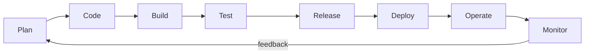
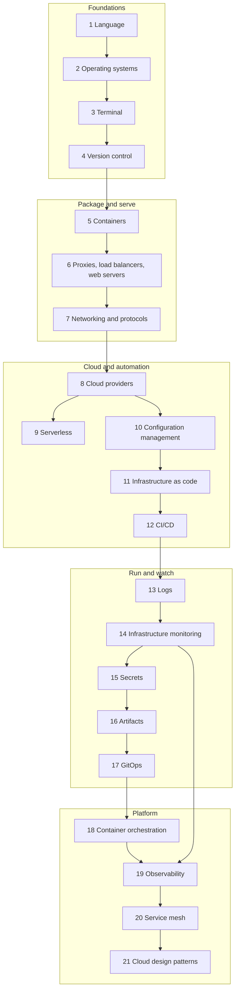

# DevOps Roadmap: A Step-by-Step Guide to Building, Shipping and Running Software in 2026

A free, hands-on learning path for people who want to take software from a laptop to production and keep it healthy once it is there. It has twenty-one stages that follow the topic tree of the community DevOps roadmap, three capstone projects, a weekly study plan and a coverage checklist you can tick off. Every stage ends with a "Try it" exercise and a self-check list that works as an exit test.

**What DevOps is.** DevOps is three things working together. It is a culture in which the people who write software and the people who run it share responsibility for how it behaves in production. It is a set of practices: everything lives in version control, changes are tested automatically, releases are small and frequent, infrastructure is described as code, and failures are studied without blame. And it is a toolbox that makes those practices cheap enough to follow every day. The point is a short, safe, repeatable loop between an idea and running software that people depend on, and back again with feedback.



Every tool in this roadmap sits somewhere on that loop. Git and CI tools cover code, build and test; registries and GitOps cover release and deploy; Kubernetes, cloud platforms and configuration management cover operate; logs, metrics and traces cover monitor. Learn the loop first and the tools become easy to place.

**Who it is for.** Developers who want to understand how their code runs in production, system administrators moving toward automation, support and QA engineers growing into platform work, students, and career changers who have written some code. You do not need a computer science degree or paid tooling to start.

**Prerequisites.** Basic computer literacy, comfort installing software and typing commands, and the ability to read a short program in any language. If you have never programmed, do a small beginner course in Python first; [stage 1](#1-learn-a-programming-language) says what to cover. You need a computer that can run Linux in a virtual machine or WSL2 and run containers, a free account on a Git hosting site, and later a cloud account protected by a billing alert (set it up in [stage 8](#8-cloud-providers) before you create anything).

**What you will be able to do at the end.**

- Work confidently in a Linux terminal: scripts, processes, networking tools and text processing.
- Use Git in a team, with branches, reviews and a clean history.
- Package applications as container images and serve them behind a reverse proxy with TLS.
- Explain what happens between typing a URL and seeing a page: DNS, TCP, TLS, HTTP, proxies and load balancers.
- Provision cloud infrastructure with code, configure servers repeatably, and ship through a CI/CD pipeline.
- Run workloads on Kubernetes and deploy them with a GitOps workflow.
- Manage secrets safely and keep build artifacts trustworthy.
- Collect logs, metrics and traces, write alerts that matter, and apply well-known cloud design patterns to make systems resilient.

**Time estimate.** About 29 to 36 weeks at 8 to 10 hours per week (roughly 270 to 340 hours), including the "Try it" exercises. The [weekly plan](#23-suggested-weekly-study-plan) is a 34-week schedule that also includes the three capstone projects. If you already know Linux, Git and one language, expect to finish nearer 28 weeks.

**Reading the roadmap legend.** Community roadmaps usually carry an unspoken legend, and this guide follows the same ideas in its own way:

- **The order is not strict.** The stages are arranged so each one builds on the last, but you can reorder them, and many learners do Docker before networking or Git before the terminal. Skim a stage you already know and use its self-check as a test.
- **Tools in a category are alternatives.** When a stage lists Chef, Ansible, Salt and Puppet, or eight CI/CD tools, do not learn all of them. Pick one, learn it well, and use the comparison tables to understand what the others do differently. The concepts transfer; the syntax does not matter much.
- **Personal preference and context decide.** Your employer's stack, your cloud account, your team's skills and your own taste are all legitimate reasons to choose a tool. Be able to explain why you chose it and what you gave up.

**Lab safety.** Practice on disposable virtual machines, containers and throwaway cloud accounts. Never commit secrets to Git, never run port scans or load tests against systems you do not own, set a billing alert and a budget before using any paid cloud service, and delete resources when you finish an exercise.

## Originality and review status

This is an independently written, original learning guide. The text, examples, diagrams and structure were written for this repository from the author's own knowledge, official documentation and primary sources.

Its topic coverage follows the community DevOps roadmap at [https://roadmap.sh/devops](https://roadmap.sh/devops). That site is linked for reference only: none of its content is copied or adapted here, and this guide is not affiliated with or endorsed by it.

**Last reviewed: October 2026.**

Tools, cloud services and file formats change quickly. Versions, product names, licenses, free tiers, limits and prices can shift within months. This guide prefers durable concepts, uses placeholder domains such as `example.com`, never hard-codes prices, and marks perishable statements with "(as of Oct 2026)". Confirm details in the official documentation before you depend on them. Nothing here is legal, security or financial advice; the security material is for awareness only.

## Table of contents

- [The path at a glance](#the-path-at-a-glance)
- [1. Learn a Programming Language](#1-learn-a-programming-language)
- [2. Operating System](#2-operating-system)
- [3. Terminal Knowledge](#3-terminal-knowledge)
- [4. Version Control Systems](#4-version-control-systems)
- [5. Containers](#5-containers)
- [6. What is and how to setup X?](#6-what-is-and-how-to-setup-x)
- [7. Networking and Protocols](#7-networking-and-protocols)
- [8. Cloud Providers](#8-cloud-providers)
- [9. Serverless](#9-serverless)
- [10. Configuration Management](#10-configuration-management)
- [11. Provisioning (Infrastructure as Code)](#11-provisioning-infrastructure-as-code)
- [12. CI/CD Tools](#12-cicd-tools)
- [13. Logs Management](#13-logs-management)
- [14. Infrastructure Monitoring](#14-infrastructure-monitoring)
- [15. Secret Management](#15-secret-management)
- [16. Artifact Management](#16-artifact-management)
- [17. GitOps](#17-gitops)
- [18. Container Orchestration](#18-container-orchestration)
- [19. Observability](#19-observability)
- [20. Service Mesh](#20-service-mesh)
- [21. Cloud Design Patterns](#21-cloud-design-patterns)
- [22. Capstone projects](#22-capstone-projects)
- [23. Suggested weekly study plan](#23-suggested-weekly-study-plan)
- [24. Related guides in this repository](#24-related-guides-in-this-repository)
- [25. Coverage checklist](#25-coverage-checklist)

## The path at a glance

Solid arrows show the suggested order. Stages 1 to 7 are the foundation that everything else assumes, stages 8 to 12 teach you to create and automate infrastructure, stages 13 to 17 teach you to run and watch it, and stages 18 to 21 move you to platform-level work. Secrets and artifacts (15 and 16) are small topics you can pull forward as soon as your first pipeline needs them.



Time estimates are for full-depth coverage at 8 to 10 hours per week, with every "Try it" exercise done. Skim the stages you already know.

| Stage | What you learn | Time | Key outcome |
|-------|----------------|------|-------------|
| 1. Programming language | Choosing one language; Python, Ruby, Go, Rust and JavaScript compared; writing small automation tools | 2-3 weeks | A tested command-line tool you wrote yourself |
| 2. Operating system | Windows basics; the Unix and Linux family; packages, services, permissions | 1 week | A Linux server you can install, update and troubleshoot |
| 3. Terminal knowledge | Bash and PowerShell scripting, editors, process and performance monitoring, networking tools, text manipulation | 2 weeks | A safe, reusable shell script and fast log-digging skills |
| 4. Version control systems | Git internals and workflows; GitHub, GitLab and Bitbucket | 1-2 weeks | A pull-request workflow with branch protection |
| 5. Containers | Docker images, Dockerfiles, Compose, LXC | 2 weeks | An app in a small, non-root, multi-stage image |
| 6. What is and how to setup X? | Forward and reverse proxies, caches, firewalls, load balancers, web servers | 1 week | Nginx in front of two app instances with caching and a firewall |
| 7. Networking and protocols | FTP and SFTP, DNS, HTTP, HTTPS, TLS, SSH, the OSI model, email protocols | 2-3 weeks | You can debug a connectivity problem layer by layer |
| 8. Cloud providers | Shared cloud concepts; eight providers compared | 1-2 weeks | A VM running a service with a budget alert, then torn down |
| 9. Serverless | Functions and platforms; limits and trade-offs | 1 week | A function behind HTTPS with its cold-start behavior measured |
| 10. Configuration management | Chef, Ansible, Salt, Puppet; idempotency | 1 week | A playbook that configures a fresh server in one run |
| 11. Provisioning (IaC) | Terraform, CloudFormation, AWS CDK, Pulumi; state | 2 weeks | Cloud infrastructure created, changed and destroyed from code |
| 12. CI/CD tools | Pipelines and eight tools; deployment strategies | 2 weeks | A pipeline that tests, builds and deploys on merge |
| 13. Logs management | Structured logging; Papertrail, Splunk, Loki, Elastic Stack, Graylog | 1 week | Central, searchable logs with a retention policy |
| 14. Infrastructure monitoring | Metrics, alerts, SLOs; Prometheus, Grafana, Zabbix, Datadog | 1-2 weeks | A dashboard and an alert that wakes you for the right reason |
| 15. Secret management | Sealed Secrets, ESO, Vault, SOPS, cloud tools | 1 week | No secret in Git, in an image or in a log |
| 16. Artifact management | Registries and repository managers; Artifactory, Nexus, Cloudsmith | 1 week | Immutable, versioned artifacts promoted across environments |
| 17. GitOps | Pull-based delivery; Argo CD and Flux CD | 1 week | A cluster that syncs itself from a Git repository |
| 18. Container orchestration | Kubernetes core; managed Kubernetes, ECS and Fargate, Swarm, OpenShift | 3-4 weeks | A resilient app on Kubernetes with probes, limits and rollouts |
| 19. Observability | Traces, metrics and logs together; OpenTelemetry, Jaeger and platforms | 1-2 weeks | One request followed across services by trace id |
| 20. Service mesh | Istio, Consul, Linkerd, Envoy; mTLS and traffic shifting | 1 week | A canary release and mutual TLS with no application changes |
| 21. Cloud design patterns | Availability, data management, design and implementation, management and monitoring patterns | 1 week | You can name and apply the right pattern to a given failure |
| 22 to 25. Capstones, plan, guides, checklist | Three projects, a 34-week schedule, related reading, a tick-off list | Built into the plan | Portfolio evidence that you can ship and operate software |

---

## 1. Learn a Programming Language

**Why it matters.** DevOps work is automation, and automation is code: scripts that glue tools together, small services, pipeline logic, infrastructure definitions, and the occasional bug hunt inside an application you did not write. You do not need to become a software architect, but you must be able to read application code, write a reliable tool of a few hundred lines, and call an API or SDK. Pick one language, get past the basics (variables, functions, data structures, files, errors, HTTP calls, tests, packages) and go deep enough to build something real. The five languages below are alternatives, not a checklist.

| Language | Strengths for DevOps | Typical use | Watch out for |
|----------|----------------------|-------------|---------------|
| Python | Readable, large standard library, mature cloud SDKs | Automation scripts, cloud SDK glue, Ansible extensions, data pipelines | Environment and dependency drift |
| Ruby | Expressive, friendly to internal DSLs | Chef recipes, Vagrant files, older tooling, Rails apps | A smaller share of new infrastructure tools |
| Go | Static binaries, fast, simple concurrency | CLIs, Kubernetes operators, exporters, many cloud-native tools | Verbose error handling, fewer scripting conveniences |
| Rust | Memory safety with high performance | Fast CLIs, agents and proxies | Steep learning curve, slower to write |
| JavaScript / Node.js | One language front to back, event-driven I/O | Serverless functions, build tooling, CDK and Pulumi programs | Dependency sprawl and supply-chain risk |

### 1.1 Python

The usual first choice for operations work, because it reads clearly and almost every cloud, API and tool has a Python library or SDK. Learn virtual environments (`python -m venv`), `pip`, type hints, `argparse`, `pathlib`, `subprocess` with `check=True`, `logging` and `pytest`; you will meet Ansible and many cloud utilities that are written in Python. The common pitfall is installing packages globally and breaking the system Python, so always work inside a virtual environment.

### 1.2 Ruby

Ruby matters mostly because parts of the configuration-management world grew up around it: Chef recipes are Ruby, Puppet itself is written in Ruby, and Vagrant files are Ruby. Learn enough syntax to read those files and write small scripts, plus Bundler for gems and a version manager such as rbenv. The trade-off is that fewer new infrastructure tools choose Ruby, so learn it deeply only if your team already uses it.

### 1.3 Go

Docker, Kubernetes, Terraform and Prometheus are all written in Go, so reading Go helps you debug and extend the tools you operate. It compiles to a single static binary that you can cross-compile (`GOOS` and `GOARCH`) and copy to any server, has goroutines and channels for concurrency, and ships an excellent standard library including `net/http`. The usual pitfalls are ignoring returned errors and leaking goroutines; run `go vet` and `go test -race` early.

### 1.4 Rust

Rust gives C-like performance with compile-time memory safety, and is increasingly chosen for performance-sensitive infrastructure components and fast command-line tools. It is the hardest language on this list to learn, because the ownership and borrowing rules force you to think about memory up front. Choose it if you enjoy systems programming; for most DevOps work it is optional.

### 1.5 JavaScript and Node.js

Node.js runs JavaScript outside the browser and is everywhere in build tooling and serverless platforms; AWS CDK and Pulumi also let you write infrastructure in TypeScript. Learn promises and `async`/`await`, `npm` with a lock file, and environment-based configuration. The pitfall is dependency sprawl: a small project can pull in hundreds of packages, so audit them, pin versions and commit the lock file.

A small tool in Python, using only the standard library. It checks URLs and returns a non-zero exit code when any fail, so a CI job or cron entry can act on the result.

```python
#!/usr/bin/env python3
"""Exit 0 if every URL answers 2xx within the timeout, else exit 1."""
import sys
import urllib.request


def check(url: str, timeout: float = 5.0) -> bool:
    try:
        with urllib.request.urlopen(url, timeout=timeout) as resp:
            return 200 <= resp.status < 300
    except OSError as exc:  # URLError, HTTPError and timeouts are OSError subclasses
        print(f"FAIL {url}: {exc}", file=sys.stderr)
        return False


if __name__ == "__main__":
    results = [check(u) for u in sys.argv[1:]]
    sys.exit(0 if results and all(results) else 1)
```

**Try it:** extend the script to read URLs from a file, check them concurrently (threads, goroutines or async tasks), print a summary table and write a `pytest` (or equivalent) test with a fake server. Then run it from a scheduled job and make it page you, in a way you can test, when a check fails.

**Self-check**

- [ ] I can create an isolated environment for my language and install dependencies reproducibly
- [ ] I can read and write files, parse JSON and call an HTTP API with timeouts and error handling
- [ ] I can write a command-line tool with arguments, logging and meaningful exit codes
- [ ] I can write automated tests for my tool and run them on every change
- [ ] I can explain why I chose my language and name a job where another one fits better

**Docs:** [Python](https://docs.python.org/3/), [Go](https://go.dev/doc/), [Rust](https://www.rust-lang.org/learn), [Node.js](https://nodejs.org/docs/latest/api/), [Ruby](https://www.ruby-lang.org/en/documentation/).

---

## 2. Operating System

**Why it matters.** Your software runs on an operating system, and a large majority of servers, containers and cloud images run Linux. When something breaks at 3 a.m., the answer is usually in the OS: a full disk, a service that will not start, a wrong permission, an exhausted file-descriptor limit. Learn one Linux family deeply and know how the others differ; learn enough Windows to work in mixed environments.

### 2.1 Windows

Windows matters more in DevOps than newcomers expect: Windows Server hosts .NET and legacy applications, IIS and Active Directory, and many companies run mixed estates. Learn PowerShell, services (`Get-Service`), the Event Viewer, Task Scheduler, NTFS permissions, Windows Defender Firewall and remote management (WinRM or the built-in OpenSSH server). On your own laptop, WSL2 gives you a real Linux environment, and Windows containers are a separate thing that needs a matching Windows kernel. A classic pitfall is CRLF line endings breaking Bash scripts and case-insensitive file names hiding bugs until the code reaches Linux; set `.gitattributes` rules to keep scripts on LF.

### 2.2 The Unix and Linux family

All of these systems share the same ideas: everything is a file, users and groups with permission bits (`chmod`, `chown`), a standard directory layout (`/etc` for configuration, `/var` for variable data, `/usr` for programs, `/proc` for kernel views), processes and signals, a package manager, a service manager and SSH for remote access. Learn those once and each family below is a dialect.

| Family | Package tool | Service manager | Where you meet it |
|--------|--------------|-----------------|-------------------|
| Ubuntu / Debian | `apt`, `dpkg` | systemd | Cloud images and container base images; the easiest place to start |
| RHEL and derivatives | `dnf`, `rpm` | systemd | Enterprises; Rocky Linux, AlmaLinux, CentOS Stream; SELinux enabled by default |
| SUSE Linux | `zypper`, `rpm` | systemd | Enterprise and SAP environments; openSUSE for the community edition |
| FreeBSD | `pkg`, ports | `rc` scripts | Storage and network appliances; ZFS, jails and the `pf` firewall |
| OpenBSD | `pkg_add` | `rc` scripts | Firewalls and routers; security-first defaults |
| NetBSD | `pkgsrc` | `rc` scripts | Portability and unusual hardware |

**Ubuntu and Debian.** Debian is a community distribution known for stability and a very large package archive; Ubuntu builds on it with a regular release schedule and long-term-support (LTS) releases that are common on cloud images. Use `apt update` then `apt install`, inspect packages with `dpkg -l`, and prefer an LTS release for servers (check support dates on the project's site, as of Oct 2026). This is the best family to learn first.

**RHEL and derivatives.** Red Hat Enterprise Linux is a commercial distribution with long support windows and certifications; Rocky Linux and AlmaLinux are free, binary-compatible rebuilds, and CentOS Stream is the upstream preview of the next RHEL minor release rather than a stable clone. Learn `dnf`, `firewalld` and SELinux (`getenforce`, `ausearch -m avc`). The classic pitfall is switching SELinux off instead of reading its denials and fixing the label or boolean.

**SUSE Linux.** SUSE Linux Enterprise is common in large enterprises, with openSUSE as the community branch. It uses `zypper` for packages and `YaST` for configuration, and its Btrfs snapshots (through `snapper`) let you roll back a bad update, which is a pleasant feature to know about.

**FreeBSD.** FreeBSD is a complete operating system, kernel and userland together, rather than a kernel with many distributions. It is known for integrated ZFS storage, jails (lightweight isolation that predates Linux containers), the `pf` packet filter and its well-written Handbook. You will meet it in storage products and network appliances.

**OpenBSD.** OpenBSD puts security and correctness first, with secure defaults and aggressive code auditing. It is where OpenSSH and `pf` originated, and teams use it for firewalls, routers and bastion hosts. Expect fewer packages and a plainer system.

**NetBSD.** NetBSD is built for portability and runs on an unusually wide range of hardware; its `pkgsrc` package collection also works on other systems. You rarely choose it for a new project, but it helps to recognize it on embedded or legacy gear.

Two snippets you will reuse: a systemd service unit (put it in `/etc/systemd/system/example-api.service`) and the commands that drive it. Secrets live in a root-owned file loaded with `EnvironmentFile`, not in the unit text.

```ini
[Unit]
Description=Example API
After=network-online.target
Wants=network-online.target

[Service]
User=app
EnvironmentFile=/etc/example-api/env
ExecStart=/opt/example-api/bin/server
Restart=on-failure
NoNewPrivileges=true

[Install]
WantedBy=multi-user.target
```

```bash
sudo systemctl daemon-reload && sudo systemctl enable --now example-api
systemctl status example-api --no-pager
journalctl -u example-api --since "1 hour ago" --no-pager | tail -n 50
systemctl list-units --type=service --state=failed
```

**Try it:** create one Debian-family and one RHEL-family VM (or container). On each, install nginx, find its configuration directory, open the firewall port, enable the service at boot, break the configuration on purpose and find the reason in the logs. Write down which commands differed.

**Self-check**

- [ ] I can install, update and remove software with `apt` and with `dnf`
- [ ] I can read and change file ownership and permission bits and explain `755` and `640`
- [ ] I can write a systemd unit, start it and find why it failed in the journal
- [ ] I can explain the standard directory layout and where logs and configuration live
- [ ] I can describe how the BSD systems differ from Linux distributions
- [ ] I can run a Linux environment on Windows with WSL2 and keep script line endings correct

**Docs:** [Ubuntu Server](https://ubuntu.com/server/docs), [Debian](https://www.debian.org/doc/), [Red Hat](https://docs.redhat.com/), [SUSE](https://documentation.suse.com/), [FreeBSD](https://www.freebsd.org/docs/), [OpenBSD FAQ](https://www.openbsd.org/faq/), [NetBSD](https://www.netbsd.org/docs/), [WSL](https://learn.microsoft.com/en-us/windows/wsl/).

---

## 3. Terminal Knowledge

**Why it matters.** Servers rarely have a graphical interface, and every automation tool is, underneath, something you could type into a shell. Terminal fluency is the habit that makes everything else faster: you inspect a failing machine in a minute instead of an hour, and you turn repeated manual steps into scripts. Learn the shell as a language, not a list of commands.

### 3.1 Scripting: Bash and PowerShell

**Bash** is the default shell on most Linux systems and the right tool for gluing programs together in a few dozen lines. Start every script in strict mode (`set -euo pipefail`), quote every variable, clean up with `trap`, and run `shellcheck`. Move to Python when you need real data structures, JSON handling or more than about a hundred lines. Remember that `set -e` does not stop on failures inside `if` conditions or on the left of `&&`, so do not treat it as a safety net.

```bash
#!/usr/bin/env bash
# archive-logs.sh: archive application logs and prune old archives
set -euo pipefail
IFS=$'\n\t'

LOG_DIR="${LOG_DIR:-/var/log/myapp}"
DEST_DIR="${DEST_DIR:-/var/backups/myapp}"
KEEP_DAYS="${KEEP_DAYS:-14}"

log() { printf '%s %s\n' "$(date -u +%FT%TZ)" "$*" >&2; }

tmp="$(mktemp -d)"
trap 'rm -rf "$tmp"' EXIT

[[ -d "$LOG_DIR" ]] || { log "missing $LOG_DIR"; exit 1; }
mkdir -p "$DEST_DIR"

archive="$DEST_DIR/logs-$(date -u +%Y%m%d).tar.gz"
tar -czf "$tmp/logs.tar.gz" -C "$LOG_DIR" .
mv "$tmp/logs.tar.gz" "$archive"
find "$DEST_DIR" -name 'logs-*.tar.gz' -mtime +"$KEEP_DAYS" -delete
log "wrote $archive"
```

**PowerShell** is both a shell and a scripting language built on .NET. Its pipeline passes objects rather than text, commands follow a `Verb-Noun` pattern, and PowerShell 7 runs on Windows, Linux and macOS. It is the main automation tool for Windows Server and is widely used with Azure.

```powershell
$ErrorActionPreference = 'Stop'
Get-Process | Sort-Object CPU -Descending | Select-Object -First 5 Name, Id, CPU
Get-Service | Where-Object Status -eq 'Stopped' | Select-Object -First 5 Name, Status
```

### 3.2 Editors: Vim, Nano and Emacs

Learn enough of one terminal editor to fix a file on any server, even if you write code in a graphical editor day to day.

| Editor | Style | Why you meet it | Survival keys |
|--------|-------|-----------------|---------------|
| Vim | Modal (normal, insert, command) | Present, as `vi` or `vim`, on nearly every server | `i` insert, `Esc`, `:wq` save and quit, `:q!` quit without saving, `/text` search, `dd` delete line, `u` undo |
| Nano | Modeless, shortcuts shown on screen | The friendliest default for quick edits | `Ctrl+O` write out, `Ctrl+X` exit, `Ctrl+W` search |
| Emacs | Extensible Lisp environment | Power users who want one tool for everything | `C-x C-s` save, `C-x C-c` quit, `C-s` search |

### 3.3 Process monitoring

A process is a running program; the kernel schedules it, gives it memory and delivers signals to it. Use `ps aux` or `ps -eo pid,ppid,stat,%cpu,%mem,cmd --sort=-%cpu | head` for a snapshot, `top` or `htop` for a live view, `pgrep` to find processes by name and `lsof -p PID` to see open files. Send `SIGTERM` (`kill PID`) first so the program can clean up, and use `SIGKILL` (`kill -9`) only as a last resort. A process stuck in state `D` (uninterruptible disk wait) cannot be killed, and a long-lived zombie (`Z`) means its parent is not reaping children.

### 3.4 Performance monitoring

Check the four classic resources (CPU, memory, disk, network) with the USE method: for each, look at utilization, saturation and errors.

```bash
uptime                 # load averages over 1, 5 and 15 minutes
vmstat 1 5             # run queue, memory, swap, I/O wait, CPU split
free -h                # read the "available" column, not "free"
iostat -xz 1 3         # per-disk utilization and latency (from the sysstat package)
df -h && du -xh /var --max-depth=1 | sort -h | tail   # which filesystem or directory is full
```

The usual pitfalls are panicking about low "free" memory (Linux uses spare RAM as cache, so look at "available"), and forgetting that load average counts processes waiting on I/O as well as on CPU.

### 3.5 Networking tools

These are your first-response tools; stage 7 explains what they reveal.

| Tool | Question it answers |
|------|---------------------|
| `ip addr`, `ip route` | What address and gateway does this machine have? |
| `ss -tulpn` | Which process is listening on which port? |
| `ping`, `mtr` | Is the host reachable and where does the path degrade? |
| `dig` | What does DNS say? |
| `curl -v` | What does the HTTP exchange, including TLS, look like? |
| `nc -zv host port` | Is a TCP port open from here? |
| `tcpdump` | What packets are actually on the wire? |
| `nmap` | What ports does a host expose (only on systems you are authorized to scan)? |

### 3.6 Text manipulation

Unix tools read text from standard input and write text to standard output, so you chain them with pipes. `grep` filters lines, `sed` edits streams, `awk` handles columns and small calculations, `cut`, `sort`, `uniq`, `tr` and `xargs` fill the gaps, and `jq` is the right tool for JSON. The pitfalls: parsing JSON with `grep` (use `jq`), forgetting that GNU and BSD versions of `sed` and `date` differ in flags, and forgetting to quote patterns so the shell does not expand them.

```bash
awk '{print $1}' access.log | sort | uniq -c | sort -rn | head -n 5      # top client IPs
awk '$9 ~ /^5/ {c++} END {print c+0}' access.log                          # count 5xx responses
sed -i.bak 's/^LOG_LEVEL=.*/LOG_LEVEL=info/' app.env                      # edit in place, keep a backup
grep -n -C 2 'ERROR' app.log | grep -v 'healthcheck'                      # errors with context, minus noise
curl -s https://api.example.com/status | jq -r '.services[] | select(.ok == false) | .name'
```

**Try it:** write a script with `set -euo pipefail` that takes a log file, prints the top ten URLs by request count and the number of 5xx responses, and exits with an error message if the file is missing. Run `shellcheck` on it and fix every warning.

**Self-check**

- [ ] I can write a Bash script with strict mode, functions, arguments, `trap` cleanup and sensible exit codes
- [ ] I can explain when to use PowerShell, Bash or Python for a task
- [ ] I can edit and save a file in Vim and in Nano without help
- [ ] I can find the process using the most CPU or holding a port and stop it cleanly
- [ ] I can tell whether a slow machine is limited by CPU, memory, disk or network
- [ ] I can chain `grep`, `awk`, `sed`, `sort` and `jq` to answer a question about a log file
- [ ] I can name the right networking tool for an unreachable host, a wrong DNS answer and a closed port

**Docs:** [GNU Bash manual](https://www.gnu.org/software/bash/manual/), [PowerShell documentation](https://learn.microsoft.com/en-us/powershell/).

@@CONTINUE@@
