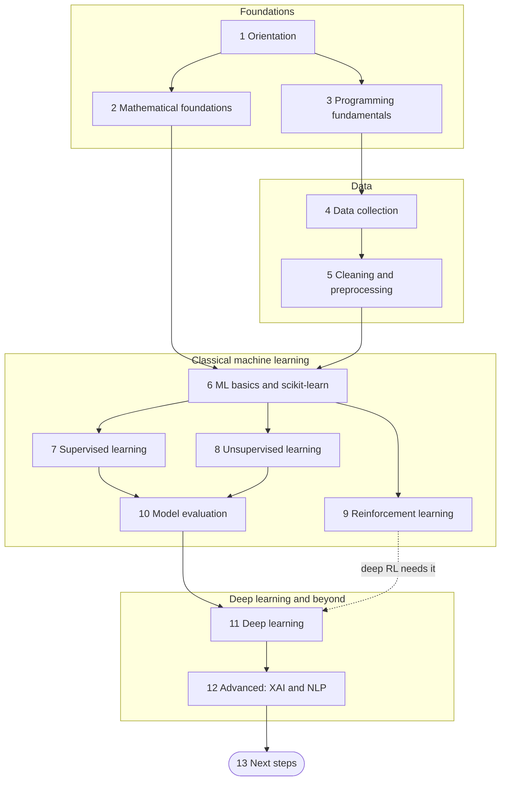

# Machine Learning Roadmap: A Step-by-Step Guide from Python Basics to Deep Learning in 2026

A free, project-driven learning path for people who want to build, evaluate and understand machine learning (ML) models. It follows the order in which the ideas depend on each other: what the ML engineer role is, the mathematics behind models, programming and data tooling, collecting and cleaning data, classical machine learning (supervised, unsupervised and reinforcement), model evaluation, deep learning, and a first look at explainability and natural language processing. Every stage has a "why it matters" note, short explanations of each topic, a hands-on exercise and a self-check list. The guide ends with three capstone projects, a week-by-week study plan and a checklist you can tick off.

**Who it is for.** Beginners and career changers who want to understand how ML models work rather than only call a library: students, analysts, software developers and engineers moving into data and ML work. You do not need a degree, a GPU or paid tools. A laptop with Python and a free notebook environment (a local Jupyter install or a free hosted notebook service) is enough for almost every exercise; the deep learning stage runs on CPU at small scale, and a free or rented GPU only makes it faster.

**Prerequisites.** Basic Python: variables, functions, loops, lists and dictionaries, reading files, and installing packages in a virtual environment. If that is not yet true, start with the [Prerequisite Python roadmap](#prerequisite-python-roadmap) subsection first. No prior math beyond school algebra is assumed; stage 2 rebuilds what you need.

**What you will be able to do at the end.**
- Explain, in plain language and with small formulas, how common models learn: linear and logistic regression, trees and ensembles, clustering, neural networks, convolutional and recurrent networks, and transformers.
- Collect data from files, databases and APIs, clean it, engineer features and avoid data leakage.
- Run a complete scikit-learn workflow: split, preprocess, select a model, tune, evaluate and predict, using pipelines and cross-validation.
- Pick evaluation metrics that match the cost of mistakes, read a confusion matrix, and compare models fairly.
- Build and train small neural networks in PyTorch or Keras, including CNNs for images and sequence or attention models for text.
- Explain model decisions with basic explainability tools, and apply core natural language processing (NLP) steps.
- Present three portfolio projects with honest metrics and limitations.

**Time estimate.** About 24 to 30 weeks at 8 to 10 hours per week (roughly 200 to 300 hours). The study plan below uses 30 weeks including the three capstone projects. If you already code comfortably and remember school statistics, expect closer to 24 weeks. Time per stage assumes every topic is read and every exercise done.

## Originality and review status

This is an independently written, original learning guide. The text, examples, diagrams and structure were written for this repository from the author's own knowledge, official documentation and primary sources.

Topic coverage follows the community roadmap at [https://roadmap.sh/machine-learning](https://roadmap.sh/machine-learning). That site is linked for reference only: none of its content is copied or adapted here, and this guide is not affiliated with or endorsed by it.

**Last reviewed: October 2026.**

Libraries, APIs and best practices change. Package versions, default arguments, framework status and cloud offerings can shift within months. This guide prefers durable concepts, keeps code short, and marks perishable statements with "(as of Oct 2026)". Always confirm details in the official documentation of the library before you depend on them. Nothing here is legal, medical or financial advice. Any dataset you use must be used according to its license and privacy terms.

## Table of contents

- [The path at a glance](#the-path-at-a-glance)
- [1. Orientation: Prerequisites and the ML Engineer Role](#1-orientation-prerequisites-and-the-ml-engineer-role)
- [2. Mathematical Foundations](#2-mathematical-foundations)
- [3. Programming Fundamentals](#3-programming-fundamentals)
- [4. Data Collection](#4-data-collection)
- [5. Data Cleaning and Preprocessing Techniques](#5-data-cleaning-and-preprocessing-techniques)
- [6. Machine Learning Basics and the Scikit-learn Workflow](#6-machine-learning-basics-and-the-scikit-learn-workflow)
- [7. Supervised Learning](#7-supervised-learning)
- [8. Unsupervised Learning](#8-unsupervised-learning)
- [9. Reinforcement Learning](#9-reinforcement-learning)
- [10. Model Evaluation](#10-model-evaluation)
- [11. Deep Learning](#11-deep-learning)
- [12. Advanced Concepts in ML](#12-advanced-concepts-in-ml)
- [13. Next Steps](#13-next-steps)
- [Capstone projects](#capstone-projects)
- [Suggested weekly study plan](#suggested-weekly-study-plan)
- [Related guides in this repository](#related-guides-in-this-repository)
- [Coverage checklist](#coverage-checklist)

## The path at a glance

Stages 1 to 12 are the learning path; stage 13 points to what comes next. Solid arrows are hard dependencies. The dotted arrow is a soft link: deep reinforcement learning in stage 9 is easier once you know neural networks from stage 11. Many learners also read stage 10 (evaluation) right after stage 7, because every later stage uses its metrics.



| Stage | What you learn | Time | Key outcome |
|-------|----------------|------|-------------|
| 1. Orientation | The Python prerequisite, related roadmaps, what an ML engineer does, how the role differs from an AI engineer, skills and responsibilities | About 0.5 week | You can describe the job, pick your next roadmap, and set up a working environment |
| 2. Mathematical Foundations | Linear algebra, calculus, probability and statistics | 3 weeks | You can read the formulas in ML tutorials and run a gradient descent step by hand |
| 3. Programming Fundamentals | Python syntax, object oriented programming, NumPy, Pandas, Matplotlib, Seaborn | 2 weeks | You can load, reshape, summarize and plot a dataset with confidence |
| 4. Data Collection | Databases, the internet, APIs, mobile and IoT sources; CSV, Excel, JSON, Parquet and other formats | 1 week | You can pull data from several sources into one DataFrame and choose a storage format |
| 5. Data Cleaning and Preprocessing | Cleaning, feature engineering, scaling, dimensionality reduction, feature selection | 2 weeks | You can turn raw data into a leak-free numeric matrix with a reusable pipeline |
| 6. Machine Learning Basics | What ML is, the five types of ML, the scikit-learn workflow | 1 week | You can train, tune and use a first model end to end |
| 7. Supervised Learning | Classification and regression algorithms, regularization | 3 weeks | You can choose, tune and explain a classical model for a tabular problem |
| 8. Unsupervised Learning | PCA, autoencoders, four clustering families | 2 weeks | You can find structure in unlabeled data and judge whether it is meaningful |
| 9. Reinforcement Learning | Q-learning, deep Q networks, policy gradient, actor-critic | 2 weeks | You can describe the agent-environment loop and train a tabular agent |
| 10. Model Evaluation | Metrics, confusion matrix, cross-validation and leave-one-out | 1 week | You can pick the right metric and validate a model without fooling yourself |
| 11. Deep Learning | Neural network basics, libraries, CNNs, RNNs, attention, autoencoders, GANs | 7 weeks | You can train and diagnose neural networks in PyTorch or Keras |
| 12. Advanced Concepts in ML | Explainable AI, natural language processing | 3 weeks | You can explain a model's behavior and process text for modeling |
| 13. Next Steps | The AI and Data Scientist, MLOps, AI Engineer and AI Agents roadmaps | Ongoing | You know which path to take after this one |

## 1. Orientation: Prerequisites and the ML Engineer Role

<!-- hinglish:start s01 -->
> **Hinglish me samjho (simple language)**
>
> **Is stage me kya seekhoge:** Sabse pehle ye samjho ki ML Engineer asal me kya kaam karta hai, aur us kaam ke liye aapko pehle se kya aana chahiye. Jaise cricket seekhne se pehle khel ke rules pata hone chahiye, waise yahan role samajhna pehla step hai. Isse aap tay kar paoge ki kis cheez par kitna time lagana hai: na zyada research wali theory me atakna, na sirf `fit()` (model ko data se seekhana) chala kar ruk jaana. Is stage me ye bhi check hota hai ki aapki basic Python kaafi hai ya nahi.
>
> **Seekhne ka order:** What is an ML Engineer? (ML engineer ka kaam kya hota hai), ML Engineer vs AI Engineer (dono roles me kya fark hai), Skills and Responsibilities (kaun si skills aur kaun si zimmedariyan chahiye).
>
> **Is stage ke baad aap kar paoge:** apne liye ek "job card" bana paoge jisme likha ho ki kaun sa role chahiye aur kaun si skills seekhni hain, ML engineer aur AI engineer ka fark kisi ko samjha paoge, aur ek model ki poori zindagi (problem se monitoring tak) 5 steps me bata paoge.

<!-- hinglish:end s01 -->

**Why it matters.** Knowing what the job is, what you must already know, and where this roadmap fits among its neighbors helps you decide how deep to go in each later stage. This stage is short, but a clear picture of the role keeps you from over-investing in research-level theory or, on the other side, from stopping at "I can call `fit()`".

### Prerequisite Python roadmap

Almost all ML work is done in Python, so basic Python is the entry ticket. You should be able to write functions, loop over lists and dictionaries, read and write files, handle errors and install packages inside a virtual environment. If that is not yet comfortable, spend two to four weeks on a beginner Python course first: the official [Python tutorial](https://docs.python.org/3/tutorial/) is free, and [section 01 of the AI Engineer roadmap](../AI-Engineer-Roadmap/01-prerequisites-and-dev-foundations.md) in this repository lists what to cover. Stage 3 recaps only the parts that matter for ML; it does not teach programming from zero. The common mistake is skipping this step and then fighting syntax errors and ML concepts at the same time, which makes every bug look mysterious. A quick self-test: write a function that reads a CSV file with the standard `csv` module, counts rows per category in a dictionary and prints the three largest categories.

### Related roadmaps

This roadmap is one of several neighboring paths, and the boundaries are blurry. Read job descriptions rather than titles.

| Roadmap | Focus | Take it when | In this repository |
|---------|-------|--------------|--------------------|
| AI Engineer | Building products on pre-trained models: LLM APIs, retrieval, agents, evals | You want to ship AI features without training models from scratch | [AI Engineer Roadmap](../AI-Engineer-Roadmap/README.md) |
| MLOps | Packaging, deploying, monitoring and retraining models reliably | Your models work in notebooks and now must run in production | [MLOps Roadmap](mlops-roadmap.md) |
| AI and Data Scientist | Statistics, experiments, analysis and communicating decisions from data | You enjoy questions, hypotheses and storytelling with data | [Machine Learning Beginner Roadmap](../Machine%20Learning%20Beginner%20Roadmap_.md) |

### What is an ML Engineer?

<!-- hinglish:start t-what-is-an-ml-engineer -->
> **Hinglish me samjho (simple language)**
>
> **Simple words me:** ML Engineer woh insaan hai jo aisa system banata hai jo data se seekhta hai aur demo ke baad bhi chalta rehta hai. Socho ek restaurant ka head chef: sirf ek achhi dish nahi banata, balki roz hazaaron plates same quality me nikalne ka poora kitchen sambhalta hai. ML Engineer bhi sirf model nahi banata. Wo data lata hai, model train karta hai (data se seekhata hai), aur use aise pack karta hai ki baaki software use kar sake.
>
> **Kyun zaroori hai:** Zyadatar kaam fancy algorithm banane me nahi, balki saaf data, sahi testing aur bugs dhoondhne me jaata hai. Ye samajh lo to aap sahi cheez seekhoge.
>
> **Example, step by step:** Ek chhota scenario dekhte hain. Ek bank chahta hai ki pata chale kaun sa customer loan wapas nahi karega.
>
> 1. **Sawal ko prediction me badlo.** "Default hone se bachna hai" ko ye banao: "Har naye customer ke liye 0 se 1 ke beech ek number do, jo batata hai ki 90 din me paisa wapas na aane ka chance kitna hai." Success ka maap bhi tay karo, jaise "pakde gaye defaulters ki sankhya badhe."
> 2. **Data jama karo.** Maan lo pichhle 3 saal ke 50,000 loans hain. Unme se 2,000 (yaani 4%) default hue. Dekho ki kuch columns khaali to nahi hain, aur data me kisi ka naam dobara to nahi aaya.
> 3. **Pehle ek simple baseline banao.** Jaise "sabko non-defaulter bol do". Ye 96% sahi hoga, par ek bhi defaulter nahi pakdega. Isse pata chalta hai ki sirf accuracy dekhna dhoka hai.
> 4. **Model train karo aur imaandaari se jaancho.** Data ko train aur test me baanto (test data model ko training me kabhi mat dikhao), aur dekho ki baseline se kitna behtar hua.
> 5. **Package karke chalu karo.** Code ko tests ke saath ek service me daalo jise bank ka app call kare.
> 6. **Nazar rakho.** 3 mahine baad customers ka behaviour badal sakta hai, aur model ki quality gir sakti hai. Isliye monitoring lagao.
>
> Kai chhoti companies me ek hi insaan ye saare steps karta hai. Badi companies me alag-alag log karte hain, isliye job title se zyada job description padho (as of Oct 2026).
>
> **Dhyan rakho:**
>
> - Galat soch: "ML Engineer ka kaam bas bada model chunna hai." Asal me saaf data aur sahi validation, ek complex model se zyada kaam aate hain.
> - Upar ka role-description ek typical tasveer hai, koi fixed rule nahi. Alag companies me expectations alag hoti hain.

<!-- hinglish:end t-what-is-an-ml-engineer -->

A machine learning engineer builds systems that learn from data and keep working after the demo: they frame the business problem as a prediction task, prepare data, train and evaluate models, and package them so that other software can use them. The work sits between data science, which focuses on analysis and experiments, and software engineering, which focuses on reliable code and services. Day to day, most of the time goes to data quality, pipelines, evaluation and debugging rather than to inventing new algorithms. A common misunderstanding is that the role is mostly about picking fancy models; in practice a clean dataset, a sound validation scheme and a simple, well-tuned model beat a complex model trained on messy data. Job titles and expectations vary a lot between companies (as of Oct 2026), so treat this description as a typical picture, not a rule.

### ML Engineer vs AI Engineer

<!-- hinglish:start t-ml-engineer-vs-ai-engineer -->
> **Hinglish me samjho (simple language)**
>
> **Simple words me:** Dono roles smart features banate hain, bas shuruaat alag jagah se hoti hai. ML Engineer apne data par khud model train karta hai, jaise koi khud aata pees kar roti banaye. AI Engineer pehle se bane bade model (jaise LLM, yaani bahut bada text samajhne wala model) ko API se use karta hai, jaise bazaar se tayyar atta lekar roti banana. Dono me kaam ki quality aur testing ek jaisi zaroori hai.
>
> **Kyun zaroori hai:** Job description padhte waqt aap pehchaan paoge ki kaun sa role aapke liye hai, aur kaun sa roadmap pehle lena hai.
>
> **Example, step by step:** Ek online store ke do kaam hain. Dekho kaun sa role kis kaam me aata hai.
>
> 1. **Kaam A: delivery me kitne din lagenge, ye batana.** Store ke paas apne 2 lakh purane orders ka data hai (shehar, weight, mausam, din). Is par model train karna padega, kyunki ye data sirf isi company ke paas hai. Ye **ML Engineer** ka kaam hai: feature pipeline, training code, validation, serving.
> 2. **Kaam B: customer ki email padhkar bataye ki refund hai, delivery hai ya kuch aur.** Alag se model train karne se pehle ek pre-trained LLM ko prompt dekar try kar sakte hain. Ye **AI Engineer** ka kaam hai: prompt likhna, company ke documents dhoondhna (retrieval), aur jawab ko jaanchna (eval).
> 3. **Dono ke khatre alag hain.** ML Engineer ko data leakage (test ki jaankari training me ghus jaana), kamzor validation aur drift (samay ke saath data badalna) se bachna hota hai. AI Engineer ko hallucination (model ka confident galat jawab), prompt injection (user ka chhupa hua command) aur cost-latency dekhni hoti hai.
> 4. **Math ka fark.** ML Engineer ko linear algebra, optimization aur statistics thodi gehrai se chahiye. AI Engineer ko halki se medium math chalti hai.
> 5. **Chhota test.** Apne aap se poochho: "Mere paas apna labeled data hai aur main usse model seekhana chahta hoon?" Haan to ML Engineer path. "Mujhe jaldi se pre-trained model par feature banana hai?" Haan to AI Engineer path.
>
> Real me kaam dono ke beech ghoomta rehta hai, aur kai log ek role se doosre me jaate hain.
>
> **Dhyan rakho:**
>
> - Ye "ya ye, ya wo" ka mamla nahi hai. Software engineering, data handling aur testing dono ke liye common hain.
> - Job title par mat jao. Description padho ki roz ka kaam kya hoga.

<!-- hinglish:end t-ml-engineer-vs-ai-engineer -->

Both roles ship intelligent features, but they start from different places. An ML engineer typically trains or adapts models on the organization's own data and owns the training and serving pipeline. An AI engineer typically builds on a pre-trained model, often a large language model reached through an API, and spends more effort on prompts, retrieval, tool use and evaluation. The skills overlap heavily: software engineering, data handling and careful evaluation matter in both, and many people move between the two.

| Aspect | ML Engineer | AI Engineer |
|--------|-------------|-------------|
| Starting point | Your own data and a model you train or fine-tune | A pre-trained foundation model used through an API or run as open weights |
| Typical work | Feature pipelines, training code, validation, model serving, monitoring | Prompting, retrieval, agents, structured outputs, evals, safety controls |
| Math depth | Moderate to strong (linear algebra, optimization, statistics) | Light to moderate |
| Main risk | Data leakage, poor validation, drift | Hallucination, prompt injection, cost and latency |

### Skills and Responsibilities

<!-- hinglish:start t-skills-and-responsibilities -->
> **Hinglish me samjho (simple language)**
>
> **Simple words me:** ML Engineer ko ek hi cheez me master nahi, balki kai cheezon me "kaam chalau" hona padta hai. Python (aur kabhi SQL), thoda math, data saaf karna, model train aur test karna, Git jaise software habits, aur non-technical logon ko baat samjhana. Zimmedariyan model ki poori zindagi ke saath chalti hain: problem samajhne se lekar production me chalne tak. Socho ek train chalana: sirf engine banana kaafi nahi, time-table, track aur safety bhi dekhni padti hai.
>
> **Kyun zaroori hai:** Beginners aksar list ke aakhri steps (deploy aur monitor) bhool jaate hain, jabki wahi tay karte hain ki model sach me use hoga ya nahi.
>
> **Example, step by step:** Ek chhoti company chahti hai ki pata chale kaun si subscription customer cancel karega. Dekho har zimmedari kaise dikhti hai.
>
> 1. **Sawal ko maap me badlo.** "Cancel hone se bachna hai" ko banao: "Agle 30 din me cancel hone ka chance, 0 se 1 ke beech." Success ka maap: "Pakde gaye cancel karne walon me se kam se kam 60 pratishat."
> 2. **Data jama, saaf aur version karo.** Maan lo 20,000 customers ki rows hain. 300 rows me age khaali hai, to use bharo ya hatao, aur data ki limits bhi likh do: "Data sirf pichhle 2 saal ka hai."
> 3. **Pehle baseline, phir model.** Baseline: "Jisne 30 din login nahi kiya, wo cancel karega." Phir ek model train karo aur dono ko same test data par compare karo.
> 4. **Code ko dobara chalne layak banao.** Steps ko functions me daalo, kuch tests likho (jaise "age negative nahi ho sakti"), aur code review karao.
> 5. **Deploy ya hand-over karo, phir monitor karo.** Har hafte dekho ki model ki accuracy, data ka badlav (drift) aur cost kaise chal rahe hain.
> 6. **Nateeja samjhao.** Manager ke liye 3 line likho: "Model 100 me se 65 cancel karne walon ko pakadta hai, par 15 ko galat flag karta hai."
>
> Apne liye "job card" bhi banao. Ek text file me ye template bhar do:
>
> ```text
> Role (12 mahine baad): ML Engineer
> Job descriptions ki skills jo kam se kam 2 me aayi: Python, SQL, Git, model serving
> Is roadmap ke kaun se stage unhe cover karte hain: Stage 3, Stage 4, ...
> ```
>
> **Dhyan rakho:**
>
> - List ki aakhri zimmedariyan (deploy, monitor, samjhana) skip mat karo. Model tab hi kaam ka hai jab log use kar sakein.
> - Baseline ke bina model ki "accuracy" ka koi matlab nahi. Pehle simple jawab banao, phir dekho ki model usse behtar hai ya nahi.

<!-- hinglish:end t-skills-and-responsibilities -->

An ML engineer needs a mix of skills: programming in Python and sometimes SQL, enough math to reason about models, data wrangling, model training and evaluation, software engineering habits (version control, tests, code review) and communication with non-technical stakeholders. The responsibilities usually follow the life of a model, from understanding the problem to running it in production. Beginners often overlook the last items on the list, yet they decide whether a model is ever used.

- Translate a business question into a measurable prediction task and a success metric.
- Find, collect, clean and version the data, and document its limits.
- Build baselines first, then train, tune and compare models with honest validation.
- Package models and pipelines as reproducible code with tests.
- Deploy or hand over to a serving platform and monitor quality, drift and cost.
- Explain results and risks to people who will rely on them.

**Try it.** Write a half-page "job card" for the role you want in 12 months (ML engineer, AI engineer, data scientist or MLOps engineer). Collect three real job descriptions, highlight the skills that appear in at least two of them, and mark which of those skills each stage of this roadmap covers.

**Self-check.**
- [ ] I can say what a machine learning engineer builds and how that differs from analysis-only work.
- [ ] I can explain the main differences between an ML engineer and an AI engineer.
- [ ] I can list five responsibilities across a model's life cycle, from problem framing to monitoring.
- [ ] I have passed the Python self-test above or planned a beginner course to pass it.
- [ ] I have chosen my next roadmap after this one and can say why.

## 2. Mathematical Foundations

<!-- hinglish:start s02 -->
> **Hinglish me samjho (simple language)**
>
> **Is stage me kya seekhoge:** ML model ke andar asal me kuch adjustable numbers hote hain, aur training ka matlab hai aise numbers dhoondhna jinse galtiyan kam ho. Is stage me wo math hai jo is kaam ko samjhata hai: data ko numbers ki table me kaise rakhte hain, galti ko kam karne ka raasta kaise milta hai, aur kisi baat par kitna bharosa karein. Aapko proofs nahi, bas samajh chahiye, taaki tutorial me `gradient` ya `probability` dekhkar ghabrao nahi.
>
> **Seekhne ka order:** Linear Algebra (numbers ki list aur table), Calculus (kisi cheez ke badalne ki raftaar), Probability (kisi baat ke hone ka chance), Statistics (data dekhkar nateeja nikalna).
>
> **Is stage ke baad aap kar paoge:** NumPy se vectors aur matrices par kaam, gradient descent se ek seedhi line (`y = w*x + b`) fit karna, aur kisi medical test ke positive result ka sahi matlab Bayes se nikalna.

<!-- hinglish:end s02 -->

**Why it matters.** An ML model is a function with many adjustable numbers, and training is a search for the numbers that make its mistakes small. Linear algebra describes the data and the function, calculus describes how to improve it, probability describes uncertainty, and statistics tells you whether a result can be trusted. You do not need proofs. You need working intuition for what each idea does, and the ability to read the formulas in documentation and papers without panic.

### Linear Algebra

<!-- hinglish:start t-linear-algebra -->
> **Hinglish me samjho (simple language)**
>
> **Simple words me:** Linear Algebra data ki bhasha hai. Ek number ko scalar kehte hain, numbers ki ek line ko vector (jaise ek ghar ki area, kamre, umr), aur numbers ki table ko matrix (har row ek ghar, har column ek feature). Tensor iska bada rup hai, jisme do se zyada dimensions ho sakti hain. Matrix multiplication aisi hai jaise dukaan ka bill: har item ki quantity ko uske rate se guna karke jodte jaate hain.
>
> **Kyun zaroori hai:** Model ka prediction aksar `X @ w` hota hai, yaani matrix ka matrix se guna. Shape samajh nahi aaye to code ke bugs samajh nahi aate.
>
> **Example, step by step:**
>
> 1. NumPy install karo (Python array library):
>
> ```bash
> pip install numpy
> ```
>
> 2. `la.py` naam ki file banao aur ye likho. Isme do vectors ka dot product (matching numbers ko guna karke jodna) aur ek vector ki lambai (norm) hai:
>
> ```python
> import numpy as np
>
> v = np.array([1, 2, 3])
> w = np.array([4, 5, 6])
> print(v.shape)                            # (3,)
> print(np.dot(v, w))                       # 1*4 + 2*5 + 3*6 = 32
> print(np.linalg.norm(np.array([3, 4])))   # 5.0
> ```
>
> Terminal me `python la.py` chalao. Output: `(3,)`, `32` aur `5.0`.
>
> 3. Ab ek 2x2 matrix lo. Yahan `*` (element-wise, har jagah ka number apne jodidar se) aur `@` (asli matrix multiplication) ka fark dekho. Ye lines `la.py` ke neeche jodo:
>
> ```python
> A = np.array([[1, 2], [3, 4]])
> x = np.array([1, 1])
> print(A @ x)       # [3 7]
> print(A * A)       # [[ 1  4] [ 9 16]]
> print(A @ A)       # [[ 7 10] [15 22]]
>
> b = np.array([5, 11])
> print(np.linalg.solve(A, b))   # [1. 2.]
> ```
>
> 4. Dhyan se dekho ki `A * A` aur `A @ A` ke jawab alag aaye. `np.linalg.solve(A, b)` ne wo `x` nikala jiske liye `A @ x = b` ho: yahan `x = [1, 2]`. Inverse nikalne se ye tareeka tez aur zyada bharosemand hai.
>
> Baaki topics ek line me: determinant batata hai ki matrix space ko kitna phailata hai (zero matlab inverse nahi). Eigenvector aisi disha hai jisme matrix sirf kheenchta hai, ghumata nahi. SVD kisi bhi matrix ko 3 saaf hisson me todta hai, aur PCA aur image compression me kaam aata hai.
>
> **Dhyan rakho:**
>
> - `*` aur `@` ko mat milao. Shapes match hon to `*` bhi bina error ke chal jaata hai, aur galat jawab deta hai.
> - Matrix multiplication me `(m, k) @ (k, n)` ka jawab `(m, n)` hota hai. Beech ke dono numbers barabar hone chahiye. Ye pehle se soch lo.
> - NumPy me `(n,)` aur `(n, 1)` alag shapes hain, aur broadcasting ye bug chhupa sakti hai.

<!-- hinglish:end t-linear-algebra -->

Linear algebra is the language of data: a dataset is a matrix, a prediction is usually a matrix product, and many algorithms are decompositions of a matrix. The five topics below build on each other.

- **Scalars, Vectors, Tensors.** A scalar is a single number, a vector is an ordered list of numbers (the features of one sample, or a word embedding), a matrix is a two-dimensional grid (samples by features) and a tensor generalizes this to any number of axes. A batch of color images, for example, is a four-dimensional tensor: batch, height, width and channels. The skills to practise are reading shapes and using the dot product, which multiplies matching entries and sums them to measure how aligned two vectors are. Vector length (the norm) and distance appear in nearest neighbors, regularization and loss functions. The classic pitfall is shape confusion: in NumPy a vector of shape `(n,)` is not the same as a column of shape `(n, 1)`, and silent broadcasting can hide the bug.
- **Matrix and Matrix Operations.** Matrix multiplication `A @ B` requires the inner sizes to match, so `(m, k) @ (k, n)` gives `(m, n)`. It is the workhorse of ML: the prediction of a linear model is `X @ w`, and one layer of a neural network is a matrix product plus a bias. You also need the transpose, the identity matrix, and the difference between element-wise multiplication and matrix multiplication. Matrix multiplication is not commutative, so `A @ B` and `B @ A` generally differ. The most common bug is writing `*` when you meant `@`, which still runs in NumPy when the shapes allow it.
- **Determinants, inverse of a Matrix.** The determinant of a square matrix measures how it scales volume, and a determinant of zero means the matrix is singular: it squashes space and has no inverse. The inverse undoes the transformation, and it appears in the normal equation of linear regression, `w = (X^T X)^-1 X^T y`, and in the covariance matrices of Gaussian models. In practice you rarely compute an inverse explicitly. Use `np.linalg.solve` or a least-squares routine, which are faster and more numerically stable. Near-singular matrices arise when features are strongly correlated (multicollinearity), and regularization (stage 7) is the usual cure.
- **Eigenvalues, Diagonalization.** An eigenvector of a matrix `A` is a direction that `A` only stretches, never turns: `A v = lambda v`, where `lambda` is the eigenvalue. A matrix with enough independent eigenvectors can be diagonalized, `A = P D P^-1`, which makes powers of the matrix cheap and shows its behavior along its own axes. The eigenvectors of a covariance matrix are the principal components used by PCA (stage 8), and the eigenvalues tell how much variance each one carries. Symmetric matrices such as covariance matrices always have real eigenvalues and orthogonal eigenvectors, which is why PCA behaves well. A non-symmetric matrix can have complex eigenvalues, and that surprises many beginners.
- **Singular Value Decomposition.** SVD factors any matrix, square or not, as `A = U S V^T`, where `U` and `V` have orthonormal columns and `S` holds non-negative singular values in decreasing order. Keeping only the top `k` singular values gives the best rank-`k` approximation of `A`, which is the idea behind image compression, latent semantic analysis, recommender-system factorization and PCA. The link to the previous topic is that the right singular vectors of `A` are the eigenvectors of `A^T A`. A frequent pitfall is forgetting to center the columns of the data before using SVD for PCA, which makes the first component describe the mean instead of the variation.

```python
import numpy as np

A = np.array([[4.0, 2.0], [1.0, 3.0]])
b = np.array([2.0, 5.0])

print(A @ b)                           # matrix-vector product
print(np.linalg.det(A))                # about 10.0, non-zero, so A has an inverse
print(np.linalg.solve(A, b))           # solves A x = b without forming the inverse
print(np.linalg.eig(A)[0])             # eigenvalues 5 and 2 (order may vary)

U, s, Vt = np.linalg.svd(A)            # A = U @ diag(s) @ Vt
rank1 = s[0] * np.outer(U[:, 0], Vt[0])  # best rank-1 approximation of A
print(np.round(rank1, 2))
```

### Calculus

<!-- hinglish:start t-calculus -->
> **Hinglish me samjho (simple language)**
>
> **Simple words me:** Calculus ek hi sawal poochta hai: agar main ek number thoda sa badlun, to jawab kitna badlega? Is "kitna badlega" ko derivative (slope, yaani dhalaan) kehte hain. Socho aap pahaad par aankhein band karke khade ho, aur jis taraf zameen sabse tez dhalti hai usi taraf neeche utarte ho. ML me wo "pahaad" loss hai (model ki galti), aur neeche utarna hi training hai.
>
> **Kyun zaroori hai:** Model ke saare numbers (parameters) is slope ko dekhkar hi sudharte hain. Gradient descent isi par chalta hai.
>
> **Example, step by step:** Hum ek chhota loss `(w - 4)^2` lenge. Iski sabse kam galti `w = 4` par hai. Dekhte hain ki computer wahan khud kaise pahunchta hai.
>
> 1. NumPy ki zaroorat nahi, bas Python chahiye. `calc.py` file banao. Pehle slope ko number se jaanchte hain (finite difference: x ke thoda aage aur thoda peeche ka fark):
>
> ```python
> f = lambda x: x ** 2
> h = 1e-5
> slope = (f(3 + h) - f(3 - h)) / (2 * h)
> print(round(slope, 3))   # 6.0, kyunki x**2 ka derivative 2x hai, aur 2*3 = 6
> ```
>
> 2. Ab gradient descent. Loss `(w - 4)^2` ka derivative `2 * (w - 4)` hai. Slope ke ulti taraf chhote kadam (learning rate 0.1) lo. Ye code usi file me jodo:
>
> ```python
> w = 0.0
> lr = 0.1                  # learning rate: kadam kitna bada ho
> for step in range(5):
>     gradient = 2 * (w - 4)
>     w = w - lr * gradient
>     print(step, round(w, 4))
> ```
>
> 3. `python calc.py` chalao. Output kuch aisa dikhega (ye numbers deterministic hain):
>
> ```text
> 6.0
> 0 0.8
> 1 1.44
> 2 1.952
> 3 2.3616
> 4 2.6893
> ```
>
> 4. Dekho ki `w` har kadam par 4 ke paas ja raha hai. Range ko `range(50)` kar do to `w` lagbhag 4.0 par pahunch jaayega.
> 5. Ab `lr = 0.1` ko `1.1` kar do. `w` 4 ke paas jaane ki jagah door bhaagega, kyunki kadam bahut bada hai.
>
> Do aur chhoti baatein. Chain rule ka matlab: jab ek function ke andar doosra function ho, to slopes ko guna karte hain (neural network ki backpropagation isi par chalti hai). Discrete math (logic, sets, graphs, counting) ka calculus se seedha lena-dena nahi, par decision trees aur graphs samajhne me kaam aati hai.
>
> **Dhyan rakho:**
>
> - Learning rate bahut bada ho to loss uchhalta ya badhta hai, bahut chhota ho to training ghisti hai. Pehle chhota rakhkar dekho.
> - Slope check karte waqt `h` ko bahut chhota (jaise `1e-12`) mat karo. Computer ki rounding galti bhari ho jaati hai.

<!-- hinglish:end t-calculus -->

Calculus answers one question that matters to ML: if I change a parameter slightly, how does the error change? The four topics move from single-variable slopes to the multi-variable tools used by training algorithms.

- **Derivatives, Partial Derivatives.** A derivative is the slope of a function at a point: the change in the output per tiny change in the input. When a function has many inputs, a partial derivative measures the slope along one input while the others are held fixed. A loss function depends on all model parameters, so its partial derivatives say which way to nudge each parameter to reduce the error. A handy test for your own derivative code is the finite-difference check, `(f(x + h) - f(x - h)) / (2h)` for a small `h`. Take `h` too small, such as `1e-12`, and floating-point rounding dominates the result.
- **Chain rule of derivation.** If `y = f(g(x))`, then `dy/dx = f'(g(x)) * g'(x)`: the slope of a composition is the product of the slopes of its parts. A neural network is a long composition of simple functions, and backpropagation (stage 11) is the chain rule applied from the loss backwards while reusing intermediate results. Libraries such as PyTorch and TensorFlow do this automatically, but knowing the rule helps you understand vanishing and exploding gradients: a product of many numbers smaller than one shrinks towards zero, and a product of many numbers larger than one explodes.
- **Gradient, Jacobian, Hessian.** The gradient is the vector of partial derivatives of a scalar function; it points in the direction of steepest increase, so training steps the other way: `theta <- theta - lr * gradient`. The Jacobian is the matrix of all first partial derivatives of a function with several outputs, and backpropagation multiplies Jacobians layer by layer. The Hessian is the matrix of second derivatives and describes curvature; second-order optimizers use it, but deep learning mostly avoids it because for `n` parameters it has `n^2` entries. A learning rate that is too large makes the loss bounce or diverge, one that is too small crawls, and non-convex losses add saddle points and local minima.
- **Discrete Mathematics.** Discrete mathematics covers logic, sets, counting (combinatorics), graphs and trees, recursion and basic algorithm complexity. It shows up everywhere outside the smooth world of calculus: decision trees are trees, social networks and knowledge graphs are graphs, counting arguments give probabilities, and big-O thinking tells you whether brute-force nearest-neighbor search will survive ten times more data. Boolean logic underlies filters and rule-based features. The usual pitfall is ignoring it until a graph or complexity question appears; a short, focused course is enough for this roadmap.

```python
import numpy as np

# Fit y = w*x + b by minimizing mean squared error with gradient descent.
rng = np.random.default_rng(0)
x = rng.uniform(-1, 1, 100)
y = 3.0 * x + 0.5 + rng.normal(0, 0.1, 100)

w, b, lr = 0.0, 0.0, 0.1
for _ in range(200):
    err = (w * x + b) - y
    w -= lr * 2 * np.mean(err * x)   # partial derivative of the loss w.r.t. w
    b -= lr * 2 * np.mean(err)       # partial derivative w.r.t. b
print(round(w, 2), round(b, 2))      # close to 3.0 and 0.5
```

### Probability

<!-- hinglish:start t-probability -->
> **Hinglish me samjho (simple language)**
>
> **Simple words me:** Probability kisi baat ke hone ka chance hai, 0 (kabhi nahi) se 1 (pakka) ke beech ek number. Sikka uchhalne par head ka chance 0.5 hai. ML me model aksar "ye spam hai, 0.92 chance" jaisa jawab deta hai, aur data me hamesha thoda noise (gadbad) hota hai. Distribution batata hai ki numbers kis shape me phaile hote hain, jaise zyadatar log average ke aas-paas aur kam log bahut door.
>
> **Kyun zaroori hai:** Bayes ka rule samjhe bina aap ye galti karoge ki "test positive aaya, to bimari pakki hai." Isse model ki output probabilities padhna bhi aata hai.
>
> **Example, step by step:** Ek rare bimari ki jaanch lo. 100 me se 1 insaan ko bimari hai (1%). Test 90% sick logon ko pakadta hai, par 5% healthy logon ko bhi galti se positive bolta hai.
>
> 1. 10,000 logon ki kalpana karo. Sick: 100. Healthy: 9,900.
> 2. Sick me se test 90 ko positive dega. Healthy me se 5% yaani 495 ko galti se positive dega.
> 3. Positive kul: 90 + 495 = 585. Inme asli bimar sirf 90 hain, yaani 90/585, lagbhag 15%. Yaani positive aane ke baad bhi 85% ko bimari nahi hai.
> 4. Wahi hisaab Python me. `bayes.py` file banao (kuch install nahi karna):
>
> ```python
> prior = 0.01             # bimari hone ka pehle se chance
> sensitivity = 0.90       # bimar ko positive bolne ka chance
> false_positive = 0.05    # healthy ko positive bolne ka chance
>
> evidence = sensitivity * prior + false_positive * (1 - prior)
> posterior = sensitivity * prior / evidence
> print(round(posterior, 3))
> ```
>
> 5. `python bayes.py` chalao. Output: `0.154`. Ab `prior = 0.2` karke dobara chalao. Bimari common hoti hai to positive result par bharosa bahut badh jaata hai.
> 6. Ab normal distribution (ghanti ke aakar ka phailav) ko chalakar dekho. NumPy install karo (`pip install numpy`) aur ye chalao:
>
> ```python
> import numpy as np
>
> rng = np.random.default_rng(0)
> samples = rng.normal(loc=50, scale=10, size=10000)
> print(round(samples.mean()), round(samples.std()))
> print(round(((samples > 40) & (samples < 60)).mean(), 2))
> ```
>
> Output lagbhag `50 10` aur `0.68` hoga. Matlab 68% values average se 1 standard deviation ke andar hain. Exact decimals NumPy ke version ke hisaab se badal sakte hain.
>
> **Dhyan rakho:**
>
> - `P(A | B)` aur `P(B | A)` ko mat milao. "Sick hone par positive" aur "positive hone par sick" alag baatein hain.
> - Pehle se maan mat lo ki events independent hain. Ek hi customer ki do rows ya time series ki lagatar rows aksar judi hoti hain.
> - Apne data ke liye normal distribution maan lene se pehle histogram banao. Income jaisa data normal nahi hota.

<!-- hinglish:end t-probability -->

Probability is the grammar of uncertainty. Models output probabilities, data contains noise, and the loss functions of stage 11 come from probability assumptions.

- **Basics of Probability.** A probability is a number between 0 and 1 attached to an event. The rules to know are the complement rule, the addition rule for "A or B", the multiplication rule for "A and B", conditional probability `P(A | B) = P(A and B) / P(B)`, and independence, where `P(A and B) = P(A) P(B)`. A classifier's output after softmax or a sigmoid is read as a probability, and sampling, noise and random initialization all rely on the same rules. The two classic errors are assuming independence where it does not hold (consecutive rows of a time series, several rows from the same customer) and mixing up `P(A | B)` with `P(B | A)`.
- **Bayes Theorem.** Bayes' theorem turns a conditional probability around: `P(A | B) = P(B | A) P(A) / P(B)`, or "posterior is proportional to likelihood times prior". Naive Bayes classifiers use it directly, and Bayesian thinking explains why a positive result on a rare-condition test is often a false alarm. The common pitfall is base-rate neglect, which means ignoring the prior. The snippet below shows it with numbers.

```python
# A screening test: 1% prevalence, 90% sensitivity, 5% false-positive rate.
prior, sensitivity, false_positive = 0.01, 0.90, 0.05
evidence = sensitivity * prior + false_positive * (1 - prior)
posterior = sensitivity * prior / evidence
print(round(posterior, 3))   # about 0.154: most positive results are false alarms
```

- **Random Variables, PDFs.** A random variable maps the outcomes of a random process to numbers. A discrete one has a probability mass function, and a continuous one has a probability density function (PDF) where the area under the curve over an interval is the probability of landing in it. Density values can exceed 1, because only areas count. The cumulative distribution function (CDF) accumulates probability from the left, and the expected value and variance summarize the center and the spread. The likelihood is the density of the observed data viewed as a function of the parameters, and maximizing it explains why squared error goes with Gaussian noise and cross-entropy with categorical labels.
- **Types of Distribution.** A handful of distributions cover most of what you meet. The skill is matching the data-generating process to a distribution and checking the match with a histogram or a Q-Q plot instead of assuming normality. Heavy-tailed data such as incomes or file sizes breaks the normal assumption and makes the mean misleading.

| Distribution | Describes | Typical ML use |
|--------------|-----------|----------------|
| Bernoulli and Binomial | One yes/no outcome, or the number of successes in `n` trials | Binary labels, click or conversion counts |
| Poisson | Number of events in a fixed interval | Arrival counts, rare-event modeling |
| Uniform | All values in a range equally likely | Random sampling, simple weight initialization |
| Normal (Gaussian) | Sums of many small effects, measurement noise | Noise models, weight initialization, Gaussian mixtures |
| Exponential | Waiting time between independent events | Survival and time-to-event features |

### Statistics

<!-- hinglish:start t-statistics -->
> **Hinglish me samjho (simple language)**
>
> **Simple words me:** Statistics data dekhkar sahi nateeja nikalne ka tareeka hai. Population matlab wo sabhi log jinke baare me jaanna hai (poore desh ke voters), aur sample matlab unme se jitne aapne asal me dekhe (1,000 logon ka survey). Descriptive statistics data ko kuch numbers me samet deta hai (average, spread). Inferential statistics sample se poori population ke baare me andaza lagata hai, aur batata hai ki fark asli hai ya sirf ittefaq.
>
> **Kyun zaroori hai:** Ye jaane bina aap "model A, model B se behtar hai" ya "A/B test jeet gaya" jaisi baat bina soche maan lete ho. Galat sample se bana model un logon par fail hota hai jo sample me the hi nahi.
>
> **Example, step by step:** Python ka built-in `statistics` module kaafi hai, kuch install nahi karna.
>
> 1. `stats.py` file banao. Ek chhote office ke 5 logon ki salary (hazaar rupaye me) hai: 30, 32, 35, 38 aur ek boss ki 400. Mean (average) aur median (beech wali value) dekho:
>
> ```python
> import statistics as st
>
> salary = [30, 32, 35, 38, 400]
> print(st.mean(salary))     # 107
> print(st.median(salary))   # 35
> ```
>
> 2. `python stats.py` chalao. Output: `107` aur `35`. Average 107 hazaar bata raha hai, par 5 me se 4 logon ki salary 40 se kam hai. Ek outlier (bahut alag value) ne mean ko kheench liya. Median par us ka asar nahi padta. Isiliye skewed (ek taraf jhuke) data me median dekho.
> 3. Ab ye jodo: dono classes ka average same hai, par spread alag hai:
>
> ```python
> class_a = [70, 70, 70, 70, 70]
> class_b = [50, 60, 70, 80, 90]
> print(st.mean(class_a), st.mean(class_b))                 # 70 70
> print(st.stdev(class_a), round(st.stdev(class_b), 2))     # 0.0 15.81
> ```
>
> 4. Dono ka mean 70 hai, par standard deviation (data average se kitna door jaata hai) 0.0 aur 15.81 hai. Isliye average akela kaafi nahi. Hamesha ek plot bhi banao.
> 5. Inferential ka chhota swaad: agar do groups ka fark check karna ho, to `scipy.stats.ttest_ind(a, b, equal_var=False)` use hota hai (`pip install scipy`). Wo ek p-value deta hai. Chhota p-value ka matlab: "ye fark sirf ittefaq se aana mushkil hai."
>
> **Dhyan rakho:**
>
> - p-value ka matlab ye nahi ki "meri baat sach hone ka chance". Aur bahut saare tests chalaoge to galti se kuch na kuch "significant" nikal hi aayega.
> - Correlation ka matlab causation nahi. Do cheezein saath badhein to ek doosri ki wajah nahi hoti.
> - Sirf mean se data ko mat jaanchna. Median, spread aur chart bhi dekho.

<!-- hinglish:end t-statistics -->

Statistics connects the numbers you computed to the world you care about: how typical is this value, how sure am I, and is this difference real?

- **Basic concepts of statistics.** A population is everything you want to know about and a sample is the part you actually observed; a parameter describes the population and a statistic describes the sample. Variables are numerical (continuous or discrete) or categorical (nominal or ordinal), and the type decides which summaries and charts make sense. Sampling method matters: random or stratified samples are representative, whereas convenience samples carry bias such as selection or survivorship bias. Correlation does not imply causation, and a model trained on a biased sample will fail on the people it never saw.
- **Descriptive Statistics.** Descriptive statistics summarize a dataset with a few numbers: center (mean, median, mode), spread (range, variance, standard deviation, interquartile range) and shape (skewness, percentiles). The median and interquartile range resist outliers, so prefer them for skewed data. Correlation measures how two variables move together, but only linear association. In Pandas, `df.describe()` is a fast first look. The pitfall is summarizing with the mean alone: very different datasets can share the same mean and standard deviation, so always plot.
- **Graphs and Charts.** Choose the chart for the question: a histogram for the shape of one variable, a box plot for spread and outliers, a scatter plot for the relation between two numeric variables, a bar chart for categories, a line chart for change over time and a heatmap for a correlation matrix. Label axes and units, start bar charts at zero, and avoid decoration that hides the data. Plots with thousands of points overplot, so use transparency or sampling. You will draw these with Matplotlib and Seaborn in stage 3.
- **Inferential Statistics.** Inferential statistics draws conclusions about a population from a sample. A confidence interval gives a plausible range for a quantity, and a hypothesis test asks whether an observed difference is larger than chance would produce, using a p-value and a significance level. The central limit theorem explains why sample means are approximately normal for large samples, which makes many tests work. In ML you use these ideas to judge whether model A is really better than model B and whether an A/B test result is noise. In Python, `scipy.stats.ttest_ind(a, b, equal_var=False)` runs a Welch two-sample t-test. A p-value is not the probability that your hypothesis is true, running many tests inflates false positives, and statistical significance is not the same as practical importance.

**Try it.** Take any small numeric dataset (for example the `iris` or `diabetes` data from `sklearn.datasets`). Compute the mean, median and standard deviation of one column, draw its histogram, and fit a line to two columns with the gradient descent loop above. Check the gradient of your loss against a finite-difference estimate, and compute the inverse-free least-squares solution with `np.linalg.lstsq`; the two weights should agree closely.

**Self-check.**
- [ ] I can state the shape of the result of a matrix product and spot a shape error before running code.
- [ ] I can explain what an eigenvector and a singular value are and why PCA needs them.
- [ ] I can compute a derivative of a simple function by hand and verify it numerically.
- [ ] I can write one gradient descent step and explain what the learning rate does.
- [ ] I can apply Bayes' theorem to a diagnostic-test problem and explain base-rate neglect.
- [ ] I can pick a sensible distribution for count data, measurement noise and waiting times.
- [ ] I can compute and interpret a confidence interval or a t-test, and say what a p-value is not.

## 3. Programming Fundamentals

<!-- hinglish:start s03 -->
> **Hinglish me samjho (simple language)**
>
> **Is stage me kya seekhoge:** ML ka zyadatar code data ke saath khelna hota hai: file se data laana, table ko filter karna, numbers ka summary nikalna aur chart banana. Iske liye thodi si Python aur chaar libraries kaafi hain. Yahan target "chalaak" code nahi, balki saaf aur dobara chalne wala code hai, jo aap teen mahine baad bhi padh sako. Is stage ki practice aage har stage ko tez bana degi.
>
> **Seekhne ka order:** Python (ML ki main bhasha aur uska setup), Basic Syntax (variables, loops, functions jaisi buniyaad), Object Oriented Programming (class aur object banana), Essential Libraries (NumPy, Pandas, Matplotlib, Seaborn).
>
> **Is stage ke baad aap kar paoge:** ek virtual environment banakar packages install karna, ek chhota class likhna jisme `fit` aur `predict` ho, aur Pandas se ek CSV table ko padhkar summary aur chart banana.

<!-- hinglish:end s03 -->

**Why it matters.** Most ML code is data manipulation: loading, reshaping, filtering, summarizing and plotting arrays and tables. A small amount of Python and four libraries cover the vast majority of early work, and fluency here makes every later stage faster. The goal is not clever code but readable, vectorized, reproducible code that someone else (including you in three months) can rerun.

### Python

<!-- hinglish:start t-python -->
> **Hinglish me samjho (simple language)**
>
> **Simple words me:** Python ek aisi programming language hai jo angrezi jaisi padhne me aati hai. ML me ye isliye chalti hai kyunki iske paas bahut saari ready libraries hain, aur bhaari math ka kaam peeche tez code (NumPy jaisi libraries) kar deta hai. Virtual environment ek alag dabba hai jisme sirf ek project ke packages rehte hain. Jaise har project ka apna alag tiffin-box, taaki sabziyan aapas me na mile.
>
> **Kyun zaroori hai:** Agar sab kuch ek hi jagah (global) install kiya, to kuch hafte baad packages ke versions aapas me ladte hain. Har project ka alag dabba ye dikkat rok deta hai.
>
> **Example, step by step:** Linux ya macOS par terminal kholo. Ek throwaway folder lo, taaki kuch bigde nahi.
>
> 1. Python ka version check karo, ek naya folder aur uske andar virtual environment banao, phir use chalu (activate) karo:
>
> ```bash
> python3 --version
> mkdir ml-practice
> cd ml-practice
> python3 -m venv .venv
> source .venv/bin/activate
> ```
>
> Activate hone par line ke shuru me `(.venv)` dikhega. `--version` ka output `Python 3.x.y` jaisa hoga. Aapke version ke hisaab se numbers alag honge.
>
> 2. Environment ke andar ek package install karo aur check karo ki chal raha hai:
>
> ```bash
> pip install numpy
> python -c "import numpy; print(numpy.__version__)"
> ```
>
> Output me NumPy ka version number aayega. Wo aapke install par depend karta hai.
>
> 3. Install kiye hue packages ki list ek file me save karo, taaki koi aur (ya aap baad me) wahi environment dobara bana sake:
>
> ```bash
> pip freeze > requirements.txt
> ```
>
> 4. Aise dobara banate hain: naya environment banao, activate karo aur `pip install -r requirements.txt` chalao.
>
> Windows par PowerShell me `python --version` aur `python -m venv .venv` same chalte hain. Activate karne ke liye `.venv\Scripts\Activate.ps1` likho. Agar PowerShell script chalane se roke, to Command Prompt (cmd) kholkar `.venv\Scripts\activate.bat` use karo.
>
> **Dhyan rakho:**
>
> - Packages ko global install mat karo. Har project ke liye ek `.venv` banao, aur usme hi `pip install` karo.
> - `.venv` folder ko Git me commit mat karo. Bas `requirements.txt` commit karo.
> - Python ke supported versions badalte rehte hain, isliye official Python site par current version dekh lo (as of Oct 2026).

<!-- hinglish:end t-python -->

Python dominates ML because it is readable, has a huge ecosystem, runs well in notebooks, and hands the heavy numeric work to fast compiled code underneath (NumPy, PyTorch, TensorFlow). Install a current Python 3 release from the official [Python site](https://www.python.org/), create one virtual environment per project, install packages into it, and record them in a `requirements.txt` or lock file so the project can be rebuilt (supported versions change, so check the official site, as of Oct 2026). Jupyter notebooks are excellent for exploration, but move stable logic into `.py` modules with functions you can test and import. The classic pitfall is installing everything globally: version conflicts then appear a few weeks later and are painful to untangle.

### Basic Syntax

<!-- hinglish:start t-basic-syntax -->
> **Hinglish me samjho (simple language)**
>
> **Simple words me:** Syntax matlab Python likhne ke niyam. ML ke liye bas chhe cheezein chahiye: variables (naam wale dabbe jisme value rakhte ho), data structures (list, dictionary jaise dabbe ke dabbe), loops (kaam baar-baar karna), conditionals (agar ye hai to wo karo), exceptions (galti aaye to sambhalna) aur functions (ek kaam ka naam). Ye aise hain jaise ghar ka kaam: list me saaman, loop me roz jhaadu, aur function me "chai banao" ka tareeka.
>
> **Kyun zaroori hai:** Library ka code aur tutorial padhne ke liye ye chhe hi kaafi hain. Inme pakad aane par Pandas aur NumPy aasaan lagte hain.
>
> **Example, step by step:**
>
> 1. Ek khaali folder me `basic.py` naam ki file banao. Isme ek function hai jo marks ka average nikalta hai, aur galat data par saaf error deta hai:
>
> ```python
> def average(numbers):
>     if not numbers:
>         raise ValueError("list khali hai")
>     return sum(numbers) / len(numbers)
>
> marks = {"Amit": [70, 80, 90], "Sara": [60, "x", 100]}
>
> for name, scores in marks.items():
>     try:
>         print(name, average(scores))
>     except TypeError:
>         print(name, "ke marks me galat value hai")
> ```
>
> 2. Terminal me `python basic.py` chalao (Linux ya macOS par kabhi `python3`). Output:
>
> ```text
> Amit 80.0
> Sara ke marks me galat value hai
> ```
>
> 3. Code ko pehchano. `marks` ek dictionary hai (naam se value dhoondho). `for` loop har naam aur list par chalta hai. `if not numbers` conditional hai. `try` ke andar wo kaam hai jo fail ho sakta hai, aur `except TypeError` sirf us khaas galti ko pakadta hai. Sara ki list me `"x"` text hai, isliye `sum` fail hua.
> 4. Ab list ke baare me ek zaroori baat. Ye chhota code chalao:
>
> ```python
> a = [1, 2, 3]
> b = a            # copy nahi, bas ek aur naam
> b.append(4)
> print(a)         # [1, 2, 3, 4]
> c = a.copy()     # asli alag copy
> c.append(5)
> print(a)         # [1, 2, 3, 4]
> ```
>
> `b = a` se dono naam ek hi list ko dikhate hain, isliye `b` badalne par `a` bhi badla.
>
> **Dhyan rakho:**
>
> - Bare `except:` mat likho. Wo asli bugs chhupa deta hai. Specific error type likho, jaise `except TypeError`.
> - Function me default argument ke roop me list (`def f(x, acc=[])`) mat rakho. Wo list sabhi calls me share ho jaati hai.
> - Floating-point numbers sahi se barabar nahi hote (`0.1 + 0.2` ka jawab `0.3` nahi). Unhe compare karte waqt chhoti tolerance rakho.

<!-- hinglish:end t-basic-syntax -->

The syntax needed for ML is small. Learn these six pieces well and the libraries will feel natural.

- **Variables and Data Types.** A variable is a name bound to an object, and the main built-in types are `int`, `float`, `str`, `bool` and `None`. Python is dynamically typed, so the same name can hold different types, while NumPy and Pandas add fixed-size types such as `float32` and `int64` that save memory and speed up math. Floating-point numbers are approximate (`0.1 + 0.2` is not exactly `0.3`), so compare them with a tolerance. Type hints such as `x: float` are optional but catch many bugs when used with a checker.
- **Data Structures.** Lists are ordered and mutable, tuples are ordered and immutable, dictionaries map keys to values and sets hold unique items. Choose by access pattern: a membership test in a set or dictionary is fast, while in a long list it scans every item. Assigning one list to another name creates an alias, not a copy, so edits show up in both; use `.copy()` when you need independence. Nested structures such as a list of dictionaries are exactly what JSON APIs return, which links this topic to stage 4.
- **Loops.** `for` loops walk over any iterable, and `enumerate` and `zip` remove most index bookkeeping. List and dictionary comprehensions express simple loops in one line. For numeric work, prefer vectorized NumPy and Pandas operations over Python loops, which are often much faster because the loop runs in compiled code. Do not add or remove items from a list while you iterate over it; build a new list instead.
- **Conditionals.** `if`, `elif` and `else` choose between branches, and any value has a truth value (empty containers, zero and `None` are false). On arrays and DataFrames, boolean masks replace most `if` statements: `df[df["age"] > 30]` keeps matching rows. Inside Pandas conditions use `&` and `|` with parentheses around each comparison, because `and` and `or` raise an error on whole arrays.
- **Exceptions.** `try` and `except` handle errors you can recover from, `finally` runs cleanup, and `raise` signals a problem. Catch specific exception types and let the rest crash loudly, because a data pipeline that swallows errors produces silently wrong models. A bare `except:` hides real bugs and even catches `KeyboardInterrupt`. When you skip a bad record on purpose, count it and report the count.
- **Functions and Built-in Functions.** A function groups logic behind a name with parameters (positional, keyword, default values, `*args`, `**kwargs`) and a return value. Small functions that take data in and return data out are easy to test and reuse. Built-ins such as `len`, `sum`, `min`, `max`, `sorted`, `zip`, `enumerate`, `range`, `round` and `isinstance` solve many tasks without imports. Never use a mutable default argument such as `def f(x, acc=[])`: the list is created once and shared between calls.

```python
def mean_by_group(rows, key, value):
    """Average `value` per distinct `key`; count and report rows that cannot be parsed."""
    groups, skipped = {}, 0
    for row in rows:
        try:
            groups.setdefault(row[key], []).append(float(row[value]))
        except (KeyError, ValueError, TypeError):
            skipped += 1
    if skipped:
        print(f"skipped {skipped} malformed rows")
    return {k: sum(v) / len(v) for k, v in groups.items()}

rows = [{"city": "A", "price": "10"}, {"city": "A", "price": "x"}, {"city": "B", "price": 30}]
print(mean_by_group(rows, "city", "price"))   # {'A': 10.0, 'B': 30.0}
```

### Object Oriented Programming

<!-- hinglish:start t-object-oriented-programming -->
> **Hinglish me samjho (simple language)**
>
> **Simple words me:** Class ek recipe card hai, aur object us recipe se bana hua ek asli dish. Class me data (attributes) aur kaam (methods) saath rakhe jaate hain. `__init__` object ko shuru me taiyar karta hai. ML ki tools isi par bani hain: scikit-learn ke har model me `fit` (seekho) aur `predict` (andaza lagao) methods hote hain, aur PyTorch ka har model `nn.Module` class se banta hai.
>
> **Kyun zaroori hai:** Apna chhota transformer ya model class me likhna aapko ye conventions sikha deta hai, aur aapka code scikit-learn ke Pipeline me fit ho jaata hai.
>
> **Example, step by step:** Hum ek chhota "scaler" banayenge. Wo numbers ko 0 se 1 ke beech laata hai (min-max scaling). Isme `fit` data se min aur max seekhta hai, aur `transform` unhe naye numbers par lagata hai. Kuch install nahi karna.
>
> 1. `scaler.py` naam ki file banao aur ye likho:
>
> ```python
> class MinMaxScaler01:
>     """Numbers ko 0 se 1 ke beech laata hai."""
>
>     def fit(self, values):
>         self.min_ = min(values)      # seekha hua data, naam ke aakhir me underscore
>         self.max_ = max(values)
>         return self
>
>     def transform(self, values):
>         span = self.max_ - self.min_
>         return [(v - self.min_) / span for v in values]
>
>
> scaler = MinMaxScaler01().fit([10, 20, 30])   # sirf training data se seekho
> print(scaler.min_, scaler.max_)
> print(scaler.transform([10, 15, 30]))
> print(scaler.transform([40]))                 # naya data, wahi purana min aur max
> ```
>
> 2. Terminal me `python scaler.py` chalao. Output:
>
> ```text
> 10 30
> [0.0, 0.25, 1.0]
> [1.5]
> ```
>
> 3. Dekho kya hua. `MinMaxScaler01()` ne ek object banaya. `.fit(...)` ne `min_` aur `max_` yaad kar liye (`return self` ki wajah se `fit` aur object ek line me jud gaye). `transform` ne un yaad kiye hue numbers se naye values badle. Number 40, training ki range se bahar tha, isliye 1.5 aaya, aur ye theek hai.
> 4. Yahi pattern scikit-learn me hota hai. Training data par `fit`, aur train, validation aur test par wahi `transform`.
>
> **Dhyan rakho:**
>
> - `fit` sirf training data par chalao. Test data par chalaoge to test ki jaankari training me ghus jaayegi (data leakage).
> - `predict` ya `transform` ke andar object ka saved state mat badlo. Warna jawab is par depend karega ki methods kis order me bulaye gaye.
> - Bahut gehri inheritance mat banao. Chhote objects ko ek doosre ke andar rakhna (composition) aasaan hota hai.

<!-- hinglish:end t-object-oriented-programming -->

A class bundles data (attributes) with behavior (methods); an object is one instance of a class, `__init__` sets it up, and inheritance or composition lets classes reuse each other. OOP matters for ML because the tools you use are built from it: every scikit-learn estimator has `fit`, `predict` or `transform` methods, and every PyTorch model is a subclass of `nn.Module`. Writing your own small estimator or transformer teaches you the conventions, and it lets custom preprocessing live inside a pipeline. Prefer composition (an object that holds other objects) over deep inheritance trees, and keep learned state in attributes created during `fit`; scikit-learn ends their names with an underscore. A subtle pitfall is a `predict` method that changes the object's state, because it makes results depend on call order.

```python
import numpy as np

class MeanBaseline:
    """Predicts the training mean: the simplest regressor and a useful baseline."""

    def fit(self, X, y):
        self.mean_ = float(np.mean(y))   # learned state, scikit-learn naming style
        return self

    def predict(self, X):
        return np.full(len(X), self.mean_)

model = MeanBaseline().fit([[1], [2], [3]], [10, 20, 30])
print(model.predict([[4], [5]]))   # [20. 20.]
```

### Essential Libraries

<!-- hinglish:start t-essential-libraries -->
> **Hinglish me samjho (simple language)**
>
> **Simple words me:** Data ke kaam ki chaar main libraries hain. NumPy numbers ki fast array deta hai (jaise graph paper par numbers). Pandas naam wale columns wali table deta hai (jaise Excel sheet jo code se chalti hai). Matplotlib kisi bhi chart ko poori control se banata hai. Seaborn Matplotlib ke upar hai aur kam lines me achhe statistical charts deta hai.
>
> **Kyun zaroori hai:** Data load karne, saaf karne aur samajhne ka lagbhag saara kaam inhi chaar se hota hai. Inki practice se aage ke stages tez ho jaate hain.
>
> **Example, step by step:**
>
> 1. Chaaron libraries install karo (virtual environment me):
>
> ```bash
> pip install numpy pandas matplotlib seaborn
> ```
>
> 2. `eda.py` naam ki file banao. Pehle NumPy aur Pandas. Ek chhoti table banate hain jisme har shehar ke ghar ki price (lakh me) hai:
>
> ```python
> import numpy as np
> import pandas as pd
> import matplotlib.pyplot as plt
> import seaborn as sns
>
> arr = np.array([1, 2, 3, 4])
> print(arr * 2)                                  # [2 4 6 8], bina loop ke
>
> df = pd.DataFrame({
>     "city": ["Pune", "Pune", "Delhi", "Delhi", "Delhi"],
>     "price": [50, 90, 40, 60, 80],
> })
> print(df.groupby("city")["price"].mean())
> ```
>
> 3. Terminal me `python eda.py` chalao. Pehli line `[2 4 6 8]` hogi. Phir shehar ke hisaab se average price: Delhi ka 60.0 aur Pune ka 70.0, saath me `Name: price, dtype: float64` likha aayega.
> 4. Ab Seaborn se ek chart banao. Ye code `eda.py` ke neeche jodo:
>
> ```python
> fig, ax = plt.subplots()
> sns.boxplot(data=df, x="city", y="price", ax=ax)
> ax.set_title("Price by city")
> ax.set_ylabel("Price (lakh)")
> fig.savefig("price_by_city.png")
> plt.close(fig)
> ```
>
> 5. Dobara `python eda.py` chalao. Ab usi folder me `price_by_city.png` file ban jaayegi. Kholkar dekho: har shehar ka ek box dikhega, jo prices ka spread batata hai.
>
> Kaun kab: homogeneous numbers (images, matrices) ho to NumPy. Naam wale columns (CSV, SQL result) ho to Pandas. Sab kuch customize karna ho to Matplotlib. Jaldi me achha distribution ya relation chart chahiye to Seaborn.
>
> **Dhyan rakho:**
>
> - Pandas me `df[df["a"] > 0]["b"] = 1` (chained assignment) mat likho, wo temporary copy badal sakta hai. Sahi tareeka: `df.loc[df["a"] > 0, "b"] = 1`.
> - NumPy me `axis=0` ka matlab rows ko collapse karna hai, yaani har column ka ek jawab. Axis ulta pad jaaye to jawab ulta aata hai.
> - Loop me bahut saare charts banao to har figure ke baad `plt.close(fig)` karo, warna memory bharti hai.

<!-- hinglish:end t-essential-libraries -->

Four libraries form the core of the Python data stack, and each builds on the previous one. Their official documentation is the best reference: [NumPy](https://numpy.org/doc/stable/), [Pandas](https://pandas.pydata.org/docs/), [Matplotlib](https://matplotlib.org/stable/) and [Seaborn](https://seaborn.pydata.org/).

| Library | Role | Core object | Reach for it when |
|---------|------|-------------|-------------------|
| NumPy | Fast numeric arrays and linear algebra | `ndarray` | You have homogeneous numbers: images, matrices, model inputs |
| Pandas | Labeled tabular data | `DataFrame`, `Series` | You have columns with names and types: CSV, SQL results, logs |
| Matplotlib | Low-level, fully controllable plotting | `Figure`, `Axes` | You need precise control or custom figures |
| Seaborn | Statistical plots with short code | Plot functions over a `DataFrame` | You want quick, good-looking distributions and relationships |

#### NumPy

NumPy provides the `ndarray`, a typed, fixed-shape array stored contiguously in memory, and operations that apply to whole arrays without Python loops. Key ideas are vectorization, broadcasting (how arrays of different shapes combine), the `axis` argument of reductions such as `mean` and `sum`, and the modern random generator `np.random.default_rng(seed)`. Slicing returns views that share memory with the original, so writing into a slice changes the source array. A frequent pitfall is mixing up axes (`axis=0` collapses rows, giving one value per column) and forgetting that the default float type is 64-bit while many deep learning frameworks prefer 32-bit.

#### Pandas

Pandas gives you the `DataFrame`, a table with labeled columns and an index, plus tools to read files, select with `.loc` and `.iloc`, filter, group (`groupby`), join (`merge`), reshape and handle dates and missing values. Think in whole-column operations rather than row loops, and use `df.info()`, `df.describe()` and `df.isna().sum()` as your first checks on any new table. Pandas aligns data by index, which is powerful but can produce surprising `NaN` results when indexes differ. Avoid chained assignment such as `df[df["a"] > 0]["b"] = 1`, which may modify a temporary copy; write `df.loc[df["a"] > 0, "b"] = 1` instead.

#### Matplotlib

Matplotlib is the foundation under most Python plotting. Use its object-oriented interface, `fig, ax = plt.subplots()`, so that you always know which axes you draw on, then set titles, axis labels and units, and save the figure to a file. It can draw anything, which also means that even simple polish takes some lines. Common pitfalls are mixing the implicit `plt.plot` state machine with explicit axes, and leaving hundreds of figures open in a loop, which wastes memory; call `plt.close(fig)` when you are done with a figure.

#### Seaborn

Seaborn sits on top of Matplotlib and works directly with DataFrames: `histplot`, `boxplot`, `scatterplot`, `heatmap` and `pairplot` produce informative statistical charts in one line, with grouping by color through `hue`. It is ideal for exploratory data analysis (EDA), when you quickly want to see distributions, outliers and relations. Remember that many Seaborn functions aggregate for you (a bar plot shows a mean with an uncertainty interval), so read what is being computed before drawing conclusions. For publication-style control you can still reach the underlying Matplotlib objects.

```python
import matplotlib.pyplot as plt
import numpy as np
import pandas as pd
import seaborn as sns

rng = np.random.default_rng(0)
df = pd.DataFrame({"area": rng.uniform(30, 150, 200)})
df["price"] = 2000 * df["area"] + rng.normal(0, 20000, 200)          # synthetic data
df["size"] = pd.cut(df["area"], [0, 60, 100, 200], labels=["small", "medium", "large"])

print(df.groupby("size", observed=True)["price"].agg(["count", "mean"]))
fig, axes = plt.subplots(1, 2, figsize=(9, 3))
sns.scatterplot(data=df, x="area", y="price", hue="size", ax=axes[0])
sns.boxplot(data=df, x="size", y="price", ax=axes[1])
fig.tight_layout()
fig.savefig("eda.png")
```

**Try it.** Load `sklearn.datasets.load_diabetes(as_frame=True).frame` into a DataFrame. Use Pandas to report missing values, per-column summary statistics and the three columns most correlated with the target `target`. Then draw a histogram of the target, a scatter plot of the most correlated feature against it, and a correlation heatmap with Seaborn. Write three sentences about what the data shows, and save the notebook as your first EDA.

**Self-check.**
- [ ] I can write a function with default arguments, a docstring and error handling that fails loudly on unexpected input.
- [ ] I can choose between a list, tuple, dictionary and set and explain why.
- [ ] I can write a small class with `fit` and `predict` methods and learned attributes.
- [ ] I can vectorize a loop with NumPy and explain broadcasting and the `axis` argument.
- [ ] I can load, filter, group and merge tables in Pandas without chained assignment.
- [ ] I can produce labeled Matplotlib and Seaborn charts that answer a specific question.

## 4. Data Collection

<!-- hinglish:start s04 -->
> **Hinglish me samjho (simple language)**
>
> **Is stage me kya seekhoge:** Model wahi seekh sakta hai jo uske data me hai, isliye data kahan se aaya, ye sabse pehla sawal hai. Data ka source tay karta hai ki usme kya pakshpaat (bias) hai, wo kitna taaza hai, use use karna legal hai ya nahi, aur use update rakhna kitna mehnga padega. Beginners ko aksar ek saaf CSV mil jaati hai, par asli project me pehle ye poochna padta hai ki "ye jaankari hamare paas hai kahan?" Is stage me aap data ke source aur uske file formats dono samajhte ho.
>
> **Seekhne ka order:** Data Sources (data kahan se milta hai: database, internet, API, mobile app, IoT), Data Formats (data kis file shape me rakhein: CSV, Excel, JSON, Parquet).
>
> **Is stage ke baad aap kar paoge:** SQL se do tables jodkar data nikalna, ek API ko timeout aur secret key ke saath safe tareeke se bulana, aur dataset ko sahi format me save karke uske source aur limits ka note likhna.

<!-- hinglish:end s04 -->

**Why it matters.** A model can only learn what its data contains. Where data comes from decides its biases, its freshness, its legal status and how expensive it is to keep up to date. Beginners usually start with a tidy CSV, but real projects begin with a question like "where do we even have this information?", and the quality of the answer limits everything downstream.

### Data Sources

<!-- hinglish:start t-data-sources -->
> **Hinglish me samjho (simple language)**
>
> **Simple words me:** Data ke source aisi jagah hain jahan se aapko training ke liye jaankari milti hai. Database ek bada, vyavasthit register hai jisme tables hoti hain, aur SQL us se sawal poochne ki bhasha hai. Internet par public datasets (Kaggle, UCI, OpenML) milte hain, aur API ek khidki hai jisse koi service aapko JSON me data deti hai. Mobile app aur IoT devices (sensors wale chhote machines) lagataar events aur readings bhejte hain.
>
> **Kyun zaroori hai:** Real company ka zyadatar data databases me hota hai, aur baaki API ya logs se aata hai. Source ki sahi samajh se galat ya illegal data se bacha ja sakta hai.
>
> **Example, step by step:** Hum dono sabse common sources try karenge: database (SQL) aur API.
>
> 1. **SQL.** Python me `sqlite3` pehle se aata hai, kuch install nahi karna. `source_sql.py` file banao. Isme do tables hain: users aur unke orders. Hum har user ka total kharcha nikalenge (`LEFT JOIN` se wo users bhi aate hain jinhone kuch nahi kharida):
>
> ```python
> import sqlite3
>
> con = sqlite3.connect(":memory:")      # sirf RAM me ek chhota database
> cur = con.cursor()
> cur.execute("CREATE TABLE users (user_id INTEGER, plan TEXT)")
> cur.execute("CREATE TABLE orders (user_id INTEGER, amount REAL)")
> cur.executemany("INSERT INTO users VALUES (?, ?)", [(1, "free"), (2, "pro"), (3, "free")])
> cur.executemany("INSERT INTO orders VALUES (?, ?)", [(1, 5.0), (1, 7.5), (3, 2.0)])
>
> query = """
> SELECT u.user_id, u.plan, COALESCE(SUM(o.amount), 0) AS total_spent
> FROM users u LEFT JOIN orders o ON o.user_id = u.user_id
> GROUP BY u.user_id, u.plan
> ORDER BY u.user_id
> """
> for row in cur.execute(query):
>     print(row)
> ```
>
> 2. `python source_sql.py` chalao. Output me teen lines aayengi: `(1, 'free', 12.5)`, `(2, 'pro', 0)` aur `(3, 'free', 2.0)`. User 2 ne kuch nahi kharida, isliye uska total 0 hai.
>
> 3. **API.** `pip install requests` karo. Secret key ko code me mat likho, environment variable me rakho. Linux ya macOS par `export DATA_API_KEY="YOUR_TOKEN"` chalao. Windows PowerShell me `$env:DATA_API_KEY = "YOUR_TOKEN"`.
> 4. `source_api.py` banao. Dhyan do: `api.example.com` ek placeholder hai. Isliye ye code asli URL lagaye bina connection error dega. Apni asli API ka URL aur key lagao:
>
> ```python
> import os
> import requests
>
> api_key = os.environ["DATA_API_KEY"]          # key code me nahi, environment me
> resp = requests.get(
>     "https://api.example.com/v1/items",       # apni asli API ka URL lagao
>     params={"page": 1},
>     timeout=10,                               # 10 second me jawab nahi aaya to ruk jao
>     headers={"Authorization": f"Bearer {api_key}"},
> )
> resp.raise_for_status()                       # error aaya to yahin ruk jao
> records = resp.json()                         # aksar dictionaries ki list
> print(len(records))
> ```
>
> Baaki sources: Internet ke public datasets seekhne ke liye sabse aasaan hain. Web scraping se pehle site ki terms of service aur `robots.txt` padho. Mobile app aur IoT data me event ke naam, units aur device ID pehle se tay karo, warna baad me data samajh nahi aata.
>
> **Dhyan rakho:**
>
> - Training table banate waqt wo jaankari mat lo jo prediction ke samay maloom nahi thi. Maan lo aap kal ke loan ka default predict karte ho. Usme parso ke events nahi aane chahiye.
> - API key code, notebook ya Git me kabhi mat daalo. Aur `timeout` ke bina call mat karo, warna poora job latak sakta hai.
> - Scrape ya user data lene se pehle terms, copyright aur privacy dekho.

<!-- hinglish:end t-data-sources -->

- **Databases (SQL and NoSQL).** Relational databases (PostgreSQL, MySQL, SQLite) store tables linked by keys and are queried with SQL; most company data about customers, orders and events lives there, so `SELECT`, `JOIN`, `GROUP BY` and window functions are core ML skills. NoSQL databases trade fixed schemas for flexibility or scale: document stores such as MongoDB hold JSON-like records, key-value stores serve fast lookups, and graph stores model relationships. Official documentation: [SQLite](https://www.sqlite.org/docs.html) and [MongoDB](https://www.mongodb.com/docs/). The big pitfall is building a training table with information that was not yet known at prediction time (a join that pulls in later events); always build features "as of" the prediction moment.
- **Internet.** Public datasets from places like [Kaggle](https://www.kaggle.com/datasets), the [UCI Machine Learning Repository](https://archive.ics.uci.edu/) and [OpenML](https://www.openml.org/) are ideal for learning, and open web pages can be scraped when no better source exists. Before scraping, read the site's terms of service and `robots.txt`, respect rate limits, and think about copyright and personal data. Scrapers break whenever a page layout changes, so prefer official downloads or APIs. Scraped text is also full of duplicates, boilerplate and spam that you must clean.
- **APIs.** Many services expose data through HTTP APIs that return JSON. Call them with a library such as [Requests](https://requests.readthedocs.io/), always set a timeout, handle pagination and rate limits with retries and backoff, and cache raw responses so a failed run does not force a complete re-download. Keep keys and tokens in environment variables, never in code or notebooks that you commit. The two most common mistakes are hard-coded secrets and calls without timeouts that hang a whole job.
- **Mobile Apps.** Mobile apps generate event logs (taps, screens, purchases), sensor readings (location, motion) and media. These arrive through analytics SDKs or your own backend, so the data engineering team must agree on event names and fields. Consent and privacy rules apply strongly here: collect only what you need, tell users, and anonymize where possible. Beware of schema drift between app versions and operating systems, and of sampling bias, because logged data describes only the people who installed and used the app.
- **IoT.** Internet of Things devices stream time-stamped sensor readings, often through gateways and messaging protocols such as MQTT. Typical problems are missing or delayed packets, clock drift, sensor calibration, different sampling rates and sheer volume, so teams often aggregate at the edge and store the rest in time-series databases or files. Record the device ID, firmware version and units alongside every reading, or the data becomes impossible to interpret later. The usual modeling work includes resampling to a common time grid and handling gaps.

```python
import os
import requests

API_KEY = os.environ["DATA_API_KEY"]                       # never hard-code secrets
URL = os.environ.get("DATA_API_URL", "https://api.example.com/v1/items")

resp = requests.get(URL, params={"page": 1}, timeout=10,
                    headers={"Authorization": f"Bearer {API_KEY}"})
resp.raise_for_status()
records = resp.json()                                      # often a list of dicts for pd.DataFrame(records)
```

```python
import sqlite3
import pandas as pd

con = sqlite3.connect(":memory:")
pd.DataFrame({"user_id": [1, 2, 3], "plan": ["free", "pro", "free"]}).to_sql("users", con, index=False)
pd.DataFrame({"user_id": [1, 1, 3], "amount": [5.0, 7.5, 2.0]}).to_sql("orders", con, index=False)

query = """
SELECT u.user_id, u.plan, COALESCE(SUM(o.amount), 0) AS total_spent
FROM users u LEFT JOIN orders o ON o.user_id = u.user_id
GROUP BY u.user_id, u.plan
"""
print(pd.read_sql_query(query, con))
```

### Data Formats

<!-- hinglish:start t-data-formats -->
> **Hinglish me samjho (simple language)**
>
> **Simple words me:** Data format matlab data file me kis tareeke se rakha hai. CSV ek simple text table hai, jaise comma se alag kiye hue numbers. Excel (`.xlsx`) me kai sheets aur formatting hoti hai. JSON nested (andar andar) records ke liye hai, jise API bhejti hain. Parquet ek compressed, typed binary format hai jo bade ML data ke liye achha hai.
>
> **Kyun zaroori hai:** Format se file ka size, speed aur data types badalte hain. CSV me saari cheezein text ban jaati hain, aur ye chhupi galtiyan paida karta hai.
>
> **Example, step by step:** Hum ek chhoti table ko teen formats me save karenge, aur CSV ki ek asli dikkat dekhenge.
>
> 1. Pandas aur Parquet ka engine install karo (virtual environment me):
>
> ```bash
> pip install pandas pyarrow
> ```
>
> 2. Ek throwaway folder me `formats.py` banao. Isme `id` ek code hai (jaise `00123`), number nahi:
>
> ```python
> import pandas as pd
>
> df = pd.DataFrame({"id": ["00123", "00456"], "score": [8.5, 9.0]})
> df.to_csv("data.csv", index=False)
> df.to_json("data.jsonl", orient="records", lines=True)   # har line ek record
> df.to_parquet("data.parquet")                            # pyarrow chahiye
>
> print(pd.read_csv("data.csv"))                           # types guess hote hain
> print(pd.read_csv("data.csv", dtype={"id": "string"}))   # id ko text hi rakho
> print(pd.read_parquet("data.parquet").dtypes)            # types file me yaad rehte hain
> ```
>
> 3. `python formats.py` chalao. Teen files banengi: `data.csv`, `data.jsonl`, `data.parquet`.
> 4. Pehle print me `id` ki values `123` aur `456` ho jaayengi. Yaani aage ke zero gayab, kyunki CSV me type nahi hota aur pandas ne use number samajh liya. Doosre print me `00123` aur `00456` bachte hain, kyunki aapne `dtype` bataya. Table ki spacing alag dikh sakti hai.
> 5. Teesre print me `id` text type ka (`object` ya `str`, pandas ke version par depend) aur `score` `float64` dikhega, yaani Parquet ne types yaad rakhe. Ab `data.csv` ko Notepad ya editor me kholo, wo padhne me aasaan hai. `data.parquet` binary hai, editor me kuch samajh nahi aayega.
>
> Baaki formats: Excel ke liye `pd.read_excel` (isko `openpyxl` chahiye) aur nested JSON ke liye `pd.json_normalize`. Arrays ke liye `.npz` ya HDF5, aur purane systems ke liye XML aata hai.
>
> **Dhyan rakho:**
>
> - CSV padhte waqt `dtype`, `parse_dates` aur `encoding` batao, warna pandas guess karta hai aur galat guess kar sakta hai.
> - Excel ko pipeline ka storage mat banao. Use input samjho aur jaldi CSV ya Parquet me badal lo.
> - Pickle file kisi anjaan source se kabhi load mat karo, kyunki wo load hote hi code chala sakti hai.

<!-- hinglish:end t-data-formats -->

The format you store data in affects size, speed, type safety and who can open it. Choose deliberately; do not leave everything as CSV by habit.

- **CSV.** A plain-text, row-based format that every tool can read. It stores no types, and delimiters, quoting, encodings and decimal commas vary, so pass `dtype`, `parse_dates` and `encoding` explicitly to `pd.read_csv`. Identifiers such as `00123` lose their leading zeros if they are guessed to be numbers.
- **Excel.** `.xlsx` workbooks hold several sheets, formatting and formulas, and are the working format of many business teams; `pd.read_excel` reads them (it needs an engine such as `openpyxl`). Merged cells, headers in the middle of a sheet, dates stored as numbers and formulas versus cached values cause trouble, so export to CSV or Parquet early and treat the workbook as an input, not as pipeline storage.
- **JSON.** A nested, human-readable format used by APIs and configuration. Use `pd.json_normalize` to flatten nested records, and JSON Lines (one object per line) for large files because it can be streamed. Watch for inconsistent keys and arrays of different lengths between records.
- **Parquet.** A columnar, compressed, typed binary format that is the usual choice for analytics and ML data; reading only the columns you need is fast, and types survive round trips. It needs `pyarrow` or `fastparquet` and is not human-readable. Many tiny files hurt performance, so write fewer, larger files. See the [Apache Parquet](https://parquet.apache.org/) site for the specification.
- **Other formats.** XML for legacy systems, Feather and Avro or ORC for interchange, HDF5, Zarr and NumPy `.npz` files for large arrays, SQLite as a single-file database, and TFRecord for TensorFlow pipelines. Images, audio and video are usually stored as files with a manifest table that lists paths and labels. Python's `pickle` can run code when loading a file, so never unpickle files from sources you do not trust.

| Format | Strengths | Weaknesses | Use when |
|--------|-----------|------------|----------|
| CSV | Universal, readable, tiny tooling needs | No types, slow for big data, encoding traps | Sharing small tables, simple exports |
| Excel | Familiar to business users, multiple sheets | Messy structure, not reproducible | Receiving data from non-technical teams |
| JSON / JSON Lines | Nested records, API-native | Verbose, schema not enforced | API responses, logs, configuration |
| Parquet | Compact, fast, typed, column selection | Binary, needs a library | Training datasets and feature stores |
| Arrays (`.npz`, HDF5, Zarr) | Efficient for big numeric arrays | Less suited to mixed tabular data | Images, embeddings, scientific data |

**Try it.** Build one small dataset from three sources: a CSV you download, a JSON response from a public API of your choice (key in an environment variable), and a SQLite table you create. Join them into one DataFrame, store it as Parquet, and write a short `DATA_NOTES.md` that records each source, its license, the collection date and the known biases.

**Self-check.**
- [ ] I can write a SQL query with a join and a group-by and load the result into Pandas.
- [ ] I can call a JSON API safely, with a timeout, error handling and the key in an environment variable.
- [ ] I can explain the legal and ethical checks I run before scraping or collecting user data.
- [ ] I can name two problems specific to mobile-app data and two specific to IoT data.
- [ ] I can pick between CSV, JSON, Parquet and array formats for a given dataset and justify it.
- [ ] I can document a dataset's source, collection date, license and known biases.

## 5. Data Cleaning and Preprocessing Techniques

<!-- hinglish:start s05 -->
> **Hinglish me samjho (simple language)**
>
> **Is stage me kya seekhoge:** Asli duniya ka data kabhi saaf nahi hota. Kahin khaali jagah hoti hai, kahin same row do baar likhi hoti hai, aur kahin "NY" aur "New York" dono ek hi sheher ke liye likhe hote hain. Model ko dene se pehle data ko saaf aur sahi shape me lana padta hai, aur ye kaam aksar model banane se bhi zyada time leta hai. Is stage ka sabse bada niyam hai: jo cheez data se "seekhi" jaati hai (jaise average), wo sirf training data se seekho, test data ko pehle mat dekho. Isi galti ko data leakage kehte hain.
>
> **Seekhne ka order:** Data Cleaning (galat aur adhoore data ko theek karna), Feature Engineering (data se nayi kaam ki columns banana), Feature Scaling and Normalization (numbers ko ek jaisi range me lana), Dimensionality Reduction (columns ki ginti kam karna), Feature Selection (sirf kaam ke columns rakhna).
>
> **Is stage ke baad aap kar paoge:** ek ganda dataset check karke missing values aur duplicates dhoondhna, scikit-learn `Pipeline` me imputation aur scaling jodna, aur bina leakage ke model ka score naapna.

<!-- hinglish:end s05 -->

**Why it matters.** Raw data is rarely model-ready: it has gaps, typos, duplicates, mixed units, text where numbers should be, and columns on wildly different scales. Experienced practitioners often spend more time here than on modeling, and good preprocessing frequently beats a fancier algorithm. The central rule of this stage is to avoid **data leakage**: every transformation that learns something from data (a mean, a vocabulary, a set of selected features) must be fitted on the training data only and then applied unchanged to validation and test data. Putting all steps inside a scikit-learn `Pipeline` enforces that rule.

### Data Cleaning

<!-- hinglish:start t-data-cleaning -->
> **Hinglish me samjho (simple language)**
>
> **Simple words me:** Data cleaning matlab data ki safai. Socho aap school ki attendance register se report bana rahe ho, par kahin naam do baar likha hai, kahin umar -5 likhi hai, aur kahin jagah khaali hai. Pehle register theek karte ho, tab report banti hai. Missing value (khaali jagah), duplicate (do baar likhi row) aur outlier (bahut ajeeb sa number) ye teen cheezein sabse zyada milti hain.
>
> **Kyun zaroori hai:** Ganda data doge to model bhi galat cheez seekhega ("garbage in, garbage out"). Saaf data ke saath ek simple model bhi aksar fancy model ko hara deta hai.
>
> **Example, step by step:**
>
> 1. Pandas install karo (table jaisa data sambhalne ki library):
>
> ```bash
> pip install pandas
> ```
>
> 2. Ek chhota ganda table banao aur dekho kitni jagah khaali hai. Isme duplicate row, alag-alag spelling, khaali umar aur negative umar hai:
>
> ```python
> import pandas as pd
>
> df = pd.DataFrame({
>     "name": ["Asha", "Ravi", "Ravi", "Meena", "Karan"],
>     "city": ["NY", "new york", "new york", "Delhi", "delhi "],
>     "age": [25, None, None, 31, -5],
> })
> print(df.isna().sum())
> ```
>
> Output kuch aisa dikhega (har column me kitni jagah khaali hai):
>
> ```text
> name    0
> city    0
> age     2
> dtype: int64
> ```
>
> 3. Ab saaf karo. Har line ek chhota kaam karti hai:
>
> ```python
> df = df.drop_duplicates()                                   # Ravi ki dusri row hat gayi
> df["city"] = df["city"].str.strip().str.lower().replace({"ny": "new york"})
> df["age"] = df["age"].where(df["age"] >= 0)                 # -5 jaisi galat umar khaali ban gayi
> df["age_missing"] = df["age"].isna()                        # yaad rakho ki yahan umar khaali thi
> df["age"] = df["age"].fillna(df["age"].median())            # khaali jagah me median (beech ka number)
> print(df)
> ```
>
> 4. Ab sheher sirf do tarah ke bache (`new york`, `delhi`), koi duplicate row nahi, aur umar me koi khaali jagah nahi. Ravi aur Karan ki umar 28 bhar di gayi (25 aur 31 ka median), aur `age_missing` column me unke aage `True` likha hai.
>
> **Dhyan rakho:**
>
> - Asli (raw) file ko kabhi overwrite mat karo. Saari safai code me likho, taaki dobara chala sako.
> - Upar median poore data se nikala gaya, sirf demo ke liye. Asli project me median sirf training data se nikalo, phir wahi number test data par lagao.
> - Outlier ko dekhe bina mat hatao. Wo galti bhi ho sakta hai, aur ek rare par sachchi ghatna bhi.

<!-- hinglish:end t-data-cleaning -->

Cleaning means making the data correct and consistent. Handle **missing values** by understanding why they are missing (completely at random, depending on other columns, or depending on the missing value itself), then drop, fill with a median, mode or constant, impute with a model, and often add an "is missing" indicator because missingness itself can be informative. Remove exact **duplicates**, fix wrong types and units, standardize category labels ("NY", "New York", "ny"), and check ranges (negative ages, dates in the future). Treat **outliers** carefully: investigate whether they are errors or rare real events before removing, capping (winsorizing) or leaving them. Keep the raw data untouched and perform every cleaning step in code, so the process is documented and repeatable; dropping rows silently can bias the dataset.

### Feature Engineering

<!-- hinglish:start t-feature-engineering -->
> **Hinglish me samjho (simple language)**
>
> **Simple words me:** Feature engineering matlab data se aisi nayi columns banana jo model ke liye pattern pakadna aasan bana de. Jaise cricket me sirf "runs" aur "balls" dekhne se kam samajh aata hai, par "strike rate" (runs / balls x 100) dekhte hi batsman ki speed samajh aa jaati hai. Feature ek column hota hai jo model input ke roop me leta hai.
>
> **Kyun zaroori hai:** Model sirf numbers samajhta hai, aur wo bhi wahi jo aap use dikhate ho. Achhi nayi columns kai baar algorithm badalne se zyada fayda deti hain.
>
> **Example, step by step:**
>
> 1. Pandas aur numpy install karo:
>
> ```bash
> pip install pandas numpy
> ```
>
> 2. Ek chhota table banao aur usme se nayi columns nikalo (ratio, din, ghanta, aur category ko numbers me badalna):
>
> ```python
> import numpy as np
> import pandas as pd
>
> df = pd.DataFrame({
>     "price": [300000, 450000],
>     "area_m2": [60, 90],
>     "ordered_at": ["2026-03-14 23:00", "2026-03-15 00:00"],
>     "city": ["Pune", "Delhi"],
> })
> df["ordered_at"] = pd.to_datetime(df["ordered_at"])
>
> df["price_per_m2"] = df["price"] / df["area_m2"]              # ratio
> df["weekday"] = df["ordered_at"].dt.weekday                   # 0 = Monday, 6 = Sunday
> df["hour"] = df["ordered_at"].dt.hour
> df["hour_sin"] = np.sin(2 * np.pi * df["hour"] / 24)          # ghante ko gol (cyclic) banaya
> df["hour_cos"] = np.cos(2 * np.pi * df["hour"] / 24)
> df = pd.get_dummies(df, columns=["city"])                     # one-hot: city_Delhi, city_Pune
> print(df[["price_per_m2", "weekday", "hour_sin", "hour_cos"]].round(2))
> ```
>
> 3. Output me `price_per_m2` dono rows me `5000.0` aayega (alag-alag size ke ghar ab ek hi paimane par). `weekday` me 5 (Saturday) aur 6 (Sunday) dikhega.
>
> 4. Ghante ko `hour_sin` aur `hour_cos` me tod kar rakhne ka fayda dekho. Raat 23:00 ke liye `hour_cos` lagbhag 0.97 aur 00:00 ke liye 1.0 aayega, yaani dono paas-paas hain. Agar sirf `hour` (23 aur 0) rakhte, to model ko lagta ki ye dono 23 ghante door hain, jabki asal me bas 1 ghanta door hain.
>
> 5. `get_dummies` ne `city` ke liye alag-alag column bana diye (`city_Delhi`, `city_Pune`). Ye "one-hot encoding" hai: jo sheher hai uske column me True, baaki me False.
>
> **Dhyan rakho:**
>
> - Target leakage se bacho: aisi column mat banao jisme jawab pehle se chhupa ho. Jaise "return hoga ya nahi" predict karte waqt "refund diya gaya" wali column mat rakho. Validation score shandaar aayega, par production me model bekaar niklega.
> - Jo bhi nayi column "data se seekh kar" banti hai (jaise group ka average), use sirf training data se nikalo.

<!-- hinglish:end t-feature-engineering -->

Feature engineering creates inputs that make the pattern easier to learn. Common moves are ratios and differences (price per square meter), date parts (hour, weekday, month), group aggregates (a customer's average order value), counts and lengths from text, interaction terms, binning, and log transforms for skewed values. Categorical variables must become numbers: one-hot encoding for a few unordered categories, ordinal encoding when order is real, and carefully cross-validated target encoding for high-cardinality columns. Cyclical features such as hour of day are better encoded with sine and cosine so that 23:00 and 00:00 are close. The dangerous pitfall is **target leakage**, where a feature secretly contains the answer (for example a "refund issued" flag when predicting returns), which gives great validation scores and a useless production model.

### Feature Scaling and Normalization

<!-- hinglish:start t-feature-scaling-and-normalization -->
> **Hinglish me samjho (simple language)**
>
> **Simple words me:** Scaling matlab alag-alag naap ke numbers ko ek jaisi range me lana. Maan lo ek column me umar hai (20 se 40) aur doosre me salary hai (20,000 se 60,000). Model ke liye salary bahut bada number hai, to wo umar ko nazar-andaz kar deta hai. Jaise kilometer aur meter ko bina badle jodna galat hai, waise hi bina scaling ke columns ko compare karna galat hai.
>
> **Kyun zaroori hai:** k-NN, SVM, linear models, neural network aur PCA scale se bahut prabhavit hote hain. Decision tree aur random forest nahi hote, unhe scaling ki zaroorat nahi.
>
> **Example, step by step:**
>
> 1. scikit-learn aur numpy install karo:
>
> ```bash
> pip install scikit-learn numpy
> ```
>
> 2. Do columns wala chhota data banao (umar, salary). Training me 3 log hain aur test me 1 naya aadmi:
>
> ```python
> import numpy as np
> from sklearn.preprocessing import StandardScaler
>
> X_train = np.array([[20, 20000], [30, 40000], [40, 60000]])
> X_test = np.array([[50, 80000]])
>
> scaler = StandardScaler()
> scaler.fit(X_train)                     # mean aur std sirf training data se seekhe
> print(scaler.transform(X_train).round(2))
> print(scaler.transform(X_test).round(2))
> ```
>
> 3. Output ye dikhega:
>
> ```text
> [[-1.22 -1.22]
>  [ 0.    0.  ]
>  [ 1.22  1.22]]
> [[2.45 2.45]]
> ```
>
> Dono columns ab ek hi paimane par hain. StandardScaler har value me se average ghatata hai aur phir standard deviation (data kitna failaa hai) se baant deta hai.
>
> 4. Dhyan do ki test wale aadmi par wahi average aur standard deviation lage jo training se mile the. Isliye usse `2.45` mila, yaani wo training ke logon se kaafi aage hai. Test ke liye naya `fit` kabhi nahi karte.
>
> 5. Doosre scalers bhi isi tarah chalte hain, bas `StandardScaler` ki jagah naam badlo. `MinMaxScaler` sab kuch 0 se 1 ke beech laata hai. `RobustScaler` median use karta hai, isliye bahut bade outliers hone par achha rehta hai. Bahut tedhe (skewed) numbers, jaise price, ke liye `np.log1p` bhi kaam aata hai.
>
> **Dhyan rakho:**
>
> - `fit_transform` sirf training data par chalao, test par sirf `transform`. Poore data par fit karna chupa hua leakage hai.
> - "Normalization" shabd alag logon ke liye alag matlab rakhta hai (kabhi 0 se 1, kabhi z-score). Hamesha poochho ya dekho ki kaun sa transformation chal raha hai.
> - Asli project me scaler ko `Pipeline` ke andar rakho, taaki cross-validation me wo apne aap sahi tarah chale.

<!-- hinglish:end t-feature-scaling-and-normalization -->

Scaling puts numeric features on comparable ranges. Distance-based and gradient-based methods (k-nearest neighbors, SVMs, regularized linear models, neural networks, PCA) are sensitive to scale, whereas tree-based models are not. The word "normalization" is used loosely, so always check which transformation someone means. Fit the scaler on the training data only, then reuse its stored statistics on new data; fitting on everything is a quiet form of leakage.

| Method | Idea | Use when |
|--------|------|----------|
| Standardization (z-score), `StandardScaler` | Subtract the mean, divide by the standard deviation | Default for most linear, distance and neural models |
| Min-max scaling, `MinMaxScaler` | Rescale to a fixed range such as 0 to 1 | Bounded inputs, image pixels, some neural networks |
| Robust scaling, `RobustScaler` | Use median and interquartile range | Data with many outliers |
| Log or power transform | Compress long right tails | Prices, counts and other skewed positive values |

### Dimensionality Reduction

<!-- hinglish:start t-dimensionality-reduction -->
> **Hinglish me samjho (simple language)**
>
> **Simple words me:** Dimensionality reduction matlab columns (features) ki ginti kam karna, par zaroori jaankari bachaye rakhna. Jaise 3D film ko ek flat poster me dikhana: thodi cheez chhoot jaati hai, par kahani samajh aa jaati hai. Dimension ka matlab yahan column hai. 1000 columns ka data hai to wo 1000 dimension ka hai.
>
> **Kyun zaroori hai:** Bahut zyada columns hone par model aasani se overfit hota hai (training yaad kar leta hai), training dheemi hoti hai, aur distances ka matlab kam ho jaata hai. Ise "curse of dimensionality" kehte hain.
>
> **Example, step by step:**
>
> 1. scikit-learn install karo:
>
> ```bash
> pip install scikit-learn
> ```
>
> 2. Iris dataset lo (phoolon ke 4 naap) aur PCA se 2 columns me daba do:
>
> ```python
> from sklearn.datasets import load_iris
> from sklearn.decomposition import PCA
> from sklearn.preprocessing import StandardScaler
>
> X, y = load_iris(return_X_y=True)
> print(X.shape)
>
> X_scaled = StandardScaler().fit_transform(X)     # PCA se pehle scaling zaroori hai
> pca = PCA(n_components=2)
> X_2d = pca.fit_transform(X_scaled)
> print(X_2d.shape)
> print(pca.explained_variance_ratio_.round(2))
> ```
>
> 3. Output kuch aisa dikhega:
>
> ```text
> (150, 4)
> (150, 2)
> [0.73 0.23]
> ```
>
> Matlab 4 columns ki jagah ab 2 naye columns hain. Pehla column lagbhag 73 percent aur doosra 23 percent jaankari pakadta hai, yaani kul 96 percent bachi.
>
> 4. Ye 2 naye columns asli columns ke "mixture" hain. Isliye ye bata paana mushkil hai ki kaun si asli cheez ne kya asar dala. Explain karna ho to dimensionality reduction ki jagah feature selection (agla topic) ke baare me socho.
>
> 5. Do aur naam jo aap sunoge: t-SNE aur UMAP. Ye zyadatar data ko 2D chitra me dikhane ke kaam aate hain, model ke input ke liye nahi.
>
> **Dhyan rakho:**
>
> - Yahan poore data par PCA fit kiya gaya, sirf demo ke liye. Asli project me PCA ko sirf training data par fit karo (ya `Pipeline` me rakho).
> - Scaling pehle karo, nahi to bade number wala column PCA par haavi ho jaata hai.
> - Kitne components rakhne hain ye ek simple rule se tay karo, jaise itne rakho ki 90 se 95 percent jaankari bachi rahe.

<!-- hinglish:end t-dimensionality-reduction -->

Datasets with hundreds or thousands of features suffer from the curse of dimensionality: distances lose meaning, models overfit more easily, and training gets slower. Dimensionality reduction either selects a subset of the original columns or builds a smaller set of new features that keeps most of the information. Principal component analysis (PCA, covered in stage 8) is the standard linear method, and t-SNE and UMAP are mainly used to visualize data in two dimensions, not as inputs to a model. Fit reduction on the training data only and scale features first. Remember that new features are mixtures of the old ones, so they are harder to explain.

### Feature Selection

<!-- hinglish:start t-feature-selection -->
> **Hinglish me samjho (simple language)**
>
> **Simple words me:** Feature selection matlab bahut saari columns me se sirf wahi rakhna jo asal me kaam ki hain. Jaise safar par jaate waqt bag me sirf zaroori saaman rakhte ho, TV remote ya purani kitabein nahi. Teen tareeke hote hain: Filter (har column ko alag se number dena, sabse tez), Wrapper (alag-alag combination ke saath model chalakar dekhna, mehnga) aur Embedded (model khud training ke dauraan batata hai kaun si column important hai, jaise Lasso).
>
> **Kyun zaroori hai:** Kam columns se overfitting ghatta hai, training tez hoti hai, aur model ko samjhana aasan hota hai.
>
> **Example, step by step:**
>
> 1. scikit-learn install karo:
>
> ```bash
> pip install scikit-learn
> ```
>
> 2. Iris data par ek Filter method chalao. `SelectKBest` har column ko target ke saath score deta hai aur top `k` rakhta hai:
>
> ```python
> from sklearn.datasets import load_iris
> from sklearn.feature_selection import SelectKBest, f_classif
>
> data = load_iris()
> X, y = data.data, data.target
>
> selector = SelectKBest(score_func=f_classif, k=2)
> selector.fit(X, y)
> print(data.feature_names)
> print(selector.get_support())
> ```
>
> 3. Output kuch aisa dikhega:
>
> ```text
> ['sepal length (cm)', 'sepal width (cm)', 'petal length (cm)', 'petal width (cm)']
> [False False  True  True]
> ```
>
> `True` wali columns chuni gayi hain, yaani petal length aur petal width sabse kaam ki nikli.
>
> 4. Ye sirf pehchaan thi. Sahi tareeka ye hai ki selection ko `Pipeline` ke andar rakho, taaki cross-validation har fold me chunav sirf training hisse se kare:
>
> ```python
> from sklearn.linear_model import LogisticRegression
> from sklearn.model_selection import cross_val_score
> from sklearn.pipeline import make_pipeline
>
> pipe = make_pipeline(SelectKBest(f_classif, k=2), LogisticRegression(max_iter=1000))
> print(cross_val_score(pipe, X, y, cv=5).mean())
> ```
>
> Ek number (accuracy, 0 se 1 ke beech) dikhega. Iris aasaan data hai, isliye ye ooncha aayega.
>
> 5. Wrapper ke liye `RFE` (Recursive Feature Elimination) hota hai, jo baar-baar model chala kar sabse kamzor column hatata jaata hai. Embedded ke liye `Lasso` ya random forest ki `feature_importances_` use hoti hai.
>
> **Dhyan rakho:**
>
> - Sabse aam galti: pehle poore data par columns chun lena, phir cross-validation karna. Isse score asli se achha dikhta hai.
> - Agar do columns lagbhag same hain, to model ki importance unme bant jaati hai. Ek ko kam important dekh kar turant mat hatao.

<!-- hinglish:end t-feature-selection -->

Feature selection keeps the columns that help and drops the rest, which reduces overfitting, speeds up training and makes models easier to explain. Three families exist, and the right one depends on cost and the model you use.

| Family | Examples | Cost | Watch out for |
|--------|----------|------|---------------|
| Filter | Variance threshold, correlation, mutual information, chi-squared | Cheap, model-independent | Ignores interactions between features |
| Wrapper | Recursive feature elimination (`RFE`) | Expensive, trains many models | Overfits the selection process on small data |
| Embedded | L1 (Lasso) weights, tree-based importances | Free while training | Correlated features share or split importance |

Do the selection inside the cross-validation loop. Choosing features with the full dataset first and then cross-validating makes the scores look better than reality.

```python
import pandas as pd
from sklearn.compose import ColumnTransformer
from sklearn.feature_selection import SelectKBest, f_classif
from sklearn.impute import SimpleImputer
from sklearn.linear_model import LogisticRegression
from sklearn.model_selection import cross_val_score
from sklearn.pipeline import Pipeline
from sklearn.preprocessing import OneHotEncoder, StandardScaler

df = pd.DataFrame({
    "age": [25, 32, None, 51, 46, 29, 38, 60, 41, 35, 27, 55],
    "income": [30, 52, 41, None, 75, 38, 60, 80, 58, 49, 33, 72],
    "city": ["A", "B", "A", "C", "B", "A", "C", "B", "A", "C", "B", "A"],
    "bought": [0, 1, 0, 1, 1, 0, 1, 1, 0, 1, 0, 1],
})
X, y = df.drop(columns="bought"), df["bought"]

prep = ColumnTransformer([
    ("num", Pipeline([("impute", SimpleImputer(strategy="median")), ("scale", StandardScaler())]), ["age", "income"]),
    ("cat", OneHotEncoder(handle_unknown="ignore", sparse_output=False), ["city"]),
])
pipe = Pipeline([("prep", prep), ("select", SelectKBest(f_classif, k=3)), ("clf", LogisticRegression())])
print(cross_val_score(pipe, X, y, cv=3).mean())   # every step is re-fitted inside each fold: no leakage
```

**Try it.** Take a messy public dataset (for example a Kaggle housing or Titanic file). Write a cleaning report that lists missing values per column, duplicates, odd categories and outliers, then build a `ColumnTransformer` with imputation, scaling and one-hot encoding. Compare cross-validated accuracy or error of a simple model with and without feature engineering, and check that fitting the scaler on the full dataset instead of the training folds changes the score slightly (that difference is the leakage).

**Self-check.**
- [ ] I can inspect a new dataset for missing values, duplicates, type problems and outliers.
- [ ] I can choose an imputation strategy and explain what it assumes about the missingness.
- [ ] I can create at least five kinds of engineered features and name a target-leakage risk for each.
- [ ] I can pick a scaler for a given model and say why trees do not need one.
- [ ] I can explain the curse of dimensionality and when to use selection versus extraction.
- [ ] I can build a Pipeline with a ColumnTransformer so that nothing is fitted on test data.

## 6. Machine Learning Basics and the Scikit-learn Workflow

<!-- hinglish:start s06 -->
> **Hinglish me samjho (simple language)**
>
> **Is stage me kya seekhoge:** Yahan aap Machine Learning ki neev samjhoge: model kya hota hai, wo "seekhta" kaise hai, aur seekhne ke kitne tareeke hote hain. Phir scikit-learn ka ek hi routine seekhoge, jisme data load karna, train aur test me baantna, model chunna, tune karna aur predict karna aata hai. Ye routine har naye algorithm me wahi rehta hai, isliye ek baar samajh liya to aage har algorithm sirf ek nayi "slot" ban jaata hai.
>
> **Seekhne ka order:** What is Machine Learning? (examples se seekhne wala program), Types of ML (supervised, unsupervised aur teen aur tareeke), The Scikit-learn Workflow (data se prediction tak ka routine).
>
> **Is stage ke baad aap kar paoge:** ek chhota model train karke uska score test data par naapna, `Pipeline` aur `GridSearchCV` se model tune karna, aur fitted model ko save karke naye data par predict karna.

<!-- hinglish:end s06 -->

**Why it matters.** This stage gives you the mental model and the working routine that every later algorithm plugs into. Once you know what a model is, what "learning" optimizes, which of the five learning settings your problem belongs to and how a scikit-learn project flows from data to predictions, learning each new algorithm becomes a matter of filling a slot rather than starting over. The [scikit-learn documentation](https://scikit-learn.org/stable/) is one of the best teaching resources in the field; keep it open.

### What is Machine Learning?

<!-- hinglish:start t-what-is-machine-learning -->
> **Hinglish me samjho (simple language)**
>
> **Simple words me:** Machine Learning me hum computer ko rules nahi likh kar dete, balki bahut saare examples dikhate hain, aur wo khud pattern pakadta hai. Jaise bachcha cycle chalana "rules padh kar" nahi, baar-baar koshish karke seekhta hai. Yahan "model" ek formula hai jisme kuch adjustable numbers (parameters) hote hain, aur "training" un numbers ko tab tak badalti hai jab tak galtiyan (loss) kam na ho jayein.
>
> **Kyun zaroori hai:** Spam pehchanna, ghar ka daam batana jaise kaam ke liye hazaaron rules likhna mushkil hai. Examples se seekhna aasan hai. Par ML har problem ka hal nahi hai, isliye ye samajhna zaroori hai ki kab use karna hai.
>
> **Example, step by step:** Maan lo hum ek chhoti si problem lete hain: padhai ke ghante dekh kar marks ka andaza lagana.
>
> 1. Examples (training data): 1 ghanta par 35 marks, 2 ghante par 45, 3 ghante par 55, 4 ghante par 65.
>
> 2. Model ka shape hum chunte hain: `marks = w * ghante + b`. Yahan `w` aur `b` parameters hain jo seekhne hain.
>
> 3. Training ka matlab hai `w` aur `b` ke aise numbers dhoondhna jisme loss sabse kam ho. Loss yahan average galti hai (andaza aur asli marks ka fark). Python me ye ek line me ho jaata hai:
>
> ```python
> import numpy as np
>
> hours = np.array([1, 2, 3, 4])
> marks = np.array([35, 45, 55, 65])
> w, b = np.polyfit(hours, marks, 1)      # seedhi line fit karo
> print(np.array([w, b]).round(2))
> print(round(w * 5 + b, 1))              # 5 ghante par kitne marks?
> ```
>
> Output ye dikhega:
>
> ```text
> [10. 25.]
> 75.0
> ```
>
> 4. Model ne seekha: `marks = 10 * ghante + 25`. Naye input (5 ghante) par ab andaza 75 marks hai. Yahi "generalization" hai: jo data kabhi dekha nahi, us par bhi achha andaza.
>
> 5. Ab galat raaste dekho. Agar model bahut simple ho (sirf average 50 marks bata de), to wo pattern miss karta hai: ise underfitting kehte hain. Agar model itna flexible ho ki har point ko chhoo le aur shor (noise) bhi yaad kar le, to training par perfect par naye data par kharab: ise overfitting kehte hain.
>
> 6. Aur ye bhi sochna: agar kaam ka saaf formula pehle se maloom hai (jaise bill me tax jodna), to ML ki zaroorat nahi, seedha formula likho.
>
> **Dhyan rakho:**
>
> - Sirf training accuracy par bharosa mat karo. Wo bahut achha dikhti hai par naye data par model kharab ho sakta hai. Hamesha alag test data par naapo.
> - ML shuru karne se pehle poochho: kya ek simple rule ya spreadsheet formula se kaam ban sakta hai?

<!-- hinglish:end t-what-is-machine-learning -->

Machine learning is building programs that improve at a task by learning from examples instead of following hand-written rules. A **model** is a function with adjustable parameters, **training** searches for the parameter values that minimize a **loss** (a number measuring the mistakes on the training data), and the real goal is **generalization**: good performance on data the model has never seen. Too simple a model **underfits** (it misses the pattern), while one that is too flexible **overfits** (it memorizes noise), and this bias-variance trade-off appears in every algorithm. ML is a poor choice when simple rules suffice, when there is little relevant data, or when every error is unacceptable; start by asking whether a spreadsheet formula or a lookup table already solves the problem. The biggest beginner trap is trusting training accuracy, which says almost nothing about future performance.

### Types of ML

<!-- hinglish:start t-types-of-ml -->
> **Hinglish me samjho (simple language)**
>
> **Simple words me:** ML ke tareeke is baat se alag hote hain ki model ko "feedback" kaisa milta hai. Socho ek teacher bachchon ko padha raha hai. Kabhi wo sawaal ke saath jawab bhi batata hai (supervised), kabhi sirf saaman dekar kehta hai "inhe groups me baanto" (unsupervised), kabhi sirf thode jawab batata hai (semi-supervised), kabhi khud sawaal banata hai (self-supervised), aur kabhi sirf "shabaash" ya "galat" bolta hai (reinforcement).
>
> **Kyun zaroori hai:** Naya problem aane par sabse pehle ye poochna padta hai ki mere paas kaisa data hai: labels (sahi jawab) hain ya nahi? Isi se pata chalta hai kaun sa tareeka lagega.
>
> **Example, step by step:** Ek kirana dukaan ka maalik data se kaam lena chahta hai.
>
> 1. Supervised: purane customers ka data hai aur har ek par likha hai "wapas aaya" ya "nahi aaya". Model naye customer ke liye ye predict karta hai. Jawab (label) maujood hai.
>
> 2. Unsupervised: sirf customers ki khareed ka data hai, koi label nahi. Model khud groups dhoondhta hai, jaise "roz aane wale" aur "mahine me ek baar aane wale".
>
> 3. Semi-supervised: 10,000 customers me se sirf 100 par label laga hai. Model 100 se seekh kar baaki par andaza lagata hai. Model ke galat andaze (pseudo-labels) khud ko aur galat bana sakte hain, isliye ek saaf labeled set par check karna zaroori hai.
>
> 4. Self-supervised: label data ke andar se hi banta hai. Jaise vaakya me ek shabd chhupa do aur model se wo shabd poochho. Bade language models isi tarah pehle train hote hain.
>
> 5. Reinforcement: ek robot ya game agent koshish karta hai, sahi action par "inaam" (reward) pata hai, galat par nahi, aur dheere-dheere achhi chaal seekhta hai.
>
> 6. Supervised aur unsupervised ka fark code me dekho. Pehle scikit-learn install karo:
>
> ```bash
> pip install scikit-learn
> ```
>
> ```python
> from sklearn.cluster import KMeans
> from sklearn.linear_model import LogisticRegression
>
> X = [[1], [2], [8], [9]]
> y = [0, 0, 1, 1]                                   # labels (sahi jawab)
>
> clf = LogisticRegression().fit(X, y)               # supervised: X aur y dono
> print(clf.predict([[1.5], [8.5]]))
>
> km = KMeans(n_clusters=2, n_init=10, random_state=0).fit(X)   # unsupervised: sirf X
> print(km.labels_)
> ```
>
> 7. Output kuch aisa dikhega. Pehli line `[0 1]` hogi. Doosri line `[0 0 1 1]` ya `[1 1 0 0]` hogi, kyunki cluster ke number kabhi bhi ulta-seedha ho sakte hain. Dhyan do ki `fit` me supervised ko `X` aur `y` mile, unsupervised ko sirf `X`.
>
> **Dhyan rakho:**
>
> - Semi-supervised ko self-supervised se mat milao. Pehle me kuch asli labels chahiye, doosre me label data se khud ban jaata hai.
> - Unsupervised ka koi "sahi jawab" nahi hota, isliye uske result par turant bharosa mat karo, pehle check karo ki groups sach me matlab ke hain.

<!-- hinglish:end t-types-of-ml -->

Learning problems are classified by the kind of feedback the learner receives. The same model family can appear in several settings, so think of these as problem types.

- **Supervised.** Every training example comes with a label, and the model learns to predict it: a category (classification) or a number (regression). This is the most common setting in industry and the subject of stage 7. The main cost is getting enough accurate labels.
- **Unsupervised.** There are no labels; the model looks for structure such as groups (clustering), compact representations (dimensionality reduction) or unusual points (anomaly detection). Stage 8 covers it. Because there is no ground truth, judging results takes more care.
- **Semi-supervised.** A few labeled examples are combined with many unlabeled ones, for instance by training on the labeled set, predicting labels for unlabeled data and retraining on confident predictions (self-training, as in scikit-learn's `SelfTrainingClassifier`) or by propagating labels across a similarity graph. It helps when labeling is expensive, but wrong pseudo-labels can reinforce themselves, so validate on a clean labeled set.
- **Self-supervised.** The labels are created from the data itself: hide a word and predict it, predict the next token, or recognize two augmented views of the same image. It lets models learn from huge unlabeled collections, and it is how the base models behind modern language and vision systems are pre-trained (stages 11 and 12). Do not confuse it with semi-supervised learning, which still needs some human labels.
- **Reinforcement.** An agent acts in an environment and receives rewards, learning a policy that maximizes long-term reward. There are no labeled examples, only trial, error and delayed feedback; stage 9 covers it.

| Type | Data you need | Typical goal | Example |
|------|---------------|--------------|---------|
| Supervised | Inputs with labels | Predict a label or number | Spam filter, house price model |
| Unsupervised | Inputs only | Find groups or structure | Customer segments |
| Semi-supervised | Few labels, many unlabeled inputs | Predict labels cheaply | Medical images with few expert labels |
| Self-supervised | Raw inputs; labels built from the data | Learn general representations | Language model pre-training |
| Reinforcement | An environment with rewards | Learn a good sequence of actions | Game-playing agent, robot control |

### The Scikit-learn Workflow

<!-- hinglish:start t-the-scikit-learn-workflow -->
> **Hinglish me samjho (simple language)**
>
> **Simple words me:** Scikit-learn me har model ek hi tareeke se chalta hai: `fit` (seekho), `predict` (andaza lagao), aur preprocessing ke liye `transform` (badlo). Ye aisa hai jaise har gaadi me steering aur brake ek hi jagah hote hain, chahe gaadi koi bhi ho. `Pipeline` kai steps ko jod kar ek hi object bana deta hai, jaise assembly line.
>
> **Kyun zaroori hai:** Ek baar ye routine seekh liya, to naya algorithm bas ek line badalne se chal jaata hai. Aur Pipeline se data leakage (test ki jaankari training me ghus jaana) apne aap ruk jaati hai.
>
> **Example, step by step:**
>
> 1. scikit-learn install karo (joblib saath me aa jaata hai):
>
> ```bash
> pip install scikit-learn
> ```
>
> 2. Data load karo, train aur test me baanto, Pipeline banao, train karo aur ek baar score dekho:
>
> ```python
> from sklearn.datasets import load_iris
> from sklearn.linear_model import LogisticRegression
> from sklearn.model_selection import train_test_split
> from sklearn.pipeline import Pipeline
> from sklearn.preprocessing import StandardScaler
>
> X, y = load_iris(return_X_y=True)                              # 1. data loading
> X_train, X_test, y_train, y_test = train_test_split(           # 2. train aur test (20 percent test)
>     X, y, test_size=0.2, stratify=y, random_state=42)
>
> pipe = Pipeline([                                              # 3. data preparation + model
>     ("scale", StandardScaler()),
>     ("clf", LogisticRegression(max_iter=1000)),
> ])
> pipe.fit(X_train, y_train)                                     # 4. training
> print("test accuracy:", round(pipe.score(X_test, y_test), 3))  # 5. test par ek baar score
> ```
>
> Output me `test accuracy:` ke saath 0 se 1 ke beech ek number aayega. Iris aasaan dataset hai, isliye ye 0.9 ke aaspaas ya usse upar hona chahiye.
>
> 3. Model Selection aur Tuning: pehle ek baseline lo (jaise `DummyClassifier`, jo bas sabse aam class bata deta hai), phir 2 se 4 models ko cross-validation se compare karo, sabse simple jo kaam kare wahi rakho. Tuning (settings badal kar dekhna) ke liye Pipeline ko `GridSearchCV(pipe, {"clf__C": [0.1, 1, 10]}, cv=5)` me daal do. Ye `C` ki har value ko cross-validation se aazmata hai. Test data ko tuning me use mat karo, wo sirf aakhri check ke liye hai.
>
> 4. Ab trained Pipeline ko save karo aur dobara load karke naye phool par predict karo:
>
> ```python
> import joblib
>
> joblib.dump(pipe, "iris_pipeline.joblib")
> model = joblib.load("iris_pipeline.joblib")
> print(model.predict([[5.1, 3.5, 1.4, 0.2]]))
> ```
>
> Output `[0]` aayega (class 0 yaani setosa phool). Scaler aur model dono ek saath save hue, isliye naye data par wahi scaling apne aap lag gayi.
>
> **Dhyan rakho:**
>
> - Test set ko sirf aakhir me ek baar use karo. Baar-baar score dekh kar model badloge to test set bhi training jaisa ho jaata hai.
> - Hamesha poora Pipeline save karo, sirf model nahi. Production me input columns bilkul training jaise hone chahiye.
> - Sirf wahi `.joblib` file load karo jis par aapko bharosa ho. Anjaan file load karna khatarnak ho sakta hai, usme code chhupa ho sakta hai.

<!-- hinglish:end t-the-scikit-learn-workflow -->

Scikit-learn gives nearly every algorithm the same interface: an **estimator** has `fit`, a model also has `predict`, and a preprocessing step has `transform`. A `Pipeline` chains steps into one estimator, so the whole workflow can be cross-validated, tuned and saved as one object. The six steps below describe the usual order; the code after them runs end to end.

- **Data Loading.** Get the features `X` and target `y` from a built-in dataset (`load_*` functions are bundled; `fetch_*` ones download), a file or a database. Check shapes, types, missing values and class balance before anything else, and make sure identifiers or columns derived from the target are not left in `X`.
- **Train-Test Data.** `train_test_split(X, y, test_size=0.2, stratify=y, random_state=42)` keeps a final test set that you touch only once at the end; stratify classification splits so each class appears in the same proportion. For time-ordered data split by time instead of randomly. Making repeated changes until the test score looks good turns the test set into a second training set.
- **Data Preparation.** Imputation, encoding and scaling go inside a `Pipeline` or `ColumnTransformer` (stage 5) so they are fitted on training folds only.
- **Model Selection.** Begin with a baseline (`DummyClassifier`, or a plain linear model), then compare two to four candidate algorithms with cross-validation on the training data under the same metric. Prefer the simplest model that does the job. Comparing candidates on the test set means the test result is no longer an honest estimate.
- **Tuning.** Hyperparameters are settings chosen before training, such as regularization strength, tree depth or neighbors `k`. `GridSearchCV` tries every combination and `RandomizedSearchCV` samples them, which scales better to many settings; both use cross-validation internally. A search over too many options on a small dataset can overfit the validation folds, so keep the final test set for one last check.
- **Prediction.** `predict` returns labels and `predict_proba` returns class probabilities, from which you can choose a decision threshold that fits the cost of errors. Save the fitted pipeline (not just the model) with `joblib` and load only files you trust. In production the input columns must match the training columns exactly, and training/serving skew is a classic source of silent failure.

```python
from sklearn.datasets import load_breast_cancer
from sklearn.ensemble import RandomForestClassifier
from sklearn.linear_model import LogisticRegression
from sklearn.metrics import classification_report
from sklearn.model_selection import GridSearchCV, train_test_split
from sklearn.pipeline import Pipeline
from sklearn.preprocessing import StandardScaler

X, y = load_breast_cancer(return_X_y=True)                       # 1. data loading
X_train, X_test, y_train, y_test = train_test_split(             # 2. train-test split
    X, y, test_size=0.2, stratify=y, random_state=42)

pipe = Pipeline([("scale", StandardScaler()), ("clf", LogisticRegression(max_iter=1000))])  # 3. preparation
search = GridSearchCV(                                           # 4-5. selection and tuning, 5-fold CV
    pipe,
    param_grid=[{"clf": [LogisticRegression(max_iter=1000)], "clf__C": [0.1, 1, 10]},
                {"clf": [RandomForestClassifier(random_state=0)], "clf__n_estimators": [100, 300]}],
    cv=5, scoring="f1")
search.fit(X_train, y_train)
print(search.best_params_, round(search.best_score_, 3))

print(classification_report(y_test, search.predict(X_test)))     # 6. prediction on untouched test data
```

**Try it.** Repeat the workflow on a regression dataset such as `fetch_california_housing` (it downloads on first use) or `load_diabetes`. Start with `DummyRegressor`, then add a linear model and a random forest, and report the cross-validated error of each plus the final test error of the winner. Then deliberately break the rule: scale the full dataset before splitting and note how the score changes, so you can recognize leakage when you see it.

**Self-check.**
- [ ] I can define model, parameters, loss, generalization, overfitting and underfitting.
- [ ] I can say when ML is the wrong tool for a problem.
- [ ] I can place a problem into supervised, unsupervised, semi-supervised, self-supervised or reinforcement learning, with an example of each.
- [ ] I can write the six workflow steps from memory and explain what each protects against.
- [ ] I can build a Pipeline, tune it with `GridSearchCV` and report a final test score once.
- [ ] I can save a fitted pipeline and predict with it on new data.

## 7. Supervised Learning

<!-- hinglish:start s07 -->
> **Hinglish me samjho (simple language)**
>
> **Is stage me kya seekhoge:** Supervised learning ML ka sabse zyada kaam aane wala hissa hai. Yahan model ko sawaal ke saath sahi jawab bhi diye jaate hain, jaise "ye email spam hai" ya "is ghar ka daam 45 lakh hai", aur wo naye sawaalon ke jawab dena seekhta hai. Spam filter, loan approval aur daam ka andaza sab isi se bante hain. Is stage ke algorithms aage ke har topic ki neev hain, aur ye bhi sikhate hain ki kab model bahut simple ya bahut complex ho jaata hai.
>
> **Seekhne ka order:** What is Supervised Learning? (sahi jawab dekhkar seekhna), Classification (category batana: spam ya nahi), Regression (number batana: daam, temperature).
>
> **Is stage ke baad aap kar paoge:** kai classifiers ko ek hi data par compare karna, ek regression model fit karke naye number ka andaza lagana, aur Ridge ya Lasso se overfitting ghatana.

<!-- hinglish:end s07 -->

**Why it matters.** Supervised learning is the workhorse of applied ML: spam filters, credit scoring, demand forecasts, medical image classification and price prediction are all supervised problems. The algorithms in this stage are also the building blocks and baselines for everything that follows, and they teach the central trade-offs of the field: flexibility versus overfitting, interpretability versus accuracy, and speed versus quality. For deeper coverage of ensembles, see Chapter 5 of the [Machine Learning Beginner Roadmap](../Machine%20Learning%20Beginner%20Roadmap_.md).

### What is Supervised Learning?

<!-- hinglish:start t-what-is-supervised-learning -->
> **Hinglish me samjho (simple language)**
>
> **Simple words me:** Supervised learning me model ko "sawaal aur jawab" ki jodi dikhayi jaati hai, jaise school me solved examples. Sawaal ko `x` (input) aur sahi jawab ko `y` (label) kehte hain. Model in jodiyon se rule seekhta hai, phir naye `x` ke liye `y` ka andaza lagata hai. Agar jawab category hai (pass ya fail) to ise classification kehte hain. Agar jawab number hai (marks) to regression.
>
> **Kyun zaroori hai:** Industry ke zyadatar ML projects isi type ke hain. Par label ki quality se model ki seema tay hoti hai: galat labels doge to model galat seekhega.
>
> **Example, step by step:** Ek student ke padhai ke ghante (`x`) aur result (`y`) ka chhota data.
>
> 1. scikit-learn install karo:
>
> ```bash
> pip install scikit-learn
> ```
>
> 2. Ek hi `x` ke do alag labels banao: pass/fail (category) aur marks (number). Do model train karo:
>
> ```python
> from sklearn.linear_model import LinearRegression, LogisticRegression
>
> hours = [[1], [2], [3], [4], [5], [6], [7], [8]]
> passed = [0, 0, 0, 0, 1, 1, 1, 1]               # label ek: 0 = fail, 1 = pass (category)
> marks = [30, 38, 47, 52, 61, 70, 78, 85]        # label do: marks (number)
>
> clf = LogisticRegression().fit(hours, passed)   # classification
> reg = LinearRegression().fit(hours, marks)      # regression
>
> print(clf.predict([[2], [7]]))
> print(reg.predict([[9]]).round(1))
> ```
>
> 3. Output kuch aisa dikhega:
>
> ```text
> [0 1]
> [93.1]
> ```
>
> Matlab 2 ghante padhne wala fail hoga, 7 ghante wala pass, aur 9 ghante par lagbhag 93 marks ka andaza hai.
>
> 4. Ek baseline (sabse simple andaza) hamesha rakho. Classification me "sabse aam class bata do" aur regression me "hamesha average bata do". Agar aapka model is baseline se behtar nahi, to wo kuch seekha hi nahi.
>
> **Dhyan rakho:**
>
> - Upar sirf 8 rows hain aur koi test nahi hua, ye bas idea dikhane ke liye hai. Asli kaam me hamesha alag test data par model naapo.
> - Agar data me ek class bahut kam hai (jaise 1000 me 5 fraud), to accuracy dhokha de sakti hai. Tab precision, recall jaise metrics dekho.

<!-- hinglish:end t-what-is-supervised-learning -->

In supervised learning each training example is a pair of an input `x` and a known label `y`, and the model learns a function that maps new inputs to predictions. When the label is a category the task is **classification**, and when it is a number it is **regression**. Training minimizes a loss that compares predictions with labels, for example squared error for regression or cross-entropy for classification. Label quality caps what any model can achieve, because noisy or inconsistent labels teach noise, and class imbalance (very few positives) changes which metric makes sense. Always begin with a trivial baseline, such as predicting the majority class or the mean, so you know what "better" means.

### Classification

<!-- hinglish:start t-classification -->
> **Hinglish me samjho (simple language)**
>
> **Simple words me:** Classification ka matlab hai kisi cheez ko ek category me daalna: spam ya nahi, kaun sa digit, kaun si bimari. Paanch mashhoor tareeke hain: k-NN (padosiyon se poochho, jis category ke zyada hon wahi), Logistic Regression (ek score ko probability me badalna), SVM (do groups ke beech sabse chaudi sadak), Decision Tree aur Random Forest (yes/no sawaalon ka khel, aur bahut se trees ka vote) aur Gradient Boosting (har naya tree pichhle ki galtiyan sudhare). Sabka kaam ek hai, bas sochne ka tareeka alag hai.
>
> **Kyun zaroori hai:** Ye ML ke sabse aam kaam hain. Ye jaanna ki kaun sa tareeka kab achha hai, aapko pehle hi din se ek strong model chunne me madad karta hai.
>
> **Example, step by step:**
>
> 1. scikit-learn install karo:
>
> ```bash
> pip install scikit-learn
> ```
>
> 2. Iris data par ek k-NN classifier banao. k-NN me scaling zaroori hai, isliye usse Pipeline me rakha hai:
>
> ```python
> from sklearn.datasets import load_iris
> from sklearn.model_selection import train_test_split
> from sklearn.neighbors import KNeighborsClassifier
> from sklearn.pipeline import make_pipeline
> from sklearn.preprocessing import StandardScaler
>
> X, y = load_iris(return_X_y=True)
> X_train, X_test, y_train, y_test = train_test_split(
>     X, y, test_size=0.2, stratify=y, random_state=42)
>
> model = make_pipeline(StandardScaler(), KNeighborsClassifier(n_neighbors=5))
> model.fit(X_train, y_train)
> print("accuracy:", round(model.score(X_test, y_test), 3))
> ```
>
> Output me `accuracy:` ke baad 0 se 1 ke beech ek number aayega (iris me ye aam taur par ooncha hota hai).
>
> 3. Ab dusre tareeke aazmao. Ye code upar wale code ke baad hi chalao (`X_train`, `make_pipeline` wahi hain). Dhyan do ki dhaancha wahi hai, bas model badla hai. Comparison cross-validation se, sirf training data par karo:
>
> ```python
> from sklearn.ensemble import RandomForestClassifier
> from sklearn.linear_model import LogisticRegression
> from sklearn.model_selection import cross_val_score
> from sklearn.tree import DecisionTreeClassifier
>
> candidates = {
>     "logreg": make_pipeline(StandardScaler(), LogisticRegression(max_iter=1000)),
>     "tree": DecisionTreeClassifier(max_depth=3, random_state=0),
>     "forest": RandomForestClassifier(n_estimators=100, random_state=0),
> }
> for name, m in candidates.items():
>     print(name, round(cross_val_score(m, X_train, y_train, cv=5).mean(), 3))
> ```
>
> Teen line dikhengi, har model ke naam ke saath uska average score. Numbers aapke system par thoda alag ho sakte hain.
>
> 4. SVM ke liye `SVC` (`from sklearn.svm import SVC`) aur boosting ke liye `HistGradientBoostingClassifier` (`from sklearn.ensemble import ...`) isi dict me jod sakte ho. SVM ko scaling chahiye, tree aur boosting ko nahi.
>
> **Dhyan rakho:**
>
> - Test data par models ki tulna mat karo. Tulna cross-validation se training data par karo, aur test sirf aakhri jaanch ke liye ek baar.
> - Ek single decision tree gehra hone par training yaad kar leta hai (overfit). Isliye `max_depth` rakho ya random forest lo.
> - Sirf accuracy mat dekho agar ek class bahut kam hai. Precision aur recall bhi dekho.

<!-- hinglish:end t-classification -->

Classification predicts a category: spam or not, which digit, which disease. Compare the five main families before choosing; the table is a starting point, not a rule.

| Algorithm | Core idea | Strengths | Weaknesses | Needs scaling |
|-----------|-----------|-----------|------------|---------------|
| K-Nearest Neighbors | Vote among the closest training points | Simple, flexible boundaries, no training step | Slow predictions on big data, struggles in high dimensions | Yes |
| Logistic Regression | Linear score turned into a probability | Fast, interpretable, strong baseline | Linear boundary unless features are engineered | Yes |
| Support Vector Machine | Widest-margin boundary, optionally kernelized | Strong on medium-size, high-dimensional data | Training slows with many samples, probabilities not built in | Yes |
| Decision Tree / Random Forest | Splits on features / averages many trees | Mixed data types, little preprocessing, robust | A single tree overfits, forests are larger and slower | No |
| Gradient Boosting | Trees that correct earlier trees' errors | Often the best accuracy on tables | More tuning, can overfit noisy labels | No |

#### K-Nearest Neighbors

K-nearest neighbors (k-NN) classifies a point by a majority vote among its `k` closest training points under a distance such as Euclidean. There is no training step, so the model is just the stored data, and the decision boundary can take any shape. A small `k` follows noise and overfits, a large `k` blurs real structure, so tune `k` with cross-validation. Because distance drives everything, features must be scaled, otherwise a column measured in thousands will drown out one measured in fractions. Predictions get slow on large datasets and distances lose meaning in very high dimensions.

#### Logistic Regression

Despite its name this is a classifier: it computes a linear score `z = w . x + b` and converts it into a probability with the sigmoid, `p = 1 / (1 + e^-z)`. Training minimizes log loss, and each coefficient has a clear reading as the change in the log-odds per unit of the feature. The parameter `C` is the inverse of the regularization strength, so smaller `C` means a simpler model. It is the standard first model for classification and an honest baseline for anything fancier. Scale the features and raise `max_iter` if the solver warns about convergence, and remember that the default 0.5 threshold is a choice you may need to move.

#### Support Vector Machines

A support vector machine (SVM) looks for the boundary that separates the classes with the widest possible margin; the training points lying on the margin are the support vectors. The soft-margin parameter `C` trades a wide margin against misclassified points, and the kernel trick (for example the RBF kernel with parameter `gamma`) lets the model draw curved boundaries without building the new features explicitly. SVMs work well on medium-sized, high-dimensional data such as text features. Training time grows quickly with the number of samples, and you must scale features and tune `C` and `gamma`, usually with a grid search.

#### Decision Trees and Random Forest

A decision tree asks a sequence of yes/no questions about features, choosing each split to make the resulting groups purer (lower Gini impurity or entropy). Trees are easy to read, need no scaling and handle mixed feature types, but a deep tree memorizes the training set. A **random forest** trains many trees on random bootstrap samples and random feature subsets, then averages their votes; this cuts variance and makes it a strong default with little tuning. Trees cannot extrapolate beyond the range of values they have seen, and impurity-based importances favor columns with many distinct values, so cross-check them with permutation importance (stage 12).

#### Gradient Boosting Machines

Gradient boosting builds trees one after another, each trained to correct the errors of the ensemble so far (it fits the gradient of the loss), with a small learning rate scaling each step. On tabular data it is frequently the most accurate classical method, and scikit-learn's `HistGradientBoostingClassifier`, XGBoost, LightGBM and CatBoost are widely used implementations. The main knobs are the learning rate, number of trees, tree depth and subsampling, and **early stopping** on a validation set picks the number of trees automatically. Boosting overfits more easily than a random forest, especially with noisy labels, so keep validation honest.

```python
from sklearn.datasets import load_breast_cancer
from sklearn.ensemble import HistGradientBoostingClassifier, RandomForestClassifier
from sklearn.linear_model import LogisticRegression
from sklearn.model_selection import cross_val_score
from sklearn.neighbors import KNeighborsClassifier
from sklearn.pipeline import make_pipeline
from sklearn.preprocessing import StandardScaler
from sklearn.svm import SVC
from sklearn.tree import DecisionTreeClassifier

X, y = load_breast_cancer(return_X_y=True)
models = {
    "knn": make_pipeline(StandardScaler(), KNeighborsClassifier(n_neighbors=5)),
    "logreg": make_pipeline(StandardScaler(), LogisticRegression(max_iter=1000)),
    "svm_rbf": make_pipeline(StandardScaler(), SVC(C=1.0, kernel="rbf")),
    "tree": DecisionTreeClassifier(max_depth=4, random_state=0),
    "forest": RandomForestClassifier(n_estimators=200, random_state=0),
    "boosting": HistGradientBoostingClassifier(random_state=0),
}
for name, model in models.items():
    scores = cross_val_score(model, X, y, cv=5, scoring="f1")
    print(f"{name:9s} {scores.mean():.3f} +/- {scores.std():.3f}")
```

### Regression

<!-- hinglish:start t-regression -->
> **Hinglish me samjho (simple language)**
>
> **Simple words me:** Regression ka matlab hai ek number ka andaza lagana: ghar ka daam, kal ka temperature, delivery ka time. Linear regression ek seedhi line khinchti hai jo data ke sabse paas se guzre. Polynomial regression us line ko mod sakti hai (curve banati hai). Ridge, Lasso aur ElasticNet me weights ke bade hone par "jurmana" lagta hai, taaki model simple rahe aur overfit na kare.
>
> **Kyun zaroori hai:** Daam, demand, time jaise andaze business ke bahut kaam aate hain. Aur regularization ka idea (model ko simple rakho) poore ML me baar-baar aata hai.
>
> **Example, step by step:**
>
> 1. scikit-learn aur numpy install karo:
>
> ```bash
> pip install scikit-learn numpy
> ```
>
> 2. Linear regression: ek ghar ka area (100 sq ft ki ikaai me) aur daam (lakh me). Data ek seedhi line `daam = 4 * area + 5` par hai:
>
> ```python
> from sklearn.linear_model import LinearRegression
>
> area = [[5], [6], [7], [8]]
> price = [25, 29, 33, 37]
>
> model = LinearRegression().fit(area, price)
> print(model.coef_.round(2), round(model.intercept_, 2))
> print(model.predict([[10]]).round(1))
> ```
>
> Output ye dikhega:
>
> ```text
> [4.] 5.0
> [45.]
> ```
>
> Model ne `w = 4` aur `b = 5` seekh liye, aur area 10 par daam 45 lakh bataya.
>
> 3. Polynomial regression: input ko `x`, `x^2`, ... me badal kar vahi linear model chalate hain. Isse line mud sakti hai:
>
> ```python
> from sklearn.linear_model import LinearRegression
> from sklearn.pipeline import make_pipeline
> from sklearn.preprocessing import PolynomialFeatures, StandardScaler
>
> poly_model = make_pipeline(
>     PolynomialFeatures(degree=2, include_bias=False),   # x ke saath x^2 bhi
>     StandardScaler(),
>     LinearRegression(),
> )
> ```
>
> Degree bahut badhaoge to curve jhoolne lagega (overfit), isliye degree cross-validation se chuno.
>
> 4. Ab Ridge aur Lasso dekho. Data me `x1` kaam ka hai aur `x2` sirf shor (noise) hai:
>
> ```python
> import numpy as np
> from sklearn.linear_model import Lasso, LinearRegression, Ridge
>
> rng = np.random.default_rng(0)
> X = rng.normal(size=(100, 2))
> y = 3 * X[:, 0] + rng.normal(size=100)
>
> for name, m in [("linear", LinearRegression()), ("ridge", Ridge(alpha=10)), ("lasso", Lasso(alpha=1.0))]:
>     print(name, m.fit(X, y).coef_.round(2))
> ```
>
> 5. Output me teen line aayengi, lagbhag aisi (aakhri decimal alag ho sakte hain):
>
> ```text
> linear [2.89 0.17]
> ridge [2.61 0.19]
> lasso [1.85 0.  ]
> ```
>
> Linear me `x2` ka weight chhota hai par zero nahi. Ridge `x1` ka weight dabata hai par `x2` ko zero nahi karta. Lasso `x2` ko exactly `0` kar deta hai (feature selection apne aap), par uski keemat ye hai ki `x1` ka weight bhi kaafi dab gaya. ElasticNet in dono ka mixture hai (`l1_ratio` se tay hota hai).
>
> **Dhyan rakho:**
>
> - Ridge, Lasso, ElasticNet se pehle features ko scale karo, nahi to penalty unfairly lagti hai.
> - `alpha` bahut bada rakhoge to model underfit hoga. Isse `RidgeCV`, `LassoCV` ya `ElasticNetCV` se cross-validation me chuno.
> - Linear model training data ki range ke bahar bharosemand nahi hota. Area 1000 jaisa bahut bada daaloge to andaza gadbad ho sakta hai.

<!-- hinglish:end t-regression -->

Regression predicts a number: a price, a temperature, a delivery time. Errors are measured with MAE, RMSE or R-squared (stage 10). The same idea of "fit a function, control its flexibility" runs through all four topics below.

#### Linear Regression

Linear regression predicts `y_hat = w . x + b` and chooses the weights that minimize the sum of squared residuals (ordinary least squares), either with a closed-form solution (the normal equation from stage 2) or with gradient descent. Each coefficient reads as the expected change in the target per unit change in that feature with the others held fixed. The model assumes a roughly linear relationship, independent errors and similar error spread, and it is sensitive to outliers. Strongly correlated features make the coefficients unstable, and a linear model cannot be trusted outside the range of the training data.

#### Polynomial Regression

Polynomial regression is still linear in its parameters, but the inputs are expanded with powers (`x`, `x^2`, `x^3`) and optional interaction terms, usually with scikit-learn's `PolynomialFeatures`, so the fitted curve can bend. The degree controls flexibility: too low underfits, too high produces wild swings, especially at the edges of the data. Choose the degree by cross-validation, never by training error, scale the expanded features, and pair high degrees with regularization. With many input columns the number of polynomial terms explodes quickly.

#### Lasso, Ridge and ElasticNet Regularization

Regularization adds a penalty on the size of the coefficients to the loss, which fights overfitting by keeping the model simple. **Ridge** (L2) penalizes the sum of squared weights, shrinks all weights smoothly and copes well with correlated features. **Lasso** (L1) penalizes the sum of absolute weights and can set some weights exactly to zero, so it also selects features. **ElasticNet** mixes both penalties through `l1_ratio` and is steadier than Lasso when groups of features are correlated. The strength `alpha` is tuned by cross-validation (`RidgeCV`, `LassoCV`, `ElasticNetCV`), features must be scaled first so the penalty treats them fairly, and too large an `alpha` underfits.

| Method | Penalty | Effect on weights | Use when |
|--------|---------|-------------------|----------|
| Ridge | Sum of squared weights | Shrinks all, rarely to zero | Many correlated features, you want stability |
| Lasso | Sum of absolute weights | Sets some exactly to zero | You want a sparse, explainable model |
| ElasticNet | Mix of both | Shrinks and selects, steadier on groups | Correlated features and you still want sparsity |

```python
import numpy as np
from sklearn.linear_model import ElasticNet, Lasso, LinearRegression, Ridge
from sklearn.model_selection import cross_val_score
from sklearn.pipeline import make_pipeline
from sklearn.preprocessing import PolynomialFeatures, StandardScaler

rng = np.random.default_rng(0)
X = rng.uniform(-3, 3, size=(60, 1))
y = 0.5 * X[:, 0] ** 3 - X[:, 0] + rng.normal(0, 1.0, 60)     # curved relationship plus noise

def poly(model, degree=8):
    return make_pipeline(PolynomialFeatures(degree, include_bias=False), StandardScaler(), model)

models = {
    "linear": make_pipeline(StandardScaler(), LinearRegression()),
    "poly8": poly(LinearRegression()),
    "poly8 + ridge": poly(Ridge(alpha=1.0)),
    "poly8 + lasso": poly(Lasso(alpha=0.05, max_iter=50000)),
    "poly8 + elasticnet": poly(ElasticNet(alpha=0.05, l1_ratio=0.5, max_iter=50000)),
}
for name, model in models.items():
    r2 = cross_val_score(model, X, y, cv=5, scoring="r2")
    print(f"{name:20s} mean R2 = {r2.mean():.3f}")
```

**Try it.** Use the six classifiers above on a dataset of your choice and rank them by cross-validated F1; then plot a validation curve for k-NN's `k` or the forest's `max_depth` to see underfitting turn into overfitting. For regression, fit `LassoCV` on the `load_diabetes` data and list which coefficients become exactly zero. Write two sentences about which model you would ship and why, including what it costs to run.

**Self-check.**
- [ ] I can state the difference between classification and regression and give a loss function for each.
- [ ] I can explain each classifier's core idea in two sentences and name one weakness of each.
- [ ] I can tell which models need feature scaling and which do not.
- [ ] I can describe how a random forest reduces variance and how boosting reduces error.
- [ ] I can fit polynomial regression and show overfitting with a validation curve.
- [ ] I can explain how Ridge, Lasso and ElasticNet differ, and pick `alpha` by cross-validation.
- [ ] I can compare several models fairly using a baseline, one metric and cross-validation.

## 8. Unsupervised Learning

<!-- hinglish:start s08 -->
> **Hinglish me samjho (simple language)**
>
> **Is stage me kya seekhoge:** Duniya ke zyadatar data par koi label (sahi jawab) nahi hota. Unsupervised learning me model sirf data ko dekh kar khud pattern dhoondhta hai: kaun se customers ek jaise hain, data ko chhote me kaise dabaayein, kaun sa point ajeeb hai. Iska fayda data samajhne, customer groups banane aur doosre models ke liye features taiyaar karne me hota hai. Par yahan "answer key" nahi hoti, isliye result ko sochkar parakhna aana zaroori hai.
>
> **Seekhne ka order:** What is Unsupervised Learning? (bina label ke pattern dhoondhna), Dimensionality Reduction in Unsupervised Learning (PCA aur autoencoder se columns kam karna), Clustering (milte-julte points ke group banana).
>
> **Is stage ke baad aap kar paoge:** PCA se data ko chhote me dabaana, K-means se customers ke groups banana, aur silhouette score se check karna ki groups kitne achhe hain.

<!-- hinglish:end s08 -->

**Why it matters.** Most data in the world has no labels. Unsupervised methods let you explore it, compress it, segment customers, spot anomalies and prepare features for supervised models. They are also the conceptual bridge to modern deep learning, where representations learned without labels (stage 11) power pre-trained models. The cost is that there is no answer key, so you must learn to judge results with care.

### What is Unsupervised Learning?

<!-- hinglish:start t-what-is-unsupervised-learning -->
> **Hinglish me samjho (simple language)**
>
> **Simple words me:** Unsupervised learning me data to hota hai par koi "sahi jawab" nahi hota. Socho ek bada gudaam hai jisme sab saaman mila hua hai aur kisi par naam nahi likha. Aap saaman ko dekh kar khud groups bana lete ho: bartan, kapde, kitabein. Model bhi yahi karta hai. Iske kaam hain: clustering (groups banana), dimensionality reduction (data chhota karna) aur anomaly detection (ajeeb cheez pakadna).
>
> **Kyun zaroori hai:** Labels banana mehnga hota hai, aur zyadatar data bina label ke hi milta hai. Unsupervised methods se aap customer segments, topic aur ajeeb transactions dhoondh sakte ho.
>
> **Example, step by step:** Ek dukaan ke 6 customers ka data: saal me kitni baar aaye aur kul kitna kharch kiya. Koi label nahi diya.
>
> 1. scikit-learn install karo:
>
> ```bash
> pip install scikit-learn
> ```
>
> 2. K-means se 2 groups banwao. Pehle scaling karte hain, kyunki kharch ke numbers bade hain aur wo baaki par haavi ho jaate:
>
> ```python
> from sklearn.cluster import KMeans
> from sklearn.metrics import silhouette_score
> from sklearn.preprocessing import StandardScaler
>
> # [saal me visits, saal ka kharch]
> X = [[2, 150], [3, 200], [2, 180], [20, 1500], [22, 1700], [19, 1600]]
> X_std = StandardScaler().fit_transform(X)
>
> km = KMeans(n_clusters=2, n_init=10, random_state=0)
> labels = km.fit_predict(X_std)
> print(labels)
> print(round(silhouette_score(X_std, labels), 2))
> ```
>
> 3. Output kuch aisa dikhega. Pehli line `[0 0 0 1 1 1]` ya `[1 1 1 0 0 0]` hogi: kam aane wale 3 customers ek group me, aur zyada aane-kharch karne wale 3 doosre group me. Group ke number 0 ya 1 koi bhi ho sakte hain. Doosri line silhouette score hai (-1 se 1 ke beech). 1 ke kareeb matlab groups achhe alag hain.
>
> 4. Aap ne kahin "sahi group" nahi bataya tha, model ne data ki banawat se khud nikala. Ab insaan us group ko naam deta hai, jaise "regular grahak" aur "kabhi-kabhar ka grahak".
>
> **Dhyan rakho:**
>
> - Algorithm hamesha jawab dega, chahe data me koi pattern ho hi nahi. K-means random shor par bhi groups bana dega. Isliye hamesha poochho: kya ye groups matlab ke hain aur dobara chalane par wahi aate hain?
> - Distance par chalne wale methods se pehle scaling karo.
> - Label na hone se result ko "sahi" saabit karna mushkil hai. Kisi domain expert ko dikhao aur dekho ki aage ke kaam me ye groups kitne kaam aaye.

<!-- hinglish:end t-what-is-unsupervised-learning -->

Unsupervised learning looks for structure in inputs alone: groups of similar items (clustering), compact descriptions of the data (dimensionality reduction), unusual points (anomaly detection) and the shape of the data distribution (density estimation). Typical uses are customer segmentation, topic discovery, compression, visualization and creating features for a supervised model. Because there is no ground truth, evaluation relies on internal measures such as the silhouette score, stability under resampling, inspection by a domain expert and, best of all, usefulness for a downstream task. Remember that algorithms always return an answer: K-means will give you clusters on pure noise, so ask whether the groups are meaningful and stable before you act on them.

### Dimensionality Reduction in Unsupervised Learning

<!-- hinglish:start t-dimensionality-reduction-in-unsupervised-learning -->
> **Hinglish me samjho (simple language)**
>
> **Simple words me:** Stage 5 me dimensionality reduction ka idea aaya tha. Yahan do tareeke gehraai se dekhte hain. PCA ek seedha-saada tareeka hai jo data ko aise naye axes (dishaon) me ghumata hai ki pehle axis par sabse zyada fark (variance) aa jaye, phir doosre par, aur aage ke axes ko hata deta hai. Autoencoder ek neural network hai jo input ko ek patli beech ki layer (bottleneck) se guzar kar wapas banata hai. Wo patli layer data ka chhota "code" ban jaati hai.
>
> **Kyun zaroori hai:** PCA se data chhota hota hai, plot ho paata hai aur training tez hoti hai. Autoencoder complex, tedhe-medhe pattern pakad sakta hai aur ajeeb (anomaly) points bhi pakadta hai, kyunki unko wo achhe se wapas nahi bana paata.
>
> **Example, step by step:**
>
> 1. scikit-learn install karo:
>
> ```bash
> pip install scikit-learn
> ```
>
> 2. Digits dataset lo (haath se likhe numbers ki 8x8 tasveerein, yaani 64 pixels). Dekho PCA ko 90 percent jaankari rakhne ke liye kitne columns chahiye:
>
> ```python
> from sklearn.datasets import load_digits
> from sklearn.decomposition import PCA
> from sklearn.preprocessing import StandardScaler
>
> X, _ = load_digits(return_X_y=True)
> print(X.shape)
>
> X_std = StandardScaler().fit_transform(X)      # PCA se pehle scaling
> pca = PCA(n_components=0.90).fit(X_std)        # itne components rakho ki 90 percent variance bache
> print(pca.n_components_)
> print(pca.explained_variance_ratio_.sum().round(3))
> ```
>
> 3. Output me pehli line `(1797, 64)` hogi, yaani 1797 tasveerein aur 64 columns. Doosri line 64 se kaafi chhota number dikhayegi, jo is baat ka jawab hai ki 90 percent jaankari ke liye kitne naye columns kaafi hain. Teesri line 0.90 ya usse thoda zyada hogi. Exact number aapko apni screen par dikhega.
>
> 4. Autoencoder ko code ke bina is tarah samjho. Maan lo input me 64 numbers hain. Network use pehle chhota karta hai, bottleneck me sirf 2 numbers bachte hain, phir wapas 64 banata hai:
>
> ```text
> 64 numbers  ->  16  ->  2 (bottleneck)  ->  16  ->  64 numbers
> (input)                                          (reconstruction)
> ```
>
> Training ke dauraan network input aur reconstruction ke beech ki galti (reconstruction error) kam karta hai. Training ke baad beech ke 2 numbers hi aapke naye reduced features hain.
>
> 5. Anomaly ke liye: normal tasveerein achhi tarah wapas ban jaati hain (error kam), par bilkul alag cheez ka error bahut zyada aata hai. Wo ajeeb point hai.
>
> **Dhyan rakho:**
>
> - PCA ko poore data par fit karna sirf demo ke liye theek hai. Asli project me sirf training data par fit karo.
> - PCA ke naye columns asli columns ke mixture hain, isliye unka matlab samjhana mushkil hai.
> - Autoencoder me bottleneck bahut chaudi rakhoge to network input ki copy bana dega aur kuch seekhega hi nahi. PCA se pehle try karo, autoencoder tab lo jab PCA kam pade.

<!-- hinglish:end t-dimensionality-reduction-in-unsupervised-learning -->

Stage 5 introduced dimensionality reduction as preprocessing. Here are the two methods you should know in detail: a linear classic and a neural network version.

#### Principal Component Analysis

PCA finds a new set of orthogonal axes, the principal components, ordered by how much of the data's variance each captures. Mathematically they are the eigenvectors of the covariance matrix, equivalently the right singular vectors of the centered data (stage 2). Projecting onto the first `k` components gives a compact representation, and `explained_variance_ratio_` tells how much information remains. Pick `k` so that, say, 90 to 95 percent of the variance is kept, or by the performance of a downstream model. Standardize the features first because PCA is scale-sensitive, expect components to be hard to interpret, and note that it only captures linear structure and can be pulled around by outliers.

#### Autoencoders for Dimensionality Reduction

An autoencoder is a neural network trained to reproduce its input after squeezing it through a narrow middle layer, the bottleneck. The bottleneck activations form a learned, nonlinear code of the data, which can be used as reduced features; with purely linear layers the result is close to PCA. Reconstruction error also reveals anomalies, because unusual inputs are rebuilt badly. Autoencoders need more data and tuning than PCA, and a bottleneck that is too wide lets the network learn the identity function without discovering anything. The architecture is explained further in the [Autoencoders](#autoencoders) section of stage 11.

### Clustering

<!-- hinglish:start t-clustering -->
> **Hinglish me samjho (simple language)**
>
> **Simple words me:** Clustering ka matlab hai milte-julte cheezon ko ek group me rakhna. Jaise shaadi ke hall me log apne-aap "dulhe wale" aur "dulhan wale" tables par baith jaate hain, bina kisi ke bataye. Sabse mashhoor tareeka K-means hai: pehle `k` centre (centroid) rakho, har point ko sabse paas wale centre ka bana do, centre ko apne group ke beech me khiska do, aur ye tab tak dohrao jab tak kuch na badle.
>
> **Kyun zaroori hai:** Customer segments, tasveeron ya khabron ke groups, aur data ko pehli baar samajhne me clustering bahut kaam aati hai.
>
> **Example, step by step:**
>
> 1. scikit-learn install karo:
>
> ```bash
> pip install scikit-learn
> ```
>
> 2. Pehle khud ka data banao jisme 3 saaf groups hain, aur K-means chalao:
>
> ```python
> from sklearn.cluster import KMeans
> from sklearn.datasets import make_blobs
> from sklearn.metrics import silhouette_score
> from sklearn.preprocessing import StandardScaler
>
> centers = [[0, 0], [8, 0], [4, 7]]
> X, _ = make_blobs(n_samples=300, centers=centers, cluster_std=1.0, random_state=0)  # asli labels ignore
> X_std = StandardScaler().fit_transform(X)
>
> km = KMeans(n_clusters=3, n_init=10, random_state=0)
> labels = km.fit_predict(X_std)
> print("silhouette:", round(silhouette_score(X_std, labels), 2))
> ```
>
> Output me `silhouette:` ke saath ek number aayega. 1 ke kareeb matlab groups saaf alag hain.
>
> 3. `k` kaise chunein? Alag-alag `k` aazmao aur dekho kis par silhouette sabse bada aata hai:
>
> ```python
> for k in range(2, 7):
>     labels = KMeans(n_clusters=k, n_init=10, random_state=0).fit_predict(X_std)
>     print(k, round(silhouette_score(X_std, labels), 2))
> ```
>
> Yahan `k = 3` par sabse bada score aana chahiye, kyunki data me sach me 3 hi group the. (Numbers ka exact value aapke system par dikhega.)
>
> 4. Doosre tareeke bhi isi dhaanche me chalte hain, bas class badal jaati hai:
>
> - `DBSCAN(eps=0.5, min_samples=5)` ghane (dense) ilaake dhoondhta hai aur akele points ko "noise" bolta hai. Isme `k` batane ki zaroorat nahi.
> - `AgglomerativeClustering(n_clusters=3)` chhote groups ko jodte-jodte ek pedh (dendrogram) banata hai.
> - `GaussianMixture(n_components=3)` har point ko probability deta hai ki wo kis group ka hai.
> - Fuzzy c-means (ek point ek se zyada group me) scikit-learn me nahi hai, uske liye alag package lagta hai.
>
> **Dhyan rakho:**
>
> - Distance par chalne wale clustering se pehle features ko scale karo.
> - K-means maanta hai ki groups gol aur lagbhag ek size ke hain. Tedhe-medhe groups par DBSCAN ya Gaussian Mixture behtar ho sakte hain.
> - Silhouette score ek ishaara hai, saboot nahi. Groups ko apni aankh aur domain ki samajh se bhi check karo.

<!-- hinglish:end t-clustering -->

Clustering groups items so that members of a group are more similar to each other than to other groups. The four families below differ in how a point may belong to a cluster and in what shape of cluster they assume. Always scale features before clustering by distance.

- **Exclusive clustering.** Each point belongs to exactly one cluster (a hard assignment). K-means is the classic: choose `k` centroids, assign every point to the nearest one, move each centroid to the mean of its points, and repeat until nothing changes. It is fast but assumes round, similar-sized clusters, needs `k` in advance (use the elbow method or silhouette score) and depends on initialization, so run several starts (`n_init`). DBSCAN is another exclusive method that groups dense regions, finds oddly shaped clusters and labels sparse points as noise.
- **Overlapping clustering.** A point may belong to several clusters with different degrees of membership, as with fuzzy c-means. This fits data where categories really overlap, for example a song that is partly rock and partly folk. Scikit-learn itself offers hard and probabilistic assignments, and fuzzy clustering is available in third-party packages. Membership degrees are not probabilities, and the "fuzziness" parameter changes results a lot, so tune and interpret it carefully.
- **Hierarchical clustering.** This builds a tree of nested clusters, called a dendrogram, usually by agglomeration: start with every point alone and repeatedly merge the two closest clusters. The linkage rule (ward, complete, average, single) defines "closest", and cutting the tree at some height gives a flat clustering without choosing `k` first. It reveals structure at several scales, but merges are irreversible, memory grows roughly with the square of the number of points, and single linkage tends to chain unrelated points together.
- **Probabilistic clustering.** Here the data are assumed to come from a mixture of distributions, most often a Gaussian mixture model (GMM) fitted with the expectation-maximization algorithm. Each point gets a probability of belonging to each component, clusters can be elongated ellipses, and information criteria such as BIC help choose the number of components. EM can settle in a local optimum, so use several initializations, and a free covariance with few points can become unstable.

| Family | Example algorithm | Assignment | Strength | Weakness |
|--------|-------------------|------------|----------|----------|
| Exclusive | K-means, DBSCAN | Hard, one cluster | Fast, simple | K-means assumes round clusters and a given `k` |
| Overlapping | Fuzzy c-means | Degrees of membership | Models genuine overlap | Not in scikit-learn, parameter-sensitive |
| Hierarchical | Agglomerative | Hard, nested | No fixed `k` needed, dendrogram | Memory heavy, merges cannot be undone |
| Probabilistic | Gaussian mixture | Soft probabilities | Elliptical clusters, likelihood-based selection | Local optima, assumes a distribution |

```python
from sklearn.cluster import AgglomerativeClustering, KMeans
from sklearn.datasets import make_blobs
from sklearn.decomposition import PCA
from sklearn.metrics import silhouette_score
from sklearn.mixture import GaussianMixture
from sklearn.preprocessing import StandardScaler

X, _ = make_blobs(n_samples=400, centers=3, n_features=6, cluster_std=1.5, random_state=0)  # labels ignored
X_std = StandardScaler().fit_transform(X)

pca = PCA(n_components=2).fit(X_std)
print("variance kept by 2 components:", pca.explained_variance_ratio_.sum().round(3))

models = {
    "kmeans": KMeans(n_clusters=3, n_init=10, random_state=0),
    "hierarchical": AgglomerativeClustering(n_clusters=3, linkage="ward"),
    "gmm": GaussianMixture(n_components=3, random_state=0),
}
for name, model in models.items():
    labels = model.fit_predict(X_std)
    print(name, "silhouette:", round(silhouette_score(X_std, labels), 3))
```

**Try it.** Load `sklearn.datasets.load_digits`, standardize the pixels, and use PCA to find how many components keep 90 percent of the variance. Cluster the reduced data with K-means and a Gaussian mixture, and compare the clusters with the true digit labels using the adjusted Rand index (labels are used only to judge, never to train). Plot the first two components colored by cluster and by true label, and write down where the algorithm and reality disagree.

**Self-check.**
- [ ] I can explain unsupervised learning and name four tasks it is used for.
- [ ] I can explain PCA in terms of variance, eigenvectors and projection, and choose the number of components.
- [ ] I can describe how an autoencoder differs from PCA and when it is worth the extra effort.
- [ ] I can run K-means correctly: scaling, several initializations and a justified `k`.
- [ ] I can tell exclusive, overlapping, hierarchical and probabilistic clustering apart and pick one for a situation.
- [ ] I can judge a clustering with a silhouette score and a domain sanity check, and say why it is not a proof.

## 9. Reinforcement Learning

<!-- hinglish:start s09 -->
> **Hinglish me samjho (simple language)**
>
> **Is stage me kya seekhoge:** Reinforcement Learning (RL) me model ko "sahi jawab" pehle se nahi diya jaata. Wo khud try karta hai, galti karta hai, aur reward (inaam) ya penalty (saza) se seekhta hai. Bilkul waise jaise aap cricket practice me shot khelte ho, result dekhte ho aur agli baar sudhaarte ho. Games, robots aur kai tarah ke recommendations me ye idea kaam aata hai. Ye ML ka sabse mushkil hissa hai, isliye yahan concepts aur ek chhota algorithm khud likhna seekhoge.
>
> **Seekhne ka order:** What is Reinforcement Learning? (agent, action aur reward ka khel), Q-Learning (table me har chaal ka score likhna), Deep-Q Networks (table ki jagah neural network), Policy Gradient (seedha chaal chunna seekhna), Actor-Critic Methods (khiladi aur coach ki jodi).
>
> **Is stage ke baad aap kar paoge:** ek chhote corridor game me Q-learning se agent ko rasta seekhna, random agent ka baseline nikalna, aur batana ki kab table, kab DQN aur kab policy-based method sahi rehta hai.

<!-- hinglish:end s09 -->

**Why it matters.** Not every problem comes with labeled right answers. In games, robotics, resource allocation, recommendation sequences and trading-style decisions, an agent chooses actions, the world responds, and good outcomes may arrive many steps later. Reinforcement learning (RL) is the framework for learning from that kind of feedback, and its ideas also appear in tuning language models with human feedback. It is the hardest part of this roadmap to get working in practice, so this stage focuses on the concepts, one small algorithm you implement yourself, and an honest overview of the deep methods. You are not expected to train game-playing agents from scratch here.

### What is Reinforcement Learning?

<!-- hinglish:start t-what-is-reinforcement-learning -->
> **Hinglish me samjho (simple language)**
>
> **Simple words me:** Socho aap ek kutte ko "sit" sikha rahe ho. Aap use sahi jawab ka chart nahi dikhate. Wo kuch karta hai, aap biscuit dete ho ya nahi dete, aur dheere dheere wo seekh jaata hai ki kaunsi harkat par biscuit milta hai. RL me kutta hai **agent** (seekhne wala), uski harkat hai **action**, biscuit hai **reward**, aur jis halat me wo hai wo hai **state**.
>
> **Kyun zaroori hai:** Games, robots aur "pehle ye karo, phir wo karo" jaise kaamon me har step ka sahi jawab kisi ke paas nahi hota. Sirf ant me pata chalta hai ki kaam accha hua ya nahi. RL isi tarah ke feedback se seekhne ka tareeka hai.
>
> **Example, step by step:**
>
> 1. Gymnasium library install karo. Ye RL ke practice games (environments) deti hai:
>
> ```bash
> pip install gymnasium
> ```
>
> 2. Ek file `random_agent.py` banao. Isme CartPole game hai: ek cart par khadi chhadi (pole) ko girne se bachana hai. Hum abhi ek "bewakoof" agent banate hain jo bas random left ya right dhakka deta hai:
>
> ```python
> import gymnasium as gym
>
> env = gym.make("CartPole-v1")
> state, info = env.reset(seed=0)      # state = 4 numbers (cart ki jagah, speed, chhadi ka angle, angle ki speed)
> total_reward = 0.0
> done = False
>
> while not done:
>     action = env.action_space.sample()   # 0 = left, 1 = right, random chuna
>     state, reward, terminated, truncated, info = env.step(action)
>     total_reward += reward               # chhadi khadi hai to har step par +1 reward
>     done = terminated or truncated
>
> print("Total reward:", total_reward)
> env.close()
> ```
>
> 3. Chalao: `python random_agent.py`
>
> Output kuch aisa dikhega (number har baar alag hoga):
>
> ```text
> Total reward: 23.0
> ```
>
> Random agent ka score aam taur par 10 se 40 ke aas paas aata hai. Ye aapka **baseline** hai. Baad me jo bhi algorithm banao, usse is number se compare karo.
>
> 4. Ab apne words me mila lo: agent = jo dhakka dene ka faisla karta hai, state = 4 numbers, action = left ya right, reward = har step jeeta hua +1, aur episode (ek poora game) tab khatam hota hai jab chhadi gir jaye.
>
> 5. Discount `gamma` samjho. Maan lo gamma = 0.9. Aaj ka 10 reward poora 10 hai, kal ka 10 reward sirf 9 jaisa maana jata hai. Matlab jaldi mila reward zyada kimti hai.
>
> **Dhyan rakho:**
>
> - Reward galat design karoge to agent shortcut nikaal lega (reward hacking). Jaise "zyada points" ke chakkar me game jeetne ki jagah ek hi jagah ghoomta rahega.
> - Agent ko naya try karna (exploration) aur jo aata hai wahi karna (exploitation) dono chahiye. Sirf ek par rahoge to seekhna ruk jayega.

<!-- hinglish:end t-what-is-reinforcement-learning -->

An **agent** observes a **state**, takes an **action**, receives a **reward** and moves to a new state; the interaction usually repeats until an episode ends. The agent's **policy** maps states to actions, and the goal is to maximize the expected **return**, the sum of future rewards discounted by a factor `gamma` between 0 and 1 so that sooner rewards count more. A **value function** `V(s)` estimates the return from a state, and an **action-value function** `Q(s, a)` estimates it for an action taken in a state. The agent must balance **exploration** (trying new things) against **exploitation** (using what it already knows), commonly with epsilon-greedy choice. Environments are available through the [Gymnasium](https://gymnasium.farama.org/) library. Typical pitfalls are poorly designed rewards that the agent exploits in unintended ways (reward hacking), sparse rewards that give little signal, and the large number of interactions needed for learning.

### Q-Learning

<!-- hinglish:start t-q-learning -->
> **Hinglish me samjho (simple language)**
>
> **Simple words me:** Q-learning me agent ek bada sa notebook (Q-table) rakhta hai. Notebook me likha hota hai: "is jagah par ye chaal chalne se kitna faayda milega". Har step ke baad agent us line ko thoda sudhaar deta hai. Kuch hazaar try ke baad notebook itna accha ho jaata hai ki agent bas sabse bade number wali chaal chalta hai.
>
> **Kyun zaroori hai:** Ye RL ka sabse seedha algorithm hai. Isse aap seekhte ho ki "agle step ka andaza lagakar abhi ka score update karna" kaise hota hai. Baaki deep methods isi idea par bane hain.
>
> **Example, step by step:**
>
> 1. Pehle ek update haath se karo. Maan lo `alpha = 0.1` (kitna badalna hai), `gamma = 0.9`, abhi `Q = 0`. Agent ko goal par pahunchne par `r = 1` mila aur aage ka best Q = 0 hai. Formula: `Q = Q + alpha * (r + gamma * max_next_Q - Q)`. Yaani `0 + 0.1 * (1 + 0.9 * 0 - 0) = 0.1`. Notebook me 0 ki jagah 0.1 likh gaya.
>
> 2. Ab ek chhoti corridor (4 khane) banao. Agent khana 0 se shuru karta hai, khana 3 par pahunchne par reward 1 milta hai. Ye code `qlearn.py` me save karo:
>
> ```python
> import numpy as np
>
> N_STATES, MOVES = 4, (-1, +1)          # action 0 = left, action 1 = right
> alpha, gamma, epsilon = 0.1, 0.9, 0.2
> Q = np.zeros((N_STATES, len(MOVES)))
> rng = np.random.default_rng(0)
>
> for episode in range(300):
>     s = 0
>     while s != N_STATES - 1:
>         if rng.random() < epsilon:
>             a = int(rng.integers(2))   # kabhi kabhi random try karo (exploration)
>         else:
>             a = int(np.argmax(Q[s]))   # warna notebook ki best chaal chalo
>         s_next = min(max(s + MOVES[a], 0), N_STATES - 1)
>         r = 1.0 if s_next == N_STATES - 1 else 0.0
>         Q[s, a] += alpha * (r + gamma * Q[s_next].max() - Q[s, a])
>         s = s_next
>
> print(np.round(Q, 2))
> print("policy:", ["L" if q.argmax() == 0 else "R" for q in Q[:-1]])
> ```
>
> 3. Chalao: `python qlearn.py`. Pehle `pip install numpy` kar lena agar numpy nahi hai.
>
> Output kuch aisa dikhega (Q ke numbers thode alag ho sakte hain):
>
> ```text
> [[0.7  0.81]
>  [0.71 0.9 ]
>  [0.8  1.  ]
>  [0.   0.  ]]
> policy: ['R', 'R', 'R']
> ```
>
> 4. Table padho: har khane me "Right" wala number "Left" se bada hai, aur goal ke jitna paas, utna bada. Last line batati hai ki agent har khane me Right (R) jaata hai. Matlab usne rasta seekh liya. Aakhri row zero hai kyunki goal par game khatam ho jaata hai.
>
> 5. Khud badal ke dekho: `gamma` ko 0.5 kar do aur dobara chalao. Goal se door wale khanon ke numbers chhote ho jayenge, kyunki door ka reward kam kimti maana jata hai.
>
> **Dhyan rakho:**
>
> - `epsilon` ko 0 mat karo is code me. Shuru me table sab zero hai, to agent hamesha left chunega aur code kabhi khatam nahi hoga. Agar atak jaye to Ctrl+C dabao.
> - Q-table me har state aur action ka ek khana chahiye. Bahut bade ya continuous (decimal) states ke liye ye table nahi chalega.
> - Zyada `alpha` se seekhna hilta hai, bahut kam `alpha` se bahut der lagti hai. Chhoti values se shuru karo.
> - Ye algorithm "off-policy" hai: agent kabhi random chalta hai, par update me hamesha best agli chaal maanta hai.

<!-- hinglish:end t-q-learning -->

Q-learning is a value-based, off-policy method. It keeps a table `Q(s, a)` and, after each step, nudges the entry towards a better estimate: `Q(s, a) <- Q(s, a) + alpha * (r + gamma * max Q(s', a') - Q(s, a))`, where `alpha` is the learning rate. The agent behaves epsilon-greedily while learning, yet the update assumes the best next action, which makes it off-policy. In small discrete problems it provably finds an optimal policy under mild conditions. The table must have one cell per state and action, so it cannot handle huge or continuous state spaces, and you need to decay `epsilon` and tune `alpha` to get stable behavior.

```python
import numpy as np

# A corridor of 6 cells. The agent starts in cell 0; reaching cell 5 gives reward 1 and ends the episode.
N_STATES, MOVES = 6, (-1, +1)             # action 0 moves left, action 1 moves right
alpha, gamma, epsilon = 0.1, 0.9, 0.2
Q = np.zeros((N_STATES, len(MOVES)))
rng = np.random.default_rng(0)

for episode in range(500):
    s = 0
    while s != N_STATES - 1:
        a = int(rng.integers(2)) if rng.random() < epsilon else int(np.argmax(Q[s]))
        s_next = min(max(s + MOVES[a], 0), N_STATES - 1)
        r = 1.0 if s_next == N_STATES - 1 else 0.0
        Q[s, a] += alpha * (r + gamma * Q[s_next].max() - Q[s, a])   # Q-learning update
        s = s_next

print(np.round(Q, 2))
print("greedy policy:", ["L" if q.argmax() == 0 else "R" for q in Q[:-1]])   # expect all R
```

### Deep-Q Networks

<!-- hinglish:start t-deep-q-networks -->
> **Hinglish me samjho (simple language)**
>
> **Simple words me:** Q-learning me notebook (table) me har situation ke liye ek line hoti hai. Par game ki screen me itne zyada alag alag halat ho sakte hain ki itni badi table ban hi nahi sakti. DQN (Deep Q Network) me table ki jagah ek neural network hota hai. Aap use state dete ho, wo har action ka andaza (Q-value) bata deta hai. Ye waisa hai jaise aap har cricket ball ki list yaad karne ki jagah "feel" se andaza lagate ho.
>
> **Kyun zaroori hai:** Isse RL screen ke pixels jaise bade inputs par bhi chal sakta hai. Deep RL ki shuruaat isi se hui.
>
> **Example, step by step:**
>
> 1. PyTorch install karo (CPU version bhi chalta hai, bas official site ka install selector dekh lo):
>
> ```bash
> pip install torch
> ```
>
> 2. CartPole game me state 4 numbers ki hoti hai aur actions 2 hain (left, right). Ek chhota network banao jo 4 numbers lekar 2 Q-values nikaale:
>
> ```python
> import torch
> from torch import nn
>
> q_net = nn.Sequential(
>     nn.Linear(4, 64),    # 4 numbers (state) andar
>     nn.ReLU(),
>     nn.Linear(64, 2),    # 2 numbers bahar: left ka Q, right ka Q
> )
>
> state = torch.tensor([[0.0, 0.0, 0.05, 0.0]])    # ek state
> q_values = q_net(state)
> action = q_values.argmax(dim=1).item()            # jiska Q bada, wo action
> print(q_values.shape, action)
> ```
>
> Ise `dqn_demo.py` me save karke `python dqn_demo.py` se chalao. Output kuch aisa dikhega (action 0 ya 1 ho sakta hai, kyunki network abhi untrained hai):
>
> ```text
> torch.Size([1, 2]) 1
> ```
>
> 3. Ab pehli trick samjho: **experience replay**. Agent har step ko ek "yaad" ki tarah ek box me daalta hai, aur seekhte waqt us box se random yaadein nikalta hai. Isse lagataar aane wale ek jaise steps seekhne ko bigaadte nahi. Chhota demo:
>
> ```python
> import random
> from collections import deque
>
> buffer = deque(maxlen=1000)    # box bhar jaye to purani yaadein hat jati hain
> for t in range(5):
>     buffer.append((f"state{t}", "right", 1.0, f"state{t + 1}"))   # (state, action, reward, next_state)
>
> batch = random.sample(buffer, 3)    # 3 random purani yaadein
> print(len(batch))
> ```
>
> Output: `3`.
>
> 4. Doosri trick: **target network**. Ye network ki ek dheere update hone wali copy hoti hai. Training ka "target" isse nikalta hai, taaki lakshya har step par hilta na rahe (jaise nishana lagate waqt target bhaag raha ho).
>
> **Dhyan rakho:**
>
> - DQN me sirf kuch gine chune actions chalte hain (left, right). Continuous action jaise "0.37 degree ghumao" ke liye doosre methods chahiye.
> - DQN hyperparameters (learning rate, buffer size) ke liye kaafi sensitive hota hai. Poora DQN khud likhne se pehle kisi maintained RL library ka example chalakar dekho.

<!-- hinglish:end t-deep-q-networks -->

A deep Q network (DQN) replaces the Q table by a neural network that takes the state, such as the raw pixels of a game screen, and outputs one Q-value per action. Two ideas make this stable. **Experience replay** stores past transitions and trains on random minibatches, which breaks the correlation between consecutive steps. A **target network**, a slowly updated copy of the network, provides the training target `r + gamma * max Q_target(s', a')` so the target does not shift with every update. DQN works only with a small set of discrete actions, and it is known for sensitivity to hyperparameters and for overestimating values, which variants such as Double DQN address.

### Policy Gradient

<!-- hinglish:start t-policy-gradient -->
> **Hinglish me samjho (simple language)**
>
> **Simple words me:** Pehle ke methods "kaunsi chaal kitni achchi hai" ki table banate the. Policy gradient seedha chaal chunna seekhta hai. Ye har action ko ek probability (chance) deta hai, jaise "70 percent right, 30 percent left". Jis action par reward mila, uski probability badha di jaati hai. Jis par nahi mila, uski kam. Ye waisa hai jaise cricketer wahi shot zyada khelta hai jisse runs mile.
>
> **Kyun zaroori hai:** Isse continuous actions (jaise robot arm ko kitna ghumana hai) aur random-sa behaviour bhi seekha ja sakta hai. PPO jaisi mashhoor RL methods isi family se aati hain.
>
> **Example, step by step:**
>
> 1. Sabse chhota example lo: ek machine ke do button hain. Button 0 dabane par reward 0 milta hai, button 1 dabane par reward 1. Agent ko ye pata nahi hai. Wo bas try karke seekhega. `pg.py` file banao:
>
> ```python
> import numpy as np
>
> rng = np.random.default_rng(0)
> theta = np.zeros(2)     # dono buttons ke "pasand" scores, shuru me barabar
> lr = 0.1
>
> def policy(theta):
>     e = np.exp(theta - theta.max())
>     return e / e.sum()   # softmax: scores ko probabilities me badalta hai
>
> for step in range(300):
>     probs = policy(theta)
>     a = rng.choice(2, p=probs)            # probability ke hisaab se button chuna
>     reward = 1.0 if a == 1 else 0.0
>     grad_log = -probs
>     grad_log[a] += 1.0                    # chuna hua action upar, baaki neeche
>     theta += lr * reward * grad_log       # reward jitna bada, utna zyada badlav
>
> print(np.round(policy(theta), 2))
> ```
>
> 2. Chalao: `python pg.py` (numpy chahiye: `pip install numpy`).
>
> Output kuch aisa dikhega (decimal thode alag ho sakte hain):
>
> ```text
> [0.02 0.98]
> ```
>
> 3. Matlab ab agent 98 percent chance se button 1 dabata hai. Shuru me dono ka chance 50 50 tha. Reward milne par us action ki probability badhti gayi.
>
> 4. Asli REINFORCE me reward ki jagah `G_t` (aage milne wala total return) hota hai aur policy ek neural network hoti hai. Idea wahi hai: jo action accha return laya, use zyada likely banao.
>
> **Dhyan rakho:**
>
> - Gradient ke estimates bahut "noisy" (hilte-dulte) hote hain. Isliye return me se average return (baseline) ghatana aur returns ko normalize karna aam tareeka hai.
> - Ye method sirf current policy ke data se seekhta hai, isliye bahut saare samples chahiye. Chhote experiments se shuru karo.

<!-- hinglish:end t-policy-gradient -->

Policy-gradient methods skip the value table and learn the policy directly: a neural network outputs action probabilities, and its weights are adjusted to make actions that led to high returns more likely. The basic REINFORCE rule moves the weights along `G_t * grad log pi(a_t | s_t)`, where `G_t` is the return that followed the action. This handles continuous actions and stochastic policies naturally. The gradient estimates are noisy, so subtracting a baseline (such as the average return) and normalizing returns are standard fixes, and because the data must come from the current policy these methods use samples inefficiently. Proximal policy optimization (PPO) is a widely used, more stable relative.

### Actor-Critic Methods

<!-- hinglish:start t-actor-critic-methods -->
> **Hinglish me samjho (simple language)**
>
> **Simple words me:** Socho cricket me ek batsman (actor) hai aur ek coach (critic). Batsman shot khelta hai. Coach dekhta hai ki ye shot "umeed se behtar" tha ya "umeed se kharab". Agar behtar tha, batsman wo shot zyada khelta hai. Actor-critic me actor ek policy network hai jo action chunta hai, aur critic ek value network hai jo us action ko number se judge karta hai.
>
> **Kyun zaroori hai:** Sirf policy gradient bahut hilta-dulta hai, aur sirf value method continuous actions nahi sambhalta. Dono ko jodne se seekhna zyada stable hota hai. Aaj ke zyadatar practical RL algorithms (PPO, SAC jaise) isi pattern par bane hain.
>
> **Example, step by step:**
>
> 1. Critic ka kaam "advantage" nikalna hai: action umeed se kitna behtar nikla. Formula: `advantage = r + gamma * V(next) - V(abhi)`.
>
> 2. Ek chhota scenario lo. Agent ek state me hai jahan critic kehta hai `V(abhi) = 5` (is jagah se aam taur par 5 reward milta hai). Agent ne ek action liya, use turant `r = 2` mila, aur agli state ki value `V(next) = 4` hai. `gamma = 0.9`. Is code ko `advantage.py` me save karo:
>
> ```python
> r, gamma = 2.0, 0.9
> v_now, v_next = 5.0, 4.0
>
> advantage = r + gamma * v_next - v_now
> print(round(advantage, 2))
> ```
>
> 3. Chalao: `python advantage.py`. Output:
>
> ```text
> 0.6
> ```
>
> 4. Matlab: `2 + 0.9 * 4 - 5 = 0.6`. Number positive hai, yaani action umeed se behtar nikla. Actor us action ki probability badha deta hai. Agar number negative aata, to probability ghata deta.
>
> 5. Dono ek saath kaise seekhte hain: critic apna andaza (`V`) asli reward se milakar sudhaarta hai, aur actor critic ke diye advantage ke hisaab se apni policy sudhaarta hai. Dono har step par thoda thoda badalte hain.
>
> 6. Names yaad rakho: A2C aur A3C, PPO, DDPG, TD3 aur SAC sab isi actor-critic family ke members hain. Seekhne ke liye pehle PPO se shuru karna sahi rehta hai.
>
> **Dhyan rakho:**
>
> - Agar critic galat andaza lagaye, to actor ko galat salah milti hai aur poori training bigad sakti hai. Isliye dono ko sambhal kar tune karna padta hai.
> - Pehle apna khud ka actor-critic likhne ki jagah kisi maintained RL library ka example chalao aur reward curve dekho.

<!-- hinglish:end t-actor-critic-methods -->

Actor-critic methods combine the two previous ideas. The **actor** is a policy network that chooses actions, and the **critic** is a value network that judges them. The critic provides an estimate of the **advantage**, roughly `r + gamma * V(s') - V(s)`, meaning how much better the action turned out than expected, and the actor is updated in proportion to it. This reduces the variance of plain policy gradients while keeping their flexibility. Families such as A2C and A3C, PPO, DDPG, TD3 and SAC follow this pattern. The price is more moving parts: a poor critic misleads the actor, and the algorithms are sensitive to hyperparameters.

| Method | Learns | Actions | Strengths | Weaknesses |
|--------|--------|---------|-----------|------------|
| Q-learning | Table of action values | Discrete, small state space | Simple, off-policy, convergence guarantees in small problems | Does not scale to large or continuous states |
| Deep-Q Network | Neural action values | Discrete | Handles images and large states | Unstable without replay and target networks |
| Policy gradient | The policy directly | Discrete or continuous | Stochastic and continuous control | High variance, sample hungry |
| Actor-critic | Policy and value together | Discrete or continuous | Lower variance, strong practical results | More components to tune |

**Try it.** Run the corridor example, then change the reward so every step costs 0.01 and see how the learned values and path length change. Next, install Gymnasium, run a random policy on a simple environment such as `CartPole-v1` for 100 episodes and record the average episode reward as your baseline. As an optional extension, train an agent with a maintained RL library and compare it with that baseline, plotting reward per episode.

**Self-check.**
- [ ] I can describe agent, environment, state, action, reward, policy and return, and the role of `gamma`.
- [ ] I can explain exploration versus exploitation and implement epsilon-greedy choice.
- [ ] I can write the Q-learning update and explain why it is off-policy.
- [ ] I can explain why DQN needs experience replay and a target network.
- [ ] I can describe the policy-gradient idea and why a baseline lowers variance.
- [ ] I can explain how an actor and a critic cooperate, and what the advantage means.

## 10. Model Evaluation

<!-- hinglish:start s10 -->
> **Hinglish me samjho (simple language)**
>
> **Is stage me kya seekhoge:** Model banana aadha kaam hai. Pura kaam ye jaanna hai ki model sach me kitna accha hai. Ye bilkul exam jaisa hai: aap sirf wahi sawal nahi poochte jo class me kara diye, naye sawal dekar test lete ho. Is stage me aap seekhte ho ki model ko naye data par kaise naapte hain, kaun sa number (metric) kab dekhna hai, aur kaun si galtiyan jhoothi achchi report bana deti hain.
>
> **Seekhne ka order:** What is Model Evaluation? (naye data par model ki jaanch), Why is it important? (galat bharose se bachna), Metrics to Evaluate (accuracy, precision, recall jaise number), Validation Techniques (data baant kar bharosemand score nikalna).
>
> **Is stage ke baad aap kar paoge:** confusion matrix se accuracy, precision, recall aur F1 haath se nikalna, imbalanced data me "99 percent accuracy" ki chaal pakadna, aur k-fold cross validation chalakar score ke saath uska utaar chadhaav bhi batana.

<!-- hinglish:end s10 -->

**Why it matters.** A model that cannot be measured honestly cannot be trusted or improved. Evaluation tells you whether to ship, which of two models is better, where the model fails and which kind of mistake costs the most. Almost every painful ML failure story starts with a flattering number produced by a flawed evaluation: a leaked feature, a metric that hides the cost of errors, or a test set that was looked at too often.

### What is Model Evaluation?

<!-- hinglish:start t-what-is-model-evaluation -->
> **Hinglish me samjho (simple language)**
>
> **Simple words me:** Model evaluation ka matlab hai model ki exam lena, wo bhi naye sawalon par. Agar student ko wahi sawal diye jo usne ratte the, to uska number jhootha hoga. Isliye data ko do hisso me baanto: **training set** (isse model seekhta hai) aur **test set** (isse model ki aakhri exam hoti hai, jo usne pehle kabhi nahi dekha).
>
> **Kyun zaroori hai:** Training data par to model ratta maar ke bhi 100 percent la sakta hai. Asli duniya me naye data par wo kitna chalega, ye sirf alag rakhe hue test data se pata chalta hai.
>
> **Example, step by step:**
>
> 1. Scikit-learn install karo:
>
> ```bash
> pip install scikit-learn
> ```
>
> 2. Ek file `evaluate.py` banao. Isme iris flowers ka chhota dataset hai. Hum data baantenge, ek "kuch nahi seekhne wala" baseline model banayenge, aur ek decision tree model:
>
> ```python
> from sklearn.datasets import load_iris
> from sklearn.dummy import DummyClassifier
> from sklearn.model_selection import train_test_split
> from sklearn.tree import DecisionTreeClassifier
>
> X, y = load_iris(return_X_y=True)
> X_train, X_test, y_train, y_test = train_test_split(
>     X, y, test_size=0.2, random_state=0, stratify=y
> )
>
> baseline = DummyClassifier(strategy="most_frequent").fit(X_train, y_train)
> model = DecisionTreeClassifier(random_state=0).fit(X_train, y_train)
>
> print("baseline test score:", round(baseline.score(X_test, y_test), 3))
> print("model train score:", round(model.score(X_train, y_train), 3))
> print("model test score:", round(model.score(X_test, y_test), 3))
> ```
>
> 3. Chalao: `python evaluate.py`
>
> Output kuch aisa dikhega (model ke numbers version ke hisaab se thode alag ho sakte hain):
>
> ```text
> baseline test score: 0.333
> model train score: 1.0
> model test score: 0.933
> ```
>
> 4. Ab padho. Baseline 0.333 deta hai (teen barabar classes me se ek hi ko hamesha batata hai). Model ka train score 1.0 hai, par asli score test wala hai, jo thoda kam hai. Hamesha test score report karo, train score nahi. Aur dekho ki model baseline se kitna behtar hai.
>
> **Dhyan rakho:**
>
> - Test set ko sirf aakhri baar use karo. Agar baar baar test score dekh ke model badlate rahoge, to test set bhi "ratta" ban jaata hai.
> - Pehle metric choose karo, phir result dekho. Natija dekhne ke baad metric badalna ek galti hai.

<!-- hinglish:end t-what-is-model-evaluation -->

Model evaluation is the process of measuring how well a trained model performs on data it has not seen, using metrics that reflect the real task and a validation scheme that avoids fooling yourself. The data is typically divided into a **training set** (fit the model), a **validation set** or cross-validation folds (choose and tune), and a **test set** used once at the end for the final estimate. Compare every model with a trivial baseline, and look beyond one number: break results down by class, by time period and by user group to find weak spots. Typical mistakes are reporting the training score, choosing the metric after seeing the results, and tuning against the test set.

### Why is it important?

<!-- hinglish:start t-why-is-it-important -->
> **Hinglish me samjho (simple language)**
>
> **Simple words me:** Evaluation batata hai ki model ko app me lagana safe hai ya nahi. Maan lo ek doctor ka test bolta hai "sab log healthy hain". Agar 100 me se 99 log sach me healthy hain, to ye doctor 99 percent sahi dikhega. Par jo 1 bimar tha, wo chhoot gaya. Sirf ek number dekhne se ye chhupa reh jaata hai.
>
> **Kyun zaroori hai:** Galat evaluation ka matlab hai ki model aapke laptop me chamakta hai aur asli users ke saamne fail ho jaata hai. Sahi evaluation ye bhi batata hai ki kaunsi galti zyada mehngi padegi, jaise fraud chhoot jana ya sahi customer ko galat roka jana.
>
> **Example, step by step:**
>
> 1. Ek bank ke 1000 transactions socho. Inme sirf 10 fraud hain (1 percent). Ek "aalsi" model banao jo har transaction ko bolta hai "fraud nahi hai".
>
> 2. Iski accuracy haath se nikalo: 1000 me se 990 jawab sahi (wo jo fraud nahi the), yaani 99 percent. Lagta hai kamaal ka model hai. Par isne ek bhi fraud nahi pakda, yaani recall 0 hai. Ab isse code me check karo. `scikit-learn` install karo (`pip install scikit-learn`) aur `lazy_model.py` me ye likho:
>
> ```python
> from sklearn.metrics import accuracy_score, recall_score
>
> y_true = [1] * 10 + [0] * 990     # 1 = fraud, 0 = fraud nahi
> y_pred = [0] * 1000               # aalsi model: hamesha "fraud nahi"
>
> print("accuracy:", accuracy_score(y_true, y_pred))
> print("recall:", recall_score(y_true, y_pred))
> ```
>
> 3. Chalao: `python lazy_model.py`
>
> Output:
>
> ```text
> accuracy: 0.99
> recall: 0.0
> ```
>
> 4. Matlab 99 percent accuracy ke bawajood model bekaar hai. Isko **accuracy paradox** kehte hain. Ye tab hota hai jab ek class bahut kam ho (imbalanced data).
>
> 5. Isiliye hum dusre metrics (precision, recall, F1) dekhte hain aur sochte hain ki kaun si galti zyada mehngi hai. Fraud chhootne ka nuksaan lakhon ka ho sakta hai, jabki sahi customer ko ek baar rokne ka nuksaan chhota hai.
>
> **Dhyan rakho:**
>
> - Kabhi sirf ek number (khaaskar accuracy) par bharosa mat karo. Hamesha dekho ki ek simple baseline kitna score deta hai.
> - Overall number accha ho tab bhi alag alag groups (region, user type) par alag se check karo. Ho sakta hai ek group par model bahut kharab ho.

<!-- hinglish:end t-why-is-it-important -->

Evaluation decides whether the model is good enough to ship and gives the baseline against which production monitoring will detect drift. It catches overfitting and data leakage before users do, and it lets you compare candidates fairly on the same footing. It also forces you to state what mistakes cost: a missed fraud case and a falsely flagged customer are not equally expensive. Finally, slice-level evaluation reveals bias, for instance a model that works well overall but poorly for one region or group. The classic trap is the accuracy paradox: with 1 percent fraud, a model that predicts "no fraud" for everyone is 99 percent accurate and completely useless.

### Metrics to Evaluate

<!-- hinglish:start t-metrics-to-evaluate -->
> **Hinglish me samjho (simple language)**
>
> **Simple words me:** Metrics woh number hain jinse aap model ke result ko naapte ho, jaise exam me marks aur rank dono dekhte hain. Zyadatar classification metrics chaar ginti se bante hain. Maan lo model spam pehchanta hai: **TP** (spam ko spam kaha, sahi), **FP** (achchi mail ko spam kaha, galat), **FN** (spam ko achchi mail kaha, galat), **TN** (achchi mail ko achchi kaha, sahi). Inhe ek table me rakhne ko **confusion matrix** kehte hain.
>
> **Kyun zaroori hai:** Alag alag kaam me alag galti mehngi hoti hai. Spam filter me achchi mail ka spam me jaana bura hai (precision dekho). Bimari ke test me bimar ka chhoot jaana bura hai (recall dekho). Sahi metric chunna model ki sahi jaanch hai.
>
> **Example, step by step:**
>
> 1. Haath se karo. Maan lo 10 mails hain, 4 asli spam aur 6 achchi. Model ne 3 ko spam kaha: 2 asli spam the, 1 achchi mail thi. Isse chaaron ginti nikalo: TP = 2, FP = 1, FN = 2 (2 spam chhoot gaye), TN = 5.
>
> 2. Formulas lagao:
>    - Accuracy = (TP + TN) / total = (2 + 5) / 10 = 0.7
>    - Precision = TP / (TP + FP) = 2 / 3 = 0.667 (jitne ko spam kaha, unme se kitne asli the)
>    - Recall = TP / (TP + FN) = 2 / 4 = 0.5 (jitne asli spam the, unme se kitne pakde)
>    - F1 = 2PR / (P + R) = 0.571 (precision aur recall ka santulit number)
>
> 3. Ab wahi cheez scikit-learn se check karo (`pip install scikit-learn`). Code `metrics_demo.py` me save karo:
>
> ```python
> from sklearn.metrics import (accuracy_score, confusion_matrix, f1_score,
>                              precision_score, recall_score)
>
> y_true = [1, 1, 1, 1, 0, 0, 0, 0, 0, 0]    # 1 = spam
> y_pred = [1, 1, 0, 0, 1, 0, 0, 0, 0, 0]
>
> print(confusion_matrix(y_true, y_pred))
> print("accuracy:", round(accuracy_score(y_true, y_pred), 3))
> print("precision:", round(precision_score(y_true, y_pred), 3))
> print("recall:", round(recall_score(y_true, y_pred), 3))
> print("f1:", round(f1_score(y_true, y_pred), 3))
> ```
>
> 4. Chalao: `python metrics_demo.py`
>
> Output:
>
> ```text
> [[5 1]
>  [2 2]]
> accuracy: 0.7
> precision: 0.667
> recall: 0.5
> f1: 0.571
> ```
>
> 5. Matrix aise padho: scikit-learn me rows asli class hain aur layout `[[TN, FP], [FN, TP]]` hai. Upar wale `[5 1]` me 5 = TN, 1 = FP. Neeche wale `[2 2]` me 2 = FN, 2 = TP. Ye haath ki ginti se milta hai.
>
> 6. Do aur metrics naam se jaan lo. **ROC-AUC** batata hai ki model asli positive ko negative se upar rank karta hai ya nahi (0.5 = sikka uchhalna, 1.0 = perfect). **Log Loss** probabilities ki quality naapta hai: kam accha hai, aur pakke bharose ke saath galat bolne par bahut bada number deta hai.
>
> **Dhyan rakho:**
>
> - Imbalanced data me accuracy akeli mat dikhao. Precision aur recall saath me dikhao.
> - Alag tools me confusion matrix ki orientation (kaun rows, kaun columns) alag ho sakti hai. Use karne se pehle check karo.
> - Precision aur recall ek doosre ke khilaf kaam karte hain. Threshold badhaoge to precision badhegi aur recall ghategi.

<!-- hinglish:end t-metrics-to-evaluate -->

For classification, most metrics derive from four counts in the confusion matrix. For regression, the usual metrics are mean absolute error (MAE), root mean squared error (RMSE, which penalizes large errors more) and R-squared (the share of variance explained). The classification metrics are explained below, and the snippet after them computes all of them on a deliberately imbalanced dataset.

- **Confusion Matrix.** A table of counts that cross actual classes with predicted classes. For a binary problem it holds true positives (TP), false positives (FP), false negatives (FN) and true negatives (TN); scikit-learn lays it out as `[[TN, FP], [FN, TP]]` with actual classes as rows. It shows exactly which mistakes the model makes, and for many classes it reveals which pairs get confused. Normalize each row when classes are imbalanced, and check the orientation convention of any tool, because some put predictions on the rows.
- **Accuracy.** The share of correct predictions, `(TP + TN) / total`. It is easy to explain and fine when classes are roughly balanced and both error types cost about the same. With imbalanced classes it is misleading, so never report it alone.
- **Precision.** `TP / (TP + FP)`: of everything the model flagged as positive, how much really was. Prefer it when false alarms are costly, such as a spam filter that must not bury real mail.
- **Recall.** `TP / (TP + FN)`, also called sensitivity: of all real positives, how many the model found. Prefer it when misses are costly, such as disease screening. Precision and recall pull against each other as you move the decision threshold.
- **F1-Score.** The harmonic mean of precision and recall, `2PR / (P + R)`, giving one number that is low if either is low. It ignores true negatives and treats both errors alike, so use the more general F-beta score when recall matters more than precision or the reverse. For several classes, say whether you use macro, micro or weighted averaging.
- **ROC-AUC.** The ROC curve plots the true-positive rate against the false-positive rate for every threshold, and the area under it (AUC) can be read as the chance that a random positive example is scored above a random negative one. A value of 0.5 is chance level and 1.0 is perfect ranking. It does not depend on one threshold, but with very rare positives the precision-recall curve and average precision are often more informative.
- **Log Loss.** Also called cross-entropy: `-mean(y * log(p) + (1 - y) * log(1 - p))`, a measure of the quality of predicted probabilities. It punishes confident wrong answers very heavily, lower is better, and it is the training loss of logistic regression and many neural classifiers. A model can rank well (high AUC) yet have poorly calibrated probabilities, which log loss will reveal.

```python
from sklearn.datasets import make_classification
from sklearn.linear_model import LogisticRegression
from sklearn.metrics import (accuracy_score, confusion_matrix, f1_score, log_loss,
                             precision_score, recall_score, roc_auc_score)
from sklearn.model_selection import train_test_split

X, y = make_classification(n_samples=2000, weights=[0.95, 0.05], random_state=0)   # imbalanced classes
X_tr, X_te, y_tr, y_te = train_test_split(X, y, stratify=y, random_state=0)
model = LogisticRegression(max_iter=1000).fit(X_tr, y_tr)
proba = model.predict_proba(X_te)[:, 1]
pred = (proba >= 0.5).astype(int)

tn, fp, fn, tp = confusion_matrix(y_te, pred).ravel()
print(f"TN={tn} FP={fp} FN={fn} TP={tp}")
print("accuracy ", round(accuracy_score(y_te, pred), 3))
print("precision", round(precision_score(y_te, pred, zero_division=0), 3))
print("recall   ", round(recall_score(y_te, pred), 3))
print("f1       ", round(f1_score(y_te, pred), 3))
print("roc_auc  ", round(roc_auc_score(y_te, proba), 3))
print("log_loss ", round(log_loss(y_te, proba), 3))
```

### Validation Techniques

<!-- hinglish:start t-validation-techniques -->
> **Hinglish me samjho (simple language)**
>
> **Simple words me:** Maan lo aapke paas sirf ek hi mock test hai. Agar aap use ek baar dekh ke apni taiyari naapte ho, to ho sakta hai us din aapko aasaan sawal mile. Validation me hum ek hi data ko alag alag tareeke se baant kar kai baar test karte hain, phir average lete hain. Isse score kisi ek "kismat wale" split par nahi tikta.
>
> **Kyun zaroori hai:** Final test set ko kharch kiye bina ye andaza lag jaata hai ki model naye data par kaisa chalega. Ye chhote dataset me khaas kaam aata hai.
>
> **Example, step by step:**
>
> 1. Pehle samjho **K-Fold**. Data ko `k` barabar hisso (folds) me baanto. Maan lo k = 5. Pehli baar fold 1 se test karo aur baaki 4 se train karo. Phir fold 2 se test karo, aur isi tarah paanch baar. Aakhir me paanch scores ka average lo.
>
> 2. **LOOCV** (leave-one-out) isi ka extreme roop hai: har ek row baari baari se akeli test hoti hai. Ye bahut chhote data ke liye theek hai, bade data par bahut slow hai.
>
> 3. Scikit-learn install karo (`pip install scikit-learn`) aur `cv_demo.py` banao:
>
> ```python
> from sklearn.datasets import load_iris
> from sklearn.linear_model import LogisticRegression
> from sklearn.model_selection import LeaveOneOut, StratifiedKFold, cross_val_score
> from sklearn.pipeline import make_pipeline
> from sklearn.preprocessing import StandardScaler
>
> X, y = load_iris(return_X_y=True)
> model = make_pipeline(StandardScaler(), LogisticRegression(max_iter=1000))
>
> skf = StratifiedKFold(n_splits=5, shuffle=True, random_state=0)
> scores = cross_val_score(model, X, y, cv=skf)
> print("5-fold scores:", scores.round(3))
> print("mean:", scores.mean().round(3), "spread:", scores.std().round(3))
> print("LOOCV mean:", cross_val_score(model, X, y, cv=LeaveOneOut()).mean().round(3))
> ```
>
> 4. Chalao: `python cv_demo.py`
>
> Output me paanch fold ke scores dikhenge, unka mean aur spread (utaar chadhaav), aur LOOCV ka ek number. Iris par ye aam taur par 0.9 se upar aate hain. Exact numbers library version ke hisaab se thode alag ho sakte hain.
>
> 5. Natija kaise padhein: mean batata hai ki model aam taur par kitna accha hai. Spread batata hai ki score kitna hilta hai. Do models compare karte waqt dekho ki unka farak spread se bada hai ya nahi. Agar chhota hai, to farak shayad sirf "noise" hai.
>
> **Dhyan rakho:**
>
> - Scaling jaise preprocessing step hamesha har fold ke andar karo. Upar wale code me `make_pipeline` ye khud sambhalta hai. Warna test fold ki jaankari train me chali jaati hai (data leakage).
> - Time wale data (jaise roz ki sales) me normal k-fold mat lagao. `TimeSeriesSplit` use karo, taaki "kal" ka data "aaj" ko seekhne me na aaye. Ek hi insaan ki kai rows ho to `GroupKFold` use karo.

<!-- hinglish:end t-validation-techniques -->

Validation estimates how a model will do on new data without spending the test set. The two techniques below trade compute for reliability, and the table summarizes when to use which.

- **K-Fold Cross Validation.** Split the training data into `k` folds, train on `k - 1` of them, validate on the remaining one, rotate until every fold has been the validation set once, and average the scores (and look at their spread). Common values are 5 and 10. Use `StratifiedKFold` for classification, `GroupKFold` when several rows belong to the same person or entity, and `TimeSeriesSplit` for time-ordered data so that the future never trains on the past. It costs `k` model fits, and any preprocessing must happen inside each fold to stay leak-free.
- **LOOCV.** Leave-one-out cross-validation is k-fold with `k` equal to the number of samples: each sample is the validation set exactly once. It uses almost all data for training and has no randomness, which suits very small datasets. It needs one fit per sample, so it is slow on large data, and its estimates can have high variance.

| Technique | Fits needed | Best for | Watch out for |
|-----------|-------------|----------|---------------|
| Hold-out split | 1 | Large datasets, quick checks | One unlucky split gives a noisy estimate |
| K-fold (5 or 10) | k | Most tabular problems | Group and time structure must be respected |
| LOOCV | n | Tiny datasets | Cost and high-variance estimates |

```python
from sklearn.datasets import load_iris
from sklearn.linear_model import LogisticRegression
from sklearn.model_selection import LeaveOneOut, StratifiedKFold, cross_val_score
from sklearn.pipeline import make_pipeline
from sklearn.preprocessing import StandardScaler

X, y = load_iris(return_X_y=True)
model = make_pipeline(StandardScaler(), LogisticRegression(max_iter=1000))

skf = StratifiedKFold(n_splits=5, shuffle=True, random_state=0)
print("5-fold:", cross_val_score(model, X, y, cv=skf).round(3))
print("LOOCV :", cross_val_score(model, X, y, cv=LeaveOneOut()).mean().round(3))
```

**Try it.** Train a classifier on an imbalanced dataset and report all metrics from the snippet at thresholds 0.5, 0.3 and 0.1; note how precision and recall trade off and choose a threshold by writing down the cost of each error type. Then draw the ROC and precision-recall curves with `RocCurveDisplay` and `PrecisionRecallDisplay`. Finally compare 5-fold, 10-fold and leave-one-out scores for a small dataset, and report the mean and the spread for each.

**Self-check.**
- [ ] I can explain the roles of the training, validation and test sets and why the test set is used once.
- [ ] I can fill in a confusion matrix and derive accuracy, precision, recall and F1 from it by hand.
- [ ] I can explain the accuracy paradox with an imbalanced example.
- [ ] I can choose between precision, recall, F1 and ROC-AUC based on the cost of errors.
- [ ] I can explain what log loss measures that accuracy and AUC do not.
- [ ] I can pick k-fold, stratified, grouped, time-series or leave-one-out validation for a given dataset.
- [ ] I can compare two models and judge whether the difference is larger than the fold-to-fold noise.

## 11. Deep Learning

<!-- hinglish:start s11 -->
> **Hinglish me samjho (simple language)**
>
> **Is stage me kya seekhoge:** Deep Learning me model "neural network" hota hai, yaani bahut saare chhote chhote calculation units ki parat (layers). Ye network photo, awaaz aur text se seedha khud seekh leta hai ki kya dekhna hai. Pehle log ye cheezein haath se banate the, jaise "edge kaise pehchanein". Ab network khud sikhta hai. Isi se aaj ke photo recognition, translation aur chatbots chalte hain. Ye pichhle stages ka math aur evaluation par hi bana hai, isliye ek ek idea ko pakka karke aage badho.
>
> **Seekhne ka order:** Neural Network Basics (neuron, layers, loss aur training), Deep Learning Libraries (TensorFlow, Keras, PyTorch jaise tools), Deep Learning Architectures (CNN, RNN, attention, autoencoder, GAN ke naksh).
>
> **Is stage ke baad aap kar paoge:** ek chhote network ko khud train karna (PyTorch ya Keras me), image ke liye CNN aur text ke liye transformer ka kaam samajhna, aur data dekhkar sahi architecture chunna.

<!-- hinglish:end s11 -->

**Why it matters.** Deep learning powers modern computer vision, speech recognition, translation and language models, because it learns useful features directly from raw images, audio and text instead of relying on hand-built ones. It builds on everything before it: matrix products (stage 2), the chain rule and gradient descent (stage 2), pipelines and splits (stages 5 and 6) and honest evaluation (stage 10). On small tabular data, tuned classical models are usually as good and much simpler, so reach for neural networks when you have unstructured data, a lot of data, or a pre-trained model to adapt. Chapter 6 of the [Machine Learning Beginner Roadmap](../Machine%20Learning%20Beginner%20Roadmap_.md) is a complementary CNN primer.

### Neural Network Basics

<!-- hinglish:start t-neural-network-basics -->
> **Hinglish me samjho (simple language)**
>
> **Simple words me:** Neural network chhote chhote "neurons" ka jaal hai. Ek neuron seedha kaam karta hai: inputs ko weights se guna karta hai, jodta hai, bias (ek fixed jod) add karta hai, aur ek **activation** (ek filter jaisa function, jaise ReLU) se guzaarta hai. Jab ye aage badhta hai to use **forward propagation** kehte hain. Phir **loss** batata hai ki jawab kitna galat tha. Phir **backpropagation** har weight ko batata hai ki kitna aur kis taraf badalna hai.
>
> **Kyun zaroori hai:** Chahe network chhota ho ya GPT jaisa bada, andar yahi 4 cheezein chalti hain: forward, loss, backward, weight update. Ye samajh liya to baaki sab isi ka bada roop hai.
>
> **Example, step by step:**
>
> 1. Ek neuron socho jisme 2 inputs `x = [2, 3]`, weights `w = [0.5, 0.2]` aur bias `b = -1` hai. Forward: `z = 0.5*2 + 0.2*3 - 1 = 0.6`. ReLU ka matlab `max(0, z)`, to output `0.6` hai. Maan lo sahi jawab (target) `1.0` hai.
>
> 2. Loss nikalo: `(0.6 - 1.0)^2 = 0.16`. Ab weights ko is tarah badalna hai ki output 1.0 ke paas aaye. Ye kaam gradient batata hai. Code `neuron.py` me save karo (`pip install numpy` agar chahiye):
>
> ```python
> import numpy as np
>
> x = np.array([2.0, 3.0])
> w = np.array([0.5, 0.2])
> b = -1.0
> target = 1.0
> lr = 0.05                                  # learning rate: ek baar me kitna badalna hai
>
> for step in range(3):
>     z = w @ x + b                          # forward: weighted sum + bias
>     pred = max(0.0, z)                     # ReLU activation
>     loss = (pred - target) ** 2            # loss: kitna galat
>     grad_z = 2 * (pred - target) * (1.0 if z > 0 else 0.0)   # backprop: chain rule
>     w = w - lr * grad_z * x                # weights update
>     b = b - lr * grad_z                    # bias update
>     print(step, round(float(loss), 4))
> ```
>
> 3. Chalao: `python neuron.py`
>
> Output:
>
> ```text
> 0 0.16
> 1 0.0256
> 2 0.0041
> ```
>
> 4. Dekho loss har step par chhota ho raha hai: 0.16, phir 0.0256, phir 0.0041. Yahi "seekhna" hai. Model ne har baar apni galti dekhi aur weights thode sudhaare. Ek poore data par ek baar ye karna ek **epoch** kehlata hai.
>
> 5. Asli networks me bahut saare neurons ek layer me hote hain aur bahut saari layers hoti hain (isiliye "deep"). Activation zaroori hai. Bina uske kitni bhi layers rakho, poora network sirf ek seedhi line ban kar reh jaata hai.
>
> **Dhyan rakho:**
>
> - Output layer ka activation kaam ke hisaab se chuno: ek yes/no probability ke liye sigmoid, kai classes me se ek ke liye softmax, aur number predict karna ho to koi nahi.
> - Framework ko loss ke liye kya chahiye ye padho. PyTorch ke `CrossEntropyLoss` aur `BCEWithLogitsLoss` raw scores (logits) lete hain. Un se pehle khud softmax ya sigmoid lagaoge to galti hogi.
> - PyTorch me har step se pehle gradients zero karna mat bhoolo, warna wo jodte jaate hain.

<!-- hinglish:end t-neural-network-basics -->

A neural network is a stack of simple units whose weights are learned by gradient descent. Five ideas explain almost every network you will meet.

- **Perceptron and Multi-layer Perceptrons.** A perceptron computes a weighted sum of its inputs plus a bias and passes it through an activation; on its own it can only draw a straight decision boundary, so it cannot even learn XOR. A multi-layer perceptron (MLP) stacks layers of such units (input, one or more hidden layers, output), and with non-linear activations it can approximate very complex functions; "deep" simply means many hidden layers. Width and depth are hyperparameters, and the learned parameters are the weights and biases. Without a non-linear activation, stacked layers collapse into one linear map, and an MLP ignores the spatial or sequential structure that CNNs and RNNs exploit.
- **Forward propagation.** Forward propagation computes the output layer by layer: `h = activation(W x + b)` repeated through the network, then the loss compares the final output with the target. In practice whole batches flow through as matrices, and the intermediate values are kept because backpropagation needs them. Most beginner bugs here are shape mismatches, or forgetting to switch layers like dropout and batch normalization to evaluation mode when predicting.
- **Back Propagation.** Backpropagation applies the chain rule from the loss back to every weight, reusing intermediate results, to get the gradient of the loss with respect to all parameters at once. An optimizer such as SGD or Adam then updates the weights, `w <- w - lr * gradient`, usually on mini-batches; one pass over the data is an epoch. Frameworks compute gradients automatically (autodiff), but you still choose the learning rate and notice vanishing or exploding gradients. In PyTorch remember to zero the gradients each step, because they accumulate by default.
- **Activation Functions.** Activations add the non-linearity that makes depth useful. ReLU, `max(0, x)`, is the usual hidden-layer default because it is cheap and does not saturate for positive inputs, though units can "die" if they are stuck at zero. Sigmoid and tanh squash values and saturate, which slows learning in deep stacks. The output activation must match the task: sigmoid for one binary probability, softmax for several mutually exclusive classes, none for regression.

| Activation | Output range | Typical use |
|------------|--------------|-------------|
| Sigmoid | 0 to 1 | Binary output probability, gates in LSTMs |
| Tanh | -1 to 1 | Recurrent cells, small hidden layers |
| ReLU | 0 to infinity | Default for hidden layers |
| Leaky ReLU, GELU, SiLU | Close to ReLU, smoother | Hidden layers in deeper or transformer models |
| Softmax | 0 to 1, sums to 1 | Multi-class output |

- **Loss Functions.** The loss is the number the optimizer reduces, and it should match the task: mean squared error or mean absolute error for regression (Huber loss when outliers matter), binary cross-entropy for two classes and categorical cross-entropy for many. Contrastive and ranking losses serve embeddings and recommendation. Check what your framework expects: PyTorch's `CrossEntropyLoss` and `BCEWithLogitsLoss` take raw scores (logits), so applying softmax or sigmoid first is a common error. The loss is also not necessarily the metric you care about, so track both.

```python
import numpy as np

# A tiny 2-8-1 network learns XOR, which a single perceptron cannot.
rng = np.random.default_rng(0)
X = np.array([[0, 0], [0, 1], [1, 0], [1, 1]], dtype=float)
y = np.array([[0], [1], [1], [0]], dtype=float)
W1, b1 = rng.normal(size=(2, 8)), np.zeros((1, 8))
W2, b2 = rng.normal(size=(8, 1)), np.zeros((1, 1))
sigmoid = lambda z: 1 / (1 + np.exp(-z))
lr = 1.0

for step in range(5000):
    h = np.tanh(X @ W1 + b1)                  # forward propagation: hidden layer
    p = sigmoid(h @ W2 + b2)                  # forward propagation: output probability
    d_out = (p - y) / len(X)                  # back propagation: gradient of the loss at the output
    d_h = (d_out @ W2.T) * (1 - h ** 2)       # chain rule through the tanh layer
    W2 -= lr * h.T @ d_out
    b2 -= lr * d_out.sum(axis=0, keepdims=True)
    W1 -= lr * X.T @ d_h
    b1 -= lr * d_h.sum(axis=0, keepdims=True)

print(np.round(p.ravel(), 2))                 # close to [0, 1, 1, 0]
```

### Deep Learning Libraries

<!-- hinglish:start t-deep-learning-libraries -->
> **Hinglish me samjho (simple language)**
>
> **Simple words me:** Pichhle topic me humne ek neuron ka backpropagation haath se likha. Asli kaam me ye sab khud nahi likhte. Deep learning library ek toolbox hai: isme tensors (numbers ke bade dibbe), automatic gradient nikalna, ready layers, optimizers aur GPU ka support milta hai. Ye waisa hai jaise roti haath se belne ki jagah aap roti maker use karo.
>
> **Kyun zaroori hai:** Library ke bina ek chhota network bhi hazaar line ka ho jaata hai. Library se wahi kaam kuch lines me ho jaata hai, aur GPU par tez bhi chalta hai. Ek framework achchi tarah seekh lo, baaki me concepts wahi rehte hain.
>
> **Example, step by step:**
>
> 1. PyTorch install karo (research aur open-source code me sabse zyada use hota hai). GPU chahiye ho to official install selector ke hisaab se command lo. Beginners ke liye CPU version kaafi hai:
>
> ```bash
> pip install torch
> ```
>
> 2. Ab sabse chhota training ka kaam karte hain: ek seedhi line `y = 2x + 1` seekhna. Ek model data se `2` aur `1` khud dhoondhega. Code `torch_line.py` me save karo:
>
> ```python
> import torch
> from torch import nn
>
> torch.manual_seed(0)
> x = torch.linspace(-1, 1, 20).unsqueeze(1)    # 20 numbers, shape (20, 1)
> y = 2 * x + 1                                 # sahi jawab
>
> model = nn.Linear(1, 1)                       # ek weight aur ek bias
> loss_fn = nn.MSELoss()
> opt = torch.optim.SGD(model.parameters(), lr=0.1)
>
> for epoch in range(200):
>     opt.zero_grad()                  # purane gradients saaf karo
>     loss = loss_fn(model(x), y)      # forward + loss
>     loss.backward()                  # backpropagation (library khud karti hai)
>     opt.step()                       # weights update
>
> print(round(model.weight.item(), 2), round(model.bias.item(), 2))
> ```
>
> 3. Chalao: `python torch_line.py`
>
> Output:
>
> ```text
> 2.0 1.0
> ```
>
> 4. Dekho: weight 2.0 aur bias 1.0 ban gaye, jo ki hamari asli line `y = 2x + 1` hai. Aapne gradient ka koi formula nahi likha. `loss.backward()` ne wo khud nikala. Training loop ke 4 kadam yaad rakho: `zero_grad`, forward + loss, `backward`, `step`.
>
> 5. Doosri libraries me kya alag hai: **Keras** me aap `Sequential` se layers likhte ho aur `compile` aur `fit` bol dete ho, to loop ki zaroorat nahi padti. Ye learning aur jaldi experiments ke liye achha hai. **TensorFlow** Google ka bada platform hai, jo production aur mobile deployment me kaam aata hai. **Scikit-learn** ke `MLPClassifier` se chhote networks banenge, par usme GPU nahi hota.
>
> **Dhyan rakho:**
>
> - PyTorch me `opt.zero_grad()` bhoolna sabse aam galti hai. Gradient har step par jud jaate hain aur training bigad jaati hai.
> - Beech project me framework mat badlo, jab tak koi theek wajah na ho. Ek framework achchi tarah seekhna, do ko adhura seekhne se behtar hai.

<!-- hinglish:end t-deep-learning-libraries -->

You rarely write backpropagation yourself; libraries provide tensors, automatic differentiation, layers, optimizers and GPU support. Learn one framework deeply, because the concepts transfer, and do not switch frameworks mid-project without a reason.

| Library | Style | Strengths | Choose it when |
|---------|-------|-----------|----------------|
| TensorFlow | Graph compilation plus eager mode | Mature production tooling, mobile and browser deployment | You inherit a TensorFlow stack or must deploy to edge devices |
| Keras | High-level model API | Short, readable code, quick prototyping | You are learning or want fast experiments |
| Scikit-learn | Classical ML with small MLPs | Uniform API, pipelines, CPU only | Tabular baselines and small networks |
| PyTorch | Define-by-run, explicit training loop | Flexible, research-friendly, large ecosystem | Custom models and most current open-source research code |

- **TensorFlow.** Google's end-to-end platform offers training plus a deployment toolbox (serving, mobile and web runtimes, as of Oct 2026). See the official [TensorFlow site](https://www.tensorflow.org/).
- **Keras.** The high-level API for building models with `Sequential` or the functional API, then `compile` and `fit`. Keras 3 can run on several backends, including TensorFlow, JAX and PyTorch (as of Oct 2026). Documentation: [keras.io](https://keras.io/).
- **Scikit-learn.** Not a deep learning framework, but `MLPClassifier` and `MLPRegressor` give small neural networks inside the familiar API, which is useful as a baseline; there is no GPU support or convolutional and recurrent layers. Documentation: [scikit-learn](https://scikit-learn.org/stable/).
- **PyTorch.** Builds the graph as your code runs, which makes debugging with ordinary Python tools easy, and it dominates research and many open-source models. You write the loop yourself (forward, loss, `backward`, `step`). Documentation: [PyTorch docs](https://pytorch.org/docs/stable/). GPU installs must match your driver and framework versions, so follow the official install selector.

```python
import numpy as np
import keras

rng = np.random.default_rng(0)
X = rng.normal(size=(500, 20)).astype("float32")
y = (X[:, 0] + X[:, 1] > 0).astype("float32")

model = keras.Sequential([
    keras.Input(shape=(20,)),
    keras.layers.Dense(32, activation="relu"),
    keras.layers.Dense(1, activation="sigmoid"),
])
model.compile(optimizer="adam", loss="binary_crossentropy", metrics=["accuracy"])
history = model.fit(X, y, epochs=10, batch_size=32, validation_split=0.2, verbose=0)
print(round(history.history["val_accuracy"][-1], 3))
```

```python
import torch
from torch import nn

torch.manual_seed(0)
X = torch.randn(500, 20)
y = ((X[:, 0] + X[:, 1]) > 0).float().unsqueeze(1)

model = nn.Sequential(nn.Linear(20, 32), nn.ReLU(), nn.Linear(32, 1))   # outputs logits
loss_fn = nn.BCEWithLogitsLoss()                                         # applies the sigmoid internally
opt = torch.optim.Adam(model.parameters(), lr=1e-2)

for epoch in range(50):
    opt.zero_grad()                  # PyTorch accumulates gradients, so clear them first
    loss = loss_fn(model(X), y)
    loss.backward()                  # back propagation
    opt.step()                       # weight update
accuracy = ((model(X) > 0).float() == y).float().mean().item()
print(round(loss.item(), 3), round(accuracy, 3))
```

### Deep Learning Architectures

<!-- hinglish:start t-deep-learning-architectures -->
> **Hinglish me samjho (simple language)**
>
> **Simple words me:** Architecture ka matlab hai network ki layers ko kis naksh me jodna hai. Ye waisa hai jaise kaam ke hisaab se alag tool: photo ke liye ek tarah ka network, text ke liye doosra. Aap bas ye pehchaante ho ki aapka data kaisa dikhta hai, aur usi ke hisaab se architecture chunte ho.
>
> **Kyun zaroori hai:** Galat architecture par bhi model chal jaata hai, par kharab chalta hai. Jaise photo ke har pixel ko seedha jod dene se parameters bahut ho jaate hain, jabki CNN chhote filters se wahi kaam kam parameters me kar deta hai.
>
> **Example, step by step:**
>
> 1. Pehle "data dekho, architecture chuno" ka chhota guide yaad rakho:
>    - Photo ya grid wala data: **CNN** (chhote filters poori photo par ghoomte hain, aur edge, texture, phir objects pehchante hain).
>    - Kram wala data (time series, sensor): **RNN, GRU, LSTM** (ek hidden state pichhle steps ko yaad rakhta hai).
>    - Text, code, lambe context: **Transformer** (attention se har jagah doosri sabhi jagah ko dekh sakti hai).
>    - Bina label wala data: **Autoencoder** (chhota karke wapas banata hai).
>    - Naye samples banane hain: **GAN** (generator aur discriminator aapas me muqabla karte hain).
>
> 2. Ab CNN ka size-hisaab dekhte hain. PyTorch install karo (`pip install torch`) aur `cnn_shapes.py` me ye likho. Ek 28 by 28 ki black and white photo leke filter chalate hain:
>
> ```python
> import torch
> from torch import nn
>
> x = torch.randn(1, 1, 28, 28)    # 1 photo, 1 channel, 28x28 pixels
>
> same = nn.Conv2d(1, 8, kernel_size=3, padding=1)             # 8 filters, 3x3
> strided = nn.Conv2d(1, 8, kernel_size=3, stride=2, padding=1)
> pool = nn.MaxPool2d(2)
>
> print(same(x).shape)
> print(strided(x).shape)
> print(pool(x).shape)
> ```
>
> 3. Chalao: `python cnn_shapes.py`
>
> Output:
>
> ```text
> torch.Size([1, 8, 28, 28])
> torch.Size([1, 8, 14, 14])
> torch.Size([1, 1, 14, 14])
> ```
>
> 4. Matlab padho: padding=1 se size 28 hi raha (8 filters ke 8 channels ban gaye). stride=2 se size aadha (14) ho gaya. Pooling (aas paas ke pixels me se bada number rakhna) se bhi size aadha hua. Shape ka hisaab ye formula deta hai: `floor((n + 2p - k) / s) + 1`. Yahan `(28 + 2 - 3) / 2 = 13.5`, neeche karke 13, plus 1 = 14. Jab bhi shape error aaye, ye formula lagao.
>
> 5. Sequence wale data ke liye ek chhota nazaara. 4 sequences hain, har ek me 30 time steps, har step me 8 numbers:
>
> ```python
> import torch
> from torch import nn
>
> lstm = nn.LSTM(input_size=8, hidden_size=16, batch_first=True)
> out, (h_n, c_n) = lstm(torch.randn(4, 30, 8))
> print(out.shape)    # torch.Size([4, 30, 16])
> ```
>
> 6. Attention me har token baaki sabhi tokens ko "kitna dhyan dena hai" ke number deta hai (`softmax(Q K^T / sqrt(d_k)) V`) aur unka weighted mix leta hai. Transformer aise hi blocks ka dher hai, aur aaj ke language models isi par bane hain. Practice me pehle se trained model uthana (jaise Hugging Face Transformers se) khud banane se behtar hai.
>
> **Dhyan rakho:**
>
> - Tensor ka layout dhyan se dekho. PyTorch me image `(batch, channels, height, width)` hoti hai, Keras me aam taur par channels aakhir me aate hain.
> - Chhote data par bade architecture ko zero se train mat karo. Pehle se trained model ko apne data par fine-tune karo.
> - GAN ki training hilti-dulti hoti hai. Shuru me CNN aur transformer par practice karo.

<!-- hinglish:end t-deep-learning-architectures -->

An architecture is a pattern for wiring layers so that the network's structure matches the structure of the data. Picking one is mostly a matter of recognizing what your data looks like.

| Architecture | Built for | Key idea | Common tasks |
|--------------|-----------|----------|--------------|
| Convolutional network (CNN) | Images and other grids | Small shared filters scan locally | Classification, detection, segmentation |
| Recurrent network (RNN, GRU, LSTM) | Ordered sequences | A hidden state carries memory across steps | Time series, short text, signals |
| Attention and Transformers | Text, code, multimodal, long context | Every position can look at every other | Language models, translation, vision transformers |
| Autoencoder | Unlabeled data | Compress and reconstruct | Denoising, anomaly detection, embeddings |
| Generative adversarial network (GAN) | Generating samples | Generator and discriminator compete | Image synthesis, data augmentation |

#### Convolutional Neural Networks

A CNN exploits the fact that nearby pixels are related and that the same pattern can appear anywhere in an image. Instead of connecting every pixel to every unit as an MLP does, it slides small learned filters across the image and reuses the same weights everywhere, which needs far fewer parameters. Early layers learn edges and textures, later layers learn parts and objects. The four building blocks below control how it works; mind the tensor layout (PyTorch uses channels first, Keras defaults to channels last).

- **Convolution.** A filter (for example 3 by 3) slides over the input and, at each position, computes a weighted sum, producing a feature map; a layer has many filters, so its output has many channels. The filter weights are learned, and weight sharing makes the layer equivariant to shifts of the image. Stacking convolutions lets deeper units see larger regions of the original image.
- **Pooling.** Pooling shrinks each feature map by summarizing small windows: max pooling keeps the strongest response and average pooling takes the mean. It reduces computation and gives some tolerance to small shifts. Some modern designs use strided convolutions or global average pooling instead, and aggressive pooling can discard detail that small objects or segmentation need.
- **Padding.** Padding adds a border, usually of zeros, around the input before convolution. "Valid" (no padding) shrinks the feature map at every layer, while "same" padding keeps its size and lets border pixels take part in as many windows as central ones.
- **Strides.** The stride is how many pixels the filter moves each step; stride 2 roughly halves the height and width. Larger strides are cheaper but coarser. For input size `n`, kernel `k`, padding `p` and stride `s`, the output size is `floor((n + 2p - k) / s) + 1`, which is the formula to use whenever a shape error appears.

```python
import torch
from torch import nn

cnn = nn.Sequential(
    nn.Conv2d(1, 8, kernel_size=3, padding=1),              # 28x28 -> 28x28 (padding keeps the size)
    nn.ReLU(),
    nn.MaxPool2d(2),                                        # 28x28 -> 14x14
    nn.Conv2d(8, 16, kernel_size=3, stride=2, padding=1),   # 14x14 -> 7x7 (stride 2 halves it)
    nn.ReLU(),
    nn.Flatten(),
    nn.Linear(16 * 7 * 7, 10),                              # 10 class scores (logits)
)
print(cnn(torch.randn(4, 1, 28, 28)).shape)                 # torch.Size([4, 10])
```

#### Applications of CNNs

- **Image and Video Recognition.** CNNs find and identify objects, faces and actions: detection models output boxes with labels, and for video a CNN processes frames while a temporal model (a recurrent network, 3D convolution or transformer) links them over time. Lighting, motion blur and camera changes cause domain shift, video is expensive to compute, and face data brings consent and privacy obligations.
- **Image Classification.** One label per image: a defect or no defect, a plant species, a medical finding. The standard recipe is transfer learning, taking a backbone pre-trained on a large image set and fine-tuning it on your data, plus data augmentation such as flips and crops. Watch for near-duplicate images spread across train and test splits, and for models that latch onto background shortcuts instead of the object.
- **Image Segmentation.** Segmentation labels every pixel, either by class (semantic) or by separate object (instance). Encoder-decoder networks of the U-Net type are common in medical imaging, driving and satellite imagery, and they are scored with intersection over union (IoU) or the Dice score. Pixel-level annotation is expensive, which is why pre-training and augmentation matter so much.
- **Recommendation Systems.** CNNs are one component here, not the whole system: they turn product images or audio into content embeddings that help recommend new items with no interaction history (the cold-start problem). Core recommenders use matrix factorization, two-tower networks or transformers on interaction data. Beware feedback loops and popularity bias, and evaluate with ranking metrics and online tests.

#### Recurrent Neural Networks

Recurrent networks read a sequence one step at a time and keep a hidden state that summarizes what they have seen, reusing the same weights at every step; training uses backpropagation through time. They suit sequences where order matters, such as sensor signals, time series and small text tasks. Their weaknesses are vanishing gradients over long spans and the inability to process steps in parallel, which is why transformers have replaced them for most large text tasks (as of Oct 2026), although recurrent models remain a good fit for small or streaming problems.

- **RNN.** The plain recurrent cell updates `h_t = tanh(W_x x_t + W_h h_(t-1) + b)`. It is simple, but its memory fades quickly because gradients shrink as they travel back through many steps. Sequences of different lengths need padding and masking.
- **GRU.** The gated recurrent unit adds update and reset gates that decide how much old state to keep and how much to overwrite. It has fewer parameters than an LSTM, trains faster and often matches its accuracy.
- **LSTM.** Long short-term memory keeps a separate cell state controlled by input, forget and output gates, so information and gradients can travel across long spans. It handles longer dependencies than a plain RNN at a higher computational cost.

```python
import torch
from torch import nn

lstm = nn.LSTM(input_size=8, hidden_size=16, num_layers=1, batch_first=True)
head = nn.Linear(16, 1)
x = torch.randn(4, 30, 8)              # 4 sequences, 30 time steps, 8 features per step
out, (h_n, c_n) = lstm(x)              # out: (4, 30, 16); final hidden and cell states: (1, 4, 16)
pred = head(out[:, -1, :])             # use the last time step to predict one number per sequence
print(out.shape, pred.shape)
```

#### Attention Mechanisms

Attention lets a model decide, for each output, which parts of the input matter, no matter how far apart they are. It removes the step-by-step bottleneck of recurrent networks and is the core of the models behind modern language and vision systems.

- **Self-Attention.** Each token is projected into a query, a key and a value vector. The model compares a token's query with every key, converts the scores into weights with a softmax, and returns the weighted sum of the values: `softmax(Q K^T / sqrt(d_k)) V`. The result is that every position mixes in information from all the others. The cost grows with the square of the sequence length, which limits very long inputs, and attention weights are not always a faithful explanation of a prediction.
- **Multi-head Attention.** Instead of one attention pattern, the model runs several heads in parallel, each with its own learned projections of smaller dimension, then concatenates and projects the results. Different heads can specialize in different relationships, such as nearby words or matching brackets. More heads are not always better: the head size is the model size divided by the number of heads, so too many heads leave each one too small. In PyTorch the layer is `nn.MultiheadAttention(embed_dim, num_heads)`, and for self-attention you pass the same tensor as query, key and value.
- **Transformers.** A transformer stacks blocks of multi-head self-attention and a feed-forward network, each wrapped with residual connections and layer normalization, and adds positional encodings because attention itself ignores order. Encoder-only models (BERT-style) understand text, decoder-only models (GPT-style) generate it, and encoder-decoder models translate or summarize. Because all positions are processed in parallel, they train efficiently on GPUs and scale well, which is why they became the standard. In practice you start from a pre-trained model (for example through the [Hugging Face Transformers](https://huggingface.co/docs/transformers) library) rather than training one from scratch; for building products on such models, continue with the [AI Engineer roadmap](../AI-Engineer-Roadmap/README.md).

```python
import numpy as np

def self_attention(X, Wq, Wk, Wv):
    """Scaled dot-product self-attention for one sequence X of shape (tokens, d_model)."""
    Q, K, V = X @ Wq, X @ Wk, X @ Wv
    scores = Q @ K.T / np.sqrt(K.shape[-1])                    # how strongly each token attends to the others
    weights = np.exp(scores - scores.max(axis=-1, keepdims=True))
    weights /= weights.sum(axis=-1, keepdims=True)             # softmax over the key axis
    return weights @ V, weights

rng = np.random.default_rng(0)
X = rng.normal(size=(5, 8))                                    # 5 tokens, 8-dimensional embeddings
Wq, Wk, Wv = (rng.normal(size=(8, 4)) for _ in range(3))
out, w = self_attention(X, Wq, Wk, Wv)
print(out.shape, w.sum(axis=-1))                               # (5, 4); every row of weights sums to 1
```

#### Autoencoders

An autoencoder has an encoder that compresses the input into a small code and a decoder that rebuilds the input from that code, trained to minimize the reconstruction error. It is unsupervised: the input is its own target. Variants include denoising autoencoders (corrupt the input, rebuild the clean one), sparse autoencoders and variational autoencoders (VAEs), which learn a distribution over the code and can generate new samples. Common uses are compression, denoising, anomaly detection (flag inputs with a high reconstruction error) and learning features; stage 8 explains the link to PCA. The usual pitfalls are a bottleneck so wide that the network just copies the input, blurry reconstructions from a plain squared-error loss, and setting an anomaly threshold without looking at errors on held-out normal data.

#### Generative Adversarial Networks

A generative adversarial network (GAN) trains two networks against each other. The **generator** turns random noise into fake samples, and the **discriminator** tries to tell real samples from fakes; each improves by exploiting the other's mistakes, and ideally the generator ends up producing samples the discriminator cannot distinguish from real data. GANs have been used for image synthesis, super-resolution, style transfer and data augmentation, though diffusion models now lead many image-generation tasks (as of Oct 2026). Training is notoriously unstable, the generator may collapse onto a few outputs (mode collapse), and quality is hard to measure with a single number. Realistic fakes also raise misuse and consent issues, so think about safeguards early. In code, each training step alternates two updates: the discriminator learns on real samples and on generator outputs detached from the graph, then the generator is updated through the discriminator's verdict (`BCEWithLogitsLoss` with target 1 for fakes is the common non-saturating form).

**Try it.** Train three models on the same image dataset (Fashion-MNIST is available through `keras.datasets` or `torchvision` and downloads on first use): an MLP, then a small CNN, then a fine-tuned pre-trained backbone. Plot training and validation loss for each, report the confusion matrix, and show ten misclassified images with a guess about why. Finally replace the CNN with an LSTM over image rows (each row is a time step) and note what you gain or lose.

**Self-check.**
- [ ] I can explain a perceptron, an MLP, and why non-linear activations are needed.
- [ ] I can trace forward propagation and backpropagation on a two-layer network, and match activation and loss functions to a task, including my framework's logits convention.
- [ ] I can write a complete training loop (zero gradients, forward, loss, backward, step) in PyTorch or compile and fit a Keras model.
- [ ] I can compute the output size of a convolution given kernel, padding and stride.
- [ ] I can fine-tune a pre-trained CNN for image classification and diagnose overfitting from the loss curves.
- [ ] I can explain why LSTMs and GRUs outlast plain RNNs, and why transformers replaced them for most text tasks.
- [ ] I can compute scaled dot-product attention, explain multi-head attention, and describe a transformer block.
- [ ] I can describe how an autoencoder and a GAN are trained and name one failure mode of each.

## 12. Advanced Concepts in ML

<!-- hinglish:start s12 -->
> **Hinglish me samjho (simple language)**
>
> **Is stage me kya seekhoge:** Jab model chal jaata hai, to do naye sawal uthte hain. Pehla: model ne ye faisla kyun liya? Doosra: model ko insaani bhasha (text) kaise samjhayein? Pehle sawal ka jawab Explainable AI deta hai. Isse bharosa, galti pakadna aur fairness (nishpakshta) aate hain. Doosre ka jawab NLP hai. Aaj ke chatbots aur large language models isi ki neev par bane hain. Ye stage sirf ek parichay hai, poora course nahi.
>
> **Seekhne ka order:** Explainable AI (model ke faisle ki wajah samajhna), Natural Language Processing (text ko numbers me badalkar model chalana).
>
> **Is stage ke baad aap kar paoge:** permutation importance se pata lagana ki kaun sa feature model ke liye zaroori hai, text ko tokens me todna, aur TF-IDF plus logistic regression se ek chhota sentiment classifier banana.

<!-- hinglish:end s12 -->

**Why it matters.** Once a model works, two questions follow: why does it decide what it decides, and how can it handle language? Explainability is about trust, debugging, fairness and, increasingly, regulation. Natural language processing is the largest area where deep learning, attention and embeddings come together, and it is the bridge to modern large language models. This stage is an orientation, not a full course on either subject.

### Explainable AI

<!-- hinglish:start t-explainable-ai -->
> **Hinglish me samjho (simple language)**
>
> **Simple words me:** Explainable AI (XAI) ka matlab hai model se poochna "tumne ye jawab kyun diya?". Maan lo ek bank ka model loan mana kar deta hai. Customer poochega "kyun?". Sirf "model ne bola" jawab nahi hota. XAI tools batate hain ki kis cheez ne faisle ko sabse zyada prabhavit kiya, jaise income ya purana credit history.
>
> **Kyun zaroori hai:** Isse aap model ki galtiyan pakad sakte ho. Jaise model asli kaaran ki jagah kisi galat feature (data leakage) par chal raha ho. Saath hi customers ko wajah batana aur bias (kisi group ke saath anyay) dhoondhna bhi isi se hota hai.
>
> **Example, step by step:**
>
> 1. Ek tareeka hai **permutation importance** (global explanation, yaani poore model ke liye). Idea simple hai: ek feature ke column ko test data me phent do (shuffle). Agar model ka score bahut gir gaya, to wo feature zaroori tha. Agar score nahi gira, to model us par kam nirbhar hai.
>
> 2. Scikit-learn install karo (`pip install scikit-learn`) aur `xai_demo.py` banao. Ye cancer ke dataset par ek random forest train karke top 5 important features dikhata hai:
>
> ```python
> from sklearn.datasets import load_breast_cancer
> from sklearn.ensemble import RandomForestClassifier
> from sklearn.inspection import permutation_importance
> from sklearn.model_selection import train_test_split
>
> data = load_breast_cancer()
> X_train, X_test, y_train, y_test = train_test_split(
>     data.data, data.target, stratify=data.target, random_state=0
> )
> model = RandomForestClassifier(n_estimators=100, random_state=0).fit(X_train, y_train)
>
> result = permutation_importance(
>     model, X_test, y_test, n_repeats=10, random_state=0, scoring="f1"
> )
> top5 = result.importances_mean.argsort()[::-1][:5]       # sabse zyada asar wale 5
> for i in top5:
>     print(f"{data.feature_names[i]:25s} {result.importances_mean[i]:.3f}")
> ```
>
> 3. Chalao: `python xai_demo.py`
>
> Output me 5 line aayengi. Har line me feature ka naam hoga (jaise `worst radius`) aur uske aage ek chhota number, jaise 0.0xx. Exact naam aur numbers aapke sklearn version ke hisaab se alag ho sakte hain.
>
> 4. Number ka matlab: wo feature shuffle karne par F1 score average me itna gira. Jitna bada number, utna zaroori feature.
>
> 5. Ab ek mushkil baat. Permutation importance poore model ka haal batati hai. Ek hi customer ka faisla samjhana ho to **local** tools lagte hain: **SHAP** (har feature ka yogdaan) aur **LIME** (us ek example ke paas ek simple model fit karta hai). Jab zaroorat ho, official SHAP documentation se shuru karo.
>
> **Dhyan rakho:**
>
> - Explanation model ka haal batata hai, duniya ka nahi. Ye batati hai ki kaun se features saath chalte hain (correlation), ye nahi ki wo wajah hain (cause).
> - Agar do features ek jaise hon (correlated), to explanation unstable ho sakti hai. Sirf explanation dekhkar kisi model ko "theek hai" mat bol do. Bias aur leakage alag se check karo.

<!-- hinglish:end t-explainable-ai -->

Explainable AI (XAI) is a set of methods for understanding why a model made a prediction. Some models are interpretable by design (a linear model's coefficients, a small decision tree), while complex ones need post-hoc tools. **Global** methods describe overall behavior: permutation importance (shuffle one feature on held-out data and measure how much the score drops), partial dependence and ICE plots. **Local** methods explain a single prediction: SHAP assigns each feature a contribution based on Shapley values, LIME fits a simple surrogate model around one example, and Grad-CAM highlights the image regions a CNN used. The [SHAP documentation](https://shap.readthedocs.io/) is a good starting point. Explanations describe the model, not the world: they show correlation rather than cause, can be unstable with correlated features, and must never be used to rubber-stamp a model without checking it for bias and leakage.

```python
from sklearn.datasets import load_breast_cancer
from sklearn.ensemble import RandomForestClassifier
from sklearn.inspection import permutation_importance
from sklearn.model_selection import train_test_split

data = load_breast_cancer()
X_tr, X_te, y_tr, y_te = train_test_split(data.data, data.target, stratify=data.target, random_state=0)
model = RandomForestClassifier(n_estimators=200, random_state=0).fit(X_tr, y_tr)

result = permutation_importance(model, X_te, y_te, n_repeats=10, random_state=0, scoring="f1")
for i in result.importances_mean.argsort()[::-1][:5]:           # five most important features
    print(f"{data.feature_names[i]:25s} {result.importances_mean[i]:.3f}")
```

### Natural Language Processing

<!-- hinglish:start t-natural-language-processing -->
> **Hinglish me samjho (simple language)**
>
> **Simple words me:** Computer ko words samajh nahi aate, sirf numbers. NLP (Natural Language Processing) ka kaam text ko numbers me badalna hai taaki model use padh sake. Ye waisa hai jaise kisi kitaab ko pehle chhote tukdon me todna, phir har tukde ko ek number dena. Pehle step ko **tokenization** kehte hain: sentence ko tokens (words ya word ke tukde) me todna.
>
> **Kyun zaroori hai:** Reviews, emails, chat, search, translation sab text hai. Aaj ke large language models bhi isi se shuru hote hain: text, phir tokens, phir embeddings (meaning wale number), phir attention model.
>
> **Example, step by step:**
>
> 1. Pehle tokenization haath se dekho. Ek file `nlp_demo.py` me ye likho (kuch install karne ki zaroorat nahi):
>
> ```python
> import re
>
> def tokenize(text):
>     return re.findall(r"[a-z0-9']+", text.lower())
>
> print(tokenize("I loved this movie, loved it!"))
> ```
>
> 2. Chalao: `python nlp_demo.py`
>
> Output:
>
> ```text
> ['i', 'loved', 'this', 'movie', 'loved', 'it']
> ```
>
> 3. Text chhote akshar me hua, aur punctuation hat gaya. Ye simple tokenizer hai. Modern models sub-word tokens use karte hain, aur pre-trained model ke saath hamesha usi ka apna tokenizer chalana padta hai.
>
> 4. Ab tokens ko numbers banao. **TF-IDF** har word ko ek score deta hai: jo word kisi document me zyada ho par har document me na ho, uska score bada. Phir ek simple classifier (logistic regression) us par chalate hain. Scikit-learn install karo (`pip install scikit-learn`) aur `sentiment.py` banao:
>
> ```python
> from sklearn.feature_extraction.text import TfidfVectorizer
> from sklearn.linear_model import LogisticRegression
> from sklearn.pipeline import make_pipeline
>
> texts = ["great movie, loved it", "terrible plot and bad acting",
>          "wonderful and moving", "boring and awful"]
> labels = [1, 0, 1, 0]                       # 1 = positive, 0 = negative
>
> clf = make_pipeline(TfidfVectorizer(), LogisticRegression())
> clf.fit(texts, labels)
> print(clf.predict(["what a wonderful film", "awful, boring film"]))
> ```
>
> 5. Chalao: `python sentiment.py`. Output:
>
> ```text
> [1 0]
> ```
>
> 6. Matlab model ne pehle review ko positive aur doosre ko negative bataya. Ye sirf 4 example se seekha hai, isliye bas ek chhota demo hai. Asli kaam me hazaaron reviews chahiye.
>
> 7. Do aur naam jaan lo. **Stemming** word ke ant kaat deta hai (`running` se `run`). **Lemmatization** dictionary ke hisaab se sahi base word deta hai (`studies` se `study`). Transformer models inhe aam taur par skip karte hain. **Embeddings** meaning wale number (vectors) hote hain jisme milte julte matlab wale words paas paas aate hain.
>
> **Dhyan rakho:**
>
> - Pehle hamesha ek simple TF-IDF baseline banao. Phir bade model se compare karo ki extra kharcha sahi hai ya nahi.
> - Pre-trained model ke saath uske hi tokenizer ka use karo. Alag tokenizer mila diya to input chupke se kharab ho jaata hai.
> - Accuracy ke saath precision, recall aur F1 bhi dekho (pichhle stage me seekha).

<!-- hinglish:end t-natural-language-processing -->

Natural language processing (NLP) turns text into numbers a model can use. The classic pipeline is clean the text, split it into tokens, normalize the tokens, represent them as vectors (counts, TF-IDF or embeddings) and train a model. Chapter 7 of the [Machine Learning Beginner Roadmap](../Machine%20Learning%20Beginner%20Roadmap_.md) covers the classical pipeline in depth. The five pieces below fit together as follows: tokenization comes first, stemming and lemmatization are optional normalization steps, embeddings give meaning-aware representations, and attention models are the architecture that uses them today.

- **Tokenization.** Tokenization splits text into units: words, characters or sub-words (byte-pair encoding and WordPiece are used by modern models). The choice affects vocabulary size and how unknown or rare words are handled, and languages without spaces, contractions and punctuation need care. A pre-trained model must be used with the exact tokenizer it was trained with, because mixing tokenizers silently breaks inputs.
- **Stemming.** Stemming strips word endings with simple rules, so "running" becomes "run" and "studies" becomes "studi". It is fast and works for search and bag-of-words models, but the stems can be non-words and different words may collapse together. Rules are language-specific, and the Porter stemmer is the classic English one.
- **Lemmatization.** Lemmatization maps a word to its dictionary base form (the lemma) using vocabulary and part of speech, so "studies" becomes "study" and "better" becomes "good" for an adjective. It is slower and more accurate than stemming and needs language resources such as WordNet in NLTK or the models in spaCy. Modern transformer models generally skip both stemming and lemmatization because they read sub-word tokens directly.
- **Embeddings.** An embedding is a dense vector in which similar meanings lie close together. Static embeddings (word2vec, GloVe) give one vector per word, while contextual embeddings from transformers change with the surrounding words, so "bank" in "river bank" differs from "bank account"; sentence embeddings power semantic search and clustering. Embeddings inherit the biases in their training text and need evaluation on your task. For retrieval and RAG systems, see [section 05 of the AI Engineer roadmap](../AI-Engineer-Roadmap/05-embeddings-vector-search-and-rag.md).
- **Attention Models.** Transformer-based models use the attention mechanism from stage 11 to build context-aware representations: encoder models (BERT-style) classify and tag text, decoder models generate it, and encoder-decoder models translate and summarize. The usual route today is to start from a pre-trained model and fine-tune it or use its embeddings, then compare against a TF-IDF baseline to make sure the added cost is worth it. Evaluate with task metrics, check for training-data leakage into benchmarks, and watch compute cost and failure modes such as made-up answers.

```python
import re
import nltk
from nltk.stem import PorterStemmer, WordNetLemmatizer

def tokenize(text):
    return re.findall(r"[a-z0-9']+", text.lower())

tokens = tokenize("The runners were running quickly; studies show running helps.")
print(tokens)
print([PorterStemmer().stem(t) for t in tokens])             # rule-based stems, e.g. "studi"
nltk.download("wordnet", quiet=True)                          # one-time download of the WordNet dictionary
lemmatizer = WordNetLemmatizer()
print(lemmatizer.lemmatize("studies"), lemmatizer.lemmatize("better", pos="a"))   # study good
```

```python
from sklearn.feature_extraction.text import TfidfVectorizer
from sklearn.linear_model import LogisticRegression
from sklearn.pipeline import make_pipeline

texts = ["great movie, loved it", "terrible plot and bad acting", "wonderful and moving", "boring and awful"]
labels = [1, 0, 1, 0]
clf = make_pipeline(TfidfVectorizer(ngram_range=(1, 2)), LogisticRegression()).fit(texts, labels)
print(clf.predict(["what a wonderful film", "awful, boring film"]))   # a tiny baseline: expect [1 0]
```

**Try it.** Build a sentiment classifier on a public review dataset in three steps: a TF-IDF plus logistic regression baseline, the same with stemming or lemmatization to see whether it matters, and a model using pre-trained sentence embeddings as features. Report precision, recall and F1 for each. Then use XAI: list the words with the largest positive and negative coefficients in the baseline, compute permutation importance for an embedding-based model, and write down one prediction you now distrust and why.

**Self-check.**
- [ ] I can explain global versus local explanations and compute permutation importance.
- [ ] I can say what SHAP and LIME do and name a limitation of explanation methods.
- [ ] I can tokenize text and explain word-level versus sub-word tokenization.
- [ ] I can explain the difference between stemming and lemmatization and when to skip both.
- [ ] I can build a TF-IDF baseline and compare it with an embedding-based model.
- [ ] I can explain how contextual embeddings differ from static ones.
- [ ] I can describe how attention-based models are used for NLP tasks and when a baseline is enough.

## 13. Next Steps

<!-- hinglish:start s13 -->
> **Hinglish me samjho (simple language)**
>
> **Is stage me kya seekhoge:** Ab tak aapne ML ki neev seekh li hai: data, models, evaluation aur deep learning. Ye stage kaam sikhane ke liye nahi, raasta chunne ke liye hai. Aage chaar disha hain, aur har ek me alag kaam seekhna padta hai. Sabse behtar choice wo hai jo agle ek saal me aapko jo kaam karna hai, usse mile. Jo naam sabse popular lag raha ho, wo zaroori nahi sahi hai.
>
> **Seekhne ka order:** Is stage me koi naya topic nahi hai. Ye chaar raaste dikhata hai: AI and Data Scientist (data se nateeje aur A/B test), MLOps (model ko production me sambhalna), AI Engineer (LLM par products banana), AI Agents (tool chalane wale multi-step systems).
>
> **Is stage ke baad aap kar paoge:** apne liye ek disha chunna, agle teen mahine ka ek page ka plan likhna (pehle teen topics aur ek chhota project), aur kisi dost ya mentor se use asli job description ke saath check karwana.

<!-- hinglish:end s13 -->

**Why it matters.** This roadmap gives you the foundations of ML. Where you go next depends on what you want to build, and the neighboring roadmaps below go deeper in one direction each. A sensible choice is the one that matches the work you want to do in the next year, not the one that sounds the most fashionable.

Four directions follow naturally. The **AI and Data Scientist** path deepens statistics, experimentation and communicating insights from data. **MLOps** teaches how to deploy, monitor and retrain models reliably. The **AI Engineer** path builds products on pre-trained and large language models. The **AI Agents** path covers systems that plan, call tools and act. The community roadmaps for all of them are reachable from the [roadmap.sh home page](https://roadmap.sh/), and this repository has matching guides.

| Next step | Choose it when | Start here in this repository |
|-----------|----------------|-------------------------------|
| AI and Data Scientist | You like analysis, A/B tests, forecasting and stakeholder stories | [Machine Learning Beginner Roadmap](../Machine%20Learning%20Beginner%20Roadmap_.md) (chapters on math, data and project path) |
| MLOps | You want models to run reliably in production | [MLOps Roadmap](mlops-roadmap.md) and [DevOps Roadmap](devops-roadmap.md) |
| AI Engineer | You want to ship features on LLMs and retrieval | [AI Engineer Roadmap](../AI-Engineer-Roadmap/README.md) |
| AI Agents | You want tool-using, multi-step systems | [Agents, Tools and MCP](../AI-Engineer-Roadmap/06-agents-tools-and-mcp.md) |

**Try it.** Write a one-page plan for your next three months: pick one direction from the table, list the first three topics you will study, and name one small project that would prove them. Share the plan with a friend or mentor and ask them to check it against a real job description.

**Self-check.**
- [ ] I can describe the four next-step paths and what each one adds to what I know now.
- [ ] I have chosen one path and written down a first project for it.
- [ ] I know which parts of this roadmap I should revisit before starting that path.
- [ ] I can explain how an ML engineer, an MLOps engineer, a data scientist and an AI engineer would each use the same trained model differently.
- [ ] I have a list of three open questions from this roadmap that I will investigate next.

## Capstone projects

Three projects form a ladder from a clean tabular pipeline to a transformer-based system. Treat each one as a portfolio piece in its own repository with a README that covers the problem, the data source and its license, how to run it, a metrics table, error analysis and honest limitations. Write the acceptance criteria into the README before you write code, freeze the test set at the start, build a baseline first, fix random seeds, pin library versions, and keep secrets out of code.

### Starter: tabular prediction pipeline end to end

**Goal.** Predict a target on a public tabular dataset (customer churn, house prices or similar) with a clean, reproducible scikit-learn pipeline. **Uses stages** 3 to 7 and 10. **Stack:** Python, Pandas, Seaborn, scikit-learn.

**Acceptance criteria.**
- [ ] An EDA notebook with at least five plots and written findings; missing values, duplicates and outliers are handled in code.
- [ ] One `Pipeline` with a `ColumnTransformer`; a leakage check shows that nothing is fitted on test data.
- [ ] A baseline and at least three models compared with 5-fold cross-validation on one named metric, reporting mean and standard deviation.
- [ ] Hyperparameter tuning for the best model; the test set is used exactly once for the final number.
- [ ] A confusion matrix or residual plot, plus three examples of errors with an explanation.
- [ ] A saved pipeline and a prediction script that runs from a clean checkout, and a README with metrics, data license and limitations.

### Intermediate: image classifier with a CNN and transfer learning

**Goal.** Classify images from a public dataset (flowers, plant leaves, or Fashion-MNIST if compute is limited) with a small CNN trained from scratch and a fine-tuned pre-trained backbone. **Uses stages** 10 to 12. **Stack:** PyTorch or Keras, a pre-trained vision model from the framework's model library, Matplotlib.

**Acceptance criteria.**
- [ ] Train, validation and test splits with no duplicate images across them; augmentation is documented.
- [ ] A from-scratch CNN and a fine-tuned backbone compared on the same split, with training and validation curves.
- [ ] Per-class precision, recall and F1, a confusion matrix, and a written analysis of the two weakest classes.
- [ ] A saliency or Grad-CAM-style explanation for at least five correct and five wrong predictions, with a discussion of possible shortcuts.
- [ ] A training script configured from the command line, with fixed seeds, pinned versions and reported training time, hardware and model size.

### Advanced: text classification with a transformer, a baseline and explanations

**Goal.** Build a text classifier (support-ticket routing, news topics or reviews) that compares a TF-IDF baseline, embeddings plus logistic regression, and a fine-tuned pre-trained transformer, and package it with a model card. **Uses stages** 8, 10, 11 and 12. **Stack:** scikit-learn, PyTorch or Keras, the Hugging Face Transformers library, pytest.

**Acceptance criteria.**
- [ ] The dataset is documented, split in a group-aware or time-aware way, and class imbalance is handled explicitly.
- [ ] The three approaches are compared with repeated or cross-validated runs, confidence intervals and a paired test or bootstrap, not a single score.
- [ ] A calibration check (log loss and a reliability plot) and a decision threshold chosen from the cost of each error type.
- [ ] Baseline coefficients explained, plus one post-hoc explanation method applied to the transformer, with findings in the README.
- [ ] Unlabeled exploration: cluster the text embeddings and describe what the clusters reveal about the data.
- [ ] A `predict` command-line tool or small API, unit tests for preprocessing, a model card (intended use, data, metrics, limits, risks) and no secrets in code.

## Suggested weekly study plan

Assume 8 to 10 hours per week: about half reading and watching, half coding. The plan runs 30 weeks including the three capstones. If you only have around 5 hours per week, stretch each row to two weeks; if you already know Python and basic statistics, compress weeks 1 to 6 and finish in about 24 weeks. Each week should end with a short entry in a learning log (what you tried, what broke, what is next).

| Week | Stage and topics | Hands-on output |
|------|------------------|-----------------|
| 1 | 1. Orientation, Python self-test, environment setup | Job card, virtual environment, first notebook |
| 2 | 2. Linear algebra | NumPy notebook: matrix operations, `solve`, eigenvalues, SVD |
| 3 | 2. Calculus and discrete mathematics | Gradient descent from scratch with a finite-difference check |
| 4 | 2. Probability and statistics | Bayes and t-test notebook, distribution plots |
| 5 | 3. Python syntax, exceptions, functions, OOP | A small tested module and a custom estimator class |
| 6 | 3. NumPy, Pandas, Matplotlib, Seaborn | EDA notebook on a public dataset |
| 7 | 4. Data sources and formats | A dataset from three sources stored as Parquet, plus `DATA_NOTES.md` |
| 8 | 5. Cleaning and feature engineering | Cleaning report and engineered features |
| 9 | 5. Scaling, dimensionality reduction, feature selection | Leak-free `ColumnTransformer` pipeline |
| 10 | 6. ML basics and the scikit-learn workflow | Starter capstone: framing, baseline, data split |
| 11 | 7. K-nearest neighbors, logistic regression, SVM | Three classifiers compared with cross-validation |
| 12 | 7. Decision trees, random forest, gradient boosting | Tuned tree ensembles |
| 13 | 7. Linear, polynomial, Lasso, Ridge, ElasticNet | Regularization comparison; publish the starter capstone |
| 14 | 8. PCA and the autoencoder idea | PCA on the digits data with a variance plot |
| 15 | 8. Clustering | Four clustering families on one dataset, silhouette comparison |
| 16 | 9. Reinforcement learning concepts, Q-learning | Corridor agent, random-policy baseline in Gymnasium |
| 17 | 9. Deep-Q networks, policy gradient, actor-critic | Written comparison of the methods |
| 18 | 10. Metrics and validation techniques | Metric report with threshold analysis, k-fold versus LOOCV |
| 19 | 11. Neural network basics | XOR network from scratch, reading loss curves |
| 20 | 11. Keras and PyTorch training loops | The same MLP built in both frameworks |
| 21 | 11. CNNs: convolution, pooling, padding, strides | Small CNN on Fashion-MNIST; start the intermediate capstone |
| 22 | 11. CNN applications and transfer learning | Finish the intermediate capstone |
| 23 | 11. RNN, GRU, LSTM | Sequence model on a time series or text |
| 24 | 11. Attention mechanisms and transformers | Self-attention from scratch, run a small pre-trained transformer |
| 25 | 11. Autoencoders and GANs | Denoising autoencoder, GAN experiment notes |
| 26 | 12. Explainable AI | Permutation importance and SHAP or LIME on an earlier model |
| 27 | 12. NLP: tokenization, stemming, lemmatization, embeddings | TF-IDF baseline versus embedding features |
| 28 | 12. NLP: attention models | Pre-trained transformer baseline; start the advanced capstone |
| 29 | Advanced capstone | Model comparison, calibration, explanations |
| 30 | Advanced capstone and 13. Next steps | Model card, README, tests, and a chosen next roadmap |

## Related guides in this repository

- [Repository README](../README.md): a short guide to the core Python ML and deep learning libraries, training-file formats, data preparation, ensembles, and CNN and NLP primers. Use it as a quick library reference alongside stages 3, 5, 7 and 11.
- [Machine Learning Beginner Roadmap](../Machine%20Learning%20Beginner%20Roadmap_.md): long-form chapters that go deeper on math, the Python toolkit, data preparation, scikit-learn, ensembles, CNNs, NLP and a project path. The table below maps its Chapters 1 to 8 to the stages here. Reinforcement learning, recurrent networks, attention and transformers, GANs and explainable AI have no dedicated chapter there, so use stages 9, 11 and 12 of this roadmap for them.
- [AI Engineer Roadmap](../AI-Engineer-Roadmap/README.md): the next step if you want to build products on pre-trained and large language models. Its [section 02](../AI-Engineer-Roadmap/02-ai-ml-and-llm-foundations.md) recaps ML and transformers, [section 05](../AI-Engineer-Roadmap/05-embeddings-vector-search-and-rag.md) builds on embeddings, and [section 09](../AI-Engineer-Roadmap/09-open-models-fine-tuning-and-local-inference.md) covers fine-tuning open models.
- Sibling roadmaps in this folder: [MLOps Roadmap](mlops-roadmap.md) for deploying and monitoring models, [DevOps Roadmap](devops-roadmap.md) for the infrastructure and delivery skills around them, and the [Roadmaps index](README.md).

| Chapter of the Machine Learning Beginner Roadmap | Matching stages in this roadmap |
|--------------------------------------------------|---------------------------------|
| Chapter 1, the essential mathematics of ML | [2. Mathematical Foundations](#2-mathematical-foundations) |
| Chapter 2, Python and its core libraries | [3. Programming Fundamentals](#3-programming-fundamentals) |
| Chapter 3, data preparation | [4. Data Collection](#4-data-collection), [5. Data Cleaning and Preprocessing](#5-data-cleaning-and-preprocessing-techniques) and the train-test step in [6](#6-machine-learning-basics-and-the-scikit-learn-workflow) |
| Chapter 4, first models with scikit-learn | [6](#6-machine-learning-basics-and-the-scikit-learn-workflow), [7. Supervised Learning](#7-supervised-learning), [8. Unsupervised Learning](#8-unsupervised-learning) and [10. Model Evaluation](#10-model-evaluation) |
| Chapter 5, ensemble learning | Random forests and gradient boosting in [7](#7-supervised-learning) |
| Chapter 6, convolutional neural networks | CNN topics in [11. Deep Learning](#11-deep-learning) |
| Chapter 7, natural language processing | NLP in [12. Advanced Concepts in ML](#12-advanced-concepts-in-ml), with attention models in [11](#11-deep-learning) |
| Chapter 8, a project-based learning path | [Capstone projects](#capstone-projects) and the [weekly study plan](#suggested-weekly-study-plan) |

## Coverage checklist

Every topic of the community roadmap's tree appears below, so you can tick them off as you go. Each link leads to the section that teaches the topic; topics that are covered as part of a larger section link to that section's heading.

- [ ] Prerequisite: Python roadmap - [section](#prerequisite-python-roadmap)
- [ ] Related roadmaps: AI Engineer - [section](#related-roadmaps)
- [ ] Related roadmaps: MLOps - [section](#related-roadmaps)
- [ ] Related roadmaps: AI and Data Scientist - [section](#related-roadmaps)
- [ ] Introduction - [section](#1-orientation-prerequisites-and-the-ml-engineer-role)
  - [ ] What is an ML Engineer? - [section](#what-is-an-ml-engineer)
  - [ ] ML Engineer vs AI Engineer - [section](#ml-engineer-vs-ai-engineer)
  - [ ] Skills and Responsibilities - [section](#skills-and-responsibilities)
- [ ] Mathematical Foundations - [section](#2-mathematical-foundations)
  - [ ] Linear Algebra - [section](#linear-algebra)
    - [ ] Matrix and Matrix Operations - [section](#linear-algebra)
    - [ ] Scalars, Vectors, Tensors - [section](#linear-algebra)
    - [ ] Singular Value Decomposition - [section](#linear-algebra)
    - [ ] Determinants, inverse of a Matrix - [section](#linear-algebra)
    - [ ] Eigenvalues, Diagonalization - [section](#linear-algebra)
  - [ ] Calculus - [section](#calculus)
    - [ ] Derivatives, Partial Derivatives - [section](#calculus)
    - [ ] Chain rule of derivation - [section](#calculus)
    - [ ] Gradient, Jacobian, Hessian - [section](#calculus)
    - [ ] Discrete Mathematics - [section](#calculus)
  - [ ] Probability - [section](#probability)
    - [ ] Basics of Probability - [section](#probability)
    - [ ] Bayes Theorem - [section](#probability)
    - [ ] Random Variables, PDFs - [section](#probability)
    - [ ] Types of Distribution - [section](#probability)
  - [ ] Statistics - [section](#statistics)
    - [ ] Basic concepts - [section](#statistics)
    - [ ] Descriptive Statistics - [section](#statistics)
    - [ ] Graphs and Charts - [section](#statistics)
    - [ ] Inferential Statistics - [section](#statistics)
- [ ] Programming Fundamentals - [section](#3-programming-fundamentals)
  - [ ] Python - [section](#python)
  - [ ] Basic Syntax - [section](#basic-syntax)
    - [ ] Variables and Data Types - [section](#basic-syntax)
    - [ ] Data Structures - [section](#basic-syntax)
    - [ ] Loops - [section](#basic-syntax)
    - [ ] Conditionals - [section](#basic-syntax)
    - [ ] Exceptions - [section](#basic-syntax)
    - [ ] Functions and Built-in Functions - [section](#basic-syntax)
  - [ ] Object Oriented Programming - [section](#object-oriented-programming)
  - [ ] Essential libraries - [section](#essential-libraries)
    - [ ] NumPy - [section](#numpy)
    - [ ] Matplotlib - [section](#matplotlib)
    - [ ] Pandas - [section](#pandas)
    - [ ] Seaborn - [section](#seaborn)
- [ ] Data Collection - [section](#4-data-collection)
  - [ ] Data Sources - [section](#data-sources)
    - [ ] Databases (SQL and NoSQL) - [section](#data-sources)
    - [ ] Internet - [section](#data-sources)
    - [ ] APIs - [section](#data-sources)
    - [ ] Mobile Apps - [section](#data-sources)
    - [ ] IoT - [section](#data-sources)
  - [ ] Data Formats - [section](#data-formats)
    - [ ] CSV - [section](#data-formats)
    - [ ] Excel - [section](#data-formats)
    - [ ] JSON - [section](#data-formats)
    - [ ] Parquet - [section](#data-formats)
    - [ ] Other formats - [section](#data-formats)
- [ ] Data Cleaning and Preprocessing Techniques - [section](#5-data-cleaning-and-preprocessing-techniques)
  - [ ] Data Cleaning - [section](#data-cleaning)
  - [ ] Feature Engineering - [section](#feature-engineering)
  - [ ] Feature Scaling and Normalization - [section](#feature-scaling-and-normalization)
  - [ ] Dimensionality Reduction - [section](#dimensionality-reduction)
  - [ ] Feature Selection - [section](#feature-selection)
- [ ] Machine Learning - [section](#6-machine-learning-basics-and-the-scikit-learn-workflow)
  - [ ] What is Machine Learning? - [section](#what-is-machine-learning)
  - [ ] Types of ML - [section](#types-of-ml)
    - [ ] Supervised - [section](#types-of-ml)
    - [ ] Unsupervised - [section](#types-of-ml)
    - [ ] Semi-supervised - [section](#types-of-ml)
    - [ ] Self-supervised - [section](#types-of-ml)
    - [ ] Reinforcement - [section](#types-of-ml)
  - [ ] Scikit-learn workflow - [section](#the-scikit-learn-workflow)
    - [ ] Data Loading - [section](#the-scikit-learn-workflow)
    - [ ] Train-Test Data - [section](#the-scikit-learn-workflow)
    - [ ] Data Preparation - [section](#the-scikit-learn-workflow)
    - [ ] Model Selection - [section](#the-scikit-learn-workflow)
    - [ ] Tuning - [section](#the-scikit-learn-workflow)
    - [ ] Prediction - [section](#the-scikit-learn-workflow)
- [ ] Supervised Learning - [section](#7-supervised-learning)
  - [ ] What is Supervised Learning? - [section](#what-is-supervised-learning)
  - [ ] Classification - [section](#classification)
    - [ ] K-Nearest Neighbors - [section](#k-nearest-neighbors)
    - [ ] Logistic Regression - [section](#logistic-regression)
    - [ ] Support Vector Machines - [section](#support-vector-machines)
    - [ ] Decision Trees and Random Forest - [section](#decision-trees-and-random-forest)
    - [ ] Gradient Boosting Machines - [section](#gradient-boosting-machines)
  - [ ] Regression - [section](#regression)
    - [ ] Linear Regression - [section](#linear-regression)
    - [ ] Polynomial Regression - [section](#polynomial-regression)
    - [ ] Lasso - [section](#lasso-ridge-and-elasticnet-regularization)
    - [ ] Ridge - [section](#lasso-ridge-and-elasticnet-regularization)
    - [ ] ElasticNet Regularization - [section](#lasso-ridge-and-elasticnet-regularization)
- [ ] Unsupervised Learning - [section](#8-unsupervised-learning)
  - [ ] What is Unsupervised Learning? - [section](#what-is-unsupervised-learning)
  - [ ] Dimensionality Reduction - [section](#dimensionality-reduction-in-unsupervised-learning)
    - [ ] Principal Component Analysis - [section](#principal-component-analysis)
    - [ ] Autoencoders - [section](#autoencoders-for-dimensionality-reduction)
  - [ ] Clustering - [section](#clustering)
    - [ ] Exclusive - [section](#clustering)
    - [ ] Overlapping - [section](#clustering)
    - [ ] Hierarchical - [section](#clustering)
    - [ ] Probabilistic - [section](#clustering)
- [ ] Reinforcement Learning - [section](#9-reinforcement-learning)
  - [ ] What is Reinforcement Learning? - [section](#what-is-reinforcement-learning)
  - [ ] Deep-Q Networks - [section](#deep-q-networks)
  - [ ] Policy Gradient - [section](#policy-gradient)
  - [ ] Actor-Critic Methods - [section](#actor-critic-methods)
  - [ ] Q-Learning - [section](#q-learning)
- [ ] Model Evaluation - [section](#10-model-evaluation)
  - [ ] What is Model Evaluation? - [section](#what-is-model-evaluation)
  - [ ] Why is it important? - [section](#why-is-it-important)
  - [ ] Metrics to evaluate - [section](#metrics-to-evaluate)
    - [ ] Accuracy - [section](#metrics-to-evaluate)
    - [ ] Precision - [section](#metrics-to-evaluate)
    - [ ] F1-Score - [section](#metrics-to-evaluate)
    - [ ] Recall - [section](#metrics-to-evaluate)
    - [ ] ROC-AUC - [section](#metrics-to-evaluate)
    - [ ] Log Loss - [section](#metrics-to-evaluate)
    - [ ] Confusion Matrix - [section](#metrics-to-evaluate)
  - [ ] Validation Techniques - [section](#validation-techniques)
    - [ ] K-Fold Cross Validation - [section](#validation-techniques)
    - [ ] LOOCV - [section](#validation-techniques)
- [ ] Deep Learning - [section](#11-deep-learning)
  - [ ] Neural Network (NN) Basics - [section](#neural-network-basics)
    - [ ] Perceptron and Multi-layer Perceptrons - [section](#neural-network-basics)
    - [ ] Forward propagation - [section](#neural-network-basics)
    - [ ] Back Propagation - [section](#neural-network-basics)
    - [ ] Activation Functions - [section](#neural-network-basics)
    - [ ] Loss Functions - [section](#neural-network-basics)
  - [ ] Deep Learning Libraries - [section](#deep-learning-libraries)
    - [ ] TensorFlow - [section](#deep-learning-libraries)
    - [ ] Keras - [section](#deep-learning-libraries)
    - [ ] Scikit-learn - [section](#deep-learning-libraries)
    - [ ] PyTorch - [section](#deep-learning-libraries)
  - [ ] Deep Learning Architectures - [section](#deep-learning-architectures)
    - [ ] Convolutional Neural Network - [section](#convolutional-neural-networks)
      - [ ] Convolution - [section](#convolutional-neural-networks)
      - [ ] Pooling - [section](#convolutional-neural-networks)
      - [ ] Padding - [section](#convolutional-neural-networks)
      - [ ] Strides - [section](#convolutional-neural-networks)
      - [ ] Applications of CNNs - [section](#applications-of-cnns)
        - [ ] Image and Video Recognition - [section](#applications-of-cnns)
        - [ ] Image Classification - [section](#applications-of-cnns)
        - [ ] Image Segmentation - [section](#applications-of-cnns)
        - [ ] Recommendation Systems - [section](#applications-of-cnns)
    - [ ] Recurrent Neural Networks - [section](#recurrent-neural-networks)
      - [ ] RNN - [section](#recurrent-neural-networks)
      - [ ] GRU - [section](#recurrent-neural-networks)
      - [ ] LSTM - [section](#recurrent-neural-networks)
    - [ ] Attention Mechanisms - [section](#attention-mechanisms)
      - [ ] Self-Attention - [section](#attention-mechanisms)
      - [ ] Transformers - [section](#attention-mechanisms)
      - [ ] Multi-head Attention - [section](#attention-mechanisms)
    - [ ] Autoencoders - [section](#autoencoders)
    - [ ] Generative Adversarial Networks - [section](#generative-adversarial-networks)
- [ ] Advanced Concepts in ML - [section](#12-advanced-concepts-in-ml)
  - [ ] Explainable AI - [section](#explainable-ai)
  - [ ] Natural Language Processing - [section](#natural-language-processing)
    - [ ] Tokenization - [section](#natural-language-processing)
    - [ ] Lemmatization - [section](#natural-language-processing)
    - [ ] Embeddings - [section](#natural-language-processing)
    - [ ] Attention Models - [section](#natural-language-processing)
    - [ ] Stemming - [section](#natural-language-processing)
- [ ] Next: AI and Data Scientist roadmap - [section](#13-next-steps)
- [ ] Next: MLOps roadmap - [section](#13-next-steps)
- [ ] Next: AI Engineer roadmap - [section](#13-next-steps)
- [ ] Next: AI Agents roadmap - [section](#13-next-steps)

---

Back to the top: [Machine Learning Roadmap](#machine-learning-roadmap-a-step-by-step-guide-from-python-basics-to-deep-learning-in-2026) | Next after this: [MLOps Roadmap](mlops-roadmap.md) | Reference: [AI Engineer Roadmap](../AI-Engineer-Roadmap/README.md)

