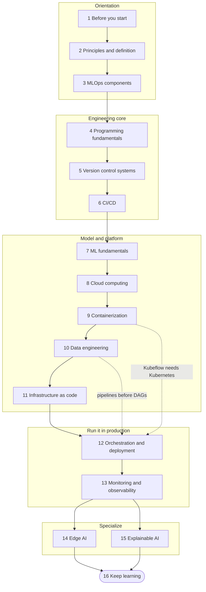
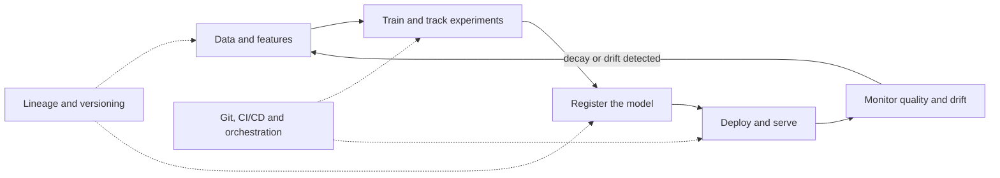

# MLOps Roadmap: From Notebook to Reliable Production Machine Learning

A free, hands-on learning path for people who can already train a model and now want to ship it, keep it healthy and change it safely. It has sixteen stages that build on each other, from the principles of MLOps through version control, CI/CD, containers, cloud, data engineering, infrastructure as code, orchestration, monitoring, edge deployment and explainability. Every stage ends with a "Try it" exercise and a self-check list, and three capstone projects at the end tie everything together.

**Who it is for.** Data scientists and ML practitioners who are tired of "it worked in my notebook", software and DevOps engineers moving into machine learning platforms, and students who want a realistic picture of what happens after `model.fit()`. You do not need a GPU or a paid cloud account to follow along: almost every exercise runs on a laptop with free tiers or local tools.

**Prerequisites.**

- **DevOps basics.** Linux command line, Git, the idea of CI/CD, containers and cloud basics. The [DevOps roadmap](devops-roadmap.md) in this folder is the intended prerequisite, and [stage 1](#1-before-you-start-prerequisite-and-related-roadmaps) gives a quick readiness test.
- **Python.** Functions, modules, virtual environments, reading and writing files, and installing packages with `pip`.
- **Some machine learning.** You have split data into train and test sets and fitted at least one scikit-learn model. If not, do the [machine learning roadmap](machine-learning-roadmap.md) or the [Machine Learning Beginner Roadmap](../Machine%20Learning%20Beginner%20Roadmap_.md) first or in parallel with stage 7.

**What you will be able to do at the end.**

- Explain the MLOps lifecycle and place any tool in it, using the seven components as a map.
- Version code, data, parameters and models together, and rebuild any past model on demand.
- Build CI/CD pipelines that test code and data, train, report metrics on pull requests and gate releases.
- Package a model as a container, run it on Kubernetes and provision the infrastructure with code.
- Design data pipelines and orchestrate training and batch scoring with Airflow or Kubeflow.
- Monitor latency, errors, data drift and model quality with Prometheus and Grafana, and alert on what matters.
- Shrink a model for edge devices and explain individual predictions with SHAP and LIME.

**Time estimate.** About 24 to 32 weeks at 8 to 10 hours per week if you read every section and do every exercise. If you already know DevOps or ML well, skim those stages and finish closer to 24 weeks. The [weekly study plan](#suggested-weekly-study-plan) shows one possible schedule.

## Originality and review status

This is an independently written, original learning guide. The text, examples, diagrams and structure were written for this repository from the author's own knowledge and from official documentation. Topic coverage follows the community roadmap at [https://roadmap.sh/mlops](https://roadmap.sh/mlops), which is linked for reference only: none of its text is copied or adapted here, and this guide is not affiliated with or endorsed by that site.

**Last reviewed: October 2026.**

Tools change quickly. Version numbers, product names, default behaviours and managed-service features can shift within months, so perishable statements are marked "(as of Oct 2026)" and prices are never quoted. Code samples are short illustrations, not drop-in production code: pin versions, read the official documentation of each tool and test in a sandbox before you depend on a sample. Secrets in samples always come from environment variables or CI secrets, never from inline values. Nothing here is legal or compliance advice.

## Table of contents

- [The path at a glance](#the-path-at-a-glance)
- [How to use this roadmap](#how-to-use-this-roadmap)
- [1. Before you start: prerequisite and related roadmaps](#1-before-you-start-prerequisite-and-related-roadmaps)
- [2. MLOps principles and definition](#2-mlops-principles-and-definition)
- [3. MLOps components](#3-mlops-components)
- [4. Programming fundamentals](#4-programming-fundamentals)
- [5. Version control systems](#5-version-control-systems)
- [6. CI/CD](#6-cicd)
- [7. Machine learning fundamentals](#7-machine-learning-fundamentals)
- [8. Cloud computing](#8-cloud-computing)
- [9. Containerization](#9-containerization)
- [10. Data engineering fundamentals](#10-data-engineering-fundamentals)
- [11. Infrastructure as code](#11-infrastructure-as-code)
- [12. Orchestration and deployment](#12-orchestration-and-deployment)
- [13. Monitoring and observability](#13-monitoring-and-observability)
- [14. Edge AI](#14-edge-ai)
- [15. Explainable AI](#15-explainable-ai)
- [16. Keep learning](#16-keep-learning)
- [Capstone projects](#capstone-projects)
- [Suggested weekly study plan](#suggested-weekly-study-plan)
- [Related guides in this repository](#related-guides-in-this-repository)
- [Coverage checklist](#coverage-checklist)

## The path at a glance

Solid arrows are the recommended order. Dotted arrows are soft dependencies: Kubeflow needs Kubernetes, and Airflow is much easier once you understand data pipelines.



Times are for full-depth coverage at 8 to 10 hours per week.

| Stage | What you learn | Time | Key outcome |
|-------|----------------|------|-------------|
| 1. Before you start | Readiness check against the DevOps prerequisite, and which related roadmaps to open | 0.5-1 week | You know your gaps and have a plan to close them |
| 2. Principles and definition | The principles of MLOps, what MLOps is, and how it differs from DevOps | 1 week | You can explain MLOps to a colleague in two minutes |
| 3. MLOps components | Seven components, drift, model registry, feature stores, reproducibility, maturity levels | 1-2 weeks | You can audit a project against the seven components |
| 4. Programming fundamentals | Bash, Python for pipelines, SQL, and where Go fits | 2-3 weeks | Scripts and tested Python modules you can run unattended |
| 5. Version control systems | Git, GitHub collaboration, DVC for data and pipelines | 1-2 weeks | A repository where code, data and models are versioned together |
| 6. CI/CD | GitLab CI, Jenkins, GitHub Actions, CML | 2 weeks | A pipeline that tests, trains and comments metrics on a pull request |
| 7. Machine learning fundamentals | Maths, ML, deep learning, evaluation, scikit-learn, TensorFlow, PyTorch, MLflow | 3-4 weeks | A tracked, evaluated baseline model you understand |
| 8. Cloud computing | AWS, Azure and GCP basics, cloud-native ML services | 2 weeks | Storage, compute and least-privilege access set up in one cloud |
| 9. Containerization | Docker images, Kubernetes workloads | 2-3 weeks | A model API image running on a local cluster |
| 10. Data engineering fundamentals | Pipelines, lakes and warehouses, ingestion, Spark, Kafka, Flink | 2-3 weeks | A batch and a streaming ingestion design with data checks |
| 11. Infrastructure as code | Terraform, Ansible | 1-2 weeks | A reviewed, repeatable environment created from code |
| 12. Orchestration and deployment | Airflow, Kubeflow | 2-3 weeks | An orchestrated training and scoring pipeline with retries |
| 13. Monitoring and observability | Prometheus metrics and alerts, Grafana dashboards | 2 weeks | Latency and drift alerts for a live model |
| 14. Edge AI | TFLite, PyTorch Mobile, Jetson | 1-2 weeks | A compressed model running on a constrained device or emulator |
| 15. Explainable AI | LIME, SHAP | 1 week | Global and local explanations for a model you shipped |
| 16. Keep learning | Where to go next | Ongoing | A personal learning plan |

## How to use this roadmap

- **Read the tree in order the first time.** Later stages assume earlier ones, but you can skim a stage you already know and still do its self-check.
- **Pick one tool per category and learn it well.** Where a stage lists several tools (for example GitLab, Jenkins and GitHub Actions), the comparison table helps you choose. Concepts transfer between tools; shallow knowledge of five tools does not.
- **Treat the self-check lists as exit criteria.** Tick an item only when you can show evidence: a working command, a passing pipeline, a dashboard screenshot.
- **Build one running project.** Use one small tabular problem (for example churn or house prices) from stage 4 onward and add one MLOps capability per stage. The capstones reuse it.
- **Use the coverage checklist at the end** to track every topic in the roadmap and to see what is left.

---

## 1. Before you start: prerequisite and related roadmaps

**Why it matters.** MLOps is DevOps applied to systems whose behaviour depends on data as well as code. If you cannot yet branch, review, build a container and read a dashboard, you will fight the tools and the machine learning at the same time. This short stage is a readiness check, not a course.

### Prerequisite: the DevOps roadmap

The [DevOps roadmap](devops-roadmap.md) in this folder covers what MLOps builds on: the Linux shell, Git workflows, CI/CD concepts, containers, basic networking, cloud fundamentals and monitoring. You do not need all of it before starting, but you need the vocabulary, and several stages here (CI/CD, containers, infrastructure as code, monitoring) deepen DevOps topics with an ML twist. A common pitfall is to skip DevOps because "I am a data person" and then discover that most production incidents in ML systems are ordinary operations problems: a full disk, an expired credential, a container that cannot reach the database. Use the readiness test below to decide how much to read first.

| Readiness question | If your answer is "no" |
|--------------------|------------------------|
| Can I create a branch, open a pull request and resolve a merge conflict? | Do the Git part of the DevOps roadmap first |
| Can I write a Dockerfile and run a container with a mounted folder and an environment variable? | Read the container part before stage 9 |
| Can I explain what a CI pipeline does when I push a commit? | Read the CI/CD part before stage 6 |
| Can I SSH into a Linux machine, read logs and check disk and memory? | Spend a few days on Linux basics and stage 4 Bash |
| Do I know what a virtual environment is and why I need one? | Start with the Python part of stage 4 |

### Related roadmaps

The community roadmap this guide follows lists six neighbouring roadmaps. Use them as depth on demand, not as extra homework.

| Roadmap | Open it when | What it adds here |
|---------|--------------|-------------------|
| AI and Data Scientist | You want the modelling and analysis side in more depth | Statistics, feature engineering, model choice |
| DevOps | You failed any readiness question above | Delivery pipelines, infrastructure, operations habits |
| Backend | You will build the services that wrap models | APIs, databases, authentication, caching |
| Machine Learning | Stage 7 feels too fast | Algorithms, training and evaluation in depth; see [machine-learning-roadmap.md](machine-learning-roadmap.md) |
| Python | You write Python daily but feel shaky on packaging or testing | Language depth, tooling, typing |
| Shell/Bash | Stage 4 Bash feels new | Scripting, text processing, automation |

The browsable list of community roadmaps is at [https://roadmap.sh/](https://roadmap.sh/) (reference only). Inside this repository, start with the other guides listed in [Related guides](#related-guides-in-this-repository).

**Try it.** Run the readiness test as a single exercise: in a new folder, create a Git repository, a virtual environment, a ten-line Python script and a Dockerfile that runs it, push the repository to GitHub, and add a workflow that runs the script on every push. Note every place you got stuck; that list is your pre-reading.

**Self-check.**

- I can name the DevOps skills this guide assumes and rate myself on each.
- I can create a branch, push it and open a pull request.
- I can build and run a container from a Dockerfile.
- I know which related roadmap to open if a later stage feels too fast.
- I have a one-page list of gaps to close before stage 6.

---

## 2. MLOps principles and definition

**Why it matters.** Tool lists change every year; principles do not. When a new orchestrator or registry appears, the principles tell you what problem it must solve and how to judge it. This stage gives you the vocabulary and the mental model that the rest of the guide hangs on.

### MLOps principles

Eight ideas explain almost every practice in this guide. They overlap on purpose: real systems break at the seams between them.

| Principle | In practice | Failure it prevents |
|-----------|-------------|---------------------|
| Version everything | Code, data, parameters, environments and models all have identifiers | "Which data trained the model in production?" has no answer |
| Automate the repeatable path | Pipelines instead of notebooks and manual steps | A release that only one person can perform |
| Make runs reproducible | Pinned dependencies, seeds, recorded inputs | A model nobody can rebuild after the author leaves |
| Test data and models, not only code | Schema checks, metric thresholds, behaviour tests | A "green" build that ships a worse model |
| Deliver continuously, in small steps | CI, CD and continuous training with safe rollouts | Rare, scary, big-bang releases |
| Monitor behaviour, not only uptime | Drift, quality and business metrics in production | A service that is up and quietly wrong |
| Close the feedback loop | Monitoring signals trigger investigation or retraining | Models that decay until someone complains |
| Share ownership and govern | Clear roles, reviews, access control and audit trails | Gaps between data science, engineering and operations, and uncontrolled risk |

The main trade-off is effort versus risk: do not automate everything on day one. A single model used by five people needs far less machinery than a fraud model that decides thousands of payments an hour. Choose the smallest set of practices that keeps the risk of the model acceptable, and add more as the stakes grow. The [maturity model](#a-simple-mlops-maturity-model) in the next stage describes that climb.

### What is MLOps?

MLOps is the set of practices, roles and tools that take a machine learning model from an experiment to a reliable service and keep it that way. The name borrows from DevOps: the goal is the same, short and safe cycles from change to production, but the thing being changed is different. In a classic application the behaviour comes from code. In an ML system it comes from code plus data plus the model trained from both, so any of the three can change the outcome and any of the three can quietly go stale. A well-known observation from industry research is that the model code is a small box inside a much larger system of data collection, validation, serving and monitoring; MLOps is the work on everything around that box.

| Concern | Classic DevOps | MLOps adds |
|---------|----------------|------------|
| What changes | Code and configuration | Code, data, features, model artifacts |
| What is tested | Behaviour against fixed expectations | Behaviour plus data quality and metric thresholds that are statistical |
| What a release is | A built artifact | A trained model, its data lineage and the code that serves it |
| How it fails | Errors, crashes, latency | The same, plus silent decay from drift |
| Who is involved | Developers and operations | Data scientists, ML engineers, data engineers, platform and product |

MLOps is related to, but not the same as, DataOps (reliable data pipelines) and LLMOps (operating systems built on large language models; see the [AI Engineer deployment guide](../AI-Engineer-Roadmap/10-deployment-llmops-and-scaling.md)). A frequent mistake is to treat MLOps as a product you buy. Platforms help, but the practices come first: a team that cannot reproduce a training run will not be rescued by a tool that stores more logs.

**Try it.** Pick a model project you know and write a one-page "life of a model" document: where the data comes from, how a model is trained, who approves it, how it reaches users, and how you would notice it getting worse. Mark every sentence that begins with "somebody manually".

**Self-check.**

- I can state the eight principles in my own words and give a failure each one prevents.
- I can explain in two minutes what MLOps is and how it differs from DevOps.
- I can name the three things that can change a model's behaviour: code, data and the model itself.
- I can explain why "the service is up" does not mean "the model is right".
- I can describe where I would stop automating for a low-risk internal model.

---

## 3. MLOps components

**Why it matters.** Seven components cover the whole lifecycle. Every tool in the later stages belongs to one of them, so when you meet a new tool you can ask which component it serves and which it replaces. This stage also covers five cross-cutting ideas the components rely on: drift, the model registry, feature stores, reproducibility and maturity levels.



| # | Component | Question it answers | Tools in this guide |
|---|-----------|---------------------|---------------------|
| 1 | Version control | What exactly changed, and can I go back? | Git, GitHub, DVC |
| 2 | CI/CD | Is this change safe to release, and who releases it? | GitHub Actions, GitLab CI, Jenkins, CML |
| 3 | Orchestration | What runs when, in which order, and what happens on failure? | Airflow, Kubeflow |
| 4 | Experiment tracking | Which run produced which result with which settings? | MLflow, DVC experiments |
| 5 | Data lineage | Where did this data and model come from? | DVC graph, orchestrator metadata, catalogs |
| 6 | Model training and serving | How is the model built, packaged and delivered? | Docker, Kubernetes, cloud ML services |
| 7 | Monitoring and observability | Is it healthy and still right? | Prometheus, Grafana |

### Component 1: Version control

Version control records every change so that you can compare, review, undo and reproduce. In MLOps the unit that needs versioning is larger than source code: it is code, training data, parameters, environment definitions and the resulting model. Git handles text well but not multi-gigabyte datasets, so teams keep small files in Git and put large files in object storage with a pointer in Git (DVC works this way; see [stage 5](#5-version-control-systems)). The rule to aim for is that every production model can be traced to one commit, one data version and one configuration. Common pitfalls are committing data or credentials by accident, committing notebooks with huge outputs (strip outputs before commit), and changing a dataset in place without a new version, which makes old results impossible to reproduce.

### Component 2: CI/CD

Continuous integration runs automated checks on every change: formatting and linting, unit tests, data validation tests and a small training run to prove the pipeline still works. Continuous delivery or deployment moves a verified artifact to an environment, ideally with approvals and a rollback path. ML adds two ideas: a metric gate that blocks a model worse than the current one, and continuous training (CT), where the pipeline itself retrains the model on a schedule or trigger. There are really two things to deliver, the pipeline code and the model, and mature teams have CI/CD for both. The usual pitfall is running full training on every commit; use a small sample in CI and run the full training on a schedule or on merge to the main branch.

### Component 3: Orchestration

An orchestrator runs a graph of dependent tasks (a DAG) on a schedule or in response to events, with retries, timeouts, parameters, backfills for past periods, alerting and a record of every run. It differs from CI/CD in what starts it: CI/CD reacts to a change in code, while orchestration reacts to time, new data or other events and usually runs the long data and training jobs. Airflow and Kubeflow Pipelines are the tools in this guide ([stage 12](#12-orchestration-and-deployment)). Typical pitfalls are a cron job on one machine that nobody monitors, tasks that are not safe to run twice, and hidden state passed between tasks through local files instead of explicit inputs and outputs.

### Component 4: Experiment tracking

Experiment tracking records, for every training run, the parameters, metrics, artifacts, code version, data version and environment, so you can compare runs and reproduce the best one. MLflow Tracking is the tool this guide teaches, and DVC experiments offer a Git-centred alternative. Log more than the final metric: log the data version, random seeds, the commit hash, training curves and the evaluation plots, because you will want to answer "why is this run different from last week's?". Pitfalls are logging only the winning runs (which hides how much you tried and inflates confidence), inconsistent metric names across people, and tracking servers with no backup, so the history disappears with a disk.

### Component 5: Data lineage

Data lineage is the record of where data came from and what happened to it: sources, transformations, datasets, features, trained models and finally predictions. It answers practical questions. Which models are affected if this upstream table was wrong? Which raw records went into this training set, so we can delete a user's data on request? Why did the feature change last Tuesday? Lineage can be captured at different granularities, from dataset-level (cheap, usually enough) to column-level (precise, costly), and from several sources: the pipeline definition itself (a DVC pipeline is a graph), orchestrator metadata, a data catalog, or the OpenLineage standard that many tools can emit. The classic failure is lineage that lives in one person's head or in a stale spreadsheet. A good habit is to make lineage a by-product of how you build pipelines rather than a separate documentation task.

```bash
# DVC can print the dependency graph of your pipeline stages
dvc dag
# and show which stage outputs depend on which inputs
dvc dag --outs
```

### Component 6: Model training and serving

Training is a pipeline: ingest, validate, prepare features, train, evaluate against a baseline and package the result with its metadata. Serving is how predictions reach users, and the pattern depends on latency needs.

| Serving pattern | How it works | Use when | Watch out for |
|-----------------|--------------|----------|---------------|
| Batch scoring | A scheduled job scores many rows and writes results to a table | Predictions are needed hourly or daily | Stale results, big-job failures |
| Online (REST or gRPC) | A service answers one request at a time | Interactive features, tight latency | Autoscaling, cold starts, p99 latency |
| Streaming | A consumer scores events from a log as they arrive | Fraud, sensors, near-real-time | Ordering, state, backpressure |
| Edge or embedded | The model runs on the device | No connectivity, privacy, very low latency | Model size, hardware limits, updates |

Release strategies reduce risk: shadow mode (score live traffic silently and compare), canary (a small share of traffic), A/B test (compare business outcomes) and blue-green (switch between two full environments). The most common training and serving pitfall is training-serving skew: the features are computed one way in the training notebook and another way in the service. Reuse the same feature code in both places, or use a feature store.

### Component 7: Monitoring and observability

Monitoring watches known signals and alerts when they cross a threshold; observability is being able to ask new questions about a running system using its logs, metrics and traces. An ML system needs four layers: service health (latency, error rate, saturation), data health (schema, missing values, ranges, freshness), model behaviour (prediction distribution, drift, quality once labels arrive) and business outcomes. Labels often arrive late, for example whether a loan defaulted months later, so proxy signals such as input drift and prediction shifts are needed in the meantime. The classic pitfall is monitoring only the service: everything is green while the model quietly degrades. Another is alert fatigue; an alert must say what is wrong and what to do about it. Stage 13 builds this with Prometheus and Grafana.

### Drift: data drift and concept drift

Models learn from a snapshot of the world, and the world moves. **Data drift** (also called covariate shift) means the distribution of the inputs changes: a new marketing channel brings younger customers, or a sensor is recalibrated. The model may still be correct on the new inputs, or it may be extrapolating beyond what it saw. **Concept drift** means the relationship between inputs and the target changes: the same customer profile now has a different chance of churning because a competitor changed prices, so the model's learned rules are wrong even if the inputs look the same. Related names you will meet are label or prior shift (the class balance moves) and upstream data changes (a unit changes from metres to feet). Detect data drift by comparing a recent window of inputs with a reference window using statistics such as the population stability index, the Kolmogorov-Smirnov test or the chi-squared test per feature, and detect concept drift mainly by watching real quality metrics when labels arrive. Open-source libraries such as Evidently ([docs](https://docs.evidentlyai.com/)) package these checks. With very large samples almost any difference is statistically significant, so set thresholds on effect size rather than on p-values alone, and decide in advance what the response is: investigate, retrain, roll back or pause the model.

### Model registry

A model registry is a catalog of model versions with the metadata needed to trust and operate them: which run and commit produced the version, its metrics, its input and output signature, an owner, and a lifecycle marker such as "candidate" or "production". It gives deployment pipelines one place to ask "which model should I serve?" and gives you a one-step rollback to the previous version. MLflow's Model Registry is the example used in this guide; cloud platforms offer their own. As of Oct 2026, MLflow recommends model version aliases (for example "champion") rather than the older fixed stages. Do not confuse the registry with an artifact store: the store holds files, the registry adds meaning, approval and history. The pitfall to avoid is promoting a model by copying a file by hand, which leaves no audit trail and no easy way back.

### Feature stores

A feature store is a system for defining features once and serving them consistently: an offline store with history for building training sets (with point-in-time correct joins, so a row never sees information from its future) and an online store with low-latency lookups for serving. It attacks two problems: training-serving skew and teams recomputing the same feature in different, subtly incompatible ways. Open-source Feast ([docs](https://docs.feast.dev/)) and managed offerings from the cloud platforms are common choices. The trade-off is operational weight: a feature store is one more system to run, so it pays off when many models share features or you need low-latency online features, and it is overkill for one model with a handful of columns. Start with shared, tested feature code in a library and move to a store when the pain is real.

### Reproducibility

Reproducibility means someone else, or you in six months, can get the same model from the recorded inputs, or can explain why not. Treat it as a checklist: the code commit, the data version or content hash, the full parameter set, the environment (a lock file or a container image digest), the random seeds, and notes about hardware when it matters. Exact bit-for-bit equality is not always possible, since some GPU operations are non-deterministic and parallel reductions change the order of floating point sums, so aim for results that match within a tolerance you have measured, and write that tolerance down. The common pitfalls are unpinned dependencies ("latest" moved overnight), data pulled from a live table that changed since, and seeds set in one library but not in others (Python, NumPy and the framework each have their own).

### A simple MLOps maturity model

Maturity models are simplifications, but a three-level one is a useful way to decide what to build next. The levels below follow a widely used progression from manual work to automated pipelines to automated delivery of those pipelines.

| Level | How it looks | What triggers retraining | Main risk |
|-------|--------------|--------------------------|-----------|
| 0. Manual | Notebooks and scripts, hand-over of a model file, deployment by hand, little or no monitoring | A person remembers or a stakeholder complains | Unreproducible models and slow, error-prone releases |
| 1. Automated pipeline | Training is an orchestrated pipeline with data validation, experiment tracking and a registry; the pipeline runs on a schedule or on new data | Schedule, new data or a drift alert | The pipeline code itself is still changed and deployed by hand |
| 2. Automated CI/CD of pipelines | Pipeline code is built, tested and deployed automatically; model releases pass metric gates and use staged rollouts; monitoring feeds back into triggers | Any of the above, plus automated tests on pipeline changes | Complexity and cost; more machinery to maintain |

Climb one level at a time and only as far as the risk justifies. Many internal models are well served at level 1, and a team that jumps to level 2 without level 1 habits ends up automating a confusing process.

**Try it.** Take any model project and, for each of the seven components, write one sentence about how it is handled today and mark it level 0, 1 or 2. Pick the single weakest component and write down the smallest change that would raise it one level.

**Self-check.**

- I can name the seven components and say which question each answers.
- I can explain the difference between CI/CD and orchestration.
- I can list what an experiment tracker should record beyond the final metric.
- I can explain what data lineage is and give two questions it answers.
- I can tell data drift from concept drift and say how I would detect each.
- I can explain what a model registry adds over a folder of model files.
- I can say when a feature store is worth its cost and when it is not.
- I can place a project on the maturity model and name the next step.

---

## 4. Programming fundamentals

**Why it matters.** Pipelines, CI jobs, container entrypoints and orchestrator tasks are all just code, and you will write far more glue code than model code. That glue has to run unattended, fail loudly and be testable. Python, a little Bash and SQL are essential; Go is a useful extra for platform work.

| Language | Role in MLOps | Priority |
|----------|---------------|----------|
| Bash | Glue in CI jobs, Dockerfiles, servers and quick automation | Essential, shallow depth is fine |
| Python | Training, data processing, pipeline definitions, serving APIs | Essential, go deep |
| SQL | Reading, joining and validating data in warehouses and feature tables | Essential |
| Go | Infrastructure tools, operators, fast network services | Optional, learn after the rest |

### Bash

Bash is the language of terminals, CI runners and container entrypoints, so you meet it even if you never choose it. Learn pipes, redirection, variables, quoting, exit codes, loops and functions, and use the shell for orchestration of commands rather than for logic: once a script needs data structures or real error handling, move it to Python. The single most valuable habit is strict mode (`set -euo pipefail`), which makes a script stop at the first failure instead of cheerfully continuing with broken state. Typical pitfalls are unquoted variables that split on spaces, scripts that silently ignore a failed middle command in a pipeline, and portability surprises between Linux, macOS and Windows shells. Run `shellcheck` on every script you commit.

```bash
#!/usr/bin/env bash
set -euo pipefail          # stop on errors, unset variables and failed pipes

: "${MLFLOW_TRACKING_URI:?set MLFLOW_TRACKING_URI first}"
CONFIG="${1:-configs/baseline.yaml}"

log() { printf '%s %s\n' "$(date -u +%FT%TZ)" "$*" >&2; }
trap 'log "failed near line $LINENO"' ERR

log "pulling versioned data"
dvc pull
log "training with ${CONFIG}"
python -m churn.train --config "${CONFIG}"
log "finished"
```

### Python

Python is the working language of ML and of most MLOps tooling, so aim for production habits, not notebook habits. Put logic in importable packages with a `pyproject.toml`, keep notebooks for exploration, pin dependencies in a lock file, and isolate each project in a virtual environment (venv, or a tool such as `uv` or `pip-tools` on top). Add type hints, a formatter and linter (for example Ruff), structured logging instead of `print`, configuration in files or environment variables instead of constants, and tests with `pytest`. Data checks belong in tests too, because a pipeline that ingests a column in the wrong unit is a bug even if no line of code changed. The pitfalls are notebooks that depend on hidden execution order, global state, and "works on my machine" environments with unpinned packages.

```python
# tests/test_features.py - a tiny contract for the feature code
import pandas as pd
import pytest

from churn.features import build_features


def test_features_are_deterministic():
    raw = pd.DataFrame({"tenure_months": [1, 24], "monthly_charges": [20.0, 80.5]})
    pd.testing.assert_frame_equal(build_features(raw), build_features(raw))


def test_missing_values_are_handled():
    raw = pd.DataFrame({"tenure_months": [1, None], "monthly_charges": [20.0, 80.5]})
    assert not build_features(raw).isna().any().any()


def test_invalid_tenure_is_rejected():
    raw = pd.DataFrame({"tenure_months": [-1], "monthly_charges": [20.0]})
    with pytest.raises(ValueError):
        build_features(raw)
```

### SQL

Most business data lives in relational databases and warehouses, so you will read and write SQL to build training sets, validate data and compute features. Learn joins, aggregation, window functions, common table expressions and how to read a query plan, then learn your warehouse's specific dialect. The ML-specific skill is building point-in-time correct datasets: when you attach features to a labelled event, use only information that existed before that event, otherwise the model trains on the future and looks brilliant until production. Keep SQL in version control, review it like code and test it with small fixtures. A common pitfall is a join that silently duplicates rows and inflates metrics, so count rows before and after every join.

```sql
-- Attach the latest feature row computed on or before each label's snapshot date
WITH ranked AS (
  SELECT
    l.customer_id,
    l.snapshot_date,
    l.churned_next_30d AS label,
    f.tenure_months,
    f.spend_90d,
    ROW_NUMBER() OVER (
      PARTITION BY l.customer_id, l.snapshot_date
      ORDER BY f.computed_at DESC
    ) AS rn
  FROM labels AS l
  JOIN customer_features AS f
    ON f.customer_id = l.customer_id
   AND f.computed_at <= l.snapshot_date
)
SELECT customer_id, snapshot_date, label, tenure_months, spend_90d
FROM ranked
WHERE rn = 1;
```

### Go

Go is a compiled language with simple syntax, built-in concurrency and static binaries. Much of the cloud-native world is written in it, including Docker, Kubernetes, Terraform and Prometheus, so reading Go helps when you debug those tools, write a Kubernetes operator, a custom exporter or a small high-throughput gateway in front of a model. It is not where models are trained, because the ML library ecosystem is thin compared with Python, so treat it as a platform skill. The trade-off is time: for most ML engineers a few evenings with the official tour is enough, and deep Go skills pay off mainly in platform teams. A common mistake is rewriting a working Python service in Go for speed when the real bottleneck is the model, not the web layer.

**Try it.** Write a Python module with a `build_features` function and the three tests above, a Bash script that runs lint, tests and training with strict mode, and a SQL query that builds a point-in-time training table from two small CSV files loaded into SQLite or DuckDB. Break each on purpose and confirm it fails loudly.

**Self-check.**

- I can write a Bash script with strict mode, a function and an error trap, and run `shellcheck` on it.
- I can structure a Python project with a package, tests, a lock file and a virtual environment.
- I can write a data-validation test that fails on a bad input.
- I can explain point-in-time correctness and write a SQL join that respects it.
- I can say when Go is the right tool and when it is not.
- I can run all my scripts from a clean checkout on a fresh machine.

---

## 5. Version control systems

**Why it matters.** Reproducibility starts here. Git tracks code beautifully, GitHub adds review and automation, and a data versioning tool such as DVC extends the same discipline to data and models. Together they let you answer "exactly what produced this model?" with a commit hash.

### Git

Git is a distributed version control system: every clone has the full history, branches are cheap, and a commit is an immutable snapshot identified by a hash. For ML teams, adopt short-lived feature branches merged through pull requests (or trunk-based development with small, frequent merges), write commit messages that say why, and use tags to mark model or pipeline releases (`model-v1.4.0`). Use `.gitignore` for data, model files, virtual environments and credentials, and add a pre-commit hook for formatting and secret scanning. Pitfalls include committing large binaries (they stay in history forever), rewriting history on a shared branch, and committing credentials; if a secret is ever pushed, rotate it immediately, because deleting it from history is not enough.

### GitHub

GitHub hosts Git repositories and adds the collaboration layer: pull requests with reviews, issues, branch protection, code owners, releases, package and container registries, and GitHub Actions for automation. Configure the main branch to require pull requests, passing checks and at least one review, use `CODEOWNERS` so that changes to pipelines or feature code reach the right reviewers, and store secrets in repository or environment secrets rather than files. Other hosts such as GitLab and Bitbucket offer similar features, so the habits transfer. One pitfall is leaving the main branch unprotected "just for now", and another is letting a pull request from a fork reach secrets; by default workflows from forks do not receive repository secrets, and that default is a protection to keep.

```text
# .github/CODEOWNERS - require review from the owning team
/src/features/   @acme/data-engineering
/pipelines/      @acme/ml-platform
/dvc.yaml        @acme/ml-platform
```

### DVC

DVC (Data Version Control) extends Git to large files and ML pipelines. It stores small pointer files and a `dvc.lock` in Git while the actual data and models live in a remote such as S3, Azure Blob, Google Cloud Storage or a shared drive. A `dvc.yaml` file describes pipeline stages with their commands, dependencies, parameters, outputs and metrics, and `dvc repro` re-runs only the stages whose inputs changed, which gives you incremental, reproducible training and a built-in lineage graph. DVC competes with a few other approaches, so choose by need:

| Option | Strength | Limitation | Pick it when |
|--------|----------|------------|--------------|
| DVC | Data, pipelines, metrics and experiments tied to Git commits | Another CLI to learn; needs a remote | You want reproducible pipelines and data versions without a server |
| Git LFS | Very simple large-file support in Git hosts | No pipelines or lineage; host storage limits | You just need a few big files tracked |
| lakeFS | Git-like branches and commits over a data lake | A service to run | Many teams share a large data lake |
| Object-store versioning | Built into the cloud storage | No link to code commits | A safety net, not a workflow |

```yaml
# dvc.yaml
stages:
  prepare:
    cmd: python src/prepare.py data/raw/customers.csv data/prepared
    deps:
      - src/prepare.py
      - data/raw/customers.csv
    params:
      - prepare.test_size
      - prepare.seed
    outs:
      - data/prepared
  train:
    cmd: python src/train.py data/prepared models/model.joblib
    deps:
      - src/train.py
      - data/prepared
    params:
      - train.n_estimators
      - train.max_depth
    outs:
      - models/model.joblib
    metrics:
      - metrics.json:
          cache: false
```

```yaml
# params.yaml
prepare:
  test_size: 0.2
  seed: 42
train:
  n_estimators: 200
  max_depth: 8
```

```bash
dvc remote add -d storage s3://example-ml-bucket/dvc   # credentials come from the environment or CI secrets
dvc repro                                              # run only the stages whose inputs changed
dvc push                                               # upload data and models to the remote
git add dvc.yaml dvc.lock params.yaml metrics.json && git commit -m "Train baseline"
```

The classic DVC pitfalls are forgetting `dvc push` (a teammate's `dvc pull` then fails), committing `dvc.lock` without the matching data in the remote, and putting secrets in the remote URL instead of the environment.

**Try it.** Turn a notebook experiment into a two-stage DVC pipeline (`prepare` and `train`) with `params.yaml` and a `metrics.json`. Change one parameter, run `dvc repro` and `dvc metrics diff`, then check out the previous commit and confirm `dvc checkout` restores the earlier data and model.

**Self-check.**

- I can explain why large data does not belong in Git and how DVC solves it.
- I can write a `dvc.yaml` with dependencies, parameters, outputs and metrics.
- I can reproduce an old model from a Git tag and a DVC remote.
- I can configure branch protection and code owners on GitHub.
- I can ignore the right files and I know what to do if a secret is committed.
- I can choose between DVC, Git LFS and lakeFS for a given situation.

---

## 6. CI/CD

**Why it matters.** CI/CD turns "I think it works" into "the pipeline proves it works, every time". For ML it adds checks on data and metrics, and it is the machinery that makes the same pipeline run identically on every change. Learn one general-purpose CI system well, then add CML to bring model results into code review.

| Tool | What it is | Pick it when |
|------|------------|--------------|
| GitHub Actions | CI/CD built into GitHub; workflows in YAML, a large marketplace of reusable actions, hosted runners | Your code is on GitHub and you want the fastest start |
| GitLab CI/CD | CI/CD built into GitLab; `.gitlab-ci.yml`, built-in container registry and environments | Your code is on GitLab, or you want one integrated platform you can self-host |
| Jenkins | Self-hosted automation server with a huge plugin ecosystem and pipelines as code | You need full control, on-premises systems or you inherit an existing Jenkins |
| CML | Open-source tooling that runs inside the CI systems above to post metrics and plots as comments and to run ML jobs | You want model results visible in pull requests |

### GitLab

GitLab CI/CD reads a `.gitlab-ci.yml` at the repository root, splits the work into stages and jobs, and runs them on runners, which can be shared or self-managed and can use containers or GPUs. It is integrated with the GitLab container registry, environments and merge requests, so a single tool covers code, pipeline and deployment. Use CI/CD variables (masked and protected) for secrets, `rules` to control when jobs run, and artifacts to pass files between jobs. Pitfalls include long pipelines that nobody waits for (run quick checks first and heavy training on the main branch), and unprotected variables exposed to every branch.

```yaml
# .gitlab-ci.yml - secrets are CI/CD variables set in the project settings
stages: [test, train]

default:
  image: python:3.12-slim
  before_script:
    - pip install -r requirements.txt

unit-tests:
  stage: test
  script:
    - pytest -q

train:
  stage: train
  rules:
    - if: $CI_COMMIT_BRANCH == $CI_DEFAULT_BRANCH
  script:
    - dvc pull
    - dvc repro
  artifacts:
    paths:
      - metrics.json
    expire_in: 1 week
```

### Jenkins

Jenkins is a long-established open-source automation server that you install and operate yourself. Pipelines are described in a `Jenkinsfile` stored with the code, work is spread over agent nodes, and a very large plugin ecosystem integrates it with almost anything, which is why it is common in enterprises and on-premises environments. The cost of that flexibility is operations: you patch the server, manage plugins, scale agents and secure credentials. Treat plugins and the controller like production software, keep jobs defined as code rather than clicked together in the UI, and run builds on ephemeral agents (often containers) so that builds do not depend on state left by earlier ones.

### GitHub Actions

GitHub Actions runs workflows defined in `.github/workflows/*.yml` in response to events such as pushes, pull requests, schedules or manual triggers. Jobs run on GitHub-hosted or self-hosted runners, and reusable actions from the marketplace handle checkout, Python setup, caching and cloud login. For ML, the typical workflow lints, runs unit and data tests, reproduces the pipeline on a small sample, checks a metric against a threshold and uploads artifacts; heavier training can run on a schedule or on a self-hosted GPU runner. Use the least-privilege `permissions` block, pin third-party actions to a version or commit SHA, and keep credentials in repository or environment secrets (prefer short-lived cloud credentials through OpenID Connect over long-lived keys). Remember that workflows from forks cannot see secrets and that hosted runners have no GPU and limited time.

```yaml
# .github/workflows/ml-ci.yml
name: ml-ci
on:
  pull_request:
  push:
    branches: [main]

permissions:
  contents: read
  pull-requests: write        # lets CML comment on the pull request

jobs:
  test-and-train:
    runs-on: ubuntu-latest
    env:
      MLFLOW_TRACKING_URI: ${{ secrets.MLFLOW_TRACKING_URI }}
      AWS_ACCESS_KEY_ID: ${{ secrets.DVC_AWS_ACCESS_KEY_ID }}
      AWS_SECRET_ACCESS_KEY: ${{ secrets.DVC_AWS_SECRET_ACCESS_KEY }}
    steps:
      - uses: actions/checkout@v4            # pin to the current major version or a commit SHA
      - uses: actions/setup-python@v5
        with:
          python-version: "3.12"
          cache: pip
      - run: pip install -r requirements.txt   # includes dvc[s3] and pytest
      - name: Lint and unit tests
        run: |
          ruff check src tests
          pytest -q
      - name: Pull data and reproduce the pipeline
        run: |
          dvc pull
          dvc repro
      - name: Gate on the metric
        run: python scripts/check_metric.py --metric f1 --min 0.80
```

### CML

CML (Continuous Machine Learning) is an open-source command-line tool from the team behind DVC that brings ML results into the CI workflow. Its most useful feature is posting a Markdown report with metrics, tables and plots as a comment on a pull request or merge request, so reviewers see how a change affects the model without opening a notebook. It also supports launching a temporary cloud or GPU runner for training and shutting it down afterwards, although you should check the project's current documentation and maintenance status before depending on that part (as of Oct 2026). It runs on top of GitHub Actions or GitLab CI rather than replacing them. A pitfall is posting raw numbers with no baseline: always compare against the main branch, as in the step below.

```yaml
      # add after the training steps in the workflow above
      - uses: iterative/setup-cml@v2
      - name: Report metrics on the pull request
        if: github.event_name == 'pull_request'
        env:
          REPO_TOKEN: ${{ secrets.GITHUB_TOKEN }}   # check the CML docs for the variable name your version expects
        run: |
          git fetch origin main:main --depth=1
          echo "## Model metrics versus main" > report.md
          dvc metrics diff main --md >> report.md
          cml comment create report.md
```

**Try it.** Add the workflow above to your running project with a tiny dataset so it finishes in a few minutes. Open a pull request that changes a hyperparameter and confirm that the CML comment shows the metric difference, then open one that lowers the metric below the threshold and confirm the gate fails the build.

**Self-check.**

- I can explain the difference between CI, continuous delivery and continuous deployment.
- I can write a workflow that tests code, runs a pipeline and fails when a metric drops.
- I can keep secrets out of the repository and out of workflow logs.
- I can choose between GitHub Actions, GitLab CI and Jenkins for a given team and say why.
- I can make a pull request show model metric changes with CML.
- I can keep CI fast by using small samples for pull requests and full training on a schedule.

---

## 7. Machine learning fundamentals

**Why it matters.** You do not need to be a researcher to do MLOps, but you must understand what you are shipping: how a model learns, how to evaluate it honestly, how it fails, and what artifact each framework produces. Without that you cannot write meaningful tests, choose monitoring metrics or judge whether a retrained model is really better. The [Machine Learning Beginner Roadmap](../Machine%20Learning%20Beginner%20Roadmap_.md) in this repository goes much deeper; this stage keeps only what an MLOps engineer needs.

| Tool | Best at | Typical artifact and serving | Pick it when |
|------|---------|------------------------------|--------------|
| Scikit-learn | Tabular data, classical ML, preprocessing pipelines | A joblib or pickle file; served from a small API | Most business tabular problems, and as the baseline for everything else |
| TensorFlow (Keras) | Deep learning with a mature production and edge toolchain | SavedModel or `.keras`; TF Serving; TFLite for devices | You inherit a TensorFlow stack or target mobile and edge through TFLite |
| PyTorch | Deep learning research and most new open models | `state_dict`, TorchScript or ONNX export; served from your own API or a serving engine | Most new models and papers ship in PyTorch |
| MLflow | Not a modelling library: tracking, model packaging and registry | The MLflow model format, loadable for batch or online use | Alongside any of the above; learn it regardless |

### Maths and statistics

The maths you need is practical rather than theoretical. Linear algebra (vectors, matrices, dot products) explains how features and embeddings behave; calculus shows up as gradients and learning rates; probability and statistics give you distributions, sampling, confidence intervals, hypothesis tests and the bias-variance trade-off. In MLOps this is not decoration: you use it to read evaluation metrics with an honest sense of uncertainty, to design drift tests and A/B tests, and to decide whether a difference between two models is real or noise. A common pitfall is testing hundreds of features for drift at a 5% significance level and then drowning in false alarms, so correct for multiple comparisons or alert on effect size. Build the basics from the first chapter of the [Machine Learning Beginner Roadmap](../Machine%20Learning%20Beginner%20Roadmap_.md).

### Machine learning

Machine learning fits a function to data instead of writing the rules by hand. Supervised learning predicts a known target (classification and regression), unsupervised learning finds structure without labels (clustering, dimensionality reduction), and reinforcement learning learns from rewards; most production systems are supervised. The workflow is always the same: define the target, build features, split data honestly, train a baseline, evaluate, iterate, and then, which is where MLOps begins, package, deploy and monitor. Start with the simplest model that could work, because each extra layer of complexity is also extra cost to train, explain, serve and monitor. The usual pitfalls are fitting to noise (overfitting) and data leakage, where information from the future or from the test set leaks into training.

```python
from sklearn.compose import ColumnTransformer
from sklearn.ensemble import RandomForestClassifier
from sklearn.model_selection import cross_val_score, train_test_split
from sklearn.pipeline import Pipeline
from sklearn.preprocessing import OneHotEncoder, StandardScaler

numeric = ["tenure_months", "monthly_charges"]
categorical = ["contract_type"]

pipeline = Pipeline([
    ("prep", ColumnTransformer([
        ("num", StandardScaler(), numeric),
        ("cat", OneHotEncoder(handle_unknown="ignore"), categorical),
    ])),
    ("model", RandomForestClassifier(n_estimators=200, random_state=42)),
])

X_train, X_test, y_train, y_test = train_test_split(
    X, y, test_size=0.2, stratify=y, random_state=42  # X, y: your feature table and labels
)
# Preprocessing lives inside the pipeline, so each CV fold fits it on training folds only
print(cross_val_score(pipeline, X_train, y_train, cv=5, scoring="f1").mean())
```

### Deep learning

Deep learning uses multi-layer neural networks trained with gradient descent and shines on images, audio, text and other unstructured data. You should know the vocabulary (layers, activations, loss, backpropagation, epochs, batch size, regularization), the main families (convolutional networks, recurrent networks, transformers) and the idea of transfer learning, where you start from a pre-trained model and adapt it with far less data. For operations it changes the picture: artifacts are large, training needs GPUs and checkpoints, runs are long, and serving may need batching and specialised hardware. The classic pitfall is reaching for deep learning on small tabular data, where gradient-boosted trees are usually simpler, cheaper and just as accurate. For large language models and their operations, continue with the [AI Engineer roadmap](../AI-Engineer-Roadmap/README.md).

### Model evaluation

Evaluation answers "is this model good enough, and better than what we have?" and it is the foundation of every automated gate. Hold out data the model has never seen, use cross-validation when data is small, and choose metrics that match the cost of mistakes: precision, recall, F1 and PR-AUC for imbalanced classification, MAE or RMSE for regression, and calibration when predicted probabilities drive decisions. Always compare with a simple baseline, report results per slice (region, device, customer segment) because an average can hide a failing group, and use time-based splits for time-dependent data so you never train on the future. Offline metrics are only a proxy for business value, so plan online checks too, such as shadow runs or A/B tests. The pitfalls are accuracy on imbalanced data, tuning on the test set, and random splits where near-duplicate rows land on both sides.

### Scikit-learn

Scikit-learn is the standard Python library for classical machine learning: consistent `fit`, `predict` and `transform` interfaces, dozens of algorithms, preprocessing, model selection and metrics. Its `Pipeline` object chains preprocessing and a model into one artifact, which matters operationally because the same object that was trained is the one that serves, avoiding training-serving skew. Models are usually saved with joblib or pickle, and both are tied to library versions and unsafe to load from untrusted sources, so pin the scikit-learn version in the serving image and never load a model file you did not produce. Consider exporting to ONNX or serving through an MLflow model when you need a safer or more portable format. Pipelines that include custom code need that code importable at serving time, which is a frequent source of "cannot unpickle" errors.

### TensorFlow

TensorFlow, with its Keras API, is a deep learning framework with a strong deployment story. Models save as SavedModel or the Keras format, TensorFlow Serving provides a production inference server, TensorFlow Extended (TFX) offers pipeline components for validation and transformation, and TFLite converts models for mobile and embedded devices (stage 14). It is a good fit when you inherit a TensorFlow codebase or when on-device deployment is central. Mind version compatibility between TensorFlow, Keras and your Python version, and between the training environment and the serving image, since an export from one version may not load in another. A practical rule is to pin versions and test a "load and predict" step in CI, so a silent upgrade cannot break serving.

### PyTorch

PyTorch is a deep learning framework with dynamic computation graphs and a Pythonic feel, and it is the default in research and for most new open models. You write training loops with `torch.nn`, `DataLoader` and an optimizer, save weights as a `state_dict` and export for production through TorchScript, ONNX or the ExecuTorch path for devices (stage 14). Serving options include your own FastAPI service, a dedicated inference server, or a cloud endpoint; check the current maintenance status of any serving project before adopting it (as of Oct 2026). Operational pitfalls are saving whole pickled model objects instead of weights, forgetting `model.eval()` and `torch.no_grad()` at inference, mismatched CUDA and driver versions in containers, and non-deterministic GPU operations that make exact reproduction harder.

### MLflow

MLflow is an open-source platform for the ML lifecycle with three parts you will use constantly: Tracking (parameters, metrics, artifacts and tags per run, with a UI to compare runs), Models (a packaging format with "flavors" so one model can be loaded by many tools) and the Model Registry (versions, aliases and lineage back to the run). It works with scikit-learn, TensorFlow, PyTorch and many other libraries through a few lines of code, and it can run as a local file store for learning or as a shared tracking server with a database and object storage for a team. In production, put the server behind authentication, back up the database and artifact store, and do not use a laptop file store as your system of record. Record the Git commit and data version as tags so that every run is traceable.

```python
import os

import mlflow
import mlflow.sklearn
from sklearn.metrics import f1_score

# `pipeline`, X_train, y_train, X_test, y_test come from the scikit-learn example above
mlflow.set_tracking_uri(os.environ.get("MLFLOW_TRACKING_URI", "http://127.0.0.1:5000"))
mlflow.set_experiment("churn")

with mlflow.start_run(run_name="rf-baseline"):
    mlflow.log_params({"n_estimators": 200, "random_state": 42})
    mlflow.set_tags({"git_commit": os.environ.get("GITHUB_SHA", "local"), "data_version": "v3"})

    pipeline.fit(X_train, y_train)
    mlflow.log_metric("f1_test", f1_score(y_test, pipeline.predict(X_test)))

    mlflow.sklearn.log_model(
        pipeline,
        name="model",                               # MLflow 3.x; older versions use artifact_path
        registered_model_name="churn-classifier",   # creates a new registry version
    )
```

```python
from mlflow import MlflowClient
import mlflow.pyfunc

# Point the alias "champion" at the version you approved, then load by alias
MlflowClient().set_registered_model_alias("churn-classifier", "champion", version="3")
model = mlflow.pyfunc.load_model("models:/churn-classifier@champion")
```

**Try it.** Train a baseline (a dummy classifier or logistic regression) and a stronger model on one dataset, log both to MLflow with the Git commit and data version as tags, compare them in the UI, report precision and recall per slice, and register the better one with the alias `champion`.

**Self-check.**

- I can read a metric with a sense of uncertainty and explain why a baseline is needed.
- I can explain overfitting and data leakage and name one way each happens in a pipeline.
- I can choose an evaluation metric for an imbalanced problem and justify it.
- I can build a scikit-learn pipeline that includes preprocessing and train it with cross-validation.
- I can explain when deep learning is worth its operational cost.
- I can log a run to MLflow, compare runs and register a model version.
- I can explain the risk of loading pickled model files and one safer alternative.

---

## 8. Cloud computing

**Why it matters.** Models need three things from a cloud: a place to keep data and artifacts, elastic compute for training and serving (including GPUs), and a safe way to give people and services access. Cloud skill in MLOps is mostly identity and access, networking, cost awareness and picking the right managed service, not memorising product catalogues.

### AWS, Azure and GCP

Amazon Web Services, Microsoft Azure and Google Cloud Platform offer the same building blocks under different names: regions and zones, virtual machines and containers, object storage, virtual networks, identity and access management, managed databases, managed Kubernetes, secret stores and monitoring. Learn the concepts on one provider and map them to the others; the table shows the correspondence. Pick the cloud your organisation already uses, or where your data already lives, rather than comparing feature lists, because moving data between clouds is slow and costly. The pitfalls are the same everywhere: leaving GPU instances or notebooks running, public storage buckets, permissions that are far wider than needed, and no budget alerts.

| Concept | AWS | Azure | GCP |
|---------|-----|-------|-----|
| Object storage | S3 | Blob Storage | Cloud Storage |
| Managed Kubernetes | EKS | AKS | GKE |
| Container registry | ECR | Azure Container Registry | Artifact Registry |
| Serverless containers | Fargate, App Runner | Container Apps | Cloud Run |
| Identity and access | IAM | Microsoft Entra ID and Azure RBAC | Cloud IAM |
| Secret store | Secrets Manager | Key Vault | Secret Manager |
| Logs and metrics | CloudWatch | Azure Monitor | Cloud Monitoring and Cloud Logging |

Official entry points: [AWS documentation](https://docs.aws.amazon.com/), [Azure documentation](https://learn.microsoft.com/azure/), [Google Cloud documentation](https://cloud.google.com/docs). Least-privilege access is the first habit to build. The policy below lets a training job read one dataset prefix and write models to one artifact prefix and nothing else.

```json
{
  "Version": "2012-10-17",
  "Statement": [
    {
      "Sid": "ReadTrainingData",
      "Effect": "Allow",
      "Action": ["s3:GetObject", "s3:ListBucket"],
      "Resource": [
        "arn:aws:s3:::example-ml-data",
        "arn:aws:s3:::example-ml-data/datasets/*"
      ]
    },
    {
      "Sid": "WriteModelArtifacts",
      "Effect": "Allow",
      "Action": ["s3:PutObject"],
      "Resource": "arn:aws:s3:::example-ml-artifacts/models/*"
    }
  ]
}
```

### Cloud-native ML services

Each large provider sells a managed ML platform: Amazon SageMaker, Azure Machine Learning and Google's Vertex AI (names and packaging as of Oct 2026; confirm in the documentation). They bundle managed notebooks, training jobs with GPUs, hyperparameter tuning, pipelines, a model registry, online and batch endpoints and monitoring behind one interface. The benefit is speed and less infrastructure to run; the costs are lock-in, less control and bills that grow when idle endpoints or notebooks are left on. A balanced approach is to keep the portable core yours (training code in containers, models in open formats, tracking in MLflow, infrastructure in Terraform) and use the managed service for the parts that are heavy to build, such as large-scale training or autoscaling endpoints.

| Capability | AWS SageMaker | Azure Machine Learning | Google Vertex AI |
|------------|---------------|------------------------|------------------|
| Managed training jobs | Training jobs | Jobs and compute clusters | Custom training |
| Pipelines | SageMaker Pipelines | Azure ML pipelines | Vertex AI Pipelines |
| Model registry | SageMaker Model Registry | Model registry | Vertex AI Model Registry |
| Online inference | Real-time endpoints | Managed online endpoints | Vertex AI endpoints |

Documentation: [SageMaker](https://docs.aws.amazon.com/sagemaker/), [Azure Machine Learning](https://learn.microsoft.com/azure/machine-learning/), [Vertex AI](https://cloud.google.com/vertex-ai/docs).

**Try it.** In one cloud (a free tier or a sandbox account with a budget alert), create a storage bucket, a role or service account that has only the permissions in the policy above, and a small VM or container job. Use environment variables for credentials, run `dvc push` from your pipeline to the bucket, then delete every resource and check the billing page the next day.

**Self-check.**

- I can map the main building blocks (storage, compute, registry, IAM, secrets, monitoring) between AWS, Azure and GCP.
- I can write a least-privilege policy for a training job.
- I can explain why I set a budget alert before creating resources.
- I can name what a managed ML platform provides and two reasons to avoid deep lock-in.
- I can keep credentials out of code and rotate them.
- I can shut down and clean up everything I created.

---

## 9. Containerization

**Why it matters.** A container packages code, libraries and system dependencies into one image that runs the same everywhere. That solves "works on my machine" for training and serving, and it gives CI, orchestrators and clusters a standard unit to schedule. Kubernetes then runs, scales and heals those containers.

| Where to run it | Strength | Limitation | Pick it when |
|-----------------|----------|------------|--------------|
| `docker run` or Docker Compose | Simple, great for local development and small hosts | No scaling or self-healing across machines | Development, demos, one-server deployments |
| Managed serverless containers | No cluster to run; scales to zero | Less control, cold starts, limits on GPUs and runtime | Spiky, stateless model APIs |
| Kubernetes (managed or self-run) | Scaling, rolling updates, scheduling, GPU support, a huge ecosystem | Real operational complexity | Many services, GPUs, or a platform for several teams |
| Cloud ML endpoints | Least infrastructure to manage | Lock-in, cost at scale | You want managed serving and accept the trade-off |

### Docker

Docker builds images from a `Dockerfile`, a recipe made of layers, and runs them as isolated containers. For ML, use slim base images, install dependencies before copying code so layers cache well, use a multi-stage build to keep compilers and build tools out of the final image, run as a non-root user, and tag images with the Git commit or version rather than `latest`. Decide where the model lives: baking it into the image is simple and immutable but ties image size to model size, while pulling it at startup from a registry or object store keeps images small but adds a startup dependency. GPU images need matching drivers and CUDA versions, which is a rich source of pitfalls, as is putting secrets in the image or leaving large datasets in the build context (use a `.dockerignore`).

```dockerfile
# syntax=docker/dockerfile:1
FROM python:3.12-slim AS builder
ENV PIP_NO_CACHE_DIR=1
WORKDIR /build
RUN python -m venv /opt/venv
ENV PATH="/opt/venv/bin:$PATH"
COPY requirements.txt .
RUN pip install -r requirements.txt

FROM python:3.12-slim AS runtime
ENV PATH="/opt/venv/bin:$PATH" PYTHONUNBUFFERED=1
RUN useradd --create-home --uid 10001 appuser
WORKDIR /app
COPY --from=builder /opt/venv /opt/venv
COPY --chown=appuser:appuser src/ ./src/
COPY --chown=appuser:appuser models/model.joblib ./models/model.joblib
USER appuser
EXPOSE 8000
HEALTHCHECK --interval=30s --timeout=3s \
  CMD python -c "import urllib.request; urllib.request.urlopen('http://127.0.0.1:8000/healthz')"
CMD ["uvicorn", "src.api:app", "--host", "0.0.0.0", "--port", "8000"]
```

### Kubernetes

Kubernetes is a container orchestrator: you declare the desired state in YAML and the cluster works to maintain it. The core objects are Pods (one or more containers), Deployments (replicated, rolling-updated Pods), Services (stable network names), Ingress or Gateway resources (external traffic), ConfigMaps and Secrets (configuration), Jobs and CronJobs (batch work such as training or scoring) and a Horizontal Pod Autoscaler. For ML you also learn resource requests and limits, node selection for GPU nodes through the vendor's device plugin, and persistent volumes for data. Helm or Kustomize manage the many manifests. The typical pitfalls are missing resource limits (one leaky pod takes down a node), `latest` image tags, probes that restart a pod that is merely slow to load a large model, and Secrets committed to Git. Start on a local cluster such as kind or minikube before touching a cloud cluster.

```yaml
apiVersion: apps/v1
kind: Deployment
metadata:
  name: churn-api
  labels:
    app: churn-api
spec:
  replicas: 2
  selector:
    matchLabels:
      app: churn-api
  strategy:
    type: RollingUpdate
    rollingUpdate:
      maxUnavailable: 0
      maxSurge: 1
  template:
    metadata:
      labels:
        app: churn-api
    spec:
      containers:
        - name: api
          image: registry.example.com/ml/churn-api:1.4.2   # immutable tag or digest, never latest
          ports:
            - containerPort: 8000
          env:
            - name: MODEL_VERSION
              value: "1.4.2"
            - name: FEATURE_DB_PASSWORD
              valueFrom:
                secretKeyRef:
                  name: churn-api-secrets
                  key: feature-db-password
          resources:
            requests:
              cpu: 500m
              memory: 512Mi
            limits:
              memory: 1Gi
          readinessProbe:
            httpGet:
              path: /healthz
              port: 8000
            initialDelaySeconds: 5
            periodSeconds: 10
          livenessProbe:
            httpGet:
              path: /healthz
              port: 8000
            initialDelaySeconds: 15
            periodSeconds: 20
---
apiVersion: v1
kind: Service
metadata:
  name: churn-api
spec:
  selector:
    app: churn-api
  ports:
    - port: 80
      targetPort: 8000
```

Documentation: [Docker docs](https://docs.docker.com/) and [Kubernetes docs](https://kubernetes.io/docs/).

**Try it.** Wrap your model in a FastAPI service with `/predict` and `/healthz`, build the image with the Dockerfile above, run it locally and call it with `curl`. Then create a local cluster with kind or minikube, load the image, apply the Deployment and Service, and use `kubectl rollout` to ship version 2 and roll back to version 1.

**Self-check.**

- I can explain image, layer, container and registry.
- I can write a multi-stage Dockerfile that runs as a non-root user and has a health check.
- I can list the trade-offs of baking a model into the image versus loading it at startup.
- I can explain Pod, Deployment and Service and write a Deployment with probes and resource limits.
- I can roll out and roll back a new model version on Kubernetes.
- I can keep secrets out of images and manifests.

@@CONTINUE@@
