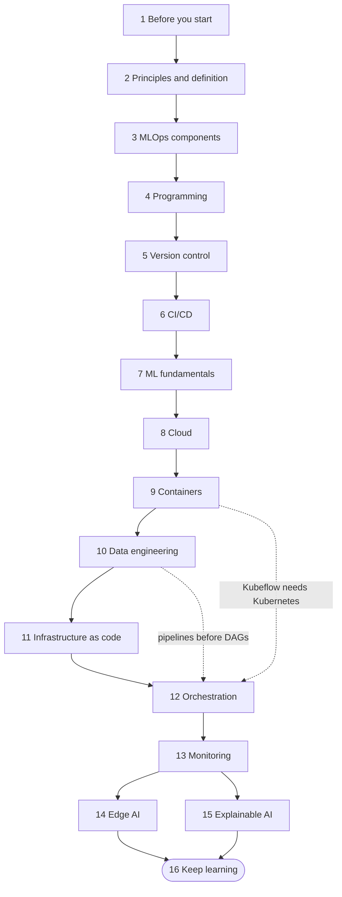

# MLOps Roadmap: From Notebook to Reliable Production Machine Learning

A free, hands-on learning path for people who can already train a model and now want to ship it, keep it healthy and change it safely. It has sixteen stages that build on each other, from the principles of MLOps through version control, CI/CD, containers, cloud, data engineering, infrastructure as code, orchestration, monitoring, edge deployment and explainability. Every stage ends with a "Try it" exercise and a self-check list, and three capstone projects at the end tie everything together.

**Who it is for.** Data scientists and ML practitioners who are tired of "it worked in my notebook", software and DevOps engineers moving into machine learning platforms, and students who want a realistic picture of what happens after `model.fit()`. You do not need a GPU or a paid cloud account to follow along: almost every exercise runs on a laptop with free tiers or local tools.

**Prerequisites.**

- **DevOps basics.** Linux command line, Git, the idea of CI/CD, containers and cloud basics. The [DevOps roadmap](devops-roadmap.md) in this folder is the intended prerequisite, and [stage 1](#1-before-you-start-prerequisite-and-related-roadmaps) gives a quick readiness test.
- **Python.** Functions, modules, virtual environments, reading and writing files, and installing packages with `pip`.
- **Some machine learning.** You have split data into train and test sets and fitted at least one scikit-learn model. If not, do the [machine learning roadmap](machine-learning-roadmap.md) or the [Machine Learning Beginner Roadmap](../Machine%20Learning%20Beginner%20Roadmap_.md) first or in parallel with stage 7.

**What you will be able to do at the end.**

- Explain the MLOps lifecycle and place any tool in it, using the seven components as a map.
- Version code, data, parameters and models together, and rebuild any past model on demand.
- Build CI/CD pipelines that test code and data, train, report metrics on pull requests and gate releases.
- Package a model as a container, run it on Kubernetes and provision the infrastructure with code.
- Design data pipelines and orchestrate training and batch scoring with Airflow or Kubeflow.
- Monitor latency, errors, data drift and model quality with Prometheus and Grafana, and alert on what matters.
- Shrink a model for edge devices and explain individual predictions with SHAP and LIME.

**Time estimate.** About 24 to 32 weeks at 8 to 10 hours per week if you read every section and do every exercise. If you already know DevOps or ML well, skim those stages and finish closer to 24 weeks. The [weekly study plan](#suggested-weekly-study-plan) shows one possible schedule.

## Originality and review status

This is an independently written, original learning guide. The text, examples, diagrams and structure were written for this repository from the author's own knowledge and from official documentation. Topic coverage follows the community roadmap at [https://roadmap.sh/mlops](https://roadmap.sh/mlops), which is linked for reference only: none of its text is copied or adapted here, and this guide is not affiliated with or endorsed by that site.

**Last reviewed: October 2026.**

Tools change quickly. Version numbers, product names, default behaviours and managed-service features can shift within months, so perishable statements are marked "(as of Oct 2026)" and prices are never quoted. Code samples are short illustrations, not drop-in production code: pin versions, read the official documentation of each tool and test in a sandbox before you depend on a sample. Secrets in samples always come from environment variables or CI secrets, never from inline values. Nothing here is legal or compliance advice.

## Table of contents

- [Originality and review status](#originality-and-review-status)
- [The path at a glance](#the-path-at-a-glance)
- [1. Before you start: prerequisite and related roadmaps](#1-before-you-start-prerequisite-and-related-roadmaps)
- [2. MLOps principles and definition](#2-mlops-principles-and-definition)
- [3. MLOps components](#3-mlops-components)
- [4. Programming fundamentals](#4-programming-fundamentals)
- [5. Version control systems](#5-version-control-systems)
- [6. CI/CD](#6-cicd)
- [7. Machine learning fundamentals](#7-machine-learning-fundamentals)
- [8. Cloud computing](#8-cloud-computing)
- [9. Containerization](#9-containerization)
- [10. Data engineering fundamentals](#10-data-engineering-fundamentals)
- [11. Infrastructure as code](#11-infrastructure-as-code)
- [12. Orchestration and deployment](#12-orchestration-and-deployment)
- [13. Monitoring and observability](#13-monitoring-and-observability)
- [14. Edge AI](#14-edge-ai)
- [15. Explainable AI](#15-explainable-ai)
- [16. Keep learning](#16-keep-learning)
- [Capstone projects](#capstone-projects)
- [Suggested weekly study plan](#suggested-weekly-study-plan)
- [Related guides in this repository](#related-guides-in-this-repository)
- [Coverage checklist](#coverage-checklist)

## The path at a glance

Solid arrows are the recommended order. Dotted arrows are soft dependencies: Kubeflow needs Kubernetes, and Airflow is much easier once you understand data pipelines. Where a stage lists several tools, a comparison table helps you pick one; learn that one well rather than sampling all of them, and tick items off in the [coverage checklist](#coverage-checklist) only when you can show evidence.



Times are for full-depth coverage at 8 to 10 hours per week.

| Stage | What you learn | Time | Key outcome |
|-------|----------------|------|-------------|
| 1. Before you start | Readiness check against the DevOps prerequisite, and which related roadmaps to open | 0.5-1 week | You know your gaps and have a plan to close them |
| 2. Principles and definition | The principles of MLOps, what MLOps is, and how it differs from DevOps | 1 week | You can explain MLOps to a colleague in two minutes |
| 3. MLOps components | Seven components, drift, model registry, feature stores, reproducibility, maturity levels | 1-2 weeks | You can audit a project against the seven components |
| 4. Programming fundamentals | Bash, Python for pipelines, SQL, and where Go fits | 2-3 weeks | Scripts and tested Python modules you can run unattended |
| 5. Version control systems | Git, GitHub collaboration, DVC for data and pipelines | 1-2 weeks | A repository where code, data and models are versioned together |
| 6. CI/CD | GitLab CI, Jenkins, GitHub Actions, CML | 2 weeks | A pipeline that tests, trains and comments metrics on a pull request |
| 7. Machine learning fundamentals | Maths, ML, deep learning, evaluation, scikit-learn, TensorFlow, PyTorch, MLflow | 3-4 weeks | A tracked, evaluated baseline model you understand |
| 8. Cloud computing | AWS, Azure and GCP basics, cloud-native ML services | 2 weeks | Storage, compute and least-privilege access set up in one cloud |
| 9. Containerization | Docker images, Kubernetes workloads | 2-3 weeks | A model API image running on a local cluster |
| 10. Data engineering fundamentals | Pipelines, lakes and warehouses, ingestion, Spark, Kafka, Flink | 2-3 weeks | A batch and a streaming ingestion design with data checks |
| 11. Infrastructure as code | Terraform, Ansible | 1-2 weeks | A reviewed, repeatable environment created from code |
| 12. Orchestration and deployment | Airflow, Kubeflow | 2-3 weeks | An orchestrated training and scoring pipeline with retries |
| 13. Monitoring and observability | Prometheus metrics and alerts, Grafana dashboards | 2 weeks | Latency and drift alerts for a live model |
| 14. Edge AI | TFLite, PyTorch Mobile, Jetson | 1-2 weeks | A compressed model running on a constrained device or emulator |
| 15. Explainable AI | LIME, SHAP | 1 week | Global and local explanations for a model you shipped |
| 16. Keep learning | Where to go next | Ongoing | A personal learning plan |

## 1. Before you start: prerequisite and related roadmaps

<!-- hinglish:start s01 -->
> **Hinglish me samjho (simple language)**
>
> **Is stage me kya seekhoge:** MLOps ka matlab hai DevOps ko machine learning par lagana. ML system me sirf code nahi badalta, data bhi badalta hai. Isliye aage badhne se pehle ye check karna zaroori hai ki aapko Git branch, container (ek dabba jisme app apni zaroorat ke saath band hoti hai), CI pipeline aur Linux shell ki basic samajh hai ya nahi. Ye koi lamba course nahi hai, bas ek chhota "readiness check" hai. Jahan aap atakte ho, bas wahi hissa DevOps roadmap me pehle padh lena.
>
> **Seekhne ka order:** Pehle DevOps roadmap (Linux, Git, CI/CD, container, cloud ke basics jin par MLOps khada hai), phir related roadmaps (AI and Data Scientist, Backend, Machine Learning, Python, Shell/Bash) sirf zaroorat padne par gehraai ke liye.
>
> **Is stage ke baad aap kar paoge:** ek naye folder me Git repo, virtual environment, Dockerfile aur GitHub workflow bana kar khud ka readiness test chalana, aur ye batana ki kaunsa DevOps ya related roadmap aapko pehle padhna hai.

<!-- hinglish:end s01 -->

**Why it matters.** MLOps is DevOps applied to systems whose behaviour depends on data as well as code. If you cannot yet branch, review, build a container and read a dashboard, you will fight the tools and the machine learning at the same time. This short stage is a readiness check, not a course.

### Prerequisite: the DevOps roadmap

The [DevOps roadmap](devops-roadmap.md) in this folder covers what MLOps builds on: the Linux shell, Git workflows, CI/CD concepts, containers, basic networking, cloud fundamentals and monitoring. You do not need all of it before starting, but you need the vocabulary, and several stages here (CI/CD, containers, infrastructure as code, monitoring) deepen DevOps topics with an ML twist. A common pitfall is to skip DevOps because "I am a data person" and then discover that most production incidents in ML systems are ordinary operations problems: a full disk, an expired credential, a container that cannot reach the database. Use this readiness test to decide how much to read first: can you create a branch and open a pull request, build and run a container with a mounted folder and an environment variable, explain what a CI pipeline does on a push, read logs and check disk and memory on a Linux machine, and set up a virtual environment? Each "no" points to the matching part of the DevOps roadmap, so read that part before the stage that needs it (Bash before stage 4, CI/CD before stage 6, containers before stage 9).

### Related roadmaps

The community roadmap this guide follows lists six neighbouring roadmaps. Use them as depth on demand, not as extra homework.

| Roadmap | Open it when | What it adds here |
|---------|--------------|-------------------|
| AI and Data Scientist | You want the modelling and analysis side in more depth | Statistics, feature engineering, model choice |
| DevOps | You failed any readiness question above | Delivery pipelines, infrastructure, operations habits |
| Backend | You will build the services that wrap models | APIs, databases, authentication, caching |
| Machine Learning | Stage 7 feels too fast | Algorithms, training and evaluation in depth; see [machine-learning-roadmap.md](machine-learning-roadmap.md) |
| Python | You write Python daily but feel shaky on packaging or testing | Language depth, tooling, typing |
| Shell/Bash | Stage 4 Bash feels new | Scripting, text processing, automation |

The browsable list of community roadmaps is at [https://roadmap.sh/](https://roadmap.sh/) (reference only). Inside this repository, start with the other guides listed in [Related guides](#related-guides-in-this-repository).

**Try it.** Run the readiness test as a single exercise: in a new folder, create a Git repository, a virtual environment, a ten-line Python script and a Dockerfile that runs it, push the repository to GitHub, and add a workflow that runs the script on every push. Note every place you got stuck; that list is your pre-reading.

**Self-check.**
- I can name the DevOps skills this guide assumes and rate myself on each.
- I can create a branch, push it and open a pull request.
- I can build and run a container from a Dockerfile.
- I can say which related roadmap to open if a later stage feels too fast.
- I can list the gaps I must close before stage 6.

## 2. MLOps principles and definition

<!-- hinglish:start s02 -->
> **Hinglish me samjho (simple language)**
>
> **Is stage me kya seekhoge:** Tools har saal badalte rehte hain, lekin principles (buniyadi usool) nahi badalte. Is stage me aap MLOps ke 8 principles aur MLOps ki simple definition seekhoge. Inse aapko pata chalega ki koi bhi naya tool kaunsi problem solve karta hai. Ye stage baaki poori guide ka "mental map" hai, isliye ise dhyan se samajhna.
>
> **Seekhne ka order:** MLOps principles (8 buniyadi usool, kaam ke niyam), What is MLOps? (model ko experiment se service tak le jaana).
>
> **Is stage ke baad aap kar paoge:** 8 principles apne shabdon me samjhana, do minute me batana ki MLOps aur DevOps me kya fark hai, aur ye samjhana ki "service chal rahi hai" ka matlab "model sahi hai" nahi hota.

<!-- hinglish:end s02 -->

**Why it matters.** Tool lists change every year; principles do not. When a new orchestrator or registry appears, the principles tell you what problem it must solve and how to judge it. This stage gives you the vocabulary and the mental model that the rest of the guide hangs on.

### MLOps principles

<!-- hinglish:start t-mlops-principles -->
> **Hinglish me samjho (simple language)**
>
> **Simple words me:** MLOps ke 8 principles ko ek achhe restaurant ke kitchen rules samjho. Recipe likhi hoti hai, har baar ek jaise banti hai, khana chakh kar test hota hai, aur customer ke feedback se recipe sudharti hai. 8 principles bas ye kehte hain: model ko aise banao aur chalao ki koi bhi use dobara bana sake, aur kuch bigde to jaldi pata chale.
>
> **Kyun zaroori hai:** Jab koi naya tool aata hai, to principles se aap poochh sakte ho "ye kaunsi galti rokta hai?". Isse aap tool ke naam se nahi, kaam se faisla karte ho.
>
> **Example, step by step:** Maan lo company ka churn model (kaun customer chhod kar jayega, ye batane wala model) production me hai. Teen mahine baad boss poochta hai: "Ye model kis data se bana tha?" Ab dekho har principle kaise madad karta hai.
>
> 1. Version everything: training ke time commit `a1b2c3d`, data version `v3` aur parameters note kar lo. Ab jawab 10 second me milta hai, 2 din me nahi.
> 2. Automate the repeatable path: training ek command se chale, notebook ke 12 cells haath se chalane se nahi. Tab sirf ek aadmi hi release nahi kar paayega.
> 3. Make runs reproducible: libraries ke versions pin karo aur random seed likho. Aapka dost bhi wahi model dobara bana sakta hai.
> 4. Test data and models: rule banao ki naya model purane se kharab ho to build fail ho jaye.
> 5. Deliver in small steps: har hafte ek chhota change bhejo, saal me ek bada release nahi.
> 6. Monitor behaviour: service chal rahi hai, par predictions ka average achanak 0.12 se 0.44 ho gaya? Ye alert hona chahiye.
> 7. Close the feedback loop: alert aaye to jaanch karo ya model dobara train karo.
> 8. Share ownership and govern: likha ho ki kaun approve karega, kaun deploy karega, kaun access dega.
>
> **Dhyan rakho:**
>
> - Pehle din sab kuch automate mat karo. 5 log use karte hain to chhota setup kaafi hai. Fraud model jo roz hazaron payments dekhta hai, usko zyada machinery chahiye. Risk ke hisaab se chuno.
> - Principles ek doosre se jude hain. Sirf "version" karke test aur monitoring bhool gaye to bhi system toot sakta hai.

<!-- hinglish:end t-mlops-principles -->

Eight ideas explain almost every practice in this guide. They overlap on purpose: real systems break at the seams between them.

| Principle | In practice | Failure it prevents |
|-----------|-------------|---------------------|
| Version everything | Code, data, parameters, environments and models all have identifiers | "Which data trained the model in production?" has no answer |
| Automate the repeatable path | Pipelines instead of notebooks and manual steps | A release that only one person can perform |
| Make runs reproducible | Pinned dependencies, seeds, recorded inputs | A model nobody can rebuild after the author leaves |
| Test data and models, not only code | Schema checks, metric thresholds, behaviour tests | A "green" build that ships a worse model |
| Deliver continuously, in small steps | CI, CD and continuous training with safe rollouts | Rare, scary, big-bang releases |
| Monitor behaviour, not only uptime | Drift, quality and business metrics in production | A service that is up and quietly wrong |
| Close the feedback loop | Monitoring signals trigger investigation or retraining | Models that decay until someone complains |
| Share ownership and govern | Clear roles, reviews, access control and audit trails | Gaps between data science, engineering and operations, and uncontrolled risk |

The main trade-off is effort versus risk: do not automate everything on day one. A single model used by five people needs far less machinery than a fraud model that decides thousands of payments an hour. Choose the smallest set of practices that keeps the risk of the model acceptable, and add more as the stakes grow. The [maturity model](#a-simple-mlops-maturity-model) in the next stage describes that climb.

### What is MLOps?

<!-- hinglish:start t-what-is-mlops -->
> **Hinglish me samjho (simple language)**
>
> **Simple words me:** DevOps me app ka behaviour sirf code se aata hai. ML system me behaviour teen cheezon se aata hai: code, data, aur un dono se bana model. Ye teeno me se koi bhi badle ya purana ho jaye, to jawab galat ho sakte hain. MLOps wo kaam hai jo model ko notebook se nikal kar bharosemand service banata hai aur use waisa hi rakhta hai. Model code to bas ek chhota dabba hai. Uske aas paas data lena, jaanchna, serve karna aur monitor karna, ye sab MLOps hai.
>
> **Kyun zaroori hai:** Sirf model banana aadha kaam hai. Bina MLOps ke model kuch hafton me chupchaap kharab hone lagta hai aur kisi ko pata nahi chalta.
>
> **Example, step by step:** Ravi ne notebook me churn model banaya (accuracy 90 percent). Phir ye hua:
>
> 1. Ravi ne `model.pkl` file email se bheji. Priya ne use server par haath se copy kiya.
> 2. Teen mahine baad predictions kharab hone lage. Koi nahi jaanta ki model kis data se bana tha.
> 3. Ravi company chhod chuka hai, aur uska notebook alag order me chalta hai, to model dobara nahi ban pa raha.
>
> Ab aap ek "life of a model" page likho. Ek project chuno aur har sawal ka jawab ek line me likho:
>
> ```text
> Data kahan se aata hai?        Koi har Monday CSV haath se download karta hai.
> Model kaise train hota hai?    Ravi apne laptop par notebook chalata hai.
> Kaun approve karta hai?        Koi nahi.
> Users tak kaise pahunchta hai? Koi file server par copy karta hai.
> Kharab hone ka pata kaise?     Jab customer shikayat kare.
> ```
>
> 4. Ab jis line me "koi haath se" jaisa kuch likha hai, us par nishaan lagao. Ye wahi jagah hain jahan MLOps ka kaam hoga: pipeline, registry, monitoring.
>
> **Dhyan rakho:**
>
> - MLOps koi product nahi hai jo kharid lo. Platform madad karta hai, lekin pehle practices aate hain. Jo team training run dobara nahi chala sakti, use zyada logs wala tool nahi bachayega.
> - MLOps, DataOps (data pipelines ko bharosemand rakhna) aur LLMOps (bade language models par bane systems chalana) ek jaise nahi hain, par ek doosre se milte hain.

<!-- hinglish:end t-what-is-mlops -->

MLOps is the set of practices, roles and tools that take a machine learning model from an experiment to a reliable service and keep it that way. The name borrows from DevOps: the goal is the same, short and safe cycles from change to production, but the thing being changed is different. In a classic application the behaviour comes from code. In an ML system it comes from code plus data plus the model trained from both, so any of the three can change the outcome and any of the three can quietly go stale. A well-known observation from industry research is that the model code is a small box inside a much larger system of data collection, validation, serving and monitoring; MLOps is the work on everything around that box.

MLOps is related to, but not the same as, DataOps (reliable data pipelines) and LLMOps (operating systems built on large language models; see the [AI Engineer deployment guide](../AI-Engineer-Roadmap/10-deployment-llmops-and-scaling.md)). A frequent mistake is to treat MLOps as a product you buy. Platforms help, but the practices come first: a team that cannot reproduce a training run will not be rescued by a tool that stores more logs.

**Try it.** Pick a model project you know and write a one-page "life of a model" document: where the data comes from, how a model is trained, who approves it, how it reaches users, and how you would notice it getting worse. Mark every sentence that begins with "somebody manually".

**Self-check.**
- I can state the eight principles in my own words and give a failure each one prevents.
- I can explain in two minutes what MLOps is and how it differs from DevOps.
- I can name the three things that can change a model's behaviour: code, data and the model itself.
- I can explain why "the service is up" does not mean "the model is right".
- I can describe where I would stop automating for a low-risk internal model.

## 3. MLOps components

<!-- hinglish:start s03 -->
> **Hinglish me samjho (simple language)**
>
> **Is stage me kya seekhoge:** MLOps ko 7 hisso (components) me baanta ja sakta hai. Model ki poori zindagi, yani code save karne se le kar production me nigrani tak, inhi 7 me aa jaati hai. Jab bhi koi naya tool dikhe, aap pooch sakte ho: "ye kaunse component ka kaam karta hai?" Saath me 5 aur zaroori idea hain jo in components ke peeche kaam karte hain: drift, model registry, feature store, reproducibility aur maturity levels.
>
> **Seekhne ka order:** Component 1: Version control (har badlav ka record), Component 2: CI/CD (badlav ki auto jaanch aur release), Component 3: Orchestration (kaam ka order aur schedule), Component 4: Experiment tracking (har training run ka hisaab), Component 5: Data lineage (data kahan se aaya), Component 6: Model training and serving (model banana aur chalana), Component 7: Monitoring and observability (system ki sehat par nazar), Drift (duniya badli, model purana), Model registry (models ki official list), Feature stores (features ki ek hi dukaan), Reproducibility (wahi result dobara paana), A simple MLOps maturity model (kitna paka hai, uska scale).
>
> **Is stage ke baad aap kar paoge:** kisi naye tool ko sahi component me rakhna, data drift aur concept drift me fark batana, aur apne project ko maturity level 0, 1 ya 2 par rakh kar agla chhota kadam chunna.

<!-- hinglish:end s03 -->

**Why it matters.** Seven components cover the whole lifecycle. Every tool in the later stages belongs to one of them, so when you meet a new tool you can ask which component it serves and which it replaces. This stage also covers five cross-cutting ideas the components rely on: drift, the model registry, feature stores, reproducibility and maturity levels.

| # | Component | Question it answers | Tools in this guide |
|---|-----------|---------------------|---------------------|
| 1 | Version control | What exactly changed, and can I go back? | Git, GitHub, DVC |
| 2 | CI/CD | Is this change safe to release, and who releases it? | GitHub Actions, GitLab CI, Jenkins, CML |
| 3 | Orchestration | What runs when, in which order, and what happens on failure? | Airflow, Kubeflow |
| 4 | Experiment tracking | Which run produced which result with which settings? | MLflow, DVC experiments |
| 5 | Data lineage | Where did this data and model come from? | DVC graph, orchestrator metadata, catalogs |
| 6 | Model training and serving | How is the model built, packaged and delivered? | Docker, Kubernetes, cloud ML services |
| 7 | Monitoring and observability | Is it healthy and still right? | Prometheus, Grafana |

### Component 1: Version control

<!-- hinglish:start t-component-1-version-control -->
> **Hinglish me samjho (simple language)**
>
> **Simple words me:** Version control ek "save history" hai jisme har badlav likha jaata hai, taki aap compare kar sako aur purane par wapas ja sako. MLOps me sirf code nahi, data, parameters aur model bhi save-history me chahiye. Git chhoti text files ke liye achha hai. Bade datasets ke liye DVC jaisa tool use hota hai, jo Git me sirf ek chhoti "pointer" file rakhta hai. Asli data kahin aur (jaise cloud storage) rehta hai.
>
> **Kyun zaroori hai:** Goal ye hai ki har production model ko ek commit, ek data version aur ek config se jod sako. Tab "ye kaise bana?" ka jawab hamesha milta hai.
>
> **Example, step by step:**
>
> 1. Apne Git project me current commit ka chhota naam dekho aur ek `run_info.json` banao jisme teeno cheezein likhi hon:
>
> ```bash
> COMMIT=$(git rev-parse --short HEAD)
> cat > run_info.json <<EOF
> {"commit": "$COMMIT", "data_version": "customers_v3.csv", "config": "configs/baseline.yaml"}
> EOF
> cat run_info.json
> ```
>
> Output kuch aisa dikhega (commit alag hoga):
>
> ```text
> {"commit": "a1b2c3d", "data_version": "customers_v3.csv", "config": "configs/baseline.yaml"}
> ```
>
> 2. Ab bade data ko Git se bahar rakho. Maan lo `data/customers.csv` hai. DVC se track karo:
>
> ```bash
> pip install dvc
> dvc init
> dvc add data/customers.csv
> git add data/customers.csv.dvc data/.gitignore
> git commit -m "Track customers data with DVC"
> ```
>
> 3. Git me ab sirf `customers.csv.dvc` (chhoti pointer file) gayi hai. Asli CSV Git me nahi gayi. DVC ne `data/.gitignore` me CSV ka naam apne aap daal diya.
>
> **Dhyan rakho:**
>
> - Data, passwords aur API keys kabhi Git me commit mat karo. Notebook commit karne se pehle uske bade outputs hata do.
> - Dataset ko usi naam se badal mat do. Naya version banao, warna purane results dobara nahi aayenge.

<!-- hinglish:end t-component-1-version-control -->

Version control records every change so that you can compare, review, undo and reproduce. In MLOps the unit that needs versioning is larger than source code: it is code, training data, parameters, environment definitions and the resulting model. Git handles text well but not multi-gigabyte datasets, so teams keep small files in Git and put large files in object storage with a pointer in Git (DVC works this way; see [stage 5](#5-version-control-systems)). The rule to aim for is that every production model can be traced to one commit, one data version and one configuration. Common pitfalls are committing data or credentials by accident, committing notebooks with huge outputs (strip outputs before commit), and changing a dataset in place without a new version, which makes old results impossible to reproduce.

### Component 2: CI/CD

<!-- hinglish:start t-component-2-cicd -->
> **Hinglish me samjho (simple language)**
>
> **Simple words me:** School me jab tak aap exam pass nahi karte, agli class nahi milti. CI (Continuous Integration) bhi aisa hi hai: har change par apne aap checks chalte hain, jaise tests aur ek chhota training run. CD (Continuous Delivery) ka matlab hai jaanche hue code ya model ko aage environment tak pahunchana, approval aur wapas lautne ke raste ke saath. ML me ek extra gate hota hai: naya model purane se kharab ho to roka jata hai.
>
> **Kyun zaroori hai:** "Mujhe lagta hai chal jayega" ki jagah pipeline har baar saabit karti hai ki change safe hai. Isse kharab model galti se release nahi hota.
>
> **Example, step by step:**
>
> 1. Repo me `.github/workflows/ci.yml` file banao. Ye GitHub Actions ki file hai (GitHub par automation chalane ka tool):
>
> ```yaml
> name: ci
> on: [push]
> jobs:
>   test:
>     runs-on: ubuntu-latest
>     steps:
>       - uses: actions/checkout@v4
>       - uses: actions/setup-python@v5
>         with:
>           python-version: "3.12"
>       - run: pip install -r requirements.txt
>       - run: pytest
>       - run: python train.py   # aapki apni script, chhote sample data par
> ```
>
> 2. File ko commit karke push karo. GitHub me repo ke "Actions" tab me aapko ye workflow chalta dikhega. Sab step pass hue to hara tick aayega.
> 3. Ab ek "metric gate" lagao, jo naye model ki accuracy ko purane se compare kare. Ise `check_metric.py` naam do aur workflow me `python check_metric.py` ka step jodo:
>
> ```python
> import json
> import sys
>
> new = json.load(open("metrics.json"))["accuracy"]
> old = 0.91  # abhi production wale model ki accuracy
>
> if new < old:
>     print(f"FAIL: naya {new} < purana {old}")
>     sys.exit(1)
> print("OK: metric gate pass")
> ```
>
> 4. `sys.exit(1)` se step fail hota hai aur pipeline laal ho jaati hai. Kharab model aage nahi jaata.
>
> GitLab CI aur Jenkins bhi yehi kaam karte hain, bas config ka format alag hota hai.
>
> **Dhyan rakho:**
>
> - Har commit par poori training mat chalao. CI me chhota sample chalao, poori training schedule par ya main branch me merge hone par.
> - Actions ke version (`@v4`, `@v5`) samay ke saath badalte hain, official page par latest version dekh lena.

<!-- hinglish:end t-component-2-cicd -->

Continuous integration runs automated checks on every change: formatting and linting, unit tests, data validation tests and a small training run to prove the pipeline still works. Continuous delivery or deployment moves a verified artifact to an environment, ideally with approvals and a rollback path. ML adds two ideas: a metric gate that blocks a model worse than the current one, and continuous training (CT), where the pipeline itself retrains the model on a schedule or trigger. There are really two things to deliver, the pipeline code and the model, and mature teams have CI/CD for both. The usual pitfall is running full training on every commit; use a small sample in CI and run the full training on a schedule or on merge to the main branch.

### Component 3: Orchestration

<!-- hinglish:start t-component-3-orchestration -->
> **Hinglish me samjho (simple language)**
>
> **Simple words me:** Railway station master ko pata hota hai kaunsi train kab chalegi, kiske baad kaun, aur train late ho to kya karna hai. Orchestrator wahi station master hai tasks ke liye. Wo tasks ka ek graph (DAG: directed acyclic graph, yaani ek taraf jaata hua order, bina chakkar ke) chalata hai, schedule par ya naye data aane par. Retry, timeout, alert aur har run ka record bhi rakhta hai.
>
> **Kyun zaroori hai:** Laptop par ek cron job (time par chalne wali command) koi monitor nahi karta. Orchestrator bataata hai kya chala, kya fail hua aur kab dobara chalana hai.
>
> **Example, step by step:**
>
> 1. Ek chhoti Python file `mini_orch.py` banao. Ye orchestrator ka idea dikhati hai: tasks ka order aur fail hone par 3 baar retry:
>
> ```python
> import time
>
>
> def ingest():
>     print("ingest: data aa gaya")
>
>
> def validate():
>     print("validate: data theek hai")
>
>
> def train():
>     print("train: model ban gaya")
>
>
> tasks = [ingest, validate, train]  # ye order hi DAG ki line hai
>
>
> def run_with_retry(task, tries=3):
>     for attempt in range(1, tries + 1):
>         try:
>             task()
>             return
>         except Exception as err:
>             print(f"{task.__name__} fail (try {attempt}): {err}")
>             time.sleep(1)
>     raise SystemExit(f"{task.__name__} 3 baar fail hua, pipeline roki")
>
>
> for t in tasks:
>     run_with_retry(t)
> ```
>
> 2. Chalao: `python mini_orch.py`. Output ye dikhega:
>
> ```text
> ingest: data aa gaya
> validate: data theek hai
> train: model ban gaya
> ```
>
> 3. Ab `validate` me ek `raise ValueError("galat data")` line daal kar dekho. Aapko 3 baar retry dikhega, phir pipeline ruk jayegi aur `train` chalega hi nahi.
> 4. Airflow me yehi baat DAG file me aise likhte hain: `ingest >> validate >> train`. Airflow ye schedule par chalata hai, retry karta hai aur UI me har run dikhata hai. Kubeflow Pipelines wahi kaam Kubernetes par karta hai, har step ek container me.
>
> **Dhyan rakho:**
>
> - Task aisa banao ki do baar chal jaye to bhi nuksan na ho. Retry tabhi safe hai.
> - Tasks ke beech data local file se chhupa kar mat bhejo. Input aur output saaf likho.

<!-- hinglish:end t-component-3-orchestration -->

An orchestrator runs a graph of dependent tasks (a DAG) on a schedule or in response to events, with retries, timeouts, parameters, backfills for past periods, alerting and a record of every run. It differs from CI/CD in what starts it: CI/CD reacts to a change in code, while orchestration reacts to time, new data or other events and usually runs the long data and training jobs. Airflow and Kubeflow Pipelines are the tools in this guide ([stage 12](#12-orchestration-and-deployment)). Typical pitfalls are a cron job on one machine that nobody monitors, tasks that are not safe to run twice, and hidden state passed between tasks through local files instead of explicit inputs and outputs.

### Component 4: Experiment tracking

<!-- hinglish:start t-component-4-experiment-tracking -->
> **Hinglish me samjho (simple language)**
>
> **Simple words me:** School me aap har test ke number ek copy me likhte ho: kaunsa subject, kitni taiyari, kitne number. Experiment tracking model training ki wahi copy hai. Har run (training ki ek koshish) ke parameters, metrics (accuracy jaise number), files, code version aur data version likhe jaate hain. Is guide me MLflow Tracking use hota hai.
>
> **Kyun zaroori hai:** 20 koshishon ke baad bhi aap bata sakte ho ki sabse achha result kis setting se aaya. Aur wo run dobara bana sakte ho.
>
> **Example, step by step:**
>
> 1. Library install karo: `pip install mlflow scikit-learn`
> 2. `track_demo.py` banao. Ye do baar model train karta hai (10 aur 100 trees) aur har run ko log karta hai:
>
> ```python
> import mlflow
> from sklearn.datasets import load_iris
> from sklearn.ensemble import RandomForestClassifier
> from sklearn.metrics import accuracy_score
> from sklearn.model_selection import train_test_split
>
> X, y = load_iris(return_X_y=True)
> X_tr, X_te, y_tr, y_te = train_test_split(X, y, test_size=0.2, random_state=42)
>
> mlflow.set_experiment("iris-demo")
> for n in (10, 100):
>     with mlflow.start_run():
>         model = RandomForestClassifier(n_estimators=n, random_state=42)
>         model.fit(X_tr, y_tr)
>         acc = accuracy_score(y_te, model.predict(X_te))
>         mlflow.log_param("n_estimators", n)
>         mlflow.log_param("data_version", "iris-builtin")
>         mlflow.log_metric("accuracy", acc)
>         print(f"n_estimators={n} accuracy={acc:.3f}")
> ```
>
> 3. Chalao: `python track_demo.py`. Do line print hongi. Accuracy ke numbers aapki library version ke hisaab se alag ho sakte hain.
> 4. Usi folder me `mlflow ui` chalao aur browser me `http://127.0.0.1:5000` kholo. "iris-demo" experiment me dono runs ek table me dikhenge. Dono ko select karke compare karo. Agar port 5000 pehle se use me ho (macOS par aksar hota hai), to `mlflow ui --port 5001` chalao.
>
> **Dhyan rakho:**
>
> - Sirf jeetne wale run log mat karo. Sab runs log karo, tabhi pata chalta hai ki aapne kitna try kiya.
> - Metric ke naam sab logon me ek jaise rakho (`accuracy`, kabhi `acc`, kabhi `Accuracy` nahi). Tracking server ka backup bhi lo, warna disk gaya to history gayi.

<!-- hinglish:end t-component-4-experiment-tracking -->

Experiment tracking records, for every training run, the parameters, metrics, artifacts, code version, data version and environment, so you can compare runs and reproduce the best one. MLflow Tracking is the tool this guide teaches, and DVC experiments offer a Git-centred alternative. Log more than the final metric: log the data version, random seeds, the commit hash, training curves and the evaluation plots, because you will want to answer "why is this run different from last week's?". Pitfalls are logging only the winning runs (which hides how much you tried and inflates confidence), inconsistent metric names across people, and tracking servers with no backup, so the history disappears with a disk.

### Component 5: Data lineage

<!-- hinglish:start t-component-5-data-lineage -->
> **Hinglish me samjho (simple language)**
>
> **Simple words me:** Doodh ki supply chain socho: khet, dairy, packing, dukaan. Doodh kharab nikle to aap peeche chal kar pata laga sakte ho ki gadbad kahan hui. Data lineage data ke liye wahi "peeche ka raasta" hai: data kahan se aaya, usme kya badlav hue, kaunsa dataset, kaunsa feature, kaunsa model aur kaunsi prediction bani.
>
> **Kyun zaroori hai:** Lineage se aap pooch sakte ho: "Ye upstream table galat thi, to kaunse models affect hue?" Aur "Is user ka data kaun se training set me gaya, taki delete kar sakein?"
>
> **Example, step by step:**
>
> 1. Ek chhota lineage socho. Teer batate hain ki kaun kisse bana:
>
> ```text
> orders_raw -> orders_clean -> features_v3 -> churn_model_v7 -> predictions
> ```
>
> 2. Maan lo `orders_raw` me galti mili. Teer ko aage follow karo: `orders_clean`, `features_v3` aur `churn_model_v7` sab affect hue. Ab aap jaante ho ki kaun se model dobara train karne hain.
> 3. Is graph ko haath se spreadsheet me likhne ki jagah pipeline se bana lo. DVC pipeline me ye graph apne aap milta hai. Kisi DVC project me (jisme `dvc.yaml` ho) ye chalao:
>
> ```bash
> dvc dag
> dvc dag --outs
> ```
>
> 4. `dvc dag` stages ka diagram dikhata hai (jaise `prepare` se `train` tak teer). `dvc dag --outs` wahi graph file-level par dikhata hai (kaunsi file kisse bani). Diagram ka exact design alag ho sakta hai.
>
> **Dhyan rakho:**
>
> - Lineage kisi ke dimaag me ya purani spreadsheet me nahi rehni chahiye. Pipeline banate waqt wo apne aap bane, alag documentation ka kaam na bane.
> - Shuruat dataset-level lineage se karo (sasta aur aksar kaafi). Column-level lineage tabhi lo jab sach me zaroorat ho.

<!-- hinglish:end t-component-5-data-lineage -->

Data lineage is the record of where data came from and what happened to it: sources, transformations, datasets, features, trained models and finally predictions. It answers practical questions. Which models are affected if this upstream table was wrong? Which raw records went into this training set, so we can delete a user's data on request? Why did the feature change last Tuesday? Lineage can be captured at different granularities, from dataset-level (cheap, usually enough) to column-level (precise, costly), and from several sources: the pipeline definition itself (a DVC pipeline is a graph that `dvc dag` prints, and `dvc dag --outs` shows the file-level view), orchestrator metadata, a data catalog, or the OpenLineage standard that many tools can emit. The classic failure is lineage that lives in one person's head or in a stale spreadsheet. A good habit is to make lineage a by-product of how you build pipelines rather than a separate documentation task.

### Component 6: Model training and serving

<!-- hinglish:start t-component-6-model-training-and-serving -->
> **Hinglish me samjho (simple language)**
>
> **Simple words me:** Dukaan chalane me do kaam hote hain: maal banana (training) aur customer ko dena (serving). Training ek pipeline hai: data lo, jaancho, features banao, model train karo, purane model se compare karo aur result ko metadata ke saath pack karo. Serving ka matlab hai predictions users tak pahunchana. Batch me roz raat ko sab customers ka score nikalta hai. Online serving me user ke app kholte hi jawab milta hai, REST API se.
>
> **Kyun zaroori hai:** Achha model tab tak kaam ka nahi jab tak koi use call na kar sake. Serving ka tareeka aapki latency ki zaroorat par chunna jaata hai.
>
> **Example, step by step:**
>
> 1. Install: `pip install scikit-learn joblib fastapi uvicorn`
> 2. `train.py` banao. Ye model train karke file me save karta hai:
>
> ```python
> import joblib
> from sklearn.datasets import load_iris
> from sklearn.linear_model import LogisticRegression
>
> X, y = load_iris(return_X_y=True)
> model = LogisticRegression(max_iter=200).fit(X, y)
> joblib.dump(model, "model.joblib")
> print("model saved")
> ```
>
> 3. `python train.py` chalao. `model saved` dikhega aur `model.joblib` file ban jayegi.
> 4. `serve.py` banao. Ye model ko ek web API (online serving) ke piche rakhta hai:
>
> ```python
> import joblib
> from fastapi import FastAPI
>
> app = FastAPI()
> model = joblib.load("model.joblib")
>
>
> @app.get("/predict")
> def predict(sl: float, sw: float, pl: float, pw: float):
>     pred = model.predict([[sl, sw, pl, pw]])
>     return {"class": int(pred[0])}
> ```
>
> 5. Server chalao: `uvicorn serve:app --port 8000`. Doosre terminal me ye command chalao: `curl "http://127.0.0.1:8000/predict?sl=5.1&sw=3.5&pl=1.4&pw=0.2"`. Output ye aayega: `{"class":0}`.
>
> Release ke safe tareeke bhi hote hain: shadow (live traffic ka score chupke se compare karna), canary (thode se users), A/B test aur blue-green (do poore environment ke beech switch).
>
> **Dhyan rakho:**
>
> - Training-serving skew sabse aam galti hai: features training me ek tarah se bane aur service me doosri tarah se. Feature code dono jagah ek hi rakho.
> - Model file (`model.joblib`) Git me commit mat karo, use registry ya storage me rakho.

<!-- hinglish:end t-component-6-model-training-and-serving -->

Training is a pipeline: ingest, validate, prepare features, train, evaluate against a baseline and package the result with its metadata. Serving is how predictions reach users, and the pattern depends on latency needs: batch scoring (a scheduled job writes predictions to a table), online serving over REST or gRPC, streaming scoring of events from a log, or edge inference on the device. Release strategies reduce risk: shadow mode (score live traffic silently and compare), canary (a small share of traffic), A/B test (compare business outcomes) and blue-green (switch between two full environments). The most common training and serving pitfall is training-serving skew: the features are computed one way in the training notebook and another way in the service. Reuse the same feature code in both places, or use a feature store.

### Component 7: Monitoring and observability

<!-- hinglish:start t-component-7-monitoring-and-observability -->
> **Hinglish me samjho (simple language)**
>
> **Simple words me:** Gaadi ke dashboard par speed aur petrol dikhta hai, ye monitoring hai. Lekin tyre ki halat ya engine ki awaaz mechanic ko alag se jaanchni padti hai. ML system me chaar layers dekhni padti hain: service health (latency, errors), data health (missing values, range), model behaviour (predictions ka pattern, drift) aur business result. Observability ka matlab hai ki logs, metrics aur traces se aap nayi baat bhi pooch sako.
>
> **Kyun zaroori hai:** Service "up" ho sakti hai aur model chupchaap galat jawab de raha ho. Sirf uptime dekhne se ye pakda nahi jaata.
>
> **Example, step by step:**
>
> 1. Maan lo ek loan model har applicant ke liye 0 se 1 ka default-risk score deta hai (loan na chukane ka khatra). Kal ke 5 scores aur aaj ke 5 scores ko ek chhoti Python file `check_scores.py` se compare karo:
>
> ```python
> import statistics
>
> kal = [0.10, 0.12, 0.15, 0.11, 0.13]
> aaj = [0.40, 0.45, 0.52, 0.38, 0.47]
>
> kal_avg = statistics.mean(kal)
> aaj_avg = statistics.mean(aaj)
> print(f"kal ka average: {kal_avg:.2f}, aaj ka average: {aaj_avg:.2f}")
>
> if abs(aaj_avg - kal_avg) > 0.15:
>     print("ALERT: predictions ka average bahut badal gaya, data ya model check karo")
> ```
>
> 2. Chalao: `python check_scores.py`. Output ye aayega:
>
> ```text
> kal ka average: 0.12, aaj ka average: 0.44
> ALERT: predictions ka average bahut badal gaya, data ya model check karo
> ```
>
> 3. Dekho, service ne koi error nahi diya, phir bhi kuch badla hai. Yeh "proxy signal" hai. Loan default ka asli label mahinon baad aata hai, tab tak prediction pattern hi pehla ishaara hota hai.
> 4. Asli system me ye numbers Prometheus (metrics jama karta hai) aur Grafana (dashboard dikhata hai) me jaate hain. Wo stage 13 me banta hai.
>
> **Dhyan rakho:**
>
> - Sirf service monitor mat karo. Sab green ho sakta hai aur model kharab ho raha ho.
> - Alert me likha ho ki kya galat hai aur kya karna hai. Bina matlab ke bahut alerts aayenge to log unhe ignore karne lagte hain (alert fatigue).

<!-- hinglish:end t-component-7-monitoring-and-observability -->

Monitoring watches known signals and alerts when they cross a threshold; observability is being able to ask new questions about a running system using its logs, metrics and traces. An ML system needs four layers: service health (latency, error rate, saturation), data health (schema, missing values, ranges, freshness), model behaviour (prediction distribution, drift, quality once labels arrive) and business outcomes. Labels often arrive late, for example whether a loan defaulted months later, so proxy signals such as input drift and prediction shifts are needed in the meantime. The classic pitfall is monitoring only the service: everything is green while the model quietly degrades. Another is alert fatigue; an alert must say what is wrong and what to do about it. Stage 13 builds this with Prometheus and Grafana.

### Drift: data drift and concept drift

<!-- hinglish:start t-drift-data-drift-and-concept-drift -->
> **Hinglish me samjho (simple language)**
>
> **Simple words me:** Socho ek batsman ne saal bhar India ki dheemi pitch par practice ki, aur ab use uchhal wali Australian pitch par khelna hai. Wo wahi batsman hai, par haalat badal gayi. Model bhi purane data ka snapshot seekhta hai, aur duniya badalti rehti hai. **Data drift** me inputs ka pattern badalta hai (naye customers ab zyada young hain). **Concept drift** me input aur jawab ka rishta badalta hai (inputs wahi hain, par ab customer ke chhodne ke chance alag hain, kyunki competitor ne daam badal diye).
>
> **Kyun zaroori hai:** Drift se model chupchaap kharab hota hai aur koi error nahi aata. Pehle se jaanch aur plan ho to jaldi pakad me aata hai.
>
> **Example, step by step:**
>
> 1. Install: `pip install numpy scipy`
> 2. `drift_demo.py` banao. Ye training ke time ki age aur aaj ke customers ki age ko KS test se compare karta hai. KS test (Kolmogorov-Smirnov) do groups ke distribution ka fark naapta hai:
>
> ```python
> import numpy as np
> from scipy.stats import ks_2samp
>
> rng = np.random.default_rng(42)
> reference = rng.normal(loc=30, scale=5, size=1000)  # training ke time ki age
> recent = rng.normal(loc=24, scale=5, size=1000)     # aaj ke customers zyada young
>
> stat, p_value = ks_2samp(reference, recent)
> print(f"KS statistic: {stat:.2f}, p-value: {p_value:.4f}")
> ```
>
> 3. Chalao: `python drift_demo.py`. Statistic bada dikhega (lagbhag 0.5 ke aas paas) aur p-value 0.0000 ke kareeb. Exact numbers thode alag ho sakte hain.
> 4. Statistic 0 se 1 tak hota hai. 0 ka matlab dono group ek jaise, bada number matlab bada fark. Isliye sirf p-value mat dekho. Bahut bade data me chhota sa fark bhi "significant" aa jaata hai. Statistic (fark kitna bada hai) par threshold rakho, jaise "0.2 se upar ho to alert".
> 5. Concept drift inputs dekh kar nahi pakda jaata, kyunki inputs wahi hain. Uske liye asli labels aane par model ki quality metric dekhni padti hai. Evidently jaisi open-source library ye checks ek jagah de deti hai.
>
> **Dhyan rakho:**
>
> - Pehle se tay karo ki drift dikhe to kya karoge: jaanch, retrain, rollback ya model rok dena.
> - Drift ka matlab hamesha "model kharab" nahi hota. Wo naye inputs par bhi theek ho sakta hai, isliye quality metric bhi saath dekho.

<!-- hinglish:end t-drift-data-drift-and-concept-drift -->

Models learn from a snapshot of the world, and the world moves. **Data drift** (also called covariate shift) means the distribution of the inputs changes: a new marketing channel brings younger customers, or a sensor is recalibrated. The model may still be correct on the new inputs, or it may be extrapolating beyond what it saw. **Concept drift** means the relationship between inputs and the target changes: the same customer profile now has a different chance of churning because a competitor changed prices, so the model's learned rules are wrong even if the inputs look the same. Related names you will meet are label or prior shift (the class balance moves) and upstream data changes (a unit changes from metres to feet). Detect data drift by comparing a recent window of inputs with a reference window using statistics such as the population stability index, the Kolmogorov-Smirnov test or the chi-squared test per feature, and detect concept drift mainly by watching real quality metrics when labels arrive. Open-source libraries such as Evidently ([docs](https://docs.evidentlyai.com/)) package these checks. With very large samples almost any difference is statistically significant, so set thresholds on effect size rather than on p-values alone, and decide in advance what the response is: investigate, retrain, roll back or pause the model.

### Model registry

<!-- hinglish:start t-model-registry -->
> **Hinglish me samjho (simple language)**
>
> **Simple words me:** School ka admission register socho: har bachche ka naam, class, kab aaya, kisne approve kiya. Model registry models ka aisa hi register hai. Har model version ke saath likha hota hai ki kaunse run aur commit se bana, metrics kya the, owner kaun hai, aur wo "candidate" hai ya "production". Deployment pipeline ko ek hi jagah milti hai poochne ko ki "kaunsa model serve karna hai?"
>
> **Kyun zaroori hai:** Naya model kharab nikle to ek step me purane version par wapas ja sakte ho. Aur har promotion ka record rehta hai.
>
> **Example, step by step:**
>
> 1. Install: `pip install mlflow scikit-learn`
> 2. `register_demo.py` banao. Registry ke liye database wala backend chahiye, isliye sqlite use karte hain. Ye script model log karke use "iris-classifier" naam se register karti hai aur version 1 ko alias `champion` deti hai:
>
> ```python
> import mlflow
> from mlflow import MlflowClient
> from sklearn.datasets import load_iris
> from sklearn.linear_model import LogisticRegression
>
> mlflow.set_tracking_uri("sqlite:///mlflow.db")
> X, y = load_iris(return_X_y=True)
>
> with mlflow.start_run():
>     model = LogisticRegression(max_iter=200).fit(X, y)
>     mlflow.sklearn.log_model(
>         model, name="model", registered_model_name="iris-classifier"
>     )
>
> client = MlflowClient()
> client.set_registered_model_alias("iris-classifier", "champion", 1)
> ```
>
> 3. Chalao: `python register_demo.py`. Kuch warnings aur "Registered model ... successfully created" jaisi lines aa sakti hain, jo MLflow version par depend karti hain.
> 4. UI kholo: `mlflow ui --backend-store-uri sqlite:///mlflow.db`. Phir browser me `http://127.0.0.1:5000` par "Models" tab me `iris-classifier` dikhega, version 1 aur alias `champion` ke saath.
> 5. Serving code ko model file ka path nahi, naam chahiye: `mlflow.pyfunc.load_model("models:/iris-classifier@champion")`. Kal naya version 2 aaye to bas alias version 2 par le jao. Serving code nahi badalta. Wapas jana ho to alias phir version 1 par set karo.
>
> **Dhyan rakho:**
>
> - Registry artifact store nahi hai. Store sirf files rakhta hai, registry me meaning, approval aur history hoti hai.
> - Model file haath se copy karke "promote" mat karo. Isse audit trail nahi bachta aur wapas jana mushkil hota hai. Agar aapka MLflow purana (2.x) ho aur `name=` par error aaye, to `name=` ki jagah `artifact_path=` likho.
> - (As of Oct 2026) MLflow purane fixed "stages" ki jagah aliases (jaise `champion`) ko recommend karta hai.

<!-- hinglish:end t-model-registry -->

A model registry is a catalog of model versions with the metadata needed to trust and operate them: which run and commit produced the version, its metrics, its input and output signature, an owner, and a lifecycle marker such as "candidate" or "production". It gives deployment pipelines one place to ask "which model should I serve?" and gives you a one-step rollback to the previous version. MLflow's Model Registry is the example used in this guide; cloud platforms offer their own. As of Oct 2026, MLflow recommends model version aliases (for example "champion") rather than the older fixed stages. Do not confuse the registry with an artifact store: the store holds files, the registry adds meaning, approval and history. The pitfall to avoid is promoting a model by copying a file by hand, which leaves no audit trail and no easy way back.

### Feature stores

<!-- hinglish:start t-feature-stores -->
> **Hinglish me samjho (simple language)**
>
> **Simple words me:** Feature wo number hai jo model ko diya jaata hai, jaise "customer ne pichhle 90 din me kitna kharch kiya". Feature store features ki ek hi dukaan hai: feature ek baar define hota hai aur training aur serving dono ko wahi milta hai. Isme do hisse hote hain. Offline store purani history rakhta hai (training set banane ke liye). Online store jaldi lookup deta hai (live prediction ke liye).
>
> **Kyun zaroori hai:** Do teams ek hi feature alag-alag tareeke se nikalti hain to model ke jawab chupchaap galat ho jaate hain. Training-serving skew bhi isi se hota hai.
>
> **Example, step by step:**
>
> 1. Pehle bina kisi tool ke idea samjho. Ek file `features.py` banao, jisme feature ka formula ek hi baar likha ho:
>
> ```python
> def spend_per_month(total_spend, tenure_months):
>     return total_spend / max(tenure_months, 1)
> ```
>
> 2. Training script aur serving API dono `from features import spend_per_month` karke yehi function use karein. Formula kahin copy-paste nahi hota, isliye dono jagah answer same aata hai.
> 3. Point-in-time ka matlab: customer ne 10 June ko service chhodi, to training row me 10 June se pehle wale feature hi jayein. 15 June ka feature use kiya to model "future dekh kar" seekhega aur production me fail hoga. Feature store ye join apne aap sahi karta hai.
> 4. Jab bahut models ek hi features share karne lagein, tab Feast jaisa open-source feature store lo. Shuruat ke liye ye commands chalao:
>
> ```bash
> pip install feast
> feast init my_project
> cd my_project/feature_repo
> feast apply
> ```
>
> `feast init` ek demo project banata hai aur `feast apply` uske feature definitions register karta hai. Output me bani hui entities aur feature views ki list dikhegi. Poora flow Feast ke quickstart me hai (docs.feast.dev).
>
> **Dhyan rakho:**
>
> - Ek model aur 5 columns ke liye feature store zyada bhaari hai, kyunki ye ek aur system hai jise chalana padta hai. Pehle shared, tested feature code ki library banao.
> - Training set banate waqt future ka data kabhi mat milne do.

<!-- hinglish:end t-feature-stores -->

A feature store is a system for defining features once and serving them consistently: an offline store with history for building training sets (with point-in-time correct joins, so a row never sees information from its future) and an online store with low-latency lookups for serving. It attacks two problems: training-serving skew and teams recomputing the same feature in different, subtly incompatible ways. Open-source Feast ([docs](https://docs.feast.dev/)) and managed offerings from the cloud platforms are common choices. The trade-off is operational weight: a feature store is one more system to run, so it pays off when many models share features or you need low-latency online features, and it is overkill for one model with a handful of columns. Start with shared, tested feature code in a library and move to a store when the pain is real.

### Reproducibility

<!-- hinglish:start t-reproducibility -->
> **Hinglish me samjho (simple language)**
>
> **Simple words me:** Reproducibility ka matlab hai ki aap ya aapka dost chhe mahine baad wahi model dobara bana sake. Jaise achhi recipe me saamaan ki maatra, aanch aur samay likha hota hai. Model ke liye checklist ye hai: code ka commit, data ka version ya hash, saare parameters, environment (libraries ki lock file ya container image), random seeds, aur zaroorat ho to hardware ki baat.
>
> **Kyun zaroori hai:** "Mere laptop par to chal raha tha" tab nahi hota. Aur kisi ke jaane ke baad bhi model dobara ban sakta hai.
>
> **Example, step by step:**
>
> 1. Random seed fix karo. Python aur NumPy ke alag-alag seed hote hain, dono set karne padte hain. `seed_demo.py` banao:
>
> ```python
> import random
>
> import numpy as np
>
> random.seed(42)
> np.random.seed(42)
> print(random.random(), np.random.rand())
> ```
>
> 2. `python seed_demo.py` kitni bhi baar chalao, har baar wahi do numbers aayenge:
>
> ```text
> 0.6394267984578837 0.3745401188473625
> ```
>
> 3. Ab environment aur data ko pin karo. Ye commands Linux ya macOS ke liye hain. Windows PowerShell me `Get-FileHash data.csv` data ka hash deta hai:
>
> ```bash
> pip freeze > requirements.lock
> git rev-parse HEAD
> sha256sum data.csv
> ```
>
> 4. Teeno ko ek jagah (jaise run ki notes ya MLflow) likh do: libraries ki list, commit hash aur data ka hash. Ab "kis cheez se bana" ka poora jawab hai. macOS par `sha256sum` ki jagah `shasum -a 256 data.csv` chalao.
>
> **Dhyan rakho:**
>
> - Libraries ko pin karo. "latest" raaton raat badal sakta hai. Live table se data kheencha to wo badal chuka hoga, isliye data ka snapshot ya version rakho.
> - Har baar bit-for-bit same result zaroori nahi hota. Kuch GPU operations thode alag aate hain. Result ek chhote tolerance ke andar match kare, aur wo tolerance likh do.

<!-- hinglish:end t-reproducibility -->

Reproducibility means someone else, or you in six months, can get the same model from the recorded inputs, or can explain why not. Treat it as a checklist: the code commit, the data version or content hash, the full parameter set, the environment (a lock file or a container image digest), the random seeds, and notes about hardware when it matters. Exact bit-for-bit equality is not always possible, since some GPU operations are non-deterministic and parallel reductions change the order of floating point sums, so aim for results that match within a tolerance you have measured, and write that tolerance down. The common pitfalls are unpinned dependencies ("latest" moved overnight), data pulled from a live table that changed since, and seeds set in one library but not in others (Python, NumPy and the framework each have their own).

### A simple MLOps maturity model

<!-- hinglish:start t-a-simple-mlops-maturity-model -->
> **Hinglish me samjho (simple language)**
>
> **Simple words me:** Maturity model ek seedhi jaisa hai: aap abhi kis seedhi par ho aur agla kadam kya hai. Level 0 me sab kuch haath se hota hai (notebook, model file ka hand-over, haath se deploy). Level 1 me training ek automated pipeline hai, jisme data validation, experiment tracking aur registry hain. Level 2 me pipeline ka code bhi apne aap build, test aur deploy hota hai. Model release metric gate se guzarta hai.
>
> **Kyun zaroori hai:** Isse aap tay kar sakte ho ki agla kya banana hai. Ek saath sab kuch banane ke chakkar me confusion nahi hota.
>
> **Example, step by step:** Ek churn model project lo. 7 components ke saamne ek-ek line likho ki abhi kya hota hai, aur level 0, 1 ya 2 lagao.
>
> 1. Ek text file kholo aur ye list likho (ye ek sample hai, apni haalat likhna):
>
> ```text
> Version control    level 1  Git + DVC
> CI/CD              level 0  deploy haath se hota hai
> Orchestration      level 0  laptop par cron job
> Experiment track   level 1  MLflow me sab runs
> Data lineage       level 0  ek aadmi ke dimaag me
> Training/serving   level 1  Docker image, haath se release
> Monitoring         level 0  sirf server up/down
> ```
>
> 2. Sabse kamzor component chuno. Yahan Monitoring (ya Orchestration) sabse risky hai, kyunki model kharab ho to pata hi nahi chalega.
> 3. Ek level upar jaane ke liye sabse chhota badlav likho. Jaise Monitoring ke liye: roz prediction ka average ek table me likho aur 0.15 se zyada badle to email bhejo. Itna hi, Prometheus abhi nahi.
> 4. Is badlav ko poora karo, phir list dobara dekho.
>
> **Dhyan rakho:**
>
> - Ek baar me ek hi level chadho, aur sirf utna jitna risk maange. Bahut se internal models level 1 par bhi theek chalte hain.
> - Level 1 ki aadatein banaye bina level 2 par kood gaye, to aap ek ulajhe process ko hi automate kar doge.

<!-- hinglish:end t-a-simple-mlops-maturity-model -->

Maturity models are simplifications, but a three-level one is a useful way to decide what to build next. The levels below follow a widely used progression from manual work to automated pipelines to automated delivery of those pipelines.

| Level | How it looks | What triggers retraining | Main risk |
|-------|--------------|--------------------------|-----------|
| 0. Manual | Notebooks and scripts, hand-over of a model file, deployment by hand, little or no monitoring | A person remembers or a stakeholder complains | Unreproducible models and slow, error-prone releases |
| 1. Automated pipeline | Training is an orchestrated pipeline with data validation, experiment tracking and a registry; the pipeline runs on a schedule or on new data | Schedule, new data or a drift alert | The pipeline code itself is still changed and deployed by hand |
| 2. Automated CI/CD of pipelines | Pipeline code is built, tested and deployed automatically; model releases pass metric gates and use staged rollouts; monitoring feeds back into triggers | Any of the above, plus automated tests on pipeline changes | Complexity and cost; more machinery to maintain |

Climb one level at a time and only as far as the risk justifies. Many internal models are well served at level 1, and a team that jumps to level 2 without level 1 habits ends up automating a confusing process.

**Try it.** Take any model project and, for each of the seven components, write one sentence about how it is handled today and mark it level 0, 1 or 2. Pick the single weakest component and write down the smallest change that would raise it one level.

**Self-check.**
- I can name the seven components and say which question each answers.
- I can explain the difference between CI/CD and orchestration.
- I can list what an experiment tracker should record beyond the final metric.
- I can explain what data lineage is and give two questions it answers.
- I can tell data drift from concept drift and say how I would detect each.
- I can explain what a model registry and a feature store add, and when each is worth its cost.
- I can place a project on the maturity model and name the next step.

## 4. Programming fundamentals

<!-- hinglish:start s04 -->
> **Hinglish me samjho (simple language)**
>
> **Is stage me kya seekhoge:** Pipelines, CI jobs, container ke start commands aur orchestrator ke tasks, ye sab asal me code hi hain. MLOps me aap model code se kaafi zyada "glue code" (cheezein jodne wala code) likhoge. Wo code bina dekhe-bhale chalna chahiye, galti par zor se fail hona chahiye, aur uska test ho sake. Isliye Python, thodi si Bash aur SQL zaroori hain. Go ek extra hai, platform ke kaam me kaam aata hai.
>
> **Seekhne ka order:** Bash (terminal me kaam automate karna), Python (ML aur MLOps ki main bhasha), SQL (database se data nikalna), Go (platform tools ki bhasha).
>
> **Is stage ke baad aap kar paoge:** strict mode wali Bash script likhna, `pytest` se feature code ka test chalana, aur SQL se aisi training table banana jo "future ka data" na dekhe.

<!-- hinglish:end s04 -->

**Why it matters.** Pipelines, CI jobs, container entrypoints and orchestrator tasks are all just code, and you will write far more glue code than model code. That glue has to run unattended, fail loudly and be testable. Python, a little Bash and SQL are essential; Go is a useful extra for platform work.

### Bash

<!-- hinglish:start t-bash -->
> **Hinglish me samjho (simple language)**
>
> **Simple words me:** Bash terminal ki bhasha hai. CI runner aur container start karne wali scripts bhi aksar Bash me hoti hain, isliye aap ise na chun kar bhi milte ho. Bash ka kaam hai commands ko ek ke baad ek chalana. Agar script me data structures ya gehri error handling chahiye, to Python par chale jao. Sabse kaam ki aadat hai strict mode: `set -euo pipefail`. Isse script pehli galti par ruk jaati hai, tooti halat me aage nahi badhti.
>
> **Kyun zaroori hai:** Bina strict mode ke script beech ki command fail hone par bhi chalti rehti hai aur aakhir me "success" dikha deti hai. Training aadhe data par ho jaati hai, kisi ko pata nahi chalta.
>
> **Example, step by step:**
>
> 1. Windows par Git Bash ya WSL kholo. Linux ya macOS me normal terminal chalega. `strict.sh` file banao:
>
> ```bash
> #!/usr/bin/env bash
> set -euo pipefail
>
> NAME="${1:-world}"
> echo "Hello, ${NAME}"
> ls /this/folder/does/not/exist
> echo "ye line kabhi nahi chalegi"
> ```
>
> 2. Chalao: `bash strict.sh Ravi`. Pehle `Hello, Ravi` dikhega, phir `ls` ki error (folder nahi mila). Aakhri `echo` line chalegi hi nahi, kyunki script ruk gayi.
> 3. Dekho script ne kaisa exit code diya: `echo $?`. Number 0 nahi hoga (0 ka matlab success). Isi se CI ko pata chalta hai ki step fail hua.
> 4. Ab `set -euo pipefail` wali line hata kar dobara chalao. Is baar `ls` ki error aane ke baad bhi "ye line kabhi nahi chalegi" chal jayegi. Yehi tehzeeb ki kami hai.
> 5. Agar `shellcheck` install hai (`apt install shellcheck` ya `brew install shellcheck`), to `shellcheck strict.sh` chalao. Ye aam galtiyan pakadta hai, jaise bina quote ke variable.
>
> **Dhyan rakho:**
>
> - Variable hamesha quote me likho: `"$NAME"`, `$NAME` nahi. Warna spaces wale naam par command toot jaati hai.
> - Bash Linux, macOS aur Windows par thoda alag chalti hai. Script commit karne se pehle shellcheck chalao.

<!-- hinglish:end t-bash -->

Bash ([manual](https://www.gnu.org/software/bash/manual/)) is the language of terminals, CI runners and container entrypoints, so you meet it even if you never choose it. Learn pipes, redirection, variables, quoting, exit codes, loops and functions, and use the shell for orchestration of commands rather than for logic: once a script needs data structures or real error handling, move it to Python. The single most valuable habit is strict mode (`set -euo pipefail`), which makes a script stop at the first failure instead of cheerfully continuing with broken state. Typical pitfalls are unquoted variables that split on spaces, scripts that silently ignore a failed middle command in a pipeline, and portability surprises between Linux, macOS and Windows shells. Run `shellcheck` on every script you commit.

```bash
#!/usr/bin/env bash
set -euo pipefail          # stop on errors, unset variables and failed pipes

: "${MLFLOW_TRACKING_URI:?set MLFLOW_TRACKING_URI first}"
CONFIG="${1:-configs/baseline.yaml}"
trap 'echo "failed near line $LINENO" >&2' ERR

dvc pull
python -m churn.train --config "${CONFIG}"
```

### Python

<!-- hinglish:start t-python -->
> **Hinglish me samjho (simple language)**
>
> **Simple words me:** Notebook me aap kuch bhi try kar sakte ho, par production code ke liye alag aadatein chahiye. Logic ko importable package me rakho, dependencies pin karo, har project ka apna virtual environment (alag chhota Python ka dabba) rakho, aur `pytest` se test likho. Data ke checks bhi tests me hote hain: agar pipeline galat unit wala column le le, to wo bug hai chahe code ki ek line na badli ho.
>
> **Kyun zaroori hai:** Notebook ke cells jis order me chale, usi par result depend karta hai. Package aur tests se aapka code kisi bhi machine par ek jaisa chalta hai.
>
> **Example, step by step:**
>
> 1. Naya folder banao aur virtual environment banao. Linux ya macOS: `python -m venv .venv` aur `source .venv/bin/activate`. Windows PowerShell: `.venv\Scripts\Activate.ps1`. Phir `pip install pandas pytest`.
> 2. `features.py` banao. Ye feature code hai:
>
> ```python
> import pandas as pd
>
>
> def build_features(df: pd.DataFrame) -> pd.DataFrame:
>     if (df["tenure_months"] < 0).any():
>         raise ValueError("tenure_months negative nahi ho sakta")
>     return df.fillna(0)
> ```
>
> 3. `test_features.py` banao. Isme do tests hain: ek missing values ke liye, ek galat data par error aane ke liye:
>
> ```python
> import pandas as pd
> import pytest
>
> from features import build_features
>
>
> def test_missing_values_are_handled():
>     raw = pd.DataFrame({"tenure_months": [1, None], "monthly_charges": [20.0, 80.5]})
>     assert not build_features(raw).isna().any().any()
>
>
> def test_invalid_tenure_is_rejected():
>     raw = pd.DataFrame({"tenure_months": [-1], "monthly_charges": [20.0]})
>     with pytest.raises(ValueError):
>         build_features(raw)
> ```
>
> 4. `pytest` chalao. Output kuch aisa dikhega (time alag hoga):
>
> ```text
> 2 passed in 0.30s
> ```
>
> 5. Ab `-1` ko `1` kar do aur `pytest` dobara chalao. Dusra test fail hoga. Tests ka kaam yehi hai: galti hone par zor se fail hona.
>
> **Dhyan rakho:**
>
> - `print` ki jagah logging use karo, aur settings constants me nahi, file ya environment variable me rakho.
> - Virtual environment ke bina install karoge to alag projects ki libraries aapas me takra jaati hain. Har project ka apna `.venv` rakho aur use Git me commit mat karo.

<!-- hinglish:end t-python -->

Python ([documentation](https://docs.python.org/3/)) is the working language of ML and of most MLOps tooling, so aim for production habits, not notebook habits. Put logic in importable packages with a `pyproject.toml`, keep notebooks for exploration, pin dependencies in a lock file, and isolate each project in a virtual environment (venv, or a tool such as `uv` or `pip-tools` on top). Add type hints, a formatter and linter (for example Ruff), structured logging instead of `print`, configuration in files or environment variables instead of constants, and tests with `pytest`. Data checks belong in tests too, because a pipeline that ingests a column in the wrong unit is a bug even if no line of code changed. The pitfalls are notebooks that depend on hidden execution order, global state, and "works on my machine" environments with unpinned packages.

```python
# tests/test_features.py - a tiny contract for the feature code
import pandas as pd
import pytest

from churn.features import build_features


def test_missing_values_are_handled():
    raw = pd.DataFrame({"tenure_months": [1, None], "monthly_charges": [20.0, 80.5]})
    assert not build_features(raw).isna().any().any()


def test_invalid_tenure_is_rejected():
    raw = pd.DataFrame({"tenure_months": [-1], "monthly_charges": [20.0]})
    with pytest.raises(ValueError):
        build_features(raw)
```

### SQL

<!-- hinglish:start t-sql -->
> **Hinglish me samjho (simple language)**
>
> **Simple words me:** SQL database se sawal poochne ki bhasha hai. Zyadatar company ka data tables me rehta hai, aur training set banane, data jaanchne aur features nikalne ke liye aapko SQL padhni aur likhni padti hai. ML ki khaas baat ye hai: "point-in-time correct" data. Jab kisi event (jaise customer ke chhodne) ke saath features jodte ho, to sirf wahi information lo jo us din se pehle maujood thi. Warna model future dekh kar seekhta hai.
>
> **Kyun zaroori hai:** Future ka data mil jaye to model training me kamaal dikhta hai aur production me fail ho jaata hai. Ye SQL me hi roka jaata hai.
>
> **Example, step by step:**
>
> 1. Python me `sqlite3` pehle se aata hai, kuch install nahi karna. `pit_demo.py` banao. Isme chhota data hai: ek customer ka label (1 March 2026 ko churn hua), aur uske teen feature rows (15 Feb, 28 Feb, aur 5 March ko). 5 March wala row label ke baad ka hai, usse use nahi karna:
>
> ```python
> import sqlite3
>
> con = sqlite3.connect(":memory:")
> con.executescript("""
> CREATE TABLE labels (customer_id INT, snapshot_date TEXT, churned INT);
> CREATE TABLE customer_features (
>   customer_id INT, computed_at TEXT, tenure_months INT, spend_90d INT);
> INSERT INTO labels VALUES (1, '2026-03-01', 1);
> INSERT INTO customer_features VALUES
>   (1, '2026-02-15', 10, 100),
>   (1, '2026-02-28', 11, 120),
>   (1, '2026-03-05', 12, 500);
> """)
>
> query = """
> WITH ranked AS (
>   SELECT l.customer_id, l.snapshot_date, l.churned,
>          f.tenure_months, f.spend_90d,
>          ROW_NUMBER() OVER (
>            PARTITION BY l.customer_id, l.snapshot_date
>            ORDER BY f.computed_at DESC) AS rn
>   FROM labels AS l
>   JOIN customer_features AS f
>     ON f.customer_id = l.customer_id
>    AND f.computed_at <= l.snapshot_date
> )
> SELECT customer_id, snapshot_date, churned, tenure_months, spend_90d
> FROM ranked WHERE rn = 1;
> """
> print(con.execute(query).fetchall())
> ```
>
> 2. Chalao: `python pit_demo.py`. Output ye aayega:
>
> ```text
> [(1, '2026-03-01', 1, 11, 120)]
> ```
>
> 3. Dekho: 28 Feb ka row (11 mahine, kharch 120) chuna gaya. 5 March wala row (kharch 500) nahi aaya, kyunki wo label ke baad ka hai. `f.computed_at <= l.snapshot_date` wali line yehi kaam karti hai, aur `ROW_NUMBER` un me se sabse naya row chunta hai.
> 4. Ab `AND f.computed_at <= l.snapshot_date` wali line hata kar dobara chalao. Is baar 5 March wala row (12, 500) aa jayega. Yaani future ka data model me ghus gaya.
>
> **Dhyan rakho:**
>
> - Har join se pehle aur baad me rows ki ginti karo (`SELECT COUNT(*)`). Galat join chupchaap rows duplicate kar deta hai aur metrics zyada achhe dikhne lagte hain.
> - SQL ko Git me rakho, code ki tarah review karo aur chhote fixture data se test karo.

<!-- hinglish:end t-sql -->

Most business data lives in relational databases and warehouses, so you will read and write SQL to build training sets, validate data and compute features. Learn joins, aggregation, window functions, common table expressions and how to read a query plan, then learn your warehouse's specific dialect. The ML-specific skill is building point-in-time correct datasets: when you attach features to a labelled event, use only information that existed before that event, otherwise the model trains on the future and looks brilliant until production. Keep SQL in version control, review it like code and test it with small fixtures. A common pitfall is a join that silently duplicates rows and inflates metrics, so count rows before and after every join.

```sql
-- Attach the latest feature row computed on or before each label's snapshot date
WITH ranked AS (
  SELECT
    l.customer_id,
    l.snapshot_date,
    l.churned_next_30d AS label,
    f.tenure_months,
    f.spend_90d,
    ROW_NUMBER() OVER (
      PARTITION BY l.customer_id, l.snapshot_date
      ORDER BY f.computed_at DESC
    ) AS rn
  FROM labels AS l
  JOIN customer_features AS f
    ON f.customer_id = l.customer_id
   AND f.computed_at <= l.snapshot_date
)
SELECT customer_id, snapshot_date, label, tenure_months, spend_90d
FROM ranked
WHERE rn = 1;
```

### Go

<!-- hinglish:start t-go -->
> **Hinglish me samjho (simple language)**
>
> **Simple words me:** Go ek compiled bhasha hai (code pehle ek chalne wali file me badalta hai). Iska syntax simple hai, ek saath kai kaam chalana aasan hai (concurrency), aur ye ek akeli binary file banata hai jo kisi bhi Linux machine par chal jaati hai. Docker, Kubernetes, Terraform aur Prometheus jaise cloud tools Go me hi bane hain. Isliye Go padhna aana in tools ko debug karne me kaam aata hai. Model train karne ke liye Go nahi hoti, uske liye Python hi hai.
>
> **Kyun zaroori hai:** Platform team me kaam karna ho (Kubernetes operator, custom exporter, ya model ke aage chhota gateway) to Go ki zaroorat padti hai. Aam ML engineer ke liye kuch shaam ka tour kaafi hai.
>
> **Example, step by step:**
>
> 1. Go install karo: `go.dev/dl` se apne system ka installer lo. Phir `go version` chalao. Ek line me Go ka version dikhega.
> 2. Naya folder banao aur uske andar module shuru karo:
>
> ```bash
> mkdir hello-go
> cd hello-go
> go mod init example.com/hello
> ```
>
> 3. `main.go` file banao:
>
> ```go
> package main
>
> import "fmt"
>
> func main() {
> 	fmt.Println("Hello from Go")
> }
> ```
>
> 4. Chalao: `go run .`. Output ye dikhega: `Hello from Go`.
> 5. Ab ek akeli executable file banao: `go build -o hello` (Windows par `go build -o hello.exe`), phir `./hello` chalao. Ye file apne aap me poori hai. Isi liye Go ki binary ko container me daalna aasan hota hai.
> 6. Aage seekhne ke liye official "Tour of Go" (go.dev/tour) karo.
>
> **Dhyan rakho:**
>
> - Python service ko Go me sirf "tez banane" ke liye mat likho. Aksar deri model me hoti hai, web layer me nahi. Pehle naap kar dekho ki time kahan lag raha hai.
> - Go sirf platform ka extra skill hai. Pehle Python, Bash aur SQL pakki karo.

<!-- hinglish:end t-go -->

Go ([documentation](https://go.dev/doc/)) is a compiled language with simple syntax, built-in concurrency and static binaries. Much of the cloud-native world is written in it, including Docker, Kubernetes, Terraform and Prometheus, so reading Go helps when you debug those tools, write a Kubernetes operator, a custom exporter or a small high-throughput gateway in front of a model. It is not where models are trained, because the ML library ecosystem is thin compared with Python, so treat it as a platform skill. The trade-off is time: for most ML engineers a few evenings with the official tour is enough, and deep Go skills pay off mainly in platform teams. A common mistake is rewriting a working Python service in Go for speed when the real bottleneck is the model, not the web layer.

**Try it.** Write a Python module with a `build_features` function and the two tests above, a Bash script that runs lint, tests and training with strict mode, and a SQL query that builds a point-in-time training table from two small CSV files loaded into SQLite or DuckDB. Break each on purpose and confirm it fails loudly.

**Self-check.**
- I can write a Bash script with strict mode, a function and an error trap, and run `shellcheck` on it.
- I can structure a Python project with a package, tests, a lock file and a virtual environment.
- I can write a data-validation test that fails on a bad input.
- I can explain point-in-time correctness and write a SQL join that respects it.
- I can say when Go is the right tool and when it is not.

## 5. Version control systems

<!-- hinglish:start s05 -->
> **Hinglish me samjho (simple language)**
>
> **Is stage me kya seekhoge:** Reproducibility yahin se shuru hoti hai. Git aapke code ka poora record rakhta hai, GitHub us par review aur automation jodta hai, aur DVC jaisa tool wahi aadat bade data aur models par lagata hai. In teeno ko milakar aap ek commit hash se bata sakte ho ki ye model kis code aur data se bana. Ye stage sabse chhota lagta hai, par aage ke har stage ki neev hai.
>
> **Seekhne ka order:** Git (code ki history aur branches), GitHub (review, checks aur automation), DVC (bade data aur pipelines ka version).
>
> **Is stage ke baad aap kar paoge:** branch bana kar pull request kholna, `.gitignore` aur branch protection lagana, aur ek chhoti DVC pipeline se purana model dobara paana.

<!-- hinglish:end s05 -->

**Why it matters.** Reproducibility starts here. Git tracks code beautifully, GitHub adds review and automation, and a data versioning tool such as DVC extends the same discipline to data and models. Together they let you answer "exactly what produced this model?" with a commit hash.

### Git

<!-- hinglish:start t-git -->
> **Hinglish me samjho (simple language)**
>
> **Simple words me:** Git me har clone ke paas poori history hoti hai. Branch ek alag raasta hai jisme aap bina main code chhede kaam karte ho. Commit ek pakka save point hai, jise ek lamba hash naam (jaise `a1b2c3d`) milta hai. ML team ke liye teen aadatein kaam ki hain: chhoti branches aur pull request, commit message me "kyun" likhna, aur model release ko tag se chinhit karna (jaise `model-v1.4.0`).
>
> **Kyun zaroori hai:** Tag se aap kisi bhi din bata sakte ho ki production me kaunsa model kis code se bana. Aur `.gitignore` se data aur passwords galti se repo me nahi jaate.
>
> **Example, step by step:** Maan lo aapke paas ek chhota project folder hai jo pehle se Git repo hai (`git init` ho chuka hai aur `main` branch hai; agar aapki branch ka naam `master` hai to neeche `main` ki jagah `master` likho).
>
> 1. Nayi branch banao, `.gitignore` likho aur commit karo:
>
> ```bash
> git switch -c feature/add-baseline
> printf "data/\nmodels/\n.venv/\n.env\n" > .gitignore
> git add .gitignore
> git commit -m "Ignore data, models, venv and secrets"
> ```
>
> Output kuch aisa dikhega (hash alag hoga):
>
> ```text
> [feature/add-baseline 1a2b3c4] Ignore data, models, venv and secrets
>  1 file changed, 4 insertions(+)
>  create mode 100644 .gitignore
> ```
>
> Dhyan do: `>` purani `.gitignore` ko mita kar nayi bana deta hai. Agar file pehle se hai, to `>>` use karo.
>
> 2. Ab `main` par wapas jao aur branch ko merge karo. Asli team me ye pull request se hota hai (agla topic GitHub dekho):
>
> ```bash
> git switch main
> git merge feature/add-baseline
> ```
>
> 3. Model release ko tag lagao. Tag ek naam hai jo ek commit par chipak jaata hai:
>
> ```bash
> git tag -a model-v1.0.0 -m "First production model"
> git tag
> ```
>
> `git tag` list me `model-v1.0.0` dikhega. Agar remote (jaise GitHub) jura hai, to `git push origin model-v1.0.0` se tag upar bhejo.
>
> **Dhyan rakho:**
>
> - Bade binary files (data, model) commit mat karo. Wo history me hamesha ke liye reh jaati hain. Unke liye DVC use hota hai.
> - Agar galti se secret (password, key) push ho gaya, to turant use rotate karo, yaani naya banao aur purana band karo. History se hata dena kaafi nahi hai.
> - Shared branch par history rewrite (force push) mat karo.

<!-- hinglish:end t-git -->

Git ([documentation](https://git-scm.com/doc)) is a distributed version control system: every clone has the full history, branches are cheap, and a commit is an immutable snapshot identified by a hash. For ML teams, adopt short-lived feature branches merged through pull requests (or trunk-based development with small, frequent merges), write commit messages that say why, and use tags to mark model or pipeline releases (`model-v1.4.0`). Use `.gitignore` for data, model files, virtual environments and credentials, and add a pre-commit hook for formatting and secret scanning. Pitfalls include committing large binaries (they stay in history forever), rewriting history on a shared branch, and committing credentials; if a secret is ever pushed, rotate it immediately, because deleting it from history is not enough.

### GitHub

<!-- hinglish:start t-github -->
> **Hinglish me samjho (simple language)**
>
> **Simple words me:** Git aapke laptop par chalta hai. GitHub wo website hai jahan Git repo rakha jaata hai aur uske upar team ka kaam jodta hai: pull request (apna change dikha kar review maangna), issues, branch protection, `CODEOWNERS`, aur GitHub Actions (automation). GitLab aur Bitbucket me bhi yehi cheezein hoti hain, isliye aadatein har jagah kaam aati hain.
>
> **Kyun zaroori hai:** Branch protection lagao to koi bhi seedha `main` me kharab code ya kharab pipeline nahi daal sakta. Review aur checks pehle pass karne padte hain.
>
> **Example, step by step:**
>
> 1. Apni branch GitHub par bhejo: `git push -u origin feature/add-baseline`. GitHub repo me "Compare & pull request" button dikhega. Usse pull request kholo. Title me likho ki kya badla aur kyun.
> 2. `main` ko protect karo. Repo me Settings kholo, Branches (ya Rules) wale section me `main` ke liye ye cheezein chalu karo: pull request zaroori, checks pass hone zaroori, aur kam se kam ek review. Baaki options baad me dekhna.
> 3. Ye file banao: `.github/CODEOWNERS`. Isse pipeline ya feature code badalne par sahi log review ke liye apne aap judte hain:
>
> ```text
> /pipelines/            @your-username
> /src/churn/features.py @your-username
> ```
>
> 4. Secret ke liye (jaise API key) file me mat likho. Settings me "Secrets and variables" me jao, "Actions" me "New repository secret" banao, aur workflow me aise use karo:
>
> ```yaml
> env:
>   API_KEY: ${{ secrets.API_KEY }}
> ```
>
> 5. Ab pull request me review milne aur checks pass hone ke baad hi "Merge" button chalega.
>
> **Dhyan rakho:**
>
> - `main` ko "abhi ke liye" unprotected mat chhodo. Wo "abhi" aksar hamesha ban jaata hai.
> - Fork se aaye pull request ko repo ke secrets default me nahi milte. Ye suraksha hai, ise band mat karo.
> - Secret kabhi file ya commit message me mat likho. Agar leak ho jaye to turant rotate karo.

<!-- hinglish:end t-github -->

GitHub ([documentation](https://docs.github.com/)) hosts Git repositories and adds the collaboration layer: pull requests with reviews, issues, branch protection, code owners, releases, package and container registries, and GitHub Actions for automation. Configure the main branch to require pull requests, passing checks and at least one review, use `CODEOWNERS` so that changes to pipelines or feature code reach the right reviewers, and store secrets in repository or environment secrets rather than files. Other hosts such as GitLab and Bitbucket offer similar features, so the habits transfer. One pitfall is leaving the main branch unprotected "just for now", and another is letting a pull request from a fork reach secrets; by default workflows from forks do not receive repository secrets, and that default is a protection to keep.

### DVC

<!-- hinglish:start t-dvc -->
> **Hinglish me samjho (simple language)**
>
> **Simple words me:** Git bade files (GB wale dataset ya model) ke liye nahi bana. DVC (Data Version Control) Git ke saath milkar kaam karta hai. Git me sirf chhoti pointer files aur `dvc.lock` jaati hain. Asli data ek alag jagah (remote) rehta hai, jaise S3, Azure Blob ya shared drive. `dvc.yaml` me pipeline ke steps likhe hote hain, aur `dvc repro` sirf wahi steps dobara chalata hai jinke input badle. Alternatives: Git LFS (bade files, par pipeline nahi), lakeFS (data lake par Git jaisi branches, par server chalana padta hai).
>
> **Kyun zaroori hai:** DVC se aap Git tag aur DVC remote se kisi purane model ko dobara bana sakte ho, bina koi server chalaye.
>
> **Example, step by step:** Ye sab ek throwaway (sirf test ka) folder me karo.
>
> 1. Naya folder banao, Git aur DVC shuru karo, ek chhoti CSV banao, aur `dvc add` se track karo. Remote ke liye ek local folder use karte hain (asli kaam me S3 jaisa remote lagta hai):
>
> ```bash
> pip install dvc
> mkdir dvc-demo && cd dvc-demo
> git init
> dvc init
> mkdir data
> printf "a,b\n1,2\n3,4\n" > data/raw.csv
> dvc add data/raw.csv
> git add data/raw.csv.dvc data/.gitignore .dvc
> git commit -m "Track raw data with DVC"
> mkdir /tmp/dvc-remote
> dvc remote add -d storage /tmp/dvc-remote
> dvc push
> ```
>
> `data/raw.csv.dvc` Git me gayi, par asli CSV nahi. `dvc push` ke baad CSV `/tmp/dvc-remote` me copy ho jaati hai. Windows par `/tmp/dvc-remote` ki jagah koi aur local folder ka path do.
>
> 2. Ek chhoti script `prepare.py` banao. Isme bas do line hain: `import shutil, sys` aur `shutil.copy(sys.argv[1], sys.argv[2])`. Phir `dvc.yaml` me ek stage likho:
>
> ```yaml
> stages:
>   prepare:
>     cmd: python prepare.py data/raw.csv data/prepared.csv
>     deps:
>       - prepare.py
>       - data/raw.csv
>     outs:
>       - data/prepared.csv
> ```
>
> 3. `dvc repro` chalao. `Running stage 'prepare'` dikhega. Dobara chalao to DVC likhega ki stage badla nahi, kuch nahi chala. Yehi "sirf badle huye steps chalte hain" hai.
> 4. Pipeline ka graph dekho: `dvc dag`. Aur git me commit karo: `git add dvc.yaml dvc.lock prepare.py data/.gitignore .dvc/config && git commit -m "Add prepare stage"`.
> 5. Ab dekho data kaise wapas aata hai. Sirf is throwaway folder me ye test karo: `rm data/prepared.csv` chalao (ye file `dvc repro` se dobara ban sakti hai), phir `dvc checkout`. Ye cache se file wapas laa deta hai. Teammate ke naye clone par `dvc pull` remote se data laata hai.
>
> **Dhyan rakho:**
>
> - `dvc push` bhoolna sabse aam galti hai. Teammate ka `dvc pull` fail ho jaata hai, kyunki data remote me gaya hi nahi.
> - Remote URL me password mat likho. Credentials environment ya CI secrets se aane chahiye.

<!-- hinglish:end t-dvc -->

DVC (Data Version Control, [documentation](https://dvc.org/doc)) extends Git to large files and ML pipelines. It stores small pointer files and a `dvc.lock` in Git while the actual data and models live in a remote such as S3, Azure Blob, Google Cloud Storage or a shared drive. A `dvc.yaml` file describes pipeline stages with their commands, dependencies, parameters, outputs and metrics, and `dvc repro` re-runs only the stages whose inputs changed, which gives you incremental, reproducible training and a built-in lineage graph. Alternatives exist: Git LFS tracks big files simply but has no pipelines or lineage, lakeFS gives Git-like branches over a shared data lake but is a service to run, and object-store versioning is a safety net with no link to code commits. DVC is the pick when you want reproducible pipelines and data versions without running a server.

```yaml
# dvc.yaml
stages:
  prepare:
    cmd: python src/prepare.py data/raw/customers.csv data/prepared
    deps: [src/prepare.py, data/raw/customers.csv]
    params: [prepare.test_size, prepare.seed]
    outs: [data/prepared]
  train:
    cmd: python src/train.py data/prepared models/model.joblib
    deps: [src/train.py, data/prepared]
    params: [train.n_estimators, train.max_depth]
    outs: [models/model.joblib]
    metrics:
      - metrics.json:
          cache: false
```

Parameters live in `params.yaml` (for example `prepare` with `test_size: 0.2` and `seed: 42`, and `train` with `n_estimators: 200` and `max_depth: 8`). DVC tracks them per stage, so changing one value re-runs only the stages that use it.

```bash
dvc remote add -d storage s3://example-ml-bucket/dvc   # credentials come from the environment or CI secrets
dvc repro                                              # run only the stages whose inputs changed
dvc push                                               # upload data and models to the remote
git add dvc.yaml dvc.lock params.yaml metrics.json && git commit -m "Train baseline"
```

The classic DVC pitfalls are forgetting `dvc push` (a teammate's `dvc pull` then fails), committing `dvc.lock` without the matching data in the remote, and putting secrets in the remote URL instead of the environment.

**Try it.** Turn a notebook experiment into a two-stage DVC pipeline (`prepare` and `train`) with `params.yaml` and a `metrics.json`. Change one parameter, run `dvc repro` and `dvc metrics diff`, then check out the previous commit and confirm `dvc checkout` restores the earlier data and model.

**Self-check.**
- I can explain why large data does not belong in Git and how DVC solves it.
- I can write a `dvc.yaml` with dependencies, parameters, outputs and metrics.
- I can reproduce an old model from a Git tag and a DVC remote.
- I can configure branch protection and code owners on GitHub.
- I can ignore the right files and I know what to do if a secret is committed.

## 6. CI/CD

<!-- hinglish:start s06 -->
> **Hinglish me samjho (simple language)**
>
> **Is stage me kya seekhoge:** CI/CD ka matlab hai ki jab bhi koi code badle, ek robot apne aap check kare ki sab theek chal raha hai ya nahi. Jaise school me har hafte test hota hai, waise hi yahan har badlav ka test hota hai. ML me ye robot code ke saath data aur model ke numbers (jaise accuracy) bhi check karta hai. Isse "mere laptop par to chal raha tha" wali galti kam hoti hai. Aap ek CI tool achhe se seekhoge, phir CML se model ke results ko code review me dikhana seekhoge.
>
> **Seekhne ka order:** GitLab (GitLab ke andar bana CI/CD), Jenkins (khud install karke chalane wala puraana automation server), GitHub Actions (GitHub ke andar bana CI/CD), CML (pull request me model ke numbers aur graph dikhana).
>
> **Is stage ke baad aap kar paoge:** ek workflow likh paoge jo code test kare aur pipeline chalaye, model ka metric gir jaye to build fail kare, aur pull request me model ke numbers ka comment dikha paoge.

<!-- hinglish:end s06 -->

**Why it matters.** CI/CD turns "I think it works" into "the pipeline proves it works, every time". For ML it adds checks on data and metrics, and it is the machinery that makes the same pipeline run identically on every change. Learn one general-purpose CI system well, then add CML to bring model results into code review.

| Tool | What it is | Pick it when |
|------|------------|--------------|
| GitHub Actions | CI/CD built into GitHub; workflows in YAML, a large marketplace of reusable actions, hosted runners | Your code is on GitHub and you want the fastest start |
| GitLab CI/CD | CI/CD built into GitLab; `.gitlab-ci.yml`, built-in container registry and environments | Your code is on GitLab, or you want one integrated platform you can self-host |
| Jenkins | Self-hosted automation server with a huge plugin ecosystem and pipelines as code | You need full control, on-premises systems or you inherit an existing Jenkins |
| CML | Open-source tooling that runs inside the CI systems above to post metrics and plots as comments and to run ML jobs | You want model results visible in pull requests |

### GitLab

<!-- hinglish:start t-gitlab -->
> **Hinglish me samjho (simple language)**
>
> **Simple words me:** GitLab me CI/CD ek "assembly line" jaisa hai. Aap ek file (`.gitlab-ci.yml`) me likhte ho ki kaun sa kaam kis order me hoga: pehle test, phir training. Jab bhi aap code push karte ho, GitLab ek "runner" (kaam karne wali machine) par ye line chala deta hai. Har kaam ko "job" kehte hain, aur jobs ke group ko "stage".
>
> **Kyun zaroori hai:** Har baar haath se test aur training chalana bhool jaate hain. Pipeline ye kaam har push par bina bhoole kar deti hai, aur kisi ko galti dikhe to turant pata chal jata hai.
>
> **Example, step by step:**
>
> 1. GitLab par ek project (repository) kholo. Uske sabse upar wale folder (root) me `.gitlab-ci.yml` naam ki file banao:
>
> ```yaml
> stages:
>   - test
>   - train
>
> test-job:
>   stage: test
>   image: python:3.12-slim
>   script:
>     - pip install -r requirements.txt
>     - pytest -q
>
> train-job:
>   stage: train
>   image: python:3.12-slim
>   rules:
>     - if: $CI_COMMIT_BRANCH == $CI_DEFAULT_BRANCH
>   script:
>     - pip install -r requirements.txt
>     - dvc pull
>     - dvc repro
>   artifacts:
>     paths:
>       - metrics.json
> ```
>
> 2. Ye file commit karke push karo. `requirements.txt` me `pytest` aur `dvc` hone chahiye.
> 3. GitLab me project ke left menu se Pipelines wala page kholo. Aapko ek nayi pipeline dikhegi, jisme do stage ke dabbe hain.
> 4. `test-job` har branch par chalega. `train-job` sirf default branch (jaise `main`) par chalega, kyunki `rules` me yahi likha hai.
> 5. Job par click karke log dekho. Hara tick matlab pass, laal cross matlab fail. `train-job` pass hone par `metrics.json` ko artifact (job ki saved output file) ke roop me download kar sakte ho.
> 6. Password ya key ke liye Settings, phir CI/CD, phir Variables me variable banao (jaise `DVC_REMOTE_KEY`) aur use "Masked" aur "Protected" karo. Job me wo `$DVC_REMOTE_KEY` naam se mil jaata hai.
>
> Chhota sa tip: `dvc pull` chalane ke liye aapke DVC remote ki access details bhi variables me honi chahiye, file me nahi.
>
> **Dhyan rakho:**
>
> - Secret ko kabhi `.gitlab-ci.yml` me mat likho. Masked aur Protected variable use karo, warna har branch use dekh sakti hai.
> - Pipeline lambi mat banao. Tez checks pehle rakho, bhaari training sirf main branch par.
> - YAML me spacing (indentation) galat hui to pipeline shuru hi nahi hoti. Space use karo, tab nahi.

<!-- hinglish:end t-gitlab -->

GitLab CI/CD ([documentation](https://docs.gitlab.com/)) reads a `.gitlab-ci.yml` at the repository root, splits the work into stages and jobs, and runs them on runners, which can be shared or self-managed and can use containers or GPUs. It is integrated with the GitLab container registry, environments and merge requests, so a single tool covers code, pipeline and deployment. Use CI/CD variables (masked and protected) for secrets, `rules` to control when jobs run, and artifacts to pass files between jobs. Pitfalls include long pipelines that nobody waits for (run quick checks first and heavy training on the main branch), and unprotected variables exposed to every branch. A minimal ML pipeline has a `test` stage that runs `pytest` and a `train` stage, limited by `rules` to the default branch, that runs `dvc pull` and `dvc repro` and keeps `metrics.json` as an artifact; secrets are masked, protected CI/CD variables.

### Jenkins

<!-- hinglish:start t-jenkins -->
> **Hinglish me samjho (simple language)**
>
> **Simple words me:** Jenkins ek aisa "manager" hai jo aapko khud apni machine par install karna padta hai. Aap use ek `Jenkinsfile` me batate ho ki kaun se kaam karne hain, aur wo unhe chalata hai. Bahut saare plugins (extra tools) ki wajah se ye lagbhag har cheez se jud jata hai. Isliye bade companies aur on-premises (apne hi data centre wale) systems me ye aaj bhi common hai.
>
> **Kyun zaroori hai:** Kai companies ke paas pehle se Jenkins chal raha hota hai. Job me aapko use padhna aur chalana aana chahiye. Saath hi, ye samajh aata hai ki "khud chalane" ka matlab patching aur plugin sambhalne ka kaam bhi hota hai.
>
> **Example, step by step:**
>
> 1. Jenkins install karo (installer, ya official docs me diya Docker tareeka) aur browser me kholo. Aam taur par address `http://localhost:8080` hota hai.
> 2. Apne project ke root me `Jenkinsfile` naam ki file banao (koi extension nahi):
>
> ```groovy
> pipeline {
>     agent any
>     stages {
>         stage('Test') {
>             steps {
>                 sh 'python3 -m venv .venv'
>                 sh '. .venv/bin/activate && pip install -r requirements.txt && pytest -q'
>             }
>         }
>     }
> }
> ```
>
> 3. Isse commit karke Git me push karo. Dhyan rahe ki Jenkins wali machine (agent) par `python3` pehle se installed ho.
> 4. Jenkins me "New Item" dabao, naam likho, "Pipeline" chuno aur OK karo.
> 5. Neeche Pipeline section me "Definition" me "Pipeline script from SCM" chuno. SCM me Git chuno, apni repository ka URL daalo, aur Script Path me `Jenkinsfile` rehne do. Save karo.
> 6. Left menu me "Build Now" dabao. Kuch der me build ka number dikhega. Usse kholkar "Console Output" dekho. Aakhir me `Finished: SUCCESS` dikhna chahiye (galti ho to `Finished: FAILURE`).
>
> **Dhyan rakho:**
>
> - Jobs ko UI me click karke mat banao. Hamesha `Jenkinsfile` me code ki tarah rakho, tabhi review aur backup ho paata hai.
> - Plugins aur Jenkins server ko regular update karo. Ye production software jaisa hai, aur purane plugin me security ke khatre hote hain.
> - Password aur keys ko Jenkins ke Credentials me rakho, `Jenkinsfile` me kabhi nahi.

<!-- hinglish:end t-jenkins -->

Jenkins ([documentation](https://www.jenkins.io/doc/)) is a long-established open-source automation server that you install and operate yourself. Pipelines are described in a `Jenkinsfile` stored with the code, work is spread over agent nodes, and a very large plugin ecosystem integrates it with almost anything, which is why it is common in enterprises and on-premises environments. The cost of that flexibility is operations: you patch the server, manage plugins, scale agents and secure credentials. Treat plugins and the controller like production software, keep jobs defined as code rather than clicked together in the UI, and run builds on ephemeral agents (often containers) so that builds do not depend on state left by earlier ones.

### GitHub Actions

<!-- hinglish:start t-github-actions -->
> **Hinglish me samjho (simple language)**
>
> **Simple words me:** GitHub Actions GitHub ke andar bana ek robot hai. Aap ek YAML file me likhte ho ki "jab koi code push kare ya pull request khole, tab ye kaam karo". GitHub apni machine (runner) par aapka code utaar kar wo kaam chala deta hai. Aapko alag server lagane ki zaroorat nahi.
>
> **Kyun zaroori hai:** Har badlav par test aur check apne aap chalte hain. Agar model ka score kisi limit se neeche gaya, to workflow fail ho jata hai aur kharab code merge hone se pehle hi ruk jata hai.
>
> **Example, step by step:**
>
> 1. Apni repository me folder banao `.github/workflows/` aur usme `ml-ci.yml` file rakho:
>
> ```yaml
> name: ml-ci
> on:
>   pull_request:
>   push:
>     branches: [main]
>
> permissions:
>   contents: read
>
> jobs:
>   test:
>     runs-on: ubuntu-latest
>     steps:
>       - uses: actions/checkout@v4
>       - uses: actions/setup-python@v5
>         with:
>           python-version: "3.12"
>           cache: pip
>       - run: pip install -r requirements.txt
>       - run: pytest -q
> ```
>
> 2. Is file ko commit karke push karo (`git add`, `git commit`, `git push`).
> 3. GitHub par repository kholo aur upar "Actions" tab dabao. Aapko `ml-ci` ka ek run dikhega, jo pehle peela (chal raha), phir hara tick ya laal cross ban jata hai.
> 4. Run par click karke har step ka log dekho. Har step ek `uses` (bana-banaya action) ya `run` (aapka command) hai.
> 5. Ab fail hota dekho: kisi test me `assert False` likh do, naya branch push karo aur pull request kholo. Ab laal cross dikhega aur PR par merge se pehle warning aayegi.
> 6. Model ka gate lagane ke liye ek aur step jodo, jaise `python scripts/check_metric.py --metric f1 --min 0.80`. Ye aapki apni script hai, jo score kam hone par error code ke saath band hoti hai, aur isse workflow fail ho jata hai.
> 7. Secret ke liye repository me Settings, phir Secrets and variables, phir Actions me secret banao (jaise `MLFLOW_TRACKING_URI`). Workflow me use `${{ secrets.MLFLOW_TRACKING_URI }}` likhkar lo.
>
> **Dhyan rakho:**
>
> - Secret ko kabhi file ya log me print mat karo. Fork se aaye pull request ko secrets nahi milte, ye normal hai.
> - `permissions` me sirf utni hi ijazat do jitni chahiye (jaise `contents: read`). Third-party action ko version ya commit SHA se pin karo.
> - GitHub ki hosted machine par GPU nahi hota. PR par chhote sample par test chalao, aur poori training schedule par ya apni GPU machine par.

<!-- hinglish:end t-github-actions -->

GitHub Actions ([documentation](https://docs.github.com/en/actions)) runs workflows defined in `.github/workflows/*.yml` in response to events such as pushes, pull requests, schedules or manual triggers. Jobs run on GitHub-hosted or self-hosted runners, and reusable actions from the marketplace handle checkout, Python setup, caching and cloud login. For ML, the typical workflow lints, runs unit and data tests, reproduces the pipeline on a small sample, checks a metric against a threshold and uploads artifacts; heavier training can run on a schedule or on a self-hosted GPU runner. Use the least-privilege `permissions` block, pin third-party actions to a version or commit SHA, and keep credentials in repository or environment secrets (prefer short-lived cloud credentials through OpenID Connect over long-lived keys). Remember that workflows from forks cannot see secrets and that hosted runners have no GPU and limited time.

```yaml
# .github/workflows/ml-ci.yml
name: ml-ci
on:
  pull_request:
  push:
    branches: [main]

permissions:
  contents: read
  pull-requests: write        # lets CML comment on the pull request

jobs:
  test-and-train:
    runs-on: ubuntu-latest
    env:
      MLFLOW_TRACKING_URI: ${{ secrets.MLFLOW_TRACKING_URI }}
      AWS_ACCESS_KEY_ID: ${{ secrets.DVC_AWS_ACCESS_KEY_ID }}
      AWS_SECRET_ACCESS_KEY: ${{ secrets.DVC_AWS_SECRET_ACCESS_KEY }}
    steps:
      - uses: actions/checkout@v4            # pin to the current major version or a commit SHA
      - uses: actions/setup-python@v5
        with:
          python-version: "3.12"
          cache: pip
      - run: pip install -r requirements.txt   # includes dvc[s3], ruff and pytest
      - run: ruff check src tests && pytest -q
      - run: dvc pull && dvc repro
      - run: python scripts/check_metric.py --metric f1 --min 0.80   # fail the build below the threshold
```

### CML

<!-- hinglish:start t-cml -->
> **Hinglish me samjho (simple language)**
>
> **Simple words me:** CML (Continuous Machine Learning) ek chhota tool hai jo GitHub Actions ya GitLab CI ke andar chalta hai. Ye model ke numbers aur graph ko seedha pull request me "comment" bana kar chipka deta hai. Socho ki exam ke baad teacher copy par marks likh kar dete hain. Waise hi reviewer ko model ke marks PR ke andar hi dikh jaate hain, notebook kholni nahi padti.
>
> **Kyun zaroori hai:** Sirf "accuracy 0.84" likha ho to pata nahi chalta ki ye achha hai ya bura. CML purane (main branch wale) model se tulna dikha deta hai, to reviewer turant samajh jata hai ki badlav se fayda hua ya nuksan.
>
> **Example, step by step:**
>
> 1. Pehle aapke paas GitHub Actions workflow hona chahiye jo `dvc repro` chalakar `metrics.json` banata ho (pichla topic dekho). Workflow ke upar `permissions` me `pull-requests: write` bhi rakho, taaki CML comment kar sake.
> 2. Training steps ke baad ye steps jodo:
>
> ```yaml
> - uses: iterative/setup-cml@v2
> - name: Report metrics on the pull request
>   if: github.event_name == 'pull_request'
>   env:
>     REPO_TOKEN: ${{ secrets.GITHUB_TOKEN }}
>   run: |
>     git fetch origin main:main --depth=1
>     echo "## Model metrics versus main" > report.md
>     dvc metrics diff main --md >> report.md
>     cml comment create report.md
> ```
>
> 3. Samjho ki kya ho raha hai: `setup-cml` CML install karta hai. `dvc metrics diff main --md` main branch aur aapke naye badlav ke metrics ki tulna ek Markdown table me deta hai. `cml comment create` us file ko PR me comment bana deta hai.
> 4. Ek pull request kholo jisme koi hyperparameter badla ho. Workflow khatam hone par PR ke comments me ek table dikhegi, kuch is tarah (numbers alag honge):
>
> ```text
> | Path         | Metric | main   | workspace | Change  |
> |--------------|--------|--------|-----------|---------|
> | metrics.json | f1     | 0.8100 | 0.8400    | 0.03    |
> ```
>
> 5. Agar `REPO_TOKEN` naam par error aaye, to CML ke current docs me dekho ki aapka version kaun sa variable naam maangta hai.
>
> **Dhyan rakho:**
>
> - Sirf numbers mat dikhao, main branch se tulna bhi dikhao. Bina baseline ke number ka matlab nahi hota.
> - CML ka "temporary GPU runner" wala hissa use karne se pehle uski maintenance ki halat docs me check karo (as of Oct 2026).
> - `GITHUB_TOKEN` jaisa token log me print mat karo, aur sirf zaroori permission do.

<!-- hinglish:end t-cml -->

CML (Continuous Machine Learning, [project site](https://cml.dev/)) is an open-source command-line tool from the team behind DVC that brings ML results into the CI workflow. Its most useful feature is posting a Markdown report with metrics, tables and plots as a comment on a pull request or merge request, so reviewers see how a change affects the model without opening a notebook. It also supports launching a temporary cloud or GPU runner for training and shutting it down afterwards, although you should check the project's current documentation and maintenance status before depending on that part (as of Oct 2026). It runs on top of GitHub Actions or GitLab CI rather than replacing them. A pitfall is posting raw numbers with no baseline: always compare against the main branch, as in the step below.

```yaml
      # add after the training steps in the workflow above
      - uses: iterative/setup-cml@v2
      - name: Report metrics on the pull request
        if: github.event_name == 'pull_request'
        env:
          REPO_TOKEN: ${{ secrets.GITHUB_TOKEN }}   # check the CML docs for the variable name your version expects
        run: |
          git fetch origin main:main --depth=1
          echo "## Model metrics versus main" > report.md
          dvc metrics diff main --md >> report.md
          cml comment create report.md
```

**Try it.** Add the workflow above to your running project with a tiny dataset so it finishes in a few minutes. Open a pull request that changes a hyperparameter and confirm that the CML comment shows the metric difference, then open one that lowers the metric below the threshold and confirm the gate fails the build.

**Self-check.**
- I can write a workflow that tests code, runs a pipeline and fails when a metric drops.
- I can keep secrets out of the repository and out of workflow logs.
- I can choose between GitHub Actions, GitLab CI and Jenkins for a given team and say why.
- I can make a pull request show model metric changes with CML.
- I can keep CI fast by using small samples for pull requests and full training on a schedule.

## 7. Machine learning fundamentals

<!-- hinglish:start s07 -->
> **Hinglish me samjho (simple language)**
>
> **Is stage me kya seekhoge:** MLOps engineer ko researcher banne ki zaroorat nahi, par use samajhna padta hai ki wo kya "ship" (production me bhej) kar raha hai. Model kaise seekhta hai, kaise fail hota hai, aur kaun sa framework kaisi file banata hai, ye sab yahan aata hai. Iske bina aap sahi test nahi likh paoge, aur ye nahi bata paoge ki naya model sach me purane se behtar hai ya nahi. Ye stage bas utna hi ML sikhata hai jitna MLOps me kaam aata hai.
>
> **Seekhne ka order:** Maths and statistics (numbers aur andaze ki samajh), Machine learning (data se rule seekhna), Deep learning (bade neural networks se seekhna), Model evaluation (model ko imaandari se parakhna), Scikit-learn (aam tabular ML ki library), TensorFlow (Keras wala deep learning framework), PyTorch (research aur naye models ka framework), MLflow (runs aur models ka hisaab-kitaab).
>
> **Is stage ke baad aap kar paoge:** ek chhota model train karke sahi metric se parakh paoge, usse MLflow me log karke runs ki tulna kar paoge, aur model ko saaf-suthri file me save karke dobara load kar paoge.

<!-- hinglish:end s07 -->

**Why it matters.** You do not need to be a researcher to do MLOps, but you must understand what you are shipping: how a model learns, how to evaluate it honestly, how it fails, and what artifact each framework produces. Without that you cannot write meaningful tests, choose monitoring metrics or judge whether a retrained model is really better. The [Machine Learning Beginner Roadmap](../Machine%20Learning%20Beginner%20Roadmap_.md) in this repository goes much deeper; this stage keeps only what an MLOps engineer needs.

| Tool | Best at | Typical artifact and serving | Pick it when |
|------|---------|------------------------------|--------------|
| Scikit-learn | Tabular data, classical ML, preprocessing pipelines | A joblib or pickle file; served from a small API | Most business tabular problems, and as the baseline for everything else |
| TensorFlow (Keras) | Deep learning with a mature production and edge toolchain | SavedModel or `.keras`; TF Serving; TFLite for devices | You inherit a TensorFlow stack or target mobile and edge through TFLite |
| PyTorch | Deep learning research and most new open models | `state_dict`, TorchScript or ONNX export; served from your own API or a serving engine | Most new models and papers ship in PyTorch |
| MLflow | Not a modelling library: tracking, model packaging and registry | The MLflow model format, loadable for batch or online use | Alongside any of the above; learn it regardless |

### Maths and statistics

<!-- hinglish:start t-maths-and-statistics -->
> **Hinglish me samjho (simple language)**
>
> **Simple words me:** ML me jo math lagta hai wo school jaisi hi basic cheezein hain. Average (mean) batata hai ki number aam taur par kitna hota hai. Standard deviation batata hai ki number kitna idhar-udhar hilta hai. Probability batati hai ki koi baat hone ka chance kitna hai. Inhi se aap tay karte ho ki do models me fark asli hai ya bas "ittefaq".
>
> **Kyun zaroori hai:** Model A ka score 0.82 aur model B ka 0.83 ho, to turant "B behtar hai" kehna galat ho sakta hai. Thodi si statistics se pata chalta hai ki ye fark noise hai ya sach.
>
> **Example, step by step:**
>
> 1. Maan lo ek hi data ko 5 alag tareeke se baant kar (5 splits) do models ko test kiya. Score ye aaye. Ek file `compare.py` banao:
>
> ```python
> import statistics
>
> model_a = [0.80, 0.84, 0.79, 0.83, 0.81]
> model_b = [0.82, 0.83, 0.80, 0.84, 0.82]
>
> for name, scores in [("A", model_a), ("B", model_b)]:
>     print(name, round(statistics.mean(scores), 3), round(statistics.stdev(scores), 3))
> ```
>
> 2. Terminal me `python compare.py` chalao. Output ye dikhega:
>
> ```text
> A 0.814 0.021
> B 0.822 0.015
> ```
>
> 3. Padho: B ka average 0.822 hai aur A ka 0.814, yaani fark sirf 0.008. Lekin har model ke score khud 0.02 ke aas-paas upar-neeche hote hain. Fark chhota hai aur hilna zyada, isliye ye fark shayad noise hai.
> 4. Thumb rule: fark standard deviation se bahut bada ho tabhi use bharose ke layak maano. Pakka faisla karne ke liye hypothesis test (jaise t-test) aur zyada runs lagte hain.
>
> **Dhyan rakho:**
>
> - Ek hi score dekh kar faisla mat lo. Hamesha do-teen alag runs ya splits se dekho.
> - Drift test me agar 100 features ko 5% level par alag-alag check karoge, to takreeban 5 jhoothe alarm milenge. Isliye sirf bade fark (effect size) par alert lagao.

<!-- hinglish:end t-maths-and-statistics -->

The maths you need is practical rather than theoretical. Linear algebra (vectors, matrices, dot products) explains how features and embeddings behave; calculus shows up as gradients and learning rates; probability and statistics give you distributions, sampling, confidence intervals, hypothesis tests and the bias-variance trade-off. In MLOps this is not decoration: you use it to read evaluation metrics with an honest sense of uncertainty, to design drift tests and A/B tests, and to decide whether a difference between two models is real or noise. A common pitfall is testing hundreds of features for drift at a 5% significance level and then drowning in false alarms, so correct for multiple comparisons or alert on effect size. Build the basics from the first chapter of the [Machine Learning Beginner Roadmap](../Machine%20Learning%20Beginner%20Roadmap_.md).

### Machine learning

<!-- hinglish:start t-machine-learning -->
> **Hinglish me samjho (simple language)**
>
> **Simple words me:** Normal programming me aap rule khud likhte ho. Machine learning me aap computer ko bahut saare examples dikhate ho, aur wo rule khud dhoondh leta hai. Jaise aap bachche ko 100 aam dikhao to wo pakke aam pehchanna seekh jata hai. Supervised learning me har example ke saath sahi jawab (target) bhi diya jata hai, aur production me zyadatar yahi chalta hai.
>
> **Kyun zaroori hai:** MLOps me aap model deploy aur monitor karte ho. Isliye ye pata hona chahiye ki model data se kya seekhta hai aur kab galat ho sakta hai.
>
> **Example, step by step:**
>
> 1. Library install karo: `pip install scikit-learn`
> 2. Ek file `house.py` banao. Isme 4 ghar ka size (square feet) aur unka daam (lakh me) hai. Model ko "size se daam" ka rule seekhna hai:
>
> ```python
> from sklearn.linear_model import LinearRegression
>
> sizes = [[500], [800], [1000], [1200]]   # features (input)
> prices = [25, 40, 50, 60]                # target (sahi jawab)
>
> model = LinearRegression()
> model.fit(sizes, prices)                 # fit = seekhna
>
> print(round(model.predict([[900]])[0], 1))
> ```
>
> 3. `python house.py` chalao. Output:
>
> ```text
> 45.0
> ```
>
> 4. Model ne kisi ne bataye bina rule pakad liya: har square foot ka 0.05 lakh. Isliye 900 sq ft ka daam 45 lakh nikla. Ye wo ghar tha jo model ne training me dekha hi nahi.
> 5. Asli kaam me aap data ko do hisson me baantte ho: train (seekhne ke liye) aur test (jaanchne ke liye). Jo data model ne seekhte waqt dekha, usi par uska score nahi nikalte.
>
> **Dhyan rakho:**
>
> - Overfitting: model examples ko ratt leta hai, rule nahi seekhta. Training me score achha, naye data par bura. Isliye hamesha unseen data par test karo.
> - Data leakage: test ya bhavishya ki jaankari galti se training me chali jaye to score jhootha achha dikhta hai. Pehle simple model se shuru karo, kyunki har naya layer train, serve aur monitor karne ka kharcha badhata hai.

<!-- hinglish:end t-machine-learning -->

Machine learning fits a function to data instead of writing the rules by hand. Supervised learning predicts a known target (classification and regression), unsupervised learning finds structure without labels (clustering, dimensionality reduction), and reinforcement learning learns from rewards; most production systems are supervised. The workflow is always the same: define the target, build features, split data honestly, train a baseline, evaluate, iterate, and then, which is where MLOps begins, package, deploy and monitor. Start with the simplest model that could work, because each extra layer of complexity is also extra cost to train, explain, serve and monitor. The usual pitfalls are fitting to noise (overfitting) and data leakage, where information from the future or from the test set leaks into training.

### Deep learning

<!-- hinglish:start t-deep-learning -->
> **Hinglish me samjho (simple language)**
>
> **Simple words me:** Deep learning me bahut saare chhote "neurons" ki parten (layers) jodi jaati hain. Har neuron ek simple calculation karta hai: input ko ek number (weight) se guna karna. Model pehle galat jawab deta hai, phir dekhta hai ki kitna galat tha (loss), aur weights ko thoda badalta hai. Ye baar-baar karne ko gradient descent kehte hain, aur ek poora round "epoch" kehlata hai.
>
> **Kyun zaroori hai:** Photo, awaaz aur text jaise data me deep learning sabse achha chalta hai. Lekin iske model bade hote hain, GPU maangte hain aur train hone me der lagti hai, isliye operations ka kaam badal jata hai.
>
> **Example, step by step:**
>
> 1. Ek hi neuron lete hain jo `jawab = w * x` karta hai. Hum chahte hain ki x = 3 par jawab 6 aaye, yaani sahi w = 2 hona chahiye. Model ko ye pata nahi, wo w = 0 se shuru karta hai. Ek file `neuron.py` banao:
>
> ```python
> x, y = 3.0, 6.0   # input aur sahi jawab
> w = 0.0           # shuru ka weight
> lr = 0.01         # learning rate: ek baar me kitna badalna hai
>
> for step in range(1, 6):
>     pred = w * x
>     loss = (pred - y) ** 2
>     grad = 2 * (pred - y) * x    # weight kis taraf aur kitna badle
>     w = w - lr * grad
>     print(step, "loss =", round(loss, 3), "w =", round(w, 3))
> ```
>
> 2. `python neuron.py` chalao. Output:
>
> ```text
> 1 loss = 36.0 w = 0.36
> 2 loss = 24.206 w = 0.655
> 3 loss = 16.276 w = 0.897
> 4 loss = 10.944 w = 1.096
> 5 loss = 7.359 w = 1.259
> ```
>
> 3. Dekho: loss har step me ghat raha hai aur w sahi jawab 2 ki taraf badh raha hai. Yahi "seekhna" hai. Asli network me lakhon weights hote hain aur backpropagation unke gradient apne aap nikalta hai.
> 4. Epochs badhao (jaise `range(1, 50)`) to w lagbhag 2 par pahunch jata hai.
>
> **Dhyan rakho:**
>
> - Chhote tabular (table wale) data par deep learning se pehle gradient-boosted trees try karo. Wo aksar saste, saral aur utne hi sahi hote hain.
> - Learning rate bahut bada rakha to loss ghatne ke bajay badhne lagta hai. Isko chhota rakh kar dekho.

<!-- hinglish:end t-deep-learning -->

Deep learning uses multi-layer neural networks trained with gradient descent and shines on images, audio, text and other unstructured data. You should know the vocabulary (layers, activations, loss, backpropagation, epochs, batch size, regularization), the main families (convolutional networks, recurrent networks, transformers) and the idea of transfer learning, where you start from a pre-trained model and adapt it with far less data. For operations it changes the picture: artifacts are large, training needs GPUs and checkpoints, runs are long, and serving may need batching and specialised hardware. The classic pitfall is reaching for deep learning on small tabular data, where gradient-boosted trees are usually simpler, cheaper and just as accurate. For large language models and their operations, continue with the [AI Engineer roadmap](../AI-Engineer-Roadmap/README.md).

### Model evaluation

<!-- hinglish:start t-model-evaluation -->
> **Hinglish me samjho (simple language)**
>
> **Simple words me:** Model evaluation ka matlab hai model ko "exam" dena, wo bhi aise sawalon par jo usne pehle kabhi nahi dekhe. Sirf ek number (accuracy) dekhna kaafi nahi hota. Hume ye bhi dekhna padta hai ki galti kis tarah ki hai: asli maamle chhoot gaye (recall), ya jhoothe alarm bahut aaye (precision). Aur har baar ek simple baseline se tulna karni hoti hai.
>
> **Kyun zaroori hai:** Har automatic gate (jaise "score 0.80 se kam ho to deploy mat karo") isi par tika hota hai. Galat metric chuna to galat model production me chala jayega.
>
> **Example, step by step:**
>
> 1. Maan lo 100 transactions me sirf 5 fraud hain. Ek "aalsi" model hai jo hamesha "fraud nahi" bolta hai. Dusra model 3 fraud pakadta hai, par 2 sahi transactions ko bhi galti se fraud bol deta hai. Ek file `eval.py` banao:
>
> ```python
> y_true = [0] * 95 + [1] * 5                      # 1 = fraud
> lazy   = [0] * 100                               # hamesha "fraud nahi"
> better = [0] * 93 + [1] * 2 + [1] * 3 + [0] * 2  # 3 fraud pakde, 2 jhoothe alarm
>
> def report(name, y_true, y_pred):
>     tp = sum(t == 1 and p == 1 for t, p in zip(y_true, y_pred))   # sahi pakde
>     fp = sum(t == 0 and p == 1 for t, p in zip(y_true, y_pred))   # jhoothe alarm
>     fn = sum(t == 1 and p == 0 for t, p in zip(y_true, y_pred))   # chhoot gaye
>     accuracy = sum(t == p for t, p in zip(y_true, y_pred)) / len(y_true)
>     precision = tp / (tp + fp) if tp + fp else 0.0
>     recall = tp / (tp + fn)
>     print(name, "accuracy:", accuracy, "precision:", precision, "recall:", recall)
>
> report("lazy  ", y_true, lazy)
> report("better", y_true, better)
> ```
>
> 2. `python eval.py` chalao. Output:
>
> ```text
> lazy   accuracy: 0.95 precision: 0.0 recall: 0.0
> better accuracy: 0.96 precision: 0.6 recall: 0.6
> ```
>
> 3. Dekho: aalsi model ki accuracy 95% hai, jo achhi lagti hai, par usne ek bhi fraud nahi pakda (recall 0). Dusre model ki accuracy sirf 1% zyada hai, par wo 60% fraud pakadta hai. Isliye imbalanced data me accuracy dhokha deti hai.
> 4. Scikit-learn me yehi cheezein `precision_score`, `recall_score` aur `f1_score` se milti hain (`from sklearn.metrics import ...`).
>
> **Dhyan rakho:**
>
> - Test data par tuning mat karo. Tuning ke liye alag validation data rakho, test sirf aakhir me ek baar.
> - Time wale data me random split mat karo. Bhavishya ka data training me chala jata hai. Time ke hisaab se split karo.
> - Sirf average mat dekho. Region ya customer segment ke hisaab se bhi score dekho, kyunki ek group fail ho sakta hai.

<!-- hinglish:end t-model-evaluation -->

Evaluation answers "is this model good enough, and better than what we have?" and it is the foundation of every automated gate. Hold out data the model has never seen, use cross-validation when data is small, and choose metrics that match the cost of mistakes: precision, recall, F1 and PR-AUC for imbalanced classification, MAE or RMSE for regression, and calibration when predicted probabilities drive decisions. Always compare with a simple baseline, report results per slice (region, device, customer segment) because an average can hide a failing group, and use time-based splits for time-dependent data so you never train on the future. Offline metrics are only a proxy for business value, so plan online checks too, such as shadow runs or A/B tests. The pitfalls are accuracy on imbalanced data, tuning on the test set, and random splits where near-duplicate rows land on both sides.

### Scikit-learn

<!-- hinglish:start t-scikit-learn -->
> **Hinglish me samjho (simple language)**
>
> **Simple words me:** Scikit-learn Python ki sabse common library hai table jaisa data (rows aur columns) par ML karne ke liye. Isme har model ke teen hi bade kaam hote hain: `fit` (seekho), `predict` (jawab batao) aur `transform` (data ko saaf karo). `Pipeline` ek "conveyor belt" jaisi cheez hai: pehle data saaf hota hai, phir model use leta hai, aur ye poori belt ek hi object ban jati hai.
>
> **Kyun zaroori hai:** Training me jo saaf-safai hui, wahi production me bhi honi chahiye, warna jawab galat aate hain (isko training-serving skew kehte hain). Pipeline ek hi object me dono rakhti hai, isliye ye galti nahi hoti.
>
> **Example, step by step:**
>
> 1. Install karo: `pip install scikit-learn`
> 2. Ek file `iris_pipeline.py` banao. Isme bundled iris dataset (phoolon ka chhota data, internet nahi chahiye) par ek pipeline train hoti hai, file me save hoti hai aur wapas load hoti hai:
>
> ```python
> import joblib
> from sklearn.datasets import load_iris
> from sklearn.linear_model import LogisticRegression
> from sklearn.model_selection import train_test_split
> from sklearn.pipeline import make_pipeline
> from sklearn.preprocessing import StandardScaler
>
> X, y = load_iris(return_X_y=True)
> X_train, X_test, y_train, y_test = train_test_split(
>     X, y, test_size=0.2, stratify=y, random_state=42
> )
>
> pipe = make_pipeline(StandardScaler(), LogisticRegression(max_iter=200))
> pipe.fit(X_train, y_train)
> print("test accuracy:", round(pipe.score(X_test, y_test), 2))
>
> joblib.dump(pipe, "iris_pipeline.joblib")      # poori pipeline ek file me
> loaded = joblib.load("iris_pipeline.joblib")   # dobara load
> print(loaded.predict(X_test[:3]))
> ```
>
> 3. `python iris_pipeline.py` chalao. Pehli line me `test accuracy:` ke saath ek number dikhega (aksar 0.9 ya usse upar), aur doosri line me teen class ke numbers jaise `[0 2 1]`. Exact numbers library version ke hisaab se alag ho sakte hain.
> 4. Dekho ki naya data `loaded.predict(...)` me seedha de sakte ho. Scaling apne aap pipeline ke andar ho jati hai, aapko alag se kuch nahi karna.
>
> **Dhyan rakho:**
>
> - `joblib` ya `pickle` file kabhi kisi anjaan source se load mat karo. Load karte hi us file me chhupa code chal sakta hai. Sirf wahi file kholo jo aapne khud banayi ho.
> - Serving image me scikit-learn ka wahi version rakho jisme model train hua tha. Version badalne par "cannot unpickle" jaisi error aati hai.

<!-- hinglish:end t-scikit-learn -->

Scikit-learn ([documentation](https://scikit-learn.org/stable/)) is the standard Python library for classical machine learning: consistent `fit`, `predict` and `transform` interfaces, dozens of algorithms, preprocessing, model selection and metrics. Its `Pipeline` object chains preprocessing and a model into one artifact (the MLflow example below uses one), which matters operationally because the same object that was trained is the one that serves, avoiding training-serving skew. Models are usually saved with joblib or pickle, and both are tied to library versions and unsafe to load from untrusted sources, so pin the scikit-learn version in the serving image and never load a model file you did not produce. Consider exporting to ONNX or serving through an MLflow model when you need a safer or more portable format. Pipelines that include custom code need that code importable at serving time, which is a frequent source of "cannot unpickle" errors.

### TensorFlow

<!-- hinglish:start t-tensorflow -->
> **Hinglish me samjho (simple language)**
>
> **Simple words me:** TensorFlow Google ka deep learning framework hai, aur Keras uska aasan interface hai jisme model "layers ko jodkar" banta hai. Iski khaas baat hai deployment: model ko ek file me save karo, phir TensorFlow Serving se server par chalao, ya TFLite se mobile aur chhote devices par bhejo. Samjho Lego ke blocks jaise: layer par layer jodte jao, phir `fit` se model ko seekhne do.
>
> **Kyun zaroori hai:** Bahut companies me purana ya nayi production system TensorFlow par hi chalta hai. MLOps me aapko aisa model save, load aur serve karna aana chahiye.
>
> **Example, step by step:**
>
> 1. Install karo: `pip install tensorflow` (apne Python version ke liye supported TensorFlow lagta hai, ye official docs me dekh lo).
> 2. Ek file `tiny_tf.py` banao. Model ko seekhna hai ki `y = 2 * x`:
>
> ```python
> import numpy as np
> from tensorflow import keras
>
> x = np.array([[1.0], [2.0], [3.0], [4.0]], dtype="float32")
> y = np.array([[2.0], [4.0], [6.0], [8.0]], dtype="float32")
>
> model = keras.Sequential([keras.Input(shape=(1,)), keras.layers.Dense(1)])
> model.compile(optimizer="sgd", loss="mse")
> model.fit(x, y, epochs=200, verbose=0)
>
> print(model.predict(np.array([[5.0]]), verbose=0))   # 10 ke aas-paas aana chahiye
>
> model.save("tiny.keras")                             # model ek file me
> loaded = keras.models.load_model("tiny.keras")       # wapas load
> print(loaded.predict(np.array([[5.0]]), verbose=0))
> ```
>
> 3. `python tiny_tf.py` chalao. Pehli baar import me kuch der lagti hai aur kuch warning ya info messages aa sakte hain, ye normal hai.
> 4. Do baar ek jaisa number dikhega, 10 ke kareeb (jaise 9.7 se 10.0 ke beech). Exact number har run me alag hota hai, kyunki weights random shuru hote hain.
> 5. Folder me `tiny.keras` file ban gayi. Production me iske liye CI me ek "load and predict" step rakho, taaki koi version badalne par model silently toot na jaye.
>
> **Dhyan rakho:**
>
> - TensorFlow, Keras aur Python ke versions ka mel zaroori hai. Ek version me save kiya model dusre me shayad load na ho. Versions pin karo.
> - Mobile ya edge par bhejna ho to TFLite conversion bhi test karo. Har layer wahan support nahi hoti.

<!-- hinglish:end t-tensorflow -->

TensorFlow ([documentation](https://www.tensorflow.org/)), with its Keras API, is a deep learning framework with a strong deployment story. Models save as SavedModel or the Keras format, TensorFlow Serving provides a production inference server, TensorFlow Extended (TFX) offers pipeline components for validation and transformation, and TFLite converts models for mobile and embedded devices (stage 14). It is a good fit when you inherit a TensorFlow codebase or when on-device deployment is central. Mind version compatibility between TensorFlow, Keras and your Python version, and between the training environment and the serving image, since an export from one version may not load in another. A practical rule is to pin versions and test a "load and predict" step in CI, so a silent upgrade cannot break serving.

### PyTorch

<!-- hinglish:start t-pytorch -->
> **Hinglish me samjho (simple language)**
>
> **Simple words me:** PyTorch bhi ek deep learning framework hai, par isme aap training loop khud likhte ho, bilkul normal Python ki tarah. Isliye samajhna aur debug karna aasan lagta hai. Research aur naye open models zyadatar PyTorch me hi aate hain. Training loop me ye chaar kaam har baar hote hain: galti napo, purana gradient saaf karo, `backward` se naya gradient nikalo, aur weights badlo.
>
> **Kyun zaroori hai:** Aaj ke zyadatar naye models PyTorch me milte hain. Aapko unke weights save karna, load karna aur sahi tareeke se inference chalana aana chahiye.
>
> **Example, step by step:**
>
> 1. Install karo: `pip install torch` (apne system ke hisaab se command PyTorch ki official website par milti hai).
> 2. Ek file `tiny_torch.py` banao. Model ko seekhna hai ki `y = 2 * x`:
>
> ```python
> import torch
> from torch import nn
>
> x = torch.tensor([[1.0], [2.0], [3.0], [4.0]])
> y = torch.tensor([[2.0], [4.0], [6.0], [8.0]])
>
> model = nn.Linear(1, 1)
> loss_fn = nn.MSELoss()
> opt = torch.optim.SGD(model.parameters(), lr=0.01)
>
> for epoch in range(200):
>     opt.zero_grad()                  # purana gradient saaf
>     loss = loss_fn(model(x), y)      # kitna galat
>     loss.backward()                  # gradient nikalo
>     opt.step()                       # weights badlo
>
> torch.save(model.state_dict(), "tiny.pt")   # sirf weights save
>
> model2 = nn.Linear(1, 1)
> model2.load_state_dict(torch.load("tiny.pt", weights_only=True))
> model2.eval()                        # inference mode
> with torch.no_grad():                # gradient track mat karo
>     print(model2(torch.tensor([[5.0]])))
> ```
>
> 3. `python tiny_torch.py` chalao. Output `tensor([[...]])` ke andar 10 ke kareeb ek number hoga (jaise 9.7 se 10.0 ke beech). Exact number har run me alag hota hai, kyunki weights random shuru hote hain.
> 4. Dhyan do ki humne poora model object nahi, sirf `state_dict` (weights ki list) save ki. Wapas load karne ke liye wahi architecture (`nn.Linear(1, 1)`) dobara banana padta hai.
>
> **Dhyan rakho:**
>
> - Inference me `model.eval()` aur `torch.no_grad()` na lagana sabse common galti hai. Isse jawab aur speed dono kharab ho sakte hain.
> - Poora pickled model save karne ke bajay `state_dict` save karo, aur `torch.load` me `weights_only=True` rakho, kyunki anjaan file load karna khatarnak hai.
> - Container me CUDA aur driver ka version mel khana chahiye, warna GPU nahi milta.

<!-- hinglish:end t-pytorch -->

PyTorch ([documentation](https://pytorch.org/docs/stable/)) is a deep learning framework with dynamic computation graphs and a Pythonic feel, and it is the default in research and for most new open models. You write training loops with `torch.nn`, `DataLoader` and an optimizer, save weights as a `state_dict` and export for production through TorchScript, ONNX or the ExecuTorch path for devices (stage 14). Serving options include your own FastAPI service, a dedicated inference server, or a cloud endpoint; check the current maintenance status of any serving project before adopting it (as of Oct 2026). Operational pitfalls are saving whole pickled model objects instead of weights, forgetting `model.eval()` and `torch.no_grad()` at inference, mismatched CUDA and driver versions in containers, and non-deterministic GPU operations that make exact reproduction harder.

### MLflow

<!-- hinglish:start t-mlflow -->
> **Hinglish me samjho (simple language)**
>
> **Simple words me:** MLflow ek "lab notebook" jaisa tool hai. Har baar jab aap model train karte ho (ek "run"), wo parameters, score aur files likh leta hai. Baad me aap ek screen par saare runs ki tulna kar sakte ho. Iske do aur hisse hain: Models (model ko ek standard format me packaging) aur Model Registry (model ke versions aur naam, jaise "champion").
>
> **Kyun zaroori hai:** Bina tracking ke kuch hafte baad yaad nahi rehta ki 0.91 wala score kis settings aur kis data se aaya tha. MLflow har run ko yaad rakhta hai, isliye result dobara banaya ja sakta hai.
>
> **Example, step by step:**
>
> 1. Install karo: `pip install mlflow scikit-learn`
> 2. Ek file `track.py` banao. Ye do alag settings (C = 0.1 aur 1.0) se do runs banati hai:
>
> ```python
> import mlflow
> from sklearn.datasets import load_iris
> from sklearn.linear_model import LogisticRegression
> from sklearn.metrics import accuracy_score
> from sklearn.model_selection import train_test_split
>
> mlflow.set_tracking_uri("sqlite:///mlflow.db")   # sab kuch ek local file me
> mlflow.set_experiment("hello-mlflow")
>
> X, y = load_iris(return_X_y=True)
> X_train, X_test, y_train, y_test = train_test_split(X, y, test_size=0.2, random_state=42)
>
> for c in [0.1, 1.0]:
>     with mlflow.start_run(run_name=f"logreg-C{c}"):
>         model = LogisticRegression(C=c, max_iter=200).fit(X_train, y_train)
>         acc = accuracy_score(y_test, model.predict(X_test))
>         mlflow.log_param("C", c)
>         mlflow.log_metric("accuracy", acc)
>         print("C =", c, "accuracy =", round(acc, 3))
> ```
>
> 3. `python track.py` chalao. Do line dikhengi, jaise `C = 0.1 accuracy = ...` aur `C = 1.0 accuracy = ...`. Numbers aapke library version par depend karte hain.
> 4. Ab UI kholo, usi folder me:
>
> ```bash
> mlflow ui --backend-store-uri sqlite:///mlflow.db
> ```
>
> 5. Browser me `http://127.0.0.1:5000` kholo. "hello-mlflow" experiment par click karo. Do runs dikhenge, aur aap unke accuracy ko side by side compare kar sakte ho. Port 5000 pehle se use me ho (jaise Mac par) to command me `--port 5001` jodo.
> 6. Aage ke kadam: model ko `mlflow.sklearn.log_model` se log karke Registry me version banao, aur use `champion` jaisa alias do. Git commit aur data version ko tags me likhna mat bhoolna, taaki har run traceable rahe.
>
> **Dhyan rakho:**
>
> - Laptop ki local file ko team ka asli record mat banao. Team ke liye shared server, database aur object storage chahiye, aur server par login (authentication) bhi.
> - Tracking server ke database aur artifact store ka backup lo. Wahi aapke saare experiments ki yaadgaar hai.

<!-- hinglish:end t-mlflow -->

MLflow ([documentation](https://mlflow.org/docs/latest/)) is an open-source platform for the ML lifecycle with three parts you will use constantly: Tracking (parameters, metrics, artifacts and tags per run, with a UI to compare runs), Models (a packaging format with "flavors" so one model can be loaded by many tools) and the Model Registry (versions, aliases and lineage back to the run). It works with scikit-learn, TensorFlow, PyTorch and many other libraries through a few lines of code, and it can run as a local file store for learning or as a shared tracking server with a database and object storage for a team. In production, put the server behind authentication, back up the database and artifact store, and do not use a laptop file store as your system of record. Record the Git commit and data version as tags so that every run is traceable.

```python
import os

import mlflow
import mlflow.pyfunc
import mlflow.sklearn
from mlflow import MlflowClient
from sklearn.datasets import make_classification
from sklearn.linear_model import LogisticRegression
from sklearn.metrics import f1_score
from sklearn.model_selection import train_test_split
from sklearn.pipeline import make_pipeline
from sklearn.preprocessing import StandardScaler

X, y = make_classification(n_samples=2000, random_state=42)   # stand-in for your feature table
X_train, X_test, y_train, y_test = train_test_split(X, y, test_size=0.2, stratify=y, random_state=42)
pipeline = make_pipeline(StandardScaler(), LogisticRegression(max_iter=500))  # preprocessing travels with the model

mlflow.set_tracking_uri(os.environ.get("MLFLOW_TRACKING_URI", "http://127.0.0.1:5000"))
mlflow.set_experiment("churn")

with mlflow.start_run(run_name="logreg-baseline"):
    mlflow.log_params({"max_iter": 500, "random_state": 42})
    mlflow.set_tags({"git_commit": os.environ.get("GITHUB_SHA", "local"), "data_version": "v3"})
    pipeline.fit(X_train, y_train)
    mlflow.log_metric("f1_test", f1_score(y_test, pipeline.predict(X_test)))
    mlflow.sklearn.log_model(
        pipeline,
        name="model",                              # MLflow 3.x; older versions use artifact_path
        registered_model_name="churn-classifier",  # creates a new registry version
    )

# Point the alias "champion" at the approved version, then load by alias
MlflowClient().set_registered_model_alias("churn-classifier", "champion", version="3")
model = mlflow.pyfunc.load_model("models:/churn-classifier@champion")
```

**Try it.** Train a baseline (a dummy classifier or logistic regression) and a stronger model on one dataset, log both to MLflow with the Git commit and data version as tags, compare them in the UI, report precision and recall per slice, and register the better one with the alias `champion`.

**Self-check.**
- I can read a metric with a sense of uncertainty and explain why a baseline is needed.
- I can explain overfitting and data leakage and name one way each happens in a pipeline.
- I can choose an evaluation metric for an imbalanced problem and justify it.
- I can build a scikit-learn pipeline that includes preprocessing and evaluate it on held-out data.
- I can log a run to MLflow, compare runs and register a model version.
- I can explain the risk of loading pickled model files and one safer alternative.

## 8. Cloud computing

<!-- hinglish:start s08 -->
> **Hinglish me samjho (simple language)**
>
> **Is stage me kya seekhoge:** Cloud ka matlab hai kisi aur ke bade data centre se kiraye par computer, storage aur network lena. Models ko teen cheezein chahiye: data aur files rakhne ki jagah, training aur serving ke liye zaroorat ke hisaab se badhne wala compute (GPU bhi), aur logon aur services ko surakshit access dena. MLOps me cloud ka asli kaam hai access control, network, kharche par nazar aur sahi managed service chunna. Product ke naam ratna zaroori nahi hai.
>
> **Seekhne ka order:** AWS, Azure and GCP (teeno bade cloud, ek jaisi building blocks alag naam se), Cloud-native ML services (cloud ka bana-banaya ML platform).
>
> **Is stage ke baad aap kar paoge:** ek cloud me storage bucket banakar usme file rakh paoge, sirf zaroori permission wali policy likh paoge, aur budget alert lagakar bina bill ke jhatke ke resources band kar paoge.

<!-- hinglish:end s08 -->

**Why it matters.** Models need three things from a cloud: a place to keep data and artifacts, elastic compute for training and serving (including GPUs), and a safe way to give people and services access. Cloud skill in MLOps is mostly identity and access, networking, cost awareness and picking the right managed service, not memorising product catalogues.

### AWS, Azure and GCP

<!-- hinglish:start t-aws-azure-and-gcp -->
> **Hinglish me samjho (simple language)**
>
> **Simple words me:** AWS, Azure aur GCP teen bade cloud providers hain, jaise teen alag mobile companies. Teeno ke paas lagbhag ek jaisi cheezein hain: file rakhne ki jagah (object storage), virtual machine, containers, network aur permissions ka system (IAM). Bas naam alag hain. Jaise file storage AWS me S3, Azure me Blob Storage aur GCP me Cloud Storage kehlata hai. Ek cloud achhe se seekh lo, baaki aasani se samajh aa jaate hain.
>
> **Kyun zaroori hai:** Data, models aur artifacts kahin safe rakhne padte hain. Galat permission ya khuli bucket se data leak hota hai, aur bhoola hua GPU machine bahut bada bill bana deta hai.
>
> **Example, step by step:**
>
> 1. Sabse pehle budget alert lagao (AWS Budgets, Azure Cost Management ya GCP Billing budgets me). Phir koi resource banao. Ye sabse zaroori aadat hai. Sirf sandbox ya practice account use karo.
> 2. AWS CLI install karke apne account se jodo (`aws configure`). Keys ko kabhi code, chat ya Git me mat daalo. Phir check karo ki aap kaun ho:
>
> ```bash
> aws sts get-caller-identity
> ```
>
> 3. Ek bucket banao (naam poori duniya me unique hota hai, isliye apna naam aur koi random number jodo), ek file upload karo aur list karo:
>
> ```bash
> echo "hello cloud" > hello.txt
> aws s3 mb s3://your-bucket-name
> aws s3 cp hello.txt s3://your-bucket-name/
> aws s3 ls s3://your-bucket-name/
> ```
>
> 4. Output kuch aisa dikhega (date aur size alag honge):
>
> ```text
> make_bucket: your-bucket-name
> upload: ./hello.txt to s3://your-bucket-name/hello.txt
> 2026-10-07 10:15:00         12 hello.txt
> ```
>
> 5. Yehi kaam Google Cloud me `gcloud storage buckets create gs://your-bucket-name` se hota hai. Azure me pehle ek "storage account" banta hai, phir uske andar container (folder jaisa) banta hai.
> 6. Safai: kaam khatam hote hi bucket hata do. Ye command bucket ki saari files hamesha ke liye mita deti hai, isliye sirf apni practice bucket par chalao:
>
> ```bash
> aws s3 rb s3://your-bucket-name --force
> ```
>
> **Dhyan rakho:**
>
> - Sirf utni hi permission do jitni zaroorat ho (least privilege). Jaise training job ko ek hi dataset folder padhne aur ek hi folder me model likhne do, aur kuch nahi.
> - Bucket kabhi public mat rakho, aur GPU machine ya notebook chalu chhodkar mat bhoolo.
> - Kaam ke baad sab resource delete karo, aur agle din billing page par check karo.

<!-- hinglish:end t-aws-azure-and-gcp -->

Amazon Web Services, Microsoft Azure and Google Cloud Platform offer the same building blocks under different names: regions and zones, virtual machines and containers, object storage, virtual networks, identity and access management, managed databases, managed Kubernetes, secret stores and monitoring. Learn the concepts on one provider and map them to the others; the table shows the correspondence. Pick the cloud your organisation already uses, or where your data already lives, rather than comparing feature lists, because moving data between clouds is slow and costly. The pitfalls are the same everywhere: leaving GPU instances or notebooks running, public storage buckets, permissions that are far wider than needed, and no budget alerts.

| Concept | AWS | Azure | GCP |
|---------|-----|-------|-----|
| Object storage | S3 | Blob Storage | Cloud Storage |
| Managed Kubernetes | EKS | AKS | GKE |
| Container registry | ECR | Azure Container Registry | Artifact Registry |
| Serverless containers | Fargate, App Runner | Container Apps | Cloud Run |
| Identity and access | IAM | Microsoft Entra ID and Azure RBAC | Cloud IAM |
| Secret store | Secrets Manager | Key Vault | Secret Manager |
| Logs and metrics | CloudWatch | Azure Monitor | Cloud Monitoring and Cloud Logging |

Official entry points: [AWS documentation](https://docs.aws.amazon.com/), [Azure documentation](https://learn.microsoft.com/azure/), [Google Cloud documentation](https://cloud.google.com/docs). Least-privilege access is the first habit to build. The policy below lets a training job read one dataset prefix and write models to one artifact prefix and nothing else.

```json
{
  "Version": "2012-10-17",
  "Statement": [
    {
      "Sid": "ReadTrainingData",
      "Effect": "Allow",
      "Action": ["s3:GetObject", "s3:ListBucket"],
      "Resource": ["arn:aws:s3:::example-ml-data", "arn:aws:s3:::example-ml-data/datasets/*"]
    },
    {
      "Sid": "WriteModelArtifacts",
      "Effect": "Allow",
      "Action": ["s3:PutObject"],
      "Resource": "arn:aws:s3:::example-ml-artifacts/models/*"
    }
  ]
}
```

### Cloud-native ML services

<!-- hinglish:start t-cloud-native-ml-services -->
> **Hinglish me samjho (simple language)**
>
> **Simple words me:** Cloud-native ML services ek "ready-made kitchen" jaisi hain. Amazon SageMaker, Azure Machine Learning aur Google Vertex AI me notebooks, training jobs, tuning, pipelines, model registry aur endpoints (model ko API ki tarah chalana) sab ek jagah milte hain. Aap khud servers nahi lagate, bas apna code aur data lekar aate ho.
>
> **Kyun zaroori hai:** Isse kaam jaldi shuru hota hai aur infrastructure kam sambhalna padta hai. Par iski keemat hai lock-in (ek company me phans jana) aur ye khatra ki chalu chhoda endpoint chupchaap bill badhata rahe.
>
> **Example, step by step:**
>
> Ek chhota scenario dekhte hain, bina kisi command ke.
>
> 1. Ek team ne churn model train kiya. Training sirf 2 ghante chali, aur uske baad model ko online endpoint par daal diya gaya.
> 2. Endpoint 24 ghante, 7 din chalu rehta hai, bhale hi us par 10 request aaye. Ek mahine (30 din) me ye 720 ghante hue, jabki training sirf 2 ghante ki thi. Zyadatar kharcha chalu endpoint ka hota hai.
> 3. Teen mahine baad kisi ne dekha ki ek purana test endpoint abhi bhi chalu hai, jise koi use nahi karta. Ye "idle endpoint" ka asli udaharan hai.
> 4. Isliye aadat banao: har hafte dekho ki kaun se endpoints chal rahe hain. Console par ya command se:
>
> ```bash
> # AWS SageMaker
> aws sagemaker list-endpoints --region YOUR_REGION
>
> # Google Vertex AI
> gcloud ai endpoints list --region=YOUR_REGION
> ```
>
> 5. Jo endpoint kaam ka nahi hai, use us cloud ke console ya CLI se delete karo. Delete karne se pehle pakka karo ki wo aapka hi test endpoint hai.
> 6. Samajhdari ka tareeka: training code container me, model open format me, tracking MLflow me aur infrastructure Terraform me apne paas rakho. Sirf bhaari kaam (jaise bade training ya autoscaling endpoint) managed service ko do. Isse baad me cloud badalna aasan rehta hai.
>
> **Dhyan rakho:**
>
> - Product ke naam aur packaging badalte rehte hain (as of Oct 2026), isliye official docs se confirm karo.
> - Notebook aur endpoint "stop" ya "delete" karna mat bhoolo. Chalu rehne par bill chalta rehta hai.
> - Sab kuch ek hi company ke managed tools me mat bandho. Lock-in ke do khatre hain: kharcha aur control ka kam hona.

<!-- hinglish:end t-cloud-native-ml-services -->

Each large provider sells a managed ML platform: Amazon SageMaker, Azure Machine Learning and Google's Vertex AI (names and packaging as of Oct 2026; confirm in the documentation). They bundle managed notebooks, training jobs with GPUs, hyperparameter tuning, pipelines, a model registry, online and batch endpoints and monitoring behind one interface. The benefit is speed and less infrastructure to run; the costs are lock-in, less control and bills that grow when idle endpoints or notebooks are left on. A balanced approach is to keep the portable core yours (training code in containers, models in open formats, tracking in MLflow, infrastructure in Terraform) and use the managed service for the parts that are heavy to build, such as large-scale training or autoscaling endpoints. Documentation: [SageMaker](https://docs.aws.amazon.com/sagemaker/), [Azure Machine Learning](https://learn.microsoft.com/azure/machine-learning/), [Vertex AI](https://cloud.google.com/vertex-ai/docs).

**Try it.** In one cloud (a free tier or a sandbox account with a budget alert), create a storage bucket, a role or service account that has only the permissions in the policy above, and a small VM or container job. Use environment variables for credentials, run `dvc push` from your pipeline to the bucket, then delete every resource and check the billing page the next day.

**Self-check.**
- I can map the main building blocks (storage, compute, registry, IAM, secrets, monitoring) between AWS, Azure and GCP.
- I can write a least-privilege policy for a training job.
- I can explain why I set a budget alert before creating resources.
- I can name what a managed ML platform provides and two reasons to avoid deep lock-in.
- I can keep credentials out of code and rotate them.

## 9. Containerization

<!-- hinglish:start s09 -->
> **Hinglish me samjho (simple language)**
>
> **Is stage me kya seekhoge:** Container ek aisa dabba hai jisme aapka code, libraries aur system ki zaroori cheezein ek saath band hoti hain. Ye dabba har machine par bilkul ek jaisa chalta hai, isliye "mere laptop par chal raha tha" wali pareshani khatam ho jati hai. Training aur serving dono me ye kaam aata hai. Docker dabba banata aur chalata hai, aur Kubernetes bahut saare dabbon ko chalane, badhane aur kharab hone par wapas khada karne ka kaam sambhalta hai.
>
> **Seekhne ka order:** Docker (code ko dabbe me band karna), Kubernetes (bahut saare dabbon ka manager).
>
> **Is stage ke baad aap kar paoge:** apne model ke liye ek chhota Dockerfile likhkar image bana paoge aur run kar paoge, aur local cluster par model ka naya version chalakar zaroorat padne par purane par wapas ja paoge.

<!-- hinglish:end s09 -->

**Why it matters.** A container packages code, libraries and system dependencies into one image that runs the same everywhere. That solves "works on my machine" for training and serving, and it gives CI, orchestrators and clusters a standard unit to schedule. Kubernetes then runs, scales and heals those containers (official docs: [Docker](https://docs.docker.com/) and [Kubernetes](https://kubernetes.io/docs/)).

### Docker

<!-- hinglish:start t-docker -->
> **Hinglish me samjho (simple language)**
>
> **Simple words me:** Docker se aap apne program ko ek "tiffin box" me pack karte ho. Dabbe me program, Python, libraries sab kuch hota hai. Dabba kisi bhi computer par khologe to wahi khana nikalega. `Dockerfile` us tiffin ki recipe hai. Recipe se bani cheez ko "image" kehte hain, aur image ko chalane par jo chalti hui cheez banti hai wo "container" hai.
>
> **Kyun zaroori hai:** Alag-alag machines par Python ya library ke versions alag hote hain, aur program chalna band ho jata hai. Container me sab kuch saath jata hai, isliye wahi cheez laptop, CI aur server par ek jaisi chalti hai.
>
> **Example, step by step:**
>
> 1. Docker install karo aur check karo: `docker --version`
> 2. Ek naya folder banao aur usme ek chhoti Python file rakho:
>
> ```bash
> mkdir hello-docker
> cd hello-docker
> echo 'print("Hello from container")' > app.py
> ```
>
> 3. Isi folder me `Dockerfile` naam ki file banao (koi extension nahi) aur ye likho:
>
> ```dockerfile
> FROM python:3.12-slim
> WORKDIR /app
> COPY app.py .
> CMD ["python", "app.py"]
> ```
>
> 4. Samjho: `FROM` batata hai ki kaun si base image se shuru karna hai (slim matlab chhoti wali). `WORKDIR` dabbe ke andar kaam ka folder hai. `COPY` aapki file andar rakhta hai. `CMD` dabba chalne par kaun sa command chalana hai.
> 5. Image banao aur chalao:
>
> ```bash
> docker build -t hello-ml:1.0 .
> docker run --rm hello-ml:1.0
> ```
>
> 6. Output dikhega: `Hello from container`. `-t hello-ml:1.0` image ko naam aur version tag deta hai. `--rm` flag container ke band hote hi use hata deta hai.
> 7. Asli ML kaam me `COPY requirements.txt .` aur `RUN pip install -r requirements.txt` pehle likhte hain, aur code baad me copy karte hain. Isse libraries ki layer cache ho jati hai aur build tez hota hai.
>
> **Dhyan rakho:**
>
> - Password, API key ya `.env` file image ke andar mat daalo. Image jisko mile, wo use dekh sakta hai.
> - Image ko `latest` ke bajay version ya Git commit se tag karo, taaki pata rahe ki kaun sa code chal raha hai.
> - `.dockerignore` file banao, taaki bade datasets aur `.git` image me na chale jayein.
> - Production me container ko non-root user se chalao (poore Dockerfile ka example English section me hai).

<!-- hinglish:end t-docker -->

Docker builds images from a `Dockerfile`, a recipe made of layers, and runs them as isolated containers. For ML, use slim base images, install dependencies before copying code so layers cache well, use a multi-stage build to keep compilers and build tools out of the final image, run as a non-root user, and tag images with the Git commit or version rather than `latest`. Decide where the model lives: baking it into the image is simple and immutable but ties image size to model size, while pulling it at startup from a registry or object store keeps images small but adds a startup dependency. GPU images need matching drivers and CUDA versions, which is a rich source of pitfalls, as is putting secrets in the image or leaving large datasets in the build context (use a `.dockerignore`).

```dockerfile
# syntax=docker/dockerfile:1
FROM python:3.12-slim AS builder
ENV PIP_NO_CACHE_DIR=1
WORKDIR /build
RUN python -m venv /opt/venv
ENV PATH="/opt/venv/bin:$PATH"
COPY requirements.txt .
RUN pip install -r requirements.txt

FROM python:3.12-slim AS runtime
ENV PATH="/opt/venv/bin:$PATH" PYTHONUNBUFFERED=1
RUN useradd --create-home --uid 10001 appuser
WORKDIR /app
COPY --from=builder /opt/venv /opt/venv
COPY --chown=appuser:appuser src/ ./src/
COPY --chown=appuser:appuser models/model.joblib ./models/model.joblib
USER appuser
EXPOSE 8000
CMD ["uvicorn", "src.api:app", "--host", "0.0.0.0", "--port", "8000"]
```

### Kubernetes

<!-- hinglish:start t-kubernetes -->
> **Hinglish me samjho (simple language)**
>
> **Simple words me:** Kubernetes ek "restaurant manager" hai jo containers ko sambhalta hai. Aap bas bata dete ho ki "mujhe is app ke 2 copies chahiye". Ye dekhta rehta hai ki hamesha 2 chal rahe hon, aur ek mar jaye to turant naya khada kar deta hai. Container ke group ko Pod kehte hain, aur Pod ki copies aur updates sambhalne wale ko Deployment.
>
> **Kyun zaroori hai:** Jab bahut saare services, GPU ya kai teams hoti hain, tab haath se containers chalana mushkil hota hai. Kubernetes naya version bina ruke daalna (rolling update) aur galti par wapas jaana (rollback) aasan bana deta hai.
>
> **Example, step by step:**
>
> 1. Pehle Docker, `kubectl` (cluster se baat karne wala command) aur `kind` (Docker ke andar chhota practice cluster banane wala tool) install karo. Docker chalu hona chahiye.
> 2. Practice cluster banao, ek app ki 2 copies chalao aur dekho:
>
> ```bash
> kind create cluster --name demo
> kubectl create deployment hello --image=nginx --replicas=2
> kubectl get pods
> ```
>
> 3. Kuch der me do pods `Running` dikhenge. Naam me random letters honge:
>
> ```text
> NAME                     READY   STATUS    RESTARTS   AGE
> hello-6d5f7c9b8d-abcde   1/1     Running   0          20s
> hello-6d5f7c9b8d-fghij   1/1     Running   0          20s
> ```
>
> 4. Ab "self-healing" dekho. Ek pod ka naam copy karke `kubectl delete pod POD_NAME` chalao (POD_NAME ki jagah wo naam). Ye sirf aapke practice cluster me karna hai, kisi asli cluster me nahi. Phir `kubectl get pods` dobara chalao. Dikhega ki Kubernetes ne naya pod bana diya hai.
> 5. Ab naya version daalo aur wapas jao:
>
> ```bash
> kubectl set image deployment/hello nginx=nginx:alpine
> kubectl rollout status deployment/hello
> kubectl rollout undo deployment/hello
> ```
>
> 6. `rollout status` ke baad `deployment "hello" successfully rolled out` dikhega. `rollout undo` purane version par wapas le jata hai (`deployment.apps/hello rolled back`). Ye bilkul wahi kaam hai jo aap ML model ke naye version par karoge.
> 7. Safai: `kind delete cluster --name demo` practice cluster ko aur uske saare pods ko hata deta hai. Ise sirf apne practice cluster par chalao.
>
> **Dhyan rakho:**
>
> - Yahan `nginx` sirf seekhne ke liye liya hai. Asli kaam me image ka fixed version ya digest likho, `latest` nahi. Aur har container par resource limits lagao, warna ek kharab pod poori machine khinch sakta hai.
> - Password ya key ko Git me mat rakho. Kubernetes Secrets ya secret manager use karo.
> - Har chhote model ko Kubernetes ki zaroorat nahi hoti. Ek chhota API ho to Docker Compose ya managed serverless container service saral rehti hai.

<!-- hinglish:end t-kubernetes -->

Kubernetes is a container orchestrator: you declare the desired state in YAML and the cluster works to maintain it. The core objects are Pods (one or more containers), Deployments (replicated, rolling-updated Pods), Services (stable network names), Ingress or Gateway resources (external traffic), ConfigMaps and Secrets (configuration), Jobs and CronJobs (batch work such as training or scoring) and a Horizontal Pod Autoscaler. For ML you also learn resource requests and limits, node selection for GPU nodes through the vendor's device plugin and persistent volumes for data, and Helm or Kustomize to manage the many manifests. The typical pitfalls are missing resource limits (one leaky pod takes down a node), `latest` image tags, probes that restart a pod that is merely slow to load a large model, and Secrets committed to Git. Start on a local cluster such as kind or minikube before touching a cloud cluster. Not every model needs one: Docker Compose or a managed serverless container service is simpler for a small, spiky API, and Kubernetes pays off with many services, GPUs or several teams.

```yaml
apiVersion: apps/v1
kind: Deployment
metadata:
  name: churn-api
spec:
  replicas: 2
  selector:
    matchLabels: {app: churn-api}
  strategy:
    rollingUpdate: {maxUnavailable: 0, maxSurge: 1}
  template:
    metadata:
      labels: {app: churn-api}
    spec:
      containers:
        - name: api
          image: registry.example.com/ml/churn-api:1.4.2   # immutable tag or digest, never latest
          ports: [{containerPort: 8000}]
          env:
            - name: FEATURE_DB_PASSWORD
              valueFrom:
                secretKeyRef: {name: churn-api-secrets, key: feature-db-password}
          resources:
            requests: {cpu: 500m, memory: 512Mi}
            limits: {memory: 1Gi}
          readinessProbe:
            httpGet: {path: /healthz, port: 8000}
            periodSeconds: 10
```

**Try it.** Wrap your model in a FastAPI service with `/predict` and `/healthz`, build the image with the Dockerfile above, run it locally and call it with `curl`. Then create a local cluster with kind or minikube, load the image, apply the Deployment and Service, and use `kubectl rollout` to ship version 2 and roll back to version 1.

**Self-check.**
- I can explain image, layer, container and registry.
- I can write a multi-stage Dockerfile that runs as a non-root user.
- I can list the trade-offs of baking a model into the image versus loading it at startup.
- I can explain Pod, Deployment and Service and write a Deployment with probes and resource limits.
- I can roll out and roll back a new model version on Kubernetes.

## 10. Data engineering fundamentals

<!-- hinglish:start s10 -->
> **Hinglish me samjho (simple language)**
>
> **Is stage me kya seekhoge:** Model utna hi achha hota hai jitna achha usko diya gaya data. Zyadatar ML ki samasyayein asal me data ki samasyayein hoti hain: file der se aayi, ek column ka naam badal gaya, ya join me rows dohra gayi. Data engineering data ko bharose ke saath, test hokar aur nazar me rakhkar training aur serving tak pahunchata hai. Kafka events ko ek jagah se doosri jagah le jata hai, aur Spark aur Flink unhe process karte hain.
>
> **Seekhne ka order:** Data pipelines (data ka safar aur safai), Data lakes and warehouses (kachcha data aur saaf-suthra data rakhne ki jagah), Data ingestion architecture (data andar kaise aata hai), Spark (bade data par parallel kaam), Kafka (events ka pakka message log), Flink (turant chalti stream par calculation).
>
> **Is stage ke baad aap kar paoge:** ek chhoti data pipeline likh paoge jo galat rows alag kar de aur dobara chalane par bhi wahi result de, raw aur saaf data ka fark samjha paoge, aur Spark ya Kafka par ek chhota demo chala paoge.

<!-- hinglish:end s10 -->

**Why it matters.** A model is only as good as the data feeding it, and in practice most ML incidents are data incidents: a late file, a changed column, a duplicated join. Data engineering supplies reliable, tested, observable data flows for both training and serving. Spark, Kafka and Flink do different jobs and are often used together: Kafka moves events, Spark and Flink process them.

| Tool | What it does | Typical mode | Pick it when |
|------|--------------|--------------|--------------|
| Spark | Distributed processing of large datasets with SQL, DataFrame and ML APIs | Batch first; micro-batch streaming | The data no longer fits on one machine, or your warehouse does not cover the transformation |
| Kafka | Durable, replayable, partitioned event log for moving data between systems | Streaming transport | Many producers and consumers need the same events in near real time |
| Flink | Stateful stream processing with event time and checkpointed state | Streaming first | You need low-latency windows, joins and aggregations over event streams |

### Data pipelines

<!-- hinglish:start t-data-pipelines -->
> **Hinglish me samjho (simple language)**
>
> **Simple words me:** Data pipeline ek "paani ki pipeline" jaisi hai: kachcha data ek jagah se aata hai, raaste me saaf hota hai, aur kaam ki jagah pahunchta hai. Achhi pipeline ki pehchaan hai ki use dobara chalao to wahi result mile (isko idempotent kehte hain). Saath hi usme galat data pakadne wale checks hon, jaise column sahi hai ya nahi, khali value hai ya nahi, number sahi range me hai ya nahi.
>
> **Kyun zaroori hai:** Model ke saath kaafi galtiyan data se aati hain. Pipeline me checks hon to kharab data model tak pahunchne se pehle hi pakda jata hai.
>
> **Example, step by step:**
>
> 1. Ek chhota kachcha data banao. Ek file `sales.csv`, jisme jaanboojhkar do kharab rows hain (ek khali, ek text):
>
> ```text
> id,amount
> 1,250.5
> 2,
> 3,abc
> 4,100
> ```
>
> 2. Ek file `pipeline.py` banao. Ye har row check karti hai (id khali na ho, amount number ho aur 0 se kam na ho), achhi rows `clean.csv` me aur kharab rows `rejected.csv` me daalti hai (kharab rows ko phenkte nahi, alag rakhte hain):
>
> ```python
> import csv
>
>
> def is_valid(row):
>     if row["id"] == "":
>         return False
>     try:
>         return float(row["amount"]) >= 0
>     except ValueError:
>         return False
>
>
> good, bad = [], []
> with open("sales.csv", newline="") as f:
>     for row in csv.DictReader(f):
>         (good if is_valid(row) else bad).append(row)
>
> # "w" mode purani file ko overwrite karta hai, isliye dobara chalane par bhi result same rehta hai
> for name, rows in [("clean.csv", good), ("rejected.csv", bad)]:
>     with open(name, "w", newline="") as f:
>         writer = csv.DictWriter(f, fieldnames=["id", "amount"])
>         writer.writeheader()
>         writer.writerows(rows)
>
> print("good rows:", len(good), "| bad rows:", len(bad))
> ```
>
> 3. `python pipeline.py` chalao. Output: `good rows: 2 | bad rows: 2`.
> 4. Phir se wahi command chalao. Wahi output milega aur `clean.csv` me dobara dohri rows nahi judengi. Ye idempotent hone ka matlab hai.
> 5. `clean.csv` kholo. Usme sirf id 1 aur 4 hongi. `rejected.csv` me id 2 aur 3 milengi, jise baad me dekh kar theek kar sakte ho.
>
> **Dhyan rakho:**
>
> - Asli kaam me kachcha (raw) data kabhi mat badlo. Use alag rakho, taaki galti hone par sab kuch dobara bana sako.
> - Data dene wali jagah (source) me koi column ka naam chupchaap badal jaye to pipeline tootni chahiye aur kisi ko khabar milni chahiye. Aise checks (schema, nulls, range, freshness) test me likho.

<!-- hinglish:end t-data-pipelines -->

A data pipeline moves and transforms data from sources to a place where it is useful. ETL transforms before loading, ELT loads raw data into a warehouse or lake first and transforms there, and pipelines run as batch jobs or as streams. Good pipelines are idempotent (re-running a day gives the same result), parameterised by date, covered by data-quality tests (schema, nulls, ranges, uniqueness, freshness) and clear about ownership. They should also keep raw data immutable so you can rebuild everything downstream. The usual pitfalls are silent schema changes upstream, late-arriving data that is never reprocessed, and tests that exist only in someone's memory.

### Data lakes and warehouses

<!-- hinglish:start t-data-lakes-and-warehouses -->
> **Hinglish me samjho (simple language)**
>
> **Simple words me:** Data lake ek bada godown hai jisme sab kuch jaisa aaya waisa rakha jata hai: JSON, CSV, Parquet files ya photos. Sasta hota hai, aur structure tab lagta hai jab aap padhte ho. Data warehouse ek saaf-suthri dukaan hai jahan data table ki tarah sajaya hota hai aur SQL se jaldi sawal pooche ja sakte hain. ML teams dono use karti hain: training ke liye lake ka kachcha data, aur features aur reports ke liye warehouse ke table.
>
> **Kyun zaroori hai:** Kachcha data bachakar rakhoge to galti hone par sab dobara bana sakoge. Saaf table rakhoge to team ke log jaldi aur bharose ke saath jawab nikal sakenge.
>
> **Example, step by step:**
>
> 1. Pehle ek chhota "lake" banao, yaani ek folder jisme kachchi file rakhi jaye:
>
> ```bash
> mkdir -p lake/raw
> cat > lake/raw/orders_2026-10-01.json <<'EOF'
> [
>   {"order_id": 1, "customer": "asha", "amount": 250},
>   {"order_id": 2, "customer": "ravi", "amount": 100},
>   {"order_id": 3, "customer": "asha", "amount": 50}
> ]
> EOF
> ```
>
> 2. Ab ek file `warehouse.py` banao. Ye lake ki files padhkar SQL table (warehouse) me daalti hai aur ek sawal poochti hai. Isme Python ke saath aane wala `sqlite3` use hua hai, kuch install nahi karna:
>
> ```python
> import glob
> import json
> import sqlite3
>
> db = sqlite3.connect(":memory:")   # chhota practice warehouse, file nahi banti
> db.execute("CREATE TABLE orders (order_id INTEGER, customer TEXT, amount REAL)")
>
> for path in glob.glob("lake/raw/*.json"):
>     with open(path) as f:
>         for o in json.load(f):
>             db.execute("INSERT INTO orders VALUES (?, ?, ?)", (o["order_id"], o["customer"], o["amount"]))
>
> query = "SELECT customer, SUM(amount) FROM orders GROUP BY customer ORDER BY customer"
> for row in db.execute(query):
>     print(row)
> ```
>
> 3. `python warehouse.py` chalao. Output:
>
> ```text
> ('asha', 300.0)
> ('ravi', 100.0)
> ```
>
> 4. Dhyan do: lake ki file ko hum ne chhua nahi, wo ab bhi kachchi hai. Warehouse ka table usse banaya gaya hai. Table kharab ho jaye to lake se dobara bana lo.
> 5. Asli kaam me aksar teen parten hoti hain: raw (jaisa aaya), cleaned (saaf kiya hua) aur curated (use ke liye tayyar). Inhe bronze, silver aur gold bhi kehte hain.
>
> **Dhyan rakho:**
>
> - Lake me ownership aur catalogue (kaun si file kya hai, kiski hai) na ho to wo "data swamp" ban jata hai, jahan koi kisi par bharosa nahi karta.
> - Delta Lake ya Iceberg jaise table formats lake par transaction aur schema ke niyam jod dete hain. Ise lakehouse kehte hain.

<!-- hinglish:end t-data-lakes-and-warehouses -->

A data lake stores raw and semi-structured data (often Parquet, JSON or images) cheaply in object storage and applies structure when you read it. A data warehouse stores curated, structured data in a SQL engine optimised for analytics and governance. The lakehouse approach adds table formats such as Delta Lake, Apache Iceberg or Apache Hudi on top of lake storage to get transactions and schema enforcement. ML teams use both: raw lake data for training sets and reprocessing, warehouse tables for features and reporting. A well-known layering is raw, cleaned and curated (sometimes called bronze, silver and gold). Without ownership and a catalogue a lake decays into a "data swamp" where nobody trusts anything.

### Data ingestion architecture

<!-- hinglish:start t-data-ingestion-architecture -->
> **Hinglish me samjho (simple language)**
>
> **Simple words me:** Ingestion ka matlab hai data ko apne system ke andar lana. Jaise doodhwala roz doodh lata hai: ek tareeka hai ki roz poora stock badal do, doosra ki sirf jitna naya aaya wahi le lo. Tareeka is par depend karta hai ki source kitni tezi se badalta hai aur model ko data kitna taaza chahiye. Poora data dobara copy karna "full load" hai, aur sirf naya ya badla hua data lena "incremental load" hai.
>
> **Kyun zaroori hai:** Galat tareeka chunne se ya to bahut bada kharcha hota hai, ya model ko purana data milta hai. Achhe design me kuch bigde to sirf dobara chalana padta hai, koi disaster nahi hota.
>
> **Example, step by step:**
>
> Ek scenario lete hain: ek `orders` table me 1,000,000 rows hain, aur har ghante me lagbhag 2,000 rows nayi ya badli hui aati hain.
>
> 1. Full load: har ghante poori table copy karo. Ek din me 1,000,000 x 24 = 24,000,000 rows ka kaam. Sach me badle sirf 48,000 rows (2,000 x 24).
> 2. Incremental load: pichli baar kahan tak padha tha wo yaad rakho (isko watermark kehte hain, jaise `updated_at` ka time) aur sirf uske baad ki rows maango:
>
> ```sql
> SELECT * FROM orders WHERE updated_at > '2026-10-07 09:00:00';
> ```
>
> 3. Is se har ghante sirf lagbhag 2,000 rows aati hain, yaani din bhar me 48,000. Watermark ko tabhi aage badhao jab load poora safal ho jaye, warna rows chhoot sakti hain.
> 4. Aane wala data pehle jaisa-ka-tesa raw zone me rakho. Phir use schema se check karo. Maan lo 2,000 me se 3 rows kharab nikli. Unhe phenko mat, "dead-letter" folder me rakho, taaki baad me dekh sako.
> 5. Do aur tareeke bhi hain: CDC (change data capture) database ke change log se badlav padhta hai aur source par kam bojh daalta hai. Event streaming (jaise Kafka) har event ko hote hi bhej deta hai.
> 6. Rule of thumb: ghante bhar purana data chalta hai to incremental load. Kuch second me chahiye to streaming. Replay ka plan hamesha rakho. Raw zone se dobara chala sako to transformation ki galti sirf ek rerun hai.
>
> **Dhyan rakho:**
>
> - Sirf `updated_at` par bharosa mat karo. Agar source me wo column hamesha update nahi hota, rows chhoot jaati hain. Pehle source ko samjho.
> - Kharab records ko chupchaap delete mat karo. Dead-letter jagah par rakho aur kisi ko batao.

<!-- hinglish:end t-data-ingestion-architecture -->

Ingestion is how data enters your platform, and the pattern should match how fast the source changes and how fresh the model needs it. Full loads copy everything and are simple but wasteful, incremental loads pick up rows after a watermark such as an update timestamp, change data capture reads a database's change log with little load on the source, and event streaming receives messages as they happen. A sound architecture lands data unchanged in a raw zone, validates it against a schema (often through a schema registry for events), routes bad records to a dead-letter location instead of dropping them, and applies back-pressure so a slow consumer does not lose data. Design for replay: if you can re-run from the raw zone, a bug in a transformation is a rerun, not a disaster.

### Spark

<!-- hinglish:start t-spark -->
> **Hinglish me samjho (simple language)**
>
> **Simple words me:** Spark bade data ko chhote tukdon (partitions) me baant deta hai aur kai machines par ek saath process karta hai. Jaise 1000 copies check karni ho to ek teacher ke bajay 10 teacher 100-100 copies check karein. Isse kaam jaldi hota hai. Aap Python me SQL jaisi DataFrame likhte ho, Spark use parallel chalata hai.
>
> **Kyun zaroori hai:** Jab data ek machine me nahi aata, tab Spark features aur training sets banane aur batch scoring ke kaam aata hai. Aur ye pandas jaisi hi soch se likha jata hai, isliye seekhna aasan hai.
>
> **Example, step by step:**
>
> 1. Spark ko Java chahiye. Check karo: `java -version`. Phir install karo: `pip install pyspark`
> 2. Ek file `spark_demo.py` banao. Ye apni hi machine par (local mode) chalta hai aur har customer ke events aur spend jodta hai:
>
> ```python
> from pyspark.sql import SparkSession, functions as F
>
> spark = SparkSession.builder.master("local[*]").appName("hello-spark").getOrCreate()
>
> data = [("c1", 100), ("c1", 50), ("c2", 70)]
> df = spark.createDataFrame(data, ["customer_id", "amount"])
>
> result = (
>     df.groupBy("customer_id")
>     .agg(F.count("*").alias("events"), F.sum("amount").alias("spend"))
>     .orderBy("customer_id")
> )
> result.show()
> spark.stop()
> ```
>
> 3. `python spark_demo.py` chalao. Beech me kuch WARN ya log lines aa sakti hain, unhe nazar-andaaz karo. Table ye dikhegi:
>
> ```text
> +-----------+------+-----+
> |customer_id|events|spend|
> +-----------+------+-----+
> |         c1|     2|  150|
> |         c2|     1|   70|
> +-----------+------+-----+
> ```
>
> 4. `local[*]` ka matlab hai apni machine ke saare cores. Asli cluster par wahi code chalta hai, bas data ki jagah badalti hai, jaise `spark.read.parquet("s3a://your-bucket-name/raw/events/")`.
> 5. Parquet ek columnar file format hai jo bade data ke liye tez aur chhota hota hai.
>
> **Dhyan rakho:**
>
> - Bahut bada result `collect()` ya `toPandas()` se ek machine (driver) par mat kheencho. Wahan memory bhar jati hai.
> - Chhota data ho to Spark ki zaroorat nahi. Ek machine par pandas ya DuckDB saral aur tez rehta hai.
> - Bahut saari chhoti files (small files problem) aur ek key par zyada data (skew) dono speed girate hain.

<!-- hinglish:end t-spark -->

Apache Spark ([documentation](https://spark.apache.org/docs/latest/)) splits large datasets into partitions and processes them in parallel across a cluster, with SQL, DataFrame and machine learning (MLlib) APIs in Python, Scala and Java. In MLOps it is typically used to build features and training sets from large raw data, and to run batch scoring. The key skills are reading data in columnar formats such as Parquet, understanding partitions and shuffles, and avoiding data skew. Common pitfalls are pulling a huge result back to the driver, too many small files, and using Spark for data that a single machine and DuckDB or pandas could handle more simply.

```python
from pyspark.sql import SparkSession, functions as F

spark = SparkSession.builder.appName("customer-features").getOrCreate()
events = spark.read.parquet("s3a://example-ml-data/raw/events/")   # credentials from the environment or a role

features = (
    events.where(F.col("event_date") >= F.date_sub(F.current_date(), 90))
    .groupBy("customer_id")
    .agg(F.count("*").alias("events_90d"), F.sum("amount").alias("spend_90d"))
)
features.write.mode("overwrite").parquet("s3a://example-ml-data/features/customer_90d/")
```

### Kafka

<!-- hinglish:start t-kafka -->
> **Hinglish me samjho (simple language)**
>
> **Simple words me:** Kafka ek bahut bada "register" (log) hai jisme events ek ke baad ek likhe jaate hain. Jaise railway station ki announcement board: koi bhi likh sakta hai (producer), koi bhi apni raftaar se padh sakta hai (consumer), aur purani entries kuch din tak dobara padhi ja sakti hain. Har topic ek alag register hai, aur use partitions me baanta jata hai taaki kaam saath-saath ho sake.
>
> **Kyun zaroori hai:** Real-time features, prediction requests aur feedback labels Kafka se chalte hain. Data dene wale aur lene wale systems ek doosre se bandhe nahi rehte.
>
> **Example, step by step:**
>
> 1. Docker chalu karke ek chhota Kafka server (broker) chalao. Ye sirf practice ke liye hai:
>
> ```bash
> docker run -d --name kafka-demo -p 9092:9092 apache/kafka:latest
> ```
>
> 2. Thodi der (kuch second) ruko. Phir ek topic `orders` banao (ek partition ke saath, taaki order saaf dikhe) aur do events bhejo:
>
> ```bash
> docker exec kafka-demo /opt/kafka/bin/kafka-topics.sh --create --topic orders --partitions 1 --bootstrap-server localhost:9092
> printf 'order-1\norder-2\n' | docker exec -i kafka-demo /opt/kafka/bin/kafka-console-producer.sh --bootstrap-server localhost:9092 --topic orders
> ```
>
> 3. Topic banne par `Created topic orders.` dikhega. Producer chup-chaap events bhej deta hai.
> 4. Ab events padho. `--from-beginning` shuru se padhta hai aur `--max-messages 2` do ke baad ruk jata hai:
>
> ```bash
> docker exec kafka-demo /opt/kafka/bin/kafka-console-consumer.sh --bootstrap-server localhost:9092 --topic orders --from-beginning --max-messages 2
> ```
>
> 5. Aapko `order-1` aur `order-2` dikhenge, aur aakhir me `Processed a total of 2 messages`. Dobara chalao to wahi events phir mil jayenge. Yahi "replay" hai.
> 6. Safai: `docker rm -f kafka-demo` practice container ko hata deta hai. Ise sirf apne is demo container par chalao.
>
> **Dhyan rakho:**
>
> - Kafka database nahi hai. Wo retention (kitne din rakhna hai) wala log hai, isliye asli data ka sach (source of truth) kisi aur jagah rakho.
> - Key aur partition ki ginti shuru me soch lo, baad me badalna mushkil hota hai. Consumer lag (kitna peeche hai) par nazar rakho, kyunki lag badhne ka matlab features ya scores purane ho rahe hain.
> - `apache/kafka:latest` sirf demo ke liye hai. Asli kaam me version pin karo.

<!-- hinglish:end t-kafka -->

Apache Kafka ([documentation](https://kafka.apache.org/documentation/)) is a distributed, durable log. Producers append events to topics, topics are split into partitions for parallelism and ordering within a key, and consumer groups read at their own pace and can replay history within the retention period. For ML it carries events for real-time features, prediction requests and results, and feedback labels, and it decouples the systems that produce data from those that consume it. Plan keys and partition counts early, because changing them later is painful, and monitor consumer lag since a growing lag means features or scores are stale. A frequent pitfall is treating Kafka as a database; it is a log with retention, so keep the source of truth elsewhere.

### Flink

<!-- hinglish:start t-flink -->
> **Hinglish me samjho (simple language)**
>
> **Simple words me:** Flink aisa tool hai jo chalte hue events (stream) par turant calculation karta hai, jaise "is card se pichle 5 minute me kitne transaction hue". Do cheezein samajhni hain. Event time wo waqt hai jab cheez sach me hui, na ki jab hamare paas pahunchi. State wo yaad hai jo Flink beech me rakhta hai, aur checkpoint (beech ka save point) se failure ke baad bhi result sahi rehta hai.
>
> **Kyun zaroori hai:** Fraud pakadne ya turant features banane me kuch second ka farak bhi bahut hota hai. Flink aise kaam ke liye bana hai, jahan batch job ka intezaar nahi kiya ja sakta.
>
> **Example, step by step:**
>
> Pehle ek haath se kiya hua scenario dekho ki Flink andar kya sochta hai. Hume har 5 minute ke dabbe (window) me ek card ke transactions ginne hain.
>
> 1. Card A ke events aaye, jinka event time 10:01:00, 10:03:00 aur 10:04:58 hai. Teeno 10:00 se 10:05 wale window me aate hain.
> 2. Ab 10:05:15 ka event aata hai. Flink watermark nikalta hai: sabse naya event time minus 10 second, yaani 10:05:05. Watermark window ke end (10:05:00) se aage nikal gaya, isliye Flink window band karke result deta hai: card A, 10:00 se 10:05, count = 3.
> 3. Maan lo uske baad 10:04:59 ka ek event bahut der se pahunchta hai. Window pehle hi band ho chuki hai, isliye ye "late event" default me chhod diya jata hai. Isi liye watermark ka gap soch-samajhkar chunte hain.
> 4. Ab wahi cheez Flink SQL me. `WATERMARK` line batati hai ki kitni der tak der se aane wale events ka intezaar karna hai, aur `TUMBLE` 5 minute ke dabbe banata hai:
>
> ```sql
> CREATE TABLE transactions (
>   card_id STRING,
>   amount DOUBLE,
>   event_time TIMESTAMP(3),
>   WATERMARK FOR event_time AS event_time - INTERVAL '10' SECOND
> ) WITH (
>   'connector' = 'kafka',
>   'topic' = 'transactions',
>   'properties.bootstrap.servers' = 'localhost:9092',
>   'properties.group.id' = 'flink-demo',
>   'scan.startup.mode' = 'earliest-offset',
>   'format' = 'json'
> );
>
> SELECT window_start, window_end, card_id, COUNT(*) AS tx_count
> FROM TABLE(TUMBLE(TABLE transactions, DESCRIPTOR(event_time), INTERVAL '5' MINUTES))
> GROUP BY window_start, window_end, card_id;
> ```
>
> 5. Ye Flink ke SQL client me chalta hai. Official site se Flink download karo, `bin/start-cluster.sh` se local cluster chalao, aur `bin/sql-client.sh` kholo. Kafka se padhne ke liye Kafka SQL connector ki jar file `lib` folder me rakhni padti hai. Exact steps Flink ke current docs me dekho.
>
> **Dhyan rakho:**
>
> - Watermark ka gap chhota rakha to late events chhoot jaate hain, bada rakha to result der se aate hain. Dono ka santulan banao.
> - State ka size andaaze se zyada ho sakta hai. Agar kaam roz ek baar ki report ka hai, to streaming cluster ki jagah scheduled batch job saral hai.
> - Spark pehle se use ho raha ho aur latency kuch second chalti ho, to Spark Structured Streaming bhi kaafi ho sakti hai.

<!-- hinglish:end t-flink -->

Apache Flink ([project site](https://flink.apache.org/)) is a stream processing engine built around event time (when something happened rather than when it arrived), managed state and periodic checkpoints that make results reliable after failures. It is used for streaming aggregations such as "transactions in the last five minutes per card", joins between streams and low-latency feature computation, and it offers SQL and Python APIs. Compared with Spark Structured Streaming it is stronger on very low latency and complex stateful logic; Spark is often simpler when you already use it for batch. The pitfalls are underestimating state size, mishandling late events with watermarks, and operating a streaming cluster when a scheduled batch job would have met the requirement.

**Try it.** Build a small ingestion design on paper for a source that changes hourly and a stream that changes every second. Then implement the batch half: read a CSV, validate it with three checks (schema, nulls, a range), write cleaned Parquet partitioned by date, and make the job safely re-runnable. If you have time, replay a few JSON events through a local Kafka topic and count them per key.

**Self-check.**
- I can explain ETL versus ELT and batch versus streaming.
- I can say what a data lake, a warehouse and a lakehouse are and when ML uses each.
- I can choose an ingestion pattern (full, incremental, CDC, streaming) for a source and justify it.
- I can write an idempotent pipeline step with data-quality checks.
- I can explain what Spark, Kafka and Flink each do and how they combine.

## 11. Infrastructure as code

<!-- hinglish:start s11 -->
> **Hinglish me samjho (simple language)**
>
> **Is stage me kya seekhoge:** Cloud me bucket, server aur network mouse se click karke banana aasaan lagta hai. Par baad me koi nahi bata sakta ki kisne kya badla, aur wahi cheez dobara banana mushkil hota hai. Infrastructure as code (IaC) me aap ye sab ek text file me likhte ho, aur Git me code ki tarah review karte ho. Is stage me do tool aate hain: Terraform cloud ki cheezein banata hai, aur Ansible us machine ke andar software aur settings lagata hai.
>
> **Seekhne ka order:** Terraform (cloud ki cheezein code se banana), Ansible (machine par software aur settings lagana).
>
> **Is stage ke baad aap kar paoge:** ek chhoti Terraform file ka `plan` padhkar `apply` karna, ek Ansible playbook likhkar use do baar chalana aur dekhna ki dusri baar kuch nahi badla, aur batana ki kaun sa kaam kis tool ka hai.

<!-- hinglish:end s11 -->

**Why it matters.** Environments created by clicking in a console cannot be reviewed, repeated or audited, and they drift. Infrastructure as code (IaC) describes buckets, networks, clusters and servers in files that go through the same review and CI as application code. Terraform creates the infrastructure; Ansible configures what runs on it.

| Tool | Approach | Best at | Pick it when |
|------|----------|---------|--------------|
| Terraform | Declarative; compares code with recorded state and plans changes | Creating and changing cloud resources across providers | You provision buckets, clusters, networks, IAM and managed services |
| Ansible | Agentless (SSH or API) automation with YAML playbooks and idempotent modules | Configuring machines, installing software, running ordered tasks | You manage VMs or GPU hosts and need configuration or one-off operations |

They are complementary: a common flow is Terraform creates the GPU virtual machine and Ansible installs drivers and Docker on it. Alternatives with the same ideas include Pulumi, AWS CloudFormation and Azure Bicep.

### Terraform

<!-- hinglish:start t-terraform -->
> **Hinglish me samjho (simple language)**
>
> **Simple words me:** Terraform ek "naksha" jaisa hai. Ghar banane se pehle naksha banta hai, phir mistri usi ke hisab se kaam karta hai. Aap ek file me likhte ho ki kya chahiye (jaise ek bucket ya server), aur Terraform wahi bana deta hai. Ye file HCL naam ki simple language me hoti hai. Terraform yaad rakhta hai ki usne kya banaya, ek "state file" me.
>
> **Kyun zaroori hai:** Click karke banayi cheez koi review nahi kar sakta aur dobara bana bhi nahi sakta. Terraform me aap pehle `plan` se dekh lete ho ki kya badlega, aur tabhi `apply` karte ho.
>
> **Example, step by step:** Asli cloud ke liye account chahiye, isliye yahan Terraform se sirf ek chhoti text file banate hain. Loop wahi rehta hai jo cloud bucket ke liye hota hai.
>
> 1. Terraform install karo (official install page: developer.hashicorp.com/terraform/install). Phir `terraform -version` chalao, version dikhna chahiye.
> 2. Ek naya folder `tf-demo` banao aur uske andar `main.tf` naam ki file me ye likho:
>
> ```hcl
> terraform {
>   required_providers {
>     local = {
>       source = "hashicorp/local"
>     }
>   }
> }
>
> resource "local_file" "hello" {
>   filename = "${path.module}/hello.txt"
>   content  = "Hello from Terraform\n"
> }
> ```
>
> 3. Us folder me ye commands ek ek karke chalao:
>
> ```bash
> cd tf-demo
> terraform init       # provider download karta hai
> terraform fmt        # file ko saaf format karta hai
> terraform validate   # galti check karta hai
> terraform plan       # sirf dikhata hai ki kya banega
> terraform apply      # "yes" type karoge to file banegi
> cat hello.txt        # Windows PowerShell me: Get-Content hello.txt
> terraform plan       # dobara chalao
> ```
>
> 4. `validate` ke baad `Success! The configuration is valid.` dikhega. `plan` ke end me `Plan: 1 to add, 0 to change, 0 to destroy.` dikhega. `apply` ke baad `Apply complete! Resources: 1 added, 0 changed, 0 destroyed.` aayega, aur `hello.txt` ban jayegi.
> 5. Aakhri `plan` me `No changes. Your infrastructure matches the configuration.` dikhega. Yahi declarative ka matlab hai: aapne "kya chahiye" likha, aur wo pehle se maujood hai.
> 6. Ab `content` ki line badlo aur `terraform plan` chalao. Plan khud batayega ki file badlegi.
> 7. Safai (sirf is demo folder me, ye sirf `hello.txt` mitayega): `terraform destroy` chalao aur `yes` type karo.
>
> **Dhyan rakho:**
>
> - `apply` se pehle `plan` ka output poora padho. Khaaskar `destroy` ya `replace` wali lines, kyunki wo cheez mita sakti hain.
> - `terraform.tfstate` file Git me kabhi mat daalo. Usme secrets aa sakte hain. Asli team me state remote backend (locking ke saath) me rakhte hain.
> - `terraform destroy` sirf sandbox ya demo me chalao, kabhi production me nahi. Asli S3 bucket ka naam poori duniya me unique hona chahiye.

<!-- hinglish:end t-terraform -->

Terraform ([documentation](https://developer.hashicorp.com/terraform/docs)) uses HCL files to declare resources from providers, and the loop is `terraform fmt`, `validate`, `plan` (see exactly what will change) and `apply`. It records what it manages in a state file, which must live in a remote backend with locking, never in Git, because state can contain sensitive values. Split configurations into modules, keep one state per environment, run `plan` in CI on pull requests and `apply` only after review. Typical pitfalls are manual console changes that cause drift, secrets stored in state or variables files, and one enormous configuration that nobody dares to change. Provider credentials and the region come from the environment or an assumed role, and storage buckets should block public access (the `aws_s3_bucket_public_access_block` resource).

```hcl
terraform {
  required_version = ">= 1.6"
  required_providers {
    aws = {
      source  = "hashicorp/aws"
      version = ">= 5.0, < 7.0"
    }
  }
}

variable "bucket_name" {
  type        = string
  description = "Globally unique name for the ML artifact bucket"
}

resource "aws_s3_bucket" "artifacts" {
  bucket = var.bucket_name
  tags   = { project = "churn", managed_by = "terraform" }
}

resource "aws_s3_bucket_versioning" "artifacts" {
  bucket = aws_s3_bucket.artifacts.id
  versioning_configuration {
    status = "Enabled"
  }
}
```

### Ansible

<!-- hinglish:start t-ansible -->
> **Hinglish me samjho (simple language)**
>
> **Simple words me:** Ansible ek "kaam ki list" chalane wala tool hai. Aap YAML file (playbook) me likhte ho ki machine par kya hona chahiye: "ye folder ho", "ye package installed ho". Ansible SSH se machine par jaakar wo kaam karta hai. Is par koi alag program (agent) lagana nahi padta. Har kaam "idempotent" hota hai, yaani baar baar chalane par bhi kuch nahi badalta agar kaam pehle se hua hua hai.
>
> **Kyun zaroori hai:** GPU server ya VM par driver, Docker aur settings haath se lagana galti wala aur dohrane me thaka dene wala kaam hai. Playbook se har machine par wahi setup ek jaisa banta hai.
>
> **Example, step by step:** Yahan aapka apna computer hi "machine" hai, to kisi server ki zaroorat nahi.
>
> 1. Linux, macOS ya Windows me WSL par `pip install ansible` chalao. Phir `ansible --version` se check karo.
> 2. `hello.yml` naam ki file banao:
>
> ```yaml
> - name: Meri pehli playbook
>   hosts: localhost
>   connection: local
>   tasks:
>     - name: Demo folder banao
>       ansible.builtin.file:
>         path: /tmp/ansible-demo
>         state: directory
>         mode: "0755"
>
>     - name: Ek file likho
>       ansible.builtin.copy:
>         dest: /tmp/ansible-demo/hello.txt
>         content: "Hello from Ansible\n"
> ```
>
> 3. Playbook chalao:
>
> ```bash
> ansible-playbook hello.yml
> ansible-playbook hello.yml
> cat /tmp/ansible-demo/hello.txt
> ```
>
> 4. Pehli baar ke end me `PLAY RECAP` me `ok=3` aur `changed=2` dikhega (do kaam kiye gaye). Shuru me inventory khali hone ki ek warning aa sakti hai, localhost ke liye use ignore kar sakte ho.
> 5. Dusri baar `changed=0` dikhega. Matlab Ansible ne dekha ki sab pehle se theek hai, to kuch nahi badla. Yahi idempotent hona hai.
> 6. Safai (sirf is demo folder ke liye): `rm -r /tmp/ansible-demo`.
>
> Chef aur Puppet jaise tool bhi machine configure karte hain, par aksar un machines par ek agent program lagana padta hai. Ansible sirf SSH se kaam karta hai.
>
> **Dhyan rakho:**
>
> - YAML me indentation spaces se hoti hai, tab se nahi. Galat spacing sabse aam galti hai.
> - `shell` ya `command` module idempotent nahi hote. Jahan ho sake, `file`, `copy` jaise proper module use karo.
> - Password ya keys playbook me seedha mat likho. Ansible Vault ya secret manager use karo.

<!-- hinglish:end t-ansible -->

Ansible ([documentation](https://docs.ansible.com/)) connects to machines over SSH, runs tasks from a playbook in order, and uses modules that describe the desired state ("this package is installed") so that repeated runs change nothing. Hosts are grouped in an inventory, and roles bundle reusable tasks. In MLOps it prepares GPU servers (drivers, container runtime), applies baseline hardening and deploys services on VMs where Kubernetes would be too much. Prefer modules over raw `shell` commands, which are rarely idempotent, and protect secrets with Ansible Vault or an external secret manager. The pitfall is letting playbooks become an untested pile of scripts; lint them and run them in CI against a disposable host.

```yaml
- name: Run the model API on a prepared host (Docker already installed)
  hosts: model_servers
  become: true
  tasks:
    - name: Run the model API container
      community.docker.docker_container:
        name: churn-api
        image: registry.example.com/ml/churn-api:1.4.2
        state: started
        published_ports: ["8000:8000"]
```

**Try it.** Use the Terraform example to create a versioned bucket in a sandbox account (or against a local emulator), run `plan` in a pull request, and apply after review. Then write an Ansible playbook that configures a local VM or container, run it twice and confirm the second run reports no changes. Destroy everything afterwards.

**Self-check.**
- I can explain declarative infrastructure, state and why state needs a remote backend.
- I can write, plan and apply a small Terraform configuration and read the plan.
- I can explain drift and how to detect and prevent it.
- I can write an idempotent Ansible playbook and prove it by running it twice.
- I can say when Terraform and when Ansible is the right tool.

## 12. Orchestration and deployment

<!-- hinglish:start s12 -->
> **Hinglish me samjho (simple language)**
>
> **Is stage me kya seekhoge:** ML ka kaam kai steps ka hota hai: data check, training, evaluation, model register. In steps ko sahi order me, sahi time par chalana padta hai, aur fail hone par retry bhi karna padta hai. Ye kaam orchestrator karta hai. Wo ek manager jaisa hai jo kehta hai "pehle ye, phir wo". Is stage me do tool hain: Airflow aur Kubeflow Pipelines. Ek ko achhe se seekh lo, baaki tools me wahi ideas milte hain.
>
> **Seekhne ka order:** Airflow (Python me kaam ka schedule banana), Kubeflow (Kubernetes par ML pipeline chalana).
>
> **Is stage ke baad aap kar paoge:** ek Airflow DAG likhkar use roz chalwana aur fail hone par retry dekhna, aur ek Kubeflow pipeline ko compile karke YAML file banana.

<!-- hinglish:end s12 -->

**Why it matters.** Training, validation, evaluation, registration and batch scoring are chains of dependent steps that must run on a schedule or on new data, retry when something fails and leave a record. Orchestrators do this, and they are where the ideas from earlier stages (versioned data, containers, CI/CD) come together in production. Airflow is general-purpose; Kubeflow Pipelines is ML-focused and Kubernetes-native; others such as Dagster and Prefect follow the same ideas, so learn one well.

| Tool | Strength | Limitation | Pick it when |
|------|----------|------------|--------------|
| Airflow | Mature scheduler for any data and ML workflow, huge integration library, runs anywhere | Not ML-aware by default; heavy compute should run outside the workers | Data engineering and ML share one scheduler, or you want a proven general tool |
| Kubeflow Pipelines | Containerised, typed steps with artifacts and metadata on Kubernetes | Needs Kubernetes skills and platform effort | You already run Kubernetes and want ML-specific pipelines and tracking |

### Airflow

<!-- hinglish:start t-airflow -->
> **Hinglish me samjho (simple language)**
>
> **Simple words me:** Airflow ek "railway time-table" aur "station master" jaisa hai. Aap Python me likhte ho ki kaun sa task (chhota kaam) pehle chalega aur kaun sa baad me. Is naksha ko DAG kehte hain. Airflow ka scheduler (samay dekhne wala hissa) use time par chalata hai, aur web page par dikhata hai ki kaun sa task pass hua ya fail.
>
> **Kyun zaroori hai:** Ek simple cron job sirf script chalata hai. Airflow retry karta hai, history rakhta hai, aur dekhta hai ki pehla task pura hua ya nahi, tabhi agla chalata hai.
>
> **Example, step by step:**
>
> 1. Linux, macOS ya Windows me WSL use karo (Airflow seedha Windows par nahi chalta). Install ka sahi tarika official quick start page par hai (airflow.apache.org, "Quick Start"). Wahan constraint file ke saath `pip install` ka command diya hota hai, wahi chalao.
> 2. Airflow ko ek hi command se shuru karo: `airflow standalone`. Ye database banata hai, user banata hai aur sab kuch chalu karta hai. Browser me `http://localhost:8080` kholo. Airflow 3 me login ka password `~/airflow/simple_auth_manager_passwords.json.generated` file me milta hai (version ke hisab se thoda alag ho sakta hai).
> 3. `~/airflow/dags/` folder me (na ho to bana lo) `hello_pipeline.py` file banao:
>
> ```python
> import pendulum
> from datetime import timedelta
> from airflow.sdk import dag, task   # Airflow 2 me: from airflow.decorators import dag, task
>
>
> @dag(schedule="@daily", start_date=pendulum.datetime(2026, 1, 1, tz="UTC"),
>      catchup=False,
>      default_args={"retries": 2, "retry_delay": timedelta(seconds=10)})
> def hello_pipeline():
>     @task
>     def validate_data() -> str:
>         print("data theek hai")
>         return "data/latest.csv"
>
>     @task
>     def train(data_path: str) -> str:
>         print("training on", data_path)
>         return "run-001"
>
>     @task
>     def evaluate(run_id: str) -> None:
>         print("evaluating", run_id)
>
>     evaluate(train(validate_data()))
>
>
> hello_pipeline()
> ```
>
> 4. Thodi der baad (ek minute tak) UI ki DAGs list me `hello_pipeline` dikhega. Use on karo aur "Trigger" dabao. Teeno task kramse hare (green) honge, aur har task ke logs me aapke `print` wali lines milengi.
> 5. Ab `train` ke andar pehli line me `raise ValueError("test")` likho aur dobara trigger karo. `train` peela (retry ke liye ruka) dikhega, 10 second ke gap par 2 baar dobara try karega, aur aakhir me laal (failed) ho jayega. Ab wo line hatao aur fail hue `train` task ko "Clear" karo. Sirf `train` aur uske baad wala task dobara chalega, `validate_data` nahi.
>
> **Dhyan rakho:**
>
> - DAG file ke upar bhaari code (bada data padhna, network call) mat rakho. Airflow us file ko baar baar parse karta hai, aur wo code har baar chalta hai.
> - Tasks ke beech sirf chhoti values bhejo (jaise file ka path). Bada data storage me rakho.
> - `catchup=False` ka matlab hai ki purane dino ke runs apne aap nahi banenge. Purane dino ke liye alag se backfill chalate hain.

<!-- hinglish:end t-airflow -->

Apache Airflow ([documentation](https://airflow.apache.org/docs/)) defines workflows as Python DAGs: tasks, their dependencies and a schedule. The scheduler creates a run for each data interval, workers execute tasks, and a web UI shows state, logs and history; retries, timeouts, sensors (wait for a condition), backfills and alerts are built in. Keep tasks small and idempotent, pass small values between tasks and large data through storage, and run heavy work in containers or external jobs rather than inside the workers. As of Oct 2026 Airflow 3 is the current major line and `airflow.sdk` is its authoring interface, while older code uses `airflow.decorators`. Typical pitfalls are slow code at the top of a DAG file (it runs every parse), pushing big data through XCom and tasks that behave differently when re-run.

```python
from datetime import timedelta

import pendulum
from airflow.sdk import dag, task   # Airflow 2.x: from airflow.decorators import dag, task


@dag(
    schedule="@daily",
    start_date=pendulum.datetime(2026, 1, 1, tz="UTC"),
    catchup=False,
    default_args={"retries": 2, "retry_delay": timedelta(minutes=5)},
)
def churn_training():
    @task
    def validate_data() -> str:
        ...  # schema and freshness checks; raise to fail the run
        return "s3://example-ml-data/prepared/latest/"

    @task
    def train(data_uri: str) -> str:
        ...  # start the training container or cloud job; return the MLflow run id
        return "mlflow-run-id"

    @task
    def evaluate_and_register(run_id: str) -> None:
        ...  # compare with the champion; register and set the alias only if better

    evaluate_and_register(train(validate_data()))


churn_training()
```

### Kubeflow

<!-- hinglish:start t-kubeflow -->
> **Hinglish me samjho (simple language)**
>
> **Simple words me:** Kubeflow Pipelines (KFP) ek "assembly line" jaisa hai. Har station (component) apne alag dabbe (container) me chalta hai aur ek chhoti si Python function se banta hai. Aap stations ko jodkar pipeline banate ho. Phir pipeline ko ek YAML file me "compile" (badal) karte ho, aur wo file Kubernetes cluster ko dete ho. Cluster use chalata hai aur har run ka record rakhta hai.
>
> **Kyun zaroori hai:** Agar aapki team ke paas pehle se Kubernetes hai, to KFP ML ke steps ko containers me chalata hai, aur inputs, outputs aur metrics ka record bhi rakhta hai.
>
> **Example, step by step:** Cluster ke bina bhi aap pipeline compile karke dekh sakte ho.
>
> 1. `pip install kfp` chalao.
> 2. `hello_pipeline.py` naam ki file banao:
>
> ```python
> from kfp import compiler, dsl
>
>
> @dsl.component(base_image="python:3.12-slim")
> def say_hello(name: str) -> str:
>     message = f"Hello, {name}!"
>     print(message)
>     return message
>
>
> @dsl.pipeline(name="hello-pipeline")
> def hello_pipeline(recipient: str = "MLOps"):
>     say_hello(name=recipient)
>
>
> compiler.Compiler().compile(hello_pipeline, package_path="hello_pipeline.yaml")
> ```
>
> 3. File chalao aur nayi YAML ko dekho:
>
> ```bash
> python hello_pipeline.py
> head -n 20 hello_pipeline.yaml
> ```
>
> 4. Koi error nahi aani chahiye, aur `hello_pipeline.yaml` ban jayegi. Usme pipeline ka naam `hello-pipeline` aur aapke component ki detail dikhegi. Abhi kuch chala nahi hai, sirf pipeline ka description bana hai.
> 5. Agar aapke paas KFP wala Kubernetes cluster hai, to KFP ke web page par "Upload pipeline" se ye YAML do aur run banao. Component container me chalte waqt `kfp` ko khud install karta hai, isliye wahan internet chahiye.
>
> **Dhyan rakho:**
>
> - Component function ke andar hi `import` likho (jaise English wale example me `joblib` ka import). Wo function alag container me chalta hai, aapke laptop ke imports wahan nahi hote.
> - Inputs aur outputs ke type (`str`, `int`) likhna zaroori hai. KFP unhi se steps jodta hai.
> - Poora Kubeflow install ek bada platform hai jise aapko chalana aur upgrade karna padta hai. Shuru me sirf compile karke seekho, ya standalone Pipelines ya managed service lo.

<!-- hinglish:end t-kubeflow -->

Kubeflow ([documentation](https://www.kubeflow.org/docs/)) is a collection of Kubernetes-native projects for the ML lifecycle. The one you meet first is Kubeflow Pipelines (KFP): you write Python components, each running in its own container with typed inputs and outputs, compose them into a pipeline, compile it to YAML and submit it to a cluster, where runs, artifacts and metrics are tracked. Neighbouring projects cover notebooks, distributed training jobs, hyperparameter tuning (Katib) and model serving (KServe); check the documentation for the current component list and install options (as of Oct 2026). The cost is operational: a full installation is a platform you must run and upgrade, so start with the standalone Pipelines deployment or a managed distribution, and expect to spend time on Kubernetes networking, storage and permissions.

```python
from kfp import compiler, dsl


@dsl.component(base_image="python:3.12-slim", packages_to_install=["scikit-learn", "joblib"])
def train(n_estimators: int, model: dsl.Output[dsl.Model]):
    import joblib
    from sklearn.datasets import make_classification
    from sklearn.ensemble import RandomForestClassifier

    X, y = make_classification(n_samples=2000, random_state=0)
    joblib.dump(RandomForestClassifier(n_estimators=n_estimators).fit(X, y), model.path)


@dsl.pipeline(name="churn-training")
def churn_pipeline(n_estimators: int = 200):
    train(n_estimators=n_estimators)


compiler.Compiler().compile(churn_pipeline, "churn_pipeline.yaml")
```

**Try it.** Turn your DVC pipeline into an Airflow DAG with validate, train and evaluate tasks. Make it fail on purpose in the middle, watch the retry, fix it and re-run only the failed task, then backfill three past days. Optionally compile the Kubeflow example and run it on a local cluster.

**Self-check.**
- I can explain how orchestration differs from CI/CD and from a cron job.
- I can write an Airflow DAG with retries, a schedule and idempotent tasks.
- I can say what catchup, backfill and a data interval mean.
- I can describe what Kubeflow Pipelines adds on Kubernetes and its operational cost.
- I can choose between Airflow and Kubeflow Pipelines for a given team.

## 13. Monitoring and observability

<!-- hinglish:start s13 -->
> **Hinglish me samjho (simple language)**
>
> **Is stage me kya seekhoge:** Model deploy karne ke baad kaam khatam nahi hota. Users ka data badal sakta hai, traffic badh sakta hai, aur koi upstream system kuch aur bhejne lag sakta hai. Monitoring aapko user se pehle bata deti hai ki kuch galat hai. Observability wo data deti hai jisse aap "kyun galat hua" dhoondh sako. Is stage me aap numbers ikattha karna aur unhe saaf dashboard par dekhna seekhte ho.
>
> **Seekhne ka order:** Prometheus (numbers ikattha karna aur alert dena), Grafana (numbers ko dashboard par dikhana).
>
> **Is stage ke baad aap kar paoge:** apne Python app me counter aur latency metric lagana, Prometheus se use scrape karwana, aur Grafana me request rate ka graph banana.

<!-- hinglish:end s13 -->

**Why it matters.** A deployed model is never finished: traffic grows, inputs shift and upstream systems change. Monitoring tells you when something is wrong before users do, and observability gives you the data to find out why. Prometheus collects and alerts on metrics; Grafana turns them into dashboards and shared views. Use them for the four layers from [component 7](#component-7-monitoring-and-observability): service health, data health, model behaviour and business outcomes.

### Prometheus

<!-- hinglish:start t-prometheus -->
> **Hinglish me samjho (simple language)**
>
> **Simple words me:** Prometheus ek "meter reader" jaisa hai. Har kuch second me wo aapke app ke `/metrics` page par jaata hai aur numbers padh leta hai (ise scrape kehte hain). Un numbers ko time ke saath store karta hai. Phir aap PromQL (sawaal poochne ki bhasha) se puchh sakte ho: "pichhle 1 minute me kitni requests aayi?". Teen common metric type hain: counter (sirf badhta hai, jaise kul predictions), gauge (upar neeche hota hai, jaise drift score) aur histogram (kaam kitne time me hua, buckets me).
>
> **Kyun zaroori hai:** Model ka latency badhe ya errors aayen, to aapko user ki shikayat se pehle alert mil jaata hai.
>
> **Example, step by step:**
>
> 1. `pip install prometheus-client` chalao.
> 2. `app.py` naam ki file banao. Ye ek nakli model server hai jo roz predictions "banata" hai aur apne numbers `/metrics` par rakhta hai:
>
> ```python
> import random
> import time
>
> from prometheus_client import Counter, Histogram, start_http_server
>
> PREDICTIONS = Counter("predictions_total", "Total predictions served")
> LATENCY = Histogram("prediction_latency_seconds", "Time to produce one prediction")
>
> start_http_server(9100)  # /metrics page yahin milega
>
> while True:
>     with LATENCY.time():                        # time naapo
>         time.sleep(random.uniform(0.01, 0.2))   # nakli prediction
>     PREDICTIONS.inc()                           # counter me +1
> ```
>
> 3. Ek terminal me `python app.py` chalao. Doosre terminal me `curl http://localhost:9100/metrics` chalao. Aapko `predictions_total` aur `prediction_latency_seconds_bucket` jaisi lines dikhengi. Numbers har baar alag honge.
> 4. Ab Prometheus ko batao ki kahan scrape karna hai. Ek `prometheus.yml` file banao:
>
> ```yaml
> global:
>   scrape_interval: 5s
> scrape_configs:
>   - job_name: model-app
>     static_configs:
>       - targets: ["localhost:9100"]
> ```
>
> 5. Prometheus ko official download page (prometheus.io/download) se download karke unzip karo. Usi folder me `./prometheus --config.file=prometheus.yml` chalao (Windows par `prometheus.exe`).
> 6. Browser me `http://localhost:9090/targets` kholo. `model-app` ke aage `UP` dikhna chahiye.
> 7. `http://localhost:9090` par ye query chalao: `rate(predictions_total[1m])`. Lagbhag 8 se 10 requests per second dikhni chahiye. 95% latency ke liye: `histogram_quantile(0.95, sum by (le) (rate(prediction_latency_seconds_bucket[1m])))`. Ye lagbhag 0.2 second ke aaspaas dikhegi.
>
> **Dhyan rakho:**
>
> - Label me `user_id` ya koi free text kabhi mat daalo. Har alag value ek nayi series banati hai, aur Prometheus par bojh bahut badh jaata hai.
> - Alert average par mat lagao, kyunki average dheemi requests ko chhupa deta hai. Percentile (jaise p95) par lagao.
> - Prometheus khud app ke `/metrics` par aata hai. Isliye app ka port Prometheus ko dikhna chahiye. Agar Prometheus Docker me chalaoge, to wahan `localhost` ka matlab alag hota hai.

<!-- hinglish:end t-prometheus -->

Prometheus ([documentation](https://prometheus.io/docs/)) is an open-source monitoring system that periodically scrapes metrics from HTTP endpoints, stores them as labelled time series and lets you query them with PromQL and alert through Alertmanager. The four metric types are counters (only go up, such as predictions served), gauges (go up and down, such as a drift score), histograms (latency buckets, from which you compute percentiles) and summaries. For models, instrument request rate, errors, latency histograms and prediction distributions in the serving code, and export drift scores from a scheduled job; short batch jobs can push to a Pushgateway. The main pitfall is label cardinality: never use a user id or free text as a label, because each distinct value creates a new series and can overwhelm the server. Another is alerting on averages, which hide slow tails; alert on percentiles.

```python
from prometheus_client import Gauge, Histogram, start_http_server

LATENCY = Histogram("model_prediction_latency_seconds", "Time to produce one prediction")
DRIFT = Gauge("model_feature_drift_score", "Drift versus the reference window", ["feature"])

start_http_server(9100)               # exposes /metrics for Prometheus to scrape

with LATENCY.time():                  # wrap the prediction call
    prediction = model.predict(features)

DRIFT.labels(feature="tenure_months").set(0.07)   # set by the scheduled drift job
```

```yaml
# alerts.yml - loaded through rule_files; the thresholds are examples, so derive real ones
# from your own baseline data and service-level objectives
groups:
  - name: model-serving
    rules:
      - alert: PredictionLatencyHigh
        expr: histogram_quantile(0.95, sum by (le) (rate(model_prediction_latency_seconds_bucket[5m]))) > 0.25
        for: 10m
        labels: {severity: page}
        annotations: {summary: "p95 prediction latency above 250 ms for 10 minutes"}
      - alert: FeatureDriftDetected
        expr: max by (feature) (model_feature_drift_score) > 0.2
        for: 1h
        labels: {severity: ticket}
        annotations: {summary: "Drift for {{ $labels.feature }} above 0.2: check the data source, then retrain or roll back"}
```

### Grafana

<!-- hinglish:start t-grafana -->
> **Hinglish me samjho (simple language)**
>
> **Simple words me:** Grafana ek "dashboard board" hai, jaise car ka speedometer panel. Prometheus numbers rakhta hai, aur Grafana unhe graph aur meter ki tarah dikhata hai. Ek dashboard me kai panel hote hain, jaise request rate, latency aur drift score. Isse team ek nazar me dekh leti hai ki system theek hai ya nahi.
>
> **Kyun zaroori hai:** Sirf numbers ki list padhna mushkil hai. Graph me achanak badlav turant dikh jaata hai.
>
> **Example, step by step:** Pehle wale Prometheus example ka `app.py` aur Prometheus chalu rakho. Grafana ko Docker me chalayenge.
>
> 1. Ek folder me `provisioning/datasources/prometheus.yml` file banao. Isse Grafana ko shuru se hi pata hota hai ki Prometheus kahan hai:
>
> ```yaml
> apiVersion: 1
> datasources:
>   - name: Prometheus
>     type: prometheus
>     access: proxy
>     url: http://host.docker.internal:9090
>     isDefault: true
> ```
>
> 2. Usi folder se Grafana chalao (PowerShell me `$(pwd)` ki jagah `${PWD}` likho aur command ek line me rakho):
>
> ```bash
> docker run -d --name grafana-demo -p 3000:3000 \
>   --add-host=host.docker.internal:host-gateway \
>   -v "$(pwd)/provisioning:/etc/grafana/provisioning" \
>   grafana/grafana-oss
> ```
>
> 3. Browser me `http://localhost:3000` kholo. Pehli baar username aur password dono `admin` hote hain, aur Grafana turant naya password set karne ko kahega. Naya password rakho.
> 4. Menu me Connections, phir Data sources me jao. `Prometheus` pehle se dikhna chahiye.
> 5. Dashboards me New, phir Add visualization chuno. Data source `Prometheus` chuno, "Code" mode me ye query likho: `rate(predictions_total[1m])`. "Run queries" dabao. Lagbhag 8 se 10 ke aaspaas ek line dikhegi.
> 6. Dusra panel banao: `histogram_quantile(0.95, sum by (le) (rate(prediction_latency_seconds_bucket[1m])))` aur Save dashboard dabao.
> 7. Safai: `docker rm -f grafana-demo` demo container hata dega.
>
> **Dhyan rakho:**
>
> - Default password `admin` kabhi aise hi mat chhodo, khaaskar jab Grafana internet par ho.
> - Dashboard me bahut saare bina naam ke panel mat rakho. Har panel ko saaf title do, aur dashboard ka ek owner rakho.
> - Alert aisi jagah bhejo jo koi padhta ho, warna alert ka koi fayda nahi. Dashboard aur data source ki files Git me rakho, taaki wo dobara ban sakein.

<!-- hinglish:end t-grafana -->

Grafana ([documentation](https://grafana.com/docs/)) visualises data from many sources, with Prometheus the usual one for metrics, and adds dashboards, variables, annotations and its own alerting. A useful first ML dashboard has a row each for traffic and errors, latency percentiles, prediction distribution, per-feature drift scores, data freshness and, when labels arrive, the quality metric over time. Add annotations for deployments and model promotions so a change in a curve can be tied to a release. Manage data sources and dashboards as code (provisioning files, such as a YAML file under `provisioning/datasources/` that declares the Prometheus data source, plus dashboard JSON, kept in Git) so they are reviewed and recreated automatically, and give every dashboard an owner. The pitfalls are walls of unlabelled panels and alerts that go to a channel nobody reads.

**Try it.** Add the instrumentation to your model API, run Prometheus and Grafana locally with Docker Compose, and build a dashboard with request rate, p95 latency and a drift gauge. Send traffic whose inputs are shifted on purpose, and confirm that the drift alert fires and that the alert text tells you what to do next.

**Self-check.**
- I can explain monitoring versus observability and the four layers an ML system needs.
- I can instrument a service with a counter, a gauge and a histogram.
- I can write a PromQL query for p95 latency and an alert rule with a `for` duration.
- I can explain label cardinality and give an example of a bad label.
- I can build and provision a Grafana dashboard from code.

## 14. Edge AI

<!-- hinglish:start s14 -->
> **Hinglish me samjho (simple language)**
>
> **Is stage me kya seekhoge:** Edge AI ka matlab hai model ko usi device par chalana jahan data banta hai: phone, camera, sensor ya chhota board. Isse jawab jaldi milta hai, data device se bahar nahi jaata, aur internet na ho tab bhi kaam chalta hai. Par device me memory aur bijli kam hoti hai, isliye model ko chhota karna padta hai. Is stage me teen raaste dekhte hain: TFLite, PyTorch Mobile aur Jetson.
>
> **Seekhne ka order:** TFLite (TensorFlow model ko chhota karke phone par chalana), PyTorch Mobile (PyTorch model ko phone ke liye pack karna), Jetson (NVIDIA ka chhota GPU board).
>
> **Is stage ke baad aap kar paoge:** ek chhota model TFLite me badalkar chalana, ek PyTorch model ko mobile file me save karna, aur batana ki Jetson par ONNX se TensorRT engine kaise banta hai.

<!-- hinglish:end s14 -->

**Why it matters.** Edge AI runs models on the device that produces the data: phones, cameras, vehicles, sensors and embedded boards. The reasons are low latency, privacy, working offline and not paying to ship raw data to the cloud. The constraints are tight memory, compute and power, so models must be compressed (quantization, pruning, distillation or an efficient architecture), and you need a plan for updates and for monitoring a fleet you cannot log into.

| Tool | Target devices | Model format | Pick it when |
|------|----------------|--------------|--------------|
| TFLite | Android, iOS, embedded Linux and microcontrollers | `.tflite` | Your model comes from TensorFlow or Keras and you need broad device reach |
| PyTorch Mobile | Android and iOS | `.ptl` (lite interpreter) | You have a PyTorch model; also check the newer ExecuTorch runtime (as of Oct 2026) |
| Jetson | NVIDIA Jetson embedded GPU modules | TensorRT engines | You need GPU-class vision or robotics inference at the edge |

### TFLite

<!-- hinglish:start t-tflite -->
> **Hinglish me samjho (simple language)**
>
> **Simple words me:** Bhaari suitcase cabin bag me nahi jaata, to aap usse chhote bag me repack karte ho. TFLite wahi karta hai model ke saath. Wo TensorFlow ya Keras model ko ek chhoti `.tflite` file me badalta hai, jo phone ya chhote board par chal sakti hai. Quantization (numbers ko chhote size me rakhna, jaise 8-bit) se file aur chhoti ho jaati hai, par accuracy thodi kam ho sakti hai.
>
> **Kyun zaroori hai:** Phone par model chalane se jawab turant milta hai, data bahar nahi jaata, aur internet bhi nahi chahiye.
>
> **Example, step by step:**
>
> 1. `pip install tensorflow` chalao.
> 2. `convert.py` naam ki file banao. Ye ek chhota Keras model banati hai, use `.tflite` me badalti hai aur ek nakli input par chalakar dekhti hai:
>
> ```python
> import os
>
> import numpy as np
> import tensorflow as tf
>
> model = tf.keras.Sequential([
>     tf.keras.Input(shape=(4,)),
>     tf.keras.layers.Dense(8, activation="relu"),
>     tf.keras.layers.Dense(1),
> ])
>
> converter = tf.lite.TFLiteConverter.from_keras_model(model)
> converter.optimizations = [tf.lite.Optimize.DEFAULT]   # quantization
> with open("tiny.tflite", "wb") as f:
>     f.write(converter.convert())
> print("size (bytes):", os.path.getsize("tiny.tflite"))
>
> interpreter = tf.lite.Interpreter(model_path="tiny.tflite")
> interpreter.allocate_tensors()
> inp = interpreter.get_input_details()[0]
> out = interpreter.get_output_details()[0]
> interpreter.set_tensor(inp["index"], np.random.rand(1, 4).astype(np.float32))
> interpreter.invoke()
> print(interpreter.get_tensor(out["index"]))
> ```
>
> 3. `python convert.py` chalao. Folder me `tiny.tflite` file ban jayegi.
> 4. Output kuch aisa dikhega (numbers alag honge, kyunki model ke weights random hain): ek `size (bytes): ...` wali line, aur uske baad ek chhota array jaise `[[0.12]]`. Array dikhna matlab file load hui aur predict kar paayi.
> 5. Is chhote model me quantization ka asar nahi dikhega, kyunki weights bahut kam hain. Asli bade model me file kaafi chhoti ho sakti hai, par accuracy hamesha apne data par naapo.
>
> **Dhyan rakho:**
>
> - Naye TensorFlow me `tf.lite.Interpreter` ke baare me deprecation warning aa sakti hai, kyunki Google is runtime ka naam LiteRT kar raha hai (as of Oct 2026). Official docs me current package ka naam check karo. Agar `tf.lite.Interpreter` na mile, to `ai-edge-litert` package aur uska `Interpreter` dekho.
> - Quantization ke baad accuracy apne data par check karo, andaza mat lagao.
> - Speed laptop par naapne se asli device ki speed nahi pata chalti. Target hardware par naapo.

<!-- hinglish:end t-tflite -->

TensorFlow Lite converts a TensorFlow or Keras model into a compact FlatBuffer that a small interpreter runs on mobile, embedded and microcontroller targets. The converter can apply post-training quantization (for example 8-bit weights), which cuts size and often latency at some accuracy cost that you must measure on your own data. Google has been rebranding the runtime as LiteRT, so check the current names and packages in the official documentation ([TensorFlow Lite](https://www.tensorflow.org/lite)) before you start (as of Oct 2026). Pitfalls include operators the converter does not support, accuracy loss you never measured, and benchmarking only on a laptop instead of the target hardware.

```python
import tensorflow as tf

converter = tf.lite.TFLiteConverter.from_saved_model("export/saved_model")
converter.optimizations = [tf.lite.Optimize.DEFAULT]   # post-training quantization
open("model.tflite", "wb").write(converter.convert())

interpreter = tf.lite.Interpreter(model_path="model.tflite")   # sanity check before you ship
interpreter.allocate_tensors()
```

### PyTorch Mobile

<!-- hinglish:start t-pytorch-mobile -->
> **Hinglish me samjho (simple language)**
>
> **Simple words me:** PyTorch Mobile PyTorch model ko phone (Android ya iOS) ke liye pack karta hai. Pehle model ko TorchScript me badalte hain (ek aisi form jo Python ke bina chal sake). "Tracing" ka matlab hai ki hum model ko ek example input se ek baar chalate hain, aur PyTorch dekh leta hai ki kaun se steps hue. Phir use mobile ke liye optimize karke `.ptl` file me save karte hain.
>
> **Kyun zaroori hai:** Agar aapka model PyTorch me bana hai, to ye raasta use phone par chalane layak chhoti file deta hai.
>
> **Example, step by step:**
>
> 1. `pip install torch` chalao.
> 2. `to_mobile.py` file banao. Ye ek chhota model banati hai, `.ptl` me save karti hai, wapas load karti hai aur dekhti hai ki jawab wahi aa raha hai:
>
> ```python
> import torch
> from torch import nn
> from torch.utils.mobile_optimizer import optimize_for_mobile
> from torch.jit.mobile import _load_for_lite_interpreter
>
> model = nn.Sequential(nn.Linear(4, 8), nn.ReLU(), nn.Linear(8, 1)).eval()
> example = torch.rand(1, 4)
>
> traced = torch.jit.trace(model, example)
> optimize_for_mobile(traced)._save_for_lite_interpreter("tiny.ptl")
>
> mobile_model = _load_for_lite_interpreter("tiny.ptl")
> print(torch.allclose(model(example), mobile_model(example), atol=1e-5))
> ```
>
> 3. `python to_mobile.py` chalao. Folder me `tiny.ptl` ban jayegi.
> 4. Aakhri line `True` print karni chahiye. Matlab desktop model aur mobile file ka jawab lagbhag ek jaisa hai. Ye "numerical agreement" check hai, jo asli project me bhi zaroor karna chahiye.
> 5. Asli app me `tiny.ptl` ko Android ya iOS ke PyTorch Mobile library se load karte hain. Wo step Android Studio ya Xcode me hota hai, aur official PyTorch docs me diya hai.
>
> **Dhyan rakho:**
>
> - Tracing sirf ek raasta record karta hai. Agar model me `if` ya loop hai jo input par depend karta hai, to `torch.jit.script` use karo.
> - PyTorch ka naya on-device raasta ExecuTorch hai, aur purana Mobile raasta sirf maintenance me ho sakta hai. Shuru karne se pehle current PyTorch docs padho (as of Oct 2026). Naye PyTorch me `torch.jit.trace` par warning aa sakti hai.
> - Latency, memory aur battery asli phone par naapo, laptop par nahi.

<!-- hinglish:end t-pytorch-mobile -->

PyTorch Mobile packages a PyTorch model for Android and iOS by tracing or scripting it to TorchScript, optimising it for mobile and saving it for the lite interpreter. It works for many vision and audio models, but tracing records one execution path, so models with data-dependent control flow need scripting instead. PyTorch's newer on-device effort is ExecuTorch, and the older Mobile path may be in maintenance, so read the current PyTorch documentation ([docs](https://pytorch.org/docs/stable/)) before choosing (as of Oct 2026). Whichever you use, test numerical agreement between the desktop and device outputs, and measure latency, memory and battery on real hardware.

```python
import torch
from torch.utils.mobile_optimizer import optimize_for_mobile

model.eval()                                    # `model` is your trained torch.nn.Module
example = torch.rand(1, 3, 224, 224)
traced = torch.jit.trace(model, example)
optimize_for_mobile(traced)._save_for_lite_interpreter("model.ptl")
```

### Jetson

<!-- hinglish:start t-jetson -->
> **Hinglish me samjho (simple language)**
>
> **Simple words me:** Jetson NVIDIA ka ek chhota computer-board hai jisme GPU laga hota hai. Isse camera, robot ya drone me lagate hain. Model ko Jetson par tez chalane ke liye TensorRT use hota hai. TensorRT model ko "engine" me badalta hai, jaise darzi naap lekar kapde silta hai. Engine us GPU aur TensorRT version ke naap par bante hain, isliye engine Jetson par hi banana chahiye, laptop par nahi.
>
> **Kyun zaroori hai:** Camera ki video par real-time detection ke liye GPU wali speed chahiye, aur wo bhi kam bijli me. Jetson yahi deta hai.
>
> **Example, step by step:** Agar aapke paas Jetson nahi hai, to step 1 laptop par kar lo aur baaki steps padh lo.
>
> 1. Laptop par `pip install torch onnx onnxscript` chalao. Phir `export.py` banao, jo ek chhota PyTorch model ONNX file (ek standard model format) me badalti hai:
>
> ```python
> import torch
> from torch import nn
>
> model = nn.Sequential(nn.Linear(4, 8), nn.ReLU(), nn.Linear(8, 1)).eval()
> torch.onnx.export(model, (torch.rand(1, 4),), "model.onnx",
>                   input_names=["input"], output_names=["output"])
> ```
>
> 2. `python export.py` chalao. `model.onnx` ban jayegi. Use Jetson par bhejo: `scp model.onnx user@JETSON_IP:~/` (apna username aur IP likho).
> 3. Jetson par login karke ye chalao:
>
> ```bash
> /usr/src/tensorrt/bin/trtexec --onnx=model.onnx --saveEngine=model_fp16.plan --fp16
> sudo tegrastats
> ```
>
> 4. `trtexec` kaafi lines print karta hai, aur aakhir me `PASSED` jaisa ek message aur latency tatha throughput ke numbers dikhata hai. Ye numbers har device par alag honge. `model_fp16.plan` engine file ban jaati hai. JetPack me `trtexec` aksar `/usr/src/tensorrt/bin/` me hota hai, isliye poora path likha hai.
> 5. `tegrastats` har kuch second me CPU, GPU, memory aur power dikhata hai. Isse model chalate waqt device ka haal dekho. Band karne ke liye `Ctrl+C` dabao.
>
> **Dhyan rakho:**
>
> - Engine hamesha usi Jetson par banao jahan use chalana hai. Dusre device ya TensorRT version par wo kaam nahi karega.
> - Band dabbe me Jetson garam ho jaata hai aur apni speed ghata deta hai (thermal throttling). Temperature `tegrastats` me dekhte raho.
> - Field me lage devices ko update kaise bhejoge, ye pehle se sochkar rakho.

<!-- hinglish:end t-jetson -->

NVIDIA Jetson is a family of small, power-efficient GPU modules and developer kits for edge vision, robotics and video analytics, and they run Linux with the JetPack software stack (CUDA, cuDNN and TensorRT). The usual workflow is to train elsewhere, export the model to ONNX, and let TensorRT build an optimised engine on the device itself, because engines depend on the exact GPU and TensorRT version. Package the application in a container, tune power modes, and monitor temperature and throttling with tools such as `tegrastats`. Pitfalls are building the engine on the wrong machine, ignoring thermal limits in an enclosure, and no update path once devices are in the field. See the [TensorRT overview](https://developer.nvidia.com/tensorrt) for details.

```bash
# On the training machine export to ONNX (torch.onnx.export); then on the Jetson device:
trtexec --onnx=model.onnx --saveEngine=model_fp16.plan --fp16
tegrastats    # watch CPU, GPU, memory and power while the model runs
```

**Try it.** Convert a small image classifier to TFLite with and without quantization, compare file size, latency and accuracy on a held-out set, and record the trade-off in a table. If you own a phone or board, run it there; otherwise run the interpreter on your laptop and note that numbers on the target device will differ.

**Self-check.**
- I can explain why a team would run a model on the edge instead of in the cloud.
- I can name three model compression techniques and their trade-offs.
- I can convert a model to TFLite and verify it loads and predicts.
- I can describe the ONNX to TensorRT workflow on a Jetson device.
- I can say how I would update and monitor models on a fleet of devices.

## 15. Explainable AI

<!-- hinglish:start s15 -->
> **Hinglish me samjho (simple language)**
>
> **Is stage me kya seekhoge:** Jab model koi jawab deta hai, to log puchhte hain "ye jawab kyun?". Customer, auditor, doctor ya aap khud debug karte waqt. Explainable AI aapko ye batata hai ki kis feature (jaise umar ya income) ne prediction ko kis taraf dhakela. Ye explanations model ki galtiyan pakadne me bhi madad karte hain. Par dhyan rakho ki ye andaza hain, "kaaran" ka pakka saboot nahi.
>
> **Seekhne ka order:** LIME (ek prediction ko chhote simple model se samajhna), SHAP (har feature ka hissa nikalna).
>
> **Is stage ke baad aap kar paoge:** ek tabular model ke liye LIME aur SHAP dono se explanation nikalna, dono ko compare karna, aur batana ki explanation par kab bharosa nahi karna.

<!-- hinglish:end s15 -->

**Why it matters.** People who depend on a prediction (customers, auditors, clinicians, your own debugging self) ask "why this answer?". Explanations help you find leaks and spurious features, build trust and meet transparency expectations, but they are approximations, not proof of causality. LIME and SHAP are the two most widely used model-agnostic tools.

| | LIME | SHAP |
|--|------|------|
| Idea | Fit a simple model on perturbed samples around one prediction | Attribute the prediction to features using Shapley values from game theory |
| Scope | Local (one prediction at a time) | Local, and global by aggregating many local explanations |
| Strengths | Simple, intuitive, works on tabular, text and images | Principled additive attributions; fast exact algorithms for tree models |
| Watch out | Results can vary between runs and depend on kernel and sampling choices | Slower for arbitrary models; correlated features share credit in surprising ways |

### LIME

<!-- hinglish:start t-lime -->
> **Hinglish me samjho (simple language)**
>
> **Simple words me:** Maan lo ek doctor ne kaha "report me risk high hai" aur aap puchhte ho "kyun?". LIME ek hi input ko thoda thoda hila-hilakar (chhote badlav karke) model se baar baar poochta hai. Phir dekhta hai ki kaun si feature badalne par jawab sabse zyada badla. Us jagah ke aaspaas ek simple model (line jaisa) fit karta hai, aur uske weights batate hain ki kis feature ne kis taraf dhakela. Ye sirf ek prediction ke liye hota hai, isliye ise "local" explanation kehte hain.
>
> **Kyun zaroori hai:** Model "black box" hota hai. LIME bina model ke andar jaye, sirf `predict` function se, ek jawab ki wajah dikha deta hai.
>
> **Example, step by step:**
>
> 1. `pip install lime scikit-learn` chalao.
> 2. `lime_demo.py` file banao. Ye ek cancer dataset par model banati hai (sirf demo ke liye poore data par) aur pehli row ko explain karti hai:
>
> ```python
> from lime.lime_tabular import LimeTabularExplainer
> from sklearn.datasets import load_breast_cancer
> from sklearn.ensemble import RandomForestClassifier
>
> data = load_breast_cancer()
> model = RandomForestClassifier(n_estimators=100, random_state=0)
> model.fit(data.data, data.target)
>
> explainer = LimeTabularExplainer(
>     data.data,
>     feature_names=list(data.feature_names),
>     class_names=list(data.target_names),
>     mode="classification",
> )
> exp = explainer.explain_instance(data.data[0], model.predict_proba, num_features=5)
> print(exp.as_list())
> ```
>
> 3. `python lime_demo.py` chalao. Output me 5 jodiyan dikhengi, jaise `('worst perimeter > 125.00', -0.12)`. Naam aur numbers alag ho sakte hain.
> 4. Number ka matlab: plus number class `benign` ki taraf dhakelta hai, minus number `malignant` ki taraf. Pehli row asal me `malignant` hai, isliye zyada weights aksar minus honge.
> 5. Ab wahi script ek baar aur chalao. Numbers thode badal jaate hain, kyunki LIME random sampling karta hai. Isliye kisi ko dikhane se pehle explanation ko kai baar chalakar check karo ki wo sthir hai.
>
> **Dhyan rakho:**
>
> - Ek prediction ka explanation poore model ke baare me nahi batata. "Is row me ye feature important tha" ko "model hamesha isse dekhta hai" mat samjho.
> - Explanation "kaaran" ka saboot nahi hai. Wo sirf model ke behaviour ka andaza hai.
> - Explanations ko log karte waqt personal data mat likho.

<!-- hinglish:end t-lime -->

LIME (Local Interpretable Model-agnostic Explanations, [project page](https://github.com/marcotcr/lime)) explains one prediction by generating slightly altered copies of the input, asking the black-box model what it predicts for each, and fitting a small interpretable model (such as a sparse linear model) that is accurate near that point. The weights of that local model tell you which features pushed this prediction up or down. It works for tabular data, text and images and needs only a `predict` function. Because it relies on random sampling, run it more than once and check the explanation is stable before showing it to anyone. Do not generalise a local explanation into a statement about the whole model.

### SHAP

<!-- hinglish:start t-shap -->
> **Hinglish me samjho (simple language)**
>
> **Simple words me:** Maan lo 5 dost milkar ek competition jeete aur inaam ki rakam mili. Sawal hai ki har ek ko kitna milna chahiye. SHAP ek ganit wale tareeke (Shapley values) se har feature ka "hissa" nikalta hai. Wo batata hai ki average prediction se is prediction tak pahunchne me kis feature ne kitna joda ya ghataya. Sabke hisse jodo to wahi prediction milti hai.
>
> **Kyun zaroori hai:** SHAP ek prediction ko samjhata hai (local), aur bahut saari predictions ko milakar poore model ka haal bhi dikhata hai (global). Isse galat ya anuchit feature pakad me aa jaate hain.
>
> **Example, step by step:**
>
> 1. `pip install shap scikit-learn pandas matplotlib` chalao.
> 2. `shap_demo.py` file banao:
>
> ```python
> import shap
> from sklearn.datasets import load_diabetes
> from sklearn.ensemble import RandomForestRegressor
>
> X, y = load_diabetes(return_X_y=True, as_frame=True)
> model = RandomForestRegressor(n_estimators=100, random_state=0).fit(X, y)
>
> explainer = shap.TreeExplainer(model)
> shap_values = explainer(X.iloc[:100])
>
> row = shap_values[0]
> print(row.base_values + row.values.sum())    # hisse jodkar
> print(model.predict(X.iloc[[0]])[0])         # asli prediction
>
> shap.plots.beeswarm(shap_values)             # global tasveer
> shap.plots.waterfall(shap_values[0])         # ek prediction ki tasveer
> ```
>
> 3. `python shap_demo.py` chalao. Pehle do number print honge, aur dono lagbhag ek jaise honge. Yahi SHAP ki khoobi hai: base value (average prediction) me sabke hisse jodo to prediction mil jaati hai.
> 4. Phir ek graph khulega (beeswarm). Har dot ek row hai. Dot jitna daayein, utna wo feature prediction ko badhata hai. Rang batata hai ki feature ki value badi hai ya chhoti. Aksar `bmi` aur `s5` upar dikhte hain.
> 5. Graph ki window band karo, to doosra graph (waterfall) khulega. Wo ek row dikhata hai: average se shuru karke har feature kitna upar ya neeche le gaya.
>
> **Dhyan rakho:**
>
> - SHAP "kya prediction ko badhata hai" batata hai, "kaaran kya hai" ye nahi. Ise causal saboot mat samjho.
> - Agar do features aapas me juded hon (correlated), to unka hissa kabhi kabhi ajeeb tareeke se baant jaata hai.
> - Server par window nahi khulti. Waha `show=False` likhkar plot ko file me save karo. Explanations log karte waqt personal data mat likho.

<!-- hinglish:end t-shap -->

SHAP ([documentation](https://shap.readthedocs.io/)) assigns each feature a contribution to a prediction, relative to a baseline, using Shapley values so that contributions add up to the difference between the prediction and the average. Fast, exact explainers exist for tree models, and slower approximate ones for any model; plots such as the beeswarm (global importance and direction) and waterfall (one prediction) make the results readable. In MLOps you can store top contributing features with predictions for audits, include a global SHAP summary in the model card and watch for attribution drift, where the features driving predictions change over time. Pitfalls are explaining the training data instead of realistic inputs, reading attributions as causes, and logging explanations that expose personal data.

```python
import shap
from lime.lime_tabular import LimeTabularExplainer
from sklearn.ensemble import RandomForestRegressor

# X_train and X_test are pandas DataFrames; y_train is a numeric target
model = RandomForestRegressor(n_estimators=200, random_state=0).fit(X_train, y_train)

shap_values = shap.TreeExplainer(model)(X_test.iloc[:200])
shap.plots.beeswarm(shap_values)         # global: which features matter and in which direction
shap.plots.waterfall(shap_values[0])     # local: why this one prediction

lime = LimeTabularExplainer(X_train.values, feature_names=list(X_train.columns), mode="regression")
exp = lime.explain_instance(X_test.iloc[0].values, model.predict, num_features=5)
print(exp.as_list())                     # compare with the SHAP explanation of the same row
```

**Try it.** Train a model on your running project, produce a SHAP beeswarm plot and a LIME explanation for the same five predictions, and write down where they agree and disagree. Check whether any top feature would be unavailable or unfair to use in production, and decide what that means for the model.

**Self-check.**
- I can explain the difference between a local and a global explanation.
- I can produce SHAP and LIME explanations for a tabular model.
- I can say how LIME and SHAP differ in method, speed and stability.
- I can name two ways explanations mislead (correlated features and causal over-reading).
- I can say what explanation data I would log and what I must not log.

## 16. Keep learning

<!-- hinglish:start s16 -->
> **Hinglish me samjho (simple language)**
>
> **Is stage me kya seekhoge:** MLOps ke tools har saal badalte hain, par neev wahi rehti hai: versioning, automation, reproducibility aur monitoring. Ye aakhri stage koi naya tool nahi sikhata. Ye batata hai ki ab aage kya seekhein. Sabse achha raasta ye hai ki apni sabse kamzor jagah pakdo aur wahi sudharo, naye tool ke peeche mat bhaago.
>
> **Seekhne ka order:** Is stage me koi alag tool nahi hai. Ye aage ka plan hai: pehle self-check se kamzor jagah dhundho, phir ek project dusre tool se dobara banao, aur ek learning log rakho. Jahan gap ho, wahan Python, DevOps ya Machine Learning roadmap kholo.
>
> **Is stage ke baad aap kar paoge:** apne liye 6 mahine ka plan likhna (teen goal aur har ek ka dikhane layak result), ek capstone ko kisi aur orchestrator ya CI se dobara banana, aur doosre ko samjhana ki MLOps ke saat components kaise jude hain.

<!-- hinglish:end s16 -->

**Why it matters.** MLOps tooling changes every year, but the foundations you built here (versioning, automation, reproducibility, monitoring) do not. The best next step is the one that closes your biggest gap, not the newest tool.

The community roadmap ends by pointing at three neighbours, and they are the right places to go deeper: the Python roadmap (packaging, typing, testing and performance; the browsable list is at [https://roadmap.sh/](https://roadmap.sh/), reference only), the DevOps roadmap ([devops-roadmap.md](devops-roadmap.md)) for delivery pipelines, observability and platform engineering, and the Machine Learning roadmap ([machine-learning-roadmap.md](machine-learning-roadmap.md) and the [Machine Learning Beginner Roadmap](../Machine%20Learning%20Beginner%20Roadmap_.md)) for algorithms, deep learning and evaluation.

Good next topics once the capstones work: LLMOps and evaluation of generative systems (see the [AI Engineer roadmap](../AI-Engineer-Roadmap/README.md)), data quality and data contracts, feature stores in depth, model governance and security (scanning images, signing artifacts, access control), cost management for training and serving, and platform engineering for ML teams. Keep a learning log, read public incident write-ups to see how real systems fail, and rebuild a capstone with one tool swapped to see which ideas survive.

**Try it.** Write a six-month plan with three goals, each tied to a gap you found in the self-check lists and a deliverable you can show.

**Self-check.**
- I can name my three weakest areas and the resource I will use for each.
- I can rebuild a capstone with a different orchestrator, CI system or cloud and explain what stayed the same.
- I can say which related roadmap to open for each gap.
- I can keep a learning log and a routine for staying current that fits my week.
- I can explain to someone else how the seven components fit together.

## Capstone projects

Each capstone has acceptance criteria. Write them into the project README first, then build until every box can be ticked with evidence. Use one small tabular dataset throughout so the infrastructure, not the modelling, is the challenge.

### Starter capstone: reproducible training pipeline with DVC and MLflow

Turn a notebook into a versioned, reproducible pipeline. Uses stages 4, 5, 6 and 7.
- [ ] A fresh clone plus `dvc pull` and `dvc repro` rebuilds the model, and the metrics match the recorded ones within a documented tolerance.
- [ ] `dvc.yaml` has prepare, train and evaluate stages, with every parameter in `params.yaml`.
- [ ] Every run is logged to MLflow with parameters, metrics, the Git commit and the data version; two runs are compared in the README.
- [ ] Tests cover the feature code and at least three data checks (schema, nulls, ranges) and run in CI.
- [ ] The model is registered in MLflow and loaded by alias in a short prediction script.
- [ ] The README explains how to run everything, shows a results table and states the limits honestly.

### Intermediate capstone: containerized model API with CI/CD

Serve the model as a tested, containerised API that is built and deployed by a pipeline. Uses stages 6, 8 and 9.
- [ ] A FastAPI service offers `/predict` and `/healthz`, validates input and returns the model version.
- [ ] A multi-stage Dockerfile builds a non-root image tagged with the Git commit.
- [ ] CI lints, tests, trains on a small sample, builds the image and pushes it to a registry on the main branch.
- [ ] A metric gate blocks a deliberately worse model, and CML shows the metric difference on the pull request.
- [ ] The service runs on a local Kubernetes cluster with probes, resource limits and a rolling update, and you demonstrate a rollback.
- [ ] Model promotion uses the registry alias or a pinned version, and no secret appears in the repository, image or manifests.

### Advanced capstone: end-to-end orchestrated pipeline with monitoring and a drift alert

Operate the model like a product, from raw data to a firing alert. Uses stages 10 to 15.
- [ ] Terraform creates versioned storage and least-privilege access, and the environment can be recreated from code.
- [ ] An Airflow or Kubeflow pipeline runs ingest, validate, features, train, evaluate and register on a schedule, with retries, idempotent tasks and a working backfill.
- [ ] The serving app exports request rate, error rate, a latency histogram and prediction distribution to Prometheus.
- [ ] A drift job exports per-feature drift scores, and a provisioned Grafana dashboard shows them next to latency.
- [ ] A simulated incident (replayed data with shifted inputs) triggers the drift alert, and a runbook explains how to investigate, retrain or roll back; one retraining run is recorded in the registry.
- [ ] A SHAP summary for the deployed model and a lineage description from raw data to the deployed version are included.
- [ ] An architecture diagram, cost notes and an honest list of limitations finish the README.

## Suggested weekly study plan

This plan assumes 8 to 10 hours per week and about 32 weeks. Faster learners can skim stages 4, 7, 14 and 15 and finish in about 24 weeks. If a week runs short, carry the work over rather than skipping the exercise.

| Weeks | Stages | Focus | Deliverable |
|-------|--------|-------|-------------|
| 1-2 | 1-3 | Readiness test, principles, what MLOps is, the seven components, drift, registry, maturity | Gap list, a "life of a model" page and a component audit of one project |
| 3-4 | 4 | Bash, Python project structure and tests, SQL, a Go skim | Tested package, strict-mode script, point-in-time query |
| 5 | 5 | Git habits, GitHub protections, DVC | Two-stage DVC pipeline with a remote |
| 6-7 | 6 | GitHub Actions or GitLab CI, CML | Pull request pipeline with metric gate and report |
| 8-11 | 7 | Maths and statistics, ML, deep learning, evaluation, MLflow | Tracked baseline and the starter capstone |
| 12-13 | 8 | One cloud, IAM, storage, managed ML overview | Bucket, least-privilege role, cloud DVC remote |
| 14-16 | 9 | Docker, Kubernetes on a local cluster | Intermediate capstone |
| 17-19 | 10 | Pipelines, lakes and warehouses, ingestion, Spark, Kafka, Flink | Validated batch ingestion and a Kafka replay |
| 20-21 | 11 | Terraform, Ansible | An environment created from code |
| 22-24 | 12 | Airflow, Kubeflow overview | Orchestrated training DAG with backfill |
| 25-26 | 13 | Prometheus, Grafana, drift metrics | Dashboard and alerts for a live model |
| 27-28 | 14-15 | TFLite, PyTorch Mobile, Jetson, then LIME and SHAP | A compressed model with a size and accuracy table, and an explanation report |
| 29-32 | 16 | Advanced capstone, README polish, gap review, next-step plan | A portfolio-ready repository |

## Related guides in this repository

- [Repository README](../README.md): the core machine learning and deep learning libraries, data preparation, ensembles and a beginner-to-expert plan; a refresher for stage 7.
- [Machine Learning Beginner Roadmap](../Machine%20Learning%20Beginner%20Roadmap_.md): maths for ML, the Python toolkit, scikit-learn, neural networks and NLP in depth.
- [AI Engineer Roadmap](../AI-Engineer-Roadmap/README.md): building products on pre-trained models, with its own operations material:
  - [07. Evaluation, Observability and Testing](../AI-Engineer-Roadmap/07-evaluation-observability-and-testing.md), especially [regression testing](../AI-Engineer-Roadmap/07-evaluation-observability-and-testing.md#9-regression-testing-for-llm-apps) and [observability](../AI-Engineer-Roadmap/07-evaluation-observability-and-testing.md#12-observability-for-llm-apps), which parallel stages 6 and 13 for LLM systems.
  - [10. Deployment, LLMOps and Scaling](../AI-Engineer-Roadmap/10-deployment-llmops-and-scaling.md), especially [packaging and delivery](../AI-Engineer-Roadmap/10-deployment-llmops-and-scaling.md#9-packaging-and-delivery), [self-hosted GPU serving](../AI-Engineer-Roadmap/10-deployment-llmops-and-scaling.md#11-self-hosted-gpu-serving) and [versioning and release management](../AI-Engineer-Roadmap/10-deployment-llmops-and-scaling.md#13-versioning-and-release-management), which parallel stages 6, 9 and 12.
- Sibling roadmaps in this folder: [DevOps roadmap](devops-roadmap.md) (the prerequisite), [Machine learning roadmap](machine-learning-roadmap.md) and the [Roadmaps README](README.md).

## Coverage checklist

Tick each topic of the community topic tree once you can show evidence for it. Each item links to the section that explains it.

- [ ] Prerequisite: DevOps roadmap - [section](#prerequisite-the-devops-roadmap)
- [ ] Related roadmaps: AI and Data Scientist, DevOps, Backend, Machine Learning, Python and Shell/Bash - [section](#related-roadmaps)
- [ ] MLOps Principles - [section](#mlops-principles)
- [ ] What is MLOps? - [section](#what-is-mlops)
- [ ] MLOps Components - [section](#3-mlops-components)
  - [ ] Version Control - [section](#component-1-version-control)
  - [ ] CI/CD - [section](#component-2-cicd)
  - [ ] Orchestration - [section](#component-3-orchestration)
  - [ ] Experiment Tracking - [section](#component-4-experiment-tracking)
  - [ ] Data Lineage - [section](#component-5-data-lineage)
  - [ ] Model Training and Serving - [section](#component-6-model-training-and-serving)
  - [ ] Monitoring and Observability - [section](#component-7-monitoring-and-observability)
- [ ] Programming Fundamentals - [section](#4-programming-fundamentals)
  - [ ] Bash - [section](#bash)
  - [ ] Python - [section](#python)
  - [ ] SQL - [section](#sql)
  - [ ] Go - [section](#go)
- [ ] Version Control Systems - [section](#5-version-control-systems)
  - [ ] Git - [section](#git)
  - [ ] GitHub - [section](#github)
  - [ ] DVC - [section](#dvc)
- [ ] CI/CD - [section](#6-cicd)
  - [ ] GitLab - [section](#gitlab)
  - [ ] Jenkins - [section](#jenkins)
  - [ ] GitHub Actions - [section](#github-actions)
  - [ ] CML - [section](#cml)
- [ ] Machine Learning Fundamentals - [section](#7-machine-learning-fundamentals)
  - [ ] Maths and Statistics - [section](#maths-and-statistics)
  - [ ] Machine Learning - [section](#machine-learning)
  - [ ] Deep Learning - [section](#deep-learning)
  - [ ] Model Evaluation - [section](#model-evaluation)
  - [ ] Tools: Scikit-learn - [section](#scikit-learn)
  - [ ] Tools: TensorFlow - [section](#tensorflow)
  - [ ] Tools: PyTorch - [section](#pytorch)
  - [ ] Tools: MLflow - [section](#mlflow)
- [ ] Cloud Computing - [section](#8-cloud-computing)
  - [ ] AWS / Azure / GCP - [section](#aws-azure-and-gcp)
  - [ ] Cloud-native ML Services - [section](#cloud-native-ml-services)
- [ ] Containerization - [section](#9-containerization)
  - [ ] Docker - [section](#docker)
  - [ ] Kubernetes - [section](#kubernetes)
- [ ] Data Engineering Fundamentals - [section](#10-data-engineering-fundamentals)
  - [ ] Data Pipelines - [section](#data-pipelines)
  - [ ] Data Lakes and Warehouses - [section](#data-lakes-and-warehouses)
  - [ ] Data Ingestion Architecture - [section](#data-ingestion-architecture)
  - [ ] Tools: Spark - [section](#spark)
  - [ ] Tools: Kafka - [section](#kafka)
  - [ ] Tools: Flink - [section](#flink)
- [ ] Infrastructure as Code - [section](#11-infrastructure-as-code)
  - [ ] Terraform - [section](#terraform)
  - [ ] Ansible - [section](#ansible)
- [ ] Orchestration and Deployment - [section](#12-orchestration-and-deployment)
  - [ ] Airflow - [section](#airflow)
  - [ ] Kubeflow - [section](#kubeflow)
- [ ] Monitoring and Observability - [section](#13-monitoring-and-observability)
  - [ ] Prometheus - [section](#prometheus)
  - [ ] Grafana - [section](#grafana)
- [ ] Edge AI - [section](#14-edge-ai)
  - [ ] TFLite - [section](#tflite)
  - [ ] PyTorch Mobile - [section](#pytorch-mobile)
  - [ ] Jetson - [section](#jetson)
- [ ] Explainable AI - [section](#15-explainable-ai)
  - [ ] LIME - [section](#lime)
  - [ ] SHAP - [section](#shap)
- [ ] Keep learning: the Python, DevOps and Machine Learning roadmaps - [section](#16-keep-learning)

Also covered, beyond the tree: [drift](#drift-data-drift-and-concept-drift), the [model registry](#model-registry), [feature stores](#feature-stores), [reproducibility](#reproducibility) and the [MLOps maturity model](#a-simple-mlops-maturity-model).
